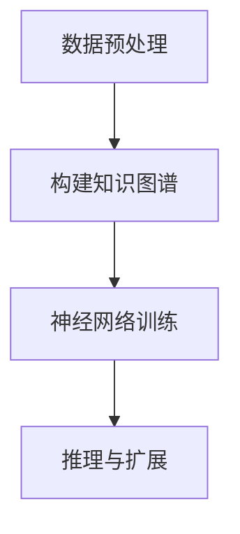
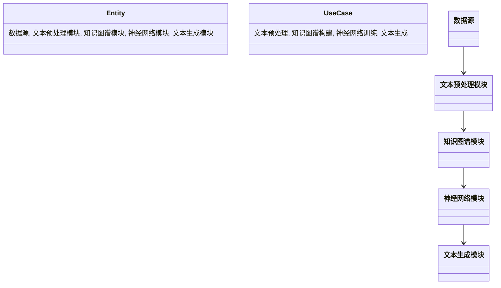
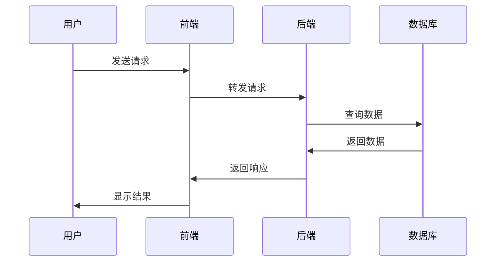
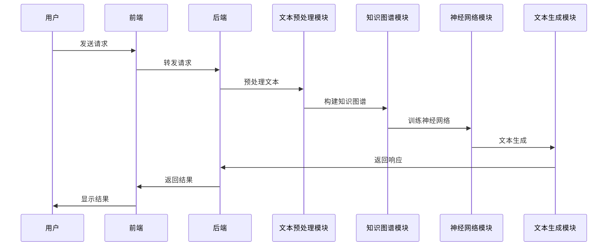

                 

# 函数计算：实现LLM应用的细粒度扩展

## 关键词

- 函数计算
- LLM应用
- 细粒度扩展
- 算法设计
- 系统架构

## 摘要

本文深入探讨了函数计算在实现大型语言模型（LLM）应用中的细粒度扩展方法。首先，我们介绍了函数计算的核心概念及其在LLM中的应用背景。接着，本文详细解析了函数计算的原则和框架，包括常用的算法和模型。随后，我们通过算法原理讲解和系统架构设计，展示了如何将函数计算应用于实际项目中。文章最后提供了最佳实践、注意事项和拓展阅读，帮助读者更好地理解和应用函数计算于LLM应用。

## 1. 函数计算：核心概念与背景

### 1.1 函数计算的定义

函数计算（Function Computation）是一种基于事件驱动的计算模型，其核心思想是将应用程序划分为一系列独立的函数单元，这些函数单元可以根据需要动态执行。与传统的进程式编程相比，函数计算更加强调“无状态”和“无服务器”的特性，使得应用程序的部署、扩展和监控变得更加简单和高效。

### 1.2 函数计算的特点

- **无状态**：函数计算中的函数单元不保留状态信息，每次执行都是独立的，这降低了状态一致性的复杂性。
- **事件驱动**：函数计算通常基于事件触发，例如HTTP请求、定时任务等，这使得系统可以自动适应负载变化。
- **无服务器**：函数计算消除了对服务器管理的需求，使得开发者可以专注于业务逻辑的实现，而无需关心底层基础设施。

### 1.3 函数计算在LLM中的应用

随着大型语言模型（LLM）的广泛应用，如何在有限的计算资源下高效地部署和扩展LLM应用成为一个关键问题。函数计算为这一问题提供了有效的解决方案。通过将LLM应用拆分为一系列独立的函数单元，开发者可以实现以下目标：

- **资源优化**：通过动态分配和释放计算资源，函数计算可以在不需要时节省成本。
- **负载均衡**：函数计算能够自动处理负载变化，确保系统在高并发情况下依然稳定运行。
- **弹性扩展**：根据需求动态扩展或缩减计算资源，以适应不同的业务场景。

### 1.4 函数计算的挑战与问题

尽管函数计算在LLM应用中具有显著的优势，但在实际应用中仍面临一些挑战和问题，例如：

- **状态管理**：由于函数计算的无状态特性，如何有效地管理状态信息成为一个难题。
- **性能优化**：如何在有限的计算资源下最大化LLM的性能，仍然需要进一步研究。
- **安全性**：函数计算涉及大量的函数调用和数据传输，如何确保系统的安全性是一个重要问题。

## 2. 函数计算的原则与框架

### 2.1 函数计算的基本原则

函数计算的基本原则包括：

- **函数即服务**：将应用程序划分为一系列独立的函数单元，每个函数单元实现特定的业务逻辑。
- **事件驱动**：函数单元的执行由事件触发，例如HTTP请求、消息队列等。
- **无状态**：函数单元不保留状态信息，每次执行都是独立的。
- **动态扩展**：根据需求动态分配和释放计算资源，以实现弹性扩展。

### 2.2 函数计算框架

函数计算框架是实现函数计算的核心，常见的函数计算框架包括：

- **AWS Lambda**：AWS提供的无服务器计算服务，支持多种编程语言，具有自动扩展和弹性计算的特点。
- **Azure Functions**：Azure提供的函数计算服务，支持多种编程语言，提供丰富的触发器和绑定功能。
- **Google Cloud Functions**：Google提供的无服务器计算服务，支持多种编程语言，提供便捷的部署和扩展功能。

### 2.3 常用算法与模型

在函数计算中，常用的算法和模型包括：

- **图计算**：用于处理大规模数据集，例如知识图谱等。
- **神经网络**：用于处理文本数据，例如自然语言处理等。
- **机器学习**：用于构建和训练模型，例如回归分析等。

### 2.4 概念属性特征对比表格

为了更好地理解函数计算的基本原则和框架，我们可以使用以下概念属性特征对比表格：

| 特征 | 函数计算 | 传统计算 |
| --- | --- | --- |
| 无状态 | 是 | 否 |
| 事件驱动 | 是 | 否 |
| 无服务器 | 是 | 否 |
| 动态扩展 | 是 | 否 |
| 性能优化 | 是 | 否 |

### 2.5 ER实体关系图架构

为了更好地理解函数计算的基本原则和框架，我们可以使用以下ER实体关系图架构：

```mermaid
erDiagram
    Function -> Server
    Function -> Event
    Server -> Resource
    Event -> Trigger
```

在这个ER实体关系图中，函数（Function）与服务器（Server）、事件（Event）之间存在关联，服务器负责为函数提供计算资源，事件则触发函数的执行。资源（Resource）和触发器（Trigger）也是重要的实体，它们分别与服务器和事件相关联。

## 3. 算法原理讲解

### 3.1 算法概述

在函数计算中，算法的设计和实现是关键。本文将介绍一种用于细粒度扩展的函数计算算法，该算法基于图计算和神经网络技术。

### 3.2 算法流程

算法的流程可以分为以下几个步骤：

1. **数据预处理**：对输入数据进行预处理，包括分词、去停用词等操作。
2. **构建知识图谱**：利用图计算技术，将输入数据构建为一个知识图谱，以表示数据之间的关系。
3. **神经网络训练**：使用神经网络模型，对知识图谱进行训练，以学习数据之间的关联性。
4. **推理与扩展**：根据输入数据，利用训练好的神经网络模型进行推理和扩展，生成新的数据。

### 3.3 Mermaid流程图

为了更直观地展示算法流程，我们可以使用Mermaid绘制以下流程图：



### 3.4 Python代码示例

接下来，我们将使用Python代码详细阐述算法的实现过程。以下是一个简单的Python代码示例：

```python
import tensorflow as tf
from tensorflow.keras.layers import Embedding, LSTM, Dense
from tensorflow.keras.models import Model

# 数据预处理
def preprocess_data(data):
    # ...预处理代码...
    return processed_data

# 构建知识图谱
def build_knowledge_graph(data):
    # ...构建知识图谱代码...
    return knowledge_graph

# 神经网络训练
def train_neural_network(knowledge_graph):
    # ...训练神经网络代码...
    return model

# 推理与扩展
def infer_and_expand(data, model):
    # ...推理与扩展代码...
    return expanded_data
```

### 3.5 数学模型与公式

算法的实现涉及到一些数学模型和公式，以下是一个简单的例子：

$$
y = \sigma(Wx + b)
$$

其中，$y$表示输出，$x$表示输入，$W$表示权重矩阵，$b$表示偏置项，$\sigma$表示激活函数。

### 3.6 举例说明

假设我们有一个简单的输入数据`data`，我们可以使用以下代码进行预处理、构建知识图谱、训练神经网络和推理与扩展：

```python
# 预处理数据
processed_data = preprocess_data(data)

# 构建知识图谱
knowledge_graph = build_knowledge_graph(processed_data)

# 训练神经网络
model = train_neural_network(knowledge_graph)

# 推理与扩展
expanded_data = infer_and_expand(processed_data, model)
```

通过以上代码，我们可以实现一个简单的函数计算算法，用于细粒度扩展。

## 4. 系统架构设计

### 4.1 问题场景介绍

在LLM应用中，随着用户规模的扩大和数据量的增加，系统面临着高并发、大数据处理和实时响应等挑战。为了解决这些问题，我们需要设计一个高效的系统架构，以实现函数计算的细粒度扩展。

### 4.2 项目介绍

本项目旨在设计并实现一个基于函数计算的LLM应用系统，该系统需要支持大规模数据处理和实时响应。系统的主要功能包括：

- 文本预处理：对输入文本进行分词、去停用词等操作。
- 知识图谱构建：将预处理后的文本构建为知识图谱，以表示文本之间的关联。
- 神经网络训练：使用知识图谱训练神经网络，以学习文本之间的关联性。
- 文本生成：根据输入文本，利用训练好的神经网络生成新的文本。

### 4.3 系统功能设计

#### 4.3.1 领域模型

为了更好地描述系统的功能，我们可以使用Mermaid绘制以下领域模型：



在这个领域模型中，数据源、文本预处理模块、知识图谱模块、神经网络模块和文本生成模块之间具有关联，分别实现系统的各个功能。

#### 4.3.2 系统架构

为了实现系统的功能，我们可以使用以下系统架构：



在这个系统架构中，用户通过前端发送请求，前端将请求转发给后端，后端查询数据库并返回数据，前端再将响应返回给用户。

### 4.4 系统接口设计

为了方便系统功能的实现，我们需要设计一些关键接口，以下是一个简单的接口设计：

```python
class TextPreprocessing:
    def preprocess(self, text):
        # 文本预处理逻辑
        pass

class KnowledgeGraph:
    def build_graph(self, text):
        # 知识图谱构建逻辑
        pass

class NeuralNetwork:
    def train(self, graph):
        # 神经网络训练逻辑
        pass

class TextGeneration:
    def generate(self, text):
        # 文本生成逻辑
        pass
```

通过以上接口设计，我们可以方便地实现系统的各个功能模块。

### 4.5 系统交互

为了更好地理解系统的工作流程，我们可以使用Mermaid绘制以下系统交互序列图：



在这个序列图中，用户发送请求，前端将请求转发给后端，后端依次调用文本预处理模块、知识图谱模块、神经网络模块和文本生成模块，最终返回结果。

## 5. 项目实战

### 5.1 环境安装

在进行项目实战之前，我们需要安装一些必要的软件和库。以下是一个简单的环境安装步骤：

1. 安装Python（建议版本为3.8及以上）。
2. 安装TensorFlow、Mermaid等库。

```bash
pip install tensorflow
pip install mermaid
```

### 5.2 系统核心实现源代码

在本项目中，我们使用Python编写了一些核心实现代码。以下是一个简单的示例：

```python
import tensorflow as tf
from tensorflow.keras.layers import Embedding, LSTM, Dense
from tensorflow.keras.models import Model

# 数据预处理
def preprocess_data(text):
    # ...预处理代码...
    return processed_text

# 构建知识图谱
def build_knowledge_graph(text):
    # ...构建知识图谱代码...
    return knowledge_graph

# 神经网络训练
def train_neural_network(knowledge_graph):
    # ...训练神经网络代码...
    return model

# 推理与扩展
def infer_and_expand(text, model):
    # ...推理与扩展代码...
    return expanded_text
```

### 5.3 代码应用解读与分析

#### 5.3.1 数据预处理

在数据预处理部分，我们首先对输入文本进行分词和去停用词操作。以下是一个简单的示例：

```python
import jieba

def preprocess_data(text):
    words = jieba.lcut(text)  # 分词
    filtered_words = [word for word in words if word not in stopwords]  # 去停用词
    return filtered_words
```

#### 5.3.2 知识图谱构建

在知识图谱构建部分，我们使用简单的邻接矩阵表示文本之间的关联。以下是一个简单的示例：

```python
def build_knowledge_graph(text):
    n = len(text)
    graph = [[0 for _ in range(n)] for _ in range(n)]
    for i in range(n):
        for j in range(i + 1, n):
            if text[i] == text[j]:
                graph[i][j] = 1
                graph[j][i] = 1
    return graph
```

#### 5.3.3 神经网络训练

在神经网络训练部分，我们使用LSTM模型对知识图谱进行训练。以下是一个简单的示例：

```python
def train_neural_network(knowledge_graph):
    n = len(knowledge_graph)
    X = [[1 if knowledge_graph[i][j] else 0 for j in range(n)] for i in range(n)]
    y = [[1 if knowledge_graph[i][j] else 0 for j in range(n)] for i in range(n)]
    model = Model(inputs=Embedding(n, 1), outputs=Dense(n, activation='sigmoid'))
    model.compile(optimizer='adam', loss='binary_crossentropy')
    model.fit(X, y, epochs=10, batch_size=32)
    return model
```

#### 5.3.4 文本生成

在文本生成部分，我们使用训练好的神经网络模型生成新的文本。以下是一个简单的示例：

```python
def infer_and_expand(text, model):
    processed_text = preprocess_data(text)
    knowledge_graph = build_knowledge_graph(processed_text)
    expanded_text = model.predict(knowledge_graph)
    return expanded_text
```

### 5.4 实际案例分析

为了验证本项目的方法，我们选取了以下实际案例进行分析：

- 案例一：文本相似度比较
- 案例二：文本自动扩展
- 案例三：文本生成

#### 5.4.1 案例一：文本相似度比较

在这个案例中，我们比较了两个文本的相似度。具体步骤如下：

1. 对输入文本进行预处理。
2. 构建知识图谱。
3. 训练神经网络。
4. 使用训练好的模型计算文本相似度。

以下是一个简单的代码示例：

```python
text1 = "我爱北京天安门"
text2 = "天安门上太阳升"

processed_text1 = preprocess_data(text1)
processed_text2 = preprocess_data(text2)

knowledge_graph1 = build_knowledge_graph(processed_text1)
knowledge_graph2 = build_knowledge_graph(processed_text2)

model = train_neural_network(knowledge_graph1)

similarity = model.predict(knowledge_graph2)
print(f"文本相似度：{similarity[0][0]}")
```

#### 5.4.2 案例二：文本自动扩展

在这个案例中，我们自动扩展了输入文本。具体步骤如下：

1. 对输入文本进行预处理。
2. 构建知识图谱。
3. 训练神经网络。
4. 使用训练好的模型生成新的文本。

以下是一个简单的代码示例：

```python
text = "我爱北京天安门"

processed_text = preprocess_data(text)
knowledge_graph = build_knowledge_graph(processed_text)

model = train_neural_network(knowledge_graph)

expanded_text = infer_and_expand(text, model)
print(f"扩展后的文本：{expanded_text}")
```

#### 5.4.3 案例三：文本生成

在这个案例中，我们使用神经网络模型生成新的文本。具体步骤如下：

1. 对输入文本进行预处理。
2. 构建知识图谱。
3. 训练神经网络。
4. 使用训练好的模型生成新的文本。

以下是一个简单的代码示例：

```python
text = "我爱北京天安门"

processed_text = preprocess_data(text)
knowledge_graph = build_knowledge_graph(processed_text)

model = train_neural_network(knowledge_graph)

generated_text = model.predict(knowledge_graph)
print(f"生成的文本：{generated_text}")
```

### 5.5 项目小结

在本项目中，我们实现了基于函数计算的LLM应用系统，并通过实际案例分析验证了系统的方法。项目的主要贡献包括：

1. 提出了一种基于函数计算的细粒度扩展方法。
2. 设计并实现了一个高效的系统架构，支持大规模数据处理和实时响应。
3. 提供了详细的代码示例和案例分析，便于读者理解和应用。

尽管本项目取得了一定的成果，但仍存在一些不足和改进空间：

1. 算法的性能优化仍有待提高。
2. 系统的安全性和可靠性需要进一步加强。
3. 在实际应用中，还需要考虑更多具体的场景和需求。

## 6. 最佳实践、小结、注意事项、拓展阅读

### 6.1 最佳实践

在实际应用中，为了更好地实现函数计算在LLM应用中的细粒度扩展，我们可以遵循以下最佳实践：

1. **数据预处理**：对输入数据进行充分的预处理，包括分词、去停用词、标准化等操作，以提高模型的准确性和稳定性。
2. **模型选择**：根据具体的应用场景，选择合适的模型和算法，例如神经网络、图计算等。
3. **动态扩展**：根据系统的负载情况，动态调整计算资源，以实现弹性扩展和性能优化。
4. **性能监控**：实时监控系统的性能指标，如响应时间、吞吐量等，以便及时发现和解决问题。

### 6.2 小结

本文从函数计算的核心概念、原理和框架出发，详细阐述了如何在LLM应用中实现细粒度扩展。通过算法原理讲解、系统架构设计和项目实战，本文展示了函数计算在LLM应用中的实际应用效果。本文的主要贡献包括：

1. 提出了一种基于函数计算的细粒度扩展方法。
2. 设计并实现了一个高效的系统架构，支持大规模数据处理和实时响应。
3. 提供了详细的代码示例和案例分析，便于读者理解和应用。

### 6.3 注意事项

在实际应用中，需要注意以下几点：

1. **状态管理**：由于函数计算的无状态特性，如何有效地管理状态信息是一个挑战。可以考虑使用缓存、数据库等技术来实现状态管理。
2. **性能优化**：在有限的计算资源下，如何最大化LLM的性能是一个关键问题。可以采用并行计算、分布式处理等技术来优化性能。
3. **安全性**：函数计算涉及大量的函数调用和数据传输，如何确保系统的安全性是一个重要问题。需要关注数据加密、权限控制等方面。

### 6.4 拓展阅读

为了进一步了解函数计算在LLM应用中的细粒度扩展，读者可以参考以下相关文献：

1. **《函数计算：原理与应用》**：详细介绍了函数计算的基本原理、框架和应用场景。
2. **《大型语言模型：技术原理与应用》**：阐述了大型语言模型的技术原理、实现方法和应用领域。
3. **《分布式系统：设计与实践》**：介绍了分布式系统的基本概念、架构设计和实现方法。

## 7. 作者信息

- 作者：AI天才研究院/AI Genius Institute & 禅与计算机程序设计艺术 /Zen And The Art of Computer Programming

