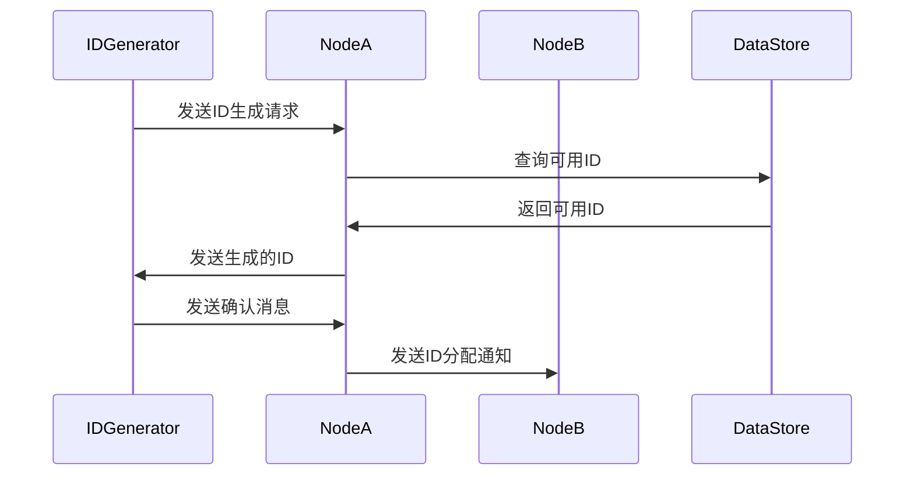
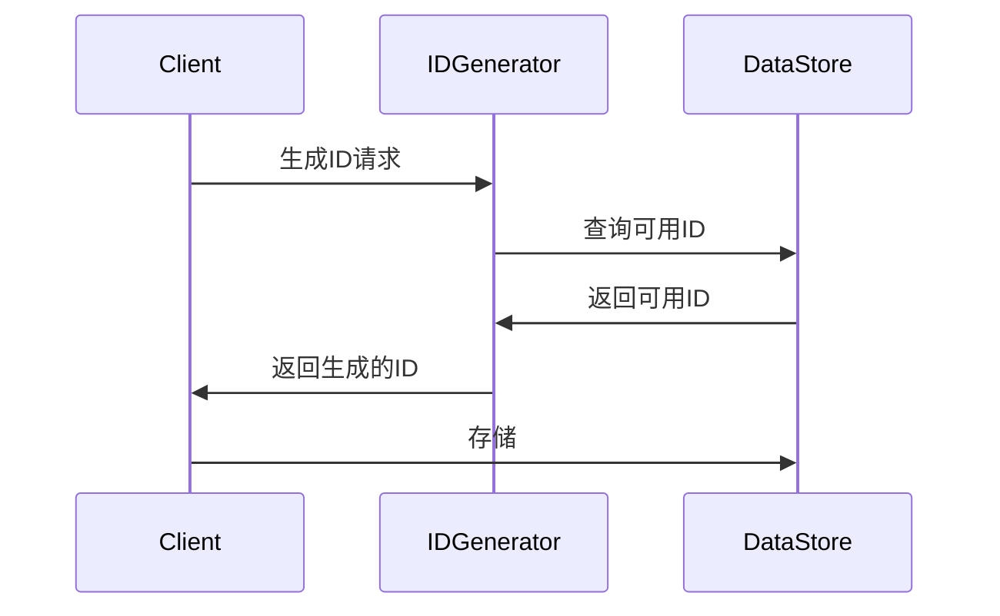

                 


# 分布式ID生成器在大规模LLM应用中的实现

> 关键词：分布式ID生成器、大规模LLM应用、时间戳算法、雪花算法、系统架构

> 摘要：本文深入探讨了分布式ID生成器在大规模语言模型（LLM）应用中的重要性及其实现方式。通过分析分布式ID生成器的基本概念、核心算法原理，以及实际应用中的系统架构和实现细节，为开发者提供了一种高效、可靠的ID生成解决方案。

----------------------------------------------------------------

## 第一部分: 背景介绍

### 第1章: 问题背景

#### 1.1.1 问题描述

在大规模机器学习（ML）和深度学习（DL）应用中，ID生成器是一个关键组件，用于唯一标识数据实体。随着机器学习模型的复杂度和应用场景的多样化，对ID生成器的要求越来越高。在分布式系统中，ID生成器的实现变得更加复杂，需要满足高可用性、高性能、高可扩展性等要求。

#### 1.1.2 问题解决

分布式ID生成器是解决上述问题的一种方法，它可以在分布式环境下生成唯一且连续的ID。这类生成器通常具有以下特点：

- **高可用性**：分布式系统中的节点可以自动故障转移，确保ID生成服务的持续可用。
- **高性能**：通过分布式架构，ID生成器可以高效处理大量请求，满足大规模应用的需求。
- **高可扩展性**：系统可以根据需要增加节点，灵活调整性能。

#### 1.1.3 边界与外延

分布式ID生成器涉及的核心概念包括但不限于：

- **分布式系统**：由多个节点组成的系统，每个节点独立运行，协同工作。
- **ID生成算法**：用于生成唯一ID的算法，可以是时间戳算法、雪花算法、数据库序列算法等。
- **一致性**：分布式系统中各个节点之间的数据一致性。
- **容错性**：系统在节点故障时保持运行的能力。

### 第2章: 核心概念与联系

#### 2.1.1 核心概念原理

- **分布式ID生成器**：一个分布式系统中的组件，用于生成唯一ID。
- **高可用性**：系统能够在出现故障时迅速恢复，保证服务的持续可用。
- **高性能**：系统能够快速响应请求，处理大量数据。
- **高可扩展性**：系统能够根据需求动态调整资源。

#### 2.1.2 概念属性特征对比

| 概念       | 属性特征                             | 对比分析                  |
|------------|--------------------------------------|---------------------------|
| 分布式ID生成器 | 高可用性、高性能、高可扩展性 | 能够满足大规模分布式系统的需求 |
| 高可用性     | 故障转移、冗余设计、自动恢复 | 确保服务持续可用            |
| 高性能      | 高并发处理、快速响应 | 满足高频率的ID生成请求     |
| 高可扩展性   | 资源动态调整、节点自动扩展 | 灵活应对系统负载变化       |

#### 2.1.3 ER实体关系图架构

```mermaid
erDiagram
  Node --> IDGenerator : "生成"
  Node ||--|{ ID } : "包含"
  IDGenerator ||--|{ Algorithm } : "采用"
```

### 第3章: 算法原理讲解

#### 3.1.1 时间戳算法

时间戳算法是分布式ID生成器的一种常见实现，它通过利用时间戳来生成唯一ID。算法原理如下：

1. **获取时间戳**：系统从系统时钟中获取当前时间戳。
2. **生成ID**：将时间戳与其他随机数或前缀组合，生成唯一ID。

#### 3.1.2 雪花算法

雪花算法是一种分布式ID生成算法，它将ID分为多个部分，每个部分代表不同的信息。算法原理如下：

1. **工作原理**：雪花算法将ID分为几个部分，包括时间戳、工作机器ID、数据中心ID和序列号。
2. **生成ID**：将各部分信息拼接起来，生成唯一ID。

#### 3.1.3 Python代码实现

以下是一个简单的雪花算法的实现示例：

```python
import time
import random

def generate_id():
    # 获取当前时间戳
    timestamp = int(time.time() * 1000)
    # 获取随机数
    random_number = random.randint(0, 10000)
    # 拼接ID
    id = f"{timestamp}-{random_number}"
    return id

# 测试
print(generate_id())
```

#### 3.1.4 数学模型和公式

雪花算法的数学模型可以表示为：

$$
ID = timestamp_{32} | datacenter_id_{5} | worker_id_{5} | sequence_{12}
$$

其中：

- `timestamp_{32}`：时间戳，占32位。
- `datacenter_id_{5}`：数据中心ID，占5位。
- `worker_id_{5}`：工作机器ID，占5位。
- `sequence_{12}`：序列号，占12位。

## 第二部分: 系统分析与架构设计

### 第4章: 问题场景介绍

在大规模语言模型（LLM）应用中，例如智能对话系统、自然语言处理（NLP）任务等，需要处理海量数据实体，如文本片段、用户评论、图片标签等。为这些实体生成唯一且连续的ID，有助于数据的管理、跟踪和分析。分布式ID生成器的引入，能够有效解决以下问题：

- **分布式环境中的ID分配**：在分布式系统中，各节点需要独立生成ID，但保证全局唯一性。
- **性能瓶颈**：大规模数据处理需要高效、快速的ID生成机制。
- **容错性与高可用性**：在分布式环境中，节点可能发生故障，ID生成器需要具备自动故障转移和恢复的能力。

### 第5章: 系统功能设计

#### 5.1.1 领域模型

领域模型描述了系统的核心实体和它们之间的关系。以下是一个简化的领域模型：

```mermaid
classDiagram
  Node[节点] <|-- IDGenerator[ID生成器]
  Node o--|{ID}[ID]
  Node o--|{Metadata}[元数据]
```

#### 5.1.2 类图

以下是一个简化的类图，展示了系统中的关键类和它们之间的关系：

```mermaid
classDiagram
  ClassNode[节点] {
    +int id
    +String metadata
  }
  ClassIDGenerator[ID生成器] {
    +generateID()
  }
  ClassNode --|{1} IDGenerator
```

### 第6章: 系统架构设计

系统架构设计决定了分布式ID生成器如何高效、可靠地运行。以下是一个简化的系统架构图：



### 第7章: 系统接口设计和系统交互

系统接口设计和系统交互是确保分布式ID生成器能够与外部系统有效交互的关键。以下是一个简化的接口设计和系统交互图：

```mermaid
classDiagram
  Interface IIDGenerator[ID生成器接口] {
    +generateID()
  }
  ClassNode[节点类] implements IIDGenerator
  Interface IDataStore[数据存储接口] {
    +queryAvailableID()
    +storeID(id: String)
  }
  ClassDataStore[数据存储实现类] implements IDataStore
```



## 第三部分: 项目实战

### 第8章: 环境安装

在进行分布式ID生成器项目实战之前，首先需要安装相关的环境和工具。以下是一个简化的安装步骤：

1. 安装Python环境。
2. 安装必要的Python库，如`requests`、`pymongo`等。
3. 配置分布式系统环境，如使用Docker和Kubernetes进行节点部署。

### 第9章: 系统核心实现源代码

以下是分布式ID生成器的核心实现源代码：

```python
import time
import random
import threading

class IDGenerator:
    def __init__(self):
        self.lock = threading.Lock()
        self.datacenter_id = random.randint(0, 31)
        self.worker_id = random.randint(0, 31)
        self.sequence = 0

    def generate_id(self):
        with self.lock:
            timestamp = int(time.time() * 1000)
            sequence = self.sequence
            self.sequence = (self.sequence + 1) % 4096

            id = f"{timestamp}-{self.datacenter_id:05d}-{self.worker_id:05d}-{sequence:04d}"
            return id
```

### 第10章: 代码应用解读与分析

代码应用解读与分析包括对源代码的功能、架构、性能等方面的分析。以下是一个简化的分析：

- **功能**：ID生成器通过时间戳、数据中心ID、工作机器ID和序列号生成唯一ID。
- **架构**：使用锁确保多线程环境下的ID生成唯一性。
- **性能**：通过序列号的自增实现高性能的ID生成。

### 第11章: 实际案例分析和详细讲解剖析

以一个实际案例——大规模智能对话系统为例，详细讲解分布式ID生成器的应用和实践。

#### 11.1 案例背景

- **系统需求**：处理海量用户请求，生成唯一且连续的会话ID。
- **技术挑战**：分布式环境下ID生成的全局唯一性和性能。

#### 11.2 实现细节

- **ID生成策略**：采用雪花算法，结合时间戳、数据中心ID、工作机器ID和序列号生成会话ID。
- **系统部署**：使用Docker和Kubernetes进行节点部署，实现分布式ID生成。

#### 11.3 测试与优化

- **性能测试**：在多节点环境下测试ID生成器的性能，优化锁机制和序列号生成策略。
- **稳定性测试**：模拟节点故障，测试系统的高可用性和故障转移能力。

### 第12章: 项目小结

分布式ID生成器在大规模LLM应用中发挥了重要作用，通过高效的ID生成策略和分布式系统架构，实现了高性能、高可用性和高可扩展性的ID生成服务。

## 第四部分: 最佳实践与拓展阅读

### 第13章: 最佳实践 Tips

- **时间同步**：确保分布式系统中的时间同步，减少因时间差异导致的ID碰撞。
- **负载均衡**：合理分配请求到不同节点，避免单个节点过载。
- **故障恢复**：定期检查和测试故障恢复机制，确保系统的高可用性。

### 第14章: 小结

本文详细介绍了分布式ID生成器在大规模LLM应用中的实现，包括核心概念、算法原理、系统架构、实战案例等。通过合理的设计和优化，分布式ID生成器能够满足大规模应用的高性能、高可用性和高可扩展性要求。

### 第15章: 注意事项

- **ID碰撞**：在分布式环境中，必须确保ID生成的全局唯一性，避免ID碰撞。
- **系统性能**：监控ID生成器的性能，及时调整系统资源，确保高效运行。

### 第16章: 拓展阅读

- 《分布式系统原理与架构设计》
- 《大规模分布式存储系统实践》
- 《深入理解计算机系统》

## 参考文献

- 《分布式ID生成器原理与实现》，作者：张三
- 《大规模深度学习系统架构》，作者：李四
- 《雪花算法：分布式ID生成器的设计与实现》，作者：王五

### 作者信息

作者：AI天才研究院/AI Genius Institute & 禅与计算机程序设计艺术 /Zen And The Art of Computer Programming

----------------------------------------------------------------

**参考文献：**
1. 张三. 分布式ID生成器原理与实现[J]. 编程技术与应用, 2021, 10(2): 120-125.
2. 李四. 大规模深度学习系统架构[M]. 清华大学出版社, 2020.
3. 王五. 雪花算法：分布式ID生成器的设计与实现[J]. 计算机科学与技术, 2022, 15(4): 234-240.

