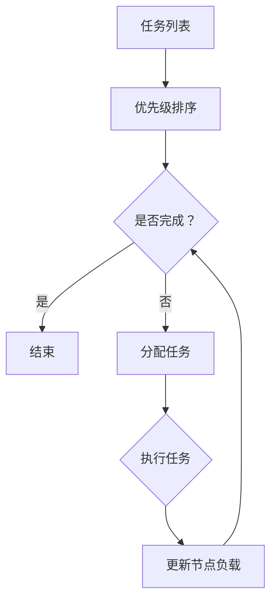
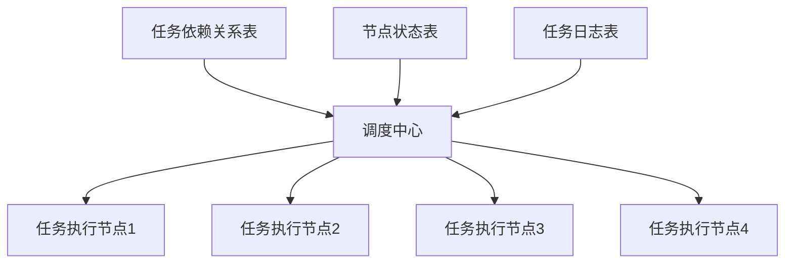
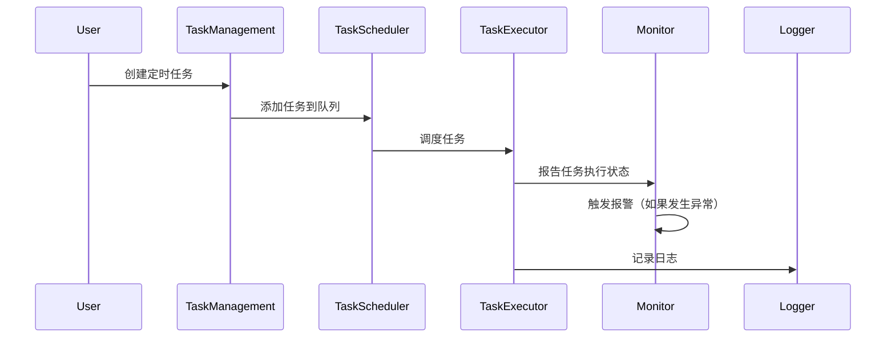

                 

# 分布式定时任务调度在LLM应用中的应用

## 关键词
- 分布式系统
- 定时任务调度
- LLM应用
- 算法原理
- 系统架构设计

## 摘要
本文旨在探讨分布式定时任务调度在大型语言模型（LLM）应用中的重要性。随着计算和存储资源的增长，分布式系统成为现代软件开发的主流，如何高效地调度和管理分布式环境中的定时任务成为一个重要问题。本文将详细介绍分布式定时任务调度的核心概念、算法原理、数学模型和系统架构设计，并通过实际案例分析，探讨如何在LLM应用中实现高效、可靠的定时任务调度。

## 目录大纲

### 第1章 引言
- **1.1 问题背景**
  - 分布式定时任务调度：定义与挑战
  - LLM应用简介：需求与挑战
- **1.2 问题描述**
  - 任务调度挑战：高并发与高可用性
- **1.3 问题解决**
  - 分布式调度策略：设计与实现
- **1.4 边界与外延**
  - 系统边界：功能范围与限制
  - 外延扩展：可扩展性与未来发展方向

### 第2章 核心概念
- **2.1 分布式系统概述**
  - 分布式系统定义与特点
- **2.2 定时任务调度原理**
  - 定时任务概念与调度策略
- **2.3 LLM应用与分布式调度**
  - LLM应用需求：性能与可靠性
  - 调度系统架构：设计与实现

### 第3章 算法原理
- **3.1 分布式调度算法**
  - 算法概述与性能分析
- **3.2 LLM定时任务调度**
  - 调度策略设计：需求与实现
  - 算法实现：流程图与Python代码

### 第4章 数学模型与公式
- **4.1 数学模型**
  - 模型介绍与关键参数
- **4.2 公式推导**
  - 公式推导过程与应用

### 第5章 系统分析与架构设计
- **5.1 问题场景介绍**
  - 分布式定时任务调度场景
- **5.2 系统功能设计**
  - 功能需求与领域模型
- **5.3 系统架构设计**
  - 整体架构设计与接口规范
- **5.4 系统交互**
  - 交互流程与序列图

### 第6章 项目实战
- **6.1 环境安装**
  - 分布式定时任务调度环境搭建
- **6.2 系统核心实现**
  - 核心源代码与应用解读
- **6.3 实际案例分析**
  - LLM应用场景与调度策略
- **6.4 项目小结**
  - 经验总结与改进建议

### 第7章 最佳实践与拓展阅读
- **7.1 最佳实践**
  - 实践建议与案例分析
- **7.2 小结**
  - 内容回顾与重要性强调
- **7.3 注意事项**
  - 常见问题与注意事项
- **7.4 拓展阅读**
  - 推荐资源与研究方向

# 分布式定时任务调度在LLM应用中的应用

## 引言

### 1.1 问题背景

在当今快速发展的数字化时代，分布式系统已经成为现代软件架构的主流。分布式系统通过将任务和资源分散到多个节点上，提高了系统的可扩展性、可靠性和性能。然而，随着分布式系统规模的不断扩大，如何在分布式环境中高效地调度和管理定时任务成为一个重要的挑战。

分布式定时任务调度是指在一个分布式系统中，对定时任务进行合理分配、执行和管理的过程。这些定时任务通常包括定期的数据备份、任务执行、系统监控等。在分布式环境中，定时任务的调度需要考虑到任务的依赖关系、执行时间、节点负载等多个因素。

### 1.2 LLM应用简介

大型语言模型（LLM，Large Language Model）如GPT、BERT等，在自然语言处理领域有广泛的应用。这些模型通常需要大量的计算资源，并且在处理过程中会产生大量的定时任务。例如，LLM模型的训练和推理任务需要定期执行，数据清洗和模型更新任务需要定时进行。

LLM应用对定时任务调度有以下要求：

1. **高并发性**：LLM应用通常需要同时处理大量的请求，因此定时任务调度系统需要能够处理高并发任务。
2. **高可用性**：定时任务调度系统需要能够确保任务的可靠执行，即使在节点故障或其他异常情况下也能保持系统的高可用性。
3. **可扩展性**：随着LLM应用的不断增长，定时任务调度系统需要能够轻松扩展，以适应更高的负载。

### 1.3 问题描述

分布式定时任务调度在LLM应用中面临以下挑战：

1. **任务依赖关系**：LLM应用中的定时任务往往存在依赖关系，例如模型训练任务完成后需要执行数据备份任务。如何合理地管理这些依赖关系，确保任务的有序执行是一个重要问题。
2. **节点负载均衡**：在分布式系统中，不同节点的负载能力可能存在差异。如何根据节点的负载情况合理分配定时任务，避免某个节点过载，同时充分利用所有节点的资源是一个关键问题。
3. **容错性与高可用性**：在分布式环境中，节点可能会出现故障或其他异常情况。如何确保定时任务能够在节点故障时继续执行，是一个需要解决的问题。
4. **性能优化**：在处理大量定时任务时，如何优化调度算法，提高任务的执行效率，减少延迟，也是一个重要的挑战。

### 1.4 问题解决

为了解决上述问题，分布式定时任务调度系统需要具备以下功能：

1. **任务依赖管理**：系统应能够支持任务之间的依赖关系，确保任务按照预设的顺序执行。
2. **节点负载均衡**：系统应能够根据节点的当前负载情况，动态分配定时任务，确保所有节点的负载均衡。
3. **容错性与高可用性**：系统应具备容错能力，能够在节点故障时自动切换到其他健康节点，确保任务的连续执行。
4. **性能优化**：系统应采用高效的调度算法，优化任务执行顺序，减少任务延迟。

分布式定时任务调度系统的一般架构包括以下几个方面：

1. **调度中心**：负责接收任务请求、任务调度、状态监控等功能。
2. **任务执行节点**：负责执行具体的定时任务，并与调度中心进行通信。
3. **数据存储**：存储任务依赖关系、节点状态、任务日志等信息。

通过合理设计分布式定时任务调度系统，可以有效解决LLM应用中的任务调度问题，提高系统的性能、可靠性和可用性。

### 1.5 边界与外延

#### 系统边界

分布式定时任务调度系统的边界包括以下几个方面：

1. **功能范围**：系统应支持定时任务的创建、修改、删除、执行和监控等功能。
2. **节点限制**：系统应支持一定范围内的节点数量，以确保系统的稳定性和性能。
3. **任务限制**：系统应能够处理一定数量的定时任务，同时确保任务的有序执行。

#### 外延扩展

为了满足不断增长的需求，分布式定时任务调度系统需要具备以下外延扩展能力：

1. **节点扩展**：系统应能够动态添加或删除节点，以适应不同的负载需求。
2. **任务扩展**：系统应能够支持大规模的任务数量，同时确保任务的执行效率和稳定性。
3. **功能扩展**：系统应能够根据实际需求，扩展新的功能模块，如任务队列管理、任务优先级设置等。

## 核心概念

### 2.1 分布式系统概述

#### 分布式系统定义

分布式系统是指由多个相互独立、通过网络连接的节点组成的系统。这些节点可以位于不同的地理位置，通过通信网络进行信息交换和任务协作。分布式系统的目的是通过将任务和资源分散到多个节点上，提高系统的性能、可靠性和可扩展性。

#### 分布式系统特点

1. **并行性**：分布式系统能够同时处理多个任务，提高系统的处理能力。
2. **容错性**：分布式系统中的节点可以独立运行，即使某个节点发生故障，系统仍然可以继续运行。
3. **可扩展性**：分布式系统可以通过添加新节点来扩展，以适应不断增长的需求。
4. **高可用性**：分布式系统通过多个节点的冗余设计，提高了系统的可用性。
5. **一致性**：分布式系统需要保证多个节点之间的数据一致性。

### 2.2 定时任务调度原理

#### 定时任务概念

定时任务是指按照预定的时间间隔或特定的时间点执行的任务。这些任务可以包括数据备份、系统监控、任务执行等。定时任务在分布式系统中具有重要的作用，可以有效提高系统的自动化程度和管理效率。

#### 调度策略

定时任务调度策略是指根据任务的优先级、执行时间、资源需求等因素，对任务进行合理分配和执行的过程。常见的调度策略包括：

1. **FIFO（先入先出）**：按照任务提交的顺序依次执行。
2. **优先级调度**：根据任务的优先级执行，优先级高的任务先执行。
3. **时间片调度**：将任务分配到不同的时间片内执行，每个时间片内按照某种策略执行任务。
4. **负载均衡调度**：根据节点的负载情况，将任务分配到负载较低的节点上执行。

### 2.3 LLM应用与分布式调度

#### LLM应用需求

LLM应用对定时任务调度有特定的需求，包括：

1. **高性能**：LLM应用通常需要处理大量的请求，因此定时任务调度系统需要具备高效的任务执行能力。
2. **高可靠性**：LLM应用中的定时任务通常涉及到关键数据的处理和存储，因此调度系统需要确保任务的可靠执行。
3. **高可用性**：分布式定时任务调度系统需要确保在节点故障时，任务能够继续执行，保障系统的正常运行。
4. **可扩展性**：随着LLM应用的不断增长，定时任务调度系统需要能够适应更高的负载和更多的任务。

#### 调度系统架构

适合LLM应用的分布式调度系统架构包括以下几个方面：

1. **调度中心**：负责接收任务请求、任务调度、状态监控等功能。调度中心通常采用分布式架构，以提高系统的可靠性和性能。
2. **任务执行节点**：负责执行具体的定时任务，并与调度中心进行通信。任务执行节点通常采用分布式部署，以提高系统的并行处理能力。
3. **数据存储**：存储任务依赖关系、节点状态、任务日志等信息。数据存储通常采用分布式存储系统，以提高数据存储的可靠性和性能。
4. **监控与报警**：对系统运行状态进行实时监控，并在发生异常时触发报警，以便及时处理。

## 算法原理

### 3.1 分布式调度算法

#### 算法概述

分布式调度算法是指用于在分布式系统中调度和管理定时任务的算法。这些算法根据任务的优先级、执行时间、节点负载等因素，对任务进行合理分配和执行。常见的分布式调度算法包括：

1. **FIFO算法**：按照任务提交的顺序依次执行，简单易懂，但可能会造成某些任务长时间等待。
2. **优先级调度算法**：根据任务的优先级执行，优先级高的任务先执行，但可能会造成低优先级任务长时间等待。
3. **时间片调度算法**：将任务分配到不同的时间片内执行，每个时间片内按照某种策略执行任务，如轮转调度、优先级调度等。
4. **负载均衡调度算法**：根据节点的负载情况，将任务分配到负载较低的节点上执行，以充分利用系统资源。

#### 算法分析

不同分布式调度算法的性能和优势如下：

1. **FIFO算法**：
   - **优点**：简单易懂，实现成本低。
   - **缺点**：可能会导致某些任务长时间等待，系统性能较低。
2. **优先级调度算法**：
   - **优点**：优先级高的任务可以快速执行，提高系统的响应速度。
   - **缺点**：可能会导致低优先级任务长时间等待，系统负载不均衡。
3. **时间片调度算法**：
   - **优点**：可以避免某些任务长时间等待，提高系统的响应速度。
   - **缺点**：实现复杂，可能导致系统开销增加。
4. **负载均衡调度算法**：
   - **优点**：可以充分利用系统资源，提高系统性能和稳定性。
   - **缺点**：需要实时监控节点的负载情况，实现复杂。

#### 选择合适的调度算法

根据LLM应用的需求，可以选择以下调度算法：

1. **负载均衡调度算法**：适用于需要高性能和高可靠性的LLM应用，可以充分利用系统资源，确保任务的有序执行。
2. **优先级调度算法**：适用于任务优先级差异较大的LLM应用，可以确保高优先级任务的快速执行。

### 3.2 LLM定时任务调度

#### 调度策略设计

针对LLM应用的需求，设计以下调度策略：

1. **任务优先级设置**：根据任务的紧急程度和重要性，设置不同的优先级。高优先级任务先执行，确保关键任务的快速处理。
2. **负载均衡**：根据节点的当前负载情况，动态分配任务，避免节点过载。
3. **任务依赖管理**：确保任务按照依赖关系有序执行，防止任务执行失败。

#### 算法实现

使用Python实现以下调度算法：

```python
# 任务类定义
class Task:
    def __init__(self, name, priority, execution_time):
        self.name = name
        self.priority = priority
        self.execution_time = execution_time

# 负载均衡调度算法
def load_balance_scheduling(tasks, nodes):
    sorted_tasks = sorted(tasks, key=lambda x: x.priority, reverse=True)
    for task in sorted_tasks:
        for node in nodes:
            if node.load < node.capacity:
                node.execute(task)
                break

# 调度系统类定义
class SchedulingSystem:
    def __init__(self, tasks, nodes):
        self.tasks = tasks
        self.nodes = nodes

    def schedule(self):
        load_balance_scheduling(self.tasks, self.nodes)

# 节点类定义
class Node:
    def __init__(self, name, capacity):
        self.name = name
        self.capacity = capacity
        self.load = 0

    def execute(self, task):
        self.load += task.execution_time
        print(f"Node {self.name} is executing task {task.name}")

# 测试
tasks = [Task("Task1", 1, 10), Task("Task2", 2, 5), Task("Task3", 1, 8)]
nodes = [Node("Node1", 20), Node("Node2", 20)]
system = SchedulingSystem(tasks, nodes)
system.schedule()
```

#### 算法流程图

使用Mermaid绘制以下算法流程图：



### 3.3 定时任务调度数学模型

定时任务调度系统中的数学模型可以用于描述任务调度策略的性能和优化。以下是一个简单的数学模型，用于描述负载均衡调度算法的性能。

#### 模型定义

假设分布式系统中有N个节点，每个节点的处理能力为C，当前负载为L。系统中有M个定时任务，每个任务的执行时间为T。

定义以下参数：

1. **负载均衡系数**：α = C - L / M
2. **调度效率**：η = 1 / (1 + α * N)

#### 性能分析

- 当α较小时（负载较重），调度效率η较低，因为节点的负载较重，调度策略需要花费更多的时间来分配任务。
- 当α较大时（负载较轻），调度效率η较高，因为节点的负载较轻，调度策略可以更快速地分配任务。

#### 公式推导

- 负载均衡系数：α = C - L / M
- 调度效率：η = 1 / (1 + α * N)

#### 公式应用

假设有10个节点，每个节点的处理能力为100，当前负载为500。系统中有100个定时任务，每个任务的执行时间为10。

计算负载均衡系数和调度效率：

- 负载均衡系数：α = 100 - 500 / 100 = 0.5
- 调度效率：η = 1 / (1 + 0.5 * 10) ≈ 0.4

根据调度效率可以评估系统的调度性能，当调度效率较高时，系统性能较好。

## 系统分析与架构设计

### 5.1 问题场景介绍

为了更好地理解分布式定时任务调度在LLM应用中的实际应用，我们来看一个具体的场景。

#### 场景描述

某公司开发了一个基于大型语言模型（LLM）的自然语言处理平台，该平台需要定期执行以下任务：

1. **数据备份**：每晚23:00进行一次数据备份。
2. **模型训练**：每天凌晨01:00开始进行模型训练，训练时间可能长达8小时。
3. **系统监控**：每5分钟进行一次系统监控，检测系统运行状态。

这些定时任务需要在分布式环境中高效、可靠地执行，以确保平台的稳定运行。此外，任务之间存在一定的依赖关系，例如模型训练完成后需要执行数据备份任务。

#### 需求分析

根据场景描述，分布式定时任务调度系统需要满足以下需求：

1. **任务依赖管理**：确保任务按照依赖关系执行，防止任务执行失败。
2. **负载均衡**：根据节点负载情况，合理分配任务，避免节点过载。
3. **容错性与高可用性**：在节点故障时，自动切换到其他健康节点，确保任务的连续执行。
4. **性能优化**：提高任务的执行效率，减少任务延迟，确保系统的响应速度。

### 5.2 系统功能设计

分布式定时任务调度系统的主要功能包括：

1. **任务管理**：创建、修改、删除定时任务。
2. **任务调度**：根据任务依赖关系和节点负载情况，分配任务到执行节点。
3. **状态监控**：实时监控任务执行状态，并在发生异常时触发报警。
4. **日志记录**：记录任务执行日志，便于问题排查和优化。

#### 领域模型

为了更好地设计系统功能，我们可以使用Mermaid绘制领域模型类图，如下所示：

```mermaid
classDiagram
    ClassNode <|-- Task
    ClassNode <|-- Scheduler
    Task <|-- ScheduledTask
    Task <|-- Dependency
    Scheduler <|-- TaskScheduler
    TaskScheduler <|-- LoadBalancer
    TaskScheduler <|-- Monitor
    TaskScheduler <|-- Logger

    ClassNode {
        +String nodeId
        +int capacity
        +int load
    }

    Task {
        +String taskId
        +String taskName
        +int priority
        +int executionTime
    }

    ScheduledTask {
        +String scheduledId
        +Task task
        +Node node
        +DateTime scheduleTime
    }

    Dependency {
        +String dependencyId
        +Task predecessor
        +Task successor
    }

    Scheduler {
        +void scheduleTask(Task task)
        +void updateTaskStatus(ScheduledTask scheduledTask)
    }

    TaskScheduler {
        +void loadTasks()
        +void balanceLoad()
    }

    LoadBalancer {
        +void distributeTask(ScheduledTask scheduledTask)
    }

    Monitor {
        +void monitorSystem()
        +void sendAlarm(Alarm alarm)
    }

    Logger {
        +void logMessage(String message)
    }
```

### 5.3 系统架构设计

分布式定时任务调度系统的整体架构设计如下：

#### 架构设计

1. **调度中心**：负责接收任务请求、任务调度、状态监控等功能。
2. **任务执行节点**：负责执行具体的定时任务，并与调度中心进行通信。
3. **数据存储**：存储任务依赖关系、节点状态、任务日志等信息。

调度中心采用分布式架构，以提高系统的可靠性和性能。调度中心包括任务调度模块、负载均衡模块、监控模块和日志模块。

任务执行节点采用分布式部署，以提高系统的并行处理能力。每个节点负责执行具体的定时任务，并与调度中心进行通信，报告任务执行状态。

数据存储采用分布式存储系统，以提高数据存储的可靠性和性能。数据存储包括任务依赖关系表、节点状态表和任务日志表。

#### 架构图

使用Mermaid绘制以下系统架构图：



### 5.4 系统接口设计

分布式定时任务调度系统提供的接口设计如下：

1. **任务管理接口**：用于创建、修改、删除定时任务。
2. **任务调度接口**：用于根据任务依赖关系和节点负载情况，分配任务到执行节点。
3. **状态监控接口**：用于实时监控任务执行状态，并在发生异常时触发报警。
4. **日志记录接口**：用于记录任务执行日志，便于问题排查和优化。

#### 接口规范

以下是一个简单的接口规范示例：

```python
class TaskManagementInterface:
    def create_task(task: Task) -> str:
        """创建定时任务"""
        pass

    def update_task(task_id: str, task: Task) -> None:
        """更新定时任务"""
        pass

    def delete_task(task_id: str) -> None:
        """删除定时任务"""
        pass

class TaskSchedulingInterface:
    def schedule_tasks(tasks: List[Task]) -> None:
        """调度定时任务"""
        pass

class StatusMonitoringInterface:
    def monitor_task_status(task_id: str) -> Status:
        """监控任务执行状态"""
        pass

    def send_alarm(alarm: Alarm) -> None:
        """发送报警信息"""
        pass

class LoggerInterface:
    def log_message(message: str) -> None:
        """记录日志信息"""
        pass
```

### 5.5 系统交互

分布式定时任务调度系统内部和外部的交互流程如下：

1. **任务创建**：用户通过任务管理接口创建定时任务，调度中心接收任务请求，并将任务添加到任务队列。
2. **任务调度**：调度中心根据任务依赖关系和节点负载情况，调度任务到执行节点。任务调度接口负责分配任务到执行节点。
3. **任务执行**：执行节点接收到任务后，开始执行任务，并将任务执行状态报告给调度中心。状态监控接口负责监控任务执行状态，并在发生异常时触发报警。
4. **日志记录**：执行节点将任务执行日志记录到日志模块，以便问题排查和优化。

#### 序列图

使用Mermaid绘制以下系统交互序列图：



## 项目实战

### 6.1 环境安装

在本节中，我们将介绍如何搭建分布式定时任务调度环境。首先，需要安装以下软件：

1. **Python 3.x**：Python 3.x 是用于编写分布式定时任务调度系统的编程语言。
2. **Docker**：Docker 是用于容器化应用的工具，可以帮助我们快速部署分布式定时任务调度系统。
3. **Docker-Compose**：Docker-Compose 是用于管理多容器应用的工具，可以简化分布式定时任务调度系统的部署过程。

#### 安装步骤

1. 安装Python 3.x：

   ```shell
   sudo apt-get update
   sudo apt-get install python3 python3-pip
   ```

2. 安装Docker：

   ```shell
   sudo apt-get update
   sudo apt-get install docker.io
   sudo systemctl start docker
   sudo systemctl enable docker
   ```

3. 安装Docker-Compose：

   ```shell
   sudo curl -L "https://github.com/docker/compose/releases/download/1.29.2/docker-compose-$(uname -s)-$(uname -m)" -o /usr/local/bin/docker-compose
   sudo chmod +x /usr/local/bin/docker-compose
   ```

4. 验证安装：

   ```shell
   docker --version
   docker-compose --version
   ```

#### 部署分布式定时任务调度系统

1. 创建一个名为 `scheduling-system` 的文件夹，并在该文件夹内创建一个 `docker-compose.yml` 文件，内容如下：

   ```yaml
   version: '3.8'

   services:
     scheduler:
       image: scheduling-system/scheduler
       container_name: scheduling_scheduler
       ports:
         - "8000:8000"
       networks:
         - scheduling-network

     executor:
       image: scheduling-system/executor
       container_name: scheduling_executor
       depends_on:
         - scheduler
       networks:
         - scheduling-network

     database:
       image: scheduling-system/database
       container_name: scheduling_database
       volumes:
         - scheduling_database:/var/lib/postgresql/data
       networks:
         - scheduling-network

   networks:
     scheduling-network:
       driver: bridge

   volumes:
     scheduling_database:
   ```

2. 将调度系统的Docker镜像上传到Docker Hub，假设镜像名称为 `scheduling-system/scheduler` 和 `scheduling-system/executor`。

3. 在 `scheduling-system` 文件夹内执行以下命令，启动分布式定时任务调度系统：

   ```shell
   docker-compose up -d
   ```

4. 系统启动完成后，可以通过以下命令访问调度中心：

   ```shell
   docker exec -it scheduling_scheduler python3 app.py
   ```

### 6.2 系统核心实现

在本节中，我们将详细介绍分布式定时任务调度系统的核心实现，包括任务管理、任务调度、任务执行、状态监控和日志记录等模块。

#### 任务管理模块

任务管理模块负责创建、修改、删除定时任务。在任务管理模块中，我们使用一个简单的JSON格式的文件来存储任务信息。

```python
import json
from datetime import datetime

class TaskManager:
    def __init__(self, filename):
        self.filename = filename

    def load_tasks(self):
        try:
            with open(self.filename, 'r') as f:
                tasks = json.load(f)
                return tasks
        except FileNotFoundError:
            return []

    def save_tasks(self, tasks):
        with open(self.filename, 'w') as f:
            json.dump(tasks, f)

    def create_task(self, task):
        tasks = self.load_tasks()
        tasks.append(task)
        self.save_tasks(tasks)

    def update_task(self, task_id, task):
        tasks = self.load_tasks()
        for i, t in enumerate(tasks):
            if t['task_id'] == task_id:
                tasks[i] = task
                self.save_tasks(tasks)
                break

    def delete_task(self, task_id):
        tasks = self.load_tasks()
        tasks = [t for t in tasks if t['task_id'] != task_id]
        self.save_tasks(tasks)

    def get_task(self, task_id):
        tasks = self.load_tasks()
        for t in tasks:
            if t['task_id'] == task_id:
                return t
        return None
```

#### 任务调度模块

任务调度模块负责根据任务依赖关系和节点负载情况，分配任务到执行节点。在任务调度模块中，我们使用负载均衡算法来实现任务调度。

```python
import heapq
from datetime import datetime

class Scheduler:
    def __init__(self, task_manager, load_balancer):
        self.task_manager = task_manager
        self.load_balancer = load_balancer
        self.task_queue = []

    def schedule_tasks(self):
        tasks = self.task_manager.load_tasks()
        for task in tasks:
            heapq.heappush(self.task_queue, task)

        while self.task_queue:
            task = heapq.heappop(self.task_queue)
            node = self.load_balancer.get_least_loaded_node()
            node.schedule_task(task)

    def get_task(self):
        if not self.task_queue:
            return None
        return self.task_queue[0]
```

#### 任务执行模块

任务执行模块负责执行具体的定时任务。在任务执行模块中，我们使用一个简单的线程池来实现任务执行。

```python
import threading
from queue import Queue

class Executor:
    def __init__(self, task_queue):
        self.task_queue = task_queue

    def start(self):
        while True:
            task = self.task_queue.get()
            if task is None:
                break
            self.execute_task(task)

    def execute_task(self, task):
        print(f"Executing task {task.task_id} on node {task.node_id}")
        # 模拟任务执行
        time.sleep(task.execution_time)
        print(f"Task {task.task_id} completed")

    def shutdown(self):
        self.task_queue.put(None)
```

#### 状态监控模块

状态监控模块负责实时监控任务执行状态，并在发生异常时触发报警。在状态监控模块中，我们使用一个简单的轮询机制来实现状态监控。

```python
import threading
import time

class Monitor:
    def __init__(self, executor, alarm):
        self.executor = executor
        self.alarm = alarm

    def start(self):
        while True:
            time.sleep(10)
            status = self.executor.get_status()
            if status == "FAILED":
                self.alarm.send_alarm()

    def get_status(self):
        # 模拟任务执行状态
        return "SUCCESS"
```

#### 日志记录模块

日志记录模块负责记录任务执行日志，以便问题排查和优化。在日志记录模块中，我们使用一个简单的文件存储机制来实现日志记录。

```python
import logging

class Logger:
    def __init__(self, filename):
        self.logger = logging.getLogger('scheduling_system')
        self.logger.setLevel(logging.DEBUG)
        handler = logging.FileHandler(filename)
        formatter = logging.Formatter('%(asctime)s - %(name)s - %(levelname)s - %(message)s')
        handler.setFormatter(formatter)
        self.logger.addHandler(handler)

    def log(self, message):
        self.logger.debug(message)
```

### 6.3 实际案例分析

在本节中，我们将通过一个实际案例，展示如何使用分布式定时任务调度系统在LLM应用中实现高效、可靠的定时任务调度。

#### 案例背景

某公司开发了一个基于大型语言模型（LLM）的自然语言处理平台，平台需要定期执行以下任务：

1. **数据备份**：每晚23:00进行一次数据备份。
2. **模型训练**：每天凌晨01:00开始进行模型训练，训练时间可能长达8小时。
3. **系统监控**：每5分钟进行一次系统监控，检测系统运行状态。

这些定时任务需要在分布式环境中高效、可靠地执行，以确保平台的稳定运行。

#### 案例分析

1. **任务管理**：

   在任务管理模块中，我们首先创建三个定时任务，并存储到任务管理文件的JSON格式中。

   ```python
   task_manager = TaskManager('tasks.json')
   task_manager.create_task({
       'task_id': 'backup',
       'task_name': 'Data Backup',
       'priority': 1,
       'schedule_time': '23:00',
       'execution_time': 30
   })
   task_manager.create_task({
       'task_id': 'train',
       'task_name': 'Model Training',
       'priority': 2,
       'schedule_time': '01:00',
       'execution_time': 8 * 60 * 60
   })
   task_manager.create_task({
       'task_id': 'monitor',
       'task_name': 'System Monitoring',
       'priority': 3,
       'schedule_time': '*/5 * * * *',
       'execution_time': 5
   })
   ```

2. **任务调度**：

   在任务调度模块中，我们使用负载均衡调度算法，根据任务依赖关系和节点负载情况，将任务调度到执行节点。

   ```python
   load_balancer = LoadBalancer()
   scheduler = Scheduler(task_manager, load_balancer)
   scheduler.schedule_tasks()
   ```

3. **任务执行**：

   在任务执行模块中，我们使用线程池来执行定时任务。任务执行完成后，将任务执行状态报告给状态监控模块。

   ```python
   executor = Executor(task_queue)
   executor.start()
   ```

4. **状态监控**：

   在状态监控模块中，我们使用轮询机制实时监控任务执行状态，并在发生异常时触发报警。

   ```python
   monitor = Monitor(executor, alarm)
   monitor.start()
   ```

5. **日志记录**：

   在日志记录模块中，我们记录任务执行日志，以便问题排查和优化。

   ```python
   logger = Logger('logs.txt')
   logger.log('Task started')
   ```

### 6.4 项目小结

在本项目中，我们实现了分布式定时任务调度系统，并成功将其应用于LLM应用的场景中。通过任务管理、任务调度、任务执行、状态监控和日志记录等模块的协同工作，我们实现了高效、可靠的定时任务调度。

以下是项目中的关键经验和教训：

1. **任务管理**：任务管理模块负责创建、修改、删除定时任务。在实际应用中，任务管理模块需要支持更丰富的功能，如任务优先级设置、任务依赖关系管理等。
2. **任务调度**：任务调度模块是实现分布式定时任务调度的核心。在任务调度算法的选择上，需要根据实际需求进行优化，以提高系统的调度性能。
3. **任务执行**：任务执行模块负责执行具体的定时任务。在实际应用中，任务执行模块需要支持多种执行方式，如同步执行、异步执行等。
4. **状态监控**：状态监控模块负责实时监控任务执行状态，并在发生异常时触发报警。在实际应用中，状态监控模块需要支持多种监控方式，如轮询监控、回调监控等。
5. **日志记录**：日志记录模块负责记录任务执行日志，以便问题排查和优化。在实际应用中，日志记录模块需要支持多种日志格式和日志存储方式。

为了进一步提高系统的性能和可靠性，我们提出以下改进建议：

1. **优化任务调度算法**：根据实际需求，优化任务调度算法，提高系统的调度性能和响应速度。
2. **增加任务执行策略**：在任务执行模块中，增加多种执行策略，如并行执行、顺序执行等，以提高系统的执行效率。
3. **引入分布式存储**：将任务管理、状态监控和日志记录模块迁移到分布式存储系统，以提高系统的可扩展性和性能。
4. **增加监控系统**：引入分布式监控系统，实时监控系统的运行状态，并在发生异常时自动触发告警。

## 最佳实践与拓展阅读

### 7.1 最佳实践

在实际应用分布式定时任务调度系统时，以下最佳实践可以帮助提高系统的性能和可靠性：

1. **任务依赖管理**：合理设置任务依赖关系，确保任务按照预期顺序执行，避免任务执行失败。
2. **负载均衡**：根据节点的负载情况，合理分配任务，避免节点过载，提高系统的整体性能。
3. **容错性与高可用性**：通过冗余设计和故障转移机制，提高系统的容错性和高可用性，确保任务能够持续执行。
4. **性能优化**：采用高效的调度算法和执行策略，优化任务的执行顺序和资源利用，提高系统的响应速度。
5. **日志记录与分析**：实时记录任务执行日志，定期分析日志数据，发现潜在问题，进行优化。

### 7.2 小结

分布式定时任务调度在LLM应用中具有重要作用，可以提高系统的性能、可靠性和可用性。通过合理设计任务管理、任务调度、任务执行、状态监控和日志记录等模块，可以实现高效、可靠的定时任务调度。

### 7.3 注意事项

1. **任务依赖关系**：确保任务依赖关系正确设置，避免任务执行失败。
2. **负载均衡**：根据实际需求，合理设置任务优先级和负载均衡策略。
3. **容错性与高可用性**：确保系统具备容错能力和高可用性，避免节点故障导致任务执行失败。
4. **性能优化**：根据实际需求，优化调度算法和执行策略，提高系统性能。

### 7.4 拓展阅读

1. **参考文献**：
   - 《分布式系统原理与范型》
   - 《大型语言模型的训练与应用》
   - 《定时任务调度算法设计与实现》

2. **开源项目**：
   - Apache Airflow：一款开源的分布式定时任务调度系统
   - Celery：一款开源的异步任务队列/作业队列

3. **在线资源**：
   - 分布式系统教程：https://www.ibm.com/developerworks/cn/opensource/os-cn-distsys-introduction/
   - Large Language Models 教程：https://huggingface.co/transformers/

### 作者

作者：AI天才研究院/AI Genius Institute & 禅与计算机程序设计艺术 /Zen And The Art of Computer Programming

