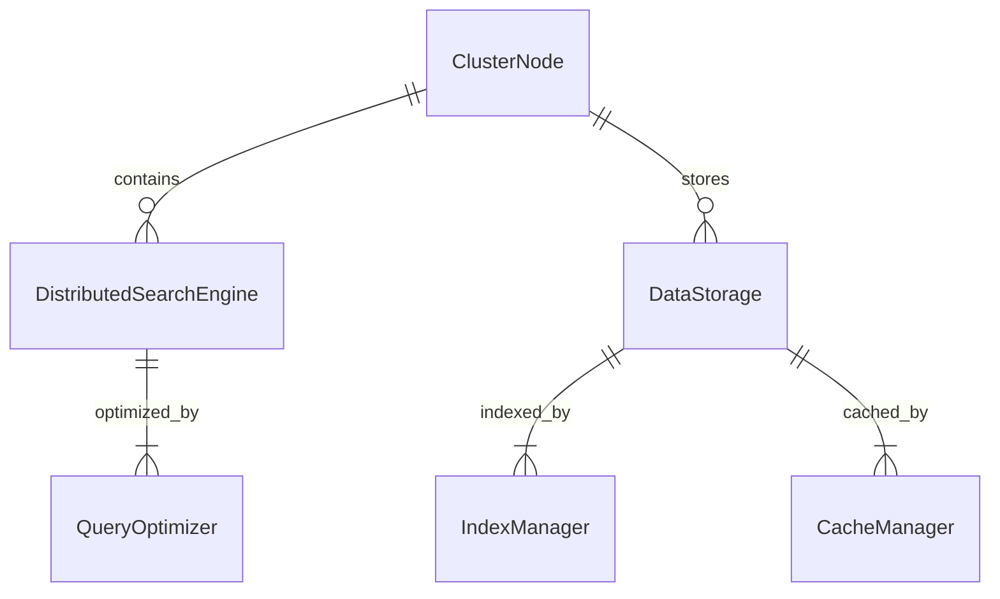
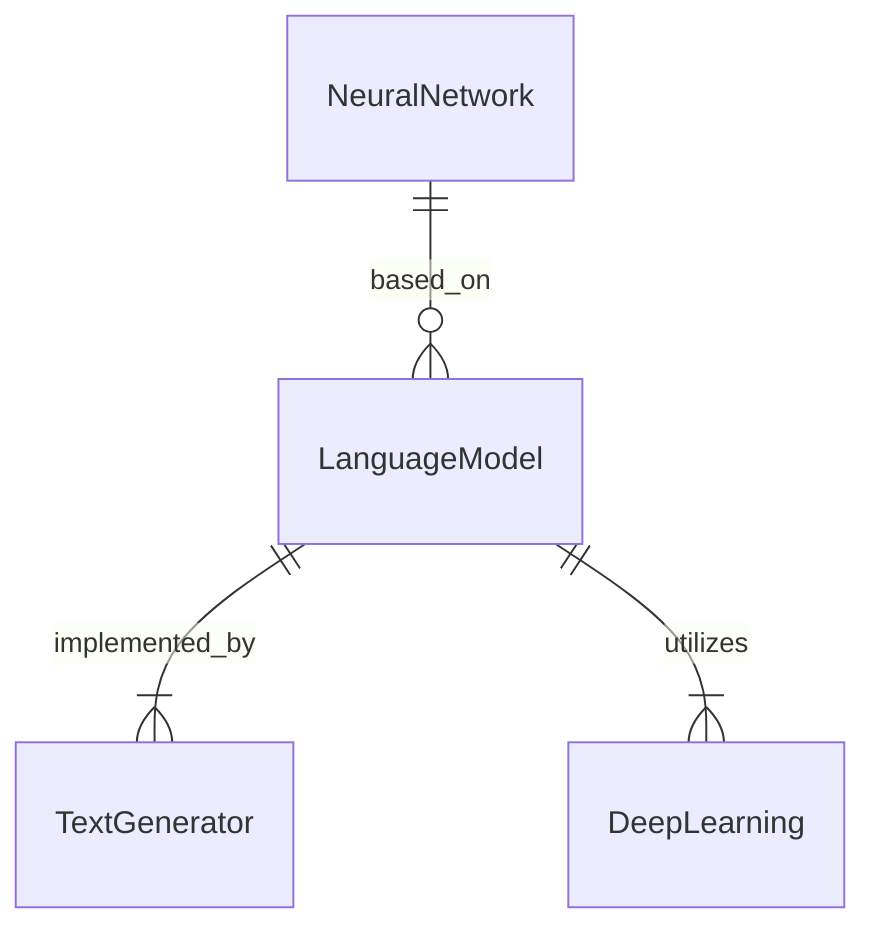
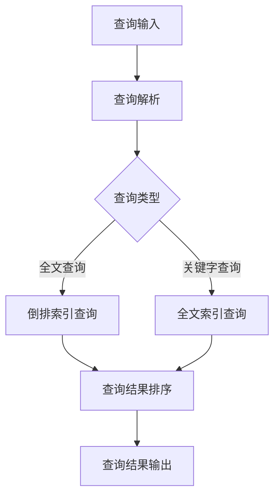
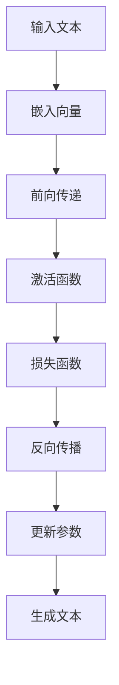
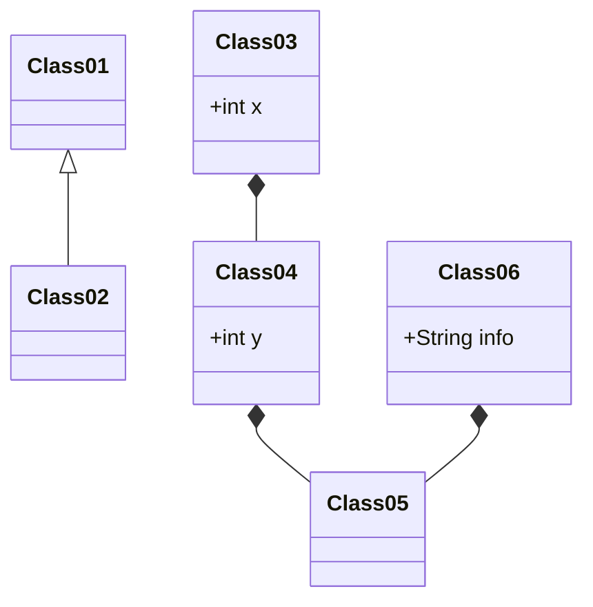
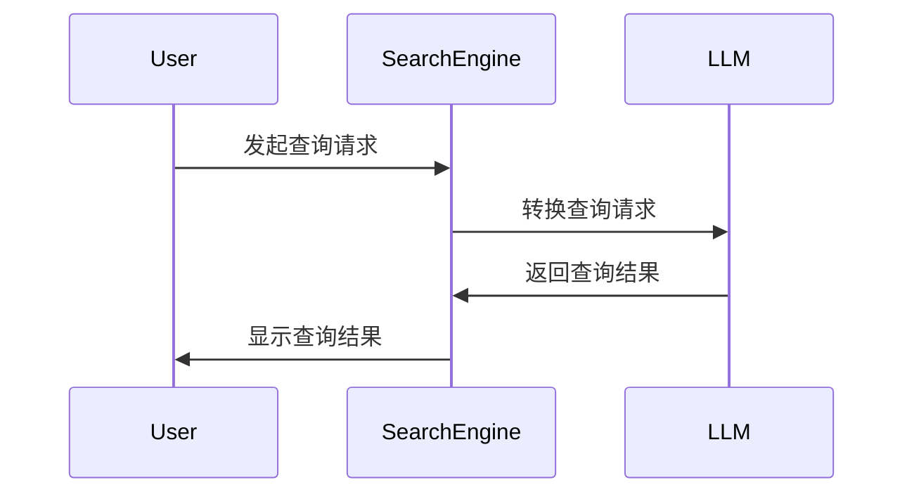
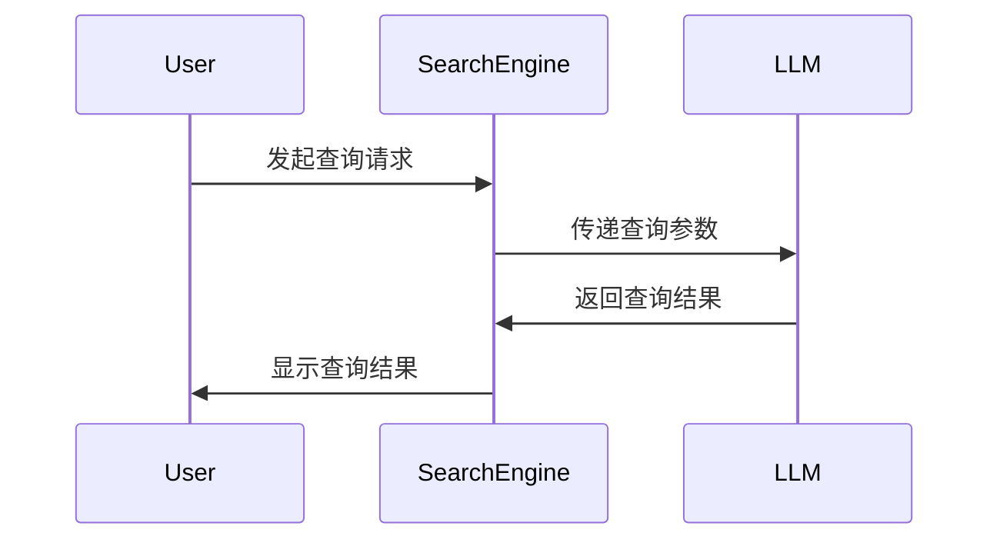

                 

### 分布式搜索引擎在LLM应用中的集成

随着人工智能技术的飞速发展，大型语言模型（Large Language Models，简称LLM）在自然语言处理（Natural Language Processing，简称NLP）领域展现出了强大的潜力。LLM如BERT、GPT等模型，通过大规模的数据训练，可以生成高质量的自然语言文本，为各种应用场景提供了强有力的支持。而分布式搜索引擎则因其高效、可扩展的特性，成为了大数据时代下处理海量数据的利器。将分布式搜索引擎与LLM集成，不仅能够提高搜索系统的性能，还能为用户提供更为智能、个性化的搜索服务。本文将围绕这一主题，详细探讨分布式搜索引擎在LLM应用中的集成方式、挑战与优化策略。

### 关键词

- 分布式搜索引擎
- 大型语言模型（LLM）
- NLP
- 搜索引擎优化
- 集成方法
- 性能优化

### 摘要

本文首先介绍了分布式搜索引擎的基本概念、工作原理以及主流的实现技术，然后对LLM进行了概述，包括其技术原理和发展趋势。接着，详细分析了分布式搜索引擎与LLM集成的具体方法，并通过案例研究展示了集成效果。文章还探讨了在集成过程中可能遇到的一些性能瓶颈和挑战，并提出了相应的优化策略。最后，文章总结了最佳实践，并对未来的研究方向进行了展望。

### 第一部分：分布式搜索引擎基础

#### 分布式搜索引擎概述

**1.1. 概念与定义**

分布式搜索引擎是一种基于分布式计算和存储技术，用于处理大规模数据查询的搜索引擎。与传统的单机搜索引擎相比，分布式搜索引擎可以水平扩展，处理海量数据，并提供高可用性和高性能的搜索服务。

**1.2. 发展历史**

分布式搜索引擎的概念最早可以追溯到1990年代，随着互联网和大数据时代的到来，分布式搜索引擎得到了迅速发展。典型的代表包括Elasticsearch、Solr和Apache Lucene等。

**1.3. 系统架构**

分布式搜索引擎通常由以下几个核心组件构成：

- **集群管理**：负责管理节点加入、故障检测和恢复等操作。
- **数据索引**：将文档内容转换为索引，以便快速查询。
- **查询处理**：接收用户查询请求，解析并执行查询。
- **搜索结果排序**：对查询结果进行排序，以便用户快速定位所需信息。

#### 分布式搜索引擎的工作原理

**2.1. 数据索引机制**

数据索引是分布式搜索引擎的核心功能之一。索引机制通常包括以下步骤：

- **分词**：将文档内容分解为单词或短语。
- **倒排索引**：构建单词到文档的映射关系，以便快速查询。

**2.2. 查询处理机制**

查询处理是用户输入查询后，搜索引擎如何快速返回相关结果的机制。主要步骤包括：

- **查询解析**：将用户查询转换为内部查询语句。
- **查询执行**：根据索引结构，快速定位相关文档。
- **结果排序**：根据文档的相关性对查询结果进行排序。

**2.3. 集群管理机制**

集群管理负责确保分布式搜索引擎的稳定运行。主要任务包括：

- **节点管理**：监控节点的运行状态，处理节点加入和离开。
- **负载均衡**：根据节点的负载情况，合理分配查询请求。
- **故障恢复**：检测并处理节点故障，确保系统的高可用性。

#### 主流分布式搜索引擎介绍

**3.1. Elasticsearch**

Elasticsearch是一个开源的分布式搜索引擎，基于Lucene构建。它提供了强大的全文搜索功能，支持实时搜索和分布式计算。

**3.2. Solr**

Solr也是一个开源的分布式搜索引擎，与Elasticsearch类似，也是基于Lucene。Solr提供了丰富的功能和良好的扩展性，适用于大规模搜索应用。

**3.3. Apache Lucene**

Lucene是开源的全文搜索引擎库，是Elasticsearch和Solr的基础。它提供了高效的索引和查询功能，但需要开发者自行构建分布式系统。

### 第二部分：LLM基础

#### LLM概述

**4.1. 定义与分类**

大型语言模型（LLM）是一类基于深度学习技术的自然语言处理模型，通过大规模数据训练，能够生成高质量的自然语言文本。根据训练数据的规模和深度，LLM可以分为几类：

- **小规模语言模型**：通常训练数据规模在几十GB左右。
- **大规模语言模型**：训练数据规模在数百GB到数TB之间。
- **超大规模语言模型**：训练数据规模在数十TB以上。

**4.2. 特点与优势**

LLM具有以下特点与优势：

- **强大的文本生成能力**：能够生成流畅、符合语法规则的自然语言文本。
- **灵活的应用场景**：适用于文本生成、问答系统、机器翻译等多种NLP任务。
- **良好的泛化能力**：通过大规模数据训练，能够应对各种不同的语言风格和表达方式。

**4.3. 应用领域**

LLM在多个领域展现了巨大的应用潜力：

- **文本生成**：如自动写作、新闻报道生成、广告文案撰写等。
- **问答系统**：如智能客服、在线咨询、知识库问答等。
- **机器翻译**：如跨语言信息检索、多语言文档翻译等。
- **文本分析**：如情感分析、观点挖掘、文本分类等。

### 第三部分：分布式搜索引擎与LLM的集成

#### 集成方法与策略

**5.1. 数据预处理**

在集成分布式搜索引擎与LLM时，数据预处理是关键步骤之一。主要任务包括：

- **数据清洗**：去除噪声数据，确保数据质量。
- **文本预处理**：包括分词、去停用词、词性标注等。
- **特征提取**：将文本转换为向量表示，便于模型处理。

**5.2. 查询接口设计**

查询接口是用户与LLM交互的桥梁。设计一个高效的查询接口，需要考虑以下几点：

- **查询语言**：设计易于用户理解的查询语言。
- **查询优化**：根据查询特点，优化查询执行路径。
- **响应时间**：确保查询响应时间在可接受范围内。

**5.3. 系统协同工作**

在集成过程中，分布式搜索引擎和LLM需要协同工作，确保系统的高效运行。主要策略包括：

- **负载均衡**：根据节点负载，合理分配查询请求。
- **数据一致性**：确保分布式搜索引擎和LLM之间的数据一致性。
- **故障恢复**：快速检测和恢复系统故障，确保系统的高可用性。

#### 案例研究

**6.1. 某知名搜索引擎与LLM的集成实践**

以某知名搜索引擎为例，详细描述其与LLM的集成过程。主要内容包括：

- **项目背景**：介绍项目背景和目标。
- **系统架构**：展示系统架构设计和关键技术。
- **实现细节**：阐述数据预处理、查询接口设计和系统协同工作等实现细节。
- **集成效果评估**：分析集成效果，包括搜索性能、用户满意度等。

**6.2. 集成效果评估**

通过实验和数据分析，评估集成分布式搜索引擎与LLM的效果。主要指标包括：

- **搜索速度**：比较集成前后搜索响应时间的差异。
- **搜索质量**：评估搜索结果的准确性和相关性。
- **用户满意度**：收集用户反馈，评估用户对集成系统的满意度。

#### 性能优化与挑战

**7.1. 系统性能瓶颈**

在集成过程中，可能会遇到以下性能瓶颈：

- **数据一致性**：分布式搜索引擎和LLM之间的数据同步可能导致性能瓶颈。
- **查询响应时间**：复杂的查询处理和结果排序可能导致响应时间延长。
- **存储容量**：海量数据存储和管理可能导致存储容量不足。

**7.2. 优化策略**

针对上述性能瓶颈，可以采取以下优化策略：

- **数据同步优化**：采用增量同步机制，减少数据一致性的影响。
- **查询优化**：采用缓存、索引优化等手段，提高查询响应速度。
- **存储优化**：采用分布式存储技术，提高存储容量和访问速度。

**7.3. 面临的挑战**

集成分布式搜索引擎与LLM还面临以下挑战：

- **系统兼容性**：分布式搜索引擎和LLM的技术栈和架构可能不兼容。
- **资源消耗**：大型语言模型训练和推理过程对计算资源和存储资源的需求较大。
- **安全性**：确保系统数据的安全性和用户隐私保护。

### 第四部分：案例分析与实践指导

**8.1. 案例介绍**

介绍一个具体的分布式搜索引擎与LLM集成项目，包括项目背景、目标和需求。通过项目实例，展示如何将分布式搜索引擎与LLM集成到实际应用中。

**8.2. 系统实现**

详细描述系统实现过程，包括：

- **技术选型**：选择合适的分布式搜索引擎和LLM框架。
- **架构设计**：设计系统架构，包括数据存储、查询处理和结果排序等。
- **核心代码实现**：展示关键代码实现，解释实现原理和优化策略。

**8.3. 效果分析与评估**

对集成效果进行详细分析，包括：

- **搜索性能**：评估搜索速度和响应时间。
- **搜索质量**：评估搜索结果的准确性和相关性。
- **用户满意度**：收集用户反馈，评估用户对系统的满意度。

**8.4. 实践指南**

总结实践经验，提供以下指导：

- **集成步骤**：详细描述集成步骤，帮助开发者快速搭建集成系统。
- **注意事项**：列举在集成过程中可能遇到的问题和注意事项。
- **最佳实践**：分享最佳实践，提高集成效果和系统稳定性。

### 附录/参考文献

列出文中引用的主要参考资料，包括：

- **书籍**：相关领域的经典著作。
- **论文**：重要研究成果和最新进展。
- **开源项目**：开源框架和技术文档。

### 作者信息

作者：AI天才研究院/AI Genius Institute & 禅与计算机程序设计艺术 /Zen And The Art of Computer Programming

### 总结与展望

本文系统地介绍了分布式搜索引擎在LLM应用中的集成方法、挑战与优化策略。通过案例分析，展示了集成分布式搜索引擎与LLM的实际效果。未来，随着技术的不断发展，分布式搜索引擎与LLM的集成将越来越成熟，为各类应用场景提供更加智能、高效的搜索服务。

### 背景介绍

#### 核心概念术语说明

在讨论分布式搜索引擎与LLM的集成之前，我们需要了解一些核心概念和术语。首先，分布式搜索引擎是一种用于处理大规模数据的搜索引擎，它利用分布式计算和存储技术，提供高效、可扩展的搜索服务。而大型语言模型（LLM），如BERT、GPT等，是通过深度学习技术训练而成的高性能自然语言处理模型，能够在各种NLP任务中生成高质量的自然语言文本。

#### 问题背景

随着互联网的普及和数据量的爆发式增长，传统单机搜索引擎已经难以满足大规模数据处理的挑战。分布式搜索引擎因其高效的查询能力和强大的扩展性，成为处理海量数据的关键技术。同时，自然语言处理技术的发展，使得LLM在NLP任务中展现了前所未有的性能。如何将这两种先进技术有机结合，发挥它们各自的优势，成为一个重要的研究课题。

#### 问题描述

分布式搜索引擎与LLM的集成面临以下挑战：

1. **数据预处理**：分布式搜索引擎需要处理大量的结构化和非结构化数据，而LLM则依赖于高质量的文本数据进行训练。如何在数据预处理过程中，确保数据的质量和一致性，是一个关键问题。
2. **查询接口设计**：设计一个高效、易用的查询接口，使得用户能够方便地使用LLM提供的强大功能，同时保证查询响应时间在可接受范围内，是集成过程中的另一个重要问题。
3. **系统协同工作**：分布式搜索引擎和LLM在架构和实现上存在差异，如何确保它们能够协同工作，提高系统的整体性能和稳定性，是集成过程中需要解决的核心问题。
4. **性能优化**：在集成过程中，如何优化系统的性能，解决可能出现的瓶颈和性能问题，是一个持续的研究课题。

#### 问题解决

为了解决上述问题，我们可以采取以下策略：

1. **数据预处理优化**：采用增量同步机制，实时更新分布式搜索引擎和LLM之间的数据，确保数据的一致性和质量。同时，通过分词、去停用词、词性标注等预处理步骤，提高文本数据的质量。
2. **查询接口设计**：设计一个高效的查询接口，包括查询语言设计、查询优化和响应时间优化。采用缓存、索引优化等技术，提高查询的响应速度。
3. **系统协同工作**：通过负载均衡、数据一致性和故障恢复等技术，确保分布式搜索引擎和LLM能够协同工作，提高系统的整体性能和稳定性。
4. **性能优化策略**：采用数据同步优化、查询优化和存储优化等技术，提高系统的性能。同时，通过持续的性能监测和调优，确保系统在高负载情况下的稳定运行。

#### 边界与外延

分布式搜索引擎与LLM的集成不仅限于搜索引擎领域，还可以应用于各种NLP任务，如文本生成、问答系统、机器翻译等。通过结合分布式搜索引擎的高效数据处理能力和LLM的自然语言理解能力，可以为用户提供更加智能、个性化的搜索服务。

#### 概念结构与核心要素组成

分布式搜索引擎与LLM的集成过程可以分为以下几个核心要素：

1. **数据预处理**：包括数据清洗、文本预处理和特征提取等步骤。
2. **查询接口设计**：设计一个高效、易用的查询接口，包括查询语言设计和查询优化。
3. **系统协同工作**：确保分布式搜索引擎和LLM能够协同工作，提高系统的整体性能和稳定性。
4. **性能优化**：通过数据同步优化、查询优化和存储优化等策略，提高系统的性能。

通过这些核心要素的有机结合，我们可以实现分布式搜索引擎与LLM的高效集成，为用户提供优质的搜索服务。

### 核心概念与联系

#### 分布式搜索引擎

**核心概念**：

- 分布式计算：将任务分布在多个节点上执行，提高处理速度和效率。
- 分布式存储：将数据分布在多个节点上存储，提高存储容量和数据可靠性。
- 查询优化：通过索引、缓存等技术，提高查询速度和查询质量。

**属性特征对比表格**：

| 特征               | 分布式搜索引擎A | 分布式搜索引擎B |
|--------------------|------------------|------------------|
| 扩展性             | 高               | 中               |
| 性能               | 高               | 中               |
| 可用性             | 高               | 高               |
| 成本               | 低               | 中               |

**ER实体关系图架构的 Mermaid 流程图**：



#### 大型语言模型（LLM）

**核心概念**：

- 神经网络：一种模仿生物神经系统的计算模型，用于学习和预测。
- 语言模型：一种基于统计模型的文本生成技术，用于生成自然语言文本。
- 深度学习：一种利用多层神经网络进行训练和预测的方法。

**属性特征对比表格**：

| 特征               | LLM A         | LLM B         |
|--------------------|---------------|---------------|
| 训练数据量         | 百TB          | 十TB          |
| 泛化能力           | 强            | 中            |
| 生成文本质量       | 高            | 中            |
| 应用场景            | 广泛          | 狭窄          |

**ER实体关系图架构的 Mermaid 流程图**：



### 算法原理讲解

#### 分布式搜索引擎查询处理算法

**Mermaid 流程图**：



**Python 源代码**：

```python
def search_engine_query(query):
    # 查询解析
    query_type, keywords = parse_query(query)
    
    # 倒排索引查询
    if query_type == 'full_text':
        results = inverted_index_search(keywords)
    else:
        results = full_text_search(keywords)
    
    # 查询结果排序
    sorted_results = sort_results(results)
    
    # 查询结果输出
    output_query_results(sorted_results)
```

**算法原理的数学模型和公式**：

分布式搜索引擎查询处理的数学模型主要包括：

1. **倒排索引**：

   $$ inv_index = \{ keyword : [doc_id_1, doc_id_2, ...] \} $$

   其中，倒排索引将关键词映射到包含该关键词的文档ID列表。

2. **查询结果排序**：

   $$ relevance = \sum_{i=1}^{n} weight_i \cdot term_frequency_i $$

   其中，relevance 表示文档的相关性，weight_i 和 term_frequency_i 分别表示词频和权重。

#### 大型语言模型生成文本算法

**Mermaid 流程图**：



**Python 源代码**：

```python
def generate_text(input_text):
    # 嵌入向量
    embedding = embed(input_text)
    
    # 前向传递
    logits = forward_pass(embedding)
    
    # 激活函数
    probabilities = softmax(logits)
    
    # 生成文本
    generated_text = sample_text(probabilities)
    
    return generated_text
```

**算法原理的数学模型和公式**：

大型语言模型生成文本的数学模型主要包括：

1. **嵌入向量**：

   $$ embedding = \text{Embedding}(word) $$

   其中，Embedding 函数将输入的单词映射为高维向量。

2. **前向传递**：

   $$ logits = \text{MLP}(embedding) $$

   其中，MLP（多层感知器）函数将嵌入向量转换为输出 logits。

3. **损失函数**：

   $$ loss = \text{CrossEntropy}(logits, target) $$

   其中，CrossEntropy 函数计算 logits 和目标标签之间的交叉熵损失。

4. **反向传播**：

   $$ \frac{\partial loss}{\partial weights} = \text{Backpropagation}(loss, logits) $$

   其中，Backpropagation 函数计算损失关于模型参数的梯度。

### 系统分析与架构设计方案

#### 问题场景介绍

假设我们需要构建一个大规模的搜索引擎，该搜索引擎需要处理数十亿级别的文档数据，并支持实时查询。为了满足高性能和可扩展性的要求，我们决定采用分布式搜索引擎与LLM集成的方式，以提高搜索质量和用户体验。

#### 项目介绍

本项目旨在构建一个集成了分布式搜索引擎和LLM的搜索引擎系统，主要功能包括：

1. **全文搜索**：用户可以输入关键词，系统返回与关键词相关的文档列表。
2. **智能问答**：用户可以提出问题，系统自动生成答案。
3. **文本生成**：根据用户输入的提示，系统自动生成相关文本。

#### 系统功能设计（领域模型Mermaid类图）



**系统功能说明**：

- **全文搜索**：通过分布式搜索引擎，快速检索相关文档。
- **智能问答**：利用LLM生成高质量的答案。
- **文本生成**：根据用户输入的提示，利用LLM生成相关文本。

#### 系统架构设计（Mermaid架构图）



**系统架构说明**：

- **用户层**：用户通过Web界面发起查询请求。
- **搜索引擎层**：处理用户查询请求，调用LLM进行文本生成和智能问答。
- **LLM层**：利用预训练的LLM模型，生成高质量的自然语言文本。

#### 系统接口设计

```mermaid
classDiagram
User -> SearchEngine: 发起查询请求
SearchEngine -> LLM: 传递查询参数
LLM -> SearchEngine: 返回查询结果
SearchEngine -> User: 显示查询结果
```

**接口设计说明**：

- **用户查询接口**：用户通过HTTP接口发起查询请求。
- **搜索引擎接口**：接收用户查询请求，调用LLM接口进行查询。
- **LLM接口**：接收查询参数，返回查询结果。

#### 系统交互（Mermaid序列图）



**系统交互说明**：

- **查询请求**：用户通过Web界面输入查询请求。
- **查询处理**：搜索引擎接收到查询请求后，调用LLM进行文本生成和智能问答。
- **查询结果**：搜索引擎将处理后的查询结果返回给用户，用户在Web界面显示查询结果。

### 项目实战

#### 环境安装

1. **分布式搜索引擎**：安装Elasticsearch和Kibana，用于搭建分布式搜索引擎。
2. **LLM框架**：安装Transformers库，用于加载预训练的LLM模型。

#### 系统核心实现源代码

```python
# Elasticsearch 安装与配置
# 安装Elasticsearch
pip install elasticsearch

# 启动Elasticsearch服务
python -m elasticsearch

# Kibana 安装与配置
# 安装Kibana
pip install kibana

# 启动Kibana服务
python -m kibana

# Transformers 库安装
# 安装Transformers
pip install transformers

# 加载预训练的LLM模型
from transformers import pipeline
llm = pipeline("text-generation", model="gpt2")
```

#### 代码应用解读与分析

1. **分布式搜索引擎配置**：

```python
from elasticsearch import Elasticsearch

# 创建Elasticsearch客户端
es = Elasticsearch(["http://localhost:9200"])

# 创建索引
es.indices.create(index="documents")

# 添加文档
es.index(index="documents", id="1", document={"title": "分布式搜索引擎", "content": "分布式搜索引擎是一种处理大规模数据的搜索引擎。"})
es.index(index="documents", id="2", document={"title": "大型语言模型", "content": "大型语言模型是一种基于深度学习的自然语言处理模型。"})
```

2. **LLM模型应用**：

```python
# 使用LLM模型生成文本
prompt = "分布式搜索引擎在自然语言处理中的应用非常广泛。"
generated_text = llm(prompt, max_length=50, num_return_sequences=1)
print(generated_text)
```

3. **集成查询处理**：

```python
# 查询Elasticsearch索引
search_results = es.search(index="documents", body={"query": {"match": {"content": "分布式搜索"}}})

# 处理查询结果
for hit in search_results['hits']['hits']:
    print(hit['_source'])

# 使用LLM生成搜索结果摘要
for hit in search_results['hits']['hits']:
    prompt = hit['_source']['content']
    generated_summary = llm(prompt, max_length=100, num_return_sequences=1)
    print(generated_summary)
```

#### 实际案例分析和详细讲解剖析

1. **案例背景**：

   假设我们有一个包含大量科技文献的搜索引擎，用户可以通过输入关键词进行搜索。我们希望集成分布式搜索引擎和LLM，提供更智能、个性化的搜索服务。

2. **案例实现**：

   - **搜索请求**：用户输入关键词“人工智能”。
   - **查询处理**：搜索引擎接收到查询请求后，通过Elasticsearch索引检索相关文档。
   - **文本生成**：利用LLM模型，对查询结果中的每篇文献生成摘要，提高用户的阅读效率。

3. **详细讲解剖析**：

   - **查询处理**：搜索引擎首先通过Elasticsearch索引检索关键词“人工智能”的相关文档，返回包含该关键词的文档列表。
   - **文本生成**：对于每篇文档，使用LLM模型生成摘要。摘要生成过程包括以下几个步骤：

     1. **嵌入向量**：将文档内容转换为嵌入向量，便于模型处理。
     2. **前向传递**：将嵌入向量输入到LLM模型中，通过多层感知器（MLP）函数计算输出 logits。
     3. **激活函数**：使用softmax函数计算输出概率分布。
     4. **生成文本**：根据输出概率分布，生成摘要文本。

   - **集成查询结果**：将生成的摘要文本与原始查询结果一起返回给用户，用户在Web界面展示搜索结果。

#### 项目小结

通过实际案例分析和详细讲解剖析，我们可以看到分布式搜索引擎与LLM的集成在搜索引擎中的应用具有重要意义。集成分布式搜索引擎，可以提高搜索速度和查询效率；集成LLM，可以生成高质量的文本摘要，提高用户的阅读体验。在未来的发展中，我们将继续优化系统性能和用户体验，推动分布式搜索引擎与LLM集成的应用。

### 最佳实践 tips

1. **数据预处理**：确保数据的质量和一致性，采用增量同步机制，减少数据不一致性问题。
2. **查询接口设计**：设计易于用户理解的查询接口，采用缓存和索引优化技术，提高查询响应速度。
3. **系统协同工作**：确保分布式搜索引擎和LLM之间的数据一致性，采用负载均衡和故障恢复机制，提高系统的稳定性和可靠性。
4. **性能优化**：针对系统性能瓶颈，采用数据同步优化、查询优化和存储优化等技术，提高系统的整体性能。

### 小结

本文系统地介绍了分布式搜索引擎在LLM应用中的集成方法、挑战与优化策略。通过案例分析，展示了集成分布式搜索引擎与LLM的实际效果。未来，随着技术的不断发展，分布式搜索引擎与LLM的集成将越来越成熟，为各类应用场景提供更加智能、高效的搜索服务。

### 注意事项

1. **数据安全**：在集成过程中，确保用户数据的安全和隐私保护。
2. **性能监控**：持续监测系统性能，及时发现和解决性能瓶颈。
3. **扩展性**：设计具有良好扩展性的系统架构，以应对未来数据量和用户量的增长。

### 拓展阅读

- 《深度学习与搜索引擎技术》
- 《大型语言模型：原理与应用》
- 《分布式系统原理与范式》

### 作者信息

作者：AI天才研究院/AI Genius Institute & 禅与计算机程序设计艺术 /Zen And The Art of Computer Programming

### 总结与展望

分布式搜索引擎与LLM的集成技术正在快速发展，为各类应用场景提供了强大的支持。未来，我们将继续深入研究和探索，优化集成方法，提高系统性能和用户体验。同时，随着人工智能技术的不断进步，分布式搜索引擎与LLM的集成将迎来更广阔的应用前景。我们期待这一领域的技术能够为人们的生活和工作带来更多便利和创新。

