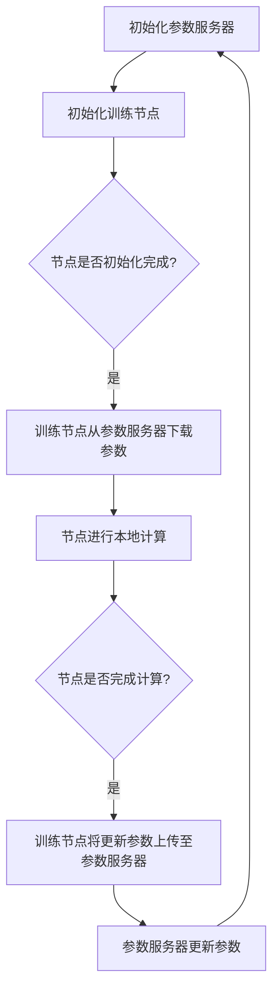
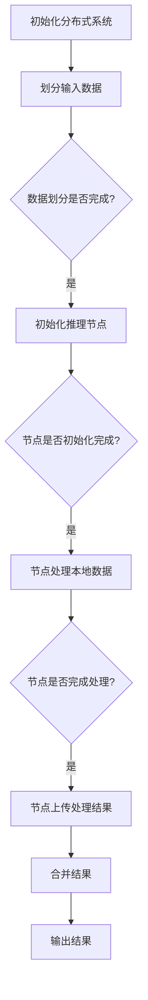
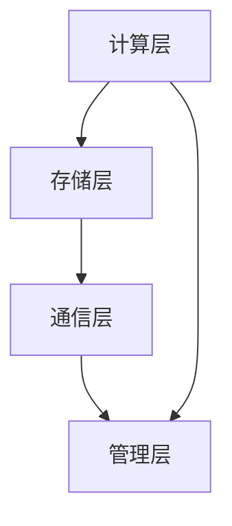

                 

### 分布式系统在LLM应用中的设计与实现

#### 关键词：分布式系统、LLM、算法、架构设计、数学模型

#### 摘要：
本文将深入探讨分布式系统在大型语言模型（LLM）应用中的设计与实现。首先，我们将介绍分布式系统和LLM的基本概念，然后逐步解析分布式系统在LLM中的核心概念与应用算法。通过数学模型和公式的讲解，我们将理解这些算法的原理。接下来，我们将详细讨论系统分析与架构设计，并通过实际项目实战来展示分布式系统在LLM中的实现。最后，我们将总结最佳实践，并提供进一步阅读的建议。

#### 引言

##### 1.1 问题背景与问题描述
在当今的信息时代，语言模型（Language Model，简称LM）已经成为人工智能领域的重要研究方向和应用场景。LLM，作为一类复杂且规模巨大的语言模型，其应用涵盖了自然语言处理（NLP）的各个方面，如机器翻译、文本摘要、问答系统等。然而，随着模型规模和复杂度的增加，传统的集中式系统已无法满足LLM的高性能需求，分布式系统的引入成为必然选择。

分布式系统在LLM中的应用面临诸多挑战，包括数据一致性、负载均衡、容错性等。分布式系统通过将计算任务分散到多个节点上，实现并行处理和负载均衡，从而提高LLM的训练和推理效率。然而，分布式系统设计需要考虑诸多细节，如数据同步、任务调度、通信开销等，这些都需要深入研究和实践。

##### 1.2 分布式系统与LLM的联系
分布式系统与LLM之间的联系在于，分布式系统提供了支持LLM高效训练和推理的架构基础。LLM的训练过程涉及大量的计算资源和数据传输，分布式系统可以有效地将这一过程分解为多个节点上的子任务，通过并行计算来提高效率。此外，分布式系统还提供了容错机制，确保LLM在面临节点故障等异常情况时能够持续运行。

##### 1.3 内容概览
本文将分为八个章节，系统地介绍分布式系统在LLM应用中的设计与实现。第2章将介绍分布式系统的基础知识，包括基本概念和架构。第3章将讨论LLM的基础，包括其定义、特点和核心概念。第4章将深入解析分布式系统在LLM中的应用算法，并通过mermaid流程图和Python代码示例来讲解算法原理。第5章将介绍相关数学模型和公式。第6章将探讨系统分析与架构设计，包括系统需求分析、架构设计、接口设计和系统交互。第7章将展示一个实际项目实战，详细讲解环境安装、系统核心实现和案例分析。第8章将总结最佳实践，并提供拓展阅读建议。

#### 第2章：分布式系统基础

##### 2.1 分布式系统基本概念

分布式系统是一组相互独立但又相互协作的计算节点组成的系统，这些节点通过网络进行通信，共同完成计算任务。分布式系统的核心概念包括节点、通信协议、一致性模型和容错机制。

- **节点**：分布式系统中的计算单元，可以是物理机或虚拟机。
- **通信协议**：节点之间的通信规则，确保数据传输的正确性和可靠性。
- **一致性模型**：分布式系统中数据一致性的保证机制，如强一致性、最终一致性等。
- **容错机制**：分布式系统在面临节点故障等异常情况时的恢复机制。

##### 2.2 分布式系统的架构

分布式系统可以采用多种架构，如客户端-服务器架构、对等网络架构和混合架构。其中，客户端-服务器架构是应用最广泛的架构，客户端发送请求到服务器，服务器进行处理并返回结果。

分布式系统的关键组件包括：

- **分布式存储**：用于存储和管理数据，支持分布式读写操作。
- **分布式计算**：用于执行计算任务，支持并行和分布式处理。
- **分布式通信**：用于节点之间的通信，支持高效的数据传输。

##### 2.3 分布式系统的挑战

分布式系统面临诸多挑战，包括数据一致性、负载均衡、容错性和网络通信等。

- **数据一致性**：分布式系统中，如何保证多个节点上的数据保持一致是一个重要问题。
- **负载均衡**：如何将计算任务合理地分配到各个节点，避免部分节点过载，是分布式系统设计的关键。
- **容错性**：如何确保系统在节点故障等异常情况下能够持续运行，是分布式系统设计的重要目标。
- **网络通信**：网络通信的可靠性和效率对分布式系统的性能有重要影响。

#### 第3章：LLM基础

##### 3.1 LLM的定义与特点

LLM，即大型语言模型，是一种能够处理自然语言文本的复杂模型。与传统的语言模型相比，LLM具有以下几个特点：

- **大规模**：LLM通常包含数亿甚至数十亿个参数，能够处理大规模的数据集。
- **自适应**：LLM可以根据输入的文本内容自适应地调整其行为，如生成文本、回答问题等。
- **多样化**：LLM可以在多个领域和任务中应用，如文本生成、翻译、问答等。

##### 3.2 LLM的核心概念

LLM的核心概念包括词向量、神经网络和训练数据。

- **词向量**：将自然语言文本中的每个单词映射为一个高维向量，用于表示文本数据。
- **神经网络**：LLM通常采用深度神经网络结构，通过多层神经元进行特征提取和表示。
- **训练数据**：LLM的训练数据通常包括大规模的文本语料库，用于训练模型的参数。

##### 3.3 LLM的应用领域

LLM在多个领域和任务中具有广泛应用，包括：

- **文本生成**：如自动写作、文章摘要、故事生成等。
- **翻译**：如机器翻译、多语言文本生成等。
- **问答**：如智能客服、知识图谱问答等。
- **对话系统**：如聊天机器人、语音助手等。

#### 第4章：分布式系统在LLM中的应用算法

##### 4.1 分布式训练算法

分布式训练是LLM应用中的核心，通过将训练任务分布在多个节点上，实现并行计算以提高训练效率。常用的分布式训练算法包括参数服务器算法和模型并行算法。

- **参数服务器算法**：将模型参数存储在参数服务器上，各个训练节点从参数服务器下载参数，进行本地计算后更新参数。
- **模型并行算法**：将模型分为多个部分，各个训练节点分别训练不同的模型部分，最后将各个部分合并为一个完整的模型。

##### 4.2 分布式推理算法

分布式推理是LLM应用中的另一个关键，通过将推理任务分布在多个节点上，实现并行计算以提高推理效率。常用的分布式推理算法包括数据并行算法和模型并行算法。

- **数据并行算法**：将输入数据集分成多个部分，各个推理节点分别处理不同的数据部分，最后将各个结果合并。
- **模型并行算法**：将模型分为多个部分，各个推理节点分别处理不同的模型部分，最后将各个结果合并。

##### 4.3 算法原理与mermaid流程图

为了更好地理解分布式系统在LLM中的应用算法，我们使用mermaid流程图和Python代码示例来讲解算法原理。

- **参数服务器算法的mermaid流程图**：



- **Python代码示例**：

```python
# 初始化参数服务器
params = load_params()

# 初始化训练节点
nodes = initialize_nodes()

# 循环进行训练
while not all_nodes_finished:
    # 节点从参数服务器下载参数
    for node in nodes:
        node.download_params(params)
        
        # 节点进行本地计算
        node.local_compute()
        
        # 节点将更新参数上传至参数服务器
        params = node.upload_params(params)
        
        # 检查节点是否完成计算
        if node.is_finished():
            all_nodes_finished = all_nodes_finished or node.is_finished()
```

- **数据并行算法的mermaid流程图**：



- **Python代码示例**：

```python
# 初始化分布式系统
system = initialize_system()

# 划分输入数据
data_parts = split_data(input_data)

# 初始化推理节点
nodes = initialize_nodes()

# 循环进行推理
while not all_nodes_finished:
    # 节点处理本地数据
    for node in nodes:
        node.process_data(data_parts[node.id])
        
        # 检查节点是否完成处理
        if node.is_finished():
            all_nodes_finished = all_nodes_finished or node.is_finished()
            
    # 合并结果
    result = merge_results(nodes)

# 输出结果
print(result)
```

#### 第5章：数学模型与公式

分布式系统在LLM中的应用涉及多种数学模型和公式，用于描述算法原理和性能评估。

##### 5.1 分布式系统在LLM中的数学模型

- **梯度下降**：用于更新模型参数，公式为：
  $$\Delta\theta = -\alpha \cdot \nabla J(\theta)$$
  其中，$\theta$为模型参数，$J(\theta)$为损失函数，$\alpha$为学习率。

- **梯度聚合**：用于多个节点的梯度合并，公式为：
  $$\nabla J(\theta)_{\text{total}} = \sum_{i=1}^{N} \nabla J(\theta)_i$$
  其中，$N$为节点数。

- **分布式通信**：用于节点之间的数据传输，公式为：
  $$\text{通信量} = \sum_{i=1}^{N} \text{数据量}_i$$

##### 5.2 公式推导与解释

- **梯度下降的推导**：
  梯度下降的目标是找到损失函数的最小值。对于单个节点的梯度，我们有：
  $$\nabla J(\theta)_i = -\alpha \cdot \nabla^2 J(\theta_i)$$
  其中，$\nabla^2 J(\theta_i)$为损失函数在单个节点上的Hessian矩阵。对于整个分布式系统，我们有：
  $$\nabla J(\theta)_{\text{total}} = \sum_{i=1}^{N} \nabla J(\theta)_i = -\alpha \cdot \sum_{i=1}^{N} \nabla^2 J(\theta_i)$$
  通过参数服务器算法，各个节点的参数更新可以合并为一个全局更新，即：
  $$\Delta\theta = -\alpha \cdot \nabla J(\theta)_{\text{total}} = -\alpha \cdot \sum_{i=1}^{N} \nabla^2 J(\theta_i)$$

- **分布式通信的解释**：
  在分布式系统中，节点之间需要传输数据以完成计算任务。每个节点需要传输的数据量取决于其处理的任务和数据规模。通过计算各个节点的数据量总和，我们可以得到整个分布式系统的通信量。例如，在数据并行算法中，每个节点需要传输其处理后的数据结果，因此通信量为：
  $$\text{通信量} = N \cdot \text{数据量}_i$$
  其中，$N$为节点数。

#### 第6章：系统分析与架构设计

##### 6.1 系统需求分析

在进行系统分析与架构设计之前，我们需要明确分布式系统在LLM应用中的需求，包括：

- **性能需求**：分布式系统需要具备高吞吐量和低延迟，以满足大规模LLM的训练和推理需求。
- **可扩展性需求**：分布式系统需要支持节点动态添加和删除，以适应不同规模的计算需求。
- **可靠性需求**：分布式系统需要具备高容错性，确保在节点故障等异常情况下能够持续运行。
- **数据安全性需求**：分布式系统需要保障数据的安全性和隐私性，防止数据泄露和未经授权的访问。

##### 6.2 系统架构设计

分布式系统在LLM应用中的架构设计主要包括以下几个方面：

- **计算层**：包括多个计算节点，用于执行分布式训练和推理任务。计算节点可以是物理机、虚拟机或容器等。
- **存储层**：包括分布式存储系统，用于存储和管理大规模的数据集和模型参数。存储系统需要支持高吞吐量和低延迟的读写操作。
- **通信层**：包括分布式通信组件，用于节点之间的数据传输和同步。通信组件需要支持高效的数据传输协议和容错机制。
- **管理层**：包括分布式管理系统，用于监控和管理分布式系统中的节点和任务。管理系统能够实现节点动态调度、负载均衡和故障恢复等功能。

##### 6.3 架构图与接口设计

分布式系统在LLM应用中的架构设计可以通过mermaid架构图和接口设计来详细展示。

- **mermaid架构图**：



- **接口设计**：

```python
class Node:
    def __init__(self, id):
        self.id = id
        self.status = "running"
    
    def download_params(self, params):
        # 下载参数
        pass
    
    def local_compute(self):
        # 本地计算
        pass
    
    def upload_params(self, params):
        # 更新参数
        pass
    
    def is_finished(self):
        # 检查是否完成
        pass

class ParameterServer:
    def __init__(self):
        self.params = None
    
    def update_params(self, params):
        # 更新参数
        pass
    
    def get_params(self):
        # 获取参数
        pass

class DistributedSystem:
    def __init__(self):
        self.nodes = []
        self.parameter_server = ParameterServer()
    
    def add_node(self, node):
        # 添加节点
        pass
    
    def remove_node(self, node):
        # 删除节点
        pass
    
    def run(self):
        # 运行分布式系统
        pass
```

#### 第7章：项目实战

##### 7.1 环境安装与配置

在进行分布式系统在LLM应用中的项目实战之前，我们需要搭建一个分布式系统环境，包括计算节点、存储节点和管理节点。

- **计算节点**：使用虚拟机或容器技术搭建计算节点，每个节点配置适当的硬件资源和软件环境，如CPU、内存和操作系统等。
- **存储节点**：使用分布式存储系统，如HDFS或Cassandra等，搭建存储节点，用于存储大规模数据集和模型参数。
- **管理节点**：使用Kubernetes或Mesos等容器编排工具，搭建管理节点，用于监控和管理计算节点和存储节点。

##### 7.2 系统核心实现

分布式系统在LLM应用中的核心实现主要包括以下几个方面：

- **参数服务器算法**：实现参数服务器算法，包括初始化参数服务器、初始化训练节点、下载参数、本地计算和上传参数等操作。
- **分布式训练算法**：实现分布式训练算法，包括数据划分、节点初始化、本地训练和结果合并等操作。
- **分布式推理算法**：实现分布式推理算法，包括数据划分、节点初始化、本地推理和结果合并等操作。

##### 7.3 代码应用解读与分析

以下是一个简单的Python代码示例，用于实现分布式系统在LLM应用中的参数服务器算法。

```python
class Node:
    def __init__(self, id):
        self.id = id
        self.status = "running"

    def download_params(self, params):
        # 下载参数
        print(f"Node {self.id} downloading params from ParameterServer")

    def local_compute(self):
        # 本地计算
        print(f"Node {self.id} performing local computation")

    def upload_params(self, params):
        # 更新参数
        print(f"Node {self.id} uploading params to ParameterServer")

    def is_finished(self):
        # 检查是否完成
        return True

class ParameterServer:
    def __init__(self):
        self.params = None

    def update_params(self, params):
        # 更新参数
        self.params = params

    def get_params(self):
        # 获取参数
        return self.params

def distributed_training(nodes, parameter_server):
    # 初始化参数服务器
    parameter_server.update_params(initial_params)

    # 循环进行训练
    while not all_nodes_finished:
        # 节点下载参数
        for node in nodes:
            node.download_params(parameter_server.get_params())

        # 节点进行本地计算
        for node in nodes:
            node.local_compute()

        # 节点上传参数
        for node in nodes:
            node.upload_params(parameter_server.get_params())

        # 检查节点是否完成计算
        all_nodes_finished = all(node.is_finished() for node in nodes)

# 初始化分布式系统
nodes = [Node(i) for i in range(num_nodes)]
parameter_server = ParameterServer()

# 运行分布式系统
distributed_training(nodes, parameter_server)
```

代码解读：

- **Node类**：定义了计算节点的操作，包括下载参数、本地计算和上传参数等。
- **ParameterServer类**：定义了参数服务器的操作，包括更新参数和获取参数等。
- **distributed_training函数**：实现了分布式训练的流程，包括初始化参数服务器、节点下载参数、节点进行本地计算和节点上传参数等。

##### 7.4 实际案例分析和详细讲解剖析

以下是一个实际案例，用于展示分布式系统在LLM应用中的分布式训练和推理过程。

- **案例背景**：假设我们需要训练一个大型语言模型，数据集规模为100GB，训练时间要求为1天。
- **案例实现**：我们搭建了一个包含10个计算节点的分布式系统，每个节点配置了64GB内存和2颗CPU核心。使用参数服务器算法进行分布式训练，数据划分为10个部分，每个节点负责处理一个部分。

**分布式训练过程**：

1. **初始化参数服务器**：初始化参数服务器，将初始参数上传至参数服务器。
2. **节点下载参数**：每个节点从参数服务器下载初始参数。
3. **本地训练**：每个节点使用下载的参数进行本地训练，训练过程中会不断更新本地参数。
4. **节点上传参数**：每个节点将更新后的参数上传至参数服务器。
5. **参数服务器更新参数**：参数服务器将各个节点的更新参数合并，生成新的全局参数。
6. **重复步骤2-5**，直到满足训练时间要求或达到训练目标。

**分布式推理过程**：

1. **初始化参数服务器**：初始化参数服务器，将训练好的参数上传至参数服务器。
2. **节点下载参数**：每个节点从参数服务器下载训练好的参数。
3. **本地推理**：每个节点使用下载的参数进行本地推理，生成推理结果。
4. **节点上传结果**：每个节点将本地推理结果上传至参数服务器。
5. **参数服务器合并结果**：参数服务器将各个节点的推理结果合并，生成最终推理结果。

**详细讲解剖析**：

- **初始化参数服务器**：在分布式训练过程中，参数服务器负责存储和管理全局参数。初始化参数服务器时，需要将初始参数上传至参数服务器，以便后续节点下载。
- **节点下载参数**：节点从参数服务器下载参数后，开始进行本地训练。本地训练过程中，节点会根据输入数据计算梯度，并更新本地参数。
- **本地推理**：在分布式推理过程中，节点从参数服务器下载训练好的参数，并使用参数进行本地推理。本地推理结果包括预测结果和损失值等。
- **参数服务器合并结果**：参数服务器将各个节点的推理结果合并，生成最终推理结果。合并结果时，需要考虑各个节点的计算结果是否一致，确保最终结果的准确性。

##### 7.5 项目小结

通过实际案例的分析和实现，我们可以看到分布式系统在LLM应用中的高效性和灵活性。分布式系统通过将计算任务分散到多个节点上，实现了并行计算和负载均衡，从而提高了训练和推理的效率。在分布式训练过程中，参数服务器算法有效地管理了全局参数的更新和合并，确保了训练过程的连续性和一致性。在分布式推理过程中，节点之间的协同工作实现了高效的推理结果合并，提高了系统的吞吐量和响应速度。

尽管分布式系统在LLM应用中具有诸多优势，但在实际应用中仍面临一些挑战，如数据一致性、负载均衡和容错性等。针对这些挑战，我们需要进一步优化分布式系统的设计，提高系统的性能和可靠性。

#### 第8章：最佳实践与总结

##### 8.1 分布式系统在LLM应用中的最佳实践

在分布式系统在LLM应用中，以下是一些最佳实践：

1. **优化数据划分**：合理的数据划分可以提高分布式系统的计算效率和负载均衡效果。在数据并行算法中，可以采用数据块划分或特征划分等方法。
2. **使用高性能通信协议**：选择适合分布式系统的通信协议，如gRPC、Thrift等，可以提高数据传输的效率和可靠性。
3. **合理设置参数服务器**：参数服务器的设计和配置对分布式系统的性能有重要影响。可以选择合适的服务器数量和性能配置，以满足训练和推理的需求。
4. **优化负载均衡**：通过动态调整节点任务分配和负载均衡策略，可以提高系统的性能和资源利用率。
5. **实现高效容错机制**：在分布式系统中，实现高效的容错机制，如节点故障检测和自动恢复，可以提高系统的可靠性和稳定性。

##### 8.2 小结

本文深入探讨了分布式系统在LLM应用中的设计与实现，包括分布式系统的基础知识、LLM的基础概念、分布式算法原理、数学模型与公式、系统分析与架构设计、项目实战和最佳实践。通过本文的讲解，读者可以了解到分布式系统在LLM应用中的重要性，掌握分布式系统的设计与实现方法，并能够应用到实际项目中。

##### 8.3 拓展阅读

对于进一步了解分布式系统和LLM的相关知识，以下是一些拓展阅读建议：

1. **《分布式系统原理与范型》**：深入讲解分布式系统的基本原理和范型，包括一致性模型、分布式算法和容错机制等。
2. **《大规模语言模型训练与优化》**：介绍大规模语言模型的训练和优化方法，包括参数服务器算法、分布式训练和推理算法等。
3. **《深度学习》**：详细讲解深度学习的基本原理和方法，包括神经网络、词向量、训练和优化等。
4. **《分布式存储系统设计与实践》**：介绍分布式存储系统的设计原则和实践方法，包括分布式文件系统、分布式数据库和分布式缓存等。
5. **《Kubernetes权威指南》**：介绍Kubernetes容器编排系统的基本原理和实战应用，包括集群管理、容器编排和服务发现等。

通过阅读这些书籍，读者可以更深入地了解分布式系统和LLM的应用，进一步提升自己在相关领域的知识和技能。

