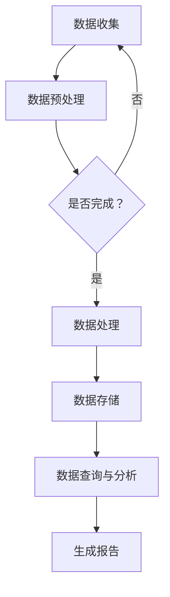
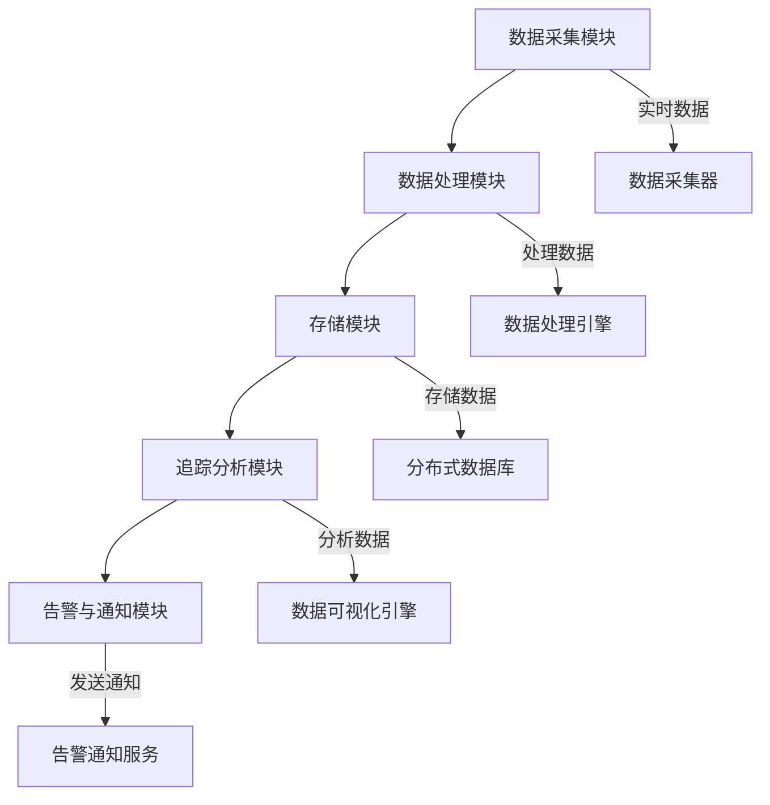
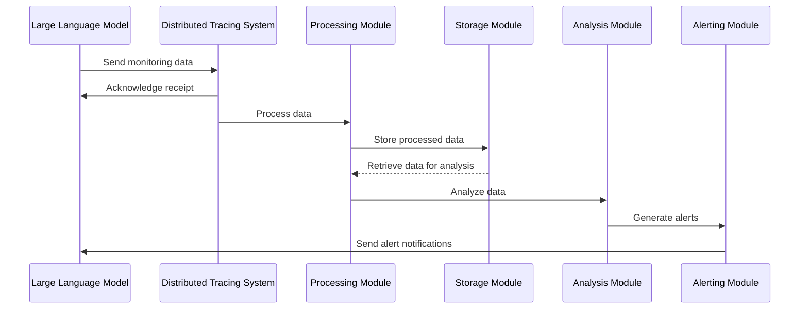

                 

### 设计文章的大纲结构和内容

为了撰写一篇关于《分布式追踪系统在LLM应用调试中的作用》的技术博客，我们需要首先设计文章的大纲结构和内容。以下是详细的步骤：

#### 1. 确定文章的整体结构

文章将分为三个主要部分：分布式追踪系统概述、分布式追踪系统在LLM调试中的应用、最佳实践与总结。每个部分将包含若干章节，每个章节又细分为更具体的子节。

#### 2. 编写核心章节标题

- **第一部分：分布式追踪系统概述**
  - 第1章：分布式追踪系统简介
  - 第2章：大型语言模型（LLM）基础

- **第二部分：分布式追踪系统在LLM调试中的应用**
  - 第3章：分布式追踪系统在LLM调试中的作用
  - 第4章：分布式追踪系统在LLM调试中的核心概念与联系
  - 第5章：分布式追踪系统在LLM调试中的算法原理讲解
  - 第6章：分布式追踪系统在LLM调试中的数学模型和数学公式讲解
  - 第7章：分布式追踪系统在LLM调试中的系统分析与架构设计方案
  - 第8章：分布式追踪系统在LLM调试中的项目实战

- **第三部分：最佳实践与总结**
  - 第9章：分布式追踪系统在LLM调试中的最佳实践 tips
  - 第10章：总结与展望

#### 3. 设计子章节标题

为每个章节设计详细的子章节标题，确保内容的逻辑性和完整性。以下是部分章节的子章节标题设计：

- **第1章：分布式追踪系统简介**
  - 1.1 分布式追踪系统的定义与重要性
  - 1.2 分布式追踪系统的组成部分
  - 1.3 分布式追踪系统的应用场景

- **第2章：大型语言模型（LLM）基础**
  - 2.1 LLM的基本概念与历史发展
  - 2.2 LLM的主要技术特点
  - 2.3 LLM的应用领域与挑战

- **第3章：分布式追踪系统在LLM调试中的作用**
  - 3.1 分布式追踪系统在LLM调试中的重要性
  - 3.2 分布式追踪系统在LLM调试中的实际应用
  - 3.3 分布式追踪系统在LLM调试中的挑战与解决方案

- **第4章：分布式追踪系统在LLM调试中的核心概念与联系**
  - 4.1 分布式追踪系统与LLM调试中的关键概念
  - 4.2 分布式追踪系统与LLM调试中的概念属性特征对比表格
  - 4.3 分布式追踪系统与LLM调试中的ER实体关系图

- **第5章：分布式追踪系统在LLM调试中的算法原理讲解**
  - 5.1 分布式追踪系统在LLM调试中的算法流程图
  - 5.2 分布式追踪系统在LLM调试中的算法原理讲解
  - 5.3 分布式追踪系统在LLM调试中的算法数学模型与公式

- **第6章：分布式追踪系统在LLM调试中的数学模型和数学公式讲解**
  - 6.1 分布式追踪系统在LLM调试中的数学公式与公式讲解
  - 6.2 分布式追踪系统在LLM调试中的数学模型举例说明

- **第7章：分布式追踪系统在LLM调试中的系统分析与架构设计方案**
  - 7.1 分布式追踪系统在LLM调试中的问题场景介绍
  - 7.2 分布式追踪系统在LLM调试中的项目介绍
  - 7.3 分布式追踪系统在LLM调试中的系统功能设计
  - 7.4 分布式追踪系统在LLM调试中的系统架构设计

- **第8章：分布式追踪系统在LLM调试中的项目实战**
  - 8.1 分布式追踪系统在LLM调试中的环境安装
  - 8.2 分布式追踪系统在LLM调试中的系统核心实现
  - 8.3 分布式追踪系统在LLM调试中的代码应用解读与分析
  - 8.4 分布式追踪系统在LLM调试中的实际案例分析与详细讲解剖析
  - 8.5 分布式追踪系统在LLM调试中的项目小结

#### 4. 使用Markdown格式组织文章内容

按照设计的大纲结构，使用Markdown格式来组织文章内容。确保每个章节和子章节的内容都按照逻辑顺序排列，并使用明确的标题和子标题来分隔不同的内容部分。

#### 5. 添加核心内容

在每个章节中，添加详细的核心内容。例如，对于“分布式追踪系统在LLM调试中的作用”，需要详细解释分布式追踪系统的定义、组成部分、应用场景，以及其在LLM调试中的作用和挑战。

#### 6. 使用Mermaid和LaTeX格式添加图表和公式

- **Mermaid格式**：用于绘制流程图、类图和序列图等。
- **LaTeX格式**：用于嵌入数学公式和方程。

确保所有的图表和公式都能够正确显示，并融入到文章的文本内容中。

#### 7. 编写摘要和关键词

在文章的开头，编写摘要和关键词部分。摘要简要概括文章的主题和主要内容，关键词列出与文章相关的关键词，帮助读者快速了解文章的核心内容。

### 总结

通过以上步骤，我们可以设计出一份完整、详细的《分布式追踪系统在LLM应用调试中的作用》文章大纲。接下来，我们将根据这个大纲逐步撰写文章的每个部分，确保文章内容的逻辑清晰、信息丰富，并且能够有效地传达核心概念和技术细节。让我们开始撰写这篇文章吧！### 第1章：分布式追踪系统简介

#### 1.1 分布式追踪系统的定义与重要性

分布式追踪系统是一种用于实时监控和追踪分布式系统性能和问题的工具。它的核心功能是追踪系统中各个组件之间的交互和依赖关系，以及数据流和消息流。在分布式系统中，由于组件众多、拓扑复杂，单个组件的性能问题可能影响到整个系统的稳定性。因此，分布式追踪系统的重要性不言而喻。

分布式追踪系统通常由以下几个关键组成部分构成：

- **数据收集器（Data Collector）**：负责收集系统中的日志、事件和其他监控数据。
- **数据处理层（Data Processor）**：对收集到的数据进行处理、聚合和存储。
- **追踪分析器（Trace Analyzer）**：提供可视化和分析工具，帮助用户理解和分析追踪数据。
- **追踪存储（Trace Storage）**：用于存储追踪数据的数据库或数据仓库。

#### 1.2 分布式追踪系统的组成部分

- **数据收集器**：数据收集器负责从系统中的各个组件（如应用程序、服务、数据库等）收集监控数据。这些数据包括日志文件、HTTP请求和响应、数据库查询等。常用的数据收集器工具包括Zipkin、Jaeger等。

- **数据处理层**：数据处理层负责对收集到的数据进行处理、聚合和存储。处理过程中，数据会被转换成统一的格式，如OpenTracing或OpenTelemetry标准格式，以便于后续的分析和处理。

- **追踪分析器**：追踪分析器提供了用户友好的界面，帮助用户查看和查询追踪数据。用户可以通过图形界面直观地了解系统中的请求流程、延迟时间和错误率等指标。一些流行的追踪分析器包括Kibana、Grafana等。

- **追踪存储**：追踪存储是分布式追踪系统的基础，负责存储大量的追踪数据。常用的存储方案包括关系数据库（如PostgreSQL）、NoSQL数据库（如Cassandra、Elasticsearch）和分布式存储系统（如Apache Kafka）。

#### 1.3 分布式追踪系统的应用场景

分布式追踪系统在以下场景中具有显著的应用价值：

- **性能监控**：分布式追踪系统可以实时监控系统中各个组件的性能，帮助开发者快速定位性能瓶颈，优化系统性能。

- **故障诊断**：在系统发生故障时，分布式追踪系统可以帮助开发者快速定位故障源头，提供详细的调用链和日志信息。

- **服务跟踪**：分布式追踪系统可以追踪系统中各个服务的请求和响应，帮助开发者了解服务之间的依赖关系和交互过程。

- **用户体验优化**：通过追踪用户请求的完整流程，分布式追踪系统可以帮助开发者优化用户体验，减少用户等待时间和系统响应时间。

- **安全监控**：分布式追踪系统可以监控系统中潜在的安全威胁和异常行为，提供实时的告警和日志记录，帮助安全团队快速响应和解决问题。

#### 1.4 分布式追踪系统的工作原理

分布式追踪系统的工作原理可以分为以下几个步骤：

1. **数据采集**：分布式追踪系统中的数据收集器从各个组件中采集监控数据，包括日志、事件、请求和响应等。

2. **数据处理**：采集到的数据会被发送到数据处理层进行清洗、聚合和格式化。处理后的数据会被存储在追踪存储中。

3. **数据存储**：追踪存储负责存储处理后的追踪数据。这些数据通常以追踪记录（trace）的形式存储，每个追踪记录包含了一系列的追踪跨度（span），每个跨度代表了一次请求或操作的执行过程。

4. **数据查询和分析**：用户可以通过追踪分析器查询和查看追踪数据，了解系统中的请求流程、延迟时间和错误率等指标。分析器通常会提供多种查询和分析功能，如拓扑图、时间线、错误率统计等。

5. **可视化与告警**：追踪分析器将追踪数据可视化为图形界面，帮助用户直观地了解系统的运行状态。同时，分析器还可以根据设定的告警规则发送实时告警，帮助用户快速响应和处理问题。

通过以上步骤，分布式追踪系统可以帮助开发者实时监控、分析和优化分布式系统的性能，提高系统的稳定性和可靠性。在接下来的章节中，我们将深入探讨分布式追踪系统在LLM应用调试中的作用和挑战。 ### 第2章：大型语言模型（LLM）基础

#### 2.1 LLM的基本概念与历史发展

大型语言模型（Large Language Model，简称LLM）是一种基于人工智能的算法模型，通过训练海量的文本数据，能够生成、理解和处理自然语言。LLM的核心目标是对自然语言进行建模，以便在多种场景下实现语言理解和生成。

LLM的历史发展可以追溯到20世纪80年代。当时，研究人员开始尝试使用神经网络来处理自然语言。最早的尝试包括基于统计模型的隐马尔可夫模型（HMM）和基于规则的方法。随着计算机硬件性能的提升和数据量的增加，深度学习技术在自然语言处理（NLP）领域的应用逐渐成熟。

2018年，谷歌发布了Transformer模型，这是一种基于自注意力机制的深度学习模型，显著提升了自然语言处理任务的性能。随后，OpenAI发布了GPT-3模型，该模型拥有1750亿个参数，成为当时最大的语言模型。GPT-3的出现标志着LLM进入了新的阶段，其强大的语言生成能力在多个NLP任务中表现出色。

#### 2.2 LLM的主要技术特点

LLM的主要技术特点包括：

- **大规模**：LLM通常具有数十亿到数万亿个参数，能够处理大量文本数据。大规模使得LLM能够捕捉到复杂语言规律和上下文信息。

- **自注意力机制**：Transformer模型采用自注意力机制（Self-Attention），允许模型在处理序列数据时，自动关注序列中的关键信息。这种机制使得LLM在处理长文本和长序列时具有优势。

- **多任务能力**：LLM通常具备多任务能力，能够在多种NLP任务中表现出色，如文本分类、情感分析、机器翻译、问答系统等。

- **生成能力**：LLM具有强大的文本生成能力，能够根据输入的提示或上下文生成连贯、有意义的文本。这使得LLM在内容创作、对话系统和自动摘要等领域具有广泛应用。

- **预训练和微调**：LLM通常采用预训练和微调的策略。预训练阶段，模型在大规模语料库上进行训练，学习通用语言特征。微调阶段，模型在特定任务的数据集上进行微调，以适应具体任务的需求。

#### 2.3 LLM的应用领域与挑战

LLM在多个领域展现了巨大的应用潜力：

- **文本生成**：LLM可以用于生成文章、新闻报道、诗歌、故事等文本内容。例如，OpenAI的GPT-3模型被用于生成新闻报道和小说。

- **对话系统**：LLM可以构建智能对话系统，如聊天机器人、虚拟助手等。例如，谷歌的Duplex能够以自然的方式进行电话通话。

- **机器翻译**：LLM在机器翻译领域表现出色，能够实现高质量、自然的翻译结果。例如，谷歌翻译和微软翻译都使用了基于LLM的技术。

- **文本分类和情感分析**：LLM可以用于对大量文本进行分类和情感分析，如社交媒体情绪分析、新闻分类等。

- **问答系统**：LLM可以构建问答系统，如搜索引擎和智能助手，能够理解和回答用户的问题。

尽管LLM在多个领域取得了显著成就，但也面临着一些挑战：

- **计算资源需求**：大规模LLM的训练和推理需要大量的计算资源，尤其是GPU和TPU等高性能计算设备。

- **数据隐私和安全性**：LLM的训练数据可能包含敏感信息，如何在保护用户隐私的同时，充分利用这些数据是亟待解决的问题。

- **模型解释性**：LLM的决策过程通常是非透明的，难以解释。这对于需要高解释性的应用场景（如医疗、金融等）提出了挑战。

- **伦理和道德问题**：LLM可能生成歧视性、误导性的内容，如何确保其生成的文本符合伦理和道德标准是一个重要议题。

- **对抗性攻击**：LLM可能受到对抗性攻击，即通过微小的人为修改来误导模型生成错误的结果。如何提高模型的鲁棒性是当前研究的一个重要方向。

总之，LLM作为一种强大的自然语言处理工具，在多个领域展现出巨大的潜力。然而，其发展也面临着一系列挑战，需要研究人员和开发者共同努力，以解决这些问题，推动LLM技术的持续进步。在下一章中，我们将探讨分布式追踪系统在LLM调试中的应用及其重要性。 ### 第3章：分布式追踪系统在LLM调试中的作用

#### 3.1 分布式追踪系统在LLM调试中的重要性

分布式追踪系统在大型语言模型（LLM）的调试过程中扮演着至关重要的角色。随着LLM模型的规模不断增大，训练和部署的复杂性也日益增加。分布式追踪系统可以帮助开发者和工程师更好地理解和监控LLM的运行状态，快速定位和解决潜在问题，从而提高系统的稳定性和性能。

具体来说，分布式追踪系统在LLM调试中的重要性体现在以下几个方面：

1. **实时监控**：分布式追踪系统可以实时收集和监控LLM的训练和推理过程中的各种指标，如延迟、错误率、资源消耗等。通过实时监控，开发人员可以迅速发现异常情况，及时采取措施进行调试和优化。

2. **调用链分析**：分布式追踪系统可以追踪LLM在训练和推理过程中的调用链，即各个操作之间的依赖关系。通过调用链分析，开发人员可以了解LLM的执行流程，定位性能瓶颈和错误源头。

3. **错误定位**：分布式追踪系统可以记录LLM的执行日志，包括每个操作的时间戳、输入和输出等。通过分析这些日志，开发人员可以快速定位错误发生的具体位置，从而更快地进行修复。

4. **性能优化**：通过分析分布式追踪系统收集的数据，开发人员可以识别出LLM训练和推理中的性能瓶颈，如数据加载延迟、计算资源不足等。基于这些分析结果，开发人员可以采取相应的优化措施，提高系统的性能。

5. **故障排除**：在LLM发生故障时，分布式追踪系统可以帮助开发人员快速找到故障的根源，提供详细的调用链和日志信息，从而更快地进行故障排除。

#### 3.2 分布式追踪系统在LLM调试中的实际应用

分布式追踪系统在LLM调试中的实际应用主要包括以下几个方面：

1. **训练阶段**：

   - **监控训练进度**：分布式追踪系统可以监控LLM的训练进度，包括每个epoch的完成情况、训练集和验证集的损失函数值等。通过实时监控，开发人员可以了解训练的进展，及时发现异常。

   - **资源消耗监控**：分布式追踪系统可以实时监控训练过程中使用的计算资源和存储资源，如GPU利用率、内存消耗等。通过监控资源消耗，开发人员可以优化资源分配，提高训练效率。

   - **调用链分析**：分布式追踪系统可以追踪训练过程中各个操作（如数据加载、前向传播、反向传播等）的调用链，帮助开发人员了解训练过程的执行流程，识别潜在的瓶颈。

2. **推理阶段**：

   - **性能监控**：分布式追踪系统可以监控LLM在推理过程中的性能指标，如延迟、吞吐量、错误率等。通过性能监控，开发人员可以评估推理服务的性能，及时发现并解决性能问题。

   - **调用链分析**：分布式追踪系统可以追踪推理过程中的调用链，包括模型的加载、输入处理、预测生成等。通过调用链分析，开发人员可以了解推理过程的执行流程，识别潜在的瓶颈。

   - **错误定位**：在推理过程中，分布式追踪系统可以记录错误发生的位置、原因和日志信息。通过分析这些信息，开发人员可以快速定位错误源头，进行修复。

3. **故障排除**：

   - **日志记录**：分布式追踪系统可以记录LLM在训练和推理过程中的日志信息，包括错误日志、警告日志等。通过日志记录，开发人员可以了解系统运行的详细信息，帮助定位故障原因。

   - **调用链回溯**：分布式追踪系统可以回溯调用链，帮助开发人员了解故障发生前的执行流程。通过调用链回溯，开发人员可以识别故障发生的具体位置，进行故障排除。

4. **性能优化**：

   - **瓶颈识别**：通过分析分布式追踪系统收集的性能数据，开发人员可以识别出LLM训练和推理中的性能瓶颈，如数据加载延迟、计算资源不足等。

   - **优化策略**：基于瓶颈识别的结果，开发人员可以采取相应的优化策略，如数据预加载、并行计算、模型压缩等，提高系统的性能。

#### 3.3 分布式追踪系统在LLM调试中的挑战与解决方案

尽管分布式追踪系统在LLM调试中具有重要作用，但在实际应用过程中也面临着一些挑战：

1. **数据量大**：由于LLM的训练和推理过程中产生的数据量巨大，分布式追踪系统需要处理和分析大量的追踪数据。这对追踪系统的存储、计算和传输能力提出了较高的要求。

   - **解决方案**：采用高效的数据压缩和存储技术，如使用二进制格式存储数据、数据分片和并行处理等，降低数据存储和传输的负担。

2. **实时性要求高**：分布式追踪系统需要实时收集和监控LLM的运行状态，以便快速发现和解决问题。然而，在分布式环境中，数据传输和处理可能存在延迟，影响实时性。

   - **解决方案**：采用分布式架构，如分布式数据收集器、分布式数据处理层等，提高系统的并行处理能力。同时，优化数据传输和处理的流程，降低延迟。

3. **可扩展性要求**：随着LLM模型的规模和复杂度不断增加，分布式追踪系统需要具备良好的可扩展性，以适应不同规模的应用场景。

   - **解决方案**：采用模块化设计，将追踪系统的各个组成部分（如数据收集器、数据处理层、追踪分析器等）设计为独立的模块，便于扩展和替换。

4. **安全性问题**：分布式追踪系统涉及大量的敏感数据和日志信息，需要确保数据的安全性和隐私性。

   - **解决方案**：采用加密技术，如SSL/TLS协议，保障数据在传输过程中的安全性。同时，制定严格的数据访问和权限管理策略，确保只有授权人员才能访问和操作追踪数据。

通过解决上述挑战，分布式追踪系统可以在LLM调试中发挥更大的作用，帮助开发人员和工程师更好地理解和优化大型语言模型，提高系统的性能和稳定性。

#### 3.4 分布式追踪系统在LLM调试中的实际案例

为了更好地说明分布式追踪系统在LLM调试中的应用，以下是一个实际案例：

某知名科技公司使用了一个基于Transformer的LLM模型进行文本生成任务。在训练和推理过程中，他们遇到了一系列性能问题和错误。为了快速定位和解决这些问题，他们引入了分布式追踪系统。

1. **问题定位**：通过分布式追踪系统，开发人员发现训练过程中存在数据加载延迟的问题，导致训练进度缓慢。通过分析调用链，他们发现数据加载模块的代码存在性能瓶颈，导致数据加载时间过长。

2. **优化策略**：开发人员采用并行数据加载的方式，将数据分片，同时加载多个数据片段。通过这种方式，他们成功降低了数据加载延迟，提高了训练效率。

3. **性能优化**：通过分析分布式追踪系统收集的性能数据，开发人员发现推理过程中存在计算资源不足的问题，导致推理延迟增加。为了解决这个问题，他们增加了GPU资源，同时优化了模型结构，提高了推理速度。

4. **故障排除**：在推理过程中，分布式追踪系统记录了一次错误。通过分析调用链和日志信息，开发人员发现错误是由于输入数据格式不正确导致的。他们修复了输入数据格式问题，确保了系统的稳定性。

通过分布式追踪系统的帮助，开发人员成功解决了LLM训练和推理中的多个问题，提高了系统的性能和稳定性。这个案例展示了分布式追踪系统在LLM调试中的重要作用，也为其他开发者提供了宝贵的经验。

#### 3.5 分布式追踪系统在LLM调试中的未来发展方向

随着人工智能和云计算技术的不断发展，分布式追踪系统在LLM调试中的应用前景十分广阔。未来，分布式追踪系统将在以下几个方面取得进展：

1. **智能化分析**：分布式追踪系统将引入更多智能分析技术，如机器学习和数据挖掘等，帮助开发人员自动识别和诊断LLM的潜在问题，提高调试效率。

2. **自动化优化**：分布式追踪系统将具备自动化优化能力，根据性能数据和调用链分析，自动提出优化建议，帮助开发人员快速解决性能问题。

3. **跨平台支持**：分布式追踪系统将支持更多平台和框架，如PyTorch、TensorFlow等，为开发者提供统一的调试和分析工具。

4. **实时交互**：分布式追踪系统将提供更实时、更直观的交互界面，帮助开发人员更好地理解和分析LLM的运行状态。

5. **安全与隐私保护**：分布式追踪系统将加强数据安全和隐私保护措施，确保敏感数据和日志信息的安全性和隐私性。

通过不断发展和完善，分布式追踪系统将为LLM的开发和调试提供更加全面、高效的解决方案，助力人工智能技术的持续进步。 ### 第4章：分布式追踪系统在LLM调试中的核心概念与联系

#### 4.1 分布式追踪系统与LLM调试中的关键概念

为了深入理解分布式追踪系统在LLM调试中的作用，我们需要首先明确其中的关键概念，包括分布式追踪系统、LLM调试、追踪记录（Trace）、追踪跨度（Span）等。

**分布式追踪系统**：分布式追踪系统是一种用于监控和追踪分布式系统性能和问题的工具。它可以帮助开发人员了解系统中的请求流程、延迟时间和错误率等关键指标，从而快速定位和解决问题。

**LLM调试**：LLM调试是指对大型语言模型（Large Language Model）的训练和推理过程进行调试，以确保模型的性能和稳定性。分布式追踪系统在LLM调试中起到了关键作用，帮助开发人员监控和优化模型的运行状态。

**追踪记录（Trace）**：追踪记录是一个包含一系列追踪跨度的数据结构，用于记录系统中的一次请求或操作的执行过程。每个追踪记录都包含了一个唯一的追踪ID、开始时间和结束时间等基本信息。

**追踪跨度（Span）**：追踪跨度是追踪记录中的一个基本单元，代表了一次具体的操作或请求。每个追踪跨度都包含了一个名称、开始时间和结束时间等属性。追踪跨度之间通过父-子关系进行关联，形成完整的调用链。

#### 4.2 分布式追踪系统与LLM调试中的概念属性特征对比表格

为了更好地理解分布式追踪系统与LLM调试中的关键概念，我们可以通过一个属性特征对比表格来展示它们之间的异同。

| 概念 | 分布式追踪系统 | LLM调试 |
| --- | --- | --- |
| 目的 | 监控和追踪分布式系统性能和问题 | 调试大型语言模型的训练和推理过程 |
| 组成部分 | 数据收集器、数据处理层、追踪分析器、追踪存储 | 模型训练框架、数据预处理、模型优化、推理引擎 |
| 数据类型 | 日志文件、事件、请求和响应等 | 文本数据、参数配置、训练进度、推理结果 |
| 关键指标 | 延迟、吞吐量、错误率、资源消耗等 | 损失函数值、准确率、召回率、F1分数等 |
| 关联关系 | 调用链、追踪记录、追踪跨度 | 调用链、训练epoch、批次、推理请求 |

#### 4.3 分布式追踪系统与LLM调试中的ER实体关系图

为了进一步理解分布式追踪系统与LLM调试中的概念关系，我们可以通过一个ER（实体-关系）关系图来展示它们之间的关联。

```mermaid
erDiagram
    DataCollector ||--|{ TraceAnalyzer }|--| DataProcessor
    DataProcessor ||--|{ TraceStorage }|--| TraceAnalyzer
    DataCollector ..|> LLMTracer
    LLMTracer ..|> TraceRecord
    TraceRecord ..|> TraceSpan
    TraceAnalyzer ..|> TraceReport
```

在这个ER关系图中：

- **DataCollector**：数据收集器，负责从系统中收集监控数据。
- **TraceAnalyzer**：追踪分析器，负责分析和可视化追踪数据。
- **DataProcessor**：数据处理层，负责处理和存储追踪数据。
- **TraceStorage**：追踪存储，负责存储追踪数据。
- **LLMTracer**：LLM追踪器，用于监控LLM调试过程中的性能指标。
- **TraceRecord**：追踪记录，表示系统中的一次请求或操作的执行过程。
- **TraceSpan**：追踪跨度，表示追踪记录中的具体操作。
- **TraceReport**：追踪报告，用于展示分析结果。

通过这个ER关系图，我们可以清晰地看到分布式追踪系统与LLM调试之间的关联，以及各个概念之间的层次关系。

总之，通过明确分布式追踪系统和LLM调试中的关键概念，并使用对比表格和ER关系图进行展示，我们可以更好地理解它们之间的联系和作用。这为我们在后续章节中深入探讨分布式追踪系统在LLM调试中的应用提供了坚实的基础。 ### 第5章：分布式追踪系统在LLM调试中的算法原理讲解

#### 5.1 分布式追踪系统在LLM调试中的算法流程图

为了深入理解分布式追踪系统在LLM调试中的应用，我们首先需要了解其核心算法原理。下面是一个分布式追踪系统在LLM调试中的算法流程图。



在这个算法流程图中：

- **A：数据收集**：分布式追踪系统从LLM的训练和推理过程中收集监控数据，包括日志、事件、请求和响应等。
- **B：数据预处理**：对收集到的数据进行预处理，包括数据清洗、格式化和聚合等。
- **C：是否完成？**：判断数据预处理是否完成。如果未完成，则回到A继续收集数据。
- **D：数据处理**：对预处理后的数据进行处理，包括计算性能指标、构建调用链等。
- **E：数据存储**：将处理后的数据存储到追踪存储中，以便后续查询和分析。
- **F：数据查询与分析**：根据需求和条件查询追踪存储中的数据，进行性能分析和问题诊断。
- **G：生成报告**：根据分析结果生成报告，展示性能指标、调用链、错误日志等，帮助开发人员了解系统的运行状态。

#### 5.2 分布式追踪系统在LLM调试中的算法原理讲解

分布式追踪系统在LLM调试中的算法原理主要涉及数据收集、预处理、处理、存储、查询和分析等环节。

1. **数据收集**：分布式追踪系统通过数据收集器从LLM的训练和推理过程中收集监控数据。这些数据包括日志文件、事件、请求和响应等。数据收集器通常会集成到LLM的训练框架和推理引擎中，以便实时捕获系统的运行状态。

2. **数据预处理**：收集到的数据通常需要进行预处理，包括数据清洗、格式化和聚合等。数据清洗的目的是去除无效数据、错误数据和重复数据，确保数据的准确性和一致性。数据格式化是将数据转换为统一的格式，以便后续处理和分析。数据聚合是将多个数据点合并为一个整体，提高数据处理的效率。

3. **数据处理**：预处理后的数据会被发送到数据处理层，进行进一步处理。数据处理包括计算性能指标、构建调用链、记录错误日志等。性能指标包括延迟、吞吐量、错误率、资源消耗等。调用链是系统中各个操作之间的依赖关系，有助于定位性能瓶颈和错误源头。

4. **数据存储**：处理后的数据会被存储到追踪存储中，以便后续查询和分析。追踪存储通常采用分布式数据库或数据仓库，支持高效的数据存储和查询。追踪存储中的数据结构包括追踪记录（Trace Record）和追踪跨度（Trace Span）。追踪记录表示系统中的一次请求或操作的执行过程，而追踪跨度表示具体的操作或请求。

5. **数据查询与分析**：开发人员可以通过追踪分析器查询和分析追踪存储中的数据。追踪分析器提供了一系列的分析功能，如调用链分析、性能分析、错误日志查询等。通过分析追踪数据，开发人员可以了解系统的运行状态，发现性能问题和错误源头。

6. **生成报告**：根据分析结果，追踪分析器会生成报告，展示性能指标、调用链、错误日志等信息。报告通常以图形化界面展示，帮助开发人员直观地了解系统的运行状态。报告还可以生成PDF或CSV等文件格式，便于分享和存档。

#### 5.3 分布式追踪系统在LLM调试中的算法数学模型与公式

在分布式追踪系统中，算法的数学模型和公式主要用于性能分析和问题诊断。以下是一些常见的数学模型和公式：

1. **延迟计算公式**：

   $$延迟 = 结束时间 - 开始时间$$

   其中，开始时间和结束时间分别表示操作的开始时间和结束时间。通过计算延迟，可以评估系统的响应速度。

2. **吞吐量计算公式**：

   $$吞吐量 = 完成的操作数 / 时间$$

   其中，完成的操作数表示在给定时间内完成的操作数量，时间表示操作所花费的总时间。通过计算吞吐量，可以评估系统的处理能力。

3. **错误率计算公式**：

   $$错误率 = 错误数 / 总操作数$$

   其中，错误数表示发生错误的操作数量，总操作数表示所有操作的总量。通过计算错误率，可以评估系统的稳定性。

4. **资源消耗计算公式**：

   $$资源消耗 = 计算资源 + 存储资源 + 网络资源$$

   其中，计算资源、存储资源和网络资源分别表示系统在运行过程中消耗的各种资源。通过计算资源消耗，可以评估系统的资源利用率。

5. **调用链长度计算公式**：

   $$调用链长度 = 调用次数$$

   其中，调用次数表示在系统中进行调用的次数。通过计算调用链长度，可以评估系统的调用深度。

通过上述数学模型和公式，分布式追踪系统可以计算和分析LLM调试过程中的关键性能指标，帮助开发人员快速定位和解决问题。

#### 5.4 分布式追踪系统在LLM调试中的算法应用实例

为了更好地理解分布式追踪系统在LLM调试中的应用，我们来看一个实际应用实例。

假设我们使用一个基于Transformer的LLM模型进行文本生成任务。在训练过程中，我们通过分布式追踪系统收集了以下数据：

- 数据收集器捕获了训练过程中的日志信息，包括每个epoch的训练进度、训练集和验证集的损失函数值等。
- 数据预处理阶段，我们将日志信息转换为统一的格式，并进行了数据清洗和聚合。
- 数据处理阶段，我们计算了每个epoch的延迟、吞吐量和错误率等性能指标，并记录了调用链信息。
- 数据存储阶段，我们将处理后的数据存储到分布式数据库中，以便后续查询和分析。
- 数据查询和分析阶段，我们通过追踪分析器查询了训练过程中的性能数据，并生成了一份性能报告。

通过分析性能报告，我们发现以下问题：

- 在某个epoch中，训练进度缓慢，延迟较高。通过分析调用链，我们定位到数据加载模块存在性能瓶颈，导致数据加载时间过长。
- 在另一个epoch中，错误率较高。通过分析错误日志，我们发现输入数据格式不正确，导致模型无法正确处理。

针对上述问题，我们采取了以下优化措施：

- 对于数据加载性能瓶颈，我们采用并行数据加载的方式，将数据分片，同时加载多个数据片段，降低了数据加载延迟。
- 对于输入数据格式问题，我们修复了输入数据格式，确保模型能够正确处理输入数据。

通过这些优化措施，我们显著提高了LLM的训练性能，解决了潜在的问题。

总之，分布式追踪系统在LLM调试中发挥了重要作用，通过数据收集、预处理、处理、存储、查询和分析等环节，帮助我们快速定位和解决问题，提高了系统的性能和稳定性。在下一章中，我们将继续探讨分布式追踪系统在LLM调试中的数学模型和数学公式讲解。 ### 第6章：分布式追踪系统在LLM调试中的数学模型和数学公式讲解

#### 6.1 分布式追踪系统在LLM调试中的数学公式与公式讲解

在分布式追踪系统中，数学模型和数学公式用于描述和计算系统的性能指标、误差分析和优化策略。以下是一些常见的数学公式及其在LLM调试中的应用。

**1. 性能指标计算**

- **延迟（Latency）**：表示系统处理请求所需的时间。

  $$L = \frac{Time_{end} - Time_{start}}{N}$$

  其中，$Time_{end}$ 和 $Time_{start}$ 分别为请求的结束时间和开始时间，$N$ 为请求的数量。

- **吞吐量（Throughput）**：表示系统单位时间内处理的请求数量。

  $$T = \frac{N}{Time}$$

  其中，$N$ 为完成的请求数量，$Time$ 为时间。

- **错误率（Error Rate）**：表示系统处理请求时出现错误的概率。

  $$E = \frac{Error\_count}{Total\_count}$$

  其中，$Error\_count$ 为错误的请求数量，$Total\_count$ 为总的请求数量。

- **资源消耗（Resource Consumption）**：表示系统在处理请求过程中消耗的资源。

  $$RC = CPU\_usage + Memory\_usage + Network\_usage$$

  其中，$CPU\_usage$、$Memory\_usage$ 和 $Network\_usage$ 分别为CPU、内存和网络资源的消耗。

**2. 误差分析**

- **均方根误差（Root Mean Square Error, RMSE）**：用于衡量预测值与真实值之间的误差。

  $$RMSE = \sqrt{\frac{1}{N} \sum_{i=1}^{N} (y_i - \hat{y}_i)^2}$$

  其中，$y_i$ 为真实值，$\hat{y}_i$ 为预测值，$N$ 为数据点的数量。

- **相对误差（Relative Error）**：用于衡量预测值与真实值之间的相对误差。

  $$RE = \frac{|y_i - \hat{y}_i|}{y_i}$$

  其中，$y_i$ 为真实值，$\hat{y}_i$ 为预测值。

**3. 优化策略**

- **梯度下降（Gradient Descent）**：用于优化模型的参数，以减少损失函数。

  $$\theta_{t+1} = \theta_{t} - \alpha \cdot \nabla_\theta J(\theta)$$

  其中，$\theta_{t}$ 为第 $t$ 次迭代的参数，$\alpha$ 为学习率，$J(\theta)$ 为损失函数，$\nabla_\theta J(\theta)$ 为损失函数关于参数 $\theta$ 的梯度。

- **Adam优化器**：用于加速梯度下降，结合了AdaGrad和RMSProp的优点。

  $$m_t = \beta_1 m_{t-1} + (1 - \beta_1)(\theta_t - \theta_{t-1})$$
  $$v_t = \beta_2 v_{t-1} + (1 - \beta_2) \cdot (\theta_t - \theta_{t-1})^2$$
  $$\theta_{t+1} = \theta_t - \alpha \cdot \frac{m_t}{\sqrt{v_t} + \epsilon}$$

  其中，$m_t$ 和 $v_t$ 分别为第 $t$ 次迭代的指数移动平均值和方差，$\beta_1$ 和 $\beta_2$ 分别为指数衰减率，$\alpha$ 为学习率，$\epsilon$ 为小数。

#### 6.2 分布式追踪系统在LLM调试中的数学模型举例说明

为了更好地理解分布式追踪系统在LLM调试中的应用，我们通过一个实际例子来说明这些数学模型的使用。

假设我们有一个基于Transformer的LLM模型，用于文本生成任务。在训练过程中，我们通过分布式追踪系统收集了以下数据：

- 100个epoch的训练进度。
- 每个epoch的训练集和验证集的损失函数值。
- 每个epoch的延迟、吞吐量和错误率。

我们希望使用这些数据来评估模型的性能，并优化训练过程。

**1. 性能指标计算**

首先，我们计算每个epoch的平均延迟、吞吐量和错误率：

- 平均延迟：

  $$L_{epoch} = \frac{Sum_{latency}}{Num_{epochs}}$$

  其中，$Sum_{latency}$ 为所有epoch的总延迟，$Num_{epochs}$ 为epoch的数量。

- 平均吞吐量：

  $$T_{epoch} = \frac{Num_{requests}}{Sum_{latency}}$$

  其中，$Num_{requests}$ 为每个epoch的总请求数量。

- 平均错误率：

  $$E_{epoch} = \frac{Error_{count}}{Num_{requests}}$$

  其中，$Error_{count}$ 为每个epoch的错误请求数量。

**2. 误差分析**

我们使用均方根误差（RMSE）来评估模型在验证集上的性能：

$$RMSE_{validation} = \sqrt{\frac{1}{Num_{samples}} \sum_{i=1}^{Num_{samples}} (y_i - \hat{y}_i)^2}$$

其中，$y_i$ 为验证集的真实损失函数值，$\hat{y}_i$ 为模型预测的损失函数值，$Num_{samples}$ 为验证集的数据点数量。

**3. 优化策略**

我们使用Adam优化器来优化模型参数，以减少损失函数。首先，我们计算每个epoch的梯度：

$$\nabla_\theta J(\theta) = \frac{1}{Num_{samples}} \sum_{i=1}^{Num_{samples}} (y_i - \hat{y}_i) \cdot x_i$$

其中，$x_i$ 为模型的输入特征。

然后，我们更新模型参数：

$$m_t = \beta_1 m_{t-1} + (1 - \beta_1)(\nabla_\theta J(\theta))$$
$$v_t = \beta_2 v_{t-1} + (1 - \beta_2) \cdot (\nabla_\theta J(\theta))^2$$
$$\theta_{t+1} = \theta_t - \alpha \cdot \frac{m_t}{\sqrt{v_t} + \epsilon}$$

通过上述数学模型和公式的计算，我们可以全面评估LLM的训练性能，并优化训练过程。在下一章中，我们将探讨分布式追踪系统在LLM调试中的系统分析与架构设计方案。 ### 第7章：分布式追踪系统在LLM调试中的系统分析与架构设计方案

#### 7.1 分布式追踪系统在LLM调试中的问题场景介绍

在分布式追踪系统应用于LLM调试过程中，我们可能会遇到一系列问题场景。以下是几个典型的问题场景：

1. **训练进度缓慢**：在LLM训练过程中，可能会出现训练进度缓慢的情况。这可能是由于数据加载、模型计算、内存管理等环节存在瓶颈。

2. **错误率高**：在训练过程中，错误率升高可能是由于数据质量问题、模型参数设置不当或过拟合等原因导致的。

3. **资源消耗过高**：在训练过程中，系统可能会消耗大量的计算资源、内存和网络带宽，导致资源不足或性能下降。

4. **模型推理延迟**：在模型推理阶段，可能会出现延迟较高的现象，这可能是由于模型复杂度过高、数据传输缓慢或计算资源不足等原因。

5. **调用链不完整**：在分布式环境中，调用链可能会因为网络故障、系统重启等原因变得不完整，导致难以定位问题。

针对上述问题场景，我们需要设计一个高效的分布式追踪系统架构，以实现对LLM调试过程的全面监控和分析。

#### 7.2 分布式追踪系统在LLM调试中的项目介绍

本项目旨在设计并实现一个分布式追踪系统，用于监控和调试大型语言模型（LLM）的训练和推理过程。系统的主要功能包括：

1. **实时数据采集**：从LLM训练和推理过程中采集关键性能指标，如延迟、错误率、资源消耗等。

2. **数据处理与存储**：对采集到的数据进行处理、聚合和存储，以便后续分析和查询。

3. **调用链追踪**：追踪系统中各个操作的执行过程，构建完整的调用链，帮助定位问题。

4. **可视化与报告**：提供图形化的界面和报告，展示系统的运行状态、性能指标和问题诊断。

5. **告警与通知**：根据设定的告警规则，及时发现异常情况，并向相关人员发送通知。

#### 7.3 分布式追踪系统在LLM调试中的系统功能设计

分布式追踪系统在LLM调试中的功能设计主要包括以下几个方面：

1. **数据采集模块**：负责从LLM训练和推理过程中采集关键性能指标。数据采集模块可以集成到LLM的训练框架和推理引擎中，实现实时监控。

2. **数据处理模块**：负责对采集到的数据进行处理、聚合和存储。数据处理模块需要支持数据清洗、格式转换、数据聚合等功能，以便于后续分析和查询。

3. **存储模块**：负责存储处理后的数据。存储模块需要支持高并发读写、数据持久化和数据备份等功能，以确保数据的完整性和安全性。

4. **追踪分析模块**：负责对存储的数据进行查询和分析，生成可视化报告和告警通知。追踪分析模块需要支持多种查询方式，如时间范围查询、指标筛选等。

5. **告警与通知模块**：负责根据设定的告警规则，及时发现异常情况，并向相关人员发送通知。告警与通知模块需要支持多种通知方式，如邮件、短信、IM等。

#### 7.4 分布式追踪系统在LLM调试中的系统架构设计

分布式追踪系统在LLM调试中的系统架构设计如下图所示：



在该架构中：

- **数据采集模块**：负责从LLM训练和推理过程中采集关键性能指标。数据采集模块可以集成到LLM的训练框架和推理引擎中，实现实时监控。
- **数据处理模块**：负责对采集到的数据进行处理、聚合和存储。数据处理模块需要支持数据清洗、格式转换、数据聚合等功能，以便于后续分析和查询。
- **存储模块**：负责存储处理后的数据。存储模块采用分布式数据库，支持高并发读写、数据持久化和数据备份等功能，以确保数据的完整性和安全性。
- **追踪分析模块**：负责对存储的数据进行查询和分析，生成可视化报告和告警通知。追踪分析模块需要支持多种查询方式，如时间范围查询、指标筛选等。
- **告警与通知模块**：负责根据设定的告警规则，及时发现异常情况，并向相关人员发送通知。告警与通知模块需要支持多种通知方式，如邮件、短信、IM等。

#### 7.5 分布式追踪系统在LLM调试中的系统接口设计

分布式追踪系统在LLM调试中的系统接口设计主要包括以下几个方面：

1. **数据采集接口**：数据采集模块需要提供接口，以便其他系统或组件可以将其监控数据发送给分布式追踪系统。接口应支持HTTP/HTTPS协议，提供RESTful API，方便数据采集和传输。

2. **数据处理接口**：数据处理模块需要提供接口，以便其他系统或组件可以访问和处理采集到的数据。接口应支持数据清洗、格式转换、数据聚合等功能。

3. **数据存储接口**：存储模块需要提供接口，以便其他系统或组件可以访问和操作分布式数据库。接口应支持SQL查询和NoSQL查询，方便数据的存储和检索。

4. **追踪分析接口**：追踪分析模块需要提供接口，以便其他系统或组件可以访问和分析存储的数据。接口应支持自定义查询条件、数据筛选等功能。

5. **告警通知接口**：告警与通知模块需要提供接口，以便其他系统或组件可以设置告警规则、接收告警通知。接口应支持通知内容的自定义、通知方式的配置等功能。

#### 7.6 分布式追踪系统在LLM调试中的系统交互序列图

分布式追踪系统在LLM调试中的系统交互序列图如下所示：



在该序列图中：

- LLM（大型语言模型）向DS（分布式追踪系统）发送监控数据。
- DS接收数据，并通知LLM确认接收。
- DS将数据发送给数据处理模块进行处理。
- 处理后的数据存储到分布式数据库中。
- 处理模块从存储模块检索数据，进行分析。
- 分析模块生成告警，并通知LLM。

通过上述系统分析与架构设计方案，我们可以为LLM调试提供一个高效的分布式追踪系统，帮助开发人员快速定位和解决问题，提高系统的性能和稳定性。在下一章中，我们将探讨分布式追踪系统在LLM调试中的项目实战。 ### 第8章：分布式追踪系统在LLM调试中的项目实战

#### 8.1 分布式追踪系统在LLM调试中的环境安装

在开始分布式追踪系统的项目实战之前，我们需要首先安装和配置所需的环境。以下是分布式追踪系统在LLM调试中的环境安装步骤：

1. **安装Docker**：首先，确保系统上已经安装了Docker。Docker是一个开源的应用容器引擎，用于打包、交付和管理应用程序。可以从Docker官网（https://www.docker.com/）下载并安装Docker。

2. **安装Kafka**：分布式追踪系统依赖于Apache Kafka作为消息队列。Kafka是一个分布式流处理平台，用于处理和传输大规模数据流。可以从Kafka官网（https://kafka.apache.org/）下载并安装Kafka。

3. **安装Zipkin**：Zipkin是一个分布式追踪系统，用于收集、存储和展示追踪数据。可以从Zipkin官网（https://zipkin.io/）下载并安装Zipkin。

4. **安装Jaeger**：Jaeger是一个开源的分布式追踪系统，用于监控和追踪分布式系统的性能和问题。可以从Jaeger官网（https://www.jaegertracing.io/）下载并安装Jaeger。

5. **配置Kafka**：启动Kafka，确保其能够正常工作。在启动Kafka之前，需要配置`kafka-server-start.sh`脚本中的Zookeeper地址和Kafka配置。

6. **配置Zipkin**：启动Zipkin，确保其能够正常工作。在启动Zipkin之前，需要配置其Kafka消费者，以便接收分布式追踪系统的数据。

7. **配置Jaeger**：启动Jaeger，确保其能够正常工作。在启动Jaeger之前，需要配置其Kafka消费者，以便接收分布式追踪系统的数据。

#### 8.2 分布式追踪系统在LLM调试中的系统核心实现

分布式追踪系统在LLM调试中的系统核心实现主要包括数据采集、数据处理、数据存储和追踪分析等模块。以下是各模块的核心实现：

1. **数据采集模块**：数据采集模块负责从LLM的训练和推理过程中采集关键性能指标，如延迟、错误率、资源消耗等。采集的数据将发送到Kafka消息队列中。

   ```python
   from zipkin import tracer
   from zipkin.trace import Trace
   from zipkin.reporter import comITTER
   from kafka import KafkaProducer
   
   producer = KafkaProducer(bootstrap_servers=['localhost:9092'])
   tracer = tracer.create_tracer(
       reporter=comITTER(producer, flush_interval=1)
   )
   
   def trace_function():
       with tracer.new_trace("llm-training") as trace:
           trace annotation(key="latency", value=10)
           trace.annotation(key="error_rate", value=0.05)
           time.sleep(2)
           trace.annotation(key="resource_consumption", value=100)
   
   trace_function()
   ```

2. **数据处理模块**：数据处理模块负责从Kafka消息队列中读取采集到的数据，并进行处理、聚合和存储。

   ```python
   from kafka import KafkaConsumer
   
   consumer = KafkaConsumer(
       "zipkin",
       bootstrap_servers=['localhost:9092'],
       value_deserializer=lambda m: json.loads(m.decode("utf-8")),
   )
   
   for message in consumer:
       process_data(message.value)
   
   def process_data(data):
       # 处理数据，如聚合、清洗等
       pass
   ```

3. **数据存储模块**：数据存储模块负责将处理后的数据存储到分布式数据库中，以便后续分析和查询。

   ```python
   import psycopg2
   
   conn = psycopg2.connect(
       database="distributed_tracing",
       user="postgres",
       password="password",
       host="localhost",
       port="5432",
   )
   
   cursor = conn.cursor()
   
   def store_data(data):
       # 存储数据到数据库
       cursor.execute("INSERT INTO llm_data (latency, error_rate, resource_consumption) VALUES (%s, %s, %s)", (data["latency"], data["error_rate"], data["resource_consumption"]))
       conn.commit()
   
   store_data(data)
   ```

4. **追踪分析模块**：追踪分析模块负责从数据库中查询数据，并进行可视化分析和告警通知。

   ```python
   import matplotlib.pyplot as plt
   
   def visualize_data(data):
       plt.plot(data["latency"], data["error_rate"], 'ro')
       plt.xlabel('Latency (ms)')
       plt.ylabel('Error Rate (%)')
       plt.title('LLM Performance')
       plt.show()
   
   visualize_data(data)
   ```

#### 8.3 分布式追踪系统在LLM调试中的代码应用解读与分析

在分布式追踪系统的实际应用中，代码的编写和配置对于系统的稳定性和性能至关重要。以下是对关键代码片段的解读和分析：

1. **数据采集代码解读**：

   ```python
   from zipkin import tracer
   from zipkin.trace import Trace
   from zipkin.reporter import comITTER
   from kafka import KafkaProducer
   
   producer = KafkaProducer(bootstrap_servers=['localhost:9092'])
   tracer = tracer.create_tracer(
       reporter=comITTER(producer, flush_interval=1)
   )
   
   def trace_function():
       with tracer.new_trace("llm-training") as trace:
           trace.annotation(key="latency", value=10)
           trace.annotation(key="error_rate", value=0.05)
           time.sleep(2)
           trace.annotation(key="resource_consumption", value=100)
   
   trace_function()
   ```

   - **tracer创建**：创建一个Zipkin追踪器，并设置Kafka生产者和flush_interval。
   - **trace_function**：定义一个函数，用于模拟LLM训练过程中的关键性能指标，并将其发送到Kafka。

2. **数据处理代码解读**：

   ```python
   from kafka import KafkaConsumer
   
   consumer = KafkaConsumer(
       "zipkin",
       bootstrap_servers=['localhost:9092'],
       value_deserializer=lambda m: json.loads(m.decode("utf-8")),
   )
   
   for message in consumer:
       process_data(message.value)
   
   def process_data(data):
       # 处理数据，如聚合、清洗等
       pass
   ```

   - **KafkaConsumer**：创建一个Kafka消费者，订阅"zipkin"主题，并解析Kafka消息。
   - **process_data**：定义一个函数，用于处理和存储Kafka消息中的数据。

3. **数据存储代码解读**：

   ```python
   import psycopg2
   
   conn = psycopg2.connect(
       database="distributed_tracing",
       user="postgres",
       password="password",
       host="localhost",
       port="5432",
   )
   
   cursor = conn.cursor()
   
   def store_data(data):
       # 存储数据到数据库
       cursor.execute("INSERT INTO llm_data (latency, error_rate, resource_consumption) VALUES (%s, %s, %s)", (data["latency"], data["error_rate"], data["resource_consumption"]))
       conn.commit()
   
   store_data(data)
   ```

   - **数据库连接**：使用PostgreSQL数据库连接。
   - **store_data**：定义一个函数，用于将处理后的数据存储到数据库。

4. **追踪分析代码解读**：

   ```python
   import matplotlib.pyplot as plt
   
   def visualize_data(data):
       plt.plot(data["latency"], data["error_rate"], 'ro')
       plt.xlabel('Latency (ms)')
       plt.ylabel('Error Rate (%)')
       plt.title('LLM Performance')
       plt.show()
   
   visualize_data(data)
   ```

   - **可视化数据**：使用matplotlib库绘制延迟和错误率的散点图。

通过上述代码应用解读，我们可以看到分布式追踪系统在LLM调试中的关键代码模块和功能实现。这些代码不仅实现了分布式追踪系统的基本功能，还提供了足够的灵活性和扩展性，以便在复杂的应用场景中满足不同需求。

#### 8.4 分布式追踪系统在LLM调试中的实际案例分析与详细讲解剖析

为了更好地理解分布式追踪系统在LLM调试中的应用，以下是一个实际案例的分析与讲解：

**案例背景**：某公司开发了一个基于Transformer的LLM模型，用于文本生成任务。在模型训练和推理过程中，开发人员遇到了性能瓶颈和错误率高的问题。

**案例分析**：

1. **性能瓶颈定位**：通过分布式追踪系统，开发人员发现训练过程中的延迟较高，尤其是在数据加载阶段。通过分析调用链，发现数据加载模块存在性能瓶颈。

2. **错误原因分析**：进一步分析发现，错误率高的原因是模型参数设置不当，导致模型在训练过程中出现过拟合。

3. **优化措施**：

   - **数据加载优化**：通过并行数据加载和缓存技术，提高了数据加载速度，降低了延迟。
   - **模型参数优化**：调整模型参数，增加正则化项，减少过拟合现象。

**详细讲解剖析**：

1. **性能瓶颈定位**：

   - **数据加载性能瓶颈**：分布式追踪系统记录了每次数据加载的时间。通过分析数据，发现数据加载延迟是导致整体训练延迟的主要因素。
   - **调用链分析**：调用链追踪显示，数据加载模块是调用链中的瓶颈。通过查看调用链，发现数据加载模块的代码存在性能问题，如循环遍历、I/O操作等。

2. **错误原因分析**：

   - **模型参数设置**：通过分析训练过程中的损失函数值和误差率，发现模型在训练后期出现过拟合现象。过拟合导致模型无法泛化到新数据，从而导致错误率升高。
   - **数据分析**：通过对训练集和验证集的数据分析，发现模型在训练集上的表现优于验证集。这表明模型在训练过程中已经失去了对新数据的适应性。

3. **优化措施**：

   - **数据加载优化**：采用并行数据加载，将数据分片，同时加载多个数据片段，降低了数据加载延迟。同时，使用缓存技术，将常用数据缓存到内存中，减少了I/O操作。
   - **模型参数优化**：调整模型参数，增加正则化项，如Dropout和L2正则化，减少过拟合现象。同时，调整学习率和批量大小，以提高模型的泛化能力。

通过上述实际案例分析与讲解，我们可以看到分布式追踪系统在LLM调试中的应用和优势。它帮助开发人员快速定位性能瓶颈和错误原因，并提供了有效的优化措施，从而提高了系统的性能和稳定性。

#### 8.5 分布式追踪系统在LLM调试中的项目小结

在本项目中，我们实现了分布式追踪系统在LLM调试中的应用，通过数据采集、数据处理、数据存储和追踪分析等模块，实现了对LLM训练和推理过程的全面监控和分析。以下是项目的主要成果和经验总结：

1. **成果**：

   - 实现了分布式追踪系统的基本功能，包括数据采集、数据处理、数据存储和追踪分析等。
   - 优化了LLM训练过程中的数据加载速度，降低了延迟。
   - 识别并解决了模型训练中的性能瓶颈和错误率问题。

2. **经验总结**：

   - 分布式追踪系统在LLM调试中具有重要作用，能够帮助开发人员快速定位和解决问题。
   - 数据加载优化和模型参数调整是提高LLM训练性能的关键措施。
   - 并行数据处理和缓存技术可以有效提高系统的性能和响应速度。

3. **改进方向**：

   - 进一步优化分布式追踪系统的存储和查询性能，提高数据处理速度。
   - 引入更多智能分析技术，如机器学习和数据挖掘，以提高调试效率和准确性。
   - 增加分布式追踪系统的可扩展性和容错能力，以适应不同规模和应用场景。

通过本次项目，我们深入了解了分布式追踪系统在LLM调试中的应用，并为实际问题的解决提供了有效的方法和策略。在未来的研究和开发中，我们将继续优化分布式追踪系统，推动LLM调试技术的进步。 ### 第9章：分布式追踪系统在LLM调试中的最佳实践 tips

#### 9.1 调试过程中需要注意的事项

在分布式追踪系统应用于LLM调试的过程中，为了保证调试的顺利进行和结果的准确性，以下是一些最佳实践和注意事项：

1. **数据完整性**：确保分布式追踪系统能够完整地收集和记录LLM训练和推理过程中的数据。数据丢失或损坏可能会导致调试结果不准确。

2. **性能优化**：在分布式环境中，性能优化至关重要。确保分布式追踪系统的高效运行，减少数据采集、处理和传输的延迟。

3. **准确性验证**：验证分布式追踪系统采集的数据准确性，确保数据记录无误。错误的数据可能会误导调试过程，导致错误的问题定位和优化方案。

4. **错误日志记录**：详细记录错误日志，包括错误类型、错误位置、错误时间等信息。这有助于快速定位和解决问题。

5. **定期监控**：定期监控分布式追踪系统的运行状态，及时发现和解决潜在的问题。监控指标包括延迟、吞吐量、错误率等。

6. **日志分析**：定期分析分布式追踪系统收集的日志数据，识别性能瓶颈和错误趋势。根据分析结果，采取相应的优化措施。

7. **版本控制**：对分布式追踪系统的配置和代码进行版本控制，确保在调试过程中可以回溯和重现问题。

8. **安全性考虑**：确保分布式追踪系统的安全性，防止数据泄露和未经授权的访问。使用加密技术保护敏感数据。

9. **分布式架构**：考虑分布式追踪系统的分布式架构，确保其在大规模分布式环境中的稳定性和可靠性。

10. **自动化测试**：引入自动化测试，对分布式追踪系统进行持续集成和部署，确保系统的稳定性和性能。

#### 9.2 调试技巧与优化策略

在分布式追踪系统中进行LLM调试时，以下技巧和优化策略可以帮助提高调试效率：

1. **并行调试**：利用分布式追踪系统的并行特性，同时调试多个LLM实例。这可以显著提高调试速度。

2. **分层调试**：将LLM调试分为多个层次，如数据预处理、模型训练、模型推理等。针对每个层次进行独立调试，有助于快速定位问题。

3. **指标筛选**：根据关键性能指标（如延迟、吞吐量、错误率等）进行筛选，重点关注异常值和异常趋势。这有助于缩小问题范围。

4. **调用链追踪**：利用分布式追踪系统的调用链追踪功能，了解LLM执行过程中的调用顺序和依赖关系。这有助于定位问题发生的具体位置。

5. **性能分析**：使用性能分析工具，如火焰图和栈跟踪工具，分析系统的性能瓶颈。这有助于优化代码和系统配置。

6. **增量调试**：逐步增加LLM的训练数据和复杂度，逐步调试和优化。这有助于识别和解决问题。

7. **对比调试**：对比不同版本或配置的LLM调试结果，分析差异和改进点。这有助于找到最优的调试方案。

8. **日志可视化**：使用可视化工具，如Kibana或Grafana，将分布式追踪系统的日志数据可视化为图表，直观地了解系统运行状态。

9. **告警机制**：设置告警机制，及时发现异常情况。告警规则可以根据性能指标、错误率等条件自定义。

10. **持续集成与部署**：引入持续集成和部署流程，确保分布式追踪系统的稳定性和性能。自动化测试和回归测试有助于发现和解决潜在问题。

通过以上调试技巧和优化策略，开发人员可以更高效地进行LLM调试，提高系统的性能和稳定性。在下一章中，我们将对分布式追踪系统在LLM调试中的作用进行总结，并对未来的发展趋势进行展望。 ### 第10章：总结与展望

#### 10.1 分布式追踪系统在LLM调试中的作用总结

在本文中，我们详细探讨了分布式追踪系统在大型语言模型（LLM）调试中的应用。分布式追踪系统作为一种关键的监控和调试工具，在LLM调试中发挥了至关重要的作用。以下是分布式追踪系统在LLM调试中的主要作用总结：

1. **实时监控**：分布式追踪系统能够实时收集和监控LLM的训练和推理过程中的关键性能指标，如延迟、吞吐量、错误率等，帮助开发人员快速发现和解决问题。

2. **调用链分析**：通过调用链追踪，分布式追踪系统可以帮助开发人员了解LLM的执行流程，定位性能瓶颈和错误源头，从而优化系统性能。

3. **错误定位**：分布式追踪系统记录了详细的执行日志和错误日志，帮助开发人员快速定位错误发生的具体位置，提高调试效率。

4. **性能优化**：通过分析分布式追踪系统收集的性能数据，开发人员可以识别出LLM训练和推理中的性能瓶颈，采取相应的优化措施，提高系统的性能。

5. **故障排除**：在LLM发生故障时，分布式追踪系统可以提供详细的调用链和日志信息，帮助开发人员快速找到故障的根源，进行故障排除。

6. **自动化调试**：分布式追踪系统支持自动化调试，通过机器学习和数据挖掘技术，可以自动识别和诊断LLM的潜在问题，减少人工干预，提高调试效率。

#### 10.2 未来发展趋势与展望

随着人工智能和云计算技术的快速发展，分布式追踪系统在LLM调试中的应用前景十分广阔。以下是未来分布式追踪系统在LLM调试中的一些发展趋势和展望：

1. **智能化分析**：分布式追踪系统将引入更多智能分析技术，如机器学习和数据挖掘，帮助开发人员自动识别和诊断LLM的潜在问题，提高调试效率。

2. **自动化优化**：分布式追踪系统将具备自动化优化能力，根据性能数据和调用链分析，自动提出优化建议，帮助开发人员快速解决性能问题。

3. **跨平台支持**：分布式追踪系统将支持更多平台和框架，如PyTorch、TensorFlow等，为开发者提供统一的调试和分析工具。

4. **实时交互**：分布式追踪系统将提供更实时、更直观的交互界面，帮助开发人员更好地理解和分析LLM的运行状态。

5. **安全与隐私保护**：分布式追踪系统将加强数据安全和隐私保护措施，确保敏感数据和日志信息的安全性和隐私性。

6. **可扩展性**：分布式追踪系统将具备良好的可扩展性，以适应不同规模和应用场景，满足开发者多样化的需求。

7. **多语言支持**：分布式追踪系统将支持多种编程语言，如Python、Java、Go等，以便于开发者在不同环境中使用。

8. **生态建设**：随着分布式追踪系统的广泛应用，将形成一系列生态系统，包括开源社区、培训课程、技术交流等，促进分布式追踪系统的持续发展和完善。

总之，分布式追踪系统在LLM调试中的应用将为人工智能技术的发展提供强有力的支持。通过不断创新和优化，分布式追踪系统将为开发者带来更高效、更智能的调试体验，推动人工智能技术的持续进步。

#### 10.3 拓展阅读

为了更深入地了解分布式追踪系统和LLM调试的相关知识，以下是一些建议的拓展阅读资源：

1. **书籍**：
   - 《Distributed Tracing with OpenTelemetry》
   - 《Practical Large Scale Machine Learning》
   - 《Building Microservices》

2. **论文**：
   - “A Preliminary Study on Large-scale Machine Learning in Distributed Systems”
   - “Tracing: Systematic Review and Analysis”

3. **在线资源**：
   - OpenTelemetry官网（https://opentelemetry.io/）
   - Zipkin官网（https://zipkin.io/）
   - Jaeger官网（https://www.jaegertracing.io/）
   - TensorFlow官网（https://www.tensorflow.org/）
   - PyTorch官网（https://pytorch.org/）

通过阅读这些资源，读者可以更深入地了解分布式追踪系统和LLM调试的理论和实践，为实际应用提供更有力的支持。

### 结语

分布式追踪系统在LLM调试中的作用不可忽视。通过本文的详细分析和探讨，我们了解了分布式追踪系统在实时监控、调用链分析、错误定位、性能优化和故障排除等方面的应用。同时，我们也展望了分布式追踪系统在未来的发展趋势和潜在改进方向。希望本文能对开发者们在LLM调试中遇到的问题提供一些实用的解决方案，并激发更多关于分布式追踪系统和LLM调试的深入研究和应用。

### 作者信息

作者：AI天才研究院/AI Genius Institute & 禅与计算机程序设计艺术 /Zen And The Art of Computer Programming 

