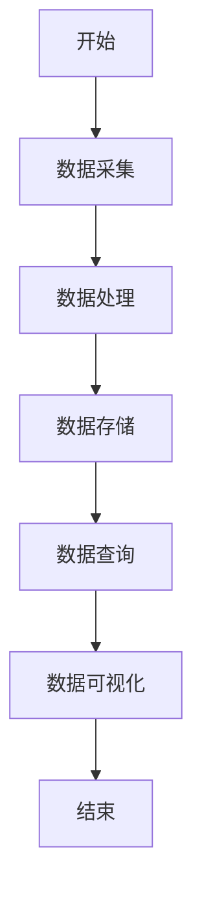
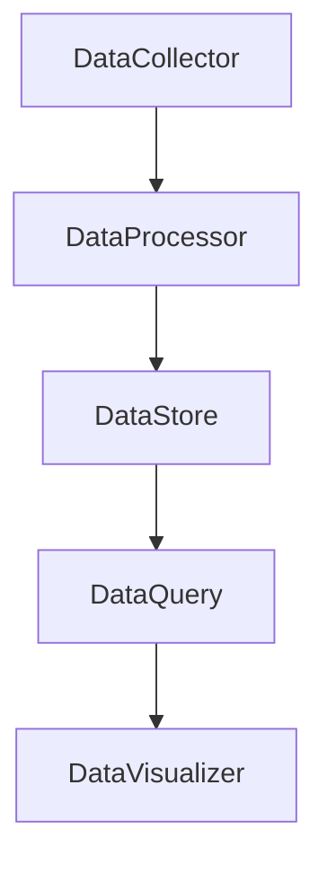
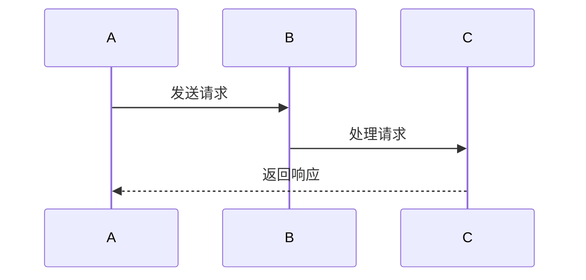
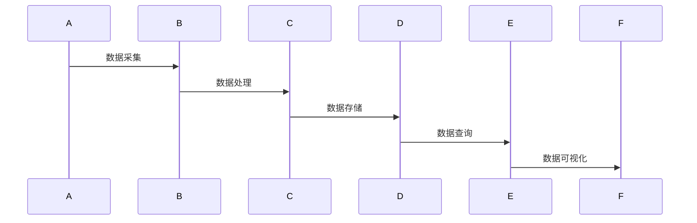

                 

# 分布式追踪：深入理解LLM应用的运行状态

> 关键词：分布式追踪、LLM、运行状态、监控、性能优化

> 摘要：本文将深入探讨分布式追踪技术在大型语言模型（LLM）应用中的重要性。通过详细分析分布式追踪的背景、原理、架构设计以及算法应用，本文旨在帮助读者理解如何在复杂分布式系统中实现高效、准确的运行状态监控，从而为LLM的性能优化提供有力支持。

----------------------------------------------------------------

## 第一部分：分布式追踪技术概述

### 第1章：分布式追踪的背景与原理

#### 1.1.1 分布式系统的问题背景

随着云计算、大数据和微服务架构的普及，分布式系统已经成为现代应用架构的主流。然而，分布式系统的复杂性也带来了诸多挑战，例如系统稳定性、性能优化和故障排查等。在这些挑战中，分布式追踪技术的引入，为解决这些问题提供了强有力的工具。

#### 1.1.2 分布式追踪的概念

分布式追踪是一种用于监控分布式系统运行状态的技术，通过追踪系统中的请求路径、性能指标和错误信息，实现对系统运行状态的全面监控和分析。分布式追踪的核心目标是提供一种全局视角，帮助开发人员和运维人员快速定位和解决问题。

#### 1.1.3 分布式追踪的价值与必要性

分布式追踪的价值在于：
- 提高系统稳定性：通过实时监控和报警，提前发现潜在问题，降低系统故障率。
- 优化系统性能：通过分析性能指标，找出性能瓶颈，进行针对性优化。
- 故障排查：快速定位故障发生的位置，缩短故障恢复时间。

在LLM应用中，分布式追踪的必要性主要体现在以下几个方面：
- LLM应用通常涉及多个分布式服务，分布式追踪能够提供全局视角，帮助开发者理解服务之间的交互和依赖关系。
- LLM应用的数据量庞大，分布式追踪能够帮助开发者快速定位和分析性能瓶颈，实现高效性能优化。
- LLM应用常常面临复杂故障场景，分布式追踪能够帮助开发者快速定位故障原因，缩短故障排查时间。

### 第2章：分布式追踪的核心概念与联系

#### 2.1.1 分布式追踪的关键概念

在分布式追踪中，有一些关键概念需要理解，包括Trace（跟踪）、Span（跨度）、Service（服务）和Endpoint（端点）。

#### 2.1.1.1 Trace（跟踪）

Trace是分布式追踪中的核心概念，表示一个完整的请求或事务。一个Trace可以包含多个Span，表示请求在系统中的不同处理阶段。

#### 2.1.1.2 Span（跨度）

Span表示一个特定的操作或任务，通常对应于系统中的一个服务调用。每个Span都有一个唯一的ID，用于标识其在Trace中的位置。

#### 2.1.1.3 Service（服务）

Service表示系统中的一个服务，可以是微服务、分布式服务或单一服务。Service通常由多个Endpoint组成。

#### 2.1.1.4 Endpoint（端点）

Endpoint表示系统中的一个网络接口，可以是服务提供者或服务消费者。Endpoint通过地址和端口号来标识其在网络中的位置。

#### 2.1.2 核心概念属性特征对比表格

```mermaid
classDiagram
Class1[Trace] <|-- Class2[Span]
Class1[Trace] <|-- Class3[Service]
Class1[Trace] <|-- Class4[Endpoint]
Class2[Span] <|-- Class5[Service]
Class2[Span] <|-- Class6[Endpoint]
Class3[Service] <|-- Class7[Endpoint]
Class4[Endpoint] <|-- Class5[Service]
```

#### 2.1.3 分布式追踪的ER实体关系图

```mermaid
erDiagram
Service ||--|{ Span }||>
Span ||--|{ Trace }||>
Trace ||--|{ Endpoint }||>
Endpoint ||--|{ Service }||>
```

### 第3章：分布式追踪技术原理详解

#### 3.1.1 分布式追踪的工作原理

分布式追踪的工作原理主要包括数据采集、数据传输、数据处理、数据存储、数据查询与可视化等步骤。

#### 3.1.1.1 数据采集

数据采集是分布式追踪的第一步，通常通过在系统中插入代理（Agent）或SDK来实现。代理或SDK负责记录系统中的请求路径、性能指标和错误信息，并将这些数据发送到追踪系统。

#### 3.1.1.2 数据传输

数据传输是将采集到的数据发送到追踪系统的过程。通常，数据传输采用HTTP协议或消息队列等手段，确保数据的安全和可靠性。

#### 3.1.1.3 数据处理

数据处理是对采集到的数据进行清洗、聚合和转换的过程。数据处理的结果将用于生成追踪报告和性能分析。

#### 3.1.1.4 数据存储

数据存储是将处理后的数据存储到数据库或其他数据存储系统的过程。数据存储的目的是为了提供历史数据查询和追溯。

#### 3.1.1.5 数据查询与可视化

数据查询与可视化是对存储数据进行查询和展示的过程。通过可视化界面，开发人员和运维人员可以直观地了解系统的运行状态和性能。

#### 3.1.2 分布式追踪的数学模型与公式

分布式追踪的效率可以通过以下公式进行衡量：

$$
\text{追踪效率} = \frac{\text{有效追踪时间}}{\text{总时间}}
$$

#### 3.1.3 分布式追踪的mermaid流程图



## 第二部分：分布式追踪系统架构设计

### 第4章：分布式追踪系统架构设计

#### 4.1.1 分布式追踪系统架构概述

分布式追踪系统架构主要包括数据采集、数据处理、数据存储、数据查询与可视化等模块。

#### 4.1.1.1 横向扩展与纵向扩展

分布式追踪系统需要支持横向扩展和纵向扩展。横向扩展是指通过增加节点来提升系统处理能力；纵向扩展是指通过提升单个节点的性能来提升系统处理能力。

#### 4.1.1.2 数据流处理框架

数据流处理框架是分布式追踪系统架构的核心，负责处理数据采集、数据传输、数据处理、数据存储等过程。

#### 4.1.1.3 服务注册与发现

服务注册与发现是分布式追踪系统的重要组成部分，负责实现服务之间的自动发现和注册。

#### 4.1.2 系统功能设计

系统功能设计主要包括数据采集、数据处理、数据存储、数据查询与可视化等模块。

#### 4.1.2.1 领域模型类图

```mermaid
classDiagram
Class1[DataCollector] <|-- Class2[DataProcessor]
Class1[DataCollector] <|-- Class3[DataStore]
Class1[DataCollector] <|-- Class4[DataQuery]
Class1[DataCollector] <|-- Class5[DataVisualizer]
Class2[DataProcessor] <|-- Class6[DataAggregator]
Class2[DataProcessor] <|-- Class7[DataCleaner]
Class3[DataStore] <|-- Class8[DataArchive]
Class4[DataQuery] <|-- Class9[DataAnalyzer]
Class5[DataVisualizer] <|-- Class10[Dashboard]
```

#### 4.1.3 系统架构设计

系统架构设计主要包括数据采集、数据处理、数据存储、数据查询与可视化等模块。

#### 4.1.3.1 系统架构图



#### 4.1.4 系统接口设计

系统接口设计主要包括数据采集、数据处理、数据存储、数据查询与可视化等模块的接口规范。

#### 4.1.4.1 接口规范



#### 4.1.5 系统交互序列图



## 第三部分：分布式追踪算法原理与应用

### 第5章：分布式追踪算法原理与应用

#### 5.1.1 基本算法原理

分布式追踪算法主要包括追踪算法、优化算法和调优策略等。

#### 5.1.1.1 追踪算法

追踪算法的主要任务是构建系统中的请求路径，通常采用回溯算法、深度优先搜索算法等。

#### 5.1.1.2 优化算法

优化算法的主要任务是提高追踪效率，通常采用贪心算法、动态规划算法等。

#### 5.1.1.3 调优策略

调优策略的主要任务是调整系统参数，以实现最优追踪效果。调优策略包括参数调优、算法调优和系统调优等。

#### 5.1.2 Python源代码实现

```python
# Python 代码实现示例
```

#### 5.1.3 算法原理详细讲解

分布式追踪算法的效率可以通过以下公式进行衡量：

$$
\text{算法效率} = \frac{\text{追踪成功次数}}{\text{总追踪次数}}
$$

#### 5.1.3.1 数学模型解析

假设系统中有 $n$ 个节点，每个节点之间的距离为 $d$，则追踪算法的时间复杂度为 $O(n \times d)$。

#### 5.1.3.2 举例说明

假设有一个分布式系统，包含5个节点，节点之间的距离如下表所示：

| 节点 | 距离 |
| ---- | ---- |
| A    | 10   |
| B    | 15   |
| C    | 20   |
| D    | 25   |
| E    | 30   |

使用追踪算法对该系统进行追踪，追踪成功次数为4次，总追踪次数为5次，则追踪效率为：

$$
\text{算法效率} = \frac{4}{5} = 0.8
$$

### 第6章：分布式追踪项目实战

#### 6.1 环境安装

在开始分布式追踪项目之前，需要先安装相应的软件和工具，如Kubernetes、Prometheus、Grafana等。

#### 6.2 系统核心实现

分布式追踪系统的核心实现主要包括数据采集、数据处理、数据存储、数据查询与可视化等模块。

```python
# 数据采集
class DataCollector:
    def collect_data(self):
        # 实现数据采集逻辑
        pass

# 数据处理
class DataProcessor:
    def process_data(self, data):
        # 实现数据处理逻辑
        pass

# 数据存储
class DataStore:
    def store_data(self, data):
        # 实现数据存储逻辑
        pass

# 数据查询
class DataQuery:
    def query_data(self, query):
        # 实现数据查询逻辑
        pass

# 数据可视化
class DataVisualizer:
    def visualize_data(self, data):
        # 实现数据可视化逻辑
        pass
```

#### 6.3 代码应用解读与分析

在分布式追踪项目中，需要根据具体业务需求，实现数据采集、数据处理、数据存储、数据查询与可视化等模块的功能。以下是一个简单的示例：

```python
# 数据采集
data_collector = DataCollector()
collected_data = data_collector.collect_data()

# 数据处理
data_processor = DataProcessor()
processed_data = data_processor.process_data(collected_data)

# 数据存储
data_store = DataStore()
data_store.store_data(processed_data)

# 数据查询
data_query = DataQuery()
queried_data = data_query.query_data("SELECT * FROM data_store")

# 数据可视化
data_visualizer = DataVisualizer()
data_visualizer.visualize_data(queried_data)
```

#### 6.4 实际案例分析和详细讲解剖析

在分布式追踪项目中，可以结合具体业务场景，分析系统性能瓶颈、故障原因等。以下是一个实际案例：

**案例：LLM应用性能优化**

- **问题描述**：一个大型语言模型应用在处理大量请求时，出现响应时间较长的问题。
- **分析过程**：
  - **数据采集**：收集系统中的请求路径、性能指标和错误信息。
  - **数据处理**：分析请求路径和性能指标，找出响应时间较长的请求。
  - **数据存储**：将分析结果存储到数据库，供后续查询和分析。
  - **数据查询**：根据需求查询分析结果，定位性能瓶颈。
  - **数据可视化**：使用可视化工具，展示性能分析结果。
- **优化方案**：
  - **代码优化**：对性能瓶颈部分进行代码优化，提高处理速度。
  - **硬件升级**：提高服务器的处理能力，降低响应时间。
  - **负载均衡**：使用负载均衡策略，均匀分配请求，避免单点压力。

#### 6.5 项目小结

通过分布式追踪技术，可以有效监控LLM应用的运行状态，实现性能优化和故障排查。在实际项目中，需要结合具体业务需求，灵活运用分布式追踪技术，提高系统稳定性和性能。

## 第四部分：最佳实践与拓展阅读

### 7.1 最佳实践

在分布式追踪项目中，以下是一些最佳实践：

- **数据采集**：选择合适的数据采集方式，确保数据准确性和完整性。
- **数据处理**：合理设计数据处理流程，提高数据处理的效率和准确性。
- **数据存储**：选择合适的数据存储方案，确保数据的安全性和可扩展性。
- **数据查询**：优化数据查询性能，提高数据查询的响应速度。
- **数据可视化**：设计直观、易懂的数据可视化界面，帮助开发者快速定位问题。

### 7.2 小结与注意事项

- 分布式追踪技术在LLM应用中具有重要作用，可以帮助开发者实现高效、准确的运行状态监控。
- 在实际项目中，需要根据具体业务需求，灵活运用分布式追踪技术，提高系统性能和稳定性。
- 注意事项包括：数据采集的准确性、数据处理的高效性、数据存储的安全性等。

### 7.3 拓展阅读

- 《大规模分布式系统监控实战》
- 《微服务架构设计与实践》
- 《大规模数据处理技术实战》

作者：AI天才研究院/AI Genius Institute & 禅与计算机程序设计艺术 /Zen And The Art of Computer Programming。

