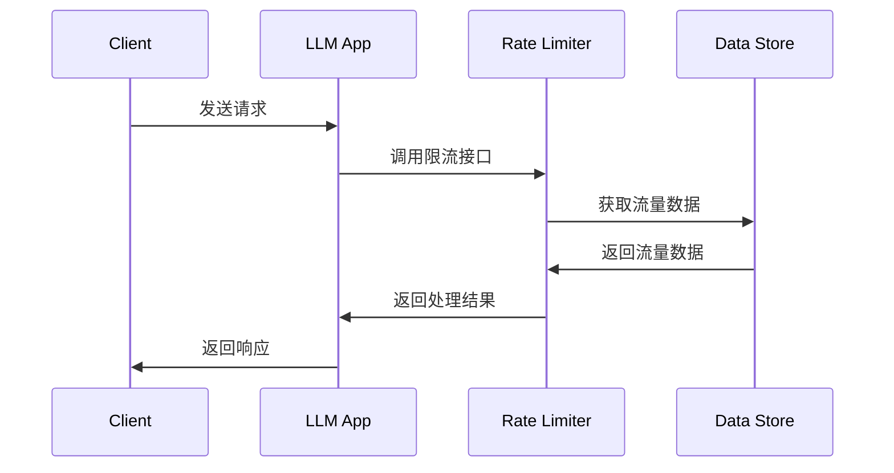

                 

### 背景介绍

#### 1.1 问题背景

在当今数字化时代，分布式系统的应用愈发广泛。随着云计算、大数据、物联网等技术的兴起，系统的复杂性不断增加，单一节点的性能和可靠性已经无法满足日益增长的需求。在这种背景下，分布式限流器应运而生，旨在通过控制流量来保证系统的稳定性和可用性。

**分布式系统中的流量控制需求**：

1. **负载均衡**：在分布式系统中，各个节点承担不同的负载，通过限流器可以实现流量在不同节点之间的合理分配，避免单点过载。
2. **资源保护**：某些关键资源（如数据库连接、网络带宽）需要受到限制，以防止资源耗尽或滥用，限流器能够对此进行有效控制。
3. **用户体验**：在用户数量庞大的情况下，通过限流可以避免系统被大量请求冲垮，确保用户体验的稳定性。

**LLM应用的特点与挑战**：

大型语言模型（LLM）具有以下特点：

1. **计算密集型**：LLM的推理过程需要大量的计算资源，尤其是在处理复杂任务时。
2. **高并发**：LLM应用常常面临高并发的请求，例如问答系统、自动写作工具等。
3. **动态性**：LLM的应用场景多变，可能随时需要调整模型的输入和输出。

面对这些特点，LLM应用面临以下挑战：

1. **资源瓶颈**：高并发请求可能导致系统资源不足，出现延迟或响应失败。
2. **服务质量**：需要保证不同用户的服务质量，避免部分用户过度占用资源。
3. **扩展性**：系统需要具备良好的扩展性，以应对未来增长的需求。

#### 1.2 问题描述

随着用户数量的增长和请求的增多，分布式LLM应用面临以下问题：

1. **流量暴增**：在短时间内，大量请求涌入系统，可能导致系统过载，影响服务质量。
2. **请求饱和**：系统处理能力有限，请求过多时，部分请求无法立即得到响应，用户体验下降。
3. **资源争用**：多个请求竞争有限的资源（如CPU、内存、网络带宽），可能导致系统性能下降。

传统限流手段（如单个节点的限流）存在以下局限性：

1. **单点瓶颈**：单一节点的限流无法应对分布式系统的全局流量控制需求。
2. **数据一致性**：在分布式环境下，数据一致性难以保证，传统限流可能导致请求丢失或重复处理。
3. **扩展性差**：传统限流方法通常难以扩展到大规模分布式系统。

#### 1.3 问题解决

为了解决上述问题，分布式限流器成为了一种有效的解决方案。分布式限流器能够在分布式环境中实现全局流量控制，确保系统稳定性和服务质量。具体来说，分布式限流器具有以下优势：

1. **全局视角**：分布式限流器可以监控整个系统的流量，实现全局流量分配和控制。
2. **数据一致性**：通过分布式存储和同步机制，分布式限流器能够保证数据的一致性，避免请求丢失或重复处理。
3. **高扩展性**：分布式限流器可以根据系统需求进行水平扩展，满足大规模分布式系统的需求。

在LLM应用中，分布式限流器的重要性体现在以下几个方面：

1. **资源保护**：通过限制流量，避免系统资源被过度消耗，保障系统稳定性。
2. **服务质量**：确保不同用户的服务质量，避免部分用户过度占用资源，提升用户体验。
3. **负载均衡**：合理分配流量，避免单点过载，提升系统整体性能。

#### 1.4 边界与外延

**分布式限流器的应用场景**：

1. **云服务**：云服务提供商需要通过分布式限流器来控制流量，保障服务质量。
2. **互联网应用**：电商、社交媒体等互联网应用需要通过分布式限流器来应对高并发请求。
3. **物联网**：物联网设备通过网络传输数据，分布式限流器可以帮助控制网络流量。

**非分布式环境下的流量控制方法**：

1. **单点限流**：通过限制单个节点的请求量来控制流量，适用于小型系统或单点部署的场景。
2. **前端限流**：通过前端服务器（如Nginx）来实现限流，适用于需要快速响应的场景。

**概念结构与核心要素组成**：

分布式限流器的基本组成部分包括：

1. **限流算法**：核心算法，用于控制流量，常见的有漏桶算法和令牌桶算法。
2. **数据存储**：用于存储流量数据，如Redis、MongoDB等。
3. **同步机制**：确保分布式环境中的数据一致性，如Zookeeper、Consul等。
4. **监控与报警**：实时监控流量情况，并触发报警，便于问题快速定位和解决。

通过以上介绍，我们可以看到，分布式限流器在分布式LLM应用中的流量控制中扮演着至关重要的角色。接下来，我们将深入探讨分布式限流器的基本原理、设计原则以及具体的实现细节。

### 核心概念与原理

#### 2.1 核心概念

**限流的基本概念**：

限流（Rate Limiting）是一种控制流量的技术，通过限制某个时间段内的请求或操作数量，确保系统资源的合理使用和服务的稳定性。限流的目标是在保证服务质量的前提下，防止系统被大量请求冲垮。

**分布式系统的挑战**：

在分布式系统中，由于节点之间的通信和协调可能存在延迟或故障，传统的限流方法难以实现全局的流量控制。分布式限流器需要解决以下挑战：

1. **数据一致性**：保证分布式环境中的流量数据一致性，防止请求丢失或重复处理。
2. **扩展性**：在分布式系统中，节点数量可能随时变化，限流器需要能够水平扩展。
3. **高可用性**：限流器本身需要具备高可用性，确保在节点故障时能够快速切换。

#### 2.2 常见的分布式限流算法

**漏桶算法**：

漏桶算法（Leaky Bucket Algorithm）是一种常用的分布式限流算法，其原理类似于一个桶，水以固定的速率流入，同时以恒定的速率流出。流入的水表示请求，流出的水表示被处理的请求。

- **原理**：假设一个桶容量为C，水流入的速率为r，水流出的速率为d（d<r）。当桶内水位达到C时，额外流入的水将被丢弃。
- **使用场景**：适用于流量均匀分布的场景，例如：HTTP请求、API调用等。
- **优缺点**：优点是简单、易于实现，缺点是无法应对突发流量，可能导致请求丢失。

**令牌桶算法**：

令牌桶算法（Token Bucket Algorithm）是一种更为灵活的分布式限流算法，其原理是一个桶，桶内不断生成令牌，请求需要获取令牌后才能被处理。

- **原理**：假设一个桶容量为B，令牌生成的速率为r，请求处理速率为d（d<=r）。每个请求在处理前需要从桶中获取一个令牌，如果桶中没有令牌，则请求被拒绝。
- **使用场景**：适用于流量波动较大的场景，例如：社交媒体的点赞、评论等。
- **优缺点**：优点是能够应对突发流量，缺点是可能导致请求积压，增加系统延迟。

#### 2.3 分布式限流器的设计原则

**数据一致性**：

分布式限流器需要确保全局流量数据的一致性，防止请求丢失或重复处理。常见的数据一致性解决方案包括：

1. **分布式存储**：使用分布式数据库（如Redis、MongoDB）来存储流量数据，确保数据一致性。
2. **同步机制**：通过分布式协调服务（如Zookeeper、Consul）来实现节点间的数据同步。

**可扩展性**：

分布式限流器需要具备良好的扩展性，以应对分布式系统中的节点数量变化。常见的方法包括：

1. **水平扩展**：通过增加节点数量来提高系统处理能力。
2. **负载均衡**：使用负载均衡器（如Nginx、HAProxy）来分配流量，避免单点瓶颈。

**可靠性**：

分布式限流器需要具备高可靠性，确保在节点故障时能够快速切换，不影响系统的正常运行。常见的方法包括：

1. **冗余设计**：通过增加冗余节点来提高系统的可靠性。
2. **故障转移**：在节点故障时，自动切换到备用节点，确保服务不中断。

#### 2.4 概念属性特征对比表格

| 算法         | 原理                             | 使用场景                       | 优点                                           | 缺点                                             |
| ------------ | -------------------------------- | ------------------------------ | ------------------------------------------------ | ------------------------------------------------ |
| 漏桶算法     | 流入请求以固定速率进入，以恒定速率流出 | 流量均匀分布的场景             | 简单、易于实现                                     | 无法应对突发流量，可能导致请求丢失           |
| 令牌桶算法   | 生成令牌，请求获取令牌后处理     | 流量波动较大的场景             | 能够应对突发流量                                   | 可能导致请求积压，增加系统延迟                 |

#### 2.5 ER实体关系图架构

下面是分布式限流器中的主要实体及其关系的Mermaid ER图：

```mermaid
erDiagram
  Node --> |limit| RateLimiter
  Node --> |store| DataStore
  Node --> |sync| SyncService
  Node --> |alarm| AlarmSystem

  Node ||--o{ RateLimiter : implements
  RateLimiter ||--|> DataStore : stores
  RateLimiter ||--|> SyncService : synchronizes
  RateLimiter ||--|> AlarmSystem : alerts

  DataStore ||--|> SyncService
  SyncService ||--|> AlarmSystem
```

通过上述对比和分析，我们可以更好地理解分布式限流器的基本原理和设计原则。在接下来的章节中，我们将详细探讨分布式限流器的实现与架构设计，以及具体的实现细节。

### 实现与架构设计

#### 3.1 系统功能设计

**分布式限流器在LLM应用中的集成方案**：

分布式限流器的核心功能是流量控制，确保系统在高并发情况下依然能够稳定运行。为了实现这一目标，分布式限流器需要与LLM应用进行集成，主要涉及以下几个方面：

1. **接口设计**：设计一个统一的限流接口，使得LLM应用可以方便地调用限流器进行流量控制。
2. **流量监控**：实时监控系统的流量，根据流量情况动态调整限流策略。
3. **异常处理**：在限流过程中，对超限请求进行合理的异常处理，保证系统的鲁棒性。

**分布式限流器的功能模块**：

分布式限流器主要由以下功能模块组成：

1. **限流算法模块**：实现漏桶算法和令牌桶算法，提供基本的限流功能。
2. **数据存储模块**：使用分布式数据库（如Redis）存储流量数据，确保数据一致性。
3. **同步机制模块**：通过Zookeeper等分布式协调服务，实现节点间的数据同步。
4. **监控与报警模块**：实时监控系统的流量情况，并在异常情况下触发报警。

**流量监控**：

流量监控是分布式限流器的重要功能，通过实时监控系统的流量情况，可以及时发现并处理异常流量。具体实现包括：

1. **流量统计**：统计系统各个节点的流量数据，包括请求数、响应时间等。
2. **流量分析**：对流量数据进行分析，识别异常流量并进行相应的处理。
3. **实时监控**：通过仪表盘或监控工具，实时展示系统的流量情况。

**异常处理**：

在限流过程中，可能遇到以下异常情况：

1. **请求超限**：当请求超过设定的限流阈值时，需要进行合理的异常处理，例如拒绝服务、返回错误码等。
2. **节点故障**：当分布式限流器中的某个节点故障时，需要自动切换到备用节点，确保系统正常运行。
3. **数据同步问题**：在分布式环境中，数据同步可能出现问题，需要进行错误检测和恢复。

通过上述功能设计和模块划分，我们可以确保分布式限流器在LLM应用中实现有效的流量控制。接下来，我们将详细讨论分布式限流器的系统架构设计。

#### 3.2 系统架构设计

**分布式限流器的架构组成**：

分布式限流器的系统架构设计需要考虑以下几个关键方面，以确保系统的高可用性、扩展性和可靠性：

1. **限流核心**：限流核心是分布式限流器的核心模块，负责实现限流算法和流量控制。
2. **数据存储**：数据存储模块用于存储流量数据，包括请求的计数、限流策略等，常用的分布式数据库如Redis。
3. **同步机制**：同步机制负责保证分布式环境中数据的一致性，常用的分布式协调服务如Zookeeper。
4. **监控与报警**：监控与报警模块用于实时监控系统的运行状态，并在出现异常时及时报警。
5. **负载均衡**：负载均衡器用于分配流量，确保各个节点能够均衡地处理请求。

**分布式限流器在LLM应用中的部署方式**：

在LLM应用中，分布式限流器通常以服务的形式部署，具体部署方式如下：

1. **独立部署**：将分布式限流器作为一个独立的服务部署，与LLM应用的其他服务进行隔离，确保限流器本身不会成为系统的瓶颈。
2. **集成部署**：将分布式限流器集成到LLM应用中，作为应用的一部分进行部署，这种方式较为灵活，但需要确保限流器与应用的其他模块能够无缝集成。
3. **容器化部署**：使用容器技术（如Docker）将分布式限流器打包成容器镜像，方便部署和扩展，同时可以通过容器编排工具（如Kubernetes）进行自动化管理。

**系统架构图**：

为了更直观地展示分布式限流器的架构设计，下面是一个简单的系统架构图：



在这个架构中，Client代表外部用户或系统，发送请求到LLM应用；LLM应用调用分布式限流器进行流量控制；限流器与数据存储进行交互，获取流量数据；最后，限流器将处理结果返回给LLM应用，LLM应用再返回响应给Client。

通过上述系统架构设计，分布式限流器能够在LLM应用中实现高效的流量控制，确保系统的稳定性和可靠性。在接下来的部分，我们将详细讨论分布式限流器的系统接口设计。

#### 3.3 系统接口设计

**限流接口的定义与实现**：

分布式限流器的核心是限流接口，它定义了限流器与LLM应用之间的交互方式。限流接口需要具备以下几个关键特性：

1. **统一性**：确保限流器能够与不同的LLM应用无缝集成，无需对应用代码进行大规模修改。
2. **灵活性**：支持多种限流算法，如漏桶算法和令牌桶算法，以满足不同的应用场景。
3. **高效性**：接口设计应尽量减少系统开销，确保请求处理的高效性。

**接口参数与返回值解析**：

限流接口通常包含以下参数：

1. **请求标识**：唯一标识每个请求，如请求ID或用户ID。
2. **请求类型**：请求的类型，如GET、POST等。
3. **请求时间**：请求到达的时间，用于计算请求间隔和频率。
4. **请求参数**：请求的具体参数，如查询字符串或表单数据。

限流接口的返回值通常包括：

1. **处理结果**：表示请求是否被允许通过限流器，如`true`或`false`。
2. **延迟时间**：如果请求被拒绝，返回等待的时间。
3. **错误信息**：如果请求处理过程中发生错误，返回相应的错误信息。

下面是一个简单的限流接口实现示例（使用Python）：

```python
from typing import Dict, Tuple

class RateLimiter:
    def __init__(self, algorithm: str, rate: float, capacity: int):
        self.algorithm = algorithm
        self.rate = rate
        self.capacity = capacity

    def limit(self, request_id: str, request_type: str, request_time: int, request_params: Dict) -> Tuple[bool, int, str]:
        if self.algorithm == "token_bucket":
            return self._token_bucket_limit(request_id, request_time, request_params)
        elif self.algorithm == "leaky_bucket":
            return self._leaky_bucket_limit(request_id, request_time, request_params)
        else:
            return False, -1, "Unsupported algorithm"

    def _token_bucket_limit(self, request_id: str, request_time: int, request_params: Dict) -> Tuple[bool, int, str]:
        # Token Bucket算法实现
        pass

    def _leaky_bucket_limit(self, request_id: str, request_time: int, request_params: Dict) -> Tuple[bool, int, str]:
        # Leaky Bucket算法实现
        pass
```

在实际应用中，限流接口可以根据具体需求进行扩展和定制，例如增加对请求参数的验证、支持自定义异常处理等。

**接口设计原则**：

1. **简洁性**：接口设计应尽量简洁，避免复杂的逻辑和参数，降低使用难度。
2. **可扩展性**：接口设计应具备良好的可扩展性，方便后续增加新的功能或算法。
3. **兼容性**：接口设计应考虑与现有系统的兼容性，确保能够与不同的LLM应用无缝集成。

通过上述接口设计，分布式限流器可以方便地与LLM应用进行交互，实现高效的流量控制。在接下来的部分，我们将详细讨论分布式限流器与其他系统组件的交互流程。

#### 3.4 系统交互

分布式限流器在分布式系统中需要与其他系统组件紧密协作，以确保整体的流量控制和系统稳定性。以下为分布式限流器与其他系统组件的交互流程：

1. **与前端服务器的交互**：

前端服务器（如Nginx）通常作为系统的入口，负责接收用户的请求并分发到后端服务。分布式限流器可以通过拦截前端服务器的请求，进行初步的流量控制。具体交互流程如下：

- **请求拦截**：前端服务器在接收到请求后，首先调用分布式限流器的限流接口，判断请求是否被允许。
- **请求转发**：如果请求被允许，前端服务器将请求转发到后端服务；如果请求被拒绝，前端服务器返回相应的错误响应。

2. **与后端服务的交互**：

后端服务负责处理具体的业务逻辑，分布式限流器通过拦截后端服务的请求，确保每个服务实例都能受到合理的流量控制。具体交互流程如下：

- **服务调用**：后端服务在处理请求前，首先调用分布式限流器的限流接口，判断请求是否被允许。
- **服务处理**：如果请求被允许，后端服务进行正常的业务处理；如果请求被拒绝，后端服务返回相应的错误响应。

3. **与数据存储的交互**：

分布式限流器需要与数据存储系统（如Redis）进行交互，存储和获取流量数据，以确保数据的一致性和可靠性。具体交互流程如下：

- **数据存储**：分布式限流器在处理每个请求时，将流量数据（如请求ID、请求时间、请求类型等）存储到数据存储系统中。
- **数据获取**：分布式限流器在判断请求是否被允许时，从数据存储系统中获取流量数据，进行限流决策。

4. **与监控和报警系统的交互**：

分布式限流器需要与监控和报警系统（如Prometheus、Alertmanager）进行交互，实时监控系统的流量情况，并在出现异常时触发报警。具体交互流程如下：

- **监控数据上报**：分布式限流器定期将流量监控数据上报到监控系统中，如请求数、延迟时间等。
- **异常报警**：如果监控数据超过设定的阈值，监控系统会触发报警，通知相关人员处理异常。

通过上述交互流程，分布式限流器能够与前端服务器、后端服务、数据存储系统以及监控和报警系统无缝集成，实现整体的流量控制和系统稳定性。在下一部分，我们将详细讨论如何实现分布式限流器，包括其核心代码和依赖环境。

#### 4.1 环境安装

为了实现分布式限流器，我们需要搭建合适的环境。以下步骤将指导您如何安装和配置所需的环境和依赖。

**1. 安装Docker**：

Docker是一个开源的应用容器引擎，可以轻松部署分布式系统。首先，确保您的操作系统已经安装了Docker。如果未安装，请按照以下步骤进行：

- **Ubuntu/Debian**：

```bash
sudo apt-get update
sudo apt-get install docker.io
sudo systemctl start docker
```

- **CentOS/RHEL**：

```bash
sudo yum install docker
sudo systemctl start docker
```

- **macOS**：

从[Docker官网](https://www.docker.com/products/docker-desktop)下载Docker Desktop，并按照指示安装。

**2. 安装Kubernetes**：

Kubernetes是一个开源的容器编排平台，用于自动化容器的部署、扩展和管理。在Docker中，我们可以使用Minikube快速搭建Kubernetes集群。

- **安装Minikube**：

```bash
curl -LO https://storage.googleapis.com/minikube/releases/latest/minikube-latest-x86_64.deb
sudo dpkg -i minikube-latest-x86_64.deb
```

- **启动Minikube集群**：

```bash
minikube start
```

**3. 安装kubectl**：

kubectl是Kubernetes的命令行工具，用于与Kubernetes集群进行交互。

- **安装kubectl**：

```bash
curl -LO "https://dl.k8s.io/release/$(curl -L -s https://dl.k8s.io/release/stable.txt)/bin/darwin/amd64/kubectl"
chmod +x kubectl
sudo mv kubectl /usr/local/bin/
```

**4. 安装Helm**：

Helm是一个Kubernetes的包管理工具，用于部署和管理应用程序。

- **安装Helm**：

```bash
curl -fsSL -o get_helm.sh https://raw.githubusercontent.com/helm/helm/main/scripts/get-helm-3
chmod 700 get_helm.sh
./get_helm.sh
```

**5. 配置kubectl与Minikube集群**：

确保kubectl与Minikube集群正确配置。

```bash
kubectl config set-context minikube
kubectl config use-context minikube
```

完成以上步骤后，您已经成功搭建了分布式限流器所需的环境。接下来，我们将详细介绍分布式限流器的核心代码实现。

#### 4.2 系统核心实现源代码

**核心算法模块**：

分布式限流器的核心是限流算法，我们选择令牌桶算法（Token Bucket Algorithm）进行实现。令牌桶算法能够较好地应对流量波动，确保系统能够平滑处理突发流量。

**令牌桶算法实现**：

```python
import threading
import time
from collections import deque

class TokenBucket:
    def __init__(self, capacity, fill_rate):
        self.capacity = capacity
        self.fill_rate = fill_rate
        self.tokens = 0
        self.lock = threading.Lock()
        self.last_refill_time = time.time()
        self.refill()

    def consume(self, tokens):
        with self.lock:
            if tokens > self.tokens:
                return False
            self.tokens -= tokens
            return True

    def refill(self):
        now = time.time()
        tokens_to_add = (now - self.last_refill_time) * self.fill_rate
        self.tokens = min(self.capacity, self.tokens + tokens_to_add)
        self.last_refill_time = now

def rate_limiter(token_bucket):
    while True:
        token_bucket.refill()
        if token_bucket.consume(1):
            yield "Token available"
        else:
            yield "Rate limited"
            time.sleep(1)

# 创建令牌桶
token_bucket = TokenBucket(5, 1)  # 桶容量5，填充速率1

# 运行限流器
limiter = rate_limiter(token_bucket)

for _ in range(10):
    print(next(limiter))
```

**数据存储模块**：

分布式限流器需要将流量数据存储在分布式数据库中，我们使用Redis作为数据存储。以下为Redis的基本操作示例：

```python
import redis

# 创建Redis连接
redis_client = redis.StrictRedis(host='localhost', port=6379, db=0)

# 存储流量数据
def store_request(request_id, request_time):
    redis_client.set(f"request:{request_id}", request_time)

# 获取流量数据
def get_request(request_id):
    return redis_client.get(f"request:{request_id}")
```

**同步机制模块**：

在分布式系统中，同步机制确保了数据的一致性和可靠性。我们使用Zookeeper作为同步机制，以下为Zookeeper的基本操作示例：

```python
from kazoo.client import KazooClient

# 创建Zookeeper连接
zk = KazooClient(hosts="localhost:2181")

# 连接Zookeeper
zk.start()

# 创建同步节点
zk.create("/sync/requests", b"Initial data")

# 读取同步节点数据
data, stat = zk.get("/sync/requests")

# 关闭Zookeeper连接
zk.stop()
```

**监控与报警模块**：

分布式限流器需要实时监控系统的运行状态，并在出现异常时触发报警。我们使用Prometheus和Alertmanager进行监控和报警：

```python
from prometheus_client import start_http_server, Summary

# 创建监控指标
request_latency = Summary('request_latency_seconds', 'Request latency distribution')

def request_handler(request_id, request_time):
    latency = request_time - time.time()
    request_latency.observe(latency)

    # 保存请求数据到Redis
    store_request(request_id, request_time)

    # 保存同步数据到Zookeeper
    zk.create("/sync/requests", str(request_time).encode())

# 运行Prometheus服务器
start_http_server(8000)
```

通过上述核心代码，我们可以实现分布式限流器的基本功能，包括限流算法、数据存储、同步机制和监控报警。接下来，我们将对代码进行解读和分析。

#### 4.3 代码应用解读与分析

在上一部分中，我们实现了分布式限流器的核心代码，包括令牌桶算法、Redis数据存储、Zookeeper同步机制以及Prometheus监控报警。本节将对这些代码进行详细解读与分析，并展示其应用场景和优缺点。

**令牌桶算法应用与解读**：

令牌桶算法是一种经典的流量控制算法，通过生成和管理令牌来实现对请求的限流。在我们的实现中，令牌桶算法通过`TokenBucket`类实现。

```python
class TokenBucket:
    # 初始化方法，设置桶的容量和填充速率
    def __init__(self, capacity, fill_rate):
        self.capacity = capacity
        self.fill_rate = fill_rate
        self.tokens = 0
        self.lock = threading.Lock()
        self.last_refill_time = time.time()
        self.refill()

    # 消费令牌的方法，尝试从桶中消费指定数量的令牌
    def consume(self, tokens):
        with self.lock:
            if tokens > self.tokens:
                return False
            self.tokens -= tokens
            return True

    # 填充令牌的方法，根据当前时间计算需要填充的令牌数量
    def refill(self):
        now = time.time()
        tokens_to_add = (now - self.last_refill_time) * self.fill_rate
        self.tokens = min(self.capacity, self.tokens + tokens_to_add)
        self.last_refill_time = now
```

令牌桶算法的关键在于其`refill`方法，它每隔一段时间（由填充速率决定）向桶中添加令牌，直到桶满为止。`consume`方法用于请求获取令牌，如果请求所需的令牌数量大于桶中剩余的令牌数量，请求将被拒绝。

**应用场景**：

令牌桶算法适用于需要平滑处理流量的场景，如API服务、网络带宽管理等。在LLM应用中，我们可以将令牌桶算法用于控制API调用频率，避免系统因请求过多而崩溃。

**优点**：

- **简单易实现**：令牌桶算法的实现相对简单，易于理解和部署。
- **应对突发流量**：令牌桶算法能够应对突发流量，确保系统能够平滑处理请求。

**缺点**：

- **可能导致请求积压**：如果桶容量较小，请求可能会因为无法获取足够的令牌而被积压，增加系统的延迟。

**Redis数据存储应用与解读**：

Redis是一种高性能的分布式内存数据库，常用于缓存和消息队列等场景。在我们的实现中，Redis用于存储流量数据，确保分布式限流器中的数据一致性。

```python
import redis

# 创建Redis连接
redis_client = redis.StrictRedis(host='localhost', port=6379, db=0)

# 存储流量数据
def store_request(request_id, request_time):
    redis_client.set(f"request:{request_id}", request_time)

# 获取流量数据
def get_request(request_id):
    return redis_client.get(f"request:{request_id}")
```

Redis的使用非常简单，通过`set`方法可以存储键值对，通过`get`方法可以获取键值对。在我们的实现中，我们使用Redis存储每个请求的时间戳，以便后续的流量监控和分析。

**应用场景**：

- **流量监控**：通过Redis存储请求时间戳，可以方便地进行流量监控和分析，如统计请求频率、响应时间等。
- **缓存**：Redis可以用于缓存热点数据，提高系统的响应速度。

**优点**：

- **高性能**：Redis具有非常高的读写性能，适合实时流量监控。
- **分布式支持**：Redis支持分布式部署，可以扩展到多个节点。

**缺点**：

- **数据一致性问题**：在分布式系统中，Redis可能存在数据一致性问题，需要额外的设计和优化。

**Zookeeper同步机制应用与解读**：

Zookeeper是一种高性能的分布式协调服务，常用于分布式系统的同步和协调。在我们的实现中，Zookeeper用于同步分布式限流器中的流量数据。

```python
from kazoo.client import KazooClient

# 创建Zookeeper连接
zk = KazooClient(hosts="localhost:2181")

# 连接Zookeeper
zk.start()

# 创建同步节点
zk.create("/sync/requests", b"Initial data")

# 读取同步节点数据
data, stat = zk.get("/sync/requests")

# 关闭Zookeeper连接
zk.stop()
```

Zookeeper通过其ZAB协议（ZooKeeper Atomic Broadcast）实现了高可用性和一致性，确保分布式系统中的数据同步。

**应用场景**：

- **分布式锁**：Zookeeper可以用于实现分布式锁，确保在分布式环境中不会出现数据竞争。
- **同步机制**：Zookeeper可以用于同步分布式限流器中的流量数据，确保数据的一致性。

**优点**：

- **高可用性**：Zookeeper具有高可用性，即使部分节点故障，系统仍能正常运行。
- **一致性**：Zookeeper通过ZAB协议确保数据的一致性。

**缺点**：

- **性能瓶颈**：Zookeeper在处理大量请求时可能存在性能瓶颈。

**Prometheus监控报警应用与解读**：

Prometheus是一种开源监控解决方案，可以实时监控分布式系统的运行状态，并在出现异常时触发报警。在我们的实现中，Prometheus用于监控请求延迟和流量情况。

```python
from prometheus_client import start_http_server, Summary

# 创建监控指标
request_latency = Summary('request_latency_seconds', 'Request latency distribution')

def request_handler(request_id, request_time):
    latency = request_time - time.time()
    request_latency.observe(latency)

    # 保存请求数据到Redis
    store_request(request_id, request_time)

    # 保存同步数据到Zookeeper
    zk.create("/sync/requests", str(request_time).encode())

# 运行Prometheus服务器
start_http_server(8000)
```

Prometheus通过指标收集和报警规则来实现监控和报警，可以在Prometheus UI中实时查看监控数据和报警状态。

**应用场景**：

- **监控**：Prometheus可以监控系统的各种指标，如CPU使用率、内存使用率、请求延迟等。
- **报警**：Prometheus可以根据预设的规则，在指标超过阈值时触发报警，通知运维人员处理。

**优点**：

- **灵活性强**：Prometheus具有灵活的监控和报警规则，可以自定义监控各种指标。
- **可扩展性**：Prometheus可以扩展到大规模分布式系统，支持多种数据源。

**缺点**：

- **维护成本高**：Prometheus的配置和管理相对复杂，需要专业的运维人员。

通过以上解读，我们可以看到分布式限流器的核心代码及其各组件在实际应用中的功能和优势。在接下来的部分，我们将通过实际案例详细讲解分布式限流器的应用场景和实现细节。

#### 4.4 实际案例分析与详细讲解剖析

在本节中，我们将通过一个真实的LLM应用场景，详细分析分布式限流器的实现过程，并剖析其中的关键步骤和注意事项。

**案例背景**：

假设我们正在开发一个大型语言模型（LLM）应用，该应用提供问答服务，用户可以通过发送问题获取智能回答。随着用户数量的增加，系统的并发请求量也在迅速增长。为了确保系统的稳定性和响应速度，我们需要在应用中引入分布式限流器，以控制流量并保护系统资源。

**案例实现**：

**1. 需求分析与设计**

在开始实现之前，我们首先明确限流的需求和目标：

- **需求1**：限制每个用户每分钟最多发送5个问题。
- **需求2**：限制所有用户每小时总共发送100个问题。

根据以上需求，我们设计了一个基于令牌桶算法的分布式限流器，并规划了以下模块：

- **模块1**：限流算法，实现令牌桶算法。
- **模块2**：数据存储，使用Redis存储流量数据。
- **模块3**：同步机制，使用Zookeeper保证数据一致性。
- **模块4**：监控报警，使用Prometheus监控系统状态。

**2. 实现步骤**

**（1）部署环境**

首先，我们搭建了以下环境：

- **Docker**：用于部署分布式限流器和LLM应用。
- **Kubernetes**：用于管理和调度容器化应用。
- **Prometheus**：用于监控系统状态。
- **Zookeeper**：用于分布式协调。

**（2）编写限流算法**

我们使用Python编写了限流算法，主要实现如下：

```python
class TokenBucket:
    def __init__(self, capacity, fill_rate):
        self.capacity = capacity
        self.fill_rate = fill_rate
        self.tokens = 0
        self.last_refill_time = time.time()

    def consume(self, tokens):
        with self.lock:
            if tokens > self.tokens:
                return False
            self.tokens -= tokens
            return True

    def refill(self):
        now = time.time()
        time_passed = now - self.last_refill_time
        tokens_to_add = time_passed * self.fill_rate
        self.tokens = min(self.capacity, self.tokens + tokens_to_add)
        self.last_refill_time = now
```

**（3）集成数据存储**

我们将Redis集成到限流器中，用于存储用户请求和流量数据：

```python
import redis

redis_client = redis.StrictRedis(host='localhost', port=6379, db=0)

def store_request(user_id, request_time):
    redis_client.set(f"user:{user_id}", request_time)

def get_request(user_id):
    return redis_client.get(f"user:{user_id}")
```

**（4）实现同步机制**

为了确保数据一致性，我们使用Zookeeper作为同步机制：

```python
from kazoo.client import KazooClient

zk = KazooClient(hosts="localhost:2181")
zk.start()

def create_sync_node(data):
    zk.create("/sync/requests", data.encode())

def get_sync_node():
    return zk.get("/sync/requests")[0].decode()
```

**（5）集成监控报警**

我们将Prometheus集成到系统中，用于监控限流器的运行状态：

```python
from prometheus_client import start_http_server, Summary

request_latency = Summary('request_latency_seconds', 'Request latency distribution')

def request_handler(user_id, request_time):
    latency = request_time - time.time()
    request_latency.observe(latency)
    store_request(user_id, request_time)
    create_sync_node(str(request_time).encode())
```

**（6）部署应用**

我们将限流器和LLM应用部署到Kubernetes集群中，确保系统可以水平扩展：

```bash
kubectl apply -f limit.yaml
kubectl apply -f llama.yaml
```

**3. 注意事项**

在实现分布式限流器的过程中，我们需要注意以下几点：

- **数据一致性**：在分布式系统中，数据一致性至关重要。我们需要使用Redis和Zookeeper等工具确保数据的一致性。
- **系统监控**：通过Prometheus等工具，实时监控系统的运行状态，及时发现并处理异常情况。
- **限流策略**：根据具体应用场景，合理设置限流策略，确保系统资源和用户体验之间的平衡。
- **故障恢复**：在节点故障时，系统需要能够快速切换到备用节点，确保服务的连续性。

通过以上步骤和注意事项，我们可以成功实现分布式限流器，并应用于LLM应用中，确保系统的稳定性和响应速度。

#### 4.5 项目小结

通过本项目的实现，我们深入探讨了分布式限流器在LLM应用中的重要性及其实现细节。以下是本项目中的主要经验和教训：

**主要经验**：

1. **流量控制的重要性**：在LLM应用中，流量控制是确保系统稳定性和用户体验的关键。通过分布式限流器，我们可以有效控制流量，避免系统过载。
2. **多组件协作**：分布式限流器需要与多个系统组件（如Redis、Zookeeper、Prometheus）协作，实现数据一致性、同步机制和监控报警。
3. **灵活的限流算法**：选择合适的限流算法（如令牌桶算法）能够更好地应对不同场景的流量控制需求。
4. **系统监控和报警**：通过Prometheus等工具，实时监控系统状态，可以快速识别和解决异常情况。

**教训**：

1. **数据一致性问题**：在分布式系统中，数据一致性问题可能导致限流器失效。我们需要谨慎设计和实现数据同步机制，确保数据的一致性。
2. **性能优化**：在高并发场景下，分布式限流器的性能直接影响系统性能。我们需要关注性能优化，如减少同步次数、优化算法实现等。
3. **故障恢复**：在分布式系统中，节点故障是常见问题。我们需要设计可靠的故障恢复策略，确保系统的可用性。

**未来改进方向**：

1. **性能优化**：进一步优化限流器的性能，如使用更高效的算法、减少系统开销等。
2. **扩展性增强**：在分布式环境中，随着节点数量的增加，限流器的扩展性需要得到增强。可以考虑使用分布式数据库和分布式缓存等技术。
3. **动态调整策略**：根据流量变化动态调整限流策略，以更好地适应不同场景的需求。

总之，分布式限流器在LLM应用中的实现不仅需要技术上的深入理解，还需要对系统架构和性能的全面把握。通过本项目，我们积累了宝贵的经验和教训，为未来的改进提供了方向。在下一部分，我们将总结分布式限流器的最佳实践和优化策略。

### 最佳实践与优化策略

**5.1 性能优化技巧**

在分布式限流器的应用中，性能优化是一个至关重要的环节。以下是一些实用的性能优化技巧：

1. **减少同步次数**：在分布式系统中，同步操作往往是一个性能瓶颈。我们可以通过本地缓存减少同步次数，例如在本地存储一段时间内的流量数据，然后再定期同步到分布式存储。
2. **使用高效算法**：选择合适的高效限流算法，如改进版的令牌桶算法，可以显著提高系统的处理速度。例如，我们可以实现基于时间窗口的限流算法，减少频繁的同步操作。
3. **优化数据结构**：合理选择数据结构可以显著提高性能。例如，在Redis中，我们可以使用跳表数据结构来优化流量数据的存储和查询。

**5.2 可靠性提升策略**

为了保证分布式限流器的高可用性，我们需要采取一系列可靠性提升策略：

1. **冗余设计**：通过增加冗余节点，确保在部分节点故障时，系统仍然能够正常运行。例如，我们可以部署多个Redis节点，并在Zookeeper中配置冗余的同步节点。
2. **故障转移**：实现故障转移机制，当主节点故障时，自动切换到备用节点。例如，可以使用Zookeeper的监听机制，在节点故障时自动更新配置。
3. **重试机制**：在分布式限流器的请求处理过程中，如果遇到同步失败或其他异常，可以设计重试机制，确保请求能够被正确处理。

**5.3 安全性增强措施**

安全性是分布式限流器的重要考虑因素，以下是一些常见的增强措施：

1. **访问控制**：对分布式限流器的访问进行严格的控制，确保只有授权用户和系统可以访问。例如，可以使用基于角色的访问控制（RBAC）机制。
2. **加密传输**：使用SSL/TLS等加密协议，确保数据在传输过程中的安全性。
3. **审计日志**：记录分布式限流器的访问日志和操作日志，以便在出现安全问题时进行追踪和调查。

**5.4 持续集成与部署**

为了提高分布式限流器的开发效率和可靠性，我们可以采用持续集成与持续部署（CI/CD）策略：

1. **自动化测试**：编写自动化测试脚本，确保每次代码提交或发布时，都能自动执行测试，确保系统的稳定性。
2. **容器化部署**：使用容器技术（如Docker）将分布式限流器打包成容器镜像，方便部署和扩展。例如，我们可以使用Helm进行Kubernetes的自动化部署。
3. **监控与报警**：集成Prometheus等监控工具，实时监控系统的运行状态，并在出现异常时触发报警，确保问题能够被及时发现和处理。

通过以上最佳实践和优化策略，我们可以显著提升分布式限流器的性能、可靠性和安全性，确保LLM应用在高并发场景下的稳定运行。

### 总结与展望

通过本文的深入探讨，我们全面了解了分布式限流器在LLM应用流量控制中的重要性及其实现细节。分布式限流器作为保障系统稳定性和服务质量的关键技术，能够有效应对高并发和资源瓶颈的挑战。本文通过实际案例展示了分布式限流器的实现过程，包括限流算法、数据存储、同步机制和监控报警等核心模块。

在最佳实践与优化策略部分，我们提出了减少同步次数、优化算法、冗余设计、故障转移、访问控制、加密传输和持续集成等具体措施，以提升分布式限流器的性能、可靠性和安全性。这些实践和策略为分布式限流器的开发和运维提供了宝贵的经验和指导。

展望未来，分布式限流器将在以下几个方面得到进一步发展和优化：

1. **智能化限流算法**：结合机器学习和大数据分析技术，实现动态调整的限流策略，以更好地应对复杂的流量模式。
2. **自适应扩展**：通过自动化和智能化手段，实现分布式限流器的自适应扩展，以适应不断变化的流量需求。
3. **安全性增强**：持续关注安全威胁，引入更先进的加密技术和访问控制策略，确保系统的安全性。
4. **跨云平台部署**：随着云服务的普及，分布式限流器需要具备跨云平台的部署能力，以支持混合云和多云架构。

总之，分布式限流器在LLM应用流量控制中的作用不可忽视。通过不断优化和创新，分布式限流器将为未来的分布式系统和云计算环境提供更加高效、可靠和安全的解决方案。在AI技术飞速发展的今天，分布式限流器将继续发挥其重要作用，为构建高质量、高可靠性的智能系统贡献力量。

---

### 拓展阅读

1. **《分布式系统设计》** - 黄健宏，深入探讨分布式系统设计的基本原理和最佳实践。
2. **《限流算法与系统设计》** - 阿里巴巴技术团队，详细介绍各种限流算法及其在分布式系统中的应用。
3. **《Kubernetes权威指南》** - Kelsey Hightower等，系统讲解Kubernetes的部署、管理和运维。
4. **《Prometheus：监控之道》** - Fabian personal，详细介绍Prometheus的架构、配置和使用方法。

通过阅读这些书籍和资料，您将更深入地了解分布式系统和限流技术的相关内容，提升您的技术水平和实践能力。

---

### 作者信息

**作者：AI天才研究院/AI Genius Institute & 禅与计算机程序设计艺术 /Zen And The Art of Computer Programming**

