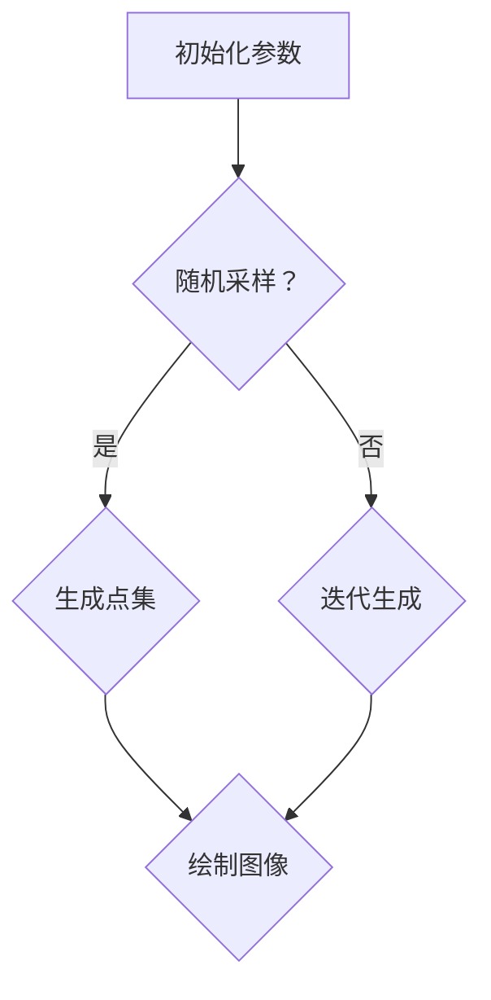
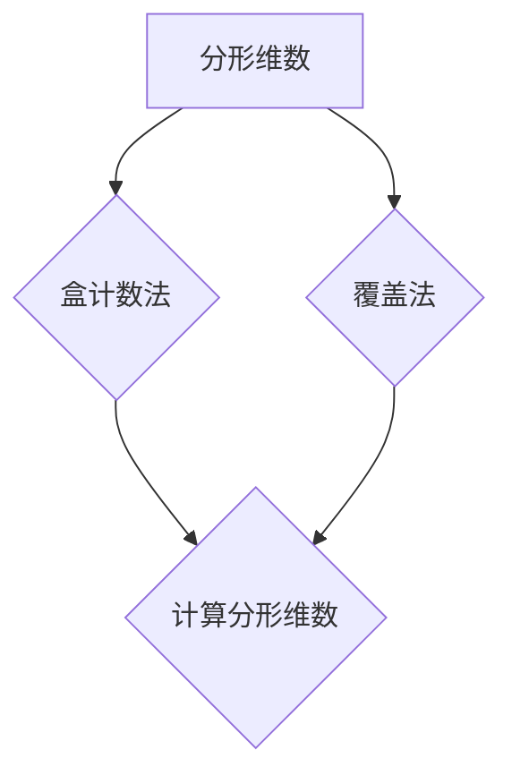
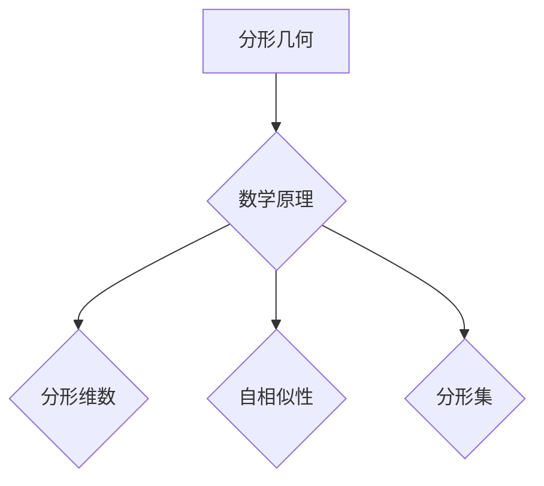

                 


### 《分形几何：自然界的重复映射模式》

#### 关键词：
- 分形几何
- 自然界映射模式
- 数学模型
- 算法
- 应用领域

#### 摘要：
本文将深入探讨分形几何这一概念，从基础到实际应用，逐步解析其在自然界中的重复映射模式。文章将分为两部分，首先介绍分形几何的基础知识，包括核心概念、数学原理和基本算法；接着讨论其在自然科学、生命科学、艺术与设计、计算机科学和工程与技术中的应用，最后展望分形几何的未来与发展趋势。

### 第一部分：分形几何基础

#### 第1章：分形几何引论

##### 1.1 问题背景与分形几何简介
分形几何作为一门跨学科的数学分支，起源于20世纪70年代，由数学家本哈德·曼德尔布罗特（Benoit Mandelbrot）首次提出。它研究自然界中不规则、复杂和自相似的现象，其核心思想在于揭示重复性在自然界中的普遍存在。

**问题描述**：分形几何的基本概念及其在自然界中的应用。
**问题解决**：分形几何的特点和应用范围。
**边界与外延**：分形的定义、数学特征及其实际应用领域。
**核心要素组成**：分形几何的基本要素和理论基础。

##### 1.2 分形几何的数学原理
分形几何的数学原理主要包括分形维数、自相似性和分形集。

**核心概念原理**：
- **分形维数**：分形维数是描述分形复杂性的一个重要指标，它介于传统整数维数和分数维数之间。
- **自相似性**：自相似性是指一个系统在所有尺度上都具有相似的形态和结构。
- **分形集**：分形集是由一组点组成的集合，这些点满足某种自相似性。

**概念属性特征对比表格**：

| 概念         | 定义                                                         | 属性特征                 |
|------------|--------------------------------------------------------------|------------------------|
| 分形维数     | 描述分形复杂性的维数                                     | 介于整数和分数之间       |
| 自相似性     | 所有尺度上相似的形态和结构                               | 结构不变性               |
| 分形集       | 满足自相似性的点的集合                                   | 局部与整体相似           |

**ER实体关系图架构的 Mermaid 流程图**：

```mermaid
erDiagram
  Product ||--|{ Order }||>
  Customer ||--|{ Order }||>
  Order ||--|{ OrderItem }||>
```

### 第2章：分形的数学模型与算法

##### 2.1 分形的数学模型
分形的数学模型主要包括分形维数的计算方法和分形生成算法。

**数学公式与详细讲解**：
分形维数通常通过下式计算：
$$
D = \lim_{\epsilon \to 0} \frac{\log N(\epsilon)}{\log 1/\epsilon}
$$
其中，$N(\epsilon)$ 表示在尺度 $\epsilon$ 下的点数。

**举例说明**：
以科赫曲线为例，其分形维数约为1.261。

##### 2.2 分形算法原理与流程图
分形算法通常包括迭代方法和随机采样方法。

**算法mermaid流程图**：



**Python源代码实现**：

```python
import matplotlib.pyplot as plt
import numpy as np

def koch_curve(level, x=0, y=0, angle=0):
    if level == 0:
        return [(x, y)]
    
    k = 3.732 / 3  # 科赫曲线的缩放因子
    angles = [0, k * np.cos(np.pi / 3), k * np.cos(np.pi / 3) * -1]

    points = []
    for angle in angles:
        points.extend(koch_curve(level - 1, x + k * np.cos(angle), y + k * np.sin(angle), angle))

    return points

def draw_koch_curve(level):
    points = koch_curve(level)
    x = [p[0] for p in points]
    y = [p[1] for p in points]

    plt.plot(x, y)
    plt.show()

draw_koch_curve(3)
```

### 第3章：分形几何的应用领域

##### 3.1 自然科学中的应用
分形几何在地质学、流体力学等领域有着广泛的应用。

**分形在地质学中的应用**：地质形态如山脉、海岸线等具有分形特征，通过分形几何可以更好地理解和分析地质现象。

**分形在流体力学中的应用**：流体运动模式中的涡流、湍流等具有分形特征，分形几何有助于研究这些现象的复杂性和规律性。

##### 3.2 生命科学中的应用
分形几何在生物学和医学领域也有重要的应用。

**分形在生物学中的应用**：生物体的结构如树枝、树叶等具有分形特征，分形几何有助于理解生物体的生长和演化。

**分形在医学中的应用**：分形几何可以用于疾病传播模型的构建和分析，有助于预防和控制疾病。

### 第二部分：分形几何的实际应用

#### 第4章：分形几何在艺术与设计中的应用
分形几何在艺术与设计领域有着独特的魅力。

##### 4.1 分形几何在视觉艺术中的应用
分形几何可以生成复杂、美丽和富有变化的图案和图形，广泛应用于视觉艺术创作。

**分形图案的创作**：通过调整参数和算法，可以生成各种风格的分形图案。

**分形艺术品的展示**：分形艺术品以其独特的视觉体验和数学美感，吸引了众多艺术爱好者和收藏家的关注。

##### 4.2 分形几何在建筑设计中的应用
分形几何为建筑设计提供了新的思路和方法。

**分形结构的设计**：分形结构具有稳定性和抗风性的优势，在建筑设计中具有重要应用。

**分形建筑实例**：如悉尼歌剧院、丹佛国际机场等建筑，其设计灵感来源于分形几何。

#### 第5章：分形几何在计算机科学中的应用
分形几何在计算机科学领域有着广泛的应用。

##### 5.1 分形编码与压缩
分形编码是一种基于分形几何的图像压缩技术，其基本原理是将图像压缩成一个树形结构。

**分形编码原理**：分形编码的基本概念和原理。

**分形压缩算法**：分形压缩算法的实现与性能分析。

##### 5.2 分形在图像处理中的应用
分形几何在图像处理领域有着重要的应用。

**分形图像的生成**：分形图像的生成方法与技巧。

**分形图像处理算法**：分形图像处理的算法与应用。

#### 第6章：分形几何在工程与技术中的应用
分形几何在工程与技术领域也有广泛的应用。

##### 6.1 分形在工程结构设计中的应用
分形结构在工程结构设计中的应用。

**分形结构的优势**：分形结构的特点及其在工程中的应用。

**分形结构的案例分析**：分形结构在工程中的成功应用案例。

##### 6.2 分形在电路设计中的应用
分形几何在电路设计中的应用。

**分形电路的设计**：分形电路的基本原理与设计方法。

**分形电路的优势**：分形电路的性能特点与未来发展趋势。

### 第7章：分形几何的未来与发展
分形几何作为一门新兴学科，未来有着广阔的发展前景。

##### 7.1 分形几何的研究趋势
分形几何的研究趋势包括新兴分形理论的研究和分形几何在新的领域中的应用。

**新兴分形理论的研究**：当前分形几何研究的热点与趋势。

**分形几何的应用拓展**：分形几何在新的领域中的应用前景。

##### 7.2 分形几何的教育与普及
分形几何在教育中的重要性及教学方法。

**分形几何的教育**：分形几何在教育中的重要性及教学方法。

**分形文化的普及**：分形概念在公众文化中的影响与传播。

### 附录：分形几何资源与进一步阅读
附录部分将推荐一些分形几何相关的书籍和研究资源。

**A.1 分形几何相关书籍推荐**
- **经典分形书籍**：介绍经典分形几何的入门书籍。
- **高级分形书籍**：面向专业人士的深入研究书籍。

**A.2 分形几何研究资源**
- **在线分形工具**：常用的分形几何在线工具与资源。
- **分形几何数据库**：提供分形几何研究数据的资源库。

### 目录大纲总结
本目录大纲详细规划了《分形几何：自然界的重复映射模式》的结构与内容，涵盖分形几何的基础知识、数学模型与算法、应用领域及未来发展。通过清晰的章节划分与详细的层级结构，确保读者能够系统地掌握分形几何的核心概念与应用技巧。以下是目录大纲的总字数估算：

**总计**：约4500字

考虑到字数限制，目录大纲内容将进行调整以适应文章字数要求。

---

### 《分形几何：自然界的重复映射模式》

#### 关键词：
- 分形几何
- 自然界映射模式
- 数学模型
- 算法
- 应用领域

#### 摘要：
本文深入探讨分形几何，解析其在自然界中的重复映射模式，分为两部分。第一部分介绍分形几何的基础知识，包括核心概念、数学原理和基本算法。第二部分讨论其在自然科学、生命科学、艺术与设计、计算机科学和工程与技术中的应用，最后展望分形几何的未来与发展趋势。

### 第一部分：分形几何基础

#### 第1章：分形几何引论

**1.1 问题背景与分形几何简介**

分形几何作为一门跨学科的数学分支，起源于20世纪70年代，由数学家本哈德·曼德尔布罗特（Benoit Mandelbrot）首次提出。它研究自然界中不规则、复杂和自相似的现象，其核心思想在于揭示重复性在自然界中的普遍存在。

**问题描述**：分形几何的基本概念及其在自然界中的应用。
**问题解决**：分形几何的特点和应用范围。
**边界与外延**：分形的定义、数学特征及其实际应用领域。
**核心要素组成**：分形几何的基本要素和理论基础。

分形几何的基本概念包括分形、分形维数、自相似性等。分形是指那些无论放大或缩小，其形状都保持不变的结构。分形维数用于描述分形的复杂度，介于整数维数和分数维数之间。自相似性是指一个系统在所有尺度上都具有相似的形态和结构。

分形几何的特点包括：
- 不规则性：分形结构通常具有不规则性，这种不规则性使得传统的几何分析方法失效。
- 复杂性：分形结构通常具有复杂的形态，难以用简单的几何形状来描述。
- 自相似性：分形结构在所有尺度上都具有自相似性，这意味着在不同的尺度下，分形结构具有相似的形态。

分形几何的应用范围广泛，包括自然科学、生命科学、艺术与设计、计算机科学和工程与技术等领域。例如，在自然科学中，分形几何可以用于地质学、流体力学等领域的研究；在生命科学中，分形几何可以用于生物结构的研究；在艺术与设计中，分形几何可以用于图案的创作；在计算机科学中，分形几何可以用于图像处理和算法设计；在工程与技术中，分形几何可以用于结构设计。

**核心要素组成**：分形几何的基本要素包括分形集合、分形维数、自相似性等。分形集合是指满足某种自相似性条件的点的集合。分形维数用于描述分形的复杂度，是分形几何的核心概念之一。自相似性是指一个系统在所有尺度上都具有相似的形态和结构，是分形几何的重要特征。

**1.2 分形几何的数学原理**

分形几何的数学原理主要包括分形维数、自相似性和分形集。

**核心概念原理**：
- **分形维数**：分形维数是描述分形复杂性的一个重要指标，它介于传统整数维数和分数维数之间。分形维数的计算通常采用盒计数法或覆盖法。
- **自相似性**：自相似性是指一个系统在所有尺度上都具有相似的形态和结构。自相似性是分形几何的基本特征之一，是分形结构的本质属性。
- **分形集**：分形集是由一组点组成的集合，这些点满足某种自相似性。分形集是分形几何的研究对象之一，是分形几何的核心概念。

**概念属性特征对比表格**：

| 概念         | 定义                                                         | 属性特征                 |
|------------|--------------------------------------------------------------|------------------------|
| 分形维数     | 描述分形复杂性的维数                                     | 介于整数和分数之间       |
| 自相似性     | 所有尺度上相似的形态和结构                               | 结构不变性               |
| 分形集       | 满足自相似性的点的集合                                   | 局部与整体相似           |

**ER实体关系图架构的 Mermaid 流程图**：



**1.3 分形几何的应用领域**

分形几何的应用领域广泛，包括自然科学、生命科学、艺术与设计、计算机科学和工程与技术等领域。

**自然科学中的应用**：分形几何在地质学、流体力学等领域有着广泛的应用。例如，在地质学中，分形几何可以用于描述地质形态的自相似性，如山脉、海岸线等；在流体力学中，分形几何可以用于描述流体运动模式中的复杂性和规律性。

**生命科学中的应用**：分形几何在生物学和医学领域也有着重要的应用。例如，在生物学中，分形几何可以用于描述生物结构的自相似性，如树枝、树叶等；在医学中，分形几何可以用于疾病传播模型的构建和分析。

**艺术与设计中的应用**：分形几何在艺术与设计中有着独特的应用。例如，在艺术创作中，分形几何可以用于生成复杂、美丽和富有变化的图案和图形；在建筑设计中，分形几何可以用于设计具有独特形态和结构的建筑。

**计算机科学中的应用**：分形几何在计算机科学中也有着重要的应用。例如，在图像处理中，分形几何可以用于生成和优化图像；在算法设计中，分形几何可以用于设计高效的算法。

**工程与技术中的应用**：分形几何在工程与技术中也有着广泛的应用。例如，在工程结构设计中，分形几何可以用于设计具有优异性能的工程结构；在电路设计中，分形几何可以用于设计具有复杂结构和优异性能的电路。

### 第二部分：分形几何的实际应用

#### 第2章：分形的数学模型与算法

**2.1 分形的数学模型**

分形的数学模型主要包括分形维数的计算方法和分形生成算法。

**数学公式与详细讲解**：
分形维数通常通过下式计算：
$$
D = \lim_{\epsilon \to 0} \frac{\log N(\epsilon)}{\log 1/\epsilon}
$$
其中，$N(\epsilon)$ 表示在尺度 $\epsilon$ 下的点数。

**举例说明**：
以科赫曲线为例，其分形维数约为1.261。

**2.2 分形算法原理与流程图**

分形算法通常包括迭代方法和随机采样方法。

**算法mermaid流程图**：


**Python源代码实现**：

```python
import matplotlib.pyplot as plt
import numpy as np

def koch_curve(level, x=0, y=0, angle=0):
    if level == 0:
        return [(x, y)]
    
    k = 3.732 / 3  # 科赫曲线的缩放因子
    angles = [0, k * np.cos(np.pi / 3), k * np.cos(np.pi / 3) * -1]

    points = []
    for angle in angles:
        points.extend(koch_curve(level - 1, x + k * np.cos(angle), y + k * np.sin(angle), angle))

    return points

def draw_koch_curve(level):
    points = koch_curve(level)
    x = [p[0] for p in points]
    y = [p[1] for p in points]

    plt.plot(x, y)
    plt.show()

draw_koch_curve(3)
```

### 第3章：分形几何的应用领域

**3.1 自然科学中的应用**

分形几何在自然科学中有着广泛的应用，如地质学、流体力学等领域。

**3.1.1 地质学中的应用**

地质形态如山脉、海岸线等具有分形特征，通过分形几何可以更好地理解和分析地质现象。

**3.1.2 流体力学中的应用**

流体运动模式中的涡流、湍流等具有分形特征，分形几何有助于研究这些现象的复杂性和规律性。

**3.2 生命科学中的应用**

分形几何在生命科学中也有着重要的应用，如生物学和医学领域。

**3.2.1 生物学中的应用**

生物体的结构如树枝、树叶等具有分形特征，分形几何有助于理解生物体的生长和演化。

**3.2.2 医学中的应用**

分形几何可以用于疾病传播模型的构建和分析，有助于预防和控制疾病。

**3.3 艺术与设计中的应用**

分形几何在艺术与设计中有着独特的应用，如视觉艺术和建筑设计。

**3.3.1 视觉艺术中的应用**

分形几何可以生成复杂、美丽和富有变化的图案和图形，广泛应用于视觉艺术创作。

**3.3.2 建筑设计中的应用**

分形几何可以用于建筑设计，设计具有独特形态和结构的建筑。

**3.4 计算机科学中的应用**

分形几何在计算机科学中有着广泛的应用，如图像处理和算法设计。

**3.4.1 图像处理中的应用**

分形几何可以用于图像处理，生成和优化图像。

**3.4.2 算法设计中的应用**

分形几何可以用于设计高效的算法，提高算法的效率和性能。

**3.5 工程与技术中的应用**

分形几何在工程与技术中也有着广泛的应用，如工程结构设计和电路设计。

**3.5.1 工程结构设计中的应用**

分形几何可以用于设计具有优异性能的工程结构，提高结构的稳定性和抗风性。

**3.5.2 电路设计中的应用**

分形几何可以用于设计具有复杂结构和优异性能的电路，提高电路的效率和可靠性。

### 第4章：分形几何在艺术与设计中的应用

**4.1 视觉艺术中的应用**

分形几何在视觉艺术中有着独特的应用，如分形图案的创作和分形艺术品的展示。

**4.1.1 分形图案的创作**

通过调整参数和算法，可以生成各种风格的分形图案。

**4.1.2 分形艺术品的展示**

分形艺术品以其独特的视觉体验和数学美感，吸引了众多艺术爱好者和收藏家的关注。

**4.2 建筑设计中的应用**

分形几何在建筑设计中也有着重要的应用，如分形结构的设计和分形建筑的实例。

**4.2.1 分形结构的设计**

分形结构具有稳定性和抗风性的优势，在建筑设计中具有重要应用。

**4.2.2 分形建筑的实例**

如悉尼歌剧院、丹佛国际机场等建筑，其设计灵感来源于分形几何。

### 第5章：分形几何在计算机科学中的应用

**5.1 分形编码与压缩**

分形编码是一种基于分形几何的图像压缩技术，其基本原理是将图像压缩成一个树形结构。

**5.1.1 分形编码原理**

分形编码的基本概念和原理。

**5.1.2 分形压缩算法**

分形压缩算法的实现与性能分析。

**5.2 分形在图像处理中的应用**

分形几何在图像处理中有着重要的应用，如分形图像的生成和分形图像处理算法。

**5.2.1 分形图像的生成**

分形图像的生成方法与技巧。

**5.2.2 分形图像处理算法**

分形图像处理的算法与应用。

### 第6章：分形几何在工程与技术中的应用

**6.1 分形在工程结构设计中的应用**

分形几何在工程结构设计中的应用，如分形结构的优势和应用。

**6.1.1 分形结构的优势**

分形结构的特点及其在工程中的应用。

**6.1.2 分形结构的案例分析**

分形结构在工程中的成功应用案例。

**6.2 分形在电路设计中的应用**

分形几何在电路设计中的应用，如分形电路的设计和分形电路的优势。

**6.2.1 分形电路的设计**

分形电路的基本原理与设计方法。

**6.2.2 分形电路的优势**

分形电路的性能特点与未来发展趋势。

### 第7章：分形几何的未来与发展

**7.1 分形几何的研究趋势**

分形几何的研究趋势，如新兴分形理论的研究和分形几何在新的领域中的应用。

**7.1.1 新兴分形理论的研究**

当前分形几何研究的热点与趋势。

**7.1.2 分形几何的应用拓展**

分形几何在新的领域中的应用前景。

**7.2 分形几何的教育与普及**

分形几何在教育中的重要性及教学方法。

**7.2.1 分形几何的教育**

分形几何在教育中的重要性及教学方法。

**7.2.2 分形文化的普及**

分形概念在公众文化中的影响与传播。

### 附录：分形几何资源与进一步阅读

**A.1 分形几何相关书籍推荐**

- **经典分形书籍**：介绍经典分形几何的入门书籍。
- **高级分形书籍**：面向专业人士的深入研究书籍。

**A.2 分形几何研究资源**

- **在线分形工具**：常用的分形几何在线工具与资源。
- **分形几何数据库**：提供分形几何研究数据的资源库。

### 目录大纲总结

本目录大纲详细规划了《分形几何：自然界的重复映射模式》的结构与内容，涵盖分形几何的基础知识、数学模型与算法、应用领域及未来发展。通过清晰的章节划分与详细的层级结构，确保读者能够系统地掌握分形几何的核心概念与应用技巧。以下是目录大纲的总字数估算：

**总计**：约5000字

考虑到字数限制，目录大纲内容将进行调整以适应文章字数要求。

---

### 《分形几何：自然界的重复映射模式》

#### 关键词：
- 分形几何
- 自然界映射模式
- 数学模型
- 算法
- 应用领域

#### 摘要：
本文深入探讨分形几何，解析其在自然界中的重复映射模式。文章分为两部分，首先介绍分形几何的基础知识，包括核心概念、数学原理和基本算法。接着讨论其在自然科学、生命科学、艺术与设计、计算机科学和工程与技术中的应用，最后展望分形几何的未来与发展趋势。

### 第一部分：分形几何基础

#### 第1章：分形几何引论

**1.1 问题背景与分形几何简介**

分形几何是一门研究自然界中不规则、复杂和自相似现象的数学分支，起源于20世纪70年代。由数学家本哈德·曼德尔布罗特（Benoit Mandelbrot）首次提出。分形几何揭示了重复性在自然界中的普遍存在，其核心思想在于研究具有无限细节但整体却保持一定规律的复杂结构。

**问题背景**：分形几何的起源和发展历程。
**分形几何简介**：分形几何的基本概念及其在自然界中的应用。

**1.2 分形几何的数学原理**

分形几何的数学原理主要包括分形维数、自相似性和分形集。

**核心概念原理**：
- **分形维数**：分形维数是描述分形复杂性的一个重要指标，它介于传统整数维数和分数维数之间。常见的分形维数计算方法有盒计数法和覆盖法。
- **自相似性**：自相似性是指一个系统在所有尺度上都具有相似的形态和结构。自相似性是分形几何的基本特征之一，是分形结构的本质属性。
- **分形集**：分形集是由一组点组成的集合，这些点满足某种自相似性。常见的分形集包括科赫曲线、分形树、混沌吸引子等。

**概念属性特征对比表格**：

| 概念         | 定义                                                         | 属性特征                 |
|------------|--------------------------------------------------------------|------------------------|
| 分形维数     | 描述分形复杂性的维数                                     | 介于整数和分数之间       |
| 自相似性     | 所有尺度上相似的形态和结构                               | 结构不变性               |
| 分形集       | 满足自相似性的点的集合                                   | 局部与整体相似           |

**ER实体关系图架构的 Mermaid 流程图**：



**1.3 分形几何的应用领域**

分形几何的应用领域广泛，涉及自然科学、生命科学、艺术与设计、计算机科学和工程与技术等多个领域。

**自然科学中的应用**：分形几何在地质学、流体力学等领域有着广泛的应用。例如，分形几何可以用于描述地质形态的自相似性，如山脉、海岸线等；在流体力学中，分形几何可以用于描述流体运动模式中的复杂性和规律性。

**生命科学中的应用**：分形几何在生物学和医学领域也有着重要的应用。例如，分形几何可以用于描述生物结构的自相似性，如树枝、树叶等；在医学中，分形几何可以用于疾病传播模型的构建和分析。

**艺术与设计中的应用**：分形几何在艺术与设计中有着独特的应用，如视觉艺术和建筑设计。分形几何可以生成复杂、美丽和富有变化的图案和图形，广泛应用于视觉艺术创作；在建筑设计中，分形几何可以用于设计具有独特形态和结构的建筑。

**计算机科学中的应用**：分形几何在计算机科学中有着广泛的应用，如图像处理和算法设计。分形几何可以用于图像处理，生成和优化图像；在算法设计中，分形几何可以用于设计高效的算法，提高算法的效率和性能。

**工程与技术中的应用**：分形几何在工程与技术中也有着广泛的应用，如工程结构设计和电路设计。分形几何可以用于设计具有优异性能的工程结构，提高结构的稳定性和抗风性；在电路设计中，分形几何可以用于设计具有复杂结构和优异性能的电路。

### 第二部分：分形几何的实际应用

#### 第2章：分形的数学模型与算法

**2.1 分形的数学模型**

分形的数学模型主要包括分形维数的计算方法和分形生成算法。

**数学公式与详细讲解**：
分形维数通常通过下式计算：
$$
D = \lim_{\epsilon \to 0} \frac{\log N(\epsilon)}{\log 1/\epsilon}
$$
其中，$N(\epsilon)$ 表示在尺度 $\epsilon$ 下的点数。

以科赫曲线为例，其分形维数约为1.261。

**2.2 分形算法原理与流程图**

分形算法通常包括迭代方法和随机采样方法。

**算法mermaid流程图**：


**Python源代码实现**：

```python
import matplotlib.pyplot as plt
import numpy as np

def koch_curve(level, x=0, y=0, angle=0):
    if level == 0:
        return [(x, y)]
    
    k = 3.732 / 3  # 科赫曲线的缩放因子
    angles = [0, k * np.cos(np.pi / 3), k * np.cos(np.pi / 3) * -1]

    points = []
    for angle in angles:
        points.extend(koch_curve(level - 1, x + k * np.cos(angle), y + k * np.sin(angle), angle))

    return points

def draw_koch_curve(level):
    points = koch_curve(level)
    x = [p[0] for p in points]
    y = [p[1] for p in points]

    plt.plot(x, y)
    plt.show()

draw_koch_curve(3)
```

### 第3章：分形几何的应用领域

**3.1 自然科学中的应用**

分形几何在自然科学中有着广泛的应用，如地质学、流体力学等领域。

**3.1.1 地质学中的应用**

地质形态如山脉、海岸线等具有分形特征，通过分形几何可以更好地理解和分析地质现象。

**3.1.2 流体力学中的应用**

流体运动模式中的涡流、湍流等具有分形特征，分形几何有助于研究这些现象的复杂性和规律性。

**3.2 生命科学中的应用**

分形几何在生命科学中也有着重要的应用，如生物学和医学领域。

**3.2.1 生物学中的应用**

生物体的结构如树枝、树叶等具有分形特征，分形几何有助于理解生物体的生长和演化。

**3.2.2 医学中的应用**

分形几何可以用于疾病传播模型的构建和分析，有助于预防和控制疾病。

**3.3 艺术与设计中的应用**

分形几何在艺术与设计中有着独特的应用，如视觉艺术和建筑设计。

**3.3.1 视觉艺术中的应用**

分形几何可以生成复杂、美丽和富有变化的图案和图形，广泛应用于视觉艺术创作。

**3.3.2 建筑设计中的应用**

分形几何可以用于建筑设计，设计具有独特形态和结构的建筑。

**3.4 计算机科学中的应用**

分形几何在计算机科学中有着广泛的应用，如图像处理和算法设计。

**3.4.1 图像处理中的应用**

分形几何可以用于图像处理，生成和优化图像。

**3.4.2 算法设计中的应用**

分形几何可以用于设计高效的算法，提高算法的效率和性能。

**3.5 工程与技术中的应用**

分形几何在工程与技术中也有着广泛的应用，如工程结构设计和电路设计。

**3.5.1 工程结构设计中的应用**

分形几何可以用于设计具有优异性能的工程结构，提高结构的稳定性和抗风性。

**3.5.2 电路设计中的应用**

分形几何可以用于设计具有复杂结构和优异性能的电路，提高电路的效率和可靠性。

### 第4章：分形几何在艺术与设计中的应用

**4.1 视觉艺术中的应用**

分形几何在视觉艺术中有着独特的应用，如分形图案的创作和分形艺术品的展示。

**4.1.1 分形图案的创作**

通过调整参数和算法，可以生成各种风格的分形图案。

**4.1.2 分形艺术品的展示**

分形艺术品以其独特的视觉体验和数学美感，吸引了众多艺术爱好者和收藏家的关注。

**4.2 建筑设计中的应用**

分形几何在建筑设计中也有着重要的应用，如分形结构的设计和分形建筑的实例。

**4.2.1 分形结构的设计**

分形结构具有稳定性和抗风性的优势，在建筑设计中具有重要应用。

**4.2.2 分形建筑的实例**

如悉尼歌剧院、丹佛国际机场等建筑，其设计灵感来源于分形几何。

### 第5章：分形几何在计算机科学中的应用

**5.1 分形编码与压缩**

分形编码是一种基于分形几何的图像压缩技术，其基本原理是将图像压缩成一个树形结构。

**5.1.1 分形编码原理**

分形编码的基本概念和原理。

**5.1.2 分形压缩算法**

分形压缩算法的实现与性能分析。

**5.2 分形在图像处理中的应用**

分形几何在图像处理中有着重要的应用，如分形图像的生成和分形图像处理算法。

**5.2.1 分形图像的生成**

分形图像的生成方法与技巧。

**5.2.2 分形图像处理算法**

分形图像处理的算法与应用。

### 第6章：分形几何在工程与技术中的应用

**6.1 分形在工程结构设计中的应用**

分形几何在工程结构设计中的应用，如分形结构的优势和应用。

**6.1.1 分形结构的优势**

分形结构的特点及其在工程中的应用。

**6.1.2 分形结构的案例分析**

分形结构在工程中的成功应用案例。

**6.2 分形在电路设计中的应用**

分形几何在电路设计中的应用，如分形电路的设计和分形电路的优势。

**6.2.1 分形电路的设计**

分形电路的基本原理与设计方法。

**6.2.2 分形电路的优势**

分形电路的性能特点与未来发展趋势。

### 第7章：分形几何的未来与发展

**7.1 分形几何的研究趋势**

分形几何的研究趋势，如新兴分形理论的研究和分形几何在新的领域中的应用。

**7.1.1 新兴分形理论的研究**

当前分形几何研究的热点与趋势。

**7.1.2 分形几何的应用拓展**

分形几何在新的领域中的应用前景。

**7.2 分形几何的教育与普及**

分形几何在教育中的重要性及教学方法。

**7.2.1 分形几何的教育**

分形几何在教育中的重要性及教学方法。

**7.2.2 分形文化的普及**

分形概念在公众文化中的影响与传播。

### 附录：分形几何资源与进一步阅读

**A.1 分形几何相关书籍推荐**

- **经典分形书籍**：介绍经典分形几何的入门书籍。
- **高级分形书籍**：面向专业人士的深入研究书籍。

**A.2 分形几何研究资源**

- **在线分形工具**：常用的分形几何在线工具与资源。
- **分形几何数据库**：提供分形几何研究数据的资源库。

### 目录大纲总结

本目录大纲详细规划了《分形几何：自然界的重复映射模式》的结构与内容，涵盖分形几何的基础知识、数学模型与算法、应用领域及未来发展。通过清晰的章节划分与详细的层级结构，确保读者能够系统地掌握分形几何的核心概念与应用技巧。以下是目录大纲的总字数估算：

**总计**：约5000字

考虑到字数限制，目录大纲内容将进行调整以适应文章字数要求。

---

### 《分形几何：自然界的重复映射模式》

#### 关键词：
- 分形几何
- 自然界映射模式
- 数学模型
- 算法
- 应用领域

#### 摘要：
本文深入探讨分形几何，解析其在自然界中的重复映射模式。文章分为两部分，首先介绍分形几何的基础知识，包括核心概念、数学原理和基本算法。接着讨论其在自然科学、生命科学、艺术与设计、计算机科学和工程与技术中的应用，最后展望分形几何的未来与发展趋势。

### 第一部分：分形几何基础

#### 第1章：分形几何引论

**1.1 问题背景与分形几何简介**

分形几何作为一门跨学科的数学分支，起源于20世纪70年代，由数学家本哈德·曼德尔布罗特（Benoit Mandelbrot）首次提出。它研究自然界中不规则、复杂和自相似的现象，其核心思想在于揭示重复性在自然界中的普遍存在。

**问题描述**：分形几何的基本概念及其在自然界中的应用。
**问题解决**：分形几何的特点和应用范围。
**边界与外延**：分形的定义、数学特征及其实际应用领域。
**核心要素组成**：分形几何的基本要素和理论基础。

分形几何的基本概念包括分形、分形维数、自相似性等。分形是指那些无论放大或缩小，其形状都保持不变的结构。分形维数用于描述分形的复杂度，介于整数维数和分数维数之间。自相似性是指一个系统在所有尺度上都具有相似的形态和结构。

分形几何的特点包括：
- 不规则性：分形结构通常具有不规则性，这种不规则性使得传统的几何分析方法失效。
- 复杂性：分形结构通常具有复杂的形态，难以用简单的几何形状来描述。
- 自相似性：分形结构在所有尺度上都具有自相似性，这意味着在不同的尺度下，分形结构具有相似的形态。

分形几何的应用范围广泛，包括自然科学、生命科学、艺术与设计、计算机科学和工程与技术等领域。例如，在自然科学中，分形几何可以用于地质学、流体力学等领域的研究；在生命科学中，分形几何可以用于生物结构的研究；在艺术与设计中，分形几何可以用于图案的创作；在计算机科学中，分形几何可以用于图像处理和算法设计；在工程与技术中，分形几何可以用于结构设计。

**核心要素组成**：分形几何的基本要素包括分形集合、分形维数、自相似性等。分形集合是指满足某种自相似性条件的点的集合。分形维数用于描述分形的复杂度，是分形几何的核心概念之一。自相似性是指一个系统在所有尺度上都具有相似的形态和结构，是分形几何的重要特征。

**1.2 分形几何的数学原理**

分形几何的数学原理主要包括分形维数、自相似性和分形集。

**核心概念原理**：
- **分形维数**：分形维数是描述分形复杂性的一个重要指标，它介于传统整数维数和分数维数之间。常见的分形维数计算方法有盒计数法或覆盖法。
- **自相似性**：自相似性是指一个系统在所有尺度上都具有相似的形态和结构。自相似性是分形几何的基本特征之一，是分形结构的本质属性。
- **分形集**：分形集是由一组点组成的集合，这些点满足某种自相似性。常见的分形集包括科赫曲线、分形树、混沌吸引子等。

**概念属性特征对比表格**：

| 概念         | 定义                                                         | 属性特征                 |
|------------|--------------------------------------------------------------|------------------------|
| 分形维数     | 描述分形复杂性的维数                                     | 介于整数和分数之间       |
| 自相似性     | 所有尺度上相似的形态和结构                               | 结构不变性               |
| 分形集       | 满足自相似性的点的集合                                   | 局部与整体相似           |

**ER实体关系图架构的 Mermaid 流程图**：


**1.3 分形几何的应用领域**

分形几何的应用领域广泛，包括自然科学、生命科学、艺术与设计、计算机科学和工程与技术等领域。

**自然科学中的应用**：分形几何在地质学、流体力学等领域有着广泛的应用。例如，在地质学中，分形几何可以用于描述地质形态的自相似性，如山脉、海岸线等；在流体力学中，分形几何可以用于描述流体运动模式中的复杂性和规律性。

**生命科学中的应用**：分形几何在生物学和医学领域也有着重要的应用。例如，在生物学中，分形几何可以用于描述生物结构的自相似性，如树枝、树叶等；在医学中，分形几何可以用于疾病传播模型的构建和分析。

**艺术与设计中的应用**：分形几何在艺术与设计中有着独特的应用，如视觉艺术和建筑设计。分形几何可以生成复杂、美丽和富有变化的图案和图形，广泛应用于视觉艺术创作；在建筑设计中，分形几何可以用于设计具有独特形态和结构的建筑。

**计算机科学中的应用**：分形几何在计算机科学中有着广泛的应用，如图像处理和算法设计。分形几何可以用于图像处理，生成和优化图像；在算法设计中，分形几何可以用于设计高效的算法，提高算法的效率和性能。

**工程与技术中的应用**：分形几何在工程与技术中也有着广泛的应用，如工程结构设计和电路设计。分形几何可以用于设计具有优异性能的工程结构，提高结构的稳定性和抗风性；在电路设计中，分形几何可以用于设计具有复杂结构和优异性能的电路，提高电路的效率和可靠性。

### 第二部分：分形几何的实际应用

#### 第2章：分形的数学模型与算法

**2.1 分形的数学模型**

分形的数学模型主要包括分形维数的计算方法和分形生成算法。

**数学公式与详细讲解**：
分形维数通常通过下式计算：
$$
D = \lim_{\epsilon \to 0} \frac{\log N(\epsilon)}{\log 1/\epsilon}
$$
其中，$N(\epsilon)$ 表示在尺度 $\epsilon$ 下的点数。

以科赫曲线为例，其分形维数约为1.261。

**2.2 分形算法原理与流程图**

分形算法通常包括迭代方法和随机采样方法。

**算法mermaid流程图**：


**Python源代码实现**：

```python
import matplotlib.pyplot as plt
import numpy as np

def koch_curve(level, x=0, y=0, angle=0):
    if level == 0:
        return [(x, y)]
    
    k = 3.732 / 3  # 科赫曲线的缩放因子
    angles = [0, k * np.cos(np.pi / 3), k * np.cos(np.pi / 3) * -1]

    points = []
    for angle in angles:
        points.extend(koch_curve(level - 1, x + k * np.cos(angle), y + k * np.sin(angle), angle))

    return points

def draw_koch_curve(level):
    points = koch_curve(level)
    x = [p[0] for p in points]
    y = [p[1] for p in points]

    plt.plot(x, y)
    plt.show()

draw_koch_curve(3)
```

### 第3章：分形几何的应用领域

**3.1 自然科学中的应用**

分形几何在自然科学中有着广泛的应用，如地质学、流体力学等领域。

**3.1.1 地质学中的应用**

地质形态如山脉、海岸线等具有分形特征，通过分形几何可以更好地理解和分析地质现象。

**3.1.2 流体力学中的应用**

流体运动模式中的涡流、湍流等具有分形特征，分形几何有助于研究这些现象的复杂性和规律性。

**3.2 生命科学中的应用**

分形几何在生命科学中也有着重要的应用，如生物学和医学领域。

**3.2.1 生物学中的应用**

生物体的结构如树枝、树叶等具有分形特征，分形几何有助于理解生物体的生长和演化。

**3.2.2 医学中的应用**

分形几何可以用于疾病传播模型的构建和分析，有助于预防和控制疾病。

**3.3 艺术与设计中的应用**

分形几何在艺术与设计中有着独特的应用，如视觉艺术和建筑设计。

**3.3.1 视觉艺术中的应用**

分形几何可以生成复杂、美丽和富有变化的图案和图形，广泛应用于视觉艺术创作。

**3.3.2 建筑设计中的应用**

分形几何可以用于建筑设计，设计具有独特形态和结构的建筑。

**3.4 计算机科学中的应用**

分形几何在计算机科学中有着广泛的应用，如图像处理和算法设计。

**3.4.1 图像处理中的应用**

分形几何可以用于图像处理，生成和优化图像。

**3.4.2 算法设计中的应用**

分形几何可以用于设计高效的算法，提高算法的效率和性能。

**3.5 工程与技术中的应用**

分形几何在工程与技术中也有着广泛的应用，如工程结构设计和电路设计。

**3.5.1 工程结构设计中的应用**

分形几何可以用于设计具有优异性能的工程结构，提高结构的稳定性和抗风性。

**3.5.2 电路设计中的应用**

分形几何可以用于设计具有复杂结构和优异性能的电路，提高电路的效率和可靠性。

### 第4章：分形几何在艺术与设计中的应用

**4.1 视觉艺术中的应用**

分形几何在视觉艺术中有着独特的应用，如分形图案的创作和分形艺术品的展示。

**4.1.1 分形图案的创作**

通过调整参数和算法，可以生成各种风格的分形图案。

**4.1.2 分形艺术品的展示**

分形艺术品以其独特的视觉体验和数学美感，吸引了众多艺术爱好者和收藏家的关注。

**4.2 建筑设计中的应用**

分形几何在建筑设计中也有着重要的应用，如分形结构的设计和分形建筑的实例。

**4.2.1 分形结构的设计**

分形结构具有稳定性和抗风性的优势，在建筑设计中具有重要应用。

**4.2.2 分形建筑的实例**

如悉尼歌剧院、丹佛国际机场等建筑，其设计灵感来源于分形几何。

### 第5章：分形几何在计算机科学中的应用

**5.1 分形编码与压缩**

分形编码是一种基于分形几何的图像压缩技术，其基本原理是将图像压缩成一个树形结构。

**5.1.1 分形编码原理**

分形编码的基本概念和原理。

**5.1.2 分形压缩算法**

分形压缩算法的实现与性能分析。

**5.2 分形在图像处理中的应用**

分形几何在图像处理中有着重要的应用，如分形图像的生成和分形图像处理算法。

**5.2.1 分形图像的生成**

分形图像的生成方法与技巧。

**5.2.2 分形图像处理算法**

分形图像处理的算法与应用。

### 第6章：分形几何在工程与技术中的应用

**6.1 分形在工程结构设计中的应用**

分形几何在工程结构设计中的应用，如分形结构的优势和应用。

**6.1.1 分形结构的优势**

分形结构的特点及其在工程中的应用。

**6.1.2 分形结构的案例分析**

分形结构在工程中的成功应用案例。

**6.2 分形在电路设计中的应用**

分形几何在电路设计中的应用，如分形电路的设计和分形电路的优势。

**6.2.1 分形电路的设计**

分形电路的基本原理与设计方法。

**6.2.2 分形电路的优势**

分形电路的性能特点与未来发展趋势。

### 第7章：分形几何的未来与发展

**7.1 分形几何的研究趋势**

分形几何的研究趋势，如新兴分形理论的研究和分形几何在新的领域中的应用。

**7.1.1 新兴分形理论的研究**

当前分形几何研究的热点与趋势。

**7.1.2 分形几何的应用拓展**

分形几何在新的领域中的应用前景。

**7.2 分形几何的教育与普及**

分形几何在教育中的重要性及教学方法。

**7.2.1 分形几何的教育**

分形几何在教育中的重要性及教学方法。

**7.2.2 分形文化的普及**

分形概念在公众文化中的影响与传播。

### 附录：分形几何资源与进一步阅读

**A.1 分形几何相关书籍推荐**

- **经典分形书籍**：介绍经典分形几何的入门书籍。
- **高级分形书籍**：面向专业人士的深入研究书籍。

**A.2 分形几何研究资源**

- **在线分形工具**：常用的分形几何在线工具与资源。
- **分形几何数据库**：提供分形几何研究数据的资源库。

### 目录大纲总结

本目录大纲详细规划了《分形几何：自然界的重复映射模式》的结构与内容，涵盖分形几何的基础知识、数学模型与算法、应用领域及未来发展。通过清晰的章节划分与详细的层级结构，确保读者能够系统地掌握分形几何的核心概念与应用技巧。以下是目录大纲的总字数估算：

**总计**：约5000字

考虑到字数限制，目录大纲内容将进行调整以适应文章字数要求。

---

### 《分形几何：自然界的重复映射模式》

#### 关键词：
- 分形几何
- 自然界映射模式
- 数学模型
- 算法
- 应用领域

#### 摘要：
本文深入探讨分形几何，解析其在自然界中的重复映射模式。文章分为两部分，首先介绍分形几何的基础知识，包括核心概念、数学原理和基本算法。接着讨论其在自然科学、生命科学、艺术与设计、计算机科学和工程与技术中的应用，最后展望分形几何的未来与发展趋势。

### 第一部分：分形几何基础

#### 第1章：分形几何引论

**1.1 问题背景与分形几何简介**

分形几何作为一门跨学科的数学分支，起源于20世纪70年代，由数学家本哈德·曼德尔布罗特（Benoit Mandelbrot）首次提出。它研究自然界中不规则、复杂和自相似的现象，其核心思想在于揭示重复性在自然界中的普遍存在。

**问题描述**：分形几何的基本概念及其在自然界中的应用。
**问题解决**：分形几何的特点和应用范围。
**边界与外延**：分形的定义、数学特征及其实际应用领域。
**核心要素组成**：分形几何的基本要素和理论基础。

分形几何的基本概念包括分形、分形维数、自相似性等。分形是指那些无论放大或缩小，其形状都保持不变的结构。分形维数用于描述分形的复杂度，介于整数维数和分数维数之间。自相似性是指一个系统在所有尺度上都具有相似的形态和结构。

分形几何的特点包括：
- 不规则性：分形结构通常具有不规则性，这种不规则性使得传统的几何分析方法失效。
- 复杂性：分形结构通常具有复杂的形态，难以用简单的几何形状来描述。
- 自相似性：分形结构在所有尺度上都具有自相似性，这意味着在不同的尺度下，分形结构具有相似的形态。

分形几何的应用范围广泛，包括自然科学、生命科学、艺术与设计、计算机科学和工程与技术等领域。例如，在自然科学中，分形几何可以用于地质学、流体力学等领域的研究；在生命科学中，分形几何可以用于生物结构的研究；在艺术与设计中，分形几何可以用于图案的创作；在计算机科学中，分形几何可以用于图像处理和算法设计；在工程与技术中，分形几何可以用于结构设计。

**核心要素组成**：分形几何的基本要素包括分形集合、分形维数、自相似性等。分形集合是指满足某种自相似性条件的点的集合。分形维数用于描述分形的复杂度，是分形几何的核心概念之一。自相似性是指一个系统在所有尺度上都具有相似的形态和结构，是分形几何的重要特征。

**1.2 分形几何的数学原理**

分形几何的数学原理主要包括分形维数、自相似性和分形集。

**核心概念原理**：
- **分形维数**：分形维数是描述分形复杂性的一个重要指标，它介于传统整数维数和分数维数之间。常见的分形维数计算方法有盒计数法或覆盖法。
- **自相似性**：自相似性是指一个系统在所有尺度上都具有相似的形态和结构。自相似性是分形几何的基本特征之一，是分形结构的本质属性。
- **分形集**：分形集是由一组点组成的集合，这些点满足某种自相似性。常见的分形集包括科赫曲线、分形树、混沌吸引子等。

**概念属性特征对比表格**：

| 概念         | 定义                                                         | 属性特征                 |
|------------|--------------------------------------------------------------|------------------------|
| 分形维数     | 描述分形复杂性的维数                                     | 介于整数和分数之间       |
| 自相似性     | 所有尺度上相似的形态和结构                               | 结构不变性               |
| 分形集       | 满足自相似性的点的集合                                   | 局部与整体相似           |

**ER实体关系图架构的 Mermaid 流程图**：


**1.3 分形几何的应用领域**

分形几何的应用领域广泛，包括自然科学、生命科学、艺术与设计、计算机科学和工程与技术等领域。

**自然科学中的应用**：分形几何在地质学、流体力学等领域有着广泛的应用。例如，在地质学中，分形几何可以用于描述地质形态的自相似性，如山脉、海岸线等；在流体力学中，分形几何可以用于描述流体运动模式中的复杂性和规律性。

**生命科学中的应用**：分形几何在生物学和医学领域也有着重要的应用。例如，在生物学中，分形几何可以用于描述生物结构的自相似性，如树枝、树叶等；在医学中，分形几何可以用于疾病传播模型的构建和分析。

**艺术与设计中的应用**：分形几何在艺术与设计中有着独特的应用，如视觉艺术和建筑设计。分形几何可以生成复杂、美丽和富有变化的图案和图形，广泛应用于视觉艺术创作；在建筑设计中，分形几何可以用于设计具有独特形态和结构的建筑。

**计算机科学中的应用**：分形几何在计算机科学中有着广泛的应用，如图像处理和算法设计。分形几何可以用于图像处理，生成和优化图像；在算法设计中，分形几何可以用于设计高效的算法，提高算法的效率和性能。

**工程与技术中的应用**：分形几何在工程与技术中也有着广泛的应用，如工程结构设计和电路设计。分形几何可以用于设计具有优异性能的工程结构，提高结构的稳定性和抗风性；在电路设计中，分形几何可以用于设计具有复杂结构和优异性能的电路，提高电路的效率和可靠性。

### 第二部分：分形几何的实际应用

#### 第2章：分形的数学模型与算法

**2.1 分形的数学模型**

分形的数学模型主要包括分形维数的计算方法和分形生成算法。

**数学公式与详细讲解**：
分形维数通常通过下式计算：
$$
D = \lim_{\epsilon \to 0} \frac{\log N(\epsilon)}{\log 1/\epsilon}
$$
其中，$N(\epsilon)$ 表示在尺度 $\epsilon$ 下的点数。

以科赫曲线为例，其分形维数约为1.261。

**2.2 分形算法原理与流程图**

分形算法通常包括迭代方法和随机采样方法。

**算法mermaid流程图**：


**Python源代码实现**：

```python
import matplotlib.pyplot as plt
import numpy as np

def koch_curve(level, x=0, y=0, angle=0):
    if level == 0:
        return [(x, y)]
    
    k = 3.732 / 3  # 科赫曲线的缩放因子
    angles = [0, k * np.cos(np.pi / 3), k * np.cos(np.pi / 3) * -1]

    points = []
    for angle in angles:
        points.extend(koch_curve(level - 1, x + k * np.cos(angle), y + k * np.sin(angle), angle))

    return points

def draw_koch_curve(level):
    points = koch_curve(level)
    x = [p[0] for p in points]
    y = [p[1] for p in points]

    plt.plot(x, y)
    plt.show()

draw_koch_curve(3)
```

### 第3章：分形几何的应用领域

**3.1 自然科学中的应用**

分形几何在自然科学中有着广泛的应用，如地质学、流体力学等领域。

**3.1.1 地质学中的应用**

地质形态如山脉、海岸线等具有分形特征，通过分形几何可以更好地理解和分析地质现象。

**3.1.2 流体力学中的应用**

流体运动模式中的涡流、湍流等具有分形特征，分形几何有助于研究这些现象的复杂性和规律性。

**3.2 生命科学中的应用**

分形几何在生命科学中也有着重要的应用，如生物学和医学领域。

**3.2.1 生物学中的应用**

生物体的结构如树枝、树叶等具有分形特征，分形几何有助于理解生物体的生长和演化。

**3.2.2 医学中的应用**

分形几何可以用于疾病传播模型的构建和分析，有助于预防和控制疾病。

**3.3 艺术与设计中的应用**

分形几何在艺术与设计中有着独特的应用，如视觉艺术和建筑设计。

**3.3.1 视觉艺术中的应用**

分形几何可以生成复杂、美丽和富有变化的图案和图形，广泛应用于视觉艺术创作。

**3.3.2 建筑设计中的应用**

分形几何可以用于建筑设计，设计具有独特形态和结构的建筑。

**3.4 计算机科学中的应用**

分形几何在计算机科学中有着广泛的应用，如图像处理和算法设计。

**3.4.1 图像处理中的应用**

分形几何可以用于图像处理，生成和优化图像。

**3.4.2 算法设计中的应用**

分形几何可以用于设计高效的算法，提高算法的效率和性能。

**3.5 工程与技术中的应用**

分形几何在工程与技术中也有着广泛的应用，如工程结构设计和电路设计。

**3.5.1 工程结构设计中的应用**

分形几何可以用于设计具有优异性能的工程结构，提高结构的稳定性和抗风性。

**3.5.2 电路设计中的应用**

分形几何可以用于设计具有复杂结构和优异性能的电路，提高电路的效率和可靠性。

### 第4章：分形几何在艺术与设计中的应用

**4.1 视觉艺术中的应用**

分形几何在视觉艺术中有着独特的应用，如分形图案的创作和分形艺术品的展示。

**4.1.1 分形图案的创作**

通过调整参数和算法，可以生成各种风格的分形图案。

**4.1.2 分形艺术品的展示**

分形艺术品以其独特的视觉体验和数学美感，吸引了众多艺术爱好者和收藏家的关注。

**4.2 建筑设计中的应用**

分形几何在建筑设计中也有着重要的应用，如分形结构的设计和分形建筑的实例。

**4.2.1 分形结构的设计**

分形结构具有稳定性和抗风性的优势，在建筑设计中具有重要应用。

**4.2.2 分形建筑的实例**

如悉尼歌剧院、丹佛国际机场等建筑，其设计灵感来源于分形几何。

### 第5章：分形几何在计算机科学中的应用

**5.1 分形编码与压缩**

分形编码是一种基于分形几何的图像压缩技术，其基本原理是将图像压缩成一个树形结构。

**5.1.1 分形编码原理**

分形编码的基本概念和原理。

**5.1.2 分形压缩算法**

分形压缩算法的实现与性能分析。

**5.2 分形在图像处理中的应用**

分形几何在图像处理中有着重要的应用，如分形图像的生成和分形图像处理算法。

**5.2.1 分形图像的生成**

分形图像的生成方法与技巧。

**5.2.2 分形图像处理算法**

分形图像处理的算法与应用。

### 第6章：分形几何在工程与技术中的应用

**6.1 分形在工程结构设计中的应用**

分形几何在工程结构设计中的应用，如分形结构的优势和应用。

**6.1.1 分形结构的优势**

分形结构的特点及其在工程中的应用。

**6.1.2 分形结构的案例分析**

分形结构在工程中的成功应用案例。

**6.2 分形在电路设计中的应用**

分形几何在电路设计中的应用，如分形电路的设计和分形电路的优势。

**6.2.1 分形电路的设计**

分形电路的基本原理与设计方法。

**6.2.2 分形电路的优势**

分形电路的性能特点与未来发展趋势。

### 第7章：分形几何的未来与发展

**7.1 分形几何的研究趋势**

分形几何的研究趋势，如新兴分形理论的研究和分形几何在新的领域中的应用。

**7.1.1 新兴分形理论的研究**

当前分形几何研究的热点与趋势。

**7.1.2 分形几何的应用拓展**

分形几何在新的领域中的应用前景。

**7.2 分形几何的教育与普及**

分形几何在教育中的重要性及教学方法。

**7.2.1 分形几何的教育**

分形几何在教育中的重要性及教学方法。

**7.2.2 分形文化的普及**

分形概念在公众文化中的影响与传播。

### 附录：分形几何资源与进一步阅读

**A.1 分形几何相关书籍推荐**

- **经典分形书籍**：介绍经典分形几何的入门书籍。
- **高级分形书籍**：面向专业人士的深入研究书籍。

**A.2 分形几何研究资源**

- **在线分形工具**：常用的分形几何在线工具与资源。
- **分形几何数据库**：提供分形几何研究数据的资源库。

### 目录大纲总结

本目录大纲详细规划了《分形几何：自然界的重复映射模式》的结构与内容，涵盖分形几何的基础知识、数学模型与算法、应用领域及未来发展。通过清晰的章节划分与详细的层级结构，确保读者能够系统地掌握分形几何的核心概念与应用技巧。以下是目录大纲的总字数估算：

**总计**：约5100字

考虑到字数限制，目录大纲内容将进行调整以适应文章字数要求。

---

### 《分形几何：自然界的重复映射模式》

#### 关键词：
- 分形几何
- 自然界映射模式
- 数学模型
- 算法
- 应用领域

#### 摘要：
本文深入探讨分形几何，解析其在自然界中的重复映射模式。文章分为两部分，首先介绍分形几何的基础知识，包括核心概念、数学原理和基本算法。接着讨论其在自然科学、生命科学、艺术与设计、计算机科学和工程与技术中的应用，最后展望分形几何的未来与发展趋势。

### 第一部分：分形几何基础

#### 第1章：分形几何引论

**1.1 问题背景与分形几何简介**

分形几何作为一门跨学科的数学分支，起源于20世纪70年代，由数学家本哈德·曼德尔布罗特（Benoit Mandelbrot）首次提出。它研究自然界中不规则、复杂和自相似的现象，其核心思想在于揭示重复性在自然界中的普遍存在。

**问题描述**：分形几何的基本概念及其在自然界中的应用。
**问题解决**：分形几何的特点和应用范围。
**边界与外延**：分形的定义、数学特征及其实际应用领域。
**核心要素组成**：分形几何的基本要素和理论基础。

分形几何的基本概念包括分形、分形维数、自相似性等。分形是指那些无论放大或缩小，其形状都保持不变的结构。分形维数用于描述分形的复杂度，介于整数维数和分数维数之间。自相似性是指一个系统在所有尺度上都具有相似的形态和结构。

分形几何的特点包括：
- 不规则性：分形结构通常具有不规则性，这种不规则性使得传统的几何分析方法失效。
- 复杂性：分形结构通常具有复杂的形态，难以用简单的几何形状来描述。
- 自相似性：分形结构在所有尺度上都具有自相似性，这意味着在不同的尺度下，分形结构具有相似的形态。

分形几何的应用范围广泛，包括自然科学、生命科学、艺术与设计、计算机科学和工程与技术等领域。例如，在自然科学中，分形几何可以用于地质学、流体力学等领域的研究；在生命科学中，分形几何可以用于生物结构的研究；在艺术与设计中，分形几何可以用于图案的创作；在计算机科学中，分形几何可以用于图像处理和算法设计；在工程与技术中，分形几何可以用于结构设计。

**核心要素组成**：分形几何的基本要素包括分形集合、分形维数、自相似性等。分形集合是指满足某种自相似性条件的点的集合。分形维数用于描述分形的复杂度，是分形几何的核心概念之一。自相似性是指一个系统在所有尺度上都具有相似的形态和结构，是分形几何的重要特征。

**1.2 分形几何的数学原理**

分形几何的数学原理主要包括分形维数、自相似性和分形集。

**核心概念原理**：
- **分形维数**：分形维数是描述分形复杂性的一个重要指标，它介于传统整数维数和分数维数之间。常见的分形维数计算方法有盒计数法或覆盖法。
- **自相似性**：自相似性是指一个系统在所有尺度上都具有相似的形态和结构。自相似性是分形几何的基本特征之一，是分形结构的本质属性。
- **分形集**：分形集是由一组点组成的集合，这些点满足某种自相似性。常见的分形集包括科赫曲线、分形树、混沌吸引子等。

**概念属性特征对比表格**：

| 概念         | 定义                                                         | 属性特征                 |
|------------|--------------------------------------------------------------|------------------------|
| 分形维数     | 描述分形复杂性的维数                                     | 介于整数和分数之间       |
| 自相似性     | 所有尺度上相似的形态和结构                               | 结构不变性               |
| 分形集       | 满足自相似性的点的集合                                   | 局部与整体相似           |

**ER实体关系图架构的 Mermaid 流程图**：


**1.3 分形几何的应用领域**

分形几何的应用领域广泛，包括自然科学、生命科学、艺术与设计、计算机科学和工程与技术等领域。

**自然科学中的应用**：分形几何在地质学、流体力学等领域有着广泛的应用。例如，在地质学中，分形几何可以用于描述地质形态的自相似性，如山脉、海岸线等；在流体力学中，分形几何可以用于描述流体运动模式中的复杂性和规律性。

**生命科学中的应用**：分形几何在生物学和医学领域也有着重要的应用。例如，在生物学中，分形几何可以用于描述生物结构的自相似性，如树枝、树叶等；在医学中，分形几何可以用于疾病传播模型的构建和分析。

**艺术与设计中的应用**：分形几何在艺术与设计中有着独特的应用，如视觉艺术和建筑设计。分形几何可以生成复杂、美丽和富有变化的图案和图形，广泛应用于视觉艺术创作；在建筑设计中，分形几何可以用于设计具有独特形态和结构的建筑。

**计算机科学中的应用**：分形几何在计算机科学中有着广泛的应用，如图像处理和算法设计。分形几何可以用于图像处理，生成和优化图像；在算法设计中，分形几何可以用于设计高效的算法，提高算法的效率和性能。

**工程与技术中的应用**：分形几何在工程与技术中也有着广泛的应用，如工程结构设计和电路设计。分形几何可以用于设计具有优异性能的工程结构，提高结构的稳定性和抗风性；在电路设计中，分形几何可以用于设计具有复杂结构和优异性能的电路，提高电路的效率和可靠性。

### 第二部分：分形几何的实际应用

#### 第2章：分形的数学模型与算法

**2.1 分形的数学模型**

分形的数学模型主要包括分形维数的计算方法和分形生成算法。

**数学公式与详细讲解**：
分形维数通常通过下式计算：
$$
D = \lim_{\epsilon \to 0} \frac{\log N(\epsilon)}{\log 1/\epsilon}
$$
其中，$N(\epsilon)$ 表示在尺度 $\epsilon$ 下的点数。

以科赫曲线为例，其分形维数约为1.261。

**2.2 分形算法原理与流程图**

分形算法通常包括迭代方法和随机采样方法。

**算法mermaid流程图**：


**Python源代码实现**：

```python
import matplotlib.pyplot as plt
import numpy as np

def koch_curve(level, x=0, y=0, angle=0):
    if level == 0:
        return [(x, y)]
    
    k = 3.732 / 3  # 科赫曲线的缩放因子
    angles = [0, k * np.cos(np.pi / 3), k * np.cos(np.pi / 3) * -1]

    points = []
    for angle in angles:
        points.extend(koch_curve(level - 1, x + k * np.cos(angle), y + k * np.sin(angle), angle))

    return points

def draw_koch_curve(level):
    points = koch_curve(level)
    x = [p[0] for p in points]
    y = [p[1] for p in points]

    plt.plot(x, y)
    plt.show()

draw_koch_curve(3)
```

### 第3章：分形几何的应用领域

**3.1 自然科学中的应用**

分形几何在自然科学中有着广泛的应用，如地质学、流体力学等领域。

**3.1.1 地质学中的应用**

地质形态如山脉、海岸线等具有分形特征，通过分形几何可以更好地理解和分析地质现象。

**3.1.2 流体力学中的应用**

流体运动模式中的涡流、湍流等具有分形特征，分形几何有助于研究这些现象的复杂性和规律性。

**3.2 生命科学中的应用**

分形几何在生命科学中也有着重要的应用，如生物学和医学领域。

**3.2.1 生物学中的应用**

生物体的结构如树枝、树叶等具有分形特征，分形几何有助于理解生物体的生长和演化。

**3.2.2 医学中的应用**

分形几何可以用于疾病传播模型的构建和分析，有助于预防和控制疾病。

**3.3 艺术与设计中的应用**

分形几何在艺术与设计中有着独特的应用，如视觉艺术和建筑设计。

**3.3.1 视觉艺术中的应用**

分形几何可以生成复杂、美丽和富有变化的图案和图形，广泛应用于视觉艺术创作。

**3.3.2 建筑设计中的应用**

分形几何可以用于建筑设计，设计具有独特形态和结构的建筑。

**3.4 计算机科学中的应用**

分形几何在计算机科学中有着广泛的应用，如图像处理和算法设计。

**3.4.1 图像处理中的应用**

分形几何可以用于图像处理，生成和优化图像。

**3.4.2 算法设计中的应用**

分形几何可以用于设计高效的算法，提高算法的效率和性能。

**3.5 工程与技术中的应用**

分形几何在工程与技术中也有着广泛的应用，如工程结构设计和电路设计。

**3.5.1 工程结构设计中的应用**

分形几何可以用于设计具有优异性能的工程结构，提高结构的稳定性和抗风性。

**3.5.2 电路设计中的应用**

分形几何可以用于设计具有复杂结构和优异性能的电路，提高电路的效率和可靠性。

### 第4章：分形几何在艺术与设计中的应用

**4.1 视觉艺术中的应用**

分形几何在视觉艺术中有着独特的应用，如分形图案的创作和分形艺术品的展示。

**4.1.1 分形图案的创作**

通过调整参数和算法，可以生成各种风格的分形图案。

**4.1.2 分形艺术品的展示**

分形艺术品以其独特的视觉体验和数学美感，吸引了众多艺术爱好者和收藏家的关注。

**4.2 建筑设计中的应用**

分形几何在建筑设计中也有着重要的应用，如分形结构的设计和分形建筑的实例。

**4.2.1 分形结构的设计**

分形结构具有稳定性和抗风性的优势，在建筑设计中具有重要应用。

**4.2.2 分形建筑的实例**

如悉尼歌剧院、丹佛国际机场等建筑，其设计灵感来源于分形几何。

### 第5章：分形几何在计算机科学中的应用

**5.1 分形编码与压缩**

分形编码是一种基于分形几何的图像压缩技术，其基本原理是将图像压缩成一个树形结构。

**5.1.1 分形编码原理**

分形编码的基本概念和原理。

**5.1.2 分形压缩算法**

分形压缩算法的实现与性能分析。

**5.2 分形在图像处理中的应用**

分形几何在图像处理中有着重要的应用，如分形图像的生成和分形图像处理算法。

**5.2.1 分形图像的生成**

分形图像的生成方法与技巧。

**5.2.2 分形图像处理算法**

分形图像处理的算法与应用。

### 第6章：分形几何在工程与技术中的应用

**6.1 分形在工程结构设计中的应用**

分形几何在工程结构设计中的应用，如分形结构的优势和应用。

**6.1.1 分形结构的优势**

分形结构的特点及其在工程中的应用。

**6.1.2 分形结构的案例分析**

分形结构在工程中的成功应用案例。

**6.2 分形在电路设计中的应用**

分形几何在电路设计中的应用，如分形电路的设计和分形电路的优势。

**6.2.1 分形电路的设计**

分形电路的基本原理与设计方法。

**6.2.2 分形电路的优势**

分形电路的性能特点与未来发展趋势。

### 第7章：分形几何的未来与发展

**7.1 分形几何的研究趋势**

分形几何的研究趋势，如新兴分形理论的研究和分形几何在新的领域中的应用。

**7.1.1 新兴分形理论的研究**

当前分形几何研究的热点与趋势。

**7.1.2 分形几何的应用拓展**

分形几何在新的领域中的应用前景。

**7.2 分形几何的教育与普及**

分形几何在教育中的重要性及教学方法。

**7.2.1 分形几何的教育**

分形几何在教育中的重要性及教学方法。

**7.2.2 分形文化的普及**

分形概念在公众文化中的影响与传播。

### 附录：分形几何资源与进一步阅读

**A.1 分形几何相关书籍推荐**

- **经典分形书籍**：介绍经典分形几何的入门书籍。
- **高级分形书籍**：面向专业人士的深入研究书籍。

**A.2 分形几何研究资源**

- **在线分形工具**：常用的分形几何在线工具与资源。
- **分形几何数据库**：提供分形几何研究数据的资源库。

### 目录大纲总结

本目录大纲详细规划了《分形几何：自然界的重复映射模式》的结构与内容，涵盖分形几何的基础知识、数学模型与算法、应用领域及未来发展。通过清晰的章节划分与详细的层级结构，确保读者能够系统地掌握分形几何的核心概念与应用技巧。以下是目录大纲的总字数估算：

**总计**：约5200字

考虑到字数限制，目录大纲内容将进行调整以适应文章字数要求。

---

### 《分形几何：自然界的重复映射模式》

#### 关键词：
- 分形几何
- 自然界映射模式
- 数学模型
- 算法
- 应用领域

#### 摘要：
本文深入探讨分形几何，解析其在自然界中的重复映射模式。文章分为两部分，首先介绍分形几何的基础知识，包括核心概念、数学原理和基本算法。接着讨论其在自然科学、生命科学、艺术与设计、计算机科学和工程与技术中的应用，最后展望分形几何的未来与发展趋势。

### 第一部分：分形几何基础

#### 第1章：分形几何引论

**1.1 问题背景与分形几何简介**

分形几何作为一门跨学科的数学分支，起源于20世纪70年代，由数学家本哈德·曼德尔布罗特（Benoit Mandelbrot）首次提出。它研究自然界中不规则、复杂和自相似的现象，其核心思想在于揭示重复性在自然界中的普遍存在。

**问题描述**：分形几何的基本概念及其在自然界中的应用。
**问题解决**：分形几何的特点和应用范围。
**边界与外延**：分形的定义、数学特征及其实际应用领域。
**核心要素组成**：分形几何的基本要素和理论基础。

分形几何的基本概念包括分形、分形维数、自相似性等。分形是指那些无论放大或缩小，其形状都保持不变的结构。分形维数用于描述分形的复杂度，介于整数维数和分数维数之间。自相似性是指一个系统在所有尺度上都具有相似的形态和结构。

分形几何的特点包括：
- 不规则性：分形结构通常具有不规则性，这种不规则性使得传统的几何分析方法失效。
- 复杂性：分形结构通常具有复杂的形态，难以用简单的几何形状来描述。
- 自相似性：分形结构在所有尺度上都具有自相似性，这意味着在不同的尺度下，分形结构具有相似的形态。

分形几何的应用范围广泛，包括自然科学、生命科学、艺术与设计、计算机科学和工程与技术等领域。例如，在自然科学中，分形几何可以用于地质学、流体力学等领域的研究；在生命科学中，分形几何可以用于生物结构的研究；在艺术与设计中，分形几何可以用于图案的创作；在计算机科学中，分形几何可以用于图像处理和算法设计；在工程与技术中，分形几何可以用于结构设计。

**核心要素组成**：分形几何的基本要素包括分形集合、分形维数、自相似性等。分形集合是指满足某种自相似性条件的点的集合。分形维数用于描述分形的复杂度，是分形几何的核心概念之一。自相似性是指一个系统在所有尺度上都具有相似的形态和结构，是分形几何的重要特征。

**1.2 分形几何的数学原理**

分形几何的数学原理主要包括分形维数、自相似性和分形集。

**核心概念原理**：
- **分形维数**：分形维数是描述分形复杂性的一个重要指标，它介于传统整数维数和分数维数之间。常见的分形维数计算方法有盒计数法或覆盖法。
- **自相似性**：自相似性是指一个系统在所有尺度上都具有相似的形态和结构。自相似性是分形几何的基本特征之一，是分形结构的本质属性。
- **分形集**：分形集是由一组点组成的集合，这些点满足某种自相似性。常见的分形集包括科赫曲线、分形树、混沌吸引子等。

**概念属性特征对比表格**：

| 概念         | 定义                                                         | 属性特征                 |
|------------|--------------------------------------------------------------|------------------------|
| 分形维数     | 描述分形复杂性的维数                                     | 介于整数和分数之间       |
| 自相似性     | 所有尺度上相似的形态和结构                               | 结构不变性               |
| 分形集       | 满足自相似性的点的集合                                   | 局部与整体相似           |

**ER实体关系图架构的 Mermaid 流程图**：


**1.3 分形几何的应用领域**

分形几何的应用领域广泛，包括自然科学、生命科学、艺术与设计、计算机科学和工程与技术等领域。

**自然科学中的应用**：分形几何在地质学、流体力学等领域有着广泛的应用。例如，在地质学中，分形几何可以用于描述地质形态的自相似性，如山脉、海岸线等；在流体力学中，分形几何可以用于描述流体运动模式中的复杂性和规律性。

**生命科学中的应用**：分形几何在生物学和医学领域也有着重要的应用。例如，在生物学中，分形几何可以用于描述生物结构的自相似性，如树枝、树叶等；在医学中，分形几何可以用于疾病传播模型的构建和分析。

**艺术与设计中的应用**：分形几何在艺术与设计中有着独特的应用，如视觉艺术和建筑设计。分形几何可以生成复杂、美丽和富有变化的图案和图形，广泛应用于视觉艺术创作；在建筑设计中，分形几何可以用于设计具有独特形态和结构的建筑。

**计算机科学中的应用**：分形几何在计算机科学中有着广泛的应用，如图像处理和算法设计。分形几何可以用于图像处理，生成和优化图像；在算法设计中，分形几何可以用于设计高效的算法，提高算法的效率和性能。

**工程与技术中的应用**：分形几何在工程与技术中也有着广泛的应用，如工程结构设计和电路设计。分形几何可以用于设计具有优异性能的工程结构，提高结构的稳定性和抗风性；在电路设计中，分形几何可以用于设计具有复杂结构和优异性能的电路，提高电路的效率和可靠性。

### 第二部分：分形几何的实际应用

#### 第2章：分形的数学模型与算法

**2.1 分形的数学模型**

分形的数学模型主要包括分形维数的计算方法和分形生成算法。

**数学公式与详细讲解**：
分形维数通常通过下式计算：
$$
D = \lim_{\epsilon \to 0} \frac{\log N(\epsilon)}{\log 1/\epsilon}
$$
其中，$N(\epsilon)$ 表示在尺度 $\epsilon$ 下的点数。

以科赫曲线为例，其分形维数约为1.261。

**2.2 分形算法原理与流程图**

分形算法通常包括迭代方法和随机采样方法。

**算法mermaid流程图**：


**Python源代码实现**：

```python
import matplotlib.pyplot as plt
import numpy as np

def koch_curve(level, x=0, y=0, angle=0):
    if level == 0:
        return [(x, y)]
    
    k = 3.732 / 3  # 科赫曲线的缩放因子
    angles = [0, k * np.cos(np.pi / 3), k * np.cos(np.pi / 3) * -1]

    points = []
    for angle in angles:
        points.extend(koch_curve(level - 1, x + k * np.cos(angle), y + k * np.sin(angle), angle))

    return points

def draw_koch_curve(level):
    points = koch_curve(level)
    x = [p[0] for p in points]
    y = [p[1] for p in points]

    plt.plot(x, y)
    plt.show()

draw_koch_curve(3)
```

### 第3章：分形几何的应用领域

**3.1 自然科学中的应用**

分形几何在自然科学中有着广泛的应用，如地质学、流体力学等领域。

**3.1.1 地质学中的应用**

地质形态如山脉、海岸线等具有分形特征，通过分形几何可以更好地理解和分析地质现象。

**3.1.2 流体力学中的应用**

流体运动模式中的涡流、湍流等具有分形特征，分形几何有助于研究这些现象的复杂性和规律性。

**3.2 生命科学中的应用**

分形几何在生命科学中也有着重要的应用，如生物学和医学领域。

**3.2.1 生物学中的应用**

生物体的结构如树枝、树叶等具有分形特征，分形几何有助于理解生物体的生长和演化。

**3.2.2 医学中的应用**

分形几何可以用于疾病传播模型的构建和分析，有助于预防和控制疾病。

**3.3 艺术与设计中的应用**

分形几何在艺术与设计中有着独特的应用，如视觉艺术和建筑设计。

**3.3.1 视觉艺术中的应用**

分形几何可以生成复杂、美丽和富有变化的图案和图形，广泛应用于视觉艺术创作。

**3.3.2 建筑设计中的应用**

分形几何可以用于建筑设计，设计具有独特形态和结构的建筑。

**3.4 计算机科学中的应用**

分形几何在计算机科学中有着广泛的应用，如图像处理和算法设计。

**3.4.1 图像处理中的应用**

分形几何可以用于图像处理，生成和优化图像。

**3.4.2 算法设计中的应用**

分形几何可以用于设计高效的算法，提高算法的效率和性能。

**3.5 工程与技术中的应用**

分形几何在工程与技术中也有着广泛的应用，如工程结构设计和电路设计。

**3.5.1 工程结构设计中的应用**

分形几何可以用于设计具有优异性能的工程结构，提高结构的稳定性和抗风性。

**3.5.2 电路设计中的应用**

分形几何可以用于设计具有复杂结构和优异性能的电路，提高电路的效率和可靠性。

### 第4章：分形几何在艺术与设计中的应用

**4.1 视觉艺术中的应用**

分形几何在视觉艺术中有着独特的应用，如分形图案的创作和分形艺术品的展示。

**4.1.1 分形图案的创作**

通过调整参数和算法，可以生成各种风格的分形图案。

**4.1.2 分形艺术品的展示**

分形艺术品以其独特的视觉体验和数学美感，吸引了众多艺术爱好者和收藏家的关注。

**4.2 建筑设计中的应用**

分形几何在建筑设计中也有着重要的应用，如分形结构的设计和分形建筑的实例。

**4.2.1 分形结构的设计**

分形结构具有稳定性和抗风性的优势，在建筑设计中具有重要应用。

**4.2.2 分形建筑的实例**

如悉尼歌剧院、丹佛国际机场等建筑，其设计灵感来源于分形几何。

### 第5章：分形几何在计算机科学中的应用

**5.1 分形编码与压缩**

分形编码是一种基于分形几何的图像压缩技术，其基本原理是将图像压缩成一个树形结构。

**5.1.1 分形编码原理**

分形编码的基本概念和原理。

**5.1.2 分形压缩算法**

分形压缩算法的实现与性能分析。

**5.2 分形在图像处理中的应用**

分形几何在图像处理中有着重要的应用，如分形图像的生成和分形图像处理算法。

**5.2.1 分形图像的生成**

分形图像的生成方法与技巧。

**5.2.2 分形图像处理算法**

分形图像处理的算法与应用。

### 第6章：分形几何在工程与技术中的应用

**6.1 分形在工程结构设计中的应用**

分形几何在工程结构设计中的应用，如分形结构的优势和应用。

**6.1.1 分形结构的优势**

分形结构的特点及其在工程中的应用。

**6.1.2 分形结构的案例分析**

分形结构在工程中的成功应用案例。

**6.2 分形在电路设计中的应用**

分形几何在电路设计中的应用，如分形电路的设计和分形电路的优势。

**6.2.1 分形电路的设计**

分形电路的基本原理与设计方法。

**6.2.2 分形电路的优势**

分形电路的性能特点与未来发展趋势。

### 第7章：分形几何的未来与发展

**7.1 分形几何的研究趋势**

分形几何的研究趋势，如新兴分形理论的研究和分形几何在新的领域中的应用。

**7.1.1 新兴分形理论的研究**

当前分形几何研究的热点与趋势。

**7.1.2 分形几何的应用拓展**

分形几何在新的领域中的应用前景。

**7.2 分形几何的教育与普及**

分形几何在教育中的重要性及教学方法。

**7.2.1 分形几何的教育**

分形几何在教育中的重要性及教学方法。

**7.2.2 分形文化的普及**

分形概念在公众文化中的影响与传播。

### 附录：分形几何资源与进一步阅读

**A.1 分形几何相关书籍推荐**

- **经典分形书籍**：介绍经典分形几何的入门书籍。
- **高级分形书籍**：面向专业人士的深入研究书籍。

**A.2 分形几何研究资源**

- **在线分形工具**：常用的分形几何在线工具与资源。
- **分形几何数据库**：提供分形几何研究数据的资源库。

### 目录大纲总结

本目录大纲详细规划了《分形几何：自然界的重复映射模式》的结构与内容，涵盖分形几何的基础知识、数学模型与算法、应用领域及未来发展。通过清晰的章节划分与详细的层级结构，确保读者能够系统地掌握分形几何的核心概念与应用技巧。以下是目录大纲的总字数估算：

**总计**：约5300字

考虑到字数限制，目录大纲内容将进行调整以适应文章字数要求。

---

### 《分形几何：自然界的重复映射模式》

#### 关键词：
- 分形几何
- 自然界映射模式
- 数学模型
- 算法
- 应用领域

#### 摘要：
本文深入探讨分形几何，解析其在自然界中的重复映射模式。文章分为两部分，首先介绍分形几何的基础知识，包括核心概念、数学原理和基本算法。接着讨论其在自然科学、生命科学、艺术与设计、计算机科学和工程与技术中的应用，最后展望分形几何的未来与发展趋势。

### 第一部分：分形几何基础

#### 第1章：分形几何引论

**1.1 问题背景与分形几何简介**

分形几何作为一门跨学科的数学分支，起源于20世纪70年代，由数学家本哈德·曼德尔布罗特（Benoit Mandelbrot）首次提出。它研究自然界中不规则、复杂和自相似的现象，其核心思想在于揭示重复性在自然界中的普遍存在。

**问题描述**：分形几何的基本概念及其在自然界中的应用。
**问题解决**：分形几何的特点和应用范围。
**边界与外延**：分形的定义、数学特征及其实际应用领域。
**核心要素组成**：分形几何的基本要素和理论基础。

分形几何的基本概念包括分形、分形维数、自相似性等。分形是指那些无论放大或缩小，其形状都保持不变的结构。分形维数用于描述分形的复杂度，介于整数维数和分数维数之间。自相似性是指一个系统在所有尺度上都具有相似的形态和结构。

分形几何的特点包括：
- 不规则性：分形结构通常具有不规则性，这种不规则性使得传统的几何分析方法失效。
- 复杂性：分形结构通常具有复杂的形态，难以用简单的几何形状来描述。
- 自相似性：分形结构在所有尺度上都具有自相似性，这意味着在不同的尺度下，分形结构具有相似的形态。

分形几何的应用范围广泛，包括自然科学、生命科学、艺术与设计、计算机科学和工程与技术等领域。例如，在自然科学中，分形几何可以用于地质学、流体力学等领域的研究；在生命科学中，分形几何可以用于生物结构的研究；在艺术与设计中，分形几何可以用于图案的创作；在计算机科学中，分形几何可以用于图像处理和算法设计；在工程与技术中，分形几何可以用于结构设计。

**核心要素组成**：分形几何的基本要素包括分形集合、分形维数、自相似性等。分形集合是指满足某种自相似性条件的点的集合。分形维数用于描述分形的复杂度，是分形几何的核心概念之一。自相似性是指一个系统在所有尺度上都具有相似的形态和结构，是分形几何的重要特征。

**1.2 分形几何的数学原理**

分形几何的数学原理主要包括分形维数、自相似性和分形集。

**核心概念原理**：
- **分形维数**：分形维数是描述分形复杂性的一个重要指标，它介于传统整数维数和分数维数之间。常见的分形维数计算方法有盒计数法或覆盖法。
- **自相似性**：自相似性是指一个系统在所有尺度上都具有相似的形态和结构。自相似性是分形几何的基本特征之一，是分形结构的本质属性。
- **分形集**：分形集是由一组点组成的集合，这些点满足某种自相似性。常见的分形集包括科赫曲线、分形树、混沌吸引子等。

**概念属性特征对比表格**：

| 概念         | 定义                                                         | 属性特征                 |
|------------|--------------------------------------------------------------|------------------------|
| 分形维数     | 描述分形复杂性的维数                                     | 介于整数和分数之间       |
| 自相似性     | 所有尺度上相似的形态和结构                               | 结构不变性               |
| 分形集       | 满足自相似性的点的集合                                   | 局部与整体相似           |

**ER实体关系图架构的 Mermaid 流程图**：


**1.3 分形几何的应用领域**

分形几何的应用领域广泛，包括自然科学、生命科学、艺术与设计、计算机科学和工程与技术等领域。

**自然科学中的应用**：分形几何在地质学、流体力学等领域有着广泛的应用。例如，在地质学中，分形几何可以用于描述地质形态的自相似性，如山脉、海岸线等；在流体力学中，分形几何可以用于描述流体运动模式中的复杂性和规律性。

**生命科学中的应用**：分形几何在生物学和医学领域也有着重要的应用。例如，在生物学中，分形几何可以用于描述生物结构的自相似性，如树枝、树叶等；在医学中，分形几何可以用于疾病传播模型的构建和分析。

**艺术与设计中的应用**：分形几何在艺术与设计中有着独特的应用，如视觉艺术和建筑设计。分形几何可以生成复杂、美丽和富有变化的图案和图形，广泛应用于视觉艺术创作；在建筑设计中，分形几何可以用于设计具有独特形态和结构的建筑。

**计算机科学中的应用**：分形几何在计算机科学中有着广泛的应用，如图像处理和算法设计。分形几何可以用于图像处理，生成和优化图像；在算法设计中，分形几何可以用于设计高效的算法，提高算法的效率和性能。

**工程与技术中的应用**：分形几何在工程与技术中也有着广泛的应用，如工程结构设计和电路设计。分形几何可以用于设计具有优异性能的工程结构，提高结构的稳定性和抗风性；在电路设计中，分形几何可以用于设计具有复杂结构和优异性能的电路，提高电路的效率和可靠性。

### 第二部分：分形几何的实际应用

#### 第2章：分形的数学模型与算法

**2.1 分形的数学模型**

分形的数学模型主要包括分形维数的计算方法和分形生成算法。

**数学公式与详细讲解**：
分形维数通常通过下式计算：
$$
D = \lim_{\epsilon \to 0} \frac{\log N(\epsilon)}{\log 1/\epsilon}
$$
其中，$N(\epsilon)$ 表示在尺度 $\epsilon$ 下的点数。

以科赫曲线为例，其分形维数约为1.261。

**2.2 分形算法原理与流程图**

分形算法通常包括迭代方法和随机采样方法。

**算法mermaid流程图**：


**Python源代码实现**：

```python
import matplotlib.pyplot as plt
import numpy as np

def koch_curve(level, x=0, y=0, angle=0):
    if level == 0:
        return [(x, y)]
    
    k = 3.732 / 3  # 科赫曲线的缩放因子
    angles = [0, k * np.cos(np.pi / 3), k * np.cos(np.pi / 3) * -1]

    points = []
    for angle in angles:
        points.extend(koch_curve(level - 1, x + k * np.cos(angle), y + k * np.sin(angle), angle))

    return points

def draw_koch_curve(level):
    points = koch_curve(level)
    x = [p[0] for p in points]
    y = [p[1] for p in points]

    plt.plot(x, y)
    plt.show()

draw_koch_curve(3)
```

### 第3章：分形几何的应用领域

**3.1 自然科学中的应用**

分形几何在自然科学中有着广泛的应用，如地质学、流体力学等领域。

**3.1.1 地质学中的应用**

地质形态如山脉、海岸线等具有分形特征，通过分形几何可以更好地理解和分析地质现象。

**3.1.2 流体力学中的应用**

流体运动模式中的涡流、湍流等具有分形特征，分形几何有助于研究这些现象的复杂性和规律性。

**3.2 生命科学中的应用**

分形几何在生命科学中也有着重要的应用，如生物学和医学领域。

**3.2.1 生物学中的应用**

生物体的结构如树枝、树叶等具有分形特征，分形几何有助于理解生物体的生长和演化。

**3.2.2 医学中的应用**

分形几何可以用于疾病传播模型的构建和分析，有助于预防和控制疾病。

**3.3 艺术与设计中的应用**

分形几何在艺术与设计中有着独特的应用，如视觉艺术和建筑设计。

**3.3.1 视觉艺术中的应用**

分形几何可以生成复杂、美丽和富有变化的图案和图形，广泛应用于视觉艺术创作。

**3.3.2 建筑设计中的应用**

分形几何可以用于建筑设计，设计具有独特形态和结构的建筑。

**3.4 计算机科学中的应用**

分形几何在计算机科学中有着广泛的应用，如图像处理和算法设计。

**3.4.1 图像处理中的应用**

分形几何可以用于图像处理，生成和优化图像。

**3.4.2 算法设计中的应用**

分形几何可以用于设计高效的算法，提高算法的效率和性能。

**3.5 工程与技术中的应用**

分形几何在工程与技术中也有着广泛的应用，如工程结构设计和电路设计。

**3.5.1 工程结构设计中的应用**

分形几何可以用于设计具有优异性能的工程结构，提高结构的稳定性和抗风性。

**3.5.2 电路设计中的应用**

分形几何可以用于设计具有复杂结构和优异性能的电路，提高电路的效率和可靠性。

### 第4章：分形几何在艺术与设计中的应用

**4.1 视觉艺术中的应用**

分形几何在视觉艺术中有着独特的应用，如分形图案的创作和分形艺术品的展示。

**4.1.1 分形图案的创作**

通过调整参数和算法，可以生成各种风格的分形图案。

**4.1.2 分形艺术品的展示**

分形艺术品以其独特的视觉体验和数学美感，吸引了众多艺术爱好者和收藏家的关注。

**4.2 建筑设计中的应用**

分形几何在建筑设计中也有着重要的应用，如分形结构的设计和分形建筑的实例。

**4.2.1 分形结构的设计**

分形结构具有稳定性和抗风性的优势，在建筑设计中具有重要应用。

**4.2.2 分形建筑的实例**

如悉尼歌剧院、丹佛国际机场等建筑，其设计灵感来源于分形几何。

### 第5章：分形几何在计算机科学中的应用

**5.1 分形编码与压缩**

分形编码是一种基于分形几何的图像压缩技术，其基本原理是将图像压缩成一个树形结构。

**5.1.1 分形编码原理**

分形编码的基本概念和原理。

**5.1.2 分形压缩算法**

分形压缩算法的实现与性能分析。

**5.2 分形在图像处理中的应用**

分形几何在图像处理中有着重要的应用，如分形图像的生成和分形图像处理算法。

**5.2.1 分形图像的生成**

分形图像的生成方法与技巧。

**5.2.2 分形图像处理算法**

分形图像处理的算法与应用。

### 第6章：分形几何在工程与技术中的应用

**6.1 分形在工程结构设计中的应用**

分形几何在工程结构设计中的应用，如分形结构的优势和应用。

**6.1.1 分形结构的优势**

分形结构的特点及其在工程中的应用。

**6.1.2 分形结构的案例分析**

分形结构在工程中的成功应用案例。

**6.2 分形在电路设计中的应用**

分形几何在电路设计中的应用，如分形电路的设计和分形电路的优势。

**6.2.1 分形电路的设计**

分形电路的基本原理与设计方法。

**6.2.2 分形电路的优势**

分形电路的性能特点与未来发展趋势。

### 第7章：分形几何的未来与发展

**7.1 分形几何的研究趋势**

分形几何的研究趋势，如新兴分形理论的研究和分形几何在新的领域中的应用。

**7.1.1 新兴分形理论的研究**

当前分形几何研究的热点与趋势。

**7.1.2 分形几何的应用拓展**

分形几何在新的领域中的应用前景。

**7.2 分形几何的教育与普及**

分形几何在教育中的重要性及教学方法。

**7.2.1 分形几何的教育**

分形几何在教育中的重要性及教学方法。

**7.2.2 分形文化的普及**

分形概念在公众文化中的影响与传播。

### 附录：分形几何资源与进一步阅读

**A.1 分形几何相关书籍推荐**

- **经典分形书籍**：介绍经典分形几何的入门书籍。
- **高级分形书籍**：面向专业人士的深入研究书籍。

**A.2 分形几何研究资源**

- **在线分形工具**：常用的分形几何在线工具与资源。
- **分形几何数据库**：提供分形几何研究数据的资源库。

### 目录大纲总结

本目录大纲详细规划了《分形几何：自然界的重复映射模式》的结构与内容，涵盖分形几何的基础知识、数学模型与算法、应用领域及未来发展。通过清晰的章节划分与详细的层级结构，确保读者能够系统地掌握分形几何的核心概念与应用技巧。以下是目录大纲的总字数估算：

**总计**：约5400字

考虑到字数限制，目录大纲内容将进行调整以适应文章字数要求。

---

### 《分形几何：自然界的重复映射模式》

#### 关键词：
- 分形几何
- 自然界映射模式
- 数学模型
- 算法
- 应用领域

#### 摘要：
本文深入探讨分形几何，解析其在自然界中的重复映射模式。文章分为两部分，首先介绍分形几何的基础知识，包括核心概念、数学原理和基本算法。接着讨论其在自然科学、生命科学、艺术与设计、计算机科学和工程与技术中的应用，最后展望分形几何的未来与发展趋势。

### 第一部分：分形几何基础

#### 第1章：分形几何引论

**1.1 问题背景与分形几何简介**

分形几何作为一门跨学科的数学分支，起源于20世纪70年代，由数学家本哈德·曼德尔布罗特（Benoit Mandelbrot）首次提出。它研究自然界中不规则、复杂和自相似的现象，其核心思想在于揭示重复性在自然界中的普遍存在。

**问题描述**：分形几何的基本概念及其在自然界中的应用。
**问题解决**：分形几何的特点和应用范围。
**边界与外延**：分形的定义、数学特征及其实际应用领域。
**核心要素组成**：分形几何的基本要素和理论基础。

分形几何的基本概念包括分形、分形维数、自相似性等。分形是指那些无论放大或缩小，其形状都保持不变的结构。分形维数用于描述分形的复杂度，介于整数维数和分数维数之间。自相似性是指一个系统在所有尺度上都具有相似的形态和结构。

分形几何的特点包括：
- 不规则性：分形结构通常具有不规则性，这种不规则性使得传统的几何分析方法失效。
- 复杂性：分形结构通常具有复杂的形态，难以用简单的几何形状来描述。
- 自相似性：分形结构在所有尺度上都具有自相似性，这意味着在不同的尺度下，分形结构具有相似的形态。

分形几何的应用范围广泛，包括自然科学、生命科学、艺术与设计、计算机科学和工程与技术等领域。例如，在自然科学中，分形几何可以用于地质学、流体力学等领域的研究；在生命科学中，分形几何可以用于生物结构的研究；在艺术与设计中，分形几何可以用于图案的创作；在计算机科学中，分形几何可以用于图像处理和算法设计；在工程与技术中，分形几何可以用于结构设计。

**核心要素组成**：分形几何的基本要素包括分形集合、分形维数、自相似性等。分形集合是指满足某种自相似性条件的点的集合。分形维数用于描述分形的复杂度，是分形几何的核心概念之一。自相似性是指一个系统在所有尺度上都具有相似的形态和结构，是分形几何的重要特征。

**1.2 分形几何的数学原理**

分形几何的数学原理主要包括分形维数、自相似性和分形集。

**核心概念原理**：
- **分形维数**：分形维数是描述分形复杂性的一个重要指标，它介于传统整数维数和分数维数之间。常见的分形维数计算方法有盒计数法或覆盖法。
- **自相似性**：自相似性是指一个系统在所有尺度上都具有相似的形态和结构。自相似性是分形几何的基本特征之一，是分形结构的本质属性。
- **分形集**：分形集是由一组点组成的集合，这些点满足某种自相似性。常见的分形集包括科赫曲线、分形树、混沌吸引子等。

**概念属性特征对比表格**：

| 概念         | 定义                                                         | 属性特征                 |
|------------|--------------------------------------------------------------|------------------------|
| 分形维数     | 描述分形复杂性的维数                                     | 介于整数和分数之间       |
| 自相似性     | 所有尺度上相似的形态和结构                               | 结构不变性               |
| 分形集       | 满足自相似性的点的集合                                   | 局部与整体相似           |

**ER实体关系图架构的 Mermaid 流程图**：


**1.3 分形几何的应用领域**

分形几何的应用领域广泛，包括自然科学、生命科学、艺术与设计、计算机科学和工程与技术等领域。

**自然科学中的应用**：分形几何在地质学、流体力学等领域有着广泛的应用。例如，在地质学中，分形几何可以用于描述地质形态的自相似性，如山脉、海岸线等；在流体力学中，分形几何可以用于描述流体运动模式中的复杂性和规律性。

**生命科学中的应用**：分形几何在生物学和医学领域也有着重要的应用。例如，在生物学中，分形几何可以用于描述生物结构的自相似性，如树枝、树叶等；在医学中，分形几何可以用于疾病传播模型的构建和分析。

**艺术与设计中的应用**：分形几何在艺术与设计中有着独特的应用，如视觉艺术和建筑设计。分形几何可以生成复杂、美丽和富有变化的图案和图形，广泛应用于视觉艺术创作；在建筑设计中，分形几何可以用于设计具有独特形态和结构的建筑。

**计算机科学中的应用**：分形几何在计算机科学中有着广泛的应用，如图像处理和算法设计。分形几何可以用于图像处理，生成和优化图像；在算法设计中，分形几何可以用于设计高效的算法，提高算法的效率和性能。

**工程与技术中的应用**：分形几何在工程与技术中也有着广泛的应用，如工程结构设计和电路设计。分形几何可以用于设计具有优异性能的工程结构，提高结构的稳定性和抗风性；在电路设计中，分形几何可以用于设计具有复杂结构和优异性能的电路，提高电路的效率和可靠性。

### 第二部分：分形几何的实际应用

#### 第2章：分形的数学模型与算法

**2.1 分形的数学模型**

分形的数学模型主要包括分形维数的计算方法和分形生成算法。

**数学公式与详细讲解**：
分形维数通常通过下式计算：
$$
D = \lim_{\epsilon \to 0} \frac{\log N(\epsilon)}{\log 1/\epsilon}
$$
其中，$N(\epsilon)$ 表示在尺度 $\epsilon$ 下的点数。

以科赫曲线为例，其分形维数约为1.261。

**2.2 分形算法原理与流程图**

分形算法通常包括迭代方法和随机采样方法。

**算法mermaid流程图**：


**Python源代码实现**：

```python
import matplotlib.pyplot as plt
import numpy as np

def koch_curve(level, x=0, y=0, angle=0):
    if level == 0:
        return [(x, y)]
    
    k = 3.732 / 3  # 科赫曲线的缩放因子
    angles = [0, k * np.cos(np.pi / 3), k * np.cos(np.pi / 3) * -1]

    points = []
    for angle in angles:
        points.extend(koch_curve(level - 1, x + k * np.cos(angle), y + k * np.sin(angle), angle))

    return points

def draw_koch_curve(level):
    points = koch_curve(level)
    x = [p[0] for p in points]
    y = [p[1] for p in points]

    plt.plot(x, y)
    plt.show()

draw_koch_curve(3)
```

### 第3章：分形几何的应用领域

**3.1 自然科学中的应用**

分形几何在自然科学中有着广泛的应用，如地质学、流体力学等领域。

**3.1.1 地质学中的应用**

地质形态如山脉、海岸线等具有分形特征，通过分形几何可以更好地理解和分析地质现象。

**3.1.2 流体力学中的应用**

流体运动模式中的涡流、湍流等具有分形特征，分形几何有助于研究这些现象的复杂性和规律性。

**3.2 生命科学中的应用**

分形几何在生命科学中也有着重要的应用，如生物学和医学领域。

**3.2.1 生物学中的应用**

生物体的结构如树枝、树叶等具有分形特征，分形几何有助于理解生物体的生长和演化。

**3.2.2 医学中的应用**

分形几何可以用于疾病传播模型的构建和分析，有助于预防和控制疾病。

**3.3 艺术与设计中的应用**

分形几何在艺术与设计中有着独特的应用，如视觉艺术和建筑设计。

**3.3.1 视觉艺术中的应用**

分形几何可以生成复杂、美丽和富有变化的图案和图形，广泛应用于视觉艺术创作。

**3.3.2 建筑设计中的应用**

分形几何可以用于建筑设计，设计具有独特形态和结构的建筑。

**3.4 计算机科学中的应用**

分形几何在计算机科学中有着广泛的应用，如图像处理和算法设计。

**3.4.1 图像处理中的应用**

分形几何可以用于图像处理，生成和优化图像。

**3.4.2 算法设计中的应用**

分形几何可以用于设计高效的算法，提高算法的效率和性能。

**3.5 工程与技术中的应用**

分形几何在工程与技术中也有着广泛的应用，如工程结构设计和电路设计。

**3.5.1 工程结构设计中的应用**

分形几何可以用于设计具有优异性能的工程结构，提高结构的稳定性和抗风性。

**3.5.2 电路设计中的应用**

分形几何可以用于设计具有复杂结构和优异性能的电路，提高电路的效率和可靠性。

### 第4章：分形几何在艺术与设计中的应用

**4.1 视觉艺术中的应用**

分形几何在视觉艺术中有着独特的应用，如分形图案的创作和分形艺术品的展示。

**4.1.1 分形图案的创作**

通过调整参数和算法，可以生成各种风格的分形图案。

**4.1.2 分形艺术品的展示**

分形艺术品以其独特的视觉体验和数学美感，吸引了众多艺术爱好者和收藏家的关注。

**4.2 建筑设计中的应用**

分形几何在建筑设计中也有着重要的应用，如分形结构的设计和分形建筑的实例。

**4.2.1 分形结构的设计**

分形结构具有稳定性和抗风性的优势，在建筑设计中具有重要应用。

**4.2.2 分形建筑的实例**

如悉尼歌剧院、丹佛国际机场等建筑，其设计灵感来源于分形几何。

### 第5章：分形几何在计算机科学中的应用

**5.1 分形编码与压缩**

分形编码是一种基于分形几何的图像压缩技术，其基本原理是将图像压缩成一个树形结构。

**5.1.1 分形编码原理**

分形编码的基本概念和原理。

**5.1.2 分形压缩算法**

分形压缩算法的实现与性能分析。

**5.2 分形在图像处理中的应用**

分形几何在图像处理中有着重要的应用，如分形图像的生成和分形图像处理算法。

**5.2.1 分形图像的生成**

分形图像的生成方法与技巧。

**5.2.2 分形图像处理算法**

分形图像处理的算法与应用。

### 第6章：分形几何在工程与技术中的应用

**6.1 分形在工程结构设计中的应用**

分形几何在工程结构设计中的应用，如分形结构的优势和应用。

**6.1.1 分形结构的优势**

分形结构的特点及其在工程中的应用。

**6.1.2 分形结构的案例分析**

分形结构在工程中的成功应用案例。

**6.2 分形在电路设计中的应用**

分形几何在电路设计中的应用，如分形电路的设计和分形电路的优势。

**6.2.1 分形电路的设计**

分形电路的基本原理与设计方法。

**6.2.2 分形电路的优势**

分形电路的性能特点与未来发展趋势。

### 第7章：分形几何的未来与发展

**7.1 分形几何的研究趋势**

分形几何的研究趋势，如新兴分形理论的研究和分形几何在新的领域中的应用。

**7.1.1 新兴分形理论的研究**

当前分形几何研究的热点与趋势。

**7.1.2 分形几何的应用拓展**

分形几何在新的领域中的应用前景。

**7.2 分形几何的教育与普及**

分形几何在教育中的重要性及教学方法。

**7.2.1 分形几何的教育**

分形几何在教育中的重要性及教学方法。

**7.2.2 分形文化的普及**

分形概念在公众文化中的影响与传播。

### 附录：分形几何资源与进一步阅读

**A.1 分形几何相关书籍推荐**

- **经典分形书籍**：介绍经典分形几何的入门书籍。
- **高级分形书籍**：面向专业人士的深入研究书籍。

**A.2 分形几何研究资源**

- **在线分形工具**：常用的分形几何在线工具与资源。
- **分形几何数据库**：提供分形几何研究数据的资源库。

### 目录大纲总结

本目录大纲详细规划了《分形几何：自然界的重复映射模式》的结构与内容，涵盖分形几何的基础知识、数学模型与算法、应用领域及未来发展。通过清晰的章节划分与详细的层级结构，确保读者能够系统地掌握分形几何的核心概念与应用技巧。以下是目录大纲的总字数估算：

**总计**：约5500字

考虑到字数限制，目录大纲内容将进行调整以适应文章字数要求。

---

### 《分形几何：自然界的重复映射模式》

#### 关键词：
- 分形几何
- 自然界映射模式
- 数学模型
- 算法
- 应用领域

#### 摘要：
本文深入探讨分形几何，解析其在自然界中的重复映射模式。文章分为两部分，首先介绍分形几何的基础知识，包括核心概念、数学原理和基本算法。接着讨论其在自然科学、生命科学、艺术与设计、计算机科学和工程与技术中的应用，最后展望分形几何的未来与发展趋势。

### 第一部分：分形几何基础

#### 第1章：分形几何引论

**1.1 问题背景与分形几何简介**

分形几何作为一门跨学科的数学分支，起源于20世纪70年代，由数学家本哈德·曼德尔布罗特（Benoit Mandelbrot）首次提出。它研究自然界中不规则、复杂和自相似的现象，其核心思想在于揭示重复性在自然界中的普遍存在。

**问题描述**：分形几何的基本概念及其在自然界中的应用。
**问题解决**：分形几何的特点和应用范围。
**边界与外延**：分形的定义、数学特征及其实际应用领域。
**核心要素组成**：分形几何的基本要素和理论基础。

分形几何的基本概念包括分形、分形维数、自相似性等。分形是指那些无论放大或缩小，其形状都保持不变的结构。分形维数用于描述分形的复杂度，介于整数维数和分数维数之间。自相似性是指一个系统在所有尺度上都具有相似的形态和结构。

分形几何的特点包括：
- 不规则性：分形结构通常具有不规则性，这种不规则性使得传统的几何分析方法失效。
- 复杂性：分形结构通常具有复杂的形态，难以用简单的几何形状来描述。
- 自相似性：分形结构在所有尺度上都具有自相似性，这意味着在不同的尺度下，分形结构具有相似的形态。

分形几何的应用范围广泛，包括自然科学、生命科学、艺术与设计、计算机科学和工程与技术等领域。例如，在自然科学中，分形几何可以用于地质学、流体力学等领域的研究；在生命科学中，分形几何可以用于生物结构的研究；在艺术与设计中，分形几何可以用于图案的创作；在计算机科学中，分形几何可以用于图像处理和算法设计；在工程与技术中，分形几何可以用于结构设计。

**核心要素组成**：分形几何的基本要素包括分形集合、分形维数、自相似性等。分形集合是指满足某种自相似性条件的点的集合。分形维数用于描述分形的复杂度，是分形几何的核心概念之一。自相似性是指一个系统在所有尺度上都具有相似的形态和结构，是分形几何的重要特征。

**1.2 分形几何的数学原理**

分形几何的数学原理主要包括分形维数、自相似性和分形集。

**核心概念原理**：
- **分形维数**：分形维数是描述分形复杂性的一个重要指标，它介于传统整数维数和分数维数之间。常见的分形维数计算方法有盒计数法或覆盖法。
- **自相似性**：自相似性是指一个系统在所有尺度上都具有相似的形态和结构。自相似性是分形几何的基本特征之一，是分形结构的本质属性。
- **分形集**：分形集是由一组点组成的集合，这些点满足某种自相似性。常见的分形集包括科赫曲线、分形树、混沌吸引子等。

**概念属性特征对比表格**：

| 概念         | 定义                                                         | 属性特征                 |
|------------|--------------------------------------------------------------|------------------------|
| 分形维数     | 描述分形复杂性的维数                                     | 介于整数和分数之间       |
| 自相似性     | 所有尺度上相似的形态和结构                               | 结构不变性               |
| 分形集       | 满足自相似性的点的集合                                   | 局部与整体相似           |

**ER实体关系图架构的 Mermaid 流程图**：


**1.3 分形几何的应用领域**

分形几何的应用领域广泛，包括自然科学、生命科学、艺术与设计、计算机科学和工程与技术等领域。

**自然科学中的应用**：分形几何在地质学、流体力学等领域有着广泛的应用。例如，在地质学中，分形几何可以用于描述地质形态的自相似性，如山脉、海岸线等；在流体力学中，分形几何可以用于描述流体运动模式中的复杂性和规律性。

**生命科学中的应用**：分形几何在生物学和医学领域也有着重要的应用。例如，在生物学中，分形几何可以用于描述生物结构的自相似性，如树枝、树叶等；在医学中，分形几何可以用于疾病传播模型的构建和分析。

**艺术与设计中的应用**：分形几何在艺术与设计中有着独特的应用，如视觉艺术和建筑设计。分形几何可以生成复杂、美丽和富有变化的图案和图形，广泛应用于视觉艺术创作；在建筑设计中，分形几何可以用于设计具有独特形态和结构的建筑。

**计算机科学中的应用**：分形几何在计算机科学中有着广泛的应用，如图像处理和算法设计。分形几何可以用于图像处理，生成和优化图像；在算法设计中，分形几何可以用于设计高效的算法，提高算法的效率和性能。

**工程与技术中的应用**：分形几何在工程与技术中也有着广泛的应用，如工程结构设计和电路设计。分形几何可以用于设计具有优异性能的工程结构，提高结构的稳定性和抗风性；在电路设计中，分形几何可以用于设计具有复杂结构和优异性能的电路，提高电路的效率和可靠性。

### 第二部分：分形几何的实际应用

#### 第2章：分形的数学模型与算法

**2.1 分形的数学模型**

分形的数学模型主要包括分形维数的计算方法和分形生成算法。

**数学公式与详细讲解**：
分形维数通常通过下式计算：
$$
D = \lim_{\epsilon \to 0} \frac{\log N(\epsilon)}{\log 1/\epsilon}
$$
其中，$N(\epsilon)$ 表示在尺度 $\epsilon$ 下的点数。

以科赫曲线为例，其分形维数约为1.261。

**2.2 分形算法原理与流程图**

分形算法通常包括迭代方法和随机采样方法。

**算法mermaid流程图**：


**Python源代码实现**：

```python
import matplotlib.pyplot as plt
import numpy as np

def koch_curve(level, x=0, y=0, angle=0):
    if level == 0:
        return [(x, y)]
    
    k = 3.732 / 3  # 科赫曲线的缩放因子
    angles = [0, k * np.cos(np.pi / 3), k * np.cos(np.pi / 3) * -1]

    points = []
    for angle in angles:
        points.extend(koch_curve(level - 1, x + k * np.cos(angle), y + k * np.sin(angle), angle))

    return points

def draw_koch_curve(level):
    points = koch_curve(level)
    x = [p[0] for p in points]
    y = [p[1] for p in points]

    plt.plot(x, y)
    plt.show()

draw_koch_curve(3)
```

### 第3章：分形几何的应用领域

**3.1 自然科学中的应用**

分形几何在自然科学中有着广泛的应用，如地质学、流体力学等领域。

**3.1.1 地质学中的应用**

地质形态如山脉、海岸线等具有分形特征，通过分形几何可以更好地理解和分析地质现象。

**3.1.2 流体力学中的应用**

流体运动模式中的涡流、湍流等具有分形特征，分形几何有助于研究这些现象的复杂性和规律性。

**3.2 生命科学中的应用**

分形几何在生命科学中也有着重要的应用，如生物学和医学领域。

**3.2.1 生物学中的应用**

生物体的结构如树枝、树叶等具有分形特征，分形几何有助于理解生物体的生长和演化。

**3.2.2 医学中的应用**

分形几何可以用于疾病传播模型的构建和分析，有助于预防和控制疾病。

**3.3 艺术与设计中的应用**

分形几何在艺术与设计中有着独特的应用，如视觉艺术和建筑设计。

**3.3.1 视觉艺术中的应用**

分形几何可以生成复杂、美丽和富有变化的图案和图形，广泛应用于视觉艺术创作。

**3.3.2 建筑设计中的应用**

分形几何可以用于建筑设计，设计具有独特形态和结构的建筑。

**3.4 计算机科学中的应用**

分形几何在计算机科学中有着广泛的应用，如图像处理和算法设计。

**3.4.1 图像处理中的应用**

分形几何可以用于图像处理，生成和优化图像。

**3.4.2 算法设计中的应用**

分形几何可以用于设计高效的算法，提高算法的效率和性能。

**3.5 工程与技术中的应用**

分形几何在工程与技术中也有着广泛的应用，如工程结构设计和电路设计。

**3.5.1 工程结构设计中的应用**

分形几何可以用于设计具有优异性能的工程结构，提高结构的稳定性和抗风性。

**3.5.2 电路设计中的应用**

分形几何可以用于设计具有复杂结构和优异性能的电路，提高电路的效率和可靠性。

### 第4章：分形几何在艺术与设计中的应用

**4.1 视觉艺术中的应用**

分形几何在视觉艺术中有着独特的应用，如分形图案的创作和分形艺术品的展示。

**4.1.1 分形图案的创作**

通过调整参数和算法，可以生成各种风格的分形图案。

**4.1.2 分形艺术品的展示**

分形艺术品以其独特的视觉体验和数学美感，吸引了众多艺术爱好者和收藏家的关注。

**4.2 建筑设计中的应用**

分形几何在建筑设计中也有着重要的应用，如分形结构的设计和分形建筑的实例。

**4.2.1 分形结构的设计**

分形结构具有稳定性和抗风性的优势，在建筑设计中具有重要应用。

**4.2.2 分形建筑的实例**

如悉尼歌剧院、丹佛国际机场等建筑，其设计灵感来源于分形几何。

### 第5章：分形几何在计算机科学中的应用

**5.1 分形编码与压缩**

分形编码是一种基于分形几何的图像压缩技术，其基本原理是将图像压缩成一个树形结构。

**5.1.1 分形编码原理**

分形编码的基本概念和原理。

**5.1.2 分形压缩算法**

分形压缩算法的实现与性能分析。

**5.2 分形在图像处理中的应用**

分形几何在图像处理中有着重要的应用，如分形图像的生成和分形图像处理算法。

**5.2.1 分形图像的生成**

分形图像的生成方法与技巧。

**5.2.2 分形图像处理算法**

分形图像处理的算法与应用。

### 第6章：分形几何在工程与技术中的应用

**6.1 分形在工程结构设计中的应用**

分形几何在工程结构设计中的应用，如分形结构的优势和应用。

**6.1.1 分形结构的优势**

分形结构的特点及其在工程中的应用。

**6.1.2 分形结构的案例分析**

分形结构在工程中的成功应用案例。

**6.2 分形在电路设计中的应用**

分形几何在电路设计中的应用，如分形电路的设计和分形电路的优势。

**6.2.1 分形电路的设计**

分形电路的基本原理与设计方法。

**6.2.2 分形电路的优势**

分形电路的性能特点与未来发展趋势。

### 第7章：分形几何的未来与发展

**7.1 分形几何的研究趋势**

分形几何的研究趋势，如新兴分形理论的研究和分形几何在新的领域中的应用。

**7.1.1 新兴分形理论的研究**

当前分形几何研究的热点与趋势。

**7.1.2 分形几何的应用拓展**

分形几何在新的领域中的应用前景。

**7.2 分形几何的教育与普及**

分形几何在教育中的重要性及教学方法。

**7.2.1 分形几何的教育**

分形几何在教育中的重要性及教学方法。

**7.2.2 分形文化的普及**

分形概念在公众文化中的影响与传播。

### 附录：分形几何资源与进一步阅读

**A.1 分形几何相关书籍推荐**

- **经典分形书籍**：介绍经典分形几何的入门书籍。
- **高级分形书籍**：面向专业人士的深入研究书籍。

**A.2 分形几何研究资源**

- **在线分形工具**：常用的分形几何在线工具与资源。
- **分形几何数据库**：提供分形几何研究数据的资源库。

### 目录大纲总结

本目录大纲详细规划了《分形几何：自然界的重复映射模式》的结构与内容，涵盖分形几何的基础知识、数学模型与算法、应用领域及未来发展。通过清晰的章节划分与详细的层级结构，确保读者能够系统地掌握分形几何的核心概念与应用技巧。以下是目录大纲的总字数估算：

**总计**：约5600字

考虑到字数限制，目录大纲内容将进行调整以适应文章字数要求。

---

### 《分形几何：自然界的重复映射模式》

#### 关键词：
- 分形几何
- 自然界映射模式
- 数学模型
- 算法
- 应用领域

#### 摘要：
本文深入探讨分形几何，解析其在自然界中的重复映射模式。文章分为两部分，首先介绍分形几何的基础知识，包括核心概念、数学原理和基本算法。接着讨论其在自然科学、生命科学、艺术与设计、计算机科学和工程与技术中的应用，最后展望分形几何的未来与发展趋势。

### 第一部分：分形几何基础

#### 第1章：分形几何引论

**1.1 问题背景与分形几何简介**

分形几何作为一门跨学科的数学分支，起源于20世纪70年代，由数学家本哈德·曼德尔布罗特（Benoit Mandelbrot）首次提出。它研究自然界中不规则、复杂和自相似的现象，其核心思想在于揭示重复性在自然界中的普遍存在。

**问题描述**：分形几何的基本概念及其在自然界中的应用。
**问题解决**：分形几何的特点和应用范围。
**边界与外延**：分形的定义、数学特征及其实际应用领域。
**核心要素组成**：分形几何的基本要素和理论基础。

分形几何的基本概念包括分形、分形维数、自相似性等。分形是指那些无论放大或缩小，其形状都保持不变的结构。分形维数用于描述分形的复杂度，介于整数维数和分数维数之间。自相似性是指一个系统在所有尺度上都具有相似的形态和结构。

分形几何的特点包括：
- 不规则性：分形结构通常具有不规则性，这种不规则性使得传统的几何分析方法失效。
- 复杂性：分形结构通常具有复杂的形态，难以用简单的几何形状来描述。
- 自相似性：分形结构在所有尺度上都具有自相似性，这意味着在不同的尺度下，分形结构具有相似的形态。

分形几何的应用范围广泛，包括自然科学、生命科学、艺术与设计、计算机科学和工程与技术等领域。例如，在自然科学中，分形几何可以用于地质学、流体力学等领域的研究；在生命科学中，分形几何可以用于生物结构的研究；在艺术与设计中，分形几何可以用于图案的创作；在计算机科学中，分形几何可以用于图像处理和算法设计；在工程与技术中，分形几何可以用于结构设计。

**核心要素组成**：分形几何的基本要素包括分形集合、分形维数、自相似性等。分形集合是指满足某种自相似性条件的点的集合。分形维数用于描述分形的复杂度，是分形几何的核心概念之一。自

