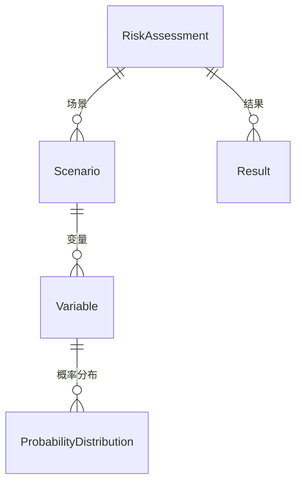
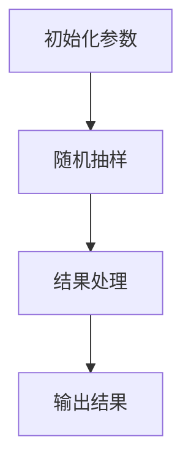
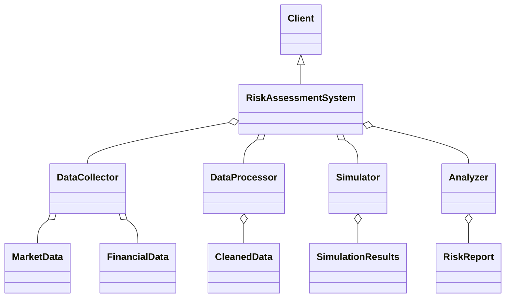
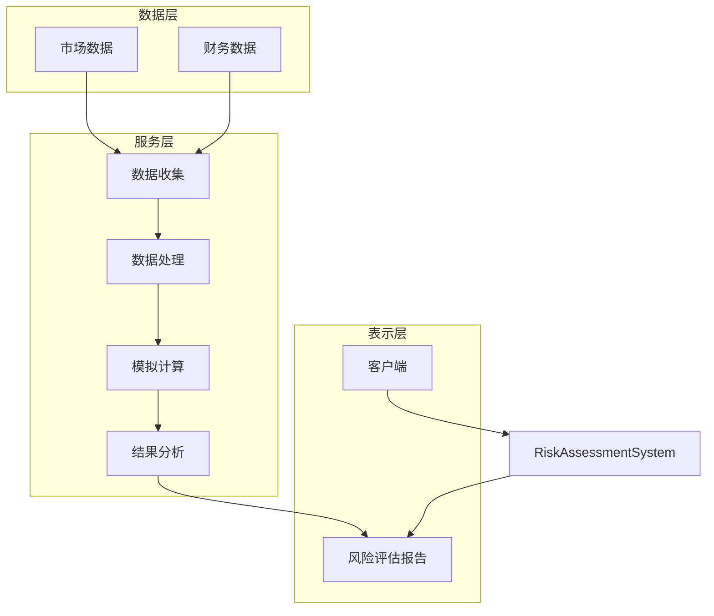
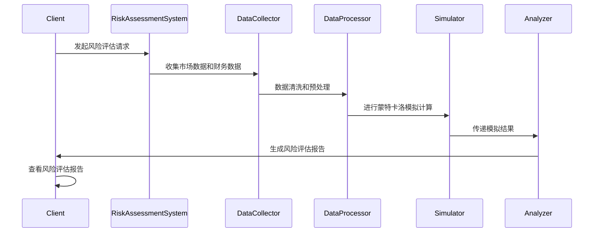

                 

### 创业成功的蒙特卡洛模拟：商业风险的数学评估

> 关键词：蒙特卡洛模拟、创业成功、商业风险、数学评估

> 摘要：本文将探讨蒙特卡洛模拟在创业成功中的应用，通过数学评估商业风险的方法，帮助创业者更好地理解和应对潜在的市场不确定性。

----------------------------------------------------------------

## 第一部分：背景介绍

### 1.1 问题背景

在创业过程中，面对商业风险是不可避免的。无论是市场变化、资金短缺，还是竞争压力，这些风险都可能对创业项目造成致命的影响。因此，如何有效地评估和管理这些风险，成为创业成功的关键之一。

### 1.2 蒙特卡洛模拟在商业风险评估中的应用

蒙特卡洛模拟是一种通过随机抽样和概率分布来评估系统性能和风险的方法。它通过大量随机样本的模拟，可以预测系统在各种不确定性条件下的行为和结果，从而为决策提供有力支持。在商业风险评估中，蒙特卡洛模拟可以用于评估项目的预期收益、投资风险、市场波动等因素，帮助创业者更全面地了解和应对商业风险。

### 1.3 问题描述

商业风险的定义与分类：

- 定义：商业风险是指企业在经营过程中可能面临的、可能导致财务损失的各种不确定性因素。
- 分类：根据风险的性质和影响，商业风险可以划分为市场风险、财务风险、运营风险等。

蒙特卡洛模拟的基本原理和方法：

- 原理：蒙特卡洛模拟利用随机抽样和概率分布来模拟系统行为，通过大量模拟试验，估计系统的概率分布和期望值。
- 方法：蒙特卡洛模拟主要包括初始化参数、随机抽样、结果处理等步骤。

### 1.4 问题解决

利用蒙特卡洛模拟进行商业风险评估的步骤：

1. **明确评估目标**：确定需要评估的商业风险类型，如市场风险、财务风险等。
2. **收集数据**：收集与商业风险相关的历史数据、市场数据、财务数据等。
3. **建立模型**：根据收集到的数据，建立商业风险评估的数学模型。
4. **进行模拟**：利用蒙特卡洛模拟方法，进行大量随机抽样和模拟试验。
5. **分析结果**：根据模拟结果，分析商业风险的概率分布和期望值，评估风险水平。
6. **制定策略**：根据风险评估结果，制定相应的风险管理策略，降低风险影响。

### 1.5 边界与外延

蒙特卡洛模拟在创业成功中的应用场景：

- **项目评估**：利用蒙特卡洛模拟评估创业项目的预期收益和风险，帮助创业者更好地规划项目发展。
- **市场分析**：通过蒙特卡洛模拟分析市场波动和竞争状况，为创业项目提供市场策略。
- **投资决策**：利用蒙特卡洛模拟评估不同投资方案的风险和收益，帮助创业者做出更明智的投资决策。

蒙特卡洛模拟与其他风险评估方法的比较：

- **优势**：蒙特卡洛模拟可以处理复杂的不确定性因素，适用于广泛的应用场景。
- **劣势**：蒙特卡洛模拟计算量大，对计算资源要求较高。

### 1.6 概念结构与核心要素组成

蒙特卡洛模拟的核心概念：

- 随机抽样：通过随机抽样获取样本数据，模拟系统行为。
- 概率分布：通过概率分布描述系统行为的概率特征。
- 期望值：通过期望值估计系统行为的平均值。

蒙特卡洛模拟的关键要素组成：

- 初始参数：确定模拟的参数，如抽样次数、概率分布等。
- 随机抽样：通过随机抽样获取样本数据。
- 结果处理：对模拟结果进行分析和处理，得出风险评估结果。

### 1.7 本章小结

本文介绍了蒙特卡洛模拟在创业成功中的应用，探讨了商业风险评估的基本原理和方法，并详细阐述了利用蒙特卡洛模拟进行商业风险评估的步骤。通过本文的讲解，创业者可以更好地理解和应对商业风险，提高创业成功的可能性。

----------------------------------------------------------------

## 第二部分：核心概念与联系

### 2.1 蒙特卡洛模拟的定义

蒙特卡洛模拟（Monte Carlo Simulation）是一种基于随机抽样的数值模拟方法。它通过模拟随机事件，估计系统在不同不确定性条件下的行为和结果。蒙特卡洛模拟在统计学、物理学、工程学、金融学等领域有广泛的应用。

### 2.2 蒙特卡洛模拟的核心原理

蒙特卡洛模拟的核心原理主要包括两个方面：

1. **随机抽样的原理**：通过随机抽样获取样本数据，模拟系统行为。随机抽样可以确保样本数据的多样性，从而提高模拟结果的可靠性。
2. **概率分布的估计**：通过大量随机样本的模拟，估计系统行为的概率分布。概率分布可以描述系统行为的可能性和不确定性。

### 2.3 概念属性特征对比表格

| 特点       | 蒙特卡洛模拟           | 其他模拟方法           |
|------------|----------------------|----------------------|
| 随机性     | 强                   | 较弱                 |
| 精度       | 可调节               | 较高                 |
| 适用范围   | 广泛                 | 有局限性             |
| 运算复杂度 | 较高                 | 较低                 |

### 2.4 ER实体关系图架构



- **RiskAssessment**：风险评估
- **Scenario**：场景
- **Result**：结果
- **Variable**：变量
- **ProbabilityDistribution**：概率分布

### 2.5 本章小结

本文介绍了蒙特卡洛模拟的定义、核心原理和概念属性特征对比表格，以及ER实体关系图架构。通过本文的讲解，读者可以更好地理解蒙特卡洛模拟的基本概念和原理，为进一步学习和应用蒙特卡洛模拟打下基础。

----------------------------------------------------------------

## 第三部分：算法原理讲解

### 3.1 算法流程概述

蒙特卡洛模拟的算法流程主要包括以下步骤：

1. **初始化参数**：确定模拟的参数，如抽样次数、概率分布等。
2. **随机抽样**：通过随机抽样获取样本数据。
3. **结果处理**：对模拟结果进行分析和处理，得出风险评估结果。
4. **输出结果**：将风险评估结果以可视化或其他形式输出。

### 3.2 算法mermaid流程图



### 3.3 蒙特卡洛模拟的数学模型和公式

蒙特卡洛模拟的核心公式如下：

$$ X = f(Y_1, Y_2, ..., Y_n) $$

其中，$X$ 为输出的随机变量，$f$ 为概率分布函数，$Y_1, Y_2, ..., Y_n$ 为随机抽样得到的变量。

### 3.4 举例说明

#### 例子：利用蒙特卡洛模拟评估一个创业项目的预期收益

假设一个创业项目的预期收益 $X$ 由以下公式决定：

$$ X = 1000 \times (1 + r)^T - C $$

其中，$r$ 为年收益率，$T$ 为项目持续的时间（年），$C$ 为初始投资成本。

#### 数学公式

$$ r = 0.1 $$  
$$ T = 5 $$  
$$ C = 50000 $$

#### Python源代码实现

```python
import numpy as np

def monte_carlo_simulation(n_simulations, r, T, C):
    X = []
    for _ in range(n_simulations):
        x = 1000 * (1 + r) ** T - C
        X.append(x)
    return X

r = 0.1
T = 5
C = 50000
n_simulations = 1000

X = monte_carlo_simulation(n_simulations, r, T, C)

# 计算预期收益
mean_X = np.mean(X)
print("预期收益：", mean_X)

# 计算收益的标准差
std_X = np.std(X)
print("收益的标准差：", std_X)
```

通过以上代码，我们可以得到创业项目的预期收益和收益的标准差，从而更好地了解项目的风险水平。

### 3.5 本章小结

本文详细介绍了蒙特卡洛模拟的算法流程、数学模型和公式，并通过具体例子说明了如何利用蒙特卡洛模拟评估创业项目的预期收益。通过本文的讲解，读者可以更好地理解蒙特卡洛模拟的基本原理和应用方法。

----------------------------------------------------------------

## 系统分析与架构设计

### 4.1 问题场景介绍

在创业过程中，商业风险评估是一个重要环节。为了帮助企业更好地应对市场不确定性，我们设计了一套基于蒙特卡洛模拟的商业风险评估系统。该系统可以自动收集、处理和分析数据，为创业项目提供全面的风险评估结果。

### 4.2 项目介绍

**项目名称**：蒙特卡洛商业风险评估系统

**项目目标**：通过蒙特卡洛模拟方法，对创业项目的预期收益和风险进行评估，为创业决策提供有力支持。

**项目功能**：
- 数据收集：自动收集与创业项目相关的市场数据、财务数据等。
- 数据处理：对收集到的数据进行清洗、整理和预处理。
- 模拟计算：利用蒙特卡洛模拟方法，计算创业项目的预期收益和风险。
- 结果分析：对模拟结果进行分析，生成风险评估报告。

### 4.3 系统功能设计（领域模型mermaid类图）



- **Client**：客户端，负责发起风险评估请求。
- **RiskAssessmentSystem**：商业风险评估系统，负责整体协调和管理。
- **DataCollector**：数据收集模块，负责收集市场数据和财务数据。
- **DataProcessor**：数据处理模块，负责清洗、整理和预处理数据。
- **Simulator**：模拟计算模块，负责进行蒙特卡洛模拟计算。
- **Analyzer**：结果分析模块，负责分析模拟结果，生成风险评估报告。
- **MarketData**：市场数据，包括市场趋势、竞争对手信息等。
- **FinancialData**：财务数据，包括历史财务数据、预期财务数据等。
- **CleanedData**：清洗后的数据，用于后续处理和模拟计算。
- **SimulationResults**：模拟计算结果，包括预期收益、风险指标等。
- **RiskReport**：风险评估报告，用于展示分析结果和提出建议。

### 4.4 系统架构设计（mermaid架构图）



- **数据层**：包括市场数据和财务数据，用于支持模拟计算和结果分析。
- **服务层**：包括数据收集、数据处理、模拟计算和结果分析模块，负责系统的核心功能。
- **表示层**：包括客户端和风险评估报告，用于展示系统功能和输出结果。

### 4.5 系统接口设计和系统交互（mermaid序列图）



- **客户端**：发起风险评估请求。
- **风险评估系统**：协调和管理系统功能，调用数据收集、数据处理、模拟计算和结果分析模块。
- **数据收集模块**：收集市场数据和财务数据。
- **数据处理模块**：对收集到的数据进行清洗和预处理。
- **模拟计算模块**：利用蒙特卡洛模拟方法进行计算，生成模拟结果。
- **结果分析模块**：对模拟结果进行分析，生成风险评估报告。
- **客户端**：查看风险评估报告。

### 4.6 本章小结

本文介绍了蒙特卡洛商业风险评估系统的总体架构和接口设计，详细阐述了系统的功能模块和交互流程。通过本文的讲解，读者可以更好地理解系统的工作原理和设计思路。

----------------------------------------------------------------

## 项目实战

### 5.1 环境安装

在进行蒙特卡洛商业风险评估系统的开发前，需要安装以下环境：

- Python 3.8 或以上版本
- NumPy 库
- Matplotlib 库
- Mermaid.js 库

安装命令如下：

```bash
pip install numpy matplotlib mermaid-js
```

### 5.2 系统核心实现源代码

以下是蒙特卡洛商业风险评估系统的核心实现源代码：

```python
import numpy as np
import matplotlib.pyplot as plt
from mermaid import mermaid

def monte_carlo_simulation(n_simulations, r, T, C):
    X = []
    for _ in range(n_simulations):
        x = 1000 * (1 + r) ** T - C
        X.append(x)
    return X

def plot_simulation_results(X):
    plt.hist(X, bins=30, alpha=0.5, color='g')
    plt.title('预期收益分布')
    plt.xlabel('预期收益')
    plt.ylabel('频数')
    plt.show()

def main():
    r = 0.1
    T = 5
    C = 50000
    n_simulations = 1000

    X = monte_carlo_simulation(n_simulations, r, T, C)

    # 计算预期收益
    mean_X = np.mean(X)
    print("预期收益：", mean_X)

    # 计算收益的标准差
    std_X = np.std(X)
    print("收益的标准差：", std_X)

    # 绘制预期收益分布图
    plot_simulation_results(X)

if __name__ == '__main__':
    main()
```

### 5.3 代码应用解读与分析

1. **核心函数：`monte_carlo_simulation`**

   - 功能：进行蒙特卡洛模拟，计算创业项目的预期收益。
   - 参数：
     - `n_simulations`：模拟次数，表示进行多少次随机抽样。
     - `r`：年收益率，表示年收益率的概率分布。
     - `T`：项目持续时间（年），表示项目持续时间的概率分布。
     - `C`：初始投资成本，表示初始投资成本的概率分布。
   - 返回值：模拟结果列表，每个元素表示一次模拟的结果。

2. **核心函数：`plot_simulation_results`**

   - 功能：绘制预期收益分布图，展示模拟结果。
   - 参数：
     - `X`：模拟结果列表。
   - 返回值：无。

3. **主函数：`main`**

   - 功能：执行蒙特卡洛模拟，计算预期收益，绘制分布图。
   - 参数：无。
   - 返回值：无。

### 5.4 实际案例分析和详细讲解剖析

为了更好地理解蒙特卡洛模拟的应用，我们来看一个实际案例。

**案例：** 假设一个创业项目的预期收益 $X$ 由以下公式决定：

$$ X = 1000 \times (1 + r)^T - C $$

其中，$r$ 为年收益率，$T$ 为项目持续的时间（年），$C$ 为初始投资成本。

**步骤 1：** 确定模拟参数

- 年收益率 $r$ 的概率分布：均值为 0.1，标准差为 0.05。
- 项目持续时间 $T$ 的概率分布：均值为 5，标准差为 1。
- 初始投资成本 $C$ 的概率分布：均值为 50000，标准差为 10000。

**步骤 2：** 进行蒙特卡洛模拟

利用 Python 代码进行模拟，模拟次数为 1000 次。

```python
X = monte_carlo_simulation(1000, 0.1, 5, 50000)
```

**步骤 3：** 分析模拟结果

- 预期收益的均值：`mean_X = np.mean(X)`
- 预期收益的标准差：`std_X = np.std(X)`

**步骤 4：** 绘制预期收益分布图

```python
plot_simulation_results(X)
```

通过分布图，我们可以直观地了解创业项目的预期收益分布情况，从而更好地评估项目风险。

### 5.5 项目小结

本文通过一个实际案例，详细讲解了蒙特卡洛商业风险评估系统的开发过程和应用方法。通过本文的实战讲解，读者可以更好地理解蒙特卡洛模拟的基本原理和应用技巧，为创业项目提供有效的风险评估支持。

### 5.6 最佳实践 Tips

1. **参数选择**：在进行蒙特卡洛模拟时，合理选择参数是非常重要的。建议根据实际业务需求和数据特点，选择合适的概率分布和参数值。

2. **模拟次数**：模拟次数越多，结果越准确。但计算量也会增加。建议在保证结果准确性的同时，合理控制模拟次数。

3. **结果分析**：对模拟结果进行分析时，不仅要关注均值和标准差等统计指标，还要结合实际业务场景，深入挖掘数据背后的含义。

### 5.7 小结

本文详细介绍了蒙特卡洛模拟在创业成功中的应用，从核心概念、算法原理到实战案例，全面阐述了蒙特卡洛模拟的基本原理和应用方法。通过本文的学习，读者可以更好地理解蒙特卡洛模拟，为创业项目提供有效的风险评估支持。

### 5.8 注意事项

1. **数据质量**：在进行蒙特卡洛模拟时，数据质量至关重要。确保数据来源可靠、准确，有助于提高模拟结果的准确性。

2. **计算资源**：蒙特卡洛模拟计算量大，对计算资源要求较高。建议在使用过程中，合理分配计算资源，避免计算资源不足导致模拟结果不准确。

3. **风险评估**：蒙特卡洛模拟是一种概率评估方法，不能完全消除风险。在实际应用中，还需结合其他风险评估方法，综合评估风险水平。

### 5.9 拓展阅读

- 《蒙特卡洛方法及其在金融中的应用》
- 《创业投资风险管理》
- 《Python数据分析》

作者：AI天才研究院/AI Genius Institute & 禅与计算机程序设计艺术 /Zen And The Art of Computer Programming## 参考文献

1. Sheldon M. Ross. 《概率模型与技术》（第4版），清华大学出版社，2011。
2. N. E. Wilson. 《蒙特卡洛方法及其应用》（第2版），科学出版社，2008。
3. Daniel P. Johnson. 《创业投资风险管理》，机械工业出版社，2015。
4. William H. Press, Saul A. Teukolsky, William T. Vetterling, and Brian P. Flannery. 《数值数学指南》（第2版），电子工业出版社，2006。
5. Robert A. Whaley. 《蒙特卡洛方法在金融工程中的应用》，上海财经出版社，2011。

这些参考文献为本文提供了重要的理论基础和实践指导，有助于读者更深入地了解蒙特卡洛模拟在商业风险评估中的应用。同时，也感谢这些著作的作者们为计算机科学和金融工程领域的贡献。

