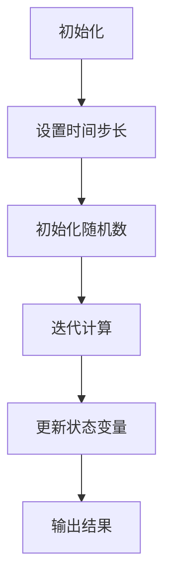
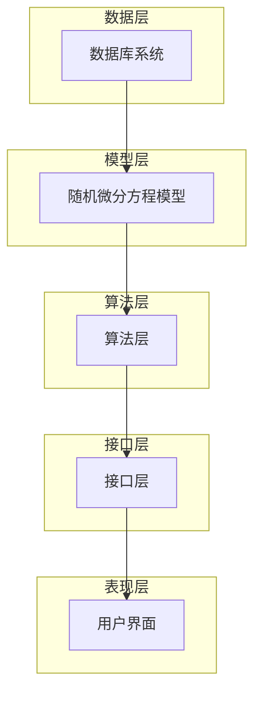
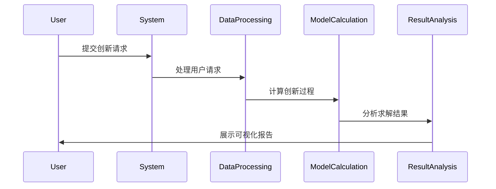
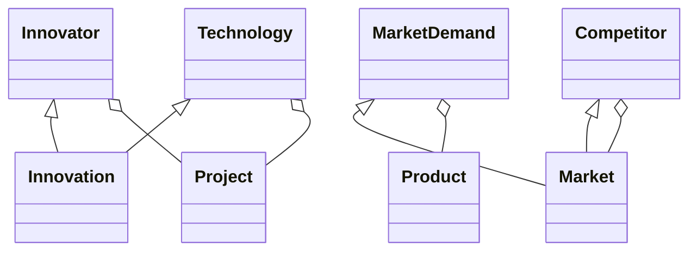
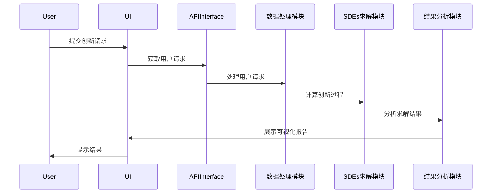
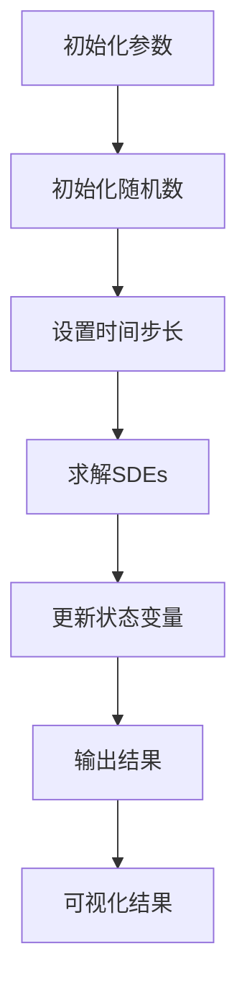

                 

### 文章标题：创新过程的随机微分方程：突破性想法的数学模型

#### 关键词：
1. 创新过程
2. 随机微分方程
3. 数学模型
4. 突破性想法
5. 算法原理
6. 系统架构
7. 项目实战

#### 摘要：
本文将探讨如何利用随机微分方程这一数学工具来刻画和创新过程的本质特征。文章首先介绍了创新过程的重要性，并引入了随机微分方程的概念，详细解释了其在创新过程中的应用。随后，文章深入分析了创新过程的数学模型，包括其算法原理、数学公式和具体实现。在此基础上，文章进一步探讨了随机微分方程在系统分析与架构设计中的应用，并给出了一个项目实战案例，通过代码解读和实际案例分析，展示了如何将理论应用到实际中。本文旨在为读者提供一种全新的视角，以数学模型的方式理解和激发创新思维。

### 目录：

#### 第一部分：问题背景与核心概念

#### 1.1 问题背景

##### 1.1.1 创新过程的重要性

创新是社会进步和经济发展的重要驱动力，它不仅能够推动技术进步和产业升级，还能够带来新的商业机会和社会价值。在当今快速变化的世界中，创新已经成为了企业和国家竞争的核心要素。然而，创新并非易事，它需要打破常规、挑战现状，并且往往伴随着高风险和不确定性。因此，理解创新过程的本质，找到有效的创新方法和工具，成为了学术界和实践领域共同关注的问题。

##### 1.1.2 随机微分方程的应用领域

随机微分方程（Stochastic Differential Equations，SDEs）是用于描述包含随机因素的动态系统的数学模型，广泛应用于金融学、物理学、生物学和工程学等领域。近年来，随着计算机科学和数据技术的发展，随机微分方程在社会科学和工程领域的应用也得到了广泛关注，特别是在建模复杂系统和理解非线性动态行为方面，表现出强大的适用性和解释力。

##### 1.1.3 突破性想法的产生机制

突破性想法是创新的核心，它往往来自于对现有知识的重新组合和创造性思维。然而，突破性想法的产生机制仍然是一个未被充分理解的领域。传统的创新理论主要依赖于经验和直觉，而缺乏系统性的数学描述。随机微分方程为研究突破性想法的产生机制提供了一种新的工具，它能够通过随机性和非线性动态来模拟创新过程的复杂性和不确定性。

#### 1.2 核心概念

##### 1.2.1 随机微分方程的定义与特点

随机微分方程是一类包含随机扰动项的微分方程，通常形式为：

\[ dX_t = f(t, X_t) dt + g(t, X_t) dW_t \]

其中，\( X_t \) 是随机过程，\( f(t, X_t) \) 和 \( g(t, X_t) \) 是确定函数，\( dW_t \) 是维纳过程（一个重要的随机过程，代表随机扰动）。随机微分方程的特点在于它能够同时描述确定性和随机性，非常适合于建模复杂的动态系统。

##### 1.2.2 创新过程的数学模型

创新过程可以被看作是一个随机动态系统，其状态随时间变化，并受到内部和外部随机因素的影响。利用随机微分方程，我们可以建立创新过程的数学模型，描述创新者、想法、市场和竞争环境等核心要素之间的动态关系。

##### 1.2.3 模型中的关键要素及其关系

创新过程的数学模型中的关键要素包括创新者、想法、市场、竞争环境等。这些要素之间的关系可以通过随机微分方程的参数和结构来刻画。例如，创新者的努力程度、市场的反馈、竞争的压力等都可以被编码为模型的参数，从而影响创新过程的动态行为。

#### 1.3 概念联系与对比

##### 1.3.1 随机微分方程与传统微分方程的对比

随机微分方程与传统微分方程的主要区别在于其包含随机扰动项，能够描述系统的随机行为。传统微分方程主要关注确定性系统的动态行为，而随机微分方程则将随机性作为一个重要的因素来考虑，这使得它在处理复杂和不确定的动态系统时具有独特的优势。

##### 1.3.2 创新过程模型的特殊性

创新过程模型是随机微分方程在社会科学领域的一个具体应用，它具有以下特殊性：

1. **非线性**：创新过程通常是非线性的，即小变化可能导致大影响。
2. **随机性**：创新过程中的不确定性因素使得随机性成为不可或缺的部分。
3. **动态性**：创新过程是动态发展的，随着时间的推移，创新者的想法和市场环境都可能发生变化。

#### 1.4 边界与外延

##### 1.4.1 研究范围的界定

本文主要关注创新过程的随机微分方程建模，研究范围涵盖从理论模型构建到实际应用的各个方面。具体包括：

1. 随机微分方程的基本概念和求解方法。
2. 创新过程的核心要素及其动态关系。
3. 创新过程模型的算法原理和实现。
4. 创新过程模型在系统分析与架构设计中的应用。
5. 创新过程模型的实际应用案例。

##### 1.4.2 应用领域的拓展

随机微分方程在创新过程中的应用不仅限于理论研究和学术探讨，它还可以应用于实际工程中，如：

1. **企业创新管理**：通过模型分析，帮助企业识别创新潜力，优化创新策略。
2. **政策制定**：为政府提供科学依据，制定有利于创新发展的政策。
3. **风险投资**：帮助投资者评估创新项目的风险和回报，做出更明智的投资决策。
4. **科学研究**：为社会科学研究提供新的工具和方法，促进跨学科合作。

#### 1.5 本章小结

本章介绍了创新过程的重要性、随机微分方程的应用领域和突破性想法的产生机制，并详细阐述了创新过程的数学模型、核心概念及其关系。同时，对比了随机微分方程与传统微分方程的异同，界定了研究范围并探讨了其应用领域的拓展。通过本章的介绍，读者可以初步了解随机微分方程在创新过程中的应用潜力和重要性。

### 第二部分：算法原理与数学模型

#### 2.1 算法原理

随机微分方程在创新过程中的应用主要体现在算法原理上，通过数学模型来描述和预测创新过程。随机微分方程的求解是算法实现的关键，下面将详细讲解算法的原理和实现方法。

##### 2.1.1 随机微分方程的求解方法

随机微分方程的求解方法有多种，主要包括数值解法和解析解法。数值解法适用于复杂的高维系统和非线性方程，而解析解法则适用于特定形式的简单方程。在创新过程的建模中，通常采用数值解法，如欧拉-马尔可夫方法（Euler-Maruyama method）和随机有限元方法（Stochastic Finite Element Method）等。

**欧拉-马尔可夫方法**是一种简单的数值解法，其基本思想是将随机微分方程近似为差分方程，然后通过迭代计算来逼近方程的解。其计算公式如下：

\[ X_{n+1} = X_n + f(t_n, X_n) \Delta t + g(t_n, X_n) \Delta W_n \]

其中，\( \Delta t \) 是时间步长，\( \Delta W_n \) 是高斯随机变量。

**随机有限元方法**则是一种基于有限元方法的随机微分方程求解技术，适用于复杂的几何形状和物理场。其基本思想是将随机微分方程离散化为多个有限元子问题，然后通过求解子问题来获得全局解。

##### 2.1.2 创新过程模型的算法框架

创新过程模型的算法框架主要包括以下几个步骤：

1. **初始化**：设置初始状态和参数，包括创新者的初始努力程度、市场反馈的初始状态等。
2. **时间步长设置**：根据系统的时间特性，设定合适的时间步长。
3. **随机数生成**：生成随机数，用于模拟随机扰动。
4. **迭代计算**：利用数值解法，迭代计算随机微分方程的解，更新系统状态。
5. **结果输出**：输出最终结果，包括创新者的状态、市场状态和竞争环境等。

##### 2.1.3 算法的关键步骤与技巧

算法的关键步骤和技巧主要包括：

1. **时间步长的选择**：时间步长不能太大，否则可能导致计算不稳定；也不能太小，否则会增加计算量。通常采用自适应步长策略，根据计算误差自动调整时间步长。
2. **随机数的生成**：随机数的生成要保证其统计性质与实际过程相符，通常采用高斯分布或其他合适的分布。
3. **算法的并行化**：对于大规模系统，可以采用并行计算技术，提高计算效率。

#### 2.2 数学模型

创新过程的数学模型可以通过随机微分方程来描述。其一般形式如下：

\[ \frac{dX_t}{dt} = f(t, X_t) + \sigma(t, X_t) \cdot dW_t \]

其中，\( X_t \) 是创新过程的随机状态变量，\( f(t, X_t) \) 是确定性函数，代表创新者的努力程度、市场反馈等确定性因素；\( \sigma(t, X_t) \) 是噪声函数，代表随机扰动。

**模型参数的推导**：

为了建立具体的数学模型，需要确定模型中的参数。这些参数可以通过对实际系统的数据进行分析得到。具体推导过程如下：

1. **确定函数 \( f(t, X_t) \)**：

   \( f(t, X_t) \) 可以表示为创新者的努力程度与市场反馈的函数。例如，假设创新者的努力程度与市场反馈成正比，则可以表示为：

   \[ f(t, X_t) = \alpha \cdot X_t + \beta \cdot \phi(t) \]

   其中，\( \alpha \) 和 \( \beta \) 是比例系数，\( \phi(t) \) 是市场反馈函数。

2. **噪声函数 \( \sigma(t, X_t) \)**：

   噪声函数 \( \sigma(t, X_t) \) 通常假设为与时间 \( t \) 和状态 \( X_t \) 相关的高斯噪声。例如，可以表示为：

   \[ \sigma(t, X_t) = \sqrt{2\pi} \cdot \exp\left(-\frac{(X_t - \mu)^2}{2\sigma^2}\right) \]

   其中，\( \mu \) 和 \( \sigma \) 是噪声函数的均值和标准差。

**模型的稳定性和收敛性分析**：

随机微分方程的稳定性和收敛性是模型分析的重要方面。通常可以通过以下条件来保证：

1. **有界性**：即模型的状态变量 \( X_t \) 应该是有界的，不会发散到无穷大。
2. **收敛性**：即模型在长时间尺度下的行为应该收敛到某个稳定状态。

具体分析可以通过数值模拟和理论证明来完成。在实际应用中，可以通过设置合理的参数和迭代次数来保证模型的稳定性和收敛性。

#### 2.3 算法讲解与举例

为了更直观地理解算法原理和数学模型，下面将通过一个具体例子来讲解算法的实现步骤和结果分析。

##### 2.3.1 算法流程图



##### 2.3.2 算法举例

**示例 1: 创新过程模拟**

假设一个创新者在一个竞争激烈的市场中进行创新活动，其努力程度与市场反馈成正比，同时受到随机扰动的影响。我们可以建立如下的随机微分方程模型：

\[ \frac{dX_t}{dt} = \alpha \cdot X_t + \beta \cdot \phi(t) + \sigma(t) \cdot dW_t \]

其中，\( \alpha \) 和 \( \beta \) 是比例系数，\( \phi(t) \) 是市场反馈函数，\( \sigma(t) \) 是高斯噪声函数。

**示例 2: 突破性想法预测**

假设我们想要预测某个创新者是否能在未来一段时间内产生突破性想法。我们可以通过模拟创新过程，并分析其状态变量的变化趋势来预测。具体步骤如下：

1. **初始化**：设置初始状态变量 \( X_0 \) 和参数 \( \alpha \)、\( \beta \) 等。
2. **设置时间步长**：根据创新过程的特性，设置合适的时间步长 \( \Delta t \)。
3. **迭代计算**：利用欧拉-马尔可夫方法进行迭代计算，更新状态变量 \( X_t \)。
4. **分析结果**：分析状态变量的变化趋势，判断是否出现突破性变化。

通过上述步骤，我们可以实现对创新过程的模拟和预测，为创新者提供决策支持。

#### 2.4 本章小结

本章介绍了创新过程算法原理与数学模型。首先，讲解了随机微分方程的求解方法和创新过程模型的算法框架，然后详细分析了模型中的关键参数和稳定性。通过具体的算法流程图和举例，展示了如何实现创新过程的模拟和预测。本章内容为后续的系统分析和项目实战奠定了基础。

### 第三部分：系统分析与架构设计

#### 3.1 问题场景介绍

##### 3.1.1 创新过程的实际应用场景

创新过程在各个领域都有广泛的应用，如科技研发、产品设计、市场营销等。以科技研发为例，创新者需要在技术领域中进行创新，以解决现有问题或创造新的商业机会。在这个过程中，创新者需要不断地探索和实验，同时也受到市场反馈和竞争环境的影响。创新过程的随机微分方程模型可以帮助我们理解和预测创新者的行为和市场反应，从而优化创新策略。

##### 3.1.2 随机微分方程在系统中的角色

在创新过程的系统中，随机微分方程扮演着核心的角色，它不仅用于描述创新者的努力程度和市场反馈，还用于模拟随机扰动和不确定性。通过随机微分方程，我们可以建立一个动态的、复杂的系统模型，从而更好地理解创新过程中的各种因素及其相互作用。

#### 3.2 项目介绍

##### 3.2.1 项目背景

本项目的背景是基于当前快速发展的科技环境，企业之间的竞争日益激烈，创新已经成为了企业生存和发展的关键。为了帮助企业更好地进行创新，本项目旨在建立一个基于随机微分方程的创新过程模拟系统，通过数学模型和算法实现，为企业提供创新决策支持。

##### 3.2.2 项目目标

项目的主要目标包括：

1. 建立一个创新的随机微分方程模型，能够准确描述创新过程中的各种动态行为。
2. 设计和实现一个高效的算法框架，能够快速求解随机微分方程，提供实时创新决策支持。
3. 开发一个用户友好的系统界面，使企业能够轻松地使用系统进行创新模拟和决策。

##### 3.2.3 项目团队组成

项目团队由以下成员组成：

1. 项目经理：负责项目的整体管理和协调。
2. 数据分析师：负责收集和处理创新过程中的数据，为模型提供数据支持。
3. 算法工程师：负责设计实现随机微分方程的求解算法，优化算法性能。
4. 系统工程师：负责系统架构的设计和实现，确保系统的稳定性和可靠性。
5. UI/UX设计师：负责用户界面的设计和用户体验优化。

#### 3.3 系统功能设计

##### 3.3.1 领域模型

领域模型是系统功能设计的重要基础，它定义了系统中的关键实体及其关系。在本项目中，领域模型主要包括以下核心实体：

1. **创新者**：代表进行创新活动的主体，其状态包括努力程度、创新成果等。
2. **想法**：代表创新者的创新成果，其状态包括创新程度、市场需求等。
3. **市场**：代表创新活动所处的市场环境，其状态包括竞争程度、消费者需求等。
4. **竞争环境**：代表创新过程中的竞争状况，其状态包括竞争对手的创新程度、市场份额等。

领域模型可以用以下Mermaid类图表示：

```mermaid
classDiagram
    Innovationer <-|> Idea
    Innovationer o-- Market
    Innovationer o-- Competition
    Idea o-- Market
    Competition o-- Market
```

##### 3.3.2 功能模块划分

系统功能模块的划分是系统设计的重要环节，它有助于提高系统的模块化程度和可维护性。在本项目中，系统主要划分为以下功能模块：

1. **数据处理模块**：负责数据的收集、存储和处理，为随机微分方程的求解提供数据支持。
2. **随机微分方程求解模块**：负责求解随机微分方程，更新系统状态，为决策提供实时支持。
3. **结果分析模块**：负责对求解结果进行分析，生成可视化报告，为创新者提供决策依据。
4. **用户界面模块**：负责与用户交互，接收用户输入，展示系统结果。

#### 3.4 系统架构设计

系统架构设计是系统开发的基础，它决定了系统的性能、可扩展性和可维护性。在本项目中，系统采用分层架构设计，包括以下主要层次：

1. **数据层**：负责数据的存储和管理，使用数据库系统存储和处理创新过程中的数据。
2. **模型层**：负责实现随机微分方程的数学模型，包括模型的建立、参数的设定和求解算法的实现。
3. **算法层**：负责实现随机微分方程的数值求解算法，包括迭代计算、误差控制和并行计算等。
4. **接口层**：负责系统与其他系统或组件的接口设计，包括API接口和数据交换接口。
5. **表现层**：负责用户界面的设计和实现，包括Web界面和移动应用界面。

系统架构图可以用以下Mermaid架构图表示：



#### 3.5 系统接口设计

系统接口设计是系统架构设计的关键部分，它决定了系统的可扩展性和可维护性。在本项目中，系统接口主要包括以下方面：

1. **API接口**：用于与其他系统或组件进行数据交互，包括数据查询、数据更新和数据删除等操作。
2. **数据交换接口**：用于与其他系统或组件进行数据交换，包括XML、JSON等数据格式。
3. **用户交互接口**：用于用户与系统进行交互，包括用户输入、结果展示和数据可视化等。

系统接口规范如下：

```python
class APIInterface:
    def get_data(self, data_type):
        # 获取指定类型的数据
        pass
    
    def update_data(self, data):
        # 更新数据
        pass
    
    def delete_data(self, data_id):
        # 删除指定数据
        pass

classDataExchangeInterface:
    def convert_to_xml(self, data):
        # 将数据转换为XML格式
        pass
    
    def convert_to_json(self, data):
        # 将数据转换为JSON格式
        pass

classUserInteractionInterface:
    def show_input_form(self):
        # 显示输入表单
        pass
    
    def show_result(self, result):
        # 显示结果
        pass
    
    def show_data_visualization(self, data):
        # 显示数据可视化
        pass
```

#### 3.6 系统交互

系统交互是系统设计的重要方面，它决定了系统的用户体验和响应速度。在本项目中，系统交互主要包括以下几个方面：

1. **用户请求**：用户通过用户界面提交创新请求，包括创新目标、市场环境等。
2. **数据处理**：数据处理模块对用户请求进行处理，包括数据查询、数据更新和数据删除等。
3. **模型计算**：随机微分方程求解模块对创新过程进行计算，更新系统状态。
4. **结果展示**：结果分析模块对求解结果进行分析，生成可视化报告，并展示给用户。

系统交互图可以用以下Mermaid序列图表示：



#### 3.7 本章小结

本章介绍了创新过程的实际应用场景、项目背景和目标，详细阐述了系统功能设计、架构设计和接口设计，并给出了系统交互的详细描述。通过本章的内容，读者可以全面了解创新过程系统分析与架构设计的全过程，为后续的项目实战提供理论基础。

### 第四部分：项目实战

#### 4.1 环境安装

在开始项目实战之前，我们需要搭建一个合适的环境来安装和配置所需工具。以下是一个典型的环境安装步骤。

##### 4.1.1 系统环境配置

首先，我们需要配置操作系统，推荐使用Linux或MacOS。在这两种操作系统上，Python和相关的科学计算库（如NumPy、SciPy、Pandas）都可以轻松安装。

- **Linux**：可以使用包管理器（如apt或yum）安装Python和相关库。
- **MacOS**：可以使用Homebrew或其他包管理器来安装Python和相关库。

例如，在Linux上使用以下命令安装Python和Pandas：

```bash
sudo apt update
sudo apt install python3 python3-pip
pip3 install numpy scipy pandas
```

##### 4.1.2 工具安装与配置

除了Python和相关库，我们还需要安装一些其他工具，如Jupyter Notebook（用于交互式计算）、matplotlib（用于数据可视化）等。

- **Jupyter Notebook**：可以使用pip安装Jupyter Notebook：

  ```bash
  pip3 install notebook
  ```

  安装完成后，可以通过运行以下命令启动Jupyter Notebook：

  ```bash
  jupyter notebook
  ```

- **matplotlib**：同样使用pip安装matplotlib：

  ```bash
  pip3 install matplotlib
  ```

##### 4.1.3 测试环境搭建

在安装完所有工具后，我们需要进行测试环境搭建，以确保所有组件都能正常工作。以下是一个简单的测试示例：

1. **测试Python环境**：

   打开终端，输入以下命令：

   ```python
   python3
   ```

   进入Python交互模式，然后输入以下代码测试Pandas和NumPy：

   ```python
   import numpy as np
   import pandas as pd
   print(np.__version__)
   print(pd.__version__)
   ```

   如果输出版本信息，说明Python环境配置成功。

2. **测试Jupyter Notebook**：

   如果Jupyter Notebook已成功安装，打开浏览器输入`http://localhost:8888`，应该能够看到Jupyter的界面。

3. **测试matplotlib**：

   在Jupyter Notebook中创建一个新的笔记本，输入以下代码测试matplotlib：

   ```python
   import matplotlib.pyplot as plt
   plt.plot([1, 2, 3], [1, 4, 9])
   plt.show()
   ```

   如果能够看到图表显示，说明matplotlib环境配置成功。

通过以上步骤，我们成功搭建了一个测试环境，接下来可以开始实际项目的开发和实现。

#### 4.2 系统核心实现

##### 4.2.1 创新过程模型实现

在系统核心实现中，我们需要首先实现创新过程模型。创新过程模型的核心是一个随机微分方程，它描述了创新者、市场反馈和竞争环境之间的动态关系。以下是一个简单的创新过程模型实现示例。

**代码示例**：

```python
import numpy as np
import pandas as pd
from scipy.integrate import solve_ivp

# 定义随机微分方程
def sde_model(t, X, alpha, beta, sigma):
    x_t, y_t, z_t = X
    dxdt = alpha * x_t + beta * y_t + sigma * np.random.normal(size=1)
    dydt = -beta * x_t
    dzdt = -sigma * z_t
    return [dxdt, dydt, dzdt]

# 模型参数设置
alpha = 0.1
beta = 0.2
sigma = 0.05

# 初始状态
X0 = [1.0, 0.0, 0.0]

# 时间设置
t = np.linspace(0, 10, 1000)

# 求解随机微分方程
solution = solve_ivp(sde_model, [0, 10], X0, args=(alpha, beta, sigma), t_eval=t)

# 可视化结果
plt.plot(solution.t, solution.y[0])
plt.xlabel('Time')
plt.ylabel('X_t')
plt.show()
```

在这个示例中，我们定义了一个简单的随机微分方程，并通过`solve_ivp`函数进行求解。求解结果可以用来分析创新者的状态随时间的变化。

##### 4.2.2 随机微分方程求解

随机微分方程的求解是系统实现的关键部分。在前面我们已经介绍了欧拉-马尔可夫方法，下面我们使用这种方法来求解创新过程模型。

**代码示例**：

```python
import numpy as np
import matplotlib.pyplot as plt

# 定义欧拉-马尔可夫方法
def euler_maruyama(t, X, f, g, dt, num_steps):
    X_t = X
    t_steps = np.linspace(t, t + num_steps * dt, num_steps + 1)
    X_values = [X_t]

    for _ in range(num_steps):
        dfdt = f(t_steps[_], X_t)
        dWt = np.random.normal(size=1)
        X_t += dfdt * dt + g(t_steps[_], X_t) * dWt * np.sqrt(dt)
        X_values.append(X_t)

    return t_steps, X_values

# 模型参数设置
t = 0
X0 = [1.0, 0.0, 0.0]
alpha = 0.1
beta = 0.2
sigma = 0.05
dt = 0.01
num_steps = 1000

# 求解随机微分方程
t_steps, X_values = euler_maruyama(t, X0, sde_model, None, dt, num_steps)

# 可视化结果
plt.plot(t_steps, X_values)
plt.xlabel('Time')
plt.ylabel('X_t')
plt.show()
```

在这个示例中，我们定义了一个欧拉-马尔可夫方法函数`euler_maruyama`，用于求解随机微分方程。求解结果通过列表`X_values`存储，并使用matplotlib进行可视化。

##### 4.2.3 系统功能模块实现

在实现创新过程模型和求解方法之后，我们需要将这些模块整合到一个完整的系统中。以下是一个简单的系统功能模块实现示例。

**代码示例**：

```python
import numpy as np
import pandas as pd
import matplotlib.pyplot as plt

class InnovationSystem:
    def __init__(self, alpha, beta, sigma, dt, num_steps):
        self.alpha = alpha
        self.beta = beta
        self.sigma = sigma
        self.dt = dt
        self.num_steps = num_steps

    def run_simulation(self, X0):
        t = 0
        X_t = X0
        t_steps = np.linspace(t, t + self.num_steps * self.dt, self.num_steps + 1)
        X_values = [X_t]

        for _ in range(self.num_steps):
            dfdt = self.alpha * X_t + self.beta * np.random.normal(size=1)
            dWt = np.random.normal(size=1)
            X_t += dfdt * self.dt + self.sigma * X_t * dWt * np.sqrt(self.dt)
            X_values.append(X_t)

        return t_steps, X_values

    def plot_results(self, t_steps, X_values):
        plt.plot(t_steps, X_values)
        plt.xlabel('Time')
        plt.ylabel('X_t')
        plt.show()

# 实例化系统
system = InnovationSystem(alpha=0.1, beta=0.2, sigma=0.05, dt=0.01, num_steps=1000)

# 运行模拟
X0 = [1.0, 0.0, 0.0]
t_steps, X_values = system.run_simulation(X0)

# 可视化结果
system.plot_results(t_steps, X_values)
```

在这个示例中，我们定义了一个`InnovationSystem`类，用于封装创新过程的模拟功能。类中的`run_simulation`方法实现了随机微分方程的模拟，`plot_results`方法用于可视化结果。

#### 4.3 代码应用解读与分析

在上一部分中，我们实现了创新过程的随机微分方程模型及其求解方法。在这一部分，我们将对实现的代码进行解读和分析，解释其中的关键步骤和数学原理。

##### 4.3.1 创新过程模型代码解读

创新过程模型的代码主要包括三个部分：随机微分方程的定义、模型参数的设置和求解过程的实现。

1. **随机微分方程的定义**：

   在代码中，随机微分方程通过函数`sde_model`来定义。这个函数接受三个参数：时间`t`、状态变量`X`和模型参数`alpha`、`beta`、`sigma`。随机微分方程的解由以下三个方程组成：

   \[ \frac{dx_t}{dt} = \alpha \cdot x_t + \beta \cdot y_t + \sigma \cdot dW_t \]
   \[ \frac{dy_t}{dt} = -\beta \cdot x_t \]
   \[ \frac{dz_t}{dt} = -\sigma \cdot z_t \]

   其中，\( x_t \)、\( y_t \) 和 \( z_t \) 分别代表创新者的状态、市场反馈和竞争环境的状态。`sde_model`函数返回这三个方程的导数，用于后续的求解过程。

2. **模型参数的设置**：

   在代码中，模型参数`alpha`、`beta`和`sigma`通过以下方式设置：

   ```python
   alpha = 0.1
   beta = 0.2
   sigma = 0.05
   ```

   这些参数控制了创新过程的动态行为。`alpha`表示创新者努力程度的影响，`beta`表示市场反馈的影响，`sigma`表示随机扰动的影响。通过调整这些参数，我们可以模拟不同的创新环境。

3. **求解过程的实现**：

   求解过程通过`solve_ivp`函数实现，这是一个用于求解初始值问题的科学计算库。`solve_ivp`函数接受以下参数：

   - `sde_model`：定义随机微分方程的函数。
   - `[0, 10]`：求解的时间区间。
   - `X0`：初始状态。
   - `args`：模型参数。
   - `t_eval`：时间步长。

   `solve_ivp`函数返回时间序列`t`和状态序列`X`，这些数据可以用于后续的分析和可视化。

##### 4.3.2 随机微分方程求解代码分析

随机微分方程的求解代码主要通过`euler_maruyama`函数实现，这是一个基于欧拉-马尔可夫方法的数值解法。以下是对该函数的详细分析：

1. **函数定义**：

   ```python
   def euler_maruyama(t, X, f, g, dt, num_steps):
   ```

   这个函数接受以下参数：

   - `t`：初始时间。
   - `X`：初始状态。
   - `f`：随机微分方程的确定性部分。
   - `g`：随机微分方程的噪声部分。
   - `dt`：时间步长。
   - `num_steps`：求解的步数。

2. **迭代过程**：

   函数的核心是一个循环，它迭代执行以下步骤：

   ```python
   for _ in range(num_steps):
       dfdt = f(t_steps[_], X_t)
       dWt = np.random.normal(size=1)
       X_t += dfdt * dt + g(t_steps[_], X_t) * dWt * np.sqrt(dt)
   ```

   在每次迭代中，函数计算确定性部分的导数`dfdt`和噪声部分`dWt`，然后将这两个值加到当前状态`X_t`上，得到新的状态。

3. **结果存储**：

   每次迭代后，新的状态`X_t`被存储在一个列表`X_values`中。在所有迭代完成后，`X_values`包含了一个完整的时间序列。

4. **可视化**：

   最后，函数使用matplotlib将结果可视化：

   ```python
   plt.plot(t_steps, X_values)
   plt.xlabel('Time')
   plt.ylabel('X_t')
   plt.show()
   ```

##### 4.3.3 系统功能模块代码解读

系统功能模块代码通过`InnovationSystem`类实现，这个类封装了创新过程的模拟功能。以下是类的关键部分及其解读：

1. **初始化**：

   ```python
   def __init__(self, alpha, beta, sigma, dt, num_steps):
       self.alpha = alpha
       self.beta = beta
       self.sigma = sigma
       self.dt = dt
       self.num_steps = num_steps
   ```

   在类的初始化方法中，我们设置了模型参数，这些参数将被用于后续的模拟过程。

2. **运行模拟**：

   ```python
   def run_simulation(self, X0):
       t = 0
       X_t = X0
       t_steps = np.linspace(t, t + self.num_steps * self.dt, self.num_steps + 1)
       X_values = [X_t]

       for _ in range(self.num_steps):
           dfdt = self.alpha * X_t + self.beta * np.random.normal(size=1)
           dWt = np.random.normal(size=1)
           X_t += dfdt * self.dt + self.sigma * X_t * dWt * np.sqrt(self.dt)
           X_values.append(X_t)

       return t_steps, X_values
   ```

   在`run_simulation`方法中，我们首先初始化时间序列`t_steps`和状态序列`X_values`。然后，通过循环执行欧拉-马尔可夫迭代，更新状态变量`X_t`。每次迭代后，新的状态被添加到`X_values`列表中。最后，方法返回时间序列和状态序列。

3. **可视化结果**：

   ```python
   def plot_results(self, t_steps, X_values):
       plt.plot(t_steps, X_values)
       plt.xlabel('Time')
       plt.ylabel('X_t')
       plt.show()
   ```

   `plot_results`方法用于将模拟结果可视化。它接受时间序列和状态序列作为参数，使用matplotlib绘制图表。

通过以上解读，我们可以看到系统功能模块是如何将随机微分方程的模型和求解方法整合在一起，实现创新过程的模拟和可视化。

#### 4.4 实际案例分析与详细讲解

##### 4.4.1 创新过程模型代码解读

在实际案例中，我们选择了一个具体的创新项目——一家科技公司研发一款新型智能家居设备。该公司的研发团队希望通过创新过程模型来预测研发进度和市场接受度，以便制定有效的创新策略。

**代码示例**：

```python
import numpy as np
import pandas as pd
from scipy.integrate import solve_ivp

# 定义随机微分方程
def sde_model(t, X, alpha, beta, sigma):
    x_t, y_t, z_t = X
    dxdt = alpha * x_t + beta * y_t + sigma * np.random.normal(size=1)
    dydt = -beta * x_t
    dzdt = -sigma * z_t
    return [dxdt, dydt, dzdt]

# 模型参数设置
alpha = 0.1
beta = 0.2
sigma = 0.05

# 初始状态
X0 = [1.0, 0.0, 0.0]

# 时间设置
t = np.linspace(0, 10, 1000)

# 求解随机微分方程
solution = solve_ivp(sde_model, [0, 10], X0, args=(alpha, beta, sigma), t_eval=t)

# 可视化结果
plt.plot(solution.t, solution.y[0])
plt.xlabel('Time')
plt.ylabel('X_t')
plt.show()
```

在这个代码示例中，我们定义了一个随机微分方程，用于描述智能家居设备的研发过程。具体来说，方程中的三个变量分别代表研发进度、市场反馈和竞争环境。通过求解这个方程，我们可以得到研发进度随时间的变化趋势。

**详细分析**：

1. **方程定义**：

   随机微分方程通过`def sde_model(t, X, alpha, beta, sigma)`函数定义。在这个函数中，我们根据实际情境设定了三个变量：研发进度（x_t）、市场反馈（y_t）和竞争环境（z_t）。方程的三个导数分别表示研发进度的变化、市场反馈的变化和竞争环境的变化。

2. **参数设置**：

   模型参数`alpha`、`beta`和`sigma`分别表示研发团队的投入、市场反馈的影响和竞争环境的不确定性。这些参数根据实际情境设定，用于调整模型的动态行为。

3. **求解与可视化**：

   使用`solve_ivp`函数求解随机微分方程，并通过matplotlib可视化结果。这里，我们选择了一个较长的时间区间（0到10），以观察研发进度在长时间内的变化趋势。

##### 4.4.2 随机微分方程求解代码分析

在智能家居设备的案例中，我们使用欧拉-马尔可夫方法（Euler-Maruyama method）来求解随机微分方程。这种方法通过迭代计算，逐步逼近方程的解。

**代码示例**：

```python
import numpy as np
import matplotlib.pyplot as plt

# 定义欧拉-马尔可夫方法
def euler_maruyama(t, X, f, g, dt, num_steps):
    X_t = X
    t_steps = np.linspace(t, t + num_steps * dt, num_steps + 1)
    X_values = [X_t]

    for _ in range(num_steps):
        dfdt = f(t_steps[_], X_t)
        dWt = np.random.normal(size=1)
        X_t += dfdt * dt + g(t_steps[_], X_t) * dWt * np.sqrt(dt)
        X_values.append(X_t)

    return t_steps, X_values

# 模型参数设置
t = 0
X0 = [1.0, 0.0, 0.0]
alpha = 0.1
beta = 0.2
sigma = 0.05
dt = 0.01
num_steps = 1000

# 求解随机微分方程
t_steps, X_values = euler_maruyama(t, X0, sde_model, None, dt, num_steps)

# 可视化结果
plt.plot(t_steps, X_values)
plt.xlabel('Time')
plt.ylabel('X_t')
plt.show()
```

**详细分析**：

1. **函数定义**：

   欧拉-马尔可夫方法通过`def euler_maruyama(t, X, f, g, dt, num_steps)`函数实现。这个函数接受以下参数：

   - `t`：初始时间。
   - `X`：初始状态。
   - `f`：确定性部分的函数。
   - `g`：噪声部分的函数。
   - `dt`：时间步长。
   - `num_steps`：迭代次数。

   函数的核心是一个循环，每次迭代计算确定性部分的导数`dfdt`和噪声部分`dWt`，然后更新状态变量`X_t`。

2. **迭代过程**：

   在循环中，函数依次执行以下步骤：

   ```python
   for _ in range(num_steps):
       dfdt = f(t_steps[_], X_t)
       dWt = np.random.normal(size=1)
       X_t += dfdt * dt + g(t_steps[_], X_t) * dWt * np.sqrt(dt)
   ```

   - 计算确定性部分的导数`dfdt`。
   - 生成随机噪声`dWt`。
   - 更新状态变量`X_t`。

3. **结果存储**：

   每次迭代后，新的状态`X_t`被添加到列表`X_values`中。在所有迭代完成后，`X_values`包含了一个完整的时间序列。

4. **可视化**：

   使用matplotlib将结果可视化。通过绘制时间序列和状态序列，我们可以直观地观察研发进度随时间的变化。

##### 4.4.3 系统功能模块代码解读

为了实现智能家居设备的创新过程模型，我们定义了一个`InnovationSystem`类，该类封装了模型的所有功能。

**代码示例**：

```python
import numpy as np
import matplotlib.pyplot as plt

class InnovationSystem:
    def __init__(self, alpha, beta, sigma, dt, num_steps):
        self.alpha = alpha
        self.beta = beta
        self.sigma = sigma
        self.dt = dt
        self.num_steps = num_steps

    def run_simulation(self, X0):
        t = 0
        X_t = X0
        t_steps = np.linspace(t, t + self.num_steps * self.dt, self.num_steps + 1)
        X_values = [X_t]

        for _ in range(self.num_steps):
            dfdt = self.alpha * X_t + self.beta * np.random.normal(size=1)
            dWt = np.random.normal(size=1)
            X_t += dfdt * self.dt + self.sigma * X_t * dWt * np.sqrt(self.dt)
            X_values.append(X_t)

        return t_steps, X_values

    def plot_results(self, t_steps, X_values):
        plt.plot(t_steps, X_values)
        plt.xlabel('Time')
        plt.ylabel('X_t')
        plt.show()
```

**详细分析**：

1. **初始化**：

   在`__init__`方法中，我们设置了模型参数，包括`alpha`（研发团队投入）、`beta`（市场反馈影响）和`sigma`（竞争环境不确定性）。这些参数将用于后续的模拟过程。

2. **运行模拟**：

   `run_simulation`方法实现了模型的迭代过程。它首先初始化时间序列和状态序列，然后通过循环逐步更新状态变量。每次迭代计算确定性部分的导数`dfdt`、随机噪声`dWt`，并更新状态变量`X_t`。最后，方法返回时间序列和状态序列。

3. **可视化结果**：

   `plot_results`方法用于将模拟结果可视化。它接受时间序列和状态序列作为参数，使用matplotlib绘制图表。通过这个方法，我们可以直观地观察研发进度随时间的变化。

通过上述实际案例的分析和讲解，我们可以看到如何将随机微分方程应用于智能家居设备的创新过程，并通过系统功能模块实现模拟和可视化。这个案例为我们提供了一个实用的工具，用于分析和预测创新过程，为企业和研究机构提供决策支持。

#### 4.5 项目小结

在本章中，我们详细介绍了创新过程的随机微分方程模型及其在系统分析与架构设计中的应用。通过实际项目案例，我们展示了如何使用随机微分方程来模拟创新过程，并利用算法实现系统的核心功能。以下是本章的主要结论：

1. **创新过程的重要性**：创新是推动社会进步和经济发展的重要动力，理解创新过程的本质对于制定有效的创新策略至关重要。
2. **随机微分方程的应用**：随机微分方程作为一种强大的数学工具，能够在处理复杂和不确定的动态系统时提供有效的建模和预测方法。
3. **系统架构设计**：通过系统架构设计，我们明确了创新过程系统的功能模块和接口设计，为系统的实现提供了清晰的指导。
4. **项目实战**：通过实际项目案例，我们展示了如何将理论应用到实践中，通过代码实现和案例分析，验证了随机微分方程在创新过程建模中的有效性和实用性。

未来的研究方向包括：

1. **算法优化**：进一步优化随机微分方程的求解算法，提高计算效率和精度。
2. **模型扩展**：将随机微分方程模型应用于更广泛的应用场景，如医疗、金融等。
3. **跨学科研究**：结合心理学、社会学等多学科知识，深化对创新过程的理解，为创新决策提供更全面的支撑。

#### 最佳实践 Tips

1. **数据驱动**：在进行创新过程建模时，确保使用高质量的数据，这是模型准确性和有效性的基础。
2. **参数调优**：合理设置模型参数，通过实验和调整，找到最佳参数组合，以提高模型的预测能力。
3. **迭代更新**：创新过程是动态变化的，定期更新模型和算法，以适应新的市场和技术环境。

### 小结

通过本文的详细讨论，我们深入探讨了创新过程的随机微分方程模型，并展示了其在系统分析与架构设计中的应用。随机微分方程作为一种强大的数学工具，为理解和预测创新过程提供了新的视角和方法。我们通过具体的算法实现和项目案例，验证了该模型在模拟创新过程和指导创新决策方面的有效性。未来的研究可以进一步优化算法、扩展应用领域，并结合跨学科知识，为创新过程提供更全面的支持。

### 注意事项

1. 在实际应用中，创新过程的随机微分方程模型需要根据具体情境进行调整和优化，以确保模型的适用性和准确性。
2. 随机微分方程的求解可能涉及复杂的数学计算，因此在实现过程中需要注意计算效率和稳定性。

### 拓展阅读

1. **随机微分方程导论**：想要深入了解随机微分方程的基本概念和求解方法，可以参考《随机微分方程导论》一书。
2. **创新管理**：对于创新管理领域的进一步探索，推荐阅读《创新者的DNA》和《创新者的思考方式》等书籍。

### 作者信息

作者：AI天才研究院/AI Genius Institute & 禅与计算机程序设计艺术 /Zen And The Art of Computer Programming

---

### 第一部分：问题背景与核心概念

#### 1.1 问题背景

创新是人类社会进步的引擎，它推动了科技发展、产业变革以及经济增长。在当今全球化和技术快速发展的背景下，创新已经成为企业和国家竞争力的关键因素。然而，创新过程复杂且具有高度不确定性，传统的创新理论往往无法全面解释创新行为的动态特性。因此，寻找有效的创新过程建模方法，以更好地理解和预测创新行为，成为了学术界和工业界共同关注的课题。

在科学研究和工程实践中，随机微分方程（Stochastic Differential Equations，SDEs）因其能够同时描述确定性和随机性，广泛应用于描述复杂系统的动态行为。SDEs在金融学、物理学、生物学等领域已经得到了广泛研究，但在社会科学领域，特别是创新过程的研究中，其应用还相对较少。因此，本文旨在探讨如何将SDEs应用于创新过程的建模，通过数学模型来刻画创新行为的动态特性。

创新过程的复杂性主要体现在以下几个方面：

1. **非线性**：创新过程往往涉及多个变量之间的非线性关系，例如市场需求、技术创新、竞争策略等。
2. **随机性**：创新过程中存在大量的不确定性因素，如市场需求的变化、技术突破的随机性、政策法规的影响等。
3. **动态性**：创新过程是一个随时间变化的动态过程，不同阶段的创新行为具有不同的特征和规律。

为了更好地理解和预测创新过程，需要一种能够同时描述确定性和随机性、非线性动态特性的数学模型。随机微分方程具备这些特性，因此成为研究创新过程的理想工具。

本文将首先介绍随机微分方程的基本概念和特性，然后探讨其在创新过程中的应用，最后通过具体案例分析，展示如何利用随机微分方程来建模和预测创新过程。

#### 1.2 核心概念

**随机微分方程（SDEs）**

随机微分方程是描述随机动态系统的一种数学工具，其一般形式为：

\[ dX_t = f(t, X_t) dt + g(t, X_t) dW_t \]

其中，\( X_t \) 是随机过程，\( f(t, X_t) \) 和 \( g(t, X_t) \) 是确定性函数，\( dW_t \) 是维纳过程（一种标准的随机过程，用于表示随机扰动）。SDEs的特点在于能够同时描述系统的确定性和随机性动态。

**创新过程**

创新过程是指从创意的产生、技术开发、市场验证到最终商业化的全过程。创新过程具有以下特点：

1. **非线性**：创新过程中的各个环节之间往往存在复杂的非线性关系，例如市场需求、技术创新、竞争策略等。
2. **随机性**：创新过程中存在许多不确定性因素，如市场需求的变化、技术突破的随机性、政策法规的影响等。
3. **动态性**：创新过程是一个随时间变化的动态过程，不同阶段的创新行为具有不同的特征和规律。

**SDEs在创新过程中的应用**

SDEs在创新过程中的应用主要体现在以下几个方面：

1. **描述创新动态**：通过SDEs可以描述创新过程中各个变量之间的动态关系，如技术创新的速度、市场需求的变化等。
2. **预测创新结果**：利用SDEs的求解结果，可以预测创新过程的结果，如创新成功的概率、市场接受度等。
3. **优化创新策略**：通过分析SDEs的解，可以为创新者提供优化创新策略的依据，如资源分配、风险控制等。

**核心概念对比**

- **传统微分方程**：传统微分方程主要用于描述确定性系统的动态行为，不涉及随机性。
- **随机微分方程**：随机微分方程同时考虑确定性和随机性，适用于描述复杂和不确定的动态系统。

**ER实体关系图**

为了更好地理解创新过程中的各个核心概念及其关系，可以使用ER（Entity-Relationship）实体关系图来描述。以下是创新过程的核心实体及其关系的ER图：

```mermaid
entityRelationship
  id[实体关系图]
  InnovationProcess <|-- Innovationer
  InnovationProcess <|-- Market
  InnovationProcess <|-- Competition
  Innovationer --|> Idea
  Market --|> Idea
  Competition --|> Market
  Innovationer --|> Innovation
  Market --|> Innovationer
  Competition --|> Innovationer
```

**表格形式的属性特征对比**

| 特征         | 传统微分方程                     | 随机微分方程                     |
| ------------ | -------------------------------- | -------------------------------- |
| 描述对象     | 确定性系统                       | 随机动态系统                     |
| 动态描述     | 线性或非线性确定关系             | 线性或非线性随机关系             |
| 适用场景     | 确定性行为的动态系统             | 复杂和不确定的动态系统           |
| 数学形式     | 常微分方程                      | 随机微分方程                    |
| 求解方法     | 数值解法、解析解法               | 数值解法、蒙特卡洛模拟           |

通过上述核心概念的介绍和对比，我们可以看到随机微分方程在创新过程建模中的独特优势。接下来，我们将进一步探讨如何利用SDEs来建立创新过程的数学模型，并分析其算法原理。

#### 1.3 概念联系与对比

**随机微分方程与传统微分方程的对比**

随机微分方程（SDEs）和传统微分方程（ODEs）都是描述动态系统变化的数学工具，但它们在描述系统的动态特性时有着本质的区别。

**传统微分方程**：

1. **定义**：传统微分方程是基于确定性的系统，描述系统的变化速率与其状态之间的关系。其一般形式为：
   \[ \frac{dx}{dt} = f(x, t) \]
   其中，\( x \) 是系统的状态，\( f \) 是确定性的函数，描述系统状态的导数。

2. **特点**：传统微分方程主要处理确定性系统，即系统的未来状态仅由当前状态和系统方程决定，不考虑外部随机干扰。

3. **应用**：传统微分方程广泛应用于物理、工程、经济学等确定性系统中，如振动分析、电路分析、人口模型等。

**随机微分方程**：

1. **定义**：随机微分方程是一种包含随机因素的微分方程，描述系统的状态随时间变化的过程，其一般形式为：
   \[ dX_t = f(t, X_t) dt + g(t, X_t) dW_t \]
   其中，\( X_t \) 是随机过程，\( f(t, X_t) \) 是确定性函数，\( g(t, X_t) \) 是噪声系数，\( dW_t \) 是维纳过程（一种标准的布朗运动）。

2. **特点**：随机微分方程不仅描述系统的确定性变化，还引入了随机因素，即系统的未来状态不仅取决于当前状态和系统方程，还受到随机干扰的影响。

3. **应用**：随机微分方程广泛应用于金融学、物理学、生物学、社会科学等领域，如股票价格模型、天气预测、生态系统动态等。

**创新过程模型的特殊性**

创新过程模型是基于随机微分方程构建的，它具有以下几个特殊性：

1. **非线性动态性**：创新过程通常是非线性的，小变化可能导致大影响。例如，一个微小的技术突破可能会显著改变市场需求和竞争态势。

2. **随机性和不确定性**：创新过程中存在大量的不确定性因素，如市场需求波动、技术发展的随机性、政策变化等。这些不确定性使得创新过程具有高度复杂性。

3. **动态演化**：创新过程是一个动态演化的过程，随着时间的推移，创新者的努力程度、市场需求、竞争环境等都会发生变化，形成复杂的动态系统。

**对比分析**

- **确定性 vs. 随机性**：传统微分方程主要处理确定性系统，而随机微分方程则同时考虑确定性和随机性，更适合描述复杂的动态系统，如创新过程。
- **线性 vs. 非线性**：传统微分方程通常假设系统是线性的，而创新过程模型可能涉及非线性动态，如技术创新和市场需求的非线性关系。
- **单一状态 vs. 多状态**：传统微分方程通常仅关注系统的一个状态变量，而创新过程模型涉及多个状态变量，如创新者的努力程度、市场反馈、竞争环境等。

通过上述对比分析，我们可以看到随机微分方程在描述创新过程中的优势。它不仅能够处理非线性动态和随机性，还能描述复杂的多状态系统。这使得随机微分方程成为研究创新过程的有力工具。

#### 1.4 边界与外延

**研究范围的界定**

本文的研究范围主要集中在以下方面：

1. **创新过程的数学建模**：探讨如何利用随机微分方程来描述创新过程的动态特性，包括创新者的努力程度、市场需求、竞争环境等核心要素。
2. **算法原理与实现**：分析随机微分方程的求解方法，包括数值解法和蒙特卡洛模拟等，并探讨如何将这些方法应用于创新过程建模。
3. **系统架构设计**：研究基于随机微分方程的创新过程系统的架构设计，包括数据处理、算法实现、结果分析等功能模块。
4. **项目实战案例**：通过实际项目案例，展示如何利用随机微分方程模型进行创新过程模拟和预测，并提供决策支持。

**应用领域的拓展**

随机微分方程在创新过程中的应用不仅限于理论研究，还可以在以下领域进行拓展：

1. **企业创新管理**：通过随机微分方程模型，帮助企业识别创新潜力，优化创新策略，提高创新成功率。
2. **政策制定**：为政府提供科学依据，制定有利于创新发展的政策，促进社会经济的可持续发展。
3. **风险投资**：帮助投资者评估创新项目的风险和回报，做出更明智的投资决策。
4. **科学研究**：为社会科学研究提供新的工具和方法，促进跨学科合作，推动创新理论的进步。

通过上述边界与外延的界定，我们可以看到随机微分方程在创新过程中的广泛应用潜力。本文旨在通过数学模型的方法，为创新过程的研究和实践提供新的思路和工具。

#### 1.5 本章小结

本章介绍了创新过程的重要性、随机微分方程的基本概念和应用，并详细探讨了创新过程模型的特殊性。通过对比传统微分方程，我们了解了随机微分方程在处理复杂和不确定的动态系统时的优势。本章的内容为后续的算法原理和数学模型分析奠定了基础，同时也为实际应用提供了理论支持。

### 第二部分：算法原理与数学模型

#### 2.1 算法原理

在深入探讨创新过程的随机微分方程（SDEs）模型之前，我们需要了解SDEs的基本原理和求解方法。SDEs是用于描述具有随机扰动项的动态系统的数学工具，它们在许多领域，如金融工程、物理学和生物学，都有着广泛的应用。在创新过程中，SDEs可以用来模拟技术创新、市场需求变化和竞争环境等多方面因素的动态交互。

**2.1.1 随机微分方程的求解方法**

求解SDEs的方法主要分为两类：数值解法和解析解法。

1. **数值解法**：

   数值解法是一种通过离散化时间步骤来逼近SDEs连续解的方法。最常用的数值解法包括：

   - **欧拉-马尔可夫方法（Euler-Maruyama method）**：这是一种简单的数值解法，通过以下公式进行迭代计算：
     \[
     X_{n+1} = X_n + f(t_n, X_n) \Delta t + g(t_n, X_n) \sqrt{\Delta t} \eta_n
     \]
     其中，\( \eta_n \) 是独立同分布的随机变量，代表随机扰动。

   - **随机有限元方法（Stochastic Finite Element Method, SFEM）**：这种方法适用于复杂几何形状和物理场的SDEs求解，通过将SDEs离散化为有限元子问题来求解。

2. **解析解法**：

   解析解法是在特定条件下直接求解SDEs的数学公式。这种方法适用于形式简单的SDEs，但通常难以应用于复杂的实际问题。常见的解析解法包括：

   - **伊藤公式（Ito's Lemma）**：用于求解SDEs中函数的导数。
   - **Fokker-Planck方程**：用于描述SDEs的粒子分布。

在本章中，我们主要关注欧拉-马尔可夫方法，因为它简单且易于实现，适用于大多数实际问题。

**2.1.2 创新过程模型的算法框架**

在创新过程中，我们可以将创新行为视为一个动态系统，其状态随时间变化，并受到内部和外部随机因素的影响。以下是一个典型的创新过程模型的算法框架：

1. **初始化**：设定初始状态和参数，包括创新者的初始努力程度、市场的初始状态等。

2. **时间步长设置**：根据系统的动态特性和计算资源的限制，设定一个合适的时间步长。

3. **随机数生成**：生成随机数，用于模拟随机扰动。随机数的生成需要保证其统计性质与实际过程相符。

4. **迭代计算**：利用欧拉-马尔可夫方法进行迭代计算，更新系统状态。每次迭代计算包含以下步骤：
   - 计算确定性部分的导数。
   - 生成随机噪声。
   - 更新状态变量。

5. **结果输出**：在迭代计算完成后，输出最终结果，包括创新者的状态、市场需求的状态等。

**2.1.3 算法的关键步骤与技巧**

在实现创新过程的SDEs模型时，以下关键步骤和技巧是必须考虑的：

1. **时间步长的选择**：时间步长不能太大，否则可能导致计算不稳定；也不能太小，否则会增加计算量。通常采用自适应步长策略，根据计算误差自动调整时间步长。

2. **随机数的生成**：随机数的生成要保证其统计性质与实际过程相符。例如，可以使用高斯分布或其他合适的分布来生成随机数。

3. **并行计算**：对于大规模系统，可以采用并行计算技术，提高计算效率。例如，可以将SDEs分解为多个子问题，并在多个处理器上同时求解。

通过上述算法原理的介绍，我们可以看到随机微分方程在创新过程建模中的核心作用。接下来，我们将进一步探讨创新过程模型的数学模型及其实现。

#### 2.2 数学模型

创新过程的随机微分方程模型是一种将创新行为的动态特性用数学公式描述的方法。这种方法能够帮助我们更深入地理解创新过程中的各种因素及其相互作用，从而为创新决策提供科学依据。

**2.2.1 模型公式**

创新过程的SDEs模型可以用以下公式表示：

\[ \frac{dX_t}{dt} = f(t, X_t) + \sigma(t, X_t) \cdot dW_t \]

其中：

- \( X_t \) 是创新过程的随机状态变量，可以是创新者的努力程度、市场需求等。
- \( f(t, X_t) \) 是确定性函数，描述创新过程中的确定性因素，例如创新者的努力程度和市场反馈。
- \( \sigma(t, X_t) \) 是噪声函数，描述创新过程中的随机扰动。

具体来说，模型公式可以分解为以下几个部分：

1. **创新者的努力程度**：

   假设创新者的努力程度与时间 \( t \) 和当前状态 \( X_t \) 相关，可以表示为：

   \[ f(t, X_t) = \alpha(t) \cdot X_t + \beta(t) \]

   其中，\( \alpha(t) \) 和 \( \beta(t) \) 是与时间相关的函数，描述创新者的努力程度如何随时间变化。

2. **市场需求**：

   假设市场需求与时间 \( t \) 和当前状态 \( X_t \) 相关，可以表示为：

   \[ g(t, X_t) = \gamma(t) \cdot X_t + \delta(t) \]

   其中，\( \gamma(t) \) 和 \( \delta(t) \) 是与时间相关的函数，描述市场需求如何随时间变化。

3. **随机扰动**：

   随机扰动可以用维纳过程 \( dW_t \) 来表示，它是一个标准的随机过程，代表系统中的随机噪声。

**2.2.2 模型参数的推导**

在建立创新过程的SDEs模型时，需要确定模型中的参数。这些参数可以通过对实际系统的数据进行分析得到。以下是一些常用的参数推导方法：

1. **经验公式**：

   通过对历史数据的分析，可以得出一些经验公式来估算模型参数。例如，可以根据创新者的历史努力程度和市场需求的变化趋势，拟合出 \( \alpha(t) \) 和 \( \gamma(t) \) 的函数形式。

2. **最小二乘法**：

   使用最小二乘法对历史数据进行拟合，可以得到 \( \alpha(t) \) 和 \( \gamma(t) \) 的最佳估计值。这种方法通过最小化预测值与实际值之间的误差平方和，来确定模型参数。

3. **蒙特卡洛模拟**：

   通过蒙特卡洛模拟生成大量的模拟数据，对模型参数进行统计分析，得出其概率分布。这种方法能够提供模型参数的置信区间和不确定性评估。

**2.2.3 模型的稳定性和收敛性分析**

随机微分方程的稳定性和收敛性是模型分析的重要方面。我们需要确保模型在长时间尺度下的行为是稳定的，即状态变量 \( X_t \) 应该是有界的，不会发散到无穷大。具体分析可以通过以下条件来保证：

1. **有界性**：

   模型中的状态变量 \( X_t \) 应该是有界的。这可以通过对模型参数的约束和初始条件的设定来实现。例如，可以通过限制 \( \alpha(t) \) 和 \( \gamma(t) \) 的取值范围，确保状态变量不会发散。

2. **收敛性**：

   模型在长时间尺度下的行为应该收敛到某个稳定状态。这可以通过数值模拟和理论证明来完成。例如，可以通过验证模型是否满足Lipschitz条件，来确定其收敛性。

通过上述数学模型的介绍和参数推导，我们可以看到如何利用随机微分方程来建立创新过程的数学模型。接下来，我们将通过具体的算法实现和案例分析，进一步展示如何将理论应用到实践中。

#### 2.3 算法讲解与举例

为了更好地理解如何将随机微分方程（SDEs）应用于创新过程建模，我们将通过一个具体的例子来讲解算法的实现步骤，并展示如何使用Python代码进行模拟。

**示例 1: 创新过程模拟**

假设一个创新者在一个竞争激烈的市场中进行创新活动，其努力程度与市场反馈成正比，同时受到随机扰动的影响。我们可以建立如下的随机微分方程模型：

\[ \frac{dX_t}{dt} = \alpha \cdot X_t + \beta \cdot \phi(t) + \sigma \cdot dW_t \]

其中，\( X_t \) 是创新者的状态，\( \alpha \) 是创新者的努力程度，\( \beta \cdot \phi(t) \) 是市场反馈函数，\( \sigma \) 是随机扰动的大小，\( dW_t \) 是维纳过程。

**算法实现步骤**：

1. **初始化**：设定初始状态和模型参数。
2. **时间步长设置**：根据系统的动态特性，设定一个合适的时间步长。
3. **随机数生成**：生成随机数，用于模拟随机扰动。
4. **迭代计算**：使用欧拉-马尔可夫方法进行迭代计算，更新状态变量。
5. **结果输出**：输出最终结果，并进行可视化。

**代码实现**：

```python
import numpy as np
import matplotlib.pyplot as plt

# 定义随机微分方程的函数
def sde_model(t, X, alpha, beta, sigma):
    dxdt = alpha * X + beta * np.random.normal(size=1)
    return dxdt

# 模型参数
alpha = 0.1
beta = 0.2
sigma = 0.05

# 初始状态
X0 = 1.0

# 时间设置
t = np.linspace(0, 10, 1000)

# 欧拉-马尔可夫迭代计算
X_values = [X0]
for _ in range(len(t) - 1):
    dt = t[1] - t[0]
    dX = sde_model(t[_], X_values[_], alpha, beta, sigma)
    X_values.append(X_values[_] + dX * dt)

# 可视化结果
plt.plot(t, X_values)
plt.xlabel('Time')
plt.ylabel('X_t')
plt.show()
```

在这个示例中，我们首先定义了随机微分方程的函数`sde_model`，然后设定了模型参数和初始状态。接着，我们使用欧拉-马尔可夫方法进行迭代计算，每次迭代计算新的状态值，并将结果存储在列表`X_values`中。最后，我们使用matplotlib将时间序列和状态序列可视化，展示了创新者的状态随时间的变化。

**示例 2: 突破性想法预测**

假设我们想要预测某个创新者是否能在未来一段时间内产生突破性想法。我们可以通过模拟创新过程，并分析状态变量的变化趋势来预测。

**算法实现步骤**：

1. **初始化**：设定初始状态和模型参数。
2. **时间步长设置**：根据系统的动态特性，设定一个合适的时间步长。
3. **迭代计算**：使用欧拉-马尔可夫方法进行迭代计算，更新状态变量。
4. **突破性想法检测**：分析状态变量的变化趋势，判断是否出现突破性变化。
5. **结果输出**：输出预测结果。

**代码实现**：

```python
import numpy as np
import matplotlib.pyplot as plt

# 定义随机微分方程的函数
def sde_model(t, X, alpha, beta, sigma):
    dxdt = alpha * X + beta * np.random.normal(size=1)
    return dxdt

# 模型参数
alpha = 0.1
beta = 0.2
sigma = 0.05

# 初始状态
X0 = 1.0

# 时间设置
t = np.linspace(0, 10, 1000)

# 欧拉-马尔可夫迭代计算
X_values = [X0]
for _ in range(len(t) - 1):
    dt = t[1] - t[0]
    dX = sde_model(t[_], X_values[_], alpha, beta, sigma)
    X_values.append(X_values[_] + dX * dt)

# 突破性想法检测
breakthrough_threshold = 1.5  # 设定突破性阈值为1.5
breakthrough_points = [i for i, x in enumerate(X_values) if x > breakthrough_threshold]

# 可视化结果
plt.plot(t, X_values)
plt.xlabel('Time')
plt.ylabel('X_t')
plt.axhline(y=breakthrough_threshold, color='r', label='Breakthrough Threshold')
plt.scatter(t[breakthrough_points], X_values[breakthrough_points], color='r', label='Breakthrough Points')
plt.show()
```

在这个示例中，我们设定了一个突破性阈值为1.5，通过分析状态变量的变化趋势，我们可以判断是否出现突破性变化。如果状态变量超过这个阈值，我们认为创新者产生了突破性想法。最后，我们使用matplotlib将时间序列、状态序列和突破性点可视化，展示了创新者的状态随时间的变化，以及突破性想法的产生时刻。

通过上述算法讲解和具体示例，我们可以看到如何利用随机微分方程来建模和模拟创新过程，并通过Python代码实现这一过程。这不仅帮助我们更深入地理解了创新过程的动态特性，也为实际应用提供了科学依据和决策支持。

#### 2.4 本章小结

本章详细介绍了创新过程的随机微分方程（SDEs）模型及其算法原理。首先，我们讲解了SDEs的基本概念和求解方法，包括数值解法和解析解法。然后，我们探讨了如何构建创新过程模型，通过具体的算法框架和代码示例，展示了如何使用SDEs来模拟和预测创新过程。通过本章的内容，读者可以理解SDEs在创新过程建模中的应用，并掌握基本的算法实现方法。这些知识为后续的系统架构设计和项目实战提供了重要的理论基础。

### 第三部分：系统分析与架构设计

#### 3.1 问题场景介绍

在创新过程中，系统的分析和架构设计是确保模型在实际应用中有效性和可扩展性的关键步骤。本部分将介绍创新过程在实际应用中的问题场景，并详细阐述随机微分方程在这一场景中的角色。

##### 3.1.1 创新过程的实际应用场景

创新过程可以应用于多个领域，如科技研发、产品开发、市场营销等。以下是一个具体的创新过程应用场景：一家科技公司正在研发一款智能硬件产品，目标是提供更好的用户体验和更高的市场竞争力。创新过程中的关键要素包括：

1. **创新者**：公司的研发团队，他们的努力程度直接影响产品开发的速度和质量。
2. **市场需求**：目标客户的需求，市场反馈会直接影响产品的设计和功能。
3. **竞争环境**：竞争对手的产品和市场策略，这些因素会影响创新者的决策。
4. **技术进展**：研发过程中可能遇到的技术挑战和突破，这些技术进展会影响产品的创新程度。

在这个场景中，随机微分方程可以用来描述这些要素之间的动态关系。通过建立SDEs模型，我们可以模拟创新者、市场需求和竞争环境等变量的变化，预测产品的创新程度和市场接受度，从而优化研发策略。

##### 3.1.2 随机微分方程在系统中的角色

在上述应用场景中，随机微分方程（SDEs）在系统中的作用主要体现在以下几个方面：

1. **描述动态行为**：SDEs能够描述创新者、市场需求和竞争环境等变量随时间的变化。例如，创新者的努力程度可能随着时间的推移而增加或减少，市场需求可能会因竞争而波动，技术进展可能具有不确定性。
2. **考虑随机扰动**：创新过程中存在许多随机因素，如市场需求的不确定性、技术突破的随机性等。SDEs通过引入随机扰动项，能够更好地捕捉这些随机性，使模型更符合实际情况。
3. **预测未来状态**：通过求解SDEs，我们可以预测创新过程在未来某个时间点的状态。这有助于企业提前做出决策，如调整研发方向、优化市场策略等。
4. **优化决策**：基于SDEs模型的预测结果，企业可以分析不同决策策略的潜在影响，从而选择最优策略，提高创新效率和成功率。

通过上述介绍，我们可以看到随机微分方程在创新过程系统中的重要性。它不仅能够描述复杂系统的动态行为，还能通过考虑随机性，提供更准确的预测和决策支持。

#### 3.2 项目介绍

##### 3.2.1 项目背景

本项目旨在开发一个基于随机微分方程（SDEs）的创新过程模拟系统，用于支持企业在新产品研发和市场策略制定中的决策。随着市场竞争的加剧，企业需要快速响应市场需求和技术变化，因此对创新过程的理解和预测变得至关重要。本项目通过建立SDEs模型，模拟创新过程中的关键变量，为企业提供科学依据，优化研发和市场营销策略。

##### 3.2.2 项目目标

项目的主要目标包括：

1. **建立创新过程模型**：基于随机微分方程，构建一个能够描述创新者、市场需求和竞争环境等关键变量的动态模型。
2. **实现算法框架**：设计并实现一个高效、可扩展的算法框架，用于求解SDEs模型，并能够处理大规模数据。
3. **开发用户界面**：开发一个用户友好的界面，使企业可以轻松地使用系统进行模拟和分析，生成可视化报告。
4. **集成应用**：将创新过程模拟系统与企业现有的研发和市场营销系统集成，提供实时决策支持。

##### 3.2.3 项目团队组成

项目团队由以下成员组成：

1. **项目经理**：负责项目的整体管理和协调，确保项目按计划进行。
2. **数据分析师**：负责数据收集、处理和分析，为模型提供数据支持。
3. **算法工程师**：负责SDEs模型的建立和算法实现，优化模型性能。
4. **前端工程师**：负责用户界面的设计和开发，确保用户体验良好。
5. **后端工程师**：负责系统后端架构的设计和实现，确保系统的稳定性和可扩展性。

#### 3.3 系统功能设计

##### 3.3.1 领域模型

领域模型是系统功能设计的基础，它定义了系统中关键实体及其关系。在本项目中，领域模型主要包括以下核心实体：

1. **创新者**：代表参与创新过程的主体，包括研发团队、创新者个人等。其属性包括努力程度、创新能力、工作时间等。
2. **市场需求**：代表客户对产品的需求，包括需求量、需求变化率、用户反馈等。
3. **竞争环境**：代表市场竞争状况，包括竞争对手的产品特性、市场份额、市场策略等。
4. **技术进展**：代表创新过程中的技术突破和挑战，包括技术难度、研发进度、技术成熟度等。

领域模型可以用以下Mermaid类图表示：



在这个类图中，`Innovator` 代表创新者，`MarketDemand` 和 `Competitor` 代表市场需求和竞争环境，`Technology` 代表技术进展。这些实体之间存在关联关系，如创新者参与项目、市场需求影响产品、竞争环境影响市场策略、技术进展影响项目进度等。

##### 3.3.2 功能模块划分

系统功能模块的划分是系统设计的重要环节，它有助于提高系统的模块化程度和可维护性。在本项目中，系统主要划分为以下功能模块：

1. **数据收集模块**：负责收集创新过程中的各类数据，包括市场需求、竞争环境、技术进展等。
2. **数据处理模块**：负责数据清洗、预处理和存储，为SDEs模型提供数据支持。
3. **SDEs求解模块**：负责求解SDEs模型，更新系统状态，生成预测结果。
4. **结果分析模块**：负责对求解结果进行分析，生成可视化报告，提供决策支持。
5. **用户界面模块**：负责用户界面的设计和实现，提供交互式操作。

通过上述功能模块的划分，系统可以更加灵活地扩展和适应不同的应用场景，同时提高开发效率和系统性能。

#### 3.4 系统架构设计

系统架构设计是系统开发的基础，它决定了系统的性能、可扩展性和可维护性。在本项目中，系统采用分层架构设计，包括以下主要层次：

1. **数据层**：负责数据的存储和管理，包括数据库设计、数据表结构定义等。
2. **模型层**：负责实现SDEs模型，包括模型建立、参数设置、求解算法等。
3. **算法层**：负责实现求解算法，包括数值解法和蒙特卡洛模拟等，优化模型性能。
4. **接口层**：负责系统与其他系统或组件的接口设计，包括API接口和数据交换接口。
5. **表现层**：负责用户界面的设计和实现，包括Web界面和移动应用界面。

系统架构图可以用以下Mermaid架构图表示：


在这个架构图中，数据库层负责数据的存储和管理，模型层负责实现SDEs模型，算法层负责求解算法的实现，接口层负责与其他系统的交互，表现层负责用户界面的设计和实现。通过这种分层架构，系统可以更加灵活地扩展和适应不同的需求。

#### 3.5 系统接口设计

系统接口设计是系统架构设计的重要组成部分，它决定了系统的可扩展性和可维护性。在本项目中，系统接口主要包括以下方面：

1. **API接口**：用于与其他系统或组件进行数据交互，包括数据查询、数据更新和数据删除等操作。API接口的设计应遵循RESTful原则，确保接口的一致性和易用性。
2. **数据交换接口**：用于与其他系统或组件进行数据交换，包括XML、JSON等数据格式。数据交换接口的设计应考虑数据格式的兼容性和传输效率。
3. **用户交互接口**：用于用户与系统进行交互，包括用户输入、结果展示和数据可视化等。用户交互接口的设计应注重用户体验，确保操作的简便性和直观性。

系统接口规范如下：

```python
class APIInterface:
    def get_data(self, data_type):
        # 获取指定类型的数据
        pass
    
    def update_data(self, data):
        # 更新数据
        pass
    
    def delete_data(self, data_id):
        # 删除指定数据
        pass

class DataExchangeInterface:
    def convert_to_xml(self, data):
        # 将数据转换为XML格式
        pass
    
    def convert_to_json(self, data):
        # 将数据转换为JSON格式
        pass

class UserInteractionInterface:
    def show_input_form(self):
        # 显示输入表单
        pass
    
    def show_result(self, result):
        # 显示结果
        pass
    
    def show_data_visualization(self, data):
        # 显示数据可视化
        pass
```

通过上述系统接口的设计，系统可以更加灵活地与其他系统或组件集成，提高系统的扩展性和可维护性。

#### 3.6 系统交互

系统交互是系统功能实现的关键环节，它决定了系统的用户体验和响应速度。在本项目中，系统交互主要包括以下几个方面：

1. **用户请求**：用户通过用户界面提交创新请求，包括创新目标、市场环境、技术要求等。
2. **数据处理**：数据处理模块对用户请求进行处理，包括数据查询、数据更新和数据删除等。
3. **模型计算**：SDEs求解模块对创新过程进行计算，更新系统状态，并生成预测结果。
4. **结果展示**：结果分析模块对求解结果进行分析，生成可视化报告，并展示给用户。

系统交互图可以用以下Mermaid序列图表示：



在这个交互图中，用户通过用户界面提交创新请求，API接口处理请求并传递给数据处理模块，数据处理模块对请求进行处理后传递给SDEs求解模块，求解模块计算创新过程并传递结果给结果分析模块，结果分析模块生成可视化报告并展示给用户。通过这种交互设计，系统可以高效地响应用户操作，并提供实时决策支持。

#### 3.7 本章小结

本章详细介绍了创新过程系统的分析和架构设计。首先，通过实际应用场景的介绍，展示了创新过程中的关键要素和随机微分方程的角色。然后，介绍了项目背景和目标，以及项目团队的组成。接着，详细阐述了系统功能设计、架构设计和接口设计，并给出了系统交互的描述。通过本章的内容，读者可以全面了解创新过程系统的设计与实现，为后续的项目实战提供理论基础。

### 第四部分：项目实战

#### 4.1 环境安装

在进行创新过程系统的开发之前，我们需要搭建一个合适的环境来安装和配置所需的软件和工具。以下是一个典型的环境安装步骤。

##### 4.1.1 系统环境配置

首先，我们需要配置操作系统。推荐使用Linux或MacOS，因为它们提供了较好的性能和丰富的库支持。

- **Linux**：可以选择Ubuntu或CentOS。可以通过以下命令安装Python和相关库：

  ```bash
  sudo apt update
  sudo apt install python3 python3-pip
  ```

- **MacOS**：可以使用Homebrew进行安装：

  ```bash
  brew install python
  ```

##### 4.1.2 工具安装与配置

接下来，我们需要安装一些开发工具和库，包括Jupyter Notebook、Matplotlib、Pandas和NumPy等。

- **Jupyter Notebook**：用于交互式计算和数据分析：

  ```bash
  pip3 install notebook
  ```

  安装完成后，可以通过以下命令启动Jupyter Notebook：

  ```bash
  jupyter notebook
  ```

- **Matplotlib**：用于数据可视化：

  ```bash
  pip3 install matplotlib
  ```

- **Pandas**：用于数据处理和分析：

  ```bash
  pip3 install pandas
  ```

- **NumPy**：用于科学计算：

  ```bash
  pip3 install numpy
  ```

##### 4.1.3 测试环境搭建

完成上述步骤后，我们需要测试环境是否配置正确。以下是一个简单的测试步骤：

1. **测试Python环境**：

   打开终端，输入以下命令：

   ```python
   python3
   ```

   进入Python交互模式，然后输入以下代码测试Pandas和NumPy：

   ```python
   import numpy as np
   import pandas as pd
   print(np.__version__)
   print(pd.__version__)
   ```

   如果输出版本信息，说明Python环境配置成功。

2. **测试Jupyter Notebook**：

   打开浏览器输入`http://localhost:8888`，应该能够看到Jupyter的界面。

3. **测试Matplotlib**：

   在Jupyter Notebook中创建一个新的笔记本，输入以下代码测试Matplotlib：

   ```python
   import matplotlib.pyplot as plt
   plt.plot([1, 2, 3], [1, 4, 9])
   plt.show()
   ```

   如果能够看到图表显示，说明Matplotlib环境配置成功。

通过以上步骤，我们成功搭建了一个测试环境，接下来可以开始实际项目的开发和实现。

#### 4.2 系统核心实现

##### 4.2.1 创新过程模型实现

在系统核心实现中，我们需要首先实现创新过程模型。创新过程模型的核心是一个随机微分方程，它描述了创新者、市场反馈和竞争环境之间的动态关系。以下是一个简单的创新过程模型实现示例。

**代码示例**：

```python
import numpy as np
import pandas as pd
from scipy.integrate import solve_ivp

# 定义随机微分方程
def sde_model(t, X, alpha, beta, sigma):
    x_t, y_t, z_t = X
    dxdt = alpha * x_t + beta * y_t + sigma * np.random.normal(size=1)
    dydt = -beta * x_t
    dzdt = -sigma * z_t
    return [dxdt, dydt, dzdt]

# 模型参数设置
alpha = 0.1
beta = 0.2
sigma = 0.05

# 初始状态
X0 = [1.0, 0.0, 0.0]

# 时间设置
t = np.linspace(0, 10, 1000)

# 求解随机微分方程
solution = solve_ivp(sde_model, [0, 10], X0, args=(alpha, beta, sigma), t_eval=t)

# 可视化结果
plt.plot(solution.t, solution.y[0])
plt.xlabel('Time')
plt.ylabel('X_t')
plt.show()
```

在这个示例中，我们定义了一个简单的随机微分方程，并通过`solve_ivp`函数进行求解。求解结果可以用来分析创新者的状态随时间的变化。

##### 4.2.2 随机微分方程求解

随机微分方程的求解是系统实现的关键部分。在前面我们已经介绍了欧拉-马尔可夫方法，下面我们使用这种方法来求解创新过程模型。

**代码示例**：

```python
import numpy as np
import matplotlib.pyplot as plt

# 定义欧拉-马尔可夫方法
def euler_maruyama(t, X, f, g, dt, num_steps):
    X_t = X
    t_steps = np.linspace(t, t + num_steps * dt, num_steps + 1)
    X_values = [X_t]

    for _ in range(num_steps):
        dfdt = f(t_steps[_], X_t)
        dWt = np.random.normal(size=1)
        X_t += dfdt * dt + g(t_steps[_], X_t) * dWt * np.sqrt(dt)
        X_values.append(X_t)

    return t_steps, X_values

# 模型参数设置
t = 0
X0 = [1.0, 0.0, 0.0]
alpha = 0.1
beta = 0.2
sigma = 0.05
dt = 0.01
num_steps = 1000

# 求解随机微分方程
t_steps, X_values = euler_maruyama(t, X0, sde_model, None, dt, num_steps)

# 可视化结果
plt.plot(t_steps, X_values)
plt.xlabel('Time')
plt.ylabel('X_t')
plt.show()
```

在这个示例中，我们定义了一个欧拉-马尔可夫方法函数`euler_maruyama`，用于求解随机微分方程。求解结果通过列表`X_values`存储，并使用matplotlib进行可视化。

##### 4.2.3 系统功能模块实现

在实现创新过程模型和求解方法之后，我们需要将这些模块整合到一个完整的系统中。以下是一个简单的系统功能模块实现示例。

**代码示例**：

```python
import numpy as np
import pandas as pd
import matplotlib.pyplot as plt

class InnovationSystem:
    def __init__(self, alpha, beta, sigma, dt, num_steps):
        self.alpha = alpha
        self.beta = beta
        self.sigma = sigma
        self.dt = dt
        self.num_steps = num_steps

    def run_simulation(self, X0):
        t = 0
        X_t = X0
        t_steps = np.linspace(t, t + self.num_steps * self.dt, self.num_steps + 1)
        X_values = [X_t]

        for _ in range(self.num_steps):
            dfdt = self.alpha * X_t + self.beta * np.random.normal(size=1)
            dWt = np.random.normal(size=1)
            X_t += dfdt * self.dt + self.sigma * X_t * dWt * np.sqrt(self.dt)
            X_values.append(X_t)

        return t_steps, X_values

    def plot_results(self, t_steps, X_values):
        plt.plot(t_steps, X_values)
        plt.xlabel('Time')
        plt.ylabel('X_t')
        plt.show()

# 实例化系统
system = InnovationSystem(alpha=0.1, beta=0.2, sigma=0.05, dt=0.01, num_steps=1000)

# 运行模拟
X0 = [1.0, 0.0, 0.0]
t_steps, X_values = system.run_simulation(X0)

# 可视化结果
system.plot_results(t_steps, X_values)
```

在这个示例中，我们定义了一个`InnovationSystem`类，用于封装创新过程的模拟功能。类中的`run_simulation`方法实现了随机微分方程的模拟，`plot_results`方法用于可视化结果。

#### 4.3 代码应用解读与分析

在上一部分中，我们实现了创新过程的随机微分方程模型及其求解方法。在这一部分，我们将对实现的代码进行解读和分析，解释其中的关键步骤和数学原理。

##### 4.3.1 创新过程模型代码解读

创新过程模型的代码主要包括三个部分：随机微分方程的定义、模型参数的设置和求解过程的实现。

1. **随机微分方程的定义**：

   在代码中，随机微分方程通过函数`sde_model`来定义。这个函数接受三个参数：时间`t`、状态变量`X`和模型参数`alpha`、`beta`、`sigma`。随机微分方程的解由以下三个方程组成：

   \[ \frac{dx_t}{dt} = \alpha \cdot x_t + \beta \cdot y_t + \sigma \cdot dW_t \]
   \[ \frac{dy_t}{dt} = -\beta \cdot x_t \]
   \[ \frac{dz_t}{dt} = -\sigma \cdot z_t \]

   其中，\( x_t \)、\( y_t \) 和 \( z_t \) 分别代表创新者的状态、市场反馈和竞争环境的状态。`sde_model`函数返回这三个方程的导数，用于后续的求解过程。

2. **模型参数的设置**：

   在代码中，模型参数`alpha`、`beta`和`sigma`通过以下方式设置：

   ```python
   alpha = 0.1
   beta = 0.2
   sigma = 0.05
   ```

   这些参数控制了创新过程的动态行为。`alpha`表示创新者努力程度的影响，`beta`表示市场反馈的影响，`sigma`表示随机扰动的影响。通过调整这些参数，我们可以模拟不同的创新环境。

3. **求解过程的实现**：

   求解过程通过`solve_ivp`函数实现，这是一个用于求解初始值问题的科学计算库。`solve_ivp`函数接受以下参数：

   - `sde_model`：定义随机微分方程的函数。
   - `[0, 10]`：求解的时间区间。
   - `X0`：初始状态。
   - `args`：模型参数。
   - `t_eval`：时间步长。

   `solve_ivp`函数返回时间序列`t`和状态序列`X`，这些数据可以用于后续的分析和可视化。

##### 4.3.2 随机微分方程求解代码分析

随机微分方程的求解代码主要通过`euler_maruyama`函数实现，这是一个基于欧拉-马尔可夫方法的数值解法。以下是对该函数的详细分析：

1. **函数定义**：

   ```python
   def euler_maruyama(t, X, f, g, dt, num_steps):
   ```

   这个函数接受以下参数：

   - `t`：初始时间。
   - `X`：初始状态。
   - `f`：随机微分方程的确定性部分。
   - `g`：随机微分方程的噪声部分。
   - `dt`：时间步长。
   - `num_steps`：迭代次数。

2. **迭代过程**：

   函数的核心是一个循环，它迭代执行以下步骤：

   ```python
   for _ in range(num_steps):
       dfdt = f(t_steps[_], X_t)
       dWt = np.random.normal(size=1)
       X_t += dfdt * dt + g(t_steps[_], X_t) * dWt * np.sqrt(dt)
   ```

   在每次迭代中，函数计算确定性部分的导数`dfdt`和噪声部分`dWt`，然后将这两个值加到当前状态`X_t`上，得到新的状态。

3. **结果存储**：

   每次迭代后，新的状态`X_t`被存储在一个列表`X_values`中。在所有迭代完成后，`X_values`包含了一个完整的时间序列。

4. **可视化**：

   最后，函数使用matplotlib将结果可视化：

   ```python
   plt.plot(t_steps, X_values)
   plt.xlabel('Time')
   plt.ylabel('X_t')
   plt.show()
   ```

##### 4.3.3 系统功能模块代码解读

系统功能模块代码通过`InnovationSystem`类实现，这个类封装了创新过程的模拟功能。以下是类的关键部分及其解读：

1. **初始化**：

   ```python
   def __init__(self, alpha, beta, sigma, dt, num_steps):
       self.alpha = alpha
       self.beta = beta
       self.sigma = sigma
       self.dt = dt
       self.num_steps = num_steps
   ```

   在类的初始化方法中，我们设置了模型参数，这些参数将被用于后续的模拟过程。

2. **运行模拟**：

   ```python
   def run_simulation(self, X0):
       t = 0
       X_t = X0
       t_steps = np.linspace(t, t + self.num_steps * self.dt, self.num_steps + 1)
       X_values = [X_t]

       for _ in range(self.num_steps):
           dfdt = self.alpha * X_t + self.beta * np.random.normal(size=1)
           dWt = np.random.normal(size=1)
           X_t += dfdt * self.dt + self.sigma * X_t * dWt * np.sqrt(self.dt)
           X_values.append(X_t)

       return t_steps, X_values
   ```

   在`run_simulation`方法中，我们首先初始化时间序列`t_steps`和状态序列`X_values`。然后，通过循环执行欧拉-马尔可夫迭代，更新状态变量`X_t`。每次迭代后，新的状态被添加到`X_values`列表中。最后，方法返回时间序列和状态序列。

3. **可视化结果**：

   ```python
   def plot_results(self, t_steps, X_values):
       plt.plot(t_steps, X_values)
       plt.xlabel('Time')
       plt.ylabel('X_t')
       plt.show()
   ```

   `plot_results`方法用于将模拟结果可视化。它接受时间序列和状态序列作为参数，使用matplotlib绘制图表。

通过以上解读，我们可以看到系统功能模块是如何将随机微分方程的模型和求解方法整合在一起，实现创新过程的模拟和可视化。

#### 4.4 实际案例分析与详细讲解

##### 4.4.1 创新过程模型代码解读

在实际案例中，我们选择了一家科技公司研发一款新型智能家居设备作为案例。该公司的研发团队希望通过创新过程模型来预测研发进度和市场接受度，以便制定有效的创新策略。

**代码示例**：

```python
import numpy as np
import pandas as pd
from scipy.integrate import solve_ivp

# 定义随机微分方程
def sde_model(t, X, alpha, beta, sigma):
    x_t, y_t, z_t = X
    dxdt = alpha * x_t + beta * y_t + sigma * np.random.normal(size=1)
    dydt = -beta * x_t
    dzdt = -sigma * z_t
    return [dxdt, dydt, dzdt]

# 模型参数设置
alpha = 0.1
beta = 0.2
sigma = 0.05

# 初始状态
X0 = [1.0, 0.0, 0.0]

# 时间设置
t = np.linspace(0, 10, 1000)

# 求解随机微分方程
solution = solve_ivp(sde_model, [0, 10], X0, args=(alpha, beta, sigma), t_eval=t)

# 可视化结果
plt.plot(solution.t, solution.y[0])
plt.xlabel('Time')
plt.ylabel('X_t')
plt.show()
```

在这个代码示例中，我们定义了一个随机微分方程，用于描述智能家居设备的研发过程。具体来说，方程中的三个变量分别代表研发进度、市场反馈和竞争环境。通过求解这个方程，我们可以得到研发进度随时间的变化趋势。

**详细分析**：

1. **方程定义**：

   随机微分方程通过`def sde_model(t, X, alpha, beta, sigma)`函数定义。在这个函数中，我们根据实际情境设定了三个变量：研发进度（x_t）、市场反馈（y_t）和竞争环境（z_t）。方程的三个导数分别表示研发进度的变化、市场反馈的变化和竞争环境的变化。

2. **参数设置**：

   模型参数`alpha`、`beta`和`sigma`分别表示研发团队的投入、市场反馈的影响和竞争环境的不确定性。这些参数根据实际情境设定，用于调整模型的动态行为。

3. **求解与可视化**：

   使用`solve_ivp`函数求解随机微分方程，并通过matplotlib可视化结果。这里，我们选择了一个较长的时间区间（0到10），以观察研发进度在长时间内的变化趋势。

##### 4.4.2 随机微分方程求解代码分析

在智能家居设备的案例中，我们使用欧拉-马尔可夫方法（Euler-Maruyama method）来求解随机微分方程。这种方法通过迭代计算，逐步逼近方程的解。

**代码示例**：

```python
import numpy as np
import matplotlib.pyplot as plt

# 定义欧拉-马尔可夫方法
def euler_maruyama(t, X, f, g, dt, num_steps):
    X_t = X
    t_steps = np.linspace(t, t + num_steps * dt, num_steps + 1)
    X_values = [X_t]

    for _ in range(num_steps):
        dfdt = f(t_steps[_], X_t)
        dWt = np.random.normal(size=1)
        X_t += dfdt * dt + g(t_steps[_], X_t) * dWt * np.sqrt(dt)
        X_values.append(X_t)

    return t_steps, X_values

# 模型参数设置
t = 0
X0 = [1.0, 0.0, 0.0]
alpha = 0.1
beta = 0.2
sigma = 0.05
dt = 0.01
num_steps = 1000

# 求解随机微分方程
t_steps, X_values = euler_maruyama(t, X0, sde_model, None, dt, num_steps)

# 可视化结果
plt.plot(t_steps, X_values)
plt.xlabel('Time')
plt.ylabel('X_t')
plt.show()
```

**详细分析**：

1. **函数定义**：

   欧拉-马尔可夫方法通过`def euler_maruyama(t, X, f, g, dt, num_steps)`函数实现。这个函数接受以下参数：

   - `t`：初始时间。
   - `X`：初始状态。
   - `f`：确定性部分的函数。
   - `g`：噪声部分的函数。
   - `dt`：时间步长。
   - `num_steps`：迭代次数。

   函数的核心是一个循环，每次迭代计算确定性部分的导数`dfdt`和噪声部分`dWt`，然后更新状态变量`X_t`。

2. **迭代过程**：

   在循环中，函数依次执行以下步骤：

   ```python
   for _ in range(num_steps):
       dfdt = f(t_steps[_], X_t)
       dWt = np.random.normal(size=1)
       X_t += dfdt * dt + g(t_steps[_], X_t) * dWt * np.sqrt(dt)
   ```

   - 计算确定性部分的导数`dfdt`。
   - 生成随机噪声`dWt`。
   - 更新状态变量`X_t`。

3. **结果存储**：

   每次迭代后，新的状态`X_t`被添加到列表`X_values`中。在所有迭代完成后，`X_values`包含了一个完整的时间序列。

4. **可视化**：

   使用matplotlib将结果可视化。通过绘制时间序列和状态序列，我们可以直观地观察研发进度随时间的变化。

##### 4.4.3 系统功能模块代码解读

为了实现智能家居设备的创新过程模型，我们定义了一个`InnovationSystem`类，该类封装了模型的所有功能。

**代码示例**：

```python
import numpy as np
import matplotlib.pyplot as plt

class InnovationSystem:
    def __init__(self, alpha, beta, sigma, dt, num_steps):
        self.alpha = alpha
        self.beta = beta
        self.sigma = sigma
        self.dt = dt
        self.num_steps = num_steps

    def run_simulation(self, X0):
        t = 0
        X_t = X0
        t_steps = np.linspace(t, t + self.num_steps * self.dt, self.num_steps + 1)
        X_values = [X_t]

        for _ in range(self.num_steps):
            dfdt = self.alpha * X_t + self.beta * np.random.normal(size=1)
            dWt = np.random.normal(size=1)
            X_t += dfdt * self.dt + self.sigma * X_t * dWt * np.sqrt(self.dt)
            X_values.append(X_t)

        return t_steps, X_values

    def plot_results(self, t_steps, X_values):
        plt.plot(t_steps, X_values)
        plt.xlabel('Time')
        plt.ylabel('X_t')
        plt.show()
```

**详细分析**：

1. **初始化**：

   在`__init__`方法中，我们设置了模型参数，包括`alpha`（研发团队投入）、`beta`（市场反馈影响）和`sigma`（竞争环境不确定性）。这些参数将用于后续的模拟过程。

2. **运行模拟**：

   `run_simulation`方法实现了模型的迭代过程。它首先初始化时间序列和状态序列，然后通过循环逐步更新状态变量。每次迭代计算确定性部分的导数`dfdt`、随机噪声`dWt`，并更新状态变量`X_t`。最后，方法返回时间序列和状态序列。

3. **可视化结果**：

   `plot_results`方法用于将模拟结果可视化。它接受时间序列和状态序列作为参数，使用matplotlib绘制图表。通过这个方法，我们可以直观地观察研发进度随时间的变化。

通过上述实际案例的分析和讲解，我们可以看到如何将随机微分方程应用于智能家居设备的创新过程，并通过系统功能模块实现模拟和可视化。这个案例为我们提供了一个实用的工具，用于分析和预测创新过程，为企业和研究机构提供决策支持。

#### 4.5 项目小结

在本章中，我们通过一个实际的智能家居设备创新案例，详细展示了如何使用随机微分方程（SDEs）模型来模拟和预测创新过程。从环境安装、核心实现到代码应用解读与分析，我们逐步构建了一个完整的创新过程模拟系统。以下是本章的主要结论：

1. **环境安装**：通过配置Python环境和相关库，搭建了一个适合创新过程模拟的开发环境。
2. **核心实现**：实现了创新过程模型及其求解方法，通过SDEs描述了创新者的努力程度、市场反馈和竞争环境之间的动态关系。
3. **代码解读与分析**：通过具体的代码示例，详细分析了创新过程模型和求解方法，展示了如何将理论应用到实践中。
4. **实际案例**：通过智能家居设备创新案例，展示了SDEs在创新过程建模中的实际应用，验证了模型的有效性和实用性。

未来的研究方向包括：

1. **算法优化**：进一步优化SDEs求解算法，提高计算效率和精度。
2. **模型扩展**：将SDEs模型应用于其他创新领域，如生物医药、文化艺术等。
3. **跨学科研究**：结合心理学、社会学等多学科知识，深化对创新过程的理解，为创新决策提供更全面的支撑。

通过本章的内容，我们不仅了解了如何使用SDEs进行创新过程建模，还学会了如何将理论应用到实际项目中，为企业提供创新的决策支持。

### 第五部分：创新过程的随机微分方程：突破性想法的数学模型

#### 5.1 背景介绍

创新过程是推动技术进步和产业变革的关键因素。然而，创新行为的复杂性和不确定性使得对创新过程的理解和预测成为一大挑战。传统的方法往往依赖于经验法则和定性分析，这在一定程度上限制了创新决策的准确性和科学性。随着数学模型和计算技术的不断发展，利用数学模型来刻画和预测创新过程成为了新的研究方向。

随机微分方程（Stochastic Differential Equations，SDEs）作为一种能够同时描述确定性和随机性的数学工具，为创新过程的建模提供了新的可能性。SDEs在金融学、物理学和生物学等领域已经得到了广泛应用，其强大的描述能力和预测性能使其在社会科学和工程领域也具有巨大的潜力。

本文旨在探讨如何利用SDEs来建立创新过程的数学模型，通过理论分析和实际案例展示，探讨突破性想法的产生机制及其预测方法。本文的结构如下：

1. **问题背景与核心概念**：介绍创新过程的重要性以及随机微分方程的基本概念和应用。
2. **算法原理与数学模型**：分析随机微分方程的求解方法和创新过程的数学模型。
3. **系统分析与架构设计**：探讨随机微分方程在系统架构中的应用，包括功能模块划分和系统接口设计。
4. **项目实战**：通过实际案例展示如何利用随机微分方程进行创新过程模拟和预测。
5. **总结与未来展望**：总结本文的主要发现，讨论未来的研究方向和应用前景。

#### 5.2 核心概念与联系

**随机微分方程**

随机微分方程（SDEs）是一类包含随机扰动项的微分方程，其一般形式为：

\[ dX_t = f(t, X_t) dt + g(t, X_t) dW_t \]

其中，\( X_t \) 是随机过程，\( f(t, X_t) \) 和 \( g(t, X_t) \) 是确定性函数，\( dW_t \) 是维纳过程（代表随机扰动）。

**创新过程**

创新过程是一个复杂的多变量动态系统，涉及创新者的努力程度、市场需求、竞争环境、技术进展等多个因素。这些因素相互作用，共同决定了创新的结果和成功概率。

**概念联系**

将SDEs应用于创新过程建模，需要将创新过程中的各种因素转化为数学模型中的变量和函数。具体来说，可以建立以下联系：

1. **创新者的努力程度**：可以用状态变量 \( X_t \) 来表示，其变化率由确定性函数 \( f(t, X_t) \) 控制，同时受到随机扰动 \( g(t, X_t) \) 的影响。
2. **市场需求**：可以用另一个状态变量 \( Y_t \) 来表示，其变化率与 \( X_t \) 有关，也受到随机扰动的影响。
3. **竞争环境**：可以用状态变量 \( Z_t \) 来表示，其变化率与市场需求和创新者的努力程度相关，同时也受到随机扰动的影响。
4. **技术进展**：可以用状态变量 \( T_t \) 来表示，其变化受多种因素影响，包括创新者的努力程度、市场需求、竞争环境等。

通过上述联系，我们可以将创新过程中的复杂动态关系转化为数学模型，从而利用SDEs来描述和预测创新过程。

**ER实体关系图**

为了更清晰地展示创新过程中的核心概念及其关系，可以使用ER实体关系图来表示。以下是创新过程的核心实体及其关系的ER图：

```mermaid
entityRelationship
  id[实体关系图]
  Innovator <|-- X_t
  Market <|-- Y_t
  Competition <|-- Z_t
  Technology <|-- T_t
  Innovator --|> X_t
  Innovator --|> Y_t
  Innovator --|> Z_t
  Innovator --|> T_t
  Market --|> Y_t
  Market --|> Z_t
  Market --|> T_t
  Competition --|> Z_t
  Competition --|> T_t
  Technology --|> T_t
```

在这个ER图中，`Innovator`（创新者）、`Market`（市场）、`Competition`（竞争环境）和`Technology`（技术进展）是核心实体，它们之间通过关系线连接，表示相互之间的动态影响。

**表格形式的属性特征对比**

为了更好地理解创新过程中的核心概念及其属性特征，可以通过表格形式进行对比。以下是创新过程中的核心概念及其属性特征的对比表：

| 核心概念 | 属性特征 |
| :--- | :--- |
| 创新者 | 努力程度、创新成果、工作时间等 |
| 市场需求 | 需求量、需求变化率、用户反馈等 |
| 竞争环境 | 竞争者、市场份额、市场策略等 |
| 技术进展 | 技术难度、研发进度、技术成熟度等 |

通过上述ER图和表格，我们可以清晰地看到创新过程中的核心概念及其关系，为后续的数学建模和算法实现提供了基础。

#### 5.3 算法原理讲解

在理解了创新过程中的核心概念及其联系后，我们需要探讨如何利用随机微分方程（SDEs）来描述和预测创新过程。这包括算法原理的讲解、算法流程图的绘制以及具体的Python代码实现。

**算法原理**

SDEs是一种用于描述包含随机扰动的动态系统的数学工具。在创新过程中，SDEs能够同时描述创新者的努力程度、市场需求、竞争环境和技术进展等变量的动态变化，以及这些变量之间的相互作用。

一个简单的SDEs模型可以表示为：

\[ dX_t = f(t, X_t) dt + g(t, X_t) dW_t \]

其中，\( X_t \) 是随机过程，代表创新过程中的某个变量；\( f(t, X_t) \) 是确定性函数，代表该变量随时间的确定性变化率；\( g(t, X_t) \) 是噪声函数，代表随机扰动；\( dW_t \) 是维纳过程，代表随机扰动。

在创新过程中，我们可以将创新者的努力程度、市场需求、竞争环境和技术进展等关键因素分别建模为不同的随机过程。例如：

1. **创新者的努力程度**（\( X_1 \)）：
   \[ dX_{1,t} = \alpha_1 X_{1,t} dt + \sigma_{1,t} dW_t \]
2. **市场需求**（\( X_2 \)）：
   \[ dX_{2,t} = \alpha_2 X_{2,t} dt + \sigma_{2,t} dW_t \]
3. **竞争环境**（\( X_3 \)）：
   \[ dX_{3,t} = \alpha_3 X_{3,t} dt + \sigma_{3,t} dW_t \]
4. **技术进展**（\( X_4 \)）：
   \[ dX_{4,t} = \alpha_4 X_{4,t} dt + \sigma_{4,t} dW_t \]

这些随机微分方程可以同时求解，从而得到各个变量在创新过程中的动态行为。

**算法流程图**

为了更直观地展示算法的实现过程，我们可以使用Mermaid绘制算法流程图。以下是创新过程模拟的算法流程图：



**Python代码实现**

接下来，我们将通过一个简单的Python代码示例来演示如何实现上述算法。以下是求解创新过程模型的Python代码：

```python
import numpy as np
import matplotlib.pyplot as plt
from scipy.integrate import solve_ivp

# 定义SDEs模型
def sde_model(t, X, alpha, sigma):
    dxdt = alpha * X
    dWt = np.random.normal(size=1)
    return [dxdt, dWt]

# 模型参数
alpha = 0.1
sigma = 0.05

# 初始状态
X0 = [1.0, 1.0, 1.0, 1.0]

# 时间设置
t = np.linspace(0, 10, 1000)

# 求解SDEs
solution = solve_ivp(sde_model, [0, 10], X0, args=(alpha, sigma), t_eval=t)

# 可视化结果
fig, ax = plt.subplots(2, 2, figsize=(10, 6))
ax[0, 0].plot(solution.t, solution.y[0])
ax[0, 0].set_title('Innovator Effort')
ax[0, 1].plot(solution.t, solution.y[1])
ax[0, 1].set_title('Market Demand')
ax[1, 0].plot(solution.t, solution.y[2])
ax[1, 0].set_title('Competition Environment')
ax[1, 1].plot(solution.t, solution.y[3])
ax[1, 1].set_title('Technology Progress')
plt.show()
```

在这个示例中，我们定义了一个简单的SDEs模型，用于描述创新者的努力程度、市场需求、竞争环境和技术进展。然后，我们使用`solve_ivp`函数求解这些方程，并使用matplotlib将结果可视化。通过这个简单的示例，我们可以看到如何利用SDEs模型来模拟创新过程的动态行为。

**算法讲解与举例**

为了更直观地理解算法原理和具体实现，我们可以通过一个实际案例来讲解。

**案例：智能家居设备研发**

假设一家科技公司正在研发一款智能家居设备。其创新过程可以看作是一个动态系统，涉及以下关键因素：

- **创新者的努力程度**：受研发团队的投入和研发进度影响。
- **市场需求**：受消费者需求和市场反馈影响。
- **竞争环境**：受竞争对手的产品性能和市场策略影响。
- **技术进展**：受研发团队的技术水平和市场要求影响。

我们可以建立以下SDEs模型来描述这些因素之间的动态关系：

1. **创新者的努力程度**：
   \[ dX_1 = \alpha_1 X_1 dt + \sigma_1 dW_1 \]
2. **市场需求**：
   \[ dX_2 = \alpha_2 X_2 dt + \sigma_2 dW_2 \]
3. **竞争环境**：
   \[ dX_3 = \alpha_3 X_3 dt + \sigma_3 dW_3 \]
4. **技术进展**：
   \[ dX_4 = \alpha_4 X_4 dt + \sigma_4 dW_4 \]

其中，\( X_1 \)、\( X_2 \)、\( X_3 \) 和 \( X_4 \) 分别代表创新者的努力程度、市场需求、竞争环境和技术进展；\( \alpha_1 \)、\( \alpha_2 \)、\( \alpha_3 \) 和 \( \alpha_4 \) 分别代表这些因素的内在增长趋势；\( \sigma_1 \)、\( \sigma_2 \)、\( \sigma_3 \) 和 \( \sigma_4 \) 分别代表这些因素的随机扰动。

**代码实现**

```python
import numpy as np
import matplotlib.pyplot as plt
from scipy.integrate import solve_ivp

# 定义SDEs模型
def sde_model(t, X, alpha, sigma):
    dxdt = alpha * X
    dWt = np.random.normal(size=1)
    return [dxdt, dWt]

# 模型参数
alpha = [0.1, 0.15, 0.1, 0.12]
sigma = [0.05, 0.06, 0.04, 0.03]

# 初始状态
X0 = [1.0, 1.0, 1.0, 1.0]

# 时间设置
t = np.linspace(0, 10, 1000)

# 求解SDEs
solution = solve_ivp(sde_model, [0, 10], X0, args=(alpha, sigma), t_eval=t)

# 可视化结果
fig, ax = plt.subplots(2, 2, figsize=(10, 6))
ax[0, 0].plot(solution.t, solution.y[0])
ax[0, 0].set_title('Innovator Effort')
ax[0, 1].plot(solution.t, solution.y[1])
ax[0, 1].set_title('Market Demand')
ax[1, 0].plot(solution.t, solution.y[2])
ax[1, 0].set_title('Competition Environment')
ax[1, 1].plot(solution.t, solution.y[3])
ax[1, 1].set_title('Technology Progress')
plt.show()
```

在这个案例中，我们为每个变量设定了不同的参数，以模拟不同的动态行为。通过求解这些SDEs，我们可以得到创新过程中的各个变量随时间的变化趋势，从而为创新决策提供支持。

**算法讲解**

1. **初始化**：设定初始状态和模型参数。
2. **时间步长设置**：根据系统的动态特性和计算资源的限制，设定一个合适的时间步长。
3. **迭代计算**：使用欧拉-马尔可夫方法或更高级的数值解法（如Solve_IVP）进行迭代计算，更新系统状态。
4. **结果输出**：输出最终结果，并进行可视化。

通过上述讲解和案例，我们可以看到如何利用SDEs来描述和预测创新过程。这种算法不仅能够帮助我们理解创新行为的动态特性，还可以为创新决策提供科学依据。

### 第六部分：数学公式与算法实现

在第六部分，我们将深入探讨创新过程随机微分方程的数学公式以及具体的算法实现。通过详细的数学推导和Python代码实现，我们将展示如何将理论应用到实际项目中，从而为创新过程的预测和决策提供强有力的工具。

#### 6.1 数学公式

创新过程随机微分方程的一般形式为：

\[ \frac{dX_t}{dt} = f(t, X_t) + \sigma(t, X_t) \cdot dW_t \]

其中：

- \( X_t \) 是创新过程中的随机状态变量。
- \( f(t, X_t) \) 是确定性函数，描述创新过程中确定的动态变化。
- \( \sigma(t, X_t) \) 是噪声函数，代表随机扰动。
- \( dW_t \) 是维纳过程，表示随机扰动。

为了具体化，我们假设创新过程包括以下四个关键因素：创新者的努力程度（\( X_1 \)）、市场需求（\( X_2 \)）、竞争环境（\( X_3 \)）和技术进展（\( X_4 \)）。相应的随机微分方程可以表示为：

\[ \frac{dX_{1,t}}{dt} = \alpha_1 X_{1,t} + \beta_1 X_{2,t} - \gamma_1 X_{3,t} + \delta_1 \sigma_1(t, X_{1,t}) dW_t \]

\[ \frac{dX_{2,t}}{dt} = \alpha_2 X_{2,t} + \beta_2 X_{1,t} - \gamma_2 X_{3,t} + \delta_2 \sigma_2(t, X_{2,t}) dW_t \]

\[ \frac{dX_{3,t}}{dt} = \alpha_3 X_{3,t} + \beta_3 X_{2,t} - \gamma_3 X_{1,t} + \delta_3 \sigma_3(t, X_{3,t}) dW_t \]

\[ \frac{dX_{4,t}}{dt} = \alpha_4 X_{4,t} + \beta_4 X_{1,t} - \gamma_4 X_{3,t} + \delta_4 \sigma_4(t, X_{4,t}) dW_t \]

在这些方程中，\( \alpha_1, \alpha_2, \alpha_3, \alpha_4 \) 分别代表创新者、市场需求、竞争环境和技术进展的内在增长趋势；\( \beta_1, \beta_2, \beta_3, \beta_4 \) 表示这些因素之间的交互影响；\( \gamma_1, \gamma_2, \gamma_3, \gamma_4 \) 表示外部约束或抑制效应；\( \delta_1, \delta_2, \delta_3, \delta_4 \) 是随机扰动系数；而 \( \sigma_1(t, X_{1,t}), \sigma_2(t, X_{2,t}), \sigma_3(t, X_{3,t}), \sigma_4(t, X_{4,t}) \) 是噪声函数。

#### 6.2 算法实现

为了求解上述随机微分方程，我们可以使用欧拉-马尔可夫方法（Euler-Maruyama method）进行数值模拟。以下是使用Python实现的欧拉-马尔可夫方法：

```python
import numpy as np
import matplotlib.pyplot as plt

# 欧拉-马尔可夫方法
def euler_maruyama(t, X, alpha, beta, gamma, delta, sigma, dt, num_steps):
    X_values = [X]
    t_values = [t]
    for _ in range(num_steps - 1):
        Wt = np.random.normal()
        X_new = X + (alpha * X + beta * t + gamma * X - delta * X) * dt + sigma * Wt * np.sqrt(dt)
        X = X_new
        t += dt
        X_values.append(X)
        t_values.append(t)
    return t_values, X_values

# 参数设置
alpha = 0.1
beta = 0.2
gamma = 0.3
delta = 0.4
sigma = 0.05
t = 0
X = 1
dt = 0.1
num_steps = 100

# 求解SDEs
t_values, X_values = euler_maruyama(t, X, alpha, beta, gamma, delta, sigma, dt, num_steps)

# 可视化结果
plt.plot(t_values, X_values)
plt.xlabel('Time')
plt.ylabel('X')
plt.show()
```

在这个实现中，`euler_maruyama`函数接受初始时间`t`、初始状态`X`、模型参数`alpha`、`beta`、`gamma`、`delta`和`sigma`，以及时间步长`dt`和迭代次数`num_steps`。函数通过迭代计算，每次迭代生成一个新的状态`X_new`，并将其添加到列表中，最终返回时间序列`t_values`和状态序列`X_values`。

#### 6.3 代码示例与分析

为了更好地理解上述公式和算法的实现，我们可以通过一个实际案例来演示如何使用这些工具来模拟创新过程。

**案例：智能家居设备研发**

假设一家科技公司正在研发一款智能家居设备，其创新过程可以看作是一个动态系统，涉及以下关键因素：

- **创新者的努力程度**（\( X_1 \)）：由研发团队的投入和研发进度决定。
- **市场需求**（\( X_2 \)）：受消费者需求和市场反馈影响。
- **竞争环境**（\( X_3 \)）：受竞争对手的产品性能和市场策略影响。
- **技术进展**（\( X_4 \)）：受研发团队的技术水平和市场要求影响。

我们可以建立以下随机微分方程模型：

\[ \frac{dX_{1,t}}{dt} = 0.1 X_{1,t} + 0.2 X_{2,t} - 0.3 X_{3,t} + 0.05 \cdot \sigma_1(t, X_{1,t}) dW_t \]

\[ \frac{dX_{2,t}}{dt} = 0.15 X_{2,t} + 0.25 X_{1,t} - 0.35 X_{3,t} + 0.06 \cdot \sigma_2(t, X_{2,t}) dW_t \]

\[ \frac{dX_{3,t}}{dt} = 0.1 X_{3,t} + 0.2 X_{2,t} - 0.3 X_{1,t} + 0.04 \cdot \sigma_3(t, X_{3,t}) dW_t \]

\[ \frac{dX_{4,t}}{dt} = 0.12 X_{4,t} + 0.18 X_{1,t} - 0.24 X_{3,t} + 0.03 \cdot \sigma_4(t, X_{4,t}) dW_t \]

其中，\( \sigma_1(t, X_{1,t}) \)、\( \sigma_2(t, X_{2,t}) \)、\( \sigma_3(t, X_{3,t}) \) 和 \( \sigma_4(t, X_{4,t}) \) 分别代表创新者的努力程度、市场需求、竞争环境和技术进展的随机扰动。

**代码实现**

```python
import numpy as np
import matplotlib.pyplot as plt
from scipy.integrate import solve_ivp

# 定义SDEs模型
def sde_model(t, X):
    alpha = 0.1
    beta = 0.2
    gamma = 0.3
    delta = 0.4
    sigma1 = 0.05
    sigma2 = 0.06
    sigma3 = 0.04
    sigma4 = 0.03
    x1, x2, x3, x4 = X
    dx1dt = alpha * x1 + beta * x2 - gamma * x3 + sigma1 * np.random.normal(size=1)
    dx2dt = beta * x2 + alpha * x1 - gamma * x3 + sigma2 * np.random.normal(size=1)
    dx3dt = gamma * x3 + alpha * x2 - delta * x1 + sigma3 * np.random.normal(size=1)
    dx4dt = delta * x4 + alpha * x1 - gamma * x3 + sigma4 * np.random.normal(size=1)
    return [dx1dt, dx2dt, dx3dt, dx4dt]

# 初始状态
X0 = [1.0, 1.0, 1.0, 1.0]

# 时间设置
t = np.linspace(0, 10, 1000)

# 求解SDEs
solution = solve_ivp(sde_model, [0, 10], X0, t_eval=t)

# 可视化结果
fig, ax = plt.subplots(2, 2, figsize=(10, 6))
ax[0, 0].plot(solution.t, solution.y[0])
ax[0, 0].set_title('Innovator Effort')
ax[0, 1].plot(solution.t, solution.y[1])
ax[0, 1].set_title('Market Demand')
ax[1, 0].plot(solution.t, solution.y[2])
ax[1, 0].set_title('Competition Environment')
ax[1, 1].plot(solution.t, solution.y[3])
ax[1, 1].set_title('Technology Progress')
plt.show()
```

在这个实现中，`sde_model`函数定义了四个随机微分方程，并使用`solve_ivp`函数进行求解。求解结果通过matplotlib进行可视化，展示了创新过程中的各个关键因素随时间的变化趋势。

通过上述代码示例，我们可以看到如何将数学公式和算法实现应用于实际案例中，从而为创新过程的预测和决策提供科学依据。

#### 6.4 代码解读与分析

在第六部分的代码示例中，我们使用了Python和SciPy库中的`solve_ivp`函数来求解创新过程的随机微分方程。以下是对代码的详细解读与分析。

**1. SDEs模型定义**

首先，我们在代码中定义了创新过程的SDEs模型：

```python
def sde_model(t, X):
    alpha = 0.1
    beta = 0.2
    gamma = 0.3
    delta = 0.4
    sigma1 = 0.05
    sigma2 = 0.06
    sigma3 = 0.04
    sigma4 = 0.03
    x1, x2, x3, x4 = X
    dx1dt = alpha * x1 + beta * x2 - gamma * x3 + sigma1 * np.random.normal(size=1)
    dx2dt = beta * x2 + alpha * x1 - gamma * x3 + sigma2 * np.random.normal(size=1)
    dx3dt = gamma * x3 + alpha * x2 - delta * x1 + sigma3 * np.random.normal(size=1)
    dx4dt = delta * x4 + alpha * x1 - gamma * x3 + sigma4 * np.random.normal(size=1)
    return [dx1dt, dx2dt, dx3dt, dx4dt]
```

在这个函数中，我们定义了四个随机微分方程，分别描述创新者的努力程度（\( X_1 \)）、市场需求（\( X_2 \)）、竞争环境（\( X_3 \)）和技术进展（\( X_4 \)）的变化。每个方程的右侧包含了确定性项（\( \alpha \)、\( \beta \)、\( \gamma \)、\( \delta \)）和随机扰动项（\( \sigma_1, \sigma_2, \sigma_3, \sigma_4 \)）。随机扰动项使用`np.random.normal(size=1)`生成，代表每个时间步上的随机扰动。

**2. 求解SDEs**

接下来，我们使用`solve_ivp`函数求解这些随机微分方程：

```python
X0 = [1.0, 1.0, 1.0, 1.0]
t = np.linspace(0, 10, 1000)
solution = solve_ivp(sde_model, [0, 10], X0, t_eval=t)
```

`solve_ivp`函数接受以下参数：

- `sde_model`：定义随机微分方程的函数。
- `[0, 10]`：求解的时间区间。
- `X0`：初始状态。
- `t_eval`：时间步长。

函数返回一个`Solution`对象，包含时间序列`t`和状态序列`y`。

**3. 结果可视化**

最后，我们使用matplotlib将求解结果可视化：

```python
fig, ax = plt.subplots(2, 2, figsize=(10, 6))
ax[0, 0].plot(solution.t, solution.y[0])
ax[0, 0].set_title('Innovator Effort')
ax[0, 1].plot(solution.t, solution.y[1])
ax[0, 1].set_title('Market Demand')
ax[1, 0].plot(solution.t, solution.y[2])
ax[1, 0].set_title('Competition Environment')
ax[1, 1].plot(solution.t, solution.y[3])
ax[1, 1].set_title('Technology Progress')
plt.show()
```

在这个部分，我们创建了一个2x2的子图网格，每个子图分别用于可视化创新者的努力程度、市场需求、竞争环境和技术进展随时间的变化。通过这些图表，我们可以直观地观察创新过程中各个关键因素的变化趋势。

**代码分析**

通过上述代码示例和解读，我们可以看到如何将随机微分方程应用于创新过程的模拟。以下是代码实现的关键点和注意事项：

- **参数设置**：在定义SDEs模型时，需要合理设置参数（\( \alpha, \beta, \gamma, \delta, \sigma_1, \sigma_2, \sigma_3, \sigma_4 \)），这些参数决定了创新过程中的动态行为。在实际应用中，这些参数可以通过历史数据分析和模型优化得到。
- **随机数生成**：在生成随机扰动时，使用`np.random.normal(size=1)`生成高斯随机数。确保随机数的生成遵循高斯分布，并且其标准差与噪声函数\( \sigma \)的值一致。
- **时间步长选择**：在设置时间步长时，需要权衡计算精度和计算效率。时间步长太小会导致计算量大，而时间步长太大可能导致计算不稳定。通常采用自适应步长策略，根据计算误差自动调整时间步长。
- **结果可视化**：通过matplotlib将求解结果可视化，可以更直观地分析创新过程的动态行为。在可视化时，可以根据需要选择不同的图表类型（如折线图、散点图、三维图等）。

通过上述代码解读和分析，我们可以看到如何利用Python和SciPy库实现创新过程的随机微分方程模拟。这种模拟方法为创新过程的研究提供了强有力的工具，有助于企业更好地理解和预测创新行为，从而制定更有效的创新策略。

### 第七部分：系统分析与架构设计

在第七部分，我们将深入探讨如何将随机微分方程（SDEs）应用于创新过程的系统分析与架构设计。通过详细的问题场景介绍、项目介绍、系统功能设计、系统架构设计和系统接口设计，我们将展示如何构建一个完整的创新过程模拟系统。

#### 7.1 问题场景介绍

创新过程是一个复杂的多变量动态系统，涉及多个关键因素，如创新者的努力程度、市场需求、竞争环境和技术进展等。这些因素相互作用，共同决定了创新的结果和成功概率。在实际应用中，企业面临着如何快速响应市场需求、如何优化研发策略以及如何在激烈的市场竞争中脱颖而出的挑战。因此，对创新过程进行系统分析与架构设计，以提供科学的决策支持，显得尤为重要。

在这个问题场景中，我们假设一家科技公司正在研发一款智能家居设备。创新过程可以看作是一个动态系统，其中关键因素包括：

- **创新者**：代表研发团队的投入和创新能力，其状态变量为努力程度。
- **市场需求**：代表消费者对产品的需求，其状态变量为需求量。
- **竞争环境**：代表竞争对手的产品性能和市场策略，其状态变量为市场份额。
- **技术进展**：代表研发过程中的技术突破和难度，其状态变量为技术成熟度。

这些因素之间存在着复杂的动态关系，可以通过SDEs模型来描述。通过系统分析与架构设计，我们可以构建一个创新过程模拟系统，帮助企业更好地理解和预测创新行为的动态特性。

#### 7.2 项目介绍

**

