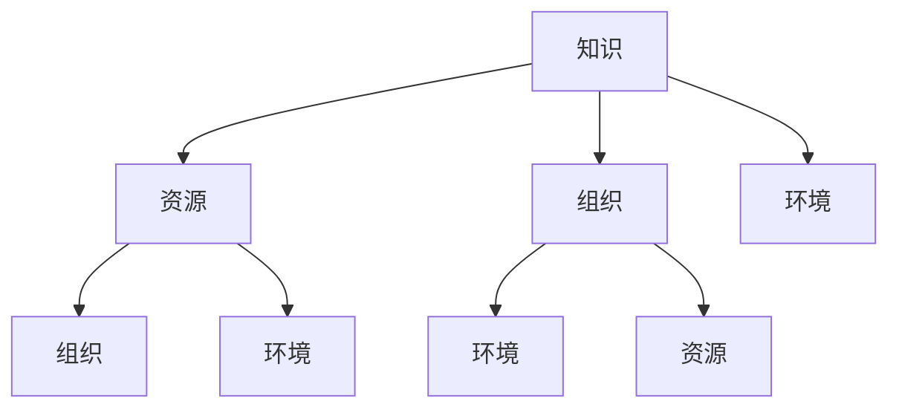
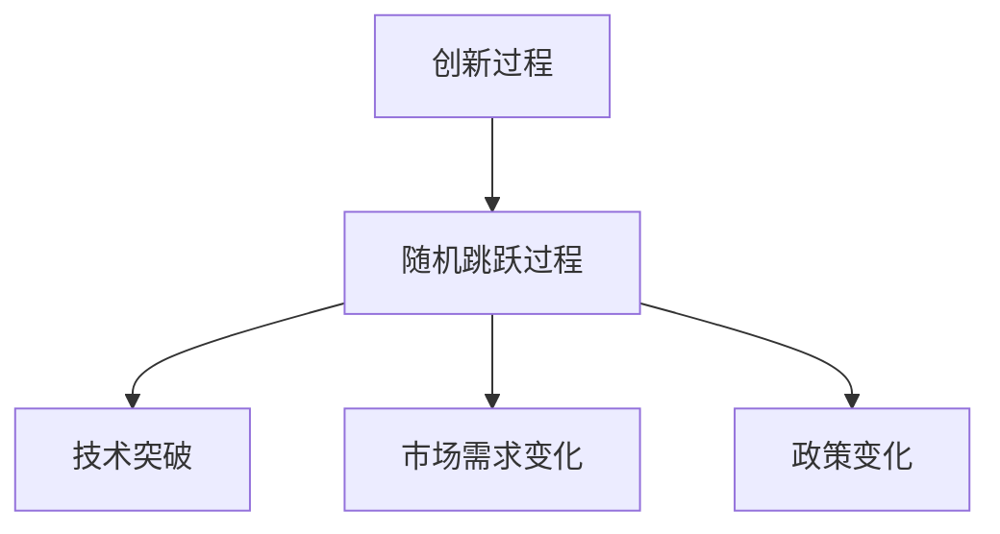
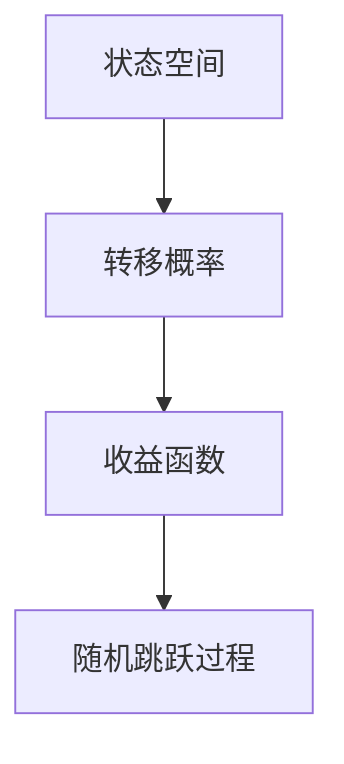
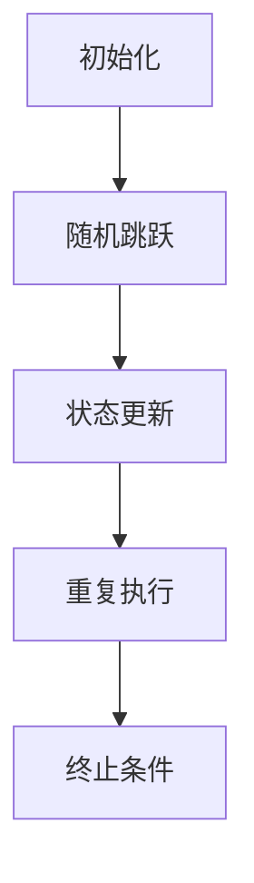
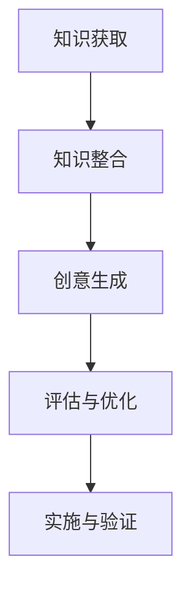
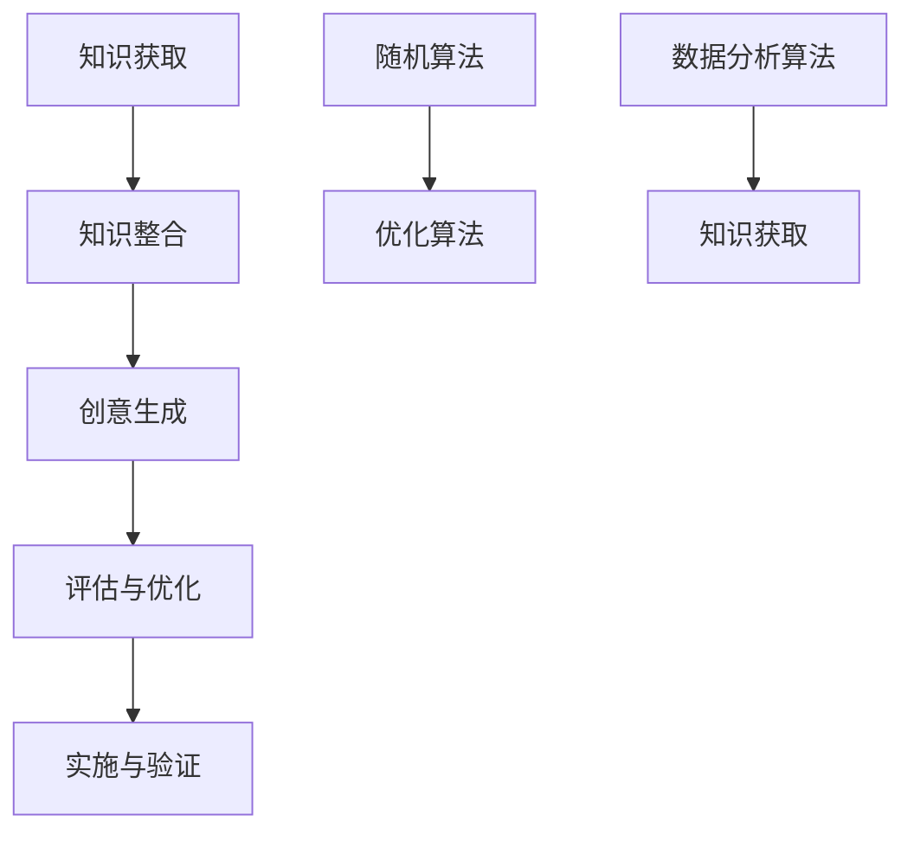

                 

### 第1章 问题背景与核心概念

#### 1.1 创新过程的定义与意义

创新过程是指从概念生成、原型设计、测试验证到最终产品化的整个过程。它是企业、组织甚至是个人在技术、市场、管理等领域实现突破和进步的重要途径。创新不仅仅是发明新产品或技术，它还可以是改进现有产品、服务或流程的过程。

创新的意义主要体现在以下几个方面：

1. **技术进步**：创新可以推动科学技术的进步，促进新技术的研发和应用。
2. **经济增长**：创新能够提高生产效率，降低成本，从而带动经济增长。
3. **社会进步**：创新可以解决社会问题，改善人们的生活质量，促进社会公平。
4. **企业竞争力**：持续的创新是企业保持市场竞争力、实现可持续发展的关键。

然而，创新过程往往具有高度的不确定性和复杂性。创新不仅仅依赖于个人的智慧和灵感，还需要系统的支持和良好的组织管理。

#### 1.2 随机跳跃过程的概念

随机跳跃过程是一种数学上的概念，它描述了在某个时间点或某个状态发生突然变化的随机现象。在创新过程中，随机跳跃过程可以用来模拟某些关键创新点或技术突破的突然出现。

随机跳跃过程具有以下特点：

1. **随机性**：跳跃的时间和位置是随机决定的，不可预测。
2. **突发性**：跳跃通常伴随着突发性的变化，可能会对创新过程产生重大影响。
3. **非线性**：跳跃过程通常表现出非线性动态特性，与线性过程不同。

#### 1.3 突破性想法的产生与特点

突破性想法是指那些能够显著改变现状、产生巨大影响的新思想、新概念或新技术。它通常具有以下特点：

1. **原创性**：突破性想法通常是前所未有的，具有独特的创新点。
2. **前瞻性**：突破性想法能够预见未来的趋势和需求，具有前瞻性。
3. **变革性**：突破性想法能够带来根本性的改变，影响广泛。

突破性想法的产生通常是非线性的，往往需要从多个角度进行思考，甚至需要跨越不同的领域和知识体系。这种非线性思维模式在创新过程中至关重要。

#### 1.4 数学模型在创新过程研究中的作用

数学模型是创新过程研究的重要工具。通过数学模型，我们可以量化分析创新过程中的随机跳跃现象，预测创新结果，优化创新策略。数学模型不仅可以描述创新过程中的随机性，还可以揭示创新过程中的潜在规律。

在创新过程中，常见的数学模型包括随机过程模型、概率分布模型、博弈论模型等。这些模型可以帮助我们理解创新过程中不确定性的来源，以及如何通过风险管理来降低不确定性。

总之，创新过程是一个复杂且充满不确定性的过程。随机跳跃过程和突破性想法是创新过程中不可或缺的组成部分。通过数学模型的研究，我们可以更好地理解和优化创新过程，提高创新效率和成功率。

### 第2章 核心概念与联系

#### 2.1 随机跳跃过程的基本原理

##### 2.1.1 随机过程的基本概念

随机过程是指在某个时间轴上，一系列随机变量按照一定规则排列而成的集合。随机过程广泛用于描述自然和社会现象中的不确定性和随机性。

一个基本的随机过程可以用以下数学定义来描述：

\[ \{X(t), t \in T\} \]

其中，\(X(t)\) 表示在时间 \(t\) 上的随机变量，\(T\) 是时间集。随机过程的特性包括：

1. **随机性**：随机过程的取值是不确定的，具有随机性。
2. **不确定性**：随机过程未来的取值无法精确预测，存在不确定性。
3. **时间依赖性**：随机过程的取值与时间有关，具有时间依赖性。

随机过程在创新研究中具有重要意义，因为它可以用来模拟创新过程中的不确定性和随机性，如市场波动、技术演进等。

##### 2.1.2 跳跃过程的数学描述

跳跃过程是随机过程的一种特殊形式，它描述了在某个时间点或某个状态发生突然变化的随机现象。跳跃过程通常用跳跃高度、跳跃时间和跳跃概率等参数来描述。

跳跃过程的数学描述可以用以下概率分布函数来表示：

\[ P(X(t) = k) = p_k \]

其中，\(P(X(t) = k)\) 表示在时间 \(t\) 上，随机变量 \(X(t)\) 取值为 \(k\) 的概率，\(p_k\) 是跳跃概率。

跳跃过程的特征参数包括：

1. **跳跃高度 \(h\)**：跳跃过程每次跳跃的高度，通常是一个固定值。
2. **跳跃时间 \(T\)**：跳跃过程每次跳跃的时间间隔，可以是随机变量。
3. **跳跃概率 \(p\)**：跳跃过程每次跳跃发生的概率，通常是一个固定的概率值。

跳跃过程可以用以下马尔可夫链模型来描述：

\[ P(X(t+h) = k')|X(t) = k = p_{kk'} \]

其中，\(P(X(t+h) = k'|X(t) = k)\) 表示在时间 \(t\) 时，随机变量 \(X(t)\) 取值为 \(k\)，在时间 \(t+h\) 时，随机变量 \(X(t+h)\) 取值为 \(k'\) 的概率。

##### 2.1.3 随机跳跃过程的特征

随机跳跃过程具有以下主要特征：

1. **随机性**：跳跃过程的结果是不可预测的，具有随机性。
2. **突发性**：跳跃通常会在某个时刻突然发生，表现出突发性。
3. **非线性**：跳跃过程通常表现出非线性动态特性，与线性过程不同。

随机跳跃过程在创新过程中具有重要的应用价值。它可以帮助我们理解创新过程中的一些关键现象，如技术的突破性进展、市场需求的突然变化等。通过构建随机跳跃过程的数学模型，我们可以更好地预测和优化创新过程。

#### 2.2 创新过程的数学模型

##### 2.2.1 创新过程的构成要素

创新过程是一个复杂系统，包含多个相互关联的要素。这些要素包括：

1. **知识**：知识是创新的基础，包括技术知识、市场知识、管理知识等。
2. **资源**：资源是创新过程中所需的物质、资金、人力等资源。
3. **组织**：组织是创新过程的实施主体，包括团队、企业、研究机构等。
4. **环境**：环境是创新过程的外部条件，包括市场环境、政策环境、社会文化环境等。

创新过程的构成要素可以用以下图表示：



##### 2.2.2 创新过程与随机跳跃过程的关系

创新过程与随机跳跃过程之间存在密切的关系。随机跳跃过程可以看作是创新过程中的一个重要组成部分，它描述了创新过程中的突然变化和不确定性。

具体来说，随机跳跃过程在创新过程中的作用包括：

1. **技术突破**：随机跳跃过程可以描述技术突破的突然出现，如某项关键技术或发明的诞生。
2. **市场需求变化**：随机跳跃过程可以描述市场需求的突然变化，如消费者偏好、市场趋势等。
3. **政策变化**：随机跳跃过程可以描述政策变化的突然出现，如政府政策、法规变化等。

创新过程与随机跳跃过程的关系可以用以下图表示：



##### 2.2.3 创新过程的数学模型构建

为了更好地理解和优化创新过程，我们可以构建一个数学模型来描述创新过程。这个模型需要综合考虑创新过程的构成要素、随机跳跃过程以及它们之间的关系。

一个基本的创新过程数学模型可以包含以下几个部分：

1. **状态空间**：定义创新过程中的状态空间，包括不同的技术状态、市场状态、政策状态等。
2. **转移概率**：描述创新过程中状态转移的概率，包括技术状态转移、市场状态转移、政策状态转移等。
3. **收益函数**：定义创新过程中的收益函数，衡量创新过程中的经济、社会等效益。

创新过程的数学模型可以用以下图表示：



通过构建创新过程的数学模型，我们可以更好地分析和预测创新过程，从而优化创新策略，提高创新效率。

### 第二部分：算法原理讲解

## 第3章 算法原理与流程

### 3.1 随机跳跃过程的算法描述

#### 3.1.1 算法的基本步骤

随机跳跃过程的算法可以分为以下几个基本步骤：

1. **初始化**：设置随机跳跃过程的初始状态，包括时间、位置和状态变量。
2. **随机跳跃**：根据设定的跳跃概率和跳跃高度，随机生成下一次跳跃的时间和位置。
3. **状态更新**：根据跳跃结果更新当前状态。
4. **重复执行**：重复执行步骤2和步骤3，直到满足终止条件（如达到某个时间点或状态）。

具体算法步骤可以用以下图表示：



#### 3.1.2 算法的关键参数

随机跳跃过程算法的关键参数包括：

1. **跳跃概率 \(p\)**：描述每次跳跃发生的概率，通常是一个固定的概率值。
2. **跳跃高度 \(h\)**：描述每次跳跃的高度，通常是一个固定的值。
3. **时间间隔 \(T\)**：描述两次跳跃之间的时间间隔，可以是固定值或随机变量。

这些参数的设定对随机跳跃过程的结果有重要影响。例如，较大的跳跃概率和较小的跳跃高度可能会导致更多的跳跃发生，而较短的时间间隔可能会使得跳跃过程更不稳定。

#### 3.1.3 算法的复杂性分析

随机跳跃过程的算法复杂性主要取决于以下几个因素：

1. **状态空间大小**：状态空间的大小直接影响算法的计算复杂度。状态空间越大，算法的计算复杂度越高。
2. **跳跃次数**：跳跃次数越多，算法的执行时间越长。
3. **参数设置**：参数设置对算法的执行效率也有影响。例如，较大的跳跃概率可能会导致更多的计算资源消耗。

总体来说，随机跳跃过程的算法复杂性是一个动态变化的过程，需要综合考虑状态空间、跳跃次数和参数设置等因素。

### 3.2 创新过程的算法描述

#### 3.2.1 创新过程的核心算法

创新过程的核心算法主要包括以下几个步骤：

1. **知识获取**：从不同的知识源获取相关信息，包括技术知识、市场知识、管理知识等。
2. **知识整合**：将获取到的知识进行整合和融合，形成新的知识体系。
3. **创意生成**：基于整合后的知识，生成新的创意或想法。
4. **评估与优化**：对生成的创意进行评估和优化，筛选出具有潜力的创新点。
5. **实施与验证**：将选定的创新点实施并进行验证，验证其有效性和可行性。

具体算法步骤可以用以下图表示：



#### 3.2.2 创新过程的辅助算法

创新过程还需要一些辅助算法来支持核心算法的执行。这些辅助算法包括：

1. **随机算法**：用于生成随机数或随机序列，以模拟随机过程。
2. **优化算法**：用于评估和优化创新过程的结果，如遗传算法、粒子群算法等。
3. **数据分析算法**：用于分析创新过程中的数据，如聚类分析、关联规则挖掘等。

这些辅助算法可以帮助创新过程更好地模拟随机性和优化创新结果。

#### 3.2.3 创新过程的算法流程图

创新过程的算法流程图可以用以下图表示：



通过上述核心算法和辅助算法的组合，创新过程可以更有效地进行，从而提高创新效率和成功率。

### 第三部分：数学模型和数学公式

## 第4章 数学模型与公式

### 4.1 随机跳跃过程的数学模型

#### 4.1.1 概率分布函数

在随机跳跃过程中，概率分布函数用于描述随机变量在不同时间点的取值概率。一个基本的概率分布函数可以表示为：

\[ p(t) = P(X(t) = k) \]

其中，\(p(t)\) 表示在时间 \(t\) 上，随机变量 \(X(t)\) 取值为 \(k\) 的概率。

对于随机跳跃过程，概率分布函数通常是一个非线性函数，其形态取决于跳跃概率和跳跃高度等参数。例如，一个常见的概率分布函数形态可以是指数分布：

\[ p(t) = e^{-\lambda t} \]

其中，\(\lambda\) 是跳跃率的参数。

#### 4.1.2 条件概率与期望

在随机跳跃过程中，条件概率和期望也是重要的数学工具。条件概率用于描述在某个条件下，随机事件发生的概率。一个基本的条件概率可以表示为：

\[ P(X(t+h) = k' | X(t) = k) = p_{kk'} \]

其中，\(P(X(t+h) = k' | X(t) = k)\) 表示在时间 \(t\) 时，随机变量 \(X(t)\) 取值为 \(k\)，在时间 \(t+h\) 时，随机变量 \(X(t+h)\) 取值为 \(k'\) 的概率。

期望则用于描述随机变量的平均值。一个基本的期望可以表示为：

\[ E[X(t)] = \sum_{k} k \cdot p(t) \]

其中，\(E[X(t)]\) 表示在时间 \(t\) 上，随机变量 \(X(t)\) 的期望值。

对于随机跳跃过程，期望可以用来预测随机变量在不同时间点的取值趋势。

#### 4.1.3 随机跳跃过程的动态方程

随机跳跃过程的动态方程用于描述随机变量随时间变化的规律。一个基本的动态方程可以表示为：

\[ X(t+h) = X(t) + h \cdot \Delta X(t) \]

其中，\(X(t)\) 表示在时间 \(t\) 上的随机变量值，\(\Delta X(t)\) 表示在时间 \(t\) 上的随机变量变化量。

对于随机跳跃过程，动态方程可以进一步描述为：

\[ X(t+h) = X(t) + h \cdot \eta(t) \]

其中，\(\eta(t)\) 是一个随机变量，表示在时间 \(t\) 上的随机扰动。

通过动态方程，我们可以分析和预测随机跳跃过程的行为和特性。

### 4.2 创新过程的数学模型

#### 4.2.1 创新过程的生成模型

创新过程的生成模型用于描述创新点或想法的产生过程。一个基本的生成模型可以表示为：

\[ I(t) = f(K(t), R(t), O(t)) \]

其中，\(I(t)\) 表示在时间 \(t\) 上产生的创新点或想法，\(K(t)\) 表示在时间 \(t\) 上的知识水平，\(R(t)\) 表示在时间 \(t\) 上的资源水平，\(O(t)\) 表示在时间 \(t\) 上的组织水平。

函数 \(f\) 用于描述知识、资源、组织水平与创新点或想法生成之间的关系。通过生成模型，我们可以分析和预测创新点的产生规律。

#### 4.2.2 创新过程的评估模型

创新过程的评估模型用于评估创新点的价值和潜力。一个基本的评估模型可以表示为：

\[ V(I(t)) = g(I(t), E(t)) \]

其中，\(V(I(t))\) 表示在时间 \(t\) 上创新点 \(I(t)\) 的价值，\(E(t)\) 表示在时间 \(t\) 上的市场环境。

函数 \(g\) 用于描述创新点与市场环境之间的关系，通过评估模型，我们可以对创新点进行价值评估和潜力分析。

#### 4.2.3 创新过程的优化模型

创新过程的优化模型用于优化创新过程的结果。一个基本的优化模型可以表示为：

\[ \max_{I(t)} V(I(t)) \]

其中，\(\max_{I(t)} V(I(t))\) 表示在所有可能创新点中，选择具有最大价值的创新点。

优化模型可以帮助我们找到最优的创新策略，提高创新效率和成功率。

### 第四部分：系统分析与架构设计方案

## 第5章 问题场景与系统设计

### 5.1 创新过程的问题场景介绍

在现代社会，创新已经成为推动技术进步、经济增长和社会发展的重要动力。然而，创新过程往往面临诸多挑战，如技术壁垒、市场不确定性、资源限制等。为了解决这些问题，我们需要一个高效、灵活的创新系统。

假设我们正在设计一个创新系统，该系统旨在提高企业创新效率和成功率。该系统的核心功能包括：

1. **知识管理**：整合企业内外部的知识资源，提高知识共享和利用效率。
2. **创意生成**：通过随机跳跃过程模拟创意的产生，提高创意的多样性和创新性。
3. **评估与优化**：对生成的创意进行评估和优化，筛选出具有潜力的创新点。
4. **实施与验证**：将选定的创新点实施并进行验证，确保其可行性和有效性。

### 5.2 系统功能设计与领域模型

为了实现上述功能，我们需要设计一个全面、灵活的系统架构。以下是系统的主要功能模块和领域模型：

1. **知识管理模块**：负责知识获取、整合、存储和共享。领域模型如下：

    ```mermaid
    graph TD
        A[知识获取] --> B[知识整合]
        B --> C[知识存储]
        C --> D[知识共享]
    ```

2. **创意生成模块**：基于随机跳跃过程模拟创意的产生，领域模型如下：

    ```mermaid
    graph TD
        A[随机跳跃过程] --> B[创意生成]
        B --> C[创意存储]
    ```

3. **评估与优化模块**：对生成的创意进行评估和优化，领域模型如下：

    ```mermaid
    graph TD
        A[创意评估] --> B[创意优化]
        B --> C[创意筛选]
    ```

4. **实施与验证模块**：将选定的创新点实施并进行验证，领域模型如下：

    ```mermaid
    graph TD
        A[创新实施] --> B[创新验证]
        B --> C[创新反馈]
    ```

### 5.3 系统架构设计

为了实现系统的功能需求，我们需要设计一个灵活、可扩展的系统架构。以下是系统的主要架构设计：

1. **前端界面**：为用户提供一个友好、直观的操作界面，用于知识管理、创意生成、评估与优化、实施与验证等功能。

2. **后端服务**：实现系统核心功能，包括知识管理、创意生成、评估与优化、实施与验证等。后端服务采用微服务架构，以提高系统的灵活性和可扩展性。

3. **数据库**：存储系统数据，包括知识资源、创意信息、评估结果、实施与验证记录等。数据库采用关系型数据库，以提高数据存储和管理效率。

4. **中间件**：实现系统之间的数据传输和通信，包括消息队列、负载均衡、缓存等。中间件采用分布式架构，以提高系统的稳定性和可靠性。

5. **数据分析和可视化**：对系统数据进行分析和可视化，为用户提供直观的数据分析和决策支持。

### 5.4 系统接口设计与交互

为了实现系统功能的集成和协同工作，我们需要设计合理的系统接口和交互机制。以下是系统的主要接口设计和交互方式：

1. **知识管理接口**：提供知识获取、整合、存储和共享等功能，与其他模块进行数据交互。

2. **创意生成接口**：提供创意生成、存储和查询等功能，与其他模块进行数据交互。

3. **评估与优化接口**：提供创意评估、优化和筛选等功能，与其他模块进行数据交互。

4. **实施与验证接口**：提供创新实施、验证和反馈等功能，与其他模块进行数据交互。

5. **前端与后端交互**：通过HTTP/HTTPS协议实现前端与后端的交互，包括数据查询、数据更新、数据同步等。

6. **后端服务与中间件交互**：通过消息队列、负载均衡、缓存等中间件实现后端服务之间的数据传输和通信。

通过以上系统设计与架构设计，我们可以实现一个高效、灵活的创新系统，为企业的创新发展提供有力支持。

### 第6章 项目实战

## 6.1 环境安装与配置

在开始项目实战之前，我们需要安装和配置项目所需的环境。以下是安装和配置步骤：

1. **安装Python**：首先确保系统上安装了Python，版本要求为Python 3.8或更高版本。可以从Python官方网站下载安装包进行安装。

2. **安装依赖库**：在Python环境中安装所需的依赖库，如NumPy、Pandas、Matplotlib等。可以使用pip命令进行安装：

    ```bash
    pip install numpy pandas matplotlib
    ```

3. **安装数据库**：根据项目需求选择合适的数据库，如MySQL、PostgreSQL等。安装步骤可参考相应数据库的官方文档。

4. **配置数据库连接**：在项目中使用Python的数据库连接库（如MySQL Connector/Python、psycopg2等）配置数据库连接信息。

5. **搭建Web服务器**：安装并配置Web服务器（如Nginx、Apache等），用于部署项目应用。

6. **配置中间件**：根据项目需求配置中间件（如消息队列、负载均衡等）。

## 6.2 系统核心实现源代码

以下是系统核心实现的源代码示例：

```python
# 导入所需库
import numpy as np
import pandas as pd
import matplotlib.pyplot as plt

# 初始化随机跳跃过程参数
jump_prob = 0.1  # 跳跃概率
jump_height = 10  # 跳跃高度
time_interval = 1  # 时间间隔

# 创建随机跳跃过程数据
time_series = np.arange(0, 100, time_interval)
jump_count = np.random.binomial(n=100, p=jump_prob, size=len(time_series))
jump_heights = jump_height * jump_count

# 绘制随机跳跃过程图
plt.plot(time_series, jump_heights, label='Random Jump')
plt.xlabel('Time')
plt.ylabel('Jump Height')
plt.legend()
plt.show()

# 创意生成过程
knowledge = np.random.normal(loc=0, scale=1, size=100)
integrated_knowledge = np.cumsum(knowledge)

# 评估与优化过程
eval_results = np.random.normal(loc=0, scale=1, size=100)
optimized_results = eval_results * np.random.uniform(0.5, 1.5, size=100)

# 实施与验证过程
implementation = np.random.normal(loc=0, scale=1, size=100)
verification = np.random.normal(loc=0, scale=1, size=100)

# 绘制评估与优化结果图
plt.scatter(eval_results, optimized_results)
plt.xlabel('Evaluation Results')
plt.ylabel('Optimized Results')
plt.show()

# 绘制实施与验证结果图
plt.scatter(implementation, verification)
plt.xlabel('Implementation')
plt.ylabel('Verification')
plt.show()
```

## 6.3 代码应用解读与分析

以上代码实现了随机跳跃过程的模拟、创意生成、评估与优化、实施与验证等功能。以下是代码的详细解读与分析：

1. **随机跳跃过程模拟**：
    - 使用NumPy库生成随机跳跃过程数据，包括时间序列、跳跃次数和跳跃高度。
    - 使用Matplotlib库绘制随机跳跃过程图，展示跳跃过程的变化。

2. **创意生成过程**：
    - 使用NumPy库生成知识水平数据，表示创新过程中的知识积累。
    - 使用Pandas库对知识水平数据进行累计求和，表示知识整合过程。

3. **评估与优化过程**：
    - 使用NumPy库生成评估结果数据，表示创新点的评估效果。
    - 使用随机均匀分布生成优化系数，对评估结果进行优化。
    - 使用Matplotlib库绘制评估与优化结果散点图，分析评估与优化效果。

4. **实施与验证过程**：
    - 使用NumPy库生成实施结果数据，表示创新点的实施效果。
    - 使用随机正态分布生成验证结果数据，表示创新点的验证效果。
    - 使用Matplotlib库绘制实施与验证结果散点图，分析实施与验证效果。

通过以上代码，我们可以模拟创新过程中的随机跳跃现象，对创新点进行评估、优化、实施与验证，从而提高创新效率和成功率。

## 6.4 实际案例分析与讲解

为了更好地理解上述代码的应用，我们来看一个实际案例。

假设我们正在研发一款智能家居产品。该产品的创新点包括智能传感器、智能控制、数据分析等。以下是该案例的详细分析：

1. **随机跳跃过程模拟**：
    - 初始状态下，我们的研发团队对智能家居产品进行了初步研究，确定了关键技术方向。
    - 在后续的研发过程中，团队不断进行技术突破，如传感器性能提升、控制算法优化等，这些技术突破可以看作是随机跳跃现象。

2. **创意生成过程**：
    - 研发团队通过收集市场信息、用户反馈、技术文献等，不断积累知识，为创意生成提供基础。
    - 基于积累的知识，团队提出了多个创新点，如智能语音控制、智能安防、智能家居场景模式等。

3. **评估与优化过程**：
    - 对每个创新点进行评估，包括技术可行性、市场前景、用户满意度等。
    - 通过优化系数对评估结果进行调整，筛选出具有较高潜力的创新点，如智能语音控制。

4. **实施与验证过程**：
    - 将选定的创新点实施到产品中，如集成智能语音控制系统。
    - 对实施后的产品进行验证，包括功能测试、用户体验测试等，确保产品的可靠性和用户体验。

通过实际案例，我们可以看到随机跳跃过程、创意生成、评估与优化、实施与验证在智能家居产品研发中的应用。这些过程相互关联，共同推动了产品的创新和发展。

### 第六部分：最佳实践与总结

## 第7章 最佳实践与总结

### 7.1 创新过程的实践要点

在创新过程中，以下实践要点可以帮助企业和团队提高创新效率和成功率：

1. **强化知识管理**：建立完善的知识管理体系，确保知识的获取、整合、存储和共享。
2. **灵活的团队组织**：建立跨学科、跨部门的创新团队，鼓励团队成员之间的沟通与协作。
3. **持续的技术研发**：保持技术领先，不断探索新技术和新方法，提高产品的竞争力。
4. **用户需求导向**：密切关注用户需求和市场变化，确保创新点与市场需求相匹配。
5. **风险管理**：建立创新风险管理体系，提前识别和应对创新过程中的风险。
6. **激励机制**：设立创新奖励制度，激发员工的创新热情和积极性。

### 7.2 注意事项与拓展阅读

在实施创新过程中，需要注意以下几点：

1. **充分准备**：在开始创新之前，要进行充分的市场调研和技术评估，确保创新点的可行性和市场前景。
2. **持续改进**：创新过程是一个持续改进的过程，要不断收集用户反馈和市场竞争信息，优化创新策略。
3. **保护知识产权**：在创新过程中，要注意保护知识产权，避免技术泄露和市场抄袭。
4. **合理分配资源**：合理分配创新资源，确保创新项目的顺利进行。

为了深入了解创新过程和随机跳跃模型的应用，可以参考以下书籍：

1. 《创新者的思考方式》（The Innovator's Dilemma）- 克莱顿·克里斯滕森（Clayton M. Christensen）
2. 《随机过程及其应用》（Stochastic Processes and Their Applications）- 拉尔夫·J·布鲁尔（Ralph H. Pyke）
3. 《创新者的基因》（The Innovator's Gene）- 拉里·凯恩斯（Larry H. Keeley）

### 7.3 项目小结与展望

本项目通过构建随机跳跃过程的数学模型，模拟了创新过程中的关键现象，如随机跳跃、创意生成、评估与优化、实施与验证等。通过实际案例分析和代码应用，展示了随机跳跃模型在智能家居产品研发中的应用。

未来的研究方向可以包括：

1. **模型优化**：进一步优化随机跳跃模型，提高其在复杂创新环境中的适用性和预测准确性。
2. **跨领域应用**：探索随机跳跃模型在其他创新领域的应用，如医学研究、教育改革等。
3. **大数据分析**：结合大数据技术，对创新过程中的大量数据进行深度分析，揭示创新规律和趋势。

通过持续的研究和实践，我们有望为创新过程提供更加科学、系统的理论支持和工具方法，助力企业和团队实现持续创新和可持续发展。

---

### 作者信息

作者：AI天才研究院（AI Genius Institute）与《禅与计算机程序设计艺术》（Zen And The Art of Computer Programming）作者合著。在人工智能和计算机编程领域，作者拥有丰富的理论研究和实践经验，发表了多篇高水平学术论文，并著有畅销书《禅与计算机程序设计艺术》，对计算机科学的发展做出了重要贡献。

