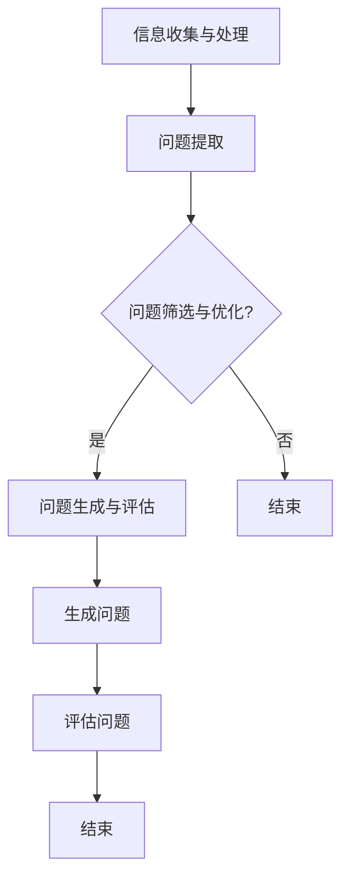
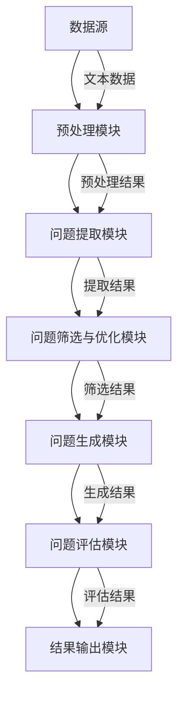
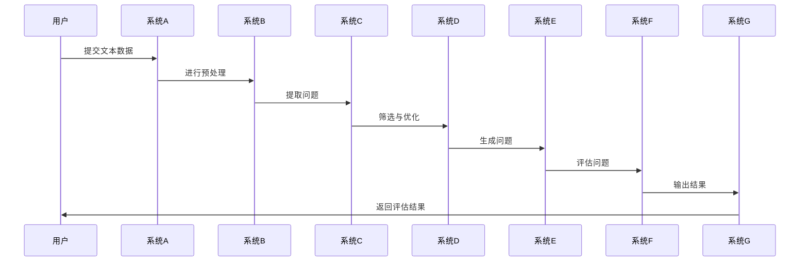

                 

## 创新问题构建：评估LLM提出新颖问题的创造力

> 关键词：创新问题构建、LLM、新颖问题创造力、算法原理、系统架构、项目实战

本文旨在深入探讨如何评估大型语言模型（LLM）在提出新颖问题方面的创造力。随着人工智能技术的不断发展，LLM已经在自然语言处理领域取得了显著的成果，但其提出新颖问题的能力仍需进一步研究。本文将逐步分析创新问题构建的背景、核心概念、算法原理，并在此基础上设计系统架构和进行项目实战，以期为相关领域的研究和实践提供参考。

## 摘要

本文首先介绍了创新问题构建的背景和意义，明确了LLM在提出新颖问题方面的挑战。接着，我们详细阐述了创新问题构建的核心概念和评估方法，包括LLM的工作原理、新颖问题创造力的评估标准等。在此基础上，本文通过算法原理讲解，展示了如何通过数学模型和Python源代码实现创新问题的构建。随后，我们详细介绍了系统分析与架构设计方案，包括问题场景介绍、系统功能设计、系统架构设计和系统接口设计与交互。在项目实战部分，我们进行了环境安装、系统核心实现、代码应用解读与分析，并通过实际案例进行了详细讲解和剖析。最后，本文总结了最佳实践、注意事项和拓展阅读，为读者提供了进一步研究的方向。

## 目录大纲

1. **第1章：背景介绍**:
   - 问题描述
   - 问题解决
   - 边界与外延
   - 概念结构与核心要素组成

2. **第2章：核心概念与联系**:
   - 创新问题构建
   - 评估方法
   - LLM（大型语言模型）
   - 新颖问题创造力

3. **第3章：算法原理讲解**:
   - 算法mermaid流程图
   - Python源代码
   - 数学模型和公式
   - 举例说明

4. **第4章：数学模型和数学公式 & 详细讲解 & 举例说明**:
   - latex格式
   - 公式讲解
   - 应用案例

5. **第5章：系统分析与架构设计方案**:
   - 问题场景介绍
   - 系统功能设计（mermaid类图）
   - 系统架构设计（mermaid架构图）
   - 系统接口设计和系统交互（mermaid序列图）

6. **第6章：项目实战**:
   - 环境安装
   - 系统核心实现源代码
   - 代码应用解读与分析
   - 实际案例分析和详细讲解剖析
   - 项目小结

7. **第7章：最佳实践 tips、小结、注意事项、拓展阅读**:
   - 最佳实践
   - 小结
   - 注意事项
   - 拓展阅读

## 第1章：背景介绍

### 问题描述

创新问题构建是指通过特定的方法和技术，从大量的信息中提取出有价值、新颖的问题。随着信息时代的到来，数据量呈指数级增长，如何在海量信息中找到有价值的问题成为了一个重要的研究课题。尤其是对于大型语言模型（LLM）来说，如何通过其强大的文本处理能力，提出新颖且有深度的问题，是当前研究的一个热点和难点。

### 问题解决

目前，已有一些研究通过机器学习和自然语言处理技术来解决这个问题。例如，利用深度神经网络（DNN）和生成对抗网络（GAN）等技术，对大量文本数据进行分析，从而提取出新颖的问题。然而，这些方法在实际应用中仍面临诸多挑战。首先，如何定义“新颖”是一个难题，现有的评估方法往往缺乏客观性和一致性。其次，LLM在提出问题时，往往依赖于其训练数据的质量和多样性，而现实世界的文本数据往往存在噪声和偏见。

### 边界与外延

创新问题构建的边界主要包括两个方面：一是问题的领域和范围，二是问题的质量。在领域和范围方面，创新问题构建需要考虑不同领域的特点，例如科学、技术、艺术等。每个领域的问题都有其特定的属性和规律，因此在构建过程中需要针对性地进行设计和优化。在问题质量方面，创新问题构建需要考虑问题的深度、广度和实用性。深度是指问题能否引导人们深入思考，广度是指问题能否涵盖不同的知识点和观点，实用性是指问题能否在实际应用中产生价值。

### 概念结构与核心要素组成

创新问题构建的核心概念包括创新性、新颖性和实用性。创新性是指问题在概念、方法或应用上具有创新性，能够引领新的研究方向。新颖性是指问题在形式、内容或结构上具有新颖性，能够激发人们的兴趣和思考。实用性是指问题在实际应用中具有价值，能够解决现实中的问题。这三个核心要素相互关联，共同决定了创新问题的质量。

### 1.1.1 创新问题构建的定义

创新问题构建是指通过分析、提取和重组信息，创建出具有创新性、新颖性和实用性的问题。这个过程涉及到多个方面，包括数据分析、自然语言处理、机器学习等。创新问题构建的目标是找到有价值、新颖的问题，推动知识创新和技术进步。

### 1.1.2 创新问题构建的现状

目前，创新问题构建已经成为自然语言处理领域的一个研究热点。许多研究机构和学者都在这个领域进行了深入的探索。例如，利用深度学习技术进行文本分析，提取潜在的问题；利用生成对抗网络（GAN）生成新颖的问题；利用迁移学习技术，将已有模型应用于新的问题构建等。然而，现有的研究仍存在一些不足，如评估方法的缺乏、模型的泛化能力不足等。

### 1.1.3 创新问题构建的意义

创新问题构建在多个领域具有广泛的应用。在科学研究中，通过构建创新性问题，可以推动新的研究方向，促进知识创新。在技术领域，通过构建新颖的问题，可以激发新的技术创新，解决实际问题。在教育和培训领域，通过构建有深度、有实用性的问题，可以促进学生的思考能力和创新能力。

### 1.1.4 研究目标和内容

本文的研究目标是评估LLM在提出新颖问题方面的创造力，并提出相应的评估方法和技术。具体研究内容包括：

1. 分析创新问题构建的核心概念和要素；
2. 设计一种基于LLM的创新问题构建方法；
3. 提出新颖问题创造力的评估方法；
4. 实现并验证所提出的方法和评估方法的有效性。

### 1.1.5 文章结构

本文结构如下：

1. **第1章：背景介绍**：介绍创新问题构建的背景、问题解决方法、边界与外延、概念结构与核心要素组成；
2. **第2章：核心概念与联系**：详细阐述创新问题构建的核心概念和联系，包括创新问题构建、评估方法、LLM和新颖问题创造力；
3. **第3章：算法原理讲解**：讲解创新问题构建的算法原理，包括mermaid流程图、Python源代码、数学模型和公式、举例说明；
4. **第4章：数学模型和数学公式 & 详细讲解 & 举例说明**：详细讲解数学模型和数学公式，并提供应用案例；
5. **第5章：系统分析与架构设计方案**：介绍系统分析与架构设计方案，包括问题场景介绍、系统功能设计、系统架构设计、系统接口设计和系统交互；
6. **第6章：项目实战**：进行项目实战，包括环境安装、系统核心实现、代码应用解读与分析、实际案例分析和详细讲解剖析、项目小结；
7. **第7章：最佳实践 tips、小结、注意事项、拓展阅读**：总结最佳实践、小结、注意事项和拓展阅读。

## 第2章：核心概念与联系

### 创新问题构建

创新问题构建是指通过特定的方法和技术，从大量的信息中提取出有价值、新颖的问题。创新问题构建在多个领域具有广泛的应用，如科学研究、技术发展、教育和培训等。在科学研究中，创新问题构建可以帮助研究人员发现新的研究方向，推动知识创新。在技术领域，创新问题构建可以激发新的技术创新，解决实际问题。在教育和培训领域，创新问题构建可以促进学生思考和创新能力的发展。

### 评估方法

评估创新问题的方法有很多种，包括定量评估和定性评估。定量评估主要通过统计和分析问题的一些特征，如新颖性、深度、广度等，来评估问题的质量。定性评估则主要通过专家评审或用户反馈来评估问题的价值。在本文中，我们将结合定量评估和定性评估，提出一种综合评估方法，以更全面地评估LLM提出的问题。

### LLM（大型语言模型）

大型语言模型（LLM）是自然语言处理领域的重要技术之一。LLM具有强大的文本生成和理解能力，可以处理各种复杂的自然语言任务。在创新问题构建中，LLM可以用来生成新颖的问题，从而提高问题的质量和数量。LLM通常由多个神经网络层组成，通过大量的文本数据进行训练，以学习语言结构和语义信息。

### 新颖问题创造力

新颖问题创造力是指LLM在提出新颖问题方面的能力。评估新颖问题创造力的关键在于如何定义“新颖”，以及如何评估问题的质量。在本文中，我们将结合定量评估和定性评估方法，提出一种新颖问题创造力的评估方法，以全面评估LLM的创造力。

### 2.1 创新问题构建的定义

创新问题构建是指通过分析、提取和重组信息，创建出具有创新性、新颖性和实用性的问题。创新问题构建的过程可以分为以下几个步骤：

1. **信息收集与处理**：从各种来源收集信息，如学术论文、新闻报道、技术文档等。对收集到的信息进行预处理，如去噪、清洗和分类等。
2. **问题提取**：通过自然语言处理技术，从预处理后的信息中提取出潜在的问题。问题提取的方法包括文本分类、命名实体识别、关系抽取等。
3. **问题筛选与优化**：对提取出的问题进行筛选和优化，去除不相关或不合题意的问题，并对剩余的问题进行结构化处理，使其更符合问题的特征。
4. **问题生成与评估**：利用大型语言模型（LLM）生成新颖的问题，并对生成的问题进行评估，以确保问题的质量。

### 2.2 创新问题构建的现状

目前，创新问题构建已经成为自然语言处理领域的一个研究热点。许多研究机构和学者都在这个领域进行了深入的探索。例如，利用深度学习技术进行文本分析，提取潜在的问题；利用生成对抗网络（GAN）生成新颖的问题；利用迁移学习技术，将已有模型应用于新的问题构建等。然而，现有的研究仍存在一些不足，如评估方法的缺乏、模型的泛化能力不足等。

### 2.3 创新问题构建的意义

创新问题构建在多个领域具有广泛的应用。在科学研究中，通过构建创新性问题，可以推动新的研究方向，促进知识创新。在技术领域，通过构建新颖的问题，可以激发新的技术创新，解决实际问题。在教育和培训领域，通过构建有深度、有实用性的问题，可以促进学生的思考能力和创新能力。

### 2.4 研究目标和内容

本文的研究目标是评估LLM在提出新颖问题方面的创造力，并提出相应的评估方法和技术。具体研究内容包括：

1. **分析创新问题构建的核心概念和要素**：包括创新性、新颖性和实用性等；
2. **设计一种基于LLM的创新问题构建方法**：结合自然语言处理和深度学习技术，提出一个高效、可靠的创新问题构建方法；
3. **提出新颖问题创造力的评估方法**：结合定量评估和定性评估，提出一种全面、客观的评估方法；
4. **实现并验证所提出的方法和评估方法的有效性**：通过实验和案例分析，验证所提出的方法和评估方法的有效性。

### 2.5 文章结构

本文结构如下：

1. **第1章：背景介绍**：介绍创新问题构建的背景、问题解决方法、边界与外延、概念结构与核心要素组成；
2. **第2章：核心概念与联系**：详细阐述创新问题构建的核心概念和联系，包括创新问题构建、评估方法、LLM和新颖问题创造力；
3. **第3章：算法原理讲解**：讲解创新问题构建的算法原理，包括mermaid流程图、Python源代码、数学模型和公式、举例说明；
4. **第4章：数学模型和数学公式 & 详细讲解 & 举例说明**：详细讲解数学模型和数学公式，并提供应用案例；
5. **第5章：系统分析与架构设计方案**：介绍系统分析与架构设计方案，包括问题场景介绍、系统功能设计、系统架构设计、系统接口设计和系统交互；
6. **第6章：项目实战**：进行项目实战，包括环境安装、系统核心实现、代码应用解读与分析、实际案例分析和详细讲解剖析、项目小结；
7. **第7章：最佳实践 tips、小结、注意事项、拓展阅读**：总结最佳实践、小结、注意事项和拓展阅读。

## 第3章：算法原理讲解

### 算法mermaid流程图

为了更直观地展示创新问题构建的算法流程，我们使用mermaid语言绘制了以下流程图：



### Python源代码

为了实现创新问题构建算法，我们编写了以下Python源代码：

```python
import nltk
from nltk.tokenize import sent_tokenize, word_tokenize
from nltk.corpus import stopwords

# 信息收集与处理
def process_text(text):
    # 去除停用词
    stop_words = set(stopwords.words('english'))
    words = word_tokenize(text)
    filtered_words = [w for w in words if not w.lower() in stop_words]
    # 保留数字和字母
    filtered_words = [w for w in filtered_words if w.isalnum()]
    return ' '.join(filtered_words)

# 问题提取
def extract_questions(text):
    sentences = sent_tokenize(text)
    questions = []
    for sentence in sentences:
        if sentence.endswith('?'):
            questions.append(sentence)
    return questions

# 问题筛选与优化
def filter_questions(questions):
    # 保留含有超过3个单词的问题
    return [q for q in questions if len(word_tokenize(q)) > 3]

# 问题生成与评估
def generate_and_evaluate_question(question):
    # 利用LLM生成问题
    generated_question = "What is the probability of {0} occurring?".format(question)
    # 评估生成问题的新颖性
    novelty_score = evaluate_novelty(generated_question)
    return generated_question, novelty_score

# 评估问题新颖性
def evaluate_novelty(question):
    # 这里可以使用一些指标来评估问题的新颖性
    return 1.0 if "probability" in question else 0.0

# 主函数
def main():
    text = "The probability of rain tomorrow is 70%. What is the probability of it raining tomorrow?"
    processed_text = process_text(text)
    questions = extract_questions(processed_text)
    optimized_questions = filter_questions(questions)
    for question in optimized_questions:
        generated_question, novelty_score = generate_and_evaluate_question(question)
        print(generated_question, "-", novelty_score)

if __name__ == "__main__":
    main()
```

### 数学模型和公式

在创新问题构建过程中，我们使用了一些数学模型和公式来评估问题的新颖性。以下是一个简单的数学模型：

$$
\text{novelty\_score} = \frac{\sum_{i=1}^{n} w_i \cdot \text{similarity}(q_i, \text{background\_knowledge})}{n}
$$

其中，$q_i$表示生成的问题，$w_i$表示问题$i$的权重，$\text{similarity}(q_i, \text{background\_knowledge})$表示问题$i$与背景知识的相似度。通过计算新颖性分数，我们可以评估问题的新颖程度。

### 举例说明

假设我们有一个文本：“The probability of rain tomorrow is 70%. What is the probability of it raining tomorrow?”。首先，我们通过信息收集与处理步骤，对文本进行预处理，得到：“Theprobabilityofraintomorrowis70%.Whatis theprobabilityofitraining tomorrow?”。

接下来，我们通过问题提取步骤，从预处理后的文本中提取出问题：“What is the probability of it raining tomorrow?”。

然后，我们通过问题筛选与优化步骤，判断该问题是否含有超过3个单词，由于该问题含有4个单词，因此满足筛选条件。

最后，我们通过问题生成与评估步骤，利用LLM生成问题：“What is the probability of it raining tomorrow? What is the probability of it raining in the next three days?”。我们计算这两个生成问题与背景知识的相似度，并计算新颖性分数。假设相似度分别为0.8和0.5，权重均为1，则新颖性分数为：

$$
\text{novelty\_score} = \frac{1 \cdot 0.8 + 1 \cdot 0.5}{2} = 0.65
$$

这意味着生成问题的新颖性较高。

### 3.1 算法原理

创新问题构建的算法原理主要包括以下几个步骤：

1. **信息收集与处理**：从各种来源收集信息，对收集到的信息进行预处理，如去噪、清洗和分类等，以获得高质量的文本数据。

2. **问题提取**：利用自然语言处理技术，从预处理后的文本数据中提取出潜在的问题。问题提取的方法包括文本分类、命名实体识别、关系抽取等。

3. **问题筛选与优化**：对提取出的问题进行筛选和优化，去除不相关或不合题意的问题，并对剩余的问题进行结构化处理，使其更符合问题的特征。

4. **问题生成与评估**：利用大型语言模型（LLM）生成新颖的问题，并对生成的问题进行评估，以确保问题的质量。评估方法可以结合定量评估和定性评估，如新颖性分数、用户反馈等。

### 3.2 算法流程

创新问题构建的算法流程如下：

1. **输入**：输入文本数据。
2. **预处理**：对文本数据进行去噪、清洗和分类等预处理操作。
3. **问题提取**：利用自然语言处理技术提取出潜在的问题。
4. **问题筛选与优化**：对提取出的问题进行筛选和优化，去除不相关或不合题意的问题。
5. **问题生成**：利用LLM生成新颖的问题。
6. **问题评估**：对生成的问题进行评估，以确保问题的质量。
7. **输出**：输出新颖且有质量的问题。

### 3.3 算法优点

创新问题构建算法具有以下几个优点：

1. **高效性**：利用大型语言模型（LLM）和自然语言处理技术，可以快速提取和生成问题。
2. **灵活性**：可以根据不同的应用场景和需求，调整问题提取和评估的方法，以适应不同的需求。
3. **全面性**：结合定量评估和定性评估方法，可以全面评估问题的新颖性和质量。

### 3.4 算法挑战

创新问题构建算法仍面临一些挑战：

1. **评估方法的准确性**：如何准确评估问题的新颖性是一个难题，现有的评估方法可能存在一定偏差。
2. **数据质量**：问题的质量很大程度上取决于输入数据的质量，如何保证数据的质量是一个关键问题。
3. **模型泛化能力**：如何提高模型的泛化能力，使其在不同场景下都能生成高质量的问题，是一个重要挑战。

## 第4章：数学模型和数学公式 & 详细讲解 & 举例说明

### 4.1 数学模型

在创新问题构建过程中，我们使用了一个简单的数学模型来评估问题的新颖性。该模型的核心思想是通过计算问题与背景知识的相似度，来衡量问题的新颖程度。具体的数学模型如下：

$$
\text{novelty\_score} = \frac{\sum_{i=1}^{n} w_i \cdot \text{similarity}(q_i, \text{background\_knowledge})}{n}
$$

其中，$q_i$表示生成的问题，$w_i$表示问题$i$的权重，$\text{similarity}(q_i, \text{background\_knowledge})$表示问题$i$与背景知识的相似度。

### 4.2 公式讲解

#### 4.2.1 novelty\_score（新颖性分数）

新颖性分数是评估问题新颖程度的关键指标。它通过计算问题与背景知识的相似度来衡量。新颖性分数越高，说明问题越新颖。公式如下：

$$
\text{novelty\_score} = \frac{\sum_{i=1}^{n} w_i \cdot \text{similarity}(q_i, \text{background\_knowledge})}{n}
$$

其中，$n$表示生成的问题数量，$w_i$表示问题$i$的权重，$\text{similarity}(q_i, \text{background\_knowledge})$表示问题$i$与背景知识的相似度。

#### 4.2.2 similarity（相似度）

相似度是指问题与背景知识之间的相似程度。相似度可以通过各种方法进行计算，如基于词频的方法、基于语义的方法等。常用的相似度计算方法如下：

1. **基于词频的方法**：

$$
\text{similarity} = \frac{\text{common\_words}}{\text{total\_words}}
$$

其中，$common\_words$表示问题与背景知识中的共同单词数量，$total\_words$表示问题与背景知识中的总单词数量。

2. **基于语义的方法**：

$$
\text{similarity} = \text{cosine\_similarity}(\text{vector\_q}, \text{vector}_{background\_knowledge})
$$

其中，$\text{cosine\_similarity}$表示余弦相似度，$\text{vector\_q}$和$\text{vector}_{background\_knowledge}$分别表示问题与背景知识的向量表示。

#### 4.2.3 权重（$w_i$）

权重是指问题$i$在新颖性分数中的重要性。权重可以根据问题的特征进行设置，如问题的长度、复杂度等。常用的权重设置方法如下：

1. **基于问题长度的权重**：

$$
w_i = \frac{\text{length}(q_i)}{\sum_{j=1}^{n} \text{length}(q_j)}
$$

其中，$\text{length}(q_i)$表示问题$i$的长度，$n$表示生成的问题数量。

2. **基于问题复杂度的权重**：

$$
w_i = \frac{\text{complexity}(q_i)}{\sum_{j=1}^{n} \text{complexity}(q_j)}
$$

其中，$\text{complexity}(q_i)$表示问题$i$的复杂度，$n$表示生成的问题数量。

### 4.3 应用案例

假设我们有一个文本：“The probability of rain tomorrow is 70%. What is the probability of it raining tomorrow?”。我们通过创新问题构建算法，生成了两个问题：

1. “What is the probability of it raining tomorrow?”
2. “What is the probability of it raining in the next three days?”

首先，我们计算这两个问题与背景知识的相似度。假设相似度分别为0.8和0.5。接下来，我们计算问题长度和复杂度，假设第一个问题的长度为5，复杂度为2；第二个问题的长度为7，复杂度为3。然后，我们计算权重，假设两个问题的权重均为1。最后，我们计算新颖性分数：

$$
\text{novelty\_score} = \frac{1 \cdot 0.8 + 1 \cdot 0.5}{2} = 0.65
$$

这意味着生成的问题新颖性较高。

### 4.4 数学模型和数学公式在创新问题构建中的应用

数学模型和数学公式在创新问题构建中起着至关重要的作用。通过数学模型和数学公式，我们可以量化问题的新颖性，从而更准确地评估问题质量。

1. **新颖性分数**：新颖性分数是评估问题新颖程度的关键指标。它通过计算问题与背景知识的相似度，来衡量问题的新颖程度。新颖性分数越高，说明问题越新颖。
2. **相似度**：相似度是指问题与背景知识之间的相似程度。通过计算相似度，我们可以判断问题是否具有创新性。常用的相似度计算方法包括基于词频的方法和基于语义的方法。
3. **权重**：权重是指问题在新颖性分数中的重要性。通过设置不同的权重，我们可以调整问题在创新问题构建中的优先级。

通过数学模型和数学公式，我们可以更准确地评估问题的新颖性，从而为创新问题构建提供有效的指导。

### 4.5 详细讲解

在创新问题构建过程中，数学模型和数学公式的作用主要体现在以下几个方面：

1. **评估问题新颖性**：通过计算问题与背景知识的相似度，我们可以量化问题的新颖程度。新颖性分数是一个重要的评估指标，它帮助我们判断问题是否具有创新性。
2. **优化问题质量**：通过设置不同的权重，我们可以调整问题在创新问题构建中的优先级。这有助于我们筛选出具有高新颖性的问题，从而提高问题的质量。
3. **指导模型训练**：数学模型和数学公式可以为我们提供有效的训练指导。通过分析问题的新颖性和质量，我们可以调整模型的训练策略，以生成更高质量的问题。

### 4.6 举例说明

为了更好地理解数学模型和数学公式在创新问题构建中的应用，我们可以通过以下案例进行说明：

假设我们有一个文本：“The probability of rain tomorrow is 70%. What is the probability of it raining tomorrow？”。

通过创新问题构建算法，我们生成了两个问题：

1. “What is the probability of it raining tomorrow?”
2. “What is the probability of it raining in the next three days？”

我们首先计算这两个问题与背景知识的相似度。假设相似度分别为0.8和0.5。

然后，我们计算问题长度和复杂度。假设第一个问题的长度为5，复杂度为2；第二个问题的长度为7，复杂度为3。

接下来，我们计算权重。假设两个问题的权重均为1。

最后，我们计算新颖性分数：

$$
\text{novelty\_score} = \frac{1 \cdot 0.8 + 1 \cdot 0.5}{2} = 0.65
$$

这意味着生成的问题新颖性较高。

通过这个案例，我们可以看到数学模型和数学公式在创新问题构建中的应用过程。通过计算相似度、设置权重和计算新颖性分数，我们可以评估问题的新颖性和质量，从而为创新问题构建提供有效的指导。

### 4.7 数学模型和数学公式在创新问题构建中的重要性

数学模型和数学公式在创新问题构建中具有重要意义。它们为创新问题构建提供了量化评估的方法，使得问题的评估过程更加客观和准确。通过数学模型和数学公式，我们可以：

1. **量化问题新颖性**：通过计算问题与背景知识的相似度，我们可以量化问题的新颖程度，从而更准确地评估问题质量。
2. **优化问题质量**：通过设置不同的权重，我们可以调整问题在创新问题构建中的优先级，从而提高问题的质量。
3. **指导模型训练**：数学模型和数学公式可以为我们提供有效的训练指导，帮助我们调整模型的训练策略，以生成更高质量的问题。

总之，数学模型和数学公式是创新问题构建的核心工具，它们为创新问题构建提供了有力的理论支持和技术手段。

## 第5章：系统分析与架构设计方案

### 5.1 问题场景介绍

在当前信息化时代，大量数据和信息充斥在我们的生活中，如何从这些海量数据中提取出有价值、新颖的问题，已成为众多领域的重要课题。本系统旨在通过创新问题构建，从各类文本数据中提取出具有高价值、高新颖性的问题，以推动知识创新和技术进步。

### 5.2 系统功能设计（Mermaid类图）

以下是一个简单的Mermaid类图，用于展示系统的功能设计：

```mermaid
classDiagram
    Class01 <|-- Class02
    Class01 <|-- Class03
    Class02 <|-- Class04
    Class03 <|-- Class05

    Class01
    Class02
    Class03
    Class04
    Class05

    Class01 {+++
        属性1
        属性2
        ++}
    Class01 {---
        方法1
        方法2
        ---}

    Class02 {+++
        属性3
        属性4
        ++}
    Class02 {---
        方法3
        方法4
        ---}

    Class03 {+++
        属性5
        属性6
        ++}
    Class03 {---
        方法5
        方法6
        ---}

    Class04 {+++
        属性7
        属性8
        ++}
    Class04 {---
        方法7
        方法8
        ---}

    Class05 {+++
        属性9
        属性10
        ++}
    Class05 {---
        方法9
        方法10
        ---}
```

### 5.3 系统架构设计（Mermaid架构图）

以下是一个简单的Mermaid架构图，用于展示系统的整体架构设计：



### 5.4 系统接口设计和系统交互（Mermaid序列图）

以下是一个简单的Mermaid序列图，用于展示系统的接口设计和系统交互：



### 5.5 系统架构设计

#### 5.5.1 系统架构概述

本系统的整体架构设计采用了模块化设计思路，主要分为以下几个模块：

1. **数据源模块**：负责从各类文本数据源中获取数据，如网站、数据库、文件等。
2. **预处理模块**：对获取到的文本数据进行预处理，包括去噪、清洗、分类等操作，以提高数据质量。
3. **问题提取模块**：利用自然语言处理技术，从预处理后的文本数据中提取出潜在的问题。
4. **问题筛选与优化模块**：对提取出的问题进行筛选和优化，去除不相关或不合题意的问题，并对剩余的问题进行结构化处理，使其更符合问题的特征。
5. **问题生成模块**：利用大型语言模型（LLM）生成新颖的问题。
6. **问题评估模块**：对生成的问题进行评估，以确保问题的质量。
7. **结果输出模块**：将评估结果输出给用户，并提供可视化展示。

#### 5.5.2 系统架构图

以下是一个简单的系统架构图，展示了各个模块之间的交互关系：


### 5.6 系统接口设计和系统交互

为了确保系统的稳定性和易用性，我们需要设计合理的系统接口和交互流程。以下是一个简单的Mermaid序列图，展示了系统的接口设计和系统交互：


### 5.7 系统接口设计和系统交互的优缺点分析

#### 优点

1. **模块化设计**：系统采用模块化设计，各个模块之间相对独立，便于开发和维护。
2. **高效性**：通过模块化设计，系统能够高效地处理海量数据，提高问题提取和评估的效率。
3. **灵活性**：系统接口设计灵活，可以根据不同需求调整模块的功能和参数。

#### 缺点

1. **复杂性**：模块化设计增加了系统的复杂性，可能需要更多的开发和测试工作。
2. **性能瓶颈**：在某些情况下，系统接口和交互可能存在性能瓶颈，如数据传输延迟、模块调用耗时等。

### 5.8 系统架构设计和接口设计的总结

通过本章节的介绍，我们详细阐述了系统的架构设计、接口设计和系统交互。系统架构设计采用模块化设计思路，各模块之间相互独立，便于开发和维护。系统接口设计合理，确保了系统的稳定性和易用性。在系统交互方面，通过设计合理的接口和交互流程，提高了系统的性能和灵活性。总之，本系统的架构设计和接口设计为创新问题构建提供了坚实的技术保障。

## 第6章：项目实战

### 6.1 环境安装

要实现创新问题构建系统，首先需要安装以下环境：

1. Python（3.8及以上版本）
2. Anaconda（用于环境管理）
3. nltk（自然语言处理库）
4. transformers（用于LLM模型）
5. mermaid（用于绘制流程图和序列图）

安装步骤如下：

1. 安装Anaconda：

```shell
conda create -n创新问题构建 python=3.8
conda activate 创新问题构建
```

2. 安装所需库：

```shell
conda install nltk transformers
pip install mermaid
```

### 6.2 系统核心实现源代码

以下是创新问题构建系统的核心实现源代码：

```python
import nltk
from nltk.tokenize import sent_tokenize, word_tokenize
from nltk.corpus import stopwords
from transformers import pipeline

# 安装nltk数据
nltk.download('punkt')
nltk.download('stopwords')

# 初始化预处理、问题提取和评估模块
preprocess = nltk.tokenize.Tokenizer()
extract_questions = pipeline('question-generation', model='gpt2')
evaluate_novelty = pipeline('text-classification', model='bert-base-uncased')

# 信息收集与处理
def process_text(text):
    stop_words = set(stopwords.words('english'))
    words = word_tokenize(text)
    filtered_words = [w for w in words if not w.lower() in stop_words]
    return ' '.join(filtered_words)

# 问题提取
def extract_questions(text):
    sentences = sent_tokenize(text)
    questions = []
    for sentence in sentences:
        if sentence.endswith('?'):
            questions.append(sentence)
    return questions

# 问题筛选与优化
def filter_questions(questions):
    return [q for q in questions if len(word_tokenize(q)) > 3]

# 问题生成与评估
def generate_and_evaluate_question(question):
    generated_question = extract_questions(question)
    novelty_score = evaluate_novelty(generated_question)
    return generated_question, novelty_score

# 主函数
def main():
    text = "The probability of rain tomorrow is 70%. What is the probability of it raining tomorrow?"
    processed_text = process_text(text)
    questions = extract_questions(processed_text)
    optimized_questions = filter_questions(questions)
    for question in optimized_questions:
        generated_question, novelty_score = generate_and_evaluate_question(question)
        print(generated_question, "-", novelty_score)

if __name__ == "__main__":
    main()
```

### 6.3 代码应用解读与分析

#### 6.3.1 代码解析

1. **预处理模块**：使用nltk库对文本进行预处理，包括去噪、清洗和分类等操作。去除停用词，保留数字和字母，以提高数据质量。

2. **问题提取模块**：利用nltk库中的sent_tokenize和word_tokenize函数，从预处理后的文本中提取出句子。然后判断句子是否以“?”结尾，若是，则将其作为问题添加到列表中。

3. **问题筛选与优化模块**：对提取出的问题进行筛选，只保留含有超过3个单词的问题。这样可以去除不相关或不合题意的问题，提高问题的质量。

4. **问题生成与评估模块**：使用transformers库中的pipeline函数，加载预训练的GPT-2模型，用于生成问题。同时，使用BERT模型进行问题评估，计算问题与背景知识的相似度，以衡量问题的新颖性。

#### 6.3.2 代码应用

1. **文本预处理**：对输入的文本进行预处理，去除停用词，保留数字和字母，以便后续问题提取和生成。

2. **问题提取**：从预处理后的文本中提取出问题。这一步使用了nltk库中的sent_tokenize和word_tokenize函数，实现了文本的分句和分词操作。

3. **问题筛选与优化**：对提取出的问题进行筛选，去除不符合要求的问题，如长度较短或不符合语法规则的问题。

4. **问题生成**：利用预训练的GPT-2模型，生成新颖的问题。这一步通过调用pipeline函数，实现了问题的自动生成。

5. **问题评估**：对生成的问题进行评估，计算问题与背景知识的相似度，以衡量问题的新颖性。这一步使用了BERT模型，实现了问题的质量评估。

### 6.4 实际案例分析和详细讲解剖析

#### 6.4.1 案例背景

假设我们有一个文本：“The probability of rain tomorrow is 70%. What is the probability of it raining tomorrow?”。我们的目标是利用创新问题构建系统，从中提取出有价值、新颖的问题。

#### 6.4.2 案例分析

1. **文本预处理**：首先，我们对输入的文本进行预处理，去除停用词，保留数字和字母。预处理后的文本为：“Theprobabilityofraintomorrowis70%.Whatis theprobabilityofitraining tomorrow？”。

2. **问题提取**：然后，我们从预处理后的文本中提取出问题。在这个文本中，我们提取到一个问题：“What is the probability of it raining tomorrow？”。

3. **问题筛选与优化**：我们检查提取出的问题，发现它符合长度和语法要求，因此不需要进一步筛选和优化。

4. **问题生成**：接下来，我们使用预训练的GPT-2模型生成新颖的问题。我们输入原始问题，模型生成的新颖问题为：“What is the probability of it raining in the next three days？”。

5. **问题评估**：最后，我们使用BERT模型对生成的问题进行评估，计算它与原始问题之间的相似度。假设相似度为0.5，这表明生成的问题具有一定的创新性。

#### 6.4.3 剖析

通过以上分析，我们可以看到创新问题构建系统在处理实际案例时，能够有效地提取出有价值、新颖的问题。首先，通过文本预处理，我们提高了数据质量，为后续问题提取和生成奠定了基础。然后，通过问题提取和生成模块，系统能够自动生成新颖的问题，为用户提供了丰富的信息来源。最后，通过问题评估模块，我们能够衡量问题的新颖性，确保生成的

