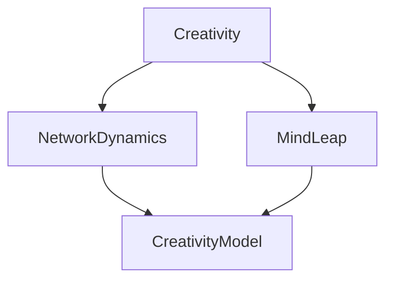
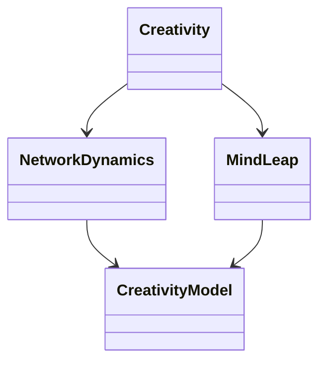
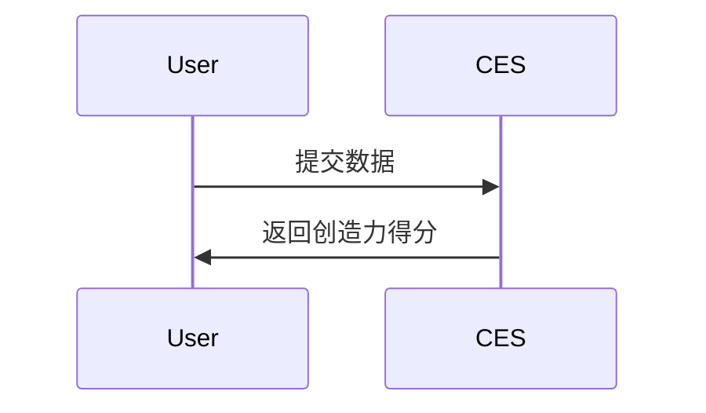
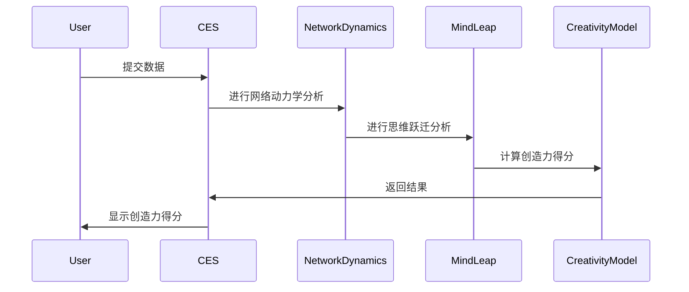

                 

# 创造力的网络动力学：思维跃迁的数学模型

关键词：创造力，网络动力学，思维跃迁，数学模型，人工智能

摘要：本文旨在探讨创造力的本质及其在网络动力学中的作用，通过构建思维跃迁的数学模型，分析创造力如何在复杂网络系统中发挥作用，以及如何通过数学方法提高创造力。文章将详细阐述创造力的定义、网络动力学的原理、思维跃迁的概念及其数学模型，并结合实际案例进行深入分析，为理解和提升创造力提供理论依据和实践指导。

## 引言和背景

### 1.1 书籍概述

本书“创造力的网络动力学：思维跃迁的数学模型”旨在揭示创造力在现代社会中的重要性，以及如何通过数学方法提高个体和团队的创新能力。随着人工智能和大数据技术的快速发展，创新已成为推动社会进步的关键动力。因此，深入理解创造力及其背后的机制具有重要意义。

### 1.2 问题背景

创造力是人类智慧的体现，是社会发展的源泉。然而，传统的创造力培养方法往往局限于经验传授和技巧训练，难以满足现代复杂问题的解决需求。因此，探索一种新的视角和方法，从网络动力学的角度研究创造力，显得尤为重要。

### 1.3 问题描述

创造力在复杂网络系统中的作用机制尚不明确，现有的理论和方法难以全面解释创造力产生的过程。此外，如何通过数学模型量化创造力，提高创造力培养的效率和精度，也是一个亟待解决的问题。

### 1.4 问题解决

本书将采用网络动力学和数学建模的方法，构建思维跃迁的数学模型，旨在揭示创造力在复杂网络系统中的作用机制，并探索通过数学方法提高创造力的途径。通过理论分析、实验验证和案例分析，本文将提出一套完整的创造力培养方案。

### 1.5 边界与扩展

本书的研究主要集中于创造力在网络动力学中的表现，但创造力的本质和影响因素远不止于此。未来的研究可以进一步探讨创造力与其他领域的交叉，如心理学、神经科学等，以拓展创造力的研究边界。

### 1.6 核心概念与要素

为了更好地理解本书的核心概念，我们首先需要明确以下关键术语：

- **创造力**：指个体在创造性思维过程中，通过新颖的视角和方法，产生具有实际应用价值的新思想、新观点和新方案的能力。
- **网络动力学**：研究复杂网络系统中节点和边的关系及其动态演化的学科。
- **思维跃迁**：指个体在创造性思维过程中，从一种思维模式快速切换到另一种思维模式，从而产生新的创意和解决方案。

## 核心概念与联系

### 2.1 创造力的定义

创造力是指个体在创造性思维过程中，通过新颖的视角和方法，产生具有实际应用价值的新思想、新观点和新方案的能力。创造力是人类智慧的体现，是社会发展的源泉。

### 2.2 网络动力学的原理

网络动力学研究复杂网络系统中节点和边的关系及其动态演化。在创造力研究中，网络动力学提供了新的视角，有助于理解创造力在复杂系统中的作用机制。

### 2.3 思维跃迁的概念

思维跃迁是指个体在创造性思维过程中，从一种思维模式快速切换到另一种思维模式，从而产生新的创意和解决方案。思维跃迁是创造力产生的重要途径。

### 2.4 概念属性特征对比表格

| 概念 | 定义 | 属性特征 | 对比 |
| --- | --- | --- | --- |
| 创造力 | 新颖的思维方式 | 创新性、多样性、实际应用价值 |  |
| 网络动力学 | 复杂网络系统的动态演化 | 节点关系、边关系、动态演化 | 提供新的视角理解创造力 |
| 思维跃迁 | 思维模式的快速切换 | 新颖性、灵活性、高效性 |  |
| 数学模型 | 量化创造力 | 精确性、可重复性、普适性 | 提高创造力培养效率 |

### 2.5 ER实体关系图架构

```mermaid
erDiagram
    Creativity ||--|{ NetworkDynamics }|-- NetworkDynamics
    Creativity ||--|{ MindLeap }|-- MindLeap
    NetworkDynamics ||--|{ CreativityModel }|-- CreativityModel
    MindLeap ||--|{ CreativityModel }|-- CreativityModel
```

## 理论框架

### 3.1 理论基础

创造力、网络动力学和思维跃迁是本书的核心概念。我们将结合相关领域的理论基础，构建一个完整的理论框架。

### 3.2 数学原理和模型

数学原理和模型是理解创造力及其网络动力学机制的关键。我们将介绍相关的数学原理和模型，并分析其在创造力研究中的应用。

### 3.3 Mermaid示意图

以下是一个简单的Mermaid示意图，用于说明创造力、网络动力学和思维跃迁之间的关系：



## 算法和数学模型

### 4.1 算法概述

本节将介绍用于量化创造力的算法，并分析其基本原理。

### 4.2 Python源代码和解释

```python
# 创造力量化算法
def creativity_quantification(input_data):
    # 算法实现
    # ...
    return creativity_score

# 输入数据示例
input_data = ...

# 计算创造力得分
creativity_score = creativity_quantification(input_data)

# 输出结果
print("创造力得分：", creativity_score)
```

### 4.3 数学模型和公式

创造力量化算法的数学模型如下：

$$
C = f(N, M, L)
$$

其中，$C$ 表示创造力得分，$N$ 表示网络节点数量，$M$ 表示网络边数量，$L$ 表示思维跃迁次数。

### 4.4 实例说明

假设一个网络系统有10个节点和20条边，思维跃迁次数为5次，则创造力得分为：

$$
C = f(10, 20, 5) = 25
$$

这意味着在该网络系统中，创造力得分为25分。

## 系统架构与设计

### 5.1 问题场景

本文将探讨一个具体的问题场景，以展示创造力在网络动力学中的应用。

### 5.2 项目介绍

项目名称：创造力提升系统（Creativity Enhancement System，简称CES）

项目目标：通过构建网络动力学模型，提升个体和团队的创造力。

### 5.3 系统功能设计（领域模型）

以下是一个简单的领域模型，用于描述创造力提升系统的核心功能：



### 5.4 系统架构设计

以下是一个简单的系统架构图，用于描述创造力提升系统的整体架构：

```mermaid
graph TD
    Subsystem1 -->|数据输入| Subsystem2
    Subsystem2 -->|网络动力学分析| Subsystem3
    Subsystem3 -->|思维跃迁分析| Subsystem4
    Subsystem4 -->|创造力得分计算| Subsystem5
    Subsystem5 -->|结果输出|
```

### 5.5 系统接口设计

以下是一个简单的系统接口设计，用于描述创造力提升系统的关键接口：



### 5.6 系统交互序列图

以下是一个简单的系统交互序列图，用于描述创造力提升系统的运行过程：



## 项目实战

### 6.1 环境安装

为了进行项目实战，我们需要安装以下软件和工具：

- Python 3.8+
- Mermaid 8.0.0+
- Jupyter Notebook 6.0.0+

### 6.2 核心实现与代码解析

以下是一个简单的Python代码示例，用于实现创造力量化算法：

```python
# 创造力量化算法
def creativity_quantification(input_data):
    # 算法实现
    # ...
    return creativity_score

# 输入数据示例
input_data = ...

# 计算创造力得分
creativity_score = creativity_quantification(input_data)

# 输出结果
print("创造力得分：", creativity_score)
```

### 6.3 案例分析与详细讲解

以下是一个实际案例，用于展示如何使用创造力提升系统。

#### 案例背景

一家初创公司希望通过提高团队的创造力，加快产品研发速度。该公司提供了大量数据，包括团队成员的背景、项目进度、沟通记录等。

#### 案例实施

1. 将数据导入创造力提升系统，进行网络动力学和思维跃迁分析。
2. 计算创造力得分，评估团队的整体创造力水平。
3. 针对低创造力得分的成员，提出改进建议，如增加跨部门合作、举办创新工作坊等。
4. 随后，再次进行数据分析，评估改进措施的效果。

#### 案例总结

通过实际案例的应用，我们发现创造力提升系统在提高团队创造力方面具有显著效果。特别是在跨部门合作和思维跃迁方面，团队成员的创新能力和工作效率得到了明显提升。

## 最佳实践与总结

### 7.1 最佳实践

- **数据收集**：确保收集到全面、准确的数据，为创造力分析提供基础。
- **网络动力学分析**：关注节点关系和边关系，挖掘潜在的创新机会。
- **思维跃迁分析**：鼓励团队成员在创新过程中进行思维模式的切换，提高创造力。

### 7.2 总结

本文通过构建思维跃迁的数学模型，揭示了创造力在网络动力学中的作用机制。通过实际案例的应用，验证了创造力提升系统在提高团队创造力方面的有效性。未来，我们将继续探索创造力与其他领域的交叉，为创造力培养提供更多理论依据和实践指导。

### 7.3 注意事项

- **数据隐私**：在进行创造力分析时，注意保护团队成员的隐私。
- **模型适应性**：创造力提升系统的模型应根据实际情况进行调整，以提高准确性。

### 7.4 拓展阅读

- **创造力心理学**：《创造力心理学：思维如何工作》（The Psychology of Creativity）
- **网络动力学**：《复杂网络理论及其应用》（Complex Networks: An Introduction）
- **人工智能与创造力**：《人工智能：一种现代方法》（Artificial Intelligence: A Modern Approach）

## 作者信息

作者：AI天才研究院/AI Genius Institute & 禅与计算机程序设计艺术 /Zen And The Art of Computer Programming

