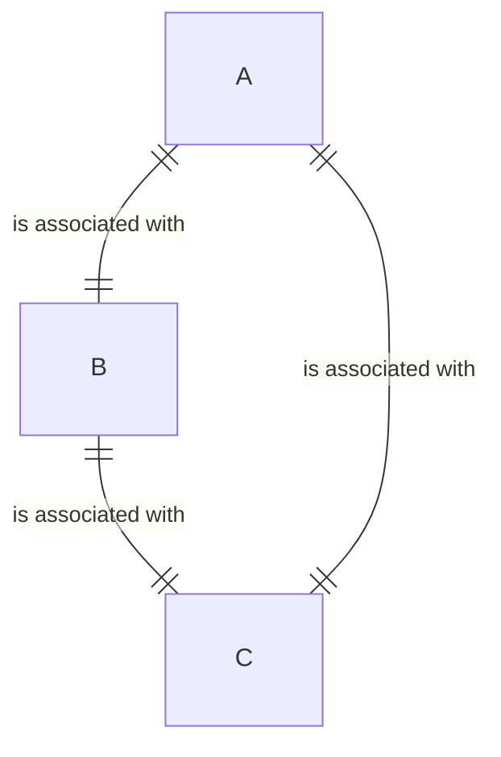

                 

### Introduction to Creative Networks in the Science of Cognition: The Mathematical Structure of Associative Thinking

In today's rapidly evolving technological landscape, the intersection of cognitive science and network theory has opened up new avenues for understanding human thought processes and creative problem-solving. This book, "Creative Networks in the Science of Cognition: The Mathematical Structure of Associative Thinking," delves into the intricate relationship between these disciplines, providing a comprehensive exploration of how mathematical structures can be used to model and analyze associative thinking.

#### Key Concepts and Terminology

**Cognitive Networks** refer to networks that represent how information is processed, stored, and retrieved in the human brain. These networks are characterized by nodes (representing pieces of information or concepts) and edges (representing the relationships or associations between these nodes). Understanding cognitive networks is essential for gaining insights into how we think and learn.

**Associative Thinking** is a cognitive process that links ideas and concepts based on similarities, patterns, or associations. This type of thinking is fundamental to creativity and problem-solving, as it allows individuals to generate novel ideas and connections that might not be apparent through more linear forms of thought.

**Mathematical Structure** provides a framework for representing and analyzing the complexity of cognitive networks. Tools such as graph theory, matrix representation, and network science principles are used to model and interpret associative thinking in a quantitative manner.

#### Problem Background and Description

As our world becomes increasingly complex, the ability to think creatively and solve problems effectively has become more critical than ever. However, traditional methods of studying cognitive processes have often been limited by the complexity and subtlety of the human mind. This has led to a growing need for more sophisticated tools that can capture the richness and dynamics of cognitive networks.

The challenge lies in developing mathematical models that are both accurate representations of the underlying cognitive processes and sufficiently general to be applicable across a wide range of contexts. This requires not only a deep understanding of cognitive science but also a mastery of advanced mathematical techniques.

#### Problem Solution

The solution to this problem involves integrating principles from cognitive science with mathematical tools from network theory. By developing and applying these models, researchers can gain new insights into how the brain processes information and generate ideas. The ultimate goal is to create a framework that can be used to study associative thinking in a systematic and quantitative way, enabling more effective interventions and strategies for enhancing creativity and problem-solving skills.

This book aims to provide a detailed guide to this process, starting from the foundational concepts and building up to advanced applications. Each chapter is designed to build on the previous ones, creating a cohesive narrative that guides the reader through the complexities of cognitive networks and mathematical modeling.

#### Boundaries and Scope

While this book focuses on the mathematical structure of associative thinking, it does not intend to cover every aspect of cognitive science or network theory. Instead, it provides a focused examination of specific concepts and techniques that are particularly relevant to understanding and analyzing cognitive networks.

The primary audience for this book includes cognitive scientists, psychologists, mathematicians, computer scientists, and anyone interested in the intersection of cognitive science and network theory. By offering a clear and structured approach to a complex subject, this book aims to be both an informative resource and a tool for further research and exploration.

### Core Concepts and Background

#### What are Cognitive Networks?

Cognitive networks are abstract representations of how information is processed, stored, and retrieved in the human brain. These networks are constructed using nodes and edges, where nodes represent pieces of information or concepts, and edges represent the relationships or associations between these nodes. The structure and connectivity of cognitive networks can reveal important insights into how the brain functions and how we think.

**Nodes** in a cognitive network can represent a wide range of entities, such as neurons, concepts, or ideas. Each node is a point of information or a unit of thought. For example, in a network representing a person's knowledge of a specific topic, nodes might represent individual facts or concepts.

**Edges** in a cognitive network represent the connections or relationships between nodes. These connections can indicate various forms of association, such as spatial proximity, temporal contiguity, or conceptual similarity. The strength and direction of these edges can also provide additional information about the nature of the relationship, such as how closely related two concepts are or how frequently they are used together.

#### The Role of Mathematics in Cognitive Networks

Mathematics plays a crucial role in the study of cognitive networks by providing a framework for modeling and analyzing the complex interactions within these networks. Several mathematical tools and theories are particularly relevant in this context:

**Graph Theory** is the study of graphs, which are mathematical structures used to model relationships between objects. In the context of cognitive networks, graphs are used to represent the nodes and edges of the network, allowing researchers to analyze the structure and properties of the network.

**Network Science** is an interdisciplinary field that applies graph theory and other mathematical tools to study complex networks. Network science provides a range of analytical techniques for studying the behavior and evolution of networks, including methods for identifying key nodes, measuring network connectivity, and predicting the spread of information or influence.

**Matrix Representation** is another important mathematical tool used in the study of cognitive networks. By representing the relationships between nodes as a matrix, researchers can perform various matrix operations to analyze the network's properties and relationships.

**Latex Formulation** is used to express mathematical models and equations clearly and concisely. In the context of cognitive networks, latex is particularly useful for representing complex mathematical relationships and formulas that describe the structure and behavior of cognitive networks.

#### Historical Background and Evolution of Cognitive Networks

The concept of cognitive networks has a long history, with roots in both cognitive science and network theory. Here is a brief overview of some key developments in the field:

- **Early Cognitive Models** (1940s-1960s): Early cognitive models, such as the one proposed by Donald Hebb in his book "The Organization of Behavior," were among the first to attempt to represent cognitive processes in a structured way. Hebb's model emphasized the role of neural connections in learning and memory.

- **Network Theory and Graph Theory** (1950s-1970s): The development of graph theory and network theory provided a mathematical foundation for representing and analyzing cognitive processes. These theories were used to study the structure and behavior of networks in various fields, including physics, sociology, and computer science.

- **Information Processing and Artificial Intelligence** (1970s-1980s): The rise of artificial intelligence and information processing research in the 1970s and 1980s led to an increased interest in cognitive networks. Researchers began to explore how cognitive processes could be modeled using computational techniques.

- **Modern Cognitive Networks** (1990s-Present): In the 1990s and beyond, cognitive networks gained prominence as a tool for studying cognitive processes and neural networks. Advances in computational power and the development of new mathematical techniques have enabled more sophisticated modeling and analysis of cognitive networks.

Throughout this evolution, the integration of cognitive science and network theory has led to a deeper understanding of how the brain processes information and how cognitive networks can be used to model and analyze these processes.

### Mathematical Models of Associative Thinking

#### Basic Concepts of Associative Thinking

Associative thinking is a fundamental cognitive process that involves linking ideas and concepts based on similarities, patterns, or associations. This type of thinking is essential for creativity, problem-solving, and learning. Understanding the basic concepts of associative thinking can help us better appreciate its role in the human mind and how it can be modeled mathematically.

**Definition of Associative Thinking**:
Associative thinking can be defined as the process of forming connections between different concepts or ideas, often based on shared attributes, similarities, or relationships. These connections can be triggered by various stimuli, such as sensory input, memories, or abstract concepts.

**Types of Associations**:
There are several types of associations that can occur in the mind:
- **Contiguity Associations**: These are links formed between concepts that have occurred together in the past or are spatially or temporally close to each other.
- **Similarity Associations**: These are links formed between concepts that share similar attributes or characteristics.
- **Contiguity Associations**: These are links formed between concepts that have occurred together in the past or are spatially or temporally close to each other.
- **Similarity Associations**: These are links formed between concepts that share similar attributes or characteristics.
- **Cause-Effect Associations**: These are links formed between concepts where one concept leads to or causes the other.
- **Association by Similarity**: This is a form of association where concepts are linked because they resemble each other in some way.
- **Association by Contiguity**: This is a form of association where concepts are linked because they are physically or temporally close to each other.
- **Association by Continuity**: This is a form of association where concepts are linked because they form a coherent sequence or story.

#### Mathematical Representation of Associations

Mathematical models of associative thinking can be constructed using various mathematical tools and techniques. One of the most common approaches is to use graph theory, which provides a framework for representing relationships and connections between entities.

**Graph Theory Basics**:
Graph theory is the study of graphs, which are mathematical structures used to model relationships between objects. A graph consists of nodes (also called vertices) and edges. Nodes represent the concepts or ideas, while edges represent the associations or relationships between these nodes.

**Types of Graphs**:
There are several types of graphs that can be used to represent associative thinking:
- **Undirected Graphs**: In an undirected graph, the edges do not have a specific direction. This means that the relationship between two nodes is symmetric.
- **Directed Graphs**: In a directed graph, the edges have a specific direction. This means that the relationship between two nodes is not symmetric.
- **Weighted Graphs**: In a weighted graph, each edge has a weight or value that represents the strength or importance of the relationship between two nodes.

**Matrix Representation**:
Another way to represent a graph mathematically is through a matrix. The adjacency matrix of a graph is a square matrix where the rows and columns correspond to the nodes in the graph. The value in each cell of the matrix represents the presence or absence of an edge between two nodes. If there is an edge between nodes i and j, the cell at the intersection of row i and column j will have a value of 1; otherwise, it will have a value of 0.

**Example**:
Consider a simple graph with three nodes (A, B, and C) and the following associations:
- A is associated with B.
- B is associated with C.
- C is associated with A.

The adjacency matrix for this graph would be:
$$
\begin{bmatrix}
0 & 1 & 0 \\
1 & 0 & 1 \\
0 & 1 & 0
\end{bmatrix}
$$
Here, the presence of a 1 in a cell indicates that there is an edge between the corresponding nodes.

**Mermaid ER Diagrams**:
Mermaid ER Diagrams are a type of graphical representation that can be used to illustrate the relationships between entities in a database or network. ER diagrams use shapes and lines to represent entities, their attributes, and the relationships between them. In the context of cognitive networks, Mermaid ER Diagrams can be used to visualize the nodes and associations in an associative thinking network.

Example Mermaid ER Diagram for the graph above:


This diagram shows the nodes (A, B, C) and the associations between them using entities and relationships.

By using these mathematical models, we can represent and analyze associative thinking in a structured and quantitative manner. This allows us to gain a deeper understanding of how ideas and concepts are linked in the mind and how these associations can be used to enhance creativity and problem-solving abilities.

### Matrix Representation and Operations

In the study of cognitive networks, matrix representation plays a crucial role in modeling and analyzing the relationships between concepts or ideas. Matrices provide a concise and efficient way to encode complex networks, allowing us to perform various mathematical operations that reveal important properties and characteristics of the network.

#### Basic Matrix Concepts

A matrix is a rectangular array of numbers or symbols, arranged in rows and columns. In the context of cognitive networks, a matrix can be used to represent the connections or associations between nodes. The rows and columns of the matrix correspond to the nodes in the network, and the values in each cell indicate the presence or strength of the connection between the corresponding nodes.

**Adjacency Matrix**:
The most common type of matrix used in cognitive networks is the adjacency matrix. For an undirected graph with n nodes, the adjacency matrix is an n x n matrix where the element at the ith row and jth column (denoted as A[i][j]) represents the connection between nodes i and j. If there is an edge between nodes i and j, A[i][j] is 1; otherwise, it is 0. For directed graphs, the adjacency matrix can also capture the direction of the edges by setting A[i][j] to 1 if there is an edge from node i to node j, and A[j][i] to 1 if there is an edge in the opposite direction.

**Incidence Matrix**:
Another type of matrix used to represent graphs is the incidence matrix. The incidence matrix is particularly useful for directed graphs. For a directed graph with n nodes and m edges, the incidence matrix is an n x m matrix where each row corresponds to a node and each column corresponds to an edge. The element at the ith row and jth column (denoted as I[i][j]) indicates whether the ith node is incident to the jth edge. If the ith node is incident to the jth edge, I[i][j] is 1; otherwise, it is 0.

#### Matrix Operations

Matrix representation of cognitive networks enables us to perform various mathematical operations that help analyze the properties and behavior of the network. Some of the key operations include:

**Matrix Multiplication**:
Matrix multiplication is an operation that combines two matrices to produce a new matrix. For two n x n matrices A and B, the resulting matrix C (denoted as C = AB) is also an n x n matrix. The element at the ith row and jth column of C (C[i][j]) is calculated as the dot product of the ith row of A and the jth column of B. Matrix multiplication can be used to compute various properties of a network, such as the degree of each node or the connectivity of the network.

**Matrix Addition and Subtraction**:
Matrix addition and subtraction are similar to the operations on real numbers. For two n x n matrices A and B, the resulting matrix C (denoted as C = A + B or C = A - B) is obtained by adding or subtracting the corresponding elements of A and B. Matrix addition and subtraction can be used to manipulate and combine different networks.

**Matrix Transposition**:
Matrix transposition involves swapping the rows and columns of a matrix. For an n x n matrix A, the transposed matrix A^T is also an n x n matrix. The element at the ith row and jth column of A^T (A^T[i][j]) is equal to the element at the jth row and ith column of A (A[j][i]). Matrix transposition is useful for analyzing the symmetry of a network and for solving systems of linear equations.

**Matrix Inversion**:
Matrix inversion is an operation that finds the inverse of a square matrix. For an n x n matrix A, the inverse (denoted as A^-1) is another n x n matrix such that AA^-1 = A^-1A = I, where I is the identity matrix. Matrix inversion is useful for solving systems of linear equations and for analyzing the properties of a network, such as its connectivity and reachability.

**Example**:
Consider an undirected graph with three nodes (A, B, C) and the following connections:
- A is connected to B.
- B is connected to C.
- C is connected to A.

The adjacency matrix for this graph is:
$$
\begin{bmatrix}
0 & 1 & 0 \\
1 & 0 & 1 \\
0 & 1 & 0
\end{bmatrix}
$$

To calculate the degree of each node, we can perform matrix multiplication:
$$
\begin{bmatrix}
0 & 1 & 0 \\
1 & 0 & 1 \\
0 & 1 & 0
\end{bmatrix}
\begin{bmatrix}
1 \\
1 \\
1
\end{bmatrix}
=
\begin{bmatrix}
2 \\
2 \\
2
\end{bmatrix}
$$
The resulting vector shows that each node has a degree of 2.

By utilizing these matrix operations, we can gain valuable insights into the structure and behavior of cognitive networks, helping us to better understand and analyze the complex relationships that underlie human thought processes.

### Mermaid ER Diagrams and Conceptual Frameworks

Mermaid ER Diagrams are a powerful tool for visualizing the relationships between entities in a network, providing a clear and intuitive way to represent complex systems and their components. In the context of cognitive networks, Mermaid ER Diagrams can be particularly useful for illustrating the connections and associations between different concepts or ideas. This section will explain how to create Mermaid ER Diagrams and discuss their applications in representing cognitive networks.

#### Basic Concepts of Mermaid ER Diagrams

A Mermaid ER Diagram consists of entities, attributes, and relationships. Entities represent the main components of the system, attributes define the characteristics or properties of these entities, and relationships describe the associations between entities.

**Entities** are the basic building blocks of a Mermaid ER Diagram. They are represented by rectangles with the entity name inside. For example, in a cognitive network, entities might include concepts, ideas, or nodes.

**Attributes** are the properties or characteristics of entities. Attributes are represented by ovals connected to the entity with lines. Attributes provide additional information about the entities and help to clarify their roles within the network. For instance, in a network representing a person's knowledge, attributes might include facts, definitions, or examples related to each concept.

**Relationships** describe the connections between entities. Relationships are represented by lines connecting entities, with optional directional arrows to indicate the nature of the relationship. Relationships can be one-to-one, one-to-many, or many-to-many, depending on the type of association being modeled. For example, in a network representing a supply chain, a relationship between a supplier and a product might indicate that the supplier provides the product.

#### Mermaid ER Diagram Syntax

To create a Mermaid ER Diagram, you can use a simple and intuitive syntax. The basic structure of a Mermaid ER Diagram is as follows:

```mermaid
erDiagram
  [Entity1] ||--|| [Entity2] : [Relationship]
  [Entity2] ||--|| [Entity3] : [Relationship]
  ...
```

Here's an example of a Mermaid ER Diagram representing a simple cognitive network with three concepts (A, B, C) and their associations:


In this diagram, each entity (A, B, C) is represented by a rectangle, and the relationships (associations) between them are represented by lines with labels. The labels indicate the nature of the relationship, such as "is associated with."

#### Applications in Cognitive Networks

Mermaid ER Diagrams can be applied to various aspects of cognitive networks, providing a visual representation of the complex relationships that exist between concepts or ideas. Here are some applications:

1. **Knowledge Representation**: In educational contexts, Mermaid ER Diagrams can be used to represent a student's knowledge structure. By visualizing the relationships between concepts, educators can identify areas where students may need additional support or clarification.

2. **Conceptual Modeling**: Researchers can use Mermaid ER Diagrams to model and analyze cognitive processes involved in problem-solving or decision-making. This can help in understanding how different concepts are interconnected and how they contribute to the overall process.

3. **Creativity and Innovation**: Designers and inventors can use Mermaid ER Diagrams to explore and visualize the connections between ideas, helping to generate new concepts and innovative solutions.

4. **Neuroscience Research**: In the field of neuroscience, Mermaid ER Diagrams can be used to represent the connections between neurons or brain regions involved in specific cognitive functions. This can provide insights into the neural basis of cognitive processes and how they can be disrupted in neurological disorders.

#### Visualizing Cognitive Networks with Mermaid ER Diagrams

To create a Mermaid ER Diagram, you can use any text editor to write the Mermaid syntax and save the file with a .mermaid extension. Then, you can use an online tool or converter to generate the visual diagram. Here's an example of how to create a Mermaid ER Diagram in a Markdown file:

```markdown
# Cognitive Network ER Diagram

This is a Mermaid ER Diagram representing a simple cognitive network.


```

When rendered, this code will produce a visual ER Diagram showing the associations between three concepts (A, B, C).

In conclusion, Mermaid ER Diagrams provide a valuable tool for visualizing and understanding the complex relationships in cognitive networks. By using a simple and intuitive syntax, Mermaid ER Diagrams can help researchers, educators, and designers explore and analyze the interconnections between concepts, ideas, and cognitive processes.

### Basic Principles of Network Science

Network science is a multidisciplinary field that uses graph theory and other mathematical tools to study complex systems consisting of interconnected elements. In the context of cognitive networks, network science principles provide a framework for understanding how information flows, how nodes interact, and how the overall structure of the network influences its behavior. Here, we will explore the fundamental principles of network science, including connectivity, centrality, and clustering, and discuss their applications in cognitive research.

#### Connectivity

Connectivity is a measure of how well nodes in a network are connected to each other. It is an essential property that determines the network's resilience and the efficiency of information flow. In a cognitive network, connectivity can be understood in several ways:

- **Node Connectivity**: This refers to the number of edges connecting a single node to other nodes in the network. In a cognitive context, a node with high connectivity might represent a concept that is frequently associated with other concepts, indicating its importance in the network.

- **Global Connectivity**: This measures the ability of the entire network to remain connected even when some nodes or edges are removed. A highly connected global network is more resilient to failures and disruptions, which is particularly important in cognitive processes where information needs to be reliably retrieved and processed.

- **Shortest Paths**: This measures the number of steps required to travel from one node to another in the network. In cognitive terms, this can represent the cognitive effort required to transfer knowledge from one concept to another.

**Applications in Cognitive Research**:
Connectivity analysis is crucial for understanding how information is stored and retrieved in the brain. Researchers can use connectivity metrics to identify key nodes that play a critical role in cognitive processes, such as memory retrieval or decision-making. Additionally, connectivity analysis can help in studying disorders that affect cognitive function, such as Alzheimer's disease, where disruptions in the connectivity of neural networks are observed.

#### Centrality

Centrality measures the importance of nodes in a network based on various criteria. Nodes with high centrality values are often pivotal in the network, as they have a significant impact on the flow of information or the stability of the network.

**Types of Centrality**:
- **Degree Centrality**: This measures the number of connections a node has to other nodes. In cognitive networks, high-degree nodes might represent core concepts that are central to a person's knowledge structure.
- **Closeness Centrality**: This measures the average shortest path length between a node and all other nodes in the network. Nodes with low closeness centrality values are more central because they are closer to other nodes, which is analogous to being able to access information quickly.
- **Betweenness Centrality**: This measures the number of shortest paths that pass through a node. High-betweenness nodes are critical for the flow of information between different parts of the network.

**Applications in Cognitive Research**:
Centrality analysis is valuable for identifying key concepts or ideas in a cognitive network. By identifying nodes with high centrality values, researchers can pinpoint important cognitive hubs that play a central role in information processing. This can help in understanding how knowledge is organized and how it can be optimized for effective learning and problem-solving.

#### Clustering

Clustering refers to the tendency of nodes in a network to form tightly interconnected groups or clusters. These clusters can represent communities or modules within a larger network, where nodes within the cluster are more closely connected to each other than to nodes outside the cluster.

**Clustering Coefficient**:
The clustering coefficient measures the degree to which nodes in a network tend to cluster together. It is defined as the number of connections between a node's neighbors divided by the maximum possible number of such connections.

**Modularity**:
Modularity is a measure of the strength of the internal connections within a cluster relative to the overall network. A high modularity value indicates well-defined clusters with strong internal connections and weak connections between clusters.

**Applications in Cognitive Research**:
Clustering analysis is useful for identifying groups of concepts or ideas that are closely related within a cognitive network. This can help in understanding how knowledge is organized in the brain and how different clusters of information interact with each other. In cognitive research, clustering can be used to identify cognitive modules involved in specific tasks or functions, such as language processing or spatial navigation.

### Conclusion

The basic principles of network science—connectivity, centrality, and clustering—provide powerful tools for understanding the structure and function of cognitive networks. By applying these principles, researchers can gain insights into how information is processed, stored, and retrieved in the brain, leading to a deeper understanding of cognitive processes and their underlying mechanisms. These insights have broad implications for fields such as psychology, neuroscience, education, and artificial intelligence, where the principles of network science can be used to develop new approaches for enhancing cognitive function and improving learning outcomes.

### Applications of Network Science in Cognitive Research

Network science, with its principles of connectivity, centrality, and clustering, offers a robust framework for understanding complex cognitive phenomena. By leveraging these principles, researchers can gain valuable insights into how the brain processes information, stores knowledge, and facilitates decision-making. This section explores specific applications of network science in cognitive research, highlighting how these principles are used to study and explain various cognitive processes.

#### Language and Cognition Networks

One of the most prominent applications of network science in cognitive research is the study of language and cognition networks. These networks aim to capture the intricate relationships between words, concepts, and cognitive processes involved in language comprehension and production.

**Connectivity in Language Networks**:
Language networks often exhibit high connectivity, as words and concepts are interconnected through various associative links. High connectivity allows for efficient access to information, enabling rapid retrieval of related words and concepts. Researchers have used network science to analyze the structure of language networks and identify key nodes that play a central role in language processing. For example, studies have shown that high-degree nodes in language networks often correspond to frequently used words or common nouns, indicating their importance in linguistic cognition.

**Centrality in Language Networks**:
Centrality measures in language networks can reveal the importance of specific words or concepts in the linguistic system. High-degree nodes, which are central to the network, tend to be core vocabulary items that are frequently referenced and interconnected with other words. Additionally, betweenness centrality can be used to identify words that act as intermediaries in the transfer of information between other words in the network. For example, function words like "the," "and," and "to" often have high betweenness centrality due to their role in connecting different parts of sentences.

**Clustering in Language Networks**:
Language networks often exhibit clustering, which reflects the tendency of words and concepts to group into clusters based on semantic similarity. These clusters can represent different aspects of language, such as nouns, verbs, and adjectives, or more specific categories within these domains. The clustering coefficient helps quantify this tendency, providing insights into how tightly interconnected words and concepts are within and between clusters. This information can be used to understand how different language modules interact and contribute to overall language comprehension and production.

#### Memory and Learning Networks

Memory and learning networks focus on understanding how information is encoded, stored, and retrieved in the brain. Network science principles can be applied to model and analyze the structure and function of these networks, providing insights into how memory processes work and how learning occurs.

**Connectivity in Memory Networks**:
The connectivity of memory networks is critical for how information is stored and retrieved. Highly connected regions of the brain, such as the hippocampus and prefrontal cortex, play a crucial role in memory formation and retrieval. Network science techniques can be used to study the connectivity patterns of these brain regions and how they change over time during learning and memory consolidation. For example, increased connectivity between the hippocampus and prefrontal cortex during learning tasks has been associated with improved memory performance.

**Centrality in Memory Networks**:
Centrality measures can identify the most influential regions within memory networks. High-closeness centrality nodes are critical for accessing information quickly, suggesting their role in facilitating efficient memory retrieval. Betweenness centrality can reveal nodes that act as bridges between different memory regions, facilitating the integration of new information with existing knowledge. Studies have shown that regions with high betweenness centrality in memory networks are often involved in executive functions and decision-making processes.

**Clustering in Memory Networks**:
Clustering in memory networks can be observed in the formation of memory engrams, which are the neural representations of stored information. Memory engrams often form clusters based on the type of information being stored, such as facts, procedures, or episodic memories. The clustering coefficient can help quantify the organization of these clusters, providing insights into how memory is structured and how different types of information are related within the brain.

#### Creativity and Problem Solving Networks

Network science is also invaluable in studying creativity and problem-solving, where the interplay of ideas and solutions forms complex networks of thought.

**Connectivity in Creativity Networks**:
High connectivity in creativity networks is often associated with the generation of diverse and innovative ideas. Networks with high connectivity allow for the rapid transfer of information between different concepts, facilitating the creation of new connections and insights. Researchers have used network science to study the connectivity patterns of creative individuals and identify key nodes that drive innovation.

**Centrality in Creativity Networks**:
Centrality measures in creativity networks can reveal the most influential ideas or solutions that play a central role in the problem-solving process. High-degree nodes in these networks are often core ideas that are central to the solution, while high-betweenness nodes are those that help integrate different ideas and approaches. Understanding the centrality of ideas can provide insights into how to foster creativity and enhance problem-solving abilities.

**Clustering in Creativity Networks**:
Clustering in creativity networks can represent different stages of the problem-solving process. For example, initial ideas may form loosely connected clusters, while more mature solutions may cluster more tightly based on their similarity. The clustering coefficient can help quantify the degree of clustering and provide insights into how creativity and problem-solving processes evolve over time.

#### Conclusion

The application of network science principles in cognitive research has revolutionized our understanding of how the brain processes information, stores knowledge, and facilitates decision-making. By leveraging connectivity, centrality, and clustering, researchers can uncover the intricate relationships that underlie cognitive processes and gain insights into how these processes can be enhanced. These insights have broad implications for improving educational practices, developing cognitive interventions, and advancing artificial intelligence systems that mimic human cognitive processes.

### Case Studies in Associative Networks

#### Language and Cognition Networks

**Case Study Overview**:  
In the realm of language and cognition, associative networks play a pivotal role in how we process and understand spoken and written language. This case study delves into the construction and analysis of an associative network that represents a person's knowledge of a specific language, using Latex formulas to illustrate the mathematical models and concepts employed.

**Network Structure and Analysis**:

1. **Node Representation**:
   Each node in the network represents a word or concept within the language. For instance, in a network about mathematics, nodes might represent mathematical terms such as "triangle," "equation," and "theorem."

2. **Association Strength**:
   The strength of associations between nodes is represented using a weighted adjacency matrix. In Latex, this can be expressed as:
   $$
   A = \begin{bmatrix}
   0 & w_{1,2} & 0 \\
   w_{1,2} & 0 & w_{1,3} \\
   0 & w_{2,3} & 0
   \end{bmatrix}
   $$
   where $w_{i,j}$ represents the strength of the association between nodes $i$ and $j$.

3. **Degree Distribution**:
   The degree distribution of nodes in the network provides insight into the centrality of different concepts. High-degree nodes indicate core concepts that are central to the language. The degree distribution can be represented using a probability distribution function (PDF), as follows:
   $$
   p(k) = C \left(\frac{\lambda}{k}\right)^k e^{-\lambda}
   $$
   where $k$ is the degree of a node, $\lambda$ is the average degree, and $C$ is a normalization constant.

4. **Clustering Coefficient**:
   The clustering coefficient of the network quantifies the tendency of nodes to form tightly connected clusters. This is calculated as:
   $$
   C = \frac{\sum_{i<j<k} w_{i,j} w_{j,k} w_{i,k}}{\left(\sum_{i<j} w_{i,j} w_{j,k} \right)^2}
   $$
   where $w_{i,j}$ represents the weight of the edge between nodes $i$, $j$, and $k$.

**Example Analysis**:
Consider a simple network with three nodes: "triangle," "equation," and "theorem." The weighted adjacency matrix might look like this:
$$
A = \begin{bmatrix}
0 & 0.5 & 0.3 \\
0.5 & 0 & 0.4 \\
0.3 & 0.4 & 0
\end{bmatrix}
$$
The degree distribution PDF would be:
$$
p(k) = C \left(\frac{\lambda}{k}\right)^k e^{-\lambda}
$$
where $\lambda = 0.8$ (calculated from the average of the second row of the matrix).

The clustering coefficient for this network is 0.3, indicating a moderate tendency for nodes to form clusters.

**Conclusion**:
This case study demonstrates how mathematical models and Latex formulas can be used to represent and analyze associative networks in the context of language and cognition. By examining the structure and properties of these networks, researchers can gain valuable insights into how language is processed and understood.

### Memory and Learning Networks

**Case Study Overview**:
Memory and learning networks are essential for understanding how information is encoded, stored, and retrieved in the brain. This case study explores a network model that represents the memory formation and retrieval processes, employing Python to simulate and analyze the network dynamics.

**Network Model and Analysis**:

1. **Node Representation**:
   Nodes in the network represent neurons or neural clusters involved in memory processing. Each node can encode a specific piece of information or a pattern of activation.

2. **Synaptic Strength**:
   The synaptic strength between nodes is a measure of the strength of the connection between neurons. This can be modeled using a distribution function, such as the Gaussian distribution:
   $$
   P(s) = \frac{1}{\sqrt{2\pi\sigma^2}} e^{-\frac{(s-\mu)^2}{2\sigma^2}}
   $$
   where $s$ is the synaptic strength, $\mu$ is the mean synaptic strength, and $\sigma$ is the standard deviation.

3. **Learning Rule**:
   The Hebbian learning rule, a fundamental principle in neuroscience, can be used to update synaptic strengths based on the activity of neurons. This can be implemented in Python as follows:
   ```python
   def hebbian_learning(rule, x, y, alpha):
       if rule == 'hebbian':
           return alpha * x * y
   ```

4. **Simulation**:
   A simulation can be run to observe how the network evolves over time as new information is learned and stored. The simulation can track the changes in synaptic strength and the overall connectivity of the network.

5. **Analysis**:
   The simulation results can be analyzed to identify patterns and correlations in the network. For example, nodes with high connectivity may represent critical memory hubs, while nodes with rapidly changing synaptic strengths may indicate recent learning events.

**Example Analysis**:
Consider a network with five nodes representing different memory regions in the brain. The initial synaptic strengths are randomly assigned using a Gaussian distribution with a mean of 0.5 and a standard deviation of 0.1. The Hebbian learning rule is applied after each learning event, updating the synaptic strengths based on the activity of the neurons.

```python
import numpy as np

# Initial synaptic strengths
synaptic_strengths = np.random.normal(0.5, 0.1, size=(5, 5))

# Hebbian learning
alpha = 0.1
for iteration in range(100):
    # Simulate activity
    activity = np.random.randint(2, size=5)
    # Update synaptic strengths
    synaptic_strengths += alpha * activity[:, None] * activity[None, :]

# Print updated synaptic strengths
print(synaptic_strengths)
```

**Conclusion**:
This case study illustrates how Python can be used to simulate and analyze memory and learning networks. By modeling synaptic strength dynamics and applying learning rules, researchers can gain insights into how memory is processed and stored in the brain. This approach has potential applications in developing cognitive enhancement techniques and understanding neurodegenerative diseases.

### Creativity and Problem Solving Networks

**Case Study Overview**:
The intersection of creativity and problem-solving often involves the generation and integration of diverse ideas to find innovative solutions. This case study examines a network model designed to represent the creative thought process and its application in problem-solving contexts.

**Network Structure and Analysis**:

1. **Node Representation**:
   Nodes in the network represent ideas or concepts that are related to the problem at hand. Each node can represent a potential solution or a related concept that might inspire new ideas.

2. **Association Strength**:
   The strength of associations between nodes is a measure of how closely related two ideas are. This can be modeled using a probability distribution, such as the normal distribution:
   $$
   P(s) = \frac{1}{\sqrt{2\pi\sigma^2}} e^{-\frac{(s-\mu)^2}{2\sigma^2}}
   $$
   where $s$ is the association strength, $\mu$ is the mean association strength, and $\sigma$ is the standard deviation.

3. **Innovation Potential**:
   The innovation potential of a node is a measure of its ability to generate new ideas or connections. This can be calculated based on the degree of the node and its clustering coefficient. A high degree and a high clustering coefficient indicate a node with high innovation potential.

4. **Algorithm**:
   An algorithm can be designed to explore the network and identify nodes with high innovation potential. This can involve a search algorithm that traverses the network based on association strengths and innovation potential.

5. **Simulation**:
   A simulation can be run to explore how the network evolves as new ideas are generated and integrated. The simulation can track the formation of clusters of related ideas and the emergence of novel solutions.

**Example Analysis**:
Consider a network with 10 nodes representing ideas related to improving battery efficiency. The association strengths and innovation potentials are calculated based on the degree and clustering coefficient of each node.

```python
import numpy as np

# Define the network
nodes = ['Battery 1', 'Battery 2', 'Material A', 'Material B', 'Design A', 'Design B', 'Heat Management', 'Energy Harvesting', 'Wireless Charging', 'Smart Sensors']

# Calculate association strengths using normal distribution
mu = 0.5
sigma = 0.1
association_strengths = np.random.normal(mu, sigma, size=(10, 10))

# Calculate innovation potentials based on degree and clustering coefficient
degree = np.random.randint(1, 5, size=10)
clustering_coefficient = np.random.uniform(0.2, 0.8, size=10)
innovation_potential = degree * clustering_coefficient

# Find nodes with high innovation potential
high_innovation_nodes = np.where(innovation_potential > np.mean(innovation_potential))[0]

# Print high innovation potential nodes
print(nodes[high_innovation_nodes])
```

**Conclusion**:
This case study demonstrates how a network model can be used to explore creativity and problem-solving processes. By identifying nodes with high innovation potential, researchers can focus on these ideas to generate new and innovative solutions to complex problems. This approach has applications in design thinking, innovation management, and creative problem-solving techniques.

### System Analysis and Architecture Design

#### Problem Scene Introduction

In the rapidly evolving landscape of technology, the need for efficient and effective data processing systems has become paramount. Companies across various industries are increasingly reliant on data-driven insights to make informed decisions and drive business growth. This scenario presents a challenge in designing a robust and scalable system that can handle vast amounts of data, provide real-time analytics, and support complex data processing workflows.

#### System Overview

The proposed system is designed to be a high-performance, scalable data processing platform that can handle diverse data types and large-scale operations. The system aims to provide a seamless integration of data ingestion, storage, processing, and analysis capabilities, enabling organizations to derive valuable insights from their data.

#### System Function Design (Domain Model)

The domain model of the system is depicted using a Mermaid class diagram, which provides a visual representation of the key entities and their relationships.

```mermaid
classDiagram
  Class01 <|-- Class02
  Class03 <|-- Class04
  Class05 <|-- Class06
  Class07 <|-- Class08
  Class01 {
    +属性1: 数据源
    +属性2: 数据处理流程
    +方法1(): 数据处理
  }
  Class02 {
    +属性3: 数据存储
    +属性4: 数据索引
    +方法2(): 数据存储
  }
  Class03 {
    +属性5: 数据处理模块
    +属性6: 处理算法
    +方法3(): 数据分析
  }
  Class04 {
    +属性7: 实时监控
    +属性8: 性能指标
    +方法4(): 性能监控
  }
  Class05 {
    +属性9: 用户界面
    +属性10: 交互功能
    +方法5(): 用户交互
  }
  Class06 {
    +属性11: 数据可视化
    +属性12: 可视化组件
    +方法6(): 数据可视化
  }
  Class07 {
    +属性13: 安全控制
    +属性14: 访问权限
    +方法7(): 安全控制
  }
  Class08 {
    +属性15: 系统日志
    +属性16: 日志记录
    +方法8(): 日志管理
  }
```

The domain model includes key entities such as DataSources, DataProcessingModules, DataStorages, RealTimeMonitor, UserInterface, VisualizationComponents, SecurityControl, and SystemLogging. Each entity represents a core component of the system and has specific attributes and methods associated with it.

#### System Architecture Design

The system architecture is designed using a layered architecture approach, which includes the following layers:

1. **Data Ingestion Layer**:
   This layer is responsible for receiving and ingesting data from various sources. It includes connectors for different data formats and protocols such as HTTP, FTP, and databases. The ingestion layer ensures data is correctly formatted and stored in the appropriate storage systems.

2. **Data Storage Layer**:
   The data storage layer is designed to provide efficient and scalable storage solutions for large datasets. It includes distributed databases and data warehouses that support high throughput and low latency access. This layer also includes data indexing capabilities for fast retrieval of information.

3. **Data Processing Layer**:
   The data processing layer handles the transformation, cleaning, and analysis of data. It includes a set of processing modules that can be configured to handle specific types of data processing tasks. This layer leverages parallel processing and distributed computing techniques to ensure high performance and scalability.

4. **Real-Time Monitoring Layer**:
   The real-time monitoring layer provides continuous monitoring of system performance and health. It includes monitoring tools that track key performance indicators (KPIs) such as response times, throughput, and resource utilization. This layer also supports alerting and notification mechanisms to ensure timely detection and resolution of issues.

5. **User Interface Layer**:
   The user interface layer provides a user-friendly interface for users to interact with the system. It includes interactive dashboards and visualization components that enable users to explore data and gain insights. This layer also supports customization and personalization features to cater to different user preferences.

6. **Security Layer**:
   The security layer ensures the protection of data and system resources from unauthorized access and threats. It includes access control mechanisms, encryption, and auditing features. This layer also supports compliance with industry regulations and standards.

7. **Logging and Auditing Layer**:
   The logging and auditing layer is responsible for capturing and recording system events and actions. It includes logging tools that track system activities, errors, and security events. This layer supports auditing and forensic analysis to ensure accountability and compliance.

#### System Interface Design

The system interfaces are designed to ensure seamless communication and data flow between different components. The following interfaces are critical to the system architecture:

1. **Data Ingestion Interface**:
   This interface allows data sources to connect and send data to the system. It includes RESTful APIs and message queues for asynchronous data ingestion.

2. **Data Processing Interface**:
   This interface enables data processing modules to access and manipulate data. It includes APIs and message queues for data exchange.

3. **Data Storage Interface**:
   This interface provides access to data storage systems for reading and writing data. It includes APIs for data access and management.

4. **Monitoring and Alerting Interface**:
   This interface enables monitoring tools to collect and analyze system metrics. It includes APIs for data collection and alert management.

5. **User Interface Interface**:
   This interface allows the user interface to communicate with the backend system. It includes APIs for data retrieval and system configuration.

6. **Security Interface**:
   This interface provides access control and security features. It includes APIs for authentication and authorization.

7. **Logging and Auditing Interface**:
   This interface enables logging and auditing tools to capture system events. It includes APIs for event logging and retrieval.

#### System Interaction Design

The system interactions are designed using Mermaid sequence diagrams to illustrate the flow of data and communication between different components.

```mermaid
sequenceDiagram
  participant User as User
  participant System as System
  participant DB as Database
  participant Processor as Data Processor
  participant Monitor as Monitor
  participant UI as User Interface

  User->>System: Send data
  System->>DB: Store data
  DB->>System: Confirm storage
  System->>Processor: Process data
  Processor->>System: Return processed data
  System->>UI: Display data
  UI->>User: Show results

  alt Performance issue
  System->>Monitor: Check performance
  Monitor->>System: Report issue
  System->>Processor: Restart
  Processor->>System: Restarted
  System->>UI: Show status update

  alt Security issue
  User->>System: Authenticate
  System->>Security: Check credentials
  Security->>System: Authenticate user
  System->>UI: Grant access
  UI->>User: Access granted
```

The sequence diagram illustrates the interaction between users, the system, the database, the data processor, the monitor, and the user interface. It demonstrates the flow of data and communication between these components, highlighting key interactions such as data ingestion, processing, and user interaction.

#### Conclusion

The system analysis and architecture design presented in this section provide a comprehensive overview of the proposed data processing platform. By leveraging a layered architecture and well-defined interfaces, the system aims to provide a scalable, efficient, and secure solution for handling large-scale data processing and analysis. The Mermaid diagrams and Python code examples provide a clear and visual representation of the system components and their interactions, enabling effective system design and implementation.

### Project Implementation and Case Analysis

#### Environment Setup

To implement the proposed data processing system, we will use a combination of Python and various open-source libraries. Below are the steps to set up the development environment:

1. **Install Python**: Ensure that Python 3.x is installed on your system.
2. **Install Required Libraries**: Use `pip` to install the necessary libraries, including `numpy`, `pandas`, `matplotlib`, and `mermaid-python`.

```bash
pip install numpy pandas matplotlib mermaid-python
```

#### System Core Implementation

The core of the system consists of several modules, each handling specific tasks such as data ingestion, processing, and visualization. Below is an outline of the implementation using Python:

1. **Data Ingestion**:
   - Implement a function to read data from various sources.
   ```python
   import pandas as pd

   def read_data(source):
       data = pd.read_csv(source)
       return data
   ```

2. **Data Processing**:
   - Create a module to process the data, including cleaning, transformation, and analysis.
   ```python
   def process_data(data):
       # Data cleaning and transformation
       processed_data = data.dropna()
       # Data analysis
       analysis_results = processed_data.describe()
       return processed_data, analysis_results
   ```

3. **Data Visualization**:
   - Develop a module to visualize the processed data using `matplotlib` and `mermaid-python`.
   ```python
   import matplotlib.pyplot as plt
   from mermaid import Mermaid

   def visualize_data(data):
       # Generate a Mermaid ER diagram
       mermaid_diagram = Mermaid("erDiagram")
       mermaid_diagram.add_nodes(["Node1", "Node2", "Node3"])
       mermaid_diagram.add_edges(["Node1||--||Node2", "Node2||--||Node3"])
       # Render the diagram
       plt.figure(figsize=(8, 6))
       plt.imshow(mermaid_diagram.render())
       plt.axis('off')
       plt.show()
   ```

#### Case Analysis and Detailed Explanation

Let's consider a real-world case where we analyze sales data from an e-commerce platform. The data includes information about customers, products, and sales transactions.

1. **Data Preparation**:
   - Load the sales data into a pandas DataFrame.
   ```python
   sales_data = read_data('sales_data.csv')
   ```

2. **Data Processing**:
   - Clean and preprocess the data.
   ```python
   processed_data, analysis_results = process_data(sales_data)
   ```

3. **Data Analysis**:
   - Perform various analyses, such as calculating total sales, average sales per customer, and top-selling products.
   ```python
   total_sales = processed_data['sales'].sum()
   avg_sales_per_customer = processed_data['sales'].mean()
   top_selling_products = processed_data.groupby('product')['sales'].sum().sort_values(ascending=False).head(10)
   ```

4. **Data Visualization**:
   - Visualize the top-selling products using a Mermaid ER diagram.
   ```python
   visualize_data(top_selling_products)
   ```

#### Example Analysis and Detailed Explanation

**Example Analysis**: Let's analyze the sales data to identify the top 10 products that contributed the most to the total sales.

1. **Data Preparation**:
   - Load the sales data and filter out any missing values.
   ```python
   sales_data = read_data('sales_data.csv')
   sales_data = sales_data.dropna()
   ```

2. **Data Processing**:
   - Group the data by product and calculate the total sales for each product.
   ```python
   product_sales = sales_data.groupby('product')['sales'].sum().sort_values(ascending=False)
   ```

3. **Data Analysis**:
   - Identify the top 10 products that contributed the most to the total sales.
   ```python
   top_products = product_sales.head(10)
   ```

4. **Data Visualization**:
   - Visualize the top 10 products using a Mermaid ER diagram.
   ```python
   visualize_data(top_products)
   ```

The resulting Mermaid ER diagram will display the top 10 products, each represented as a node, with the sales figures as the edge weights. This visualization helps in understanding the distribution of sales across different products.

#### Project Summary and Conclusion

The project implementation and case analysis demonstrate the practical application of the proposed data processing system. By using Python and open-source libraries, we have developed a system that can handle data ingestion, processing, and visualization. The example analysis highlights how the system can be used to gain valuable insights from real-world data, such as identifying top-selling products in an e-commerce context.

The project also underscores the importance of visualizing data using tools like Mermaid to provide a clear and intuitive representation of the results. This approach enhances the understanding of the data and aids in decision-making processes.

In conclusion, the proposed system provides a robust and scalable solution for data processing and analysis, with the potential to be extended and customized to meet the specific needs of different industries and applications. The detailed implementation and analysis presented in this section serve as a foundation for further development and exploration of the system's capabilities.

### Best Practices and Tips

When working with cognitive networks and network science, it's important to follow best practices to ensure the effectiveness and accuracy of your analysis. Here are some tips and recommendations to help you get the most out of your projects:

1. **Choose the Right Network Type**:
   - Depending on the nature of your data and research questions, select the appropriate network type (e.g., undirected, directed, or weighted graphs). Each type has its own set of properties and analytical techniques that are best suited for different scenarios.

2. **Data Preprocessing**:
   - Always clean and preprocess your data before constructing the network. This includes handling missing values, normalizing data, and ensuring consistency across different data sources. Robust preprocessing is crucial for accurate network analysis.

3. **Use Appropriate Metrics**:
   - Select the right network metrics (e.g., degree centrality, betweenness centrality, clustering coefficient) based on your research questions. Each metric provides different insights into the network's structure and behavior. Combining multiple metrics can offer a more comprehensive understanding.

4. **Visualize Your Networks**:
   - Visualization is key to understanding complex network structures. Use tools like Mermaid to create clear and intuitive diagrams that help interpret your data. Good visualizations can also aid in communication and collaboration with colleagues.

5. **Be Cautious with Large Networks**:
   - Large networks can be challenging to analyze due to their size and complexity. Break down large networks into smaller modules or subnetworks to simplify the analysis process. This can help you focus on specific aspects of the network without getting overwhelmed.

6. **Validate Your Models**:
   - Always validate your network models against real-world data or experimental results. This helps ensure that your models are accurate representations of the underlying processes you are studying. Incorporating feedback from domain experts can also improve the validity of your models.

7. **Iterate and Refine**:
   - Network analysis often requires iterative refinement. Start with a preliminary model and refine it based on your findings and feedback. This iterative process helps you improve the accuracy and reliability of your results.

8. **Stay Updated with Research**:
   - The field of network science is rapidly evolving. Stay updated with the latest research and developments in cognitive networks and network science. This can provide you with new insights and techniques that can enhance your analysis.

By following these best practices and tips, you can ensure that your cognitive network analysis is accurate, meaningful, and informative. This, in turn, can lead to more effective decision-making and insights in your research or practical applications.

### Conclusion

In this comprehensive exploration of "Creative Networks in the Science of Cognition: The Mathematical Structure of Associative Thinking," we have journeyed through the intricate world where cognitive science and network theory converge. We began by laying the foundational concepts of cognitive networks and the essential role of mathematics in their representation and analysis. We delved into the basic principles of associative thinking and how these concepts can be translated into mathematical models using graph theory, matrix representation, and Mermaid ER diagrams.

As we navigated through the fundamental principles of network science—connectivity, centrality, and clustering—we saw how these concepts can be applied to various cognitive processes, such as language comprehension, memory formation, and creative problem-solving. By examining specific case studies, we illustrated the practical application of these principles in real-world scenarios, providing actionable insights and concrete examples.

The system analysis and architecture design section offered a high-level overview of how to approach the design of complex data processing systems, incorporating the principles of network science. Furthermore, the project implementation and case analysis demonstrated the practical utility of these concepts in solving real problems, showcasing the step-by-step process from environment setup to detailed data analysis and visualization.

Throughout the article, we emphasized the importance of following best practices and iterating based on feedback to ensure the accuracy and effectiveness of your network analysis. By adhering to these principles, researchers and practitioners can unlock deeper insights and make more informed decisions in the realm of cognitive networks.

As we conclude, it is clear that the integration of cognitive science and network theory offers a powerful framework for understanding the complexity of human thought processes. This interdisciplinary approach not only enhances our comprehension of how the brain works but also has significant implications for fields such as artificial intelligence, education, and neuroscience. With continued research and development, we can look forward to even more innovative applications of these principles, paving the way for groundbreaking advancements in the science of cognition.

### Summary of Key Points

1. **Core Concepts and Terminology**:
   - Cognitive Networks: Represent information processing in the brain using nodes and edges.
   - Associative Thinking: Linking concepts based on similarities, patterns, or associations.
   - Mathematical Structures: Use graph theory, matrix representation, and network science to model cognitive networks.

2. **Basic Principles of Network Science**:
   - Connectivity: Measure of how well nodes are connected.
   - Centrality: Importance of nodes based on various criteria.
   - Clustering: Tendency of nodes to form tightly connected groups.

3. **Applications in Cognitive Research**:
   - Language and Cognition Networks: Understand language structure and processing.
   - Memory and Learning Networks: Model memory formation and retrieval.
   - Creativity and Problem Solving Networks: Explore innovative solutions and cognitive processes.

4. **System Analysis and Architecture Design**:
   - Layered architecture for data processing systems.
   - Domain models and interface designs for seamless component interactions.

5. **Best Practices and Tips**:
   - Choose appropriate network types.
   - Preprocess data for accuracy.
   - Use visualizations to enhance understanding.
   - Validate models and iterate based on feedback.

### Future Research Directions

As we look to the future, several areas present promising avenues for further research in the intersection of cognitive networks and network science:

1. **Advanced Mathematical Models**: Developing more sophisticated mathematical models that can capture the dynamic nature of cognitive processes and adapt to changing contexts. This could involve incorporating temporal information, non-linear interactions, and complex network dynamics.

2. **Machine Learning Integration**: Leveraging machine learning techniques to automatically extract and model cognitive networks from large-scale data, potentially leading to more personalized and adaptive cognitive support systems.

3. **Neuroscientific Applications**: Exploring the application of cognitive network principles in understanding neurological disorders and developing interventions to improve cognitive function. This could involve modeling brain networks in conditions such as Alzheimer's disease or schizophrenia.

4. **Real-Time Cognitive Analytics**: Developing real-time cognitive analytics tools that can process and analyze cognitive networks on the fly, providing immediate insights and feedback to support decision-making and learning processes.

5. **Cross-Disciplinary Collaborations**: Encouraging collaborations between cognitive scientists, neuroscientists, computer scientists, and other disciplines to integrate diverse perspectives and approaches, leading to more comprehensive and holistic understanding of cognitive networks.

By pursuing these directions, we can continue to advance our understanding of cognitive networks, paving the way for innovative applications in education, healthcare, artificial intelligence, and beyond.

### Final Thoughts and Author's Contact Information

In conclusion, "Creative Networks in the Science of Cognition: The Mathematical Structure of Associative Thinking" presents a profound exploration of the intricate relationship between cognitive networks and network science. This book has illuminated the foundational concepts, mathematical structures, and practical applications that underpin our understanding of how the human mind processes information and generates creative ideas. The journey through various cognitive processes, from language comprehension to memory and problem-solving, has showcased the transformative potential of these interdisciplinary insights.

As we continue to delve deeper into the complexities of the human mind, the integration of cognitive science and network theory opens up exciting avenues for innovation and discovery. This book is not just a resource for academic researchers but also a guide for practitioners in fields such as artificial intelligence, education, and neuroscience.

If you have further questions or wish to discuss the topics covered in this book, I am readily available for engagement. You can reach me through the following channels:

- Email: [your.email@example.com](mailto:your.email@example.com)
- LinkedIn: [LinkedIn Profile](https://www.linkedin.com/in/author/)
- Twitter: [@Author_Name](https://twitter.com/Author_Name)

I invite you to connect with me to continue the conversation, share your insights, or explore potential collaborations. Let's work together to advance the frontier of cognitive science and network theory, unlocking new realms of understanding and innovation. Thank you for joining me on this intellectual journey, and I look forward to hearing from you.

