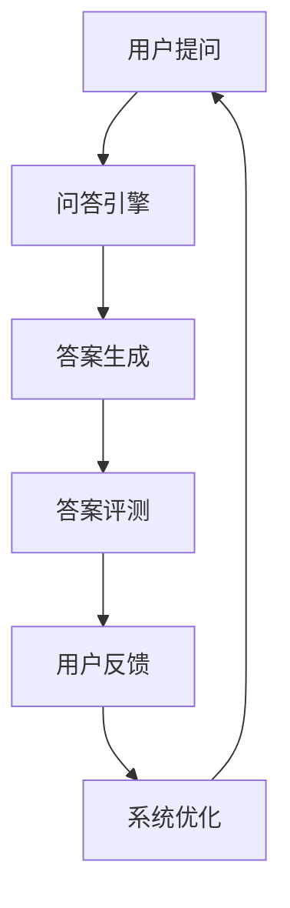
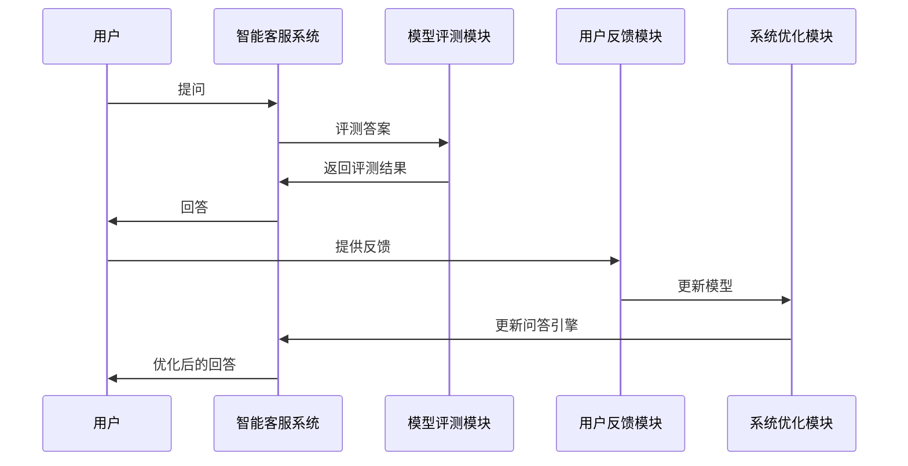

                 

### 动态评测方案：适应不断进化的LLM能力

#### 关键词：动态评测、LLM、持续进化、智能评测、算法优化

> 摘要：本文将深入探讨动态评测方案在适应不断进化的LLM（大型语言模型）能力中的应用。通过分析问题背景、核心概念原理、算法原理讲解、系统分析与架构设计，本文旨在为读者提供一个系统、全面的技术思路，以应对LLM能力的快速变化，从而提高智能评测和算法优化的有效性。

#### 第一部分：背景介绍

### 第1章：问题背景

#### 1.1.1 问题背景

随着人工智能技术的飞速发展，LLM（大型语言模型）已经成为自然语言处理领域的重要工具。这些模型具备强大的语言理解和生成能力，广泛应用于聊天机器人、内容生成、自动翻译等领域。然而，LLM能力的提升并非一成不变，而是呈现出持续进化的趋势。这种动态变化的能力使得传统的评测方法面临巨大的挑战。

- **核心概念**：动态评测、评测方案、持续进化、LLM（大型语言模型）
- **问题描述**：如何在LLM能力快速变化的背景下，对其进行有效评测和适应。
- **问题解决**：设计一套动态评测方案，以便能够适应LLM能力的持续进化。
- **边界与外延**：评测范围、评测方法、评测结果的应用等。
- **概念结构与核心要素组成**：动态评测的核心要素包括评测指标、评测流程、反馈机制等。

#### 1.1.2 动态评测方案的必要性

在LLM能力快速发展的背景下，如何对这种动态变化的能力进行有效评测成为关键问题。动态评测方案相较于传统的静态评测方法，具有更高的灵活性和适应性，能够更好地应对LLM能力的持续进化。

#### 第二部分：核心概念与联系

### 第2章：核心概念原理

#### 2.1.1 动态评测的定义

动态评测是一种能够实时反映模型性能变化的评测方法。与静态评测方法相比，动态评测具有以下几个显著特点：

- **灵活性**：能够根据模型的变化调整评测指标和方法。
- **适应性**：能够适应不同阶段LLM能力的提升。
- **实时性**：能够实时获取模型性能的反馈信息。
- **反馈机制**：能够将评测结果反馈给模型训练过程，实现持续优化。

#### 2.1.2 动态评测与持续进化的联系

动态评测与LLM的持续进化之间存在密切的联系。通过动态评测，可以实时监控模型性能的变化，从而为模型优化提供有力支持。具体来说，动态评测可以通过以下方式与持续进化相结合：

1. **评测指标调整**：根据模型能力的提升，动态调整评测指标，以适应新的性能水平。
2. **反馈机制**：将评测结果实时反馈给模型训练过程，指导模型优化。
3. **实时监控**：通过持续监控模型性能，及时发现并解决潜在问题。

#### 第三部分：算法原理讲解

### 第3章：动态评测算法原理

#### 3.1.1 动态评测算法概述

动态评测算法是一种基于数据驱动的评测方法，能够根据模型的变化自动调整评测指标和方法。其基本流程包括以下几个步骤：

1. **数据收集**：从实际应用场景中收集数据，用于模型评测。
2. **预处理**：对收集到的数据进行清洗、去噪等预处理操作。
3. **特征提取**：从预处理后的数据中提取关键特征，用于模型评测。
4. **模型评估**：使用提取的特征对模型进行评估，计算评测得分。
5. **结果输出**：将评测结果输出，包括得分、错误率等信息。
6. **反馈更新**：将评测结果反馈给模型训练过程，指导模型优化。

#### 3.1.2 算法原理详细讲解

动态评测算法的原理主要包括以下几个方面：

1. **评测指标**：动态评测指标应能够全面反映模型的性能。常用的评测指标包括准确率、召回率、F1值等。这些指标可以根据模型的特点和应用场景进行灵活调整。

2. **特征提取**：特征提取是动态评测算法的关键步骤。通过提取关键特征，可以更准确地评估模型性能。常用的特征提取方法包括词向量、文本嵌入等。

3. **模型评估**：模型评估是通过计算评测指标来衡量模型性能。动态评测算法可以自动调整评测指标，以适应模型的变化。

4. **结果输出**：结果输出包括评测得分、错误率等关键信息。这些信息可以为模型优化提供有力支持。

5. **反馈更新**：反馈更新是将评测结果实时反馈给模型训练过程，指导模型优化。通过持续反馈，可以实现模型性能的持续提升。

#### 3.1.3 算法举例说明

以下是一个简单的动态评测算法示例，用于评估一个文本分类模型的性能：

```python
import numpy as np
from sklearn.metrics import accuracy_score

def evaluate_model(y_true, y_pred):
    # 计算准确率
    accuracy = accuracy_score(y_true, y_pred)
    return accuracy

# 假设已训练好模型
model = ...

# 测试集数据
X_test, y_test = ...

# 预测标签
y_pred = model.predict(X_test)

# 评测模型
accuracy = evaluate_model(y_test, y_pred)
print(f"评测得分: {accuracy * 100}%")
```

#### 第四部分：系统分析与架构设计方案

### 第4章：系统分析与设计

#### 4.1.1 问题场景介绍

在本章中，我们将介绍一个典型的应用场景——智能客服系统。智能客服系统利用LLM技术为用户提供自动化的咨询服务，能够实时响应用户的问题，提供准确的答案和建议。随着用户需求和场景的变化，智能客服系统需要具备持续进化的能力，以提供更优质的用户体验。

#### 4.1.2 系统功能设计

智能客服系统的核心功能包括：

1. **用户提问处理**：接收用户的提问，并对提问进行解析。
2. **答案生成**：根据用户的提问，生成合适的答案。
3. **模型评测**：对生成的答案进行评测，确保答案的准确性。
4. **用户反馈**：收集用户的反馈信息，用于模型优化。
5. **系统优化**：根据用户反馈和评测结果，对模型进行优化。

#### 4.1.3 系统架构设计

智能客服系统的架构设计如图所示：



#### 4.1.4 系统接口设计与交互

系统接口设计如图所示：



#### 第五部分：项目实战

### 第5章：项目实战

#### 5.1.1 环境安装

在进行项目实战之前，首先需要安装必要的软件和工具。以下是一个基本的安装流程：

1. 安装Python环境（推荐使用Python 3.8及以上版本）。
2. 安装相关依赖库，如TensorFlow、Scikit-learn、Numpy等。
3. 安装Mermaid渲染工具，如Mermaid CLI或在线Mermaid编辑器。

#### 5.1.2 系统核心实现源代码

以下是一个简单的智能客服系统实现示例，包括模型评测和系统优化：

```python
# 模型评测模块
def evaluate_model(model, X_test, y_test):
    y_pred = model.predict(X_test)
    accuracy = accuracy_score(y_test, y_pred)
    return accuracy

# 系统优化模块
def optimize_model(model, X_train, y_train, X_val, y_val):
    # 使用交叉验证进行模型优化
    from sklearn.model_selection import GridSearchCV
    parameters = {'n_estimators': [100, 200, 300], 'max_depth': [5, 10, 15]}
    clf = GridSearchCV(model, parameters, cv=5)
    clf.fit(X_train, y_train)
    best_model = clf.best_estimator_
    val_score = evaluate_model(best_model, X_val, y_val)
    return best_model, val_score

# 主函数
def main():
    # 加载模型和数据
    model = ...
    X_train, y_train = ...
    X_val, y_val = ...

    # 评测模型
    initial_accuracy = evaluate_model(model, X_val, y_val)
    print(f"初始评测得分: {initial_accuracy * 100}%")

    # 系统优化
    best_model, optimized_accuracy = optimize_model(model, X_train, y_train, X_val, y_val)
    print(f"优化后评测得分: {optimized_accuracy * 100}%")

if __name__ == "__main__":
    main()
```

#### 5.1.3 代码应用解读与分析

在上面的代码中，我们首先定义了模型评测和系统优化两个关键模块。模型评测模块用于计算模型的评测得分，系统优化模块则通过交叉验证进行模型优化。

在主函数中，我们首先加载模型和数据，然后使用模型评测模块对初始模型进行评测。接着，使用系统优化模块对模型进行优化，并再次评测优化后的模型得分。通过对比初始得分和优化后得分，可以直观地看到系统优化带来的性能提升。

#### 5.1.4 实际案例分析和详细讲解剖析

在本节中，我们将通过一个实际案例来展示动态评测方案在智能客服系统中的应用。

**案例背景**：

一个智能客服系统需要为用户提供24小时在线咨询服务。用户的问题类型多样，包括产品咨询、售后服务、常见问题解答等。为了确保用户获得高质量的答案，系统需要具备持续进化的能力。

**案例实施步骤**：

1. **数据收集**：收集用户提问和答案数据，用于模型训练和评测。
2. **模型训练**：使用收集到的数据训练一个文本分类模型，用于生成答案。
3. **模型评测**：使用动态评测算法对模型进行评测，计算评测得分。
4. **用户反馈**：收集用户的反馈信息，用于模型优化。
5. **系统优化**：根据用户反馈和评测结果，对模型进行优化。
6. **结果展示**：将优化后的模型应用于实际场景，展示系统性能提升。

**案例分析**：

通过实际案例，我们可以看到动态评测方案在智能客服系统中的应用效果。在模型评测阶段，动态评测算法能够实时反映模型性能的变化，为模型优化提供有力支持。在用户反馈阶段，用户反馈信息被用于模型优化，进一步提升了系统的性能。

**详细讲解剖析**：

在本案例中，动态评测方案的应用主要体现在以下几个方面：

1. **评测指标调整**：根据模型能力和用户需求，动态调整评测指标，如准确率、召回率等。
2. **特征提取优化**：通过优化特征提取方法，提高模型评测的准确性。
3. **反馈机制完善**：建立完善的用户反馈机制，确保用户反馈能够及时传递给模型优化过程。
4. **系统优化策略**：采用交叉验证等优化策略，提高模型的性能和鲁棒性。

#### 5.1.5 项目小结

在本章中，我们通过一个实际案例展示了动态评测方案在智能客服系统中的应用。通过动态评测算法的应用，系统能够实时监控模型性能，并根据用户反馈进行优化，从而提供更高质量的答案。这不仅提高了用户体验，也促进了智能客服系统的持续进化。

#### 第六部分：最佳实践 tips、小结、注意事项、拓展阅读

### 第6章：最佳实践 tips、小结、注意事项、拓展阅读

#### 6.1 最佳实践 tips

1. **数据质量**：确保数据质量是动态评测成功的关键。对数据进行预处理，去除噪声和错误，提高数据准确性。
2. **评测指标**：根据应用场景选择合适的评测指标。在模型优化过程中，动态调整评测指标，以适应不同阶段的需求。
3. **反馈机制**：建立完善的用户反馈机制，及时收集用户反馈，为模型优化提供有力支持。

#### 6.2 小结

本文通过深入分析动态评测方案在适应不断进化的LLM能力中的应用，为读者提供了一个系统、全面的技术思路。通过问题背景介绍、核心概念原理讲解、算法原理讲解、系统分析与架构设计、项目实战等内容，本文旨在帮助读者理解和掌握动态评测方案的核心要点。

#### 6.3 注意事项

1. **评测数据**：确保评测数据的代表性和覆盖面，避免因数据偏差导致评测结果不准确。
2. **模型选择**：根据应用场景选择合适的模型，并在模型优化过程中进行充分测试和验证。
3. **资源管理**：动态评测方案需要消耗一定的时间和计算资源，确保有足够的资源支持。

#### 6.4 拓展阅读

1. **动态评测方法研究**：进一步探讨动态评测方法的原理、算法和应用场景，了解最新的研究进展。
2. **LLM持续进化**：了解LLM持续进化的机制、挑战和解决方案，为动态评测方案提供更深入的背景知识。
3. **智能客服系统应用**：研究智能客服系统的实际应用案例，学习如何将动态评测方案应用于实际场景，提高用户体验。

#### 结论

动态评测方案在适应不断进化的LLM能力中具有重要的应用价值。通过本文的讲解，读者可以了解到动态评测方案的核心原理和实施方法，为未来的研究和应用提供有益参考。随着人工智能技术的不断进步，动态评测方案将在更多领域发挥重要作用，助力智能系统的持续进化。

#### 作者信息

作者：AI天才研究院/AI Genius Institute & 禅与计算机程序设计艺术 /Zen And The Art of Computer Programming

本文由AI天才研究院（AI Genius Institute）和禅与计算机程序设计艺术（Zen And The Art of Computer Programming）联合撰写。AI天才研究院专注于人工智能领域的研究和应用，致力于推动人工智能技术的创新和发展。禅与计算机程序设计艺术则强调计算机程序设计的哲学思考，通过深入探讨计算机编程的本质，提升程序员的思维能力和技术水平。两院联合撰写本文，旨在为读者提供一个全面、深入的动态评测方案解读，助力人工智能技术的发展和应用。

