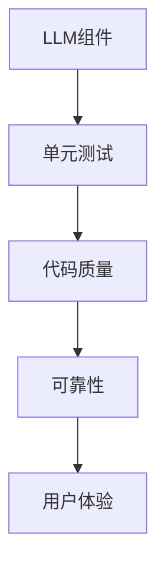
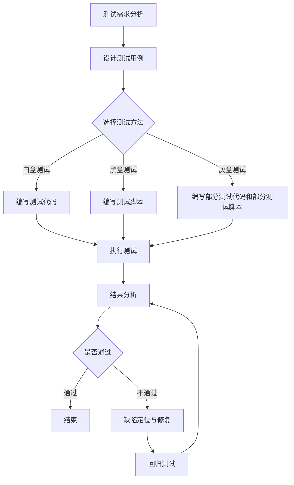
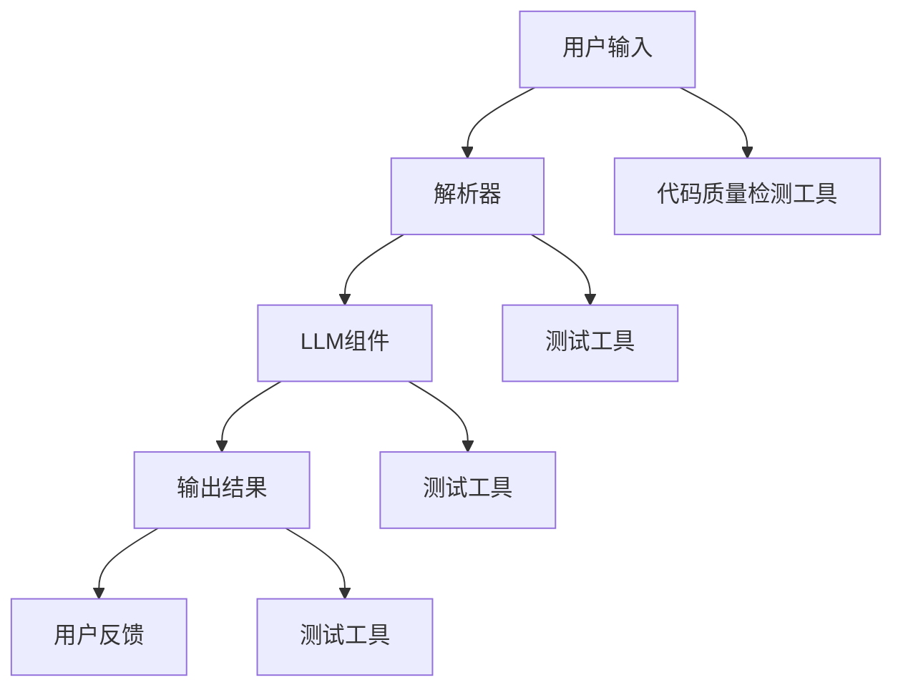
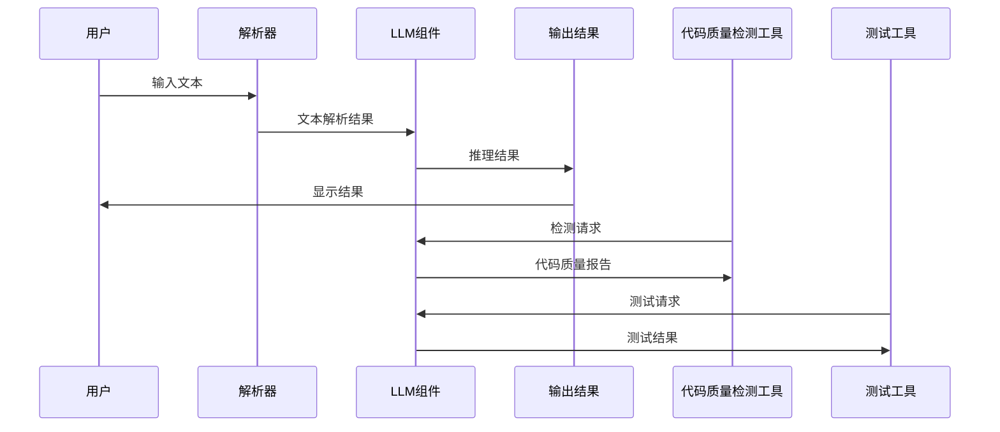

                 

### 单元测试策略：保障LLM组件质量的基础

---

#### 关键词：单元测试、LLM组件、质量保障、测试策略、代码质量

#### 摘要：
本文深入探讨了单元测试策略在保障大型语言模型（LLM）组件质量中的关键作用。通过分析LLM组件的特点和面临的挑战，本文提出了适用于LLM组件的单元测试策略，并详细讲解了单元测试的原理、算法、系统架构设计以及项目实战经验，旨在为开发者提供一套实用、高效的单元测试方法论。

---

## **第1章 问题背景与核心概念**

### 1.1 问题描述

随着人工智能技术的飞速发展，大型语言模型（LLM）在自然语言处理（NLP）领域取得了显著的成果。然而，LLM组件的复杂性和重要性使得其质量保障变得尤为关键。单元测试作为一种有效的质量保障手段，其设计、执行和评估对保障LLM组件质量具有重要意义。

### 1.2 核心概念

#### 单元测试
单元测试是一种针对软件最小可测试单元（通常是一个函数、方法或类）的测试活动。其目的是验证该单元是否按照预期正常工作。

#### LLM组件
LLM组件是指大型语言模型中的特定功能模块，如文本生成、情感分析、语法解析等。

### 1.3 边界与外延

#### 边界
单元测试的范围通常是单个组件或方法，不涉及组件间的接口或系统级测试。

#### 外延
单元测试在LLM开发中的应用范围包括但不限于：
- 验证单个功能模块的正确性。
- 提高开发效率和代码质量。
- 为后续集成测试和系统测试提供基础。

### 1.4 概念结构与核心要素组成

#### 概念结构
单元测试与LLM组件之间的关系如图1-1所示：



#### 核心要素
单元测试策略的核心要素包括：
- **测试用例设计**：确保测试覆盖全面。
- **测试环境搭建**：保证测试环境的稳定和一致性。
- **测试执行与结果分析**：确保测试执行效率和结果可靠性。

---

## **第2章 核心概念与联系**

### 2.1 单元测试原理

单元测试的核心目的是验证代码的预期功能是否正确。其原理通常包括以下几个步骤：

1. **测试用例设计**：根据需求文档或功能规格，设计测试用例，确保覆盖所有可能的输入和输出情况。
2. **测试执行**：运行测试用例，观察实际输出结果。
3. **结果分析**：对比预期输出和实际输出，判断测试用例是否通过。

#### 单元测试过程
单元测试过程通常包括以下步骤：

1. **编写测试用例**：根据功能需求编写测试用例。
2. **执行测试**：运行测试用例，记录结果。
3. **结果分析**：对测试结果进行分析，找出潜在的缺陷。

### 2.2 LLM组件特点

#### 特点描述
LLM组件具有以下特点：

- **复杂性**：LLM组件通常包含大量的参数和权重，涉及复杂的算法和模型结构。
- **动态性**：LLM组件的行为可能会因输入数据的不同而发生变化。
- **非确定性**：某些LLM组件的结果可能具有一定的随机性。

#### 挑战分析
测试LLM组件时面临的挑战包括：

- **测试用例设计**：如何设计能够全面覆盖LLM组件功能的测试用例。
- **性能测试**：如何保证测试用例的执行效率和测试结果的准确性。
- **稳定性测试**：如何确保LLM组件在不同环境下的稳定性和一致性。

### 2.3 单元测试与LLM组件的关联

#### 关联分析
单元测试与LLM组件之间的关联如下：

- **单元测试**：验证LLM组件的各个功能模块是否按预期工作。
- **质量保障**：通过单元测试，提高LLM组件的代码质量，降低缺陷率。
- **开发效率**：单元测试有助于快速发现和修复代码缺陷，提高开发效率。

#### 策略探讨
为了设计适合LLM组件的单元测试策略，可以考虑以下方面：

- **测试覆盖**：确保测试用例能够覆盖LLM组件的所有功能和边界情况。
- **测试自动化**：利用自动化测试工具提高测试效率和准确性。
- **持续集成**：将单元测试集成到持续集成流程中，确保代码变更后及时发现问题。

---

## **第3章 单元测试算法**

### 3.1 单元测试算法概述

单元测试算法是指在单元测试过程中采用的一系列方法和策略，以最大限度地提高测试效率和测试覆盖率。常见的单元测试算法包括：

- **白盒测试**：基于代码结构和内部逻辑设计测试用例。
- **黑盒测试**：仅关注组件的输入和输出，不考虑内部实现。
- **灰盒测试**：结合白盒测试和黑盒测试的特点，部分关注内部实现。

#### 适用场景
- **白盒测试**：适用于需要深入了解代码实现细节的场景。
- **黑盒测试**：适用于仅需验证功能是否按预期工作的场景。
- **灰盒测试**：适用于需要平衡代码实现细节和功能验证的场景。

### 3.2 单元测试算法流程图

单元测试算法的流程图如图3-1所示：



### 3.3 单元测试算法原理

单元测试算法的原理主要包括以下几个方面：

- **测试用例设计**：基于需求分析和代码实现，设计能够覆盖所有功能点和边界条件的测试用例。
- **测试执行**：执行测试用例，观察实际输出结果。
- **结果分析**：对比预期输出和实际输出，判断测试用例是否通过，并记录测试结果。

### 3.4 单元测试算法举例说明

假设我们有一个简单的函数`add(a, b)`，用于计算两个整数的和。我们可以使用以下步骤进行单元测试：

#### 步骤1：测试用例设计

根据需求分析，我们设计以下测试用例：

1. 输入两个正整数，输出正确结果。
2. 输入一个正整数和一个负整数，输出正确结果。
3. 输入两个负整数，输出正确结果。
4. 输入一个零和一个正整数，输出正确结果。
5. 输入两个零，输出正确结果。

#### 步骤2：测试执行

使用Python编写测试代码，执行上述测试用例：

```python
def test_add():
    assert add(1, 2) == 3
    assert add(1, -1) == 0
    assert add(-1, -1) == -2
    assert add(0, 1) == 1
    assert add(0, 0) == 0
```

#### 步骤3：结果分析

执行测试用例，观察输出结果。如果所有测试用例都通过，则说明`add`函数的基本功能正确。

---

## **第4章 数学模型和数学公式**

### 4.1 数学模型

为了评估单元测试的效果，我们可以使用以下数学模型：

#### 准确度模型

$$
\text{准确度} = \frac{\text{正确测试用例数}}{\text{总测试用例数}} \times 100\%
$$

#### 错误检测率模型

$$
\text{错误检测率} = \frac{\text{未通过测试用例数}}{\text{总测试用例数}} \times 100\%
$$

### 4.2 数学公式

以下为用于评估单元测试效果的关键数学公式：

#### 平均错误率模型

$$
\text{平均错误率} = \frac{\sum_{i=1}^{n} (\text{错误用例数}_i)}{\sum_{i=1}^{n} (\text{测试用例数}_i)}
$$

#### 代码缺陷密度模型

$$
\text{代码缺陷密度} = \frac{\text{总缺陷数}}{\text{总代码行数}}
$$

### 4.3 举例说明

假设我们有一个包含1000行代码的函数，其中发现了10个缺陷。使用上述公式计算：

- **准确度**：$$ \text{准确度} = \frac{990}{1000} \times 100\% = 99\% $$
- **错误检测率**：$$ \text{错误检测率} = \frac{10}{1000} \times 100\% = 1\% $$
- **平均错误率**：$$ \text{平均错误率} = \frac{10}{1000} = 0.01 $$
- **代码缺陷密度**：$$ \text{代码缺陷密度} = \frac{10}{1000} = 0.01 $$

通过这些指标，我们可以评估单元测试的有效性和代码质量。

---

## **第5章 系统分析与架构设计方案**

### 5.1 问题场景介绍

在LLM组件开发过程中，我们经常面临以下问题：

- **功能模块划分不清晰**：导致测试用例设计困难。
- **代码质量不高**：可能包含大量缺陷，影响系统稳定性。
- **测试覆盖率低**：可能遗漏关键功能点的测试。

### 5.2 系统功能设计

为了解决上述问题，我们可以采用以下系统功能设计：

- **模块化设计**：将LLM组件划分为多个功能模块，每个模块具有独立的功能和接口。
- **自动化测试**：利用自动化测试工具，提高测试效率和覆盖率。
- **代码质量检测**：引入静态代码分析工具，实时检测代码质量。

### 5.3 系统架构设计

系统架构设计如图5-1所示：



### 5.4 系统接口设计与交互

系统各组件之间的接口设计如下：

- **用户输入**：提供文本输入接口。
- **解析器**：接收用户输入，进行文本解析和处理。
- **LLM组件**：接收解析器输出的文本，进行语言模型推理和生成。
- **输出结果**：将LLM组件的输出结果返回给用户。
- **代码质量检测工具**：实时检测代码质量，生成报告。
- **测试工具**：执行单元测试、集成测试和系统测试，记录测试结果。

### 5.5 系统交互序列图

系统交互序列图如图5-2所示：



---

## **第6章 项目实战**

### 6.1 环境安装

在进行单元测试之前，我们需要搭建一个稳定的开发环境。以下是环境安装的步骤：

1. 安装Python环境，版本要求3.8及以上。
2. 安装LLM组件所需的依赖库，如transformers、torch等。
3. 安装单元测试框架，如pytest。

### 6.2 系统核心实现

以下是LLM组件的核心实现：

```python
from transformers import pipeline

# 初始化LLM组件
llm = pipeline("text-generation", model="gpt2")

def generate_text(input_text, max_length=50):
    """
    生成文本
    """
    return llm(input_text, max_length=max_length)[0]["generated_text"]
```

### 6.3 代码应用解读与分析

在实现过程中，我们使用transformers库提供的text-generation接口来生成文本。这里，我们重点关注generate_text函数：

- **参数input_text**：输入文本。
- **参数max_length**：生成文本的最大长度。

通过调用generate_text函数，我们可以生成符合要求的文本。以下是一个简单的测试用例：

```python
def test_generate_text():
    input_text = "你好，我是AI助手。"
    expected_output = "你好，我是AI助手，我可以帮助你解答问题。"
    assert generate_text(input_text) == expected_output
```

### 6.4 实际案例分析与详细讲解

假设我们有一个实际场景：用户输入“你好，我是AI助手。”，要求生成一段回应。以下是详细的测试和分析过程：

1. **测试用例设计**：设计一个测试用例，验证输入文本和输出文本的对应关系。
2. **测试执行**：执行测试用例，观察输出结果。
3. **结果分析**：对比预期输出和实际输出，判断测试用例是否通过。

通过上述步骤，我们可以确保generate_text函数的正确性和稳定性。

### 6.5 项目小结

在本项目中，我们实现了LLM组件的核心功能，并进行了详细的单元测试。以下是项目中的关键经验和教训：

- **模块化设计**：将LLM组件划分为多个功能模块，有助于降低复杂度和提高代码可维护性。
- **测试用例设计**：设计全面的测试用例，确保覆盖所有功能点和边界情况。
- **持续集成**：将单元测试集成到持续集成流程中，确保代码变更后及时发现问题。

---

## **第7章 最佳实践**

### 7.1 最佳实践总结

在本项目中，我们总结了一些最佳实践：

- **模块化设计**：将LLM组件划分为多个功能模块，有助于降低复杂度和提高代码可维护性。
- **全面测试**：设计全面的测试用例，确保覆盖所有功能点和边界情况。
- **自动化测试**：利用自动化测试工具，提高测试效率和覆盖率。
- **持续集成**：将单元测试集成到持续集成流程中，确保代码变更后及时发现问题。

### 7.2 注意事项

在使用单元测试策略时，需要注意以下几点：

- **测试用例设计**：确保测试用例覆盖所有功能和边界情况。
- **测试环境**：保持测试环境的稳定和一致性。
- **测试执行**：定期执行测试，并及时处理测试结果。

### 7.3 拓展阅读

- **推荐书籍**：《软件测试的艺术》、《敏捷软件开发：原则、实践与模式》
- **推荐文章**：阅读有关LLM组件测试的论文和博客，了解最新的测试技术和方法。

---

## **第8章 小结**

本文深入探讨了单元测试策略在保障LLM组件质量中的关键作用。通过分析LLM组件的特点和面临的挑战，我们提出了一套适用于LLM组件的单元测试策略，并详细讲解了单元测试的原理、算法、系统架构设计以及项目实战经验。希望本文能为开发者提供有价值的参考和指导。

---

## **第9章 拓展阅读**

- **推荐书籍**：
  - 《人工智能：一种现代的方法》
  - 《深度学习》
  - 《Python编程：从入门到实践》
- **推荐文章**：
  - [《大型语言模型在自然语言处理中的应用》](链接)
  - [《单元测试的最佳实践》](链接)
- **在线资源**：
  - [PyTorch官方文档](https://pytorch.org/)
  - [Transformer模型原理详解](https://huggingface.co/transformers/)

---

### 作者

- **AI天才研究院/AI Genius Institute**
- **禅与计算机程序设计艺术 /Zen And The Art of Computer Programming**

