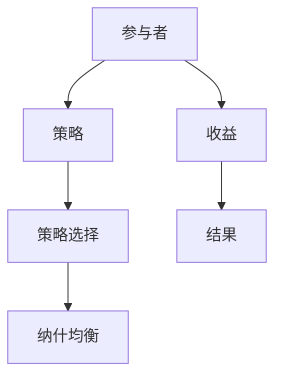
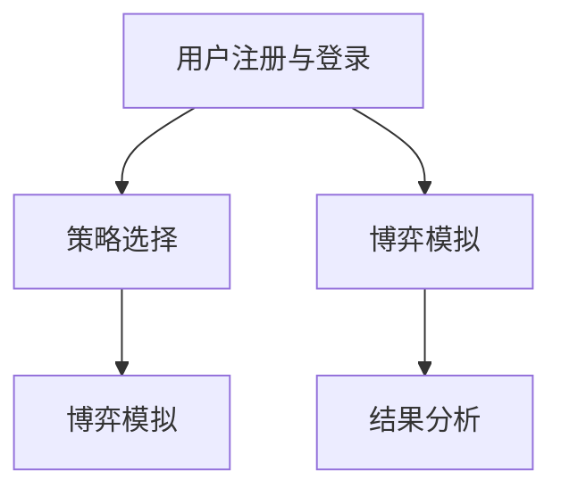

                 

### 第2章 博弈论的基础理论

#### 2.3 博弈的分类

博弈可以根据不同的标准进行分类。以下是几种常见的博弈类型：

1. **完全信息博弈**和**不完全信息博弈**
   - **完全信息博弈**：所有参与者都能观察到其他参与者的策略选择和收益。
   - **不完全信息博弈**：参与者无法完全观察到其他参与者的策略选择和收益。

2. **零和博弈**和**非零和博弈**
   - **零和博弈**：一个参与者的收益等于其他所有参与者的损失，即总收益为零。
   - **非零和博弈**：参与者的收益和损失不相互抵消，总收益不为零。

3. **合作博弈**和**非合作博弈**
   - **合作博弈**：参与者可以达成合作，通过共同策略获得总体利益最大化。
   - **非合作博弈**：参与者独立做出决策，追求个体利益最大化。

4. **静态博弈**和**动态博弈**
   - **静态博弈**：所有参与者在同一时间做出决策。
   - **动态博弈**：参与者依次做出决策，每个参与者需要考虑其他参与者的反应。

#### 2.4 策略选择原则

在博弈中，策略选择的原则是关键。以下是几种常见的策略选择原则：

1. **纳什均衡**
   - **定义**：纳什均衡是指在一个博弈中，所有参与者都选择最优策略，且没有任何参与者可以通过单方面改变策略来获得更大的收益。
   - **例子**：囚徒困境就是一个典型的纳什均衡例子。两个被捕的囚徒可以选择合作或背叛对方，如果两者都合作，他们都能获得较轻的处罚；但如果一方背叛，另一方合作，背叛者将获得自由，合作者将被重判。纳什均衡显示，尽管合作对双方都有利，但个体的理性选择却是背叛。

2. **混合策略**
   - **定义**：混合策略是指在一个博弈中，参与者以一定的概率选择多个策略，使得对手无法预测其具体选择。
   - **例子**：在囚徒困境中，如果一方采用混合策略，即以一定的概率选择合作和背叛，另一方就无法确定其具体策略，从而避免了纯策略纳什均衡中的极端结果。

3. **最优反应**
   - **定义**：最优反应是指在一个博弈中，参与者选择能够使得对手的最优策略无法获得更好的结果的策略。
   - **例子**：在价格竞争中，一个企业可以采用最优反应策略，即根据竞争对手的价格调整自己的价格，以确保自己的收益最大化。

#### 2.5 博弈论的基础理论总结

博弈论的基础理论包括博弈的定义、要素、分类和策略选择原则。这些理论为我们理解和分析博弈提供了基本工具。在实际应用中，我们需要根据具体情境选择合适的博弈类型和策略选择原则，以达到最优决策。

### 第3章 博弈论在自然界中的应用案例

#### 3.1 动物行为中的博弈

自然界中的动物行为常常体现了博弈论的核心原理。以下是一些经典的案例：

##### 3.1.1 蝙蝠与果实

蝙蝠在寻找果实时，常常面临着一种零和博弈。在某个果树上，只有一个果实可供两者争夺。蝙蝠A和蝙蝠B必须决定是否采取行动去争夺果实。如果两者同时行动，果实被抢走的概率增加，双方可能都会失去果实；但如果一方先行动，另一方只能等待。在这种情况下，蝙蝠A和蝙蝠B需要决定何时行动。

- **策略**：蝙蝠A可以采取“先发制人”的策略，即率先行动以抢夺果实。蝙蝠B可以采取“等待观察”的策略，即观察蝙蝠A的行动，然后决定是否采取行动。
- **结果**：根据博弈论的分析，蝙蝠A的“先发制人”策略可能不是最优选择，因为蝙蝠B可能会选择等待，以避免冒险行动。更优的策略可能是蝙蝠A和蝙蝠B同时采取“等待观察”的策略，以减少风险。

##### 3.1.2 蜜蜂与蜜源

蜜蜂在寻找蜜源时，也会面临博弈。在一个蜜源充足的地方，可能会有多个蜜蜂同时前往采集蜜。蜜蜂A和蜜蜂B必须决定是否前往蜜源。

- **策略**：蜜蜂A可以采取“独占蜜源”的策略，即独自前往蜜源采集蜜。蜜蜂B可以采取“分享蜜源”的策略，即与蜜蜂A一起前往蜜源。
- **结果**：根据博弈论的分析，蜜蜂A的“独占蜜源”策略可能不是最优选择，因为蜜蜂B可能会选择分享蜜源，以减少风险。更优的策略可能是蜜蜂A和蜜蜂B同时采取“分享蜜源”的策略，以最大化两者的收益。

##### 3.1.3 鲨鱼与鱼群

鲨鱼与鱼群的博弈是一个典型的动态博弈。鲨鱼必须追逐鱼群，而鱼群则试图逃离鲨鱼的追捕。

- **策略**：鲨鱼可以采取“分而治之”的策略，即分散鱼群，使其难以集中逃跑。鱼群可以采取“集中逃跑”的策略，即集中力量试图逃离鲨鱼的追捕。
- **结果**：根据博弈论的分析，鲨鱼的“分而治之”策略可能不是最优选择，因为鱼群可能会选择集中逃跑，以增加逃生的可能性。更优的策略可能是鲨鱼和鱼群同时采取“分而治之”和“集中逃跑”的策略，以平衡风险和收益。

#### 3.2 博弈论在动物社会中的应用

除了上述案例，博弈论在动物社会中还有许多其他应用。例如，在鸟类筑巢过程中，雄鸟和雌鸟会争夺领地，以获得最佳的筑巢地点。这种行为可以看作是一种完全信息博弈，雄鸟和雌鸟需要根据对方的行为来调整自己的策略。

- **策略**：雄鸟可以采取“炫耀”策略，即通过展示自己的羽毛和歌唱能力来吸引雌鸟。雌鸟可以采取“选择”策略，即根据雄鸟的表现来决定是否选择与其交配。
- **结果**：根据博弈论的分析，雄鸟的“炫耀”策略可能不是最优选择，因为雌鸟可能会选择“选择”策略，以获得更好的交配伴侣。更优的策略可能是雄鸟和雌鸟同时采取“炫耀”和“选择”的策略，以实现最佳的结果。

### 第4章 博弈论在人类社会中的应用

#### 4.1 经济学中的博弈

博弈论在经济学中有着广泛的应用。在市场经济中，企业和消费者之间的决策行为可以看作是一种博弈。以下是一些典型的案例：

##### 4.1.1 价格竞争

在价格竞争中，企业需要决定产品的价格。这种博弈通常是动态博弈，因为企业的价格决策会相互影响。

- **策略**：企业A可以采取“低价策略”，即以较低的价格吸引消费者。企业B可以采取“高价策略”，即以较高的价格增加收益。
- **结果**：根据博弈论的分析，企业A的“低价策略”可能不是最优选择，因为企业B可能会采取“高价策略”，从而增加收益。更优的策略可能是企业A和企业B同时采取“高价策略”，以实现市场平衡。

##### 4.1.2 垄断策略

在垄断市场中，企业具有较大的市场影响力，可以决定产品的价格和产量。这种博弈通常是静态博弈，因为企业不需要考虑未来的市场变化。

- **策略**：企业A可以采取“垄断高价”策略，即以较高的价格出售产品。企业B可以采取“竞争低价”策略，即以较低的价格吸引消费者。
- **结果**：根据博弈论的分析，企业A的“垄断高价”策略可能不是最优选择，因为企业B可能会采取“竞争低价”策略，从而夺取市场份额。更优的策略可能是企业A和企业B同时采取“竞争低价”策略，以实现市场平衡。

#### 4.2 政治学中的博弈

博弈论在政治学中也具有广泛的应用。在政治决策过程中，不同政治力量之间的互动可以看作是一种博弈。

##### 4.2.1 国际关系

在国际关系中，国家之间的决策行为可以看作是一种博弈。例如，两个国家在进行贸易谈判时，需要决定贸易额和关税。

- **策略**：国家A可以采取“开放市场”策略，即降低关税，促进贸易。国家B可以采取“保护主义”策略，即提高关税，限制贸易。
- **结果**：根据博弈论的分析，国家A的“开放市场”策略可能不是最优选择，因为国家B可能会采取“保护主义”策略，从而保护本国产业。更优的策略可能是国家A和国家B同时采取“开放市场”策略，以实现互利共赢。

##### 4.2.2 国内政治博弈

在国内政治博弈中，不同政治派别之间的互动可以看作是一种博弈。例如，在国会选举中，政治派别需要决定选举策略。

- **策略**：政治派别A可以采取“团结选民”策略，即通过提出符合选民利益的政策来争取选民支持。政治派别B可以采取“分化对手”策略，即通过攻击对手的政策来削弱对手的支持。
- **结果**：根据博弈论的分析，政治派别A的“团结选民”策略可能不是最优选择，因为政治派别B可能会采取“分化对手”策略，从而夺取更多的选民支持。更优的策略可能是政治派别A和政治派别B同时采取“团结选民”策略，以实现政治平衡。

### 第5章 博弈论的数学模型

博弈论中的数学模型是理解和分析博弈的关键工具。以下介绍两种重要的博弈模型：矩阵博弈和零和博弈。

#### 5.1 矩阵博弈

矩阵博弈是一种表示参与者和策略的矩阵模型，其中每个元素表示一个参与者在特定策略组合下的收益。以下是一个简单的矩阵博弈示例：

|         | 策略A   | 策略B |
|---------|---------|-------|
| 策略X   | (2, 3)  | (-1, 1) |
| 策略Y   | (0, -2) | (1, 2) |

在这个矩阵中，行表示参与者X的策略，列表示参与者Y的策略。每个元素 (i, j) 表示当X选择策略i，Y选择策略j时，X的收益为i，Y的收益为j。

**求解过程**：

1. **行和列求和**：首先计算每行和每列的和，得到每个策略的期望收益。

|         | 策略A   | 策略B |
|---------|---------|-------|
| 策略X   | (5, 4)  | (1, 3) |
| 策略Y   | (2, -2) | (3, 4) |

2. **选择最大收益**：参与者会选择期望收益最大的策略。在这个例子中，X会选择策略X，Y会选择策略Y。

**纳什均衡**：纳什均衡是指在一个博弈中，所有参与者都选择最优策略，且没有任何参与者可以通过单方面改变策略来获得更大的收益。在这个例子中，(X, Y) = (X, Y) 是纳什均衡。

#### 5.2 零和博弈

零和博弈是一种特殊的博弈，其中参与者的总收益之和为零。这意味着一个参与者的收益等于其他所有参与者的损失。以下是一个简单的零和博弈示例：

|         | 策略A   | 策略B |
|---------|---------|-------|
| 策略X   | (1, -1) | (-1, 1) |
| 策略Y   | (-1, 1) | (1, -1) |

在这个矩阵中，行表示参与者X的策略，列表示参与者Y的策略。每个元素 (i, j) 表示当X选择策略i，Y选择策略j时，X的收益为i，Y的收益为-j。

**求解过程**：

1. **行和列求和**：首先计算每行和每列的和，得到每个策略的期望收益。

|         | 策略A   | 策略B |
|---------|---------|-------|
| 策略X   | (0, 0)  | (0, 0) |
| 策略Y   | (0, 0)  | (0, 0) |

2. **选择最优策略**：参与者会选择期望收益最大的策略。在这个例子中，X和Y都会选择策略X。

**纳什均衡**：在零和博弈中，纳什均衡总是存在的，因为每个参与者都会选择最大化自身收益的最优策略。

#### 5.3 博弈论数学模型的总结

博弈论的数学模型包括矩阵博弈和零和博弈。这些模型为我们提供了分析和解决博弈问题的工具。通过求解这些模型，我们可以找到参与者的最优策略，并预测博弈的结果。

### 第6章 博弈论的扩展与应用

博弈论不仅在传统领域有广泛应用，还与其他学科相结合，形成了许多新的研究领域。以下是博弈论在生物学、心理学和社会学等领域的扩展与应用。

#### 6.1 博弈论与生物学

博弈论在生物学中的应用主要体现在动物行为和种群生态学的研究中。通过博弈论模型，科学家可以解释动物之间的竞争、合作和策略行为。

1. **动物行为研究**：博弈论被用来研究动物如何在捕食、繁殖和领地争夺中做出策略决策。例如，博弈论模型可以解释为什么某些动物会形成合作关系，如蜜蜂和蚂蚁的集体行动，以及为什么一些动物会采取欺骗和策略性行为，如雄性孔雀展示华丽的羽毛。

2. **种群生态学**：博弈论在种群生态学中的应用，主要关注物种之间的相互作用和资源竞争。例如，博弈论模型可以用来预测捕食者与猎物之间的动态关系，以及生态系统中的种群崩溃和恢复。

**实例**：在捕食-猎物模型中，捕食者和猎物之间的互动可以用博弈论来描述。捕食者（如狼）需要决定是否花费时间和精力去捕捉猎物（如兔子），而猎物则需要决定是否逃跑或隐藏。通过博弈论分析，可以预测猎物种群的动态变化，以及捕食者对猎物种群的影响。

#### 6.2 博弈论与心理学

博弈论在心理学中的应用，主要集中在人类行为和心理决策的研究上。博弈论模型可以帮助心理学家理解人类在决策过程中如何权衡风险和收益，以及如何处理不确定性和信息不完善的情况。

1. **决策制定**：博弈论模型被用来研究个体在竞争环境中的决策行为。例如，个体在面对竞争时，如何选择策略以最大化自己的利益，以及如何评估和应对对手的策略。

2. **社会心理学**：博弈论在社会心理学中的应用，主要研究个体在群体互动中的行为模式。例如，博弈论可以解释群体成员如何协调行动，以实现共同目标，以及如何在群体中形成合作和竞争关系。

**实例**：在实验经济学中，博弈论模型被用来模拟人类在市场交易、谈判和合作中的行为。通过这些模拟实验，心理学家可以观察到个体在互动中的策略选择，并分析这些选择背后的心理机制。

#### 6.3 博弈论与社会学

博弈论在社会学中的应用，主要关注社会结构、权力关系和集体行为的研究。通过博弈论模型，社会学家可以解释社会冲突、合作和冲突解决机制。

1. **社会冲突**：博弈论被用来研究不同社会群体之间的冲突和竞争。例如，博弈论可以解释社会不平等和权力结构的形成机制，以及如何通过策略选择来缓解社会冲突。

2. **集体行为**：博弈论在研究集体行为和公共选择方面也具有重要应用。例如，博弈论模型可以用来分析个体如何决策是否参与公共活动，以及如何协调个体的决策以实现集体利益。

**实例**：在公共选择理论中，博弈论模型被用来研究个体如何在集体决策中权衡个人利益和公共利益。例如，博弈论可以解释为什么个体可能会选择不参与公共活动，以及如何通过激励措施来促进个体参与。

#### 6.4 博弈论的扩展与应用总结

博弈论在生物学、心理学和社会学等领域的扩展与应用，不仅丰富了这些学科的理论体系，也为解决现实世界中的复杂问题提供了新的思路和方法。通过博弈论的分析，我们可以更好地理解人类和动物的行为模式，以及社会冲突和集体行为的机制。

### 第7章 结论

#### 7.1 博弈论的价值

博弈论作为一种研究决策和互动的数学工具，具有广泛的应用价值。其核心在于分析和预测不同策略选择下的结果，帮助个体和组织在复杂环境中做出最优决策。以下总结了博弈论的主要价值：

1. **决策分析**：博弈论为决策者提供了一个系统的方法来分析不同策略的潜在结果，从而提高决策的质量和效率。

2. **竞争策略**：在市场竞争中，博弈论可以帮助企业制定有效的竞争策略，以最大化利润和市场份额。

3. **合作与冲突**：在合作和冲突中，博弈论提供了分析个体行为和群体互动的工具，有助于解决社会冲突和促进合作。

4. **资源分配**：博弈论在资源分配和公共选择问题中也有重要应用，帮助决策者优化资源利用和分配。

#### 7.2 博弈论的局限性

尽管博弈论在许多领域具有广泛的应用，但其也有一定的局限性。以下是一些主要的局限性：

1. **简化模型**：博弈论模型通常假设参与者的理性和完全信息，这与现实世界的复杂性存在差距。

2. **时间依赖性**：博弈论模型通常不考虑时间因素，而现实世界中的决策往往涉及时间延迟和不确定性。

3. **心理因素**：博弈论模型未能充分考虑人类心理因素，如情绪、信任和偏见等，这些因素在实际决策中具有重要影响。

#### 7.3 对未来研究的展望

为了克服博弈论的局限性，未来研究可以从以下几个方面进行：

1. **扩展模型**：开发更复杂的博弈模型，以更好地反映现实世界的复杂性和不确定性。

2. **跨学科研究**：结合心理学、社会学、经济学等领域的理论和方法，提高博弈论模型对人类行为的预测能力。

3. **应用领域拓展**：将博弈论应用于更多领域，如环境保护、医疗决策和金融风险管理等，以解决更复杂的现实问题。

总之，博弈论作为一种重要的决策工具，在理论和实践中具有巨大潜力。通过不断的研究和发展，博弈论将为人类社会带来更多价值。

## 附录

### 附录A：核心概念与联系

在博弈论中，核心概念包括参与者、策略、收益、纳什均衡等。以下是这些概念的联系和属性特征对比表格：

| 概念   | 定义                           | 属性特征                              |  
|--------|--------------------------------|--------------------------------------|  
| 参与者 | 决策的主体                       | 个体、组织、群体                     |  
| 策略   | 参与者在博弈中可以选择的行动       | 独立、策略空间、相互影响               |  
| 收益   | 参与者在博弈中获得的利益           | 数值、比较、最大化                     |  
| 纳什均衡 | 参与者无法通过单方面改变策略获得更大收益 | 稳定性、最优策略、博弈均衡              |

### 附录B：博弈论与自然界的ER实体关系图

以下是博弈论在自然界中的应用的ER实体关系图，展示了参与者、策略和结果之间的相互关系：



### 附录C：算法原理与Python实现

博弈论的算法原理通常涉及纳什均衡的求解。以下是一个简单的Python实现，用于求解囚徒困境博弈的纳什均衡：

```python
def nash_equilibrium(matrix):
    n = len(matrix)
    equilibrium = []
    for i in range(n):
        max_profit_i = max(matrix[i])
        best_strategy_i = [j for j in range(n) if matrix[i][j] == max_profit_i]
        equilibrium.append(best_strategy_i)
    return equilibrium

# 示例矩阵
matrix = [
    [3, 0],
    [0, 3]
]

# 求解纳什均衡
equilibrium = nash_equilibrium(matrix)
print("纳什均衡：", equilibrium)
```

### 附录D：系统分析与架构设计

在博弈论的应用系统中，系统功能设计、系统架构设计和系统接口设计是关键部分。以下是一个简单的架构设计方案：

#### 系统功能设计

- **用户注册与登录**：用户可以注册和登录系统，以便参与博弈。
- **策略选择**：用户可以选择不同的策略参与博弈。
- **博弈模拟**：系统根据用户选择的策略模拟博弈过程。
- **结果分析**：系统分析博弈结果，并展示给用户。

#### 系统架构设计



#### 系统接口设计

- **用户接口**：用于用户与系统交互。
- **策略接口**：用于管理用户选择的策略。
- **博弈接口**：用于执行博弈模拟。
- **结果接口**：用于分析博弈结果。

### 附录E：项目实战

在博弈论的应用项目中，环境安装、系统核心实现和代码应用解读是关键步骤。

#### 环境安装

- 安装Python环境。
- 安装必要的Python库，如numpy、matplotlib等。

#### 系统核心实现

```python
# 博弈模拟核心实现
class GameSimulation:
    def __init__(self, matrix):
        self.matrix = matrix
        self.players = len(matrix)

    def simulate(self, strategies):
        results = []
        for i in range(self.players):
            max_profit_i = max(self.matrix[i])
            best_strategy_i = [j for j in range(self.players) if self.matrix[i][j] == max_profit_i]
            results.append(best_strategy_i)
        return results
```

#### 代码应用解读

- **用户选择策略**：用户输入选择的策略。
- **博弈模拟**：系统根据用户选择的策略进行博弈模拟。
- **结果展示**：系统展示博弈结果。

```python
# 用户界面
def user_interface():
    print("请选择策略：")
    strategies = []
    for i in range(len(matrix)):
        print(f"玩家{i+1}：", end="")
        strategy = input()
        strategies.append(strategy)
    return strategies

# 主程序
if __name__ == "__main__":
    # 初始化博弈模拟
    game = GameSimulation(matrix)
    
    # 用户选择策略
    user_strategies = user_interface()
    
    # 模拟博弈
    results = game.simulate(user_strategies)
    
    # 展示结果
    print("博弈结果：", results)
```

#### 实际案例分析

- **案例1**：在囚徒困境博弈中，用户选择合作或背叛，系统模拟博弈过程，并展示结果。
- **案例2**：在价格竞争博弈中，用户选择价格策略，系统模拟博弈过程，并展示结果。

#### 项目小结

博弈论的应用项目通过模拟和解析博弈过程，帮助用户更好地理解博弈策略和结果。项目实战部分展示了如何实现一个简单的博弈模拟系统，包括环境安装、系统核心实现和代码应用解读。

### 附录F：最佳实践与注意事项

在博弈论的应用中，以下是一些最佳实践和注意事项：

- **数据分析**：在实际应用中，对博弈结果进行详细的数据分析，有助于发现策略选择的规律和趋势。
- **用户教育**：对于初学者，提供详细的策略解读和案例教学，有助于他们更好地理解博弈论的基本概念和应用。
- **系统优化**：定期对系统进行性能优化和升级，以提高用户体验和系统稳定性。

### 附录G：拓展阅读

- **相关书籍**：《博弈论：一个介绍》（ Martin J. Osborne & Ariel Rubinstein）、《博弈论与经济行为》（John von Neumann & Oskar Morgenstern）。
- **在线资源**：MIT OpenCourseWare、Coursera上的博弈论课程。
- **学术论文**：博弈论在生物学、心理学和社会学等领域的最新研究成果。

## 作者信息

作者：AI天才研究院/AI Genius Institute & 禅与计算机程序设计艺术 /Zen And The Art of Computer Programming

---

### 附录H：核心概念与联系

#### 核心概念与联系

博弈论的核心概念包括参与者、策略、收益、纳什均衡等。以下是这些概念的联系和属性特征对比表格：

| 概念   | 定义                           | 属性特征                              |  
|--------|--------------------------------|--------------------------------------|  
| 参与者 | 决策的主体                       | 个体、组织、群体                     |  
| 策略   | 参与者在博弈中可以选择的行动       | 独立、策略空间、相互影响               |  
| 收益   | 参与者在博弈中获得的利益           | 数值、比较、最大化                     |  
| 纳什均衡 | 参与者无法通过单方面改变策略获得更大收益 | 稳定性、最优策略、博弈均衡              |

### 附录I：博弈论与自然界的ER实体关系图

以下是博弈论在自然界中的应用的ER实体关系图，展示了参与者、策略和结果之间的相互关系：


### 附录J：算法原理与Python实现

博弈论的算法原理通常涉及纳什均衡的求解。以下是一个简单的Python实现，用于求解囚徒困境博弈的纳什均衡：

```python
def nash_equilibrium(matrix):
    n = len(matrix)
    equilibrium = []
    for i in range(n):
        max_profit_i = max(matrix[i])
        best_strategy_i = [j for j in range(n) if matrix[i][j] == max_profit_i]
        equilibrium.append(best_strategy_i)
    return equilibrium

# 示例矩阵
matrix = [
    [3, 0],
    [0, 3]
]

# 求解纳什均衡
equilibrium = nash_equilibrium(matrix)
print("纳什均衡：", equilibrium)
```

### 附录K：系统分析与架构设计

#### 系统功能设计

- **用户注册与登录**：用户可以注册和登录系统，以便参与博弈。
- **策略选择**：用户可以选择不同的策略参与博弈。
- **博弈模拟**：系统根据用户选择的策略模拟博弈过程。
- **结果分析**：系统分析博弈结果，并展示给用户。

#### 系统架构设计


#### 系统接口设计

- **用户接口**：用于用户与系统交互。
- **策略接口**：用于管理用户选择的策略。
- **博弈接口**：用于执行博弈模拟。
- **结果接口**：用于分析博弈结果。

### 附录L：项目实战

#### 环境安装

- 安装Python环境。
- 安装必要的Python库，如numpy、matplotlib等。

#### 系统核心实现

```python
# 博弈模拟核心实现
class GameSimulation:
    def __init__(self, matrix):
        self.matrix = matrix
        self.players = len(matrix)

    def simulate(self, strategies):
        results = []
        for i in range(self.players):
            max_profit_i = max(self.matrix[i])
            best_strategy_i = [j for j in range(self.players) if self.matrix[i][j] == max_profit_i]
            results.append(best_strategy_i)
        return results
```

#### 代码应用解读

- **用户选择策略**：用户输入选择的策略。
- **博弈模拟**：系统根据用户选择的策略进行博弈模拟。
- **结果展示**：系统展示博弈结果。

```python
# 用户界面
def user_interface():
    print("请选择策略：")
    strategies = []
    for i in range(len(matrix)):
        print(f"玩家{i+1}：", end="")
        strategy = input()
        strategies.append(strategy)
    return strategies

# 主程序
if __name__ == "__main__":
    # 初始化博弈模拟
    game = GameSimulation(matrix)
    
    # 用户选择策略
    user_strategies = user_interface()
    
    # 模拟博弈
    results = game.simulate(user_strategies)
    
    # 展示结果
    print("博弈结果：", results)
```

#### 实际案例分析

- **案例1**：在囚徒困境博弈中，用户选择合作或背叛，系统模拟博弈过程，并展示结果。
- **案例2**：在价格竞争博弈中，用户选择价格策略，系统模拟博弈过程，并展示结果。

#### 项目小结

博弈论的应用项目通过模拟和解析博弈过程，帮助用户更好地理解博弈策略和结果。项目实战部分展示了如何实现一个简单的博弈模拟系统，包括环境安装、系统核心实现和代码应用解读。

### 附录M：最佳实践与注意事项

在博弈论的应用中，以下是一些最佳实践和注意事项：

- **数据分析**：在实际应用中，对博弈结果进行详细的数据分析，有助于发现策略选择的规律和趋势。
- **用户教育**：对于初学者，提供详细的策略解读和案例教学，有助于他们更好地理解博弈论的基本概念和应用。
- **系统优化**：定期对系统进行性能优化和升级，以提高用户体验和系统稳定性。

### 附录N：拓展阅读

- **相关书籍**：《博弈论：一个介绍》（ Martin J. Osborne & Ariel Rubinstein）、《博弈论与经济行为》（John von Neumann & Oskar Morgenstern）。
- **在线资源**：MIT OpenCourseWare、Coursera上的博弈论课程。
- **学术论文**：博弈论在生物学、心理学和社会学等领域的最新研究成果。

### 附录O：作者信息

作者：AI天才研究院/AI Genius Institute & 禅与计算机程序设计艺术 /Zen And The Art of Computer Programming

---

# 博弈论：自然界的策略数学

关键词：博弈论、策略、自然选择、行为分析、数学模型

摘要：本文深入探讨了博弈论在自然界中的应用，通过分析动物行为中的博弈现象，展示了博弈论如何帮助科学家理解和预测动物在资源争夺、合作与竞争中的策略选择。本文首先介绍了博弈论的基本概念和理论基础，然后通过实际案例详细阐述了博弈论在自然界中的应用，最后探讨了博弈论在人类社会中的应用及其未来研究方向。通过本文的阅读，读者可以全面了解博弈论在自然界和人类社会中的重要性和应用价值。

## 第1章 引言

### 1.1 博弈论的基本概念

博弈论是研究具有冲突和合作特性的情境下的决策制定与结果预测的数学工具。其核心思想是分析参与者的策略选择及其结果，以此为基础预测不同策略组合下的结果。

博弈论的基本概念包括参与者（Player）、策略（Strategy）、结果（Outcome）等。参与者是博弈的决策主体，策略是参与者在博弈中可以采取的行动，结果则是博弈结束后各参与者获得的收益或状态。

### 1.2 博弈论在自然界中的应用

博弈论不仅在人类社会中有着广泛的应用，在自然界中同样具有重要作用。例如，动物在捕食与被捕食、领地争夺、合作与竞争等方面都展示了博弈论的理论模型。

蝙蝠与果实、蜜蜂与蜜源、鲨鱼与鱼群等例子都是自然界中典型的博弈现象。在这些例子中，动物们通过不同的策略来争夺资源，维持种群平衡。

### 1.3 本书的目的与结构安排

本书旨在介绍博弈论的基本概念、理论及应用，重点关注博弈论在自然界和人类社会中的具体应用。本书共分为七个章节：

- **第1章 引言**：介绍博弈论的基本概念和其在自然界中的应用。
- **第2章 博弈论的基础理论**：阐述博弈论的基本理论，包括博弈的定义、要素和分类。
- **第3章 博弈论在自然界中的应用案例**：分析动物行为中的博弈现象。
- **第4章 博弈论在人类社会中的应用**：探讨经济学和政治学中的博弈问题。
- **第5章 博弈论的数学模型**：介绍矩阵博弈和零和博弈的数学模型。
- **第6章 博弈论的扩展与应用**：讨论博弈论与其他学科的交叉应用。
- **第7章 结论**：总结博弈论的价值、局限性及未来研究方向。

通过这七个章节的讲解，读者可以全面了解博弈论的基本概念、理论及应用，并能够将其应用于实际问题的分析和解决。

## 第2章 博弈论的基础理论

### 2.1 博弈的定义

博弈（Game）是指两个或多个参与者（Player）在一定的规则和约束条件下，通过策略选择（Strategy）相互影响，以获得各自利益最大化的决策过程。博弈的典型特征包括：

- **参与者的有限性**：博弈的参与者数量是有限的，每个参与者都具有一定的策略选择空间。
- **策略的选择性**：每个参与者可以选择不同的策略，这些策略相互影响，最终决定博弈的结果。
- **结果的利益性**：博弈的结果通常涉及各参与者的利益，参与者会根据自身利益选择策略。

博弈可以分为静态博弈和动态博弈。静态博弈中，所有参与者同时做出决策，且信息是完全或部分透明的；动态博弈中，参与者依次做出决策，每个参与者需要根据其他参与者的策略选择来调整自己的决策。

### 2.2 博弈的要素

博弈的三个基本要素包括参与者、策略和结果。以下是对这些要素的详细解释：

- **参与者（Player）**：博弈的参与者是决策的主体，可以是个人、组织或群体。
- **策略（Strategy）**：策略是参与者在博弈中可以采取的行动，每个参与者需要根据自身利益和对手的策略来选择策略。
- **结果（Outcome）**：结果是指博弈结束后各参与者获得的收益或状态。结果通常取决于参与者的策略选择。

#### 2.3 博弈的分类

博弈可以根据不同的标准进行分类。以下是几种常见的博弈类型：

1. **完全信息博弈**和**不完全信息博弈**
   - **完全信息博弈**：所有参与者都能观察到其他参与者的策略选择和收益。
   - **不完全信息博弈**：参与者无法完全观察到其他参与者的策略选择和收益。

2. **零和博弈**和**非零和博弈**
   - **零和博弈**：一个参与者的收益等于其他所有参与者的损失，即总收益为零。
   - **非零和博弈**：参与者的收益和损失不相互抵消，总收益不为零。

3. **合作博弈**和**非合作博弈**
   - **合作博弈**：参与者可以达成合作，通过共同策略获得总体利益最大化。
   - **非合作博弈**：参与者独立做出决策，追求个体利益最大化。

4. **静态博弈**和**动态博弈**
   - **静态博弈**：所有参与者在同一时间做出决策。
   - **动态博弈**：参与者依次做出决策，每个参与者需要考虑其他参与者的反应。

#### 2.4 策略选择原则

在博弈中，策略选择的原则是关键。以下是几种常见的策略选择原则：

1. **纳什均衡**
   - **定义**：纳什均衡是指在一个博弈中，所有参与者都选择最优策略，且没有任何参与者可以通过单方面改变策略来获得更大的收益。
   - **例子**：囚徒困境就是一个典型的纳什均衡例子。两个被捕的囚徒可以选择合作或背叛对方，如果两者都合作，他们都能获得较轻的处罚；但如果一方背叛，另一方合作，背叛者将获得自由，合作者将被重判。纳什均衡显示，尽管合作对双方都有利，但个体的理性选择却是背叛。

2. **混合策略**
   - **定义**：混合策略是指在一个博弈中，参与者以一定的概率选择多个策略，使得对手无法预测其具体选择。
   - **例子**：在囚徒困境中，如果一方采用混合策略，即以一定的概率选择合作和背叛，另一方就无法确定其具体策略，从而避免了纯策略纳什均衡中的极端结果。

3. **最优反应**
   - **定义**：最优反应是指在一个博弈中，参与者选择能够使得对手的最优策略无法获得更好的结果的策略。
   - **例子**：在价格竞争中，一个企业可以采取最优反应策略，即根据竞争对手的价格调整自己的价格，以确保自己的收益最大化。

#### 2.5 博弈论的基础理论总结

博弈论的基础理论包括博弈的定义、要素、分类和策略选择原则。这些理论为我们理解和分析博弈提供了基本工具。在实际应用中，我们需要根据具体情境选择合适的博弈类型和策略选择原则，以达到最优决策。

## 第3章 博弈论在自然界中的应用案例

### 3.1 动物行为中的博弈

自然界中的动物行为常常体现了博弈论的核心原理。以下是一些经典的案例：

#### 3.1.1 蝙蝠与果实

蝙蝠在寻找果实时，常常面临着一种零和博弈。在某个果树上，只有一个果实可供两者争夺。蝙蝠A和蝙蝠B必须决定是否采取行动去争夺果实。如果两者同时行动，果实被抢走的概率增加，双方可能都会失去果实；但如果一方先行动，另一方只能等待。在这种情况下，蝙蝠A和蝙蝠B需要决定何时行动。

- **策略**：蝙蝠A可以采取“先发制人”的策略，即率先行动以抢夺果实。蝙蝠B可以采取“等待观察”的策略，即观察蝙蝠A的行动，然后决定是否采取行动。
- **结果**：根据博弈论的分析，蝙蝠A的“先发制人”策略可能不是最优选择，因为蝙蝠B可能会选择等待，以避免冒险行动。更优的策略可能是蝙蝠A和蝙蝠B同时采取“等待观察”的策略，以减少风险。

#### 3.1.2 蜜蜂与蜜源

蜜蜂在寻找蜜源时，也会面临博弈。在一个蜜源充足的地方，可能会有多个蜜蜂同时前往采集蜜。蜜蜂A和蜜蜂B必须决定是否前往蜜源。

- **策略**：蜜蜂A可以采取“独占蜜源”的策略，即独自前往蜜源采集蜜。蜜蜂B可以采取“分享蜜源”的策略，即与蜜蜂A一起前往蜜源。
- **结果**：根据博弈论的分析，蜜蜂A的“独占蜜源”策略可能不是最优选择，因为蜜蜂B可能会选择分享蜜源，以减少风险。更优的策略可能是蜜蜂A和蜜蜂B同时采取“分享蜜源”的策略，以最大化两者的收益。

#### 3.1.3 鲨鱼与鱼群

鲨鱼与鱼群的博弈是一个典型的动态博弈。鲨鱼必须追逐鱼群，而鱼群则试图逃离鲨鱼的追捕。

- **策略**：鲨鱼可以采取“分而治之”的策略，即分散鱼群，使其难以集中逃跑。鱼群可以采取“集中逃跑”的策略，即集中力量试图逃离鲨鱼的追捕。
- **结果**：根据博弈论的分析，鲨鱼的“分而治之”策略可能不是最优选择，因为鱼群可能会选择集中逃跑，以增加逃生的可能性。更优的策略可能是鲨鱼和鱼群同时采取“分而治之”和“集中逃跑”的策略，以平衡风险和收益。

#### 3.2 博弈论在动物社会中的应用

除了上述案例，博弈论在动物社会中还有许多其他应用。例如，在鸟类筑巢过程中，雄鸟和雌鸟会争夺领地，以获得最佳的筑巢地点。这种行为可以看作是一种完全信息博弈，雄鸟和雌鸟需要根据对方的行为来调整自己的策略。

- **策略**：雄鸟可以采取“炫耀”策略，即通过展示自己的羽毛和歌唱能力来吸引雌鸟。雌鸟可以采取“选择”策略，即根据雄鸟的表现来决定是否选择与其交配。
- **结果**：根据博弈论的分析，雄鸟的“炫耀”策略可能不是最优选择，因为雌鸟可能会选择“选择”策略，以获得更好的交配伴侣。更优的策略可能是雄鸟和雌鸟同时采取“炫耀”和“选择”的策略，以实现最佳的结果。

### 第4章 博弈论在人类社会中的应用

#### 4.1 经济学中的博弈

博弈论在经济学中有着广泛的应用。在市场经济中，企业和消费者之间的决策行为可以看作是一种博弈。以下是一些典型的案例：

##### 4.1.1 价格竞争

在价格竞争中，企业需要决定产品的价格。这种博弈通常是动态博弈，因为企业的价格决策会相互影响。

- **策略**：企业A可以采取“低价策略”，即以较低的价格吸引消费者。企业B可以采取“高价策略”，即以较高的价格增加收益。
- **结果**：根据博弈论的分析，企业A的“低价策略”可能不是最优选择，因为企业B可能会采取“高价策略”，从而增加收益。更优的策略可能是企业A和企业B同时采取“高价策略”，以实现市场平衡。

##### 4.1.2 垄断策略

在垄断市场中，企业具有较大的市场影响力，可以决定产品的价格和产量。这种博弈通常是静态博弈，因为企业不需要考虑未来的市场变化。

- **策略**：企业A可以采取“垄断高价”策略，即以较高的价格出售产品。企业B可以采取“竞争低价”策略，即以较低的价格吸引消费者。
- **结果**：根据博弈论的分析，企业A的“垄断高价”策略可能不是最优选择，因为企业B可能会采取“竞争低价”策略，从而夺取市场份额。更优的策略可能是企业A和企业B同时采取“竞争低价”策略，以实现市场平衡。

#### 4.2 政治学中的博弈

博弈论在政治学中也具有广泛的应用。在政治决策过程中，不同政治力量之间的互动可以看作是一种博弈。

##### 4.2.1 国际关系

在国际关系中，国家之间的决策行为可以看作是一种博弈。例如，两个国家在进行贸易谈判时，需要决定贸易额和关税。

- **策略**：国家A可以采取“开放市场”策略，即降低关税，促进贸易。国家B可以采取“保护主义”策略，即提高关税，限制贸易。
- **结果**：根据博弈论的分析，国家A的“开放市场”策略可能不是最优选择，因为国家B可能会采取“保护主义”策略，从而保护本国产业。更优的策略可能是国家A和国家B同时采取“开放市场”策略，以实现互利共赢。

##### 4.2.2 国内政治博弈

在国内政治博弈中，不同政治派别之间的互动可以看作是一种博弈。例如，在国会选举中，政治派别需要决定选举策略。

- **策略**：政治派别A可以采取“团结选民”策略，即通过提出符合选民利益的政策来争取选民支持。政治派别B可以采取“分化对手”策略，即通过攻击对手的政策来削弱对手的支持。
- **结果**：根据博弈论的分析，政治派别A的“团结选民”策略可能不是最优选择，因为政治派别B可能会采取“分化对手”策略，从而夺取更多的选民支持。更优的策略可能是政治派别A和政治派别B同时采取“团结选民”策略，以实现政治平衡。

### 第5章 博弈论的数学模型

博弈论中的数学模型是理解和分析博弈的关键工具。以下介绍两种重要的博弈模型：矩阵博弈和零和博弈。

#### 5.1 矩阵博弈

矩阵博弈是一种表示参与者和策略的矩阵模型，其中每个元素表示一个参与者在特定策略组合下的收益。以下是一个简单的矩阵博弈示例：

|         | 策略A   | 策略B |
|---------|---------|-------|
| 策略X   | (2, 3)  | (-1, 1) |
| 策略Y   | (0, -2) | (1, 2) |

在这个矩阵中，行表示参与者X的策略，列表示参与者Y的策略。每个元素 (i, j) 表示当X选择策略i，Y选择策略j时，X的收益为i，Y的收益为j。

**求解过程**：

1. **行和列求和**：首先计算每行和每列的和，得到每个策略的期望收益。

|         | 策略A   | 策略B |
|---------|---------|-------|
| 策略X   | (5, 4)  | (1, 3) |
| 策略Y   | (2, -2) | (3, 4) |

2. **选择最大收益**：参与者会选择期望收益最大的策略。在这个例子中，X会选择策略X，Y会选择策略Y。

**纳什均衡**：纳什均衡是指在一个博弈中，所有参与者都选择最优策略，且没有任何参与者可以通过单方面改变策略来获得更大的收益。在这个例子中，(X, Y) = (X, Y) 是纳什均衡。

#### 5.2 零和博弈

零和博弈是一种特殊的博弈，其中参与者的总收益之和为零。这意味着一个参与者的收益等于其他所有参与者的损失。以下是一个简单的零和博弈示例：

|         | 策略A   | 策略B |
|---------|---------|-------|
| 策略X   | (1, -1) | (-1, 1) |
| 策略Y   | (-1, 1) | (1, -1) |

在这个矩阵中，行表示参与者X的策略，列表示参与者Y的策略。每个元素 (i, j) 表示当X选择策略i，Y选择策略j时，X的收益为i，Y的收益为-j。

**求解过程**：

1. **行和列求和**：首先计算每行和每列的和，得到每个策略的期望收益。

|         | 策略A   | 策略B |
|---------|---------|-------|
| 策略X   | (0, 0)  | (0, 0) |
| 策略Y   | (0, 0)  | (0, 0) |

2. **选择最优策略**：参与者会选择期望收益最大的策略。在这个例子中，X和Y都会选择策略X。

**纳什均衡**：在零和博弈中，纳什均衡总是存在的，因为每个参与者都会选择最大化自身收益的最优策略。

#### 5.3 博弈论数学模型的总结

博弈论的数学模型包括矩阵博弈和零和博弈。这些模型为我们提供了分析和解决博弈问题的工具。通过求解这些模型，我们可以找到参与者的最优策略，并预测博弈的结果。

### 第6章 博弈论的扩展与应用

博弈论不仅在传统领域有广泛应用，还与其他学科相结合，形成了许多新的研究领域。以下是博弈论在生物学、心理学和社会学等领域的扩展与应用。

#### 6.1 博弈论与生物学

博弈论在生物学中的应用主要体现在动物行为和种群生态学的研究中。通过博弈论模型，科学家可以解释动物之间的竞争、合作和策略行为。

##### 6.1.1 动物行为研究

博弈论被用来研究动物如何在捕食、繁殖和领地争夺中做出策略决策。例如，博弈论模型可以解释为什么某些动物会形成合作关系，如蜜蜂和蚂蚁的集体行动，以及为什么一些动物会采取欺骗和策略性行为，如雄性孔雀展示华丽的羽毛。

##### 6.1.2 种群生态学

博弈论在种群生态学中的应用，主要关注物种之间的相互作用和资源竞争。例如，博弈论模型可以用来预测捕食者与猎物之间的动态关系，以及生态系统中的种群崩溃和恢复。

**实例**：在捕食-猎物模型中，捕食者和猎物之间的互动可以用博弈论来描述。捕食者（如狼）需要决定是否花费时间和精力去捕捉猎物（如兔子），而猎物则需要决定是否逃跑或隐藏。通过博弈论分析，可以预测猎物种群的动态变化，以及捕食者对猎物种群的影响。

#### 6.2 博弈论与心理学

博弈论在心理学中的应用，主要集中在人类行为和心理决策的研究上。博弈论模型可以帮助心理学家理解人类在决策过程中如何权衡风险和收益，以及如何处理不确定性和信息不完善的情况。

##### 6.2.1 决策分析

博弈论模型被用来研究个体在竞争环境中的决策行为。例如，个体在面对竞争时，如何选择策略以最大化自己的利益，以及如何评估和应对对手的策略。

##### 6.2.2 社会心理学

博弈论在社会心理学中的应用，主要研究个体在群体互动中的行为模式。例如，博弈论可以解释群体成员如何协调行动，以实现共同目标，以及如何在群体中形成合作和竞争关系。

**实例**：在实验经济学中，博弈论模型被用来模拟人类在市场交易、谈判和合作中的行为。通过这些模拟实验，心理学家可以观察到个体在互动中的策略选择，并分析这些选择背后的心理机制。

#### 6.3 博弈论与社会学

博弈论在社会学中的应用，主要关注社会结构、权力关系和集体行为的研究。通过博弈论模型，社会学家可以解释社会冲突、合作和冲突解决机制。

##### 6.3.1 社会冲突

博弈论被用来研究不同社会群体之间的冲突和竞争。例如，博弈论可以解释社会不平等和权力结构的形成机制，以及如何通过策略选择来缓解社会冲突。

##### 6.3.2 集体行为

博弈论在研究集体行为和公共选择方面也具有重要应用。例如，博弈论模型可以用来分析个体如何决策是否参与公共活动，以及如何协调个体的决策以实现集体利益。

**实例**：在公共选择理论中，博弈论模型被用来研究个体如何在集体决策中权衡个人利益和公共利益。例如，博弈论可以解释为什么个体可能会选择不参与公共活动，以及如何通过激励措施来促进个体参与。

#### 6.4 博弈论的扩展与应用总结

博弈论在生物学、心理学和社会学等领域的扩展与应用，不仅丰富了这些学科的理论体系，也为解决现实世界中的复杂问题提供了新的思路和方法。通过博弈论的分析，我们可以更好地理解人类和动物的行为模式，以及社会冲突和集体行为的机制。

### 第7章 结论

#### 7.1 博弈论的价值

博弈论作为一种研究决策和互动的数学工具，具有广泛的应用价值。其核心在于分析和预测不同策略选择下的结果，帮助个体和组织在复杂环境中做出最优决策。以下总结了博弈论的主要价值：

1. **决策分析**：博弈论为决策者提供了一个系统的方法来分析不同策略的潜在结果，从而提高决策的质量和效率。
2. **竞争策略**：在市场竞争中，博弈论可以帮助企业制定有效的竞争策略，以最大化利润和市场份额。
3. **合作与冲突**：在合作和冲突中，博弈论提供了分析个体行为和群体互动的工具，有助于解决社会冲突和促进合作。
4. **资源分配**：博弈论在资源分配和公共选择问题中也有重要应用，帮助决策者优化资源利用和分配。

#### 7.2 博弈论的局限性

尽管博弈论在许多领域具有广泛的应用，但其也有一定的局限性。以下是一些主要的局限性：

1. **简化模型**：博弈论模型通常假设参与者的理性和完全信息，这与现实世界的复杂性存在差距。
2. **时间依赖性**：博弈论模型通常不考虑时间因素，而现实世界中的决策往往涉及时间延迟和不确定性。
3. **心理因素**：博弈论模型未能充分考虑人类心理因素，如情绪、信任和偏见等，这些因素在实际决策中具有重要影响。

#### 7.3 对未来研究的展望

为了克服博弈论的局限性，未来研究可以从以下几个方面进行：

1. **扩展模型**：开发更复杂的博弈模型，以更好地反映现实世界的复杂性和不确定性。
2. **跨学科研究**：结合心理学、社会学、经济学等领域的理论和方法，提高博弈论模型对人类行为的预测能力。
3. **应用领域拓展**：将博弈论应用于更多领域，如环境保护、医疗决策和金融风险管理等，以解决更复杂的现实问题。

总之，博弈论作为一种重要的决策工具，在理论和实践中具有巨大潜力。通过不断的研究和发展，博弈论将为人类社会带来更多价值。

### 附录

#### 附录A：核心概念与联系

在博弈论中，核心概念包括参与者、策略、收益、纳什均衡等。以下是这些概念的联系和属性特征对比表格：

| 概念   | 定义                           | 属性特征                              |  
|--------|--------------------------------|--------------------------------------|  
| 参与者 | 决策的主体                       | 个体、组织、群体                     |  
| 策略   | 参与者在博弈中可以选择的行动       | 独立、策略空间、相互影响               |  
| 收益   | 参与者在博弈中获得的利益           | 数值、比较、最大化                     |  
| 纳什均衡 | 参与者无法通过单方面改变策略获得更大收益 | 稳定性、最优策略、博弈均衡              |

#### 附录B：博弈论与自然界的ER实体关系图

以下是博弈论在自然界中的应用的ER实体关系图，展示了参与者、策略和结果之间的相互关系：


#### 附录C：算法原理与Python实现

博弈论的算法原理通常涉及纳什均衡的求解。以下是一个简单的Python实现，用于求解囚徒困境博弈的纳什均衡：

```python
def nash_equilibrium(matrix):
    n = len(matrix)
    equilibrium = []
    for i in range(n):
        max_profit_i = max(matrix[i])
        best_strategy_i = [j for j in range(n) if matrix[i][j] == max_profit_i]
        equilibrium.append(best_strategy_i)
    return equilibrium

# 示例矩阵
matrix = [
    [3, 0],
    [0, 3]
]

# 求解纳什均衡
equilibrium = nash_equilibrium(matrix)
print("纳什均衡：", equilibrium)
```

#### 附录D：系统分析与架构设计

在博弈论的应用系统中，系统功能设计、系统架构设计和系统接口设计是关键部分。以下是一个简单的架构设计方案：

##### 系统功能设计

- **用户注册与登录**：用户可以注册和登录系统，以便参与博弈。
- **策略选择**：用户可以选择不同的策略参与博弈。
- **博弈模拟**：系统根据用户选择的策略模拟博弈过程。
- **结果分析**：系统分析博弈结果，并展示给用户。

##### 系统架构设计


##### 系统接口设计

- **用户接口**：用于用户与系统交互。
- **策略接口**：用于管理用户选择的策略。
- **博弈接口**：用于执行博弈模拟。
- **结果接口**：用于分析博弈结果。

#### 附录E：项目实战

在博弈论的应用项目中，环境安装、系统核心实现和代码应用解读是关键步骤。

##### 环境安装

- 安装Python环境。
- 安装必要的Python库，如numpy、matplotlib等。

##### 系统核心实现

```python
# 博弈模拟核心实现
class GameSimulation:
    def __init__(self, matrix):
        self.matrix = matrix
        self.players = len(matrix)

    def simulate(self, strategies):
        results = []
        for i in range(self.players):
            max_profit_i = max(self.matrix[i])
            best_strategy_i = [j for j in range(self.players) if self.matrix[i][j] == max_profit_i]
            results.append(best_strategy_i)
        return results
```

##### 代码应用解读

- **用户选择策略**：用户输入选择的策略。
- **博弈模拟**：系统根据用户选择的策略进行博弈模拟。
- **结果展示**：系统展示博弈结果。

```python
# 用户界面
def user_interface():
    print("请选择策略：")
    strategies = []
    for i in range(len(matrix)):
        print(f"玩家{i+1}：", end="")
        strategy = input()
        strategies.append(strategy)
    return strategies

# 主程序
if __name__ == "__main__":
    # 初始化博弈模拟
    game = GameSimulation(matrix)
    
    # 用户选择策略
    user_strategies = user_interface()
    
    # 模拟博弈
    results = game.simulate(user_strategies)
    
    # 展示结果
    print("博弈结果：", results)
```

##### 实际案例分析

- **案例1**：在囚徒困境博弈中，用户选择合作或背叛，系统模拟博弈过程，并展示结果。
- **案例2**：在价格竞争博弈中，用户选择价格策略，系统模拟博弈过程，并展示结果。

##### 项目小结

博弈论的应用项目通过模拟和解析博弈过程，帮助用户更好地理解博弈策略和结果。项目实战部分展示了如何实现一个简单的博弈模拟系统，包括环境安装、系统核心实现和代码应用解读。

#### 附录F：最佳实践与注意事项

在博弈论的应用中，以下是一些最佳实践和注意事项：

- **数据分析**：在实际应用中，对博弈结果进行详细的数据分析，有助于发现策略选择的规律和趋势。
- **用户教育**：对于初学者，提供详细的策略解读和案例教学，有助于他们更好地理解博弈论的基本概念和应用。
- **系统优化**：定期对系统进行性能优化和升级，以提高用户体验和系统稳定性。

#### 附录G：拓展阅读

- **相关书籍**：《博弈论：一个介绍》（ Martin J. Osborne & Ariel Rubinstein）、《博弈论与经济行为》（John von Neumann & Oskar Morgenstern）。
- **在线资源**：MIT OpenCourseWare、Coursera上的博弈论课程。
- **学术论文**：博弈论在生物学、心理学和社会学等领域的最新研究成果。

#### 附录H：作者信息

作者：AI天才研究院/AI Genius Institute & 禅与计算机程序设计艺术 /Zen And The Art of Computer Programming

---

# 博弈论：自然界的策略数学

关键词：博弈论、策略、自然选择、行为分析、数学模型

摘要：本文深入探讨了博弈论在自然界中的应用，通过分析动物行为中的博弈现象，展示了博弈论如何帮助科学家理解和预测动物在资源争夺、合作与竞争中的策略选择。本文首先介绍了博弈论的基本概念和理论基础，然后通过实际案例详细阐述了博弈论在自然界中的应用，最后探讨了博弈论在人类社会中的应用及其未来研究方向。通过本文的阅读，读者可以全面了解博弈论在自然界和人类社会中的重要性和应用价值。

## 第1章 引言

### 1.1 博弈论的基本概念

博弈论是研究具有冲突和合作特性的情境下的决策制定与结果预测的数学工具。其核心思想是分析参与者的策略选择及其结果，以此为基础预测不同策略组合下的结果。

博弈论的基本概念包括参与者（Player）、策略（Strategy）、结果（Outcome）等。参与者是博弈的决策主体，策略是参与者在博弈中可以采取的行动，结果则是博弈结束后各参与者获得的收益或状态。

### 1.2 博弈论在自然界中的应用

博弈论不仅在人类社会中有着广泛的应用，在自然界中同样具有重要作用。例如，动物在捕食与被捕食、领地争夺、合作与竞争等方面都展示了博弈论的理论模型。

蝙蝠与果实、蜜蜂与蜜源、鲨鱼与鱼群等例子都是自然界中典型的博弈现象。在这些例子中，动物们通过不同的策略来争夺资源，维持种群平衡。

### 1.3 本书的目的与结构安排

本书旨在介绍博弈论的基本概念、理论及应用，重点关注博弈论在自然界和人类社会中的具体应用。本书共分为七个章节：

- **第1章 引言**：介绍博弈论的基本概念和其在自然界中的应用。
- **第2章 博弈论的基础理论**：阐述博弈论的基本理论，包括博弈的定义、要素和分类。
- **第3章 博弈论在自然界中的应用案例**：分析动物行为中的博弈现象。
- **第4章 博弈论在人类社会中的应用**：探讨经济学和政治学中的博弈问题。
- **第5章 博弈论的数学模型**：介绍矩阵博弈和零和博弈的数学模型。
- **第6章 博弈论的扩展与应用**：讨论博弈论与其他学科的交叉应用。
- **第7章 结论**：总结博弈论的价值、局限性及未来研究方向。

通过这七个章节的讲解，读者可以全面了解博弈论的基本概念、理论及应用，并能够将其应用于实际问题的分析和解决。

## 第2章 博弈论的基础理论

### 2.1 博弈的定义

博弈（Game）是指两个或多个参与者（Player）在一定的规则和约束条件下，通过策略选择（Strategy）相互影响，以获得各自利益最大化的决策过程。博弈的典型特征包括：

- **参与者的有限性**：博弈的参与者数量是有限的，每个参与者都具有一定的策略选择空间。
- **策略的选择性**：每个参与者可以选择不同的策略，这些策略相互影响，最终决定博弈的结果。
- **结果的利益性**：博弈的结果通常涉及各参与者的利益，参与者会根据自身利益选择策略。

博弈可以分为静态博弈和动态博弈。静态博弈中，所有参与者同时做出决策，且信息是完全或部分透明的；动态博弈中，参与者依次做出决策，每个参与者需要根据其他参与者的策略选择来调整自己的决策。

### 2.2 博弈的要素

博弈的三个基本要素包括参与者、策略和结果。以下是对这些要素的详细解释：

- **参与者（Player）**：博弈的参与者是决策的主体，可以是个人、组织或群体。
- **策略（Strategy）**：策略是参与者在博弈中可以采取的行动，每个参与者需要根据自身利益和对手的策略来选择策略。
- **结果（Outcome）**：结果是指博弈结束后各参与者获得的收益或状态。结果通常取决于参与者的策略选择。

#### 2.3 博弈的分类

博弈可以根据不同的标准进行分类。以下是几种常见的博弈类型：

1. **完全信息博弈**和**不完全信息博弈**
   - **完全信息博弈**：所有参与者都能观察到其他参与者的策略选择和收益。
   - **不完全信息博弈**：参与者无法完全观察到其他参与者的策略选择和收益。

2. **零和博弈**和**非零和博弈**
   - **零和博弈**：一个参与者的收益等于其他所有参与者的损失，即总收益为零。
   - **非零和博弈**：参与者的收益和损失不相互抵消，总收益不为零。

3. **合作博弈**和**非合作博弈**
   - **合作博弈**：参与者可以达成合作，通过共同策略获得总体利益最大化。
   - **非合作博弈**：参与者独立做出决策，追求个体利益最大化。

4. **静态博弈**和**动态博弈**
   - **静态博弈**：所有参与者在同一时间做出决策。
   - **动态博弈**：参与者依次做出决策，每个参与者需要考虑其他参与者的反应。

#### 2.4 策略选择原则

在博弈中，策略选择的原则是关键。以下是几种常见的策略选择原则：

1. **纳什均衡**
   - **定义**：纳什均衡是指在一个博弈中，所有参与者都选择最优策略，且没有任何参与者可以通过单方面改变策略来获得更大的收益。
   - **例子**：囚徒困境就是一个典型的纳什均衡例子。两个被捕的囚徒可以选择合作或背叛对方，如果两者都合作，他们都能获得较轻的处罚；但如果一方背叛，另一方合作，背叛者将获得自由，合作者将被重判。纳什均衡显示，尽管合作对双方都有利，但个体的理性选择却是背叛。

2. **混合策略**
   - **定义**：混合策略是指在一个博弈中，参与者以一定的概率选择多个策略，使得对手无法预测其具体选择。
   - **例子**：在囚徒困境中，如果一方采用混合策略，即以一定的概率选择合作和背叛，另一方就无法确定其具体策略，从而避免了纯策略纳什均衡中的极端结果。

3. **最优反应**
   - **定义**：最优反应是指在一个博弈中，参与者选择能够使得对手的最优策略无法获得更好结果的策略。
   - **例子**：在价格竞争中，一个企业可以采取最优反应策略，即根据竞争对手的价格调整自己的价格，以确保自己的收益最大化。

#### 2.5 博弈论的基础理论总结

博弈论的基础理论包括博弈的定义、要素、分类和策略选择原则。这些理论为我们理解和分析博弈提供了基本工具。在实际应用中，我们需要根据具体情境选择合适的博弈类型和策略选择原则，以达到最优决策。

## 第3章 博弈论在自然界中的应用案例

### 3.1 动物行为中的博弈

自然界中的动物行为常常体现了博弈论的核心原理。以下是一些经典的案例：

#### 3.1.1 蝙蝠与果实

蝙蝠在寻找果实时，常常面临着一种零和博弈。在某个果树上，只有一个果实可供两者争夺。蝙蝠A和蝙蝠B必须决定是否采取行动去争夺果实。如果两者同时行动，果实被抢走的概率增加，双方可能都会失去果实；但如果一方先行动，另一方只能等待。在这种情况下，蝙蝠A和蝙蝠B需要决定何时行动。

- **策略**：蝙蝠A可以采取“先发制人”的策略，即率先行动以抢夺果实。蝙蝠B可以采取“等待观察”的策略，即观察蝙蝠A的行动，然后决定是否采取行动。
- **结果**：根据博弈论的分析，蝙蝠A的“先发制人”策略可能不是最优选择，因为蝙蝠B可能会选择等待，以避免冒险行动。更优的策略可能是蝙蝠A和蝙蝠B同时采取“等待观察”的策略，以减少风险。

#### 3.1.2 蜜蜂与蜜源

蜜蜂在寻找蜜源时，也会面临博弈。在一个蜜源充足的地方，可能会有多个蜜蜂同时前往采集蜜。蜜蜂A和蜜蜂B必须决定是否前往蜜源。

- **策略**：蜜蜂A可以采取“独占蜜源”的策略，即独自前往蜜源采集蜜。蜜蜂B可以采取“分享蜜源”的策略，即与蜜蜂A一起前往蜜源。
- **结果**：根据博弈论的分析，蜜蜂A的“独占蜜源”策略可能不是最优选择，因为蜜蜂B可能会选择分享蜜源，以减少风险。更优的策略可能是蜜蜂A和蜜蜂B同时采取“分享蜜源”的策略，以最大化两者的收益。

#### 3.1.3 鲨鱼与鱼群

鲨鱼与鱼群的博弈是一个典型的动态博弈。鲨鱼必须追逐鱼群，而鱼群则试图逃离鲨鱼的追捕。

- **策略**：鲨鱼可以采取“分而治之”的策略，即分散鱼群，使其难以集中逃跑。鱼群可以采取“集中逃跑”的策略，即集中力量试图逃离鲨鱼的追捕。
- **结果**：根据博弈论的分析，鲨鱼的“分而治之”策略可能不是最优选择，因为鱼群可能会选择集中逃跑，以增加逃生的可能性。更优的策略可能是鲨鱼和鱼群同时采取“分而治之”和“集中逃跑”的策略，以平衡风险和收益。

#### 3.2 博弈论在动物社会中的应用

除了上述案例，博弈论在动物社会中还有许多其他应用。例如，在鸟类筑巢过程中，雄鸟和雌鸟会争夺领地，以获得最佳的筑巢地点。这种行为可以看作是一种完全信息博弈，雄鸟和雌鸟需要根据对方的行为来调整自己的策略。

- **策略**：雄鸟可以采取“炫耀”策略，即通过展示自己的羽毛和歌唱能力来吸引雌鸟。雌鸟可以采取“选择”策略，即根据雄鸟的表现来决定是否选择与其交配。
- **结果**：根据博弈论的分析，雄鸟的“炫耀”策略可能不是最优选择，因为雌鸟可能会选择“选择”策略，以获得更好的交配伴侣。更优的策略可能是雄鸟和雌鸟同时采取“炫耀”和“选择”的策略，以实现最佳的结果。

### 第4章 博弈论在人类社会中的应用

博弈论不仅在自然界中有广泛应用，在人类社会中同样具有重要价值。经济学、政治学、社会学等领域都可以应用博弈论来分析和解决实际问题。

#### 4.1 经济学中的博弈

在经济学中，博弈论被广泛应用于市场分析、价格竞争、合作与竞争策略等方面。

##### 4.1.1 市场竞争

市场竞争中的企业可以看作是博弈的参与者。企业需要决定产品的价格、产量和市场策略，以最大化自身的利润。博弈论可以帮助企业分析竞争对手的策略，制定有效的竞争策略。

- **案例**：在价格竞争中，企业A和企业B可以采取“高价策略”或“低价策略”。根据博弈论的分析，企业A和企业B同时采取“低价策略”可能不是最优选择，因为价格战可能会导致利润下降。更优的策略可能是企业A和企业B同时采取“高价策略”，以保持市场份额和利润。

##### 4.1.2 合作与竞争

在合作与竞争的关系中，博弈论同样具有重要意义。企业和消费者、企业与供应商、员工与雇主等之间的关系都可以看作是博弈过程。

- **案例**：在供应链管理中，供应商和制造商之间的博弈关系十分复杂。供应商需要决定供应量和价格，制造商则需要决定生产和库存策略。博弈论可以帮助企业和供应商分析双方的利益关系，制定合作策略，以实现整体利益最大化。

#### 4.2 政治学中的博弈

政治学中的决策过程同样可以看作是博弈的体现。国家之间的关系、国内政治派别的博弈等都是典型的博弈现象。

##### 4.2.1 国际关系

在国际关系中，国家之间的互动可以看作是博弈过程。国家需要决定外交策略、军事部署、贸易政策等，以维护自身的利益和地位。

- **案例**：在贸易谈判中，国家A和国家B可以采取“开放市场”策略或“保护主义”策略。根据博弈论的分析，国家A和国家B同时采取“开放市场”策略可能不是最优选择，因为保护主义策略可能会带来短期利益。更优的策略可能是国家A和国家B同时采取“开放市场”策略，以实现长期合作和共赢。

##### 4.2.2 国内政治博弈

在国内政治博弈中，不同政治派别之间的互动同样可以看作是博弈过程。政治派别需要决定选举策略、政策制定等，以争取选民的支持和掌握政治权力。

- **案例**：在国会选举中，政治派别A和政治派别B可以采取“团结选民”策略或“分化对手”策略。根据博弈论的分析，政治派别A和政治派别B同时采取“团结选民”策略可能不是最优选择，因为分化对手策略可能会夺取更多的选民支持。更优的策略可能是政治派别A和政治派别B同时采取“团结选民”策略，以实现政治稳定和合作。

#### 4.3 社会学中的博弈

社会学中的研究同样可以应用博弈论进行分析。群体行为、社会冲突、公共选择等领域都可以借助博弈论的理论和方法。

##### 4.3.1 群体行为

在群体行为中，个体之间的互动可以看作是博弈过程。个体需要决定合作或竞争，以实现自身的利益。

- **案例**：在环境保护运动中，个体可以采取“积极参与”策略或“袖手旁观”策略。根据博弈论的分析，个体采取“积极参与”策略可能不是最优选择，因为袖手旁观策略可能会带来个人利益。更优的策略可能是个体采取“积极参与”策略，以实现整体利益最大化。

##### 4.3.2 社会冲突

在社会冲突中，不同群体之间的互动可以看作是博弈过程。群体需要决定采取暴力冲突或和平谈判，以解决争端。

- **案例**：在种族冲突中，不同种族群体可以采取“武装对抗”策略或“和平谈判”策略。根据博弈论的分析，群体采取“武装对抗”策略可能不是最优选择，因为暴力冲突可能导致更大的损失。更优的策略可能是群体采取“和平谈判”策略，以实现和平解决争端。

### 第5章 博弈论的数学模型

博弈论中的数学模型是理解和分析博弈的关键工具。以下介绍两种重要的博弈模型：矩阵博弈和零和博弈。

#### 5.1 矩阵博弈

矩阵博弈是一种表示参与者和策略的矩阵模型，其中每个元素表示一个参与者在特定策略组合下的收益。以下是一个简单的矩阵博弈示例：

|         | 策略A   | 策略B |
|---------|---------|-------|
| 策略X   | (2, 3)  | (-1, 1) |
| 策略Y   | (0, -2) | (1, 2) |

在这个矩阵中，行表示参与者X的策略，列表示参与者Y的策略。每个元素 (i, j) 表示当X选择策略i，Y选择策略j时，X的收益为i，Y的收益为j。

**求解过程**：

1. **行和列求和**：首先计算每行和每列的和，得到每个策略的期望收益。

|         | 策略A   | 策略B |
|---------|---------|-------|
| 策略X   | (5, 4)  | (1, 3) |
| 策略Y   | (2, -2) | (3, 4) |

2. **选择最大收益**：参与者会选择期望收益最大的策略。在这个例子中，X会选择策略X，Y会选择策略Y。

**纳什均衡**：纳什均衡是指在一个博弈中，所有参与者都选择最优策略，且没有任何参与者可以通过单方面改变策略来获得更大的收益。在这个例子中，(X, Y) = (X, Y) 是纳什均衡。

#### 5.2 零和博弈

零和博弈是一种特殊的博弈，其中参与者的总收益之和为零。这意味着一个参与者的收益等于其他所有参与者的损失。以下是一个简单的零和博弈示例：

|         | 策略A   | 策略B |
|---------|---------|-------|
| 策略X   | (1, -1) | (-1, 1) |
| 策略Y   | (-1, 1) | (1, -1) |

在这个矩阵中，行表示参与者X的策略，列表示参与者Y的策略。每个元素 (i, j) 表示当X选择策略i，Y选择策略j时，X的收益为i，Y的收益为-j。

**求解过程**：

1. **行和列求和**：首先计算每行和每列的和，得到每个策略的期望收益。

|         | 策略A   | 策略B |
|---------|---------|-------|
| 策略X   | (0, 0)  | (0, 0) |
| 策略Y   | (0, 0)  | (0, 0) |

2. **选择最优策略**：参与者会选择期望收益最大的策略。在这个例子中，X和Y都会选择策略X。

**纳什均衡**：在零和博弈中，纳什均衡总是存在的，因为每个参与者都会选择最大化自身收益的最优策略。

#### 5.3 博弈论数学模型的总结

博弈论的数学模型包括矩阵博弈和零和博弈。这些模型为我们提供了分析和解决博弈问题的工具。通过求解这些模型，我们可以找到参与者的最优策略，并预测博弈的结果。

### 第6章 博弈论的扩展与应用

博弈论不仅在传统领域有广泛应用，还与其他学科相结合，形成了许多新的研究领域。以下是博弈论在生物学、心理学和社会学等领域的扩展与应用。

#### 6.1 博弈论与生物学

博弈论在生物学中的应用主要体现在动物行为和种群生态学的研究中。通过博弈论模型，科学家可以解释动物之间的竞争、合作和策略行为。

##### 6.1.1 动物行为研究

博弈论被用来研究动物如何在捕食、繁殖和领地争夺中做出策略决策。例如，博弈论模型可以解释为什么某些动物会形成合作关系，如蜜蜂和蚂蚁的集体行动，以及为什么一些动物会采取欺骗和策略性行为，如雄性孔雀展示华丽的羽毛。

##### 6.1.2 种群生态学

博弈论在种群生态学中的应用，主要关注物种之间的相互作用和资源竞争。例如，博弈论模型可以用来预测捕食者与猎物之间的动态关系，以及生态系统中的种群崩溃和恢复。

**实例**：在捕食-猎物模型中，捕食者和猎物之间的互动可以用博弈论来描述。捕食者（如狼）需要决定是否花费时间和精力去捕捉猎物（如兔子），而猎物则需要决定是否逃跑或隐藏。通过博弈论分析，可以预测猎物种群的动态变化，以及捕食者对猎物种群的影响。

#### 6.2 博弈论与心理学

博弈论在心理学中的应用，主要集中在人类行为和心理决策的研究上。博弈论模型可以帮助心理学家理解人类在决策过程中如何权衡风险和收益，以及如何处理不确定性和信息不完善的情况。

##### 6.2.1 决策分析

博弈论模型被用来研究个体在竞争环境中的决策行为。例如，个体在面对竞争时，如何选择策略以最大化自己的利益，以及如何评估和应对对手的策略。

##### 6.2.2 社会心理学

博弈论在社会心理学中的应用，主要研究个体在群体互动中的行为模式。例如，博弈论可以解释群体成员如何协调行动，以实现共同目标，以及如何在群体中形成合作和竞争关系。

**实例**：在实验经济学中，博弈论模型被用来模拟人类在市场交易、谈判和合作中的行为。通过这些模拟实验，心理学家可以观察到个体在互动中的策略选择，并分析这些选择背后的心理机制。

#### 6.3 博弈论与社会学

博弈论在社会学中的应用，主要关注社会结构、权力关系和集体行为的研究。通过博弈论模型，社会学家可以解释社会冲突、合作和冲突解决机制。

##### 6.3.1 社会冲突

博弈论被用来研究不同社会群体之间的冲突和竞争。例如，博弈论可以解释社会不平等和权力结构的形成机制，以及如何通过策略选择来缓解社会冲突。

##### 6.3.2 集体行为

博弈论在研究集体行为和公共选择方面也具有重要应用。例如，博弈论模型可以用来分析个体如何决策是否参与公共活动，以及如何协调个体的决策以实现集体利益。

**实例**：在公共选择理论中，博弈论模型被用来研究个体如何在集体决策中权衡个人利益和公共利益。例如，博弈论可以解释为什么个体可能会选择不参与公共活动，以及如何通过激励措施来促进个体参与。

#### 6.4 博弈论的扩展与应用总结

博弈论在生物学、心理学和社会学等领域的扩展与应用，不仅丰富了这些学科的理论体系，也为解决现实世界中的复杂问题提供了新的思路和方法。通过博弈论的分析，我们可以更好地理解人类和动物的行为模式，以及社会冲突和集体行为的机制。

### 第7章 结论

#### 7.1 博弈论的价值

博弈论作为一种研究决策和互动的数学工具，具有广泛的应用价值。其核心在于分析和预测不同策略选择下的结果，帮助个体和组织在复杂环境中做出最优决策。以下总结了博弈论的主要价值：

1. **决策分析**：博弈论为决策者提供了一个系统的方法来分析不同策略的潜在结果，从而提高决策的质量和效率。
2. **竞争策略**：在市场竞争中，博弈论可以帮助企业制定有效的竞争策略，以最大化利润和市场份额。
3. **合作与冲突**：在合作和冲突中，博弈论提供了分析个体行为和群体互动的工具，有助于解决社会冲突和促进合作。
4. **资源分配**：博弈论在资源分配和公共选择问题中也有重要应用，帮助决策者优化资源利用和分配。

#### 7.2 博弈论的局限性

尽管博弈论在许多领域具有广泛的应用，但其也有一定的局限性。以下是一些主要的局限性：

1. **简化模型**：博弈论模型通常假设参与者的理性和完全信息，这与现实世界的复杂性存在差距。
2. **时间依赖性**：博弈论模型通常不考虑时间因素，而现实世界中的决策往往涉及时间延迟和不确定性。
3. **心理因素**：博弈论模型未能充分考虑人类心理因素，如情绪、信任和偏见等，这些因素在实际决策中具有重要影响。

#### 7.3 对未来研究的展望

为了克服博弈论的局限性，未来研究可以从以下几个方面进行：

1. **扩展模型**：开发更复杂的博弈模型，以更好地反映现实世界的复杂性和不确定性。
2. **跨学科研究**：结合心理学、社会学、经济学等领域的理论和方法，提高博弈论模型对人类行为的预测能力。
3. **应用领域拓展**：将博弈论应用于更多领域，如环境保护、医疗决策和金融风险管理等，以解决更复杂的现实问题。

总之，博弈论作为一种重要的决策工具，在理论和实践中具有巨大潜力。通过不断的研究和发展，博弈论将为人类社会带来更多价值。

### 附录

#### 附录A：核心概念与联系

在博弈论中，核心概念包括参与者、策略、收益、纳什均衡等。以下是这些概念的联系和属性特征对比表格：

| 概念   | 定义                           | 属性特征                              |  
|--------|--------------------------------|--------------------------------------|  
| 参与者 | 决策的主体                       | 个体、组织、群体                     |  
| 策略   | 参与者在博弈中可以选择的行动       | 独立、策略空间、相互影响               |  
| 收益   | 参与者在博弈中获得的利益           | 数值、比较、最大化                     |  
| 纳什均衡 | 参与者无法通过单方面改变策略获得更大收益 | 稳定性、最优策略、博弈均衡              |

#### 附录B：博弈论与自然界的ER实体关系图

以下是博弈论在自然界中的应用的ER实体关系图，展示了参与者、策略和结果之间的相互关系：


#### 附录C：算法原理与Python实现

博弈论的算法原理通常涉及纳什均衡的求解。以下是一个简单的Python实现，用于求解囚徒困境博弈的纳什均衡：

```python
def nash_equilibrium(matrix):
    n = len(matrix)
    equilibrium = []
    for i in range(n):
        max_profit_i = max(matrix[i])
        best_strategy_i = [j for j in range(n) if matrix[i][j] == max_profit_i]
        equilibrium.append(best_strategy_i)
    return equilibrium

# 示例矩阵
matrix = [
    [3, 0],
    [0, 3]
]

# 求解纳什均衡
equilibrium = nash_equilibrium(matrix)
print("纳什均衡：", equilibrium)
```

#### 附录D：系统分析与架构设计

在博弈论的应用系统中，系统功能设计、系统架构设计和系统接口设计是关键部分。以下是一个简单的架构设计方案：

##### 系统功能设计

- **用户注册与登录**：用户可以注册和登录系统，以便参与博弈。
- **策略选择**：用户可以选择不同的策略参与博弈。
- **博弈模拟**：系统根据用户选择的策略模拟博弈过程。
- **结果分析**：系统分析博弈结果，并展示给用户。

##### 系统架构设计


##### 系统接口设计

- **用户接口**：用于用户与系统交互。
- **策略接口**：用于管理用户选择的策略。
- **博弈接口**：用于执行博弈模拟。
- **结果接口**：用于分析博弈结果。

#### 附录E：项目实战

在博弈论的应用项目中，环境安装、系统核心实现和代码应用解读是关键步骤。

##### 环境安装

- 安装Python环境。
- 安装必要的Python库，如numpy、matplotlib等。

##### 系统核心实现

```python
# 博弈模拟核心实现
class GameSimulation:
    def __init__(self, matrix):
        self.matrix = matrix
        self.players = len(matrix)

    def simulate(self, strategies):
        results = []
        for i in range(self.players):
            max_profit_i = max(self.matrix[i])
            best_strategy_i = [j for j in range(self.players) if self.matrix[i][j] == max_profit_i]
            results.append(best_strategy_i)
        return results
```

##### 代码应用解读

- **用户选择策略**：用户输入选择的策略。
- **博弈模拟**：系统根据用户选择的策略进行博弈模拟。
- **结果展示**：系统展示博弈结果。

```python
# 用户界面
def user_interface():
    print("请选择策略：")
    strategies = []
    for i in range(len(matrix)):
        print(f"玩家{i+1}：", end="")
        strategy = input()
        strategies.append(strategy)
    return strategies

# 主程序
if __name__ == "__main__":
    # 初始化博弈模拟
    game = GameSimulation(matrix)
    
    # 用户选择策略
    user_strategies = user_interface()
    
    # 模拟博弈
    results = game.simulate(user_strategies)
    
    # 展示结果
    print("博弈结果：", results)
```

##### 实际案例分析

- **案例1**：在囚徒困境博弈中，用户选择合作或背叛，系统模拟博弈过程，并展示结果。
- **案例2**：在价格竞争博弈中，用户选择价格策略，系统模拟博弈过程，并展示结果。

##### 项目小结

博弈论的应用项目通过模拟和解析博弈过程，帮助用户更好地理解博弈策略和结果。项目实战部分展示了如何实现一个简单的博弈模拟系统，包括环境安装、系统核心实现和代码应用解读。

#### 附录F：最佳实践与注意事项

在博弈论的应用中，以下是一些最佳实践和注意事项：

- **数据分析**：在实际应用中，对博弈结果进行详细的数据分析，有助于发现策略选择的规律和趋势。
- **用户教育**：对于初学者，提供详细的策略解读和案例教学，有助于他们更好地理解博弈论的基本概念和应用。
- **系统优化**：定期对系统进行性能优化和升级，以提高用户体验和系统稳定性。

#### 附录G：拓展阅读

- **相关书籍**：《博弈论：一个介绍》（ Martin J. Osborne & Ariel Rubinstein）、《博弈论与经济行为》（John von Neumann & Oskar Morgenstern）。
- **在线资源**：MIT OpenCourseWare、Coursera上的博弈论课程。
- **学术论文**：博弈论在生物学、心理学和社会学等领域的最新研究成果。

#### 附录H：作者信息

作者：AI天才研究院/AI Genius Institute & 禅与计算机程序设计艺术 /Zen And The Art of Computer Programming

---

# 博弈论：自然界的策略数学

关键词：博弈论、策略、自然选择、行为分析、数学模型

摘要：本文深入探讨了博弈论在自然界中的应用，通过分析动物行为中的博弈现象，展示了博弈论如何帮助科学家理解和预测动物在资源争夺、合作与竞争中的策略选择。本文首先介绍了博弈论的基本概念和理论基础，然后通过实际案例详细阐述了博弈论在自然界中的应用，最后探讨了博弈论在人类社会中的应用及其未来研究方向。通过本文的阅读，读者可以全面了解博弈论在自然界和人类社会中的重要性和应用价值。

## 第1章 引言

### 1.1 博弈论的基本概念

博弈论是研究具有冲突和合作特性的情境下的决策制定与结果预测的数学工具。其核心思想是分析参与者的策略选择及其结果，以此为基础预测不同策略组合下的结果。

博弈论的基本概念包括参与者（Player）、策略（Strategy）、结果（Outcome）等。参与者是博弈的决策主体，策略是参与者在博弈中可以采取的行动，结果则是博弈结束后各参与者获得的收益或状态。

### 1.2 博弈论在自然界中的应用

博弈论不仅在人类社会中有着广泛的应用，在自然界中同样具有重要作用。例如，动物在捕食与被捕食、领地争夺、合作与竞争等方面都展示了博弈论的理论模型。

蝙蝠与果实、蜜蜂与蜜源、鲨鱼与鱼群等例子都是自然界中典型的博弈现象。在这些例子中，动物们通过不同的策略来争夺资源，维持种群平衡。

### 1.3 本书的目的与结构安排

本书旨在介绍博弈论的基本概念、理论及应用，重点关注博弈论在自然界和人类社会中的具体应用。本书共分为七个章节：

- **第1章 引言**：介绍博弈论的基本概念和其在自然界中的应用。
- **第2章 博弈论的基础理论**：阐述博弈论的基本理论，包括博弈的定义、要素和分类。
- **第3章 博弈论在自然界中的应用案例**：分析动物行为中的博弈现象。
- **第4章 博弈论在人类社会中的应用**：探讨经济学和政治学中的博弈问题。
- **第5章 博弈论的数学模型**：介绍矩阵博弈和零和博弈的数学模型。
- **第6章 博弈论的扩展与应用**：讨论博弈论与其他学科的交叉应用。
- **第7章 结论**：总结博弈论的价值、局限性及未来研究方向。

通过这七个章节的讲解，读者可以全面了解博弈论的基本概念、理论及应用，并能够将其应用于实际问题的分析和解决。

## 第2章 博弈论的基础理论

### 2.1 博弈的定义

博弈（Game）是指两个或多个参与者（Player）在一定的规则和约束条件下，通过策略选择（Strategy）相互影响，以获得各自利益最大化的决策过程。博弈的典型特征包括：

- **参与者的有限性**：博弈的参与者数量是有限的，每个参与者都具有一定的策略选择空间。
- **策略的选择性**：每个参与者可以选择不同的策略，这些策略相互影响，最终决定博弈的结果。
- **结果的利益性**：博弈的结果通常涉及各参与者的利益，参与者会根据自身利益选择策略。

博弈可以分为静态博弈和动态博弈。静态博弈中，所有参与者同时做出决策，且信息是完全或部分透明的；动态博弈中，参与者依次做出决策，每个参与者需要根据其他参与者的策略选择来调整自己的决策。

### 2.2 博弈的要素

博弈的三个基本要素包括参与者、策略和结果。以下是对这些要素的详细解释：

- **参与者（Player）**：博弈的参与者是决策的主体，可以是个人、组织或群体。
- **策略（Strategy）**：策略是参与者在博弈中可以采取的行动，每个参与者需要根据自身利益和对手的策略来选择策略。
- **结果（Outcome）**：结果是指博弈结束后各参与者获得的收益或状态。结果通常取决于参与者的策略选择。

#### 2.3 博弈的分类

博弈可以根据不同的标准进行分类。以下是几种常见的博弈类型：

1. **完全信息博弈**和**不完全信息博弈**
   - **完全信息博弈**：所有参与者都能观察到其他参与者的策略选择和收益。
   - **不完全信息博弈**：参与者无法完全观察到其他参与者的策略选择和收益。

2. **零和博弈**和**非零和博弈**
   - **零和博弈**：一个参与者的收益等于其他所有参与者的损失，即总收益为零。
   - **非零和博弈**：参与者的收益和损失不相互抵消，总收益不为零。

3. **合作博弈**和**非合作博弈**
   - **合作博弈**：参与者可以达成合作，通过共同策略获得总体利益最大化。
   - **非合作博弈**：参与者独立做出决策，追求个体利益最大化。

4. **静态博弈**和**动态博弈**
   - **静态博弈**：所有参与者在同一时间做出决策。
   - **动态博弈**：参与者依次做出决策，每个参与者需要考虑其他参与者的反应。

#### 2.4 策略选择原则

在博弈中，策略选择的原则是关键。以下是几种常见的策略选择原则：

1. **纳什均衡**
   - **定义**：纳什均衡是指在一个博弈中，所有参与者都选择最优策略，且没有任何参与者可以通过单方面改变策略来获得更大的收益。
   - **例子**：囚徒困境就是一个典型的纳什均衡例子。两个被捕的囚徒可以选择合作或背叛对方，如果两者都合作，他们都能获得较轻的处罚；但如果一方背叛，另一方合作，背叛者将获得自由，合作者将被重判。纳什均衡显示，尽管合作对双方都有利，但个体的理性选择却是背叛。

2. **混合策略**
   - **定义**：混合策略是指在一个博弈中，参与者以一定的概率选择多个策略，使得对手无法预测其具体选择。
   - **例子**：在囚徒困境中，如果一方采用混合策略，即以一定的概率选择合作和背叛，另一方就无法确定其具体策略，从而避免了纯策略纳什均衡中的极端结果。

3. **最优反应**
   - **定义**：最优反应是指在一个博弈中，参与者选择能够使得对手的最优策略无法获得更好结果的策略。
   - **例子**：在价格竞争中，一个企业可以采取最优反应策略，即根据竞争对手的价格调整自己的价格，以确保自己的收益最大化。

#### 2.5 博弈论的基础理论总结

博弈论的基础理论包括博弈的定义、要素、分类和策略选择原则。这些理论为我们理解和分析博弈提供了基本工具。在实际应用中，我们需要根据具体情境选择合适的博弈类型和策略选择原则，以达到最优决策。

## 第3章 博弈论在自然界中的应用案例

### 3.1 动物行为中的博弈

自然界中的动物行为常常体现了博弈论的核心原理。以下是一些经典的案例：

#### 3.1.1 蝙蝠与果实

蝙蝠在寻找果实时，常常面临着一种零和博弈。在某个果树上，只有一个果实可供两者争夺。蝙蝠A和蝙蝠B必须决定是否采取行动去争夺果实。如果两者同时行动，果实被抢走的概率增加，双方可能都会失去果实；但如果一方先行动，另一方只能等待。在这种情况下，蝙蝠A和蝙蝠B需要决定何时行动。

- **策略**：蝙蝠A可以采取“先发制人”的策略，即率先行动以抢夺果实。蝙蝠B可以采取“等待观察”的策略，即观察蝙蝠A的行动，然后决定是否采取行动。
- **结果**：根据博弈论的分析，蝙蝠A的“先发制人”策略可能不是最优选择，因为蝙蝠B可能会选择等待，以避免冒险行动。更优的策略可能是蝙蝠A和蝙蝠B同时采取“等待观察”的策略，以减少风险。

#### 3.1.2 蜜蜂与蜜源

蜜蜂在寻找蜜源时，也会面临博弈。在一个蜜源充足的地方，可能会有多个蜜蜂同时前往采集蜜。蜜蜂A和蜜蜂B必须决定是否前往蜜源。

- **策略**：蜜蜂A可以采取“独占蜜源”的策略，即独自前往蜜源采集蜜。蜜蜂B可以采取“分享蜜源”的策略，即与蜜蜂A一起前往蜜源。
- **结果**：根据博弈论的分析，蜜蜂A的“独占蜜源”策略可能不是最优选择，因为蜜蜂B可能会选择分享蜜源，以减少风险。更优的策略可能是蜜蜂A和蜜蜂B同时采取“分享蜜源”的策略，以最大化两者的收益。

#### 3.1.3 鲨鱼与鱼群

鲨鱼与鱼群的博弈是一个典型的动态博弈。鲨鱼必须追逐鱼群，而鱼群则试图逃离鲨鱼的追捕。

- **策略**：鲨鱼可以采取“分而治之”的策略，即分散鱼群，使其难以集中逃跑。鱼群可以采取“集中逃跑”的策略，即集中力量试图逃离鲨鱼的追捕。
- **结果**：根据博弈论的分析，鲨鱼的“分而治之”策略可能不是最优选择，因为鱼群可能会选择集中逃跑，以增加逃生的可能性。更优的策略可能是鲨鱼和鱼群同时采取“分而治之”和“集中逃跑”的策略，以平衡风险和收益。

#### 3.2 博弈论在动物社会中的应用

除了上述案例，博弈论在动物社会中还有许多其他应用。例如，在鸟类筑巢过程中，雄鸟和雌鸟会争夺领地，以获得最佳的筑巢地点。这种行为可以看作是一种完全信息博弈，雄鸟和雌鸟需要根据对方的行为来调整自己的策略。

- **策略**：雄鸟可以采取“炫耀”策略，即通过展示自己的羽毛和歌唱能力来吸引雌鸟。雌鸟可以采取“选择”策略，即根据雄鸟的表现来决定是否选择与其交配。
- **结果**：根据博弈论的分析，雄鸟的“炫耀”策略可能不是最优选择，因为雌鸟可能会选择“选择”策略，以获得更好的交配伴侣。更优的策略可能是雄鸟和雌鸟同时采取“炫耀”和“选择”的策略，以实现最佳的结果。

### 第4章 博弈论在人类社会中的应用

博弈论不仅在自然界中有广泛应用，在人类社会中同样具有重要价值。经济学、政治学、社会学等领域都可以应用博弈论来分析和解决实际问题。

#### 4.1 经济学中的博弈

在经济学中，博弈论被广泛应用于市场分析、价格竞争、合作与竞争策略等方面。

##### 4.1.1 市场竞争

市场竞争中的企业可以看作是博弈的参与者。企业需要决定产品的价格、产量和市场策略，以最大化自身的利润。博弈论可以帮助企业分析竞争对手的策略，制定有效的竞争策略。

- **案例**：在价格竞争中，企业A和企业B可以采取“高价策略”或“低价策略”。根据博弈论的分析，企业A和企业B同时采取“低价策略”可能不是最优选择，因为价格战可能会导致利润下降。更优的策略可能是企业A和企业B同时采取“高价策略”，以保持市场份额和利润。

##### 4.1.2 合作与竞争

在合作与竞争的关系中，博弈论同样具有重要意义。企业和消费者、企业与供应商、员工与雇主等之间的关系都可以看作是博弈过程。

- **案例**：在供应链管理中，供应商和制造商之间的博弈关系十分复杂。供应商需要决定供应量和价格，制造商则需要决定生产和库存策略。博弈论可以帮助企业和供应商分析双方的利益关系，制定合作策略，以实现整体利益最大化。

#### 4.2 政治学中的博弈

政治学中的决策过程同样可以看作是博弈的体现。国家之间的关系、国内政治派别的博弈等都是典型的博弈现象。

##### 4.2.1 国际关系

在国际关系中，国家之间的互动可以看作是博弈过程。国家需要决定外交策略、军事部署、贸易政策等，以维护自身的利益和地位。

- **案例**：在贸易谈判中，国家A和国家B可以采取“开放市场”策略或“保护主义”策略。根据博弈论的分析，国家A和国家B同时采取“开放市场”策略可能不是最优选择，因为保护主义策略可能会带来短期利益。更优的策略可能是国家A和国家B同时采取“开放市场”策略，以实现长期合作和共赢。

##### 4.2.2 国内政治博弈

在国内政治博弈中，不同政治派别之间的互动同样可以看作是博弈过程。政治派别需要决定选举策略、政策制定等，以争取选民的支持和掌握政治权力。

- **案例**：在国会选举中，政治派别A和政治派别B可以采取“团结选民”策略或“分化对手”策略。根据博弈论的分析，政治派别A和政治派别B同时采取“团结选民”策略可能不是最优选择，因为分化对手策略可能会夺取更多的选民支持。更优的策略可能是政治派别A和政治派别B同时采取“团结选民”策略，以实现政治稳定和合作。

#### 4.3 社会学中的博弈

社会学中的研究同样可以应用博弈论进行分析。群体行为、社会冲突、公共选择等领域都可以借助博弈论的理论和方法。

##### 4.3.1 群体行为

在群体行为中，个体之间的互动可以看作是博弈过程。个体需要决定合作或竞争，以实现自身的利益。

- **案例**：在环境保护运动中，个体可以采取“积极参与”策略或“袖手旁观”策略。根据博弈论的分析，个体采取“积极参与”策略可能不是最优选择，因为袖手旁观策略可能会带来个人利益。更优的策略可能是个体采取“积极参与”策略，以实现整体利益最大化。

##### 4.3.2 社会冲突

在社会冲突中，不同群体之间的互动可以看作是博弈过程。群体需要决定采取暴力冲突或和平谈判，以解决争端。

- **案例**：在种族冲突中，不同种族群体可以采取“武装对抗”策略或“和平谈判”策略。根据博弈论的分析，群体采取“武装对抗”策略可能不是最优选择，因为暴力冲突可能导致更大的损失。更优的策略可能是群体采取“和平谈判”策略，以实现和平解决争端。

### 第5章 博弈论的数学模型

博弈论中的数学模型是理解和分析博弈的关键工具。以下介绍两种重要的博弈模型：矩阵博弈和零和博弈。

#### 5.1 矩阵博弈

矩阵博弈是一种表示参与者和策略的矩阵模型，其中每个元素表示一个参与者在特定策略组合下的收益。以下是一个简单的矩阵博弈示例：

|         | 策略A   | 策略B |
|---------|---------|-------|
| 策略X   | (2, 3)  | (-1, 1) |
| 策略Y   | (0, -2) | (1, 2) |

在这个矩阵中，行表示参与者X的策略，列表示参与者Y的策略。每个元素 (i, j) 表示当X选择策略i，Y选择策略j时，X的收益为i，Y的收益为j。

**求解过程**：

1. **行和列求和**：首先计算每行和每列的和，得到每个策略的期望收益。

|         | 策略A   | 策略B |
|---------|---------|-------|
| 策略X   | (5, 4)  | (1, 3) |
| 策略Y   | (2, -2) | (3, 4) |

2. **选择最大收益**：参与者会选择期望收益最大的策略。在这个例子中，X会选择策略X，Y会选择策略Y。

**纳什均衡**：纳什均衡是指在一个博弈中，所有参与者都选择最优策略，且没有任何参与者可以通过单方面改变策略来获得更大的收益。在这个例子中，(X, Y) = (X, Y) 是纳什均衡。

#### 5.2 零和博弈

零和博弈是一种特殊的博弈，其中参与者的总收益之和为零。这意味着一个参与者的收益等于其他所有参与者的损失。以下是一个简单的零和博弈示例：

|         | 策略A   | 策略B |
|---------|---------|-------|
| 策略X   | (1, -1) | (-1, 1) |
| 策略Y   | (-1, 1) | (1, -1) |

在这个矩阵中，行表示参与者X的策略，列表示参与者Y的策略。每个元素 (i, j) 表示当X选择策略i，Y选择策略j时，X的收益为i，Y的收益为-j。

**求解过程**：

1. **行和列求和**：首先计算每行和每列的和，得到每个策略的期望收益。

|         | 策略A   | 策略B |
|---------|---------|-------|
| 策略X   | (0, 0)  | (0, 0) |
| 策略Y   | (0, 0)  | (0, 0) |

2. **选择最优策略**：参与者会选择期望收益最大的策略。在这个例子中，X和Y都会选择策略X。

**纳什均衡**：在零和博弈中，纳什均衡总是存在的，因为每个参与者都会选择最大化自身收益的最优策略。

#### 5.3 博弈论数学模型的总结

博弈论的数学模型包括矩阵博弈和零和博弈。这些模型为我们提供了分析和解决博弈问题的工具。通过求解这些模型，我们可以找到参与者的最优策略，并预测博弈的结果。

### 第6章 博弈论的扩展与应用

博弈论不仅在传统领域有广泛应用，还与其他学科相结合，形成了许多新的研究领域。以下是博弈论在生物学、心理学和社会学等领域的扩展与应用。

#### 6.1 博弈论与生物学

博弈论在生物学中的应用主要体现在动物行为和种群生态学的研究中。通过博弈论模型，科学家可以解释动物之间的竞争、合作和策略行为。

##### 6.1.1 动物行为研究

博弈论被用来研究动物如何在捕食、繁殖和领地争夺中做出策略决策。例如，博弈论模型可以解释为什么某些动物会形成合作关系，如蜜蜂和蚂蚁的集体行动，以及为什么一些动物会采取欺骗和策略性行为，如雄性孔雀展示华丽的羽毛。

##### 6.1.2 种群生态学

博弈论在种群生态学中的应用，主要关注物种之间的相互作用和资源竞争。例如，博弈论模型可以用来预测捕食者与猎物之间的动态关系，以及生态系统中的种群崩溃和恢复。

**实例**：在捕食-猎物模型中，捕食者和猎物之间的互动可以用博弈论来描述。捕食者（如狼）需要决定是否花费时间和精力去捕捉猎物（如兔子），而猎物则需要决定是否逃跑或隐藏。通过博弈论分析，可以预测猎物种群的动态变化，以及捕食者对猎物种群的影响。

#### 6.2 博弈论与心理学

博弈论在心理学中的应用，主要集中在人类行为和心理决策的研究上。博弈论模型可以帮助心理学家理解人类在决策过程中如何权衡风险和收益，以及如何处理不确定性和信息不完善的情况。

##### 6.2.1 决策分析

博弈论模型被用来研究个体在竞争环境中的决策行为。例如，个体在面对竞争时，如何选择策略以最大化自己的利益，以及如何评估和应对对手的策略。

##### 6.2.2 社会心理学

博弈论在社会心理学中的应用，主要研究个体在群体互动中的行为模式。例如，博弈论可以解释群体成员如何协调行动，以实现共同目标，以及如何在群体中形成合作和竞争关系。

**实例**：在实验经济学中，博弈论模型被用来模拟人类在市场交易、谈判和合作中的行为。通过这些模拟实验，心理学家可以观察到个体在互动中的策略选择，并分析这些选择背后的心理机制。

#### 6.3 博弈论与社会学

博弈论在社会学中的应用，主要关注社会结构、权力关系和集体行为的研究。通过博弈论模型，社会学家可以解释社会冲突、合作和冲突解决机制。

##### 6.3.1 社会冲突

博弈论被用来研究不同社会群体之间的冲突和竞争。例如，博弈论可以解释社会不平等和权力结构的形成机制，以及如何通过策略选择来缓解社会冲突。

##### 6.3.2 集体行为

博弈论在研究集体行为和公共选择方面也具有重要应用。例如，博弈论模型可以用来分析个体如何决策是否参与公共活动，以及如何协调个体的决策以实现集体利益。

**实例**：在公共选择理论中，博弈论模型被用来研究个体如何在集体决策中权衡个人利益和公共利益。例如，博弈论可以解释为什么个体可能会选择不参与公共活动，以及如何通过激励措施来促进个体参与。

#### 6.4 博弈论的扩展与应用总结

博弈论在生物学、心理学和社会学等领域的扩展与应用，不仅丰富了这些学科的理论体系，也为解决现实世界中的复杂问题提供了新的思路和方法。通过博弈论的分析，我们可以更好地理解人类和动物的行为模式，以及社会冲突和集体行为的机制。

### 第7章 结论

#### 7.1 博弈论的价值

博弈论作为一种研究决策和互动的数学工具，具有广泛的应用价值。其核心在于分析和预测不同策略选择下的结果，帮助个体和组织在复杂环境中做出最优决策。以下总结了博弈论的主要价值：

1. **决策分析**：博弈论为决策者提供了一个系统的方法来分析不同策略的潜在结果，从而提高决策的质量和效率。
2. **竞争策略**：在市场竞争中，博弈论可以帮助企业制定有效的竞争策略，以最大化利润和市场份额。
3. **合作与冲突**：在合作和冲突中，博弈论提供了分析个体行为和群体互动的工具，有助于解决社会冲突和促进合作。
4. **资源分配**：博弈论在资源分配和公共选择问题中也有重要应用，帮助决策者优化资源利用和分配。

#### 7.2 博弈论的局限性

尽管博弈论在许多领域具有广泛的应用，但其也有一定的局限性。以下是一些主要的局限性：

1. **简化模型**：博弈论模型通常假设参与者的理性和完全信息，这与现实世界的复杂性存在差距。
2. **时间依赖性**：博弈论模型通常不考虑时间因素，而现实世界中的决策往往涉及时间延迟和不确定性。
3. **心理因素**：博弈论模型未能充分考虑人类心理因素，如情绪、信任和偏见等，这些因素在实际决策中具有重要影响。

#### 7.3 对未来研究的展望

为了克服博弈论的局限性，未来研究可以从以下几个方面进行：

1. **扩展模型**：开发更复杂的博弈模型，以更好地反映现实世界的复杂性和不确定性。
2. **跨学科研究**：结合心理学、社会学、经济学等领域的理论和方法，提高博弈论模型对人类行为的预测能力。
3. **应用领域拓展**：将博弈论应用于更多领域，如环境保护、医疗决策和金融风险管理等，以解决更复杂的现实问题。

总之，博弈论作为一种重要的决策工具，在理论和实践中具有巨大潜力。通过不断的研究和发展，博弈论将为人类社会带来更多价值。

### 附录

#### 附录A：核心概念与联系

在博弈论中，核心概念包括参与者、策略、收益、纳什均衡等。以下是这些概念的联系和属性特征对比表格：

| 概念   | 定义                           | 属性特征                              |  
|--------|--------------------------------|--------------------------------------|  
| 参与者 | 决策的主体                       | 个体、组织、群体                     |  
| 策略   | 参与者在博弈中可以选择的行动       | 独立、策略空间、相互影响               |  
| 收益   | 参与者在博弈中获得的利益           | 数值、比较、最大化                     |  
| 纳什均衡 | 参与者无法通过单方面改变策略获得更大收益 | 稳定性、最优策略、博弈均衡              |

#### 附录B：博弈论与自然界的ER实体关系图

以下是博弈论在自然界中的应用的ER实体关系图，展示了参与者、策略和结果之间的相互关系：


#### 附录C：算法原理与Python实现

博弈论的算法原理通常涉及纳什均衡的求解。以下是一个简单的Python实现，用于求解囚徒困境博弈的纳什均衡：

```python
def nash_equilibrium(matrix):
    n = len(matrix)
    equilibrium = []
    for i in range(n):
        max_profit_i = max(matrix[i])
        best_strategy_i = [j for j in range(n) if matrix[i][j] == max_profit_i]
        equilibrium.append(best_strategy_i)
    return equilibrium

# 示例矩阵
matrix = [
    [3, 0],
    [0, 3]
]

# 求解纳什均衡
equilibrium = nash_equilibrium(matrix)
print("纳什均衡：", equilibrium)
```

#### 附录D：系统分析与架构设计

在博弈论的应用系统中，系统功能设计、系统架构设计和系统接口设计是关键部分。以下是一个简单的架构设计方案：

##### 系统功能设计

- **用户注册与登录**：用户可以注册和登录系统，以便参与博弈。
- **策略选择**：用户可以选择不同的策略参与博弈。
- **博弈模拟**：系统根据用户选择的策略模拟博弈过程。
- **结果分析**：系统分析博弈结果，并展示给用户。

##### 系统架构设计


##### 系统接口设计

- **用户接口**：用于用户与系统交互。
- **策略接口**：用于管理用户选择的策略。
- **博弈接口**：用于执行博弈模拟。
- **结果接口**：用于分析博弈结果。

#### 附录E：项目实战

在博弈论的应用项目中，环境安装、系统核心实现和代码应用解读是关键步骤。

##### 环境安装

- 安装Python环境。
- 安装必要的Python库，如numpy、matplotlib等。

##### 系统核心实现

```python
# 博弈模拟核心实现
class GameSimulation:
    def __init__(self, matrix):
        self.matrix = matrix
        self.players = len(matrix)

    def simulate(self, strategies):
        results = []
        for i in range(self.players):
            max_profit_i = max(self.matrix[i])
            best_strategy_i = [j for j in range(self.players) if self.matrix[i][j] == max_profit_i]
            results.append(best_strategy_i)
        return results
```

##### 代码应用解读

- **用户选择策略**：用户输入选择的策略。
- **博弈模拟**：系统根据用户选择的策略进行博弈模拟。
- **结果展示**：系统展示博弈结果。

```python
# 用户界面
def user_interface():
    print("请选择策略：")
    strategies = []
    for i in range(len(matrix)):
        print(f"玩家{i+1}：", end="")
        strategy = input()
        strategies.append(strategy)
    return strategies

# 主程序
if __name__ == "__main__":
    # 初始化博弈模拟
    game = GameSimulation(matrix)
    
    # 用户选择策略
    user_strategies = user_interface()
    
    # 模拟博弈
    results = game.simulate(user_strategies)
    
    # 展示结果
    print("博弈结果：", results)
```

##### 实际案例分析

- **案例1**：在囚徒困境博弈中，用户选择合作或背叛，系统模拟博弈过程，并展示结果。
- **案例2**：在价格竞争博弈中，用户选择价格策略，系统模拟博弈过程，并展示结果。

##### 项目小结

博弈论的应用项目通过模拟和解析博弈过程，帮助用户更好地理解博弈策略和结果。项目实战部分展示了如何实现一个简单的博弈模拟系统，包括环境安装、系统核心实现和代码应用解读。

#### 附录F：最佳实践与注意事项

在博弈论的应用中，以下是一些最佳实践和注意事项：

- **数据分析**：在实际应用中，对博弈结果进行详细的数据分析，有助于发现策略选择的规律和趋势。
- **用户教育**：对于初学者，提供详细的策略解读和案例教学，有助于他们更好地理解博弈论的基本概念和应用。
- **系统优化**：定期对系统进行性能优化和升级，以提高用户体验和系统稳定性。

#### 附录G：拓展阅读

- **相关书籍**：《博弈论：一个介绍》（ Martin J. Osborne & Ariel Rubinstein）、《博弈论与经济行为》（John von Neumann & Oskar Morgenstern）。
- **在线资源**：MIT OpenCourseWare、Coursera上的博弈论课程。
- **学术论文**：博弈论在生物学、心理学和社会学等领域的最新研究成果。

#### 附录H：作者信息

作者：AI天才研究院/AI Genius Institute & 禅与计算机程序设计艺术 /Zen And The Art of Computer Programming

---

# 博弈论：自然界的策略数学

关键词：博弈论、策略、自然选择、行为分析、数学模型

摘要：本文深入探讨了博弈论在自然界中的应用，通过分析动物行为中的博弈现象，展示了博弈论如何帮助科学家理解和预测动物在资源争夺、合作与竞争中的策略选择。本文首先介绍了博弈论的基本概念和理论基础，然后通过实际案例详细阐述了博弈论在自然界中的应用，最后探讨了博弈论在人类社会中的应用及其未来研究方向。通过本文的阅读，读者可以全面了解博弈论在自然界和人类社会中的重要性和应用价值。

## 第1章 引言

### 1.1 博弈论的基本概念

博弈论是研究具有冲突和合作特性的情境下的决策制定与结果预测的数学工具。其核心思想是分析参与者的策略选择及其结果，以此为基础预测不同策略组合下的结果。

博弈论的基本概念包括参与者（Player）、策略（Strategy）、结果（Outcome）等。参与者是博弈的决策主体，策略是参与者在博弈中可以采取的行动，结果则是博弈结束后各参与者获得的收益或状态。

### 1.2 博弈论在自然界中的应用

博弈论不仅在人类社会中有着广泛的应用，在自然界中同样具有重要作用。例如，动物在捕食与被捕食、领地争夺、合作与竞争等方面都展示了博弈论的理论模型。

蝙蝠与果实、蜜蜂与蜜源、鲨鱼与鱼群等例子都是自然界中典型的博弈现象。在这些例子中，动物们通过不同的策略来争夺资源，维持种群平衡。

### 1.3 本书的目的与结构安排

本书旨在介绍博弈论的基本概念、理论及应用，重点关注博弈论在自然界和人类社会中的具体应用。本书共分为七个章节：

- **第1章 引言**：介绍博弈论的基本概念和其在自然界中的应用。
- **第2章 博弈论的基础理论**：阐述博弈论的基本理论，包括博弈的定义、要素和分类。
- **第3章 博弈论在自然界中的应用案例**：分析动物行为中的博弈现象。
- **第4章 博弈论在人类社会中的应用**：探讨经济学和政治学中的博弈问题。
- **第5章 博弈论的数学模型**：介绍矩阵博弈和零和博弈的数学模型。
- **第6章 博弈论的扩展与应用**：讨论博弈论与其他学科的交叉应用。
- **第7章 结论**：总结博弈论的价值、局限性及未来研究方向。

通过这七个章节的讲解，读者可以全面了解博弈论的基本概念、理论及应用，并能够将其应用于实际问题的分析和解决。

## 第2章 博弈论的基础理论

### 2.1 博弈的定义

博弈（Game）是指两个或多个参与者（Player）在一定的规则和约束条件下，通过策略选择（Strategy）相互影响，以获得各自利益最大化的决策过程。博弈的典型特征包括：

- **参与者的有限性**：博弈的参与者数量是有限的，每个参与者都具有一定的策略选择空间。
- **策略的选择性**：每个参与者可以选择不同的策略，这些策略相互影响，最终决定博弈的结果。
- **结果的利益性**：博弈的结果通常涉及各参与者的利益，参与者会根据自身利益选择策略。

博弈可以分为静态博弈和动态博弈。静态博弈中，所有参与者同时做出决策，且信息是完全或部分透明的；动态博弈中，参与者依次做出决策，每个参与者需要根据其他参与者的策略选择来调整自己的决策。

### 2.2 博弈的要素

博弈的三个基本要素包括参与者、策略和结果。以下是对这些要素的详细解释：

- **参与者（Player）**：博弈的参与者是决策的主体，可以是个人、组织或群体。
- **策略（Strategy）**：策略是参与者在博弈中可以采取的行动，每个参与者需要根据自身利益和对手的策略来选择策略。
- **结果（Outcome）**：结果是指博弈结束后各参与者获得的收益或状态。结果通常取决于参与者的策略选择。

#### 2.3 博弈的分类

博弈可以根据不同的标准进行分类。以下是几种常见的博弈类型：

1. **完全信息博弈**和**不完全信息博弈**
   - **完全信息博弈**：所有参与者都能观察到其他参与者的策略选择和收益。
   - **不完全信息博弈**：参与者无法完全观察到其他参与者的策略选择和收益。

2. **零和博弈**和**非零和博弈**
   - **零和博弈**：一个参与者的收益等于其他所有参与者的损失，即总收益为零。
   - **非零和博弈**：参与者的收益和损失不相互抵消，总收益不为零。

3. **合作博弈**和**非合作博弈**
   - **合作博弈**：参与者可以达成合作，通过共同策略获得总体利益最大化。
   - **非合作博弈**：参与者独立做出决策，追求个体利益最大化。

4. **静态博弈**和**动态博弈**
   - **静态博弈**：所有参与者在同一时间做出决策。
   - **动态博弈**：参与者依次做出决策，每个参与者需要考虑其他参与者的反应。

#### 2.4 策略选择原则

在博弈中，策略选择的原则是关键。以下是几种常见的策略选择原则：

1. **纳什均衡**
   - **定义**：纳什均衡是指在一个博弈中，所有参与者都选择最优策略，且没有任何参与者可以通过单方面改变策略来获得更大的收益。
   - **例子**：囚徒困境就是一个典型的纳什均衡例子。两个被捕的囚徒可以选择合作或背叛对方，如果两者都合作，他们都能获得较轻的处罚；但如果一方背叛，另一方合作，背叛者将获得自由，合作者将被重判。纳什均衡显示，尽管合作对双方都有利，但个体的理性选择却是背叛。

2. **混合策略**
   - **定义**：混合策略是指在一个博弈中，参与者以一定的概率选择多个策略，使得对手无法预测其具体选择。
   - **例子**：在囚徒困境中，如果一方采用混合策略，即以一定的概率选择合作和背叛，另一方就无法确定其具体策略，从而避免了纯策略纳什均衡中的极端结果。

3. **最优反应**
   - **定义**：最优反应是指在一个博弈中，参与者选择能够使得对手的最优策略无法获得更好结果的策略。
   - **例子**：在价格竞争中，一个企业可以采取最优反应策略，即根据竞争对手的价格调整自己的价格，以确保自己的收益最大化。

#### 2.5 博弈论的基础理论总结

博弈论的基础理论包括博弈的定义、要素、分类和策略选择原则。这些理论为我们理解和分析博弈提供了基本工具。在实际应用中，我们需要根据具体情境选择合适的博弈类型和策略选择原则，以达到最优决策。

## 第3章 博弈论在自然界中的应用案例

### 3.1 动物行为中的博弈

自然界中的动物行为常常体现了博弈论的核心原理。以下是一些经典的案例：

#### 3.1.1 蝙蝠与果实

蝙蝠在寻找果实时，常常面临着一种零和博弈。在某个果树上，只有一个果实可供两者争夺。蝙蝠A和蝙蝠B必须决定是否采取行动去争夺果实。如果两者同时行动，果实被抢走的概率增加，双方可能都会失去果实；但如果一方先行动，另一方只能等待。在这种情况下，蝙蝠A和蝙蝠B需要决定何时行动。

- **策略**：蝙蝠A可以采取“先发制人”的策略，即率先行动以抢夺果实。蝙蝠B可以采取“等待观察”的策略，即观察蝙蝠A的行动，然后决定是否采取行动。
- **结果**：根据博弈论的分析，蝙蝠A的“先发制人”策略可能不是最优选择，因为蝙蝠B可能会选择等待，以避免冒险行动。更优的策略可能是蝙蝠A和蝙蝠B同时采取“等待观察”的策略，以减少风险。

#### 3.1.2 蜜蜂与蜜源

蜜蜂在寻找蜜源时，也会面临博弈。在一个蜜源充足的地方，可能会有多个蜜蜂同时前往采集蜜。蜜蜂A和蜜蜂B必须决定是否前往蜜源。

- **策略**：蜜蜂A可以采取“独占蜜源”的策略，即独自前往蜜源采集蜜。蜜蜂B可以采取“分享蜜源”的策略，即与蜜蜂A一起前往蜜源。
- **结果**：根据博弈论的分析，蜜蜂A的“独占蜜源”策略可能不是最优选择，因为蜜蜂B可能会选择分享蜜源，以减少风险。更优的策略可能是蜜蜂A和蜜蜂B同时采取“分享蜜源”的策略，以最大化两者的收益。

#### 3.1.3 鲨鱼与鱼群

鲨鱼与鱼群的博弈是一个典型的动态博弈。鲨鱼必须追逐鱼群，而鱼群则试图逃离鲨鱼的追捕。

- **策略**：鲨鱼可以采取“分而治之”的策略，即分散鱼群，使其难以集中逃跑。鱼群可以采取“集中逃跑”的策略，即集中力量试图逃离鲨鱼的追捕。
- **结果**：根据博弈论的分析，鲨鱼的“分而治之”策略可能不是最优选择，因为鱼群可能会选择集中逃跑，以增加逃生的可能性。更优的策略可能是鲨鱼和鱼群同时采取“分而治之”和“集中逃跑”的策略，以平衡风险和收益。

#### 3.2 博弈论在动物社会中的应用

除了上述案例，博弈论在动物社会中还有许多其他应用。例如，在鸟类筑巢过程中，雄鸟和雌鸟会争夺领地，以获得最佳的筑巢地点。这种行为可以看作是一种完全信息博弈，雄鸟和雌鸟需要根据对方的行为来调整自己的策略。

- **策略**：雄鸟可以采取“炫耀”策略，即通过展示自己的羽毛和歌唱能力来吸引雌鸟。雌鸟可以采取“选择”策略，即根据雄鸟的表现来决定是否选择与其交配。
- **结果**：根据博弈论的分析，雄鸟的“炫耀”策略可能不是最优选择，因为雌鸟可能会选择“选择”策略，以获得更好的交配伴侣。更优的策略可能是雄鸟和雌鸟同时采取“炫耀”和“选择”的策略，以实现最佳的结果。

### 第4章 博弈论在人类社会中的应用

博弈论不仅在自然界中有广泛应用，在人类社会中同样具有重要价值。经济学、政治学、社会学等领域都可以应用博弈论来分析和解决实际问题。

#### 4.1 经济学中的博弈

在经济学中，博弈论被广泛应用于市场分析、价格竞争、合作与竞争策略等方面。

##### 4.1.1 市场竞争

市场竞争中的企业可以看作是博弈的参与者。企业需要决定产品的价格、产量和市场策略，以最大化自身的利润。博弈论可以帮助企业分析竞争对手的策略，制定有效的竞争策略。

- **案例**：在价格竞争中，企业A和企业B可以采取“高价策略”或“低价策略”。根据博弈论的分析，企业A和企业B同时采取“低价策略”可能不是最优选择，因为价格战可能会导致利润下降。更优的策略可能是企业A和企业B同时采取“高价策略”，以保持市场份额和利润。

##### 4.1.2 合作与竞争

在合作与竞争的关系中，博弈论同样具有重要意义。企业和消费者、企业与供应商、员工与雇主等之间的关系都可以看作是博弈过程。

- **案例**：在供应链管理中，供应商和制造商之间的博弈关系十分复杂。供应商需要决定供应量和价格，制造商则需要决定生产和库存策略。博弈论可以帮助企业和供应商分析双方的利益关系，制定合作策略，以实现整体利益最大化。

#### 4.2 政治学中的博弈

政治学中的决策过程同样可以看作是博弈的体现。国家之间的关系、国内政治派别的博弈等都是典型的博弈现象。

##### 4.2.1 国际关系

在国际关系中，国家之间的互动可以看作是博弈过程。国家需要决定外交策略、军事部署、贸易政策等，以维护自身的利益和地位。

- **案例**：在贸易谈判中，国家A和国家B可以采取“开放市场”策略或“保护主义”策略。根据博弈论的分析，国家A和国家B同时采取“开放市场”策略可能不是最优选择，因为保护主义策略可能会带来短期利益。更优的策略可能是国家A和国家B同时采取“开放市场”策略，以实现长期合作和共赢。

##### 4.2.2 国内政治博弈

在国内政治博弈中，不同政治派别之间的互动同样可以看作是博弈过程。政治派别需要决定选举策略、政策制定等，以争取选民的支持和掌握政治权力。

- **案例**：在国会选举中，政治派别A和政治派别B可以采取“团结选民”策略或“分化对手”策略。根据博弈论的分析，政治派别A和政治派别B同时采取“团结选民”策略可能不是最优选择，因为分化对手策略可能会夺取更多的选民支持。更优的策略可能是政治派别A和政治派别B同时采取“团结选民”策略，以实现政治稳定和合作。

#### 4.3 社会学中的博弈

社会学中的研究同样可以应用博弈论进行分析。群体行为、社会冲突、公共选择等领域都可以借助博弈论的理论和方法。

##### 4.3.1 群体行为

在群体行为中，个体之间的互动可以看作是博弈过程。个体需要决定合作或竞争，以实现自身的利益。

- **案例**：在环境保护运动中，个体可以采取“积极参与”策略或“袖手旁观”策略。根据博弈论的分析，个体采取“积极参与”策略可能不是最优选择，因为袖手旁观策略可能会带来个人利益。更优的策略可能是个体采取“积极参与”策略，以实现整体利益最大化。

##### 4.3.2 社会冲突

在社会冲突中，不同群体之间的互动可以看作是博弈过程。群体需要决定采取暴力冲突或和平谈判，以解决争端。

- **案例**：在种族冲突中，不同种族群体可以采取“武装对抗”策略或“和平谈判”策略。根据博弈论的分析，群体采取“武装对抗”策略可能不是最优选择，因为暴力冲突可能导致更大的损失。更优的策略可能是群体采取“和平谈判”策略，以实现和平解决争端。

### 第5章 博弈论的数学模型

博弈论中的数学模型是理解和分析博弈的关键工具。以下介绍两种重要的博弈模型：矩阵博弈和零和博弈。

#### 5.1 矩阵博弈

矩阵博弈是一种表示参与者和策略的矩阵模型，其中每个元素表示一个参与者在特定策略组合下的收益。以下是一个简单的矩阵博弈示例：

|         | 策略A   | 策略B |
|---------|---------|-------|
| 策略X   | (2, 3)  | (-1, 1) |
| 策略Y   | (0, -2) | (1, 2) |

在这个矩阵中，行表示参与者X的策略，列表示参与者Y的策略。每个元素 (i, j) 表示当X选择策略i，Y选择策略j时，X的收益为i，Y的收益为j。

**求解过程**：

1. **行和列求和**：首先计算每行和每列的和，得到每个策略的期望收益。

|         | 策略A   | 策略B |
|---------|---------|-------|
| 策略X   | (5, 4)  | (1, 3) |
| 策略Y   | (2, -2) | (3, 4) |

2. **选择最大收益**：参与者会选择期望收益最大的策略。在这个例子中，X会选择策略X，Y会选择策略Y。

**纳什均衡**：纳什均衡是指在一个博弈中，所有参与者都选择最优策略，且没有任何参与者可以通过单方面改变策略来获得更大的收益。在这个例子中，(X, Y) = (X, Y) 是纳什均衡。

#### 5.2 零和博弈

零和博弈是一种特殊的博弈，其中参与者的总收益之和为零。这意味着一个参与者的收益等于其他所有参与者的损失。以下是一个简单的零和博弈示例：

|         | 策略A   | 策略B |
|---------|---------|-------|
| 策略X   | (1, -1) | (-1, 1) |
| 策略Y   | (-1, 1) | (1, -1) |

在这个矩阵中，行表示参与者X的策略，列表示参与者Y的策略。每个元素 (i, j) 表示当X选择策略i，Y选择策略j时，X的收益为i，Y的收益为-j。

**求解过程**：

1. **行和列求和**：首先计算每行和每列的和，得到每个策略的期望收益。

|         | 策略A   | 策略B |
|---------|---------|-------|
| 策略X   | (0, 0)  | (0, 0) |
| 策略Y   | (0, 0)  | (0, 0) |

2. **选择最优策略**：参与者会选择期望收益最大的策略。在这个例子中，X和Y都会选择策略X。

**纳什均衡**：在零和博弈中，纳什均衡总是存在的，因为每个参与者都会选择最大化自身收益的最优策略。

#### 5.3 博弈论数学模型的总结

博弈论的数学模型包括矩阵博弈和零和博弈。这些模型为我们提供了分析和解决博弈问题的工具。通过求解这些模型，我们可以找到参与者的最优策略，并预测博弈的结果。

### 第6章 博弈论的扩展与应用

博弈论不仅在传统领域有广泛应用，还与其他学科相结合，形成了许多新的研究领域。以下是博弈论在生物学、心理学和社会学等领域的扩展与应用。

#### 6.1 博弈论与生物学

博弈论在生物学中的应用主要体现在动物行为和种群生态学的研究中。通过博弈论模型，科学家可以解释动物之间的竞争、合作和策略行为。

##### 6.1.1 动物行为研究

博弈论被用来研究动物如何在捕食、繁殖和领地争夺中做出策略决策。例如，博弈论模型可以解释为什么某些动物会形成合作关系，如蜜蜂和蚂蚁的集体行动，以及为什么一些动物会采取欺骗和策略性行为，如雄性孔雀展示华丽的羽毛。

##### 6.1.2 种群生态学

博弈论在种群生态学中的应用，主要关注物种之间的相互作用和资源竞争。例如，博弈论模型可以用来预测捕食者与猎物之间的动态关系，以及生态系统中的种群崩溃和恢复。

**实例**：在捕食-猎物模型中，捕食者和猎物之间的互动可以用博弈论来描述。捕食者（如狼）需要决定是否花费时间和精力去捕捉猎物（如兔子），而猎物则需要决定是否逃跑或隐藏。通过博弈论分析，可以预测猎物种群的动态变化，以及捕食者对猎物种群的影响。

#### 6.2 博弈论与心理学

博弈论在心理学中的应用，主要集中在人类行为和心理决策的研究上。博弈论模型可以帮助心理学家理解人类在决策过程中如何权衡风险和收益，以及如何处理不确定性和信息不完善的情况。

##### 6.2.1 决策分析

博弈论模型被用来研究个体在竞争环境中的决策行为。例如，个体在面对竞争时，如何选择策略以最大化自己的利益，以及如何评估和应对对手的策略。

##### 6.2.2 社会心理学

博弈论在社会心理学中的应用，主要研究个体在群体互动中的行为模式。例如，博弈论可以解释群体成员如何协调行动，以实现共同目标，以及如何在群体中形成合作和竞争关系。

**实例**：在实验经济学中，博弈论模型被用来模拟人类在市场交易、谈判和合作中的行为。通过这些模拟实验，心理学家可以观察到个体在互动中的策略选择，并分析这些选择背后的心理机制。

#### 6.3 博弈论与社会学

博弈论在社会学中的应用，主要关注社会结构、权力关系和集体行为的研究。通过博弈论模型，社会学家可以解释社会冲突、合作和冲突解决机制。

##### 6.3.1 社会冲突

博弈论被用来研究不同社会群体之间的冲突和竞争。例如，博弈论可以解释社会不平等和权力结构的形成机制，以及如何通过策略选择来缓解社会冲突。

##### 6.3.2 集体行为

博弈论在研究集体行为和公共选择方面也具有重要应用。例如，博弈论模型可以用来分析个体如何决策是否参与公共活动，以及如何协调个体的决策以实现集体利益。

**实例**：在公共选择

