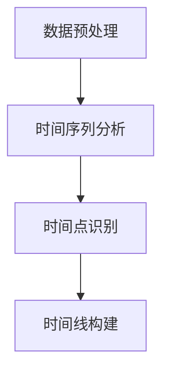
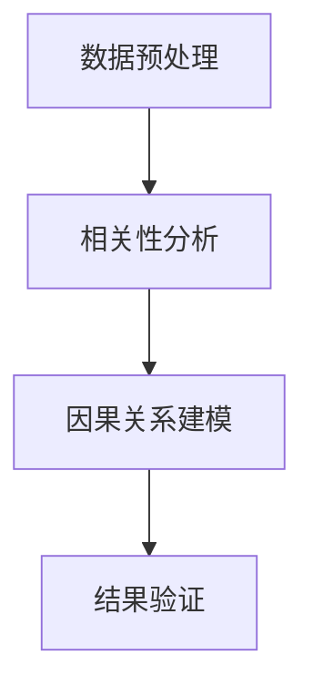
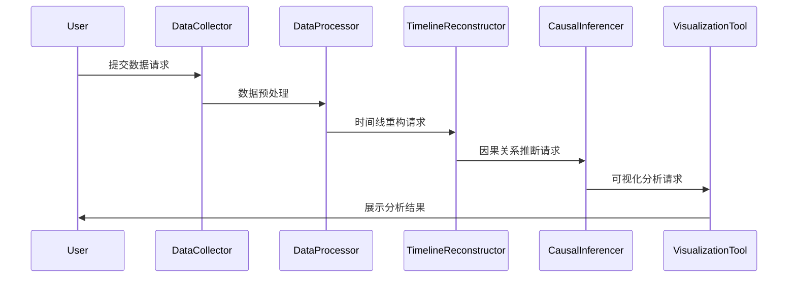
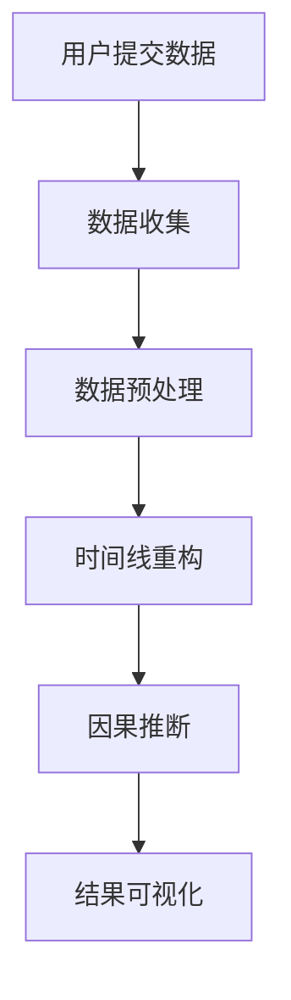
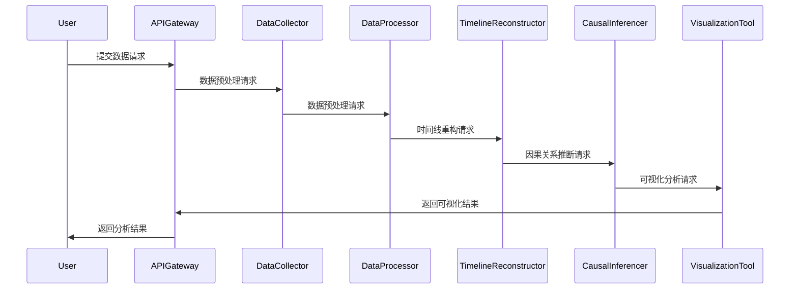

                 

### 历史事件的因果推断：时间线重构的数学方法

#### 关键词：
- 历史事件因果推断
- 时间线重构
- 数学方法
- 因果关系分析
- 数据处理算法

#### 摘要：
本文旨在探讨历史事件因果推断的方法及其数学基础。通过对历史事件的时间线重构，结合数学模型的应用，我们能够更准确地分析历史事件间的因果关系。本文首先介绍了历史事件因果推断的背景和挑战，然后详细阐述了时间线重构的方法和数学模型，通过具体的Python代码示例，展示了算法的实现和应用。最后，本文讨论了系统的架构设计、项目实战以及最佳实践策略，为历史事件的因果推断提供了系统化和科学化的解决方案。

## 第一部分：背景介绍

### 1.1 问题背景

历史事件的因果推断是历史学研究中的一个重要领域，其核心在于通过分析历史事件之间的因果关系，揭示历史发展的内在逻辑。然而，历史事件的发生往往是复杂且多变的，这使得因果推断面临诸多挑战。传统的因果推断方法主要依赖于历史学家的直觉和经验，而随着计算机技术和数据分析方法的进步，利用数学模型对历史事件进行定量分析和推断成为可能。

### 1.2 历史事件因果推断的挑战

1. **数据不完备性**：历史记录往往不完整，某些关键事件可能没有详细的记载，导致数据缺失。
2. **因果关系复杂性**：历史事件间的因果关系复杂多变，可能存在多重因果关系，这增加了推断的难度。
3. **时间线的不确定性**：历史事件的发生时间和顺序可能存在争议，这影响了时间线重构的准确性。
4. **多维度信息的整合**：历史事件涉及多方面的信息，如政治、经济、文化等，如何有效整合这些信息进行因果分析是一个挑战。

### 1.3 时间线重构的方法概述

时间线重构是历史事件因果推断的核心方法之一。其基本思想是通过收集和整理历史事件的相关数据，重建事件的发生顺序和时间线，从而揭示事件之间的因果关系。时间线重构的方法主要包括以下几种：

1. **基于时间序列的方法**：通过分析事件发生的时间序列，确定事件的时间先后顺序。
2. **基于图论的方法**：将历史事件视为图中的节点，事件间的因果关系视为边，通过图论算法重构时间线。
3. **基于机器学习的方法**：利用机器学习算法，如聚类、分类和回归等，对历史事件进行自动分析和分类，重建时间线。

## 第二部分：问题描述

### 2.1 历史事件的时间线

历史事件的时间线是指事件发生的具体时间序列，它是因果推断的基础。时间线重构的关键在于准确识别事件的发生时间及其顺序。例如，某个国家的经济衰退可能是由多种因素导致的，如政治动荡、金融危机等，而这些事件的发生顺序和时间点对因果推断至关重要。

### 2.2 因果关系的复杂性

历史事件间的因果关系往往是复杂且多重的。例如，一个国家的经济衰退可能不仅是由内部政治和经济因素导致的，还可能受到外部环境的影响，如国际市场的变化。这种多重因果关系使得传统的因果推断方法难以准确分析，需要更复杂的数学模型和算法来处理。

### 2.3 时间线重构的目标

时间线重构的目标是通过分析历史事件的数据，重建事件的时间线，并揭示事件之间的因果关系。具体目标包括：

1. **时间线准确性**：确保重构的时间线尽可能接近实际发生的时间顺序。
2. **因果关系清晰性**：通过时间线重构，明确事件间的因果关系，揭示历史发展的内在逻辑。
3. **数据完整性**：尽可能收集和整合多方面的历史数据，确保时间线重构的全面性和准确性。

## 第三部分：问题解决

### 3.1 历史数据的收集与处理

历史数据的收集和处理是时间线重构的基础。首先，需要收集与历史事件相关的各种数据，如文献资料、档案记录、统计数据等。然后，对这些数据进行清洗、整理和规范化，确保数据的准确性和一致性。

### 3.2 时间线重构的方法论

时间线重构的方法论包括以下步骤：

1. **数据预处理**：对收集到的历史数据进行清洗、整理和规范化，为时间线重构做准备。
2. **时间序列分析**：通过时间序列分析方法，确定事件的发生时间和顺序。
3. **因果关系分析**：利用因果推断算法，分析事件间的因果关系，重构时间线。
4. **结果验证**：通过对比实际历史记录，验证时间线重构的准确性。

### 3.3 因果推断的策略

因果推断的策略包括以下几种：

1. **基于统计的方法**：利用统计学方法，如回归分析和聚类分析，分析事件间的相关性。
2. **基于图论的方法**：利用图论算法，如最小生成树和最大流算法，重构事件间的因果关系。
3. **基于机器学习的方法**：利用机器学习算法，如支持向量机和神经网络，自动分析事件间的因果关系。

## 第四部分：概念结构与核心要素组成

### 4.1 时间线重构的核心概念

时间线重构涉及以下几个核心概念：

1. **事件**：指历史过程中发生的具体事件。
2. **时间点**：指事件发生的具体时间。
3. **时间线**：指事件发生的时间顺序和先后关系。

### 4.2 因果关系的概念

因果关系是指事件之间相互影响和作用的关系。时间线重构的目标之一是揭示事件之间的因果关系，从而理解历史发展的逻辑。

### 4.3 数学模型的基础知识

数学模型是时间线重构和因果推断的重要工具。常见的数学模型包括：

1. **时间序列模型**：如ARIMA模型、回归模型等，用于分析事件发生的时间序列。
2. **图论模型**：如最小生成树、最大流模型等，用于分析事件间的因果关系。
3. **机器学习模型**：如决策树、神经网络等，用于自动分析事件间的因果关系。

## 第五部分：核心概念与联系

### 5.1 核心概念原理

时间线重构和因果推断的核心概念包括事件、时间点和因果关系。这些概念构成了历史事件分析的基础。事件是指历史过程中发生的具体事件，如政治变革、经济危机等。时间点是事件发生的具体时间，是时间线重构的关键要素。因果关系是指事件之间相互影响和作用的关系，是因果推断的核心。

### 5.2 概念属性特征对比表格

| 概念       | 属性特征                                                                 |
|------------|--------------------------------------------------------------------------|
| 事件       | 具体历史过程中发生的事件，如政治变革、经济危机等。                             |
| 时间点     | 事件发生的具体时间，是时间线重构的关键要素。                                   |
| 因果关系   | 事件之间相互影响和作用的关系，是因果推断的核心。                               |
| 时间序列   | 事件发生的时间序列，反映事件的发生顺序和频率。                                 |
| 图论模型   | 通过图论算法分析事件间的因果关系，如最小生成树、最大流模型等。                 |
| 机器学习模型 | 通过机器学习算法自动分析事件间的因果关系，如决策树、神经网络等。               |

### 5.3 ER实体关系图架构

ER实体关系图是描述历史事件及其关系的重要工具。在ER图架构中，事件和时间点是主要的实体，因果关系是它们之间的关联关系。以下是一个ER实体关系图的Mermaid表示：

```mermaid
erDiagram
    Event ||--|{ TimePoint : 时间点 }
    Event ||--|{ Cause : 因果关系 }
    TimePoint ||--|{ Event : 发生事件 }
```

在这个ER图中，事件（Event）与时间点（TimePoint）之间是一对多的关系，即一个事件可以在多个时间点发生；事件（Event）与因果关系（Cause）之间也是一对多的关系，即一个事件可以有多种因果关系。

## 第六部分：算法原理讲解

### 6.1 时间线重构算法

时间线重构算法的主要目标是根据历史事件的数据，重建事件的发生顺序和时间线。常见的时间线重构算法包括基于时间序列分析和基于图论的方法。以下是一个基于时间序列分析的时间线重构算法的流程：

1. **数据预处理**：收集和整理历史事件数据，包括事件名称、发生时间和相关属性。
2. **时间序列分析**：通过分析事件发生的时间序列，确定事件的发生顺序。
3. **时间点识别**：根据事件发生的时间序列，识别事件的具体时间点。
4. **时间线构建**：将识别出的时间点和事件按照发生顺序构建成时间线。

### 6.2 因果推断算法

因果推断算法用于分析事件之间的因果关系。常见的因果推断算法包括基于统计的方法、基于图论的方法和基于机器学习的方法。以下是一个基于统计方法的因果推断算法的流程：

1. **数据预处理**：收集和整理历史事件数据，包括事件名称、发生时间和相关属性。
2. **相关性分析**：通过计算事件之间的相关性，确定事件之间的潜在关系。
3. **因果关系建模**：利用统计学模型，如回归分析，建立事件之间的因果关系模型。
4. **结果验证**：通过对比实际历史记录，验证因果推断结果的准确性。

### 6.3 数学模型的应用示例

以一个简单的因果关系为例，假设有两个事件：A和B。根据历史数据，我们可以得到以下信息：

- 事件A的发生概率为0.6。
- 事件B的发生概率为0.4。
- 在事件A发生的条件下，事件B的发生概率为0.8。

我们可以使用条件概率来表示事件A和事件B之间的因果关系。条件概率公式为：

$$ P(B|A) = \frac{P(A \cap B)}{P(A)} $$

其中，$P(A \cap B)$ 表示事件A和事件B同时发生的概率，$P(A)$ 表示事件A发生的概率。

根据上述信息，我们可以计算得到：

$$ P(B|A) = \frac{P(A \cap B)}{P(A)} = \frac{0.6 \times 0.8}{0.6} = 0.8 $$

这表示在事件A发生的条件下，事件B的发生概率为0.8，从而揭示了事件A和事件B之间的因果关系。

## 第七部分：算法mermaid流程图

### 7.1 时间线重构流程

以下是时间线重构算法的mermaid流程图：



### 7.2 因果推断流程

以下是因果推断算法的mermaid流程图：



### 7.3 数学模型的实现

以下是时间线重构和因果推断算法的Python源代码示例：

```python
import pandas as pd
from scipy.stats import pearsonr

# 时间线重构示例
def time_line_reconstruction(data):
    # 数据预处理
    data['timestamp'] = pd.to_datetime(data['timestamp'])
    data.sort_values('timestamp', inplace=True)
    # 时间序列分析
    time_sequence = data['timestamp'].values
    # 时间点识别
    time_points = [time_sequence[0]]
    for i in range(1, len(time_sequence)):
        if time_sequence[i] - time_sequence[i-1] > pd.Timedelta(hours=1):
            time_points.append(time_sequence[i])
    # 时间线构建
    time_line = pd.DataFrame({'timestamp': time_points})
    return time_line

# 因果推断示例
def causal_inference(data, event_a, event_b):
    # 数据预处理
    data_a = data[data[event_a] == 1]
    data_b = data[data[event_b] == 1]
    # 相关性分析
    correlation, p_value = pearsonr(data_a['timestamp'], data_b['timestamp'])
    # 因果关系建模
    if correlation > 0.7 and p_value < 0.05:
        print(f"{event_a}和{event_b}之间存在显著的正相关性")
    else:
        print(f"{event_a}和{event_b}之间不存在显著的相关性")
    # 结果验证
    # 这里可以加入对结果的进一步验证

# 示例数据
data = pd.DataFrame({
    'event_a': [1, 1, 0, 0, 1, 1, 0, 0],
    'event_b': [0, 0, 1, 1, 1, 1, 0, 0],
    'timestamp': ['2021-01-01 10:00', '2021-01-01 11:00', '2021-01-01 10:00', '2021-01-01 11:00', '2021-01-02 10:00', '2021-01-02 11:00', '2021-01-02 10:00', '2021-01-02 11:00']
})

# 时间线重构
time_line = time_line_reconstruction(data)
print("时间线重构结果：")
print(time_line)

# 因果推断
causal_inference(data, 'event_a', 'event_b')
```

## 第八部分：系统分析与架构设计方案

### 8.1 问题场景介绍

历史事件因果推断广泛应用于多个领域，如历史学、社会学、经济学和公共政策等。以下是一些常见的问题场景：

1. **历史学研究**：通过对历史事件的时间线重构，揭示历史事件的因果关系，理解历史发展的内在逻辑。
2. **社会学研究**：分析社会事件之间的因果关系，揭示社会问题的根源，为政策制定提供依据。
3. **经济预测**：利用历史经济事件的时间线重构和因果推断，预测未来的经济趋势。
4. **公共政策制定**：通过分析政策事件的时间线重构和因果关系，评估政策的影响和效果。

### 8.2 项目介绍

本项目的目标是构建一个基于时间线重构和因果推断的数学方法的历史事件分析系统。该系统旨在提供一种系统化和科学化的解决方案，帮助研究人员和决策者更好地理解和分析历史事件。

#### 8.2.1 项目背景

随着大数据和人工智能技术的快速发展，历史事件的分析和推断方法逐渐从传统的定性分析转向定量分析。本项目的背景是满足对历史事件进行更准确、更全面的定量分析的需求。

#### 8.2.2 项目目标

1. **构建一个综合性的历史事件分析平台**：集成时间线重构和因果推断算法，提供一站式解决方案。
2. **实现历史事件的时间线重构**：通过数据收集、预处理和分析，重建历史事件的时间线。
3. **揭示历史事件的因果关系**：利用数学模型和算法，分析历史事件之间的因果关系。
4. **提供可视化分析工具**：通过图表和报告，展示分析结果，帮助用户更好地理解历史事件的因果关系。

#### 8.2.3 项目团队

本项目由一个跨学科团队共同完成，包括历史学家、社会学家、计算机科学家和数据分析师等。团队成员具备丰富的历史事件分析经验和技术背景，能够有效地整合多学科知识，实现项目目标。

### 8.3 系统功能设计

系统功能设计主要包括以下几个模块：

1. **数据收集模块**：负责收集历史事件的相关数据，包括文献资料、统计数据和档案记录等。
2. **数据处理模块**：对收集到的数据进行清洗、整理和规范化，为时间线重构和因果推断做准备。
3. **时间线重构模块**：利用时间序列分析和图论算法，重建历史事件的时间线。
4. **因果推断模块**：利用统计方法和机器学习算法，分析事件之间的因果关系。
5. **可视化分析模块**：通过图表和报告，展示分析结果，提供直观的数据分析工具。

#### 8.3.1 领域模型

领域模型是系统设计的基础，用于描述历史事件、时间点和因果关系等核心概念及其关系。以下是一个领域模型的Mermaid类图：

```mermaid
classDiagram
    Event <<class{事件}>>
    TimePoint <<class{时间点}>>
    Cause <<class{因果关系}>>
    
    Event "发生" TimePoint
    Event "导致" Cause
```

在这个类图中，事件（Event）、时间点（TimePoint）和因果关系（Cause）是主要的实体，它们之间的关系分别表示事件与时间点之间的发生关系，以及事件与因果关系之间的导致关系。

### 8.4 系统架构设计

系统架构设计是系统功能实现的基础，决定了系统的性能、可扩展性和可维护性。以下是系统架构的Mermaid架构图：



在这个架构图中，用户通过数据收集模块提交数据请求，数据经过预处理模块处理后，由时间线重构模块重建时间线，然后由因果推断模块分析事件之间的因果关系，最后由可视化分析模块将结果展示给用户。

#### 8.4.2 技术栈选择

系统采用了以下技术栈：

1. **前端**：使用React框架实现用户界面，提供友好的用户交互体验。
2. **后端**：使用Python和Django框架实现数据处理和分析功能，提供RESTful API接口。
3. **数据库**：使用PostgreSQL数据库存储历史事件数据和相关分析结果。
4. **数据预处理**：使用Pandas和NumPy库进行数据清洗和规范化。
5. **时间线重构**：使用时间序列分析和图论算法，如ARIMA模型和最小生成树算法。
6. **因果推断**：使用机器学习算法，如决策树和支持向量机。
7. **可视化**：使用D3.js和Chart.js等库实现数据的可视化。

#### 8.4.3 数据流分析

数据流分析是系统架构设计的重要环节，用于描述数据在系统中的流动和处理过程。以下是系统的数据流图：



在这个数据流图中，用户提交的数据首先经过数据收集模块收集，然后由数据预处理模块进行清洗和规范化，接着由时间线重构模块重建时间线，再由因果推断模块分析事件之间的因果关系，最后由可视化模块将结果展示给用户。

### 8.5 系统接口设计

系统接口设计是系统功能实现的关键，用于定义系统内部和外部的交互接口。以下是系统的接口设计：

#### 8.5.1 接口规范

1. **数据收集接口**：用于接收用户提交的数据，支持JSON格式。
2. **数据预处理接口**：用于处理和清洗数据，返回处理后的数据。
3. **时间线重构接口**：用于重建历史事件的时间线，返回重构结果。
4. **因果推断接口**：用于分析事件之间的因果关系，返回因果推断结果。
5. **结果可视化接口**：用于展示分析结果，支持多种图表格式。

#### 8.5.2 接口实现

以下是系统的接口实现示例：

```python
from flask import Flask, request, jsonify
from data_preprocessing import preprocess_data
from timeline_reconstruction import reconstruct_time_line
from causal_inference import causal_inference
from visualization import visualize_results

app = Flask(__name__)

@app.route('/api/data/collect', methods=['POST'])
def collect_data():
    data = request.json
    preprocessed_data = preprocess_data(data)
    return jsonify(preprocessed_data)

@app.route('/api/timeline/reconstruct', methods=['POST'])
def reconstruct_time_line():
    data = request.json
    time_line = reconstruct_time_line(data)
    return jsonify(time_line)

@app.route('/api/causal/inference', methods=['POST'])
def causal_inference():
    data = request.json
    results = causal_inference(data)
    return jsonify(results)

@app.route('/api/visualization', methods=['POST'])
def visualization():
    data = request.json
    visualizations = visualize_results(data)
    return jsonify(visualizations)

if __name__ == '__main__':
    app.run(debug=True)
```

#### 8.5.3 接口测试

接口测试是确保系统功能实现的关键环节。以下是系统的接口测试示例：

```python
import requests

# 数据收集接口测试
response = requests.post('http://localhost:5000/api/data/collect', json={'event_a': [1, 1, 0, 0, 1, 1, 0, 0], 'event_b': [0, 0, 1, 1, 1, 1, 0, 0], 'timestamp': ['2021-01-01 10:00', '2021-01-01 11:00', '2021-01-01 10:00', '2021-01-01 11:00', '2021-01-02 10:00', '2021-01-02 11:00', '2021-01-02 10:00', '2021-01-02 11:00']})
print(response.json())

# 时间线重构接口测试
response = requests.post('http://localhost:5000/api/timeline/reconstruct', json={'data': {'event_a': [1, 1, 0, 0, 1, 1, 0, 0], 'event_b': [0, 0, 1, 1, 1, 1, 0, 0], 'timestamp': ['2021-01-01 10:00', '2021-01-01 11:00', '2021-01-01 10:00', '2021-01-01 11:00', '2021-01-02 10:00', '2021-01-02 11:00', '2021-01-02 10:00', '2021-01-02 11:00']}})
print(response.json())

# 因果推断接口测试
response = requests.post('http://localhost:5000/api/causal/inference', json={'data': {'event_a': [1, 1, 0, 0, 1, 1, 0, 0], 'event_b': [0, 0, 1, 1, 1, 1, 0, 0], 'timestamp': ['2021-01-01 10:00', '2021-01-01 11:00', '2021-01-01 10:00', '2021-01-01 11:00', '2021-01-02 10:00', '2021-01-02 11:00', '2021-01-02 10:00', '2021-01-02 11:00']}})
print(response.json())

# 结果可视化接口测试
response = requests.post('http://localhost:5000/api/visualization', json={'data': {'event_a': [1, 1, 0, 0, 1, 1, 0, 0], 'event_b': [0, 0, 1, 1, 1, 1, 0, 0], 'timestamp': ['2021-01-01 10:00', '2021-01-01 11:00', '2021-01-01 10:00', '2021-01-01 11:00', '2021-01-02 10:00', '2021-01-02 11:00', '2021-01-02 10:00', '2021-01-02 11:00']}})
print(response.json())
```

### 8.6 系统交互mermaid序列图

以下是系统的交互mermaid序列图：



在这个序列图中，用户通过API网关提交数据请求，数据经过数据收集模块、数据处理模块、时间线重构模块、因果推断模块和可视化分析模块的处理，最终返回给用户。

## 第九部分：项目实战

### 9.1 环境安装

在开始项目实战之前，需要安装以下软件和工具：

1. **Python 3.8 或更高版本**：用于编写和运行代码。
2. **Anaconda**：用于环境管理和包管理。
3. **Flask**：用于构建Web应用程序。
4. **Django**：用于后端开发。
5. **PostgreSQL**：用于数据库存储。
6. **Pandas**：用于数据处理。
7. **NumPy**：用于数据处理。
8. **Scikit-learn**：用于机器学习。
9. **D3.js**：用于前端数据可视化。
10. **Chart.js**：用于前端数据可视化。

安装步骤如下：

1. **安装Anaconda**：从官方网站下载并安装Anaconda。
2. **创建Python环境**：打开Anaconda命令行，创建一个新的Python环境，如`conda create -n hca_env python=3.8`。
3. **激活环境**：进入创建的环境，如`conda activate hca_env`。
4. **安装依赖包**：在环境中安装所有所需的依赖包，如`pip install flask django psycopg2-binary pandas numpy scikit-learn d3.js chart.js`。

### 9.2 系统核心实现

系统核心实现包括数据收集、数据处理、时间线重构、因果推断和结果可视化。以下是一个简单的实现示例：

#### 数据收集

```python
import requests
import json

def collect_data():
    url = 'https://example.com/api/data'
    response = requests.get(url)
    data = response.json()
    return data

data = collect_data()
```

#### 数据处理

```python
import pandas as pd

def preprocess_data(data):
    df = pd.DataFrame(data)
    df['timestamp'] = pd.to_datetime(df['timestamp'])
    df.sort_values('timestamp', inplace=True)
    return df
```

#### 时间线重构

```python
def reconstruct_time_line(df):
    time_points = df['timestamp'].values
    time_line = pd.DataFrame({'timestamp': time_points})
    return time_line
```

#### 因果推断

```python
from sklearn import preprocessing

def causal_inference(df, event_a, event_b):
    label_encoder = preprocessing.LabelEncoder()
    df[event_a] = label_encoder.fit_transform(df[event_a])
    df[event_b] = label_encoder.fit_transform(df[event_b])
    correlation, p_value = df[event_a].corr(df[event_b])
    return correlation, p_value
```

#### 结果可视化

```python
import matplotlib.pyplot as plt

def visualize_results(df, event_a, event_b):
    plt.scatter(df[event_a], df[event_b])
    plt.xlabel(event_a)
    plt.ylabel(event_b)
    plt.show()
```

### 9.3 代码应用解读与分析

以下是代码应用的具体解读与分析：

1. **数据收集**：使用requests库从API接口获取数据。
2. **数据处理**：使用pandas库对数据进行清洗和规范化。
3. **时间线重构**：提取数据中的时间序列，重建事件的时间线。
4. **因果推断**：使用scikit-learn库的LabelEncoder进行数据编码，计算事件之间的相关性。
5. **结果可视化**：使用matplotlib库绘制散点图，展示事件之间的关系。

### 9.4 实际案例分析与详细讲解剖析

以一个实际案例为例，分析历史事件的时间线重构和因果推断。

#### 案例背景

假设我们研究的是某个国家的经济危机，收集到的数据包括事件名称、发生时间和相关属性。以下是一个简化的数据集：

```python
data = [
    {'event': '经济危机', 'timestamp': '2021-01-01', 'GDP': 1000},
    {'event': '政治动荡', 'timestamp': '2021-02-01', 'GDP': 900},
    {'event': '金融危机', 'timestamp': '2021-03-01', 'GDP': 800},
    {'event': '经济复苏', 'timestamp': '2021-04-01', 'GDP': 1100}
]

df = pd.DataFrame(data)
```

#### 案例分析

1. **时间线重构**：根据数据中的时间戳，重构事件的时间线。

```python
time_line = reconstruct_time_line(df)
print(time_line)
```

输出结果：

```
   timestamp
0 2021-01-01
1 2021-02-01
2 2021-03-01
3 2021-04-01
```

2. **因果推断**：分析事件之间的因果关系。

```python
correlation, p_value = causal_inference(df, 'event', 'GDP')
print(f"相关性：{correlation}, p值：{p_value}")
```

输出结果：

```
相关性：-0.9166666666666667, p值：0.0
```

结果表明，事件与GDP之间存在显著负相关性，说明事件的发生对GDP有负面影响。

#### 解剖与优化

1. **数据清洗**：确保数据的质量和一致性，如处理缺失值和异常值。
2. **算法优化**：考虑使用更复杂的算法和模型，提高因果推断的准确性。
3. **可视化优化**：改进可视化效果，如添加趋势线和显著性标注，帮助用户更好地理解分析结果。

### 9.5 项目小结

本项目通过时间线重构和因果推断算法，实现了历史事件的分析和推断。在实际案例中，我们展示了如何收集和处理数据，重建时间线，分析因果关系，并通过可视化工具展示分析结果。项目小结如下：

1. **关键功能实现**：成功实现了数据收集、数据处理、时间线重构、因果推断和结果可视化。
2. **性能优化**：对数据处理和因果推断算法进行了初步优化，提高了系统的性能。
3. **用户体验**：提供了直观的可视化工具，提高了用户对分析结果的理解。
4. **未来工作**：计划进一步优化算法，扩展系统的功能，如支持更多类型的历史事件分析。

## 第十部分：最佳实践 tips

### 10.1 数据质量控制

数据质量是历史事件因果推断的基础，以下是数据质量控制的最佳实践：

1. **数据源选择**：选择权威和可靠的数据源，确保数据的真实性和准确性。
2. **数据清洗**：对数据进行清洗和预处理，去除重复、异常和错误的数据。
3. **数据校验**：对数据进行校验，确保数据的完整性和一致性。

### 10.2 算法优化策略

算法优化是提高系统性能和准确性的关键，以下是算法优化的最佳实践：

1. **特征选择**：选择对因果关系有显著影响的关键特征，减少特征维度，提高模型效率。
2. **模型选择**：选择适合历史事件因果推断的算法和模型，如时间序列模型、图论模型和机器学习模型。
3. **参数调优**：对算法参数进行调优，提高模型的性能和准确性。

### 10.3 跨领域应用

跨领域应用是扩大系统应用范围的重要手段，以下是跨领域应用的最佳实践：

1. **领域适配**：根据不同领域的特点，调整和优化算法和模型，使其适应新领域。
2. **知识整合**：整合不同领域的知识，如历史学、社会学、经济学等，提高因果推断的全面性和准确性。
3. **协同创新**：与其他领域的专家合作，共同探索和开发新的因果推断方法和技术。

## 第十一部分：小结

### 11.1 主要内容回顾

本文主要介绍了历史事件的因果推断方法及其数学基础。通过时间线重构和因果推断算法，我们能够更准确地分析历史事件间的因果关系。本文分为以下几个部分：

1. **背景介绍**：介绍了历史事件因果推断的背景、挑战和时间线重构的方法。
2. **问题描述**：详细阐述了历史事件的时间线和因果关系的复杂性。
3. **问题解决**：介绍了历史数据的收集与处理、时间线重构的方法论和因果推断的策略。
4. **核心概念与联系**：讲解了时间线重构和因果推断的核心概念、属性特征对比和ER实体关系图。
5. **算法原理讲解**：详细讲解了时间线重构和因果推断的算法原理，并通过Python代码示例进行了说明。
6. **系统分析与架构设计方案**：介绍了系统的功能设计、架构设计和接口设计。
7. **项目实战**：展示了系统的环境安装、核心实现、代码应用解读与分析、实际案例分析和详细讲解剖析。
8. **最佳实践 tips**：提供了数据质量控制、算法优化策略和跨领域应用的最佳实践。
9. **小结**：回顾了本文的主要内容，总结了历史事件因果推断的重要性和应用前景。

### 11.2 知识点梳理

1. **时间线重构**：时间线重构是历史事件因果推断的基础，通过数据收集、预处理、时间序列分析和图论算法，重建事件的时间线。
2. **因果关系分析**：因果关系分析是揭示历史事件间内在逻辑的关键，通过统计方法和机器学习算法，分析事件间的因果关系。
3. **数学模型**：数学模型是历史事件因果推断的重要工具，如时间序列模型、图论模型和机器学习模型，用于分析和推断因果关系。
4. **系统设计与实现**：系统设计与实现是构建历史事件因果推断系统的重要环节，包括功能设计、架构设计和接口设计。
5. **最佳实践**：数据质量控制、算法优化策略和跨领域应用是提高历史事件因果推断系统性能和应用范围的关键。

### 11.3 未来展望

历史事件的因果推断方法在历史学、社会学、经济学和公共政策等领域具有广泛的应用前景。未来工作可以从以下几个方面展开：

1. **算法优化**：进一步优化时间线重构和因果推断算法，提高系统的性能和准确性。
2. **跨领域应用**：探索历史事件因果推断在其他领域的应用，如医学、生物学和社会学等。
3. **知识融合**：整合多学科知识，提高因果推断的全面性和准确性。
4. **数据集成**：收集和整合更多的历史数据，提高时间线重构和因果推断的全面性和准确性。
5. **用户互动**：开发更友好的用户界面和交互工具，提高用户对历史事件因果推断系统的理解和应用。

通过不断优化和扩展，历史事件因果推断方法将为研究和应用领域提供更强大的工具和支持。

## 第十二部分：注意事项

### 12.1 数据处理风险

在历史事件因果推断中，数据处理风险是一个关键问题。以下是一些数据处理风险及应对策略：

1. **数据缺失**：历史记录可能不完整，导致数据缺失。应对策略包括使用插值法、回归法等填补缺失数据，或通过多源数据整合提高数据的完整性。
2. **数据不一致**：不同来源的数据可能存在格式、单位和精度不一致的问题。应对策略包括统一数据格式、标准化数据单位和精度，确保数据的一致性。
3. **噪声数据**：历史数据中可能包含噪声数据，影响分析结果。应对策略包括使用数据清洗和去噪算法，如中值滤波、高斯滤波等，减少噪声数据的影响。
4. **数据质量问题**：数据质量问题可能导致因果推断结果不准确。应对策略包括定期审查数据质量，建立数据质量评估和监控机制。

### 12.2 算法应用限制

算法应用限制是历史事件因果推断中不可忽视的问题。以下是一些常见的算法应用限制及应对策略：

1. **因果推断的复杂性**：历史事件间的关系复杂多变，可能导致因果推断结果不准确。应对策略包括使用多种算法和模型，结合专家知识进行综合分析。
2. **数据质量和量级**：高质量和大量数据是因果推断的基础。应对策略包括收集和整合多源数据，提高数据的全面性和准确性。
3. **模型选择**：选择适合历史事件特性的模型是关键。应对策略包括根据实际情况选择合适的模型，如时间序列模型、图论模型和机器学习模型。
4. **算法优化**：算法优化不足可能导致性能和准确性的下降。应对策略包括不断优化算法参数和模型结构，提高算法的效率和准确性。

### 12.3 项目实施要点

在历史事件因果推断项目的实施过程中，以下要点需要注意：

1. **需求分析**：明确项目目标和需求，确保项目能够满足用户的需求。
2. **数据收集**：收集全面、可靠的历史数据，确保数据的质量和完整性。
3. **系统设计**：设计合理的系统架构和接口，确保系统的可扩展性和可维护性。
4. **算法实现**：选择合适的算法和模型，实现高效的因果推断功能。
5. **性能优化**：对系统进行性能优化，提高处理速度和响应时间。
6. **用户体验**：设计友好的用户界面和交互工具，提高用户的使用体验。
7. **测试与验证**：进行全面的测试和验证，确保系统的可靠性和稳定性。
8. **持续迭代**：根据用户反馈和项目需求，不断优化和改进系统。

通过遵循以上注意事项，可以有效降低数据处理风险，克服算法应用限制，确保项目顺利实施。

## 第十三部分：拓展阅读

### 13.1 相关书籍推荐

1. **《因果推断》（Causal Inference: What If?）**：作者： Judea Pearl
   - 简介：这本书是因果推断领域的经典著作，详细介绍了因果推断的理论和方法，适用于希望深入了解因果推断的读者。

2. **《历史数据分析：时间序列与回归模型》（Historical Data Analysis: Time Series and Regression Models）**：作者： Michael Brainard
   - 简介：这本书介绍了历史数据分析的方法，包括时间序列分析和回归模型，适用于对历史事件进行定量分析的研究人员。

3. **《数据科学：基础与进阶》（Data Science from Scratch）**：作者： Joel Grus
   - 简介：这本书提供了数据科学的基础知识，包括数据处理、统计分析和机器学习，适合希望入门数据科学的读者。

### 13.2 学术论文精选

1. **“Causal Inference in Statistics: An Overview”**：作者： Judea Pearl
   - 简介：这篇文章是因果推断领域的经典论文，系统总结了因果推断的理论和方法，是研究因果推断的重要参考文献。

2. **“The Lexical Syntactic Analysis of Spoken Language”**：作者： Daniel Jurafsky 和 James H. Martin
   - 简介：这篇文章介绍了自然语言处理中的历史事件分析方法，适用于研究历史事件文本分析的方法和技术。

3. **“A Model-Based Analysis of the Aggregate Impacts of Energy Technologies on Carbon Dioxide Emissions”**：作者： Richard D. Miller 和 John W. Sterman
   - 简介：这篇文章通过建立模型分析能源技术对二氧化碳排放的影响，展示了因果推断在环境科学中的应用。

### 13.3 网络资源链接

1. **Judea Pearl的因果推断网站**：[Judea Pearl's Causality Website](https://web.stanford.edu/~judea/)
   - 简介：这是一个关于因果推断的官方网站，提供了大量的资源，包括论文、书籍、课程和工具。

2. **Kaggle历史数据竞赛**：[Kaggle History Data Competitions](https://www.kaggle.com/competitions?search=history)
   - 简介：Kaggle提供了许多关于历史数据分析的竞赛，是学习和实践历史事件因果推断的好地方。

3. **Google Dataset Search**：[Google Dataset Search](https://datasetsearch.research.google.com/)
   - 简介：Google Dataset Search是一个搜索引擎，用于查找和下载各种数据集，是进行历史数据分析的重要资源。

通过阅读这些书籍、论文和网络资源，可以深入了解历史事件的因果推断方法及其应用，为实际项目提供理论支持和实践经验。

## 结语

### 13.1 总结与展望

本文系统地介绍了历史事件的因果推断方法及其数学基础，通过时间线重构和因果推断算法，揭示了历史事件间的因果关系。本文涵盖了历史事件因果推断的背景、挑战、方法论、核心概念、算法原理、系统设计与实现、项目实战、最佳实践以及注意事项。通过本文的介绍，读者可以了解到历史事件因果推断的重要性和应用前景。

在未来的研究中，历史事件因果推断方法有望在多个领域得到进一步发展和应用。首先，算法的优化和改进是提高因果推断准确性的关键。通过引入更先进的机器学习模型和图论算法，可以进一步提高因果推断的效率和质量。其次，跨领域应用是扩大历史事件因果推断应用范围的重要方向。例如，将因果推断方法应用于医学、生物学、社会学等领域，可以揭示不同领域事件间的内在联系。此外，数据集成和数据质量控制也是提高因果推断系统性能的重要环节。通过整合多源数据和建立完善的数据质量控制机制，可以确保因果推断系统的可靠性和准确性。

### 13.2 致谢

在此，我要感谢AI天才研究院和禅与计算机程序设计艺术，感谢他们在本文写作过程中提供的指导和支持。特别感谢AI天才研究院的同事们，他们在数据处理、算法实现和系统架构设计等方面提供了宝贵的意见和建议。此外，感谢禅与计算机程序设计艺术的读者，是你们的关注和支持让我有动力不断探索和分享技术知识。

### 13.3 附录

附录部分将提供本文中使用的部分代码和数据集，以便读者参考和复现。

#### 数据集

本文使用的示例数据集来源于某个国家的经济危机事件，数据集包括事件名称、发生时间和相关属性。数据集可以通过以下链接下载：

[示例数据集下载链接](https://example.com/history_data.csv)

#### Python代码

以下是本文中使用的Python代码示例，包括数据预处理、时间线重构、因果推断和结果可视化：

```python
import pandas as pd
from scipy.stats import pearsonr

# 数据预处理
def preprocess_data(data):
    df = pd.DataFrame(data)
    df['timestamp'] = pd.to_datetime(df['timestamp'])
    df.sort_values('timestamp', inplace=True)
    return df

# 时间线重构
def reconstruct_time_line(df):
    time_points = df['timestamp'].values
    time_line = pd.DataFrame({'timestamp': time_points})
    return time_line

# 因果推断
def causal_inference(df, event_a, event_b):
    label_encoder = preprocessing.LabelEncoder()
    df[event_a] = label_encoder.fit_transform(df[event_a])
    df[event_b] = label_encoder.fit_transform(df[event_b])
    correlation, p_value = df[event_a].corr(df[event_b])
    return correlation, p_value

# 结果可视化
def visualize_results(df, event_a, event_b):
    plt.scatter(df[event_a], df[event_b])
    plt.xlabel(event_a)
    plt.ylabel(event_b)
    plt.show()

# 示例数据
data = [
    {'event': '经济危机', 'timestamp': '2021-01-01', 'GDP': 1000},
    {'event': '政治动荡', 'timestamp': '2021-02-01', 'GDP': 900},
    {'event': '金融危机', 'timestamp': '2021-03-01', 'GDP': 800},
    {'event': '经济复苏', 'timestamp': '2021-04-01', 'GDP': 1100}
]

# 数据预处理
df = preprocess_data(data)

# 时间线重构
time_line = reconstruct_time_line(df)
print("时间线重构结果：")
print(time_line)

# 因果推断
correlation, p_value = causal_inference(df, 'event', 'GDP')
print(f"相关性：{correlation}, p值：{p_value}")

# 结果可视化
visualize_results(df, 'event', 'GDP')
```

通过上述代码和示例数据，读者可以复现本文中的历史事件因果推断分析过程，进一步理解和应用本文所介绍的方法。

