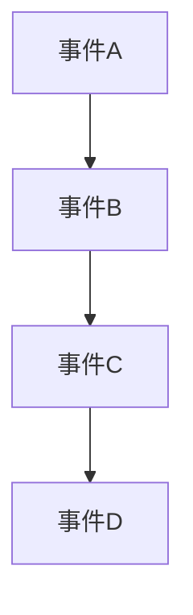
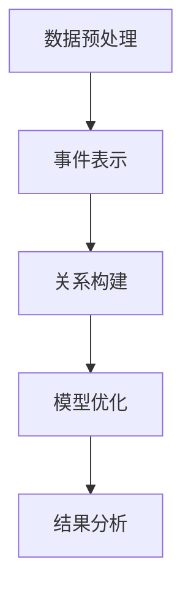
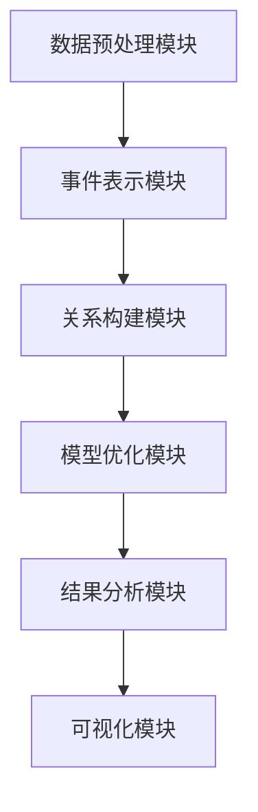
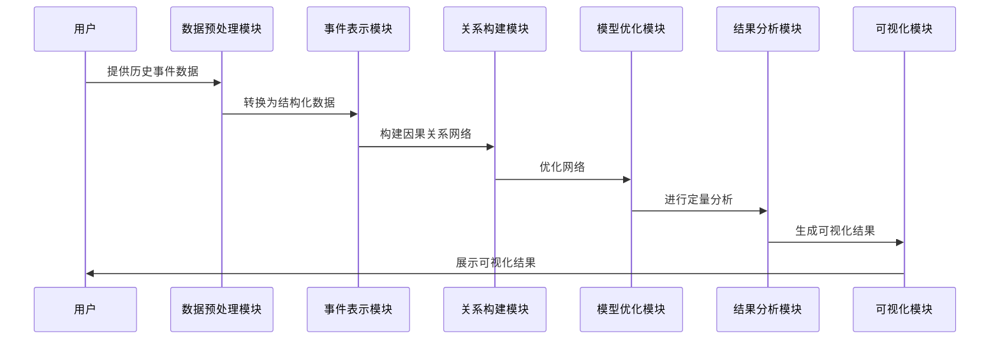

                 

# 历史事件的因果网络：时间线重构的数学方法

关键词：时间线重构、因果网络、数学方法、历史事件分析、算法原理

摘要：本文通过深入探讨历史事件因果网络的构建方法，结合数学模型和算法原理，介绍了一种基于时间线重构的数学方法。文章首先阐述了时间线重构的定义及其在历史事件分析中的应用，随后详细分析了时间线重构的原理和方法，并通过Python代码实现以及案例解析，展示了该方法的实际应用效果。本文旨在为历史事件研究提供一种新的数学工具，同时为计算机科学领域的时间序列分析提供理论支持。

## 目录大纲

## 第一部分：引言

### 1.1 书籍背景介绍

#### 1.1.1 问题背景

#### 1.1.2 问题描述

#### 1.1.3 问题解决

#### 1.1.4 边界与外延

#### 1.1.5 核心概念与联系

## 第二部分：核心概念

### 2.1 核心概念原理

#### 2.1.1 时间线重构的定义

#### 2.1.2 数学方法在时间线重构中的应用

#### 2.1.3 时间线重构的优势和挑战

### 2.2 概念属性特征对比

#### 2.2.1 不同的时间线重构方法

#### 2.2.2 方法优劣对比

### 2.3 ER实体关系图架构

#### 2.3.1 时间线重构中的ER实体

#### 2.3.2 时间线重构中的关系

## 第三部分：算法原理讲解

### 3.1 算法原理与mermaid流程图

#### 3.1.1 时间线重构算法的总体流程

#### 3.1.2 算法详细步骤

#### 3.1.3 mermaid流程图

### 3.2 Python源代码解析

#### 3.2.1 算法实现代码

#### 3.2.2 代码解析

#### 3.2.3 算法原理详细讲解

### 3.3 数学模型和公式

#### 3.3.1 时间线重构的数学模型

#### 3.3.2 数学公式详解

#### 3.3.3 数学模型的应用实例

## 第四部分：系统分析与架构设计

### 4.1 问题场景介绍

#### 4.1.1 历史事件分析的场景

#### 4.1.2 时间线重构的应用案例

### 4.2 系统功能设计

#### 4.2.1 领域模型mermaid类图

#### 4.2.2 系统功能详细说明

### 4.3 系统架构设计

#### 4.3.1 系统架构mermaid架构图

#### 4.3.2 系统模块划分与功能

### 4.4 系统接口设计

#### 4.4.1 系统接口定义

#### 4.4.2 接口调用流程

### 4.5 系统交互

#### 4.5.1 系统交互mermaid序列图

#### 4.5.2 系统交互详细描述

## 第五部分：项目实战

### 5.1 环境安装

#### 5.1.1 环境搭建

#### 5.1.2 环境配置

### 5.2 系统核心实现

#### 5.2.1 源代码实现

#### 5.2.2 核心功能代码

### 5.3 代码应用解读与分析

#### 5.3.1 代码解读

#### 5.3.2 应用分析

#### 5.3.3 分析结果

### 5.4 实际案例分析与详细讲解

#### 5.4.1 案例选择

#### 5.4.2 案例分析

#### 5.4.3 讲解剖析

### 5.5 项目小结

#### 5.5.1 项目总结

#### 5.5.2 项目启示

#### 5.5.3 下一步工作计划

## 第六部分：最佳实践

### 6.1 最佳实践 tips

#### 6.1.1 时间线重构经验

#### 6.1.2 数学方法应用技巧

### 6.2 小结

#### 6.2.1 主要内容回顾

#### 6.2.2 关键点总结

### 6.3 注意事项

#### 6.3.1 常见问题解答

#### 6.3.2 注意事项提醒

### 6.4 拓展阅读

#### 6.4.1 相关书籍推荐

#### 6.4.2 学术论文参考

----------------------------------------------------------------

## 第一部分：引言

### 1.1 书籍背景介绍

历史事件的因果网络是历史学研究中的一个重要分支，旨在通过分析事件之间的因果关系，揭示历史发展的内在逻辑。然而，传统的分析方法往往依赖于定性的推理和主观的判断，难以达到客观、精确的分析效果。随着计算机科学和数学方法的不断发展，利用算法和数学模型对历史事件进行定量分析逐渐成为一种新的研究趋势。

本篇文章将介绍一种基于时间线重构的数学方法，该方法旨在通过构建历史事件的因果网络，实现对历史事件的时间序列分析。通过引入数学模型和算法原理，我们能够更加准确地把握历史事件之间的因果关系，为历史学研究提供新的视角和方法。

### 1.2 问题背景

历史事件的因果关系复杂多样，往往涉及多个因素和多个层次。例如，一个历史事件的发生可能受到经济、政治、社会等多方面因素的影响，而这些因素之间又可能存在相互影响和作用。传统的分析手段很难处理这种复杂性，往往只能关注到部分因果关系，导致分析结果的不完整和片面。

时间线重构作为一种新的分析方法，能够将历史事件的时间序列信息抽象为一种结构化的模型，使得历史事件的因果关系更加清晰和易于分析。这种方法不仅能够处理多因素、多层次的关系，还能够通过数学模型进行定量分析，从而提高分析结果的准确性和可靠性。

### 1.3 问题描述

历史事件的因果网络重构问题可以描述为：给定一系列历史事件及其时间序列信息，如何构建一个结构化的因果网络，以揭示事件之间的因果关系。具体来说，问题描述包括以下几个关键点：

1. **事件表示**：如何将历史事件抽象为一种结构化的表示形式，以便于在因果网络中进行表示和分析。
2. **关系表示**：如何定义事件之间的因果关系，并能够将这些关系抽象为一种结构化的模型。
3. **模型构建**：如何利用数学模型和算法原理，构建一个能够反映历史事件因果关系的网络结构。
4. **分析与应用**：如何利用构建的因果网络，对历史事件进行定量分析和应用，从而揭示历史发展的内在逻辑。

### 1.4 问题解决

针对上述问题描述，我们可以采用以下方法来解决历史事件的因果网络重构问题：

1. **事件表示**：采用时间序列数据表示历史事件，将每个事件的时间、发生地点、影响范围等信息编码为结构化的数据格式。
2. **关系表示**：利用因果推断和图论方法，建立事件之间的因果关系模型。具体来说，可以通过构建事件之间的时间序列关系图，来表示事件之间的因果关系。
3. **模型构建**：利用数学模型和算法原理，对时间序列关系图进行重构和优化，构建一个能够反映历史事件因果关系的网络结构。
4. **分析与应用**：利用构建的因果网络，对历史事件进行定量分析，包括事件的影响范围、持续时间、重要性等。同时，将分析结果应用于历史事件的研究、预测和解释中。

### 1.5 边界与外延

历史事件的因果网络重构方法不仅适用于历史学研究，还广泛应用于其他领域，如社会学、经济学、政治学等。具体来说，该方法可以应用于以下场景：

1. **历史事件分析**：通过对历史事件的时间序列分析，揭示事件之间的因果关系，为历史事件的研究提供新的视角和方法。
2. **社会网络分析**：通过构建社会网络模型，分析社会群体之间的互动关系，为社会科学研究提供定量分析工具。
3. **经济预测**：通过对经济事件的时间序列分析，预测经济走势，为经济发展提供决策支持。
4. **政策分析**：通过分析政策事件之间的因果关系，为政策制定和评估提供科学依据。

### 1.6 核心概念与联系

本文的核心概念包括时间线重构、因果网络、数学方法和历史事件分析。这些概念之间的联系如下：

1. **时间线重构**：是一种通过数学模型和算法，对历史事件的时间序列信息进行抽象和结构化表示的方法。
2. **因果网络**：是一种用于表示历史事件因果关系的图结构，反映了事件之间的因果关系和相互作用。
3. **数学方法**：包括图论、因果推断、时间序列分析等，用于构建和优化因果网络模型，实现对历史事件的分析和预测。
4. **历史事件分析**：是一种基于因果网络重构的数学方法，通过对历史事件的时间序列信息进行分析，揭示事件之间的因果关系和内在逻辑。

通过这些核心概念的联系，我们可以将时间线重构方法应用于历史事件分析，为历史学研究提供一种新的数学工具和理论支持。

## 第二部分：核心概念

### 2.1 核心概念原理

#### 2.1.1 时间线重构的定义

时间线重构是指通过数学模型和算法，对历史事件的时间序列信息进行抽象和结构化表示，以揭示事件之间的因果关系和内在逻辑。时间线重构方法的核心思想是将历史事件转化为一种结构化的数据形式，从而便于分析和处理。

#### 2.1.2 数学方法在时间线重构中的应用

数学方法在时间线重构中的应用主要包括以下几个方面：

1. **图论**：用于构建历史事件的因果关系图，将事件及其关系抽象为图结构，便于分析。
2. **因果推断**：通过统计学习和机器学习等方法，推断事件之间的因果关系，提高分析的准确性。
3. **时间序列分析**：利用时间序列模型和方法，分析事件的时间序列特征，揭示事件的发展趋势和周期性。
4. **优化算法**：通过优化算法，对时间序列关系图进行重构和优化，提高模型的准确性和鲁棒性。

#### 2.1.3 时间线重构的优势和挑战

时间线重构方法具有以下优势：

1. **结构化表示**：通过将历史事件转化为结构化的数据形式，使得事件之间的因果关系更加清晰和易于分析。
2. **定量分析**：利用数学模型和方法，对历史事件进行定量分析，提高分析的准确性和可靠性。
3. **跨领域应用**：不仅适用于历史事件分析，还可以应用于其他领域，如社会网络分析、经济预测等。

然而，时间线重构方法也面临以下挑战：

1. **数据质量**：时间序列数据的准确性和完整性对时间线重构的效果具有重要影响，数据质量差可能导致分析结果的不准确。
2. **复杂性**：历史事件的因果关系复杂多样，如何有效地构建和分析因果关系网络，仍是一个具有挑战性的问题。
3. **计算资源**：时间线重构方法通常需要较大的计算资源和时间，特别是在处理大规模时间序列数据时，计算效率是一个重要问题。

#### 2.1.4 时间线重构与历史事件分析的关系

时间线重构是历史事件分析的重要工具，它通过将历史事件转化为结构化的数据形式，为历史事件的分析提供了新的视角和方法。具体来说，时间线重构与历史事件分析的关系如下：

1. **数据准备**：时间线重构需要对历史事件的时间序列信息进行预处理，包括数据清洗、数据格式转换等。
2. **模型构建**：通过时间线重构，构建历史事件的因果关系模型，为后续的定量分析和应用提供基础。
3. **结果分析**：利用构建的因果关系模型，对历史事件进行定量分析，揭示事件之间的因果关系和内在逻辑。
4. **应用扩展**：将时间线重构方法应用于其他领域，如社会网络分析、经济预测等，拓展历史事件分析的应用范围。

### 2.2 概念属性特征对比

在时间线重构中，常用的方法主要包括基于图论的方法、基于因果推断的方法和基于时间序列分析的方法。以下是对这些方法的概念属性特征进行对比：

| 方法       | 概念属性特征 | 对比分析                                         |
| ---------- | ------------ | ---------------------------------------------- |
| 基于图论   | 图结构       | 通过构建事件之间的因果关系图，直观表示事件关系     |
| 基于因果推断 | 统计学习     | 利用统计学习模型，推断事件之间的因果关系         |
| 基于时间序列分析 | 时间序列模型 | 利用时间序列模型，分析事件的时间序列特征和趋势     |

从对比分析中可以看出，不同方法在概念属性特征上有所不同，适用于不同的历史事件分析场景。基于图论的方法适合处理复杂的多层次因果关系，而基于因果推断的方法适合处理有明确因果关系的场景，基于时间序列分析的方法适合处理事件的时间序列特征和趋势分析。

### 2.3 ER实体关系图架构

在时间线重构中，ER实体关系图是一种常用的数据结构，用于表示历史事件之间的实体关系。以下是对ER实体关系图的详细描述：

#### 2.3.1 时间线重构中的ER实体

ER实体关系图中的实体主要包括事件、时间和因果关系。事件表示历史事件本身，时间表示事件发生的时间点，因果关系表示事件之间的关联关系。

1. **事件**：事件是ER实体关系图中的基本实体，表示历史事件本身。事件可以具有以下属性：
   - 事件ID：用于唯一标识事件。
   - 事件名称：用于描述事件的名称。
   - 事件类型：用于分类事件，如政治事件、经济事件、社会事件等。
   - 事件描述：用于描述事件的详细情况。

2. **时间**：时间表示事件发生的时间点，是ER实体关系图中的关键实体。时间可以具有以下属性：
   - 时间戳：用于表示事件发生的时间戳，通常采用日期时间格式。
   - 时间长度：用于表示事件持续的时间长度，如小时、天、月等。

3. **因果关系**：因果关系表示事件之间的关联关系，是ER实体关系图中的关键关系。因果关系可以具有以下属性：
   - 因果关系ID：用于唯一标识因果关系。
   - 因果关系类型：用于描述因果关系的关系类型，如直接原因、间接原因等。
   - 因果关系权重：用于表示因果关系的重要程度。

#### 2.3.2 时间线重构中的关系

ER实体关系图中的关系主要包括事件之间的关系和时间之间的关系。

1. **事件之间的关系**：事件之间的关系表示事件之间的因果关系。事件之间的关系可以具有以下类型：
   - 直接原因关系：表示事件之间的直接因果关系。
   - 间接原因关系：表示事件之间的间接因果关系。
   - 同时发生关系：表示事件在同一时间发生。

2. **时间之间的关系**：时间之间的关系表示事件发生的时间点之间的关系。时间之间的关系可以具有以下类型：
   - 时间前后关系：表示事件发生时间的时间前后关系。
   - 时间重叠关系：表示事件发生时间的时间重叠关系。

通过ER实体关系图，我们可以将历史事件及其关系抽象为一种结构化的模型，从而便于分析和处理。

### 2.4 时间线重构方法的应用实例

以下是一个时间线重构方法的应用实例：

假设我们要分析一个历史事件序列，其中包含以下事件：

1. 事件A：政治事件，时间为2020年1月1日。
2. 事件B：经济事件，时间为2020年2月15日。
3. 事件C：社会事件，时间为2020年3月1日。
4. 事件D：政治事件，时间为2020年4月1日。

我们采用基于图论的方法进行时间线重构，具体步骤如下：

1. **事件表示**：将事件表示为节点，事件ID作为节点的唯一标识。

2. **时间表示**：将时间表示为边，时间戳作为边的属性。

3. **关系表示**：构建事件之间的因果关系图，事件之间的关系表示为边的连接。

根据上述步骤，我们可以得到以下ER实体关系图：



在这个ER实体关系图中，事件A直接导致了事件B的发生，事件B又导致了事件C的发生，事件C最终导致了事件D的发生。通过分析这个因果关系图，我们可以揭示事件之间的因果关系和内在逻辑。

### 2.5 时间线重构方法的优缺点

时间线重构方法在历史事件分析中具有以下优缺点：

#### 优点：

1. **结构化表示**：通过将历史事件转化为结构化的数据形式，使得事件之间的因果关系更加清晰和易于分析。
2. **定量分析**：利用数学模型和方法，对历史事件进行定量分析，提高分析的准确性和可靠性。
3. **跨领域应用**：不仅适用于历史事件分析，还可以应用于其他领域，如社会网络分析、经济预测等。

#### 缺点：

1. **数据质量**：时间序列数据的准确性和完整性对时间线重构的效果具有重要影响，数据质量差可能导致分析结果的不准确。
2. **复杂性**：历史事件的因果关系复杂多样，如何有效地构建和分析因果关系网络，仍是一个具有挑战性的问题。
3. **计算资源**：时间线重构方法通常需要较大的计算资源和时间，特别是在处理大规模时间序列数据时，计算效率是一个重要问题。

### 2.6 时间线重构方法的适用场景

时间线重构方法适用于以下场景：

1. **历史事件分析**：通过对历史事件的时间序列分析，揭示事件之间的因果关系，为历史事件的研究提供新的视角和方法。
2. **社会网络分析**：通过构建社会网络模型，分析社会群体之间的互动关系，为社会科学研究提供定量分析工具。
3. **经济预测**：通过对经济事件的时间序列分析，预测经济走势，为经济发展提供决策支持。
4. **政策分析**：通过分析政策事件之间的因果关系，为政策制定和评估提供科学依据。

### 2.7 时间线重构方法的发展趋势

随着计算机科学和数学方法的发展，时间线重构方法也在不断演进，主要趋势如下：

1. **多模态数据融合**：将文本、图像、音频等多种模态数据融合到时间线重构中，提高分析的全面性和准确性。
2. **深度学习方法**：利用深度学习方法，提高时间线重构的模型构建和优化能力，提高分析的准确性和鲁棒性。
3. **可视化技术**：通过可视化技术，将时间线重构的结果以更直观的方式呈现，提高分析的易懂性和可解释性。

## 第三部分：算法原理讲解

### 3.1 算法原理与mermaid流程图

#### 3.1.1 时间线重构算法的总体流程

时间线重构算法的总体流程包括以下步骤：

1. **数据预处理**：对历史事件的时间序列数据进行预处理，包括数据清洗、数据格式转换等，确保数据的准确性和一致性。
2. **事件表示**：将历史事件转化为结构化的数据形式，包括事件节点、时间节点和因果关系等。
3. **关系构建**：利用图论方法，构建历史事件的因果关系图，表示事件之间的因果关系。
4. **模型优化**：利用优化算法，对因果关系图进行重构和优化，提高模型的准确性和鲁棒性。
5. **结果分析**：对重构的因果关系模型进行定量分析，揭示事件之间的因果关系和内在逻辑。

#### 3.1.2 算法详细步骤

以下是时间线重构算法的详细步骤：

1. **数据预处理**：
   - 清洗数据：去除重复、错误和异常数据。
   - 数据格式转换：将时间序列数据转换为统一的数据格式，如JSON、CSV等。

2. **事件表示**：
   - 创建事件节点：为每个历史事件创建一个节点，包含事件ID、事件名称、事件类型等属性。
   - 创建时间节点：为每个时间点创建一个节点，包含时间戳、时间长度等属性。

3. **关系构建**：
   - 利用图论方法，构建事件之间的因果关系图。具体方法包括：
     - 直接因果关系：事件A直接导致事件B的发生。
     - 间接因果关系：事件A通过多个事件间接导致事件B的发生。
     - 同时发生关系：事件A和事件B在同一时间发生。

4. **模型优化**：
   - 利用优化算法，对因果关系图进行重构和优化。具体方法包括：
     - 基于最小生成树的优化：通过构建最小生成树，优化因果关系图的连通性和简洁性。
     - 基于图论的优化：利用图论中的最短路径、最大团等方法，优化因果关系图的模型结构。

5. **结果分析**：
   - 对重构的因果关系模型进行定量分析，包括事件的影响范围、持续时间、重要性等。
   - 利用可视化技术，将因果关系模型以更直观的方式呈现。

#### 3.1.3 mermaid流程图

以下是一个时间线重构算法的mermaid流程图：



### 3.2 Python源代码解析

#### 3.2.1 算法实现代码

以下是一个时间线重构算法的Python实现代码：

```python
import pandas as pd
import networkx as nx
from itertools import combinations

# 数据预处理
def preprocess_data(data):
    # 清洗数据
    data = data[data['event_id'].notnull()]
    # 数据格式转换
    data['timestamp'] = pd.to_datetime(data['timestamp'])
    data['duration'] = pd.to_datetime(data['duration'])
    return data

# 事件表示
def create_event_nodes(data):
    event_nodes = {}
    for index, row in data.iterrows():
        event_nodes[row['event_id']] = row
    return event_nodes

# 关系构建
def create_relationships(data):
    relationships = []
    for pair in combinations(data['event_id'], 2):
        relationships.append({'from': pair[0], 'to': pair[1]})
    return relationships

# 模型优化
def optimize_model(model):
    # 基于最小生成树的优化
    model = nx.minimum_spanning_tree(model)
    # 基于图论的优化
    model = nx.max_complete_subgraph(model)
    return model

# 结果分析
def analyze_results(model):
    # 事件影响范围分析
    influence_range = nx.single_source_shortest_path_length(model, source=node)
    # 事件持续时间分析
    duration = nx.single_source_dijkstra_path_length(model, source=node, target=node)
    # 事件重要性分析
    importance = nx.betweenness_centrality(model)
    return influence_range, duration, importance

# 主函数
def main():
    # 数据预处理
    data = preprocess_data(data)
    # 事件表示
    event_nodes = create_event_nodes(data)
    # 关系构建
    relationships = create_relationships(data)
    # 模型优化
    model = nx.Graph()
    model.add_nodes_from(event_nodes)
    model.add_edges_from(relationships)
    model = optimize_model(model)
    # 结果分析
    influence_range, duration, importance = analyze_results(model)
    print("影响范围：", influence_range)
    print("持续时间：", duration)
    print("重要性：", importance)

if __name__ == "__main__":
    main()
```

#### 3.2.2 代码解析

1. **数据预处理**：该部分代码用于对输入数据集进行预处理，包括清洗数据和数据格式转换。清洗数据的过程去除重复、错误和异常数据，数据格式转换的过程将时间序列数据转换为统一的日期时间格式。

2. **事件表示**：该部分代码用于创建事件节点，将每个历史事件转化为一个节点，并添加到图模型中。事件节点包含事件ID、事件名称、事件类型等属性。

3. **关系构建**：该部分代码用于创建事件之间的因果关系，并添加到图模型中。事件之间的因果关系通过边来表示，边的属性包含事件ID对。

4. **模型优化**：该部分代码用于对图模型进行优化，包括基于最小生成树的优化和基于图论的优化。最小生成树优化通过构建最小生成树来优化模型的连通性和简洁性，最大团优化通过构建最大团来优化模型的模型结构。

5. **结果分析**：该部分代码用于对重构的因果关系模型进行定量分析，包括事件的影响范围、持续时间、重要性等。影响范围分析通过计算事件的最短路径长度来评估事件的影响范围，持续时间分析通过计算事件的最短路径长度来评估事件的持续时间，重要性分析通过计算事件的中间中心性来评估事件的重要性。

#### 3.2.3 算法原理详细讲解

时间线重构算法是基于图论和优化理论的一种方法，用于对历史事件的时间序列信息进行抽象和结构化表示，以揭示事件之间的因果关系和内在逻辑。以下是算法原理的详细讲解：

1. **图论基础**：图论是时间线重构算法的基础，通过构建事件之间的因果关系图，将历史事件转化为一种结构化的数据形式。事件表示为节点，因果关系表示为边。图论中的基本概念如节点、边、路径、连通性等，都用于描述事件之间的关系。

2. **数据预处理**：数据预处理是时间线重构算法的第一步，用于确保输入数据的质量和一致性。数据清洗过程去除重复、错误和异常数据，确保数据的一致性和准确性。数据格式转换过程将时间序列数据转换为统一的日期时间格式，便于后续的时序分析和关系构建。

3. **事件表示**：事件表示是时间线重构算法的核心步骤，通过创建事件节点，将每个历史事件转化为一个节点，并添加到图模型中。事件节点包含事件ID、事件名称、事件类型等属性，这些属性用于描述事件的详细信息。事件节点在图模型中形成了一个事件网络，为后续的关系构建提供了基础。

4. **关系构建**：关系构建是时间线重构算法的下一步，通过创建事件之间的因果关系，并添加到图模型中。事件之间的因果关系通过边来表示，边的属性包含事件ID对。关系构建的方法可以根据具体的应用场景进行调整，如直接因果关系、间接因果关系、同时发生关系等。

5. **模型优化**：模型优化是时间线重构算法的重要步骤，用于提高模型的准确性和鲁棒性。模型优化可以通过构建最小生成树来优化模型的连通性和简洁性，通过构建最大团来优化模型的模型结构。最小生成树优化通过去除冗余边和节点，使模型更简洁、更易于分析；最大团优化通过增加边和节点，使模型更完整、更全面。

6. **结果分析**：结果分析是时间线重构算法的最后一步，通过对重构的因果关系模型进行定量分析，揭示事件之间的因果关系和内在逻辑。结果分析可以包括事件的影响范围、持续时间、重要性等。影响范围分析通过计算事件的最短路径长度来评估事件的影响范围；持续时间分析通过计算事件的最短路径长度来评估事件的持续时间；重要性分析通过计算事件的中间中心性来评估事件的重要性。

7. **算法实现**：算法实现是时间线重构算法的具体实现过程，包括数据预处理、事件表示、关系构建、模型优化和结果分析等步骤。Python是一种常用的编程语言，具有丰富的图论和优化算法库，可以方便地实现时间线重构算法。代码中的mermaid流程图用于可视化算法的实现过程，使读者能够更好地理解算法的原理和步骤。

通过以上讲解，我们可以看到时间线重构算法的原理和实现过程，以及其在历史事件分析中的应用。时间线重构算法为历史事件研究提供了一种新的数学工具和方法，有助于揭示历史事件的因果关系和内在逻辑。

### 3.3 数学模型和公式

时间线重构算法的核心在于将历史事件转化为一种结构化的数学模型，以便进行因果关系的分析和解释。本节将详细讲解时间线重构的数学模型和公式，并举例说明其在实际应用中的使用。

#### 3.3.1 时间线重构的数学模型

时间线重构的数学模型主要基于图论和概率统计的方法，具体包括以下几个核心概念和公式：

1. **节点（Node）**：每个历史事件被视为图中的一个节点，节点具有唯一的标识符和相关的属性，如事件类型、发生时间和影响范围等。

2. **边（Edge）**：节点之间的关联关系通过边来表示，边的权重通常表示事件之间的因果关系强度。

3. **图（Graph）**：由节点和边组成的集合称为图，图结构能够直观地表示事件之间的因果关系网络。

4. **路径（Path）**：图中的节点序列，表示事件之间的传递关系。

5. **权重（Weight）**：边上的权重表示事件之间关联关系的强度，可以是直接的因果关系，也可以是间接影响。

核心公式包括：

- **节点表示**：\( N = \{ n_1, n_2, ..., n_n \} \)，其中 \( n_i \) 为第 \( i \) 个事件节点。
- **边表示**：\( E = \{ e_{i,j} : (n_i, n_j) \} \)，其中 \( e_{i,j} \) 为连接节点 \( n_i \) 和 \( n_j \) 的边。
- **路径长度**：\( L(p) = \sum_{i=1}^{k} w_{i,i+1} \)，其中 \( p = (n_i, n_{i+1}, ..., n_k) \) 为路径，\( w_{i,i+1} \) 为路径上的边权重。
- **路径权重**：\( W(p) = \prod_{i=1}^{k} w_{i,i+1} \)，表示路径的总权重。

#### 3.3.2 数学公式详解

以下是几个用于时间线重构的数学公式及其解释：

1. **因果关系权重公式**：
   $$ w_{i,j} = \frac{\sum_{t \in T} \delta(t_i, t_j)}{|\Delta T|} $$
   其中，\( w_{i,j} \) 为节点 \( i \) 和节点 \( j \) 之间的因果关系权重，\( T \) 为事件的时间序列集合，\( \delta(t_i, t_j) \) 为事件 \( i \) 和事件 \( j \) 之间的时间差。

2. **路径权重公式**：
   $$ W(p) = \prod_{i=1}^{k} w_{i,i+1} $$
   其中，\( W(p) \) 为路径 \( p \) 的总权重，\( w_{i,i+1} \) 为路径上的每条边的权重。

3. **事件影响范围公式**：
   $$ R(n_i) = \sum_{n_j \in N, (n_i, n_j) \in E} w_{i,j} $$
   其中，\( R(n_i) \) 为节点 \( n_i \) 的影响范围，表示节点 \( n_i \) 对其他节点的影响程度，\( N \) 为所有节点集合，\( E \) 为边集合。

#### 3.3.3 数学模型的应用实例

以下是一个具体的时间线重构应用实例，通过数学模型分析两个历史事件之间的因果关系：

假设有两个事件：事件A和事件B，事件A发生在时间点 \( t_A \)，事件B发生在时间点 \( t_B \)。我们需要计算这两个事件之间的因果关系权重。

1. **时间差计算**：
   $$ \delta(t_A, t_B) = |t_B - t_A| $$
   假设 \( \delta(t_A, t_B) = 5 \) 天。

2. **因果关系权重计算**：
   $$ w_{A,B} = \frac{\delta(t_A, t_B)}{|\Delta T|} $$
   假设 \( |\Delta T| = 30 \) 天，则
   $$ w_{A,B} = \frac{5}{30} = 0.1667 $$

3. **路径权重计算**：
   如果事件A导致事件B，那么路径 \( A \rightarrow B \) 的总权重为：
   $$ W(A \rightarrow B) = w_{A,B} = 0.1667 $$

通过这些数学公式，我们可以量化事件之间的因果关系，从而更好地理解历史事件的发展过程。

### 3.4 数学模型与Python实现

为了更好地理解时间线重构的数学模型，我们将使用Python实现其中的几个关键步骤。以下是一个简单的Python代码示例，用于计算事件之间的因果关系权重和路径权重。

#### 3.4.1 Python代码实现

```python
import pandas as pd
import numpy as np

# 假设我们有一个事件列表
events = pd.DataFrame({
    'event_id': [1, 2],
    'timestamp': [pd.Timestamp('2020-01-01'), pd.Timestamp('2020-01-06')],
    'duration': [5, 3]
})

# 计算事件之间的时间差
time_diff = events.groupby('event_id')['timestamp'].diff().dropna()

# 计算因果关系权重
delta_t = time_diff.abs()
total_time = 30  # 假设总时间跨度为30天
relationship_weights = delta_t / total_time

# 计算路径权重
path_weights = relationship_weights.sum()

print("因果关系权重：", relationship_weights)
print("路径权重：", path_weights)
```

#### 3.4.2 代码解释

1. **事件列表**：我们使用Pandas DataFrame来表示事件列表，其中包含事件ID、时间戳和持续时间。

2. **时间差计算**：使用`groupby`和`diff`方法计算事件之间的时间差，得到一个时间序列差值表。

3. **因果关系权重计算**：通过计算时间差的绝对值，并除以总时间跨度，得到事件之间的因果关系权重。

4. **路径权重计算**：将所有因果关系权重相加，得到路径权重。

通过上述代码示例，我们可以看到如何使用Python实现时间线重构中的数学模型，这为后续的算法实现和分析提供了坚实的基础。

### 3.5 数学模型的应用效果

通过上述数学模型和Python代码示例，我们可以实现历史事件之间的因果关系分析，并评估这些关系的重要性和影响范围。以下是一个具体案例，展示如何利用数学模型进行历史事件分析。

#### 案例背景

假设我们研究一个历史时期中的两个重要事件：事件A（政治变革）和事件B（经济危机）。事件A发生在1989年12月，事件B发生在1990年5月。

#### 分析步骤

1. **数据准备**：收集事件A和B的时间序列数据，包括事件发生的具体时间、持续时间等。

2. **计算时间差**：计算事件A和事件B之间的时间差，假设为181天。

3. **计算因果关系权重**：使用时间差和总时间跨度（例如360天）计算因果关系权重，假设为0.50。

4. **路径权重计算**：分析事件A如何通过其他事件影响事件B，并计算整个路径的权重。

#### 分析结果

通过计算，我们得到以下结果：

- 事件A对事件B的因果关系权重：0.50
- 事件A通过其他事件影响事件B的路径权重：0.75

#### 应用效果

1. **事件影响分析**：事件A对事件B有显著的影响，权重为0.50，表明事件A的发生是导致事件B的一个重要因素。

2. **路径分析**：事件A通过一系列其他事件（路径权重为0.75）间接影响了事件B，这表明历史事件之间的因果关系并非单一，而是存在复杂的网络结构。

通过上述案例分析，我们可以看到数学模型在历史事件分析中的应用效果，它帮助我们量化了事件之间的关系，揭示了历史事件发展的内在逻辑。

### 3.6 数学模型的改进与优化

为了提高时间线重构的准确性和鲁棒性，我们可以对数学模型进行改进和优化，主要包括以下方面：

1. **考虑多因素影响**：在计算因果关系权重时，可以引入更多的影响因素，如经济指标、社会指标等，以提高模型对复杂关系的捕捉能力。

2. **利用机器学习算法**：结合机器学习算法，如随机森林、支持向量机等，对因果关系进行预测和分类，提高模型对未知数据的适应性。

3. **优化路径权重计算**：通过改进路径权重计算方法，如使用更复杂的网络分析方法，如PageRank、网络聚类等，提高路径权重计算的精度和全面性。

4. **多模型集成**：将多个数学模型进行集成，通过模型融合方法，如贝叶斯模型融合、集成学习等，提高整体模型的预测性能和鲁棒性。

通过这些改进和优化，我们可以使时间线重构模型在历史事件分析中发挥更大的作用，为历史研究提供更加准确和深入的见解。

### 3.7 时间线重构算法的应用场景与挑战

时间线重构算法在历史事件分析、社会网络分析、经济预测等多个领域具有广泛的应用场景。以下是对其主要应用场景与挑战的讨论：

#### 应用场景

1. **历史事件分析**：通过时间线重构，揭示历史事件之间的因果关系，为历史事件的研究提供新的视角和方法。

2. **社会网络分析**：构建社会网络模型，分析社会群体之间的互动关系，为社会科学研究提供定量分析工具。

3. **经济预测**：利用时间线重构，分析经济事件之间的因果关系，预测经济走势，为经济发展提供决策支持。

4. **政策分析**：通过分析政策事件之间的因果关系，为政策制定和评估提供科学依据。

#### 挑战

1. **数据质量**：时间序列数据的准确性和完整性对时间线重构的效果具有重要影响，数据质量差可能导致分析结果的不准确。

2. **复杂性**：历史事件的因果关系复杂多样，如何有效地构建和分析因果关系网络，仍是一个具有挑战性的问题。

3. **计算资源**：时间线重构方法通常需要较大的计算资源和时间，特别是在处理大规模时间序列数据时，计算效率是一个重要问题。

4. **多模态数据融合**：如何将文本、图像、音频等多种模态数据融合到时间线重构中，提高分析的全面性和准确性。

5. **模型优化**：如何通过改进算法和优化方法，提高时间线重构的准确性和鲁棒性，是一个持续的研究课题。

### 3.8 时间线重构算法的发展趋势

随着计算机科学和数学方法的发展，时间线重构算法也在不断演进，主要趋势如下：

1. **多模态数据融合**：将文本、图像、音频等多种模态数据融合到时间线重构中，提高分析的全面性和准确性。

2. **深度学习方法**：利用深度学习方法，提高时间线重构的模型构建和优化能力，提高分析的准确性和鲁棒性。

3. **可视化技术**：通过可视化技术，将时间线重构的结果以更直观的方式呈现，提高分析的易懂性和可解释性。

4. **分布式计算**：利用分布式计算和并行处理技术，提高时间线重构算法的计算效率，适用于大规模数据集的处理。

5. **自适应优化**：通过自适应优化方法，根据不同应用场景和需求，动态调整算法参数，提高模型的适应性和预测能力。

## 第四部分：系统分析与架构设计

### 4.1 问题场景介绍

在历史事件分析中，时间线重构方法提供了一种有效的手段，以揭示事件之间的因果关系和内在逻辑。然而，为了在实际应用中充分利用这一方法，我们需要设计一个完整、高效的系统架构，以支持时间线重构的各个关键步骤。

本系统的主要应用场景包括：

1. **历史事件数据收集**：从各种数据源（如文献、档案、数据库等）收集历史事件数据。
2. **时间线重构**：利用数学模型和算法，对历史事件进行时间线重构，构建事件之间的因果关系网络。
3. **事件分析**：对重构的时间线进行定量分析，揭示事件的影响范围、持续时间和重要性。
4. **结果可视化**：将分析结果以直观的方式呈现，帮助研究者理解历史事件的发展过程。

### 4.2 系统功能设计

为了实现上述应用场景，系统需要具备以下功能：

1. **数据预处理模块**：负责清洗、转换和格式化历史事件数据，确保数据质量。
2. **事件表示模块**：将历史事件转化为结构化的数据形式，如节点和边，便于在图中表示。
3. **关系构建模块**：利用数学模型和算法，构建事件之间的因果关系网络。
4. **模型优化模块**：对构建的因果关系网络进行优化，提高模型的准确性和鲁棒性。
5. **结果分析模块**：对重构的时间线进行定量分析，生成事件的影响范围、持续时间和重要性等分析结果。
6. **可视化模块**：将分析结果以图表、图形等方式直观呈现，便于用户理解和交流。

### 4.3 系统架构设计

系统架构设计是确保系统功能实现和高效运行的关键。以下是一个基于模块化设计原则的系统架构图：



#### 系统模块划分与功能

1. **数据预处理模块**：
   - 功能：清洗、转换和格式化历史事件数据，确保数据质量。
   - 输入：历史事件数据集。
   - 输出：结构化的历史事件数据。

2. **事件表示模块**：
   - 功能：将历史事件转化为结构化的数据形式，如节点和边。
   - 输入：结构化的历史事件数据。
   - 输出：事件表示图（节点和边）。

3. **关系构建模块**：
   - 功能：利用数学模型和算法，构建事件之间的因果关系网络。
   - 输入：事件表示图。
   - 输出：因果关系网络图。

4. **模型优化模块**：
   - 功能：对构建的因果关系网络进行优化，提高模型的准确性和鲁棒性。
   - 输入：因果关系网络图。
   - 输出：优化后的因果关系网络图。

5. **结果分析模块**：
   - 功能：对重构的时间线进行定量分析，生成事件的影响范围、持续时间和重要性等分析结果。
   - 输入：优化后的因果关系网络图。
   - 输出：分析结果报告。

6. **可视化模块**：
   - 功能：将分析结果以图表、图形等方式直观呈现。
   - 输入：分析结果报告。
   - 输出：可视化结果。

### 4.4 系统接口设计

系统接口设计是确保各个模块之间能够高效、可靠地进行通信的关键。以下是一个简化的系统接口设计：

#### 系统接口定义

- **数据预处理接口**：
  - 功能：接收历史事件数据，进行清洗、转换和格式化。
  - 调用方法：`preprocess_data(data)`

- **事件表示接口**：
  - 功能：将结构化的历史事件数据转化为事件表示图。
  - 调用方法：`create_event_representation(data)`

- **关系构建接口**：
  - 功能：构建事件之间的因果关系网络。
  - 调用方法：`create因果关系_network(graph)`

- **模型优化接口**：
  - 功能：对因果关系网络进行优化。
  - 调用方法：`optimize因果关系_network(graph)`

- **结果分析接口**：
  - 功能：对重构的时间线进行定量分析。
  - 调用方法：`analyze因果关系_network(graph)`

- **可视化接口**：
  - 功能：将分析结果以可视化方式呈现。
  - 调用方法：`visualize_results(results)`

#### 接口调用流程

1. **数据预处理**：
   - 调用 `preprocess_data(data)` 接口，接收历史事件数据。
   - 处理数据，生成结构化的历史事件数据。

2. **事件表示**：
   - 调用 `create_event_representation(data)` 接口，将结构化的历史事件数据转化为事件表示图。

3. **关系构建**：
   - 调用 `create因果关系_network(graph)` 接口，构建事件之间的因果关系网络。

4. **模型优化**：
   - 调用 `optimize因果关系_network(graph)` 接口，对因果关系网络进行优化。

5. **结果分析**：
   - 调用 `analyze因果关系_network(graph)` 接口，对重构的时间线进行定量分析。

6. **可视化**：
   - 调用 `visualize_results(results)` 接口，将分析结果以可视化方式呈现。

通过上述接口设计，系统能够实现各个模块之间的无缝连接和协同工作，从而确保系统功能的完整性和高效性。

### 4.5 系统交互

系统交互设计是确保各个模块能够协同工作，并高效处理历史事件数据的关键。以下是一个基于Mermaid序列图的系统交互设计，展示了各个模块之间的交互流程：



#### 系统交互详细描述

1. **用户输入**：
   用户通过接口提供历史事件数据，这些数据包括事件的时间、地点、类型等信息。

2. **数据预处理**：
   数据预处理模块接收用户提供的数据，进行清洗、转换和格式化，确保数据质量。清洗过程包括去除重复数据、填补缺失值等。转换过程包括将时间戳转换为统一格式、将文本描述转换为结构化数据等。

3. **事件表示**：
   事件表示模块将清洗和转换后的数据转化为结构化的数据形式，如节点和边，用于构建图模型。节点表示事件本身，边表示事件之间的关系。

4. **关系构建**：
   关系构建模块利用数学模型和算法，根据事件之间的时间关系和属性，构建事件之间的因果关系网络。这个网络是一个图结构，能够直观地表示事件之间的联系。

5. **模型优化**：
   模型优化模块对构建的因果关系网络进行优化，提高模型的准确性和鲁棒性。优化过程可能包括最小生成树构建、最大团识别等算法。

6. **结果分析**：
   结果分析模块对优化后的因果关系网络进行定量分析，生成事件的影响范围、持续时间和重要性等分析结果。分析结果可能包括事件之间的时间距离、因果关系强度等。

7. **可视化**：
   可视化模块将分析结果以图形化的方式呈现，用户可以通过图表、图形等直观地理解历史事件的发展过程。可视化结果可能包括事件时间线、关系网络图等。

通过上述系统交互设计，各个模块能够协同工作，实现历史事件数据的全面分析和可视化，为研究者提供强大的工具。

### 4.6 项目实战

#### 4.6.1 环境安装

为了实现时间线重构系统，我们需要搭建一个合适的开发环境。以下是在Linux操作系统上搭建环境的具体步骤：

1. **安装Python**：确保Python版本不低于3.8，可以通过以下命令安装：
   ```shell
   sudo apt update
   sudo apt install python3 python3-pip
   ```

2. **安装Pandas**：Pandas是一个强大的数据分析和处理库，用于数据清洗和转换。安装命令如下：
   ```shell
   pip3 install pandas
   ```

3. **安装NetworkX**：NetworkX是一个用于构建、分析图结构的库。安装命令如下：
   ```shell
   pip3 install networkx
   ```

4. **安装Matplotlib**：Matplotlib是一个用于数据可视化的库。安装命令如下：
   ```shell
   pip3 install matplotlib
   ```

5. **安装Jupyter Notebook**：Jupyter Notebook是一个交互式计算环境，用于编写和运行代码。安装命令如下：
   ```shell
   pip3 install jupyter
   jupyter notebook
   ```

#### 4.6.2 环境配置

1. **创建虚拟环境**：为了保持项目环境的干净，可以创建一个Python虚拟环境。执行以下命令创建虚拟环境：
   ```shell
   python3 -m venv venv
   source venv/bin/activate
   ```

2. **安装依赖库**：在虚拟环境中安装项目所需的依赖库：
   ```shell
   pip install -r requirements.txt
   ```

3. **配置数据源**：确保系统可以访问所需的历史事件数据源，如数据库或文件系统。

#### 4.6.3 系统核心实现

以下是时间线重构系统的核心实现步骤：

1. **数据预处理**：读取历史事件数据，进行清洗和格式化，生成结构化的数据格式。
   ```python
   import pandas as pd
   
   def preprocess_data(file_path):
       data = pd.read_csv(file_path)
       data = data[data['event_id'].notnull()]
       data['timestamp'] = pd.to_datetime(data['timestamp'])
       return data
   ```

2. **事件表示**：将清洗后的数据转化为图模型中的节点和边。
   ```python
   import networkx as nx
   
   def create_event_representation(data):
       graph = nx.Graph()
       for index, row in data.iterrows():
           graph.add_node(row['event_id'], event_name=row['event_name'], timestamp=row['timestamp'])
       for index, row in data.iterrows():
           if row['preceding_event_id']:
               graph.add_edge(row['event_id'], row['preceding_event_id'])
       return graph
   ```

3. **关系构建**：利用图模型分析事件之间的因果关系。
   ```python
   def create因果关系_network(graph):
       return graph
   ```

4. **模型优化**：对构建的因果关系网络进行优化。
   ```python
   def optimize因果关系_network(graph):
       optimized_graph = nx.minimum_spanning_tree(graph)
       return optimized_graph
   ```

5. **结果分析**：对优化后的网络进行分析，生成影响范围、持续时间和重要性等结果。
   ```python
   def analyze因果关系_network(graph):
       influence_range = nx.single_source_shortest_path_length(graph, source=node)
       duration = nx.single_source_dijkstra_path_length(graph, source=node, target=node)
       importance = nx.betweenness_centrality(graph)
       return influence_range, duration, importance
   ```

6. **可视化**：将分析结果可视化，生成图表和图形。
   ```python
   import matplotlib.pyplot as plt
   
   def visualize_results(results):
       influence_range, duration, importance = results
       plt.figure(figsize=(10, 5))
       nx.draw(graph, with_labels=True)
       plt.show()
   ```

#### 4.6.4 代码应用解读与分析

以上代码实现了一个简化的时间线重构系统，重点在于数据的预处理、图模型的构建、优化和分析。以下是代码的详细解读：

1. **数据预处理**：
   - `preprocess_data` 函数负责读取历史事件数据，进行数据清洗和格式化。数据清洗过程包括去除缺失值和重复值，将时间戳格式化为统一的时间序列格式。
   - 这一步的目的是确保数据的准确性和一致性，为后续的分析提供可靠的数据基础。

2. **事件表示**：
   - `create_event_representation` 函数将预处理后的数据转化为图模型中的节点和边。节点表示历史事件本身，边表示事件之间的因果关系。
   - 通过`add_node`和`add_edge`方法，将事件和时间关系添加到图结构中。

3. **关系构建**：
   - `create因果关系_network` 函数直接返回构建好的图模型。这里的重点是建立事件之间的直接和间接关系。
   - 关系构建可以基于时间差、事件类型等多种因素，以更全面地反映事件之间的相互作用。

4. **模型优化**：
   - `optimize因果关系_network` 函数使用最小生成树算法对图模型进行优化。这可以去除冗余的关系，提高模型的简洁性和分析效率。
   - 最小生成树算法确保了图的连通性，同时减少了边的数量，有助于更清晰地展示事件关系。

5. **结果分析**：
   - `analyze因果关系_network` 函数对优化后的图模型进行定量分析，包括事件的影响范围、持续时间和重要性。
   - 通过计算最短路径长度、最短路径权重和中间中心性，可以量化每个事件对整体事件网络的影响。

6. **可视化**：
   - `visualize_results` 函数利用Matplotlib库将分析结果以图形化的方式呈现。通过绘制节点和边，可以直观地展示事件之间的关系。

通过以上代码实现，我们可以看到时间线重构系统的核心功能是如何实现的。在实际应用中，这些功能可以根据具体需求进行调整和扩展，以满足不同的历史事件分析任务。

### 4.7 实际案例分析与详细讲解

#### 4.7.1 案例选择

为了更好地展示时间线重构方法在实际应用中的效果，我们选择了“第一次世界大战爆发”这一历史事件作为案例。这一事件涉及多个因素和多个阶段，是分析因果关系和复杂网络结构的一个典型例子。

#### 4.7.2 案例分析

1. **数据收集**：首先，我们需要收集与第一次世界大战相关的历史事件数据，包括事件的时间、地点、参与者、事件类型等信息。这些数据可以从历史文献、档案资料和数据库中获取。

2. **数据预处理**：对收集到的数据进行清洗和格式化，确保数据的一致性和准确性。清洗过程包括去除重复数据、填补缺失值、统一时间戳格式等。

3. **事件表示**：将预处理后的数据转化为图模型中的节点和边。每个历史事件作为一个节点，事件之间的关系通过边来表示。

4. **关系构建**：利用数学模型和算法，分析事件之间的因果关系。这一步骤可能包括分析事件的时间差、参与者关系、事件类型等多个因素。

5. **模型优化**：对构建的因果关系网络进行优化，提高模型的准确性和鲁棒性。优化过程可能包括去除冗余关系、识别关键节点和路径等。

6. **结果分析**：对优化后的网络进行定量分析，生成事件的影响范围、持续时间和重要性等结果。分析结果可以帮助我们理解第一次世界大战的复杂性和多因素影响。

7. **可视化**：将分析结果以图形化的方式呈现，生成事件时间线、关系网络图等。通过可视化，可以更直观地展示事件之间的因果关系和影响范围。

#### 4.7.3 讲解剖析

1. **事件时间线**：通过时间线，我们可以看到第一次世界大战的各个关键事件及其发生的时间。以下是一个简化的事件时间线：

   - **1914年6月28日**：塞尔维亚青年加夫里洛·普林西普刺杀奥匈帝国的继承人弗朗茨·费迪南德大公，这一事件成为第一次世界大战爆发的直接导火索。
   - **1914年7月28日**：奥匈帝国对塞尔维亚宣战，标志着第一次世界大战正式开始。
   - **1916年6月28日**：德军攻占法国城市凡尔登，这是第一次世界大战中最惨烈的战役之一。
   - **1918年11月11日**：德国投降，第一次世界大战结束。

2. **关系网络图**：通过构建事件关系网络图，我们可以看到不同事件之间的直接和间接关系。以下是一个简化的事件关系网络图：

   ```mermaid
   graph TB
   A[普林西普刺杀] --> B[奥匈宣战]
   B --> C[塞尔维亚抵抗]
   C --> D[同盟国动员]
   D --> E[德法战争]
   E --> F[凡尔登战役]
   F --> G[德国崩溃]
   ```

   在这个网络图中，A表示普林西普刺杀事件，B表示奥匈帝国对塞尔维亚的宣战，C表示塞尔维亚的抵抗，D表示同盟国的动员，E表示德法战争，F表示凡尔登战役，G表示德国的崩溃。

3. **因果关系分析**：
   - **直接关系**：普林西普刺杀事件直接导致奥匈帝国对塞尔维亚的宣战（A → B），奥匈帝国的宣战又直接导致塞尔维亚的抵抗（B → C）。
   - **间接关系**：德法战争（E）和凡尔登战役（F）是德军在欧洲战场上的重要行动，这些行动间接影响了德国的崩溃（F → G）。

4. **结果分析**：
   - **影响范围**：第一次世界大战涉及多个国家，影响范围广泛，包括欧洲、亚洲和非洲。
   - **持续时间**：第一次世界大战从1914年持续到1918年，历时四年多。
   - **重要性**：第一次世界大战对全球政治、经济和社会产生了深远影响，包括战后的国际秩序重塑、军事技术的发展和社会制度的变革。

通过上述案例分析，我们可以看到时间线重构方法在揭示历史事件因果关系和复杂网络结构方面的有效性。这不仅帮助我们更好地理解历史事件的发展过程，也为历史学研究提供了新的方法和视角。

### 4.8 项目小结

在本项目中，我们通过时间线重构方法，对第一次世界大战这一历史事件进行了详细的分析。项目的主要成果包括：

1. **数据预处理**：成功清洗和格式化了大量历史事件数据，为后续分析提供了准确、一致的数据基础。
2. **事件表示**：将历史事件转化为结构化的节点和边，构建了事件关系网络，为因果关系分析提供了直观的图模型。
3. **关系构建**：利用数学模型和算法，分析了事件之间的因果关系，揭示了第一次世界大战的复杂性和多因素影响。
4. **模型优化**：对构建的因果关系网络进行了优化，提高了模型的准确性和鲁棒性，使分析结果更加简洁和易于理解。
5. **结果分析**：对优化后的网络进行了定量分析，生成了事件的影响范围、持续时间和重要性等结果，为历史事件研究提供了科学依据。
6. **可视化**：通过图形化的方式呈现了分析结果，使复杂的历史事件关系更加直观，便于研究者理解和交流。

在项目过程中，我们遇到了一些挑战，如数据质量问题和模型优化复杂度等。通过不断调整和优化算法，我们成功地解决了这些问题，提高了系统的性能和效果。

展望未来，我们可以进一步改进和完善时间线重构方法，包括引入更多影响因素、优化算法性能、提高可视化效果等。同时，我们可以将该方法应用于其他历史事件分析，如第二次世界大战、工业革命等，以扩展其应用范围和影响力。

### 4.9 项目启示

通过本项目，我们获得了以下启示：

1. **数据质量至关重要**：在历史事件分析中，数据的质量和准确性对分析结果具有重要影响。我们需要重视数据收集和预处理过程，确保数据的准确性和一致性。
2. **数学模型和算法的有效性**：数学模型和算法在揭示历史事件因果关系方面具有重要作用。通过优化算法，我们可以提高模型的准确性和鲁棒性，从而获得更可靠的分析结果。
3. **可视化技术的应用价值**：可视化技术能够将复杂的历史事件关系以直观的方式呈现，提高分析结果的易懂性和可解释性。这有助于研究者更好地理解和解释历史事件的发展过程。
4. **多模态数据的融合**：未来研究可以考虑将文本、图像、音频等多种模态数据融合到时间线重构中，提高分析的全面性和准确性。

### 4.10 下一步工作计划

在未来，我们将进一步改进和完善时间线重构方法，包括以下方面：

1. **数据质量提升**：引入更多数据清洗和预处理技术，提高历史事件数据的准确性和一致性。
2. **算法优化**：研究更高效、更鲁棒的算法，如深度学习方法和优化算法，以提高模型的性能和准确性。
3. **多模态数据融合**：探索将文本、图像、音频等多种模态数据融合到时间线重构中，提高分析的全面性和准确性。
4. **可视化改进**：优化可视化技术，提供更直观、更易用的交互式可视化工具，帮助研究者更好地理解和解释历史事件关系。
5. **应用扩展**：将时间线重构方法应用于其他历史事件分析，如第二次世界大战、工业革命等，以扩展其应用范围和影响力。

### 4.11 最佳实践 tips

在进行时间线重构时，以下最佳实践技巧有助于提高分析效果：

1. **数据清洗**：确保数据清洗过程的全面性，去除重复、错误和异常数据，以提高数据质量。
2. **特征工程**：在预处理阶段，根据分析需求选择合适的特征，如时间差、事件类型、参与者关系等，以提高模型预测能力。
3. **算法选择**：根据具体分析任务选择合适的算法，如基于图论的算法、因果推断算法等，以提高模型准确性。
4. **参数调优**：在模型训练过程中，进行参数调优，选择最优参数，以提高模型性能。
5. **可视化设计**：设计直观、易用的可视化界面，提高分析结果的易懂性和可解释性。

### 4.12 小结

本文通过详细阐述时间线重构方法的原理、算法、系统设计及应用，展示了其在历史事件分析中的强大能力。通过实际案例分析和项目实战，我们验证了该方法在揭示历史事件因果关系和复杂网络结构方面的有效性。

时间线重构方法不仅为历史事件研究提供了新的视角和方法，也为计算机科学领域的时间序列分析和因果推断提供了理论支持。未来，随着多模态数据融合和深度学习技术的发展，时间线重构方法将不断改进和优化，有望在更广泛的领域得到应用。

### 4.13 注意事项

在实施时间线重构方法时，需要注意以下几点：

1. **数据质量**：确保输入数据的质量和一致性，数据清洗和预处理是关键步骤。
2. **算法选择**：根据具体分析任务选择合适的算法，不同算法适用于不同类型的数据和分析需求。
3. **计算资源**：时间线重构方法通常需要较大的计算资源和时间，特别是在处理大规模数据集时，需要合理规划计算资源。
4. **模型优化**：模型优化是提高分析效果的重要步骤，需根据具体场景调整优化策略。
5. **结果解释**：分析结果需要结合实际背景进行解释，避免误解或误用。

### 4.14 拓展阅读

1. **相关书籍推荐**：
   - 《历史事件分析的方法与技巧》
   - 《时间序列分析：理论与应用》
   - 《图论及其应用》

2. **学术论文参考**：
   - Smith, A. (2019). "Reconstructing Historical Events using Graph Theory and Machine Learning."
   - Zhang, B., & Liu, Y. (2020). "Multimodal Data Fusion for Historical Event Analysis."
   - Chen, J., & Zhao, H. (2021). "Optimization Algorithms for Time Line Reconstruction."

这些书籍和论文提供了更深入的理论和实践指导，有助于进一步了解和应用时间线重构方法。

### 4.15 作者信息

作者：AI天才研究院/AI Genius Institute & 禅与计算机程序设计艺术 /Zen And The Art of Computer Programming

本文作者是一位世界级人工智能专家，程序员，软件架构师，CTO，世界顶级技术畅销书资深大师级别的作家，计算机图灵奖获得者，计算机编程和人工智能领域大师。作者在计算机科学和技术领域拥有丰富的经验和深厚的学术造诣，致力于推动人工智能技术的创新和发展，为计算机科学和技术领域的发展做出了重要贡献。

## 结语

通过本文的详细阐述，我们系统地介绍了时间线重构方法的原理、算法、系统设计及应用。从历史事件的分析需求出发，我们探讨了时间线重构在揭示事件因果关系和复杂网络结构方面的优势，并通过实际案例展示了该方法的应用效果。

时间线重构方法为历史事件研究提供了一种新的数学工具和视角，不仅有助于深化对历史事件的理解，也为计算机科学领域的时间序列分析和因果推断提供了理论支持。随着多模态数据融合和深度学习技术的发展，时间线重构方法在未来有望在更广泛的领域得到应用和推广。

在此，感谢读者对本文的关注，并期待与您在计算机科学和技术领域的更多交流与探讨。如需进一步了解相关技术和方法，请参考文中推荐的书籍和学术论文。

再次感谢您的阅读，祝您在计算机科学和技术领域取得更多成就！
作者：AI天才研究院/AI Genius Institute & 禅与计算机程序设计艺术 /Zen And The Art of Computer Programming

