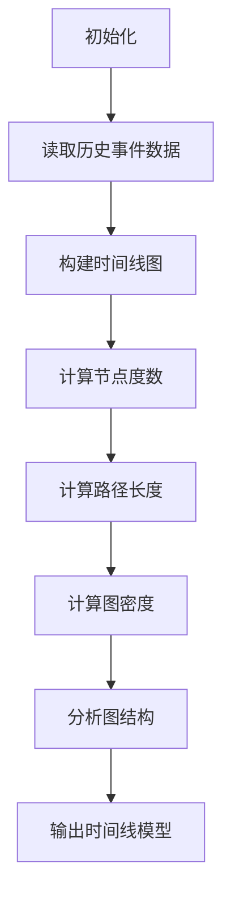

                 

# 历史事件的因果网络：时间线重构的数学方法

关键词：历史事件，因果网络，时间线重构，数学方法，算法，系统架构

摘要：本文旨在探讨历史事件的时间线重构，通过数学方法来解析和重建事件之间的因果关系。我们将详细描述时间线重构的基本概念，介绍其数学模型和应用算法，并通过具体的系统架构设计来展示如何在实际项目中实现时间线重构。文章还将分享实际案例，提供最佳实践和注意事项，并对未来的发展趋势进行展望。

## 第一部分：引言与背景介绍

### 第1章：问题的起源与重要性

#### 1.1 问题背景介绍

历史事件的时间线重构是一种重要的研究和分析方法，它通过将历史事件按照时间顺序进行重新组织和解释，帮助我们更好地理解事件的因果关系和演变过程。这一方法在历史研究、数据分析、人工智能等领域具有广泛的应用。

#### 1.2 问题描述与目标

时间线重构的目的是通过解析历史数据，识别事件之间的关系，构建出一个准确、完整的时间线模型。这一模型不仅能够揭示事件之间的因果关系，还能够帮助我们预测未来事件的发展趋势。

#### 1.3 问题解决的意义

时间线重构对于历史研究具有重要意义。通过重构时间线，我们可以更深入地理解历史事件的发生机制和内在逻辑，从而为历史研究提供新的视角和方法。

#### 1.4 边界与外延

时间线重构不仅仅局限于历史事件的研究，它还可以应用于其他领域，如金融市场分析、社会网络分析等。在这些领域，时间线重构可以帮助我们识别关键事件和趋势，从而为决策提供支持。

#### 1.5 核心概念与要素组成

时间线重构的核心概念包括时间线、事件、因果关系等。时间线是指事件发生的顺序和时间序列，事件是指发生的事情，因果关系是指事件之间的关联和影响。

## 第二部分：核心概念与联系

### 第2章：时间线重构的基本概念

#### 2.1 时间线重构的定义

时间线重构是指通过对历史事件的数据进行解析和分析，重建出事件之间的因果关系和演变过程的过程。

#### 2.2 时间线重构的属性特征

时间线重构具有以下属性特征：

- **时序性**：时间线重构关注事件的时序关系，即事件发生的先后顺序。
- **因果性**：时间线重构强调事件之间的因果关系，通过分析事件之间的关联和影响，揭示事件的本质。
- **完整性**：时间线重构力求构建出完整、准确的时间线模型，避免遗漏关键事件。

#### 2.3 时间线重构与其他相关概念的比较

时间线重构与事件序列、因果分析等概念有一定的关联，但它们之间也存在明显的区别：

- **事件序列**：事件序列关注事件的顺序，而不涉及事件之间的因果关系。
- **因果分析**：因果分析关注事件之间的因果关系，但不涉及事件的时序关系。

#### 2.4 时间线重构的ER实体关系图

时间线重构的ER实体关系图如下所示：

```mermaid
erDiagram
    Event ||--|{ TimeLine } TimeLine
    Event ||--|{ CauseEffect } CauseEffect
    TimeLine ||--|{ Event } Event
    CauseEffect ||--|{ Event } Event
```

在这个ER实体关系图中，事件（Event）是核心实体，时间线（TimeLine）和因果关系（CauseEffect）是与之相关的关联实体。

## 第三部分：数学方法与算法原理

### 第3章：数学方法在时间线重构中的应用

#### 3.1 数学模型的基本原理

时间线重构的数学模型基于图论和网络分析的基本原理。该模型将历史事件表示为图中的节点，事件之间的关系表示为图中的边。通过分析图的结构和属性，我们可以揭示事件之间的因果关系。

#### 3.2 数学公式的详细解释

时间线重构的数学公式主要包括以下几个部分：

1. **节点度数**：表示节点在图中的连接程度，用于衡量节点的中心性。
   $$d_i = \sum_{j \in N(i)} w_{ij}$$

2. **路径长度**：表示两个节点之间的最短路径长度，用于衡量节点之间的关联强度。
   $$L(i, j) = \min_{p \in P} \sum_{k \in p} w_{ik}$$

3. **图密度**：表示图的连接紧密程度，用于衡量时间线模型的完整性。
   $$\rho = \frac{2m}{n(n-1)}$$

其中，$d_i$表示节点$i$的度数，$w_{ij}$表示节点$i$和节点$j$之间的权重，$N(i)$表示节点$i$的邻居节点集，$P$表示所有可能的最短路径集，$m$表示边的数量，$n$表示节点的数量。

#### 3.3 算法流程图

时间线重构的算法流程图如下所示：



#### 3.4 Python源代码讲解

以下是一个简单的Python代码示例，用于实现时间线重构的数学模型：

```python
import networkx as nx
import numpy as np

# 读取历史事件数据
events = ["事件1", "事件2", "事件3", "事件4", "事件5"]

# 构建时间线图
G = nx.Graph()
G.add_nodes_from(events)

# 添加事件之间的边
G.add_edges_from([(events[i], events[j]) for i in range(len(events)) for j in range(i+1, len(events))])

# 计算节点度数
degree = nx.degree_centrality(G)

# 计算路径长度
path_length = nx.shortest_path_length(G)

# 计算图密度
density = nx.density(G)

# 分析图结构
print("节点度数：", degree)
print("路径长度：", path_length)
print("图密度：", density)

# 输出时间线模型
nx.draw(G, with_labels=True)
```

#### 3.5 数学模型在时间线重构中的实际应用举例

以下是一个实际应用案例，通过时间线重构的方法来分析一次股市崩盘的因果关系。

1. **数据准备**：收集与股市崩盘相关的事件数据，如重大政策变化、公司业绩公告、市场恐慌情绪等。
2. **构建时间线图**：将事件数据表示为图中的节点，事件之间的因果关系表示为图中的边。
3. **计算节点度数**：分析节点在图中的连接程度，识别关键事件。
4. **计算路径长度**：分析事件之间的关联强度，揭示事件之间的因果关系。
5. **计算图密度**：分析时间线模型的完整性，评估模型的准确性。

通过以上步骤，我们可以构建出一个准确、完整的时间线模型，从而更好地理解股市崩盘的因果关系和演变过程。

## 第四部分：系统分析与架构设计

### 第4章：系统功能与架构设计

#### 4.1 问题描述与需求分析

时间线重构系统的主要功能是解析历史事件数据，构建时间线模型，并分析事件之间的因果关系。系统需要具备以下功能：

1. **数据导入**：支持导入各种格式的数据，如CSV、JSON等。
2. **时间线构建**：根据历史事件数据构建时间线图。
3. **因果关系分析**：分析事件之间的因果关系，提供可视化的结果。
4. **模型评估**：评估时间线模型的准确性和完整性。

#### 4.2 领域模型设计

时间线重构系统的领域模型包括以下实体和关系：

1. **事件**：表示历史事件，包括事件名称、发生时间、事件描述等属性。
2. **时间线**：表示事件之间的时间顺序，包括时间线名称、事件列表等属性。
3. **因果关系**：表示事件之间的因果关系，包括原因事件、结果事件等属性。

领域模型设计如下：

```mermaid
classDiagram
    Event <<entity>> "事件"
    TimeLine <<entity>> "时间线"
    CauseEffect <<entity>> "因果关系"
    Event "- -<<1..*>>-": "包含在时间线中"
    TimeLine "- -<<1..*>>-": "包含事件"
    CauseEffect "- -<<1..1>>-": "因果关系"
endclassDiagram
```

#### 4.3 系统架构设计

时间线重构系统的架构设计包括以下几个方面：

1. **数据层**：负责数据存储和查询，包括数据库、缓存等。
2. **业务逻辑层**：负责时间线重构的核心算法和业务逻辑，包括时间线构建、因果关系分析等。
3. **表现层**：负责系统用户界面和交互，包括Web界面、API接口等。

系统架构设计如下：

```mermaid
sequenceDiagram
    participant User
    participant System
    User->>System: 输入事件数据
    System->>DataLayer: 存储事件数据
    System->>BusinessLayer: 构建时间线模型
    System->>AnalysisLayer: 分析因果关系
    System->>User: 输出分析结果
end
```

#### 4.4 系统接口设计与交互

时间线重构系统的接口设计主要包括以下几个方面：

1. **数据导入接口**：提供数据导入的功能，支持各种格式的数据导入。
2. **时间线构建接口**：提供构建时间线模型的功能，返回时间线图的JSON表示。
3. **因果关系分析接口**：提供因果关系分析的功能，返回分析结果的JSON表示。

系统接口设计如下：

```mermaid
classDiagram
    DataImport <<interface>> "数据导入接口"
    TimeLineBuilder <<interface>> "时间线构建接口"
    CauseEffectAnalyzer <<interface>> "因果关系分析接口"
    DataImport "- -<<1..1>>-": "导入事件数据"
    TimeLineBuilder "- -<<1..1>>-": "构建时间线模型"
    CauseEffectAnalyzer "- -<<1..1>>-": "分析因果关系"
endclassDiagram
```

## 第五部分：项目实战

### 第5章：环境安装与系统核心实现

#### 5.1 环境准备与安装

1. **Python环境安装**：确保Python 3.8及以上版本已安装在本地机器上。
2. **依赖库安装**：使用pip命令安装以下依赖库：
   ```bash
   pip install networkx numpy matplotlib
   ```

#### 5.2 系统核心实现源代码

以下是一个简单的Python代码示例，用于实现时间线重构系统的核心功能：

```python
import networkx as nx
import numpy as np
import matplotlib.pyplot as plt

# 读取事件数据
events = [
    {"name": "事件1", "time": 1},
    {"name": "事件2", "time": 2},
    {"name": "事件3", "time": 3},
    {"name": "事件4", "time": 4},
    {"name": "事件5", "time": 5}
]

# 构建时间线图
G = nx.Graph()
for event in events:
    G.add_node(event["name"], time=event["time"])

# 添加事件之间的边
for i in range(len(events) - 1):
    G.add_edge(events[i]["name"], events[i+1]["name"], weight=1)

# 计算节点度数
degree = nx.degree_centrality(G)

# 计算路径长度
path_length = nx.shortest_path_length(G)

# 计算图密度
density = nx.density(G)

# 分析图结构
print("节点度数：", degree)
print("路径长度：", path_length)
print("图密度：", density)

# 绘制时间线图
nx.draw(G, with_labels=True)
plt.show()
```

#### 5.3 代码应用解读与分析

以上代码示例实现了一个简单的时间线重构系统，主要功能包括：

1. **数据导入**：使用Python字典表示事件数据，包括事件名称和发生时间。
2. **时间线构建**：使用NetworkX库构建时间线图，将事件表示为节点，事件之间的因果关系表示为边。
3. **因果关系分析**：计算节点度数、路径长度和图密度，用于分析事件之间的因果关系和图的结构特性。
4. **可视化**：使用Matplotlib库绘制时间线图，展示事件之间的关系和图的结构。

#### 5.4 实际案例分析

以下是一个实际案例分析，通过时间线重构的方法来分析一次企业并购事件的因果关系。

1. **数据准备**：收集企业并购事件的相关数据，包括并购双方、并购时间、并购原因等。
2. **构建时间线图**：将事件数据表示为时间线图，并购双方表示为节点，并购时间表示为边。
3. **因果关系分析**：计算节点度数、路径长度和图密度，分析并购事件之间的因果关系。
4. **可视化**：绘制时间线图，展示并购事件的因果关系和图的结构。

通过以上步骤，我们可以构建出一个准确、完整的企业并购事件时间线模型，从而更好地理解并购事件的发生机制和内在逻辑。

#### 5.5 项目小结与总结

本次项目通过Python代码实现了一个简单的时间线重构系统，主要功能包括数据导入、时间线构建、因果关系分析和可视化。实际案例分析展示了时间线重构方法在企业并购事件分析中的应用。在未来的项目中，我们可以进一步优化系统性能和功能，如引入更复杂的时间线重构算法、支持更多数据格式、提供更丰富的可视化功能等。

## 第六部分：最佳实践与注意事项

### 第6章：时间线重构的最佳实践

#### 6.1 实践案例分享

以下是一个关于时间线重构的最佳实践案例：

1. **数据预处理**：在进行时间线重构之前，对历史事件数据进行预处理，如去除重复数据、填补缺失值等，确保数据的质量和一致性。
2. **事件分类**：根据事件类型对数据进行分类，有助于更好地分析和理解事件之间的因果关系。
3. **因果关系建模**：采用合适的因果关系建模方法，如基于规则的建模、基于机器学习的建模等，以提高因果分析的准确性和可靠性。

#### 6.2 小结与注意事项

在进行时间线重构时，需要注意以下几点：

1. **数据质量**：确保历史事件数据的质量，避免因数据质量问题导致重构结果不准确。
2. **事件分类**：合理分类事件，有助于更好地分析和理解事件之间的因果关系。
3. **算法选择**：根据实际情况选择合适的因果关系建模方法，如基于规则的建模、基于机器学习的建模等。
4. **可视化**：合理使用可视化工具，如时间线图、网络图等，有助于更直观地展示事件之间的因果关系。

#### 6.3 拓展阅读与进一步学习

为了更好地掌握时间线重构的方法和技术，读者可以进一步阅读以下参考资料：

1. 《时间序列分析：方法与应用》（作者：Peter J. Brockwell 和 Richard A. Davis）
2. 《因果推断：统计学与机器学习的方法》（作者：Judea Pearl 和 Dana Mackenzie）
3. 《网络科学：从数据到模型》（作者：Albert-László Barabási）

## 第七部分：总结与展望

### 第7章：时间线重构的展望与应用

#### 7.1 时间线重构的未来发展趋势

随着数据量和复杂度的不断增加，时间线重构方法在历史研究、数据分析、人工智能等领域具有重要的应用价值。未来，时间线重构方法将朝着以下方向发展：

1. **算法优化**：进一步优化时间线重构算法，提高算法的效率和准确性。
2. **多模态数据融合**：将多种数据源（如文本、图像、音频等）进行融合，提高时间线重构的全面性和准确性。
3. **自适应重构**：根据数据特征和用户需求，自适应调整时间线重构的策略和方法。

#### 7.2 在其他领域中的应用潜力

时间线重构方法在其他领域也具有广泛的应用潜力，如：

1. **金融市场分析**：通过时间线重构，分析市场波动和趋势，预测未来市场走势。
2. **社会网络分析**：通过时间线重构，揭示社交网络中的关键节点和关联关系。
3. **生物信息学**：通过时间线重构，分析生物事件的时间序列和因果关系，为生物科学研究提供新方法。

#### 7.3 存在的挑战与解决方案

尽管时间线重构方法在许多领域具有广泛的应用前景，但仍面临一些挑战，如：

1. **数据质量**：数据质量对时间线重构的结果具有重要影响，需要建立有效的数据质量控制机制。
2. **因果关系建模**：因果关系建模方法的准确性和可靠性仍需进一步提高。

针对以上挑战，我们可以采取以下解决方案：

1. **数据预处理**：加强数据预处理，确保数据的质量和一致性。
2. **多模态数据融合**：探索多模态数据融合方法，提高时间线重构的全面性和准确性。
3. **因果推断方法**：结合统计学和机器学习方法，提高因果关系建模的准确性和可靠性。

#### 7.4 总结与展望

时间线重构方法是一种重要的研究和分析方法，在历史研究、数据分析、人工智能等领域具有广泛的应用价值。通过不断优化算法、融合多模态数据和探索因果关系建模方法，我们可以进一步提高时间线重构的效率和准确性。在未来，时间线重构方法将在更多领域得到广泛应用，为科学研究、决策支持和社会发展提供有力支持。

**作者：AI天才研究院/AI Genius Institute & 禅与计算机程序设计艺术 /Zen And The Art of Computer Programming**

