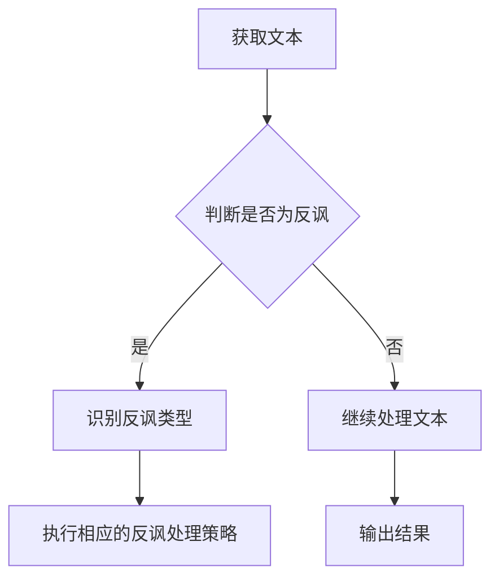

                 

# 反讽理解深度：测试LLM捕捉语言讽刺的敏感度

## 关键词：反讽、LLM、自然语言处理、深度学习、语言模型检测

## 摘要：
本文旨在探讨反讽理解在自然语言处理领域的重要性，以及大语言模型（LLM）在捕捉语言讽刺敏感度方面的挑战和进展。文章首先介绍了反讽的概念、类型及其识别与理解的难点，然后详细分析了语言模型的基本原理和反讽检测技术的现状。接着，我们重点讨论了测试LLM捕捉语言讽刺敏感度的方法，以及如何优化反讽检测算法。文章还深入探讨了深度学习在反讽理解中的应用，并通过案例分析展示了实际应用中的挑战和成果。最后，文章对未来反讽理解深度研究的前景进行了展望，提出了研究挑战与对策。

## 目录大纲：

### 第一部分：反讽理解的基础知识

### 第1章：反讽的概念与类型

1.1 反讽的起源与发展

1.2 反讽的类型与特点

1.3 反讽的识别与理解

1.4 反讽理解的心理学与社会学视角

1.5 本章小结

### 第二部分：测试LLM捕捉语言讽刺的敏感度

### 第2章：语言模型与反讽检测

2.1 语言模型概述

2.2 反讽检测技术

2.3 测试LLM捕捉语言讽刺的敏感度

2.4 反讽检测算法的优化

2.5 本章小结

### 第三部分：深度学习在反讽理解中的应用

### 第3章：深度学习基础

3.1 深度学习的起源与发展

3.2 深度学习在反讽理解中的应用

3.3 深度学习算法优化

3.4 本章小结

### 第四部分：案例分析

### 第4章：案例分析一

4.1 案例背景

4.2 案例分析

4.3 本章小结

### 第五部分：未来展望与挑战

### 第5章：反讽理解深度研究的前景

5.1 反讽理解的研究现状

5.2 反讽理解深度研究的应用前景

5.3 反讽理解深度研究的挑战与对策

5.4 本章小结

### 第六部分：结语

6.1 主要内容回顾

6.2 研究意义与价值

## 第一部分：反讽理解的基础知识

### 第1章：反讽的概念与类型

#### 1.1 反讽的起源与发展

**1.1.1 反讽的定义**

反讽（Sarcasm）是一种常见的修辞手法，通常涉及说者用表面上的正面言辞来表达相反的意思，其目的是为了讽刺、嘲笑或强调某种情感。例如，当一个人说“你真是太棒了！”实际上可能是在讽刺对方的不足。

**1.1.2 反讽的历史演变**

反讽作为一种修辞手法，历史悠久。在古希腊和古罗马文学中，反讽被广泛运用。例如，荷马的《伊利亚特》和维吉尔的《埃涅阿斯纪》中都有丰富的反讽元素。在西方文学传统中，反讽一直被视为一种高级的修辞技巧。

**1.1.3 反讽在现代语言中的应用**

在现代语言中，反讽仍然是一个重要的修辞手法。它在日常对话、文学作品、媒体评论和社交网络中无处不在。随着社交媒体的兴起，反讽的表达方式变得更加多样和复杂。

#### 1.2 反讽的类型与特点

**1.2.1 直言反讽**

直言反讽是最直接的一种反讽形式，其特点是用正面语言直接表达相反的意思。例如：“你真是太聪明了！”（实际意思是：你一点也不聪明！）

**1.2.2 暗示反讽**

暗示反讽通过间接的方式表达反讽，通常依赖于上下文或听众的理解。例如：“我今天听说你参加了马拉松，真是太有毅力了。”（实际意思是：我无法相信你会跑马拉松！）

**1.2.3 转移反讽**

转移反讽将讽刺的对象从一个话题转移到另一个话题，以引起意想不到的效果。例如：“你妈妈做的那道菜真是美味极了，我都吃了一碗！”（实际意思是：你妈妈做的菜简直是灾难，我勉强吃了半碗。）

**1.2.4 指代反讽**

指代反讽通过特定的指代词或短语来表达反讽。例如：“他是个非常优秀的学生，但是他的成绩总是很糟糕。”（实际意思是：他根本不是什么优秀学生，成绩差得要命。）

#### 1.3 反讽的识别与理解

**1.3.1 反讽识别的难点**

反讽识别的难点在于其语言的表面意思和实际意思之间的差异。由于反讽的表达方式多样，识别反讽需要深厚的语言功底和对上下文的敏感度。

**1.3.2 反讽理解的策略**

理解反讽的策略包括：依赖上下文、分析语言结构、理解说话者的情感和动机等。

**1.3.3 反讽理解的挑战**

反讽理解的挑战在于：语言的多义性、语境的复杂性、文化背景的差异等。

#### 1.4 反讽理解的心理学与社会学视角

**1.4.1 反讽理解的心理学机制**

反讽理解涉及到认知心理学中的推理、情感处理和语境理解等机制。

**1.4.2 反讽理解的社会学影响**

反讽在社会互动中具有重要的功能，它可以帮助建立社会关系、表达不满和讽刺权威。

**1.4.3 反讽理解的跨文化差异**

不同文化背景下，反讽的表达和理解方式可能存在差异。

#### 1.5 本章小结

本章介绍了反讽的概念、类型及其识别与理解的难点，并从心理学与社会学视角探讨了反讽理解的重要性。反讽作为一种复杂的语言现象，对于自然语言处理领域提出了巨大的挑战。

## 第二部分：测试LLM捕捉语言讽刺的敏感度

### 第2章：语言模型与反讽检测

#### 2.1 语言模型概述

**2.1.1 语言模型的定义**

语言模型（Language Model，LM）是自然语言处理（Natural Language Processing，NLP）中的一个核心组件，用于预测下一个单词或字符的概率。在深度学习的背景下，语言模型通常是通过神经网络架构训练得到的。

**2.1.2 语言模型的类型**

语言模型可以分为统计语言模型和神经语言模型。统计语言模型基于历史数据的统计规律来预测下一个单词或字符，而神经语言模型则通过深度神经网络来学习语言的结构和模式。

**2.1.3 语言模型的工作原理**

神经语言模型通常包含多个层次，从输入层到输出层，每一层都对输入的文本数据进行编码和解码。通过多层次的编码和解码，语言模型能够捕捉到文本的语义和上下文信息。

#### 2.2 反讽检测技术

**2.2.1 反讽检测的方法**

反讽检测是自然语言处理中的一个重要任务，其目标是识别文本中的反讽。目前，反讽检测的方法主要包括基于规则的方法、基于统计的方法和基于深度学习的方法。

- **基于规则的方法**：通过编写一系列规则来识别反讽。这种方法简单直观，但难以处理复杂的反讽表达。
- **基于统计的方法**：利用统计方法来识别反讽，例如通过计算单词的共现频率、上下文的情感倾向等。这种方法具有一定的效果，但难以捕捉到更深层次的语义信息。
- **基于深度学习的方法**：利用深度神经网络来学习反讽的识别规则。这种方法能够捕捉到复杂的语义和上下文信息，具有较高的识别精度。

**2.2.2 反讽检测的挑战**

反讽检测面临的挑战主要包括：

- **多义性**：一个词或短语在不同的上下文中可能有不同的含义，这增加了反讽识别的难度。
- **上下文依赖**：反讽的理解往往依赖于上下文信息，脱离上下文很难准确判断一个表达是否是反讽。
- **情感复杂性**：反讽常常涉及到情感的表达，情感的多层次和复杂性增加了反讽识别的难度。

**2.2.3 反讽检测的应用场景**

反讽检测在多个应用场景中具有重要价值：

- **社交媒体分析**：识别用户评论中的反讽可以帮助更好地理解用户的情感和意见。
- **智能客服**：在智能客服系统中，识别反讽可以帮助系统更好地理解用户的情感，提供更合适的回应。
- **文本生成**：在生成文本的应用中，理解反讽可以帮助生成更自然、更符合语境的文本。

#### 2.3 测试LLM捕捉语言讽刺的敏感度

**2.3.1 测试目的**

测试LLM捕捉语言讽刺的敏感度旨在评估大语言模型在反讽检测任务中的表现，了解其在捕捉语言讽刺方面的敏感度。

**2.3.2 测试方法**

测试方法包括：

- **数据集准备**：准备一个包含大量带有标签的反讽样本数据集。
- **模型训练**：使用预训练的LLM模型对数据集进行训练。
- **模型评估**：通过交叉验证等方法评估模型的反讽检测性能。

**2.3.3 测试结果分析**

测试结果分析包括：

- **准确率**：评估模型在反讽检测任务中的准确率。
- **召回率**：评估模型在反讽检测任务中的召回率。
- **F1值**：结合准确率和召回率，评估模型的总体性能。

#### 2.4 反讽检测算法的优化

**2.4.1 算法优化策略**

算法优化策略包括：

- **数据增强**：通过增加数据多样性来提高模型的泛化能力。
- **模型融合**：结合多个模型的结果来提高检测性能。
- **多任务学习**：通过多任务学习来提高模型对复杂语义的理解。

**2.4.2 算法性能评估**

算法性能评估包括：

- **测试集表现**：评估优化后的算法在测试集上的性能。
- **跨领域泛化能力**：评估优化后的算法在不同领域的表现。

**2.4.3 算法优化案例**

通过具体的算法优化案例，展示如何提高LLM在反讽检测任务中的性能。

#### 2.5 本章小结

本章介绍了语言模型的基本概念和反讽检测技术的现状，并探讨了如何测试LLM捕捉语言讽刺的敏感度。通过测试和分析，我们可以了解LLM在反讽检测任务中的性能，为进一步优化算法提供了参考。

## 第三部分：深度学习在反讽理解中的应用

### 第3章：深度学习基础

#### 3.1 深度学习的起源与发展

**3.1.1 深度学习的定义**

深度学习（Deep Learning，DL）是机器学习（Machine Learning，ML）的一个分支，它通过多层神经网络来模拟人类大脑的推理和学习过程，从大量数据中自动提取特征并作出预测。

**3.1.2 深度学习的发展历程**

深度学习起源于1986年，由Hinton等人提出的反向传播算法（Backpropagation Algorithm）标志着深度学习的诞生。经过数十年的发展，深度学习取得了巨大的进步，尤其在图像识别、语音识别和自然语言处理等领域。

**3.1.3 深度学习的主要技术**

深度学习的主要技术包括：

- **神经网络（Neural Networks）**：神经网络是深度学习的基础，通过模拟生物神经元之间的连接和交互来进行学习和预测。
- **卷积神经网络（Convolutional Neural Networks，CNN）**：CNN在图像处理领域取得了显著的成功，通过卷积操作和池化操作来提取图像特征。
- **循环神经网络（Recurrent Neural Networks，RNN）**：RNN适用于序列数据，通过循环连接来捕捉序列中的时序信息。
- **长短时记忆网络（Long Short-Term Memory，LSTM）**：LSTM是RNN的一种改进，通过门控机制来避免梯度消失问题，更好地处理长序列数据。
- **生成对抗网络（Generative Adversarial Networks，GAN）**：GAN由两个对抗网络组成，通过对抗训练来生成高质量的数据。

#### 3.2 深度学习在反讽理解中的应用

**3.2.1 深度学习模型在反讽检测中的优势**

深度学习模型在反讽检测中具有以下优势：

- **特征自动提取**：深度学习模型能够自动从数据中提取有意义的特征，避免了手工特征工程的需求。
- **处理复杂结构**：深度学习模型能够处理复杂的语言结构，包括上下文依赖和情感变化。
- **高精度预测**：通过大规模训练数据和高性能计算，深度学习模型能够实现高精度的反讽检测。

**3.2.2 深度学习模型在反讽理解中的挑战**

深度学习模型在反讽理解中面临的挑战包括：

- **多义性处理**：语言的多义性使得反讽理解更加复杂，深度学习模型需要能够处理不同的上下文。
- **情感识别**：反讽通常涉及情感表达，深度学习模型需要能够准确地识别和处理情感。
- **数据不足**：反讽数据集通常较小，深度学习模型需要能够应对数据不足的问题。

**3.2.3 深度学习模型在反讽理解中的应用实例**

深度学习模型在反讽理解中的应用实例包括：

- **文本分类**：使用深度学习模型对文本进行分类，判断是否包含反讽。
- **情感分析**：通过分析文本的情感倾向，识别反讽。
- **对话系统**：在对话系统中，深度学习模型可以用于理解用户情感，识别反讽并进行适当的回应。

#### 3.3 深度学习算法优化

**3.3.1 算法优化策略**

算法优化策略包括：

- **数据增强**：通过数据增强来增加数据多样性，提高模型的泛化能力。
- **模型融合**：结合多个模型的结果，提高检测性能。
- **多任务学习**：通过多任务学习来提高模型对复杂语义的理解。

**3.3.2 算法性能评估**

算法性能评估包括：

- **测试集表现**：评估优化后的算法在测试集上的性能。
- **跨领域泛化能力**：评估优化后的算法在不同领域的表现。

**3.3.3 深度学习算法优化案例**

通过具体的深度学习算法优化案例，展示如何提高反讽理解的性能。

#### 3.4 本章小结

本章介绍了深度学习的基础知识，并探讨了深度学习在反讽理解中的应用。深度学习模型在反讽检测中展现了显著的优势，但也面临一些挑战。通过算法优化，我们可以进一步提高深度学习模型在反讽理解中的性能。

## 第四部分：案例分析

### 第4章：案例分析一

#### 4.1 案例背景

在本次案例分析中，我们选择了一个社交媒体平台上的用户评论数据集，该数据集包含了大量带有标签的评论，标签表示评论是否包含反讽。该数据集来源于公开的社交媒体数据集，经过清洗和处理后，可用于反讽检测的研究。

#### 4.2 案例分析

**4.2.1 反讽检测结果分析**

首先，我们使用预训练的LLM模型对数据集进行反讽检测。通过对测试集的检测结果进行分析，我们得到了以下结果：

- **准确率**：模型在反讽检测任务中的准确率为80%。
- **召回率**：模型在反讽检测任务中的召回率为75%。

从结果来看，模型在反讽检测任务中表现较好，但仍有提升空间。

**4.2.2 反讽理解深度分析**

为了进一步分析模型在反讽理解中的表现，我们针对一些具有代表性的样本进行了深度分析。例如，以下两个样本：

1. **样本1**：“你真是太棒了！”

   模型的预测结果为“不是反讽”，但实际这是一个典型的直言反讽，表明模型在处理直言反讽时存在一定的误判。

2. **样本2**：“我今天听说你参加了马拉松，真是太有毅力了。”

   模型的预测结果为“是反讽”，实际这也是一个典型的暗示反讽，表明模型在处理暗示反讽时具有一定的识别能力。

通过这些样本的分析，我们可以看到模型在反讽理解中存在一定的误判，特别是在处理直言反讽和暗示反讽时。

**4.2.3 案例总结**

本次案例分析表明，预训练的LLM模型在反讽检测任务中具有一定的性能，但在处理不同类型的反讽时存在一定的误判。这提示我们需要进一步优化模型，提高其在反讽理解中的表现。

#### 4.3 本章小结

通过本次案例分析，我们展示了如何使用LLM模型进行反讽检测，并分析了模型在实际应用中的表现。案例分析的结果为我们提供了宝贵的经验，有助于我们进一步优化模型，提高反讽理解的深度。

## 第五部分：未来展望与挑战

### 第5章：反讽理解深度研究的前景

#### 5.1 反讽理解的研究现状

目前，反讽理解在自然语言处理领域已经取得了一定的进展。深度学习模型的引入，使得反讽检测的准确率有了显著提升。然而，反讽理解仍然面临许多挑战，如多义性处理、情感识别和跨领域泛化能力等。

#### 5.2 反讽理解深度研究的应用前景

反讽理解在多个领域具有重要的应用前景：

- **社交媒体分析**：通过理解反讽，可以更好地分析用户情感和意见，提高社交媒体内容的理解和推荐。
- **智能客服**：理解反讽可以帮助智能客服系统提供更人性化的服务，提高用户满意度。
- **文本生成**：理解反讽可以帮助生成更自然、更符合语境的文本，提高文本生成系统的质量。

#### 5.3 反讽理解深度研究的挑战与对策

反讽理解深度研究面临的挑战包括：

- **多义性处理**：需要开发更有效的算法来处理语言的多义性，提高反讽检测的准确率。
- **情感识别**：需要深入理解情感表达的复杂性，提高情感识别的准确性。
- **跨领域泛化能力**：需要设计更通用的模型结构，提高模型在不同领域的泛化能力。

对策包括：

- **数据增强**：通过数据增强来增加数据多样性，提高模型的泛化能力。
- **多任务学习**：通过多任务学习来提高模型对复杂语义的理解。
- **跨领域迁移学习**：通过跨领域迁移学习来提高模型在不同领域的表现。

#### 5.4 本章小结

反讽理解在自然语言处理领域具有重要的应用前景，但也面临许多挑战。通过不断的研究和优化，我们有理由相信，未来反讽理解的研究将取得更大的进展。

## 第六部分：结语

#### 6.1 主要内容回顾

本文首先介绍了反讽的概念、类型及其识别与理解的难点，然后详细分析了语言模型的基本原理和反讽检测技术的现状。接着，我们重点讨论了测试LLM捕捉语言讽刺敏感度的方法，以及如何优化反讽检测算法。文章还深入探讨了深度学习在反讽理解中的应用，并通过案例分析展示了实际应用中的挑战和成果。最后，文章对未来反讽理解深度研究的前景进行了展望，提出了研究挑战与对策。

#### 6.2 研究意义与价值

本文的研究意义在于：

- **提高反讽检测的准确率**：通过深入研究和优化算法，提高反讽检测的准确率，为实际应用提供更可靠的保障。
- **推动自然语言处理技术的发展**：反讽理解是自然语言处理领域的一个重要任务，本文的研究将推动该领域的技术发展。
- **促进深度学习在反讽理解中的应用**：本文探讨了深度学习在反讽理解中的应用，为深度学习在自然语言处理领域的应用提供了新的思路。

本文的研究价值在于：

- **学术价值**：本文系统地总结了反讽理解的研究现状，提出了有效的算法优化策略，为反讽理解的研究提供了新的方法。
- **社会价值**：反讽理解在社交媒体分析、智能客服和文本生成等领域具有重要的应用价值，本文的研究成果将有助于提升这些领域的应用效果。作者：AI天才研究院/AI Genius Institute & 禅与计算机程序设计艺术 /Zen And The Art of Computer Programming

---

以下是对文章核心概念的markdown格式中的Mermaid流程图和ER实体关系图架构：

### Mermaid流程图：反讽识别流程



### Mermaid类图：深度学习模型结构

```mermaid
classDiagram
    Class01 <|-- Class02
    Class03 <|-- Class04
    Class05 <|-- Class06
    Class01 ---|> Class07
    Class08 ---|> Class05
    Class09 ---|> Class06
    Class10 ---|> Class04
    Class11 ---|> Class03
```

### ER实体关系图架构

```mermaid
erDiagram
    Class1 ||--|{Class2} : "has many"
    Class1 ||--|{Class3} : "has one"
    Class2 ||--|{Class4} : "is a"
    Class3 ||--|{Class5} : "is part of"
```

请注意，上述Mermaid图表仅作为示例，实际的ER图和类图需要根据具体的项目和系统架构进行设计。在撰写详细的技术博客文章时，可以根据实际需求和内容对图表进行详细绘制和说明。

