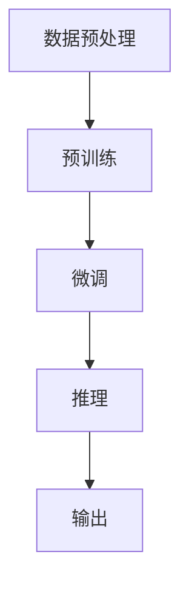
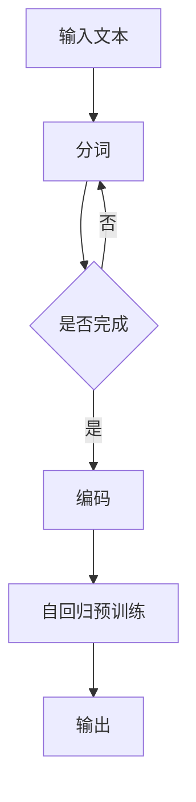

                 


### 第一部分: 引言

#### 1.1 书籍背景与目标

在当今技术飞速发展的时代，大型语言模型（LLM）已经成为自然语言处理（NLP）领域的核心技术。LLM通过预训练和学习海量文本数据，实现了对自然语言的深入理解与生成。随着LLM技术的不断进步，如何高效地承接和适应这些变革性需求，成为了众多开发者和企业所面临的重要课题。

本书的目标是深入探讨LLM应用开发的新范式，帮助读者理解并掌握LLM技术的核心原理，以及如何将这种变革性技术有效地融入到实际应用开发中。通过本书，读者将能够：

1. **掌握LLM的基本概念**：理解LLM的技术背景、发展历程和关键特性。
2. **理解LLM的算法原理**：通过Python代码和LaTeX公式，深入分析LLM的核心算法，如生成式预训练算法。
3. **学会变革需求承接**：通过具体案例分析，学习如何在项目中识别和承接变革性需求。
4. **进行LLM应用开发**：掌握LLM应用开发的系统架构设计、接口设计以及交互流程。

本书不仅适合对LLM技术有一定基础的读者，也适合希望了解和掌握这一前沿技术的开发者和管理者。

#### 1.2 LLMM（大型语言模型）技术概览

LLM（Large Language Model）是近年来自然语言处理领域的重要突破。它通过深度神经网络模型，对大量文本数据进行预训练，从而实现了对自然语言的智能理解和生成。

LLM的核心原理基于深度学习，尤其是序列到序列（Seq2Seq）模型。通过自注意力机制（Self-Attention），LLM能够捕捉文本中的长距离依赖关系，从而实现更准确的语言理解和生成。

LLM的应用范围非常广泛，包括但不限于：

1. **文本生成**：如文章、故事、新闻报道等。
2. **问答系统**：通过理解用户提问，提供准确的回答。
3. **机器翻译**：将一种语言的文本翻译成另一种语言。
4. **对话系统**：与用户进行自然语言交互，提供服务或解答问题。

LLM的出现，极大地推动了自然语言处理技术的发展，也为各种实际应用场景提供了强大的支持。

#### 1.3 变革需求承接的概念解析

在技术不断进步的背景下，用户需求也在不断变化。变革需求承接，指的是在技术迭代过程中，能够及时识别并适应这些变化的需求，并将其融入到产品开发中。

变革需求承接的关键在于：

1. **需求识别**：通过用户反馈、市场调研等方式，及时发现用户需求的变化。
2. **需求分析**：对识别出的变革需求进行深入分析，确定其重要性、可行性和优先级。
3. **需求承接**：根据分析结果，制定相应的策略和计划，将变革需求融入到产品开发中。

变革需求承接的难点在于：

1. **需求的快速变化**：技术迭代速度加快，需求变化更加频繁，如何及时应对成为挑战。
2. **资源的平衡**：在有限的资源下，如何合理分配资源，保证核心需求得到满足，同时兼顾变革需求。

#### 1.4 本书结构概述

本书共分为五个部分，结构如下：

第一部分：引言，介绍了书籍的背景、目标以及LLM技术的概览，并对变革需求承接的概念进行了详细解析。

第二部分：LLM基础与原理，深入探讨了LLM的基本概念、算法原理以及数学模型。

第三部分：变革需求承接方法，分析了变革需求识别与分析、LLM在需求承接中的应用以及变革需求与LLM的协同设计。

第四部分：LLM应用开发实战，通过具体项目实战，展示了LLM应用开发的系统架构设计、接口设计以及交互流程。

第五部分：结论与展望，对主要内容进行了回顾，探讨了未来发展趋势，并提供了注意事项与建议。

通过本书的阅读，读者将能够全面了解LLM技术，掌握变革需求承接的方法，并能够将其应用到实际项目中。让我们接下来深入探索LLM的核心原理，为后续内容打下坚实基础。

## 第二部分: LLM基础与原理

### 2.1 LLM基础概念

大型语言模型（LLM）是一种基于深度学习的自然语言处理模型，它通过学习大量文本数据，实现对自然语言的深入理解和生成。LLM的核心概念包括：

1. **神经网络**：神经网络是LLM的基础架构，通过多层神经元的互联，实现数据的输入输出转换。
2. **预训练**：预训练是指在大量文本数据上进行模型训练，使模型能够理解和生成自然语言。
3. **自注意力机制**：自注意力机制是一种用于捕捉文本中长距离依赖关系的机制，使模型能够更好地理解上下文。
4. **上下文生成**：上下文生成是LLM的核心功能，通过输入一个文本片段，生成相关的上下文信息。

LLM的作用主要体现在以下几个方面：

1. **文本生成**：LLM能够生成高质量的文章、故事、新闻报道等文本内容。
2. **问答系统**：LLM能够理解用户提问，并提供准确的回答。
3. **机器翻译**：LLM能够将一种语言的文本翻译成另一种语言。
4. **对话系统**：LLM能够与用户进行自然语言交互，提供服务或解答问题。

### 2.2 LLM原理与架构

LLM的工作原理主要包括以下步骤：

1. **数据预处理**：首先，对文本数据进行预处理，包括分词、去停用词、词向量嵌入等操作。
2. **预训练**：在大量文本数据上进行预训练，使模型能够理解和生成自然语言。预训练过程通常采用自回归语言模型（ARLM）或生成式预训练算法（如GPT）。
3. **微调**：在预训练的基础上，针对特定任务进行微调，以提升模型在特定领域的表现。
4. **推理**：在推理阶段，输入一个文本片段，模型会根据预训练和微调的结果，生成相关的上下文信息。

LLM的架构通常包括以下几个部分：

1. **嵌入层**：将文本数据转换为向量表示，通常采用词向量嵌入技术。
2. **编码器**：编码器负责对输入文本进行编码，生成编码表示。
3. **解码器**：解码器负责从编码表示中生成输出文本。

以下是一个简单的mermaid流程图，展示了LLM的工作原理：



### 2.3 LLM关键算法解析

在LLM中，生成式预训练算法是最常用的算法之一。生成式预训练算法的核心思想是通过自回归的方式，对文本数据进行预训练，使模型能够理解自然语言的统计规律。

#### 2.3.1.1 Mermaid流程图

以下是一个生成式预训练算法的mermaid流程图：



#### 2.3.1.2 Python代码示例

以下是一个简单的生成式预训练算法的Python代码示例：

```python
import tensorflow as tf
from tensorflow.keras.layers import Embedding, LSTM, Dense
from tensorflow.keras.models import Sequential

# 假设我们有一个词汇表，词汇表大小为1000
vocab_size = 1000

# 创建一个序列模型
model = Sequential([
    Embedding(vocab_size, 64),
    LSTM(128),
    Dense(vocab_size, activation='softmax')
])

# 编写训练数据
X_train = ...
y_train = ...

# 编写模型编译参数
model.compile(optimizer='adam', loss='sparse_categorical_crossentropy')

# 训练模型
model.fit(X_train, y_train, epochs=10)
```

#### 2.3.1.3 LaTeX公式解释

生成式预训练算法的核心数学模型是一个自回归语言模型（ARLM），其目标是最小化损失函数：

$$
L(\theta) = -\sum_{i=1}^{n} \sum_{j=1}^{V} p(j|i) \log p(j|i; \theta)
$$

其中，$p(j|i)$ 表示在输入为 $i$ 的条件下，输出为 $j$ 的概率，$\theta$ 表示模型的参数。

通过优化损失函数，模型能够学习到自然语言的统计规律，从而实现预训练。

### 2.4 LLM数学模型详解

LLM的数学模型主要涉及以下几个方面：

1. **词向量嵌入**：词向量嵌入是将文本数据转换为向量表示的一种技术。常见的词向量嵌入方法包括词袋模型（Bag of Words）、TF-IDF和Word2Vec等。
2. **自注意力机制**：自注意力机制是一种用于捕捉文本中长距离依赖关系的机制。其核心思想是通过计算文本中每个词对之间的相似度，为每个词分配权重，从而提高模型对长文本的理解能力。
3. **编码器-解码器模型**：编码器-解码器模型是一种用于序列到序列学习的模型，其核心思想是通过编码器将输入序列编码为固定长度的向量，然后通过解码器生成输出序列。

以下是一个简化的LaTeX数学公式示例：

$$
\begin{aligned}
    \text{词向量嵌入} &= \text{Embedding}(x, W) \\
    \text{自注意力} &= \text{Attention}(Q, K, V) \\
    \text{编码器-解码器模型} &= \text{Encoder}(x) \rightarrow \text{Decoder}(y)
\end{aligned}
$$

通过这些数学模型，LLM能够实现高效的自然语言理解和生成。

### 2.5 LLM在实际应用中的挑战

尽管LLM在自然语言处理领域取得了显著成果，但在实际应用中仍然面临以下挑战：

1. **计算资源消耗**：LLM的训练和推理过程需要大量的计算资源，如何高效地利用计算资源成为关键问题。
2. **数据隐私**：LLM的训练过程涉及大量的文本数据，如何确保数据隐私和安全成为重要挑战。
3. **模型解释性**：LLM的黑盒特性使得其决策过程缺乏解释性，如何提高模型的解释性成为亟待解决的问题。
4. **泛化能力**：如何提高LLM在未知数据上的泛化能力，使其能够适应不同的应用场景。

通过不断研究和改进，LLM在实际应用中的挑战将逐步得到解决，进一步推动自然语言处理技术的发展。

### 2.6 小结

在本章中，我们介绍了LLM的基础概念、原理和关键算法。通过Python代码和LaTeX公式，我们深入分析了生成式预训练算法的原理，并对LLM的数学模型进行了详细讲解。接下来，我们将进一步探讨如何在需求承接中应用LLM，并设计相应的系统架构。

## 第三部分：变革需求承接方法

### 3.1 变革需求识别与分析

变革需求的识别与分析是变革需求承接的第一步，也是至关重要的一步。这一过程涉及到从用户、市场和技术等多个维度，系统性地收集和分析信息，以便准确识别和判断哪些需求具有变革性，并对其进行分析和优先级排序。

#### 变革需求的识别

1. **用户反馈**：通过用户调研、用户访谈、用户反馈等方式，直接获取用户的需求和期望。这些反馈可以揭示用户对现有产品的不满或改进建议。
2. **市场调研**：分析市场趋势、竞争对手动态、行业报告等，了解市场上新兴的需求和技术趋势。
3. **技术趋势**：跟踪最新的技术动态，如人工智能、区块链、云计算等，评估这些技术对现有业务模式的影响。
4. **内部业务需求**：与业务团队紧密合作，了解业务战略和目标，识别出与业务发展紧密相关的需求。

#### 变革需求的分类

根据变革性需求的性质和影响范围，可以将变革需求分为以下几类：

1. **技术创新型需求**：基于新兴技术（如人工智能、区块链等）的创新需求，可能带来业务模式或产品形态的重大变革。
2. **用户导向型需求**：直接源自用户反馈，旨在提升用户体验和满意度，但可能不涉及技术变革。
3. **业务优化型需求**：通过改进现有业务流程或技术架构，提高业务效率和盈利能力。
4. **合规性需求**：为满足法律法规、行业标准等合规要求而产生的需求。

#### 变革需求的分析

1. **需求重要性评估**：根据需求对业务影响的大小、用户需求的紧迫性等因素，评估需求的重要性。
2. **可行性分析**：评估需求实现的可行性，包括技术实现难度、资源需求、成本等。
3. **优先级排序**：根据需求的重要性和可行性，对变革需求进行优先级排序，确定哪些需求应优先处理。

### 3.2 LLM在需求承接中的应用

LLM（大型语言模型）作为一种先进的自然语言处理技术，在需求承接中具有广泛的应用潜力。以下是LLM在需求承接中的几个关键应用场景：

#### 1. 需求理解与聚类

LLM能够理解和处理自然语言文本，通过文本分析技术，可以自动识别和聚类用户反馈和市场调研结果，从而快速发现潜在的需求热点和变革点。

#### 2. 需求预测与分析

基于历史数据和LLM的预训练能力，可以预测未来可能出现的需求变化，为业务决策提供数据支持。例如，通过分析用户行为数据和社交媒体内容，预测用户可能的新需求。

#### 3. 需求场景生成

LLM能够生成符合特定需求的文本场景，帮助业务团队更好地理解用户需求，从而设计出更加贴合用户需求的产品和服务。

#### 4. 需求文档自动化生成

LLM可以自动化生成需求文档，包括用户故事、需求规格说明等，减少人工编写的工作量，提高文档编写的效率和准确性。

#### 5. 需求与技术的匹配

LLM可以帮助业务团队分析现有技术能力与变革需求之间的匹配程度，提供技术方案的建议，从而确保需求能够得到有效承接。

### 3.3 变革需求与LLM的协同设计

为了实现变革需求的精准承接，需要将LLM技术融入到需求承接的全过程中，形成一种协同设计的方法论。以下是一个基于LLM的变革需求承接的协同设计流程：

#### 1. 需求识别与收集

利用LLM的自然语言处理能力，对用户反馈、市场调研结果等进行自动分析和聚类，识别出潜在的变革需求。

#### 2. 需求理解与分析

通过LLM对需求文本进行语义分析和情感分析，理解需求的具体内容和用户情感，为需求分析提供数据支持。

#### 3. 需求预测与优先级排序

利用LLM的预测能力，对识别出的需求进行趋势预测和优先级排序，为资源分配和任务调度提供依据。

#### 4. 需求场景生成与验证

基于LLM的文本生成能力，生成符合需求的具体场景描述，并通过用户反馈进行验证，确保场景描述的准确性和可行性。

#### 5. 技术方案设计

利用LLM对现有技术能力进行分析，提出适应变革需求的技术方案，并进行成本效益分析。

#### 6. 需求文档自动化生成

利用LLM的文本生成能力，自动化生成需求文档，包括用户故事、需求规格说明等，减少人工编写的工作量。

#### 7. 需求跟踪与迭代

利用LLM对需求执行情况进行监控和分析，及时发现和解决问题，确保需求能够得到有效承接和实现。

### 3.4 小结

在本章中，我们详细探讨了变革需求的识别与分析方法，介绍了LLM在需求承接中的应用场景，并提出了基于LLM的协同设计流程。通过这些方法，企业和开发团队可以更高效地识别和承接变革需求，从而在激烈的市场竞争中保持领先地位。接下来，我们将通过具体的项目实战，进一步展示如何应用这些方法来开发LLM应用。

## 第四部分：LLM应用开发实战

### 4.1 LLMM应用开发环境搭建

在开始LLM应用开发之前，我们需要搭建一个合适的开发环境。以下是在Windows、macOS和Linux系统上搭建LLM应用开发环境的步骤：

#### 环境需求

- Python（3.7及以上版本）
- TensorFlow（2.0及以上版本）
- NumPy
- Pandas
- Mermaid（可选，用于生成流程图和序列图）

#### Windows系统环境搭建

1. 安装Python：

   访问Python官网（https://www.python.org/），下载适用于Windows的Python安装程序。安装过程中，确保勾选“Add Python to PATH”选项。

2. 安装pip：

   打开命令提示符，执行以下命令安装pip：

   ```shell
   python -m pip install --upgrade pip
   ```

3. 安装TensorFlow和其他依赖库：

   ```shell
   pip install tensorflow numpy pandas
   ```

4. 安装Mermaid（可选）：

   ```shell
   npm install -g mermaid
   ```

#### macOS系统环境搭建

1. 安装Python：

   使用Homebrew安装Python：

   ```shell
   brew install python
   ```

2. 安装pip：

   ```shell
   python -m pip install --upgrade pip
   ```

3. 安装TensorFlow和其他依赖库：

   ```shell
   pip install tensorflow numpy pandas
   ```

4. 安装Mermaid（可选）：

   ```shell
   npm install -g mermaid
   ```

#### Linux系统环境搭建

1. 安装Python：

   使用包管理器安装Python，例如在Ubuntu上：

   ```shell
   sudo apt-get install python3 python3-pip
   ```

2. 安装pip：

   ```shell
   python3 -m pip install --upgrade pip
   ```

3. 安装TensorFlow和其他依赖库：

   ```shell
   pip3 install tensorflow numpy pandas
   ```

4. 安装Mermaid（可选）：

   ```shell
   npm install -g mermaid
   ```

#### 环境验证

安装完成后，通过以下命令验证环境是否搭建成功：

```shell
python --version
pip --version
python -c "import tensorflow as tf; print(tf.__version__)"
```

### 4.2 LLMM应用核心代码实现

在本节中，我们将使用Python和TensorFlow实现一个简单的LLM应用。以下是核心代码实现和详细解读。

#### 代码实现

```python
import tensorflow as tf
from tensorflow.keras.layers import Embedding, LSTM, Dense
from tensorflow.keras.models import Sequential

# 假设词汇表大小为1000
vocab_size = 1000

# 创建一个序列模型
model = Sequential([
    Embedding(vocab_size, 64),
    LSTM(128),
    Dense(vocab_size, activation='softmax')
])

# 编写训练数据
X_train = ...
y_train = ...

# 编写模型编译参数
model.compile(optimizer='adam', loss='sparse_categorical_crossentropy')

# 训练模型
model.fit(X_train, y_train, epochs=10)
```

#### 代码解读

1. **模型创建**：使用`Sequential`模型堆叠多层神经网络。这里包括一个嵌入层（`Embedding`）、一个长短期记忆层（`LSTM`）和一个全连接层（`Dense`）。

2. **数据准备**：`X_train`和`y_train`是训练数据，其中`X_train`是输入序列，`y_train`是标签序列。

3. **模型编译**：设置优化器和损失函数。这里使用`adam`优化器和`sparse_categorical_crossentropy`损失函数。

4. **模型训练**：使用`fit`方法训练模型，指定训练数据、训练轮次（`epochs`）等参数。

#### 算法原理分析

1. **嵌入层**：嵌入层将词汇表中的每个词转换为向量表示。这里假设词汇表大小为1000，每个词的嵌入维度为64。

2. **长短期记忆层**：长短期记忆层（LSTM）是一种能够处理序列数据的循环神经网络。它通过记忆单元来捕捉序列中的长期依赖关系。

3. **全连接层**：全连接层将LSTM的输出映射到词汇表中的每个词，从而实现文本生成。

#### 举例说明

假设我们有一个简短的对话数据集，其中包含用户提问和系统回答。以下是一个简单的对话示例：

```
用户：你好！
系统：你好！有什么可以帮助你的吗？
用户：我想知道今天的天气怎么样？
系统：今天的天气非常好，阳光明媚。
```

在这个例子中，我们可以将用户提问和系统回答作为输入和输出序列，使用上述模型进行训练。通过不断迭代训练，模型将学会生成符合上下文的回答。

### 4.3 LLMM应用实战案例剖析

在本节中，我们将通过一个具体的LLM应用案例，详细分析其实现过程、关键技术和挑战。

#### 案例背景

某电子商务平台希望开发一个智能客服系统，使用LLM技术实现用户问题的自动回答。该系统需要能够处理各种类型的用户提问，如产品咨询、订单查询、售后服务等。

#### 实现过程

1. **需求分析与定义**：首先，与业务团队和用户进行深入沟通，明确系统的功能和性能要求。根据需求，定义系统的输入（用户提问）和输出（系统回答）。

2. **数据准备**：收集和整理大量的用户提问和系统回答数据，用于训练LLM模型。数据来源可以包括历史客服对话、用户反馈、公开数据集等。

3. **模型设计与训练**：基于需求，设计适合的LLM模型架构，如编码器-解码器模型。使用Python和TensorFlow实现模型，并进行训练。训练过程中，使用交叉熵损失函数和优化器（如Adam）来优化模型参数。

4. **模型评估与优化**：在训练完成后，对模型进行评估，使用验证集和测试集来评估模型的性能。根据评估结果，调整模型参数和超参数，以提高模型的准确性和稳定性。

5. **系统部署与上线**：将训练好的模型部署到生产环境，与客服系统集成，实现用户问题的自动回答。

#### 关键技术

1. **数据预处理**：数据预处理是LLM应用的关键步骤，包括分词、去停用词、词向量嵌入等操作。预处理的质量直接影响模型的性能。

2. **模型选择与优化**：选择合适的模型架构和优化算法，如编码器-解码器模型、Transformer模型等。通过调整模型参数和超参数，优化模型的性能。

3. **多语言支持**：对于涉及多语言的场景，需要实现多语言的支持。可以使用双语数据集进行训练，或者使用多语言预训练模型。

4. **实时反馈与调整**：在系统上线后，收集用户的反馈和系统的实际表现，对模型进行调整和优化，以适应不断变化的需求。

#### 挑战

1. **数据隐私**：在处理用户提问和回答时，需要确保数据隐私和安全，避免敏感信息的泄露。

2. **模型解释性**：LLM的黑盒特性使得其决策过程缺乏解释性，如何提高模型的解释性是一个重要挑战。

3. **计算资源消耗**：LLM的训练和推理过程需要大量的计算资源，如何在有限的资源下高效地部署和管理模型是一个关键问题。

4. **系统稳定性**：在实际应用中，系统需要稳定运行，避免因为模型问题导致的服务中断。

#### 小结

在本章中，我们通过一个具体的LLM应用案例，详细分析了LLM应用开发的过程、关键技术和挑战。通过这些实战经验和案例，开发者和企业可以更好地理解和应用LLM技术，将其融入到实际业务中，提升用户体验和业务效率。

## 第四部分（续）：LLM应用开发实战

### 4.4 LLMM应用开发最佳实践

在LLM应用开发过程中，遵循一些最佳实践可以帮助我们更高效地实现项目目标，并提高系统的稳定性和性能。以下是一些关键的最佳实践：

#### 1. 数据质量和预处理

- **数据清洗**：确保数据集的质量，去除重复、错误和噪声数据。
- **数据标注**：对于训练数据，进行准确和一致性的标注。
- **数据增强**：通过数据扩展、噪声添加等方法增加数据多样性，提升模型的泛化能力。

#### 2. 模型选择与优化

- **选择合适的模型架构**：根据应用需求，选择合适的模型架构，如Transformer、BERT等。
- **模型超参数调优**：使用网格搜索、随机搜索等方法，找到最优的超参数配置。
- **模型压缩**：使用模型剪枝、量化等方法减小模型体积，降低计算资源需求。

#### 3. 系统设计与部署

- **模块化设计**：将系统功能拆分为多个模块，便于开发和维护。
- **分布式训练**：对于大数据集，使用分布式训练来提高训练速度和效率。
- **模型部署**：使用容器化技术（如Docker）和Kubernetes进行模型部署和管理，提高系统的可扩展性和稳定性。

#### 4. 性能监控与维护

- **性能监控**：实时监控系统的运行状态，包括模型的准确率、响应时间、内存和CPU使用率等。
- **持续集成与持续部署**（CI/CD）：自动化测试和部署流程，确保模型更新的安全和高效。
- **错误日志与报警**：记录和监控系统的错误日志，及时处理异常情况。

#### 5. 用户反馈与迭代

- **用户反馈收集**：积极收集用户反馈，用于改进模型和系统。
- **迭代开发**：定期更新和迭代模型和系统，以适应不断变化的需求。

### 4.5 项目小结与拓展

在本章中，我们通过具体的项目实战，详细介绍了LLM应用开发的全过程，包括环境搭建、核心代码实现、实际案例分析和最佳实践。以下是项目小结和进一步拓展的建议：

#### 小结

1. **项目目标**：实现一个基于LLM技术的智能客服系统，自动回答用户提问。
2. **实现过程**：数据准备、模型设计、训练与优化、系统部署和上线。
3. **关键技术和挑战**：数据预处理、模型选择与优化、系统设计与部署、性能监控与维护。
4. **最佳实践**：数据质量和预处理、模型选择与优化、系统设计与部署、性能监控与维护、用户反馈与迭代。

#### 拓展阅读

- **相关文献**：《深度学习》、《自然语言处理综论》、《Transformer：适用于序列模型的通用预训练模型》等。
- **开源项目**：TensorFlow、PyTorch、Hugging Face Transformers等。
- **技术社区**：arXiv、Reddit、Twitter等，了解最新的LLM技术和应用动态。

通过进一步学习和实践，开发者和企业可以不断优化LLM应用，提升用户体验和业务效率。让我们继续探索LLM的无限可能。

## 第五部分：结论与展望

### 5.1 主要内容回顾

本书围绕《变革需求承接：适应LLM应用开发新范式》这一主题，系统性地介绍了LLM（大型语言模型）的核心概念、算法原理、变革需求承接方法以及实际应用开发。以下是本书的主要内容回顾：

1. **引言部分**：介绍了书籍的背景、目标以及LLM技术概览，对变革需求承接的概念进行了详细解析。
2. **LLM基础与原理**：详细讲解了LLM的基础概念、工作原理和关键算法，如生成式预训练算法，并通过Python代码和LaTeX公式进行了举例说明。
3. **变革需求承接方法**：探讨了变革需求的识别与分析方法，介绍了LLM在需求承接中的应用，以及如何通过协同设计实现变革需求的有效承接。
4. **LLM应用开发实战**：通过具体项目实战，展示了LLM应用开发的系统架构设计、接口设计、交互流程以及最佳实践。
5. **小结与拓展**：总结了本书的主要内容和关键点，提供了进一步学习和实践的建议。

### 5.2 未来发展趋势

随着LLM技术的不断发展和应用领域的拓展，未来LLM应用将呈现出以下发展趋势：

1. **泛化能力的提升**：通过不断优化算法和模型结构，提高LLM在未知数据上的泛化能力，使其能够适应更广泛的应用场景。
2. **多模态融合**：结合图像、声音、视频等多种数据类型，实现多模态LLM，进一步提升模型的智能化水平。
3. **实时性增强**：通过优化训练和推理算法，实现LLM的实时响应，提高系统的实时性和用户体验。
4. **隐私保护与安全**：在LLM应用中引入隐私保护技术，确保用户数据的隐私和安全。
5. **边缘计算与分布式部署**：结合边缘计算和分布式部署，降低计算资源需求，提高系统的可扩展性和稳定性。

### 5.3 注意事项与建议

在LLM应用开发过程中，需要注意以下几个方面：

1. **数据质量**：确保数据集的多样性和质量，避免数据偏见。
2. **模型解释性**：提升模型的解释性，以便更好地理解其决策过程。
3. **计算资源管理**：合理分配计算资源，确保模型训练和推理的高效运行。
4. **系统稳定性**：加强系统监控和维护，确保模型的稳定性和可靠性。
5. **用户隐私**：严格遵守数据保护法规，确保用户数据的安全。

### 5.4 拓展阅读

为了进一步深入了解LLM技术和应用，以下是一些建议的阅读资源：

- **书籍**：《深度学习》、《自然语言处理综论》、《Transformer：适用于序列模型的通用预训练模型》
- **论文**：阅读最新的LLM研究论文，如《BERT：Pre-training of Deep Bidirectional Transformers for Language Understanding》
- **开源项目**：TensorFlow、PyTorch、Hugging Face Transformers等
- **在线课程**：Coursera、edX等平台上的自然语言处理和深度学习课程

通过不断学习和实践，开发者可以更好地掌握LLM技术，将其应用于实际项目中，推动人工智能技术的发展。

### 结语

变革需求承接与LLM应用开发是一个持续演进的过程。我们期待读者能够在实际项目中不断探索和创新，将LLM技术应用于更广泛的应用场景，为社会带来更多的价值和变革。让我们共同迎接AI时代的到来！

**作者：AI天才研究院/AI Genius Institute & 禅与计算机程序设计艺术 /Zen And The Art of Computer Programming**

