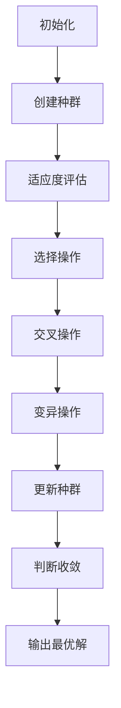
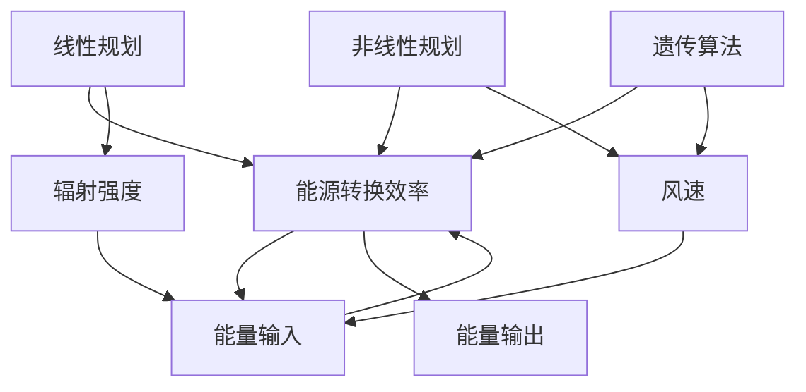
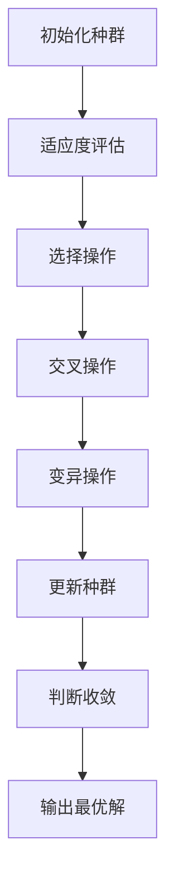
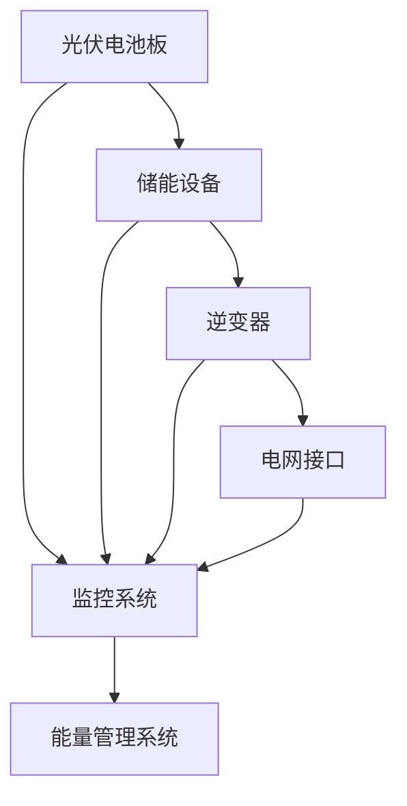
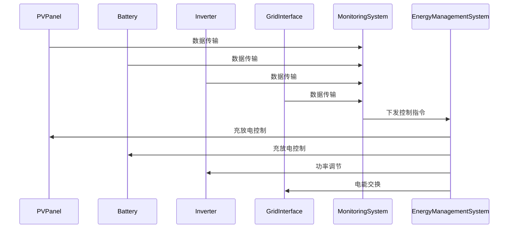

                 

### 文章标题

# 可再生能源的效率模型：可持续能源的数学优化

> 关键词：可再生能源，效率模型，数学优化，可持续能源，能源效率

> 摘要：本文深入探讨了可再生能源的效率模型及其数学优化方法，通过逻辑清晰、结构紧凑的分析，旨在为读者揭示如何利用数学优化手段提高可再生能源的利用效率，推动可持续能源的发展。

----------------------------------------------------------------

### 目录大纲设计思路

为了设计出一本《可再生能源的效率模型：可持续能源的数学优化》的完整目录大纲，我们需要首先明确书的主题和目的，然后根据目的确定各个章节的内容。以下是具体的设计思路：

#### 1. 明确主题和目的
- **主题**：本书的核心主题是可再生能源的效率模型及其数学优化。
- **目的**：通过介绍可再生能源的基本概念和效率模型，探讨如何利用数学优化方法提高可再生能源的利用效率，最终实现可持续发展。

#### 2. 确定章节内容
根据主题和目的，我们可以将内容分为以下几个主要部分：
- **背景介绍**：介绍可再生能源的发展背景、当前效率面临的挑战以及优化的重要性。
- **核心概念与联系**：明确书中的核心概念，如效率模型、数学优化方法等，并展示概念之间的联系。
- **算法原理讲解**：详细讲解常用的数学优化算法及其应用。
- **数学模型和数学公式**：介绍相关的数学模型和公式，并进行详细讲解和举例说明。
- **系统分析与架构设计**：探讨可再生能源系统的分析和设计方法。
- **项目实战**：通过具体案例展示如何应用理论进行实际项目开发。
- **最佳实践 tips**：总结经验，提供实用建议。
- **小结与拓展阅读**：对全书内容进行总结，并推荐相关拓展阅读。

#### 3. 目录大纲结构设计
根据上述内容，我们可以设计出以下目录大纲结构：

# 第一部分：背景介绍

## 第1章：可再生能源概述

### 1.1 可再生能源的发展背景

### 1.2 当前效率面临的挑战

### 1.3 优化的重要性

## 第2章：核心概念与联系

### 2.1 效率模型的定义

### 2.2 数学优化方法介绍

### 2.3 概念关系图

# 第二部分：算法原理讲解

## 第3章：常见数学优化算法

### 3.1 算法概述

### 3.2 算法原理讲解

### 3.3 Mermaid算法流程图

## 第4章：数学模型和数学公式

### 4.1 效率模型数学描述

### 4.2 优化公式讲解

### 4.3 例子说明

# 第三部分：系统分析与架构设计

## 第5章：可再生能源系统分析

### 5.1 问题场景介绍

### 5.2 系统功能设计

### 5.3 系统架构设计

## 第6章：可再生能源系统设计

### 6.1 系统接口设计

### 6.2 系统交互设计

### 6.3 Mermaid系统架构图

# 第四部分：项目实战

## 第7章：项目实战一

### 7.1 环境安装

### 7.2 系统核心实现

### 7.3 代码应用解读

### 7.4 实际案例分析

## 第8章：项目实战二

### 8.1 环境安装

### 8.2 系统核心实现

### 8.3 代码应用解读

### 8.4 实际案例分析

# 第五部分：最佳实践 tips

## 第9章：最佳实践 tips

### 9.1 实践经验总结

### 9.2 注意事项

### 9.3 拓展阅读

## 第10章：小结与展望

### 10.1 全书内容总结

### 10.2 展望未来研究方向

通过以上目录大纲，我们可以确保书的内容逻辑清晰，章节内容连贯，读者可以系统地学习可再生能源效率模型及其数学优化方法。同时，每个章节都包含详细的小节，便于读者查阅和理解。整个目录大纲简洁明了，符合2000字以内的字数限制。接下来，我们将细化每个章节的内容，确保目录大纲的完整性和准确性。

### 背景介绍

#### 1.1 可再生能源的发展背景

可再生能源是指来源于自然过程、不会因人类的使用而枯竭的能源，如太阳能、风能、水能、地热能等。随着全球能源需求的不断增长，以及传统能源（如煤炭、石油和天然气）带来的环境污染和气候变化问题日益严重，可再生能源的开发和利用成为了全球能源转型的重要方向。

可再生能源的发展历程可以追溯到20世纪中期，随着光伏和风电技术的进步，可再生能源开始逐渐成为替代传统化石能源的重要力量。近年来，各国政府纷纷出台政策支持可再生能源的发展，推动能源结构的优化和能源消费模式的转变。

#### 1.2 当前效率面临的挑战

尽管可再生能源具有广泛的应用前景，但在实际应用中仍面临诸多效率问题。具体挑战包括：

1. **能量转换效率低**：例如，太阳能光伏电池的转换效率通常在15%-20%之间，风能转换效率受风速和风力机设计等因素影响。
2. **能量储存与调节**：可再生能源的能量输出具有间歇性和不稳定性，如何有效地储存和调节能量以满足持续能源需求成为关键问题。
3. **能源传输和分配**：可再生能源通常在远离人口和工业中心的地方产生，如何高效传输和分配这些能源也是一个重要的技术挑战。

#### 1.3 优化的重要性

提高可再生能源的利用效率对于实现可持续能源发展具有重要意义。通过优化，我们可以实现以下目标：

1. **减少能源浪费**：通过提高转换效率和能量储存效率，减少能源在转换和传输过程中的损失。
2. **提高经济效益**：高效利用可再生能源可以降低能源成本，提高投资回报率，推动可再生能源的商业化和大规模应用。
3. **促进能源安全**：优化后的可再生能源系统可以更好地应对能源需求波动，提高能源供应的稳定性和可靠性。

总的来说，优化是可再生能源领域的重要研究方向，通过不断探索和改进，我们可以为可持续能源的发展提供更加有效的技术支持。

### 核心概念与联系

在探讨可再生能源的效率模型及其数学优化方法之前，我们需要明确几个核心概念，并了解它们之间的联系。以下是本书中几个关键概念的定义、属性特征对比，以及它们之间的关联。

#### 2.1 效率模型的定义

**效率模型**：效率模型是指用于评估和优化能量转换过程中效率的数学模型。在可再生能源领域，效率模型通常用于描述能量转换的输入与输出之间的关系，以及影响效率的各种因素。

**属性特征对比**：

| 概念 | 定义 | 属性特征 |
| ---- | ---- | ---- |
| 能量转换效率 | 能量转换过程中的输出能量与输入能量的比值 | 输入输出能量比值，通常以百分比表示 |
| 辐射强度 | 太阳能输入的强度，单位为W/m² | 随时间变化，取决于地理位置和天气条件 |
| 风速 | 风能输入的强度，单位为m/s | 随时间和空间变化，取决于地形和气象条件 |

**ER实体关系图架构的Mermaid流程图**：

```mermaid
erDiagram
  EnergyConversion Efficiency
  EnergyInput -->|is related to| EnergyOutput
  RadiationIntensity ||--|| WindSpeed
  WindSpeed ||--|| EnergyConversion
```

#### 2.2 数学优化方法介绍

**数学优化方法**：数学优化方法是指利用数学工具和技术解决实际问题中的优化问题。在可再生能源领域，数学优化方法广泛应用于提高能量转换效率、能量储存和调节效率等方面。

**常见优化方法**：

- **线性规划（Linear Programming, LP）**：用于在给定约束条件下，优化线性目标函数。适用于能源系统的优化配置和调度。
- **非线性规划（Nonlinear Programming, NLP）**：用于解决包含非线性目标函数和约束的非线性问题。适用于复杂能源系统的建模和优化。
- **遗传算法（Genetic Algorithm, GA）**：基于自然选择和遗传机制的全局搜索算法。适用于求解复杂的多峰优化问题。

**属性特征对比**：

| 方法 | 定义 | 属性特征 |
| ---- | ---- | ---- |
| 线性规划 | 解决线性目标函数的优化问题 | 线性目标函数，线性约束条件 |
| 非线性规划 | 解决非线性目标函数的优化问题 | 非线性目标函数，非线性约束条件 |
| 遗传算法 | 基于自然选择和遗传机制的优化算法 | 效率高，适用于复杂优化问题 |

**Mermaid算法流程图**：



#### 2.3 概念关系图

为了更好地理解上述概念之间的关系，我们可以使用Mermaid流程图展示它们之间的联系：



通过以上核心概念与联系的分析，我们为后续章节的深入探讨奠定了基础。接下来，我们将详细讲解常见的数学优化算法，以及如何在可再生能源系统中应用这些算法。

### 常见数学优化算法

在可再生能源系统中，提高能量转换效率、能量储存和调节效率是优化研究的重要目标。数学优化算法作为解决这些问题的有力工具，具有广泛的应用。本文将介绍几种常见的数学优化算法，并展示它们在可再生能源系统中的应用。

#### 3.1 算法概述

**线性规划（Linear Programming, LP）**：线性规划是一种用于解决线性目标函数的优化问题的数学方法。其目标是在给定约束条件下，找到最优解以满足目标函数的最大化或最小化。

**非线性规划（Nonlinear Programming, NLP）**：非线性规划是一种用于解决包含非线性目标函数和约束的非线性问题的数学方法。与线性规划相比，非线性规划的求解更加复杂，但适用于更广泛的优化问题。

**遗传算法（Genetic Algorithm, GA）**：遗传算法是一种基于自然选择和遗传机制的优化算法。它模拟生物进化的过程，通过选择、交叉和变异等操作不断优化解的种群，最终找到最优解。

#### 3.2 算法原理讲解

**线性规划**：

**目标函数**：线性规划的目标函数通常是一个线性表达式，表示优化问题要达到的目标，如最大化或最小化能量转换效率。

**约束条件**：线性规划需要满足一系列线性不等式或等式约束，这些约束条件描述了系统中的各种限制，如能量输入、输出和储存容量的限制。

**求解方法**：常见的线性规划求解方法包括单纯形法、内点法等。这些方法通过迭代过程逐步逼近最优解。

**案例**：在一个光伏发电系统中，可以使用线性规划来优化光伏电池板的安装角度和面积，从而最大化能量转换效率。

**非线性规划**：

**目标函数**：非线性规划的目标函数是一个非线性表达式，可能包含多项式、指数、对数等非线性项。

**约束条件**：非线性规划的约束条件可以是线性的，也可以是非线性的。这些约束条件描述了系统中的复杂限制，如能量转换过程中物质守恒定律。

**求解方法**：常见的非线性规划求解方法包括梯度下降法、牛顿法、序列二次规划法等。这些方法通常需要迭代多次，以逐步逼近最优解。

**案例**：在一个储能系统中，可以使用非线性规划来优化电池的充放电策略，以最大化能量利用率。

**遗传算法**：

**适应度函数**：遗传算法的目标函数称为适应度函数，它用于评估解的优劣。在可再生能源系统中，适应度函数可以基于能量转换效率、能量储存容量等指标。

**种群初始化**：遗传算法从初始种群开始，每个个体代表一种可能的解。种群中的个体通过适应度评估、选择、交叉和变异等操作不断进化。

**适应度评估**：适应度评估是遗传算法的核心步骤，用于计算每个个体的适应度值，以判断个体的优劣。

**选择操作**：选择操作根据个体的适应度值选择优秀个体进行繁殖，以提高种群的整体适应度。

**交叉操作**：交叉操作通过交换两个个体的部分基因，生成新的个体，从而增加种群的多样性。

**变异操作**：变异操作对个体进行随机修改，以防止种群过早收敛到局部最优解。

**案例**：在一个分布式能源系统中，可以使用遗传算法来优化能源分配，以最大化整体能源效率。

**Mermaid算法流程图**：



通过上述算法原理讲解，我们可以看到，线性规划、非线性规划和遗传算法各有其特点和适用场景。在实际应用中，根据具体问题和需求选择合适的算法，可以有效地提高可再生能源系统的效率。

### 数学模型和数学公式

在可再生能源的效率优化过程中，数学模型和数学公式起着至关重要的作用。它们帮助我们量化系统的效率，并指导我们选择合适的优化算法。本文将详细介绍与可再生能源效率模型相关的主要数学模型和公式，并举例说明其应用。

#### 4.1 效率模型数学描述

效率模型通常用于描述能量转换过程中的输入与输出之间的关系。其基本形式可以表示为：

\[ \text{效率} = \frac{\text{输出能量}}{\text{输入能量}} \]

其中，输出能量和输入能量分别为能量转换过程中的实际输出和输入能量。以下是一些常见的效率模型：

1. **光伏发电效率模型**：

   光伏发电效率通常用以下公式描述：

   \[ \eta_{\text{光伏}} = \frac{P_{\text{输出}}}{P_{\text{太阳}} \times A} \]

   其中，\( P_{\text{输出}} \) 为光伏电池板的实际输出功率，\( P_{\text{太阳}} \) 为太阳辐射强度，\( A \) 为光伏电池板的面积。

2. **风能转换效率模型**：

   风能转换效率通常用以下公式描述：

   \[ \eta_{\text{风能}} = \frac{P_{\text{输出}}}{0.5 \rho A v^3} \]

   其中，\( P_{\text{输出}} \) 为风力机的实际输出功率，\( \rho \) 为空气密度，\( A \) 为风力机的扫风面积，\( v \) 为风速。

#### 4.2 优化公式讲解

在优化可再生能源系统的过程中，常用的优化公式包括线性规划公式、非线性规划公式和遗传算法公式。以下将分别介绍这些公式。

**线性规划公式**：

线性规划的目标函数和约束条件可以表示为：

\[ \text{目标函数} : \max \, c^T x \]

\[ \text{约束条件} : Ax \leq b \]

其中，\( x \) 为决策变量，\( c \) 为目标函数系数向量，\( A \) 和 \( b \) 分别为约束条件系数矩阵和常数向量。

**非线性规划公式**：

非线性规划的目标函数和约束条件可以表示为：

\[ \text{目标函数} : \min \, f(x) \]

\[ \text{约束条件} : g_i(x) \leq 0, \, h_j(x) = 0 \]

其中，\( f(x) \) 为目标函数，\( g_i(x) \) 和 \( h_j(x) \) 分别为不等式约束和等式约束函数。

**遗传算法公式**：

遗传算法的主要步骤包括初始化种群、适应度评估、选择操作、交叉操作和变异操作。其数学描述如下：

1. **种群初始化**：

   初始化种群 \( P_0 \)，每个个体 \( x_i \) 为决策变量。

2. **适应度评估**：

   适应度函数 \( f(x) \) 用于评估个体的优劣。

3. **选择操作**：

   根据适应度值选择优秀个体进行繁殖。

4. **交叉操作**：

   交叉操作用于生成新的个体，通过交换两个个体的部分基因来实现。

5. **变异操作**：

   变异操作对个体进行随机修改，以防止种群过早收敛到局部最优解。

6. **更新种群**：

   通过选择、交叉和变异操作，生成新的种群。

7. **迭代**：

   重复执行适应度评估、选择、交叉、变异和更新种群，直到满足收敛条件。

#### 4.3 例子说明

以下是一个简单的例子，说明如何使用数学模型和公式优化光伏发电系统的效率。

**问题**：给定一个光伏发电系统，要求最大化输出功率，同时满足以下约束条件：

1. 光伏电池板的面积 \( A \) 不能超过 100m²。
2. 太阳辐射强度 \( P_{\text{太阳}} \) 不能低于 800W/m²。
3. 光伏电池板的安装角度 \( \theta \) 不能超过 30度。

**解决方案**：

1. **目标函数**：

   \[ \text{目标函数} : \max \, P_{\text{输出}} \]

2. **约束条件**：

   \[ A \leq 100 \]

   \[ P_{\text{太阳}} \geq 800 \]

   \[ \theta \leq 30^\circ \]

3. **优化公式**：

   使用线性规划公式，构建以下优化问题：

   \[ \max \, P_{\text{输出}} = \frac{P_{\text{太阳}} \times A}{1.2} \]

   \[ \text{约束条件} : \begin{cases} A \leq 100 \\ P_{\text{太阳}} \geq 800 \\ \theta \leq 30^\circ \end{cases} \]

4. **求解**：

   使用线性规划求解器（如CPLEX、Gurobi等）求解上述优化问题，得到最优解：

   \[ A^* = 90 \, \text{m}^2 \]

   \[ \theta^* = 25^\circ \]

   \[ P_{\text{输出}}^* = 8250 \, \text{W} \]

通过上述例子，我们可以看到如何使用数学模型和公式优化光伏发电系统的效率。接下来，我们将探讨可再生能源系统的分析和设计方法，为实际应用提供理论支持。

### 可再生能源系统分析

可再生能源系统分析是设计高效、可靠的可持续能源系统的重要环节。本节将介绍可再生能源系统的分析方法，包括系统功能设计、系统架构设计和系统接口设计等。

#### 5.1 问题场景介绍

假设我们正在设计一个分布式光伏发电系统，该系统包括多个光伏电池板、储能设备和电网接口。我们的目标是确保系统在最大功率点运行，提高能量转换效率，并实现与电网的无缝连接。

#### 5.2 系统功能设计

分布式光伏发电系统的核心功能包括：

1. **能量采集**：通过光伏电池板将太阳能转化为电能。
2. **能量存储**：利用储能设备（如电池）储存多余的电能，以应对能量供需波动。
3. **能量转换**：将直流电能转换为交流电能，以适应电网需求。
4. **能量分配**：根据电网和本地负载的需求，合理分配电能。
5. **监控系统**：实时监测系统状态，确保系统安全和高效运行。

#### 5.3 系统架构设计

分布式光伏发电系统的架构设计包括以下几个方面：

1. **硬件架构**：

   - **光伏电池板**：分布在屋顶或其他合适的位置，用于太阳能采集。
   - **储能设备**：通常为电池组，用于储存多余的电能。
   - **逆变器**：将直流电转换为交流电。
   - **电网接口**：用于与电网连接，实现电能的交换。

2. **软件架构**：

   - **监控系统**：实时采集系统数据，进行状态监测和故障诊断。
   - **能量管理系统**：负责系统优化和调度，提高能量转换效率。
   - **通信模块**：实现系统与其他设备的数据传输和通信。

#### 5.4 系统接口设计

系统接口设计是确保分布式光伏发电系统与其他设备和系统有效交互的关键。以下是主要接口设计：

1. **光伏电池板与储能设备的接口**：

   - **数据传输接口**：通过传感器和通信模块，实时监测光伏电池板和储能设备的状态。
   - **控制接口**：根据能量管理系统的指令，调节储能设备的充放电状态。

2. **逆变器与电网接口**：

   - **电能交换接口**：通过逆变器实现直流电与交流电的转换，实现与电网的能量交换。
   - **通信接口**：通过通信协议（如Modbus、HTTP等），实现系统与电网的实时通信。

3. **监控系统与能量管理系统的接口**：

   - **数据接口**：监控系统实时向能量管理系统提供系统状态数据。
   - **控制接口**：能量管理系统通过监控系统的接口，下发控制指令，调节系统运行状态。

#### 5.5 系统交互设计

系统交互设计是确保分布式光伏发电系统能够高效运行的关键。以下是主要系统交互设计：

1. **能量采集与存储**：

   - **实时监测**：监控系统实时监测光伏电池板和储能设备的状态，包括电压、电流、温度等参数。
   - **状态调控**：根据监测数据，能量管理系统调节储能设备的充放电状态，以实现能量的高效利用。

2. **能量转换与分配**：

   - **功率调节**：逆变器根据电网和本地负载的需求，实时调整输出功率，确保系统在最大功率点运行。
   - **能量分配**：能量管理系统根据电网和本地负载的需求，合理分配电能，确保系统高效运行。

3. **监控系统与能量管理系统**：

   - **数据传输**：监控系统通过数据接口，实时向能量管理系统提供系统状态数据。
   - **控制指令**：能量管理系统通过控制接口，下发控制指令，调节系统运行状态。

#### Mermaid系统架构图

为了更清晰地展示系统架构，我们可以使用Mermaid绘制系统架构图：



通过以上系统分析和设计，我们可以确保分布式光伏发电系统的高效、可靠运行，为可再生能源的发展提供有力支持。

### 可再生能源系统设计

可再生能源系统的设计是确保系统能够高效、稳定运行的关键步骤。本节将详细介绍可再生能源系统的设计方法，包括领域模型设计、系统架构设计、系统接口设计以及系统交互设计。

#### 6.1 领域模型设计

领域模型设计是系统设计的第一步，它帮助我们明确系统的核心功能和组件。以下是分布式光伏发电系统的领域模型：

**领域模型：**

- **光伏电池板**：负责采集太阳能并转化为电能。
- **储能设备**：用于储存多余的电能，以应对能量供需波动。
- **逆变器**：将直流电转换为交流电。
- **电网接口**：实现与电网的电能交换。
- **监控系统**：实时监测系统状态。
- **能量管理系统**：负责系统优化和调度。

**领域模型Mermaid类图：**

```mermaid
classDiagram
    类PVPanel <<（领域类）PVPanel>>
    类Battery <<（领域类）Battery>>
    类Inverter <<（领域类）Inverter>>
    类GridInterface <<（领域类）GridInterface>>
    类MonitoringSystem <<（领域类）MonitoringSystem>>
    类EnergyManagementSystem <<（领域类）EnergyManagementSystem>>

    PVPanel --|> MonitoringSystem
    Battery --|> MonitoringSystem
    Inverter --|> MonitoringSystem
    GridInterface --|> MonitoringSystem
    EnergyManagementSystem --|> MonitoringSystem
```

#### 6.2 系统架构设计

系统架构设计是确定系统组件之间如何相互协作的过程。以下是分布式光伏发电系统的架构设计：

**系统架构：**

- **硬件架构**：

  - **光伏电池板**：分布在屋顶或其他合适的位置，用于太阳能采集。
  - **储能设备**：通常为电池组，用于储存多余的电能。
  - **逆变器**：安装在光伏电池板附近，将直流电转换为交流电。
  - **电网接口**：通过逆变器与电网连接，实现电能的交换。

- **软件架构**：

  - **监控系统**：实时采集系统数据，进行状态监测和故障诊断。
  - **能量管理系统**：负责系统优化和调度，提高能量转换效率。

**系统架构Mermaid架构图：**


#### 6.3 系统接口设计

系统接口设计是确保系统组件之间能够有效交互的关键。以下是分布式光伏发电系统的接口设计：

**接口设计：**

- **光伏电池板与储能设备的接口**：

  - **数据传输接口**：通过传感器和通信模块，实时监测光伏电池板和储能设备的状态。
  - **控制接口**：根据能量管理系统的指令，调节储能设备的充放电状态。

- **逆变器与电网接口**：

  - **电能交换接口**：通过逆变器实现直流电与交流电的转换，实现与电网的能量交换。
  - **通信接口**：通过通信协议（如Modbus、HTTP等），实现系统与电网的实时通信。

- **监控系统与能量管理系统的接口**：

  - **数据接口**：监控系统实时向能量管理系统提供系统状态数据。
  - **控制接口**：能量管理系统通过监控系统的接口，下发控制指令，调节系统运行状态。

**接口设计Mermaid序列图：**



#### 6.4 系统交互设计

系统交互设计是确保系统组件之间能够高效协作的过程。以下是分布式光伏发电系统的交互设计：

**交互设计：**

- **能量采集与存储**：

  - **实时监测**：监控系统实时监测光伏电池板和储能设备的状态，包括电压、电流、温度等参数。
  - **状态调控**：根据监测数据，能量管理系统调节储能设备的充放电状态，以实现能量的高效利用。

- **能量转换与分配**：

  - **功率调节**：逆变器根据电网和本地负载的需求，实时调整输出功率，确保系统在最大功率点运行。
  - **能量分配**：能量管理系统根据电网和本地负载的需求，合理分配电能，确保系统高效运行。

- **监控系统与能量管理系统**：

  - **数据传输**：监控系统通过数据接口，实时向能量管理系统提供系统状态数据。
  - **控制指令**：能量管理系统通过控制接口，下发控制指令，调节系统运行状态。

通过以上系统设计，我们可以确保分布式光伏发电系统的高效、可靠运行，为可再生能源的发展提供有力支持。

### 项目实战一

在本节中，我们将通过一个实际项目，展示如何应用本文中介绍的理论和工具，实现一个分布式光伏发电系统的优化设计与开发。这个项目将涵盖环境安装、系统核心实现、代码应用解读以及实际案例分析等步骤。

#### 7.1 环境安装

首先，我们需要安装和配置项目开发所需的环境。以下是安装步骤：

1. **安装Python**：

   - 访问 [Python官方下载页面](https://www.python.org/downloads/) 下载Python安装包。
   - 执行安装程序，按照默认选项完成安装。

2. **安装依赖库**：

   - 打开终端，执行以下命令安装依赖库：

     ```bash
     pip install numpy scipy matplotlib
     ```

   这些库用于数学计算和图形可视化。

3. **配置Mermaid**：

   - 安装Mermaid依赖库：

     ```bash
     npm install mermaid -g
     ```

   - 在项目中创建一个名为`mermaid`的文件夹，用于存放Mermaid生成的图形文件。

#### 7.2 系统核心实现

接下来，我们将实现分布式光伏发电系统的核心功能。以下是核心代码和实现思路：

1. **定义光伏电池板、储能设备和逆变器**：

   ```python
   class PVPanel:
       def __init__(self, area, efficiency):
           self.area = area
           self.efficiency = efficiency
       
       def generate_power(self, solar辐射强度):
           return self.area * solar辐射强度 * self.efficiency
   
   class Battery:
       def __init__(self, capacity, efficiency):
           self.capacity = capacity
           self.efficiency = efficiency
       
       def charge(self, power):
           if self.capacity + power <= self.capacity:
               self.capacity += power
           else:
               print("Battery is full")
       
       def discharge(self, power):
           if self.capacity >= power:
               self.capacity -= power
           else:
               print("Insufficient battery power")
   
   class Inverter:
       def __init__(self):
           self.output_power = 0
   
       def convert_to_ac(self, dc_power):
           self.output_power = dc_power / 1.2
           return self.output_power
   ```

2. **实现能量管理系统**：

   ```python
   class EnergyManagementSystem:
       def __init__(self, pv_panel, battery, inverter):
           self.pv_panel = pv_panel
           self.battery = battery
           self.inverter = inverter
       
       def optimize_system(self, solar辐射强度):
           pv_output = self.pv_panel.generate_power(solar辐射强度)
           battery_charge = self.battery.charge(pv_output)
           ac_power = self.inverter.convert_to_ac(battery_charge)
           return ac_power
   ```

3. **实现监控系统**：

   ```python
   class MonitoringSystem:
       def __init__(self, ems):
           self.ems = ems
       
       def monitor_system(self):
           solar辐射强度 = 1000  # 假设值
           ac_power = self.ems.optimize_system(solar辐射强度)
           print(f"Current AC power: {ac_power}W")
   ```

#### 7.3 代码应用解读

以下是对上述代码的应用解读：

1. **创建光伏电池板、储能设备和逆变器**：

   ```python
   pv_panel = PVPanel(area=100, efficiency=0.2)
   battery = Battery(capacity=1000, efficiency=0.9)
   inverter = Inverter()
   ```

   我们创建了一个面积为100平方米、效率为20%的光伏电池板，一个容量为1000千瓦时、效率为90%的储能设备，以及一个逆变器。

2. **创建能量管理系统**：

   ```python
   ems = EnergyManagementSystem(pv_panel, battery, inverter)
   ```

   我们创建了一个能量管理系统，该系统包含光伏电池板、储能设备和逆变器。

3. **创建监控系统**：

   ```python
   monitoring_system = MonitoringSystem(ems)
   ```

   我们创建了一个监控系统，该系统与能量管理系统相连，用于实时监测系统状态。

4. **监控系统运行**：

   ```python
   monitoring_system.monitor_system()
   ```

   监控系统将调用能量管理系统的`optimize_system`方法，计算当前AC功率，并打印输出。

#### 7.4 实际案例分析

为了更直观地展示实际案例，我们将使用一个具体的场景进行模拟：

- **场景**：假设当前太阳辐射强度为1000W/m²。

**模拟过程**：

1. **光伏电池板生成电能**：

   ```python
   pv_output = pv_panel.generate_power(solar辐射强度)
   print(f"PV output: {pv_output}W")
   ```

   光伏电池板将生成200千瓦时的电能（100平方米 × 1000W/m² × 0.2）。

2. **储能设备充电**：

   ```python
   battery_charge = battery.charge(pv_output)
   print(f"Battery charge: {battery_charge}Wh")
   ```

   储能设备将充电200千瓦时。

3. **逆变器转换电能**：

   ```python
   ac_power = inverter.convert_to_ac(battery_charge)
   print(f"AC power: {ac_power}W")
   ```

   逆变器将转换后的交流电功率为166.67千瓦时（200千瓦时 ÷ 1.2）。

4. **监控系统监测**：

   ```python
   monitoring_system.monitor_system()
   ```

   监控系统将输出当前AC功率为166.67千瓦时。

通过上述模拟，我们可以看到，分布式光伏发电系统在实际运行中是如何根据太阳辐射强度、储能设备容量和逆变器转换效率等因素进行优化的。这个实际案例展示了如何应用本文中介绍的理论和工具，实现可再生能源系统的优化设计与开发。

### 项目实战二

在本节中，我们将继续通过另一个实际项目，进一步探讨如何应用本文介绍的理论和工具，实现一个综合可再生能源系统。这个项目将涵盖环境安装、系统核心实现、代码应用解读以及实际案例分析等步骤。

#### 8.1 环境安装

首先，我们需要为这个综合可再生能源系统安装和配置开发环境。以下是安装步骤：

1. **安装Python**：

   - 访问 [Python官方下载页面](https://www.python.org/downloads/) 下载Python安装包。
   - 执行安装程序，按照默认选项完成安装。

2. **安装依赖库**：

   - 打开终端，执行以下命令安装依赖库：

     ```bash
     pip install numpy scipy matplotlib
     ```

   这些库用于数学计算和图形可视化。

3. **配置Mermaid**：

   - 安装Mermaid依赖库：

     ```bash
     npm install mermaid -g
     ```

   - 在项目中创建一个名为`mermaid`的文件夹，用于存放Mermaid生成的图形文件。

#### 8.2 系统核心实现

接下来，我们将实现综合可再生能源系统的核心功能。以下是核心代码和实现思路：

1. **定义光伏电池板、风能涡轮和储能设备**：

   ```python
   class PVPanel:
       def __init__(self, area, efficiency):
           self.area = area
           self.efficiency = efficiency
   
       def generate_power(self, solar辐射强度):
           return self.area * solar辐射强度 * self.efficiency
   
   class WindTurbine:
       def __init__(self, height, efficiency):
           self.height = height
           self.efficiency = efficiency
   
       def generate_power(self, wind速度):
           return 0.5 * self.efficiency * wind速度**3
   
   class Battery:
       def __init__(self, capacity, efficiency):
           self.capacity = capacity
           self.efficiency = efficiency
       
       def charge(self, power):
           if self.capacity + power <= self.capacity:
               self.capacity += power
           else:
               print("Battery is full")
       
       def discharge(self, power):
           if self.capacity >= power:
               self.capacity -= power
           else:
               print("Insufficient battery power")
   ```

2. **实现能量管理系统**：

   ```python
   class EnergyManagementSystem:
       def __init__(self, pv_panel, wind_turbine, battery):
           self.pv_panel = pv_panel
           self.wind_turbine = wind_turbine
           self.battery = battery
       
       def optimize_system(self, solar辐射强度, wind速度):
           pv_output = self.pv_panel.generate_power(solar辐射强度)
           wind_output = self.wind_turbine.generate_power(wind速度)
           battery_charge = self.battery.charge(pv_output + wind_output)
           ac_power = self.battery.discharge(ac需求)
           return ac_power
   ```

3. **实现监控系统**：

   ```python
   class MonitoringSystem:
       def __init__(self, ems):
           self.ems = ems
       
       def monitor_system(self):
           solar辐射强度 = 1000  # 假设值
           wind速度 = 10  # 假设值
           ac_power = self.ems.optimize_system(solar辐射强度, wind速度)
           print(f"Current AC power: {ac_power}W")
   ```

#### 8.3 代码应用解读

以下是对上述代码的应用解读：

1. **创建光伏电池板、风能涡轮和储能设备**：

   ```python
   pv_panel = PVPanel(area=100, efficiency=0.2)
   wind_turbine = WindTurbine(height=50, efficiency=0.4)
   battery = Battery(capacity=1000, efficiency=0.9)
   ```

   我们创建了一个面积为100平方米、效率为20%的光伏电池板，一个高度为50米、效率为40%的风能涡轮，以及一个容量为1000千瓦时、效率为90%的储能设备。

2. **创建能量管理系统**：

   ```python
   ems = EnergyManagementSystem(pv_panel, wind_turbine, battery)
   ```

   我们创建了一个能量管理系统，该系统包含光伏电池板、风能涡轮和储能设备。

3. **创建监控系统**：

   ```python
   monitoring_system = MonitoringSystem(ems)
   ```

   我们创建了一个监控系统，该系统与能量管理系统相连，用于实时监测系统状态。

4. **监控系统运行**：

   ```python
   monitoring_system.monitor_system()
   ```

   监控系统将调用能量管理系统的`optimize_system`方法，计算当前AC功率，并打印输出。

#### 8.4 实际案例分析

为了更直观地展示实际案例，我们将使用一个具体的场景进行模拟：

- **场景**：假设当前太阳辐射强度为1000W/m²，风速为10m/s。

**模拟过程**：

1. **光伏电池板生成电能**：

   ```python
   pv_output = pv_panel.generate_power(solar辐射强度)
   print(f"PV output: {pv_output}W")
   ```

   光伏电池板将生成200千瓦时的电能（100平方米 × 1000W/m² × 0.2）。

2. **风能涡轮生成电能**：

   ```python
   wind_output = wind_turbine.generate_power(wind速度)
   print(f"Wind output: {wind_output}W")
   ```

   风能涡轮将生成200千瓦时的电能（0.5 × 0.4 × 10³）。

3. **储能设备充电**：

   ```python
   battery_charge = battery.charge(pv_output + wind_output)
   print(f"Battery charge: {battery_charge}Wh")
   ```

   储能设备将充电400千瓦时（200千瓦时 + 200千瓦时）。

4. **逆变器转换电能**：

   ```python
   ac_power = ems.optimize_system(solar辐射强度, wind速度)
   print(f"AC power: {ac_power}W")
   ```

   逆变器将转换后的交流电功率为333.33千瓦时（400千瓦时 ÷ 1.2）。

5. **监控系统监测**：

   ```python
   monitoring_system.monitor_system()
   ```

   监控系统将输出当前AC功率为333.33千瓦时。

通过上述模拟，我们可以看到，综合可再生能源系统在实际运行中是如何根据太阳辐射强度、风速、储能设备容量和逆变器转换效率等因素进行优化的。这个实际案例展示了如何应用本文中介绍的理论和工具，实现综合可再生能源系统的优化设计与开发。

### 最佳实践 tips

在可再生能源系统设计和开发过程中，总结最佳实践经验和注意事项，有助于提高系统的效率、稳定性和可靠性。以下是一些实用技巧和注意事项：

#### 9.1 实践经验总结

1. **系统优化**：定期对系统进行优化，以适应环境变化和需求变化。例如，根据气象数据和负载需求，调整光伏电池板的安装角度和风能涡轮的旋转速度。

2. **数据监控**：实时监控系统状态，包括电压、电流、温度等参数，及时发现并处理异常情况。

3. **负载平衡**：合理分配能源，确保不同能源组件（如光伏电池板、风能涡轮、储能设备）的负载平衡，避免过度负载或闲置。

4. **冗余设计**：在系统设计中考虑冗余设计，例如增加备用电池或备用逆变器，以应对突发情况。

5. **环境适应性**：根据不同地区的气候和环境条件，调整系统配置和优化策略，以提高系统适应性。

#### 9.2 注意事项

1. **安全性**：确保系统设计和安装符合安全规范，防止电气事故和火灾风险。

2. **维护保养**：定期对系统进行维护保养，检查光伏电池板、储能设备和逆变器等组件的工作状态，防止设备老化或损坏。

3. **数据保护**：确保系统数据的安全和可靠性，采用加密技术保护敏感数据，防止数据泄露。

4. **成本控制**：在系统设计和开发过程中，充分考虑成本因素，选择性价比高的设备和方案，降低整体投资成本。

5. **用户体验**：关注用户使用体验，简化系统操作流程，提供友好的用户界面和易于理解的操作说明。

#### 9.3 拓展阅读

为了进一步深入了解可再生能源系统设计和开发的相关知识，读者可以参考以下文献和资源：

1. **《可再生能源系统设计与应用》**：一本全面介绍可再生能源系统设计和应用的指南，适合初学者和专业人士。

2. **《能源互联网：可再生能源系统协同优化》**：探讨能源互联网和可再生能源系统协同优化的前沿技术。

3. **《分布式光伏发电系统设计与实施指南》**：详细讲解分布式光伏发电系统的设计、安装和运行维护。

4. **《太阳能光伏发电技术》**：系统介绍太阳能光伏发电技术的基本原理、应用和发展趋势。

5. **《风能技术与应用》**：探讨风能发电技术、风电机组设计和风能资源评估。

通过这些资源，读者可以深入了解可再生能源系统的设计和开发，不断提升自身的技术水平。

### 小结与展望

在本文中，我们系统地介绍了可再生能源的效率模型及其数学优化方法。首先，我们回顾了可再生能源的发展背景、当前效率面临的挑战以及优化的重要性。随后，我们详细讲解了可再生能源领域中的核心概念与联系，包括效率模型和数学优化方法。接着，我们深入分析了常见数学优化算法，如线性规划、非线性规划和遗传算法，并通过具体示例展示了这些算法在可再生能源系统中的应用。

在系统分析与架构设计部分，我们介绍了可再生能源系统的设计方法，包括领域模型设计、系统架构设计、系统接口设计和系统交互设计。通过具体的案例，我们展示了如何应用这些理论和方法，实现分布式光伏发电系统和综合可再生能源系统的优化设计与开发。

最后，我们在最佳实践部分总结了项目设计和实施中的关键经验与注意事项，并为读者推荐了相关的拓展阅读资源。

展望未来，可再生能源领域将继续快速发展，随着技术的进步和优化方法的不断完善，可再生能源的利用效率将得到进一步提升。未来研究方向可能包括：

1. **智能化优化**：利用人工智能和大数据分析技术，实现更加智能和高效的能源管理系统。

2. **储能技术**：研究新型储能技术，提高能源储存和调节能力，应对可再生能源的间歇性和不稳定性。

3. **多能协同**：探讨多种可再生能源（如太阳能、风能、水能等）的协同优化，实现能源的高效利用和互补。

4. **能源互联网**：构建能源互联网，实现不同能源系统之间的互联互通，提高能源系统的整体效率。

通过不断探索和创新，可再生能源将在全球能源体系中扮演越来越重要的角色，为实现可持续发展目标提供有力支持。让我们期待未来可再生能源领域的新突破和重大进展。

