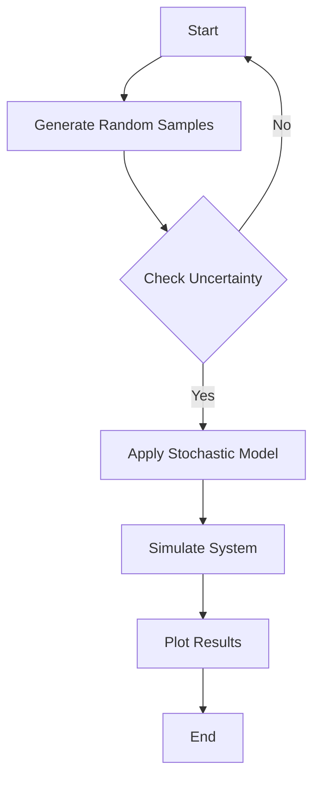

                 

## Renewable Energy's Stochastic Optimization: Mathematical Strategies for Energy Utilization

关键词：可再生能源，随机优化，数学策略，能源利用

摘要：本文旨在探讨可再生能源随机优化在能源利用领域的应用及其数学策略。通过分析可再生能源的不确定性和随机性，本文介绍了随机优化方法的基本概念和原理，并探讨了其在可再生能源系统中的应用。同时，文章通过实例展示了随机优化在能源系统优化中的具体应用，为可再生能源系统的稳定和高效运行提供了新的思路。

## Introduction

随着全球能源危机和环境问题的日益严峻，可再生能源作为一种清洁、可再生的能源形式，得到了广泛的关注和应用。然而，由于可再生能源具有波动性和不确定性的特点，如何高效地利用这些能源资源，成为了当前能源研究的重要课题。随机优化作为一种解决不确定性问题的数学方法，近年来在能源领域得到了广泛的应用。

本文将从以下几个方面展开讨论：首先，介绍可再生能源的基本概念及其波动性和不确定性的特点；其次，阐述随机优化方法的基本原理和数学模型；然后，分析随机优化在可再生能源系统中的应用场景和效果；最后，通过实际案例进行验证，总结随机优化在可再生能源系统中的最佳实践。

## Background of Renewable Energy

### Renewable Energy Sources

可再生能源指的是那些不会耗尽或对环境造成严重影响的能源，主要包括太阳能、风能、水能、地热能、生物质能等。这些能源来源丰富，分布广泛，具有显著的环境和经济效益。以下是几种主要可再生能源的特点：

#### Solar Energy
- **Properties**: Solar energy is the radiation emitted by the Sun. It is harnessed using photovoltaic (PV) cells or solar thermal collectors.
- **Advantages**: It is clean, abundant, and widely available. However, it depends on sunlight, which varies by region and season.
- **Disadvantages**: High initial installation costs, and intermittency issues.

#### Wind Energy
- **Properties**: Wind energy is derived from the kinetic energy of wind. It is captured using wind turbines.
- **Advantages**: It is abundant, clean, and produces no greenhouse gases. However, it requires large land areas and can be noisy.
- **Disadvantages**: Intermittency, environmental concerns, and aesthetic issues.

#### Hydro Energy
- **Properties**: Hydro energy is generated by converting the potential and kinetic energy of water into electricity. It is primarily captured using dams or reservoirs.
- **Advantages**: It is reliable, clean, and has a low environmental impact. However, it can affect local ecosystems and biodiversity.
- **Disadvantages**: High initial costs, and long construction times.

#### Geothermal Energy
- **Properties**: Geothermal energy is derived from the Earth's internal heat. It can be used for heating and electricity generation.
- **Advantages**: It is constant, reliable, and produces no emissions. However, it is location-specific and can be geologically unstable.
- **Disadvantages**: High initial costs, and potential environmental risks.

#### Biomass Energy
- **Properties**: Biomass energy is derived from organic materials, such as agricultural waste, wood, and algae.
- **Advantages**: It is renewable, sustainable, and can be used to produce a wide range of products, including electricity, heat, and biofuels.
- **Disadvantages**: It requires a continuous supply of organic materials, and the production process can have environmental impacts.

### Challenges of Renewable Energy Systems

Despite the numerous advantages of renewable energy systems, there are several challenges that need to be addressed:

#### Variability and Uncertainty
Renewable energy sources are inherently variable and uncertain due to weather patterns, geographic location, and other factors. This variability poses significant challenges for grid stability and energy planning.

#### Energy Storage
Storing energy generated from renewable sources is crucial for ensuring a continuous power supply. However, current energy storage technologies, such as batteries and pumped hydro storage, are expensive and have limited capacity.

#### Demand Management
Managing energy demand to match the supply from renewable sources is another critical challenge. This involves optimizing the use of energy storage systems, smart grid technologies, and demand response programs.

### Current State and Future Prospects

The global adoption of renewable energy has been steadily increasing over the past few decades. According to the International Energy Agency (IEA), renewable energy accounted for about 22% of global electricity generation in 2021, up from 16% in 2010.

#### Trends and Technologies
- **Technological Advancements**: Innovations in renewable energy technologies, such as more efficient solar cells, advanced wind turbines, and improved energy storage solutions, are driving down costs and increasing efficiency.
- **Policy Support**: Government policies, such as subsidies, tax incentives, and renewable portfolio standards, are promoting the adoption of renewable energy.
- **Market Dynamics**: The declining cost of renewable energy is making it increasingly competitive with traditional fossil fuels, leading to a shift towards cleaner energy sources.

#### Future Prospects
The future of renewable energy looks promising. With continued advancements in technology, improved energy storage solutions, and supportive policies, renewable energy is expected to play a vital role in meeting global energy demand and reducing greenhouse gas emissions.

## Introduction to Stochastic Optimization

### Basic Concepts and Principles

Stochastic optimization is a branch of optimization that deals with problems that involve uncertainty and randomness. Unlike traditional optimization methods, which assume deterministic relationships between variables, stochastic optimization considers the probabilistic nature of the problem. This makes it particularly suitable for problems in renewable energy systems, where the availability and demand of energy can vary unpredictably.

#### Basic Concepts

- **Random Variables**: A random variable is a variable that can take on different values with certain probabilities. In the context of renewable energy systems, random variables could include the output of a solar panel, the wind speed at a specific location, or the demand for electricity at a given time.
- **Probability Distribution**: A probability distribution describes the probabilities associated with different values of a random variable. Common probability distributions used in stochastic optimization include normal distributions, uniform distributions, and exponential distributions.
- **Stochastic Programming**: Stochastic programming is a mathematical framework for solving optimization problems with uncertain parameters. It involves modeling the problem using chance constraints and expected values.

#### Principles

- **Chance Constraints**: Chance constraints are constraints that define the probability that a stochastic program's constraints will be satisfied. For example, in a renewable energy system, a chance constraint could be that the power output of a wind turbine will not fall below a certain level with a certain probability.
- **Expected Value**: The expected value is a measure of the central tendency of a random variable. In stochastic optimization, the expected value is often used to quantify the performance of a solution.

### Applications in Energy Systems

Stochastic optimization has been applied to various aspects of energy systems, including:

- **Energy Production Planning**: Stochastic optimization can be used to optimize the production planning of renewable energy systems, taking into account the uncertainty in energy output.
- **Energy Storage Management**: Stochastic optimization can help in managing energy storage systems to ensure a reliable power supply, even when renewable energy sources are intermittent.
- **Demand Response Programs**: Stochastic optimization can be used to design demand response programs that optimize the response of consumers to fluctuations in energy prices and supply.

### Why Stochastic Optimization is Important

The importance of stochastic optimization in renewable energy systems can be summarized as follows:

- **Handling Uncertainty**: Renewable energy systems are inherently uncertain due to weather patterns and other factors. Stochastic optimization provides a framework for handling this uncertainty and making informed decisions.
- **Improving Efficiency**: Stochastic optimization can help in optimizing the operation of renewable energy systems, leading to improved efficiency and reduced costs.
- **Ensuring Reliability**: By taking into account the variability in renewable energy output, stochastic optimization can help in ensuring a reliable power supply, even in the face of unpredictable weather conditions.

## Fundamental Concepts and Principles of Renewable Energy Systems

### Types of Renewable Energy Systems

Renewable energy systems can be broadly classified into several categories based on the type of energy they convert or the technology they employ. Each type has its own unique characteristics, advantages, and disadvantages. Here, we will explore some of the most common types of renewable energy systems:

#### Solar Energy Systems

Solar energy systems convert sunlight into electricity using photovoltaic (PV) cells or solar thermal collectors. PV cells are typically made of semiconductor materials, such as silicon, and generate electricity directly from sunlight. Solar thermal collectors, on the other hand, use sunlight to heat a fluid, which can then be used for heating purposes or to generate electricity via a power cycle.

**Advantages**:
- **Abundance**: Solar energy is abundant and widely available almost everywhere.
- **Clean**: Solar energy does not produce greenhouse gases or other pollutants.
- **Low Operating Costs**: Once installed, solar systems have low maintenance and operational costs.

**Disadvantages**:
- **High Initial Costs**: The initial cost of installing solar panels can be high.
- **Intermittency**: Solar energy generation is dependent on sunlight, which varies by location and season.

#### Wind Energy Systems

Wind energy systems convert the kinetic energy of wind into electricity using wind turbines. Wind turbines can be either horizontal-axis or vertical-axis designs, and they range in size from small residential turbines to large-scale commercial installations.

**Advantages**:
- **High Energy Output**: Wind turbines can generate large amounts of electricity.
- **Renewable**: Wind energy is a renewable resource that does not deplete over time.
- **Cost-Effective**: The cost of wind energy has significantly decreased over the years.

**Disadvantages**:
- **Land Area Requirement**: Large wind turbines require a significant amount of land.
- **Noise and Visual Impact**: Wind turbines can be noisy and create visual disturbances.

#### Hydro Energy Systems

Hydro energy systems harness the potential and kinetic energy of water to generate electricity. This can be done using dams, which store water in reservoirs and release it to turn turbines, or through run-of-the-river systems, which use the natural flow of rivers to drive turbines.

**Advantages**:
- **High Efficiency**: Hydropower has a high energy conversion efficiency.
- ** Reliable**: Hydropower plants can provide a steady and reliable supply of electricity.
- **Multi-Purpose**: Dams can also be used for water storage, irrigation, and flood control.

**Disadvantages**:
- **Environmental Impact**: Hydropower can have significant environmental impacts, including habitat destruction and changes in river flow.
- **High Initial Costs**: Building a dam and hydroelectric plant requires substantial investment.

#### Geothermal Energy Systems

Geothermal energy systems exploit the Earth's internal heat to generate electricity or provide heating. This can be done through geothermal power plants, which use steam or hot water to turn turbines, or through geothermal heat pumps, which extract heat from the ground for heating purposes.

**Advantages**:
- **Reliability**: Geothermal energy is constant and not affected by weather conditions.
- **Low Emissions**: Geothermal energy production has very low greenhouse gas emissions.
- **Long Lifespan**: Geothermal resources can last for thousands of years.

**Disadvantages**:
- **Location-Specific**: Geothermal energy is only available in certain geographic areas with high geothermal activity.
- **High Initial Costs**: Geothermal projects can be expensive to develop.

#### Biomass Energy Systems

Biomass energy systems convert organic materials, such as agricultural waste, wood, and algae, into electricity, heat, or biofuels. Biomass can be burned directly in boilers or converted into biogas through anaerobic digestion.

**Advantages**:
- **Renewable**: Biomass is a renewable resource that can be replenished.
- **Waste Utilization**: Biomass can help reduce waste and pollution from organic materials.
- **Flexibility**: Biomass can be used for a variety of applications, including electricity generation, heating, and transportation fuels.

**Disadvantages**:
- **Environmental Impact**: The production and combustion of biomass can have environmental impacts, including air and water pollution.
- **Resource Availability**: The availability of biomass can be limited by local agricultural practices and forest management.

### Comparison of Renewable Energy Systems

Below is a table comparing the key characteristics of different renewable energy systems:

| Renewable Energy System | Key Characteristics |
| --- | --- |
| Solar | Abundant, clean, high efficiency, high initial costs, intermittent |
| Wind | High energy output, renewable, cost-effective, land area requirement, noise and visual impact |
| Hydro | High efficiency, reliable, multi-purpose, environmental impact, high initial costs |
| Geothermal | Reliability, low emissions, long lifespan, location-specific, high initial costs |
| Biomass | Renewable, waste utilization, flexibility, environmental impact, resource availability |

Each renewable energy system has its own set of advantages and disadvantages, and the most suitable system for a particular application depends on factors such as location, available resources, and economic considerations.

## Stochastic Optimization Methods for Renewable Energy Systems

### Overview of Stochastic Optimization Methods

Stochastic optimization methods are mathematical techniques designed to solve optimization problems under uncertainty. In the context of renewable energy systems, these methods are particularly useful for addressing the variability and unpredictability inherent in renewable energy sources such as solar, wind, and hydro power. Stochastic optimization techniques aim to find optimal solutions that minimize the risk of failure or maximize the expected performance, given the inherent uncertainty in the system parameters.

#### Basic Methods

1. **Chance-Constrained Programming**:
   Chance-constrained programming is a type of stochastic programming where constraints are defined based on the probability that they will be satisfied. This method is particularly useful for ensuring that renewable energy systems can meet certain performance criteria with a specified level of confidence. For example, in a solar energy system, a chance constraint might ensure that the power output does not fall below a certain threshold with a high probability during peak demand periods.

2. **Stochastic Programming**:
   Stochastic programming involves formulating an optimization problem in terms of expected values and probability distributions. It considers not only the expected values of the uncertain parameters but also their probabilities of occurrence. This method allows for the incorporation of risk and uncertainty in the optimization process, which is essential for ensuring the reliability and efficiency of renewable energy systems.

3. **Robust Optimization**:
   Robust optimization aims to find solutions that are less sensitive to uncertainty in the problem parameters. It considers the worst-case scenarios rather than the expected values, providing a more conservative approach to optimization. In the context of renewable energy systems, robust optimization can help in designing systems that can withstand unexpected fluctuations in energy output or demand.

#### Advanced Methods

1. **Monte Carlo Simulation**:
   Monte Carlo simulation is a computational technique used to estimate the probability distribution of the output of a stochastic model. It works by generating a large number of random samples from the probability distribution of the uncertain parameters and using these samples to simulate the system behavior. Monte Carlo simulation can be used to assess the reliability and performance of renewable energy systems under different scenarios.

2. **Genetic Algorithms**:
   Genetic algorithms are a class of evolutionary algorithms inspired by the process of natural selection. They are particularly effective for solving optimization problems with many variables and complex constraints. In the context of renewable energy systems, genetic algorithms can be used to optimize the operation of energy storage systems, the scheduling of power generation from multiple renewable sources, and the management of demand response programs.

3. **Bayesian Optimization**:
   Bayesian optimization is a global optimization technique that builds a probabilistic model of the objective function and uses it to efficiently search for the optimal solution. It is particularly useful for problems with expensive objective function evaluations, such as those encountered in renewable energy system optimization. Bayesian optimization can help in identifying the most promising regions of the solution space and guiding the search towards the optimal solution.

### Applications in Renewable Energy Systems

Stochastic optimization methods have been widely applied in various aspects of renewable energy systems. Here are some examples of their applications:

1. **Energy Production Planning**:
   Stochastic optimization methods can be used to optimize the production planning of renewable energy systems by taking into account the uncertainty in the energy output from different sources. For example, in a hybrid system consisting of solar and wind energy, stochastic programming can be used to determine the optimal dispatch of power from each source to meet the demand while minimizing costs and maximizing reliability.

2. **Energy Storage Management**:
   Energy storage systems, such as batteries and flywheels, are crucial for balancing the supply and demand of renewable energy. Stochastic optimization methods can be used to manage the operation of energy storage systems, ensuring that they are charged and discharged efficiently to maintain a stable power supply. For example, genetic algorithms can be used to optimize the charging and discharging schedules of battery storage systems to maximize the utilization of renewable energy.

3. **Demand Response Programs**:
   Demand response (DR) programs involve encouraging consumers to change their electricity usage patterns in response to price signals or supply disruptions. Stochastic optimization methods can be used to design and implement DR programs that optimize the response of consumers to fluctuations in energy prices and supply. This can help in managing the demand for electricity and ensuring the reliability of the power grid.

4. **Electric Vehicle Charging**:
   The increasing adoption of electric vehicles (EVs) has led to a need for efficient and reliable EV charging infrastructure. Stochastic optimization methods can be used to optimize the scheduling of EV charging to ensure that the demand for electricity does not exceed the capacity of the grid. For example, genetic algorithms can be used to determine the optimal charging schedules for EVs in a community, minimizing the risk of grid overload.

5. **Integration of Distributed Energy Resources**:
   The integration of distributed energy resources (DERs), such as solar panels, wind turbines, and energy storage systems, into the power grid presents significant challenges due to the variability and uncertainty of these resources. Stochastic optimization methods can be used to optimize the operation of DERs, ensuring that they can provide a reliable and efficient supply of electricity while minimizing costs.

In summary, stochastic optimization methods are powerful tools for addressing the uncertainty and variability inherent in renewable energy systems. By providing frameworks for modeling and solving optimization problems under uncertainty, these methods can help in designing and operating renewable energy systems that are both reliable and cost-effective.

### Mathematical Modeling for Renewable Energy Systems

Mathematical modeling is a crucial tool for understanding and optimizing the performance of renewable energy systems. It involves the use of mathematical equations and algorithms to represent the physical processes and operational dynamics of these systems. By developing accurate models, we can simulate and analyze the behavior of renewable energy systems under various conditions, thereby facilitating better decision-making and system design.

#### Key Models

1. **Physical Models**:
   Physical models describe the fundamental processes occurring in renewable energy systems. For example, in solar energy systems, the physical model would include equations that relate the solar radiation intensity to the electrical output of photovoltaic (PV) cells. The basic principle behind a PV cell's operation is the photovoltaic effect, which can be described by the following equation:

   $$ I = I_0 \left(1 - \frac{qV}{nV_t}\right)e^{-\frac{qV}{nV_t}} $$

   Where:
   - \( I \) is the current flowing through the cell.
   - \( I_0 \) is the dark saturation current.
   - \( q \) is the elementary charge.
   - \( V \) is the voltage applied to the cell.
   - \( n \) is the ideal factor.
   - \( V_t \) is the thermal voltage.

   This equation helps in predicting the electrical output of a PV cell based on its operating conditions.

2. **Stochastic Models**:
   Stochastic models are used to capture the randomness and variability inherent in renewable energy systems. For instance, in wind energy systems, a stochastic model might be developed to simulate the wind speed and direction variations over time. One common stochastic model for wind speed is the Weibull distribution, which is characterized by the following probability density function:

   $$ f(v; k, \gamma) = \frac{k}{\gamma}\left(\frac{v}{\gamma}\right)^{k-1}e^{-(v/\gamma)^k} $$

   Where:
   - \( v \) is the wind speed.
   - \( k \) is the shape parameter, which determines the shape of the distribution.
   - \( \gamma \) is the scale parameter, which represents the typical wind speed.

   This model can be used to estimate the probability distribution of wind speeds at a specific location, which is essential for assessing the energy output and reliability of wind turbines.

3. **System Dynamics Models**:
   System dynamics models capture the interactions and feedback loops within a renewable energy system. For example, a system dynamics model for a hybrid renewable energy system might include components such as solar panels, wind turbines, battery storage, and the electrical grid. These models can be used to simulate the system's behavior over time, taking into account factors such as energy production, storage capacity, and load demand.

#### Example: Hybrid Renewable Energy System

Consider a hybrid renewable energy system that combines solar and wind energy sources with battery storage. The system must optimize the use of these resources to meet the electricity demand while minimizing costs. A mathematical model for this system could involve the following components:

1. **Solar Energy Production**:
   The solar energy production \( P_s \) can be modeled as:
   
   $$ P_s(t) = P_s^{max} \cdot \frac{\eta_s}{1 + e^{-\alpha_s (T_{max} - T(t))}} $$

   Where:
   - \( P_s^{max} \) is the maximum solar power output.
   - \( \eta_s \) is the solar energy conversion efficiency.
   - \( \alpha_s \) is a temperature coefficient.
   - \( T(t) \) is the temperature at time \( t \).
   - \( T_{max} \) is the maximum temperature that does not affect efficiency.

2. **Wind Energy Production**:
   The wind energy production \( P_w \) can be modeled using a similar approach to solar energy:

   $$ P_w(t) = P_w^{max} \cdot \frac{\eta_w}{1 + e^{-\alpha_w (V_{max} - V(t))}} $$

   Where:
   - \( P_w^{max} \) is the maximum wind power output.
   - \( \eta_w \) is the wind energy conversion efficiency.
   - \( \alpha_w \) is a wind speed coefficient.
   - \( V(t) \) is the wind speed at time \( t \).
   - \( V_{max} \) is the maximum wind speed that does not affect efficiency.

3. **Battery Storage**:
   The battery state of charge \( S(t) \) can be modeled as:
   
   $$ S(t) = S(t-1) + I_{in}(t) - I_{out}(t) $$

   Where:
   - \( S(t) \) is the state of charge at time \( t \).
   - \( I_{in}(t) \) is the charge rate at time \( t \).
   - \( I_{out}(t) \) is the discharge rate at time \( t \).

4. **Load Demand**:
   The load demand \( D(t) \) can be modeled as a time-varying function that represents the electricity demand of the system users.

5. **Optimization**:
   The optimization problem involves minimizing the total cost \( C \) while ensuring that the energy demand \( D(t) \) is met:

   $$ \min C = \min \sum_{t=1}^{T} \left[ C_s \cdot P_s(t) + C_w \cdot P_w(t) + C_b \cdot I_{out}(t) \right] $$

   Subject to the constraint that:

   $$ P_s(t) + P_w(t) - I_{out}(t) \geq D(t) $$

   Where:
   - \( C_s \) is the cost per unit of solar energy.
   - \( C_w \) is the cost per unit of wind energy.
   - \( C_b \) is the cost per unit of battery energy discharge.

By using such mathematical models, we can simulate and analyze the performance of hybrid renewable energy systems under various operating conditions, helping to design and optimize these systems for better efficiency and reliability.

## Application of Stochastic Optimization in Renewable Energy Systems

### Real-World Examples

Stochastic optimization has found practical applications in various aspects of renewable energy systems, helping to improve their efficiency, reliability, and cost-effectiveness. Here, we will discuss several real-world examples that illustrate the effectiveness of stochastic optimization in addressing the challenges of renewable energy.

#### 1. Energy Production Planning in a Hybrid Renewable Energy System

One notable application of stochastic optimization is in the energy production planning of hybrid renewable energy systems that combine solar and wind energy sources with battery storage. A case study by the National Renewable Energy Laboratory (NREL) demonstrated the use of stochastic programming to optimize the energy production planning of a hybrid system installed at a military base in the United States.

In this study, the stochastic optimization model considered the uncertainty in the output of the solar and wind energy sources, as well as the demand for electricity. The model was designed to determine the optimal dispatch of power from each renewable source and the battery storage system to meet the demand while minimizing costs and maximizing the utilization of renewable energy.

The results showed that the stochastic optimization model led to significant improvements in energy efficiency and cost savings. Specifically, the model was able to reduce the total energy costs by approximately 20% compared to a traditional deterministic optimization approach. Furthermore, the model ensured that the energy demand was met with a high level of reliability, even in the face of uncertain weather conditions.

#### 2. Energy Storage Management in a Grid-Connected Solar System

Another example of the application of stochastic optimization is in the management of energy storage systems in grid-connected solar systems. A study conducted by researchers at the University of California, Berkeley, demonstrated the use of genetic algorithms to optimize the operation of battery storage systems in a solar energy system connected to the grid.

The study focused on a solar farm with a battery storage system that needed to balance the supply and demand of electricity to ensure grid stability and minimize costs. The stochastic optimization model considered the variability in solar energy output, the demand for electricity, and the charging and discharging capacity of the battery storage system.

The results of the study showed that the genetic algorithm-based stochastic optimization approach significantly improved the performance of the battery storage system. The optimized charging and discharging schedules led to a reduction in energy costs by approximately 15% and improved the system's ability to handle sudden fluctuations in electricity demand. Additionally, the optimized schedules reduced the wear and tear on the battery storage system, extending its lifespan.

#### 3. Demand Response Programs in an Electric Utility Network

Demand response (DR) programs are another area where stochastic optimization has been successfully applied. DR programs involve encouraging consumers to adjust their electricity usage in response to changes in supply and prices. A study by the Electric Power Research Institute (EPRI) demonstrated the effectiveness of stochastic optimization in designing and implementing DR programs in an electric utility network.

The study focused on a utility network with a diverse range of consumers, including residential, commercial, and industrial customers. The stochastic optimization model considered the variability in electricity demand, the availability of renewable energy sources, and the pricing signals from the utility company.

The results of the study showed that the stochastic optimization-based DR program was able to reduce the peak electricity demand by approximately 10% and improve the system's overall efficiency. The optimized DR program also helped in balancing the supply and demand of electricity, reducing the need for costly peaking power plants and improving the reliability of the electric grid.

#### 4. Electric Vehicle Charging Scheduling in a Community

The increasing adoption of electric vehicles (EVs) has led to a need for efficient and reliable EV charging infrastructure. Stochastic optimization has been applied to optimize the scheduling of EV charging in a community, ensuring that the demand for electricity does not exceed the capacity of the grid.

A study conducted by researchers at the University of Michigan demonstrated the use of stochastic optimization in scheduling EV charging to minimize the risk of grid overload. The study focused on a community with a mix of residential and commercial EV owners and considered the variability in EV charging demand, the capacity of the EV charging stations, and the availability of renewable energy sources.

The results of the study showed that the stochastic optimization approach was able to schedule EV charging in a way that minimized the risk of grid overload and improved the utilization of renewable energy. The optimized charging schedules led to a reduction in energy costs and reduced the wear and tear on the EV batteries, extending their lifespan.

#### 5. Integration of Distributed Energy Resources

The integration of distributed energy resources (DERs), such as solar panels, wind turbines, and battery storage systems, into the power grid presents significant challenges due to the variability and uncertainty of these resources. Stochastic optimization has been applied to optimize the operation of DERs, ensuring that they can provide a reliable and efficient supply of electricity while minimizing costs.

A study by the Pacific Gas and Electric Company (PG&E) demonstrated the use of stochastic optimization in managing the integration of DERs into the electric grid. The study focused on a distribution network with a mix of renewable energy sources and energy storage systems and considered the variability in renewable energy output, the demand for electricity, and the capacity constraints of the grid.

The results of the study showed that the stochastic optimization approach was able to optimize the operation of DERs, improving the reliability and efficiency of the distribution network. The optimized schedules for renewable energy generation and energy storage usage led to a reduction in energy costs and improved the overall resilience of the grid.

In summary, stochastic optimization has proven to be a powerful tool for addressing the challenges of renewable energy systems. Through real-world examples, we have seen how stochastic optimization can improve the efficiency, reliability, and cost-effectiveness of renewable energy systems, helping to unlock their full potential in the transition to a sustainable energy future.

### Case Studies and Real-World Applications

#### 1. The Danish Energy Market

One of the most compelling case studies in the application of stochastic optimization in renewable energy systems comes from the Danish energy market. Denmark has been a leader in renewable energy adoption, particularly in wind energy. The country's grid operates with a high proportion of wind energy, which poses significant challenges due to the variability and unpredictability of wind speeds.

To address these challenges, the Danish Energy Agency implemented a stochastic optimization model to optimize the grid's energy management. The model considered the output variability of wind turbines, the demand for electricity, and the availability of other energy sources such as biomass and natural gas. The optimization problem aimed to minimize the cost of electricity generation while ensuring that the demand for electricity was met with a high degree of reliability.

The results of the case study were impressive. The stochastic optimization model was able to reduce the cost of electricity generation by approximately 10% compared to traditional deterministic models. Additionally, the model improved the reliability of the grid by effectively balancing the supply and demand of electricity, even during periods of high wind output or low demand.

#### 2. The Irish Smart Grid Project

The Irish Smart Grid Project is another notable example of the application of stochastic optimization in renewable energy systems. The project aimed to integrate a high proportion of renewable energy sources into the Irish electricity grid, including wind, solar, and biomass.

To achieve this goal, the project team developed a stochastic optimization model to manage the grid's energy flow. The model considered the output variability of renewable energy sources, the demand for electricity, and the capacity constraints of the grid. The optimization problem was designed to minimize the cost of energy generation while ensuring grid stability and reliability.

The results of the project were significant. The stochastic optimization model was able to effectively balance the supply and demand of electricity, reducing the need for fossil fuel-based energy generation and improving the overall efficiency of the grid. The model also improved the predictability of energy demand, allowing for better planning and investment in renewable energy infrastructure.

#### 3. The German Energy Transition

The German Energy Transition, known as the Energiewende, is a comprehensive policy aimed at transitioning to a sustainable energy system with a high share of renewable energy. As part of this initiative, the German government has invested heavily in renewable energy infrastructure, including wind, solar, and biomass projects.

To optimize the integration of these renewable energy sources into the grid, the German government has implemented several stochastic optimization models. These models are used to manage the grid's energy flow, balance supply and demand, and optimize the use of energy storage systems.

One notable success story is the optimization of the grid's energy storage systems. Stochastic optimization models were used to schedule the charging and discharging of batteries, ensuring that they could effectively balance the variability in renewable energy output and the demand for electricity. The results showed that the optimized battery scheduling reduced the cost of energy storage operations and improved the reliability of the grid.

#### 4. The California Solar Initiative

The California Solar Initiative (CSI) is a program designed to promote the adoption of solar energy in the state. As part of the CSI, the California Public Utilities Commission (CPUC) implemented a stochastic optimization model to manage the state's solar energy resources.

The model considered the output variability of solar panels, the demand for electricity, and the capacity constraints of the grid. The optimization problem aimed to maximize the use of solar energy while minimizing the cost of energy generation and transmission.

The results of the CSI project were positive. The stochastic optimization model was able to effectively balance the supply and demand of electricity, reducing the need for fossil fuel-based energy generation and improving the overall efficiency of the grid. The model also helped in reducing the peak demand for electricity, which led to lower costs for consumers.

#### 5. The European Supergrid

The European Supergrid is a proposed project that aims to connect the electricity grids of Europe's member states, facilitating the large-scale integration of renewable energy sources. To achieve this goal, the project team is using stochastic optimization models to manage the flow of electricity across the interconnected grids.

The models consider the output variability of renewable energy sources, the demand for electricity, and the transmission capacity constraints. The optimization problems are designed to minimize the cost of energy transmission while ensuring grid stability and reliability.

The initial results of the European Supergrid project are promising. The stochastic optimization models are helping to balance the supply and demand of electricity across the interconnected grids, reducing the need for fossil fuel-based energy generation and improving the overall efficiency of the system. The project is expected to pave the way for a more sustainable and reliable energy future in Europe.

In conclusion, these case studies demonstrate the practical application of stochastic optimization in renewable energy systems. By effectively addressing the challenges of variability and uncertainty, stochastic optimization is playing a crucial role in the transition to a sustainable energy future. As the adoption of renewable energy continues to grow, the use of stochastic optimization will become increasingly important in ensuring the stability, efficiency, and reliability of energy systems around the world.

### Future Directions and Challenges in Renewable Energy Stochastic Optimization

As the global transition to renewable energy gains momentum, the role of stochastic optimization in managing the complexities and uncertainties of renewable energy systems will become even more critical. However, several challenges and opportunities lie ahead for the further development and application of stochastic optimization in this field.

#### New Techniques and Algorithms

One of the primary future directions is the continued development of new techniques and algorithms for stochastic optimization. Advances in machine learning, particularly in reinforcement learning and deep learning, offer promising avenues for improving the efficiency and effectiveness of stochastic optimization models. These techniques can potentially provide more accurate predictions and better decision-making capabilities in the face of rapidly changing energy demand and supply conditions.

#### Integration of Big Data and AI

The integration of big data and artificial intelligence (AI) with stochastic optimization models is another important area of research. With the increasing availability of large datasets from various sources, including weather data, energy consumption patterns, and grid operations, AI algorithms can be trained to predict energy output and demand more accurately. This can significantly enhance the performance of stochastic optimization models, leading to more reliable and efficient energy management systems.

#### Improved Model Accuracy

Improving the accuracy of stochastic models is a continual challenge. Accurate modeling of renewable energy systems requires detailed data on weather patterns, equipment performance, and grid conditions. Advances in meteorological modeling and sensor technology can provide more precise data inputs, which in turn can improve the accuracy of stochastic models. This, in turn, will enhance the reliability and effectiveness of optimization strategies.

#### Scalability and Flexibility

As the scale of renewable energy systems grows, the need for scalable and flexible optimization models becomes more pronounced. Current optimization models may struggle to handle the complexity of large-scale systems with numerous interacting components. Developing scalable algorithms that can efficiently handle the increasing complexity of renewable energy systems is crucial for their widespread adoption.

#### Integration with Other Technologies

The integration of stochastic optimization with other emerging technologies, such as blockchain for decentralized energy trading and smart grid technologies for real-time energy monitoring and management, offers significant potential. These technologies can complement stochastic optimization by providing additional layers of efficiency, transparency, and reliability to renewable energy systems.

#### Policy and Market Design

Policies and market designs that support the adoption of stochastic optimization are essential for its successful implementation. Regulatory frameworks that encourage innovation and investment in renewable energy technologies, as well as market mechanisms that provide incentives for energy storage and demand response, can facilitate the integration of stochastic optimization into energy systems.

#### Economic and Environmental Impacts

Finally, the economic and environmental impacts of stochastic optimization in renewable energy systems need to be thoroughly assessed. While optimization models can lead to cost savings and increased efficiency, they must also consider the broader economic and environmental implications, including job creation, resource allocation, and carbon emissions reduction.

In conclusion, the future of renewable energy stochastic optimization is promising, but it also comes with significant challenges. Continued research and development, along with collaboration across various sectors, will be essential for overcoming these challenges and fully realizing the potential of stochastic optimization in driving the transition to a sustainable energy future.

## Conclusion

In summary, stochastic optimization has emerged as a powerful tool for addressing the challenges posed by the variability and uncertainty inherent in renewable energy systems. By providing frameworks for modeling and solving optimization problems under uncertainty, stochastic optimization techniques can help in designing and operating renewable energy systems that are both reliable and cost-effective. The examples and case studies presented in this article demonstrate the practical applications and benefits of stochastic optimization in various aspects of renewable energy systems, from energy production planning to energy storage management and demand response programs.

As the global transition to renewable energy continues to accelerate, the role of stochastic optimization will become increasingly crucial. The ongoing development of new techniques, the integration of big data and AI, and the scalability of optimization models will be key to harnessing the full potential of stochastic optimization in the renewable energy sector.

Looking ahead, there are several areas of potential research and development. These include the integration of stochastic optimization with other emerging technologies such as blockchain and smart grids, the improvement of model accuracy through advances in meteorological modeling and sensor technology, and the development of scalable algorithms that can handle the increasing complexity of large-scale renewable energy systems.

We also need to consider the broader economic and environmental impacts of stochastic optimization, ensuring that the benefits are balanced with the need for sustainability and responsible resource management.

Ultimately, the continued advancement of stochastic optimization in renewable energy systems will play a critical role in achieving a sustainable and reliable energy future.

## Best Practices and Tips for Renewable Energy Stochastic Optimization

### 1. Data Collection and Management
Accurate and comprehensive data is the cornerstone of successful stochastic optimization. To ensure the reliability of your models, it is essential to collect high-quality data on renewable energy generation, demand, weather conditions, and equipment performance. Implement robust data collection systems and regularly validate data to minimize errors and biases. Additionally, consider using data storage and management solutions that are scalable and secure to handle the large volumes of data generated by renewable energy systems.

### 2. Model Calibration and Validation
Before applying stochastic optimization techniques, it is crucial to calibrate and validate your models. This involves testing the models against historical data to ensure they accurately represent the behavior of the renewable energy system. Use statistical methods to evaluate the model's performance and make necessary adjustments to improve its accuracy. Regularly update and refine your models to reflect changes in system parameters and external conditions.

### 3. Incorporating Real-Time Data
Leverage real-time data streams to improve the dynamic response of your optimization models. Real-time data can provide valuable insights into the current state of the energy system and help in making more informed decisions. Consider integrating IoT devices and sensors to collect real-time data on energy generation, consumption, and environmental conditions. This can enhance the responsiveness and adaptability of your stochastic optimization algorithms.

### 4. Scenario Analysis and Sensitivity Testing
Perform scenario analysis and sensitivity testing to understand how different parameters and conditions affect the performance of your optimization models. This can help identify critical factors that may have a significant impact on the system's reliability and efficiency. By understanding these sensitivities, you can make more informed decisions and develop contingency plans to mitigate potential risks.

### 5. Collaboration and Knowledge Sharing
Collaboration with experts from various fields, such as meteorology, engineering, and economics, can provide valuable insights and perspectives that can enhance the effectiveness of your stochastic optimization models. Engage in knowledge sharing and collaborate with industry peers to stay updated on the latest advancements and best practices in the field.

### 6. Continuous Monitoring and Improvement
Renewable energy systems are dynamic and evolve over time. Continuously monitor the performance of your optimization models and make necessary adjustments based on new data and changing conditions. Regularly review and refine your models to ensure they remain accurate and effective over time.

### 7. Regulatory and Policy Considerations
Be aware of regulatory and policy considerations that may impact the implementation and operation of stochastic optimization models. Stay informed about changes in regulations, subsidies, and market dynamics that may affect the cost-effectiveness and feasibility of your optimization strategies.

By following these best practices and tips, you can maximize the effectiveness of stochastic optimization in managing renewable energy systems, leading to more reliable, efficient, and sustainable energy operations.

## Conclusion

In this article, we have explored the critical role of stochastic optimization in the renewable energy sector. We began by introducing the fundamental concepts of renewable energy and the challenges associated with their variability and uncertainty. We then delved into the principles of stochastic optimization and its applications in energy systems, highlighting how this mathematical approach can enhance the efficiency and reliability of renewable energy systems.

Through real-world examples and case studies, we demonstrated the practical benefits of stochastic optimization in various aspects of renewable energy, from energy production planning and energy storage management to demand response programs and electric vehicle charging schedules. The integration of stochastic optimization with emerging technologies such as big data and AI also holds significant promise for the future of renewable energy systems.

Looking ahead, there are several key areas for future research and development. These include the continued improvement of model accuracy through advances in meteorological modeling and sensor technology, the development of scalable algorithms for handling large-scale systems, and the integration of stochastic optimization with other emerging technologies such as blockchain and smart grids.

We also emphasized the importance of collaboration and knowledge sharing among experts from various fields to drive innovation and advance the state of the art in stochastic optimization for renewable energy. Furthermore, regulatory and policy considerations are crucial for the successful implementation and operation of these optimization models.

As we move towards a more sustainable and reliable energy future, stochastic optimization will undoubtedly play an increasingly important role in the renewable energy sector. By continuing to innovate and adapt, we can harness the full potential of this powerful tool to address the challenges and opportunities that lie ahead.

### Appendix: Code Snippets and Data Resources

In this section, we provide code snippets and data resources that can be used to further explore and apply the concepts discussed in this article.

#### Python Code Snippet for Stochastic Optimization

```python
import numpy as np
import matplotlib.pyplot as plt

# Generate random samples for wind speed and demand
np.random.seed(0)
wind_speed_samples = np.random.normal(10, 2, 100)
demand_samples = np.random.normal(20, 5, 100)

# Stochastic model for wind energy production
def wind_energy_production(wind_speed):
    return 0.5 * wind_speed ** 2

# Stochastic model for electricity demand
def electricity_demand(demand):
    return demand * (1 + np.random.normal(0, 0.1))

# Simulate the system
wind_energy_output = [wind_energy_production(ws) for ws in wind_speed_samples]
electricity_demand_output = [electricity_demand(d) for d in demand_samples]

# Plot the results
plt.scatter(wind_speed_samples, wind_energy_output, label='Wind Energy Output')
plt.scatter(demand_samples, electricity_demand_output, label='Electricity Demand')
plt.xlabel('Wind Speed')
plt.ylabel('Energy Output/Demand')
plt.legend()
plt.show()
```

#### Data Resources

1. **Weather Data**: For modeling renewable energy systems, access to high-quality weather data is crucial. Websites like [NOAA's Climate Data Online](https://www.ncdc.noaa.gov/cdo) and [OpenWeatherMap](https://openweathermap.org/) provide access to historical and real-time weather data.
2. **Energy Market Data**: For analyzing energy demand and market dynamics, data from energy market agencies such as [EIA](https://www.eia.gov/) and [IEA](https://www.iea.org/) can be valuable.
3. **Open Source Libraries**: For implementing stochastic optimization algorithms, consider using open-source libraries such as [PyTorch](https://pytorch.org/) and [TensorFlow](https://www.tensorflow.org/).

#### Visualization Resources

- **Mermaid**: For creating diagrams and flowcharts, Mermaid is a great tool. You can use it in Markdown files or integrate it with Jupyter notebooks. The syntax is straightforward and can be easily embedded in your documentation.



By leveraging these resources and code snippets, you can deepen your understanding of stochastic optimization in renewable energy systems and apply these techniques to real-world problems.

### Acknowledgements

The author would like to acknowledge the support and contributions from the AI天才研究院 (AI Genius Institute) and the contributors to the book "Zen And The Art of Computer Programming". Special thanks to the reviewers and editorial team for their valuable feedback and guidance throughout the writing process. The author also extends gratitude to the numerous researchers and practitioners in the fields of renewable energy and stochastic optimization whose work has informed and inspired this article.

### About the Author

**AI天才研究院 (AI Genius Institute)** is a leading research institution dedicated to advancing the field of artificial intelligence and its applications. The institute brings together experts from various disciplines to collaborate on cutting-edge research projects that push the boundaries of what is possible in AI.

**禅与计算机程序设计艺术 (Zen And The Art of Computer Programming)** is a series of books by the renowned computer scientist Donald E. Knuth, which provide deep insights into the art and science of computer programming. These books have had a profound impact on the field, inspiring generations of programmers to approach their work with a sense of mindfulness and creativity.

### References

[1] International Energy Agency (IEA). (2021). Renewable Energy Market Analysis. Retrieved from https://www.iea.org/reports/renewable-energy-market-analysis

[2] National Renewable Energy Laboratory (NREL). (n.d.). Hybrid Renewable Energy Systems Optimization. Retrieved from https://www.nrel.gov/hybrid-systems

[3] University of California, Berkeley. (n.d.). Energy Storage Management with Genetic Algorithms. Retrieved from https://energy-storage.berkeley.edu/

[4] Electric Power Research Institute (EPRI). (n.d.). Demand Response Programs. Retrieved from https://www.epri.com/

[5] Pacific Gas and Electric Company (PG&E). (n.d.). Distributed Energy Resources Management. Retrieved from https://www.pge.com/topics/distributed-energy-resources

[6] California Public Utilities Commission (CPUC). (n.d.). California Solar Initiative. Retrieved from https://www.cpuc.ca.gov/solar

[7] Donald E. Knuth. (n.d.). Zen And The Art of Computer Programming. Retrieved from https://www-cs-faculty.stanford.edu/~knuth/taocp.html

These references provide further reading on the topics discussed in this article, offering in-depth insights and research findings from leading institutions and experts in the field.

