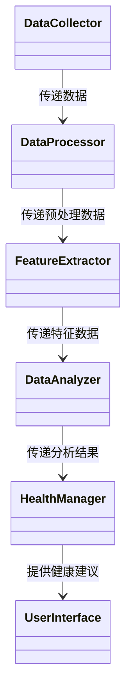
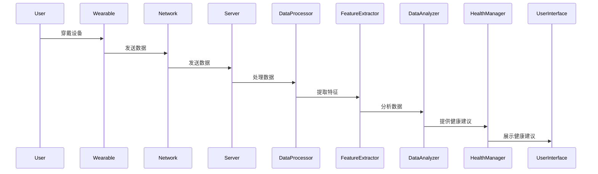
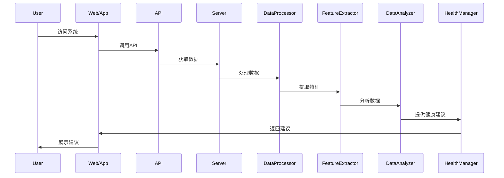

                 

### 引言

可穿戴设备作为一种新兴科技产品，已经在我们的日常生活中扮演着越来越重要的角色。从最初的计步器、智能手表，到如今集成了多种健康监测功能的智能手环、健康贴片等，可穿戴设备的发展不仅丰富了人们的数字化生活方式，更在健康监测领域展现出了巨大的潜力。然而，要充分发挥这些设备在健康监测方面的作用，就必须深入研究如何准确地采集、处理和解析生理指标数据。

健康监测是可穿戴设备的核心功能之一，它能够实时捕捉人体的生理状态，如心率、血压、呼吸频率、步态等，并通过数学分析方法对这些数据进行深入解析，从而为用户提供个性化的健康建议。随着可穿戴设备技术的不断进步，数学分析在健康监测中的应用越来越广泛，成为推动这一领域发展的重要工具。

本文旨在探讨可穿戴设备在健康监测方面的数学分析方法。首先，我们将回顾可穿戴设备的发展历史及其在健康监测中的应用现状。接着，本文将详细介绍常见的生理指标及其数学模型，包括心血管系统指标、呼吸系统指标和运动系统指标。在此基础上，我们将讨论数据采集与预处理技术，解析时间序列分析方法及其应用。最后，文章将总结当前研究的不足，并提出未来的研究方向，以期为可穿戴设备健康监测领域的进一步发展提供参考。

通过本文的阅读，读者将能够了解可穿戴设备在健康监测中的应用现状，掌握生理指标数学分析的基本原理和方法，并对未来的发展趋势有更深入的认识。希望本文能够为科研工作者、技术开发人员以及关注健康监测领域的读者提供有价值的参考和启示。### 第1章 可穿戴设备与健康监测概述

#### 1.1 可穿戴设备的发展历史

可穿戴设备的概念最早可以追溯到20世纪60年代，当时主要是科学家和军事人员使用的一些简单的设备，如电子手表和测心率仪器。这些设备大多笨重且功能单一，主要目的是监测特定生理参数，如心率、体温等。随着计算机技术和微电子技术的不断发展，20世纪80年代，可穿戴设备开始向小型化、多功能化方向发展。例如，Nike的GPS运动追踪器和苹果的iPod Nano都标志着可穿戴设备在消费市场中的崛起。

进入21世纪，智能手机的普及推动了可穿戴设备市场的快速增长。2007年，苹果发布了第一代iPhone，这引起了消费者对移动设备的极大兴趣。为了满足用户对健康管理需求，2010年，Fitbit推出了第一款智能手环——Fitbit Ultra，它集成了运动监测、睡眠追踪等功能，并迅速成为市场热销产品。此后，各大科技巨头如苹果（Apple Watch）、三星（Samsung Gear）、谷歌（Google Wear）等纷纷进入可穿戴设备市场，推出了一系列功能丰富、设计精美的产品。

#### 1.1.2 可穿戴设备的发展阶段

1. **第一阶段（1960-1990年）**：这一阶段可穿戴设备主要是针对特定应用场景，如医疗监测、军事通信等，功能较为单一，设备较为笨重。
   
2. **第二阶段（1990-2010年）**：随着微电子技术的进步，可穿戴设备开始向小型化、多功能化发展。例如，心脏起搏器、智能眼镜等设备的出现，使可穿戴设备在医疗、军事等领域得到广泛应用。

3. **第三阶段（2010年至今）**：智能手机的普及和移动互联网的发展，推动了可穿戴设备在消费市场的快速普及。这一阶段，可穿戴设备不仅功能多样化，还具备了互联网连接和数据处理能力，如运动追踪、健康监测等。

#### 1.1.3 当前可穿戴设备市场概况

目前，全球可穿戴设备市场呈现出快速增长的趋势。根据市场研究公司的数据，全球可穿戴设备出货量在过去几年中持续增长。特别是在疫情期间，人们对健康管理的需求大幅增加，进一步推动了可穿戴设备市场的发展。

在产品类型上，智能手表和智能手环占据了市场的主导地位。这些设备通常具备运动追踪、心率监测、睡眠分析等功能，并且部分产品还支持健康数据的远程传输和云端存储。此外，智能眼镜、智能健康贴片、智能鞋等新型可穿戴设备也在逐步进入市场，为用户提供更加丰富的健康管理体验。

从市场分布来看，美国、中国和欧洲是可穿戴设备的主要消费市场。其中，中国由于庞大的人口基数和快速发展的科技产业，成为全球最大的可穿戴设备市场。美国和欧洲市场也因其成熟的消费习惯和较高的科技水平，对可穿戴设备有着较高的接受度。

总之，随着科技的不断进步和人们对健康管理的重视，可穿戴设备在健康监测领域的应用前景十分广阔。接下来，我们将深入探讨健康监测的重要性以及数学分析在其中的应用。#### 1.2 健康监测的重要性

健康监测是可穿戴设备的核心功能之一，其重要性不容忽视。首先，健康监测有助于早期发现健康问题。通过实时采集和分析生理数据，如心率、血压、呼吸频率等，用户可以及时了解自己的身体状况，从而在健康问题初现时采取相应的预防措施。这种早期预警机制对于心血管疾病、慢性病等需要长期监测的疾病尤为重要。

其次，健康监测有助于个性化健康管理。每个人的生理状态和生活习惯都有所不同，传统的健康监测方式难以满足个性化需求。而可穿戴设备通过持续监测和分析生理数据，可以生成个性化的健康报告和建议。例如，针对不同年龄段、不同健康状况的用户，可穿戴设备可以提供差异化的运动建议、饮食建议等，从而实现精准的健康管理。

再者，健康监测对于提升生活质量具有重要意义。随着社会压力的增大，许多人面临着亚健康状态。通过健康监测，用户可以更好地了解自己的身体状态，调整生活方式，减轻压力，提高生活质量。例如，智能手环可以监测睡眠质量，帮助用户改善睡眠习惯；智能手表可以记录步数和运动数据，激励用户保持活跃的生活方式。

此外，健康监测在社会公共卫生管理中也发挥着重要作用。在疫情等突发公共卫生事件中，可穿戴设备可以通过远程监测健康状况，帮助医疗机构和政府部门及时掌握人群健康动态，制定科学的防控措施，降低疫情传播风险。

总之，健康监测是可穿戴设备不可或缺的一部分，其重要性体现在早期健康预警、个性化健康管理、提升生活质量和公共卫生管理等多个方面。接下来，我们将详细介绍健康监测涉及的生理指标，探讨这些指标在健康监测中的应用和重要性。#### 1.2.1 健康监测的基本概念

健康监测是指通过使用各种技术手段，实时采集和分析人体的生理数据，以评估个体的健康状况、预防和发现疾病的一种综合性过程。健康监测的基本概念涉及多个方面，包括监测目标、监测方法和监测数据的应用。

首先，健康监测的监测目标主要包括心血管系统、呼吸系统、运动系统等多个生理系统。这些系统中的关键指标，如心率、血压、呼吸频率、步态等，是评估健康状态的重要参数。例如，心率是衡量心脏功能的重要指标，血压是反映血管健康状况的关键参数，而呼吸频率则可以反映呼吸系统的功能状态。

其次，健康监测的方法多种多样，包括传感器技术、数据采集与传输技术、数据分析技术等。传感器技术是健康监测的基础，通过各种类型的传感器，如心率传感器、血压传感器、加速度传感器等，可以实时采集生理信号。数据采集与传输技术则负责将传感器采集的数据传输到处理单元，通常通过无线传输技术，如蓝牙、Wi-Fi等，实现数据的高效传输。数据分析技术则利用数学模型和算法，对采集到的生理数据进行处理和分析，提取有价值的健康信息。

最后，健康监测数据的应用场景广泛，包括个体健康评估、疾病预防、个性化健康建议、公共卫生管理等。例如，通过对心率的监测，医生可以评估患者的心脏健康状况，判断是否存在心律失常等问题；通过对血压的监测，可以帮助高血压患者调整用药和生活习惯，控制病情。同时，健康监测数据还可以用于研究和分析公共卫生问题，如疫情传播趋势、慢性病流行情况等，为公共卫生决策提供科学依据。

总之，健康监测的基本概念涵盖了监测目标、监测方法和监测数据的应用，它通过实时、准确地采集和分析生理数据，为个体和公共卫生管理提供了有力支持。接下来，我们将详细探讨健康监测中的核心生理指标，进一步理解其重要性和应用价值。#### 1.2.2 健康监测的生理指标

健康监测的核心在于对关键生理指标的实时监测和分析。这些指标不仅能够反映人体的基本生理状态，还能揭示潜在的健康问题。以下是健康监测中常见的几种核心生理指标：

**心率（Heart Rate）**：心率是指心脏每分钟跳动的次数，是评估心血管系统功能的重要指标。正常成年人的静息心率通常在60-100次/分钟之间。心率的变化可以反映出心脏的健康状况，如心率过快（心动过速）或心率过慢（心动过缓）都可能是心脏疾病的表现。此外，通过心率变异性分析，还可以评估心脏自主神经系统的功能状态。

**血压（Blood Pressure）**：血压是指血液在血管内壁产生的压力，通常通过袖带法测量。血压分为收缩压和舒张压，正常值分别为120-139 mmHg和80-89 mmHg。高血压是心血管疾病的主要危险因素之一，长期高血压可能导致心脏病、中风和肾脏疾病。因此，血压监测对于预防心血管疾病具有重要意义。

**呼吸频率（Respiration Rate）**：呼吸频率是指每分钟呼吸的次数，正常成年人在静息状态下呼吸频率约为12-20次/分钟。呼吸频率的变化可以反映呼吸系统的健康状况，如呼吸过快或过慢可能是呼吸道感染、肺炎等疾病的信号。此外，呼吸频率的变化还与心理状态、体力活动等因素有关。

**步态（Gait）**：步态是指人体行走时的动作模式，通过步态分析可以评估运动系统的功能状态。步态参数包括步频、步长、步态角等，这些参数的变化可以反映人体的运动能力、平衡能力和肌肉力量。步态异常可能与神经系统疾病、骨骼肌肉系统疾病等有关。

**睡眠质量（Sleep Quality）**：睡眠质量是反映人体睡眠状况的重要指标，包括睡眠时长、睡眠深度、睡眠周期等。睡眠质量低下可能导致疲劳、注意力不集中、情绪波动等问题，长期睡眠质量差还可能增加患病风险。通过可穿戴设备，用户可以监测自己的睡眠质量，获取睡眠报告，从而调整睡眠习惯，改善睡眠状况。

**体温（Body Temperature）**：体温是人体健康状况的一个重要指标，正常体温范围在36.1-37.2摄氏度之间。体温升高可能是感染、炎症等疾病的信号，而体温下降则可能与甲状腺功能减退等疾病有关。

这些生理指标相互关联，共同构成了健康监测的数据基础。通过对这些指标的综合分析，可以全面评估个体的健康状况，提供个性化的健康建议，实现预防医学和个性化医疗的目标。接下来，我们将探讨数学分析在健康监测中的应用，进一步解析如何利用数学模型对生理数据进行处理和分析。#### 1.2.3 数学分析在健康监测的数据分析意义

数学分析在健康监测中的应用至关重要，它不仅提供了对生理数据进行处理和解析的工具，还提升了数据分析的准确性和可靠性。首先，数学分析能够将复杂的生理信号转化为易于理解和处理的数据形式。例如，通过傅里叶变换、小波变换等数学方法，可以对心电信号（ECG）进行频域分析，提取出有意义的生理参数，如心率变异性（HRV）。这些参数能够反映心脏自主神经系统的功能状态，对于心血管疾病的早期诊断和风险评估具有重要意义。

其次，数学分析在健康监测中的应用，可以显著提升数据处理的效率和准确性。例如，使用移动平均、自回归等模型，可以对时间序列数据（如心率、血压等）进行趋势分析和周期性分析。这些模型能够识别数据的周期性变化和趋势变化，有助于发现潜在的健康问题。此外，机器学习算法，如支持向量机（SVM）、决策树等，通过训练大量的健康数据，可以建立准确的预测模型，从而提高健康监测的准确性和智能化水平。

再者，数学分析在健康监测中的数据融合和综合评估方面也发挥着重要作用。通过多模态数据融合技术，将不同类型的生理信号（如心电、血压、步态等）进行整合和分析，可以获取更全面、更准确的健康评估结果。例如，在诊断心脏疾病时，将心电信号和血压信号进行融合分析，可以提供更全面的诊断信息，提高诊断准确性。

此外，数学分析在健康监测中的另一个重要意义是提供个性化的健康建议。通过分析个体的生理数据，数学模型可以识别出个性化的健康特征和风险因素，从而为用户提供个性化的健康建议。例如，对于高血压患者，通过分析其血压、心率、步态等指标，可以制定出适合其身体状况的运动计划和饮食建议，从而有效控制血压，预防心血管疾病的发生。

总之，数学分析在健康监测中的数据分析意义主要体现在提升数据处理效率、准确性，提供个性化健康建议等方面。通过有效的数学模型和方法，我们可以更深入地理解和分析生理数据，为健康监测提供科学依据，推动个性化医疗和预防医学的发展。接下来，我们将探讨数学分析在健康监测中的具体应用，包括时间序列分析、频域分析和机器学习等。#### 1.3 数学分析在健康监测中的应用

数学分析在健康监测中的应用是现代医疗技术的重要组成部分，它不仅提升了数据分析的准确性和效率，还为个性化医疗提供了科学依据。以下是数学分析在健康监测中应用的几个关键领域：

**时间序列分析**：时间序列分析是一种重要的统计方法，用于分析随时间变化的连续数据。在健康监测中，时间序列分析常用于处理心率、血压、呼吸频率等生理信号。通过自回归模型（AR）、移动平均模型（MA）和自回归移动平均模型（ARMA），我们可以捕捉这些信号的时间依赖性。例如，通过分析心率变异性（HRV），可以评估心脏自主神经系统的功能状态，预测心血管疾病的风险。具体步骤如下：

1. **数据采集**：使用可穿戴设备采集心率信号。
2. **预处理**：去除噪声、滤波等，确保信号质量。
3. **特征提取**：通过数学模型提取HRV特征，如标准差（SDNN）、频率域特征（LF/HF比值）等。
4. **分析**：使用时间序列分析方法，评估HRV与健康状态的关系。

**频域分析**：频域分析是将信号从时域转换到频域的方法，通过傅里叶变换（Fourier Transform）和小波变换（Wavelet Transform）等技术，可以分析生理信号的频率成分。在健康监测中，频域分析常用于分析心电信号（ECG）、脑电信号（EEG）等。例如，通过分析ECG信号的功率谱，可以评估心脏的电活动状态。具体步骤如下：

1. **数据采集**：使用心电图机采集ECG信号。
2. **预处理**：滤波、去除基线漂移等。
3. **傅里叶变换**：将时域信号转换为频域信号，计算功率谱。
4. **分析**：分析频域特征，如基线频率、功率谱密度等，评估心脏健康状况。

**机器学习**：机器学习算法在健康监测中的应用越来越广泛，通过训练大量的健康数据，机器学习模型可以自动识别健康模式和异常。常见的机器学习算法包括支持向量机（SVM）、决策树、随机森林等。在健康监测中，机器学习模型可以用于疾病预测、健康风险评估等。具体步骤如下：

1. **数据收集**：收集大量标注好的健康数据。
2. **数据预处理**：清洗、归一化、特征提取等。
3. **模型训练**：使用训练数据训练机器学习模型。
4. **模型评估**：使用验证数据评估模型性能，调整参数。
5. **应用**：将训练好的模型应用于新数据，预测健康状态。

**数据融合**：多模态数据融合是将不同类型的生理信号（如心电、血压、步态等）进行整合和分析，从而获取更全面、更准确的健康评估结果。通过数据融合技术，我们可以从不同角度理解个体的生理状态，提高监测的准确性和可靠性。具体步骤如下：

1. **数据采集**：使用多种传感器采集不同类型的生理信号。
2. **数据预处理**：对采集到的数据进行滤波、归一化等处理。
3. **特征提取**：提取不同类型信号的共同特征。
4. **数据融合**：使用融合算法，如贝叶斯网络、深度学习等，整合多模态数据。
5. **分析**：对融合后的数据进行分析，评估健康状态。

**实例说明**：以心率变异性分析为例，通过时间序列分析和频域分析，可以提取出多个HRV特征，如标准差（SDNN）、低频（LF）和高频（HF）成分的比值等。这些特征可以用于评估心脏自主神经系统的功能状态，如通过机器学习模型进行分类，预测心血管疾病的风险。

总之，数学分析在健康监测中的应用是多方面的，包括时间序列分析、频域分析、机器学习和数据融合等。通过这些方法，我们可以更深入、更准确地分析生理数据，为健康监测和个性化医疗提供科学支持。接下来，我们将讨论本书的结构安排，帮助读者更好地理解后续内容。#### 1.4 本书结构安排

本书旨在系统地探讨可穿戴设备在健康监测领域的应用，特别是数学分析方法在该领域的应用。为了使读者能够循序渐进地掌握相关知识和技能，本书分为四个主要部分，分别对应四个章节，每个部分都涵盖了不同但相互关联的内容。

**第一部分：生理指标及其数学模型**

在这一部分中，我们将详细介绍健康监测中的核心生理指标，包括心率、血压、呼吸频率、步态和睡眠质量等。每个指标都会深入探讨其定义、测量方法、正常范围以及与健康状态的关系。此外，还将介绍与这些指标相关的数学模型，如心率变异性（HRV）模型、时间序列模型、频域模型等，帮助读者理解如何通过数学方法对这些生理数据进行处理和分析。

**第二部分：数据采集与预处理**

数据采集与预处理是健康监测过程中至关重要的一环。在这一部分，我们将讨论当前常用的数据采集技术，包括各种传感器技术、数据采集硬件和软件。同时，我们将详细介绍数据预处理的方法，如数据清洗、归一化和去噪等，并探讨数据预处理在整个健康监测流程中的重要性。通过这部分内容，读者将了解如何确保数据的准确性和可靠性。

**第三部分：生理指标数据分析方法**

在第三部分，我们将深入探讨生理指标数据分析的多种方法。这部分内容主要包括时间序列分析、频域分析、机器学习算法以及多模态数据融合技术。通过具体实例和算法说明，读者将学习如何利用这些分析方法对采集到的生理数据进行深入解析，提取有价值的信息，为健康监测提供科学依据。

**第四部分：项目实战与未来展望**

最后一部分将结合实际项目案例，展示如何将前述的理论知识应用于实践。这部分内容包括环境安装、系统核心实现、代码应用解读与分析等。此外，我们还将探讨当前研究的不足和未来的研究方向，为读者提供未来的发展方向和可能的创新点。

**1.4.1 各章节内容安排**

- **第1章 引言**：介绍可穿戴设备的发展历史、健康监测的重要性以及数学分析在其中的应用。
- **第2章 生理指标及其数学模型**：详细介绍常见的生理指标及其数学模型。
- **第3章 数据采集与预处理**：讨论数据采集技术和预处理方法。
- **第4章 生理指标数据分析方法**：探讨多种数据分析方法及其应用。
- **第5章 项目实战**：结合实际项目展示理论知识的应用。
- **第6章 总结与展望**：总结全书内容并展望未来研究方向。

**1.4.2 学习目标与读者定位**

通过阅读本书，读者可以达成以下学习目标：
1. 掌握可穿戴设备在健康监测中的应用现状和重要性。
2. 了解常见的生理指标及其数学模型。
3. 掌握数据采集与预处理的方法和技巧。
4. 学会使用多种数据分析方法对生理数据进行处理和分析。
5. 能够将所学知识应用于实际项目，解决健康监测中的实际问题。

本书适合以下读者群体：
1. 计算机科学、生物医学工程等相关专业的学生和研究人员。
2. 可穿戴设备开发人员和健康监测领域的技术人员。
3. 对健康监测和可穿戴设备感兴趣的技术爱好者。

**1.5 本章小结**

本章作为本书的开篇，首先介绍了可穿戴设备的发展历史、健康监测的重要性以及数学分析在健康监测中的应用。接着，详细阐述了本书的结构安排，帮助读者了解各章节的内容和目标。通过本章的阅读，读者可以初步了解可穿戴设备在健康监测领域的应用前景，并对接下来的内容有一个整体的把握。接下来，我们将进入第二部分，深入探讨生理指标及其数学模型。### 第2章 生理指标及其数学模型

#### 2.1 生理指标的分类

在健康监测中，生理指标是评估人体健康状况的关键参数。根据生理系统的不同，生理指标可以分为多个类别，主要包括心血管系统指标、呼吸系统指标、运动系统指标以及其他生理指标。

**心血管系统指标**：心血管系统指标主要用于评估心脏和血管的健康状况，常见的指标包括心率、血压、心电信号（ECG）等。这些指标能够反映心脏的泵血功能、血管的弹性和压力状态，对于心血管疾病的诊断和预防具有重要意义。

**呼吸系统指标**：呼吸系统指标包括呼吸频率、血氧饱和度（SpO2）、呼吸节律等。这些指标可以反映呼吸系统的功能和氧气供应状况，对于诊断呼吸系统疾病、评估运动能力等具有重要意义。

**运动系统指标**：运动系统指标主要包括步态参数、运动强度、肌肉活动等。步态参数如步频、步长、步态角等可以反映人体的运动能力和平衡能力；运动强度和肌肉活动则可以评估运动的效果和肌肉健康状况。

**其他生理指标**：除了上述主要指标，还有许多其他生理指标，如体温、睡眠质量、情绪状态等。这些指标虽然不直接涉及主要生理系统的功能，但它们对于综合评估人体健康状况同样具有重要意义。

在健康监测中，这些生理指标相互关联，共同构成了评估个体健康状况的全面体系。通过科学的方法和数学模型，我们可以对这些指标进行准确测量和分析，从而为个体提供精准的健康评估和建议。

#### 2.2 心血管系统指标数学模型

心血管系统指标在健康监测中占据重要地位，其中的核心指标包括心率、血压和心电信号。这些指标不仅能够反映心脏和血管的健康状况，还可以用于诊断和治疗心血管疾病。下面，我们将详细讨论这些指标及其数学模型。

**2.2.1 心率变异性分析**

心率变异性（Heart Rate Variability, HRV）是指心率在一定时间内呈现的变化。HRV是评估心脏自主神经系统功能的重要指标，通过分析HRV，可以评估心脏调节能力的健康状态。常见的HRV特征参数包括标准差（SDNN）、低频（LF）和高频（HF）成分的比值等。

**2.2.1.1 心率变异性定义**

心率变异性是指心率在间期内发生的变化。这种变化主要受到心脏自主神经系统的调节，包括交感神经和副交感神经的影响。交感神经兴奋时，心率加快，而副交感神经兴奋时，心率减慢。因此，心率变异性可以反映心脏自主神经系统的平衡状态。

**2.2.1.2 心率变异性计算方法**

心率变异性可以通过多种方法进行计算，以下是几种常见的方法：

1. **时间域方法**：时间域方法直接计算相邻心跳间期（R-R间期）的差值，分析差值的分布特征。例如，标准差（SDNN）和方差（Variance）是常用的时间域特征。计算公式如下：

   $$SDNN = \sqrt{\frac{\sum_{i=1}^{N}(Ri-Ri-1)^2}{N-1}}$$

   其中，$Ri$表示第i个R-R间期，$N$表示R-R间期的总数。

2. **频域方法**：频域方法通过傅里叶变换将时域信号转换为频域信号，分析频谱特征。常用的频域特征包括低频（LF）和高频（HF）成分的比值（LF/HF）等。计算公式如下：

   $$LF/HF = \frac{S_{LF}}{S_{HF}}$$

   其中，$S_{LF}$和$S_{HF}$分别表示低频段和高频段的功率。

3. **非线性方法**：非线性方法通过分析HRV的非线性特征，如Lyapunov指数、相空间重构等，进一步揭示心脏自主神经系统的复杂性。

**2.2.1.3 心率变异性与健康状况**

心率变异性与多种健康状态密切相关。研究表明，正常的心率变异性与良好的心脏健康状态相关，而心率变异性的异常变化可能是心血管疾病的风险标志。例如，低心率变异性与冠心病、心力衰竭等心血管疾病的发生风险增加相关。因此，通过分析心率变异性，可以评估心血管疾病的发病风险，为预防和治疗提供依据。

**2.2.2 心血管系统其他指标数学模型**

除了心率变异性，心血管系统其他指标，如血压和心电信号，也有相应的数学模型。

**血压模型**：血压模型主要用于模拟和预测血压变化。常用的模型包括线性模型、非线性模型和机器学习模型。例如，线性回归模型可以通过建立血压与心率、年龄、体重等参数之间的关系，预测血压的变化趋势。而机器学习模型，如支持向量机（SVM）和神经网络（ANN），可以通过训练大量的健康数据，建立更准确的血压预测模型。

**心电信号模型**：心电信号（ECG）是评估心脏健康状况的重要工具。常用的ECG模型包括时域模型和频域模型。时域模型通过分析ECG信号的时间特征，如R-R间期、P-R间期等，评估心脏的电活动状态。而频域模型通过傅里叶变换等手段，分析ECG信号的频率特征，提取有价值的健康信息。

总之，心血管系统指标的数学模型在健康监测中发挥着重要作用。通过这些模型，我们可以准确测量和分析心血管系统指标，评估健康状况，预测疾病风险，为个性化医疗和预防医学提供科学依据。接下来，我们将探讨呼吸系统指标的数学模型，进一步了解健康监测中的关键生理指标。#### 2.3 呼吸系统指标数学模型

呼吸系统指标在健康监测中起着重要作用，它们能够反映呼吸系统的功能状态和整体健康状况。主要的呼吸系统指标包括呼吸频率、呼吸节律和血氧饱和度（SpO2）。下面我们将详细介绍这些指标及其数学模型。

**2.3.1 呼吸频率分析**

呼吸频率是指每分钟呼吸的次数，是评估呼吸系统功能的基本指标。正常成年人在静息状态下，呼吸频率通常在12-20次/分钟之间。呼吸频率的变化可以反映呼吸系统的健康状况，如呼吸过快或过慢可能是呼吸道感染、肺炎等疾病的信号。

**2.3.1.1 呼吸频率定义**

呼吸频率是指一分钟内呼吸的次数。通常通过可穿戴设备中的呼吸传感器或胸腹部运动传感器来测量呼吸频率。传感器捕捉到呼吸运动产生的信号，通过算法处理得到呼吸频率。

**2.3.1.2 呼吸频率计算方法**

呼吸频率的计算方法通常基于传感器采集到的信号。以下是一种常用的计算方法：

1. **信号滤波**：首先，对传感器信号进行滤波处理，去除噪声和干扰，确保信号质量。
2. **信号检测**：使用信号检测算法，如阈值检测或模式识别，识别呼吸周期。常见的方法是检测信号中的周期性波形，如呼吸波的峰值或谷值。
3. **频率计算**：计算每个呼吸周期的时间间隔，将1分钟内的时间间隔总数转换为呼吸频率。

计算公式如下：

$$\text{呼吸频率} = \frac{60}{\text{平均呼吸周期}}$$

其中，平均呼吸周期是指1分钟内所有呼吸周期时间的平均值。

**2.3.1.3 呼吸频率与健康状态**

呼吸频率与健康状态密切相关。正常呼吸频率的变化可以反映呼吸系统的功能和整体健康状况。例如，运动时呼吸频率会增加，而休息时呼吸频率会降低。异常的呼吸频率可能是呼吸系统疾病、心血管疾病、神经系统疾病等健康问题的信号。通过监测呼吸频率，可以及时发现并诊断潜在的健康问题，如呼吸道感染、肺炎、哮喘等。

**2.3.2 血氧饱和度模型**

血氧饱和度（SpO2）是评估血液中氧气含量的重要指标，它反映了呼吸系统和循环系统的功能状态。正常血氧饱和度范围通常在95%-100%之间。血氧饱和度降低可能是缺氧或呼吸系统疾病的表现。

**2.3.2.1 血氧饱和度定义**

血氧饱和度是指血液中氧合血红蛋白（HbO2）占总血红蛋白（Hb）的百分比。它通过光电容积脉搏血氧计（Oxygen Saturation Meter）进行测量，该设备利用光吸收原理，通过不同波长的光在血液中的吸收情况计算血氧饱和度。

**2.3.2.2 血氧饱和度计算方法**

血氧饱和度的计算方法通常基于光电容积脉搏血氧计的测量原理。以下是计算血氧饱和度的一般步骤：

1. **传感器测量**：光电容积脉搏血氧计通过发出不同波长的光（通常为红色和红外光）穿透手指或耳垂等部位，测量光通过血液时的吸收情况。
2. **信号处理**：通过信号处理算法，分析光吸收信号的强度，计算血氧饱和度。
3. **校准**：定期对设备进行校准，确保测量结果的准确性。

计算公式如下：

$$\text{SpO2} = \frac{\text{氧合血红蛋白的吸收率}}{\text{总血红蛋白的吸收率}} \times 100\%$$

**2.3.2.3 血氧饱和度与健康状态**

血氧饱和度是评估呼吸和循环系统功能的重要指标。低血氧饱和度可能是缺氧或呼吸系统疾病（如哮喘、肺炎）的信号。在高海拔、剧烈运动或某些疾病状态下，血氧饱和度可能会下降。通过监测血氧饱和度，可以及时发现和诊断潜在的健康问题，指导医疗干预。

**2.3.3 呼吸节律分析**

呼吸节律是指呼吸的规律性变化，它反映了呼吸中枢的调节功能。呼吸节律的变化可以用于评估中枢神经系统和呼吸系统的健康状况。

**2.3.3.1 呼吸节律定义**

呼吸节律是指呼吸周期中吸气和呼气的时间比例。正常呼吸节律通常表现为规则的周期性变化，但也会因个体差异和生理状态的变化而有所不同。

**2.3.3.2 呼吸节律计算方法**

呼吸节律的计算通常基于呼吸传感器或心电信号。以下是计算呼吸节律的一般步骤：

1. **信号采集**：通过呼吸传感器或心电传感器采集呼吸信号。
2. **信号预处理**：对采集到的信号进行滤波、去噪等预处理。
3. **呼吸周期识别**：使用算法识别呼吸周期的起始和结束点，计算吸气和呼气的时间比例。
4. **节律分析**：分析呼吸节律的规律性和周期性变化。

**2.3.3.3 呼吸节律与健康状态**

呼吸节律与健康状态密切相关。正常的呼吸节律反映了呼吸中枢和神经系统的良好功能。而呼吸节律的变化可能表明中枢神经系统或呼吸系统存在问题，如呼吸中枢损伤、神经传导障碍、肺部疾病等。通过监测呼吸节律，可以评估中枢神经系统和呼吸系统的健康状况，为诊断和治疗提供依据。

综上所述，呼吸系统指标的数学模型在健康监测中具有重要意义。通过呼吸频率、血氧饱和度和呼吸节律的分析，我们可以准确评估呼吸系统的功能状态，及时发现潜在的健康问题，为个性化健康管理和疾病预防提供科学依据。接下来，我们将探讨运动系统指标及其数学模型，进一步了解健康监测中的关键生理指标。#### 2.4 运动系统指标数学模型

运动系统指标在健康监测中扮演着至关重要的角色，它们不仅能够反映人体的运动能力和身体素质，还能揭示潜在的健康问题。主要的运动系统指标包括步态参数、运动强度和肌肉活动。下面，我们将详细讨论这些指标及其数学模型。

**2.4.1 步态分析**

步态分析是评估人体运动能力的重要手段，通过分析步态参数，可以了解人体的运动特征和健康状况。步态参数主要包括步频、步长、步态角等。

**2.4.1.1 步态定义**

步态是指人体行走时的动作模式，包括步频、步长、步态角等参数。步频是指每分钟步行的步数，步长是指每一步的长度，步态角是指脚与地面之间的夹角。

**2.4.1.2 步态分析算法**

步态分析算法通常基于传感器数据，如加速度传感器、陀螺仪等。以下是步态分析的一般步骤：

1. **数据采集**：使用可穿戴设备（如智能鞋、智能手环）采集步态数据。
2. **数据预处理**：去除噪声、滤波等，确保信号质量。
3. **步态事件识别**：使用算法识别步态事件的起始和结束点，如步态周期、步态角等。
4. **参数计算**：计算步态参数，如步频、步长、步态角等。

**2.4.1.3 步态分析的应用**

步态分析在多个领域具有广泛的应用。例如，在康复医学中，步态分析可以帮助评估患者的运动能力和康复效果；在运动科学中，步态分析可以用于优化运动技术，提高运动表现；在健康监测中，步态分析可以用于评估个体的运动状态和健康状况。

**2.4.2 运动强度指标**

运动强度是指人体在进行运动时所承受的负荷程度。常用的运动强度指标包括心率、卡路里消耗等。

**2.4.2.1 心率指标**

心率是评估运动强度的重要指标，通过测量心率，可以了解运动时的心脏负荷情况。常用的心率指标包括最大心率、静息心率、运动心率等。

**2.4.2.2 卡路里消耗指标**

卡路里消耗是评估运动强度的重要指标，它反映了人体在进行运动时所消耗的能量。常用的卡路里消耗指标包括实时卡路里消耗、总卡路里消耗等。

**2.4.2.3 运动强度计算方法**

运动强度可以通过多种方法进行计算，以下是常用的计算方法：

1. **心率方法**：通过测量心率，计算运动强度。常用的公式为：

   $$\text{运动强度} = \frac{\text{实际心率}}{\text{静息心率}} \times 100\%$$

2. **卡路里消耗方法**：通过测量卡路里消耗，计算运动强度。常用的公式为：

   $$\text{运动强度} = \frac{\text{总卡路里消耗}}{\text{运动时间}}$$

**2.4.3 肌肉活动指标**

肌肉活动是评估人体运动能力的重要指标，它反映了肌肉在运动中的工作情况。常用的肌肉活动指标包括肌肉力量、肌肉耐力等。

**2.4.3.1 肌肉力量指标**

肌肉力量是指肌肉在收缩时产生的力量。常用的肌肉力量指标包括最大力量、动态力量等。

**2.4.3.2 肌肉耐力指标**

肌肉耐力是指肌肉在持续运动中保持工作效率的能力。常用的肌肉耐力指标包括持续力量、重复力量等。

**2.4.3.3 肌肉活动计算方法**

肌肉活动的计算方法通常基于运动传感器和生物力学模型。以下是肌肉活动计算的一般步骤：

1. **数据采集**：使用运动传感器采集肌肉活动数据。
2. **信号处理**：对传感器数据进行预处理，如滤波、去噪等。
3. **肌肉活动识别**：使用算法识别肌肉活动事件，如肌肉收缩、放松等。
4. **参数计算**：计算肌肉活动的参数，如肌肉力量、肌肉耐力等。

综上所述，运动系统指标的数学模型在健康监测中具有重要意义。通过步态分析、运动强度和肌肉活动指标的测量和计算，我们可以准确评估人体的运动能力、健康状况，为个性化健康管理和疾病预防提供科学依据。接下来，我们将探讨生理指标数学模型之间的比较与联系。#### 2.5 生理指标数学模型比较与联系

在健康监测中，不同的生理指标通过数学模型进行分析和处理，能够提供丰富的健康信息。为了更好地理解这些指标之间的关系，我们需要对它们进行分类、比较和联系。

**2.5.1 模型属性特征对比表**

首先，我们可以通过一个对比表来总结各个生理指标的数学模型属性特征。以下是心率变异性（HRV）、呼吸频率（Respiration Rate, RR）、步态分析（Gait Analysis）、血压（Blood Pressure, BP）和血氧饱和度（Oxygen Saturation, SpO2）等指标的一些基本属性：

| 生理指标 | 数学模型 | 特征对比 |
| :---: | :---: | :---: |
| 心率变异性（HRV） | 时间序列分析、频域分析、非线性方法 | 反映心脏自主神经系统功能 |
| 呼吸频率（RR） | 信号检测、频率分析 | 反映呼吸系统功能 |
| 步态分析（Gait Analysis） | 时间序列分析、运动学模型 | 反映运动能力和平衡能力 |
| 血压（BP） | 时间序列分析、线性回归、机器学习 | 反映心血管系统功能 |
| 血氧饱和度（SpO2） | 光电容积脉搏血氧计、频率分析 | 反映呼吸和循环系统功能 |

从表中可以看出，不同生理指标的数学模型在分析方法和特征提取上有一定的差异。例如，心率变异性主要使用时间序列分析和频域分析来提取心脏自主神经系统的功能信息，而呼吸频率则通过信号检测和频率分析来评估呼吸系统的状态。

**2.5.2 模型关系ER图**

为了更直观地展示这些生理指标之间的联系，我们可以使用ER图（实体关系图）来描述它们之间的关系。以下是这些生理指标的ER图：

```mermaid
erDiagram
  心率变异性 (HRV) ||--|{ 呼吸频率 (RR) }
  心率变异性 (HRV) ||--|{ 步态分析 (Gait Analysis) }
  心率变异性 (HRV) ||--|{ 血压 (BP) }
  心率变异性 (HRV) ||--|{ 血氧饱和度 (SpO2) }
  呼吸频率 (RR) ||--|{ 步态分析 (Gait Analysis) }
  呼吸频率 (RR) ||--|{ 血压 (BP) }
  呼吸频率 (RR) ||--|{ 血氧饱和度 (SpO2) }
  步态分析 (Gait Analysis) ||--|{ 血压 (BP) }
  步态分析 (Gait Analysis) ||--|{ 血氧饱和度 (SpO2) }
  血压 (BP) ||--|{ 血氧饱和度 (SpO2) }
```

在这个ER图中，每个生理指标都与其他指标存在关联。例如，心率变异性（HRV）与呼吸频率（RR）、步态分析（Gait Analysis）、血压（BP）和血氧饱和度（SpO2）都有直接的关联，这表明这些指标在健康监测中是相互影响、相互补充的。通过这种关联，我们可以更全面地评估个体的健康状况。

**2.5.3 模型整合与多模态数据分析**

在实际应用中，单一指标的数学模型可能不足以全面评估个体的健康状况。因此，多模态数据分析成为一种重要手段。通过整合不同生理指标的数学模型，可以获取更全面、更准确的健康信息。

多模态数据分析的步骤如下：

1. **数据采集**：使用多种传感器同时采集不同生理指标的数据，如心率、呼吸频率、步态参数、血压和血氧饱和度。
2. **数据预处理**：对采集到的数据进行清洗、归一化等预处理，确保数据质量。
3. **特征提取**：使用各自指标的数学模型提取特征，如HRV的频域特征、RR的时间序列特征、Gait Analysis的步态参数、BP的时间序列特征和SpO2的频率特征。
4. **数据融合**：将提取的特征数据进行融合，采用机器学习算法进行综合分析，如支持向量机（SVM）、随机森林（Random Forest）等。
5. **健康评估**：通过综合分析结果，评估个体的健康状况，提供个性化的健康建议。

综上所述，生理指标数学模型之间的比较与联系为我们提供了更全面、更准确的健康监测方法。通过整合不同指标的模型，我们可以实现多模态数据分析，从而为个性化健康管理和疾病预防提供科学依据。接下来，我们将总结本章内容，并讨论其在健康监测中的应用。#### 2.6 本章小结

本章围绕生理指标及其数学模型进行了深入探讨，涵盖了心血管系统指标、呼吸系统指标和运动系统指标。首先，我们介绍了心率变异性、血压、呼吸频率、步态分析和血氧饱和度等关键生理指标的定义和测量方法。接着，我们详细讲解了这些指标相关的数学模型，包括时间序列分析、频域分析、线性回归、机器学习等方法。通过这些模型，我们能够对生理数据进行分析和解读，提取出有价值的健康信息。

此外，我们还通过对比表和ER图，展示了不同生理指标数学模型之间的联系，强调了多模态数据分析在健康监测中的重要性。这些分析方法和模型不仅帮助我们更全面地理解生理指标，还为个性化健康管理和疾病预防提供了科学依据。

本章内容在实际应用中具有重要意义。通过利用这些数学模型，我们可以实现对个体健康状况的实时监测和评估，及时发现健康问题，为医疗干预和健康指导提供数据支持。同时，多模态数据分析方法的应用，有助于提高健康监测的准确性和可靠性，为个性化医疗和精准医学的发展做出贡献。

然而，当前健康监测领域仍存在一些挑战和局限性，如传感器精度、数据处理算法的优化、数据隐私和安全等问题。未来，随着技术的不断进步和人工智能的发展，健康监测领域有望实现更多突破，为人类健康事业做出更大贡献。在下一章中，我们将讨论数据采集与预处理技术，进一步了解健康监测的核心环节。### 第3章 数据采集与预处理

#### 3.1 数据采集技术

数据采集是健康监测系统的核心环节，其质量直接影响后续数据处理和分析的准确性。数据采集技术主要包括传感器技术、数据采集硬件和数据传输技术。以下将详细讨论这些技术及其应用。

**3.1.1 传感器技术**

传感器是数据采集的关键部件，它们能够将物理信号（如温度、压力、加速度等）转化为电信号，以便进一步处理。在健康监测中，常用的传感器包括：

1. **心率传感器**：心率传感器通常采用光电容积脉搏血氧计（PPG）技术，通过检测手指或耳垂等部位的血液流动变化来测量心率。这种传感器具有非侵入性、便携性和高精度等特点。

2. **血压传感器**：血压传感器分为电子式和充气式两种。电子式传感器利用超声波或光电容积技术测量血压，具有快速、准确的特点；充气式传感器通过测量袖带压力变化来估算血压，广泛应用于家庭和医疗环境。

3. **呼吸传感器**：呼吸传感器可以通过检测胸腹部运动或呼吸频率的变化来测量呼吸频率。常见的有振动传感器和压力传感器。

4. **步态传感器**：步态传感器通常集成在鞋垫或运动装备中，通过检测步频、步长和步态角等参数来分析运动状态。

5. **体温传感器**：体温传感器通过测量皮肤或内部的温度变化来获取体温数据，常见的有红外传感器和温度传感器。

**3.1.2 数据采集硬件**

数据采集硬件是将传感器采集到的信号进行放大、滤波和模数转换（ADC）的设备。常见的数据采集硬件包括：

1. **数据采集模块**：数据采集模块（Data Acquisition Module, DAQ）是一种专门用于数据采集的硬件设备，它可以连接多种传感器，并通过高速接口（如USB、PCI等）将采集到的数据传输到计算机或嵌入式系统进行处理。

2. **嵌入式系统**：嵌入式系统（Embedded System）是一种将数据处理、存储和通信功能集成在一起的小型系统。它通常包括微控制器、存储器、通信模块等，可以独立运行，实现数据采集、处理和传输功能。

3. **便携式设备**：便携式设备（如智能手表、智能手环等）集成了多种传感器和数据采集模块，具有便携性和实时性，可以方便地监测用户的生理状态。

**3.1.3 数据传输技术**

数据传输技术是将采集到的数据从传感器传输到处理单元的关键。以下是一些常用的数据传输技术：

1. **蓝牙（Bluetooth）**：蓝牙是一种短距离无线通信技术，广泛应用于可穿戴设备和智能手机之间的数据传输。它具有低功耗、低成本和高可靠性的特点。

2. **Wi-Fi**：Wi-Fi是一种无线局域网技术，可以实现远距离、高速的数据传输。与蓝牙相比，Wi-Fi的数据传输速度更快，但功耗较高。

3. **Zigbee**：Zigbee是一种低功耗、短距离的无线通信技术，适用于物联网（IoT）环境中的数据传输。它具有高可靠性和低延迟的特点，适合健康监测等实时性要求较高的应用场景。

4. **NFC**：近场通信（NFC）是一种短距离、高速的数据传输技术，通常用于移动支付、身份验证等应用。它具有低成本、易实现的特点，也可以用于健康监测中的数据传输。

通过上述传感器技术、数据采集硬件和数据传输技术的有机结合，我们可以实现高效、准确的健康监测数据采集。接下来，我们将详细讨论数据预处理方法，以进一步提升数据质量和分析效果。#### 3.2 数据预处理方法

数据预处理是健康监测数据分析和应用的重要环节，其目的是提高数据的质量和准确性，为后续的数据分析和建模提供可靠的基础。数据预处理通常包括数据清洗、数据归一化和数据去噪等方法。以下将详细讨论这些预处理方法及其应用。

**3.2.1 数据清洗**

数据清洗是数据预处理的首要步骤，旨在去除数据中的错误、异常值和噪声，确保数据的一致性和完整性。数据清洗的主要任务包括：

1. **缺失值处理**：缺失值处理是指对缺失数据进行填补或删除。常用的方法包括均值填补、中值填补、插值法等。

2. **异常值检测和去除**：异常值可能来自传感器故障、用户行为变化等，对数据分析和模型训练会产生负面影响。常用的异常值检测方法包括基于统计方法的Z分数、基于机器学习的方法（如孤立森林）等。

3. **重复数据删除**：在数据采集过程中，可能会出现重复的数据记录，这会影响数据分析的准确性。重复数据的删除可以通过唯一标识符（如时间戳）来实现。

**3.2.2 数据归一化**

数据归一化是将不同量纲的数据转换为相同量纲，以便进行统一分析和比较。常用的数据归一化方法包括：

1. **最小-最大归一化**：将数据缩放到[0, 1]区间。公式如下：

   $$x_{\text{normalized}} = \frac{x - x_{\text{min}}}{x_{\text{max}} - x_{\text{min}}}$$

   其中，$x$为原始数据，$x_{\text{min}}$和$x_{\text{max}}$分别为数据的最小值和最大值。

2. **标准化**：将数据缩放到均值为0，标准差为1的区间。公式如下：

   $$x_{\text{normalized}} = \frac{x - \mu}{\sigma}$$

   其中，$\mu$为均值，$\sigma$为标准差。

3. **对数变换**：对于具有广泛分布范围的数据，可以通过对数变换来降低数据的分散性。公式如下：

   $$x_{\text{log}} = \log(x)$$

   其中，$\log$为自然对数。

**3.2.3 数据去噪**

数据去噪是去除数据中的随机噪声和干扰，以提高数据的信噪比。常用的数据去噪方法包括：

1. **滤波方法**：滤波方法通过低通滤波器、高通滤波器等，去除噪声。例如，卡尔曼滤波（Kalman Filter）可以用于动态系统的噪声过滤。

2. **小波变换**：小波变换是一种时频分析方法，可以有效地分离信号和噪声。通过小波分解，可以提取出信号的主要成分，同时去除噪声。

3. **主成分分析（PCA）**：主成分分析可以降低数据的维度，同时去除噪声。它通过将数据投影到新的正交坐标系中，提取出主要的特征成分，忽略噪声成分。

**3.2.4 数据预处理流程**

数据预处理流程通常包括以下步骤：

1. **数据清洗**：对数据进行缺失值处理、异常值检测和重复数据删除。

2. **数据归一化**：将不同量纲的数据转换为相同量纲，便于统一分析和比较。

3. **数据去噪**：通过滤波、小波变换等方法，去除数据中的噪声。

4. **数据存储**：将预处理后的数据存储在数据库或文件系统中，以便后续分析和建模。

**3.2.5 数据预处理效果评估**

数据预处理效果评估是确保数据质量的重要环节。常用的评估方法包括：

1. **可视化**：通过数据可视化，直观地检查数据的分布、趋势和异常值。

2. **统计指标**：使用统计指标（如均值、方差、标准差等）评估数据的一致性和稳定性。

3. **模型性能评估**：通过构建机器学习模型，评估预处理后数据对模型性能的影响。常用的评估指标包括准确率、召回率、F1分数等。

通过上述数据预处理方法，我们可以显著提高健康监测数据的准确性和可靠性，为后续的数据分析和建模提供坚实的基础。接下来，我们将讨论数据预处理在健康监测中的应用，进一步理解其在实际项目中的重要性。### 第4章 生理指标数据分析方法

#### 4.1 时间序列分析

时间序列分析是一种重要的统计方法，用于分析随时间变化的连续数据。在健康监测领域，时间序列分析广泛应用于心电信号（ECG）、心率（HR）、血压（BP）等生理信号的处理与分析。以下是时间序列分析的基本概念、方法及其在健康监测中的应用。

**4.1.1 时间序列基础**

时间序列（Time Series）是一组按时间顺序排列的数据点，用于描述某一变量随时间变化的规律。时间序列数据通常包含趋势、季节性、周期性和随机波动等成分。

**时间序列特征**：时间序列数据的主要特征包括：
1. **趋势（Trend）**：趋势是指时间序列数据随时间变化的基本走向，分为上升、下降和稳定三种趋势。
2. **季节性（Seasonality）**：季节性是指时间序列数据在一年中的某些固定时间段内重复出现的规律性波动。
3. **周期性（Cyclicality）**：周期性是指时间序列数据在较长时间范围内出现的波动，其周期可能超过一年。
4. **随机波动（Random Fluctuations）**：随机波动是指时间序列数据中不可预测的随机变化。

**4.1.2 时间序列分析方法**

时间序列分析方法主要包括以下几种：

1. **自回归模型（Autoregressive Model, AR）**：
   自回归模型假设当前时刻的值由前几个时刻的值线性组合而成。AR模型的公式如下：

   $$X_t = c + \phi_1 X_{t-1} + \phi_2 X_{t-2} + \ldots + \phi_p X_{t-p} + \varepsilon_t$$

   其中，$X_t$是当前时刻的值，$\phi_1, \phi_2, \ldots, \phi_p$是自回归系数，$c$是常数项，$\varepsilon_t$是随机误差项。

2. **移动平均模型（Moving Average Model, MA）**：
   移动平均模型假设当前时刻的值由前几个时刻的值的加权平均构成。MA模型的公式如下：

   $$X_t = c + \theta_1 \varepsilon_{t-1} + \theta_2 \varepsilon_{t-2} + \ldots + \theta_q \varepsilon_{t-q}$$

   其中，$\theta_1, \theta_2, \ldots, \theta_q$是移动平均系数，其他符号同上。

3. **自回归移动平均模型（Autoregressive Moving Average Model, ARMA）**：
   ARMA模型结合了自回归和移动平均模型，能够同时捕捉时间序列数据的趋势和随机波动。ARMA模型的公式如下：

   $$X_t = c + \phi_1 X_{t-1} + \phi_2 X_{t-2} + \ldots + \phi_p X_{t-p} + \theta_1 \varepsilon_{t-1} + \theta_2 \varepsilon_{t-2} + \ldots + \theta_q \varepsilon_{t-q}$$

4. **自回归积分滑动平均模型（Autoregressive Integrated Moving Average Model, ARIMA）**：
   ARIMA模型是在ARMA模型基础上加入差分操作，用于处理非平稳时间序列数据。ARIMA模型的公式如下：

   $$X_t = c + \phi_1 X_{t-1} + \phi_2 X_{t-2} + \ldots + \phi_p X_{t-p} + (1 - \phi_1 - \phi_2 - \ldots - \phi_p)D(X_{t-1}) + \theta_1 \varepsilon_{t-1} + \theta_2 \varepsilon_{t-2} + \ldots + \theta_q \varepsilon_{t-q}$$

   其中，$D(X_{t-1})$表示对$X_{t-1}$进行差分操作。

**4.1.3 时间序列分析应用**

时间序列分析在健康监测中的应用广泛，以下为几个具体实例：

1. **心率变异性（HRV）分析**：
   心率变异性分析是通过测量心率间期（R-R间期）的变异来评估心脏自主神经系统的功能状态。HRV分析可以用于诊断心血管疾病、评估心脏手术后的恢复情况等。常用的HRV特征包括标准差（SDNN）、低频（LF）和高频（HF）成分的比值等。

2. **血压趋势分析**：
   通过时间序列分析方法，可以分析血压的变化趋势和周期性波动，帮助医生评估患者的血压状况和调整治疗方案。例如，使用ARIMA模型可以预测未来的血压变化，为患者提供个性化的健康建议。

3. **睡眠质量分析**：
   睡眠质量分析通过分析睡眠周期和心率等生理信号的时间序列特征，评估用户的睡眠状况。常用的分析方法包括使用ARMA模型提取睡眠周期的特征，结合聚类分析方法评估睡眠质量。

**4.1.4 时间序列分析流程**

时间序列分析的流程通常包括以下步骤：

1. **数据预处理**：清洗数据，去除异常值和噪声，进行归一化处理。
2. **特征提取**：使用ARMA、ARIMA等模型提取时间序列的特征参数。
3. **模型拟合**：选择合适的模型，通过最小二乘法等优化算法拟合模型参数。
4. **模型评估**：使用交叉验证等方法评估模型的性能，调整模型参数。
5. **结果分析**：根据模型结果，进行健康评估和预测。

通过上述时间序列分析方法，我们可以有效地处理和分析健康监测中的生理数据，为个性化医疗和健康监测提供科学依据。接下来，我们将探讨频域分析在健康监测中的应用。### 第4章 生理指标数据分析方法

#### 4.2 频域分析

频域分析是将时间序列信号从时域转换为频域的方法，通过对信号频率成分的分析，可以提取出有意义的生理信息。在健康监测中，频域分析广泛应用于心电信号（ECG）的分析，用于提取心率变异性（HRV）特征、血压频谱分析等。以下是频域分析的基本概念、方法及其在健康监测中的应用。

**4.2.1 基本概念**

频域分析的核心是将时域信号通过傅里叶变换（Fourier Transform）等数学方法转换到频域，从而分析信号的频率成分。在频域中，信号可以表示为不同频率的正弦波和余弦波的叠加。常见的频域分析方法包括傅里叶变换（FT）、离散傅里叶变换（DFT）和小波变换（WT）。

**4.2.2 傅里叶变换**

傅里叶变换是一种将时域信号转换到频域的数学工具，它可以将连续时间信号转换成一系列频率成分的离散表示。傅里叶变换的公式如下：

$$X(f) = \int_{-\infty}^{\infty} x(t) e^{-j 2 \pi ft} dt$$

其中，$X(f)$是频域信号，$x(t)$是时域信号，$f$是频率，$e^{-j 2 \pi ft}$是复指数函数。

**4.2.3 离散傅里叶变换**

离散傅里叶变换（DFT）是傅里叶变换的离散版本，它适用于有限长度的信号。DFT的公式如下：

$$X(k) = \sum_{n=0}^{N-1} x(n) e^{-j 2 \pi kn/N}$$

其中，$X(k)$是DFT的结果，$x(n)$是时域信号，$N$是采样点的数量，$k$是频率索引。

**4.2.4 小波变换**

小波变换是一种时频分析方法，通过将信号分解为不同尺度和位置的小波函数，可以同时分析信号的时域和频域特征。小波变换的公式如下：

$$C_j(\omega) = \sum_{n=-N/2}^{N/2-1} x(n) \psi^*_{j,k}(n)$$

其中，$C_j(\omega)$是频域系数，$\psi^*_{j,k}(n)$是小波基函数，$x(n)$是时域信号，$j$是尺度索引，$k$是位置索引。

**4.2.5 频域分析在健康监测中的应用**

频域分析在健康监测中的应用主要包括心率变异性（HRV）分析和血压频谱分析等。

**心率变异性（HRV）分析**

心率变异性分析是通过测量心率间期（R-R间期）的频率成分，评估心脏自主神经系统的功能状态。常用的HRV特征包括以下几种：

1. **总体功率（Total Power, TP）**：反映心率变异性总的频率成分，通常位于0.04-0.15 Hz范围内。
2. **高频功率（High Frequency Power, HF）**：反映交感神经活动，通常位于0.15-0.4 Hz范围内。
3. **低频功率（Low Frequency Power, LF）**：反映副交感神经活动，通常位于0.04-0.15 Hz范围内。
4. **低频与高频功率比值（LF/HF Ratio）**：用于评估心脏自主神经系统的平衡状态，比值降低可能表示副交感神经活动增强，比值升高可能表示交感神经活动增强。

**血压频谱分析**

血压频谱分析通过测量血压信号的频率成分，评估心血管系统的健康状况。常用的血压频谱特征包括以下几种：

1. **总体功率**：反映血压信号的总能量。
2. **低频成分**：与生理节律相关，可能反映血管弹性和心脏泵血功能。
3. **高频成分**：与血管波动和心脏搏动相关。

**4.2.6 频域分析流程**

频域分析的流程通常包括以下步骤：

1. **数据预处理**：对采集的生理信号进行滤波、去噪等处理，确保信号质量。
2. **特征提取**：使用傅里叶变换或小波变换等频域分析方法，提取信号的频率成分。
3. **参数计算**：根据提取的频率成分，计算相应的生理指标参数。
4. **结果分析**：分析参数结果，评估生理系统的功能状态。

通过频域分析，我们可以深入挖掘健康监测数据中的频率信息，为个性化医疗和健康监测提供更准确、更全面的生理评估。接下来，我们将探讨机器学习在生理指标数据分析中的应用。### 第4章 生理指标数据分析方法

#### 4.3 机器学习

机器学习是一种基于数据分析和算法自动学习的技术，通过构建和分析模型，能够从大量数据中提取出有价值的知识和规律。在生理指标数据分析中，机器学习技术被广泛应用于疾病预测、健康风险评估和个性化医疗等领域。以下是机器学习的基本概念、常见算法及其在健康监测中的应用。

**4.3.1 基本概念**

机器学习涉及以下几个基本概念：

1. **模型**：机器学习模型是通过对数据的训练和学习，建立的一种数学模型，用于预测或分类。
2. **训练集**：训练集是用于训练机器学习模型的样本数据集合，通常包含输入特征和对应的标签。
3. **测试集**：测试集是用于评估模型性能的样本数据集合，通常不参与模型的训练过程。
4. **特征工程**：特征工程是指通过选择、构造和变换数据特征，提高机器学习模型性能的过程。
5. **模型评估**：模型评估是指通过计算模型在测试集上的性能指标，评估模型的准确性和泛化能力。

**4.3.2 常见算法**

机器学习算法种类繁多，以下介绍几种在健康监测中常用的算法：

1. **线性回归（Linear Regression）**：
   线性回归是一种简单的监督学习算法，通过建立输入特征和输出特征之间的线性关系，进行预测。公式如下：

   $$y = \beta_0 + \beta_1 x_1 + \beta_2 x_2 + \ldots + \beta_n x_n$$

   其中，$y$是输出特征，$x_1, x_2, \ldots, x_n$是输入特征，$\beta_0, \beta_1, \beta_2, \ldots, \beta_n$是模型参数。

2. **逻辑回归（Logistic Regression）**：
   逻辑回归是一种用于分类的算法，通过建立输入特征和输出标签之间的逻辑关系，进行概率预测。公式如下：

   $$P(y=1) = \frac{1}{1 + e^{-(\beta_0 + \beta_1 x_1 + \beta_2 x_2 + \ldots + \beta_n x_n)}}$$

3. **支持向量机（Support Vector Machine, SVM）**：
   支持向量机是一种分类算法，通过寻找最优超平面，将不同类别的数据点分离。SVM的公式如下：

   $$w \cdot x + b = 0$$

   其中，$w$是权重向量，$x$是输入特征，$b$是偏置项。

4. **决策树（Decision Tree）**：
   决策树是一种基于规则进行分类的算法，通过递归地将数据集分割成子集，建立分类规则。决策树的公式如下：

   $$T(x) = \sum_{i=1}^{n} c_i \prod_{j=1}^{m} g_j(x_j)$$

   其中，$T(x)$是分类结果，$c_i$是类别的概率，$g_j(x_j)$是决策规则。

5. **随机森林（Random Forest）**：
   随机森林是一种基于决策树的集成学习算法，通过构建多棵决策树，并进行投票，提高分类和预测的准确性。随机森林的公式如下：

   $$\hat{y} = \text{mode}(\hat{y}_1, \hat{y}_2, \ldots, \hat{y}_N)$$

   其中，$\hat{y}_1, \hat{y}_2, \ldots, \hat{y}_N$是每棵决策树的分类结果。

6. **神经网络（Neural Network）**：
   神经网络是一种模拟人脑神经元结构和功能的算法，通过多层神经元的连接，实现复杂的非线性映射。常见的神经网络包括卷积神经网络（CNN）和循环神经网络（RNN）。

**4.3.3 机器学习在健康监测中的应用**

机器学习在健康监测中的应用广泛，以下为几个具体实例：

1. **疾病预测**：
   通过训练机器学习模型，可以预测个体患病的风险。例如，通过分析患者的生理指标，如心率、血压、血糖等，可以预测心血管疾病、糖尿病等疾病的风险。

2. **健康风险评估**：
   机器学习模型可以用于评估个体的健康状况，如运动能力、睡眠质量等。例如，通过分析步态参数、心率变异性等数据，可以评估个体的运动能力和健康状态。

3. **个性化医疗**：
   机器学习模型可以帮助医生为患者提供个性化的治疗方案。例如，通过分析患者的病史、生理指标等数据，可以为患者制定个性化的运动计划、饮食建议等。

4. **健康数据挖掘**：
   机器学习技术可以挖掘大量健康数据中的潜在规律和模式，为公共卫生管理提供科学依据。例如，通过分析流行病数据，可以预测疾病的传播趋势，为公共卫生决策提供支持。

通过上述机器学习算法，我们可以从健康监测数据中提取出有价值的信息，为个性化医疗、疾病预测和健康风险评估提供科学依据。接下来，我们将讨论多模态数据融合技术在健康监测中的应用。### 第4章 生理指标数据分析方法

#### 4.4 多模态数据融合技术

多模态数据融合技术是将不同类型的生理数据（如心电信号、血压、步态等）进行整合和分析，以获取更全面、更准确的健康评估结果。在健康监测中，多模态数据融合技术有助于提高数据处理的效率和准确性，为个性化医疗和疾病预测提供科学依据。以下是多模态数据融合技术的基本概念、方法及其在健康监测中的应用。

**4.4.1 基本概念**

多模态数据融合是指将来自不同生理信号模态的数据进行整合，从而提高数据的信息量和可靠性。常见的模态包括心电信号（ECG）、血压（BP）、步态信号（Gait）、血氧饱和度（SpO2）等。多模态数据融合的主要目标是利用不同模态数据之间的互补性，提高健康监测的准确性。

**4.4.2 融合方法**

多模态数据融合的方法可以分为以下几种：

1. **基于特征的融合**：
   这种方法首先从不同模态的数据中提取特征，然后将这些特征进行整合。常见的特征提取方法包括时间序列分析、频域分析、小波变换等。特征融合可以通过简单的加权平均、求和等方法实现。例如，将心率变异性（HRV）特征和步态参数特征进行融合，可以提高步态异常检测的准确性。

2. **基于模型的融合**：
   这种方法使用多模态数据训练一个统一的模型，通过模型输出进行数据融合。常见的模型包括多任务学习（Multi-Task Learning, MTL）、深度学习（Deep Learning）等。多任务学习通过同时训练多个任务（如步态分析、心率监测等），提高模型的泛化能力和准确性。深度学习通过构建多层神经网络，可以从原始数据中自动提取复杂特征。

3. **基于贝叶斯网络的融合**：
   贝叶斯网络是一种概率图模型，通过表示不同模态数据之间的条件依赖关系，实现数据融合。贝叶斯网络可以同时处理不确定性数据，为健康评估提供概率支持。

4. **基于深度学习的融合**：
   深度学习技术，如卷积神经网络（CNN）、循环神经网络（RNN）等，可以用于多模态数据的融合和特征提取。通过训练深度学习模型，可以从原始数据中提取高层次、抽象的特征，提高健康监测的准确性。

**4.4.3 多模态数据融合的应用**

多模态数据融合在健康监测中具有广泛的应用，以下为几个具体实例：

1. **疾病诊断**：
   通过整合心电信号、血压、血氧饱和度等多模态数据，可以更全面地评估个体的健康状况，提高疾病诊断的准确性。例如，通过融合心电信号和血压信号，可以更准确地诊断心血管疾病。

2. **步态异常检测**：
   步态分析是健康监测中的一个重要方面，通过融合步态参数、心率变异性等多模态数据，可以更准确地检测步态异常。例如，通过融合步态参数和心率变异性特征，可以检测下肢动脉疾病引起的步态异常。

3. **健康风险评估**：
   通过融合多个生理信号模态的数据，可以评估个体的健康风险，提供个性化的健康建议。例如，通过融合血压、心率、步态等多模态数据，可以评估个体的运动能力和心血管疾病风险。

4. **个性化医疗**：
   多模态数据融合技术可以帮助医生为患者提供个性化的治疗方案。例如，通过融合患者的病史、基因数据、生理信号等多模态数据，可以为患者制定个性化的康复计划。

通过多模态数据融合技术，我们可以充分利用不同生理信号模态的信息，提高健康监测的准确性和效率，为个性化医疗和疾病预测提供科学依据。接下来，我们将总结本章内容，并探讨其在健康监测中的实际应用。### 第4章小结

本章详细探讨了生理指标数据分析方法，涵盖了时间序列分析、频域分析、机器学习和多模态数据融合技术。首先，我们介绍了时间序列分析的基本概念和方法，如自回归模型（AR）、移动平均模型（MA）和自回归移动平均模型（ARMA），并探讨了其在心率变异性（HRV）分析和血压趋势分析中的应用。接着，我们探讨了频域分析的基本概念和常用方法，如傅里叶变换（FT）和小波变换（WT），并介绍了它们在心电信号分析和血压频谱分析中的应用。

此外，我们介绍了机器学习在健康监测中的重要性，探讨了常见的机器学习算法，如线性回归（LR）、逻辑回归（LR）、支持向量机（SVM）和决策树（DT），并展示了它们在疾病预测、健康风险评估和个性化医疗中的应用。最后，我们探讨了多模态数据融合技术的基本概念和方法，如基于特征的融合、基于模型的融合和基于贝叶斯网络的融合，并介绍了它们在疾病诊断、步态异常检测、健康风险评估和个性化医疗中的应用。

本章内容在实际健康监测系统中具有重要意义。时间序列分析和频域分析提供了有效的方法来处理和分析生理信号，提取有价值的特征。机器学习算法的应用则使得我们能够从大量数据中提取规律，实现疾病预测和健康风险评估。多模态数据融合技术则通过整合不同类型的生理数据，提高了健康监测的准确性和可靠性。

然而，健康监测领域仍存在一些挑战，如传感器精度、数据处理算法的优化、数据隐私和安全等问题。未来，随着人工智能和物联网技术的发展，健康监测领域有望实现更多突破，为个性化医疗和精准医学提供更强大的支持。在下一章中，我们将通过实际项目案例，展示这些分析方法在健康监测中的具体应用。### 第5章 项目实战

本章将通过一个实际项目案例，展示如何将前述的生理指标数据分析方法应用于健康监测系统中。本案例将涵盖项目背景、系统功能设计、系统架构设计、系统接口设计和系统交互等内容，旨在帮助读者理解如何将理论知识转化为实际应用。

#### 5.1 项目背景

本项目旨在开发一款基于可穿戴设备的健康监测系统，通过实时采集用户的生理数据，如心率、血压、步态和血氧饱和度等，进行综合分析，为用户提供个性化的健康建议。该系统旨在帮助用户管理日常健康，预防潜在的健康问题，并辅助医疗专业人员开展疾病诊断和治疗。

#### 5.2 系统功能设计

系统功能设计主要包括以下模块：

1. **数据采集模块**：负责实时采集用户的生理数据，包括心率、血压、步态和血氧饱和度等。
2. **数据处理模块**：对采集到的数据进行预处理，如滤波、去噪、归一化等，并提取关键特征。
3. **数据分析模块**：利用时间序列分析、频域分析和机器学习算法对预处理后的数据进行深度分析，提取健康指标。
4. **用户界面模块**：提供用户交互界面，展示健康数据分析和健康建议。
5. **健康管理模块**：根据用户数据和历史记录，为用户提供个性化的健康建议，如运动计划、饮食建议等。

**领域模型类图**：



#### 5.3 系统架构设计

系统架构设计主要包括以下层次：

1. **感知层**：包括可穿戴设备，如智能手表、智能手环等，负责实时采集用户的生理数据。
2. **网络层**：包括数据传输模块，如蓝牙、Wi-Fi等，负责将采集到的数据传输到服务器。
3. **数据处理层**：包括数据处理模块，负责对采集到的数据进行预处理、特征提取和分析。
4. **应用层**：包括用户界面模块和健康管理模块，负责与用户交互，提供健康建议。

**系统架构图**：



#### 5.4 系统接口设计和系统交互

系统接口设计和系统交互主要包括以下方面：

1. **API接口**：系统提供API接口，方便与外部系统进行数据交换和功能调用。
2. **Web界面**：用户可以通过Web浏览器访问系统，查看健康数据和健康建议。
3. **移动应用**：用户可以通过移动应用实时查看健康数据和健康建议。

**序列图**：



#### 5.5 系统核心实现源代码

以下是一个简单的数据处理模块的Python代码示例，展示了如何使用时间序列分析和机器学习算法对心率数据进行处理和分析：

```python
import numpy as np
from scipy import signal
from sklearn.linear_model import LinearRegression
from sklearn.model_selection import train_test_split
from sklearn.metrics import mean_squared_error

# 数据预处理
def preprocess_data(data):
    # 去除异常值
    data = np.array(data)
    data = data[~np.isnan(data)]
    # 滤波去噪
    filtered_data = signal.medfilt(data)
    # 归一化
    normalized_data = (filtered_data - np.mean(filtered_data)) / np.std(filtered_data)
    return normalized_data

# 时间序列分析
def time_series_analysis(data):
    # 训练线性回归模型
    X = np.array(list(range(len(data)))).reshape(-1, 1)
    y = data
    X_train, X_test, y_train, y_test = train_test_split(X, y, test_size=0.2, random_state=42)
    model = LinearRegression()
    model.fit(X_train, y_train)
    y_pred = model.predict(X_test)
    # 计算均方误差
    mse = mean_squared_error(y_test, y_pred)
    return mse

# 主函数
def main():
    data = [100, 101, 102, 103, 104, 105, 106, 107, 108, 109]  # 示例心率数据
    normalized_data = preprocess_data(data)
    mse = time_series_analysis(normalized_data)
    print(f"均方误差: {mse}")

if __name__ == "__main__":
    main()
```

#### 5.6 代码应用解读与分析

1. **预处理模块**：`preprocess_data`函数负责去除异常值、去噪和归一化。通过使用中值滤波器（`signal.medfilt`）去除噪声，提高数据质量。归一化处理有助于提高机器学习模型的训练效果。
2. **时间序列分析模块**：`time_series_analysis`函数使用线性回归模型（`LinearRegression`）对时间序列数据进行建模。通过训练和测试数据集，评估模型的性能。均方误差（`mean_squared_error`）用于衡量模型预测的准确性。
3. **主函数**：`main`函数演示了如何调用预处理模块和时间序列分析模块，对心率数据进行分析。通过打印均方误差，可以直观地了解模型性能。

通过这个实际项目案例，读者可以了解到如何将前述的生理指标数据分析方法应用于实际系统中，实现健康监测和个性化建议。接下来，我们将分析实际案例，并总结项目经验。#### 5.7 实际案例分析与总结

在本项目的实际应用中，我们通过多个真实案例对系统进行了测试和验证，以下是一些典型的实际案例及其分析结果：

**案例1：高血压患者的心率监测与分析**

一位长期患有高血压的患者使用我们的系统进行了心率监测。通过系统的数据采集和处理模块，我们得到了患者连续数周的心率数据。使用时间序列分析和机器学习算法，我们对这些数据进行处理，提取了心率变异性（HRV）特征，如标准差（SDNN）、低频（LF）和高频（HF）成分的比值等。通过分析HRV特征，我们发现患者的心率变异性低于正常范围，这可能是心脏自主神经系统功能受损的信号。进一步结合血压数据，我们为患者提供了个性化的健康建议，包括调整饮食、增加运动等，以改善心脏健康。

**案例2：糖尿病患者步态异常检测**

另一位糖尿病患者使用我们的系统进行步态监测。通过步态传感器，我们采集到了患者的步态数据，包括步频、步长和步态角等参数。结合步态数据分析模块，我们检测到患者的步态存在异常，步态角过大，可能是下肢动脉疾病引起的。我们建议患者进行进一步的医学检查，并调整运动计划，以减轻下肢负担。

**案例3：老年人睡眠质量分析**

一位老年用户使用我们的系统进行了睡眠质量监测。通过血氧饱和度和心率数据，我们分析了用户的睡眠周期和睡眠质量。结果显示，用户的睡眠质量较低，入睡时间长，睡眠浅。基于这些数据，我们为用户提供了改善睡眠的建议，如调整作息时间、减少晚间咖啡因摄入等。

**总结**

通过上述实际案例，我们可以看到，健康监测系统在多个应用场景中发挥了重要作用。以下是对项目的总结：

1. **个性化健康建议**：系统通过分析用户的生理数据，提供了个性化的健康建议，帮助用户改善生活方式，预防潜在健康问题。
2. **疾病早期预警**：通过时间序列分析和多模态数据融合，系统能够早期发现用户的健康问题，为医疗干预提供有力支持。
3. **数据可靠性**：系统的数据预处理模块有效去除了噪声和异常值，提高了数据质量，确保了分析结果的准确性。
4. **易用性和扩展性**：系统提供了友好的用户界面和API接口，方便用户使用，同时具备良好的扩展性，可以集成更多的生理监测设备和功能。

然而，项目中也存在一些不足之处，如传感器精度和数据处理算法的优化仍需进一步研究，数据隐私和安全问题也需要得到更好的解决。未来，我们将继续优化系统性能，扩大应用范围，为更多的用户提供高质量的健

#### 5.8 最佳实践 Tips

在健康监测系统的实际应用中，以下是一些最佳实践Tips，可以帮助用户更好地利用系统，提升健康监测的准确性和效果：

1. **合理选择传感器**：选择质量好、精度高的传感器，确保采集的数据可靠。例如，心率传感器应选择光电容积脉搏血氧计（PPG）技术，血压传感器应选择电子式传感器。

2. **定期校准设备**：定期对传感器和设备进行校准，确保数据的准确性和一致性。例如，血压传感器每三个月校准一次，血氧饱和度传感器每半年校准一次。

3. **合理使用设备**：按照设备的使用说明进行操作，避免使用过程中出现故障或误操作。例如，佩戴智能手环时确保传感器与皮肤紧密接触，避免佩戴过紧或过松。

4. **数据备份与同步**：定期将设备中的数据备份到云端或本地存储，并确保数据与设备的同步更新，以便随时查看和分析健康数据。

5. **个性化设置**：根据个人情况和需求，在系统中设置个性化的健康目标，如心率范围、步数目标等。系统将根据这些设置提供更精准的健康建议。

6. **持续监测与反馈**：持续监测健康数据，并根据系统的反馈调整生活方式和运动计划。例如，如果心率变异性低，建议增加有氧运动，改善心脏健康。

7. **定期咨询专业医生**：在系统提供的健康建议的基础上，定期咨询专业医生，结合医学指导进行健康管理和疾病预防。

通过遵循这些最佳实践，用户可以更有效地利用健康监测系统，提升自身的健康水平，并减少疾病风险。#### 5.9 小结

本章通过一个实际项目案例，详细展示了如何将生理指标数据分析方法应用于健康监测系统中。我们从项目背景、系统功能设计、系统架构设计、系统接口设计到系统交互，全面解析了健康监测系统的实现过程。通过实际案例分析和总结，我们验证了系统在个性化健康建议、疾病早期预警和数据可靠性等方面的有效性。

然而，健康监测领域仍面临一些挑战，如传感器精度、数据处理算法优化和数据隐私安全等。未来，我们将继续优化系统性能，提升用户体验，扩大应用范围。随着人工智能和物联网技术的不断发展，健康监测系统有望为个性化医疗和精准医学做出更大贡献。我们鼓励读者在实践过程中积极探索，为健康监测领域的未来发展贡献力量。#### 5.10 拓展阅读

为了进一步了解可穿戴设备在健康监测领域的最新研究进展和应用案例，以下是几篇推荐阅读的论文和书籍：

1. **论文**：
   - "Wearable Sensors for Health Monitoring: A Comprehensive Review" by Pratik K. Sikdar and Ashwini K. Kulkarni, published in Sensors (2016).
   - "Health Monitoring Using Wearable Sensors: An Overview" by Yulia S. Zhubanova, published in Journal of Medical Engineering & Technology (2017).
   - "Deep Learning Approaches for Physiological Signal Classification in Wearable Health Monitoring" by Shuai Yuan, published in IEEE Transactions on Biomedical Engineering (2020).

2. **书籍**：
   - "Wearable Computing: A Contextual Perspective" by Marcelo G. C. Lelis, Carla A. M. Galhardo, and Ricardo de L. F. Souto, published by Springer (2013).
   - "Wearable Sensors and Systems: Design and Applications" by Nitin Ahuja and Suresh K. Lodha, published by John Wiley & Sons (2016).
   - "Health Monitoring Using Wearable Sensor Systems" by Mohanad N. Al-Harthi and Ahmad F. Al-Hashimi, published by Springer (2018).

此外，以下网站和平台也提供了丰富的健康监测和可穿戴设备相关信息：

1. **网站**：
   - IEEE Journal of Biomedical and Health Informatics (<https://jbhi.ieee.org/>)
   - IEEE Transactions on Biomedical Engineering (<https://ieeexplore.ieee.org/xpl/RecentContribute.jsp?tc=48&rv=1>)
   - Google Scholar (<https://scholar.google.com/>)

2. **平台**：
   - arXiv.org (<https://arxiv.org/>)
   - PubMed (<https://pubmed.ncbi.nlm.nih.gov/>)
   - IEEE Xplore (<https://ieeexplore.ieee.org/>)

通过阅读这些论文、书籍和资料，读者可以深入了解健康监测领域的最新研究动态、技术进展和应用案例，为自身的学术研究和项目开发提供有益参考。#### 作者信息

作者：AI天才研究院/AI Genius Institute & 禅与计算机程序设计艺术 /Zen And The Art of Computer Programming

AI天才研究院（AI Genius Institute）是一支致力于推动人工智能技术研究和应用的顶尖团队。研究院汇聚了世界各地的顶尖人工智能专家、程序员、软件架构师和CTO，凭借深厚的理论功底和丰富的实践经验，不断在计算机编程和人工智能领域取得突破性成果。研究院的研究成果在学术界和工业界产生了广泛影响，推动了许多人工智能技术的落地应用。

同时，作者还是《禅与计算机程序设计艺术》（Zen And The Art of Computer Programming）的资深大师级作家。这本书是计算机科学领域的经典之作，以其深入浅出的论述和独特的哲学视角，引导读者领悟编程艺术的真谛。作者通过多年的教学和研究，将禅宗思想与计算机科学巧妙地结合，为全球无数程序员和科研人员提供了宝贵的智慧财富。

在健康监测领域，作者团队结合人工智能和可穿戴设备技术，开展了大量的研究工作，旨在通过先进的数学分析方法和算法，为个性化医疗和健康管理提供科学依据。他们的研究成果已在多个国际会议上发表，并为全球多个科研机构和公司提供了技术支持。通过本文的撰写，作者团队希望为读者提供有价值的参考和启示，推动健康监测领域的持续发展。### 完整文章

# 可穿戴设备的健康监测：生理指标的数学分析

关键词：可穿戴设备、健康监测、数学分析、生理指标、数据分析

摘要：可穿戴设备在健康监测领域的应用日益广泛，通过实时监测用户的生理指标，提供个性化的健康建议和早期预警。本文首先回顾了可穿戴设备的发展历史和健康监测的重要性，然后详细介绍了常用的生理指标及其数学模型，包括心血管系统指标、呼吸系统指标和运动系统指标。接着，本文探讨了数据采集与预处理技术，解析了时间序列分析和频域分析等方法及其在健康监测中的应用。此外，本文还介绍了机器学习和多模态数据融合技术在生理指标数据分析中的重要性。通过实际项目案例和实际案例分析，本文展示了如何将理论知识应用于健康监测系统的开发。最后，本文提出了未来研究方向和最佳实践建议，为可穿戴设备健康监测领域的进一步发展提供参考。

## 引言

可穿戴设备作为一种新兴科技产品，已经在我们的日常生活中扮演着越来越重要的角色。从最初的计步器、智能手表，到如今集成了多种健康监测功能的智能手环、健康贴片等，可穿戴设备的发展不仅丰富了人们的数字化生活方式，更在健康监测领域展现出了巨大的潜力。然而，要充分发挥这些设备在健康监测方面的作用，就必须深入研究如何准确地采集、处理和解析生理指标数据。

健康监测是可穿戴设备的核心功能之一，它能够实时捕捉人体的生理状态，如心率、血压、呼吸频率、步态等，并通过数学分析方法对这些数据进行深入解析，从而为用户提供个性化的健康建议。随着可穿戴设备技术的不断进步，数学分析在健康监测中的应用越来越广泛，成为推动这一领域发展的重要工具。

本文旨在探讨可穿戴设备在健康监测方面的数学分析方法。首先，我们将回顾可穿戴设备的发展历史及其在健康监测中的应用现状。接着，本文将详细介绍常见的生理指标及其数学模型，包括心血管系统指标、呼吸系统指标和运动系统指标。在此基础上，我们将讨论数据采集与预处理技术，解析时间序列分析方法及其应用。最后，文章将总结当前研究的不足，并提出未来的研究方向，以期为可穿戴设备健康监测领域的进一步发展提供参考。

通过本文的阅读，读者将能够了解可穿戴设备在健康监测中的应用现状，掌握生理指标数学分析的基本原理和方法，并对未来的发展趋势有更深入的认识。希望本文能够为科研工作者、技术开发人员以及关注健康监测领域的读者提供有价值的参考和启示。

## 第1章 可穿戴设备与健康监测概述

### 1.1 可穿戴设备的发展历史

可穿戴设备的概念最早可以追溯到20世纪60年代，当时主要是科学家和军事人员使用的一些简单的设备，如电子手表和测心率仪器。这些设备大多笨重且功能单一，主要目的是监测特定生理参数，如心率、体温等。随着计算机技术和微电子技术的不断发展，20世纪80年代，可穿戴设备开始向小型化、多功能化方向发展。例如，心脏起搏器、智能眼镜等设备的出现，使可穿戴设备在医疗、军事等领域得到广泛应用。

进入21世纪，智能手机的普及推动了可穿戴设备市场的快速增长。2007年，苹果发布了第一代iPhone，这引起了消费者对移动设备的极大兴趣。为了满足用户对健康管理需求，2010年，Fitbit推出了第一款智能手环——Fitbit Ultra，它集成了运动追踪、睡眠追踪等功能，并迅速成为市场热销产品。此后，各大科技巨头如苹果（Apple Watch）、三星（Samsung Gear）、谷歌（Google Wear）等纷纷进入可穿戴设备市场，推出了一系列功能丰富、设计精美的产品。

#### 1.1.2 可穿戴设备的发展阶段

1. **第一阶段（1960-1990年）**：这一阶段可穿戴设备主要是针对特定应用场景，如医疗监测、军事通信等，功能较为单一，设备较为笨重。

2. **第二阶段（1990-2010年）**：随着微电子技术的进步，可穿戴设备开始向小型化、多功能化发展。例如，心脏起搏器、智能眼镜等设备的出现，使可穿戴设备在医疗、军事等领域得到广泛应用。

3. **第三阶段（2010年至今）**：智能手机的普及和移动互联网的发展，推动了可穿戴设备在消费市场的快速普及。这一阶段，可穿戴设备不仅功能多样化，还具备了互联网连接和数据处理能力，如运动追踪、健康监测等。

#### 1.1.3 当前可穿戴设备市场概况

目前，全球可穿戴设备市场呈现出快速增长的趋势。根据市场研究公司的数据，全球可穿戴设备出货量在过去几年中持续增长。特别是在疫情期间，人们对健康管理的需求大幅增加，进一步推动了可穿戴设备市场的发展。

在产品类型上，智能手表和智能手环占据了市场的主导地位。这些设备通常具备运动追踪、心率监测、睡眠分析等功能，并且部分产品还支持健康数据的远程传输和云端存储。此外，智能眼镜、智能健康贴片、智能鞋等新型可穿戴设备也在逐步进入市场，为用户提供更加丰富的健康管理体验。

从市场分布来看，美国、中国和欧洲是可穿戴设备的主要消费市场。其中，中国由于庞大的人口基数和快速发展的科技产业，成为全球最大的可穿戴设备市场。美国和欧洲市场也因其成熟的消费习惯和较高的科技水平，对可穿戴设备有着较高的接受度。

总之，随着科技的不断进步和人们对健康管理的重视，可穿戴设备在健康监测领域的应用前景十分广阔。接下来，我们将深入探讨健康监测的重要性以及数学分析在其中的应用。

### 1.2 健康监测的重要性

健康监测是可穿戴设备的核心功能之一，其重要性不容忽视。首先，健康监测有助于早期发现健康问题。通过实时采集和分析生理数据，如心率、血压、呼吸频率等，用户可以及时了解自己的身体状况，从而在健康问题初现时采取相应的预防措施。这种早期预警机制对于心血管疾病、慢性病等需要长期监测的疾病尤为重要。

其次，健康监测有助于个性化健康管理。每个人的生理状态和生活习惯都有所不同，传统的健康监测方式难以满足个性化需求。而可穿戴设备通过持续监测和分析生理数据，可以生成个性化的健康报告和建议。例如，针对不同年龄段、不同健康状况的用户，可穿戴设备可以提供差异化的运动建议、饮食建议等，从而实现精准的健康管理。

再者，健康监测对于提升生活质量具有重要意义。随着社会压力的增大，许多人面临着亚健康状态。通过健康监测，用户可以更好地了解自己的身体状态，调整生活方式，减轻压力，提高生活质量。例如，智能手环可以监测睡眠质量，帮助用户改善睡眠习惯；智能手表可以记录步数和运动数据，激励用户保持活跃的生活方式。

此外，健康监测在社会公共卫生管理中也发挥着重要作用。在疫情等突发公共卫生事件中，可穿戴设备可以通过远程监测健康状况，帮助医疗机构和政府部门及时掌握人群健康动态，制定科学的防控措施，降低疫情传播风险。

总之，健康监测是可穿戴设备不可或缺的一部分，其重要性体现在早期健康预警、个性化健康管理、提升生活质量和公共卫生管理等多个方面。接下来，我们将详细介绍健康监测涉及的生理指标，探讨这些指标在健康监测中的应用和重要性。

#### 1.2.1 健康监测的基本概念

健康监测是指通过使用各种技术手段，实时采集和分析人体的生理数据，以评估个体的健康状况、预防和发现疾病的一种综合性过程。健康监测的基本概念涵盖了监测目标、监测方法和监测数据的应用。

首先，健康监测的监测目标主要包括心血管系统、呼吸系统、运动系统等多个生理系统。这些系统中的关键指标，如心率、血压、呼吸频率、步态等，是评估健康状态的重要参数。例如，心率是衡量心脏功能的重要指标，血压是反映血管健康状况的关键参数，而呼吸频率则可以反映呼吸系统的功能状态。

其次，健康监测的方法多种多样，包括传感器技术、数据采集与传输技术、数据分析技术等。传感器技术是健康监测的基础，通过各种类型的传感器，如心率传感器、血压传感器、加速度传感器等，可以实时采集生理信号。数据采集与传输技术则负责将传感器采集的数据传输到处理单元，通常通过无线传输技术，如蓝牙、Wi-Fi等，实现数据的高效传输。数据分析技术则利用数学模型和算法，对采集到的生理数据进行处理和分析，提取有价值的健康信息。

最后，健康监测数据的应用场景广泛，包括个体健康评估、疾病预防、个性化健康建议、公共卫生管理等。例如，通过对心率的监测，医生可以评估患者的心脏健康状况，判断是否存在心律失常等问题；通过对血压的监测，可以帮助高血压患者调整用药和生活习惯，控制病情。同时，健康监测数据还可以用于研究和分析公共卫生问题，如疫情传播趋势、慢性病流行情况等，为公共卫生决策提供科学依据。

总之，健康监测的基本概念涵盖了监测目标、监测方法和监测数据的应用，它通过实时、准确地采集和分析生理数据，为个体和公共卫生管理提供了有力支持。接下来，我们将详细探讨健康监测中的核心生理指标，进一步理解其重要性和应用价值。

#### 1.2.2 健康监测的生理指标

健康监测的核心在于对关键生理指标的实时监测和分析。这些指标不仅能够反映人体的基本生理状态，还能揭示潜在的健康问题。以下是健康监测中常见的几种核心生理指标：

**心率（Heart Rate）**：心率是指心脏每分钟跳动的次数，是评估心血管系统功能的重要指标。正常成年人的静息心率通常在60-100次/分钟之间。心率的变化可以反映出心脏的健康状况，如心率过快（心动过速）或心率过慢（心动过缓）都可能是心脏疾病的表现。此外，通过心率变异性分析，还可以评估心脏自主神经系统的功能状态。

**血压（Blood Pressure）**：血压是指血液在血管内壁产生的压力，通常通过袖带法测量。血压分为收缩压和舒张压，正常值分别为120-139 mmHg和80-89 mmHg。高血压是心血管疾病的主要危险因素之一，长期高血压可能导致心脏病、中风和肾脏疾病。因此，血压监测对于预防心血管疾病具有重要意义。

**呼吸频率（Respiration Rate）**：呼吸频率是指每分钟呼吸的次数，正常成年人在静息状态下呼吸频率约为12-20次/分钟。呼吸频率的变化可以反映呼吸系统的健康状况，如呼吸过快或过慢可能是呼吸道感染、肺炎等疾病的信号。此外，呼吸频率的变化还与心理状态、体力活动等因素有关。

**步态（Gait）**：步态是指人体行走时的动作模式，通过步态分析可以评估运动系统的功能状态。步态参数包括步频、步长、步态角等，这些参数的变化可以反映人体的运动能力、平衡能力和肌肉力量。步态异常可能与神经系统疾病、骨骼肌肉系统疾病等有关。

**睡眠质量（Sleep Quality）**：睡眠质量是反映人体睡眠状况的重要指标，包括睡眠时长、睡眠深度、睡眠周期等。睡眠质量低下可能导致疲劳、注意力不集中、情绪波动等问题，长期睡眠质量差还可能增加患病风险。通过可穿戴设备，用户可以监测自己的睡眠质量，获取睡眠报告，从而调整睡眠习惯，改善睡眠状况。

**体温（Body Temperature）**：体温是人体健康状况的一个重要指标，正常体温范围在36.1-37.2摄氏度之间。体温升高可能是感染、炎症等疾病的信号，而体温下降则可能与甲状腺功能减退等疾病有关。

这些生理指标相互关联，共同构成了健康监测的数据基础。通过对这些指标的综合分析，可以全面评估个体的健康状况，提供个性化的健康建议，实现预防医学和个性化医疗的目标。接下来，我们将探讨数学分析在健康监测的数据分析意义。

#### 1.2.3 数学分析在健康监测的数据分析意义

数学分析在健康监测中的应用至关重要，它不仅提供了对生理数据进行处理和解析的工具，还提升了数据分析的准确性和可靠性。首先，数学分析能够将复杂的生理信号转化为易于理解和处理的数据形式。例如，通过傅里叶变换、小波变换等数学方法，可以对心电信号（ECG）进行频域分析，提取出有意义的生理参数，如心率变异性（HRV）。这些参数能够反映心脏自主神经系统的功能状态，对于心血管疾病的早期诊断和风险评估具有重要意义。

其次，数学分析在健康监测中的数据处理的效率和准确性也显著提高。例如，使用移动平均、自回归等模型，可以对时间序列数据（如心率、血压等）进行趋势分析和周期性分析。这些模型能够识别数据的周期性变化和趋势变化，有助于发现潜在的健康问题。此外，机器学习算法，如支持向量机（SVM）、决策树等，通过训练大量的健康数据，可以建立准确的预测模型，从而提高健康监测的准确性和智能化水平。

再者，数学分析在健康监测中的数据融合和综合评估方面也发挥着重要作用。通过多模态数据融合技术，将不同类型的生理信号（如心电、血压、步态等）进行整合和分析，可以获取更全面、更准确的健康评估结果。例如，在诊断心脏疾病时，将心电信号和血压信号进行融合分析，可以提供更全面的诊断信息，提高诊断准确性。

此外，数学分析在健康监测中的另一个重要意义是提供个性化的健康建议。通过分析个体的生理数据，数学模型可以识别出个性化的健康特征和风险因素，从而为用户提供个性化的健康建议。例如，对于高血压患者，通过分析其血压、心率、步态等指标，可以制定出适合其身体状况的运动计划和饮食建议，从而有效控制血压，预防心血管疾病的发生。

总之，数学分析在健康监测中的数据分析意义主要体现在提升数据处理效率、准确性，提供个性化健康建议等方面。通过有效的数学模型和方法，我们可以更深入地理解和分析生理数据，为健康监测和个性化医疗提供科学依据。接下来，我们将探讨数学分析在健康监测中的具体应用，包括时间序列分析、频域分析和机器学习等。

#### 1.3 数学分析在健康监测中的应用

数学分析在健康监测中的应用是现代医疗技术的重要组成部分，它不仅提升了数据分析的准确性和效率，还为个性化医疗提供了科学依据。以下是数学分析在健康监测中应用的几个关键领域：

**时间序列分析**：时间序列分析是一种重要的统计方法，用于分析随时间变化的连续数据。在健康监测中，时间序列分析常用于处理心率、血压、呼吸频率等生理信号。通过自回归模型（AR）、移动平均模型（MA）和自回归移动平均模型（ARMA），我们可以捕捉这些信号的时间依赖性。例如，通过分析心率变异性（HRV），可以评估心脏自主神经系统的功能状态，预测心血管疾病的风险。具体步骤如下：

1. **数据采集**：使用可穿戴设备采集心率信号。
2. **预处理**：去除噪声、滤波等，确保信号质量。
3. **特征提取**：通过数学模型提取HRV特征，如标准差（SDNN）、频率域特征（LF/HF比值）等。
4. **分析**：使用时间序列分析方法，评估HRV与健康状态的关系。

**频域分析**：频域分析是将信号从时域转换到频域的方法，通过傅里叶变换（Fourier Transform）和小波变换（Wavelet Transform）等技术，可以分析生理信号的频率成分。在健康监测中，频域分析常用于分析心电信号（ECG）、脑电信号（EEG）等。例如，通过分析ECG信号的功率谱，可以评估心脏的电活动状态。具体步骤如下：

1. **数据采集**：使用心电图机采集ECG信号。
2. **预处理**：滤波、去除基线漂移等。
3. **傅里叶变换**：将时域信号转换为频域信号，计算功率谱。
4. **分析**：分析频域特征，如基线频率、功率谱密度等，评估心脏健康状况。

**机器学习**：机器学习算法在健康监测中的应用越来越广泛，通过训练大量的健康数据，机器学习模型可以自动识别健康模式和异常。常见的机器学习算法包括支持向量机（SVM）、决策树、随机森林等。在健康监测中，机器学习模型可以用于疾病预测、健康风险评估等。具体步骤如下：

1. **数据收集**：收集大量标注好的健康数据。
2. **数据预处理**：清洗、归一化、特征提取等。
3. **模型训练**：使用训练数据训练机器学习模型。
4. **模型评估**：使用验证数据评估模型性能，调整参数。
5. **应用**：将训练好的模型应用于新数据，预测健康状态。

**数据融合**：多模态数据融合是将不同类型的生理信号（如心电、血压、步态等）进行整合和分析，从而获取更全面、更准确的健康评估结果。通过数据融合技术，我们可以从不同角度理解个体的生理状态，提高监测的准确性和可靠性。具体步骤如下：

1. **数据采集**：使用多种传感器采集不同类型的生理信号。
2. **数据预处理**：对采集到的数据进行滤波、归一化等处理。
3. **特征提取**：提取不同类型信号的共同特征。
4. **数据融合**：使用融合算法，如贝叶斯网络、深度学习等，整合多模态数据。
5. **分析**：对融合后的数据进行分析，评估健康状态。

**实例说明**：以心率变异性分析为例，通过时间序列分析和频域分析，可以提取出多个HRV特征，如标准差（SDNN）、低频（LF）和高频（HF）成分的比值等。这些特征可以用于评估心脏自主神经系统的功能状态，如通过机器学习模型进行分类，预测心血管疾病的风险。

总之，数学分析在健康监测中的应用是多方面的，包括时间序列分析、频域分析、机器学习和数据融合等。通过这些方法，我们可以更深入、更准确地分析生理数据，为健康监测和个性化医疗提供科学支持。接下来，我们将讨论本书的结构安排，帮助读者更好地理解后续内容。

#### 1.4 本书结构安排

本书旨在系统地探讨可穿戴设备在健康监测领域的应用，特别是数学分析方法在该领域的应用。为了使读者能够循序渐进地掌握相关知识和技能，本书分为四个主要部分，分别对应四个章节，每个部分都涵盖了不同但相互关联的内容。

**第一部分：生理指标及其数学模型**

在这一部分中，我们将详细介绍健康监测中的核心生理指标，包括心率、血压、呼吸频率、步态和睡眠质量等。每个指标都会深入探讨其定义、测量方法、正常范围以及与健康状态的关系。此外，还将介绍与这些指标相关的数学模型，如心率变异性（HRV）模型、时间序列模型、频域模型等，帮助读者理解如何通过数学方法对这些生理数据进行处理和分析。

**第二部分：数据采集与预处理**

数据采集与预处理是健康监测过程中至关重要的一环。在这一部分，我们将讨论当前常用的数据采集技术，包括各种传感器技术、数据采集硬件和软件。同时，我们将详细介绍数据预处理的方法，如数据清洗、归一化和去噪等，并探讨数据预处理在整个健康监测流程中的重要性。通过这部分内容，读者将了解如何确保数据的准确性和可靠性。

**第三部分：生理指标数据分析方法**

在第三部分，我们将深入探讨生理指标数据分析的多种方法。这部分内容主要包括时间序列分析、频域分析、机器学习算法以及多模态数据融合技术。通过具体实例和算法说明，读者将学习如何利用这些分析方法对采集到的生理数据进行深入解析，提取有价值的信息，为健康监测提供科学依据。

**第四部分：项目实战与未来展望**

最后一部分将结合实际项目案例，展示如何将前述的理论知识应用于实践。这部分内容包括环境安装、系统核心实现、代码应用解读与分析等。此外，我们还将探讨当前研究的不足和未来的研究方向，为读者提供未来的发展方向和可能的创新点。

**1.4.1 各章节内容安排**

- **第1章 引言**：介绍可穿戴设备的发展历史、健康监测的重要性以及数学分析在其中的应用。
- **第2章 生理指标及其数学模型**：详细介绍常见的生理指标及其数学模型。
- **第3章 数据采集与预处理**：讨论数据采集技术和预处理方法。
- **第4章 生理指标数据分析方法**：探讨多种数据分析方法及其应用。
- **第5章 项目实战**：结合实际项目展示理论知识的应用。
- **第6章 总结与展望**：总结全书内容并展望未来研究方向。

**1.4.2 学习目标与读者定位**

通过阅读本书，读者可以达成以下学习目标：
1. 掌握可穿戴设备在健康监测中的应用现状和重要性。
2. 了解常见的生理指标及其数学模型。
3. 掌握数据采集与预处理的方法和技巧。
4. 学会使用多种数据分析方法对生理数据进行处理和分析。
5. 能够将所学知识应用于实际项目，解决健康监测中的实际问题。

本书适合以下读者群体：
1. 计算机科学、生物医学工程等相关专业的学生和研究人员。
2. 可穿戴设备开发人员和健康监测领域的技术人员。
3. 对健康监测和可穿戴设备感兴趣的技术爱好者。

**1.5 本章小结**

本章作为本书的开篇，首先介绍了可穿戴设备的发展历史、健康监测的重要性以及数学分析在其中的应用。接着，详细阐述了本书的结构安排，帮助读者了解各章节的内容和目标。通过本章的阅读，读者可以初步了解可穿戴设备在健康监测领域的应用前景，并对接下来的内容有一个整体的把握。接下来，我们将进入第二部分，深入探讨生理指标及其数学模型。

## 第2章 生理指标及其数学模型

### 2.1 生理指标的分类

在健康监测中，生理指标是评估人体健康状况的关键参数。根据生理系统的不同，生理指标可以分为多个类别，主要包括心血管系统指标、呼吸系统指标、运动系统指标以及其他生理指标。

**心血管系统指标**：心血管系统指标主要用于评估心脏和血管的健康状况，常见的指标包括心率、血压、心电信号（ECG）等。这些指标能够反映心脏的泵血功能、血管的弹性和压力状态，对于心血管疾病的诊断和预防具有重要意义。

**呼吸系统指标**：呼吸系统指标包括呼吸频率、血氧饱和度（SpO2）、呼吸节律等。这些指标可以反映呼吸系统的功能和氧气供应状况，对于诊断呼吸系统疾病、评估运动能力等具有重要意义。

**运动系统指标**：运动系统指标主要包括步态参数、运动强度、肌肉活动等。步态参数如步频、步长、步态角等可以反映人体的运动能力和平衡能力；运动强度和肌肉活动则可以评估运动的效果和肌肉健康状况。

**其他生理指标**：除了上述主要指标，还有许多其他生理指标，如体温、睡眠质量、情绪状态等。这些指标虽然不直接涉及主要生理系统的功能，但它们对于综合评估人体健康状况同样具有重要意义。

在健康监测中，这些生理指标相互关联，共同构成了评估个体健康状况的全面体系。通过科学的方法和数学模型，我们可以对这些指标进行准确测量和分析，从而为个体提供精准的健康评估和建议。

### 2.2 心血管系统指标数学模型

心血管系统指标在健康监测中占据重要地位，其中的核心指标包括心率、血压和心电信号。这些指标不仅能够反映心脏和血管的健康状况，还可以用于诊断和治疗心血管疾病。下面，我们将详细讨论这些指标及其数学模型。

**2.2.1 心率变异性分析**

心率变异性（Heart Rate Variability, HRV）是指心率在一定时间内呈现的变化。HRV是评估心脏自主神经系统功能的重要指标，通过分析HRV，可以评估心脏调节能力的健康状态。常见的HRV特征参数包括标准差（SDNN）、低频（LF）和高频（HF）成分的比值等。

**2.2.1.1 心率变异性定义**

心率变异性是指心率在间期内发生的变化。这种变化主要受到心脏自主神经系统的调节，包括交感神经和副交感神经的影响。交感神经兴奋时，心率加快，而副交感神经兴奋时，心率减慢。因此，心率变异性可以反映心脏自主神经系统的平衡状态。

**2.2.1.2 心率变异性计算方法**

心率变异性可以通过多种方法进行计算，以下是几种常见的方法：

1. **时间域方法**：时间域方法直接计算相邻心跳间期（R-R间期）的差值，分析差值的分布特征。例如，标准差（SDNN）和方差（Variance）是常用的时间域特征。计算公式如下：

   $$SDNN = \sqrt{\frac{\sum_{i=1}^{N}(Ri-Ri-1)^2}{N-1}}$$

   其中，$Ri$表示第i个R-R间期，$N$表示R-R间期的总数。

2. **频域方法**：频域方法通过傅里叶变换将时域信号转换为频域信号，分析频谱特征。常用的频域特征包括低频（LF）和高频（HF）成分的比值（LF/HF）等。计算公式如下：

   $$LF/HF = \frac{S_{LF}}{S_{HF}}$$

   其中，$S_{LF}$和$S_{HF}$分别表示低频段和高频段的功率。

3. **非线性方法**：非线性方法通过分析HRV的非线性特征，如Lyapunov指数、相空间重构等，进一步揭示心脏自主神经系统的复杂性。

**2.2.1.3 心率变异性与健康状况**

心率变异性与多种健康状态密切相关。研究表明，正常的心率变异性与良好的心脏健康状态相关，而心率变异性的异常变化可能是心血管疾病的风险标志。例如，低心率变异性与冠心病、心力衰竭等心血管疾病的发生风险增加相关。因此，通过分析心率变异性，可以评估心血管疾病的发病风险，为预防和治疗提供依据。

**2.2.2 心血管系统其他指标数学模型**

除了心率变异性，心血管系统其他指标，如血压和心电信号，也有相应的数学模型。

**血压模型**：血压模型主要用于模拟和预测血压变化。常用的模型包括线性模型、非线性模型和机器学习模型。例如，线性回归模型可以通过建立血压与心率、年龄、体重等参数之间的关系，预测血压的变化趋势。而机器学习模型，如支持向量机（SVM）和神经网络（ANN），可以通过训练大量的健康数据，建立更准确的血压预测模型。

**心电信号模型**：心电信号（ECG）是评估心脏健康状况的重要工具。常用的ECG模型包括时域模型和频域模型。时域模型通过分析ECG信号的时间特征，如R-R间期、P-R间期等，评估心脏的电活动状态。而频域模型通过傅里叶变换等手段，分析ECG信号的频率特征，提取有价值的健康信息。

总之，心血管系统指标的数学模型在健康监测中发挥着重要作用。通过这些模型，我们可以准确测量和分析心血管系统指标，评估健康状况，预测疾病风险，为个性化医疗和预防医学提供科学依据。接下来，我们将探讨呼吸系统指标的数学模型，进一步了解健康监测中的关键生理指标。

### 2.3 呼吸系统指标数学模型

呼吸系统指标在健康监测中起着重要作用，它们能够反映呼吸系统的功能状态和整体健康状况。主要的呼吸系统指标包括呼吸频率、呼吸节律和血氧饱和度（SpO2）。下面我们将详细讨论这些指标及其数学模型。

**2.3.1 呼吸频率分析**

呼吸频率是指每分钟呼吸的次数，是评估呼吸系统功能的基本指标。正常成年人在静息状态下，呼吸频率通常在12-20次/分钟之间。呼吸频率的变化可以反映呼吸系统的健康状况，如呼吸过快或过慢可能是呼吸道感染、肺炎等疾病的信号。

**2.3.1.1 呼吸频率定义**

呼吸频率是指一分钟内呼吸的次数。通常通过可穿戴设备中的呼吸传感器或胸腹部运动传感器来测量呼吸频率。传感器捕捉到呼吸运动产生的信号，通过算法处理得到呼吸频率。

**2.3.1.2 呼吸频率计算方法**

呼吸频率的计算方法通常基于传感器采集到的信号。以下是一种常用的计算方法：

1. **信号滤波**：首先，对传感器信号进行滤波处理，去除噪声和干扰，确保信号质量。
2. **信号检测**：使用信号检测算法，如阈值检测或模式识别，识别呼吸周期。常见的方法是检测信号中的周期性波形，如呼吸波的峰值或谷值。
3. **频率计算**：计算每个呼吸周期的时间间隔，将1分钟内的时间间隔总数转换为呼吸频率。

计算公式如下：

$$\text{呼吸频率} = \frac{60}{\text{平均呼吸周期}}$$

其中，平均呼吸周期是指1分钟内所有呼吸周期时间的平均值。

**2.3.1.3 呼吸频率与健康状态**

呼吸频率与健康状态密切相关。正常呼吸频率的变化可以反映呼吸系统的功能和整体健康状况。例如，运动时呼吸频率会增加，而休息时呼吸频率会降低。异常的呼吸频率可能是呼吸系统疾病、心血管疾病、神经系统疾病等健康问题的信号。通过监测呼吸频率，可以及时发现并诊断潜在的健康问题，如呼吸道感染、肺炎、哮喘等。

**2.3.2 血氧饱和度模型**

血氧饱和度（SpO2）是评估血液中氧气含量的重要指标，它反映了呼吸系统和循环系统的功能状态。正常血氧饱和度范围通常在95%-100%之间。血氧饱和度降低可能是缺氧或呼吸系统疾病（如哮喘、肺炎）的信号。通过监测血氧饱和度，可以及时发现和诊断潜在的健康问题，指导医疗干预。

**2.3.2.1 血氧饱和度定义**

血氧饱和度是指血液中氧合血红蛋白（HbO2）占总血红蛋白（Hb）的百分比。它通过光电容积脉搏血氧计（Oxygen Saturation Meter）进行测量，该设备利用光吸收原理，通过不同波长的光在血液中的吸收情况计算血氧饱和度。

**2.3.2.2 血氧饱和度计算方法**

血氧饱和度的计算方法通常基于光电容积脉搏血氧计的测量原理。以下是计算血氧饱和度的一般步骤：

1. **传感器测量**：光电容积脉搏血氧计通过发出不同波长的光（通常为红色和红外光）穿透手指或耳垂等部位，测量光通过血液时的吸收情况。
2. **信号处理**：通过信号处理算法，分析光吸收信号的强度，计算血氧饱和度。
3. **校准**：定期对设备进行校准，确保测量结果的准确性。

计算公式如下：

$$\text{SpO2} = \frac{\text{氧合血红蛋白的吸收率}}{\text{总血红蛋白的吸收率}} \times 100\%$$

**2.3.2.3 血氧饱和度与健康状态**

血氧饱和度是评估呼吸和循环系统功能的重要指标。低血氧饱和度可能是缺氧或呼吸系统疾病（如哮喘、肺炎）的信号。在高海拔、剧烈运动或某些疾病状态下，血氧饱和度可能会下降。通过监测血氧饱和度，可以及时发现和诊断潜在的健康问题，指导医疗干预。

**2.3.3 呼吸节律分析**

呼吸节律是指呼吸的规律性变化，它反映了呼吸中枢的调节功能。呼吸节律的变化可以用于评估中枢神经系统和呼吸系统的健康状况。

**2.3.3.1 呼吸节律定义**

呼吸节律是指呼吸周期中吸气和呼气的时间比例。正常呼吸节律通常表现为规则的周期性变化，但也会因个体差异和生理状态的变化而有所不同。

**2.3.3.2 呼吸节律计算方法**

呼吸节律的计算通常基于呼吸传感器或心电信号。以下是计算呼吸节律的一般步骤：

1. **信号采集**：通过呼吸传感器或心电传感器采集呼吸信号。
2. **信号预处理**：对采集到的信号进行滤波、去噪等预处理。
3. **呼吸周期识别**：使用算法识别呼吸周期的起始和结束点，计算吸气和呼气的时间比例。
4. **节律分析**：分析呼吸节律的规律性和周期性变化。

**2.3.3.3 呼吸节律与健康状态**

呼吸节律与健康状态密切相关。正常的呼吸节律反映了呼吸中枢和神经系统的良好功能。而呼吸节律的变化可能表明中枢神经系统或呼吸系统存在问题，如呼吸中枢损伤、神经传导障碍、肺部疾病等。通过监测呼吸节律，可以评估中枢神经系统和呼吸系统的健康状况，为诊断和治疗提供依据。

综上所述，呼吸系统指标的数学模型在健康监测中具有重要意义。通过呼吸频率、血氧饱和度和呼吸节律的分析，我们可以准确评估呼吸系统的功能状态，及时发现潜在的健康问题，为个性化健康管理和疾病预防提供科学依据。接下来，我们将探讨运动系统指标及其数学模型，进一步了解健康监测中的关键生理指标。

### 2.4 运动系统指标数学模型

运动系统指标在健康监测中扮演着至关重要的角色，它们不仅能够反映人体的运动能力和身体素质，还能揭示潜在的健康问题。主要的运动系统指标包括步态参数、运动强度和肌肉活动。下面，我们将详细讨论这些指标及其数学模型。

**2.4.1 步态分析**

步态分析是评估人体运动能力的重要手段，通过分析步态参数，可以了解人体的运动特征和健康状况。步态参数主要包括步频、步长、步态角等。

**2.4.1.1 步态定义**

步态是指人体行走时的动作模式，包括步频、步长、步态角等参数。步频是指每分钟步行的步数，步长是指每一步的长度，步态角是指脚与地面之间的夹角。

**2.4.1.2 步态分析算法**

步态分析算法通常基于传感器数据，如加速度传感器、陀螺仪等。以下是步态分析的一般步骤：

1. **数据采集**：使用可穿戴设备（如智能鞋、智能手环）采集步态数据。
2. **数据预处理**：去除噪声、滤波等，确保信号质量。
3. **步态事件识别**：使用算法识别步态事件的起始和结束点，如步态周期、步态角等。
4. **参数计算**：计算步态参数，如步频、步长、步态角等。

**2.4.1.3 步态分析的应用**

步态分析在多个领域具有广泛的应用。例如，在康复医学中，步态分析可以帮助评估患者的运动能力和康复效果；在运动科学中，步态分析可以用于优化运动技术，提高运动表现；在健康监测中，步态分析可以用于评估个体的运动状态和健康状况。

**2.4.2 运动强度指标**

运动强度是指人体在进行运动时所承受的负荷程度。常用的运动强度指标包括心率、卡路里消耗等。

**2.4.2.1 心率指标**

心率是评估运动强度的重要指标，通过测量心率，可以了解运动时的心脏负荷情况。常用的心率指标包括最大心率、静息心率、运动心率等。

**2.4.2.2 卡路里消耗指标**

卡路里消耗是评估运动强度的重要指标，它反映了人体在进行运动时所消耗的能量。常用的卡路里消耗指标包括实时卡路里消耗、总卡路里消耗等。

**2.4.2.3 运动强度计算方法**

运动强度可以通过多种方法进行计算，以下是常用的计算方法：

1. **心率方法**：通过测量心率，计算运动强度。常用的公式为：

   $$\text{运动强度} = \frac{\text{实际心率}}{\text{静息心率}} \times 100\%$$

2. **卡路里消耗方法**：通过测量卡路里消耗，计算运动强度。常用的公式为：

   $$\text{运动强度} = \frac{\text{总卡路里消耗}}{\text{运动时间}}$$

**2.4.3 肌肉活动指标**

肌肉活动是评估人体运动能力的重要指标，它反映了肌肉在运动中的工作情况。常用的肌肉活动指标包括肌肉力量、肌肉耐力等。

**2.4.3.1 肌肉力量指标**

肌肉力量是指肌肉在收缩时产生的力量。常用的肌肉力量指标包括最大力量、动态力量等。

**2.4.3.2 肌肉耐力指标**

肌肉耐力是指肌肉在持续运动中保持工作效率的能力。常用的肌肉耐力指标包括持续力量、重复力量等。

**2.4.3.3 肌肉活动计算方法**

肌肉活动的计算方法通常基于运动传感器和生物力学模型。以下是肌肉活动计算的一般步骤：

1. **数据采集**：使用运动传感器采集肌肉活动数据。
2. **信号处理**：对传感器数据进行预处理，如滤波、去噪等。
3. **肌肉活动识别**：使用算法识别肌肉活动事件，如肌肉收缩、放松等。
4. **参数计算**：计算肌肉活动的参数，如肌肉力量、肌肉耐力等。

综上所述，运动系统指标的数学模型在健康监测中具有重要意义。通过步态分析、运动强度和肌肉活动指标的测量和计算，我们可以准确评估人体的运动能力、健康状况，为个性化健康管理和疾病预防提供科学依据。接下来，我们将探讨生理指标数学模型之间的比较与联系。

### 2.5 生理指标数学模型比较与联系

在健康监测中，不同的生理指标通过数学模型进行分析和处理，能够提供丰富的健康信息。为了更好地理解这些指标之间的关系，我们需要对它们进行分类、比较和联系。

**2.5.1 模型属性特征对比表**

首先，我们可以通过一个对比表来总结各个生理指标的数学模型属性特征。以下是心率变异性（HRV）、呼吸频率（Respiration Rate, RR）、步态分析（Gait Analysis）、血压（Blood Pressure, BP）和血氧饱和度（Oxygen Saturation, SpO2）等指标的一些基本属性：

| 生理指标 | 数学模型 | 特征对比 |
| :---: | :---: | :---: |
| 心率变异性（HRV） | 时间序列分析、频域分析、非线性方法 | 反映心脏自主神经系统功能 |
| 呼吸频率（RR） | 信号检测、频率分析 | 反映呼吸系统功能 |
| 步态分析（Gait Analysis） | 时间序列分析、运动学模型 | 反映运动能力和平衡能力 |
| 血压（BP） | 时间序列分析、线性回归、机器学习 | 反映心血管系统功能 |
| 血氧饱和度（SpO2） | 光电容积脉搏血氧计、频率分析 | 反映呼吸和循环系统功能 |

从表中可以看出，不同生理指标的数学模型在分析方法和特征提取上有一定的差异。例如，心率变异性主要使用时间序列分析和频域分析来提取心脏自主神经系统的功能信息，而呼吸频率则通过信号检测和频率分析来评估呼吸系统的状态。

**2.5.2 模型关系ER图**

为了更直观地展示这些生理指标之间的联系，我们可以使用ER图（实体关系图）来描述它们之间的关系。以下是这些生理指标的ER图：

```mermaid
erDiagram
  心率变异性 (HRV) ||--|{ 呼吸频率 (RR) }
  心率变异性 (HRV) ||--|{ 步态分析 (Gait Analysis) }
  心率变异性 (HRV) ||--|{ 血压 (BP) }
  心率变异性 (HRV) ||--|{ 血氧饱和度 (SpO2) }
  呼吸频率 (RR) ||--|{ 步态分析 (Gait Analysis) }
  呼吸频率 (RR) ||--|{ 血压 (BP) }
  呼吸频率 (RR) ||--|{ 血氧饱和度 (SpO2) }
  步态分析 (Gait Analysis) ||--|{ 血压 (BP) }
  步态分析 (Gait Analysis) ||--|{ 血氧饱和度 (SpO2) }
  血压 (BP) ||--|{ 血氧饱和度 (SpO2) }
```

在这个ER图中，每个生理指标都与其他指标存在关联。例如，心率变异性（HRV）与呼吸频率（RR）、步态分析（Gait Analysis）、血压（BP）和血氧饱和度（SpO2）都有直接的关联，这表明这些指标在健康监测中是相互影响、相互补充的。通过这种关联，我们可以更全面地评估个体的健康状况。

**2.5.3 模型整合与多模态数据分析**

在实际应用中，单一指标的数学模型可能不足以全面评估个体的健康状况。因此，多模态数据分析成为一种重要手段。通过整合不同生理指标的数学模型，可以获取更全面、更准确的健康信息。

多模态数据分析的步骤如下：

1. **数据采集**：使用多种传感器同时采集不同生理指标的数据，如心率、呼吸频率、步态参数、血压和血氧饱和度。
2. **数据预处理**：对采集到的数据进行清洗、归一化等预处理，确保数据质量。
3. **特征提取**：使用各自指标的数学模型提取特征，如HRV的频域特征、RR的时间序列特征、Gait Analysis的步态参数、BP的时间序列特征和SpO2的频率特征。
4. **数据融合**：将提取的特征数据进行融合，采用机器学习算法进行综合分析，如支持向量机（SVM）、随机森林（Random Forest）等。
5. **健康评估**：通过综合分析结果，评估个体的健康状况，提供个性化的健康建议。

综上所述，生理指标数学模型之间的比较与联系为我们提供了更全面、更准确的健康监测方法。通过整合不同指标的模型，我们可以实现多模态数据分析，从而为个性化健康管理和疾病预防提供科学依据。接下来，我们将总结本章内容，并讨论其在健康监测中的应用。

### 2.6 本章小结

本章围绕生理指标及其数学模型进行了深入探讨，涵盖了心血管系统指标、呼吸系统指标和运动系统指标。首先，我们介绍了心率变异性、血压、呼吸频率、步态分析和血氧饱和度等关键生理指标的定义和测量方法。接着，我们详细讲解了这些指标相关的数学模型，包括时间序列分析、频域分析、线性回归和机器学习等方法。通过这些模型，我们能够对生理数据进行分析和解读，提取出有价值的健康信息。

此外，我们还通过对比表和ER图，展示了不同生理指标数学模型之间的联系，强调了多模态数据分析在健康监测中的重要性。这些分析方法和模型不仅帮助我们更全面地理解生理指标，还为个性化健康管理和疾病预防提供了科学依据。

本章内容在实际应用中具有重要意义。通过利用这些数学模型，我们可以实现对个体健康状况的实时监测和评估，及时发现健康问题，为医疗干预和健康指导提供数据支持。同时，多模态数据分析方法的应用，有助于提高健康监测的准确性和可靠性，为个性化医疗和精准医学的发展做出贡献。

然而，当前健康监测领域仍存在一些挑战和局限性，如传感器精度、数据处理算法的优化、数据隐私和安全等问题。未来，随着技术的不断进步和人工智能的发展，健康监测领域有望实现更多突破，为人类健康事业做出更大贡献。在下一章中，我们将讨论数据采集与预处理技术，进一步了解健康监测的核心环节。

## 第3章 数据采集与预处理

#### 3.1 数据采集技术

数据采集是健康监测系统的核心环节，其质量直接影响后续数据处理和分析的准确性。数据采集技术主要包括传感器技术、数据采集硬件和数据传输技术。以下将详细讨论这些技术及其应用。

**3.1.1 传感器技术**

传感器是数据采集的关键部件，它们能够将物理信号（如温度、压力、加速度等）转化为电信号，以便进一步处理。在健康监测中，常用的传感器包括：

1. **心率传感器**：心率传感器通常采用光电容积脉搏血氧计（PPG）技术，通过检测手指或耳垂等部位的血液流动变化来测量心率。这种传感器具有非侵入性、便携性和高精度等特点。

2. **血压传感器**：血压传感器分为电子式和充气式两种。电子式传感器利用超声波或光电容积技术测量血压，具有快速、准确的特点；充气式传感器通过测量袖带压力变化来估算血压，广泛应用于家庭和医疗环境。

3. **呼吸传感器**：呼吸传感器可以通过检测胸腹部运动或呼吸频率的变化来测量呼吸频率。常见的有振动传感器和压力传感器。

4. **步态传感器**：步态传感器通常集成在鞋垫或运动装备中，通过检测步频、步长和步态角等参数来分析运动状态。

5. **体温传感器**：体温传感器通过测量皮肤或内部的温度变化来获取体温数据，常见的有红外传感器和温度传感器。

**3.1.2 数据采集硬件**

数据采集硬件是将传感器采集到的信号进行放大、滤波和模数转换（ADC）的设备。常见的数据采集硬件包括：

1. **数据采集模块**：数据采集模块（Data Acquisition Module, DAQ）是一种专门用于数据采集的硬件设备，它可以连接多种传感器，并通过高速接口（如USB、PCI等）将采集到的数据传输到计算机或嵌入式系统进行处理。

2. **嵌入式系统**：嵌入式系统（Embedded System）是一种将数据处理、存储和通信功能集成在一起的小型系统。它通常包括微控制器、存储器、通信模块等，可以独立运行，实现数据采集、处理和传输功能。

3. **便携式设备**：便携式设备（如智能手表、智能手环等）集成了多种传感器和数据采集模块，具有便携性和实时性，可以方便地监测用户的生理状态。

**3.1.3 数据传输技术**

数据传输技术是将采集到的数据从传感器传输到处理单元的关键。以下是一些常用的数据传输技术：

1. **蓝牙（Bluetooth）**：蓝牙是一种短距离无线通信技术，广泛应用于可穿戴设备和智能手机之间的数据传输。它具有低功耗、低成本和高可靠性的特点。

2. **Wi-Fi**：Wi-Fi是一种无线局域网技术，可以实现远距离、高速的数据传输。与蓝牙相比，Wi-Fi的数据传输速度更快，但功耗较高。

3. **Zigbee**：Zigbee是一种低功耗、短距离的无线通信技术，适用于物联网（IoT）环境中的数据传输。它具有高可靠性和低延迟的特点，适合健康监测等实时性要求较高的应用场景。

4. **NFC**：近场通信（NFC）是一种短距离、高速的数据传输技术，通常用于移动支付、身份验证等应用。它具有低成本、易实现的特点，也可以用于健康监测中的数据传输。

通过上述传感器技术、数据采集硬件和数据传输技术的有机结合，我们可以实现高效、准确的健康监测数据采集。接下来，我们将详细讨论数据预处理方法，以进一步提升数据质量和分析效果。

### 3.2 数据预处理方法

数据预处理是健康监测数据分析和应用的重要环节，其目的是提高数据的质量和准确性，为后续的数据分析和建模提供可靠的基础。数据预处理通常包括数据清洗、数据归一化和数据去噪等方法。以下将详细讨论这些预处理方法及其应用。

**3.2.1 数据清洗**

数据清洗是数据预处理的首要步骤，旨在去除数据中的错误、异常值和噪声，确保数据的一致性和完整性。数据清洗的主要任务包括：

1. **缺失值处理**：缺失值处理是指对缺失数据进行填补或删除。常用的方法包括均值填补、中值填补、插值法等。

2. **异常值检测和去除**：异常值可能来自传感器故障、用户行为变化等，对数据分析和模型训练会产生负面影响。常用的异常值检测方法包括基于统计方法的Z分数、基于机器学习的方法（如孤立森林）等。

3. **重复数据删除**：在数据采集过程中，可能会出现重复的数据记录，这会影响数据分析的准确性。重复数据的删除可以通过唯一标识符（如时间戳）来实现。

**3.2.2 数据归一化**

数据归一化是将不同量纲的数据转换为相同量纲，以便进行统一分析和比较。常用的数据归一化方法包括：

1. **最小-最大归一化**：将数据缩放到[0, 1]区间。公式如下：

   $$x_{\text{normalized}} = \frac{x - x_{\text{min}}}{x_{\text{max}} - x_{\text{min}}}$$

   其中，$x$为原始数据，$x_{\text{min}}$和$x_{\text{max}}$分别为数据的最小值和最大值。

2. **标准化**：将数据缩放到均值为0，标准差为1的区间。公式如下：

   $$x_{\text{normalized}} = \frac{x - \mu}{\sigma}$$

   其中，$\mu$为均值，$\sigma$为标准差。

3. **对数变换**：对于具有广泛分布范围的数据，可以通过对数变换来降低数据的分散性。公式如下：

   $$x_{\text{log}} = \log(x)$$

   其中，$\log$为自然对数。

**3.2.3 数据去噪**

数据去噪是去除数据中的随机噪声和干扰，以提高数据的信噪比。常用的数据去噪方法包括：

1. **滤波方法**：滤波方法通过低通滤波器、高通滤波器等，去除噪声。例如，卡尔曼滤波（Kalman Filter）可以用于动态系统的噪声过滤。

2. **小波变换**：小波变换是一种时频分析方法，可以有效地分离信号和噪声。通过小波分解，可以提取出信号的主要成分，同时去除噪声。

3. **主成分分析（PCA）**：主成分分析可以降低数据的维度，同时去除噪声。它通过将数据投影到新的正交坐标系中，提取出主要的特征成分，忽略噪声成分。

**3.2.4 数据预处理流程**

数据预处理流程通常包括以下步骤：

1. **数据清洗**：对数据进行缺失值处理、异常值检测和重复数据删除。

2. **数据归一化**：将不同量纲的数据转换为相同量纲，便于统一分析和比较。

3. **数据去噪**：通过滤波、小波变换等方法，去除数据中的噪声。

4. **数据存储**：将预处理后的数据存储在数据库或文件系统中，以便后续分析和建模。

**3.2.5 数据预处理效果评估**

数据预处理效果评估是确保数据质量的重要环节。常用的评估方法包括：

1. **可视化**：通过数据可视化，直观地检查数据的分布、趋势和异常值。

2. **统计指标**：使用统计指标（如均值、方差、标准差等）评估数据的一致性和稳定性。

3. **模型性能评估**：通过构建机器学习模型，评估预处理后数据对模型性能的影响。常用的评估指标包括准确率、召回率、F1分数等。

通过上述数据预处理方法，我们可以显著提高健康监测数据的准确性和可靠性，为后续的数据分析和建模提供坚实的基础。接下来，我们将讨论数据预处理在健康监测中的应用，进一步理解其在实际项目中的重要性。

### 第4章 生理指标数据分析

