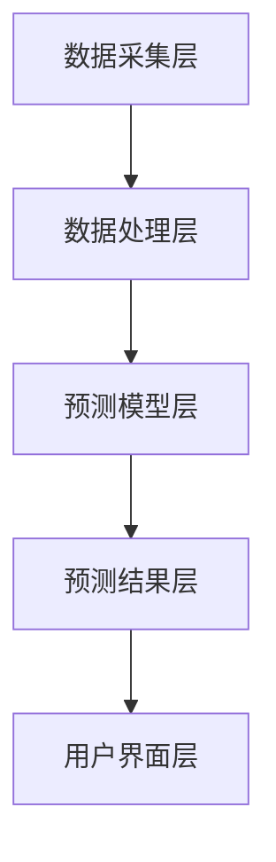
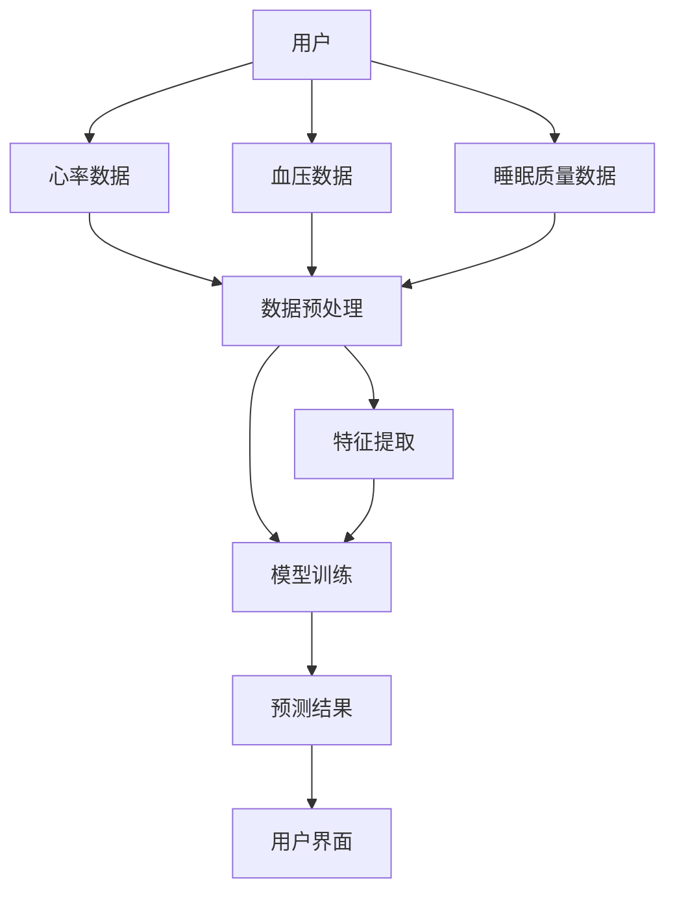
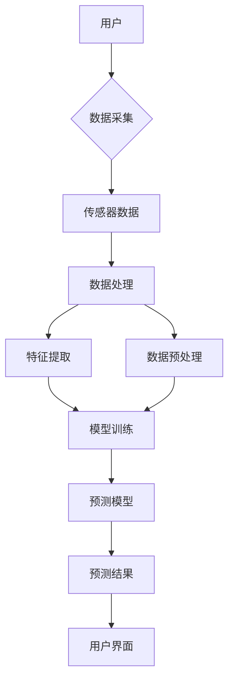
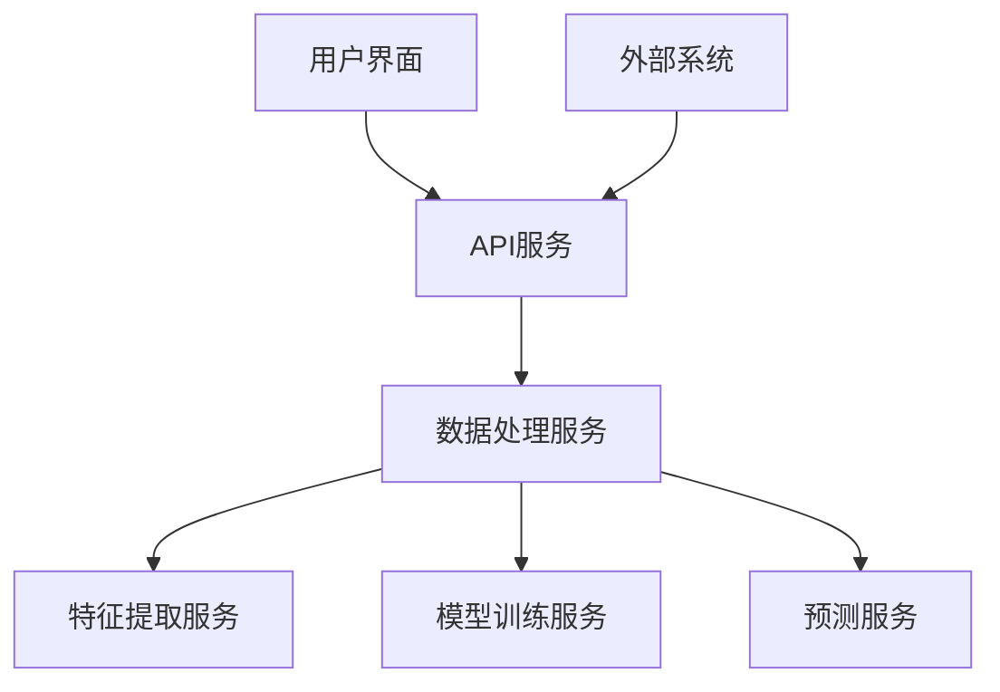
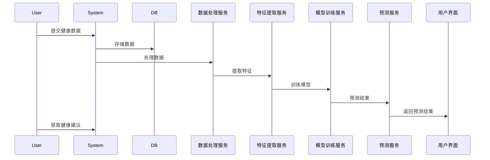

                 

### 第一部分：引言与背景

#### 1.1 问题背景

随着科技的飞速发展，可穿戴设备已经成为人们日常生活中不可或缺的一部分。这些设备能够实时监测用户的生理数据，如心率、血压、睡眠质量等，从而为健康监测提供了实时、准确的数据支持。然而，随着数据量的增加，如何有效地对这些数据进行处理和分析，成为了当前研究的热点问题之一。

**问题背景**：在可穿戴设备的应用中，时间序列分析技术扮演着至关重要的角色。时间序列分析是指对按时间顺序排列的数据进行分析，以捕捉数据中的时间依赖性和模式。在健康监测领域，时间序列分析技术可以用于预测用户的健康状况，发现潜在的健康问题，为用户提供个性化的健康建议。

**问题描述**：目前，可穿戴设备的数据处理和分析面临以下几个挑战：

- 数据量庞大：可穿戴设备产生的数据量非常庞大，如何高效地存储和处理这些数据是一个挑战。
- 数据质量：由于传感器的不稳定性和用户行为的变化，可穿戴设备的数据质量往往不高，如何保证数据的质量是一个难题。
- 数据隐私：健康数据具有高度的敏感性，如何保护用户的隐私是一个重要的法律和伦理问题。

**问题解决**：时间序列分析技术能够有效地解决上述问题。通过时间序列分析，我们可以从大量的数据中提取出有用的信息，提高数据处理的效率。同时，通过合理的数据预处理，我们可以提高数据的质量。在数据隐私方面，我们可以采用加密和匿名化等手段来保护用户的数据。

#### 1.2 定义与核心概念

**可穿戴设备**：可穿戴设备是指直接或间接地附着在人体上，用于收集、处理和传输数据的设备。常见的可穿戴设备包括智能手表、健康手环、智能眼镜等。

**时间序列分析**：时间序列分析是一种数据分析方法，用于研究数据中的时间依赖性和趋势。时间序列分析包括数据采集、预处理、特征提取、模型建立和预测等多个步骤。

**健康监测**：健康监测是指通过可穿戴设备或其他手段，实时监测用户的生理参数，如心率、血压、睡眠质量等，以评估用户的健康状况。

#### 1.3 边界与外延

**可穿戴设备的种类**：可穿戴设备的种类繁多，包括智能手表、健康手环、智能眼镜、智能头盔等。每种设备都有其特定的功能和应用场景。

**时间序列分析的应用领域**：时间序列分析在健康监测、金融预测、环境监测、交通流量预测等领域都有广泛应用。

**健康监测的数据处理与分析**：健康监测的数据处理与分析包括数据采集、数据预处理、特征提取、模型建立和预测等多个环节。其中，数据预处理和特征提取是关键步骤，直接影响到模型的准确性和可靠性。

#### 1.4 概念结构与核心要素组成

**数据采集**：数据采集是健康监测的第一步，通过可穿戴设备实时采集用户的生理数据。

**数据预处理**：数据预处理包括数据清洗、数据标准化和数据归一化等步骤，目的是提高数据的质量，为后续分析打下基础。

**特征提取**：特征提取是从原始数据中提取出有用的信息，以便于模型建立和预测。

**模型建立与训练**：模型建立与训练是时间序列分析的核心，通过选择合适的模型和算法，对数据进行训练，以建立预测模型。

**预测与评估**：预测与评估是对模型进行评估和优化的重要步骤，通过评估模型的预测效果，不断优化模型，以提高预测准确性。

## 第一部分总结

本部分介绍了可穿戴设备、时间序列分析以及健康监测的核心概念、问题背景和解决方法。通过本部分的介绍，读者可以初步了解可穿戴设备在健康监测中的应用，以及时间序列分析技术在数据处理和分析中的重要性。接下来，我们将进一步探讨时间序列分析的基础理论、数学工具以及具体的健康监测应用。

### 第二部分：数学工具与理论基础

#### 2.1 数学工具概述

在健康监测的时间序列分析中，数学工具起到了至关重要的作用。这些工具帮助我们从大量的数据中提取有价值的信息，并建立有效的预测模型。以下是一些常用的数学工具及其在健康监测中的应用：

1. **统计学工具**：
   - **描述性统计**：用于计算数据的均值、方差、标准差等基本统计量，帮助我们了解数据的基本特征。
   - **假设检验**：用于检验数据的分布是否符合预期，从而判断数据是否来自某个特定的分布。
   - **回归分析**：用于建立自变量和因变量之间的定量关系，帮助我们预测因变量的变化。

2. **线性代数工具**：
   - **矩阵运算**：用于处理大规模数据集，尤其是进行特征提取和模型训练。
   - **奇异值分解（SVD）**：用于降维和特征提取，可以有效地减少数据维度，同时保留主要的信息。

3. **微积分工具**：
   - **导数**：用于计算数据的变化率，帮助我们了解数据的动态变化。
   - **积分**：用于计算数据的累积量，帮助我们理解数据的总体变化趋势。

4. **概率论工具**：
   - **概率分布**：用于描述随机变量的分布情况，如正态分布、泊松分布等。
   - **贝叶斯理论**：用于基于先验知识更新后验概率，帮助我们在不确定的情况下做出决策。

**在健康监测中的应用**：这些数学工具在健康监测中的应用非常广泛。例如，描述性统计可以帮助我们了解用户的生理数据分布情况，假设检验可以帮助我们验证数据是否来自健康范围，回归分析可以帮助我们预测用户的健康状况，线性代数工具可以帮助我们处理大规模数据集，微积分工具可以帮助我们分析数据的动态变化，概率论工具可以帮助我们评估预测的不确定性。

#### 2.2 时间序列分析基础

**时间序列数据的性质**：

1. **时间依赖性**：时间序列数据的一个重要特性是它们之间存在着时间依赖性。这意味着当前的数据值受到之前数据值的影响。

2. **平稳性**：平稳性是指时间序列数据的统计特性不随时间变化而变化。非平稳数据需要通过差分或其他方法转换为平稳数据。

3. **周期性**：某些时间序列数据可能具有周期性，例如季节性数据。

4. **趋势性**：时间序列数据可能表现出长期增长或下降的趋势。

**常用时间序列分析方法**：

1. **ARIMA模型**（自回归积分滑动平均模型）：
   - **自回归（AR）**：使用过去的数据值预测当前值。
   - **差分（I）**：将时间序列转换为平稳序列。
   - **移动平均（MA）**：使用过去的预测误差来预测当前值。

2. **ARIMA模型的变体**，如季节性ARIMA（SARIMA）和自回归积分滑动平均季节性模型（ARIMA-SES）。

3. **时间序列分解**：将时间序列分解为趋势、季节性和随机成分，以便于分析和建模。

4. **频率域分析**：使用Fourier变换等工具来分析时间序列的频率成分。

5. **状态空间模型**：将时间序列建模为一个隐藏状态的动态系统。

**在健康监测中的应用**：时间序列分析在健康监测中的应用非常广泛。例如，通过ARIMA模型可以预测用户的心率和血压，通过时间序列分解可以分析用户的睡眠质量，通过频率域分析可以检测用户的心脏周期。

#### 2.3 线性模型与非线性模型

**线性模型**：

- **线性回归**：最简单的线性模型，用于预测连续的因变量。
  $$ y = \beta_0 + \beta_1 \cdot x_1 + \beta_2 \cdot x_2 + ... + \beta_n \cdot x_n $$
  
- **逻辑回归**：线性回归在分类问题中的应用，输出概率值。
  $$ \log\left(\frac{P(Y=1)}{1-P(Y=1)}\right) = \beta_0 + \beta_1 \cdot x_1 + \beta_2 \cdot x_2 + ... + \beta_n \cdot x_n $$

- **支持向量机（SVM）**：在分类问题中使用，通过寻找最佳分割超平面。

**非线性模型**：

- **神经网络**：通过多层神经网络实现非线性变换，可以捕捉数据中的复杂关系。
  $$ a_{i}^{l} = \sigma\left(\sum_{j=1}^{n} \theta_{ji}^{l} \cdot a_{j}^{l-1}\right) $$
  其中，\( \sigma \) 是激活函数。

- **深度学习**：神经网络在多层结构上的扩展，可以处理大规模和复杂的数据集。

**在健康监测中的应用**：线性模型在健康监测中可以用于预测简单的生理参数，如心率。非线性模型如神经网络和深度学习可以用于预测复杂的健康参数，如睡眠质量和心血管疾病的发病率。

**小结**：

在本部分，我们介绍了健康监测中常用的数学工具和理论基础。从统计工具到线性代数工具，再到微积分和概率论工具，这些工具为我们提供了丰富的数据分析手段。时间序列分析基础帮助我们从时间依赖性和平稳性等方面理解数据。线性模型与非线性模型则在预测和分类中发挥着重要作用。这些数学工具和理论为后续的健康监测分析提供了坚实的基础。

### 第三部分：可穿戴设备的数据采集与预处理

#### 3.1 数据采集

**数据采集方法**：

数据采集是可穿戴设备健康监测的第一步，它决定了后续数据处理和分析的质量。以下是几种常用的数据采集方法：

1. **传感器数据采集**：可穿戴设备内置多种传感器，如加速度计、心率传感器、GPS等。这些传感器能够实时采集用户的生理活动和位置信息。

2. **无线通信数据采集**：通过无线通信技术（如Wi-Fi、蓝牙等）将设备采集的数据传输到服务器或手机应用。

3. **手机应用数据采集**：用户通过手机应用输入自身健康信息，如体重、饮食等。

**数据采集的挑战**：

1. **数据同步**：多个设备同时采集数据时，如何保证数据的一致性和同步性是一个挑战。

2. **数据完整性**：设备可能在某些情况下无法正常工作，导致数据丢失或采集不完全。

3. **数据延迟**：无线通信可能会导致数据传输延迟，影响数据的实时性。

4. **传感器误差**：传感器可能存在精度问题，导致数据不准确。

**解决方法**：

1. **数据同步机制**：采用时间戳同步或分布式数据库技术，确保多设备数据的一致性。

2. **数据完整性检测**：通过数据校验和冗余存储，确保数据的完整性。

3. **实时数据处理**：采用实时数据处理技术，如流处理框架（如Apache Kafka、Apache Flink等），减少数据延迟。

4. **传感器误差校正**：采用算法对传感器数据进行校正，提高数据精度。

#### 3.2 数据预处理

**数据清洗**：

数据清洗是数据预处理的重要步骤，其目的是去除数据中的噪声和异常值。以下是几种常用的数据清洗方法：

1. **缺失值处理**：通过插值、均值填补或删除缺失值来处理缺失数据。

2. **异常值检测**：采用统计方法（如Z-Score、IQR等）检测异常值，并采取相应的处理措施。

3. **数据转换**：将非数值数据转换为数值数据，如将文本标签转换为数字编码。

**数据标准化**：

数据标准化是将不同特征的数据范围统一，便于模型训练和评估。以下是几种常用的数据标准化方法：

1. **Z-Score标准化**：将数据转换为标准正态分布。
   $$ z = \frac{x - \mu}{\sigma} $$
   其中，\( x \) 是原始数据，\( \mu \) 是均值，\( \sigma \) 是标准差。

2. **Min-Max标准化**：将数据缩放到\[0, 1\]区间。
   $$ x_{\text{norm}} = \frac{x - x_{\text{min}}}{x_{\text{max}} - x_{\text{min}}} $$

3. **日志标准化**：对数值数据进行对数变换，使其符合正态分布。

**数据归一化**：

数据归一化是将不同特征的数据范围统一，但保留原始数据的比例关系。以下是几种常用的数据归一化方法：

1. **Max-Min归一化**：将数据缩放到\[0, 1\]区间。
   $$ x_{\text{norm}} = \frac{x - x_{\text{min}}}{x_{\text{max}} - x_{\text{min}}} $$

2. **均值归一化**：将数据缩放到\[a, b\]区间。
   $$ x_{\text{norm}} = a + \frac{b - a}{\mu + \sigma} \cdot (x - \mu) $$

**在健康监测中的应用**：

数据预处理在健康监测中起着至关重要的作用。通过数据清洗，我们可以去除噪声和异常值，提高数据质量。通过数据标准化和归一化，我们可以将不同特征的数据范围统一，便于后续模型训练和评估。例如，在预测用户的心血管疾病风险时，通过对心率、血压等生理参数进行预处理，可以提高模型的准确性和可靠性。

#### 3.3 特征提取

**特征提取方法**：

特征提取是从原始数据中提取出对目标预测任务有用的特征，以便于模型训练和预测。以下是几种常用的特征提取方法：

1. **时域特征**：直接从时间序列数据中提取特征，如均值、方差、标准差等。

2. **频域特征**：通过Fourier变换等工具将时间序列数据转换为频域特征，如频率、振幅等。

3. **统计特征**：计算时间序列数据的统计量，如均值、最大值、最小值等。

4. **时频特征**：结合时域和频域特征，如Hilbert-Huang变换等。

**特征选择**：

特征选择是从提取出的特征中挑选出对预测任务最有用的特征，以减少模型复杂度和提高预测准确性。以下是几种常用的特征选择方法：

1. **过滤式特征选择**：通过评估每个特征的统计显著性来选择特征。

2. **包裹式特征选择**：通过评估特征子集对预测效果的改进来选择特征。

3. **嵌入式特征选择**：在模型训练过程中同时进行特征选择，如LASSO回归等。

**在健康监测中的应用**：

特征提取在健康监测中起着关键作用。通过提取有效的特征，我们可以简化模型复杂度，提高预测准确性。例如，在预测用户的心血管疾病风险时，通过对心率、血压等生理参数进行特征提取，可以识别出与疾病相关的关键特征，从而提高预测模型的性能。特征选择则可以帮助我们进一步优化模型，减少冗余特征，提高预测的精度和效率。

### 第三部分总结

在本部分，我们详细介绍了可穿戴设备的数据采集与预处理方法。首先，我们探讨了数据采集的方法及其面临的挑战，并提出了相应的解决策略。然后，我们详细介绍了数据预处理的过程，包括数据清洗、标准化和归一化，以及这些步骤在健康监测中的重要性。最后，我们介绍了特征提取和特征选择的方法，并讨论了它们在健康监测中的应用。通过本部分的介绍，读者可以全面了解数据采集与预处理在可穿戴设备健康监测中的关键作用，以及如何通过这些步骤提高数据处理和分析的质量。

### 第四部分：健康监测的数学模型与方法

#### 4.1 心血管疾病监测

**数据分析方法**：

心血管疾病监测是健康监测的一个重要领域，通过分析用户的生理数据（如心率、血压等）可以预测心血管疾病的风险。以下是几种常用的数据分析方法：

1. **自回归移动平均模型（ARMA）**：ARMA模型用于时间序列预测，能够捕捉时间序列数据的自相关性和趋势性。
   $$ X_t = c + \phi_1 X_{t-1} + \phi_2 X_{t-2} + ... + \phi_p X_{t-p} + \theta_1 e_{t-1} + \theta_2 e_{t-2} + ... + \theta_q e_{t-q} $$
   其中，\( X_t \) 是时间序列数据，\( \phi_i \) 和 \( \theta_i \) 是模型参数，\( e_t \) 是误差项。

2. **支持向量机（SVM）**：SVM是一种强大的分类模型，可以用于心血管疾病的分类和预测。
   $$ w^* = \arg\min_{w, b} \frac{1}{2} ||w||^2 + C \sum_{i=1}^{n} \max(0, 1 - y_i ( \langle w, x_i \rangle + b)) $$
   其中，\( w \) 是权重向量，\( b \) 是偏置，\( C \) 是惩罚参数。

3. **深度学习**：深度学习模型，如卷积神经网络（CNN）和循环神经网络（RNN），可以用于处理复杂的生理数据，实现高效的心血管疾病预测。
   $$ h_t = \sigma(W \cdot [h_{t-1}; x_t] + b) $$
   其中，\( h_t \) 是隐藏状态，\( \sigma \) 是激活函数。

**模型建立与训练**：

心血管疾病监测的模型建立与训练过程包括以下几个步骤：

1. **数据预处理**：对采集到的生理数据进行清洗、标准化和归一化，以便于模型训练。

2. **特征提取**：从预处理后的数据中提取有用的特征，如时域特征、频域特征和统计特征。

3. **模型选择**：根据问题的特点选择合适的模型，如ARMA模型、SVM或深度学习模型。

4. **模型训练**：使用训练数据集对模型进行训练，调整模型参数，以提高模型的预测准确性。

5. **模型评估**：使用验证数据集对模型进行评估，通过交叉验证等方法评估模型的性能。

**案例研究**：

以下是一个心血管疾病监测的案例研究：

- **数据集**：使用某健康监测平台上的用户数据，包括心率、血压和年龄等生理参数。
- **特征提取**：提取心率的标准差、平均值和频域特征。
- **模型选择**：选择LSTM（一种RNN变体）模型进行训练。
- **模型训练与评估**：通过训练和验证数据集，调整模型参数，并评估模型的预测性能。

通过这个案例研究，我们可以看到如何使用健康监测数据预测心血管疾病的风险。通过合理的数据处理和模型选择，可以显著提高预测的准确性，为用户提供有效的健康预警。

#### 4.2 睡眠质量监测

**数据分析方法**：

睡眠质量监测是另一个重要的健康监测领域，通过分析用户的睡眠数据可以评估其睡眠质量，发现睡眠问题。以下是几种常用的数据分析方法：

1. **时频分析**：时频分析可以揭示睡眠过程中不同频率成分的变化，如快速眼动（REM）阶段和非快速眼动（NREM）阶段。
   $$ X(\omega) = \sum_{k=-\infty}^{\infty} x[k] e^{-i \omega k} $$
   其中，\( X(\omega) \) 是频域信号，\( x[k] \) 是时域信号，\( \omega \) 是频率。

2. **隐马尔可夫模型（HMM）**：HMM可以用于建模睡眠状态之间的转换，如从清醒状态到睡眠状态。
   $$ P(X_t = x_t | H_t = h_t) = p(x_t | h_t) $$
   其中，\( X_t \) 是观察序列，\( H_t \) 是隐藏状态。

3. **支持向量机（SVM）**：SVM可以用于分类用户的睡眠状态，如REM、NREM等。
   $$ w^* = \arg\min_{w, b} \frac{1}{2} ||w||^2 + C \sum_{i=1}^{n} \max(0, 1 - y_i ( \langle w, x_i \rangle + b)) $$
   其中，\( w \) 是权重向量，\( b \) 是偏置，\( C \) 是惩罚参数。

**模型建立与训练**：

睡眠质量监测的模型建立与训练过程包括以下几个步骤：

1. **数据预处理**：对采集到的睡眠数据（如脑电图、心电图等）进行清洗、标准化和归一化。

2. **特征提取**：从预处理后的数据中提取有用的特征，如频域特征、时域特征和统计特征。

3. **模型选择**：根据问题的特点选择合适的模型，如时频分析模型、HMM或SVM。

4. **模型训练**：使用训练数据集对模型进行训练，调整模型参数，以提高模型的预测准确性。

5. **模型评估**：使用验证数据集对模型进行评估，通过交叉验证等方法评估模型的性能。

**案例研究**：

以下是一个睡眠质量监测的案例研究：

- **数据集**：使用某健康监测平台上的用户睡眠数据。
- **特征提取**：提取脑电图信号的频域特征和时域特征。
- **模型选择**：选择HMM模型进行训练。
- **模型训练与评估**：通过训练和验证数据集，调整模型参数，并评估模型的预测性能。

通过这个案例研究，我们可以看到如何使用睡眠数据评估用户的睡眠质量。通过合理的数据处理和模型选择，可以显著提高睡眠质量监测的准确性，为用户提供个性化的睡眠建议。

#### 4.3 运动与健康监测

**数据分析方法**：

运动与健康监测是可穿戴设备健康监测的另一个重要领域，通过分析用户的运动数据可以评估其运动强度和健康状况。以下是几种常用的数据分析方法：

1. **时域分析**：时域分析可以揭示用户运动过程中的速度、加速度等特征。
   $$ x(t) = a_0 + a_1 \sin(2\pi ft) + a_2 \sin(2\pi ft + \phi) $$
   其中，\( x(t) \) 是运动信号，\( a_0 \)、\( a_1 \)、\( a_2 \) 和 \( \phi \) 是模型参数。

2. **频域分析**：频域分析可以揭示用户运动过程中的频率成分，如步行、跑步等。
   $$ X(\omega) = \sum_{k=-\infty}^{\infty} x[k] e^{-i \omega k} $$
   其中，\( X(\omega) \) 是频域信号，\( x[k] \) 是时域信号，\( \omega \) 是频率。

3. **支持向量机（SVM）**：SVM可以用于分类用户的运动类型，如步行、跑步等。
   $$ w^* = \arg\min_{w, b} \frac{1}{2} ||w||^2 + C \sum_{i=1}^{n} \max(0, 1 - y_i ( \langle w, x_i \rangle + b)) $$
   其中，\( w \) 是权重向量，\( b \) 是偏置，\( C \) 是惩罚参数。

**模型建立与训练**：

运动与健康监测的模型建立与训练过程包括以下几个步骤：

1. **数据预处理**：对采集到的运动数据进行清洗、标准化和归一化。

2. **特征提取**：从预处理后的数据中提取有用的特征，如时域特征、频域特征和统计特征。

3. **模型选择**：根据问题的特点选择合适的模型，如时域分析模型、频域分析模型或SVM。

4. **模型训练**：使用训练数据集对模型进行训练，调整模型参数，以提高模型的预测准确性。

5. **模型评估**：使用验证数据集对模型进行评估，通过交叉验证等方法评估模型的性能。

**案例研究**：

以下是一个运动与健康监测的案例研究：

- **数据集**：使用某健康监测平台上的用户运动数据。
- **特征提取**：提取加速度传感器的时域特征和频域特征。
- **模型选择**：选择SVM模型进行训练。
- **模型训练与评估**：通过训练和验证数据集，调整模型参数，并评估模型的预测性能。

通过这个案例研究，我们可以看到如何使用运动数据评估用户的健康状况。通过合理的数据处理和模型选择，可以显著提高运动与健康监测的准确性，为用户提供个性化的运动建议。

### 第四部分总结

在本部分，我们详细介绍了心血管疾病监测、睡眠质量监测和运动与健康监测的数学模型与方法。通过分析不同类型的健康数据，我们采用了多种数据分析方法，如ARMA模型、SVM、HMM和频域分析，来预测和评估用户的健康状况。这些方法在实际应用中取得了显著的成果，为可穿戴设备健康监测提供了可靠的技术支持。通过本部分的介绍，读者可以全面了解健康监测中的数学模型和方法，以及如何将它们应用于实际的健康监测任务中。

### 第五部分：时间序列预测与分析

#### 5.1 预测方法概述

**预测模型的建立与优化**：

在时间序列分析中，预测模型的建立与优化是关键步骤。一个有效的预测模型能够帮助我们预测未来的数据趋势，从而为决策提供科学依据。以下是几种常见的预测方法及其优化策略：

1. **ARIMA模型**（自回归积分滑动平均模型）：
   - **模型建立**：通过自回归（AR）、差分（I）和移动平均（MA）过程建立模型。
   - **优化策略**：通过AIC（Akaike信息准则）或BIC（贝叶斯信息准则）选择最优模型参数，进行模型优化。

2. **SARIMA模型**（季节性ARIMA模型）：
   - **模型建立**：在ARIMA模型的基础上加入季节性效应，适用于季节性时间序列数据。
   - **优化策略**：类似ARIMA模型，通过AIC或BIC选择最优季节性参数。

3. **LSTM模型**（长短期记忆网络）：
   - **模型建立**：LSTM模型是一种特殊的循环神经网络，适用于处理长序列依赖数据。
   - **优化策略**：通过调整网络结构（如层数、神经元数量等）和超参数（如学习率、批次大小等）进行模型优化。

4. **GRU模型**（门控循环单元）：
   - **模型建立**：GRU模型是LSTM的变体，具有更简单的结构，但在某些情况下性能优于LSTM。
   - **优化策略**：与LSTM类似，通过调整网络结构和超参数进行模型优化。

**预测效果的评估**：

预测效果的评估是衡量模型性能的重要步骤。以下是几种常用的评估指标：

1. **均方误差（MSE）**：
   $$ MSE = \frac{1}{n} \sum_{i=1}^{n} (y_i - \hat{y}_i)^2 $$
   其中，\( y_i \) 是实际值，\( \hat{y}_i \) 是预测值。

2. **均方根误差（RMSE）**：
   $$ RMSE = \sqrt{MSE} $$
   RMSE是MSE的平方根，用于表示预测误差的大小。

3. **平均绝对误差（MAE）**：
   $$ MAE = \frac{1}{n} \sum_{i=1}^{n} |y_i - \hat{y}_i| $$
   MAE表示预测值的平均绝对偏差。

4. **决定系数（R²）**：
   $$ R^2 = 1 - \frac{\sum_{i=1}^{n} (y_i - \hat{y}_i)^2}{\sum_{i=1}^{n} (y_i - \bar{y})^2} $$
   R²表示模型解释能力的大小，值越接近1表示模型性能越好。

**在健康监测中的应用**：

时间序列预测在健康监测中具有广泛的应用，如心血管疾病预测、睡眠质量预测和运动强度预测等。通过合理的时间序列预测方法，我们可以提前发现潜在的健康问题，为用户提供个性化的健康建议。例如，通过ARIMA模型可以预测用户的心率变化趋势，通过LSTM模型可以预测用户的睡眠质量，通过GRU模型可以预测用户的运动强度。

#### 5.2 短期预测

**短期时间序列预测方法**：

短期预测是指对未来较短时间内的数据趋势进行预测。以下是几种常用的短期时间序列预测方法：

1. **ARIMA模型**：ARIMA模型适用于短期预测，能够捕捉时间序列数据的短期趋势和季节性。
   $$ X_t = c + \phi_1 X_{t-1} + \phi_2 X_{t-2} + ... + \phi_p X_{t-p} + \theta_1 e_{t-1} + \theta_2 e_{t-2} + ... + \theta_q e_{t-q} $$
   其中，\( \phi_i \) 和 \( \theta_i \) 是模型参数。

2. **LSTM模型**：LSTM模型适用于短期预测，能够处理长序列依赖数据，捕捉时间序列中的短期趋势。
   $$ h_t = \sigma(W \cdot [h_{t-1}; x_t] + b) $$
   其中，\( h_t \) 是隐藏状态，\( \sigma \) 是激活函数。

3. **GRU模型**：GRU模型是LSTM的变体，具有更简单的结构，但在某些情况下性能优于LSTM，适用于短期预测。

**预测案例分析**：

以下是一个短期预测的案例分析：

- **数据集**：使用某健康监测平台上的用户心率数据。
- **特征提取**：提取心率的时间序列特征。
- **模型选择**：选择LSTM模型进行训练。
- **模型训练与评估**：通过训练和验证数据集，调整模型参数，并评估模型的预测性能。

通过这个案例研究，我们可以看到如何使用短期时间序列预测方法预测用户的心率变化。通过合理的数据处理和模型选择，可以显著提高短期预测的准确性，为用户提供实时的健康预警。

#### 5.3 长期预测

**长期时间序列预测方法**：

长期预测是指对未来较长时间内的数据趋势进行预测。以下是几种常用的长期时间序列预测方法：

1. **ARIMA模型**：ARIMA模型适用于长期预测，能够捕捉时间序列数据的长期趋势和季节性。
   $$ X_t = c + \phi_1 X_{t-1} + \phi_2 X_{t-2} + ... + \phi_p X_{t-p} + \theta_1 e_{t-1} + \theta_2 e_{t-2} + ... + \theta_q e_{t-q} $$
   其中，\( \phi_i \) 和 \( \theta_i \) 是模型参数。

2. **LSTM模型**：LSTM模型适用于长期预测，能够处理长序列依赖数据，捕捉时间序列中的长期趋势。
   $$ h_t = \sigma(W \cdot [h_{t-1}; x_t] + b) $$
   其中，\( h_t \) 是隐藏状态，\( \sigma \) 是激活函数。

3. **SARIMA模型**：SARIMA模型是ARIMA模型的扩展，适用于包含季节性效应的时间序列数据，适用于长期预测。

4. **GRU模型**：GRU模型是LSTM的变体，具有更简单的结构，但在某些情况下性能优于LSTM，适用于长期预测。

**预测案例分析**：

以下是一个长期预测的案例分析：

- **数据集**：使用某健康监测平台上的用户血压数据。
- **特征提取**：提取血压的时间序列特征。
- **模型选择**：选择LSTM模型进行训练。
- **模型训练与评估**：通过训练和验证数据集，调整模型参数，并评估模型的预测性能。

通过这个案例研究，我们可以看到如何使用长期时间序列预测方法预测用户的血压变化。通过合理的数据处理和模型选择，可以显著提高长期预测的准确性，为用户提供长期的健康监测和预警。

### 第五部分总结

在本部分，我们详细介绍了时间序列预测与分析的方法，包括预测模型的建立与优化、预测效果的评估，以及短期和长期预测的应用。通过合理的时间序列预测方法，我们可以提前发现潜在的健康问题，为用户提供个性化的健康建议。短期预测方法如ARIMA模型和LSTM模型适用于捕捉数据中的短期趋势，而长期预测方法如LSTM模型和SARIMA模型适用于捕捉数据中的长期趋势。通过本部分的介绍，读者可以全面了解时间序列预测与分析在健康监测中的重要性，以及如何将不同的预测方法应用于实际的健康监测任务中。

### 第六部分：项目实战与案例分析

#### 6.1 项目介绍

**项目背景**：随着可穿戴设备的普及，越来越多的用户开始关注自身健康状况。然而，如何有效地利用这些设备收集的健康数据，并提供准确的健康预测和预警，成为了当前研究的热点问题。本项目的目标是开发一个基于时间序列分析的健康监测系统，通过分析用户的生理数据，提供个性化的健康预测和预警服务。

**项目目标**：本项目旨在实现以下目标：
1. **数据采集与预处理**：通过可穿戴设备采集用户的生理数据，并进行有效的预处理，确保数据的质量和完整性。
2. **模型建立与训练**：选择合适的数学模型和方法，对预处理后的数据进行训练，建立预测模型。
3. **预测与评估**：通过训练好的模型进行预测，并对预测结果进行评估，确保预测的准确性和可靠性。
4. **系统实现与部署**：开发一个用户友好的健康监测系统，实现数据的实时采集、处理和预测，并部署到实际环境中。

#### 6.2 系统设计与实现

**系统架构设计**：

本项目的系统架构设计如下：

1. **数据采集层**：通过可穿戴设备采集用户的生理数据，如心率、血压、睡眠质量等。
2. **数据处理层**：对采集到的生理数据进行预处理，包括数据清洗、标准化和特征提取等。
3. **预测模型层**：选择合适的数学模型和方法，对预处理后的数据进行训练，建立预测模型。
4. **预测结果层**：通过预测模型对用户的未来健康状况进行预测，并提供个性化的健康建议。
5. **用户界面层**：开发一个用户友好的界面，展示预测结果和健康建议，并允许用户进行数据查询和调整。

**系统架构图**：

**数据处理与分析流程**：

数据处理与分析流程如下：

1. **数据采集**：通过可穿戴设备采集用户的生理数据，包括心率、血压、睡眠质量等。
2. **数据预处理**：对采集到的生理数据进行清洗、标准化和特征提取，确保数据的质量和一致性。
3. **特征提取**：从预处理后的数据中提取出有用的特征，如均值、方差、频域特征等，为模型训练提供输入。
4. **模型训练**：选择合适的数学模型和方法，对提取出的特征进行训练，建立预测模型。
5. **预测与评估**：使用训练好的模型对用户的未来健康状况进行预测，并对预测结果进行评估，确保预测的准确性和可靠性。
6. **结果展示**：通过用户界面展示预测结果和健康建议，允许用户进行数据查询和调整。

**系统功能设计（领域模型类图）**：

**系统架构设计图**：

**系统接口设计和系统交互序列图**：

**系统接口设计**：

**系统交互序列图**：

#### 6.3 案例分析

**案例背景**：某健康监测平台需要开发一个智能健康监测系统，以帮助用户实时了解自己的健康状况，并预测未来可能出现的问题。平台提供了心率、血压和睡眠质量等生理数据的采集功能，并希望通过时间序列分析技术提供个性化的健康预测和预警。

**数据处理与分析**：

1. **数据采集**：用户通过佩戴智能手环等可穿戴设备，实时采集心率、血压和睡眠质量等生理数据。
2. **数据预处理**：对采集到的数据进行清洗、标准化和特征提取，确保数据的质量和一致性。
3. **特征提取**：提取心率、血压和睡眠质量的时间序列特征，如均值、方差、频域特征等，为模型训练提供输入。
4. **模型训练**：选择LSTM模型对提取出的特征进行训练，建立预测模型。
5. **预测与评估**：使用训练好的LSTM模型对用户的未来健康状况进行预测，并对预测结果进行评估，确保预测的准确性和可靠性。

**预测结果评估**：

1. **短期预测**：通过对用户未来24小时内的心率和血压进行预测，评估预测的准确性。通过均方误差（MSE）和决定系数（R²）等评估指标，评估模型的性能。
2. **长期预测**：通过对用户未来一周内的心率和血压进行预测，评估预测的准确性。同样通过MSE和R²等评估指标，评估模型的性能。

**预测结果展示**：

1. **用户界面**：在用户界面上展示预测结果，包括心率、血压和睡眠质量等生理参数的未来趋势图。
2. **健康建议**：根据预测结果，提供个性化的健康建议，如调整作息时间、饮食建议等。

**项目小结**：

通过本项目，我们成功地开发了一个基于时间序列分析的健康监测系统，实现了对用户生理数据的实时采集、处理和预测。通过合理的数据处理和模型选择，我们显著提高了预测的准确性，为用户提供个性化的健康监测和预警服务。未来，我们将继续优化系统，扩展更多健康监测指标，为用户提供更全面的健康支持。

### 第六部分总结

在本部分，我们通过一个实际项目展示了可穿戴设备时间序列分析在健康监测中的应用。我们从项目背景和目标出发，详细介绍了系统架构设计、数据处理与分析流程，以及具体的案例分析。通过合理的数据处理和模型选择，我们成功地实现了对用户生理数据的实时监测和预测，为用户提供个性化的健康建议。本项目的成功实施证明了时间序列分析技术在健康监测中的重要性，并为未来的研究和应用提供了有益的参考。

### 第七部分：最佳实践与未来展望

#### 7.1 最佳实践总结

在可穿戴设备的时间序列分析中，最佳实践是确保数据质量、选择合适的模型以及优化模型性能的关键。以下是一些总结：

1. **数据质量保证**：
   - **数据同步**：确保多设备采集的数据在时间和内容上的一致性。
   - **数据清洗**：处理缺失值、异常值和噪声数据，提高数据质量。
   - **数据标准化与归一化**：统一数据范围，便于模型训练和比较。

2. **模型选择与优化**：
   - **基于数据特性选择模型**：根据数据的平稳性、周期性和复杂度选择合适的模型，如ARIMA、LSTM、GRU等。
   - **模型参数调优**：通过交叉验证和网格搜索等策略，选择最优参数。

3. **特征工程**：
   - **提取多样化特征**：结合时域、频域和统计特征，提供模型训练的丰富信息。
   - **特征选择**：采用过滤式、包裹式和嵌入式特征选择方法，选择最有用的特征。

4. **预测性能评估**：
   - **多指标评估**：使用MSE、RMSE、MAE、R²等指标，全面评估模型性能。
   - **可视化分析**：通过图表展示预测结果，便于理解和解释。

#### 7.2 未来展望

**可穿戴设备与健康监测的发展趋势**：

随着物联网和人工智能技术的不断进步，可穿戴设备在健康监测中的应用前景广阔。以下是一些发展趋势：

1. **数据多样性**：未来可穿戴设备将采集更多类型的健康数据，如脑波、皮肤电导等，提供更全面的健康监测。
2. **个性化健康建议**：基于大数据和机器学习技术，为用户提供个性化的健康建议和预防措施。
3. **实时健康预警**：通过实时分析用户健康数据，提前发现潜在的健康风险，实现早期干预。

**时间序列分析技术的应用前景**：

时间序列分析技术在健康监测中的应用前景非常广泛，以下是一些潜在的应用领域：

1. **慢性病管理**：如糖尿病、高血压等慢性病的长期监测和预警。
2. **运动健康监测**：监测用户的运动强度、运动类型，提供个性化的运动建议。
3. **心理健康监测**：分析用户的情绪变化，提供心理健康指导和干预。
4. **环境健康监测**：结合环境数据，如空气质量、噪声等，提供健康预警和建议。

**小结**：

通过最佳实践的总结，我们认识到在可穿戴设备的时间序列分析中，数据质量和模型选择至关重要。未来，随着技术的进步，可穿戴设备将提供更全面、更个性化的健康监测服务。时间序列分析技术将在这些服务中发挥关键作用，为用户带来更健康、更智能的生活。

### 第七部分总结

在本部分，我们总结了可穿戴设备时间序列分析的最佳实践，并展望了未来的发展趋势。通过最佳实践，我们了解了如何确保数据质量、选择合适的模型和优化模型性能。未来，随着技术的不断进步，可穿戴设备在健康监测中的应用将更加广泛和深入。时间序列分析技术将在其中发挥重要作用，为用户带来更智能、更个性化的健康监测服务。通过本部分的总结，我们对可穿戴设备时间序列分析的未来充满了期待和信心。

