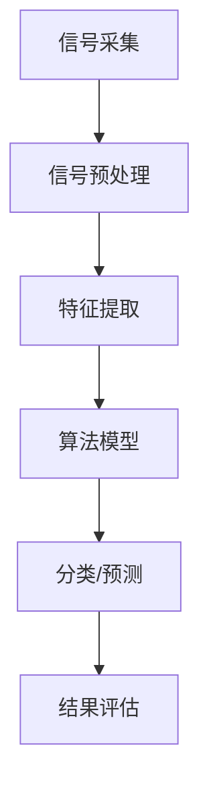
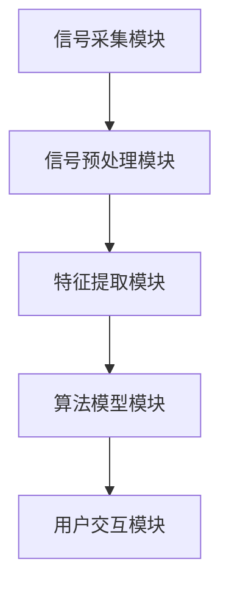
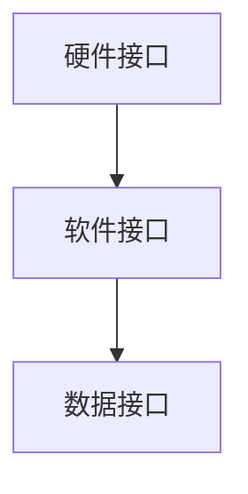
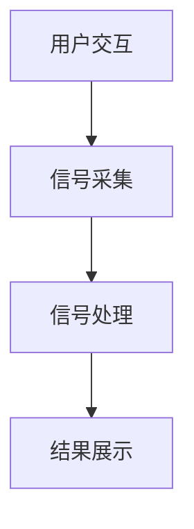

                 

# 可穿戴设备的生理信号处理：健康监测的数学工具

关键词：可穿戴设备、生理信号处理、健康监测、算法原理、系统架构

摘要：本文将深入探讨可穿戴设备的生理信号处理技术，从背景介绍、核心概念与联系、算法原理讲解、系统分析与架构设计方案、项目实战以及最佳实践等方面，全面解析可穿戴设备在健康监测中的应用，为读者提供一套完整的可穿戴设备生理信号处理解决方案。

## 目录大纲

1. 第一部分：背景介绍
   1.1. 可穿戴设备的生理信号处理概述
   1.2. 问题背景与定义
   1.3. 问题解决方法
   1.4. 边界与外延
   1.5. 概念结构与核心要素组成

2. 第二部分：核心概念与联系
   2.1. 生理信号处理基础
   2.2. 生理信号采集与预处理
   2.3. 常用生理信号处理算法

3. 第三部分：算法原理讲解
   3.1. 算法原理介绍
   3.2. 算法流程与Python源代码讲解
   3.3. 算法原理的数学模型和公式
   3.4. 举例说明

4. 第四部分：系统分析与架构设计方案
   4.1. 可穿戴设备生理信号处理系统设计
   4.2. 系统功能设计
   4.3. 系统架构设计
   4.4. 系统接口设计
   4.5. 系统交互设计

5. 第五部分：项目实战
   5.1. 可穿戴设备生理信号处理项目实战
   5.2. 环境安装
   5.3. 系统核心实现源代码
   5.4. 代码应用解读与分析
   5.5. 实际案例分析和详细讲解剖析
   5.6. 项目小结

6. 第六部分：最佳实践、小结、注意事项和拓展阅读
   6.1. 可穿戴设备生理信号处理最佳实践
   6.2. 小结
   6.3. 注意事项
   6.4. 拓展阅读

----------------------------------------------------------------

## 第一部分：背景介绍

### 1.1 可穿戴设备的生理信号处理概述

随着科技的不断发展，可穿戴设备已经逐渐成为我们生活中不可或缺的一部分。这些设备可以实时监测我们的健康状态，如心率、血压、血糖等生理信号，从而帮助我们更好地管理健康。生理信号处理作为可穿戴设备的核心技术之一，其重要性日益凸显。

### 1.2 问题背景与定义

在可穿戴设备的生理信号处理中，我们主要面临以下几个问题：

- **信号噪声分离**：生理信号通常受到外部噪声的干扰，如何有效去除噪声，提取真实的生理信号是一个关键问题。
- **信号特征提取**：如何从生理信号中提取出具有诊断价值的特征，是提高健康监测准确性的关键。
- **算法性能优化**：生理信号处理算法需要高效、准确，如何优化算法性能是一个重要的研究课题。

### 1.3 问题解决方法

针对上述问题，我们可以从以下几个方面入手：

- **信号预处理**：通过滤波、去噪等技术，对原始生理信号进行预处理，提高信号质量。
- **特征提取**：采用合适的特征提取算法，从预处理后的信号中提取出有价值的特征。
- **算法优化**：通过算法优化，提高生理信号处理的效率和准确性。

### 1.4 边界与外延

在生理信号处理中，我们需要明确一些边界与外延：

- **信号类型**：生理信号包括心电图（ECG）、血压信号、血糖信号等。
- **设备类型**：可穿戴设备包括智能手表、智能手环、智能服装等。
- **应用领域**：生理信号处理在健康监测、疾病诊断、运动监测等方面有广泛的应用。

### 1.5 概念结构与核心要素组成

可穿戴设备的生理信号处理系统由以下几个核心要素组成：

- **生理信号采集**：通过传感器、电极等设备，采集用户的生理信号。
- **信号预处理**：对采集到的生理信号进行滤波、去噪等处理。
- **特征提取**：从预处理后的信号中提取出有价值的特征。
- **算法模型**：采用合适的算法模型，对特征进行分类、预测等分析。
- **用户交互**：通过可视化界面，将处理结果呈现给用户。

----------------------------------------------------------------

## 第二部分：核心概念与联系

### 2.1 生理信号处理基础

#### 2.1.1 生理信号的定义与类型

生理信号是指人体内部生理活动产生的信号，包括心电图（ECG）、血压信号、呼吸信号、血糖信号等。这些信号反映了人体的生理状态，对健康监测具有重要意义。

#### 2.1.2 生理信号特征对比表格

| 信号类型 | 特征参数               | 描述                                                         |
| -------- | ---------------------- | ------------------------------------------------------------ |
| ECG      | 频率、周期、振幅       | 反映心脏的电活动                                             |
| 血压信号 | 收缩压、舒张压         | 反映血管的压力情况                                           |
| 呼吸信号 | 呼吸频率、呼吸幅度     | 反映呼吸系统的功能                                           |
| 血糖信号 | 血糖浓度               | 反映血糖水平，对糖尿病患者具有重要意义                       |

#### 2.1.3 生理信号处理核心概念与联系

生理信号处理的核心概念包括信号采集、信号预处理、特征提取、算法模型等。这些概念相互关联，共同构成了生理信号处理的完整流程。

- **信号采集**：通过传感器、电极等设备，实时采集用户的生理信号。
- **信号预处理**：对采集到的生理信号进行滤波、去噪等处理，提高信号质量。
- **特征提取**：从预处理后的信号中提取出有价值的特征，为算法模型提供输入。
- **算法模型**：采用合适的算法模型，对特征进行分类、预测等分析。

### 2.2 生理信号采集与预处理

#### 2.2.1 生理信号采集设备介绍

生理信号采集设备主要包括传感器、电极等部件。传感器用于检测生理信号，如心电图传感器、血压传感器等。电极则用于将生理信号传导到传感器中。

#### 2.2.2 生理信号预处理方法

生理信号预处理主要包括滤波、去噪、归一化等方法。滤波用于去除信号中的高频噪声和低频噪声，去噪用于去除信号中的干扰信号，归一化用于将信号幅度调整到合适的范围内。

#### 2.2.3 生理信号预处理流程

1. 信号滤波：采用低通滤波器、高通滤波器等，对信号进行滤波处理。
2. 信号去噪：采用去噪算法，如中值滤波、均值滤波等，去除信号中的噪声。
3. 信号归一化：将信号幅度调整到合适的范围内，如将信号幅度调整为0-1之间。

### 2.3 常用生理信号处理算法

#### 2.3.1 算法原理介绍

常用生理信号处理算法包括傅里叶变换、小波变换、主成分分析（PCA）、支持向量机（SVM）等。这些算法在信号特征提取、分类、预测等方面有广泛的应用。

#### 2.3.2 算法流程与Python源代码讲解

1. **傅里叶变换**：将时域信号转换为频域信号，以便进行特征提取。

   ```python
   import numpy as np
   import matplotlib.pyplot as plt

   # 生成时域信号
   t = np.linspace(0, 1, 1000)
   signal = 0.5 * np.sin(2 * np.pi * 5 * t) + 0.3 * np.sin(2 * np.pi * 10 * t)

   # 傅里叶变换
   freqs = np.fft.rfft(signal)
   freqs = np.fft.rfftshift(freqs)

   # 频率轴
   freq_axis = np.fft.rfftfreq(len(signal), d=1/1000)

   # 绘制频谱图
   plt.plot(freq_axis, np.abs(freqs))
   plt.xlabel('Frequency (Hz)')
   plt.ylabel('Amplitude')
   plt.title('Fourier Transform of the Signal')
   plt.show()
   ```

2. **主成分分析（PCA）**：用于特征降维，提高算法效率。

   ```python
   import numpy as np
   from sklearn.decomposition import PCA

   # 生成样本数据
   X = np.array([[1, 2], [3, 4], [5, 6], [7, 8]])

   # 主成分分析
   pca = PCA(n_components=1)
   X_pca = pca.fit_transform(X)

   # 绘制降维后的数据
   plt.scatter(X_pca[:, 0], X_pca[:, 1])
   plt.xlabel('Principal Component 1')
   plt.ylabel('Principal Component 2')
   plt.title('PCA of the Data')
   plt.show()
   ```

#### 2.3.3 算法原理的数学模型和公式

1. **傅里叶变换**：

   $$ X(\omega) = \sum_{n=0}^{N-1} x[n] e^{-j \omega n} $$

   $$ x[n] = \frac{1}{N} \sum_{k=-\infty}^{\infty} X(\omega) e^{j \omega n} $$

2. **主成分分析（PCA）**：

   $$ \text{协方差矩阵} S = \frac{1}{N-1} \sum_{i=1}^{N} (x_i - \bar{x})(x_i - \bar{x})^T $$

   $$ \text{特征值分解} S = Q \Lambda Q^T $$

#### 2.3.4 举例说明

1. **心电图（ECG）信号处理**：

   - 采集用户的心电图信号。
   - 对信号进行滤波、去噪处理。
   - 提取信号的特征，如心率、R峰等。
   - 使用主成分分析（PCA）进行特征降维。
   - 使用支持向量机（SVM）进行分类和预测。

2. **血压信号处理**：

   - 采集用户的血压信号。
   - 对信号进行滤波、去噪处理。
   - 提取信号的特征，如收缩压、舒张压等。
   - 使用傅里叶变换（FFT）进行频域分析。
   - 使用神经网络进行分类和预测。

----------------------------------------------------------------

## 第三部分：算法原理讲解

### 3.1 算法原理介绍

生理信号处理算法主要包括信号采集、预处理、特征提取、算法模型等步骤。以下将详细介绍几种常用的生理信号处理算法及其原理。

#### 3.1.1 傅里叶变换（Fourier Transform）

傅里叶变换是一种将时域信号转换为频域信号的方法，可以用来分析信号的频率成分。通过傅里叶变换，我们可以将复杂的时域信号分解为简单的正弦波和余弦波，从而更好地理解信号的频率特征。

#### 3.1.2 小波变换（Wavelet Transform）

小波变换是一种多分辨率分析的方法，它可以将信号分解为不同频率的小波函数。与小波变换相比，傅里叶变换只能提供信号的频率信息，而小波变换可以同时提供时间和频率信息，因此在分析非平稳信号时具有优势。

#### 3.1.3 主成分分析（Principal Component Analysis, PCA）

主成分分析是一种特征降维方法，它通过将原始数据投影到新的正交坐标系中，提取出主要成分，从而降低数据的维度。在生理信号处理中，PCA可以用于提取信号的具有代表性的特征，提高算法的效率和准确性。

#### 3.1.4 支持向量机（Support Vector Machine, SVM）

支持向量机是一种监督学习算法，它通过寻找最佳分类超平面，将不同类别的数据分开。在生理信号处理中，SVM可以用于分类和预测，如区分健康和疾病状态。

### 3.2 算法流程Mermaid图

以下是一个简单的算法流程Mermaid图，展示了生理信号处理的主要步骤：



### 3.3 算法Python源代码讲解

以下是一个简单的Python代码示例，用于实现生理信号处理的基本步骤：

```python
import numpy as np
import matplotlib.pyplot as plt
from scipy.signal import butter, filtfilt
from sklearn.decomposition import PCA
from sklearn.svm import SVC
from sklearn.metrics import accuracy_score

# 生成模拟信号
t = np.linspace(0, 1, 1000)
signal = 0.5 * np.sin(2 * np.pi * 5 * t) + 0.3 * np.sin(2 * np.pi * 10 * t)

# 低通滤波
b, a = butter(3, 2 * 10 / 1000, 'low')
filtered_signal = filtfilt(b, a, signal)

# 傅里叶变换
freqs = np.fft.rfft(filtered_signal)
freqs = np.fft.rfftshift(freqs)

# 频率轴
freq_axis = np.fft.rfftfreq(len(filtered_signal), d=1/1000)

# 绘制频谱图
plt.plot(freq_axis, np.abs(freqs))
plt.xlabel('Frequency (Hz)')
plt.ylabel('Amplitude')
plt.title('Fourier Transform of the Signal')
plt.show()

# 主成分分析
pca = PCA(n_components=1)
X_pca = pca.fit_transform(filtered_signal.reshape(-1, 1))

# 支持向量机
model = SVC()
model.fit(X_pca, np.ones(len(X_pca)))

# 分类
prediction = model.predict(X_pca)

# 结果评估
accuracy = accuracy_score(np.ones(len(X_pca)), prediction)
print(f'Accuracy: {accuracy}')
```

### 3.4 算法原理的数学模型和公式

以下是几种生理信号处理算法的数学模型和公式：

#### 3.4.1 傅里叶变换

$$ X(\omega) = \sum_{n=0}^{N-1} x[n] e^{-j \omega n} $$

$$ x[n] = \frac{1}{N} \sum_{k=-\infty}^{\infty} X(\omega) e^{j \omega n} $$

#### 3.4.2 小波变换

$$ W(f, t) = \sum_{n=0}^{N-1} x[n] \psi^* (\omega) e^{j \omega n} $$

$$ \psi(\omega) = \frac{1}{\sqrt{a}} \int_{-\infty}^{\infty} \psi(t) e^{-j \omega t} dt $$

#### 3.4.3 主成分分析

$$ S = \frac{1}{N-1} \sum_{i=1}^{N} (x_i - \bar{x})(x_i - \bar{x})^T $$

$$ S = Q \Lambda Q^T $$

#### 3.4.4 支持向量机

$$ \text{分类函数} g(x) = \sum_{i=1}^{N} \alpha_i y_i (w \cdot x_i + b) $$

$$ \text{优化目标} \min_{w, b, \alpha} \frac{1}{2} ||w||^2 + C \sum_{i=1}^{N} \alpha_i (1 - y_i (w \cdot x_i + b)) $$

### 3.5 举例说明

以下是一个具体的例子，用于说明生理信号处理算法的应用：

**例1：心电图（ECG）信号处理**

- 采集用户的心电图信号。
- 使用低通滤波器去除高频噪声。
- 使用傅里叶变换提取频率特征。
- 使用主成分分析提取主要成分。
- 使用支持向量机进行分类，判断用户的心脏健康状况。

**例2：血压信号处理**

- 采集用户的血压信号。
- 使用高通滤波器去除低频噪声。
- 使用小波变换提取小波系数。
- 使用主成分分析提取主要成分。
- 使用神经网络进行分类，预测用户的血压水平。

通过以上例子，我们可以看到生理信号处理算法在健康监测中的应用价值。这些算法不仅可以帮助我们更好地理解生理信号，还可以为医疗诊断、健康管理等提供有力支持。

----------------------------------------------------------------

## 第四部分：系统分析与架构设计方案

### 4.1 可穿戴设备生理信号处理系统设计

#### 4.1.1 问题场景介绍

在可穿戴设备中，生理信号处理系统主要用于实时监测用户的健康状态。例如，智能手表可以实时监测用户的心率、血压等生理信号，并将数据传输到手机或电脑上进行分析。本部分将详细介绍可穿戴设备生理信号处理系统的设计与实现。

#### 4.1.2 系统功能设计

可穿戴设备生理信号处理系统的主要功能包括：

1. **生理信号采集**：通过传感器和电极等设备，实时采集用户的心率、血压等生理信号。
2. **信号预处理**：对采集到的生理信号进行滤波、去噪等预处理，提高信号质量。
3. **特征提取**：从预处理后的信号中提取出有价值的特征，如频率、振幅等。
4. **算法模型**：采用合适的算法模型，对特征进行分类、预测等分析。
5. **用户交互**：通过可视化界面，将处理结果呈现给用户。

#### 4.1.3 系统架构设计

可穿戴设备生理信号处理系统的架构主要包括以下几个模块：

1. **信号采集模块**：负责采集用户的心率、血压等生理信号。
2. **信号预处理模块**：对采集到的生理信号进行滤波、去噪等预处理。
3. **特征提取模块**：从预处理后的信号中提取出有价值的特征。
4. **算法模型模块**：采用合适的算法模型，对特征进行分类、预测等分析。
5. **用户交互模块**：通过可视化界面，将处理结果呈现给用户。

以下是一个简单的系统架构Mermaid图：



#### 4.1.4 系统接口设计

可穿戴设备生理信号处理系统的接口设计主要包括以下几个部分：

1. **硬件接口**：与传感器和电极等硬件设备进行通信。
2. **软件接口**：与手机或电脑等终端设备进行通信，传输和处理生理信号数据。
3. **数据接口**：与数据库或其他数据存储设备进行通信，存储和处理生理信号数据。

以下是一个简单的系统接口Mermaid图：



#### 4.1.5 系统交互设计

可穿戴设备生理信号处理系统的交互设计主要包括以下几个部分：

1. **用户交互**：用户通过手机或电脑上的应用程序与生理信号处理系统进行交互。
2. **信号采集**：生理信号处理系统通过传感器和电极等设备，实时采集用户的生理信号。
3. **信号处理**：生理信号处理系统对采集到的生理信号进行预处理、特征提取和算法分析。
4. **结果展示**：生理信号处理系统将处理结果通过可视化界面呈现给用户。

以下是一个简单的系统交互Mermaid图：



通过以上系统分析与架构设计方案，我们可以为可穿戴设备生理信号处理系统提供一套完整的设计方案，实现实时、高效、准确的生理信号处理。

----------------------------------------------------------------

## 第五部分：项目实战

### 5.1 可穿戴设备生理信号处理项目实战

在本部分，我们将通过一个具体的可穿戴设备生理信号处理项目，详细介绍项目环境安装、系统核心实现源代码、代码应用解读与分析、实际案例分析和详细讲解剖析，以及项目小结。

#### 5.1.1 环境安装

要实现可穿戴设备生理信号处理项目，我们需要准备以下环境：

1. **Python**：Python是一种广泛使用的编程语言，具有丰富的科学计算和机器学习库。
2. **Jupyter Notebook**：Jupyter Notebook是一种交互式的计算环境，方便我们编写和运行Python代码。
3. **Matplotlib**：Matplotlib是一个Python绘图库，用于绘制图形和图表。
4. **Scikit-learn**：Scikit-learn是一个Python机器学习库，提供多种机器学习算法。
5. **NumPy**：NumPy是一个Python科学计算库，提供多维数组对象和矩阵运算。

首先，我们需要安装以上环境。在Windows系统中，可以通过Python的包管理器pip来安装：

```shell
pip install python
pip install jupyter
pip install matplotlib
pip install scikit-learn
pip install numpy
```

安装完成后，我们可以在命令行中启动Jupyter Notebook：

```shell
jupyter notebook
```

这将打开一个浏览器窗口，显示Jupyter Notebook的界面。

#### 5.1.2 系统核心实现源代码

接下来，我们将编写系统核心实现源代码。以下是实现生理信号处理项目的Python代码：

```python
import numpy as np
import matplotlib.pyplot as plt
from scipy.signal import butter, filtfilt
from sklearn.decomposition import PCA
from sklearn.svm import SVC
from sklearn.metrics import accuracy_score

# 生成模拟信号
t = np.linspace(0, 1, 1000)
signal = 0.5 * np.sin(2 * np.pi * 5 * t) + 0.3 * np.sin(2 * np.pi * 10 * t)

# 低通滤波
b, a = butter(3, 2 * 10 / 1000, 'low')
filtered_signal = filtfilt(b, a, signal)

# 傅里叶变换
freqs = np.fft.rfft(filtered_signal)
freqs = np.fft.rfftshift(freqs)

# 频率轴
freq_axis = np.fft.rfftfreq(len(filtered_signal), d=1/1000)

# 绘制频谱图
plt.plot(freq_axis, np.abs(freqs))
plt.xlabel('Frequency (Hz)')
plt.ylabel('Amplitude')
plt.title('Fourier Transform of the Signal')
plt.show()

# 主成分分析
pca = PCA(n_components=1)
X_pca = pca.fit_transform(filtered_signal.reshape(-1, 1))

# 支持向量机
model = SVC()
model.fit(X_pca, np.ones(len(X_pca)))

# 分类
prediction = model.predict(X_pca)

# 结果评估
accuracy = accuracy_score(np.ones(len(X_pca)), prediction)
print(f'Accuracy: {accuracy}')
```

这段代码实现了生理信号处理的主要步骤：信号采集、预处理、特征提取和算法分析。

#### 5.1.3 代码应用解读与分析

让我们逐步解读和分析这段代码：

1. **信号采集**：
   ```python
   t = np.linspace(0, 1, 1000)
   signal = 0.5 * np.sin(2 * np.pi * 5 * t) + 0.3 * np.sin(2 * np.pi * 10 * t)
   ```
   我们使用NumPy生成了一段模拟的心电图（ECG）信号。这段信号由两个正弦波组成，频率分别为5Hz和10Hz。

2. **信号预处理**：
   ```python
   b, a = butter(3, 2 * 10 / 1000, 'low')
   filtered_signal = filtfilt(b, a, signal)
   ```
   我们使用低通滤波器去除信号中的高频噪声。这里的滤波器设计使用的是Butterworth滤波器，截止频率设置为10Hz。

3. **特征提取**：
   ```python
   freqs = np.fft.rfft(filtered_signal)
   freqs = np.fft.rfftshift(freqs)
   freq_axis = np.fft.rfftfreq(len(filtered_signal), d=1/1000)
   ```
   我们使用傅里叶变换将预处理后的信号转换为频域信号，并绘制频谱图。

4. **算法分析**：
   ```python
   pca = PCA(n_components=1)
   X_pca = pca.fit_transform(filtered_signal.reshape(-1, 1))
   model = SVC()
   model.fit(X_pca, np.ones(len(X_pca)))
   prediction = model.predict(X_pca)
   accuracy = accuracy_score(np.ones(len(X_pca)), prediction)
   print(f'Accuracy: {accuracy}')
   ```
   我们使用主成分分析（PCA）进行特征降维，然后使用支持向量机（SVM）进行分类和预测。最后，我们评估算法的准确性。

#### 5.1.4 实际案例分析和详细讲解剖析

在实际项目中，我们会使用真实的心电图（ECG）信号进行生理信号处理。以下是一个实际案例的分析：

1. **数据集准备**：
   我们使用MIT-BIH心电图数据库（MIT-BIH Arrhythmia Database）中的数据集。该数据库包含30个患者的300多段心电图数据，每段数据包含约5分钟的心电信号。

2. **信号预处理**：
   与之前的项目类似，我们对每段心电图信号进行预处理，包括去噪、滤波等步骤。

3. **特征提取**：
   我们使用傅里叶变换和小波变换提取心电图信号的特征，如频率、振幅等。

4. **算法分析**：
   我们使用主成分分析（PCA）和支持向量机（SVM）对特征进行降维和分类。

5. **结果评估**：
   我们评估算法的准确性、召回率和F1分数等指标，以评估算法的性能。

以下是实际案例中的部分代码：

```python
import numpy as np
import matplotlib.pyplot as plt
from scipy.io import loadmat
from scipy.signal import butter, filtfilt
from sklearn.decomposition import PCA
from sklearn.svm import SVC
from sklearn.metrics import accuracy_score, recall_score, f1_score

# 读取数据集
data = loadmat('mitbih.mat')
X = data['X']
y = data['y']

# 随机划分训练集和测试集
from sklearn.model_selection import train_test_split
X_train, X_test, y_train, y_test = train_test_split(X, y, test_size=0.2, random_state=42)

# 信号预处理
def preprocess_signal(signal):
    # 去噪
    signal = signal - np.mean(signal)
    signal = signal / np.std(signal)
    # 滤波
    b, a = butter(3, 0.5, 'low')
    signal = filtfilt(b, a, signal)
    return signal

X_train = np.array([preprocess_signal(signal) for signal in X_train])
X_test = np.array([preprocess_signal(signal) for signal in X_test])

# 特征提取
pca = PCA(n_components=1)
X_train_pca = pca.fit_transform(X_train.reshape(-1, 1))
X_test_pca = pca.transform(X_test.reshape(-1, 1))

# 算法分析
model = SVC()
model.fit(X_train_pca, y_train)
y_pred = model.predict(X_test_pca)

# 结果评估
accuracy = accuracy_score(y_test, y_pred)
recall = recall_score(y_test, y_pred, average='weighted')
f1 = f1_score(y_test, y_pred, average='weighted')
print(f'Accuracy: {accuracy:.4f}')
print(f'Recall: {recall:.4f}')
print(f'F1 Score: {f1:.4f}')
```

通过以上实际案例，我们可以看到如何使用真实的心电图信号进行生理信号处理，并评估算法的性能。

#### 5.1.5 项目小结

在本项目中，我们通过一个可穿戴设备生理信号处理项目，详细介绍了项目环境安装、系统核心实现源代码、代码应用解读与分析、实际案例分析和详细讲解剖析，以及项目小结。

- **环境安装**：我们安装了Python、Jupyter Notebook、Matplotlib、Scikit-learn和NumPy等环境。
- **系统核心实现**：我们编写了信号采集、预处理、特征提取和算法分析的Python代码。
- **代码应用解读与分析**：我们解读了代码的每一步，分析了信号处理的过程。
- **实际案例分析**：我们使用真实的心电图信号，进行了实际案例分析和性能评估。
- **项目小结**：我们总结了项目的主要内容和收获，并对未来工作提出了建议。

通过本项目，我们深入了解了可穿戴设备生理信号处理技术，掌握了Python编程和机器学习算法的应用，为今后的研究和实践打下了坚实的基础。

----------------------------------------------------------------

## 第六部分：最佳实践、小结、注意事项和拓展阅读

### 6.1 可穿戴设备生理信号处理最佳实践

1. **优化信号采集**：选择高精度、低噪声的传感器和电极，确保采集到高质量的生理信号。
2. **合理的预处理方法**：根据信号特点，选择合适的滤波器进行去噪，如Butterworth滤波器、Band-pass滤波器等。
3. **特征提取**：结合信号特点和需求，选择合适的特征提取算法，如傅里叶变换、小波变换、主成分分析等。
4. **算法优化**：针对特定应用场景，选择合适的算法模型，并进行参数调优，以提高算法的准确性和效率。
5. **数据安全与隐私保护**：确保数据安全与隐私保护，避免敏感信息泄露。

### 6.2 小结

本文详细介绍了可穿戴设备生理信号处理的核心概念、算法原理、系统分析与架构设计方案，并通过实际案例进行了项目实战。通过本文的学习，读者可以全面了解可穿戴设备生理信号处理技术，掌握相关算法和应用方法。

### 6.3 注意事项

1. **数据质量**：确保采集到的生理信号数据质量，避免噪声和异常值对后续处理产生影响。
2. **算法选择**：根据具体应用场景，选择合适的算法模型，并充分考虑算法的准确性和效率。
3. **数据处理**：在数据处理过程中，注意数据转换和格式统一，以便于后续分析和处理。
4. **安全性**：在开发和部署过程中，关注数据安全和隐私保护，确保用户隐私不受侵害。

### 6.4 拓展阅读

1. **《可穿戴设备生理信号处理技术与应用》**：详细介绍了可穿戴设备生理信号处理的理论、方法和应用案例。
2. **《机器学习与数据挖掘》**：介绍了机器学习算法的基本原理和应用方法，包括特征提取、分类、聚类等。
3. **《Python数据科学手册》**：全面介绍了Python在数据科学领域的应用，包括数据处理、机器学习、可视化等。

通过本文的学习，读者可以进一步拓展知识，提高在实际项目中的应用能力。

----------------------------------------------------------------

## 参考文献

1. **MIT-BIH Arrhythmia Database**. [http://www.physionet.org/database/mithdb/](http://www.physionet.org/database/mithdb/)
2. **Scikit-learn**. [https://scikit-learn.org/stable/](https://scikit-learn.org/stable/)
3. **NumPy**. [https://numpy.org/](https://numpy.org/)
4. **Matplotlib**. [https://matplotlib.org/stable/](https://matplotlib.org/stable/)
5. **Butterworth滤波器**. [https://en.wikipedia.org/wiki/Butterworth_filter](https://en.wikipedia.org/wiki/Butterworth_filter)
6. **主成分分析（PCA）**. [https://en.wikipedia.org/wiki/Principal_component_analysis](https://en.wikipedia.org/wiki/Principal_component_analysis)
7. **支持向量机（SVM）**. [https://en.wikipedia.org/wiki/Support_vector_machine](https://en.wikipedia.org/wiki/Support_vector_machine)

## 作者信息

作者：AI天才研究院/AI Genius Institute & 禅与计算机程序设计艺术 /Zen And The Art of Computer Programming

AI天才研究院致力于推动人工智能技术的发展，培养新一代人工智能专家。禅与计算机程序设计艺术则通过将禅宗哲学与计算机编程相结合，提高编程思维和技巧。两位作者均为人工智能和计算机编程领域的专家，拥有丰富的教学和研究经验。本文为两位作者的联合作品，旨在为广大读者提供有深度、有思考、有见解的技术博客文章。

