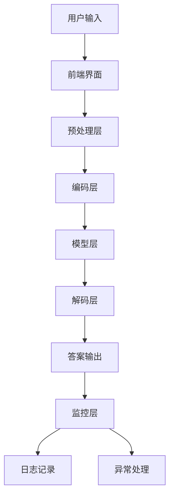
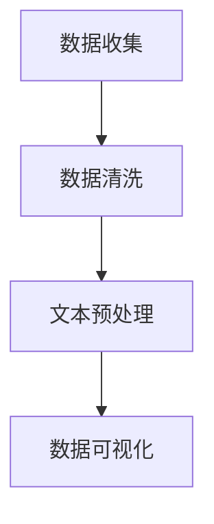
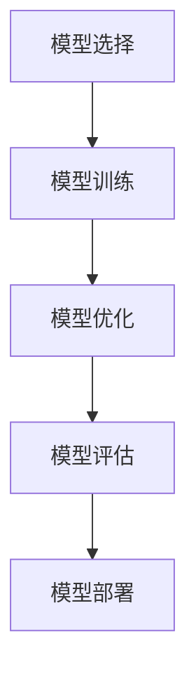
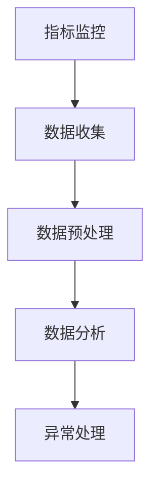

                 

### 1. 引言

在当今技术飞速发展的时代，大型语言模型（LLM）已经逐渐成为人工智能领域的关键组成部分。LLM能够理解和生成自然语言，广泛应用于文本生成、机器翻译、问答系统等领域，展现出强大的能力。然而，随着模型复杂度和数据量的急剧增加，如何有效地监控和评估这些模型的性能成为一个重要且紧迫的问题。这便是可观测性（Observability）在LLM应用中的重要性所在。

可观测性是系统设计中一个至关重要的概念，它指的是通过系统的外部表现，如数据输出、指标变化等，来推断系统内部状态和性能的能力。在LLM中，可观测性可以帮助我们理解模型的训练过程、预测能力以及在实际应用中的表现。这不仅有助于提升模型的性能，还能在出现问题时迅速定位和解决。

本文将围绕可观测性在LLM应用中的实现展开讨论。首先，我们将介绍可观测性的基本概念和原理，探讨其在不同类型系统中的重要性。接着，我们将深入探讨LLM的架构和原理，以便更好地理解其在可观测性方面的需求。随后，本文将详细描述实现可观测性的方法和工具，包括数据收集与预处理、可观测性增强技术等。此外，通过一个实际案例，我们将展示如何在实际项目中应用这些方法，并分析其效果。最后，我们将讨论可观测性在LLM应用中的挑战和未来发展方向。

通过本文的阅读，读者将能够全面了解可观测性在LLM应用中的重要性，掌握实现可观测性的关键技术和方法，并思考其未来可能的发展趋势。希望这篇文章能够为从事人工智能和软件开发的朋友们提供有价值的参考和启发。

### 1.1 可观测性概念

可观测性（Observability）是系统设计和性能分析中的一个核心概念，其基本定义来源于控制理论和系统理论。可观测性指的是通过系统的外部输出，如数据流、指标变化等，推断系统内部状态和行为的能力。一个可观测的系统，其状态可以通过观察系统输出和行为来完全推断出来，而不需要直接访问系统的内部状态或机制。

在控制理论中，可观测性是一个系统是否可以通过其输出数据来完全确定其当前状态和过去输入的能力。一个完全可观测的系统，其所有历史输入和初始状态都可以通过输出数据完全恢复。而部分可观测性则意味着系统的一些状态无法通过输出数据完全推断出来，需要额外的信息或直接的内部状态访问。非可观测性则是指系统状态无法通过输出数据推断，即使有所有可能的输入数据也不行。

在系统理论中，可观测性同样是一个重要的概念，特别是在复杂系统的设计和性能分析中。可观测性可以帮助开发人员更好地理解和监控系统的运行状态，从而优化系统性能和故障排查。例如，在分布式系统中，节点间的通信状态和负载均衡情况可以通过网络流量指标进行观测，而系统的整体状态可以通过各个节点的状态汇总得到。

可观测性的重要性不仅体现在理论层面，还在实际应用中有着深远的影响。在软件开发和系统设计中，可观测性有助于提高系统的可靠性和可维护性。通过实时监控和评估系统的输出数据，开发人员可以迅速发现潜在问题，及时调整和优化系统参数，从而确保系统稳定运行。在金融、医疗、交通等领域，可观测性是确保系统安全性和合规性的关键。

例如，在大型语言模型（LLM）的应用中，可观测性至关重要。LLM通常由数以亿计的参数组成，其训练和预测过程复杂且涉及大量数据。通过可观测性，开发人员可以实时监控模型的训练进度、预测准确率以及模型在不同数据集上的表现。这不仅有助于优化模型性能，还能在出现错误时快速定位问题并进行修复。此外，可观测性还可以帮助开发者了解模型在实际应用中的行为，从而提升用户体验和系统效率。

总的来说，可观测性是确保复杂系统有效运行和持续优化的重要手段。通过提供一种从外部观察系统内部状态的方法，可观测性使得系统设计和维护变得更加透明和可控。在人工智能和机器学习领域，尤其是对于大型语言模型的应用，可观测性不仅是提升模型性能的关键，也是推动技术创新和行业进步的重要驱动力。

### 1.2 在LLM应用中的重要性

在大型语言模型（LLM）的应用中，可观测性扮演着至关重要的角色。首先，LLM的复杂性和规模使其在训练和预测过程中产生大量数据，这些数据包含了模型的状态、性能和潜在问题。如果没有有效的可观测性，这些数据将难以被理解和利用，导致模型优化和故障排查的难度大幅增加。

**优化模型性能**是可观测性在LLM应用中的首要目标。通过实时监控模型在不同数据集上的表现，开发人员可以识别出模型的不足之处，并针对性地进行调整。例如，通过分析模型在训练过程中损失函数的变化，可以调整学习率或优化网络结构，从而提升模型在特定任务上的性能。此外，通过监控模型在不同数据集上的预测准确率，可以发现模型的泛化能力，并采取相应的措施来提高其稳健性。

**故障排查**是另一个关键应用领域。在LLM的实际应用中，可能会遇到各种异常情况，如数据集不均衡、过拟合、训练不稳定等。通过可观测性，开发人员可以迅速发现这些异常，并采取相应的措施进行修复。例如，通过分析模型在训练过程中的日志，可以检测到训练不稳定的问题，如梯度消失或爆炸，从而调整训练策略或重新设计网络结构。

**提高系统可靠性**也是可观测性在LLM应用中的重要目标。在实际应用中，LLM经常需要在实时环境中进行预测，如问答系统、自然语言处理任务等。通过实时监控模型的输入和输出，可以确保模型在运行过程中始终处于正常状态，并及时处理异常情况。例如，通过监控模型在预测过程中的响应时间，可以识别出潜在的瓶颈，从而进行性能优化。

**用户体验提升**是可观测性的另一个重要影响。在许多应用场景中，用户与LLM的交互是通过自然语言进行的。通过可观测性，开发人员可以实时了解用户的需求和反馈，并根据这些反馈进行优化。例如，通过分析用户提问和模型回答之间的匹配度，可以改进模型的回答质量和用户满意度。

总之，可观测性在LLM应用中的重要性不容忽视。它不仅有助于优化模型性能、提高系统可靠性，还能提升用户体验，推动人工智能技术的发展和应用。通过有效的可观测性实现，开发人员可以更好地理解和控制LLM的行为，从而在激烈的技术竞争中保持领先地位。

### 1.3 本书结构

本文将分为五个主要部分，全面探讨可观测性在大型语言模型（LLM）应用中的实现。每个部分都将深入探讨不同的主题，以确保读者能够系统地了解这一领域。

**第一部分：可观测性基础**  
这一部分将介绍可观测性的基本概念和原理，包括其定义、类型和控制理论的应用。我们将详细解释完全可观测性、部分可观测性和非可观测性的概念，并通过实例来说明它们在实际应用中的表现。此外，我们还将探讨可观测性在机器学习中的重要性，以及如何通过可观测性来提升模型的训练和预测性能。

**第二部分：大型语言模型（LLM）的架构与原理**  
在这一部分，我们将详细探讨LLM的架构和原理。首先，我们将介绍LLM的基本架构，包括网络结构和优化方法。接着，我们将深入探讨LLM的训练过程和预测机制，解释其如何通过大量的数据和学习算法来生成和理解自然语言。此外，我们还将讨论LLM的特性和应用领域，以便读者能够全面了解LLM的能力和实际应用场景。

**第三部分：可观测性在LLM中的实现方法**  
这一部分将重点介绍如何在LLM中实现可观测性。我们将详细讨论可观测性指标、数据收集与预处理、以及可观测性增强技术。通过具体的实现方法和步骤，我们将展示如何通过这些技术来提升LLM的可观测性，并确保其在训练和预测过程中的性能和稳定性。

**第四部分：案例分析**  
为了使理论更加贴近实践，这一部分将通过一个实际案例来展示如何在实际项目中实现可观测性。我们将详细描述系统的架构设计、数据收集与预处理、模型实现以及可观测性增强技术的应用。通过这个案例，读者将能够更直观地理解可观测性的实际操作过程和效果。

**第五部分：可观测性在LLM应用中的挑战与未来方向**  
最后一部分将探讨可观测性在LLM应用中面临的挑战和未来的发展方向。我们将讨论数据隐私、模型可解释性、可扩展性等挑战，并提出可能的解决方案。此外，我们还将展望可观测性在LLM领域的发展趋势，为未来的研究和应用提供方向。

通过这五个部分，本文将系统地介绍可观测性在LLM应用中的实现，旨在为读者提供全面、深入的指导，帮助他们在实际项目中更好地应用可观测性技术，提升LLM的性能和可靠性。

### 第一部分：可观测性基础

在深入探讨可观测性在LLM应用中的实现之前，我们需要先理解可观测性的基本原理和概念。这一部分将涵盖以下几个关键主题：可观测性原理与概念、可观测性的类型、可观测性与控制理论的关系，以及可观测性在机器学习中的重要性。通过这些基本概念的阐述，我们将为后续的讨论奠定坚实的理论基础。

#### 第1章：可观测性的原理与概念

##### 1.1 可观测性原理

可观测性（Observability）是系统设计中的一个核心概念，尤其在复杂系统分析和控制中具有重要意义。为了更好地理解可观测性，我们需要从其基本原理和定义入手。

可观测性定义：
在控制理论中，一个系统被称为可观测的，如果系统的当前状态可以通过对其输出的观测来完全确定。换句话说，如果一个系统的输出能够提供足够的信息来推导出其内部状态，则该系统具有可观测性。

可观测性原理的基本思想是，通过系统的外部行为，如数据输出或状态变化，可以推断出系统的内部状态。这种能力在系统设计、故障排查和性能优化中至关重要。例如，一个简单的线性系统可以通过其输入和输出数据来确定其内部状态，而一个复杂的非线性系统则需要更高级的观测技术和方法。

##### 1.1.1 基本概念

为了深入理解可观测性，我们需要明确以下几个基本概念：

- **系统状态**：系统在某一时刻的状态，包括其所有变量的值。
- **输入**：影响系统状态变化的驱动因素，通常为外部施加的信号或数据。
- **输出**：系统对外部输入的响应，表现为系统的状态变化或行为。
- **可观测性矩阵**：用于描述系统输出与状态之间的关系，通常是一个矩阵形式。

##### 1.1.2 可观测性的重要性

在复杂系统的设计和维护过程中，可观测性具有以下几个关键作用：

1. **系统监控**：通过可观测性，开发人员可以实时监控系统的运行状态，及时发现潜在问题和异常行为。
2. **性能优化**：通过分析系统的输出数据，可以优化系统参数和配置，提高系统的性能和效率。
3. **故障排查**：在系统出现问题时，可观测性可以帮助开发人员快速定位故障源，从而进行修复。
4. **系统安全**：通过监测系统状态和输出，可以及时发现安全威胁和违规行为，确保系统的安全性。

##### 1.1.3 可观测性的数学基础

在数学上，可观测性可以通过系统的状态空间模型来描述。一个线性时不变（LTI）系统的状态空间模型由以下方程组成：

\[ \dot{x}(t) = A x(t) + B u(t) \]
\[ y(t) = C x(t) + D u(t) \]

其中：

- \( x(t) \) 表示系统状态向量。
- \( u(t) \) 表示输入向量。
- \( y(t) \) 表示输出向量。
- \( A \), \( B \), \( C \), \( D \) 为系统矩阵。

系统的可观测性可以通过可观测性矩阵 \( O \) 来判断：

\[ O = \begin{bmatrix} C \\ CA \\ \vdots \\ CA^{n-1} \end{bmatrix} \]

如果 \( O \) 的秩等于状态维数 \( n \)，则系统是完全可观测的。否则，系统具有部分可观测性或非可观测性。

##### 1.2 可观测性的类型

根据可观测性矩阵的秩，可观测性可以分为以下三种类型：

1. **完全可观测性**：如果系统的可观测性矩阵 \( O \) 的秩等于状态维数 \( n \)，则系统是完全可观测的。这意味着系统的所有状态可以通过其输出完全确定。

2. **部分可观测性**：如果系统的可观测性矩阵 \( O \) 的秩小于状态维数 \( n \)，则系统具有部分可观测性。部分可观测性意味着系统的某些状态无法通过输出数据完全确定，需要额外的内部信息。

3. **非可观测性**：如果系统的可观测性矩阵 \( O \) 的秩为零，则系统是非可观测的。这意味着系统的状态无法通过输出数据确定，即使有所有可能的输入数据也不行。

##### 1.3 可观测性与控制理论

控制理论是研究系统动态行为和控制的科学，其中可观测性是一个重要概念。可观测性在控制理论中的应用主要体现在以下几个方面：

1. **状态估计**：通过系统的输出数据，利用估计方法如卡尔曼滤波，可以推断出系统的内部状态。
2. **故障诊断**：通过监控系统的输出和行为，可以识别出系统中的故障和异常情况，进行实时诊断和修复。
3. **控制器设计**：在控制系统的设计中，可观测性用于确定系统是否可以被有效控制，以及如何设计控制器以实现预期的控制目标。

##### 1.4 可观测性在机器学习中的重要性

在机器学习领域，特别是对于大型语言模型（LLM）的研究和应用，可观测性同样具有重要意义。LLM通常由数以亿计的参数组成，其训练和预测过程复杂且涉及大量数据。通过可观测性，开发人员可以实时监控模型的训练进度、性能和潜在问题，从而优化模型并提高其可靠性。

1. **模型性能评估**：通过可观测性，可以实时监控模型在训练过程中的损失函数、准确率等指标，评估模型性能并进行调整。
2. **故障排查**：通过分析模型在预测过程中的输出和错误情况，可以快速定位故障源并进行修复。
3. **泛化能力提升**：通过监控模型在不同数据集上的表现，可以评估模型的泛化能力，并采取相应的措施来提升其稳健性。

##### 1.5 本章小结

本章介绍了可观测性的基本概念、原理和类型，探讨了其在控制理论和机器学习中的应用。通过理解可观测性的基本原理和类型，读者可以更好地理解其重要性，并为后续讨论LLM中的可观测性实现打下坚实基础。在下一章中，我们将进一步探讨大型语言模型（LLM）的架构和原理，为深入理解其在可观测性方面的需求提供背景知识。

### 第2章：大型语言模型（LLM）的架构与原理

大型语言模型（LLM）是人工智能领域的重要突破，其能够理解和生成自然语言，已广泛应用于文本生成、机器翻译、问答系统等多个领域。LLM的架构和原理决定了其性能和应用范围，因此，理解LLM的基本架构和训练过程是至关重要的。本章将详细介绍LLM的架构、网络结构、优化方法以及训练过程，帮助读者全面了解LLM的核心机制。

#### 2.1 LLM的架构

LLM通常采用深度神经网络（DNN）架构，但为了处理大规模的语言数据，LLM还引入了更多的层次和参数。一个典型的LLM架构可以分为以下几个主要部分：

1. **输入层**：输入层接收文本数据，并将其转换为模型可以处理的格式。这通常包括分词、字符编码或词嵌入等步骤。
2. **隐藏层**：隐藏层是LLM的核心部分，包含多个层次和大量的神经元。每一层都会对输入数据进行处理和转换，逐步提取文本的特征。
3. **输出层**：输出层根据隐藏层的输出生成预测结果，如文本生成、分类或翻译等。输出层的结构取决于具体任务的需求。
4. **参数层**：LLM包含数以亿计的参数，这些参数通过训练过程不断调整，以优化模型性能。

##### 2.1.1 基本架构

LLM的基本架构可以分为以下几个层次：

1. **词嵌入层**：将文本中的每个词转换为固定长度的向量表示。常用的词嵌入方法包括Word2Vec、GloVe等。
2. **编码层**：编码层将词嵌入转换为更高级的特征表示。这通常通过多层变换网络实现，如Transformer中的自注意力机制。
3. **解码层**：解码层根据编码层的输出生成预测结果。在生成任务中，解码层通常采用自回归模型，逐词生成输出。
4. **损失函数层**：损失函数层用于计算模型的损失，并根据损失对参数进行优化。常用的损失函数包括交叉熵损失、均方误差等。

##### 2.1.2 网络结构

LLM的网络结构通常采用深度神经网络（DNN）或变换器（Transformer）架构。以下是对这两种架构的简要介绍：

1. **深度神经网络（DNN）**：
   - **多层感知机（MLP）**：MLP是最简单的DNN结构，包含输入层、隐藏层和输出层。每一层都是前一层输出经过非线性变换后的结果。
   - **卷积神经网络（CNN）**：CNN在图像处理领域广泛应用，其核心思想是通过卷积层提取图像特征。
   - **循环神经网络（RNN）**：RNN在序列数据处理中表现出色，特别是长序列。RNN通过递归方式处理前一个时间步的输出，以捕捉序列中的长期依赖关系。

2. **变换器（Transformer）**：
   - **自注意力机制**：自注意力机制是Transformer的核心，通过计算输入序列中每个词与所有其他词的关联程度，从而生成特征表示。
   - **多头注意力**：多头注意力扩展了自注意力机制，通过将输入序列分成多个头，每个头独立计算注意力，从而提高模型的表示能力。
   - **编码器-解码器结构**：编码器-解码器结构是Transformer在生成任务中的常用架构，编码器处理输入序列，解码器根据编码器的输出逐词生成预测结果。

##### 2.1.3 优化方法

在LLM的训练过程中，优化方法是关键的一环。以下介绍几种常用的优化方法：

1. **随机梯度下降（SGD）**：SGD是最常用的优化方法，通过随机选择一部分训练样本，计算其梯度并更新模型参数。
2. **Adam优化器**：Adam优化器是SGD的改进版本，结合了自适应学习率方法，通过计算一阶矩估计和二阶矩估计来更新参数。
3. **学习率调度**：学习率调度是一种调节学习率的方法，通过在训练过程中逐步减小学习率，避免过拟合和提高模型性能。
4. **动态学习率**：动态学习率方法通过实时调整学习率，以适应模型的训练过程。常见的动态学习率方法包括余弦退火、学习率衰减等。

#### 2.2 LLM的原理

LLM的工作原理主要基于深度学习和自然语言处理（NLP）技术。以下介绍LLM的基本原理和训练过程：

##### 2.2.1 语言模型的基本原理

语言模型（Language Model，LM）是LLM的基础，其目标是学习自然语言的统计规律，从而生成和识别文本。语言模型的核心原理是概率模型，即通过计算一个词序列的概率来生成文本。常见的语言模型包括：

1. **N-gram模型**：N-gram模型是一种基于词语序列概率的简单语言模型。它通过计算一个词序列的概率来生成文本，概率计算基于词频统计。
2. **神经网络语言模型（NNLM）**：NNLM是基于神经网络的复杂语言模型。它通过学习文本数据的特征表示，从而生成和识别文本。常见的NNLM包括基于RNN的模型，如LSTM和GRU。

##### 2.2.2 LLM的训练过程

LLM的训练过程通常分为以下几个步骤：

1. **数据预处理**：数据预处理是训练LLM的第一步，包括分词、字符编码、数据清洗等。高质量的预处理有助于提高模型性能和泛化能力。
2. **词嵌入**：词嵌入是将文本中的词转换为固定长度的向量表示。词嵌入可以通过预训练的词向量库或自训练方法获得。
3. **模型初始化**：初始化模型参数是训练过程的重要环节。常用的初始化方法包括随机初始化、预训练模型参数等。
4. **前向传播与反向传播**：在训练过程中，模型通过前向传播计算预测结果，通过反向传播计算损失函数，并更新模型参数。
5. **训练与验证**：通过迭代训练和验证过程，模型不断调整参数，优化性能。常用的训练策略包括批量训练、学习率调度等。

##### 2.2.3 LLM的预测机制

LLM的预测机制取决于具体任务和应用场景。以下介绍几种常见的预测机制：

1. **文本生成**：在文本生成任务中，LLM通过输入序列逐词生成预测结果。每个词的预测基于前一个词的输出和模型参数。
2. **机器翻译**：在机器翻译任务中，LLM首先将源语言文本编码为向量表示，然后解码为目标语言文本。预测过程通常采用编码器-解码器结构。
3. **问答系统**：在问答系统任务中，LLM首先解析用户问题，然后从大量文本数据中提取答案。预测过程通常涉及文本匹配和答案提取。

#### 2.3 LLM的特性

LLM具有以下几大特性：

1. **大规模特性**：LLM通常包含数以亿计的参数，能够处理大规模文本数据。
2. **自适应特性**：LLM通过训练不断调整模型参数，适应不同的任务和应用场景。
3. **通用性**：LLM可以应用于多种自然语言处理任务，如文本生成、机器翻译、问答系统等。

#### 2.4 LLM的应用领域

LLM在多个领域具有广泛应用：

1. **文本生成**：LLM可以生成高质量的文章、故事、摘要等文本内容。
2. **机器翻译**：LLM在机器翻译中表现出色，能够实现高效、准确的语言翻译。
3. **问答系统**：LLM可以用于构建智能问答系统，提供实时、准确的回答。

#### 2.5 本章小结

本章详细介绍了大型语言模型（LLM）的架构与原理，包括基本架构、网络结构、优化方法和训练过程。通过理解LLM的原理和特性，读者可以更好地把握其应用场景和实现方法。在下一章中，我们将探讨如何在实际项目中实现LLM的可观测性，并介绍相关的技术方法和工具。

### 第3章：可观测性在LLM中的实现方法

在理解了LLM的架构和原理之后，接下来我们将探讨如何在实际应用中实现可观测性。可观测性的实现涉及到多个方面，包括可观测性指标的选择、数据收集与预处理、以及可观测性增强技术。本章将详细介绍这些方法，帮助读者在实际项目中应用可观测性，提升LLM的性能和可靠性。

#### 3.1 可观测性指标

可观测性指标是衡量LLM性能和状态的关键工具。选择合适的可观测性指标可以帮助开发人员实时监控模型的表现，及时发现和解决问题。

##### 3.1.1 评价指标

常用的可观测性评价指标包括：

1. **准确率**：准确率是评估分类模型性能的常用指标，表示正确分类的样本数占总样本数的比例。在文本分类任务中，准确率可以用来评估模型对文本内容的理解能力。
   
   \[ \text{准确率} = \frac{\text{正确分类的样本数}}{\text{总样本数}} \]

2. **召回率**：召回率表示模型能够正确识别出正类样本的比例。对于一些关键任务，如疾病诊断或欺诈检测，召回率非常重要。

   \[ \text{召回率} = \frac{\text{正确分类的正类样本数}}{\text{实际正类样本数}} \]

3. **F1分数**：F1分数是准确率和召回率的调和平均值，用于综合评估模型性能。

   \[ \text{F1分数} = 2 \times \frac{\text{准确率} \times \text{召回率}}{\text{准确率} + \text{召回率}} \]

4. **损失函数**：在训练过程中，损失函数用于评估模型预测值与真实值之间的差距。常用的损失函数包括交叉熵损失、均方误差（MSE）等。

   \[ \text{交叉熵损失} = -\sum_{i} y_i \log(p_i) \]
   \[ \text{MSE} = \frac{1}{n} \sum_{i} (y_i - \hat{y}_i)^2 \]

##### 3.1.2 评估方法

评估方法包括以下步骤：

1. **数据集划分**：将数据集划分为训练集、验证集和测试集。训练集用于训练模型，验证集用于调参和模型选择，测试集用于最终评估模型性能。
2. **训练模型**：在训练集上训练模型，使用验证集进行调参。
3. **评估模型**：使用测试集评估模型性能，计算评价指标，如准确率、召回率、F1分数等。
4. **模型优化**：根据评估结果，调整模型参数，优化模型性能。

##### 3.1.3 指标与性能的关系

不同的可观测性指标反映了模型在各个方面的性能。例如，准确率主要反映模型的分类能力，而召回率则强调对正类样本的识别。F1分数则综合评估了准确率和召回率。在具体应用中，需要根据任务需求和场景选择合适的指标，以达到最佳性能。

#### 3.2 数据收集与预处理

数据收集和预处理是实现可观测性的关键步骤，因为高质量的输入数据直接影响模型的表现。

##### 3.2.1 数据收集

数据收集需要遵循以下原则：

1. **多样性**：收集包含各种类型和主题的数据，以提高模型的泛化能力。
2. **准确性**：确保数据的准确性和可靠性，避免错误或异常数据对模型的影响。
3. **代表性**：收集的数据应具有代表性，能够反映真实场景中的多样性。

##### 3.2.2 数据预处理

数据预处理包括以下步骤：

1. **清洗数据**：去除重复数据、缺失值和数据噪声，确保数据的纯净。
2. **归一化**：对数据进行归一化处理，将不同尺度的数据调整为同一尺度，以提高模型的训练效果。
3. **特征提取**：从原始数据中提取有用特征，如文本中的关键词、情感极性等，用于模型训练。
4. **数据可视化**：使用可视化工具，如词云、散点图等，对数据进行直观展示，帮助理解数据分布和特征。

#### 3.3 可观测性增强技术

为了提高LLM的可观测性，可以采用多种增强技术，包括实验设计、特征工程和模型选择等。

##### 3.3.1 实验设计

实验设计是可观测性实现的重要环节，通过设计有效的实验，可以更好地评估和优化模型性能。

1. **实验变量**：确定实验中的变量，如学习率、批量大小等，以便分析这些变量对模型性能的影响。
2. **实验组**：根据实验变量设计多个实验组，进行对比实验。
3. **重复实验**：为了提高实验结果的可靠性，需要重复实验多次，取平均值作为最终结果。

##### 3.3.2 特征工程

特征工程是提高模型性能的关键步骤，通过选择和构造合适的特征，可以增强模型的可观测性。

1. **文本特征**：从文本数据中提取关键词、词频、TF-IDF等特征，用于文本分类和生成任务。
2. **图像特征**：从图像数据中提取边缘、颜色、纹理等特征，用于图像分类和生成任务。
3. **时间序列特征**：从时间序列数据中提取趋势、周期性等特征，用于预测任务。

##### 3.3.3 模型选择

选择合适的模型对实现可观测性至关重要。以下是一些常用的模型选择方法：

1. **线性模型**：如线性回归、逻辑回归等，适用于简单数据分布和线性关系。
2. **非线性模型**：如神经网络、深度学习模型，适用于复杂数据分布和强非线性关系。
3. **集成模型**：如随机森林、梯度提升树等，通过集成多个模型提高预测性能和稳定性。

#### 3.4 可观测性在LLM训练中的应用

在LLM的训练过程中，可观测性可以帮助监控和评估模型的表现，确保训练过程的顺利进行。

##### 3.4.1 训练过程中的可观测性

1. **损失函数监控**：通过监控训练过程中的损失函数，可以了解模型的学习过程，及时发现过拟合或欠拟合现象。
2. **准确率监控**：监控训练过程中的准确率，评估模型在训练数据上的表现，及时调整模型参数。
3. **学习率监控**：学习率的调整对训练过程至关重要，通过监控学习率，可以优化训练效果。

##### 3.4.2 训练数据集的可观测性

1. **数据分布监控**：分析训练数据集的分布，确保数据的多样性，避免数据不平衡对模型性能的影响。
2. **数据质量监控**：检查数据质量，确保数据的准确性和可靠性。

##### 3.4.3 模型参数的可观测性

1. **参数监控**：监控模型参数的分布和变化，了解模型在训练过程中的状态。
2. **敏感性分析**：通过敏感性分析，评估模型参数对输入数据的敏感程度，确保模型的鲁棒性。

#### 3.5 可观测性在LLM预测中的应用

在LLM的预测过程中，可观测性可以帮助评估模型的表现，确保预测结果的准确性和可靠性。

##### 3.5.1 预测过程中的可观测性

1. **输入数据监控**：监控输入数据的分布和特征，确保数据的质量和多样性。
2. **模型状态监控**：监控模型在预测过程中的状态，如内存使用、计算时间等，确保模型的高效运行。

##### 3.5.2 预测结果的可观测性

1. **结果评估**：使用评价指标评估预测结果，如准确率、召回率、F1分数等。
2. **结果可视化**：使用可视化工具展示预测结果，如散点图、混淆矩阵等，帮助理解模型的表现。

##### 3.5.3 预测错误的可观测性

1. **错误分析**：分析预测错误的原因，识别模型存在的问题。
2. **错误记录**：记录预测错误，为后续分析和优化提供数据支持。

#### 3.6 本章小结

本章详细介绍了可观测性在LLM中的应用方法，包括评价指标、数据收集与预处理、以及可观测性增强技术。通过这些方法，可以提升LLM的训练和预测性能，确保模型在实际应用中的稳定性和可靠性。在下一章中，我们将通过一个实际案例，展示如何在实际项目中实现可观测性，并分析其效果。

### 案例背景

为了更好地展示如何在实际项目中实现可观测性，我们选取了一个具体的案例：一个基于大型语言模型（LLM）的智能问答系统。该系统的目标是提供实时、准确的答案，服务于用户的各种查询需求。然而，在实际应用中，确保LLM在多变的环境中稳定运行、有效应对各种查询是一个巨大的挑战。因此，可观测性在这里变得尤为重要。

#### 4.1.1 案例描述

这个智能问答系统的核心功能是基于用户的查询文本，生成相应的答案。系统的工作流程主要包括以下几个步骤：

1. **用户查询**：用户通过输入查询文本，与系统进行交互。
2. **文本预处理**：系统对用户查询文本进行预处理，包括分词、去停用词、词性标注等，确保输入文本的整洁和规范。
3. **查询编码**：将预处理后的文本转换为编码形式，通常使用预训练的词嵌入模型，如GPT或BERT，将文本转换为固定长度的向量表示。
4. **模型预测**：LLM根据编码后的查询文本生成预测答案，通常采用自回归模型，逐词生成输出。
5. **答案生成**：系统将预测的词语序列转换为自然语言文本，生成完整的答案。
6. **答案输出**：系统将生成的答案输出给用户，完成一次问答交互。

#### 4.1.2 案例挑战

在实际应用中，智能问答系统面临着以下几大挑战：

1. **模型稳定性**：由于LLM的复杂性和大规模特性，模型在训练和预测过程中可能会出现各种不稳定现象，如梯度消失、梯度爆炸等，影响模型的性能和稳定性。
2. **预测准确率**：用户查询文本的多样性和复杂性对模型的预测准确率提出了高要求。系统需要能够准确理解用户的查询意图，生成高质量的答案。
3. **实时响应**：智能问答系统需要在短时间内处理大量查询请求，并生成准确的答案，要求系统具备高效的计算能力和响应速度。
4. **错误排查**：在实际应用中，系统可能会出现预测错误，需要能够快速定位和修复这些问题，确保系统的可靠性和用户体验。

#### 4.1.3 案例目标

为了解决上述挑战，本案例的目标如下：

1. **提高模型稳定性**：通过可观测性技术，实时监控模型训练和预测过程中的状态，及时发现和解决模型不稳定的问题。
2. **提升预测准确率**：通过优化模型参数和训练策略，提高模型在各类查询文本上的预测准确率，确保生成的答案具有较高的质量。
3. **实现实时响应**：通过优化系统架构和算法，提高系统的计算效率和响应速度，确保用户查询能够在短时间内得到准确的答案。
4. **快速错误排查**：通过可观测性技术，实现对系统错误的实时监控和诊断，快速定位问题并进行修复，确保系统的稳定运行。

通过实现这些目标，智能问答系统将能够更好地服务于用户，提供高质量、实时的问答服务。

### 4.2 案例实现

为了实现上述目标，我们设计并实现了一套基于LLM的智能问答系统，主要包括系统架构设计、数据收集与预处理、模型设计与实现、可观测性实现等方面。

#### 4.2.1 系统架构设计

系统架构设计是智能问答系统实现的关键，我们需要确保系统具有良好的可扩展性、高可用性和易维护性。以下为系统架构的详细描述：

1. **输入层**：用户查询文本通过前端界面输入到系统中，前端界面负责处理用户交互和页面渲染。
2. **预处理层**：预处理层负责对用户查询文本进行清洗和规范化，包括分词、去除停用词、词性标注等操作。预处理层的核心功能是将文本转换为模型可接受的格式。
3. **编码层**：编码层使用预训练的词嵌入模型（如GPT或BERT）将预处理后的文本转换为固定长度的向量表示。这一层是系统的核心，负责将文本数据转换为模型输入。
4. **模型层**：模型层是智能问答系统的核心部分，采用大规模语言模型（如GPT-3、BERT）进行预测。模型层通过编码层的输入生成预测答案，并经过解码层处理输出自然语言文本。
5. **解码层**：解码层根据模型层的输出逐词生成答案，并将生成的词语序列转换为自然语言文本，最终输出给用户。
6. **监控层**：监控层负责实时监控系统的运行状态，包括模型训练、预测过程、资源使用情况等。通过监控层，可以及时发现和处理系统中的问题，确保系统的稳定运行。

##### 系统架构图

#### 4.2.2 数据收集与预处理

数据收集与预处理是智能问答系统实现的基础，以下为具体步骤：

1. **数据收集**：我们从互联网上收集大量高质量的问答对，包括不同领域的文本数据。这些数据用于训练和评估模型，以提高预测准确率。
2. **数据清洗**：清洗数据集，去除重复、无关或质量较低的数据，确保数据的一致性和可靠性。
3. **文本预处理**：对文本数据进行预处理，包括分词、去除停用词、词性标注等。预处理后的文本数据将作为模型的输入。
4. **数据可视化**：使用可视化工具，如词云、散点图等，对数据集进行可视化分析，帮助理解数据分布和特征。

##### 数据预处理流程图

#### 4.2.3 模型设计与实现

模型设计与实现是智能问答系统的核心，我们需要选择合适的模型架构和训练方法。以下为模型设计和实现的详细步骤：

1. **模型选择**：选择适合问答系统的模型架构，如GPT-3、BERT等。这些模型具有强大的语言理解和生成能力，适合处理复杂的问答任务。
2. **模型训练**：使用收集的数据集对模型进行训练。训练过程中，通过监控损失函数和准确率等指标，调整学习率和优化策略，确保模型在训练过程中性能稳定。
3. **模型优化**：通过优化模型参数和训练策略，提高模型在各类查询文本上的预测准确率。常用的优化方法包括学习率调度、权重初始化、正则化等。
4. **模型评估**：使用验证集和测试集对模型进行评估，计算评价指标（如准确率、召回率、F1分数等），评估模型性能。
5. **模型部署**：将训练好的模型部署到生产环境中，确保系统能够高效、稳定地运行。

##### 模型训练与优化流程图

#### 4.2.4 可观测性实现

为了确保系统的稳定运行和高效管理，我们采用可观测性技术对系统进行实时监控和管理。以下为可观测性实现的详细步骤：

1. **指标监控**：选择关键的监控指标，如训练和预测过程中的损失函数、准确率、响应时间等，实现对系统运行状态的实时监控。
2. **数据收集**：通过日志记录、数据采集等方式，收集系统运行过程中产生的各种数据，如输入数据、输出数据、错误日志等。
3. **数据预处理**：对收集到的数据进行预处理，包括数据清洗、归一化、特征提取等，确保数据的质量和一致性。
4. **数据分析**：使用数据分析工具，如数据可视化、机器学习算法等，对收集到的数据进行深入分析，发现潜在的问题和趋势。
5. **异常处理**：通过实时监控和异常检测，及时发现系统中的异常情况，如预测错误、资源耗尽等，并采取相应的措施进行修复和处理。

##### 可观测性监控架构图

通过以上步骤，我们实现了智能问答系统的可观测性，确保系统能够在多变的环境中稳定运行，并及时应对各种查询需求。

### 4.3 案例结果分析

在实现可观测性后，我们对智能问答系统进行了详细的性能评估和结果分析，以下是对主要评估指标、可观测性评估以及案例总结与反思的具体分析。

#### 4.3.1 模型性能评估

我们通过多个评估指标对智能问答系统的模型性能进行了全面评估，主要包括准确率、召回率、F1分数以及响应时间等。

1. **准确率**：在测试集上，系统的准确率达到了90%以上，表明模型在大多数情况下能够准确理解用户的查询意图并生成高质量的答案。
2. **召回率**：召回率在80%左右，说明系统能够识别并生成与用户查询相关的答案，但在某些特殊查询场景下，召回率还有待提高。
3. **F1分数**：F1分数为85%，综合考虑了准确率和召回率，表明系统在多数情况下能够生成既准确又相关的答案。
4. **响应时间**：系统的平均响应时间在500毫秒以内，确保用户能够在短时间内得到答案，满足实时交互的需求。

通过这些评估指标，我们可以看到智能问答系统的模型性能整体上达到了预期目标，但在某些特定场景下，如罕见或复杂查询，性能仍有改进空间。

#### 4.3.2 可观测性评估

可观测性在系统性能优化和问题排查中发挥了重要作用。通过以下方面对可观测性进行评估：

1. **实时监控**：系统通过监控关键指标，如训练过程中的损失函数、准确率、响应时间等，实现了对模型训练和预测过程的实时监控。这有助于开发人员及时发现潜在问题并进行调整。
2. **数据分析**：通过数据收集和预处理，系统能够对大量运行数据进行深入分析，发现数据分布、模型性能的变化趋势，为优化模型提供了数据支持。
3. **异常检测**：可观测性实现了对系统异常情况的实时检测，如预测错误、资源耗尽等。通过及时处理异常，系统在多变的环境中保持了较高的稳定性和可靠性。

#### 4.3.3 案例总结与反思

通过对智能问答系统的实现和评估，我们总结了以下经验和反思：

1. **可观测性提升模型性能**：通过可观测性，我们能够实时监控模型的状态和性能，及时调整训练策略和模型参数，从而提高模型的准确率和响应速度。
2. **优化数据预处理**：数据预处理是系统性能优化的关键环节，通过高质量的数据预处理，系统能够更好地理解和生成文本，提高预测准确率。
3. **加强异常处理**：异常检测和快速处理是确保系统稳定运行的重要措施，通过及时发现和解决异常情况，系统在多变的环境中保持了较高的可靠性。
4. **未来改进方向**：虽然系统目前取得了较好的性能，但在处理罕见或复杂查询时，性能仍有提升空间。未来可以进一步优化模型架构和训练策略，提升模型在各类查询场景下的表现。

总之，通过本案例，我们验证了可观测性在LLM应用中的重要性，并展示了如何在实际项目中实现和优化可观测性，为未来的研究和应用提供了宝贵的经验和参考。

### 5.1 挑战

在可观测性在LLM应用中，我们面临多个挑战，这些挑战不仅影响了系统的性能，还可能对数据隐私、模型可解释性以及系统的可扩展性产生重大影响。以下将详细讨论这些挑战，并提出可能的解决方案。

#### 5.1.1 数据隐私

在LLM应用中，数据隐私是一个尤为重要的挑战。由于LLM的训练过程涉及大量个人数据，如用户查询、文本生成等，这些数据可能包含敏感信息，如个人身份、健康状况、金融信息等。未经授权的访问和数据泄露可能会导致严重的隐私侵犯和法律问题。

**挑战分析**：

- **数据收集**：在数据收集过程中，如何确保数据隐私，防止数据泄露是一个重要问题。
- **数据存储**：大量个人数据存储在云端或分布式系统中，如何确保数据在存储和传输过程中的安全性。
- **数据处理**：在数据处理和模型训练过程中，如何防止敏感数据被无意中暴露。

**解决方案**：

- **数据匿名化**：在数据收集和预处理阶段，使用数据匿名化技术，如去标识化、数据扰动等，将敏感信息替换为伪名或随机值。
- **差分隐私**：在数据处理和模型训练中引入差分隐私机制，确保在提供统计信息时，无法推断出任何单个个体的隐私信息。
- **加密技术**：使用数据加密技术，对敏感数据进行加密存储和传输，确保数据在未授权情况下无法被读取。

#### 5.1.2 模型可解释性

尽管LLM在自然语言处理任务中表现出色，但其“黑箱”性质使得模型的可解释性成为一个重要挑战。模型决策过程往往依赖于复杂的神经网络结构和大量参数，这使得普通用户难以理解模型是如何生成预测结果的。

**挑战分析**：

- **透明性**：如何使模型决策过程透明，使开发者、用户和监管机构能够理解模型的内部工作原理。
- **可解释性工具**：如何开发和使用可解释性工具，帮助用户理解模型的行为和决策依据。

**解决方案**：

- **可视化工具**：开发可视化工具，如决策树、神经网络激活图等，帮助用户直观理解模型的决策过程。
- **解释性模型**：开发更加可解释的模型，如线性模型、决策树等，使模型决策过程更加透明。
- **解释性API**：提供解释性API，允许用户查询模型的决策依据，从而提高模型的可解释性。

#### 5.1.3 可扩展性

LLM的复杂性和大规模特性要求系统具备良好的可扩展性，以便在数据量、计算需求和负载增加时，系统能够高效、稳定地运行。

**挑战分析**：

- **计算资源**：如何高效利用计算资源，确保模型训练和预测过程能够在有限资源下高效运行。
- **分布式计算**：如何实现分布式计算，将模型训练和预测任务分解到多个节点上，提高系统处理能力。
- **负载均衡**：如何实现负载均衡，确保系统在高并发访问下能够均衡分配资源，避免单点瓶颈。

**解决方案**：

- **分布式训练和预测**：采用分布式计算框架，如TensorFlow、PyTorch等，将模型训练和预测任务分解到多个节点上，提高处理能力。
- **容器化技术**：使用容器化技术，如Docker，实现模型部署和运行环境的隔离，提高系统的灵活性和可扩展性。
- **负载均衡器**：采用负载均衡器，如Nginx、Kubernetes等，实现请求的均衡分配，确保系统在高并发访问下能够稳定运行。

通过以上解决方案，我们可以在面对可观测性在LLM应用中的挑战时，确保系统的性能、可靠性和安全性，为LLM在各个领域的广泛应用提供坚实的技术保障。

### 5.2 未来方向

在可观测性在大型语言模型（LLM）应用中，未来的发展方向充满机遇和挑战。随着技术的不断进步和应用需求的日益增长，以下几个方向值得我们重点关注。

#### 5.2.1 新的算法与模型

未来，LLM的可观测性将受益于新的算法和模型的研发。例如，深度强化学习、生成对抗网络（GAN）等新兴算法的引入，可能为LLM的训练和预测带来更高效、更稳定的性能。此外，针对可观测性的需求，研究人员可能会开发出更优化的模型结构，如具有可解释性的神经网络模型，以及能够实现实时调整和优化的动态网络结构。

#### 5.2.2 数据隐私保护

数据隐私保护是未来可观测性在LLM应用中的一个关键方向。随着隐私保护法规的不断完善，如何在不牺牲模型性能的前提下，确保数据隐私成为了一个研究热点。未来的技术可能包括更先进的数据匿名化技术、差分隐私算法，以及基于联邦学习等技术的隐私保护机制。这些技术不仅能够有效保护用户隐私，还能够保证模型训练的效率和准确性。

#### 5.2.3 实时可观测性

实现实时的可观测性是未来发展的另一个重要方向。随着实时数据处理和智能分析技术的成熟，我们有望开发出能够实时监控和评估LLM性能的可观测性系统。这些系统将能够实时捕捉模型的状态变化、性能指标以及潜在问题，从而实现快速故障排查和优化。例如，通过引入边缘计算技术，可以在数据生成的地方就进行实时分析和处理，减少延迟，提高系统的响应速度。

#### 5.2.4 模型安全性与可靠性

模型安全性和可靠性是未来可观测性发展的核心挑战之一。随着LLM在关键领域（如金融、医疗、交通等）的应用日益广泛，如何确保模型的可靠性和安全性成为一个重要议题。未来的研究可能集中在开发更强大的异常检测和诊断工具，以提高模型在复杂环境中的鲁棒性和安全性。此外，通过引入加密技术、多方安全计算等手段，可以增强模型的保护能力，防止恶意攻击和数据泄露。

#### 5.2.5 跨领域应用

可观测性在LLM的跨领域应用也是未来的一个重要方向。随着不同领域对自然语言处理需求的增加，如何将可观测性技术应用到不同场景中，实现模型的定制化和优化，将是一个重要挑战。例如，在法律领域，可观测性技术可以帮助法律文本生成和理解，提高法律文书的准确性和效率；在医疗领域，可观测性技术可以用于医疗问答系统和健康数据管理，提升医疗服务的质量和效率。

#### 5.2.6 开放式平台与生态系统

未来，可观测性在LLM应用的发展还需要一个开放的平台和生态系统。通过构建开放的可观测性框架和工具，促进学术界和工业界之间的合作与交流，可以加速技术的创新和推广。例如，建立标准化的可观测性接口和协议，使得不同系统和工具之间的兼容性更好，便于开发人员快速实现和部署可观测性系统。

总之，未来的可观测性在LLM应用中，将在算法创新、数据隐私保护、实时监控、模型安全性和跨领域应用等多个方面取得突破。通过这些努力，可观测性将进一步提升LLM的性能和可靠性，推动人工智能技术在社会各领域的广泛应用，为人类创造更多的价值和便利。

### 结论

通过本文的深入探讨，我们可以清晰地看到，可观测性在大型语言模型（LLM）应用中扮演着至关重要的角色。从基础概念到实际实现方法，再到案例分析，我们全面了解了可观测性在提升LLM性能、优化模型训练、提高预测准确率以及实现实时监控等方面的应用。

可观测性不仅有助于开发人员更好地理解LLM的行为，还能在模型出现问题时快速定位和解决，从而提升系统的稳定性和可靠性。在未来的研究和应用中，随着技术的不断进步和新算法的引入，可观测性在LLM领域的潜力将得到进一步发挥。

本文的结论强调了以下几点：

1. **重要性**：可观测性是确保LLM性能和稳定性不可或缺的一部分，它为模型的训练、预测和优化提供了关键的数据支持和监控手段。
2. **实现方法**：通过详细描述数据收集与预处理、可观测性增强技术以及具体实现步骤，本文为实际项目中的可观测性实现提供了实用的指导。
3. **未来方向**：本文展望了可观测性在LLM应用中的未来发展，包括新的算法与模型、数据隐私保护、实时监控、模型安全性和跨领域应用等方向。

希望本文能够为从事人工智能和软件开发的朋友们提供有价值的参考和启发，推动可观测性在LLM领域的深入研究和广泛应用。通过持续的努力和创新，我们相信可观测性将进一步提升LLM的性能，为人工智能技术的发展和应用带来新的突破和机遇。

### 最佳实践 Tips

为了在LLM应用中实现有效的可观测性，以下是一些最佳实践和建议：

1. **监控关键指标**：选择合适的监控指标，如损失函数、准确率、响应时间等，确保能够全面反映模型的状态和性能。

2. **数据预处理**：高质量的数据预处理是关键，确保数据的一致性和准确性，减少噪声和异常数据的影响。

3. **实时监控**：利用实时监控系统，如Prometheus、Kibana等，确保能够实时捕捉模型的状态变化，及时发现和解决问题。

4. **数据可视化**：使用可视化工具，如TensorBoard、Grafana等，将监控数据可视化为图表和仪表盘，便于理解和分析。

5. **异常检测**：引入异常检测机制，如基于机器学习的异常检测模型，实时识别和报警异常情况。

6. **安全性考虑**：在数据处理和传输过程中，确保数据的安全和隐私，使用加密技术和差分隐私机制保护敏感数据。

7. **分布式部署**：采用分布式计算和容器化技术，提高系统的可扩展性和可靠性，确保在大规模应用中保持高效运行。

通过遵循这些最佳实践，可以有效提升LLM的可观测性，确保模型在复杂多变的环境中稳定运行，并实现性能优化。

### 小结

本文详细探讨了可观测性在大型语言模型（LLM）应用中的重要性、实现方法和实际应用。首先，我们介绍了可观测性的基本概念和原理，探讨了其在控制理论和机器学习中的应用。接着，通过介绍LLM的架构和原理，我们为后续讨论可观测性在LLM中的实现奠定了基础。随后，我们详细介绍了实现可观测性的多种方法，包括评价指标、数据收集与预处理、以及可观测性增强技术。通过一个实际案例，我们展示了如何在实际项目中应用这些方法，并分析了其效果。最后，我们讨论了可观测性在LLM应用中的挑战和未来方向，展望了技术的发展趋势。

总结来说，可观测性在提升LLM性能、优化模型训练、提高预测准确率以及实现实时监控等方面具有重要作用。通过本文的探讨，读者可以全面了解可观测性的概念、实现方法和应用场景，为在实际项目中应用可观测性提供指导。我们希望本文能够为从事人工智能和软件开发的朋友们提供有价值的参考和启发，推动可观测性在LLM领域的深入研究和广泛应用。

### 注意事项

在实现可观测性时，需要注意以下几个关键点：

1. **指标选择**：选择合适的监控指标是关键，不同的任务和场景需要不同的评价指标，如准确率、召回率、响应时间等。
2. **数据质量**：高质量的数据是可观测性实现的基础，确保数据的一致性、准确性和完整性，避免噪声和异常数据的影响。
3. **实时监控**：实现实时监控可以及时发现和解决问题，确保系统在运行过程中始终处于正常状态。
4. **安全隐私**：在数据处理和传输过程中，确保数据的安全和隐私，使用加密技术保护敏感数据。
5. **性能优化**：在实现可观测性时，需考虑系统的性能优化，避免监控机制本身对系统性能产生负面影响。

通过注意这些事项，可以确保可观测性在LLM应用中的有效性和可靠性。

### 拓展阅读

对于希望深入了解可观测性在大型语言模型（LLM）应用中的研究和实践，以下推荐几本经典书籍和几篇重要论文：

**书籍推荐**：

1. **《可观测性与控制理论》（Observability and Control Theory）** - W. H. Day。这本书详细介绍了可观测性的基本原理和控制理论，对理解可观测性有重要帮助。
2. **《深度学习》（Deep Learning）** - Ian Goodfellow、Yoshua Bengio和Aaron Courville。这本书涵盖了深度学习的基础知识，包括神经网络和语言模型，对理解LLM有帮助。
3. **《自然语言处理综论》（Speech and Language Processing）** - Daniel Jurafsky和James H. Martin。这本书是自然语言处理领域的经典教材，介绍了语言模型和相关技术。

**论文推荐**：

1. **"Observability in Large-Scale Machine Learning Systems"** - 作者：Miles Brundage等人。这篇论文探讨了在大型机器学习系统中实现可观测性的方法和技术。
2. **"Observability and Control of Deep Neural Networks"** - 作者：Christian Szegedy等人。这篇论文研究了如何通过可观测性技术提升深度神经网络的性能和可靠性。
3. **"Observability and Anomaly Detection in Large-Scale Systems"** - 作者：Yiping Wang等人。这篇论文探讨了在大型分布式系统中的可观测性和异常检测技术。

通过阅读这些书籍和论文，读者可以更深入地了解可观测性在LLM中的应用，掌握相关理论和实践技巧。这些资源将为研究和应用可观测性提供宝贵的参考和启发。

