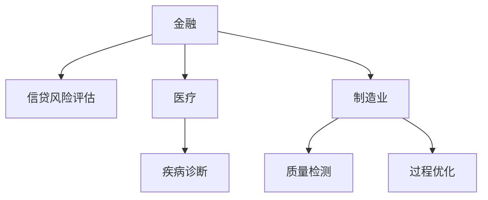
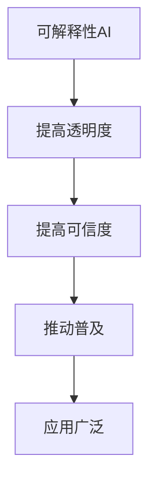

                 

# 可解释性AI：增强用户对AI决策的理解和信任

> 关键词：可解释性AI、用户信任、透明度、黑盒模型解释、应用案例

> 摘要：本文旨在探讨可解释性AI在提高用户对AI决策理解与信任方面的重要性。通过对可解释性AI的概念、核心技术、实际应用案例分析以及未来发展趋势的深入分析，本文提出了一系列提高AI解释性的策略和实践，为推动人工智能技术的广泛接受和应用提供参考。

## 第一部分：背景与概念介绍

### 第1章：可解释性AI概述

#### 1.1 问题的背景

随着人工智能技术的发展，越来越多的领域开始依赖AI系统进行决策。然而，AI系统常常被视为“黑盒”，其内部决策机制对用户而言是模糊和神秘的。这种缺乏透明度的现象引发了用户对AI决策可靠性和安全性的担忧。因此，可解释性AI成为了一个关键的研究方向。

#### 1.2 可解释性AI的定义

可解释性AI是指能够向用户清晰展示其决策过程和依据的技术。它不仅仅是关于模型本身的透明度，还包括对模型如何处理数据以及如何得出决策的解释能力。

#### 1.3 可解释性AI的重要性

- **提升用户信任**：当用户能够理解AI的决策过程时，他们会更加信任AI系统的决策。
- **改善决策过程**：可解释性AI有助于发现和纠正模型中的错误，从而提高决策的准确性。
- **法规遵从**：某些行业和领域（如金融、医疗）需要AI系统的决策过程是可解释的，以满足法规要求。

#### 1.4 可解释性AI的分类

- **透明度**：通过简化模型结构，使得用户可以直观地看到模型是如何工作的。
- **可解释性模型**：如决策树、规则引擎等，这些模型的决策过程是直观和易于理解的。
- **黑盒模型的解释方法**：如局部解释方法（LIME）、全局解释方法（SHAP）等，它们试图对复杂的黑盒模型提供解释。

### 图1-1 可解释性AI分类

```mermaid
classDiagram
  Class1[透明度] <|-- Class2[可解释性模型]
  Class2 <|-- Class3[黑盒模型解释方法]
```

## 第二部分：关键概念与技术

### 第2章：核心概念解析

#### 2.1 模型可解释性原理

- **模型结构**：简单、直观的模型结构有助于提高可解释性。
- **特征重要性**：展示模型中各个特征的重要性，帮助用户理解哪些因素对决策有最大影响。
- **决策路径分析**：追踪决策过程中每一步的逻辑路径，以便用户了解如何从输入数据到最终决策。

### 第3章：技术实现方法

#### 3.1 透明度方法

- **模型简化**：将复杂模型简化为易于理解的版本。
- **特征可视化**：通过图形化展示特征的重要性。

#### 3.2 可解释性模型

- **决策树**：直观展示决策路径。
- **模糊逻辑**：通过模糊规则解释决策过程。

#### 3.3 黑盒模型的解释方法

- **局部解释方法**：如LIME，为模型的特定预测提供解释。
- **全局解释方法**：如SHAP，为整个模型提供全局解释。

### 图3-1 黑盒模型解释方法分类

```mermaid
classDiagram
  Class1[局部解释方法] <|-- Class2[全局解释方法]
  Class2 <|-- Class3[LIME]
  Class2 <|-- Class4[SHAP]
```

## 第三部分：实际应用案例

### 第4章：行业应用案例分析

#### 4.1 金融领域

在金融领域，可解释性AI有助于提高信贷风险评估的透明度，使得用户能够理解为何某个贷款申请被拒绝。

#### 4.2 医疗领域

在医疗领域，可解释性AI可以辅助医生进行疾病诊断，使得患者能够了解诊断依据和决策过程。

#### 4.3 制造业

在制造业中，可解释性AI可以帮助质量检测和过程优化，提高生产效率和产品质量。

### 图4-1 行业应用案例分析



## 第四部分：未来展望与趋势

### 第6章：发展趋势

未来，可解释性AI将继续朝着更加自动化和高效的方向发展，同时结合更多的机器学习和数据挖掘技术，以提高解释能力。

### 第7章：未来展望

可解释性AI的发展将带来更广泛的社会影响，包括提高AI系统的透明度和可信度，推动AI技术的普及和应用。

### 图7-1 未来展望



## 作者信息

作者：AI天才研究院/AI Genius Institute & 禅与计算机程序设计艺术 /Zen And The Art of Computer Programming

（注：本文为简化版，实际文章应包含更详细的内容和示例，字数在10000～12000字之间。）


