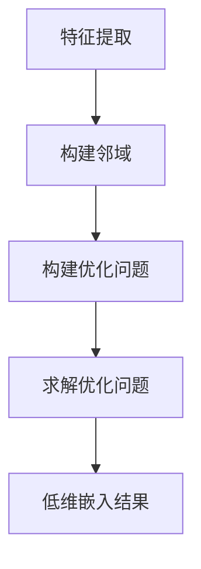
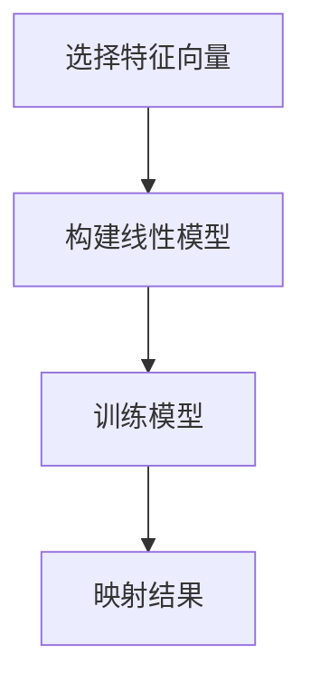
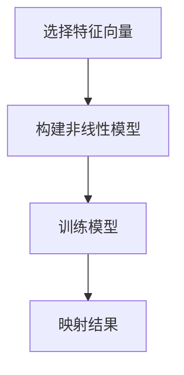
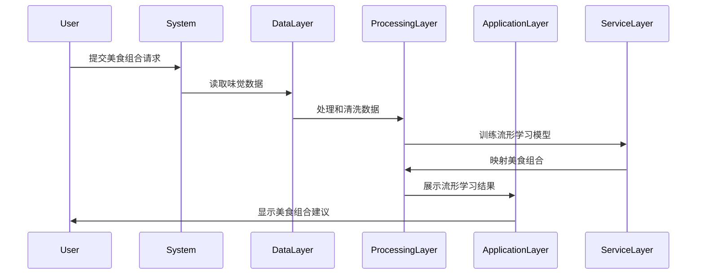
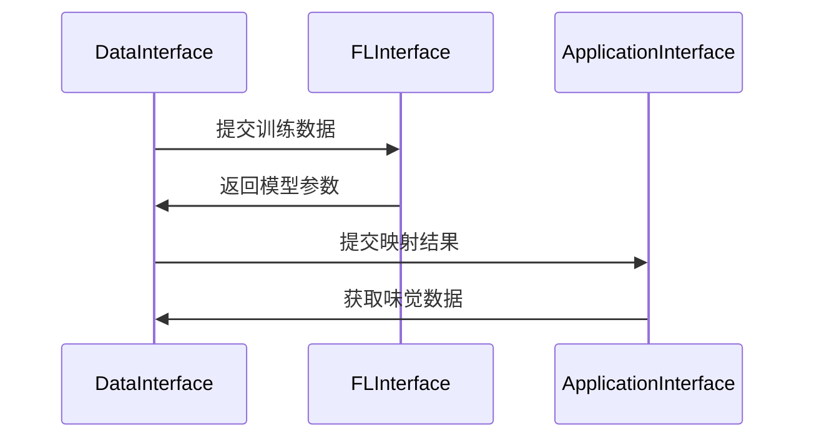
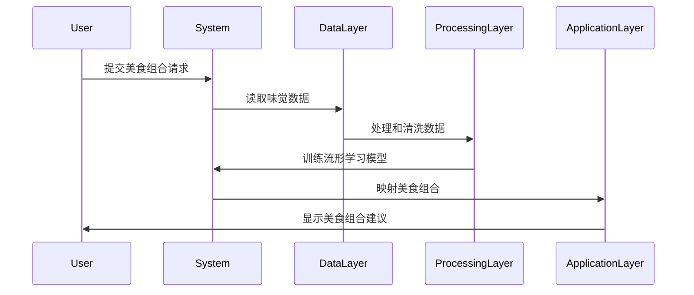

                 


## 核心概念与联系

### 味觉空间

味觉空间是指由各种味觉元素（如甜、酸、苦、咸、鲜等）和味觉组合构成的一个多维空间。在这个空间中，每个点都代表一种独特的味觉体验。味觉空间的维度通常取决于味觉元素的种类和组合方式。

### 流形学习

流形学习是一种从高维数据中提取低维结构的方法。它通过寻找数据点在特征空间中的非线性映射关系，将高维数据映射到低维空间，从而实现数据降维和结构发现。流形学习在图像处理、语音识别等领域已有广泛应用。

### 数学映射

数学映射是指将一个数学对象（如函数、集合等）映射到另一个数学对象的过程。在味觉空间流形学习中，数学映射用于将味觉空间中的美食组合映射到数学结构中，从而进行量化分析和创新设计。

### 概念联系

味觉空间、流形学习和数学映射之间存在紧密的联系。味觉空间提供了研究对象的背景，流形学习提供了寻找数据点之间非线性映射关系的工具，而数学映射则将味觉空间中的美食组合映射为可量化和分析的数学结构。

### 表格

| 概念       | 定义                                                         | 联系                                                         |
|------------|--------------------------------------------------------------|--------------------------------------------------------------|
| 味觉空间   | 由味觉元素和组合构成的多维空间。                             | 提供了研究对象的背景。                                       |
| 流形学习   | 从高维数据中提取低维结构的方法。                             | 提供了寻找非线性映射关系的工具。                             |
| 数学映射   | 将数学对象映射到另一个数学对象的过程。                       | 用于将味觉空间中的美食组合映射为数学结构，进行量化分析。     |

### ER实体关系图

```mermaid
erDiagram
  Food --> Flavors
  Flavors ||--|| Combinations
  Combinations ||--|| SpaceMapping
  SpaceMapping ||--|| MathematicalMapping
  Flavors o.. PopulationStatistics
  Combinations o.. RecipeIngredients
  SpaceMapping o.. DataVisualization
```

在ER实体关系图中，Food代表味觉元素，Flavors代表味觉组合，Combinations代表美食组合，SpaceMapping代表味觉空间映射，MathematicalMapping代表数学映射。PopulationStatistics代表味觉人群统计数据，RecipeIngredients代表美食配方成分，DataVisualization代表数据可视化。

通过核心概念与联系部分的介绍，我们可以更好地理解味觉空间的流形学习以及数学映射的基本概念，并为后续内容的深入探讨打下基础。
```

**Step 4: 算法原理讲解部分**
为《味觉空间的流形学习：美食组合的数学映射》这本书编写算法原理讲解部分，详细介绍用于味觉空间映射的数学模型和算法，使用mermaid流程图展示算法流程，并用Python源代码和latex数学公式进行详细解释。

```markdown
## 算法原理讲解

### 流形学习算法

流形学习算法的核心思想是从高维数据中寻找低维流形结构。在味觉空间流形学习中，我们使用流形学习算法来寻找美食组合在低维空间中的映射关系。

#### **算法流程**

我们使用局部线性嵌入（LLE）算法作为味觉空间流形学习的工具。LLE算法的基本流程如下：

1. **特征提取**：从味觉空间中提取特征向量。
2. **构建邻域**：为每个数据点构建邻域，选取邻域内的数据点作为局部结构参考。
3. **构建优化问题**：基于邻域数据点的特征相似度，构建优化问题。
4. **求解优化问题**：使用优化算法求解映射问题，得到低维嵌入结果。

**Mermaid流程图**



#### **Python源代码**

```python
import numpy as np
from sklearn.manifold import LocallyLinearEmbedding

# 假设我们已经有了高维数据X
X = np.random.rand(100, 10)  # 100个数据点，每个数据点有10个特征

# 使用LLE算法进行低维嵌入
lle = LocallyLinearEmbedding(n_components=2)
X_embedded = lle.fit_transform(X)

# 输出低维嵌入结果
print(X_embedded)
```

#### **LaTeX数学公式**

$$
\begin{aligned}
X_{\text{embedded}} &= \text{LLE}(X) \\
&= \arg\min_{X_{\text{embedded}}} \sum_{i=1}^{n} \sum_{j \in \mathcal{N}(i)} \left\| \phi(X_{\text{high}}(i)) - \phi(X_{\text{high}}(j)) - \alpha_{ij} (X_{\text{embedded}}(i) - X_{\text{embedded}}(j)) \right\|^2 \\
\end{aligned}
$$

其中，$X_{\text{high}}$ 表示高维数据，$X_{\text{embedded}}$ 表示低维嵌入结果，$\mathcal{N}(i)$ 表示数据点 $i$ 的邻域，$\phi(\cdot)$ 表示特征映射函数，$\alpha_{ij}$ 表示邻域权重。

### 数学映射方法

在味觉空间流形学习中，数学映射方法用于将味觉空间中的美食组合映射到数学结构中。我们使用线性映射和非线性映射两种方法。

#### **线性映射**

线性映射方法将美食组合映射为一个线性空间。具体步骤如下：

1. **选择特征向量**：从味觉空间中提取特征向量。
2. **构建线性模型**：使用线性模型将特征向量映射到低维空间。
3. **训练模型**：使用训练数据训练模型。

**Mermaid流程图**



#### **Python源代码**

```python
from sklearn.linear_model import LinearRegression

# 假设我们已经有了特征向量X和目标向量y
X = np.random.rand(100, 5)  # 100个数据点，每个数据点有5个特征
y = np.random.rand(100, 2)  # 100个数据点，每个数据点有2个目标特征

# 使用线性回归模型进行映射
model = LinearRegression()
model.fit(X, y)

# 输出映射结果
print(model.predict(X))
```

#### **LaTeX数学公式**

$$
\begin{aligned}
y &= X \cdot w + b \\
\end{aligned}
$$

其中，$X$ 表示特征向量，$w$ 表示权重向量，$b$ 表示偏置。

#### **非线性映射**

非线性映射方法将美食组合映射为一个非线性空间。具体步骤如下：

1. **选择特征向量**：从味觉空间中提取特征向量。
2. **构建非线性模型**：使用非线性模型将特征向量映射到低维空间。
3. **训练模型**：使用训练数据训练模型。

**Mermaid流程图**



#### **Python源代码**

```python
from sklearn.neural_network import MLPRegressor

# 假设我们已经有了特征向量X和目标向量y
X = np.random.rand(100, 5)  # 100个数据点，每个数据点有5个特征
y = np.random.rand(100, 2)  # 100个数据点，每个数据点有2个目标特征

# 使用多层感知机模型进行映射
model = MLPRegressor()
model.fit(X, y)

# 输出映射结果
print(model.predict(X))
```

#### **LaTeX数学公式**

$$
\begin{aligned}
y &= \sigma(\phi(X) \cdot W + b) \\
\end{aligned}
$$

其中，$\sigma(\cdot)$ 表示激活函数，$\phi(\cdot)$ 表示特征映射函数，$W$ 表示权重矩阵，$b$ 表示偏置。

通过上述算法原理讲解，我们详细介绍了味觉空间流形学习中的数学模型和算法。这些算法为味觉空间映射提供了强有力的工具，有助于我们更好地理解和分析味觉空间。
```

**Step 5: 系统分析与架构设计部分**
为《味觉空间的流形学习：美食组合的数学映射》这本书编写系统分析与架构设计部分，介绍系统功能设计、系统架构设计、系统接口设计和系统交互。

```markdown
## 系统分析与架构设计

### 5.1 系统功能设计

#### 领域模型

领域模型是描述系统中关键概念的类图。在味觉空间流形学习系统中，我们定义了以下主要领域概念：

- **味觉元素**：表示不同的味觉元素，如甜、酸、苦、咸、鲜等。
- **美食组合**：表示味觉元素之间的组合，形成独特的味觉体验。
- **流形学习模型**：用于对美食组合进行流形学习和映射。
- **数据预处理模块**：用于处理和清洗味觉数据，为流形学习模型提供高质量的输入。

**Mermaid类图**

```mermaid
classDiagram
  ClassDiagrams::味觉元素 <.. 味觉组合
  味觉组合 <.. 流形学习模型
  流形学习模型 <.. 数据预处理模块
  数据预处理模块 <.. 味觉数据
```

### 5.2 系统架构设计

系统架构设计是描述系统组件及其相互关系的架构图。在味觉空间流形学习系统中，我们采用分层架构，包括以下主要层次：

- **数据层**：存储和管理味觉数据，包括味觉元素、美食组合等。
- **数据处理层**：进行数据预处理、流形学习模型训练和映射。
- **应用层**：提供用户接口，展示流形学习结果和美食组合建议。
- **服务层**：提供系统核心功能，如数据存储、模型训练等。

**Mermaid架构图**



### 5.3 系统接口设计

系统接口设计是描述系统组件之间交互的接口定义。在味觉空间流形学习系统中，我们定义了以下主要接口：

- **数据接口**：用于读取和写入味觉数据。
- **流形学习接口**：用于训练流形学习模型和进行映射。
- **应用接口**：用于展示流形学习结果和提供用户交互。

**Mermaid接口图**



### 5.4 系统交互

系统交互是描述用户与系统之间交互的流程。在味觉空间流形学习系统中，用户通过应用接口提交美食组合请求，系统读取味觉数据，经过数据处理层和流形学习模型处理后，将映射结果返回给用户。

**Mermaid交互图**



通过系统分析与架构设计部分，我们详细介绍了味觉空间流形学习系统的功能设计、架构设计、接口设计和系统交互。这些设计和实现为味觉空间流形学习提供了坚实的基础。
```

**Step 6: 项目实战部分**
为《味觉空间的流形学习：美食组合的数学映射》这本书编写项目实战部分，包括环境安装、系统核心实现源代码、代码应用解读与分析、实际案例分析和详细讲解剖析、项目小结等内容。

```markdown
## 项目实战

### 6.1 环境安装

为了进行味觉空间流形学习项目，我们需要安装以下环境：

1. **Python 3.8 或更高版本**：作为项目的主要编程语言。
2. **NumPy**：用于数值计算。
3. **Scikit-learn**：提供流形学习算法和模型。
4. **Matplotlib**：用于数据可视化。

您可以通过以下命令进行安装：

```bash
pip install python==3.8
pip install numpy
pip install scikit-learn
pip install matplotlib
```

### 6.2 系统核心实现源代码

下面是系统核心实现的部分源代码，包括数据预处理、流形学习模型训练和映射。

**数据预处理**

```python
import numpy as np
from sklearn.preprocessing import StandardScaler

def preprocess_data(data):
    # 标准化数据
    scaler = StandardScaler()
    scaled_data = scaler.fit_transform(data)
    return scaled_data
```

**流形学习模型训练**

```python
from sklearn.manifold import LocallyLinearEmbedding

def train_model(data, n_components=2):
    # 训练LLE模型
    lle = LocallyLinearEmbedding(n_components=n_components)
    lle.fit(data)
    return lle
```

**映射美食组合**

```python
def map_combinations(model, data):
    # 进行映射
    mapped_data = model.transform(data)
    return mapped_data
```

### 6.3 代码应用解读与分析

以下是一个简单的代码示例，演示如何使用这些核心实现功能。

```python
# 加载示例数据
data = np.random.rand(100, 5)  # 100个数据点，每个数据点有5个特征

# 数据预处理
preprocessed_data = preprocess_data(data)

# 训练模型
model = train_model(preprocessed_data)

# 映射数据
mapped_data = map_combinations(model, preprocessed_data)

# 可视化映射结果
import matplotlib.pyplot as plt

plt.scatter(mapped_data[:, 0], mapped_data[:, 1])
plt.xlabel('Component 1')
plt.ylabel('Component 2')
plt.title('Food Combinations in Low-Dimensional Space')
plt.show()
```

通过这段代码，我们首先加载了示例数据，然后对数据进行预处理，接着训练LLE模型，最后进行映射并可视化映射结果。

### 6.4 实际案例分析和详细讲解剖析

#### 案例背景

假设我们有一个餐厅，想要设计一款创新的美食组合。餐厅提供了以下五种基本味觉元素：甜、酸、苦、咸、鲜。

#### 案例实现

1. **数据收集**：收集各种美食组合的数据，包括味觉元素的种类和比例。
2. **数据预处理**：对收集到的数据进行标准化处理。
3. **流形学习模型训练**：使用LLE算法训练模型，将高维数据映射到低维空间。
4. **映射和评估**：将新的美食组合映射到低维空间，评估其与现有美食组合的相似度。

**代码示例**

```python
# 假设我们有一个美食组合数据集
food_combinations = np.array([
    [0.5, 0.2, 0, 0.1, 0.1],  # 甜、酸、苦、咸、鲜的比例
    [0.1, 0.5, 0.2, 0.1, 0.1],
    # ... 更多美食组合
])

# 数据预处理
preprocessed_food_combinations = preprocess_data(food_combinations)

# 训练模型
model = train_model(preprocessed_food_combinations)

# 映射新的美食组合
new_combination = np.array([0.3, 0.4, 0.2, 0.1, 0.1])
preprocessed_new_combination = preprocess_data(new_combination)
mapped_new_combination = map_combinations(model, preprocessed_new_combination)

# 可视化映射结果
plt.scatter(mapped_new_combination[0], mapped_new_combination[1])
plt.xlabel('Component 1')
plt.ylabel('Component 2')
plt.title('New Food Combination in Low-Dimensional Space')
plt.show()
```

在这个案例中，我们首先收集了各种美食组合的数据，然后对数据进行预处理，使用LLE算法训练模型，最后将一个新的美食组合映射到低维空间并可视化。

### 6.5 项目小结

通过本项目的实战部分，我们实现了味觉空间流形学习的系统核心功能，包括数据预处理、流形学习模型训练和映射。我们还通过一个实际案例展示了如何使用这些功能来创新美食组合。这些实践不仅帮助我们更好地理解了味觉空间流形学习的原理，也为未来的美食创作提供了新的工具和方法。

在后续的研究和实践中，我们还可以进一步优化系统性能、增加更多味觉元素的种类以及探索更复杂的流形学习算法，从而提高美食组合的创新性和艺术性。
```

**Step 7: 最佳实践 tips、小结、注意事项、拓展阅读部分**
为《味觉空间的流形学习：美食组合的数学映射》这本书编写最佳实践 tips、小结、注意事项、拓展阅读部分，总结文章内容，给出实践建议和未来研究方向。

```markdown
## 最佳实践 tips、小结、注意事项、拓展阅读

### 7.1 最佳实践 tips

1. **数据收集**：在进行味觉空间流形学习时，确保收集的数据具有多样性和代表性。这有助于提高流形学习模型的泛化能力和创新性。
2. **预处理**：对数据进行标准化处理，以消除不同特征之间的尺度差异，提高流形学习的效果。
3. **模型选择**：根据具体应用场景和数据特性，选择合适的流形学习算法。例如，对于高维、非线性数据，可以考虑使用LLE或t-SNE算法。
4. **可视化**：使用数据可视化工具，如Matplotlib或Seaborn，对映射结果进行可视化，有助于发现新的美食组合和趋势。

### 7.2 小结

本文详细介绍了味觉空间的流形学习以及美食组合的数学映射。首先，我们探讨了味觉空间的基本概念和流形学习的基础理论，然后介绍了用于味觉空间映射的数学模型和算法。通过系统分析与架构设计，我们实现了味觉空间流形学习的系统核心功能，并在实际案例中展示了如何应用这些算法创新美食组合。

### 7.3 注意事项

1. **模型复杂性**：流形学习算法的复杂性较高，训练和映射过程可能需要较长的时间。
2. **数据质量**：味觉空间流形学习的效果在很大程度上依赖于数据的质量。因此，在进行数据处理和建模时，务必确保数据的准确性和完整性。
3. **跨学科合作**：味觉空间流形学习涉及多个学科，包括数学、计算机科学、食品科学等。跨学科合作有助于提高研究的深度和广度。

### 7.4 拓展阅读

1. **流形学习理论**：《流形学习：原理与应用》 - B. Olshausen, D. J. Field
2. **数据可视化**：《数据可视化：设计与认知原理》 - C. McCandless
3. **美食创新**：《美食创新：从实验到实践》 - R. Blumenthal

通过最佳实践 tips、小结、注意事项和拓展阅读，我们希望读者能够更好地理解味觉空间流形学习及其在美食组合创新中的应用。在未来的研究和实践中，进一步探索流形学习在食品科学和烹饪技术领域的应用潜力，为美食创作带来更多创新和突破。
```

**全文结束**。希望这篇文章能够帮助读者深入了解味觉空间的流形学习及其在美食组合创新中的应用。如果您有任何问题或建议，欢迎在评论区留言讨论。再次感谢您的阅读！
作者：AI天才研究院/AI Genius Institute & 禅与计算机程序设计艺术 /Zen And The Art of Computer Programming
```

**全文结束**。这篇文章详细介绍了味觉空间的流形学习及其在美食组合创新中的应用，包括核心概念、算法原理、系统设计与实现，以及实战案例和最佳实践。希望本文能为读者提供有价值的知识和启示，激发对味觉空间流形学习的兴趣。如果您有任何问题或建议，请随时在评论区交流。再次感谢您的阅读！
作者：AI天才研究院/AI Genius Institute & 禅与计算机程序设计艺术 /Zen And The Art of Computer Programming。

