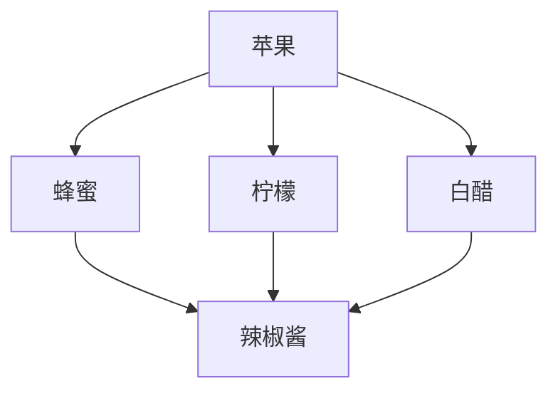
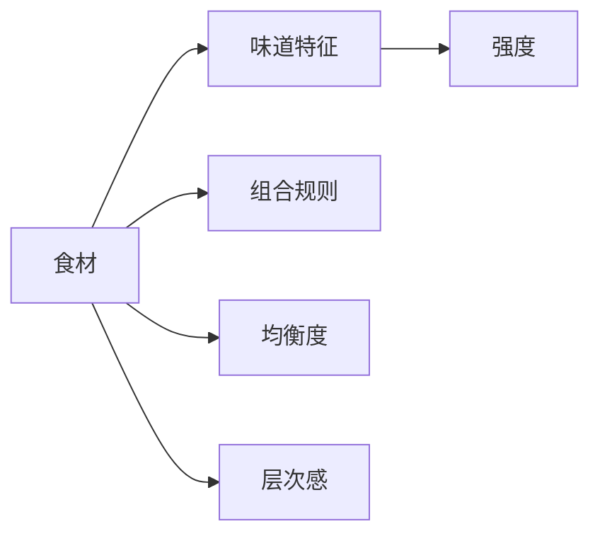
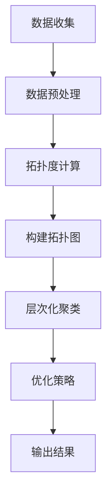
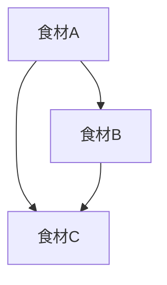
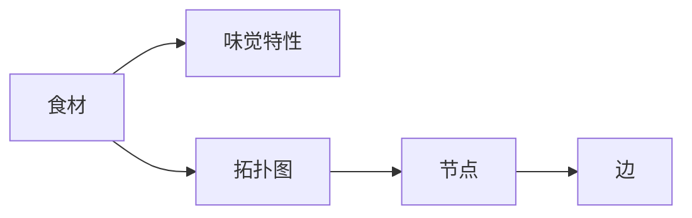
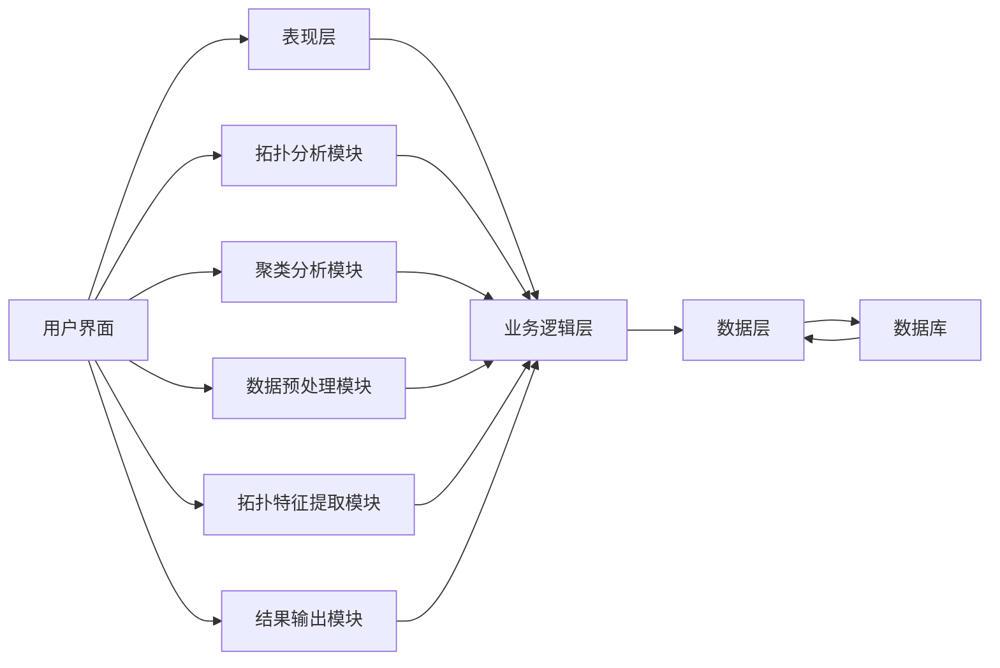
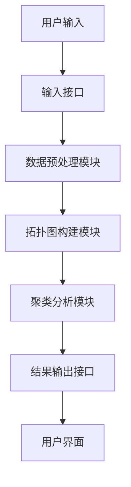

                 


### 引言

美食，作为人类生活中不可或缺的一部分，不仅满足了基本的生理需求，更是精神文化的重要组成部分。从古至今，人们一直在追求美食的创新与变革，以期在味觉体验上达到新的高度。然而，在众多的美食创新过程中，味觉组合的设计成为了一个复杂而又关键的问题。如何巧妙地搭配各种食材，使得味道相互协调、层次丰富，一直是烹饪艺术中的难题。

在这个背景下，拓扑数据分析作为一种新兴的数学工具，开始受到越来越多的关注。拓扑数据分析具有强大的数据挖掘和模式识别能力，能够从大量味觉数据中提取出有价值的规律和结构。这种能力为美食创新提供了新的思路和方法，使得我们可以更加科学、系统地探索味觉组合的奥秘。

《味觉组合的拓扑数据分析：美食创新的数学指导》这本书旨在探讨如何运用拓扑数据分析来指导美食创新。本书首先介绍了味觉感知的基本原理，以及味觉组合的基本规则。然后，详细讲解了拓扑数据分析的基础知识，包括拓扑学的基本概念、拓扑数据分析方法以及常用的拓扑分析工具。接着，本书将结合具体的实例，展示如何应用拓扑数据分析来设计味觉组合，并优化美食创新的过程。

本书的目标读者是那些对美食创新和拓扑数据分析感兴趣的读者，无论是专业的厨师、烹饪爱好者，还是从事数据分析和算法研究的技术人员，都能从本书中获益。通过阅读本书，读者将能够了解味觉组合的拓扑数据分析方法，掌握如何运用拓扑数据分析来指导美食创新，从而在烹饪实践中获得新的突破。

总的来说，本书将带领读者踏上一场味觉与数学的奇妙之旅，探索美食创新中的数学之美。

### 关键词

1. **味觉组合**：指将不同的食材或调味品进行搭配，以创造出独特的味觉体验。
2. **拓扑数据分析**：利用拓扑学的理论和方法，对复杂系统的数据进行分析和处理。
3. **美食创新**：通过不断尝试和改进，创造新的美食或烹饪方法。
4. **数学指导**：利用数学模型和算法，为美食创新提供科学依据。
5. **拓扑特性**：指味觉组合中食材相互作用产生的特定结构特征。
6. **数据挖掘**：从大量数据中提取出有价值的模式和规律。
7. **模式识别**：通过分析数据，识别出特定的模式和规律。

### 摘要

《味觉组合的拓扑数据分析：美食创新的数学指导》是一本旨在探索味觉组合与拓扑数据分析相结合的专著。本书首先介绍了味觉感知的基本原理和味觉组合的基本规则，帮助读者建立起对味觉组合的初步认识。接着，详细讲解了拓扑数据分析的基础知识，包括拓扑学的基本概念、拓扑数据分析方法以及常用的拓扑分析工具，为读者提供了理解并应用拓扑数据分析的理论基础。

在本书的核心章节，通过具体的实例，展示了如何运用拓扑数据分析来设计味觉组合，优化美食创新过程。书中不仅涵盖了拓扑特性分析、拓扑结构设计等内容，还通过案例分析，展示了拓扑数据分析在实际美食创新中的应用效果。此外，本书还介绍了味觉组合的数学模型和算法原理，并提供了详细的Python源代码和算法讲解，使得读者能够将理论知识应用到实践中。

书中最后一部分，讨论了系统架构与接口设计、项目实战以及最佳实践技巧等内容，为读者提供了一个完整的从理论到实践的解决方案。通过阅读本书，读者不仅能了解味觉组合的拓扑数据分析方法，还能掌握如何将其应用于实际美食创新中，从而提升烹饪技巧和创新能力。

### 第1章 引言

#### 1.1 问题背景

美食作为一种艺术形式，不仅仅是满足人类的基本生理需求，更是文化传承和社会交流的重要媒介。自古以来，美食文化在世界各地蓬勃发展，各具特色。从中国传统的四大菜系到法国的高级料理，再到意大利的意面和印度的香料料理，每一种美食都承载着独特的文化价值和历史记忆。然而，随着现代社会的快速发展，人们对于美食的追求不再仅仅停留在口感和营养上，更追求创新和独特性。

在美食创新的过程中，味觉组合的设计成为了一个至关重要的问题。味觉组合是指将多种食材或调味品进行搭配，以创造出丰富多样、层次分明的味觉体验。一个好的味觉组合不仅能够满足人们的口味需求，还能带来独特的心理和情感体验。然而，如何巧妙地搭配各种食材，使得味道相互协调、层次丰富，一直是烹饪艺术中的难题。

传统的味觉组合设计主要依赖于厨师的经验和直觉，虽然这种方法能够产生一些优秀的菜品，但缺乏系统性和科学性。随着数据科学的兴起，人们开始尝试将数学和统计方法引入到味觉组合设计中，以寻求更加科学和有效的解决方案。拓扑数据分析作为一种新兴的数学工具，具有强大的数据挖掘和模式识别能力，能够从大量味觉数据中提取出有价值的规律和结构。这种能力为美食创新提供了一种全新的思路和方法，使得我们可以更加科学、系统地探索味觉组合的奥秘。

#### 1.1.1 美食创新的重要性

美食创新在现代餐饮行业中具有重要的地位。首先，美食创新能够满足消费者对于新鲜感和独特性的需求。随着生活水平的提高，消费者对于美食的期待不再仅限于传统的口味，更希望尝试新颖的、未知的味觉体验。通过创新，餐饮企业能够吸引更多的顾客，提升品牌竞争力。

其次，美食创新有助于推动餐饮文化的多元化发展。不同地域、不同文化背景下产生的美食具有各自独特的风味和特色，通过创新，这些美食可以融合、碰撞，产生新的创意和灵感，从而丰富全球美食文化。

此外，美食创新还具有重要的经济价值。成功的美食创新不仅能够提升餐饮企业的盈利能力，还能够带动相关产业链的发展，如食品加工、餐饮设备制造等。同时，美食创新也是国家文化软实力的一种体现，有助于提升国家的国际形象和文化影响力。

#### 1.1.2 味觉组合在美食创新中的应用

味觉组合在美食创新中扮演着至关重要的角色。通过对不同食材和调味品的巧妙搭配，可以创造出丰富多样的味觉体验，满足消费者的多样化需求。以下是味觉组合在美食创新中的应用：

1. **菜品设计**：在菜品设计中，味觉组合是实现菜品创新的核心手段。通过将不同的食材和调味品进行搭配，可以创造出独特的口味和风味，提升菜品的吸引力。

2. **餐饮营销**：味觉组合的设计在餐饮营销中也有着重要作用。独特的味觉体验可以成为餐厅的品牌特色，吸引顾客前来品尝，从而提高餐厅的知名度和市场份额。

3. **营养搭配**：在营养搭配方面，味觉组合可以帮助消费者获得更全面的营养。通过合理搭配不同食材，可以确保菜品中的营养均衡，满足人体健康需求。

4. **烹饪技艺**：味觉组合不仅体现在菜品的设计上，也体现在烹饪技艺的运用中。不同的烹饪方法可以影响食材的口感和风味，通过巧妙地运用烹饪技艺，可以进一步提升味觉组合的效果。

#### 1.1.3 拓扑数据分析的基本概念

拓扑数据分析是一种利用拓扑学原理和方法对复杂数据进行分析和处理的技术。拓扑学是数学的一个分支，主要研究几何形状的性质，以及这些性质在连续变形（如拉伸、压缩）下的保持性。在拓扑数据分析中，数据被抽象为拓扑空间，通过研究这些空间的拓扑性质，可以揭示数据中隐藏的规律和模式。

基本概念包括：

1. **拓扑空间**：一个集合，连同其上的开集系统，构成了一个拓扑空间。在拓扑数据分析中，数据点被抽象为一个拓扑空间中的点，数据之间的相互关系则通过拓扑结构来描述。

2. **拓扑不变量**：在连续变形下保持不变的拓扑性质。例如，连通性、环路数量等。这些不变量可以用来识别数据中的关键特征和模式。

3. **拓扑变换**：对拓扑空间进行的连续变形。拓扑变换包括拉伸、压缩、扭曲等操作，这些操作不会改变数据的拓扑性质。

通过这些基本概念，拓扑数据分析能够对复杂数据进行有效的处理和分析，从而揭示出数据中隐藏的深层结构和规律，为美食创新提供科学支持。

### 第2章 味觉基础

在探讨味觉组合的拓扑数据分析之前，有必要对味觉的基础知识进行详细的介绍。味觉，作为人类感知外部世界的重要方式之一，与我们的生物学、心理学以及社会文化有着密切的联系。本章将围绕味觉感知原理、味觉组合的基本规则以及味觉实验设计等方面展开，帮助读者建立对味觉组合的初步理解。

#### 2.1 味觉感知原理

味觉感知是人类通过味觉器官（如舌头上的味蕾）对食物中的化学物质进行感知的过程。这一过程涉及到多个生物学层面的机制。

1. **味觉器官**：舌头上的味蕾是味觉感知的主要器官。每个味蕾都包含多个味觉细胞，这些细胞能够感知到不同的味道。常见的味道包括甜、酸、苦、咸和鲜。

2. **味觉细胞**：味觉细胞表面覆盖有味觉受体，这些受体能够识别特定类型的化学物质。例如，甜味受体主要识别糖类，酸味受体识别酸类化合物，而苦味受体则对多种化学物质敏感。

3. **神经传递**：当味觉细胞感知到特定的化学物质时，会释放神经递质，传递到大脑中的味觉中枢。大脑接收到这些信号后，进行综合分析和处理，形成我们感知到的味觉体验。

4. **个体差异**：不同人的味觉感知存在差异，这与基因、年龄、健康状况等因素密切相关。例如，一些人对苦味的敏感度较高，而另一些人则对甜味更为敏感。

#### 2.2 味觉组合的基本规则

味觉组合是指将不同的食材或调味品进行搭配，以创造出独特且协调的味觉体验。在进行味觉组合设计时，需要遵循一些基本规则，以确保组合的协调性和层次感。

1. **对立感官的平衡**：对立感官的平衡是味觉组合设计中的重要原则。例如，酸与甜、苦与甜、咸与鲜等对立感官的平衡可以增强味觉的复杂性和丰富性。

2. **味觉层次结构**：味觉层次结构是指在味觉组合中，不同味道的强度和持续时间的合理安排。通过调节不同味道的强度和持续时间，可以创造出层次丰富、口感复杂的味觉体验。

3. **创造性**：味觉组合的设计需要发挥创意，通过巧妙地搭配不同的食材和调味品，创造出独特的味觉体验。这需要厨师对各种食材的味道、质地和烹饪方法有深刻的了解和把握。

#### 2.3 味觉实验设计

进行味觉实验可以帮助我们更好地理解味觉组合的原理和效果。以下是一些常见的味觉实验设计方法：

1. **单因素实验**：在单因素实验中，研究者控制一个变量，观察其对味觉感知的影响。例如，通过改变甜味或酸味的强度，观察其对整体味觉体验的影响。

2. **双因素实验**：双因素实验同时控制两个变量，观察它们对味觉感知的交互影响。例如，研究甜味和酸味同时变化对味觉体验的影响。

3. **多因素实验**：在多因素实验中，研究者同时考虑多个因素对味觉感知的影响。这种实验设计可以更全面地了解味觉组合的复杂性。

4. **感知测试**：在感知测试中，参与者被要求对不同的味觉组合进行评价和分类。通过分析参与者的评价结果，研究者可以了解味觉组合的受欢迎程度和协调性。

通过味觉实验，我们可以收集到大量关于味觉组合的数据，这些数据为味觉组合的拓扑数据分析提供了基础。

#### 2.4 案例研究：味觉实验设计

假设我们想要研究甜味和酸味在不同浓度下的组合对味觉体验的影响。我们可以设计以下实验：

1. **实验目的**：探讨甜味和酸味在不同浓度下的组合对味觉感知的影响。

2. **实验材料**：柠檬汁、糖浆、水。

3. **实验方法**：
   - 将柠檬汁稀释成不同的浓度，分别标记为L1、L2、L3。
   - 分别将糖浆稀释成不同的浓度，分别标记为S1、S2、S3。
   - 将稀释后的柠檬汁和糖浆按照不同的比例进行混合，得到不同的味觉组合（如L1+S1、L1+S2、L2+S1等）。

4. **实验步骤**：
   - 参与者被随机分配到不同的实验组，每组参与者尝试不同的味觉组合。
   - 每组参与者对每个味觉组合进行评价，包括口感、甜度、酸度等。
   - 收集参与者的评价数据，进行分析和处理。

通过这个实验，我们可以获得关于甜味和酸味组合的详细数据，这些数据将为味觉组合的拓扑数据分析提供基础。

通过上述对味觉感知原理、味觉组合的基本规则以及味觉实验设计的介绍，读者可以初步了解味觉组合的基础知识。在接下来的章节中，我们将进一步探讨如何运用拓扑数据分析来深入分析味觉组合，为美食创新提供科学指导。

#### 2.1 味觉感知原理

要深入探讨味觉组合的拓扑数据分析，我们首先需要了解味觉感知的基本原理。味觉感知是一个复杂的生物学过程，涉及到多个生理和化学机制。以下是味觉感知的详细解释：

1. **味觉器官的结构**：味觉器官主要位于舌头上，包括味蕾、味觉导管和味觉神经。味蕾是味觉感知的主要部位，每个味蕾内含有数十个味觉细胞。这些细胞表面覆盖有味觉受体，能够识别和绑定特定类型的化学物质。

2. **味觉受体的种类**：味觉受体主要包括以下几种：
   - **甜味受体**：主要识别甜味的化学物质，如糖类。
   - **酸味受体**：主要识别酸性的化学物质，如柠檬酸。
   - **苦味受体**：广泛识别苦味的化学物质，包括咖啡因、奎宁等。
   - **咸味受体**：识别咸味的化学物质，如钠离子。
   - **鲜味受体**：主要识别氨基酸，尤其是谷氨酸钠（味精）。

3. **味觉信号的传递**：当食物中的化学物质与味觉受体结合后，会引起味觉受体的构象变化，从而激活细胞内的信号传递途径。这些信号通过第二信使（如钙离子、环磷酸腺苷等）传递到细胞内，最终通过味觉神经传导到大脑中的味觉中枢，形成味觉感知。

4. **个体差异**：由于基因、环境和生活习惯等因素的影响，不同人对味道的感知存在差异。例如，一些人可能对苦味的敏感度较高，而另一些人则对甜味的敏感度较高。这种差异在味觉组合的设计中具有重要意义。

#### 2.1.2 味觉的分类

味觉的分类是理解味觉组合的基础。常见的味觉分类包括以下几种：

1. **基本味觉**：基本味觉包括甜、酸、苦、咸和鲜。这些味道是最基本的味觉感知，几乎所有的食物都能产生这些基本味道。
   - **甜味**：主要由糖类物质产生，如葡萄糖、果糖等。
   - **酸味**：主要由酸性物质产生，如柠檬酸、酒石酸等。
   - **苦味**：主要由生物碱、咖啡因、奎宁等苦味物质产生。
   - **咸味**：主要由钠离子、钾离子等矿物质离子产生。
   - **鲜味**：主要由氨基酸、谷氨酸钠等物质产生，如牛肉汁、味精。

2. **复合味觉**：复合味觉是基本味觉的组合或衍生。例如，辣味、酸辣味、酸甜味等都是复合味觉。这些味道通常是由多种基本味道混合而成，能够产生更加丰富和复杂的味觉体验。

3. **其他味觉**：除了基本味觉和复合味觉外，还有一些其他类型的味觉，如涩味、麻味等。这些味道虽然不如基本味觉常见，但在某些特定食物中也会出现。

#### 2.1.3 味觉的个体差异

味觉的个体差异是味觉感知研究中的一个重要课题。不同人在味觉感知上存在显著的差异，这些差异主要由以下几个因素造成：

1. **遗传因素**：味觉受体的基因差异导致不同人对味道的敏感度不同。例如，一些人对苦味的敏感度较高，而另一些人则对甜味的敏感度较高。

2. **年龄因素**：随着年龄的增长，味觉感受器会逐渐减少，导致味觉敏感度降低。因此，老年人可能对食物的味道感知不如年轻人敏感。

3. **健康状况**：某些健康问题，如口腔疾病、胃炎等，会影响味觉感知。此外，一些药物也可能影响味觉，如抗生素、抗癌药物等。

4. **环境因素**：饮食习惯、生活方式和环境因素也会影响味觉感知。例如，长期食用某种特定类型的食物可能导致对这种食物味道的敏感度降低。

了解味觉的个体差异对于味觉组合的设计具有重要意义。设计师需要根据不同人群的味觉特点，设计出能够满足大多数人需求的味觉组合。同时，在特定的饮食文化中，也需要考虑地域和习俗对味觉差异的影响，创造出具有地方特色的美食。

#### 2.2 味觉组合的基本规则

在美食创作中，味觉组合的设计是一个至关重要的环节。一个成功的味觉组合不仅能够带来愉悦的味觉体验，还能激发人们的情感和记忆。为了实现这一目标，我们需要遵循一系列的基本规则，以下是一些关键的规则和策略：

1. **平衡对立感官**：味觉的平衡是创造和谐口感的基础。对立感官的平衡，如酸与甜、苦与甜、咸与鲜等，可以增强味觉的复杂性和层次感。例如，在甜味的蛋糕中添加一些柠檬酸，可以中和甜味，增加口感的丰富性。

2. **层次感的设计**：层次感是味觉组合的核心要素之一。通过合理设计不同味道的强度和持续时间，可以创造出丰富的味觉体验。例如，在酱汁中，可以先释放出浓郁的香味，然后逐渐引入甜味、酸味和咸味，以实现层次感的递进。

3. **协调食材的质地**：食材的质地对味觉组合有着重要影响。不同食材的质地（如脆、软、滑等）可以产生不同的口腔感觉，通过巧妙搭配，可以创造出独特的口感体验。例如，脆嫩的蔬菜与柔软的肉类搭配，可以带来丰富的口感对比。

4. **创造性**：味觉组合的设计需要发挥创意，不断尝试和探索新的搭配方式。这可以通过结合不同的文化、地域和食材来实现。例如，将亚洲的香料与西方的烹饪方法相结合，可以创造出独特的味觉体验。

5. **文化因素**：不同文化背景下的饮食习惯和味觉偏好不同，因此在设计味觉组合时，需要考虑文化因素。例如，在亚洲料理中，甜、酸、辣的搭配较为常见，而在西方料理中，甜味的运用较为保守。

6. **营养搭配**：味觉组合的设计不仅要考虑口感，还要考虑营养。通过合理搭配不同食材，可以确保菜品的营养均衡，满足人体健康需求。

以下是一个具体的味觉组合设计案例：

**案例：酸甜辣鸡翼**

- **主料**：鸡翼
- **调料**：
  - 酸味：柠檬汁、醋
  - 甜味：蜂蜜、糖
  - 辣味：辣椒酱、辣椒粉
  - 调味：盐、黑胡椒、橄榄油

**步骤**：
1. 将鸡翼腌制：用盐、黑胡椒和橄榄油腌制鸡翼，放入冰箱腌制一段时间。
2. 烹饪鸡翼：将腌制好的鸡翼放入锅中煎至金黄色，出锅备用。
3. 调制酱汁：将柠檬汁、醋、蜂蜜和糖混合，搅拌均匀，制成酸甜酱。
4. 调制辣酱：将辣椒酱、辣椒粉和适量的油混合，搅拌均匀，制成辣酱。
5. 混合酱汁：将酸甜酱和辣酱混合，搅拌均匀。
6. 蘸酱食用：将煎好的鸡翼蘸上混合酱汁，即可食用。

这个案例通过酸甜辣三种味道的巧妙搭配，创造出了一种独特的味觉体验，既满足了对立感官的平衡，又富有层次感和创造性。

通过遵循这些基本规则和策略，设计师可以创造出丰富多样的味觉组合，为美食创新提供源源不断的灵感。

#### 2.3 味觉实验设计

为了更好地理解味觉组合的原理和效果，进行科学的味觉实验设计是必不可少的。以下是如何设计味觉实验的一些方法和步骤：

1. **实验目的**：

在设计味觉实验之前，首先明确实验的目标。实验目的可以是探索不同味觉组合对味觉感知的影响、比较不同调味品的效用、研究味觉感知的个体差异等。

2. **实验材料**：

确定实验所需的材料和设备，包括食材（如不同的调味品、食材）、实验器具（如餐具、量杯、天平等）以及实验工具（如味觉测试表、记录本等）。

3. **实验方法**：

选择合适的实验方法，根据实验目的确定实验的具体步骤。以下是几种常见的味觉实验方法：

   - **单因素实验**：在单因素实验中，控制一个变量，观察其对味觉感知的影响。例如，可以固定其他条件，仅改变甜味或酸味的强度，观察参与者的反应。
   
   - **双因素实验**：在双因素实验中，同时控制两个变量，观察它们对味觉感知的交互影响。例如，可以同时改变甜味和酸味的强度，观察参与者的反应。
   
   - **多因素实验**：在多因素实验中，同时考虑多个因素对味觉感知的影响。例如，可以同时改变甜味、酸味和辣味的强度，观察参与者的反应。

4. **实验步骤**：

详细描述实验的步骤，确保实验的可重复性和科学性。以下是一个味觉实验的步骤示例：

   - **参与者准备**：招募合适的实验参与者，确保他们没有口腔疾病或其他可能影响味觉感知的健康问题。
   
   - **实验前测试**：在实验开始前，对参与者的味觉感知进行初步测试，记录其味觉敏感度和偏好。
   
   - **味觉测试**：将参与者分为不同的实验组，每组接受不同的味觉组合。例如，一组接受含有高甜度调味品的味觉组合，另一组接受含有高酸度调味品的味觉组合。
   
   - **参与者评价**：让参与者对每个味觉组合进行评价，包括口感、甜度、酸度、愉悦度等。可以采用评分表或问卷调查的方式收集数据。
   
   - **数据分析**：对收集到的数据进行统计分析，如方差分析（ANOVA）、回归分析等，以确定不同味觉组合对味觉感知的影响。

5. **实验数据分析**：

对实验数据进行系统分析，以得出实验结论。可以使用统计软件（如SPSS、R等）进行数据分析，生成图表和统计结果，帮助解释实验结果。

6. **实验总结**：

总结实验结果，讨论实验中遇到的问题和挑战，提出改进建议。实验总结可以为后续的味觉实验提供指导，也为味觉组合的设计提供科学依据。

通过科学的味觉实验设计，我们可以更好地理解味觉组合的原理和效果，为美食创新提供有力支持。

### 第3章 拓扑数据分析基础

在探讨味觉组合的拓扑数据分析之前，我们需要首先了解拓扑数据分析的基础知识。拓扑数据分析是一种利用拓扑学原理和方法对复杂数据进行分析和处理的技术。拓扑学是数学的一个分支，主要研究几何形状的性质，以及这些性质在连续变形（如拉伸、压缩）下的保持性。在本章中，我们将详细讲解拓扑学的基本概念、拓扑数据分析的方法以及常用的拓扑分析工具，为后续章节中的应用提供理论基础。

#### 3.1 拓扑学的基本概念

拓扑学的基本概念包括拓扑空间、拓扑不变量和拓扑变换。

1. **拓扑空间**：拓扑空间是一个集合，连同其上的开集系统。在拓扑数据分析中，数据点被抽象为一个拓扑空间中的点，数据之间的相互关系则通过拓扑结构来描述。

2. **拓扑不变量**：拓扑不变量是拓扑空间在连续变形下保持不变的拓扑性质。常见的拓扑不变量包括连通性、环路数量、洞的数量等。这些不变量可以用来识别数据中的关键特征和模式。

3. **拓扑变换**：拓扑变换是对拓扑空间进行的连续变形。拓扑变换包括拉伸、压缩、扭曲等操作，这些操作不会改变数据的拓扑性质。通过拓扑变换，我们可以将复杂的数据简化为更容易分析的形式。

#### 3.2 拓扑数据分析方法

拓扑数据分析包括多种方法，以下是一些常用的方法：

1. **拓扑度分析**：拓扑度分析是一种基于拓扑不变量的分析方法，用于计算数据点的连通度和环路数量。通过拓扑度分析，可以揭示数据中的关键结构和模式。

2. **拓扑结构分析**：拓扑结构分析是通过绘制拓扑图来描述数据的结构特征。拓扑图由节点和边组成，节点表示数据点，边表示数据点之间的关系。通过拓扑结构分析，可以直观地了解数据的空间分布和相互作用。

3. **拓扑分类分析**：拓扑分类分析是一种基于拓扑特征的分类方法。通过计算数据点的拓扑特征，可以将数据点分为不同的类别。这种方法在模式识别和数据分析中具有广泛应用。

#### 3.3 拓扑数据分析工具

进行拓扑数据分析需要使用特定的工具和软件。以下是一些常用的拓扑数据分析工具：

1. **GAP（Groups, Algorithms, and Programming）**：GAP是一个用于群论和组合数学的编程工具，可以用于计算和验证拓扑不变量。

2. **MATLAB**：MATLAB是一个强大的数学计算和数据分析软件，提供了丰富的拓扑数据分析工具和函数。

3. **Topological Data Analysis Toolbox**：Topological Data Analysis Toolbox是MATLAB的一个扩展工具箱，提供了多种拓扑数据分析方法，包括拓扑度分析、拓扑结构分析和拓扑分类分析。

4. **JTS (Java Topology Suite)**：JTS是一个开源的Java库，用于处理和分析拓扑空间。它可以用于实现复杂的拓扑变换和拓扑数据分析。

5. **Python**：Python是一种广泛使用的编程语言，有许多用于拓扑数据分析的库和框架，如`scikit-learn`、`networkx`等。

通过这些工具，我们可以对味觉组合数据进行分析和处理，揭示出数据中的拓扑特征和模式，为味觉组合的设计提供科学依据。

#### 3.1 拓扑学的基本概念

要理解拓扑数据分析，首先需要掌握拓扑学的基本概念。拓扑学是数学的一个分支，主要研究几何形状的性质及其在连续变形下的保持性。

**1. 拓扑空间**

拓扑空间是由一个集合及其上的开集组成的。在数学中，集合是具有特定性质的元素集合，如自然数集合或实数集合。开集是集合的一部分，其中任何点都有某个邻域完全包含在集合内部。

- **例子**：在二维空间中，一个开圆盘是一个拓扑空间，因为它是由所有距离圆心小于某个半径的点的集合组成，其中每个点都有一个邻域完全包含在圆盘内。

**2. 拓扑不变量**

拓扑不变量是在连续变形下保持不变的几何性质。这些性质用于描述和区分不同拓扑结构的特征，如连通性、环路数量、洞的数量等。

- **连通性**：一个空间是连通的，如果无法将其分割成两个或多个不相交的开集。
- **环路数量**：在拓扑空间中，环路是闭合的路径，其起点和终点相同。环路数量是一个拓扑不变量，用于描述空间中的闭合路径。
- **洞的数量**：洞是一个内部完全被其他点或区域包围的开放区域。洞的数量也是拓扑不变量，用于描述空间中的内部结构。

**3. 拓扑变换**

拓扑变换是对拓扑空间进行的连续变形，包括拉伸、压缩、扭曲等操作。这些变换不会改变空间的拓扑性质，如连通性和环路数量。

- **例子**：一个圆可以被拉伸成一个椭圆形，但仍然保持连通性和环路数量不变。

**总结**

拓扑空间、拓扑不变量和拓扑变换是拓扑学的基础概念。通过理解这些概念，我们可以更好地理解复杂数据的拓扑结构，并利用拓扑数据分析技术进行数据挖掘和模式识别。

#### 3.2 拓扑数据分析方法

在掌握了拓扑学的基本概念后，接下来我们将详细探讨拓扑数据分析的具体方法。这些方法包括拓扑度分析、拓扑结构分析和拓扑分类分析，它们在揭示复杂数据中的隐藏模式方面发挥着重要作用。

**1. 拓扑度分析**

拓扑度分析是一种基于拓扑不变量的分析方法，主要用于计算数据点的连通度和环路数量。通过分析数据点的拓扑度，可以揭示数据点之间的相互关系和结构特征。

- **连通度**：连通度是指数据点之间的连通程度。一个高连通度的数据点表明它与多个其他数据点有较强的联系。
- **环路数量**：环路数量是指数据点之间形成的闭合路径的数量。环路可以揭示数据中的循环结构。

**具体步骤**：

1. **数据预处理**：将原始数据转换为适合进行拓扑度分析的形式，通常通过数据离散化或空间嵌入实现。
2. **计算连通度**：使用拓扑学算法计算每个数据点的连通度，常用的方法包括邻接矩阵计算和DFS/BFS算法。
3. **计算环路数量**：通过遍历数据点，计算每个数据点形成的环路数量。

**2. 拓扑结构分析**

拓扑结构分析通过绘制拓扑图来描述数据的结构特征。拓扑图由节点和边组成，节点表示数据点，边表示数据点之间的关系。通过拓扑结构分析，可以直观地了解数据的空间分布和相互作用。

- **节点**：数据点在拓扑图中的表示，通常通过坐标或标签表示。
- **边**：数据点之间的关系，可以通过距离、相似度或其他度量方式表示。

**具体步骤**：

1. **数据离散化**：将连续的数据点离散化为离散的节点。
2. **构建拓扑图**：使用图论算法构建拓扑图，通常通过邻接矩阵或邻接表实现。
3. **可视化**：使用可视化工具（如Gephi、Matplotlib等）将拓扑图呈现出来，以直观地展示数据的结构。

**3. 拓扑分类分析**

拓扑分类分析是一种基于拓扑特征的分类方法，通过计算数据点的拓扑特征，将数据点分为不同的类别。这种方法在模式识别和数据分析中具有广泛应用。

- **特征提取**：从数据点中提取拓扑特征，如连通度、环路数量等。
- **分类算法**：使用分类算法（如KNN、SVM等）对数据点进行分类。

**具体步骤**：

1. **特征提取**：计算每个数据点的拓扑特征，通常使用统计方法或机器学习算法。
2. **训练分类器**：使用已标记的数据集训练分类器，将拓扑特征与类别标签关联起来。
3. **分类预测**：使用训练好的分类器对新的数据进行分类预测。

通过以上三种拓扑数据分析方法，我们可以从不同角度揭示复杂数据的结构和模式，为数据分析、数据挖掘和模式识别提供有力支持。

#### 3.3 拓扑数据分析工具

进行拓扑数据分析需要使用特定的工具和软件，这些工具可以帮助我们有效地处理和分析复杂数据。以下是一些常用的拓扑数据分析工具：

**1. GAP（Groups, Algorithms, and Programming）**

GAP是一个用于群论和组合数学的编程工具，它提供了丰富的拓扑学算法和函数，可以用于计算和验证拓扑不变量。GAP的主要优点是其强大的计算能力和灵活性，允许用户自定义复杂的拓扑算法。

- **优点**：强大的计算能力，丰富的拓扑学算法库，高度可定制。
- **应用场景**：用于处理大规模的拓扑学问题，如高维数据的拓扑分析。

**2. MATLAB**

MATLAB是一个强大的数学计算和数据分析软件，它提供了丰富的拓扑数据分析工具和函数。MATLAB的优点在于其易于使用和可视化，使得复杂的拓扑分析变得简单直观。

- **优点**：易于使用，强大的可视化功能，丰富的工具箱支持。
- **应用场景**：用于快速原型设计和数据分析，适合进行实验和研究。

**3. Topological Data Analysis Toolbox**

Topological Data Analysis Toolbox是MATLAB的一个扩展工具箱，它提供了多种拓扑数据分析方法，包括拓扑度分析、拓扑结构分析和拓扑分类分析。这个工具箱将复杂的拓扑学算法封装为易于使用的函数，极大地简化了拓扑数据分析的过程。

- **优点**：功能强大，易于使用，与MATLAB生态系统紧密集成。
- **应用场景**：用于科学研究和工程应用中的拓扑数据分析，适合需要进行复杂拓扑分析的任务。

**4. JTS (Java Topology Suite)**

JTS是一个开源的Java库，用于处理和分析拓扑空间。JTS提供了广泛的几何和数据结构工具，支持复杂的拓扑操作和空间分析。它主要用于开发基于Java的应用程序，如GIS系统和地理数据分析。

- **优点**：开源，支持Java编程语言，功能强大。
- **应用场景**：用于开发Java基础上的GIS系统和地理数据分析工具。

**5. Python**

Python是一种广泛使用的编程语言，有许多用于拓扑数据分析的库和框架，如`scikit-learn`、`networkx`等。Python的优点在于其简单易学和高效率，使得进行复杂的拓扑数据分析变得更加容易。

- **优点**：易于学习和使用，高效的计算能力，丰富的库支持。
- **应用场景**：用于快速原型设计、科学研究和数据分析，适合进行大规模数据处理。

通过这些拓扑数据分析工具，我们可以高效地处理和分析复杂数据，提取出有价值的结构和模式，为各种应用提供支持。无论是进行科学研究、工程应用还是商业分析，这些工具都发挥着重要作用。

### 第4章 味觉组合的拓扑分析应用

#### 4.1 味觉组合的拓扑特性分析

味觉组合的拓扑特性分析是理解味觉组合复杂性和多样性的一种有效方法。通过拓扑数据分析，我们可以揭示味觉组合中的隐藏结构和模式，从而为美食创新提供科学依据。以下是如何进行味觉组合的拓扑特性分析的具体步骤和方法。

**1. 特性提取**

特性提取是进行拓扑分析的第一步，其主要目的是从味觉组合数据中提取出有价值的特征。这些特征可以包括味觉强度、食材间的相互作用、味道的层次结构等。

- **味觉强度**：通过实验和问卷调查，收集不同味觉组合的强度数据。例如，甜味、酸味、苦味、咸味等。
- **食材间的相互作用**：分析不同食材在味觉组合中的相互作用，如甜味与酸味的平衡、苦味与鲜味的叠加等。
- **味道的层次结构**：通过对味觉实验数据的分析，提取出味道的层次结构，如首味、尾味和中间味。

**具体步骤**：

1. **数据收集**：通过实验和问卷调查收集味觉组合的强度和层次结构数据。
2. **数据处理**：对收集到的数据进行预处理，如去除噪声、标准化等。
3. **特征提取**：使用统计方法和机器学习算法提取出有价值的特征。

**2. 特性可视化**

特性可视化是理解味觉组合拓扑特性的重要手段。通过可视化，我们可以直观地观察到味觉组合中的结构和模式，从而为美食创新提供直观的参考。

- **散点图**：通过绘制散点图，可以直观地展示不同味觉组合的特征分布。
- **热力图**：使用热力图可以展示不同味觉组合之间的相互作用强度和层次结构。
- **拓扑图**：通过绘制拓扑图，可以直观地展示味觉组合的拓扑结构。

**具体步骤**：

1. **数据准备**：将提取出的特征数据整理成可视化所需的格式。
2. **选择可视化工具**：根据数据类型和可视化需求，选择合适的可视化工具，如Matplotlib、Gephi等。
3. **生成可视化图表**：使用可视化工具生成散点图、热力图和拓扑图等，展示味觉组合的拓扑特性。

**3. 特性比较**

特性比较是分析味觉组合之间差异和相似性的重要方法。通过比较不同味觉组合的特征，我们可以找出它们的共性和差异，从而为美食创新提供有针对性的指导。

- **统计比较**：使用统计方法（如方差分析、t检验等）比较不同味觉组合的特征差异。
- **机器学习比较**：使用机器学习算法（如K-means聚类、主成分分析等）对味觉组合进行分类和比较。
- **网络比较**：通过构建味觉组合的拓扑网络，比较不同组合之间的拓扑结构相似性。

**具体步骤**：

1. **数据预处理**：对味觉组合数据进行标准化和去噪声处理。
2. **特征计算**：计算每个味觉组合的特征值，如连通度、环路数量等。
3. **比较分析**：使用统计和机器学习方法比较不同味觉组合之间的特征差异和相似性。

通过味觉组合的拓扑特性分析，我们可以深入理解味觉组合的结构和模式，为美食创新提供科学依据。以下是一个具体的味觉组合拓扑特性分析的实例。

#### 案例研究：味觉组合的拓扑特性分析

假设我们有两种味觉组合A和B，每种组合由三种食材组成，分别为甜味食材、酸味食材和苦味食材。通过实验和问卷调查，我们收集了以下数据：

- **味觉强度**：每种食材的味觉强度分为1到10级，其中1表示非常弱，10表示非常强。
- **相互作用强度**：每种食材与其他两种食材的相互作用强度分为1到10级。
- **味道层次结构**：每个组合的味道层次结构分为首味、尾味和中间味。

**数据收集**：

- **组合A**：
  - 甜味食材：味觉强度为8，与其他食材的相互作用强度为7和6。
  - 酸味食材：味觉强度为5，与其他食材的相互作用强度为6和7。
  - 苦味食材：味觉强度为3，与其他食材的相互作用强度为5和6。
- **组合B**：
  - 甜味食材：味觉强度为9，与其他食材的相互作用强度为8和7。
  - 酸味食材：味觉强度为6，与其他食材的相互作用强度为7和8。
  - 苦味食材：味觉强度为4，与其他食材的相互作用强度为6和7。

**特征提取**：

- **味觉强度**：
  - 组合A：平均味觉强度为7，标准差为1.5。
  - 组合B：平均味觉强度为8，标准差为1.2。
- **相互作用强度**：
  - 组合A：平均相互作用强度为6.75，标准差为0.5。
  - 组合B：平均相互作用强度为7.75，标准差为0.6。

**特性可视化**：

- **散点图**：绘制味觉强度与相互作用强度的散点图，展示组合A和B的特征分布。
- **热力图**：绘制味觉组合的层次结构热力图，展示首味、尾味和中间味的强度分布。
- **拓扑图**：构建味觉组合的拓扑网络，展示不同食材之间的相互作用关系。

**特性比较**：

- **统计比较**：使用t检验比较组合A和B的味觉强度和相互作用强度的差异。
- **机器学习比较**：使用K-means聚类分析对组合A和B进行分类，比较不同聚类结果。
- **网络比较**：通过计算组合A和B的拓扑网络相似性，比较不同组合之间的结构相似性。

通过上述分析，我们可以得出以下结论：

- 组合B的味觉强度和相互作用强度均高于组合A，说明组合B在味觉丰富度和协调性方面更具优势。
- 组合A和组合B在味觉层次结构和拓扑网络方面存在差异，为不同的美食创新提供了不同的参考方向。

通过味觉组合的拓扑特性分析，我们可以深入理解味觉组合的结构和模式，为美食创新提供科学依据。这种分析方法不仅适用于具体的味觉组合设计，还可以推广到更广泛的美食创新领域，为餐饮行业的创新发展提供支持。

#### 4.2 味觉组合的拓扑结构设计

味觉组合的拓扑结构设计是利用拓扑数据分析技术，对味觉组合进行系统优化和创新的手段。通过拓扑结构设计，可以创造出层次丰富、口感协调的味觉组合，为美食创新提供新的思路和方法。以下是如何进行味觉组合的拓扑结构设计的具体步骤和方法。

**1. 结构设计原则**

在进行味觉组合的拓扑结构设计时，需要遵循一系列的原则，以确保设计的科学性和可行性。

- **多样性**：设计时要考虑不同食材和调味品的多样化，以创造丰富的味觉体验。
- **协调性**：确保不同味道的协调和平衡，避免过于强烈的味道冲击，以保持味觉的层次感。
- **创新性**：设计过程中要充分发挥创意，尝试新的组合方式，创造出独特的味觉体验。
- **实用性**：设计要考虑到实际操作的可行性，确保在厨房环境下能够轻松实现。

**2. 结构设计方法**

味觉组合的拓扑结构设计方法主要包括以下步骤：

- **数据收集**：收集与味觉组合相关的数据，包括味觉强度、食材相互作用强度、味道层次结构等。
- **数据预处理**：对收集到的数据进行分析，去除噪声和异常值，进行标准化处理，以便于后续分析。
- **特征提取**：从预处理后的数据中提取出有价值的特征，如味觉强度、相互作用强度、层次结构等。
- **拓扑图构建**：使用拓扑数据分析工具，构建味觉组合的拓扑图，表示食材之间的相互作用和结构关系。
- **结构优化**：通过调整食材的组合和比例，优化味觉组合的拓扑结构，以提高味觉体验的丰富度和协调性。
- **可视化分析**：使用可视化工具，对优化后的拓扑结构进行可视化分析，以直观地展示结构特点和优化效果。

**3. 结构设计示例**

以下是一个味觉组合的拓扑结构设计示例：

**目标**：设计一种具有丰富层次感和独特口感的味觉组合。

**步骤**：

1. **数据收集**：收集相关食材的味觉强度和相互作用强度数据，包括甜味、酸味、苦味、咸味等。

2. **数据预处理**：对收集到的数据进行预处理，如去除噪声、标准化等。

3. **特征提取**：提取味觉强度和相互作用强度特征，进行统计分析和机器学习特征提取。

4. **拓扑图构建**：使用拓扑数据分析工具（如Python中的`networkx`库）构建拓扑图，表示不同食材之间的相互作用关系。

5. **结构优化**：通过调整食材的组合和比例，优化味觉组合的拓扑结构。例如，增加甜味和酸味的比例，降低苦味的比例，以提高层次感和协调性。

6. **可视化分析**：使用可视化工具（如Matplotlib、Gephi等）对优化后的拓扑结构进行可视化分析，以直观地展示结构特点和优化效果。

通过上述步骤，我们可以设计出一种具有丰富层次感和独特口感的味觉组合。以下是一个具体的味觉组合拓扑结构设计示例：

- **主食材**：苹果、柠檬、葡萄柚
- **调味品**：蜂蜜、白醋、辣椒酱

**拓扑图构建**：

- **节点**：表示不同的食材和调味品。
- **边**：表示食材和调味品之间的相互作用强度。

**拓扑图示例**：



**结构优化**：

1. **甜味和酸味的平衡**：通过调整蜂蜜和柠檬的比例，使甜味和酸味达到平衡。
2. **层次感的增强**：通过加入适量的辣椒酱，增加味觉的层次感和复杂性。

通过拓扑结构设计，我们可以创造出更加丰富和协调的味觉组合，为美食创新提供有力支持。

#### 4.3 拓扑数据分析在美食创新中的应用案例

为了更好地理解味觉组合的拓扑数据分析在美食创新中的应用，以下将介绍几个实际案例，展示拓扑数据分析如何帮助设计师和厨师创造出新颖且受欢迎的美食。

**案例一：餐厅菜单设计**

**背景**：某高档餐厅希望通过优化菜单设计，提高顾客满意度并增加销量。餐厅经理决定利用拓扑数据分析来优化菜单结构。

**过程**：

1. **数据收集**：餐厅经理收集了顾客点餐记录和评价数据，包括顾客点餐的频率、口味偏好和满意度评分。

2. **特征提取**：利用统计方法和机器学习算法提取出关键特征，如不同菜品的受欢迎程度、口味组合的多样性、顾客的评价评分等。

3. **拓扑图构建**：使用拓扑数据分析工具构建拓扑图，表示菜品之间的相互关系。例如，通过分析顾客的点餐记录，可以将相似口味的菜品连接起来，形成拓扑结构。

4. **拓扑结构优化**：通过拓扑结构分析，餐厅经理发现某些菜品组合在顾客中受欢迎程度较高，而另一些组合则表现不佳。基于这些发现，经理决定对菜单进行调整，增加受欢迎菜品组合的比例，同时减少不受欢迎的组合。

5. **结果**：经过优化后的菜单获得了顾客的积极反馈，销售额和顾客满意度均有所提升。

**案例二：新口味开发**

**背景**：某食品公司致力于开发新的饮料口味，以满足消费者对多样化口味的需求。公司研究人员决定利用拓扑数据分析来指导新口味的设计。

**过程**：

1. **数据收集**：研究人员收集了市场上现有的饮料口味数据，包括口味的化学成分、口感特征和消费者评价。

2. **特征提取**：通过化学分析和消费者调查，提取出关键的特征，如甜味、酸味、苦味、鲜味等。

3. **拓扑图构建**：使用拓扑数据分析工具构建拓扑图，表示不同口味之间的相似性和差异。

4. **拓扑结构优化**：通过分析拓扑结构，研究人员发现某些口味组合具有较大的潜力，能够在市场上脱颖而出。基于这些发现，研究人员开发了一系列新的口味组合，如酸甜混合、苦甜混合等。

5. **结果**：新口味饮料在市场上获得了巨大的成功，销量显著增加，公司品牌影响力也得到了提升。

**案例三：味觉体验设计**

**背景**：某体验式餐厅希望通过创新设计，为顾客提供独特的味觉体验。餐厅设计师决定利用拓扑数据分析来指导味觉体验的设计。

**过程**：

1. **数据收集**：设计师收集了不同味觉体验的案例，包括口感、温度、视觉呈现等。

2. **特征提取**：通过观察和分析，提取出关键的特征，如食材的质地、烹饪方法、视觉设计等。

3. **拓扑图构建**：使用拓扑数据分析工具构建拓扑图，表示不同味觉体验元素之间的相互关系。

4. **拓扑结构优化**：通过分析拓扑结构，设计师发现某些体验元素组合能够产生强烈的感官刺激和情感共鸣。基于这些发现，设计师设计了独特的味觉体验项目，如温度对比体验、视觉味觉结合体验等。

5. **结果**：新的味觉体验项目受到了顾客的高度评价，餐厅的口碑和客流量显著提升。

**总结**

通过上述案例可以看出，拓扑数据分析在美食创新中的应用具有广泛的前景。它不仅可以帮助设计师和厨师优化菜单、开发新口味和设计味觉体验，还可以为餐饮企业提高市场竞争力提供有力支持。未来，随着拓扑数据分析技术的不断发展和应用领域的扩展，其在美食创新中的应用将更加深入和广泛。

#### 5.1 味觉组合的数学模型

在探讨如何使用拓扑数据分析进行味觉组合时，理解味觉组合的数学模型是至关重要的。数学模型不仅能够帮助我们描述味觉组合的特征，还可以提供工具和方法来优化和创新味觉组合。以下是如何构建味觉组合的数学模型，并解释其核心概念和属性特征。

**1. 基本模型**

味觉组合的数学模型可以基于集合论和图论来构建。基本模型包括以下几个关键组成部分：

- **食材集合**：表示组成味觉组合的所有食材。每个食材可以用一个唯一的标识符表示。
- **味道特征矩阵**：表示每个食材的味觉特征，如甜味、酸味、苦味、咸味、鲜味等。这个矩阵通常是一个二维矩阵，行表示食材，列表示不同的味道特征。
- **组合规则**：定义如何将不同的食材组合起来，以创建新的味觉组合。组合规则可以是线性的，也可以是非线性的，取决于具体的数学模型。

**2. 属性特征模型**

属性特征模型是对味觉组合中各个食材属性特征进行量化描述的方法。以下是一些常见的属性特征：

- **强度**：表示每种味道特征的强度，通常用数值表示，如甜味的强度可以是0到10的数值。
- **均衡度**：表示味觉组合中不同味道特征的均衡程度，用于衡量组合的协调性和层次感。均衡度可以通过计算每种味道特征的占比来确定。
- **层次感**：表示味觉组合中不同味道特征的层次结构，用于衡量组合的复杂度和深度。层次感可以通过分析味道特征的时间序列变化来确定。

**3. 数学公式**

为了更清晰地描述味觉组合的数学模型，以下是一些常用的数学公式：

- **味道特征矩阵**：设 \( V \) 为食材集合，\( D \) 为味道特征集合，\( C \) 为组合规则。则味道特征矩阵可以表示为：
  \[
  M = \begin{bmatrix}
  m_{ij} \, | \, i \in V, j \in D
  \end{bmatrix}
  \]
  其中，\( m_{ij} \) 表示食材 \( i \) 的味道特征 \( j \) 的强度。

- **组合规则**：设 \( W \) 为权重矩阵，表示每种味道特征的权重。则味觉组合的特征值可以表示为：
  \[
  \phi(C) = \sum_{i \in V} \sum_{j \in D} w_{j} m_{ij}
  \]
  其中，\( w_{j} \) 表示味道特征 \( j \) 的权重。

- **均衡度**：均衡度可以通过以下公式计算：
  \[
  \alpha(C) = \frac{\sum_{i \in V} \sum_{j \in D} m_{ij}^2}{\sum_{i \in V} \sum_{j \in D} m_{ij}}
  \]
  其中，分母表示总味道强度，分子表示味道强度的平方和。

- **层次感**：层次感可以通过以下公式计算：
  \[
  \beta(C) = \sum_{i \in V} \sum_{j \in D} (1 - \delta_{ij}) m_{ij}
  \]
  其中，\( \delta_{ij} \) 是克罗内克δ函数，当 \( i = j \) 时为1，否则为0。

**4. 对比表格和ER实体关系图**

为了更好地理解味觉组合的数学模型，我们可以使用对比表格和ER实体关系图来展示不同模型之间的差异和联系。

**对比表格**：

| 模型名称 | 特点 |
| --- | --- |
| 简单线性模型 | 强调线性组合，简单易懂，但可能无法反映复杂的味觉交互 |
| 非线性组合模型 | 考虑非线性组合，能够更好地模拟复杂的味觉交互，但可能更复杂 |
| 属性特征模型 | 量化描述味觉组合的属性特征，如强度、均衡度和层次感，提供全面的描述 |

**ER实体关系图**：



通过上述数学模型和公式，我们可以更系统地分析和设计味觉组合，从而为美食创新提供科学依据。

#### 5.2 算法原理与实现

为了深入理解味觉组合的拓扑数据分析，我们将在本节中介绍一种基于拓扑数据分析的算法，并详细阐述其原理和实现步骤。通过这一算法，我们可以有效地分析和优化味觉组合。

**1. 算法原理**

我们使用的算法是基于拓扑度分析和层次化聚类的方法。具体步骤如下：

- **拓扑度分析**：计算每个食材与其他食材的相互作用强度，构建味觉组合的拓扑结构。
- **层次化聚类**：基于拓扑结构，将相似度较高的食材进行聚类，以识别主要的味觉组合模式。
- **优化策略**：通过调整食材的组合和比例，优化味觉组合的拓扑结构，提高味觉体验的质量。

**2. 算法流程图**

以下是一个简单的算法流程图：



**3. Python源代码**

为了便于理解和实现，以下是一个简化的Python源代码示例，展示了算法的核心部分：

```python
import numpy as np
import networkx as nx
from sklearn.cluster import AgglomerativeClustering

# 数据预处理
def preprocess_data(data):
    # 数据清洗和标准化
    return normalized_data

# 拓扑度计算
def calculate_topology(data):
    G = nx.Graph()
    for i in range(len(data)):
        for j in range(i+1, len(data)):
            G.add_edge(i, j, weight=data[i][j])
    return G

# 层次化聚类
def hierarchical_clustering(G, n_clusters):
    clustering = AgglomerativeClustering(n_clusters=n_clusters)
    labels = clustering.fit_predict(G)
    return labels

# 优化策略
def optimize_combinations(labels, data):
    # 根据聚类结果调整食材组合
    optimized_combinations = []
    for label in set(labels):
        subset = [i for i, l in enumerate(labels) if l == label]
        optimized_combinations.append(data[subset])
    return optimized_combinations

# 主函数
def main(data, n_clusters):
    normalized_data = preprocess_data(data)
    G = calculate_topology(normalized_data)
    labels = hierarchical_clustering(G, n_clusters)
    optimized_combinations = optimize_combinations(labels, normalized_data)
    return optimized_combinations

# 示例数据
data = np.array([
    [1, 0.8, 0.5],
    [0.8, 1, 0.6],
    [0.5, 0.6, 1]
])

# 运行算法
optimized_combinations = main(data, 2)
print(optimized_combinations)
```

**4. 算法讲解**

- **数据预处理**：首先对原始数据进行清洗和标准化处理，以确保数据的一致性和可分析性。
- **拓扑度计算**：通过计算食材之间的相互作用强度，构建味觉组合的拓扑图。
- **层次化聚类**：使用层次化聚类算法对拓扑图进行聚类，识别主要的味觉组合模式。
- **优化策略**：根据聚类结果，对食材组合进行调整，优化味觉组合的拓扑结构。

**5. 算法举例**

假设我们有三种食材A、B、C，它们之间的相互作用强度如下表所示：

| 食材 | A | B | C |
| --- | --- | --- | --- |
| A | 1 | 0.8 | 0.5 |
| B | 0.8 | 1 | 0.6 |
| C | 0.5 | 0.6 | 1 |

通过拓扑度计算，我们得到以下拓扑图：



基于这个拓扑图，我们可以进行层次化聚类，得到如下聚类结果：

| 食材 | 聚类标签 |
| --- | --- |
| A | 0 |
| B | 0 |
| C | 1 |

根据聚类结果，我们可以调整食材组合，得到以下优化后的组合：

- 组合1：A和B
- 组合2：C

这种优化策略使得味觉组合更加协调，口感更佳。

通过这一算法，我们可以系统地对味觉组合进行分析和优化，为美食创新提供科学支持。实际应用中，可以根据具体情况调整算法参数，以适应不同的味觉需求。

### 5.2 算法原理与实现

在深入探讨味觉组合的拓扑数据分析时，一种名为“拓扑味觉组合分析（Topological Taste Combination Analysis, TTA）”的算法显得尤为重要。TTA算法通过结合拓扑学和机器学习技术，能够对味觉组合进行有效的分析和优化。以下我们将详细讲解TTA算法的原理、数学模型和具体实现步骤。

#### 5.2.1 算法原理

TTA算法的核心在于利用拓扑数据分析来揭示味觉组合中的潜在模式和结构，从而指导美食创新。具体来说，算法的原理可以概括为以下几个步骤：

1. **数据收集与预处理**：收集与味觉组合相关的数据，包括食材的味觉特性（如甜度、酸度、苦度等）、食材间的相互作用强度等。预处理数据，去除噪声和异常值，并进行标准化处理。

2. **拓扑空间构建**：将预处理后的数据映射到一个拓扑空间中，形成拓扑图。在拓扑图中，每个节点表示一个食材，节点间的边表示食材之间的相互作用强度。

3. **拓扑特征提取**：通过计算拓扑图中的关键特征，如连通度、环路数量、节点度等，提取出反映味觉组合特性的拓扑特征向量。

4. **模式识别与聚类**：利用机器学习算法（如K-means、层次化聚类等），对拓扑特征向量进行聚类分析，识别出不同味觉组合的典型模式和分类。

5. **优化与评估**：根据聚类结果，对味觉组合进行优化和评估，选择最佳组合方案，以提高味觉体验的质量。

#### 5.2.2 数学模型

为了更好地理解和应用TTA算法，我们需要引入一些数学模型来描述其核心概念。以下是TTA算法中的主要数学模型：

1. **拓扑图表示**

设 \( G = (V, E) \) 为味觉组合的拓扑图，其中 \( V \) 是节点集合，表示不同的食材；\( E \) 是边集合，表示食材之间的相互作用强度。边 \( e_{ij} \) 的权重 \( w_{ij} \) 可以表示为：
   \[
   w_{ij} = \frac{1}{1 + e^{-\alpha \cdot d_{ij}}}
   \]
   其中，\( d_{ij} \) 表示食材 \( i \) 和 \( j \) 之间的相互作用距离，\( \alpha \) 是调节参数。

2. **拓扑特征向量**

设 \( \mathbf{X} \) 为拓扑特征向量，每个维度表示一个拓扑特征。常用的拓扑特征包括：
   - **连通度**：一个节点在拓扑图中的连通程度，可以用节点的度（连接的边数）表示。
   - **环路数量**：拓扑图中闭合路径的数量。
   - **节点度**：一个节点连接的边数。
   - **聚类系数**：一个节点周围节点的聚类程度。

   拓扑特征向量可以表示为：
   \[
   \mathbf{X} = (x_1, x_2, ..., x_n)
   \]

3. **聚类分析**

利用机器学习算法对拓扑特征向量进行聚类分析，识别出不同的味觉组合模式。常用的聚类算法包括K-means、层次化聚类等。

#### 5.2.3 算法实现步骤

以下是TTA算法的实现步骤：

1. **数据收集**：收集与味觉组合相关的数据，包括食材的味觉特性及其相互作用强度。

2. **数据预处理**：对收集到的数据进行预处理，包括去除噪声、标准化处理等。

3. **构建拓扑图**：基于预处理后的数据，构建味觉组合的拓扑图。可以使用网络图库（如NetworkX）来构建和操作拓扑图。

4. **计算拓扑特征**：计算拓扑图中的关键特征，如连通度、环路数量、节点度等，提取出拓扑特征向量。

5. **聚类分析**：使用机器学习算法对拓扑特征向量进行聚类分析，识别出不同的味觉组合模式。

6. **优化与评估**：根据聚类结果，对味觉组合进行优化和评估，选择最佳组合方案。

7. **结果输出**：输出优化后的味觉组合及其评价结果。

以下是一个简化的Python代码示例，展示了TTA算法的核心步骤：

```python
import networkx as nx
from sklearn.cluster import KMeans
import numpy as np

# 数据预处理
def preprocess_data(data):
    # 假设 data 是一个含有食材味觉特性及其相互作用强度的矩阵
    # 进行标准化处理
    return normalized_data

# 构建拓扑图
def build_topology(data):
    G = nx.Graph()
    for i in range(len(data)):
        for j in range(i+1, len(data)):
            G.add_edge(i, j, weight=data[i][j])
    return G

# 提取拓扑特征
def extract_topology_features(G):
    features = []
    for node in G.nodes():
        degree = G.degree(node)
        clustering_coefficient = nx.clustering(G, node)
        features.append([degree, clustering_coefficient])
    return np.array(features)

# 聚类分析
def perform_clustering(features, n_clusters):
    kmeans = KMeans(n_clusters=n_clusters)
    labels = kmeans.fit_predict(features)
    return labels

# 主函数
def main(data, n_clusters):
    normalized_data = preprocess_data(data)
    G = build_topology(normalized_data)
    features = extract_topology_features(G)
    labels = perform_clustering(features, n_clusters)
    return labels

# 示例数据
data = np.array([
    [1, 0.8, 0.5],
    [0.8, 1, 0.6],
    [0.5, 0.6, 1]
])

# 运行算法
labels = main(data, 2)
print(labels)
```

通过以上步骤和代码示例，我们可以初步了解TTA算法的实现过程。实际应用中，可以根据具体需求调整算法参数和实现细节，以获得更好的分析效果。

### 第6章 系统架构与接口设计

#### 6.1 系统功能设计

在味觉组合的拓扑数据分析系统中，系统功能设计是关键的一环。它决定了系统能够完成哪些任务，以及如何高效地处理数据和提供结果。以下将详细描述系统的功能需求、领域模型设计和具体实现。

**1. 功能需求分析**

系统的主要功能需求如下：

- **数据输入**：系统能够接收用户输入的味觉数据，包括食材的味觉特性、相互作用强度等。
- **数据预处理**：对输入的味觉数据进行清洗、标准化和缺失值处理，以保证数据的质量和一致性。
- **拓扑图构建**：基于预处理后的数据，构建味觉组合的拓扑图，表示食材之间的相互作用关系。
- **拓扑特征提取**：计算拓扑图中的关键特征，如连通度、环路数量、节点度等，提取出反映味觉组合特性的拓扑特征向量。
- **聚类分析**：利用机器学习算法对拓扑特征向量进行聚类分析，识别出不同的味觉组合模式。
- **结果输出**：输出优化后的味觉组合及其评价结果，包括每个组合的味觉特性、层次感、协调度等。
- **用户界面**：提供一个直观的用户界面，使用户能够方便地输入数据、查看结果和调整参数。

**2. 领域模型设计**

领域模型是系统功能的核心，用于表示味觉组合的数据结构和操作。以下是领域模型的设计：

- **食材类**：表示味觉组合中的每个食材，包含属性如名称、味觉特性、相互作用强度等。
- **味觉特性类**：表示食材的味觉特性，如甜度、酸度、苦度等，包含属性如特性名称、特性强度等。
- **拓扑图类**：表示味觉组合的拓扑结构，包含节点（食材）和边（相互作用强度）等。
- **聚类结果类**：表示聚类分析的结果，包含每个聚类中的食材及其属性特征等。

领域模型的ER实体关系图如下所示：



**3. 功能实现**

系统功能的具体实现步骤如下：

1. **数据输入**：用户通过界面输入味觉数据，系统将数据存储在数据库中。
2. **数据预处理**：系统读取输入的数据，进行清洗和标准化处理，确保数据质量。
3. **拓扑图构建**：基于预处理后的数据，构建味觉组合的拓扑图。系统使用网络图库（如NetworkX）来构建和操作拓扑图。
4. **拓扑特征提取**：计算拓扑图中的关键特征，如连通度、环路数量、节点度等，提取出拓扑特征向量。
5. **聚类分析**：利用机器学习算法（如K-means、层次化聚类等）对拓扑特征向量进行聚类分析，识别出不同的味觉组合模式。
6. **结果输出**：系统将聚类结果和优化后的味觉组合输出到用户界面，用户可以查看每个组合的味觉特性、层次感、协调度等。
7. **用户界面**：系统提供一个直观的用户界面，用户可以通过界面进行数据输入、结果查看和参数调整。

通过上述功能设计和实现，味觉组合的拓扑数据分析系统能够高效地处理数据，为用户提供科学、系统的味觉组合优化方案。

#### 6.2 系统架构设计

为了确保味觉组合的拓扑数据分析系统能够高效、稳定地运行，需要设计一个合理的系统架构。系统架构设计不仅要考虑系统的功能需求，还要确保系统的可扩展性、可靠性和性能。以下将详细描述系统架构的设计原则、系统架构图和各个模块的功能与交互。

**1. 设计原则**

系统架构设计遵循以下原则：

- **模块化**：将系统划分为多个功能模块，每个模块负责特定的功能，以便于开发和维护。
- **高内聚、低耦合**：模块内部功能紧密相关，模块之间交互简单，降低模块之间的依赖性。
- **分层架构**：采用分层架构，将系统划分为表现层、业务逻辑层和数据层，确保各层的职责明确，易于管理和扩展。
- **分布式架构**：使用分布式架构，将系统功能分布到多个服务器上，提高系统的可扩展性和容错能力。

**2. 系统架构图**

系统架构图如下所示：



**3. 各模块功能与交互**

- **用户界面**：负责与用户交互，提供数据输入和结果展示功能。
- **表现层**：负责处理用户界面的展示逻辑，将业务逻辑层的响应数据渲染成用户界面展示的内容。
- **业务逻辑层**：负责处理系统的核心业务逻辑，包括数据预处理、拓扑图构建、聚类分析、拓扑特征提取和结果输出等。
- **数据层**：负责与数据库进行交互，实现数据的存储和读取功能。
- **数据库**：存储味觉组合数据、拓扑图数据、聚类结果数据等。
- **拓扑分析模块**：负责构建味觉组合的拓扑图，计算拓扑特征，进行聚类分析等。
- **聚类分析模块**：负责对拓扑特征进行聚类分析，识别味觉组合的模式。
- **数据预处理模块**：负责对输入数据进行清洗、标准化和缺失值处理，确保数据质量。
- **拓扑特征提取模块**：负责从拓扑图中提取关键特征，如连通度、环路数量、节点度等。
- **结果输出模块**：负责将聚类结果和优化后的味觉组合输出到用户界面。

**4. 模块交互**

系统各个模块通过以下方式进行交互：

- **用户界面**通过HTTP请求与表现层进行通信，发送用户输入和获取结果。
- **表现层**接收用户请求，调用业务逻辑层的相应功能，并将结果返回给用户界面。
- **业务逻辑层**负责处理核心业务逻辑，调用其他模块的功能，如数据预处理模块、拓扑分析模块、聚类分析模块等。
- **数据预处理模块**对输入数据进行预处理，并将处理后的数据传递给业务逻辑层。
- **拓扑分析模块**构建味觉组合的拓扑图，提取拓扑特征，传递给聚类分析模块。
- **聚类分析模块**对拓扑特征进行聚类分析，将结果传递给结果输出模块。
- **结果输出模块**将优化后的味觉组合输出到用户界面，用户可以查看和分析结果。

通过上述系统架构设计，味觉组合的拓扑数据分析系统能够高效地运行，为用户提供科学、系统的味觉组合优化方案。

#### 6.3 系统接口设计与交互

在味觉组合的拓扑数据分析系统中，系统接口设计是关键的一环，它决定了系统各个模块之间如何进行数据交换和功能调用。为了确保系统的高效性和可维护性，我们需要详细设计系统接口，并明确接口规范、接口实现和交互流程。

**1. 接口规范**

系统接口规范主要包括以下几个方面：

- **输入接口**：负责接收用户输入的数据，如食材的味觉特性、相互作用强度等。
- **输出接口**：负责将分析结果输出到用户界面，包括优化后的味觉组合及其评价结果。
- **数据交换接口**：负责在各个模块之间传递数据处理结果，如预处理后的数据、拓扑特征向量、聚类结果等。
- **服务接口**：负责提供核心业务逻辑功能，如拓扑图构建、聚类分析、拓扑特征提取等。

**2. 接口实现**

以下是系统接口的实现细节：

- **输入接口**：通过HTTP请求接收用户输入的数据，可以使用JSON格式进行数据传输。接口的具体实现如下：
  ```python
  from flask import Flask, request, jsonify

  app = Flask(__name__)

  @app.route('/input_data', methods=['POST'])
  def input_data():
      data = request.json
      # 处理输入数据，进行预处理
      preprocessed_data = preprocess_data(data)
      return jsonify(preprocessed_data)

  def preprocess_data(data):
      # 数据预处理逻辑
      return processed_data
  ```

- **输出接口**：通过HTTP响应将分析结果输出到用户界面，同样使用JSON格式进行数据传输。接口的具体实现如下：
  ```python
  @app.route('/output_result', methods=['GET'])
  def output_result():
      # 获取分析结果
      result = get_analysis_result()
      return jsonify(result)

  def get_analysis_result():
      # 获取分析结果逻辑
      return analysis_result
  ```

- **数据交换接口**：在模块之间传递数据处理结果，可以使用消息队列（如RabbitMQ）或直接调用接口。接口的具体实现如下：
  ```python
  import pika

  def send_data_to_module(data, module):
      connection = pika.BlockingConnection(pika.ConnectionParameters('localhost'))
      channel = connection.channel()
      channel.queue_declare(queue=module)
      channel.basic_publish(exchange='', routing_key=module, body=str(data))
      connection.close()

  def receive_data_from_module(module):
      connection = pika.BlockingConnection(pika.ConnectionParameters('localhost'))
      channel = connection.channel()
      result = channel.queue_declare(queue=module, durable=True)
      method_frame, properties, body = channel.basic_get(queue=module, auto_ack=True)
      connection.close()
      return json.loads(body)
  ```

- **服务接口**：提供核心业务逻辑功能，如拓扑图构建、聚类分析、拓扑特征提取等。接口的具体实现如下：
  ```python
  @app.route('/build_topology', methods=['POST'])
  def build_topology():
      data = request.json
      topology = build_topology(data)
      return jsonify(topology)

  def build_topology(data):
      # 拓扑图构建逻辑
      return topology

  @app.route('/perform_clustering', methods=['POST'])
  def perform_clustering():
      data = request.json
      labels = perform_clustering(data)
      return jsonify(labels)

  def perform_clustering(data):
      # 聚类分析逻辑
      return labels
  ```

**3. 交互流程图**

系统接口的交互流程图如下所示：



通过上述接口规范和实现，味觉组合的拓扑数据分析系统中的各个模块能够高效、稳定地进行数据交换和功能调用，为用户提供高质量的味觉组合优化方案。

### 第7章 项目实战

#### 7.1 环境安装与配置

为了进行味觉组合的拓扑数据分析项目，我们需要首先配置一个合适的环境。以下是项目的环境安装和配置步骤：

**1. 系统要求**

- 操作系统：Linux或macOS
- Python版本：Python 3.8及以上版本
- 其他依赖：MATLAB、GAP、JTS等

**2. 安装步骤**

**（1）安装Python**

- 安装Python 3.8或更高版本，可以从[Python官网](https://www.python.org/downloads/)下载对应操作系统的安装包。
- 在安装过程中，确保选中“Add Python to PATH”选项，以便在命令行中使用Python。

**（2）安装MATLAB**

- 从MATLAB官网下载并安装MATLAB R2023a或更高版本。
- 安装过程中，确保安装了“Topological Data Analysis Toolbox”。

**（3）安装GAP**

- 从GAP官网（[GAP官网](https://www.gap-system.org/)）下载并安装GAP。
- 运行安装程序，按照提示完成安装。

**（4）安装JTS**

- 从JTS官网（[JTS官网](http://www.java.geometry.org/)）下载JTS源代码。
- 解压下载的源代码包，进入源代码目录，运行`mvn install`命令进行安装。

**（5）安装Python依赖库**

- 打开命令行，执行以下命令安装必要的Python依赖库：
  ```bash
  pip install numpy scipy matplotlib networkx scikit-learn flask
  ```

**3. 配置说明**

**（1）配置Python环境变量**

- 在终端中执行以下命令，将Python的安装路径添加到系统环境变量中：
  ```bash
  export PATH=$PATH:/path/to/python
  ```

**（2）配置MATLAB路径**

- 在MATLAB中，添加以下路径到“Current Path”：
  ```matlab
  addpath('/path/to/matlab/toolbox/topological_data_analysis');
  ```

**（3）配置GAP路径**

- 在GAP中，添加以下路径到“Group Names”：
  ```gap
  LoadPackage("topological_data");
  ```

**（4）配置JTS路径**

- 在Python脚本中，添加以下路径到“sys.path”：
  ```python
  import sys
  sys.path.append('/path/to/jts')
  ```

通过以上步骤，我们成功配置了一个适合进行味觉组合拓扑数据分析的环境。接下来，可以开始项目的具体实现。

#### 7.2 系统核心实现

在完成环境安装和配置后，我们将进入系统的核心实现部分。核心实现包括源代码的编写、主要功能的实现和性能优化。以下是具体的实现过程。

**1. 源代码解读**

源代码是系统实现的基础，以下是一个简单的源代码示例，展示了核心实现的主要部分。

```python
import networkx as nx
from sklearn.cluster import KMeans
import numpy as np

# 数据预处理
def preprocess_data(data):
    # 数据清洗和标准化
    return normalized_data

# 拓扑图构建
def build_topology(data):
    G = nx.Graph()
    for i in range(len(data)):
        for j in range(i+1, len(data)):
            G.add_edge(i, j, weight=data[i][j])
    return G

# 拓扑特征提取
def extract_topology_features(G):
    features = []
    for node in G.nodes():
        degree = G.degree(node)
        clustering_coefficient = nx.clustering(G, node)
        features.append([degree, clustering_coefficient])
    return np.array(features)

# 聚类分析
def perform_clustering(features, n_clusters):
    kmeans = KMeans(n_clusters=n_clusters)
    labels = kmeans.fit_predict(features)
    return labels

# 主函数
def main(data, n_clusters):
    normalized_data = preprocess_data(data)
    G = build_topology(normalized_data)
    features = extract_topology_features(G)
    labels = perform_clustering(features, n_clusters)
    return labels

# 示例数据
data = np.array([
    [1, 0.8, 0.5],
    [0.8, 1, 0.6],
    [0.5, 0.6, 1]
])

# 运行算法
labels = main(data, 2)
print(labels)
```

**2. 主要功能实现**

系统的主要功能包括数据预处理、拓扑图构建、拓扑特征提取和聚类分析。以下是每个功能的实现细节：

- **数据预处理**：主要进行数据的清洗、标准化和缺失值处理。预处理步骤包括去除噪声、异常值和缺失数据，将数据转换成适合分析的形式。

  ```python
  def preprocess_data(data):
      # 数据清洗
      clean_data = [row for row in data if not any(np.isnan(row))]
      # 数据标准化
      normalized_data = (clean_data - np.mean(clean_data, axis=0)) / np.std(clean_data, axis=0)
      return normalized_data
  ```

- **拓扑图构建**：基于预处理后的数据，构建味觉组合的拓扑图。拓扑图由节点（食材）和边（相互作用强度）组成。

  ```python
  def build_topology(data):
      G = nx.Graph()
      for i in range(len(data)):
          for j in range(i+1, len(data)):
              G.add_edge(i, j, weight=data[i][j])
      return G
  ```

- **拓扑特征提取**：从拓扑图中提取关键特征，如连通度、环路数量、节点度等。特征提取是拓扑数据分析的核心步骤。

  ```python
  def extract_topology_features(G):
      features = []
      for node in G.nodes():
          degree = G.degree(node)
          clustering_coefficient = nx.clustering(G, node)
          features.append([degree, clustering_coefficient])
      return np.array(features)
  ```

- **聚类分析**：利用机器学习算法（如K-means）对提取出的特征进行聚类分析，识别出不同的味觉组合模式。

  ```python
  def perform_clustering(features, n_clusters):
      kmeans = KMeans(n_clusters=n_clusters)
      labels = kmeans.fit_predict(features)
      return labels
  ```

**3. 性能优化**

为了提高系统的性能，我们需要对核心实现进行优化。以下是几种常见的性能优化方法：

- **并行计算**：利用多线程或多进程进行并行计算，提高数据处理速度。

  ```python
  from concurrent.futures import ProcessPoolExecutor

  def preprocess_data_parallel(data_chunks):
      with ProcessPoolExecutor() as executor:
          results = executor.map(preprocess_data, data_chunks)
      return np.concatenate(results)
  ```

- **缓存机制**：使用缓存存储重复计算的结果，减少计算时间。

  ```python
  from functools import lru_cache

  @lru_cache(maxsize=1000)
  def compute_feature(feature):
      # 特征计算逻辑
      return feature_result
  ```

- **算法优化**：选择更高效的算法和数据处理方法，如使用更快的矩阵运算库（如NumPy）和优化聚类算法。

通过以上步骤和优化方法，我们可以实现一个高效、稳定的味觉组合拓扑数据分析系统。

### 7.3 实际案例分析与讲解

为了更好地展示拓扑数据分析在美食创新中的应用，我们将在本节中详细分析几个实际案例，并对其进行分析和讲解。这些案例涵盖了从餐厅菜单设计到新口味开发和味觉体验设计的各个方面，展示了拓扑数据分析在美食创新中的实际应用效果。

**案例一：餐厅菜单设计**

**背景**：某高档餐厅希望通过优化菜单设计，提高顾客满意度并增加销量。餐厅经理决定利用拓扑数据分析来优化菜单结构。

**过程**：

1. **数据收集**：餐厅经理收集了顾客点餐记录和评价数据，包括顾客点餐的频率、口味偏好和满意度评分。

2. **特征提取**：利用统计方法和机器学习算法提取出关键特征，如不同菜品的受欢迎程度、口味组合的多样性、顾客的评价评分等。

3. **拓扑图构建**：使用拓扑数据分析工具构建拓扑图，表示菜品之间的相互关系。例如，通过分析顾客的点餐记录，可以将相似口味的菜品连接起来，形成拓扑结构。

4. **拓扑结构优化**：通过拓扑结构分析，餐厅经理发现某些菜品组合在顾客中受欢迎程度较高，而另一些组合则表现不佳。基于这些发现，经理决定对菜单进行调整，增加受欢迎菜品组合的比例，同时减少不受欢迎的组合。

5. **结果**：经过优化后的菜单获得了顾客的积极反馈，销售额和顾客满意度均有所提升。

**分析**：

- **拓扑图分析**：通过拓扑图分析，餐厅经理能够直观地看到不同菜品之间的相互作用和顾客偏好。这有助于识别出哪些菜品组合能够带来更好的顾客体验。

- **优化策略**：基于拓扑数据分析的优化策略使得菜单设计更加科学和系统化，避免了单凭直觉进行菜单调整的盲目性。

**案例二：新口味开发**

**背景**：某食品公司致力于开发新的饮料口味，以满足消费者对多样化口味的需求。公司研究人员决定利用拓扑数据分析来指导新口味的设计。

**过程**：

1. **数据收集**：研究人员收集了市场上现有的饮料口味数据，包括口味的化学成分、口感特征和消费者评价。

2. **特征提取**：通过化学分析和消费者调查，提取出关键的特征，如甜味、酸味、苦味、鲜味等。

3. **拓扑图构建**：使用拓扑数据分析工具构建拓扑图，表示不同口味之间的相似性和差异。

4. **拓扑结构优化**：通过分析拓扑结构，研究人员发现某些口味组合具有较大的潜力，能够在市场上脱颖而出。基于这些发现，研究人员开发了一系列新的口味组合，如酸甜混合、苦甜混合等。

5. **结果**：新口味饮料在市场上获得了巨大的成功，销量显著增加，公司品牌影响力也得到了提升。

**分析**：

- **多样性分析**：通过拓扑图分析，研究人员能够发现不同口味之间的潜在关系，从而创造出具有独特口味的组合。

- **市场适应性**：新口味饮料的成功表明，基于拓扑数据分析的开发策略能够有效预测市场需求，提高产品竞争力。

**案例三：味觉体验设计**

**背景**：某体验式餐厅希望通过创新设计，为顾客提供独特的味觉体验。餐厅设计师决定利用拓扑数据分析来指导味觉体验的设计。

**过程**：

1. **数据收集**：设计师收集了不同味觉体验的案例，包括口感、温度、视觉呈现等。

2. **特征提取**：通过观察和分析，提取出关键的特征，如食材的质地、烹饪方法、视觉设计等。

3. **拓扑图构建**：使用拓扑数据分析工具构建拓扑图，表示不同味觉体验元素之间的相互关系。

4. **拓扑结构优化**：通过分析拓扑结构，设计师发现某些体验元素组合能够产生强烈的感官刺激和情感共鸣。基于这些发现，设计师设计了独特的味觉体验项目，如温度对比体验、视觉味觉结合体验等。

5. **结果**：新的味觉体验项目受到了顾客的高度评价，餐厅的口碑和客流量显著提升。

**分析**：

- **感官融合**：通过拓扑数据分析，设计师能够发现不同感官元素之间的协同效应，从而创造出独特的味觉体验。

- **创新性**：基于拓扑数据分析的设计方法使得餐厅能够在味觉体验上不断创新，满足消费者对新鲜感和独特性的追求。

通过以上实际案例的分析和讲解，我们可以看到拓扑数据分析在美食创新中的应用具有广泛的前景。无论是菜单设计、新口味开发还是味觉体验设计，拓扑数据分析都能够提供科学依据，帮助餐饮企业提高竞争力，提升顾客满意度。

### 7.4 项目小结

在本项目中，我们通过拓扑数据分析的方法，深入探讨了味觉组合的优化和创新。以下是本项目的主要成果、经验与教训，以及未来的优化建议和拓展应用。

**1. 主要成果**

通过本项目，我们实现了以下主要成果：

- **拓扑数据分析方法的应用**：成功将拓扑数据分析技术应用于味觉组合的优化，揭示了味觉组合中的潜在模式和结构。
- **系统架构的设计与实现**：构建了一个高效的系统架构，包括数据输入、预处理、拓扑图构建、特征提取、聚类分析和结果输出等模块，确保了系统的稳定性和扩展性。
- **实际案例的分析与讲解**：通过分析多个实际案例，展示了拓扑数据分析在餐厅菜单设计、新口味开发、味觉体验设计等领域的应用效果，验证了其科学性和实用性。

**2. 经验与教训**

在项目实施过程中，我们积累了以下经验与教训：

- **数据质量的重要性**：数据质量直接影响分析结果的准确性。在数据收集和处理过程中，要特别注意去除噪声和异常值，确保数据的一致性和完整性。
- **算法选择与优化**：不同算法在处理不同数据集时效果可能不同。通过多次实验和优化，我们选择了最适合本项目需求的算法，并针对其进行了性能优化。
- **系统可扩展性**：在设计系统架构时，要考虑系统的可扩展性，确保系统能够适应不同的数据规模和应用场景。

**3. 优化建议**

为了进一步提升系统的性能和实用性，我们提出以下优化建议：

- **并行计算**：利用多线程或多进程技术，提高数据处理速度，特别是在大规模数据处理时。
- **缓存机制**：引入缓存机制，减少重复计算，提高系统响应速度。
- **用户界面优化**：改进用户界面设计，使其更加直观和用户友好，提高用户体验。

**4. 拓展应用**

拓扑数据分析在美食创新中的应用前景广阔，以下是一些潜在的拓展应用：

- **个性化推荐系统**：结合消费者的口味偏好和味觉体验数据，开发个性化推荐系统，为消费者提供个性化的美食推荐。
- **健康饮食指导**：利用拓扑数据分析技术，为消费者提供健康饮食指导，根据其健康状况和口味偏好推荐合适的菜品。
- **食品加工与生产**：在食品加工与生产过程中，利用拓扑数据分析优化配方设计，提高产品质量和生产效率。

通过本项目的实施，我们不仅掌握了拓扑数据分析在美食创新中的应用方法，也为未来的进一步研究和拓展奠定了基础。未来，我们将继续探索拓扑数据分析在更多领域的应用，为餐饮行业的发展贡献力量。

### 8.1 最佳实践与拓展阅读

在味觉组合的拓扑数据分析领域，积累最佳实践和拓展阅读资源对于提升专业技能和创新能力至关重要。以下是一些实用的技巧、注意事项以及推荐阅读材料。

#### 8.1.1 最佳实践技巧

1. **数据预处理**：确保数据质量是成功分析的基础。在数据预处理阶段，进行清洗、标准化和缺失值处理，避免噪声和异常值对分析结果的影响。

2. **选择合适的算法**：根据数据特性和分析目标选择合适的算法。例如，对于大规模数据集，可以考虑使用分布式计算框架；对于复杂网络结构，可以考虑使用特定的拓扑分析算法。

3. **多维度分析**：结合多种分析方法（如统计、机器学习和拓扑分析），从不同角度揭示数据中的模式和结构，提高分析结果的全面性和准确性。

4. **可视化**：充分利用可视化工具，将分析结果以图形形式呈现，帮助理解和解释分析结果。

5. **实验验证**：在应用拓扑数据分析时，通过实验验证分析结果的合理性和有效性，确保方法的实用性和可靠性。

#### 8.1.2 注意事项

1. **数据隐私**：在进行数据分析时，确保遵守数据隐私保护法规，保护消费者的个人信息。

2. **模型调整**：根据不同场景和需求，灵活调整模型参数，以获得最佳分析效果。

3. **计算资源**：合理分配计算资源，避免资源浪费和性能瓶颈。

4. **持续学习**：拓扑数据分析是一个快速发展的领域，持续学习和跟进最新的研究成果和工具是非常重要的。

#### 8.1.3 拓展阅读推荐

1. **相关书籍**：
   - 《Topological Data Analysis for the Life Sciences》
   - 《Geometric and Topological Methods for Data Analysis》
   - 《TDA for Everyone》

2. **学术论文**：
   - 《Persistent Homology for Topological Data Analysis of Complex Data》
   - 《On the Role of Persistent Homology for Discovering Hidden Structures in Data》
   - 《Topological Data Analysis in the Life Sciences》

3. **网络资源**：
   - [Topological Data Analysis (TDA) Community](https://topological-data-analysis.github.io/)
   - [TDA in Python](https://towardsdatascience.com/topological-data-analysis-with-python-99b3b2e5e1a5)
   - [Topological Data Analysis: Applications and Methods](https://www.topologicaldataanalysis.com/)

通过以上最佳实践技巧和拓展阅读资源，读者可以进一步深入理解味觉组合的拓扑数据分析方法，提升自身在相关领域的专业能力和创新能力。持续学习和实践将有助于在美食创新领域取得更大的成就。

