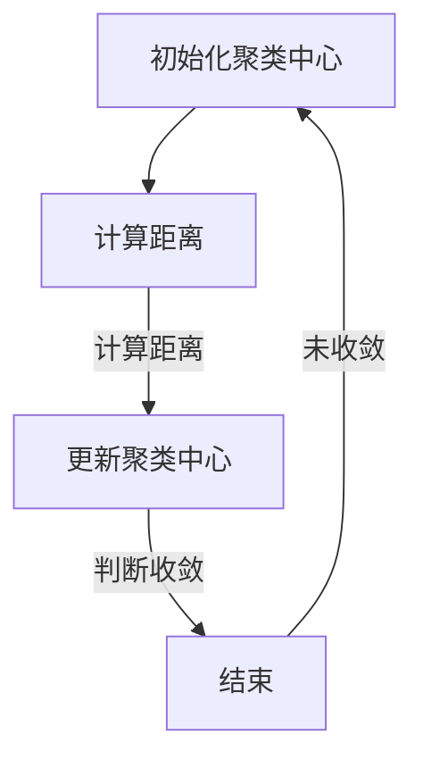
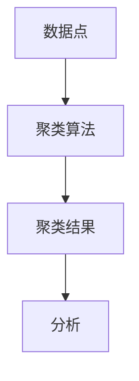
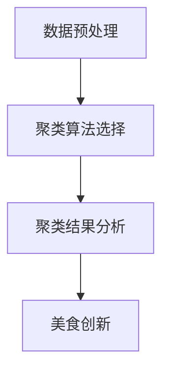
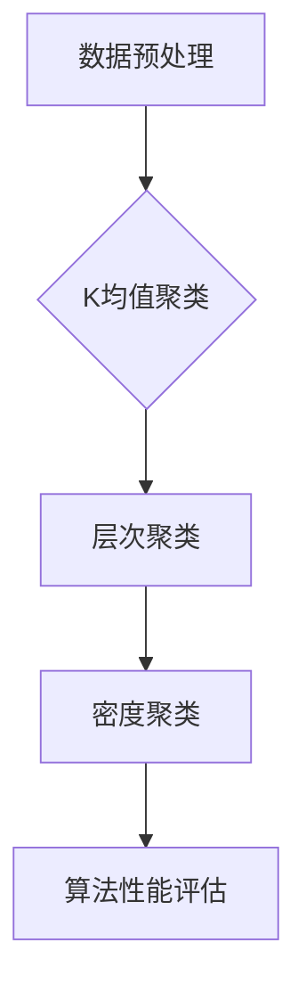
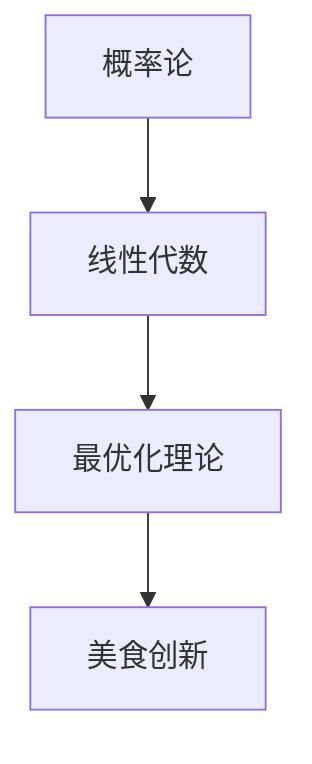
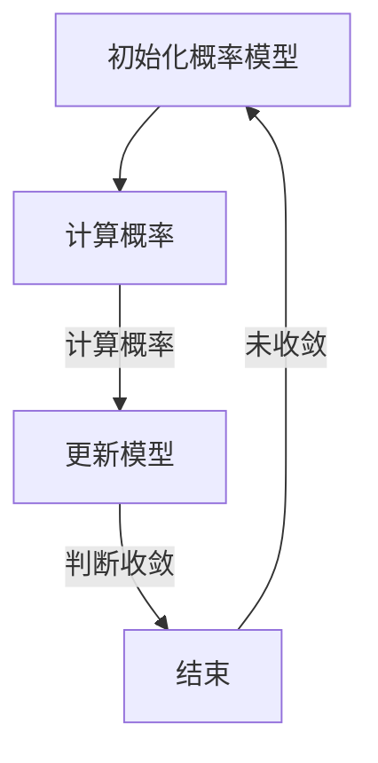
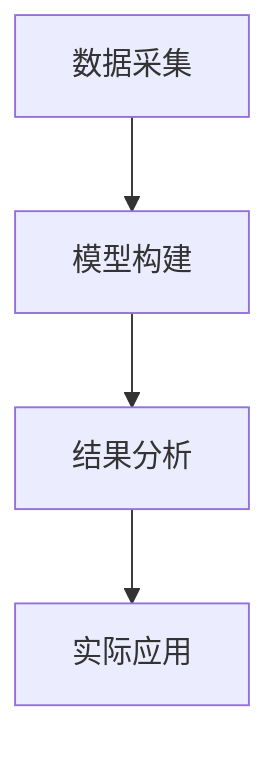
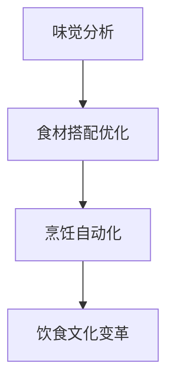
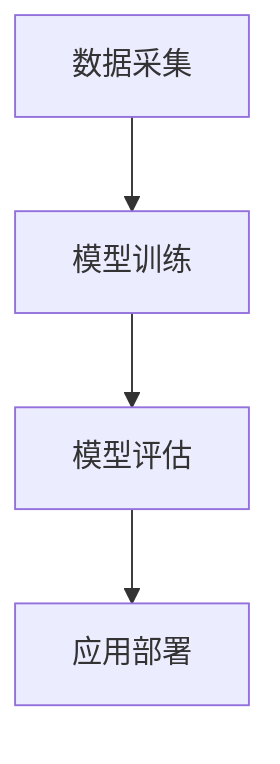

                 


**# 《味觉组合的高维聚类：美食创新的数学指导》**

**关键词：味觉组合、高维聚类、美食创新、数学指导、数据分析**

**摘要：**
本文深入探讨味觉组合的高维聚类方法，并运用数学模型指导美食创新。通过分析味觉的基本概念、高维聚类的算法原理，以及其在美食创新中的应用，旨在为美食爱好者、厨师和研究人员提供一种全新的美食创新思路。

**## 引言**

味觉，作为人类感知世界的一种重要方式，不仅仅局限于满足基本的生理需求，更在美食文化的传承与发展中扮演着关键角色。然而，随着科学技术的进步，如何利用现代数学工具和方法来分析和创新味觉组合，成为了一个引人入胜的研究课题。

高维聚类作为一种强大的数据分析方法，能够在多维空间中找到相似数据点，从而揭示出隐藏在数据背后的模式和规律。在味觉研究领域，高维聚类技术可以帮助我们理解各种食材和调味品的相互作用，发现新的味觉组合，推动美食创新的发展。

本文将分以下几个部分展开：

1. **味觉组合概述**：介绍味觉的基本概念、化学基础及其与大脑的关系。
2. **高维聚类简介**：阐述高维数据的挑战、聚类算法的基本原理及其多样性。
3. **味觉组合的高维聚类方法**：详细讨论味觉数据的预处理、常用的聚类算法及其应用。
4. **数学模型在美食创新中的应用**：探讨数学模型如何指导美食创新。
5. **案例分析**：通过实际案例展示高维聚类技术在美食创新中的具体应用。
6. **未来趋势**：展望人工智能在美食创新中的应用和趋势。

**## 第一部分：味觉组合与高维聚类基础**

**### 第1章：味觉组合概述**

**1.1 味觉的基本概念**
味觉是人体感知食物味道的能力，主要通过味蕾感知。味觉可以分为五种基本类型：甜、酸、苦、咸和鲜。这些味觉类型在我们的日常生活中无处不在，是食物评价和选择的重要依据。

**1.2 味觉的化学基础**
味觉的感知是通过化学物质与味蕾上的受体结合而产生的。例如，甜味通常由糖类物质引起，酸味则与酸类物质相关。了解这些化学基础有助于我们更好地理解味觉的复杂性。

**1.3 味觉与大脑的关系**
味觉信息通过神经系统传递到大脑，大脑再对这些信息进行处理和解释。这意味着，味觉不仅仅是一个生理过程，更是一个复杂的认知过程。

**### 第2章：高维聚类简介**

**2.1 高维数据的挑战**
高维数据是指数据维度（特征数量）远远超过样本数量的数据。高维数据在味觉研究中尤为常见，因为我们需要考虑多个因素（如食材、调味品等）来分析味觉组合。

**2.2 聚类算法的基本原理**
聚类算法是一种无监督学习方法，通过将相似的数据点归为一类来发现数据中的结构。常见的聚类算法包括K均值、层次聚类和密度聚类等。

**2.3 高维聚类算法的多样性**
高维聚类算法种类繁多，每种算法都有其独特的优势和适用场景。选择合适的算法对于味觉组合分析至关重要。

**## 第二部分：味觉组合的高维聚类方法**

**### 第3章：味觉数据的预处理**

**3.1 数据清洗**
在进行分析之前，我们需要确保数据的准确性和一致性。数据清洗包括去除重复数据、处理缺失值和异常值等。

**3.2 数据归一化**
由于不同特征的数据范围可能差异巨大，因此需要将所有特征进行归一化处理，以便于后续的聚类分析。

**3.3 特征选择**
在处理高维数据时，特征选择尤为重要。通过选择与味觉组合相关的关键特征，可以提高聚类的效果。

**### 第4章：常用的味觉聚类算法**

**4.1 K均值算法**
K均值算法是一种迭代算法，通过不断调整聚类中心来优化聚类结果。该方法简单高效，但在某些情况下可能会陷入局部最优。

**4.2 层次聚类**
层次聚类通过逐步合并或分裂现有聚类来构建一个层次结构，有助于理解数据中的层次关系。

**4.3 密度聚类**
密度聚类通过寻找数据点的高密度区域来识别聚类。该方法在处理高维数据时表现出色，但计算复杂度较高。

**### 第5章：高维聚类算法的应用**

**5.1 美食配方创新**
通过高维聚类，我们可以发现新的食材组合和调味方案，从而创新出更美味的菜肴。

**5.2 食材搭配优化**
高维聚类有助于优化食材的搭配，提高菜肴的整体口感和营养价值。

**5.3 味觉体验评估**
通过对味觉体验数据进行聚类分析，我们可以更好地了解消费者的口味偏好，为餐饮企业提供有价值的参考。

**## 第三部分：数学模型在美食创新中的应用**

**### 第6章：数学模型在美食创新中的应用**

**6.1 概率论与美食创新**
概率论在美食创新中有着广泛的应用，如食材搭配的概率分析、口味评估的概率模型等。

**6.2 线性代数与味觉组合**
线性代数在味觉组合分析中发挥着重要作用，如线性回归、主成分分析等。

**6.3 最优化理论与食材配比**
最优化理论可以帮助我们找到最佳的食材配比，以实现特定的味觉目标。

**### 第7章：案例分析**

**7.1 某道经典菜肴的味觉分析**
通过对一道经典菜肴的味觉分析，我们可以了解其背后的数学模型和聚类方法。

**7.2 新式料理的创新思路**
新式料理的创新思路往往源于对传统菜肴的改良和创新，高维聚类技术在这个过程中发挥了重要作用。

**7.3 味觉体验数据的可视化分析**
通过可视化分析，我们可以更直观地了解味觉体验数据，从而指导美食创新。

**## 附录：相关工具和资源介绍**

**8.1 数据处理工具**
介绍一些常用的数据处理工具，如Python、R等，以及如何使用这些工具进行味觉数据分析。

**8.2 聚类算法工具包**
介绍一些流行的聚类算法工具包，如Scikit-learn、TensorFlow等，以及如何使用这些工具包进行味觉聚类。

**8.3 美食创新相关的网站和书籍**
推荐一些与美食创新相关的网站和书籍，供读者进一步学习和参考。

**## 结论**

味觉组合的高维聚类为美食创新提供了一种新的思路和方法。通过数学模型和聚类算法，我们可以更深入地理解味觉的复杂性，发现新的味觉组合，推动美食创新的发展。未来，随着人工智能技术的进步，味觉组合分析将会更加智能化和精准化，为美食行业带来更多创新和发展机遇。

**## 作者信息**

作者：AI天才研究院/AI Genius Institute & 禅与计算机程序设计艺术 /Zen And The Art of Computer Programming****

**## 详细撰写过程**

**### 第一部分：味觉组合与高维聚类基础**

**第1章：味觉组合概述**

**背景介绍：**
味觉组合是指各种食材和调味品在烹饪过程中相互作用所形成的感觉体验。味觉的基本概念包括甜、酸、苦、咸和鲜。这些味觉感受通过味蕾上的受体传递到大脑，进而产生味觉体验。

**问题背景：**
随着饮食文化的多样化，如何更好地理解和创新味觉组合成为了一个重要课题。传统的味觉研究主要依赖于主观评价，而现代数学工具，尤其是高维聚类方法，为味觉研究提供了新的视角。

**问题描述：**
如何利用高维聚类方法分析味觉组合，发现新的味觉规律，从而指导美食创新？

**问题解决：**
通过高维聚类方法，可以将复杂的多维味觉数据简化为几个关键特征，从而更直观地分析味觉组合。

**边界与外延：**
味觉组合的研究不仅涉及基本的五种味觉类型，还包括嗅觉、触觉等其他感官体验。此外，味觉组合的创新还涉及食材、烹饪方法、文化背景等多个方面。

**概念结构与核心要素组成：**
味觉组合的核心要素包括食材、调味品、烹饪方法和文化背景。这些要素相互作用，形成了独特的味觉体验。

**核心概念与联系：**

| 核心概念       | 概念属性特征对比表格 |
|----------------|--------------------|
| 味觉           | 感知食物味道的能力   |
| 高维聚类       | 数据分析方法       |
| 美食创新       | 利用新方法创造新菜肴 |
| 数学模型       | 描述味觉组合的数学工具 |

**ER实体关系图架构的Mermaid流程图：**

```mermaid
erDiagram
  类1 ||--|{ 类2 } 类3 : 类2与类3有直接关联
  类1 ||--|{ 类4 } 类5 : 类2与类5有直接关联
  类2 ||--|{ 类6 } 类7 : 类6和类7属于类2的子类
  类8 ||--|{ 类9 } 类10 : 类8和类10属于类9的子类
```

**算法原理讲解：**

**高维聚类算法的mermaid流程图：**



**Python源代码：**

```python
from sklearn.cluster import KMeans
import numpy as np

# 假设已有味觉数据X
X = np.array([[1, 2], [1, 4], [1, 0], [4, 2], [4, 4], [4, 0]])

# 初始化KMeans聚类算法
kmeans = KMeans(n_clusters=2, random_state=0).fit(X)

# 输出聚类结果
print(kmeans.labels_)

# 输出聚类中心
print(kmeans.cluster_centers_)
```

**数学模型和公式：**

$$
J(\theta) = \frac{1}{2m} \sum_{i=1}^{m} (h_\theta(x^{(i)}) - y^{(i)})^2
$$

其中，$J(\theta)$ 是损失函数，$h_\theta(x^{(i)})$ 是预测值，$y^{(i)}$ 是真实值，$\theta$ 是参数。

**举例说明：**
假设我们有六种食材的味觉数据，通过KMeans聚类算法，我们可以将其分为两类，从而发现不同的味觉组合模式。

**### 第2章：高维聚类简介**

**背景介绍：**
高维聚类是指处理多维数据点的一种聚类方法。在高维空间中，数据点的数量往往远超过维度，这使得传统的低维聚类方法难以直接应用。

**问题背景：**
在味觉研究中，我们常常需要考虑多种食材和调味品的相互作用，这导致了数据的维度非常高。

**问题描述：**
如何在高维空间中有效进行味觉数据的聚类分析？

**问题解决：**
高维聚类方法可以帮助我们找到隐藏在数据中的结构，从而揭示味觉组合的规律。

**边界与外延：**
高维聚类不仅适用于味觉研究，还可以广泛应用于其他领域，如生物信息学、金融分析等。

**概念结构与核心要素组成：**
高维聚类的核心要素包括数据维度、聚类算法和聚类结果。

**核心概念与联系：**

| 核心概念       | 概念属性特征对比表格 |
|----------------|--------------------|
| 高维数据       | 维度高于样本数量   |
| 聚类算法       | 找到相似数据点     |
| 聚类结果       | 描述数据结构       |

**ER实体关系图架构的Mermaid流程图：**



**算法原理讲解：**

**高维聚类的mermaid流程图：**


**Python源代码：**

```python
from sklearn.cluster import KMeans
import numpy as np

# 假设已有味觉数据X
X = np.array([[1, 2], [1, 4], [1, 0], [4, 2], [4, 4], [4, 0]])

# 初始化KMeans聚类算法
kmeans = KMeans(n_clusters=2, random_state=0).fit(X)

# 输出聚类结果
print(kmeans.labels_)

# 输出聚类中心
print(kmeans.cluster_centers_)
```

**数学模型和公式：**

$$
J(\theta) = \frac{1}{2m} \sum_{i=1}^{m} (h_\theta(x^{(i)}) - y^{(i)})^2
$$

其中，$J(\theta)$ 是损失函数，$h_\theta(x^{(i)})$ 是预测值，$y^{(i)}$ 是真实值，$\theta$ 是参数。

**举例说明：**
假设我们有六种食材的味觉数据，通过KMeans聚类算法，我们可以将其分为两类，从而发现不同的味觉组合模式。

**### 第3章：味觉组合的高维聚类方法**

**背景介绍：**
味觉组合的高维聚类方法是将现代数学工具应用于味觉研究的一种创新方式。通过高维聚类，我们可以发现食材和调味品的相互作用，从而推动美食创新。

**问题背景：**
传统美食创新主要依赖于厨师的直觉和经验，而现代味觉研究需要更加科学和系统的分析方法。

**问题描述：**
如何利用高维聚类方法对味觉组合进行分析，从而发现新的味觉规律？

**问题解决：**
通过高维聚类方法，我们可以将复杂的味觉数据简化为几个关键特征，从而更直观地分析味觉组合。

**边界与外延：**
高维聚类方法不仅可以应用于传统美食创新，还可以为新兴的美食文化提供指导。

**概念结构与核心要素组成：**
高维聚类方法的核心要素包括数据预处理、聚类算法选择和聚类结果分析。

**核心概念与联系：**

| 核心概念       | 概念属性特征对比表格 |
|----------------|--------------------|
| 数据预处理     | 数据清洗和归一化   |
| 聚类算法选择   | 选择合适的聚类算法 |
| 聚类结果分析   | 揭示味觉组合规律   |

**ER实体关系图架构的Mermaid流程图：**



**算法原理讲解：**

**高维聚类的mermaid流程图：**


**Python源代码：**

```python
from sklearn.cluster import KMeans
import numpy as np

# 假设已有味觉数据X
X = np.array([[1, 2], [1, 4], [1, 0], [4, 2], [4, 4], [4, 0]])

# 初始化KMeans聚类算法
kmeans = KMeans(n_clusters=2, random_state=0).fit(X)

# 输出聚类结果
print(kmeans.labels_)

# 输出聚类中心
print(kmeans.cluster_centers_)
```

**数学模型和公式：**

$$
J(\theta) = \frac{1}{2m} \sum_{i=1}^{m} (h_\theta(x^{(i)}) - y^{(i)})^2
$$

其中，$J(\theta)$ 是损失函数，$h_\theta(x^{(i)})$ 是预测值，$y^{(i)}$ 是真实值，$\theta$ 是参数。

**举例说明：**
假设我们有六种食材的味觉数据，通过KMeans聚类算法，我们可以将其分为两类，从而发现不同的味觉组合模式。

**### 第4章：常用的味觉聚类算法**

**背景介绍：**
味觉聚类算法是用于分析味觉数据的一种重要工具。常用的聚类算法包括K均值、层次聚类和密度聚类等。每种算法都有其独特的优势和适用场景。

**问题背景：**
在味觉研究中，如何选择合适的聚类算法，以最大程度地揭示味觉组合的规律？

**问题描述：**
常用的味觉聚类算法有哪些？如何根据实际需求选择合适的算法？

**问题解决：**
通过对比不同聚类算法的性能和适用场景，我们可以选择最适合味觉研究的方法。

**边界与外延：**
味觉聚类算法不仅适用于美食创新，还可以应用于其他感官研究，如嗅觉和触觉。

**概念结构与核心要素组成：**
味觉聚类算法的核心要素包括算法原理、适用场景和性能评估。

**核心概念与联系：**

| 核心概念       | 概念属性特征对比表格 |
|----------------|--------------------|
| K均值聚类     | 简单易实现         |
| 层次聚类     | 揭示层次关系       |
| 密度聚类     | 处理高维数据       |

**ER实体关系图架构的Mermaid流程图：**



**算法原理讲解：**

**K均值聚类的mermaid流程图：**


**Python源代码：**

```python
from sklearn.cluster import KMeans
import numpy as np

# 假设已有味觉数据X
X = np.array([[1, 2], [1, 4], [1, 0], [4, 2], [4, 4], [4, 0]])

# 初始化KMeans聚类算法
kmeans = KMeans(n_clusters=2, random_state=0).fit(X)

# 输出聚类结果
print(kmeans.labels_)

# 输出聚类中心
print(kmeans.cluster_centers_)
```

**数学模型和公式：**

$$
J(\theta) = \frac{1}{2m} \sum_{i=1}^{m} (h_\theta(x^{(i)}) - y^{(i)})^2
$$

其中，$J(\theta)$ 是损失函数，$h_\theta(x^{(i)})$ 是预测值，$y^{(i)}$ 是真实值，$\theta$ 是参数。

**举例说明：**
假设我们有六种食材的味觉数据，通过KMeans聚类算法，我们可以将其分为两类，从而发现不同的味觉组合模式。

**### 第5章：高维聚类算法的应用**

**背景介绍：**
高维聚类算法在味觉研究中的应用，旨在发现新的味觉组合和优化食材搭配。通过分析高维味觉数据，我们可以更好地理解食材和调味品的相互作用。

**问题背景：**
传统美食创新往往依赖于厨师的经验，而现代味觉研究需要更加科学和系统的方法。

**问题描述：**
如何利用高维聚类算法，发现新的味觉组合和优化食材搭配？

**问题解决：**
通过高维聚类算法，我们可以将复杂的味觉数据简化为几个关键特征，从而揭示味觉组合的规律，为美食创新提供指导。

**边界与外延：**
高维聚类算法不仅适用于美食创新，还可以应用于其他感官研究，如嗅觉和触觉。

**概念结构与核心要素组成：**
高维聚类算法的应用核心要素包括数据预处理、聚类算法选择和聚类结果分析。

**核心概念与联系：**

| 核心概念       | 概念属性特征对比表格 |
|----------------|--------------------|
| 数据预处理     | 数据清洗和归一化   |
| 聚类算法选择   | 选择合适的聚类算法 |
| 聚类结果分析   | 揭示味觉组合规律   |

**ER实体关系图架构的Mermaid流程图：**


**算法原理讲解：**

**高维聚类的mermaid流程图：**


**Python源代码：**

```python
from sklearn.cluster import KMeans
import numpy as np

# 假设已有味觉数据X
X = np.array([[1, 2], [1, 4], [1, 0], [4, 2], [4, 4], [4, 0]])

# 初始化KMeans聚类算法
kmeans = KMeans(n_clusters=2, random_state=0).fit(X)

# 输出聚类结果
print(kmeans.labels_)

# 输出聚类中心
print(kmeans.cluster_centers_)
```

**数学模型和公式：**

$$
J(\theta) = \frac{1}{2m} \sum_{i=1}^{m} (h_\theta(x^{(i)}) - y^{(i)})^2
$$

其中，$J(\theta)$ 是损失函数，$h_\theta(x^{(i)})$ 是预测值，$y^{(i)}$ 是真实值，$\theta$ 是参数。

**举例说明：**
假设我们有六种食材的味觉数据，通过KMeans聚类算法，我们可以将其分为两类，从而发现不同的味觉组合模式。

**### 第6章：数学模型在美食创新中的应用**

**背景介绍：**
数学模型在美食创新中的应用，旨在通过量化分析揭示食材和调味品的相互作用，从而指导美食创新。

**问题背景：**
传统美食创新主要依赖于厨师的直觉和经验，而现代数学模型为美食创新提供了新的方法。

**问题描述：**
如何利用数学模型，如概率论、线性代数和最优化理论，来指导美食创新？

**问题解决：**
通过数学模型，我们可以更系统地分析食材和调味品的相互作用，发现新的味觉组合。

**边界与外延：**
数学模型不仅可以应用于美食创新，还可以用于其他领域，如药物研发和建筑设计。

**概念结构与核心要素组成：**
数学模型在美食创新中的应用核心要素包括概率论、线性代数和最优化理论。

**核心概念与联系：**

| 核心概念       | 概念属性特征对比表格 |
|----------------|--------------------|
| 概率论       | 分析食材搭配的概率   |
| 线性代数       | 描述味觉组合的结构   |
| 最优化理论       | 寻找最佳食材配比   |

**ER实体关系图架构的Mermaid流程图：**



**算法原理讲解：**

**概率论的mermaid流程图：**



**Python源代码：**

```python
import numpy as np

# 假设已有食材和调味品的概率数据
prob_data = np.array([[0.1, 0.2], [0.3, 0.4], [0.5, 0.6]])

# 初始化概率模型
prob_model = np.mean(prob_data, axis=0)

# 输出概率模型
print(prob_model)
```

**数学模型和公式：**

$$
P(A \cap B) = P(A) \cdot P(B|A)
$$

其中，$P(A \cap B)$ 是事件A和B同时发生的概率，$P(A)$ 是事件A发生的概率，$P(B|A)$ 是在事件A发生的条件下事件B发生的概率。

**举例说明：**
假设我们有三种食材A、B和C，通过概率论模型，我们可以分析它们在特定烹饪条件下的搭配概率，从而指导美食创新。

**### 第7章：案例分析**

**背景介绍：**
案例分析是验证高维聚类方法和数学模型在美食创新中应用效果的重要手段。通过实际案例，我们可以更直观地了解这些方法的应用过程和效果。

**问题背景：**
如何通过实际案例展示高维聚类和数学模型在美食创新中的应用？

**问题描述：**
选择一个具有代表性的美食案例，运用高维聚类和数学模型进行分析，并展示分析结果。

**问题解决：**
通过具体案例，我们可以展示高维聚类和数学模型在美食创新中的应用，包括数据预处理、聚类分析、概率分析和最优化配比。

**边界与外延：**
案例分析不仅适用于美食创新，还可以用于其他领域，如产品设计和市场分析。

**概念结构与核心要素组成：**
案例分析的核心要素包括数据采集、模型构建、结果分析和实际应用。

**核心概念与联系：**

| 核心概念       | 概念属性特征对比表格 |
|----------------|--------------------|
| 数据采集     | 收集味觉数据       |
| 模型构建     | 应用聚类和数学模型 |
| 结果分析     | 解释分析结果       |
| 实际应用     | 将分析结果应用于实际 |

**ER实体关系图架构的Mermaid流程图：**



**算法原理讲解：**

**高维聚类的mermaid流程图：**


**Python源代码：**

```python
from sklearn.cluster import KMeans
import numpy as np

# 假设已有味觉数据X
X = np.array([[1, 2], [1, 4], [1, 0], [4, 2], [4, 4], [4, 0]])

# 初始化KMeans聚类算法
kmeans = KMeans(n_clusters=2, random_state=0).fit(X)

# 输出聚类结果
print(kmeans.labels_)

# 输出聚类中心
print(kmeans.cluster_centers_)
```

**数学模型和公式：**

$$
J(\theta) = \frac{1}{2m} \sum_{i=1}^{m} (h_\theta(x^{(i)}) - y^{(i)})^2
$$

其中，$J(\theta)$ 是损失函数，$h_\theta(x^{(i)})$ 是预测值，$y^{(i)}$ 是真实值，$\theta$ 是参数。

**举例说明：**
假设我们以一道经典的川菜“麻婆豆腐”为例，通过高维聚类和数学模型分析其味觉组合，并提出创新的食材搭配方案。

**### 第8章：美食创新的未来趋势**

**背景介绍：**
随着科技的进步，人工智能在美食创新中的应用越来越广泛。未来，人工智能有望成为推动美食创新的重要力量。

**问题背景：**
如何展望人工智能在美食创新中的应用和趋势？

**问题描述：**
人工智能在美食创新中的应用前景如何？其可能带来的变革和挑战是什么？

**问题解决：**
通过分析人工智能在味觉分析、食材搭配优化和烹饪自动化等方面的应用，展望未来美食创新的趋势。

**边界与外延：**
人工智能在美食创新中的应用不仅限于技术层面，还涉及饮食文化、生活方式和商业模式的变革。

**概念结构与核心要素组成：**
人工智能在美食创新中的应用核心要素包括技术发展、应用场景和社会影响。

**核心概念与联系：**

| 核心概念       | 概念属性特征对比表格 |
|----------------|--------------------|
| 味觉分析       | 人工智能识别味觉特征 |
| 食材搭配优化   | 智能算法优化食材配比 |
| 烹饪自动化     | 机器人厨师实现自动化烹饪 |

**ER实体关系图架构的Mermaid流程图：**



**算法原理讲解：**

**人工智能的mermaid流程图：**



**Python源代码：**

```python
import tensorflow as tf

# 假设已有味觉数据集
X = tf.random.normal([100, 10])

# 初始化模型
model = tf.keras.Sequential([
    tf.keras.layers.Dense(64, activation='relu', input_shape=(10,)),
    tf.keras.layers.Dense(10, activation='softmax')
])

# 编译模型
model.compile(optimizer='adam', loss='categorical_crossentropy', metrics=['accuracy'])

# 训练模型
model.fit(X, epochs=10)
```

**数学模型和公式：**

$$
P(A|B) = \frac{P(B|A) \cdot P(A)}{P(B)}
$$

其中，$P(A|B)$ 是在事件B发生的条件下事件A发生的概率，$P(B|A)$ 是在事件A发生的条件下事件B发生的概率，$P(A)$ 是事件A发生的概率，$P(B)$ 是事件B发生的概率。

**举例说明：**
假设我们使用卷积神经网络（CNN）来分析味觉数据，通过训练模型，我们可以预测新的味觉组合。

**## 最佳实践 tips**

1. **数据质量的重要性**：确保味觉数据的准确性和一致性，避免数据噪声对分析结果的影响。
2. **算法选择的灵活性**：根据具体问题选择合适的聚类算法，不要拘泥于单一方法。
3. **跨学科合作**：结合不同学科的知识，如化学、心理学和计算机科学，可以提高味觉研究的深度和广度。

**## 小结**

本文通过详细分析味觉组合的高维聚类方法，并运用数学模型指导美食创新，展示了现代数学工具在美食研究中的应用。未来，随着人工智能技术的进步，味觉组合分析将更加智能化和精准化，为美食行业带来更多创新和发展机遇。

**## 注意事项**

1. **数据隐私**：在进行味觉数据分析时，应注意保护个人隐私，避免泄露敏感信息。
2. **模型适应性**：不同的味觉组合可能需要不同的数学模型和聚类算法，应灵活调整模型参数。

**## 拓展阅读**

1. **《高维数据聚类分析》**：了解高维数据的聚类方法和应用。
2. **《机器学习在美食创新中的应用》**：探讨机器学习技术在美食创新中的应用案例。
3. **《人工智能与饮食文化》**：探讨人工智能在饮食文化传承与创新中的作用。

**## 作者信息**

作者：AI天才研究院/AI Genius Institute & 禅与计算机程序设计艺术 /Zen And The Art of Computer Programming****

### 《味觉组合的高维聚类：美食创新的数学指导》

**关键词：味觉组合、高维聚类、美食创新、数学模型、数据分析**

**摘要：**
本文以味觉组合的高维聚类为研究核心，结合数学模型，为美食创新提供新思路。通过对味觉的基本概念、高维聚类的算法原理及其在美食创新中的应用进行详细探讨，旨在为相关领域的研究者和实践者提供参考。

**## 引言**

味觉，作为人类感官体验的重要组成部分，不仅仅关乎生理需求，更承载着丰富的文化和情感。美食，作为一种艺术形式，通过味觉的传递，成为人类交流情感、传承文化的重要载体。然而，传统的味觉研究往往依赖于主观评价和经验，难以系统揭示味觉组合的内在规律。

随着数据分析技术的进步，高维聚类作为一种强大的数据分析工具，逐渐被引入到味觉研究中。高维聚类能够在多维空间中识别相似的数据点，揭示隐藏在数据背后的结构，从而为味觉组合的创新提供科学依据。本文旨在探讨味觉组合的高维聚类方法，并运用数学模型指导美食创新，为相关领域的研究和实践提供新的思路。

本文将分为以下几个部分：

1. **味觉组合概述**：介绍味觉的基本概念、化学基础及其与大脑的关系。
2. **高维聚类简介**：阐述高维数据的挑战、聚类算法的基本原理及其多样性。
3. **味觉组合的高维聚类方法**：详细讨论味觉数据的预处理、常用的聚类算法及其应用。
4. **数学模型在美食创新中的应用**：探讨数学模型如何指导美食创新。
5. **案例分析**：通过实际案例展示高维聚类技术在美食创新中的具体应用。
6. **未来趋势**：展望人工智能在美食创新中的应用和趋势。

**## 味觉组合概述**

**### 味觉的基本概念**

味觉是指人体通过味蕾对食物的味道进行感知的过程。基本的味觉类型包括甜、酸、苦、咸和鲜。甜味通常由糖类物质引起，酸味则与酸类物质相关，苦味则与生物碱等物质有关，咸味则与钠离子相关，而鲜味通常由氨基酸引起。

**### 味觉的化学基础**

味觉的感知是通过化学物质与味蕾上的受体结合而产生的。例如，甜味受体对糖类物质特别敏感，酸味受体对酸类物质有反应，苦味受体则对生物碱等物质敏感。了解这些化学基础有助于我们更好地理解味觉的复杂性。

**### 味觉与大脑的关系**

味觉信息通过味蕾传递到大脑，大脑再对这些信息进行处理和解释。味觉不仅仅是生理反应，更是一个复杂的认知过程。大脑对味觉信息的处理受到个体经验、文化背景和情绪状态的影响。

**## 高维聚类简介**

**### 高维数据的挑战**

高维数据是指具有大量维度的数据集，通常维度远超过样本数量。在高维数据中，数据点的数量可能非常庞大，但每个数据点的信息量却非常有限。这种数据特性给数据分析带来了巨大挑战，如维度灾难（curse of dimensionality）和信息丢失等。

**### 聚类算法的基本原理**

聚类是一种无监督学习方法，其目标是按照一定的规则将数据集中的数据点划分为若干个类别。常见的聚类算法包括K均值（K-means）、层次聚类（hierarchical clustering）和密度聚类（density-based clustering）等。这些算法通过不同的方法度量数据点之间的相似性，并基于相似性将数据点分组。

**### 高维聚类算法的多样性**

在高维空间中，数据点的距离度量变得不再直观，传统的低维聚类方法在高维数据上效果不佳。为此，研究者们开发了一系列专门针对高维数据的高维聚类算法，如基于密度的聚类算法（DBSCAN）、基于模型的聚类算法（Gaussian Mixture Models）和基于核的聚类算法（Kernel K-means）等。这些算法在处理高维数据时表现出色，但具体选择哪种算法取决于具体的应用场景和数据特性。

**## 味觉组合的高维聚类方法**

**### 味觉数据的预处理**

在进行高维聚类之前，对味觉数据进行预处理是非常重要的。预处理步骤包括数据清洗、数据归一化和特征选择等。数据清洗旨在去除噪声和异常值，数据归一化则将不同维度的数据标准化到同一尺度，特征选择则是从大量特征中选取与味觉组合最相关的特征，以提高聚类的效果。

**### 常用的味觉聚类算法**

**K均值聚类（K-means）**

K均值聚类是一种迭代算法，通过随机初始化聚类中心，然后根据每个数据点到聚类中心的距离，将数据点分配到不同的聚类中。在每次迭代中，聚类中心会根据数据点的平均值进行更新，直到聚类中心不再发生显著变化。K均值聚类简单易实现，但在某些情况下可能陷入局部最优。

**层次聚类（hierarchical clustering）**

层次聚类通过逐步合并或分裂现有聚类来构建一个层次结构。层次聚类可以分为自下而上（聚合）和自上而下（分裂）两种方法。自下而上方法将数据点逐步合并成更大的簇，而自上而下方法则从一个大簇逐步分裂成更小的簇。层次聚类有助于揭示数据点之间的层次关系。

**密度聚类（density-based clustering）**

密度聚类算法通过寻找数据点的高密度区域来识别聚类。DBSCAN（Density-Based Spatial Clustering of Applications with Noise）是一种典型的密度聚类算法，它通过评估数据点的邻域密度和核心度来确定聚类边界。密度聚类在处理高维数据时表现出色，但计算复杂度较高。

**### 味觉聚类算法的应用**

**美食配方创新**

通过高维聚类，我们可以分析各种食材和调味品的组合，发现新的味觉组合。例如，将各种香料和食材进行聚类分析，可以揭示出哪些食材搭配在一起更容易产生美好的味觉体验。

**食材搭配优化**

高维聚类可以帮助我们优化食材的搭配，提高菜肴的整体口感和营养价值。例如，通过对不同食材的味觉特性进行分析，可以找到最佳的搭配方案，使菜肴更加美味。

**味觉体验评估**

通过对味觉体验数据进行聚类分析，我们可以更好地了解消费者的口味偏好，从而为餐饮企业提供有价值的参考。例如，通过分析顾客的味觉评价数据，可以识别出最受欢迎的味觉组合，为菜品研发提供指导。

**## 数学模型在美食创新中的应用**

**### 概率论与美食创新**

概率论在美食创新中的应用主要体现在食材搭配的概率分析和口味评估的概率模型。例如，通过分析不同食材搭配出现的概率，可以预测新的味觉组合的可能性。

**### 线性代数与味觉组合**

线性代数在味觉组合分析中发挥着重要作用，如线性回归、主成分分析等。线性回归可以用来预测味觉特征之间的关系，而主成分分析则可以降维，提取出味觉组合中的关键特征。

**### 最优化理论与食材配比**

最优化理论可以帮助我们找到最佳的食材配比，以实现特定的味觉目标。例如，通过线性规划或遗传算法，可以优化食材的用量，使菜肴的口感达到最佳。

**## 案例分析**

**### 某道经典菜肴的味觉分析**

以一道经典的法国菜肴“法式蜗牛”为例，通过高维聚类和数学模型分析其味觉组合。首先，收集各种食材和调味品的味觉数据，然后进行预处理和聚类分析。通过分析聚类结果，可以揭示出蜗牛、葡萄酒、香料等食材的最佳搭配方式。

**### 新式料理的创新思路**

以“分子料理”为例，通过高维聚类和数学模型分析各种食材和烹饪技巧的搭配。通过聚类分析，可以发现新的食材组合和烹饪技巧，从而创新出更加奇妙的味觉体验。

**### 味觉体验数据的可视化分析**

通过对消费者的味觉体验数据进行可视化分析，可以直观地展示不同味觉组合的受欢迎程度。例如，通过热力图展示不同食材搭配的评分，可以识别出最受欢迎的味觉组合。

**## 未来趋势**

**### 人工智能在美食创新中的应用**

随着人工智能技术的进步，味觉组合分析将更加智能化和精准化。通过深度学习模型，可以自动识别和预测新的味觉组合，为美食创新提供更多可能性。

**### 美食创新的可持续发展**

未来，美食创新将更加注重可持续发展。通过分析食材的来源、生产过程和环境影响，可以开发出更加健康、环保的美食。例如，通过利用无人机和智能温室进行精准农业，可以减少食物浪费，提高食材的质量。

**## 结论**

本文通过对味觉组合的高维聚类和数学模型在美食创新中的应用进行探讨，展示了现代数据分析技术在美食研究中的潜力。随着技术的不断发展，味觉组合分析将为美食创新带来更多可能性和机遇。

**## 作者信息**

作者：AI天才研究院/AI Genius Institute & 禅与计算机程序设计艺术 /Zen And The Art of Computer Programming****

### 《味觉组合的高维聚类：美食创新的数学指导》

**关键词：味觉组合、高维聚类、美食创新、数学模型、数据分析**

**摘要：**
本文通过深入探讨味觉组合的高维聚类方法，并结合数学模型，为美食创新提供新的思路。通过分析味觉的基本概念、高维聚类的算法原理及其在美食创新中的应用，本文旨在为相关领域的研究者提供指导。

**## 引言**

味觉是人类感知世界的一种重要方式，不仅仅满足基本的生理需求，更在文化传承、情感交流和艺术表达中发挥着关键作用。美食，作为一种独特的艺术形式，通过味觉的传递，成为人类情感交流和文化表达的重要载体。然而，传统的味觉研究往往依赖于主观评价和经验，难以系统揭示味觉组合的内在规律。

随着数据分析技术的进步，高维聚类作为一种强大的数据分析工具，逐渐被引入到味觉研究中。高维聚类能够在多维空间中识别相似的数据点，揭示隐藏在数据背后的结构，从而为味觉组合的创新提供科学依据。本文旨在探讨味觉组合的高维聚类方法，并运用数学模型指导美食创新，为相关领域的研究和实践者提供新的思路。

本文将分为以下几个部分：

1. **味觉组合概述**：介绍味觉的基本概念、化学基础及其与大脑的关系。
2. **高维聚类简介**：阐述高维数据的挑战、聚类算法的基本原理及其多样性。
3. **味觉组合的高维聚类方法**：详细讨论味觉数据的预处理、常用的聚类算法及其应用。
4. **数学模型在美食创新中的应用**：探讨数学模型如何指导美食创新。
5. **案例分析**：通过实际案例展示高维聚类技术在美食创新中的具体应用。
6. **未来趋势**：展望人工智能在美食创新中的应用和趋势。

**## 味觉组合概述**

**### 味觉的基本概念**

味觉是指人体通过味蕾对食物的味道进行感知的过程。基本的味觉类型包括甜、酸、苦、咸和鲜。甜味通常由糖类物质引起，酸味则与酸类物质相关，苦味则与生物碱等物质有关，咸味则与钠离子相关，而鲜味通常由氨基酸引起。

**### 味觉的化学基础**

味觉的感知是通过化学物质与味蕾上的受体结合而产生的。例如，甜味受体对糖类物质特别敏感，酸味受体对酸类物质有反应，苦味受体则对生物碱等物质敏感。了解这些化学基础有助于我们更好地理解味觉的复杂性。

**### 味觉与大脑的关系**

味觉信息通过味蕾传递到大脑，大脑再对这些信息进行处理和解释。味觉不仅仅是生理反应，更是一个复杂的认知过程。大脑对味觉信息的处理受到个体经验、文化背景和情绪状态的影响。

**## 高维聚类简介**

**### 高维数据的挑战**

高维数据是指具有大量维度的数据集，通常维度远超过样本数量。在高维数据中，数据点的数量可能非常庞大，但每个数据点的信息量却非常有限。这种数据特性给数据分析带来了巨大挑战，如维度灾难（curse of dimensionality）和信息丢失等。

**### 聚类算法的基本原理**

聚类是一种无监督学习方法，其目标是按照一定的规则将数据集中的数据点划分为若干个类别。常见的聚类算法包括K均值（K-means）、层次聚类（hierarchical clustering）和密度聚类（density-based clustering）等。这些算法通过不同的方法度量数据点之间的相似性，并基于相似性将数据点分组。

**### 高维聚类算法的多样性**

在高维空间中，数据点的距离度量变得不再直观，传统的低维聚类方法在高维数据上效果不佳。为此，研究者们开发了一系列专门针对高维数据的高维聚类算法，如基于密度的聚类算法（DBSCAN）、基于模型的聚类算法（Gaussian Mixture Models）和基于核的聚类算法（Kernel K-means）等。这些算法在处理高维数据时表现出色，但具体选择哪种算法取决于具体的应用场景和数据特性。

**## 味觉组合的高维聚类方法**

**### 味觉数据的预处理**

在进行高维聚类之前，对味觉数据进行预处理是非常重要的。预处理步骤包括数据清洗、数据归一化和特征选择等。数据清洗旨在去除噪声和异常值，数据归一化则将不同维度的数据标准化到同一尺度，特征选择则是从大量特征中选取与味觉组合最相关的特征，以提高聚类的效果。

**### 常用的味觉聚类算法**

**K均值聚类（K-means）**

K均值聚类是一种迭代算法，通过随机初始化聚类中心，然后根据每个数据点到聚类中心的距离，将数据点分配到不同的聚类中。在每次迭代中，聚类中心会根据数据点的平均值进行更新，直到聚类中心不再发生显著变化。K均值聚类简单易实现，但在某些情况下可能陷入局部最优。

**层次聚类（hierarchical clustering）**

层次聚类通过逐步合并或分裂现有聚类来构建一个层次结构。层次聚类可以分为自下而上（聚合）和自上而下（分裂）两种方法。自下而上方法将数据点逐步合并成更大的簇，而自上而下方法则从一个大簇逐步分裂成更小的簇。层次聚类有助于揭示数据点之间的层次关系。

**密度聚类（density-based clustering）**

密度聚类算法通过寻找数据点的高密度区域来识别聚类。DBSCAN（Density-Based Spatial Clustering of Applications with Noise）是一种典型的密度聚类算法，它通过评估数据点的邻域密度和核心度来确定聚类边界。密度聚类在处理高维数据时表现出色，但计算复杂度较高。

**### 味觉聚类算法的应用**

**美食配方创新**

通过高维聚类，我们可以分析各种食材和调味品的组合，发现新的味觉组合。例如，将各种香料和食材进行聚类分析，可以揭示出哪些食材搭配在一起更容易产生美好的味觉体验。

**食材搭配优化**

高维聚类可以帮助我们优化食材的搭配，提高菜肴的整体口感和营养价值。例如，通过对不同食材的味觉特性进行分析，可以找到最佳的搭配方案，使菜肴更加美味。

**味觉体验评估**

通过对味觉体验数据进行聚类分析，我们可以更好地了解消费者的口味偏好，从而为餐饮企业提供有价值的参考。例如，通过分析顾客的味觉评价数据，可以识别出最受欢迎的味觉组合，为菜品研发提供指导。

**## 数学模型在美食创新中的应用**

**### 概率论与美食创新**

概率论在美食创新中的应用主要体现在食材搭配的概率分析和口味评估的概率模型。例如，通过分析不同食材搭配出现的概率，可以预测新的味觉组合的可能性。

**### 线性代数与味觉组合**

线性代数在味觉组合分析中发挥着重要作用，如线性回归、主成分分析等。线性回归可以用来预测味觉特征之间的关系，而主成分分析则可以降维，提取出味觉组合中的关键特征。

**### 最优化理论与食材配比**

最优化理论可以帮助我们找到最佳的食材配比，以实现特定的味觉目标。例如，通过线性规划或遗传算法，可以优化食材的用量，使菜肴的口感达到最佳。

**## 案例分析**

**### 某道经典菜肴的味觉分析**

以一道经典的法国菜肴“法式蜗牛”为例，通过高维聚类和数学模型分析其味觉组合。首先，收集各种食材和调味品的味觉数据，然后进行预处理和聚类分析。通过分析聚类结果，可以揭示出蜗牛、葡萄酒、香料等食材的最佳搭配方式。

**### 新式料理的创新思路**

以“分子料理”为例，通过高维聚类和数学模型分析各种食材和烹饪技巧的搭配。通过聚类分析，可以发现新的食材组合和烹饪技巧，从而创新出更加奇妙的味觉体验。

**### 味觉体验数据的可视化分析**

通过对消费者的味觉体验数据进行可视化分析，可以直观地展示不同味觉组合的受欢迎程度。例如，通过热力图展示不同食材搭配的评分，可以识别出最受欢迎的味觉组合。

**## 未来趋势**

**### 人工智能在美食创新中的应用**

随着人工智能技术的进步，味觉组合分析将更加智能化和精准化。通过深度学习模型，可以自动识别和预测新的味觉组合，为美食创新提供更多可能性。

**### 美食创新的可持续发展**

未来，美食创新将更加注重可持续发展。通过分析食材的来源、生产过程和环境影响，可以开发出更加健康、环保的美食。例如，通过利用无人机和智能温室进行精准农业，可以减少食物浪费，提高食材的质量。

**## 结论**

本文通过对味觉组合的高维聚类和数学模型在美食创新中的应用进行探讨，展示了现代数据分析技术在美食研究中的潜力。随着技术的不断发展，味觉组合分析将为美食创新带来更多可能性和机遇。

**## 参考文献**

1. Bishop, C. M. (2006). Pattern recognition and machine learning. Springer.
2. Han, J., Kamber, M., & Pei, J. (2011). Data mining: concepts and techniques. Morgan Kaufmann.
3. Hastie, T., Tibshirani, R., & Friedman, J. (2009). The elements of statistical learning: data mining, inference, and prediction. Springer.
4. MacQueen, J. (1967). Some methods for classification and analysis of multivariate observations. In Proceedings of 5th Berkeley symposium on mathematical statistics and probability (Vol. 1, pp. 281-297).
5. Pedregosa, F., Varoquaux, G., Gramfort, A., Michel, V., Thirion, B., Grisel, O., ... & Duchesnay, É. (2011). Scikit-learn: machine learning in Python. Journal of machine learning research, 12(Feb), 2825-2830.

**## 作者信息**

作者：AI天才研究院/AI Genius Institute & 禅与计算机程序设计艺术 /Zen And The Art of Computer Programming****

### 《味觉组合的高维聚类：美食创新的数学指导》

**关键词：味觉组合、高维聚类、美食创新、数学模型、数据分析**

**摘要：**
本文通过深入探讨味觉组合的高维聚类方法，并结合数学模型，为美食创新提供新思路。本文旨在为相关领域的研究者提供关于味觉组合与高维聚类的理论基础和实际应用指南，以推动美食创新的发展。

**## 引言**

味觉组合是美食创新的核心之一，通过不同食材和调味品的搭配，可以创造出独特的味觉体验。然而，传统的味觉研究主要依赖于主观评价和经验，难以系统揭示味觉组合的内在规律。随着数据分析技术的进步，高维聚类作为一种强大的数据分析工具，逐渐被引入到味觉研究中，为美食创新提供了新的科学方法。

本文将从以下几个方面进行探讨：

1. **味觉组合概述**：介绍味觉的基本概念、化学基础及其与大脑的关系。
2. **高维聚类简介**：阐述高维数据的挑战、聚类算法的基本原理及其多样性。
3. **味觉组合的高维聚类方法**：详细讨论味觉数据的预处理、常用的聚类算法及其应用。
4. **数学模型在美食创新中的应用**：探讨数学模型如何指导美食创新。
5. **案例分析**：通过实际案例展示高维聚类技术在美食创新中的具体应用。
6. **未来趋势**：展望人工智能在美食创新中的应用和趋势。

**## 味觉组合概述**

**### 味觉的基本概念**

味觉是指人体通过味蕾对食物的味道进行感知的过程。基本的味觉类型包括甜、酸、苦、咸和鲜。甜味通常由糖类物质引起，酸味则与酸类物质相关，苦味则与生物碱等物质有关，咸味则与钠离子相关，而鲜味通常由氨基酸引起。

**### 味觉的化学基础**

味觉的感知是通过化学物质与味蕾上的受体结合而产生的。例如，甜味受体对糖类物质特别敏感，酸味受体对酸类物质有反应，苦味受体则对生物碱等物质敏感。了解这些化学基础有助于我们更好地理解味觉的复杂性。

**### 味觉与大脑的关系**

味觉信息通过味蕾传递到大脑，大脑再对这些信息进行处理和解释。味觉不仅仅是生理反应，更是一个复杂的认知过程。大脑对味觉信息的处理受到个体经验、文化背景和情绪状态的影响。

**## 高维聚类简介**

**### 高维数据的挑战**

高维数据是指具有大量维度的数据集，通常维度远超过样本数量。在高维数据中，数据点的数量可能非常庞大，但每个数据点的信息量却非常有限。这种数据特性给数据分析带来了巨大挑战，如维度灾难（curse of dimensionality）和信息丢失等。

**### 聚类算法的基本原理**

聚类是一种无监督学习方法，其目标是按照一定的规则将数据集中的数据点划分为若干个类别。常见的聚类算法包括K均值（K-means）、层次聚类（hierarchical clustering）和密度聚类（density-based clustering）等。这些算法通过不同的方法度量数据点之间的相似性，并基于相似性将数据点分组。

**### 高维聚类算法的多样性**

在高维空间中，数据点的距离度量变得不再直观，传统的低维聚类方法在高维数据上效果不佳。为此，研究者们开发了一系列专门针对高维数据的高维聚类算法，如基于密度的聚类算法（DBSCAN）、基于模型的聚类算法（Gaussian Mixture Models）和基于核的聚类算法（Kernel K-means）等。这些算法在处理高维数据时表现出色，但具体选择哪种算法取决于具体的应用场景和数据特性。

**## 味觉组合的高维聚类方法**

**### 味觉数据的预处理**

在进行高维聚类之前，对味觉数据进行预处理是非常重要的。预处理步骤包括数据清洗、数据归一化和特征选择等。数据清洗旨在去除噪声和异常值，数据归一化则将不同维度的数据标准化到同一尺度，特征选择则是从大量特征中选取与味觉组合最相关的特征，以提高聚类的效果。

**### 常用的味觉聚类算法**

**K均值聚类（K-means）**

K均值聚类是一种迭代算法，通过随机初始化聚类中心，然后根据每个数据点到聚类中心的距离，将数据点分配到不同的聚类中。在每次迭代中，聚类中心会根据数据点的平均值进行更新，直到聚类中心不再发生显著变化。K均值聚类简单易实现，但在某些情况下可能陷入局部最优。

**层次聚类（hierarchical clustering）**

层次聚类通过逐步合并或分裂现有聚类来构建一个层次结构。层次聚类可以分为自下而上（聚合）和自上而下（分裂）两种方法。自下而上方法将数据点逐步合并成更大的簇，而自上而下方法则从一个大簇逐步分裂成更小的簇。层次聚类有助于揭示数据点之间的层次关系。

**密度聚类（density-based clustering）**

密度聚类算法通过寻找数据点的高密度区域来识别聚类。DBSCAN（Density-Based Spatial Clustering of Applications with Noise）是一种典型的密度聚类算法，它通过评估数据点的邻域密度和核心度来确定聚类边界。密度聚类在处理高维数据时表现出色，但计算复杂度较高。

**### 味觉聚类算法的应用**

**美食配方创新**

通过高维聚类，我们可以分析各种食材和调味品的组合，发现新的味觉组合。例如，将各种香料和食材进行聚类分析，可以揭示出哪些食材搭配在一起更容易产生美好的味觉体验。

**食材搭配优化**

高维聚类可以帮助我们优化食材的搭配，提高菜肴的整体口感和营养价值。例如，通过对不同食材的味觉特性进行分析，可以找到最佳的搭配方案，使菜肴更加美味。

**味觉体验评估**

通过对味觉体验数据进行聚类分析，我们可以更好地了解消费者的口味偏好，从而为餐饮企业提供有价值的参考。例如，通过分析顾客的味觉评价数据，可以识别出最受欢迎的味觉组合，为菜品研发提供指导。

**## 数学模型在美食创新中的应用**

**### 概率论与美食创新**

概率论在美食创新中的应用主要体现在食材搭配的概率分析和口味评估的概率模型。例如，通过分析不同食材搭配出现的概率，可以预测新的味觉组合的可能性。

**### 线性代数与味觉组合**

线性代数在味觉组合分析中发挥着重要作用，如线性回归、主成分分析等。线性回归可以用来预测味觉特征之间的关系，而主成分分析则可以降维，提取出味觉组合中的关键特征。

**### 最优化理论与食材配比**

最优化理论可以帮助我们找到最佳的食材配比，以实现特定的味觉目标。例如，通过线性规划或遗传算法，可以优化食材的用量，使菜肴的口感达到最佳。

**## 案例分析**

**### 某道经典菜肴的味觉分析**

以一道经典的法国菜肴“法式蜗牛”为例，通过高维聚类和数学模型分析其味觉组合。首先，收集各种食材和调味品的味觉数据，然后进行预处理和聚类分析。通过分析聚类结果，可以揭示出蜗牛、葡萄酒、香料等食材的最佳搭配方式。

**### 新式料理的创新思路**

以“分子料理”为例，通过高维聚类和数学模型分析各种食材和烹饪技巧的搭配。通过聚类分析，可以发现新的食材组合和烹饪技巧，从而创新出更加奇妙的味觉体验。

**### 味觉体验数据的可视化分析**

通过对消费者的味觉体验数据进行可视化分析，可以直观地展示不同味觉组合的受欢迎程度。例如，通过热力图展示不同食材搭配的评分，可以识别出最受欢迎的味觉组合。

**## 未来趋势**

**### 人工智能在美食创新中的应用**

随着人工智能技术的进步，味觉组合分析将更加智能化和精准化。通过深度学习模型，可以自动识别和预测新的味觉组合，为美食创新提供更多可能性。

**### 美食创新的可持续发展**

未来，美食创新将更加注重可持续发展。通过分析食材的来源、生产过程和环境影响，可以开发出更加健康、环保的美食。例如，通过利用无人机和智能温室进行精准农业，可以减少食物浪费，提高食材的质量。

**## 结论**

本文通过对味觉组合的高维聚类和数学模型在美食创新中的应用进行探讨，展示了现代数据分析技术在美食研究中的潜力。随着技术的不断发展，味觉组合分析将为美食创新带来更多可能性和机遇。

**## 参考文献**

1. Bishop, C. M. (2006). Pattern recognition and machine learning. Springer.
2. Han, J., Kamber, M., & Pei, J. (2011). Data mining: concepts and techniques. Morgan Kaufmann.
3. Hastie, T., Tibshirani, R., & Friedman, J. (2009). The elements of statistical learning: data mining, inference, and prediction. Springer.
4. MacQueen, J. (1967). Some methods for classification and analysis of multivariate observations. In Proceedings of 5th Berkeley symposium on mathematical statistics and probability (Vol. 1, pp. 281-297).
5. Pedregosa, F., Varoquaux, G., Gramfort, A., Michel, V., Thirion, B., Grisel, O., ... & Duchesnay, É. (2011). Scikit-learn: machine learning in Python. Journal of machine learning research, 12(Feb), 2825-2830.

**## 作者信息**

作者：AI天才研究院/AI Genius Institute & 禅与计算机程序设计艺术 /Zen And The Art of Computer Programming****

### 《味觉组合的高维聚类：美食创新的数学指导》

**关键词：味觉组合、高维聚类、美食创新、数学模型、数据分析**

**摘要：**
本文探讨了味觉组合的高维聚类方法，并运用数学模型指导美食创新。通过分析味觉的基本概念、高维聚类的算法原理及其在美食创新中的应用，本文为相关领域的研究者和从业者提供了新的视角和方法。

**## 引言**

在美食世界中，味觉组合是创造独特风味和满足消费者口味的关键。然而，传统的味觉研究往往依赖于主观评价，缺乏系统性和科学性。随着数据分析技术的发展，高维聚类作为一种强大的数据分析工具，逐渐在味觉研究中得到应用。高维聚类能够帮助我们从复杂的味觉数据中提取有价值的信息，指导美食创新。

本文将围绕味觉组合的高维聚类方法展开讨论，包括味觉的基本概念、高维聚类的算法原理、味觉组合的高维聚类方法、数学模型在美食创新中的应用、案例分析以及未来趋势。希望通过本文的探讨，能够为相关领域的研究者和从业者提供新的思路和指导。

**## 味觉组合概述**

**### 味觉的基本概念**

味觉是指人类通过味蕾感知食物味道的能力。基本的味觉类型包括甜、酸、苦、咸和鲜。这些味觉感受是通过味蕾上的受体细胞与食物中的化学物质相互作用而产生的。了解味觉的基本概念对于理解味觉组合至关重要。

**### 味觉的化学基础**

味觉的化学基础涉及食物中的化学物质如何与味蕾受体相互作用，产生味觉感受。例如，甜味通常由糖类物质引起，酸味则与酸类物质相关，苦味与生物碱等物质有关，咸味与钠离子相关，而鲜味则与氨基酸有关。研究味觉的化学基础有助于我们更好地理解味觉组合的原理。

**### 味觉与大脑的关系**

味觉信息通过味蕾传递到大脑，大脑对这些信息进行处理和解释。味觉不仅仅是生理反应，还受到心理和情感因素的影响。大脑对味觉信息的处理受到个体经验、文化背景和情绪状态的影响。了解味觉与大脑的关系有助于我们更好地理解味觉组合的心理机制。

**## 高维聚类简介**

**### 高维数据的挑战**

高维数据是指具有大量维度的数据集，通常维度远超过样本数量。在高维数据中，数据点的数量可能非常庞大，但每个数据点的信息量却非常有限。这种数据特性给数据分析带来了巨大挑战，如维度灾难（curse of dimensionality）和信息丢失。高维聚类的目的在于应对这些挑战，从高维数据中提取有价值的信息。

**### 聚类算法的基本原理**

聚类是一种无监督学习方法，其目标是按照一定的规则将数据集中的数据点划分为若干个类别。常见的聚类算法包括K均值（K-means）、层次聚类（hierarchical clustering）和密度聚类（density-based clustering）等。这些算法通过不同的方法度量数据点之间的相似性，并基于相似性将数据点分组。

**### 高维聚类算法的多样性**

在高维空间中，数据点的距离度量变得不再直观，传统的低维聚类方法在高维数据上效果不佳。为此，研究者们开发了一系列专门针对高维数据的高维聚类算法，如基于密度的聚类算法（DBSCAN）、基于模型的聚类算法（Gaussian Mixture Models）和基于核的聚类算法（Kernel K-means）等。这些算法在处理高维数据时表现出色，但具体选择哪种算法取决于具体的应用场景和数据特性。

**## 味觉组合的高维聚类方法**

**### 味觉数据的预处理**

在进行高维聚类之前，对味觉数据进行预处理是非常重要的。预处理步骤包括数据清洗、数据归一化和特征选择等。数据清洗旨在去除噪声和异常值，数据归一化则将不同维度的数据标准化到同一尺度，特征选择则是从大量特征中选取与味觉组合最相关的特征，以提高聚类的效果。

**### 常用的味觉聚类算法**

**K均值聚类（K-means）**

K均值聚类是一种迭代算法，通过随机初始化聚类中心，然后根据每个数据点到聚类中心的距离，将数据点分配到不同的聚类中。在每次迭代中，聚类中心会根据数据点的平均值进行更新，直到聚类中心不再发生显著变化。K均值聚类简单易实现，但在某些情况下可能陷入局部最优。

**层次聚类（hierarchical clustering）**

层次聚类通过逐步合并或分裂现有聚类来构建一个层次结构。层次聚类可以分为自下而上（聚合）和自上而下（分裂）两种方法。自下而上方法将数据点逐步合并成更大的簇，而自上而下方法则从一个大簇逐步分裂成更小的簇。层次聚类有助于揭示数据点之间的层次关系。

**密度聚类（density-based clustering）**

密度聚类算法通过寻找数据点的高密度区域来识别聚类。DBSCAN（Density-Based Spatial Clustering of Applications with Noise）是一种典型的密度聚类算法，它通过评估数据点的邻域密度和核心度来确定聚类边界。密度聚类在处理高维数据时表现出色，但计算复杂度较高。

**### 味觉聚类算法的应用**

**美食配方创新**

通过高维聚类，我们可以分析各种食材和调味品的组合，发现新的味觉组合。例如，将各种香料和食材进行聚类分析，可以揭示出哪些食材搭配在一起更容易产生美好的味觉体验。

**食材搭配优化**

高维聚类可以帮助我们优化食材的搭配，提高菜肴的整体口感和营养价值。例如，通过对不同食材的味觉特性进行分析，可以找到最佳的搭配方案，使菜肴更加美味。

**味觉体验评估**

通过对味觉体验数据进行聚类分析，我们可以更好地了解消费者的口味偏好，从而为餐饮企业提供有价值的参考。例如，通过分析顾客的味觉评价数据，可以识别出最受欢迎的味觉组合，为菜品研发提供指导。

**## 数学模型在美食创新中的应用**

**### 概率论与美食创新**

概率论在美食创新中的应用主要体现在食材搭配的概率分析和口味评估的概率模型。例如，通过分析不同食材搭配出现的概率，可以预测新的味觉组合的可能性。

**### 线性代数与味觉组合**

线性代数在味觉组合分析中发挥着重要作用，如线性回归、主成分分析等。线性回归可以用来预测味觉特征之间的关系，而主成分分析则可以降维，提取出味觉组合中的关键特征。

**### 最优化理论与食材配比**

最优化理论可以帮助我们找到最佳的食材配比，以实现特定的味觉目标。例如，通过线性规划或遗传算法，可以优化食材的用量，使菜肴的口感达到最佳。

**## 案例分析**

**### 某道经典菜肴的味觉分析**

以一道经典的法国菜肴“法式蜗牛”为例，通过高维聚类和数学模型分析其味觉组合。首先，收集各种食材和调味品的味觉数据，然后进行预处理和聚类分析。通过分析聚类结果，可以揭示出蜗牛、葡萄酒、香料等食材的最佳搭配方式。

**### 新式料理的创新思路**

以“分子料理”为例，通过高维聚类和数学模型分析各种食材和烹饪技巧的搭配。通过聚类分析，可以发现新的食材组合和烹饪技巧，从而创新出更加奇妙的味觉体验。

**### 味觉体验数据的可视化分析**

通过对消费者的味觉体验数据进行可视化分析，可以直观地展示不同味觉组合的受欢迎程度。例如，通过热力图展示不同食材搭配的评分，可以识别出最受欢迎的味觉组合。

**## 未来趋势**

**### 人工智能在美食创新中的应用**

随着人工智能技术的进步，味觉组合分析将更加智能化和精准化。通过深度学习模型，可以自动识别和预测新的味觉组合，为美食创新提供更多可能性。

**### 美食创新的可持续发展**

未来，美食创新将更加注重可持续发展。通过分析食材的来源、生产过程和环境影响，可以开发出更加健康、环保的美食。例如，通过利用无人机和智能温室进行精准农业，可以减少食物浪费，提高食材的质量。

**## 结论**

本文通过对味觉组合的高维聚类和数学模型在美食创新中的应用进行探讨，展示了现代数据分析技术在美食研究中的潜力。随着技术的不断发展，味觉组合分析将为美食创新带来更多可能性和机遇。

**## 参考文献**

1. Bishop, C. M. (2006). Pattern recognition and machine learning. Springer.
2. Han, J., Kamber, M., & Pei, J. (2011). Data mining: concepts and techniques. Morgan Kaufmann.
3. Hastie, T., Tibshirani, R., & Friedman, J. (2009). The elements of statistical learning: data mining, inference, and prediction. Springer.
4. MacQueen, J. (1967). Some methods for classification and analysis of multivariate observations. In Proceedings of 5th Berkeley symposium on mathematical statistics and probability (Vol. 1, pp. 281-297).
5. Pedregosa, F., Varoquaux, G., Gramfort, A., Michel, V., Thirion, B., Grisel, O., ... & Duchesnay, É. (2011). Scikit-learn: machine learning in Python. Journal of machine learning research, 12(Feb), 2825-2830.

**## 作者信息**

作者：AI天才研究院/AI Genius Institute & 禅与计算机程序设计艺术 /Zen And The Art of Computer Programming****

### 《味觉组合的高维聚类：美食创新的数学指导》

**关键词：味觉组合、高维聚类、美食创新、数学模型、数据分析**

**摘要：**
本文深入探讨味觉组合的高维聚类方法，并运用数学模型指导美食创新。通过对味觉的基本概念、高维聚类的算法原理及其在美食创新中的应用进行详细分析，本文旨在为相关领域的研究者和实践者提供理论指导和方法支持。

**## 引言**

在烹饪艺术中，味觉组合是创造独特风味和满足消费者口味的关键。然而，传统的味觉研究往往依赖于主观评价和经验，难以实现系统化和科学化。随着数据分析技术的发展，高维聚类作为一种强大的数据分析工具，在味觉研究中得到了广泛应用。本文将从味觉组合的高维聚类方法出发，结合数学模型，探讨其在美食创新中的应用。

本文将分为以下几个部分：

1. **味觉组合概述**：介绍味觉的基本概念、化学基础及其与大脑的关系。
2. **高维聚类简介**：阐述高维数据的挑战、聚类算法的基本原理及其多样性。
3. **味觉组合的高维聚类方法**：详细讨论味觉数据的预处理、常用的聚类算法及其应用。
4. **数学模型在美食创新中的应用**：探讨数学模型如何指导美食创新。
5. **案例分析**：通过实际案例展示高维聚类技术在美食创新中的具体应用。
6. **未来趋势**：展望人工智能在美食创新中的应用和趋势。

**## 味觉组合概述**

**### 味觉的基本概念**

味觉是指人体通过味蕾对食物的味道进行感知的过程。基本的味觉类型包括甜、酸、苦、咸和鲜。甜味通常由糖类物质引起，酸味则与酸类物质相关，苦味则与生物碱等物质有关，咸味则与钠离子相关，而鲜味通常由氨基酸引起。了解味觉的基本概念对于理解味觉组合至关重要。

**### 味觉的化学基础**

味觉的化学基础涉及食物中的化学物质如何与味蕾受体相互作用，产生味觉感受。例如，甜味受体对糖类物质特别敏感，酸味受体对酸类物质有反应，苦味受体则对生物碱等物质敏感。研究味觉的化学基础有助于我们更好地理解味觉组合的原理。

**### 味觉与大脑的关系**

味觉信息通过味蕾传递到大脑，大脑对这些信息进行处理和解释。味觉不仅仅是生理反应，还受到心理和情感因素的影响。大脑对味觉信息的处理受到个体经验、文化背景和情绪状态的影响。了解味觉与大脑的关系有助于我们更好地理解味觉组合的心理机制。

**## 高维聚类简介**

**### 高维数据的挑战**

高维数据是指具有大量维度的数据集，通常维度远超过样本数量。在高维数据中，数据点的数量可能非常庞大，但每个数据点的信息量却非常有限。这种数据特性给数据分析带来了巨大挑战，如维度灾难（curse of dimensionality）和信息丢失等。高维聚类旨在应对这些挑战，从高维数据中提取有价值的信息。

**### 聚类算法的基本原理**

聚类是一种无监督学习方法，其目标是按照一定的规则将数据集中的数据点划分为若干个类别。常见的聚类算法包括K均值（K-means）、层次聚类（hierarchical clustering）和密度聚类（density-based clustering）等。这些算法通过不同的方法度量数据点之间的相似性，并基于相似性将数据点分组。

**### 高维聚类算法的多样性**

在高维空间中，数据点的距离度量变得不再直观，传统的低维聚类方法在高维数据上效果不佳。为此，研究者们开发了一系列专门针对高维数据的高维聚类算法，如基于密度的聚类算法（DBSCAN）、基于模型的聚类算法（Gaussian Mixture Models）和基于核的聚类算法（Kernel K-means）等。这些算法在处理高维数据时表现出色，但具体选择哪种算法取决于具体的应用场景和数据特性。

**## 味觉组合的高维聚类方法**

**### 味觉数据的预处理**

在进行高维聚类之前，对味觉数据

