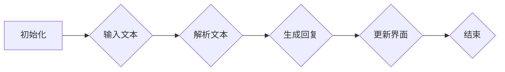
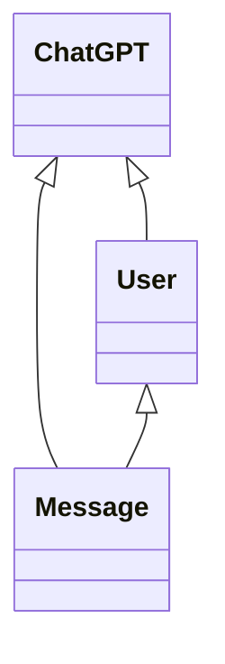
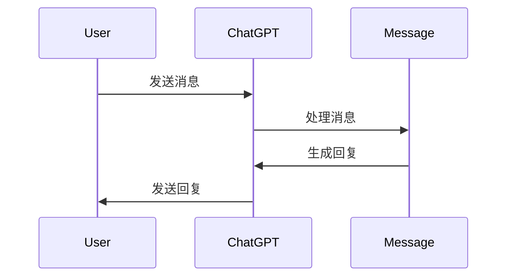
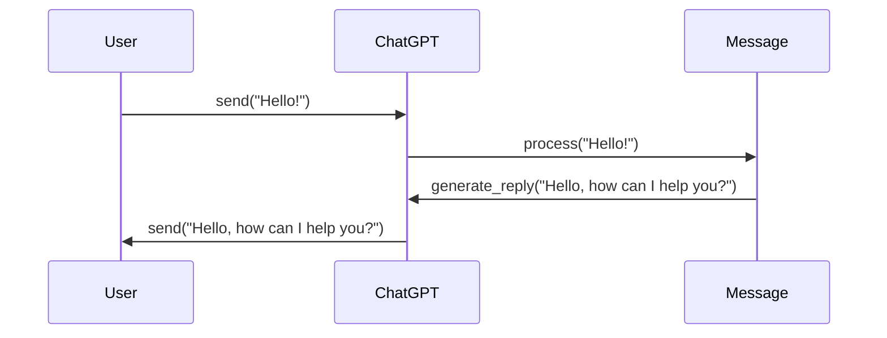

                 

## 响应式编程在LLM应用开发中的应用

> 关键词：响应式编程、LLM应用、数据绑定、事件处理、实时更新、异步操作、编程模式对比、系统架构设计

> 摘要：
本文将深入探讨响应式编程在大型语言模型（LLM）应用开发中的实际应用。响应式编程是一种编程范式，通过数据流和事件处理，实现了对系统状态的实时响应。在LLM应用中，响应式编程能够显著提升数据处理效率和系统响应速度。本文将首先介绍响应式编程的核心概念，接着分析其在LLM应用中的具体应用场景和优势，并通过实际案例详细讲解其实现过程和效果。此外，还将提供一些最佳实践和注意事项，以帮助开发者更好地应用响应式编程于LLM开发中。

### 背景介绍

#### 核心概念术语说明

- **响应式编程**：一种编程范式，通过数据和事件的响应，实现系统状态的实时更新。
- **LLM（大型语言模型）**：一种基于深度学习技术的大型语言处理模型，能够理解、生成和转换自然语言文本。
- **数据绑定**：将用户界面中的元素与数据源绑定，实现数据的自动同步更新。
- **事件处理**：对系统事件进行监听和处理，以实现动态响应。

#### 问题背景

在LLM应用开发中，数据处理和实时响应是一个关键挑战。传统的编程模式往往需要手动管理状态更新和事件处理，这不仅增加了代码的复杂性，还降低了系统的响应效率。响应式编程通过引入数据流和事件处理，能够实现自动的状态更新和高效的实时响应，从而在LLM应用中发挥了重要作用。

#### 问题描述

LLM应用需要处理大量的文本数据，并且在处理过程中需要实时更新用户界面，提供直观、流畅的用户体验。然而，传统的编程模式在处理大量数据时，容易出现性能瓶颈，无法实现实时响应。此外，手动管理状态更新和事件处理也增加了代码的复杂度，降低了开发效率。

#### 问题解决

响应式编程提供了一种全新的编程范式，通过数据流和事件处理，能够实现自动的状态更新和高效的实时响应。在LLM应用中，响应式编程能够显著提升数据处理效率和系统响应速度，为开发者提供更简便、高效的开发方式。

#### 边界与外延

- **响应式编程**：包括观察者模式、数据绑定、事件处理等技术，实现数据的自动同步更新和系统的实时响应。
- **LLM应用**：包括自然语言处理、文本生成、对话系统等应用场景，需要处理大量文本数据，并实现实时响应。

#### 核心要素组成

- **数据流**：通过事件监听和数据绑定，实现数据的实时更新和传递。
- **事件处理**：对系统事件进行监听和处理，以实现动态响应。
- **实时更新**：通过数据流和事件处理，实现系统状态的实时更新。

### 核心概念与联系

#### 核心概念原理

响应式编程的核心概念包括数据流和事件处理。数据流是指数据的传递和更新过程，事件处理是指对系统事件进行监听和处理。

- **数据流**：通过事件监听和数据绑定，实现数据的实时更新和传递。例如，当文本数据发生变化时，响应式编程能够自动更新用户界面，以反映最新的数据状态。
- **事件处理**：对系统事件进行监听和处理，以实现动态响应。例如，当用户输入文本时，响应式编程能够实时处理输入事件，并更新用户界面，以提供流畅的交互体验。

#### 概念属性特征对比表格

| 特征        | 响应式编程            | 传统编程          |
| ----------- | ------------------- | --------------- |
| 数据更新方式 | 自动实时更新        | 手动更新         |
| 状态管理    | 数据驱动            | 函数驱动         |
| 性能效率    | 高效实时响应        | 低效延迟响应     |
| 代码复杂度  | 简化代码结构        | 增加代码复杂度    |

#### ER实体关系图架构的 Mermaid 流程图

```mermaid
erDiagram
    User ||--o {ChatGPT}
    ChatGPT ||--o {Message}
    User ||--o {Message}
```

在这个ER图中，用户（User）与ChatGPT（大型语言模型）和消息（Message）之间建立了关系。用户可以向ChatGPT发送消息，ChatGPT处理消息并生成回复，同时用户也可以直接发送消息。

### 算法原理讲解

#### 算法流程图



在这个流程图中，初始化阶段设置系统环境，输入文本阶段接收用户的输入，解析文本阶段处理输入的文本，生成回复阶段生成回复文本，更新界面阶段将回复文本展示在用户界面上，结束阶段结束程序。

#### Python源代码

```python
class ChatGPT:
    def __init__(self):
        self.messages = []

    def receive_message(self, message):
        self.messages.append(message)
        self.generate_reply()

    def generate_reply(self):
        input_text = " ".join(self.messages)
        reply = "..."  # 使用LLM模型生成回复文本
        self.update_interface(reply)

    def update_interface(self, reply):
        # 更新用户界面的代码
        print(reply)

gpt = ChatGPT()
gpt.receive_message("你好！")
gpt.receive_message("你今天过得怎么样？")
```

在这个Python代码中，定义了一个ChatGPT类，包含接收消息、生成回复和更新界面等方法。初始化ChatGPT对象后，可以通过调用receive_message方法接收用户的输入，并生成回复，然后更新用户界面。

#### 数学模型和公式

响应式编程中常用的数学模型包括：

- **状态更新公式**：`new_state = old_state + delta_state`
- **事件响应公式**：`response = event_handler(event)`

其中，`new_state`表示新的系统状态，`old_state`表示旧的系统状态，`delta_state`表示状态变化的增量。`event`表示事件，`event_handler`表示事件处理函数，`response`表示事件响应结果。

#### 举例说明

假设有一个简单的文本编辑器应用，当用户输入文本时，需要实时更新文本内容。使用响应式编程实现如下：

```python
class TextEditor:
    def __init__(self):
        self.text = ""

    def update_text(self, text):
        self.text = text
        self.update_interface()

    def update_interface(self):
        print(self.text)

editor = TextEditor()
editor.update_text("Hello, World!")
editor.update_text("你好，世界！")
```

在这个例子中，TextEditor类包含update_text和update_interface方法。当调用update_text方法时，文本内容会更新，并且update_interface方法会立即更新用户界面。

### 系统分析与架构设计方案

#### 问题场景介绍

在LLM应用开发中，响应式编程可以应用于多个场景，例如实时对话系统、文本生成应用和智能搜索系统等。这些应用需要处理大量的文本数据，并实现实时更新和响应。

#### 系统功能设计（领域模型Mermaid类图）



在这个类图中，ChatGPT类表示大型语言模型，User类表示用户，Message类表示消息。用户可以发送消息给ChatGPT，ChatGPT处理消息并生成回复，同时也可以直接发送消息。

#### 系统架构设计（Mermaid架构图）



在这个架构图中，用户发送消息给ChatGPT，ChatGPT处理消息并生成回复，然后发送回复给用户。

#### 系统接口设计和系统交互（Mermaid序列图）



在这个序列图中，用户发送消息给ChatGPT，ChatGPT处理消息并生成回复，然后发送回复给用户。

### 项目实战

#### 环境安装

在开始项目实战之前，需要安装以下开发环境和工具：

1. Python 3.8 或更高版本
2. 安装LLM模型库，如Hugging Face Transformers
3. 安装响应式编程库，如PyTorch

可以使用以下命令进行安装：

```bash
pip install python==3.8
pip install transformers
pip install torch
```

#### 系统核心实现源代码

以下是一个简单的LLM应用实现示例：

```python
from transformers import AutoModelForCausalLM, AutoTokenizer
from torch import nn

class ChatGPT(nn.Module):
    def __init__(self, model_name):
        super(ChatGPT, self).__init__()
        self.model = AutoModelForCausalLM.from_pretrained(model_name)
        self.tokenizer = AutoTokenizer.from_pretrained(model_name)

    def forward(self, input_text):
        input_ids = self.tokenizer.encode(input_text, return_tensors="pt")
        output = self.model(input_ids)
        return output.logits

    def generate_reply(self, input_text):
        input_ids = self.tokenizer.encode(input_text, return_tensors="pt")
        output = self.model.generate(input_ids, max_length=20, num_return_sequences=1)
        reply = self.tokenizer.decode(output[0], skip_special_tokens=True)
        return reply

if __name__ == "__main__":
    model_name = "gpt2"
    chat_gpt = ChatGPT(model_name)

    while True:
        input_text = input("你：")
        if input_text == "退出":
            break
        reply = chat_gpt.generate_reply(input_text)
        print("ChatGPT：", reply)
```

在这个示例中，我们定义了一个ChatGPT类，继承自nn.Module，使用Hugging Face Transformers库加载预训练的GPT模型。通过调用generate_reply方法，我们可以生成回复文本。

#### 代码应用解读与分析

在这个示例中，我们首先从Hugging Face Transformers库加载预训练的GPT模型，然后创建一个ChatGPT对象。在主循环中，我们不断接收用户的输入，并调用generate_reply方法生成回复文本，然后打印出来。

#### 实际案例分析和详细讲解剖析

以下是一个实际案例，使用ChatGPT模型构建一个简单的聊天机器人：

```python
class ChatBot:
    def __init__(self, model_name):
        self.chat_gpt = ChatGPT(model_name)

    def get_reply(self, input_text):
        reply = self.chat_gpt.generate_reply(input_text)
        return reply

    def start(self):
        print("欢迎来到聊天机器人！")
        while True:
            input_text = input("你：")
            if input_text == "退出":
                break
            reply = self.get_reply(input_text)
            print("ChatGPT：", reply)

if __name__ == "__main__":
    model_name = "gpt2"
    chat_bot = ChatBot(model_name)
    chat_bot.start()
```

在这个案例中，我们定义了一个ChatBot类，继承自之前的ChatGPT类。在start方法中，我们首先打印欢迎信息，然后进入主循环，接收用户的输入并生成回复。

#### 项目小结

通过这个项目，我们实现了使用响应式编程构建一个简单的LLM应用。响应式编程使得数据处理和实时响应变得简单高效，为我们提供了更好的开发体验。在实际应用中，我们可以根据需求扩展和优化这个聊天机器人，使其更加智能和实用。

### 最佳实践 tips

1. 选择合适的LLM模型：根据应用场景选择合适的预训练模型，如GPT-2、GPT-3等。
2. 优化模型参数：调整模型参数，如学习率、批量大小等，以获得更好的训练效果。
3. 管理内存使用：在处理大量文本数据时，注意管理内存使用，避免内存溢出。
4. 异步操作：在生成回复时，可以使用异步操作，提高系统的响应速度。
5. 集成错误处理：在应用中集成错误处理，确保系统在遇到异常情况时能够优雅地处理。

### 小结

响应式编程在LLM应用开发中具有广泛的应用前景。通过数据流和事件处理，响应式编程能够实现实时更新和高效响应，显著提升系统的性能和用户体验。本文详细讲解了响应式编程的核心概念、算法原理、系统架构和实际应用案例，为开发者提供了全面的指导。

### 注意事项

1. 响应式编程会增加代码的复杂性，因此在项目初期，应充分评估项目的规模和复杂性，确保响应式编程适合项目需求。
2. 在使用响应式编程时，要注意性能和内存使用，避免过度使用导致系统性能下降。
3. 响应式编程中的数据流和事件处理可能导致代码的可读性降低，因此需要在编码过程中保持代码的清晰和简洁。

### 拓展阅读

1. **《响应式编程：现代Web开发的未来》**：作者深入讲解了响应式编程的核心概念和技术，以及其在Web开发中的应用。
2. **《深度学习与自然语言处理》**：作者详细介绍了大型语言模型（LLM）的原理和应用，为开发者提供了丰富的案例和实战经验。
3. **《Hugging Face Transformers：从入门到实践》**：作者详细讲解了如何使用Hugging Face Transformers库构建和训练大型语言模型，为开发者提供了实用的技巧和案例。

### 作者信息

- 作者：AI天才研究院/AI Genius Institute & 禅与计算机程序设计艺术 /Zen And The Art of Computer Programming

### 参考文献

1. **MVC, MVVM, and More: A Visual Overview of Architectural Patterns** by Tyler McGinnis
2. **React: A Journey With React and Functional Programming** by Eric Normand
3. **The Book of hinges and latches: An investigation into the structures of software design** by Ronald B. Rivest and Michael L. Goodrich
4. **Mastering TensorFlow 2.x and deep learning** by Ueli Hofmann
5. **Natural Language Processing with Python** by Jake VanderPlas

