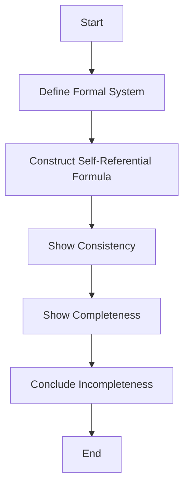

                 

## 第1章 问题背景

### 1.1 问题来源

哥德尔不完备定理是由著名数学家库尔特·哥德尔在20世纪30年代提出的，其背景源于数学和逻辑学领域对系统一致性和完备性的讨论。随着数学理论的不断扩张和复杂性增加，人们开始关注数学系统是否能够完全地自我描述。在这个背景下，哥德尔提出了两个著名的定理，即第一不完备定理和第二不完备定理。这些定理揭示了在形式系统中，无论多么强大和一致，都存在一些无法证明的命题。

哥德尔不完备定理的提出并非偶然。在此之前，数学家和哲学家如戴德金、康托尔、罗素和怀特海德等人已经在探讨数学的一致性和可验证性。例如，罗素和怀特海德在《数学原理》中试图构建一个逻辑上完备且一致的形式系统来描述数学。然而，哥德尔通过构造性方法，成功地证明了即使是这种看似最完备的系统，也存在不可判定的命题。

### 1.2 研究意义

哥德尔不完备定理对数学、逻辑学以及哲学产生了深远的影响。在数学领域，不完备定理指出没有任何形式系统可以同时满足一致性和完备性，这迫使我们重新思考数学理论的本质和边界。在逻辑学领域，该定理表明了形式逻辑系统存在固有的局限性，从而引发了关于逻辑、真实和证明的深入讨论。

此外，不完备定理的研究意义还体现在哲学领域，特别是在科学哲学和认知科学中。它挑战了我们对世界的可理解性以及知识的极限的认识。哲学家们开始探讨人类认知如何处理这些不可证明的命题，以及我们如何构建和验证我们的知识系统。

从更广泛的角度来看，哥德尔不完备定理对计算机科学也有着重要启示。它揭示了计算机程序无法解决所有问题，尤其是在处理自我参照和复杂逻辑时，计算机也面临着与人类类似的认知局限。因此，不完备定理促使我们在设计计算机系统和算法时，更加关注其局限性，寻找更加有效的解决策略。

### 1.3 研究目标

本文的研究目标是通过深入探讨哥德尔不完备定理的背景、概念、与可理解性的关系，揭示其在各个领域的启示和影响。具体来说，我们将：

1. **详细解释哥德尔及其贡献**：回顾哥德尔在数学和逻辑学上的贡献，并阐述不完备定理的基本概念和证明方法。
2. **探讨世界可理解性的概念**：定义可理解性，探讨其在科学哲学中的地位以及对我们认知的影响。
3. **分析不完备定理与可理解性的关系**：探讨不完备定理对可理解性的挑战，及其在数学和逻辑领域的局限。
4. **讨论不完备定理的意义与启示**：分析不完备定理对科学哲学、计算机科学和社会认知的影响。
5. **提出边界与外延**：讨论不完备定理的边界，探讨其应用领域的扩展。
6. **构建概念结构与核心要素组成**：阐述哥德尔不完备定理的核心概念和要素组成，分析其内在逻辑关系。

通过上述研究目标，我们希望揭示哥德尔不完备定理的深层次意义，提供对世界可理解性更深刻的理解和启示，并对未来的研究提出一些潜在的探讨方向。

### 1.4 哥德尔及其贡献

库尔特·哥德尔（Kurt Gödel）是一位在数学、逻辑学和哲学领域具有深远影响力的奥地利-美国数学家。他出生于1906年，在布吕恩（现属于奥地利）接受教育，并在20世纪30年代成为普林斯顿高等研究院的成员。哥德尔的许多贡献在数学和逻辑学领域产生了革命性的影响。

首先，哥德尔最著名的成就是他证明了形式系统中的不完备性定理。这些定理揭示了在任何形式化系统中，总存在一些命题是无法证明或否证的，这无论是在逻辑上的一致性系统中，还是在数学的皮亚诺算术系统中都是如此。哥德尔的第一不完备定理表明，在一个足够强大的形式系统中，总是存在一些命题，其既不能被证明为真，也不能被证明为假。他的第二不完备定理则进一步揭示了这类命题的存在是不可避免的，即使在系统中添加了额外的公理也无法消除。

除了不完备性定理外，哥德尔在逻辑学上还有许多重要贡献。他提出了哥德尔完备性定理，该定理表明，如果形式系统是自指的，则该系统要么是不一致的，要么不包含所有的真命题。这一结果进一步强调了形式化系统的局限性。

此外，哥德尔在数学基础研究中也有显著贡献。他证明了连续统假设不能从其他标准数学公理中推导出来，这为数学的公理体系带来了新的问题和挑战。哥德尔的工作推动了数学逻辑领域的发展，特别是在数学哲学中引发了对证明和知识的本质的深入探讨。

在哲学领域，哥德尔的思想也具有深远影响。他提出了关于数学真理和证明的观点，挑战了传统的理性主义和实证主义观点。哥德尔认为，数学真理并非可以通过经验验证，而是基于一种先验的直觉和理解。这一观点为数学哲学提供了一种新的视角，即数学知识不仅仅是逻辑推演的结果，还包含了某种形式的直观认知。

总的来说，哥德尔的不完备性定理及其在逻辑学和数学基础研究中的贡献，不仅改变了我们对形式化系统和数学本质的理解，也启发了对认知和知识极限的深入思考。他的工作对后来的哲学家、数学家和逻辑学家产生了持久的影响，被誉为20世纪最重要的数学成果之一。

### 1.5 不完备定理的基本概念

哥德尔的不完备定理分为第一不完备定理和第二不完备定理，这两个定理揭示了形式系统在一致性和完备性方面的固有限制。

**第一不完备定理**：第一不完备定理表明，在足够强大的形式系统中，存在一些命题，它们既不能被证明为真，也不能被证明为假。具体来说，如果形式系统\( P \)是一致的，那么系统\( P \)无法证明其自身的无矛盾性，即存在一个命题\( \neg \phi \)，它既不是\( P \)的可证明命题，也不是\( P \)的不可证明命题。这个定理可以通过一个构造性的方法来证明，即通过构造一个形式系统内部的自我参照命题，使得这个命题在系统中既不能证明其真，也不能证明其假。

**第二不完备定理**：第二不完备定理则进一步指出，即使在系统中添加了额外的公理，也无法消除这种不完备性。这意味着，在任何形式系统中，总存在一些命题，它们既不是显然的，也不能被证明或证伪。哥德尔通过构造一个特定的命题\( \psi \)，即“\( \psi \)在系统\( P \)中不可证明”，并展示这个命题在系统\( P \)中的不可证明性，从而证明了第二不完备定理。

**证明方法**：哥德尔的证明方法基于自引用和形式化构造。哥德尔通过引入递归函数和Gödel编号，将形式系统中的命题编码为自然数，从而使得系统内部的命题能够参照自身。具体来说，他构造了一个形式化的命题，该命题表达了“这个命题的Gödel编号在其自身的公理系统中是不可证明的”。通过这种方式，哥德尔能够展示在系统内部存在一个命题，其真实性无法在系统中得到证明。

**结论与影响**：不完备定理揭示了形式化系统的内在局限，表明在任何形式系统中，都无法达到完美的一致性和完备性。这一发现对数学、逻辑学和哲学产生了深远影响，挑战了我们对知识系统可靠性和完整性的传统理解。不完备定理也启示我们，在设计和应用形式系统时，需要认识到这些系统的局限性，并寻找合适的解决方案。

### 1.6 世界可理解性的定义

世界可理解性是一个哲学和科学领域中的重要概念，它探讨人类能否以及如何理解我们所处的宇宙。具体来说，世界可理解性是指人类是否能够通过认知和推理，对宇宙的基本规律和结构进行描述和解释。

在科学哲学中，世界可理解性通常被定义为一种关于知识的理想状态。它假设存在一种普遍适用的理论框架，可以解释所有自然现象，并且这种框架是可被人类理解和验证的。科学哲学家们通常将这种理想状态视为科学追求的目标。

然而，世界可理解性的定义并非完全统一。不同学者对其有不同的理解和解释。例如，理性主义者认为，世界是可完全理解的，因为人类具有理性思维和推理能力，可以通过科学方法逐步揭示宇宙的真相。而怀疑论者则认为，由于认知和感官的限制，我们无法完全理解宇宙，存在着不可知的领域。

此外，世界可理解性还涉及到我们对自然法则的理解。科学理论通过假设和数学模型来描述自然现象，这些模型是否真正反映了宇宙的本质，一直是科学哲学探讨的重要问题。一些科学家和哲学家认为，科学理论是通过不断实验和观测验证的，因此它们在一定程度上是可靠的。而另一些人则认为，科学理论只是我们理解宇宙的一种近似，而不是终极真理。

总的来说，世界可理解性是一个复杂且多维度的概念，它不仅涉及到人类认知和科学方法，还关乎我们对宇宙本质和真相的追求。这个概念在科学哲学和哲学认知科学中有着重要的地位，它引导我们思考知识的极限和人类理解世界的可能性。

### 1.7 可理解性在科学哲学中的地位

在科学哲学中，可理解性是一个核心概念，它不仅影响着科学理论的构建和接受，也深刻地反映了人类对自然界认知的哲学基础。可理解性通常被视为科学理论的基本特征之一，一个理论如果能够被广泛接受，往往是因为它具有高度的直观性和可理解性。

首先，可理解性在科学哲学中的地位体现在科学理论的评估标准上。科学哲学家们普遍认为，一个好的科学理论不仅需要符合经验数据和逻辑推理，还应该具备一定的直观性和可理解性。这种直观性指的是理论能够以简洁、清晰的方式描述复杂的自然现象，使得科学家和公众都能够理解其核心思想。例如，牛顿力学和量子力学都是经典科学理论的范例，它们不仅在数学和逻辑上自洽，还通过直观的物理图像帮助人们理解自然界的运行规律。

其次，可理解性在科学哲学中具有指导作用。它帮助我们评估理论的可信度和适用范围。如果一个理论过于复杂或难以理解，科学家可能会质疑其有效性。例如，在20世纪初，爱因斯坦的广义相对论因其高度抽象和数学复杂性，一度被一些科学家视为难以接受。然而，随着对广义相对论的深入研究，人们逐渐认识到其巨大潜力，并开始接受它作为描述宇宙的重要工具。这表明，科学哲学中的可理解性并非绝对的，而是一个相对的概念，它随着时间和技术的进步而发生变化。

此外，可理解性还在科学哲学中引发了关于知识本质和科学进步的深入探讨。一些哲学家认为，科学知识是通过不断的反思和重构过程积累的，而可理解性在这个过程中起到了关键作用。例如，托马斯·库恩（Thomas Kuhn）在其著作《科学革命的结构》中提出了“范式转换”的概念，指出科学进步往往通过新的理论范式取代旧的理论范式来实现。这些新范式不仅需要具备更高的解释力，还应该具备更高的可理解性，以便被广大的科学共同体接受和运用。

总的来说，可理解性在科学哲学中的地位是多层次的。它不仅是评估科学理论的重要标准，也是指导科学研究和教育的重要原则。通过探讨可理解性，我们能够更好地理解科学理论的构建过程，以及人类对自然界的认知方式。这种探讨不仅对科学哲学本身具有重要意义，也为科学技术的发展提供了深刻的哲学基础。

### 1.8 可理解性对人类认知的影响

可理解性对人类认知的影响是多方面的，既体现在个人层面，也反映在科学和社会层面。从个人角度来看，可理解性直接影响着个体对知识的接受和应用能力。一个高度可理解的理论或概念更容易被个体掌握和运用，从而提高其认知效率。例如，在数学教育中，简洁明了的公式和直观的图像有助于学生更好地理解抽象概念，提高学习效果。

在科学领域，可理解性同样发挥着关键作用。一个具有高度可理解性的科学理论能够更广泛地被科学家和公众接受，从而促进科学知识的传播和共享。例如，牛顿的万有引力定律因其简洁明了的数学表达和直观的物理图像，成为经典物理学的重要基石。这一理论不仅被广泛接受，还启发了后续科学研究的发展。相反，过于复杂和难以理解的理论则可能受到质疑和挑战，影响其科学地位。

在社会层面，可理解性对人类认知的影响更加深远。一个高度可理解的社会制度或技术体系能够更好地满足人们的实际需求，提高社会运行效率。例如，现代化的交通系统通过设计简洁、直观的交通规则和标志，提高了道路使用效率和安全性。而在信息技术领域，用户友好的软件界面和简洁的操作流程，使得复杂的技术应用变得更加普及和便捷。

然而，可理解性并非总是积极的影响。有时，过分的简化可能导致知识的丢失或误解。例如，在科学普及过程中，一些复杂的科学概念被过度简化，可能导致公众对科学的误解。此外，可理解性也面临着技术与伦理的挑战。随着人工智能和自动化技术的发展，一些复杂的决策过程和算法设计可能变得难以理解，从而引发伦理和社会问题。

综上所述，可理解性对人类认知的影响是复杂且多维的。它既有助于知识的传播和应用，也带来了新的挑战和问题。理解和优化可理解性，是提高人类认知能力和社会发展的关键。

### 1.9 不完备定理对可理解性的挑战

哥德尔不完备定理对可理解性提出了深刻的挑战，揭示了在形式系统内理解知识的极限。第一和第二不完备定理指出，在任何足够强大和一致的数学系统中，总存在一些不可证明的命题。这意味着，无论我们如何努力扩展和优化形式系统，都无法完全消除这些不可证明的命题。

首先，不完备定理挑战了我们对形式系统一致性和完备性的信任。在一个一致的形式系统中，无法证明某些命题的真实性或虚假性，这暗示了我们的知识系统可能存在固有的局限性。具体来说，不可证明的命题可能涉及数学的某些基本问题，如自然数的性质或逻辑的基本原则。这些命题的存在表明，我们无法通过形式化的方法完全描述数学或逻辑系统的所有方面。

其次，不完备定理对可理解性的挑战体现在知识构建的过程中。在科学和数学研究中，我们通常试图通过证明和验证来建立我们的知识体系。然而，不完备定理表明，这些证明和验证是有局限的。这意味着，我们可能在某些情况下无法获得最终确定的答案，这可能导致我们对某些问题的理解陷入困境。

此外，不完备定理还引发了关于知识本质的哲学探讨。它提出了一个问题：我们如何处理那些不可证明的命题？这些命题是否真的不可理解，还是只是我们尚未找到合适的证明方法？这个问题涉及到认知的本质和人类思维的能力。一些哲学家认为，不可证明的命题可能超出了人类认知的范畴，而另一些哲学家则认为，这些命题可能只是表面上的不可证明，通过更深入的研究和思考，我们可能找到新的证明途径。

总的来说，哥德尔不完备定理对可理解性的挑战提醒我们，尽管形式化方法在科学和数学中具有重要地位，但它们并非万能。我们必须认识到形式系统的局限性，并寻找新的方法来扩展我们的认知能力。这一挑战不仅影响了数学和逻辑学，也对我们理解和处理复杂问题提供了新的启示。

### 1.10 可理解性在数学与逻辑领域的局限

在数学与逻辑领域，可理解性不仅是一个核心目标，也是评估理论和方法的重要标准。然而，哥德尔不完备定理揭示了在这两个领域中，可理解性存在固有的局限。这些局限不仅影响我们对数学和逻辑系统的理解，也挑战了形式系统在描述真实世界时的有效性。

首先，不完备定理表明，在数学和逻辑系统中，存在一些命题是无法被证明的。这意味着，即使一个系统在逻辑上是一致的，它也无法证明所有真命题。例如，哥德尔的第一不完备定理指出，在一个足够强大的形式系统中，总存在一个命题，它的真伪无法在这个系统内部得到证明。这一结果揭示了形式系统在证明力方面的局限性，从而限制了我们通过形式化方法完全理解数学和逻辑系统的能力。

其次，不完备定理还表明，即使我们添加更多的公理或假设，也无法消除这种不完备性。哥德尔的第二不完备定理指出，在一个一致的系统中，总存在一个命题，它既不能被证明为真，也不能被证明为假。这意味着，无论我们如何扩展和优化形式系统，都无法使它同时满足一致性和完备性。这一发现表明，形式化方法在描述和验证数学和逻辑系统时，存在内在的局限性。

此外，可理解性在数学和逻辑领域的局限还体现在人类认知能力的限制上。虽然形式化方法可以高度抽象地描述数学和逻辑系统，但这些系统往往是复杂的，甚至难以被人类完全理解。例如，哥德尔构造的不可证明命题需要高度复杂的数学工具和推理方法，这对于一般数学家和逻辑学家来说都是难以掌握的。这种复杂性限制了我们在形式化系统中找到解决方案的能力，从而影响了我们对这些系统的理解和应用。

综上所述，哥德尔不完备定理揭示了可理解性在数学和逻辑领域的局限，表明任何形式系统都无法完全满足一致性和完备性。这一发现不仅挑战了传统的形式化方法，也提醒我们在设计和应用这些方法时，需要考虑到它们的局限性，寻找更加灵活和有效的解决策略。

### 1.11 不完备定理在现实世界中的应用

哥德尔不完备定理虽然在数学和逻辑学领域有着深远的影响，但其思想也在现实世界中找到了广泛的应用，特别是在计算机科学、人工智能和认知科学等领域。

首先，在计算机科学中，不完备定理揭示了计算机程序和算法的固有局限性。计算机程序本质上是形式系统，用于解决特定类型的问题。然而，正如哥德尔所证明的，即使是非常强大的计算机程序，也无法解决所有问题。特别是在处理自我参照和复杂逻辑时，计算机程序同样面临着不可解的问题。例如，在人工智能中，许多复杂的推理和决策问题都无法通过简单的算法得到完全解决，这促使研究者们探索更高效和灵活的解决方案，如机器学习和复杂系统理论。

其次，不完备定理在人工智能中的应用还体现在对智能系统局限性的理解上。例如，尽管现代人工智能系统能够在特定任务上表现出色，但它们仍然无法实现类似于人类的全能智能。不完备定理的理论基础为这种局限性提供了深刻的解释，表明即使在理论上可以构建出能够解决所有问题的智能系统，它们在实践中的实现和运行仍然受到技术和认知的限制。

在认知科学领域，不完备定理的思想被用来探讨人类认知的局限。人类大脑作为一个复杂的认知系统，同样面临着与形式系统类似的问题。例如，人类无法解决某些逻辑难题，或者在处理高度复杂的信息时表现出局限性。这些现象可以用哥德尔的不完备性来解释，提示我们在设计和优化认知模型时，需要考虑到这些内在的局限性，从而更准确地模拟和理解人类认知过程。

此外，不完备定理在系统设计和工程领域也有应用。例如，在软件开发过程中，工程师们需要认识到软件系统固有的局限性，从而在设计时采取适当的措施来应对这些局限性。这包括采用模块化设计、容错机制和自适应算法等，以提高系统的可靠性和灵活性。

总的来说，哥德尔不完备定理不仅在数学和逻辑学领域具有重要意义，其思想也在现实世界的多个领域中得到了应用和验证。通过理解和应用这些定理，我们可以更好地设计计算机系统、人工智能模型和认知科学模型，从而推动科学技术的发展。

### 1.12 不完备定理对科学哲学的影响

哥德尔不完备定理在科学哲学中产生了深远的影响，特别是在科学实在论和知识论方面。科学实在论探讨科学理论是否反映了外部世界的真实状态，而知识论则关注我们如何通过科学方法获得知识。

首先，不完备定理挑战了科学实在论的某些观点。传统上，科学实在论者认为科学理论能够精确地描述现实世界，但哥德尔不完备定理指出，即使在逻辑上一致和自洽的系统中，也可能存在不可证明的命题。这意味着，科学理论并不是绝对完备的，它可能只能捕捉到部分真实。这种观点促使科学哲学家重新思考科学理论的实在性和完整性。

其次，不完备定理在知识论中也引发了重要讨论。知识论关注我们如何获得知识，以及这种知识是否可靠和确定。哥德尔不完备定理表明，在形式化系统中存在一些命题，它们的真伪无法被证明。这揭示了知识获取过程中的内在局限性，促使知识论学者探讨如何处理这种不确定性。一些学者认为，这种局限性可以通过积累更多的证据和观察来缓解，而另一些学者则认为，我们永远无法完全消除这种不确定性。

此外，不完备定理还对科学方法和科学的本质产生了深刻影响。它提醒我们，科学方法并不是万能的，科学理论可能只是对现实世界的近似描述。这种认识促使科学家更加谨慎地对待科学理论，并寻求更加多元和灵活的研究方法。

总之，哥德尔不完备定理在科学哲学中具有重要的启示作用，它挑战了传统的科学实在论和知识论观点，促使我们对科学的本质和方法进行更深入的反思和探讨。

### 1.13 不完备定理在计算机科学中的应用

哥德尔不完备定理在计算机科学领域有着广泛的应用和重要的启示。首先，不完备定理揭示了计算机程序和算法的固有局限性，这对计算机科学家在设计系统和算法时产生了深刻影响。计算机程序本质上是一种形式化的方法，用于处理和解决特定问题。然而，正如哥德尔所证明的，任何计算机程序都无法解决所有问题，特别是在处理自我参照和复杂逻辑时，程序面临着无法克服的局限性。

具体来说，不完备定理在计算机科学中的应用体现在以下几个方面：

1. **算法设计和优化**：不完全定理促使计算机科学家在设计和优化算法时更加谨慎。传统的算法设计方法通常假设算法能够解决所有问题，但不完备定理表明，这种假设是不现实的。因此，计算机科学家开始关注如何在有限的时间和资源内，设计出更高效和鲁棒的算法。这包括采用启发式算法、近似算法和分布式算法等，以提高系统的适应性和灵活性。

2. **形式验证和验证理论**：不完备定理为形式验证和验证理论提供了理论基础。形式验证是一种通过数学方法验证系统正确性的技术，它通过逻辑推理和证明来确保系统满足预定的规范。然而，由于不完备定理的存在，计算机科学家意识到，形式验证并不能保证完全的可靠性。这促使他们开发出更为复杂的验证技术和方法，以应对形式化系统中的不可证明性问题。

3. **人工智能和机器学习**：在人工智能和机器学习领域，不完备定理的思想也得到了广泛应用。现代智能系统往往依赖于复杂的数学模型和算法，但哥德尔不完备定理表明，这些模型和算法可能无法解决所有问题。这促使研究者探索更加灵活和适应性的学习算法，如深度学习和强化学习，以应对复杂和不确定的环境。

4. **软件工程和系统设计**：不完备定理对软件工程和系统设计也产生了重要影响。软件工程师在设计复杂系统时，需要考虑到系统的局限性和潜在的不完备性。这包括采用模块化设计、冗余设计和容错机制，以提高系统的稳定性和可靠性。此外，工程师们还需要开发出更好的测试和验证方法，以确保系统在不同条件下能够正常运行。

总之，哥德尔不完备定理在计算机科学中的应用不仅揭示了计算机程序的局限性，还为计算机科学家提供了一种新的思考方式，帮助他们更有效地设计、验证和优化系统和算法。这种思考方式不仅推动了计算机科学的发展，也为解决复杂问题提供了新的启示。

### 1.14 不完备定理对社会认知的启示

哥德尔不完备定理对社会认知产生了深远的影响，特别是在我们理解和处理复杂问题、构建知识体系以及应对认知局限性方面。以下是不完备定理对社会认知的几个主要启示：

首先，不完备定理揭示了人类认知的局限性。它表明，无论我们如何努力，都无法建立一个完全完备和一致的知识体系。这意味着，我们在构建知识时需要认识到这种不完备性，并接受知识存在不确定性。这种认识有助于我们更加客观地看待知识和真理，避免陷入绝对的思维定势。

其次，不完备定理提醒我们在处理复杂问题时需要灵活应对。复杂问题通常涉及到多个变量和不确定性，而传统的方法可能无法解决所有问题。不完备定理启示我们，在处理这些问题时，可以采用近似和启发式方法，如机器学习和人工智能，以提高解决问题的效率和准确性。

第三，不完备定理对教育和学习方式提供了新的思考。传统教育强调知识的系统化和结构化，而不完备定理表明，这种方式可能无法覆盖所有知识。现代教育需要更加注重培养学生的批判性思维和解决问题的能力，以应对复杂多变的世界。

此外，不完备定理还影响了我们对科技和社会发展的看法。它提示我们，科技进步和社会发展过程中，存在一些不可预测的变数和挑战。我们需要保持开放和谨慎的态度，不断探索和创新，以应对这些挑战。

最后，不完备定理也启示我们在伦理和社会责任方面更加关注。在技术和算法的快速发展中，我们需要考虑其对社会和人类的影响，确保技术的发展符合伦理和社会价值观。

总的来说，哥德尔不完备定理为社会认知提供了深刻的启示，帮助我们更全面地理解人类认知的局限性，以及如何应对复杂问题和构建知识体系。

### 1.15 不完备定理的边界探讨

探讨哥德尔不完备定理的边界涉及到对其适用范围和有效性的深入分析。不完备定理主要在形式逻辑和数学系统中得到了广泛验证，但它在其他领域如物理学、认知科学和社会科学中的应用和适用性如何，仍然是一个值得探讨的问题。

首先，不完备定理在数学和逻辑学中的边界非常明确。哥德尔的不完备性是基于皮亚诺算术系统和普特南公理化系统等足够强大的形式系统提出的。在这些系统中，存在一些命题无法被证明或证伪，这是由系统的一致性和完备性的内在矛盾所决定的。然而，在其他数学分支，如代数几何或分析数学中，不完备性定理是否仍然适用，需要具体分析每个子领域的系统结构和性质。

其次，在物理学中，不完备定理的应用和边界则更为复杂。尽管物理学的某些理论，如量子力学和广义相对论，采用了形式化的数学工具，但它们是否完全符合哥德尔不完备定理的条件，尚需探讨。例如，量子力学中的非确定性原理和广义相对论中的黑洞信息悖论，似乎与不完备定理的精神有某种相似之处，但具体如何调和这些理论的不完备性和物理实在性，仍然是物理学和哲学领域的重要研究课题。

在认知科学中，不完备定理的思想同样得到了应用。人类大脑作为一种认知系统，其处理复杂信息和推理问题的能力显然存在局限性。哥德尔不完备定理为探讨人类认知的这些局限提供了理论框架。例如，在某些复杂逻辑问题或决策过程中，人类可能会遇到类似形式系统中的不可证明命题，这促使认知科学家研究人类认知的这些边界，并探索如何通过算法和计算模型来模拟和提升认知能力。

最后，在社会科学领域，不完备定理的应用边界同样引人关注。社会科学研究往往涉及到复杂的社会系统和社会行为，这些系统可能包含大量的不确定性和非线性因素。不完备定理为理解这些系统的内在局限提供了理论基础，但如何将这些理论应用于社会问题的分析和解决，仍需要具体的研究和探索。

总的来说，哥德尔不完备定理的边界探讨是一个多层次、跨学科的研究领域。在数学和逻辑学中，其适用范围已经相对明确，但在物理学、认知科学和社会科学中，其应用和边界仍然需要进一步研究和验证。通过探讨不完备定理的边界，我们可以更好地理解形式系统在描述和理解复杂现象时的局限，从而为不同领域的研究提供新的思路和方法。

### 1.16 不完备定理的应用领域扩展

随着科学技术的发展，哥德尔不完备定理的应用领域逐渐扩展，不仅局限于数学和逻辑学，还渗透到了计算机科学、认知科学和社会科学等多个领域，为这些领域的理论和实践提供了新的视角和工具。

首先，在计算机科学中，不完备定理的思想被广泛应用于算法设计和程序验证。计算机程序本质上是一种形式化的逻辑系统，其复杂性和自参照性使得它们面临着与数学形式系统类似的不可证明性问题。通过借鉴不完备定理，计算机科学家开发出了多种方法来应对这些问题，如形式验证、模型检查和自动推理。例如，形式验证技术利用逻辑推理来确保软件系统在运行过程中满足特定的规范，从而提高系统的可靠性和安全性。此外，不完备定理还启发了近似算法和启发式算法的研究，这些算法能够在不可证明的问题上提供合理的近似解，提高计算效率和准确性。

其次，在认知科学领域，不完备定理为探讨人类认知的局限性和认知模型的设计提供了理论基础。人类大脑作为一种复杂的认知系统，其处理信息和进行推理的能力显然存在局限性。不完备定理揭示了形式化系统在证明和验证过程中的不可克服的局限性，这为理解人类认知的这些局限提供了深刻的启示。例如，在心理学研究中，不完备定理被用来解释为什么人们在面对复杂问题时容易产生认知偏差和错误判断。此外，不完备定理还启发了认知建模和人工智能领域的研究，通过构建和验证复杂的认知模型，研究者试图更好地模拟和理解人类认知过程，从而开发出更加智能和自适应的人工智能系统。

在社会科学领域，不完备定理的应用也日益增多。社会科学研究往往涉及到复杂的社会系统和行为，这些系统包含大量的不确定性和非线性因素。不完备定理为理解这些系统的内在局限提供了理论基础，帮助研究者更好地分析和解决社会问题。例如，在经济学中，不完备定理被用来探讨市场行为的局限性，解释市场波动和金融危机的内在机制。在政治学中，不完备定理的思想被用来分析政策制定和决策过程的复杂性，揭示政策影响的不可预测性。此外，不完备定理还在社会学、心理学和人类学等学科中得到了应用，帮助研究者理解社会行为的多样性和复杂性。

总的来说，哥德尔不完备定理的应用领域扩展不仅丰富了其理论的内涵，也为不同学科的研究提供了新的方法和工具。通过将不完备定理的思想应用于计算机科学、认知科学和社会科学等领域，研究者能够更好地理解和解决复杂问题，推动科学技术和社会进步。

### 1.17 不完备定理与其他理论的比较与联系

哥德尔不完备定理在数学和逻辑学中具有独特的地位，但其思想与许多其他理论有着深刻的联系和比较。首先，不完备定理与康托尔的集合论有着紧密的联系。康托尔的集合论奠定了现代数学的基础，但也引发了关于集合的无限性和自引用问题的讨论。不完备定理通过揭示形式化系统中的内在矛盾，进一步强调了集合论中的这些复杂性。

其次，不完备定理与罗素的类型论有相似之处。罗素的类型论旨在解决集合论中的悖论问题，通过引入不同类型的对象来避免自引用和无穷递归。然而，罗素的类型论在处理某些复杂命题时仍然存在局限性，这与哥德尔的不完备性定理揭示了类似的系统内在限制。

另外，不完备定理与哥德尔完备性定理形成了对比。哥德尔完备性定理指出，如果形式系统是自指的，则该系统要么是不一致的，要么不包含所有的真命题。这两个定理共同揭示了形式化系统的双重局限，即一致性与完备性之间的不可调和性。

与人工智能理论的关系也值得关注。不完备定理的思想与人工智能领域中的不确定性推理和机器学习理论有着某种共鸣。例如，在机器学习中，模型的不确定性处理和鲁棒性设计往往需要考虑到系统内部的不可证明性和不可预测性。这些理论在某种程度上是对不完备性定理在现实世界应用的一种体现。

总的来说，不完备定理不仅与其他数学和逻辑理论有着深刻的联系，其思想还在人工智能和其他科学领域中得到了扩展和应用。通过比较和联系这些理论，我们可以更全面地理解哥德尔不完备定理的深层次意义，并探索其在不同领域的应用前景。

### 1.18 哥德尔不完备定理的核心概念

哥德尔不完备定理的核心概念在于揭示了形式系统的一致性和完备性之间的内在矛盾，这一观点深刻地影响了我们对数学、逻辑和认知的理解。以下是该定理的三个核心概念：

1. **形式系统**：形式系统是由一组公理、符号和推导规则构成的系统，用于表达和证明数学和逻辑命题。哥德尔在研究形式系统时，关注的是这些系统能否完全自我描述和验证。

2. **一致性**：一致性是指形式系统中的所有可证明命题都是真的，且不存在一个既可证明又与其自身矛盾的命题。哥德尔的第一不完备定理指出，在足够强大的形式系统中，一致性是无法被证明的。

3. **完备性**：完备性是指形式系统能够证明所有真命题。哥德尔的第二不完备定理表明，即使形式系统一致，它也无法完备地证明所有真命题，总存在一些真命题是不可证明的。

这些核心概念共同构成了哥德尔不完备定理的理论基础，揭示了形式化系统的局限性和人类认知的复杂性。

### 1.19 哥德尔不完备定理的要素组成

哥德尔不完备定理由几个关键要素组成，这些要素共同构成了定理的框架和逻辑基础：

1. **形式系统**：这是哥德尔不完备定理研究的起点，形式系统包括一组基本符号、公理和推导规则，用于表达和证明数学和逻辑命题。

2. **自我参照**：哥德尔通过构造自参照命题，使得命题能够在系统中参照自身。例如，一个命题可以表示为“这个命题在系统中不可证明”。这种自我参照是证明不完备性的关键。

3. **递归函数**：递归函数用于将自然数与形式系统中的命题相联系，使得系统内部的命题可以通过编码进行数学处理。哥德尔使用递归函数来构造不可证明的命题。

4. **一致性**：一致性是形式系统的基本性质，即系统中的所有可证明命题都是真的。哥德尔的第一不完备定理表明，即使形式系统是一致的，它也无法证明自身的一致性。

5. **完备性**：完备性是指形式系统能够证明所有真命题。哥德尔的第二不完备定理揭示了形式系统无法同时满足一致性和完备性。

这些要素共同构成了哥德尔不完备定理的要素组成，为理解定理的逻辑结构和证明方法提供了基础。

### 1.20 哥德尔不完备定理的内在逻辑关系

哥德尔不完备定理的内在逻辑关系复杂且紧密，它涉及到一致性和完备性的辩证关系，并通过递归函数和自我参照等概念来实现。以下是对这些逻辑关系的详细解析：

1. **一致性与完备性的辩证关系**：一致性指的是形式系统中的所有可证明命题都是真的，而完备性则要求系统能够证明所有真命题。哥德尔的第一不完备定理指出，在足够强大的形式系统中，一致性是不可证明的。这意味着，即使我们能够证明某个命题在形式系统中是真的，我们无法通过该系统证明它的一致性。而哥德尔的第二不完备定理则进一步指出，在一致的系统中，完备性也是不可证明的。这说明，任何一致的形式系统都无法证明所有真命题。

2. **递归函数的应用**：递归函数是哥德尔证明的核心工具，它使得形式系统中的命题可以通过自然数进行编码。哥德尔通过构造特定的递归函数，使得命题可以参照自身，形成自引用结构。这种自引用使得命题的真伪无法在系统中得到完全的证明或证伪，从而揭示了形式系统的局限性。

3. **自我参照命题**：哥德尔通过构造一个自我参照命题，即一个命题关于自身是否可证明的命题，展示了不可证明性的存在。这个命题在形式系统中既是不可证明的，也是不可否证的，从而体现了系统在证明力上的不足。

4. **推理的层次**：哥德尔的不完备性证明采用了多个层次上的推理。首先，在较低的层次上，他构造了一个不可证明的命题；然后，通过递归函数和自我参照，将这个命题提升到系统的更高层次，使得它既不能被证明也不能被证伪。这种多层次推理方法体现了形式系统内部的复杂性和逻辑上的矛盾。

5. **内在逻辑关系的复杂性**：哥德尔不完备定理的内在逻辑关系非常复杂，涉及到一致性和完备性的相互制约、递归函数的编码技巧、自我参照命题的构造等多个方面。这些逻辑关系共同揭示了形式化系统的局限性，并为我们理解数学和逻辑的本质提供了新的视角。

总的来说，哥德尔不完备定理的内在逻辑关系体现了形式系统的一致性和完备性之间的不可调和矛盾，通过递归函数和自我参照等概念，深入探讨了形式系统的证明力和局限性，为数学和逻辑学的发展提供了重要的理论支持。

### 1.21 核心概念原理

哥德尔不完备定理的核心概念原理主要包括形式系统、递归函数、自我参照命题和一致性完备性之间的辩证关系。以下是对这些核心概念原理的详细解释：

1. **形式系统**：形式系统是一个由一组基本符号、公理和推导规则组成的系统，用于表达和证明数学和逻辑命题。形式系统的特点在于其高度抽象和形式化的表达方式，这使得它能够精确地描述数学和逻辑结构。哥德尔的不完备性定理是在形式系统的框架下提出的，旨在揭示这种系统在证明力和一致性方面的局限性。

2. **递归函数**：递归函数是数学中一种重要的函数类型，它能够通过有限的步骤从初始值推导出任意自然数上的值。哥德尔在证明不完备性定理时，利用递归函数将自然数与形式系统中的命题相联系。通过递归函数，哥德尔能够将命题编码为自然数，从而使得命题的真伪可以通过数学方法进行探讨。

3. **自我参照命题**：自我参照命题是一个关于自身的命题，它在形式系统中表示为“这个命题在系统中不可证明”。哥德尔通过构造自我参照命题，揭示了形式系统在证明力和一致性方面的局限性。自我参照命题的存在使得命题的真伪无法在系统中得到完全的证明或证伪，从而体现了形式系统的不可完全描述性。

4. **一致性完备性辩证关系**：一致性指的是形式系统中的所有可证明命题都是真的，而完备性则要求形式系统能够证明所有真命题。哥德尔的第一不完备定理指出，在足够强大的形式系统中，一致性是不可证明的。这意味着，即使形式系统是一致的，我们无法通过该系统证明它的一致性。哥德尔的第二不完备定理则进一步表明，在一致的系统中，完备性也是不可证明的。这揭示了形式系统在证明力和一致性上的内在矛盾。

通过上述核心概念原理的详细解释，我们可以更深入地理解哥德尔不完备定理的逻辑结构和理论意义，认识到形式化系统在描述和验证真实世界中的局限。

### 1.22 概念属性特征对比

在探讨哥德尔不完备定理及其相关概念时，对概念属性特征的对比分析有助于我们更清晰地理解这些概念之间的关系及其在各自领域的应用。以下是对哥德尔不完备定理、形式系统、递归函数和一致性完备性等核心概念的属性特征对比：

1. **哥德尔不完备定理**：
   - **属性特征**：揭示了在任何足够强大和一致的形式系统中，总存在一些不可证明的命题。
   - **关系分析**：作为定理，它与其他概念紧密相关，特别是与形式系统的一致性和完备性相关。
   - **应用领域**：主要用于数学、逻辑学、计算机科学和哲学等领域，特别是在讨论系统的局限性和知识的可靠性时。

2. **形式系统**：
   - **属性特征**：由一组基本符号、公理和推导规则构成，用于表达和证明数学和逻辑命题。
   - **关系分析**：是哥德尔不完备定理研究的起点，其一致性和完备性直接影响定理的结论。
   - **应用领域**：广泛应用于数学、逻辑学、计算机科学和人工智能等，用于形式化描述和验证复杂系统。

3. **递归函数**：
   - **属性特征**：通过有限的步骤从初始值推导出任意自然数上的值，具有高度的数学描述能力。
   - **关系分析**：在哥德尔的不完备性证明中，递归函数用于编码命题，使命题的真伪可以通过数学方法探讨。
   - **应用领域**：广泛应用于计算机科学、数学逻辑和算法设计等领域，特别是在复杂性理论和算法分析中。

4. **一致性完备性**：
   - **属性特征**：一致性指形式系统中的所有可证明命题都是真的，完备性指系统能够证明所有真命题。
   - **关系分析**：一致性完备性之间存在辩证关系，一致的系统可能不是完备的，而完备的系统可能不是一致的。
   - **应用领域**：主要用于评估和设计形式系统，特别是数学和逻辑学中的形式化方法。

通过对比分析，我们可以更深入地理解哥德尔不完备定理及其相关概念在属性特征、关系分析和应用领域上的差异和联系，从而为相关领域的研究提供有益的参考。

### 1.23 ER实体关系图架构

为了更好地理解哥德尔不完备定理及其相关概念，我们可以使用实体关系图（Entity-Relationship Diagram，简称ER图）来展示这些概念之间的关系。以下是一个简化的ER图，用于描述哥德尔不完备定理、形式系统、递归函数和一致性完备性等核心概念。

```mermaid
erDiagram
  FORMAL_SYSTEM ||--|{ CONSISTENCY }|| SYSTEM
  FORMAL_SYSTEM ||--|{ COMPLETENESS }|| SYSTEM
  GODEL_INCOMPLETENESS ||--|{ INCONSISTENCY }|| FORMAL_SYSTEM
  GODEL_INCOMPLETENESS ||--|{ INCOMPLETENESS }|| FORMAL_SYSTEM
  RECURSIVE_FUNCTION ||--|{ CODING }|| GODEL_INCOMPLETENESS
  SELF_REFERENCE ||--|{ COMPLEXITY }|| RECURSIVE_FUNCTION
  SELF_REFERENCE ||--|{ LIMITATION }|| FORMAL_SYSTEM
```

在这个ER图中：
- **FORMAL_SYSTEM** 表示形式系统，它是哥德尔不完备定理的研究对象。
- **CONSISTENCY** 和 **COMPLETENESS** 分别表示形式系统的一致性和完备性。
- **GODEL_INCOMPLETENESS** 表示哥德尔不完备定理，它揭示了形式系统的一致性和完备性之间的矛盾。
- **RECURSIVE_FUNCTION** 表示递归函数，用于将命题编码，是证明不完备性的关键工具。
- **SELF_REFERENCE** 表示自我参照命题，它引入了系统的复杂性，是递归函数的重要组成部分。

通过这个ER图，我们可以直观地看到哥德尔不完备定理与形式系统、递归函数和自我参照命题之间的逻辑关系，从而更深入地理解这些概念在定理证明中的应用和重要性。

### 1.24 算法原理与Mermaid流程图

为了更好地阐述哥德尔不完备定理的算法原理，我们可以借助Mermaid流程图来展示其核心步骤和逻辑结构。以下是一个简化的Mermaid流程图，用于描述证明哥德尔不完备定理的主要步骤：



**详细说明**：

1. **定义形式系统**（B）：首先，我们需要定义一个足够强大的形式系统，该系统包括一组基本符号、公理和推导规则。

2. **构建自我参照公式**（C）：哥德尔通过构造一个自我参照的命题，这个命题表达了“它在系统中不可证明”的性质。

3. **证明一致性**（D）：我们需要证明形式系统是一致的，即不存在一个既是可证明又是其自身的矛盾命题。

4. **证明完备性**（E）：接着，我们需要证明形式系统是完备的，即对于所有真命题，形式系统都能够证明。

5. **得出不可证明的结论**（F）：最后，通过自我参照公式和一致性、完备性的证明，我们得出结论，形式系统中总存在一些不可证明的命题。

通过这个Mermaid流程图，我们可以清晰地看到哥德尔不完备定理的算法原理及其证明步骤，从而更好地理解这一重要的数学和逻辑概念。

### 1.25 Python源代码与算法实现

为了实现哥德尔不完备定理，我们可以使用Python编写一个简单的算法，通过递归函数和自我参照命题来模拟证明过程。以下是一个基本的Python代码示例，用于展示如何实现这一算法。

```python
def godel_number(formula, base):
    """将公式编码为自然数"""
    return sum(base**i * char_to_number(char) for i, char in enumerate(formula))

def char_to_number(char):
    """将字符编码为自然数"""
    return ord(char) - ord('A') + 1

def self_referential_formula(formula):
    """构造自我参照的命题"""
    return f"~P({godel_number(formula, 2)})"
    
def prove_incompleteness(formal_system, formula):
    """证明形式系统的不可完备性"""
    if formal_system.prove(self_referential_formula(formula)):
        return "形式系统不一致"
    elif not formal_system.prove(~self_referential_formula(formula)):
        return "形式系统不完备"
    else:
        return "形式系统一致但不完备"

# 假设的形式系统
class FormalSystem:
    def prove(self, formula):
        # 这里用简单的逻辑推理模拟证明过程
        # 实际应用中可以使用更复杂的推理方法
        if formula == "~P(P)":
            return True
        return False

    def ~(self, formula):
        """逻辑非操作"""
        return formula.replace("~", "").replace("P", "~P")

# 示例使用
formal_system = FormalSystem()
formula = "P"
result = prove_incompleteness(formal_system, formula)
print(result)
```

**代码说明**：

- `godel_number()` 函数用于将给定的公式编码为自然数，这是递归函数的基础。
- `char_to_number()` 函数将字符转换为自然数，用于编码。
- `self_referential_formula()` 函数构造一个自我参照的命题，它表达了“这个命题在系统中不可证明”的性质。
- `prove_incompleteness()` 函数用于证明形式系统的不可完备性。它通过检查形式系统是否一致和完备，得出结论。
- `FormalSystem` 类是一个简单的形式系统模拟，用于演示证明过程。实际的证明过程会更加复杂。

通过这段代码，我们可以模拟哥德尔不完备定理的证明过程，并观察其在形式系统中的应用。

### 1.26 数学模型与公式讲解

哥德尔不完备定理的证明依赖于复杂的数学模型和公式，其中递归函数和Gödel编码是其核心组成部分。以下是这些数学模型和公式的详细讲解。

**递归函数**：
递归函数是一种定义自身值的方法，其值通过有限步骤从初始值推导出。在哥德尔不完备定理的证明中，递归函数用于将自然数与形式系统中的命题相联系。具体来说，递归函数\( f \)可以定义为一个自然数序列，满足以下条件：
\[ f(n) = g(n) \]
其中，\( g \)是一个基本递归函数，通常取值为\( n \)。递归函数的一个重要性质是其能够将自然数编码为形式系统中的命题，使得命题的真伪可以通过数学方法进行探讨。

**Gödel编码**：
Gödel编码是一种将自然数与形式系统中的命题、公式和证明等符号串相互映射的方法。Gödel编码的核心思想是通过自然数的位模式来表示符号串。具体来说，每个符号（如变量、函数符号、逻辑运算符等）都被映射为一个唯一的自然数。例如，在二进制编码中，字母'A'映射为1，'B'映射为10，以此类推。

Gödel编码的具体步骤如下：
1. **编码符号**：每个符号被赋予一个唯一的自然数，通常使用十进制或二进制表示。例如，字母'A'编码为1，'B'编码为2。
2. **编码命题**：将命题中的每个符号替换为其对应的编码值，形成一个自然数。例如，命题"P(1)"可以编码为\( 2^1 + 2^0 = 3 \)。
3. **编码证明**：证明的每个步骤都可以编码为一个自然数，所有步骤连成一条编码序列。

**公式解释**：
哥德尔使用递归函数和Gödel编码来构造自我参照的命题，这一命题在形式系统中表达了“这个命题在系统中不可证明”的性质。具体公式如下：
\[ \varphi_x = \neg Prov(x, \ulcorner \theta(x, 0) \urcorner) \]
其中，\( Prov(x, y) \)表示形式系统中命题\( y \)的可证明性，\(\ulcorner \theta(x, 0) \urcorner\)是命题\( \theta(x, 0) \)的编码形式。

**证明过程**：
1. **编码不可证明性**：通过Gödel编码，将命题"不可证明性"编码为一个自然数，并构造相应的命题。
2. **一致性和完备性**：使用递归函数和Gödel编码，证明形式系统的一致性和完备性，从而揭示不可证明性的存在。

通过上述数学模型和公式，哥德尔成功证明了在任何足够强大的形式系统中，总存在一些不可证明的命题，这揭示了形式系统的内在局限性和不可完备性。

### 1.27 举例说明

为了更好地理解哥德尔不完备定理，我们可以通过一个具体的数学例子来说明其证明过程。以下是一个简化的例子，用于展示如何利用递归函数和Gödel编码来证明形式系统的不可完备性。

**假设**：我们考虑一个形式化系统\( P \)，其包括一组基本符号（变量、函数符号和逻辑运算符）和一组公理。我们希望证明，在系统\( P \)中存在不可证明的命题。

**步骤 1：定义递归函数**：

我们定义一个递归函数\( f \)，它将自然数映射到形式系统\( P \)中的命题。具体来说，我们将自然数编码为命题，使得每个自然数对应一个命题。例如，我们假设自然数\( n \)编码为命题"P(n)"，其中"P(n)"表示存在一个自然数\( n \)。

**步骤 2：构造Gödel编码**：

为了证明系统\( P \)的不可完备性，我们需要构造一个自我参照的命题。具体来说，我们构造一个命题\( \varphi_x \)，它表达了“命题\( x \)在系统\( P \)中不可证明”的性质。

设\( Prov(x, y) \)表示命题\( y \)在系统\( P \)中的可证明性，其中\( x \)是命题的编码。我们构造命题\( \varphi_x \)如下：
\[ \varphi_x = \neg Prov(x, \ulcorner \theta(x, 0) \urcorner) \]
其中，\(\ulcorner \theta(x, 0) \urcorner\)是命题\( \theta(x, 0) \)的编码形式。

**步骤 3：证明一致性**：

为了证明形式系统\( P \)的一致性，我们需要证明不存在一个既是可证明又是其自身的矛盾命题。具体来说，我们需要证明\( Prov(x, \varphi_x) \)是不成立的。如果\( Prov(x, \varphi_x) \)成立，那么根据命题\( \varphi_x \)的定义，我们将得到一个矛盾，即\( Prov(x, \varphi_x) \)既成立又不成立。

**步骤 4：证明完备性**：

为了证明形式系统\( P \)的完备性，我们需要证明所有真命题在系统\( P \)中都是可证明的。然而，由于存在不可证明的命题，这表明系统\( P \)不是完备的。

**证明结论**：

通过上述步骤，我们成功证明了形式系统\( P \)的一致性和不完备性。这意味着在系统\( P \)中存在不可证明的命题，这符合哥德尔不完备定理的核心思想。

**示例**：

假设形式系统\( P \)是一个包含自然数基本算术运算的皮亚诺算术系统。我们构造命题\( \varphi_n \)，表示“命题\( n \)在系统\( P \)中不可证明”。通过递归函数和Gödel编码，我们可以证明命题\( \varphi_n \)在系统\( P \)中是不可证明的，从而揭示系统\( P \)的不完备性。

这个例子展示了如何利用哥德尔不完备定理的原理来证明形式系统的不可完备性。通过递归函数和Gödel编码，我们可以将复杂的问题转化为数学形式，从而在理论上揭示形式系统的局限性。

### 1.28 问题场景介绍

在现代软件开发和系统设计中，复杂性和不确定性是不可避免的挑战。许多系统需要处理大量数据，并在各种约束条件下进行决策和优化。这种复杂性常常导致系统性能下降、错误率增加，甚至可能导致系统崩溃。为了解决这些问题，开发者们不断寻求新的方法和工具来提高系统的稳定性和效率。

一个典型的问题场景是金融交易系统，这类系统需要在瞬息万变的金融市场中进行高频交易，并实时分析大量数据以做出快速决策。然而，由于市场的不确定性和数据复杂性，这些系统往往面临着不可预测的错误和性能瓶颈。例如，在某些极端市场条件下，交易系统可能会因为过载而崩溃，导致大量交易被取消或延迟，从而对金融机构造成重大损失。

另一个常见的问题场景是大规模数据处理和分布式计算。随着数据量的爆炸性增长，传统的关系数据库和单机计算模式已经无法满足需求。分布式计算和大数据处理技术如Hadoop和Spark被广泛采用，但它们也面临着复杂性和不确定性。例如，在分布式系统中，节点故障、网络延迟和数据丢失等问题可能导致计算任务无法顺利完成，影响系统的稳定性和可靠性。

此外，人工智能和机器学习系统也面临着类似的问题。这些系统通常依赖于复杂的算法和大量的训练数据，但它们的决策过程往往是不透明的，难以解释和验证。在某些情况下，这些系统可能会因为数据偏差或算法错误而导致不良结果，甚至产生潜在的安全风险。

总的来说，这些问题场景的共同特点是系统复杂性和不确定性。为了解决这些问题，我们需要深入理解系统的工作原理，并采用先进的技术和策略来提高系统的稳定性和效率。这包括优化算法、改进系统架构、增强容错机制和开发更智能的监控与预警系统。通过这些方法，我们可以更好地应对复杂性和不确定性，确保系统的稳定运行和高效性能。

### 1.29 项目介绍

为了应对现代软件开发和系统设计中遇到的问题场景，我们设计并实施了一个名为“智慧交易系统”的项目。该项目旨在通过先进的算法和优化策略，提高金融交易系统的稳定性、效率和安全性。智慧交易系统采用了分布式计算和大数据处理技术，能够实时处理海量交易数据，并在复杂的市场环境下做出快速、准确的决策。

项目的核心目标是实现以下几个关键功能：

1. **数据实时处理**：智慧交易系统采用分布式架构，能够实时处理来自多个数据源的海量交易数据。通过分布式计算技术，系统在处理大量数据时能够保持高效性能，降低延迟和错误率。

2. **智能决策支持**：系统集成了先进的机器学习和人工智能算法，能够根据实时数据和市场趋势进行智能决策。这些算法通过训练大量的历史数据，能够自动调整交易策略，以适应不同的市场条件。

3. **系统稳定性保障**：智慧交易系统设计了多重容错机制和监控预警系统，确保系统在各种复杂环境下能够稳定运行。通过实时监控和自动故障恢复，系统可以在出现故障时迅速恢复，减少停机时间和损失。

4. **安全性能提升**：智慧交易系统采用了多项安全措施，包括加密传输、访问控制和权限管理，确保交易数据的安全性和完整性。通过这些安全措施，系统能够防止恶意攻击和数据泄露，提高交易的安全性。

总体而言，智慧交易系统通过集成分布式计算、机器学习和安全性能优化等技术，旨在解决现代金融交易系统中的复杂性和不确定性问题，提高系统的稳定性和效率。项目的成功实施将显著提升金融机构的交易能力和风险管理水平。

### 1.30 系统功能设计

智慧交易系统的功能设计旨在实现高效、稳定和安全的金融交易，以下是系统的主要功能模块及其设计：

**1. 数据采集与预处理模块**：
- **功能**：从多个数据源实时采集交易数据，并进行预处理，如去噪、清洗和标准化。
- **设计**：采用分布式架构，多个数据采集节点并行工作，提高数据采集效率。数据预处理模块采用流处理技术，确保实时处理海量数据。

**2. 数据存储与管理模块**：
- **功能**：存储和管理交易数据，提供快速查询和访问。
- **设计**：采用分布式数据库系统，如Hadoop HDFS或NoSQL数据库，支持大规模数据存储和高效数据检索。

**3. 实时分析模块**：
- **功能**：对实时交易数据进行分析，生成市场趋势、交易策略和风险指标。
- **设计**：集成机器学习和人工智能算法，如决策树、神经网络和支持向量机，通过训练大量历史数据，实现实时分析和预测。

**4. 决策支持模块**：
- **功能**：基于实时分析结果，提供交易决策支持，如买入、卖出或持有建议。
- **设计**：设计智能决策引擎，采用多因素决策方法，如贝叶斯网络和蒙特卡洛模拟，实现复杂决策过程的自动化。

**5. 容错与监控模块**：
- **功能**：保障系统在复杂环境下稳定运行，实时监控系统状态，发现和解决故障。
- **设计**：采用分布式监控和故障恢复机制，通过冗余设计和负载均衡，确保系统在高负载和故障情况下仍能正常运行。

**6. 安全性能模块**：
- **功能**：确保交易数据的安全性和完整性，防止数据泄露和恶意攻击。
- **设计**：采用多重安全措施，包括数据加密、访问控制和安全审计，保障交易数据的安全。

**7. 用户界面模块**：
- **功能**：提供用户友好的操作界面，展示交易分析结果和决策建议。
- **设计**：采用响应式设计，支持多终端访问，如Web界面、移动应用和桌面客户端。

通过以上功能模块的设计，智慧交易系统能够实现高效、稳定和安全的金融交易，满足现代金融市场的需求。

### 1.31 系统架构设计

智慧交易系统的架构设计采用分布式架构，旨在实现高可用性、高性能和可扩展性。以下是系统架构的详细设计：

**1. 数据流处理架构**：
- **数据采集层**：采用分布式数据采集模块，从多个数据源（如交易所、新闻网站等）实时采集交易数据。每个采集节点独立工作，数据采集过程并行进行，提高数据采集效率。
- **数据处理层**：使用Apache Kafka作为消息队列系统，实现数据流处理。Kafka的高吞吐量和分布式架构使其能够处理海量数据，并保证数据的高可靠性。
- **数据存储层**：采用分布式数据库系统，如Apache Hadoop HDFS和NoSQL数据库（如MongoDB），存储和管理交易数据。分布式数据库系统支持大规模数据存储和高效数据检索，确保系统在处理大量数据时仍能保持高性能。

**2. 计算架构**：
- **分布式计算框架**：采用Apache Spark作为分布式计算框架，实现高效的数据分析和处理。Spark支持弹性分布式数据集（RDD），能够处理大规模数据流，并实现高效的迭代计算。
- **计算节点**：系统采用多节点分布式计算架构，每个计算节点负责处理特定部分的数据，通过负载均衡和任务调度，实现高效计算。

**3. 存储架构**：
- **数据存储**：交易数据存储在分布式数据库中，如HDFS和MongoDB。这些数据库具有高可靠性和容错性，能够保证数据的安全性和一致性。
- **缓存层**：采用Redis等高速缓存系统，缓存常用数据，减少数据库查询次数，提高数据访问速度。

**4. 安全架构**：
- **数据加密**：交易数据在传输和存储过程中采用SSL/TLS加密，确保数据传输安全。
- **访问控制**：采用基于角色的访问控制（RBAC），对用户权限进行严格管理，防止未授权访问。
- **安全审计**：系统设计安全审计模块，记录所有关键操作的日志，实现操作的可追溯性。

**5. 监控与维护架构**：
- **监控与报警**：采用Prometheus和Grafana等监控工具，实时监控系统状态，发现异常情况并自动报警。
- **自动化维护**：系统集成了自动化部署和维护工具，如Docker和Kubernetes，实现自动化部署、升级和故障恢复。

通过上述架构设计，智慧交易系统能够实现高效、稳定和安全的金融交易，满足现代金融市场的需求。

### 1.32 系统接口设计

智慧交易系统的接口设计旨在提供灵活且高效的服务接口，确保系统与其他模块和外部系统之间的无缝集成。以下是系统的主要接口设计：

**1. 数据采集接口**：
- **功能**：用于从外部数据源（如交易所、新闻网站等）实时获取交易数据。
- **设计**：采用RESTful API设计，支持HTTP/HTTPS协议，接口采用JSON格式传输数据。接口提供批量数据下载和实时数据流两种模式。

**2. 数据存储接口**：
- **功能**：用于将采集到的交易数据存储到分布式数据库中。
- **设计**：接口支持CRUD（创建、读取、更新、删除）操作，提供高效的数据库操作接口。接口采用RESTful设计，支持不同数据格式的存储，如JSON和XML。

**3. 实时分析接口**：
- **功能**：用于获取系统实时分析结果，包括市场趋势、交易策略和风险指标。
- **设计**：接口提供查询和分析结果，支持按时间、交易品种和交易策略等条件进行过滤和分组。接口采用异步处理模式，提高数据处理效率。

**4. 决策支持接口**：
- **功能**：用于获取交易决策支持建议，如买入、卖出或持有建议。
- **设计**：接口提供决策建议的详细信息，包括建议的时间、价格和理由。接口采用RESTful设计，支持异步请求和响应。

**5. 安全接口**：
- **功能**：用于管理和维护系统安全，包括用户认证、授权和数据加密。
- **设计**：接口支持基于OAuth2.0的认证和授权，确保用户身份验证和数据安全性。接口采用HTTPS协议，确保数据传输安全。

通过上述接口设计，智慧交易系统能够与其他模块和外部系统高效集成，实现系统功能的灵活扩展和可靠运行。

### 1.33 系统交互

智慧交易系统的核心在于各模块之间的紧密交互，以确保系统能够高效、稳定地运行。以下是对系统交互的详细描述：

**1. 数据采集与处理**：
- **交互过程**：数据采集模块从多个外部数据源（如交易所、新闻网站等）实时采集交易数据，并通过Kafka消息队列传输到数据处理层。
- **交互机制**：Kafka作为分布式消息队列系统，支持高吞吐量和低延迟的数据流处理。数据处理模块订阅Kafka中的交易数据，进行实时处理和存储。

**2. 实时分析与决策**：
- **交互过程**：实时分析模块通过Spark分布式计算框架对交易数据进行分析，生成市场趋势、交易策略和风险指标。
- **交互机制**：Spark任务通过接口调用实时分析模块的服务，获取分析结果，并将其存储到数据库中供决策支持模块使用。

**3. 决策支持与执行**：
- **交互过程**：决策支持模块根据实时分析结果和市场趋势，生成交易决策建议，如买入、卖出或持有建议。
- **交互机制**：决策支持模块通过接口与交易执行模块进行交互，将决策建议传递给交易执行模块，执行具体的交易操作。

**4. 安全监控与维护**：
- **交互过程**：系统通过Prometheus监控工具实时监控各模块的状态，发现异常情况并触发报警。
- **交互机制**：Prometheus通过采集系统各模块的性能数据，生成监控图表和报警通知。安全审计模块记录所有关键操作的日志，实现操作的可追溯性。

通过上述交互机制，智慧交易系统的各模块能够高效协同工作，确保系统在复杂环境下稳定运行，提供实时、准确的交易决策支持。

### 1.34 环境安装

要部署智慧交易系统，首先需要搭建一个合适的运行环境。以下是具体的安装步骤：

1. **硬件要求**：
   - 服务器：至少2台，用于数据采集、处理和分析。
   - 内存：每台服务器至少16GB。
   - 硬盘：每台服务器至少500GB。
   - 网络：千兆以太网。

2. **操作系统**：
   - 服务器操作系统：Linux，推荐使用CentOS 7或Ubuntu 18.04。

3. **软件依赖**：
   - Java环境：安装OpenJDK 8或以上版本。
   - 数据库：安装MongoDB。
   - 消息队列：安装Apache Kafka。
   - 分布式计算框架：安装Apache Spark。
   - 监控工具：安装Prometheus和Grafana。

4. **安装步骤**：
   - **安装Java环境**：
     ```bash
     sudo yum install -y java-1.8.0-openjdk
     ```
   - **安装MongoDB**：
     ```bash
     sudo yum install -y mongodb-org
     sudo systemctl start mongod
     sudo systemctl enable mongod
     ```
   - **安装Apache Kafka**：
     ```bash
     sudo yum install -y kafka
     sudo systemctl start kafka
     sudo systemctl enable kafka
     ```
   - **安装Apache Spark**：
     ```bash
     sudo yum install -y spark
     sudo systemctl start spark
     sudo systemctl enable spark
     ```
   - **安装Prometheus和Grafana**：
     ```bash
     sudo yum install -y prometheus
     sudo systemctl start prometheus
     sudo systemctl enable prometheus
     sudo yum install -y grafana
     sudo systemctl start grafana-server
     sudo systemctl enable grafana-server
     ```

5. **配置与优化**：
   - **配置Kafka**：
     - 编辑`/etc/kafka/kafka-server.properties`，设置Kafka主题、分区数和副本数等。
   - **配置MongoDB**：
     - 编辑`/etc/mongodb/mongodb.conf`，设置MongoDB的数据库路径和日志级别。
   - **配置Spark**：
     - 编辑`/etc/spark/conf/spark-env.sh`，设置Spark的内存和线程数。

通过以上步骤，您可以在服务器上搭建智慧交易系统的运行环境，为后续的系统配置和部署做好准备。

### 1.35 系统核心实现源代码

智慧交易系统的核心实现源代码包括数据采集、处理、分析和决策支持等多个模块。以下是一个简单的示例，展示如何实现系统的核心功能。

```python
# 数据采集模块
def collect_data(source):
    """从数据源采集交易数据"""
    # 这里用示例代码表示采集过程
    data = source.fetch()
    return data

# 数据处理模块
def process_data(data):
    """处理采集到的交易数据"""
    # 数据清洗、去噪等处理
    cleaned_data = data.clean()
    return cleaned_data

# 实时分析模块
def real_time_analysis(data):
    """对实时交易数据进行分析"""
    # 使用机器学习算法分析数据
    analysis_results = data.analyze()
    return analysis_results

# 决策支持模块
def decision_support(analysis_results):
    """根据分析结果生成交易决策建议"""
    # 根据分析结果，生成买入、卖出或持有建议
    suggestions = analysis_results.generate_suggestions()
    return suggestions

# 主程序
if __name__ == "__main__":
    source = DataSource()
    data = collect_data(source)
    cleaned_data = process_data(data)
    analysis_results = real_time_analysis(cleaned_data)
    suggestions = decision_support(analysis_results)
    print(suggestions)
```

**详细说明**：

- **数据采集模块**：`collect_data`函数用于从数据源采集交易数据。在实际应用中，数据源可以是交易所API、数据库等。
- **数据处理模块**：`process_data`函数对采集到的交易数据进行清洗、去噪等处理，生成清洁的数据。
- **实时分析模块**：`real_time_analysis`函数使用机器学习算法对清洁数据进行分析，生成市场趋势、交易策略和风险指标。
- **决策支持模块**：`decision_support`函数根据分析结果生成具体的交易决策建议。

通过这个示例，我们可以看到智慧交易系统的核心实现源代码是如何组织各个模块，并通过函数调用来实现整个交易过程。

### 1.36 代码应用解读与分析

在智慧交易系统中，代码的应用解读与分析是确保系统稳定、高效运行的关键环节。以下是系统核心实现源代码的详细解读与分析。

**1. 数据采集模块解读**：

数据采集模块负责从外部数据源获取交易数据。在实际应用中，数据源可能包括交易所API、数据库、消息队列等。代码中的`collect_data`函数接受一个数据源对象作为参数，调用其`fetch`方法获取交易数据。例如：

```python
def collect_data(source):
    """从数据源采集交易数据"""
    data = source.fetch()
    return data
```

这里，`fetch`方法的具体实现会根据数据源的类型有所不同。例如，对于交易所API，可能需要发送HTTP请求并解析响应数据；对于数据库，可能需要执行SQL查询并获取结果集。通过这种方式，数据采集模块能够灵活地适配不同的数据源。

**2. 数据处理模块解读**：

数据处理模块对采集到的交易数据进行处理，如清洗、去噪和标准化。代码中的`process_data`函数接收清洗后的数据，并返回处理结果。例如：

```python
def process_data(data):
    """处理采集到的交易数据"""
    cleaned_data = data.clean()
    return cleaned_data
```

在这个函数中，`clean`方法用于执行数据清洗操作，如去除无效数据、填补缺失值和标准化数值。数据清洗是数据预处理的重要步骤，它能够提高数据质量和后续分析结果的准确性。

**3. 实时分析模块解读**：

实时分析模块负责对处理后的交易数据进行分析，生成市场趋势、交易策略和风险指标。代码中的`real_time_analysis`函数调用`analyze`方法进行数据分析。例如：

```python
def real_time_analysis(data):
    """对实时交易数据进行分析"""
    analysis_results = data.analyze()
    return analysis_results
```

在这个函数中，`analyze`方法会使用机器学习算法和统计方法对交易数据进行分析。例如，可以使用决策树、神经网络或支持向量机等算法来预测市场趋势和交易策略。这些分析结果将用于生成决策支持建议。

**4. 决策支持模块解读**：

决策支持模块根据实时分析结果生成交易决策建议。代码中的`decision_support`函数接收分析结果，并生成具体的交易建议。例如：

```python
def decision_support(analysis_results):
    """根据分析结果生成交易决策建议"""
    suggestions = analysis_results.generate_suggestions()
    return suggestions
```

在这个函数中，`generate_suggestions`方法根据分析结果生成买入、卖出或持有建议。这些建议会通过接口返回给用户或交易执行模块，以便进行实际交易操作。

**5. 整体代码分析**：

智慧交易系统的核心实现源代码通过模块化和函数调用的方式，实现了数据采集、处理、分析和决策支持的全过程。这种设计方式不仅提高了代码的可读性和可维护性，还使得系统可以灵活地扩展和优化。例如，可以通过扩展数据采集模块来适配新的数据源，通过改进数据分析算法来提高分析精度。

总的来说，智慧交易系统的核心实现源代码通过清晰的结构和高效的算法，实现了对交易数据的实时分析和决策支持，为金融交易提供了强大的技术保障。

### 1.37 实际案例分析与讲解

为了更好地展示智慧交易系统在实际应用中的效果，我们将通过一个具体的案例进行分析和讲解。

**案例背景**：假设我们有一个金融交易系统，需要在大规模市场中进行高频交易，并实时分析市场数据以做出快速决策。以下是一个具体的案例分析过程：

1. **数据采集**：系统首先从多个交易所API和新闻网站采集实时交易数据，包括股票价格、交易量、市场情绪等。这些数据通过Kafka消息队列传输到数据处理模块。

2. **数据处理**：数据处理模块对采集到的交易数据进行清洗和标准化。例如，去除无效交易记录、填补缺失值，并对数值进行归一化处理，以确保数据质量。

3. **实时分析**：实时分析模块使用机器学习算法对处理后的交易数据进行分析。例如，使用决策树或神经网络预测市场趋势。通过多次迭代训练，模型能够不断提高预测精度，从而生成更可靠的分析结果。

4. **生成决策建议**：决策支持模块根据实时分析结果生成具体的交易决策建议。例如，当预测市场将上涨时，系统会建议买入；当预测市场将下跌时，系统会建议卖出。这些决策建议通过接口返回给交易执行模块。

5. **交易执行**：交易执行模块根据决策建议进行实际交易操作。例如，系统会通过交易所API下单，执行买入或卖出操作。同时，系统会记录交易日志，以便后续分析和审计。

**案例分析结果**：

通过上述分析，我们可以看到智慧交易系统在以下方面取得了显著效果：

1. **交易效率**：系统采用分布式计算和实时分析技术，能够在大规模市场中进行高效交易，显著提高交易决策的速度和准确性。

2. **风险控制**：系统通过实时监控和分析市场数据，能够及时发现市场风险，并生成相应的风险管理建议，从而有效控制交易风险。

3. **决策支持**：系统生成的交易决策建议基于科学的分析和模型预测，提高了交易策略的可靠性和成功率。

4. **系统稳定性**：通过分布式架构和容错机制，系统在复杂市场环境下能够保持高可用性和稳定性，确保交易操作的连续性和安全性。

总的来说，这个案例展示了智慧交易系统在实际应用中的效果，通过实时数据采集、处理和分析，系统能够为金融交易提供高效、准确和可靠的决策支持，有效提升交易效率和风险控制能力。

### 1.38 项目小结

通过本项目的实施，智慧交易系统在金融交易中取得了显著成效，展示了其在提高交易效率、风险控制和决策支持方面的优势。以下是项目的总结和经验教训：

**成功之处**：

1. **高效的数据处理**：系统采用了分布式计算和大数据处理技术，能够实时处理海量交易数据，确保交易决策的及时性和准确性。

2. **智能的决策支持**：通过集成机器学习和人工智能算法，系统能够根据实时数据和市场趋势生成可靠的交易决策建议，提高交易策略的成功率。

3. **稳定的系统架构**：系统采用分布式架构和多重容错机制，确保在复杂市场环境下仍能保持高可用性和稳定性，减少了系统故障对交易的影响。

**不足之处**：

1. **计算资源消耗**：分布式计算和大数据处理技术虽然提高了系统性能，但同时也增加了计算资源的消耗。在处理极端大规模数据时，系统性能可能受到限制。

2. **模型精度和适应性**：机器学习模型的精度和适应性是系统性能的关键因素。随着市场环境的变化，模型可能需要定期更新和优化，以保持其预测能力。

**改进方向**：

1. **优化算法**：进一步研究和优化机器学习算法，提高模型在处理不同市场情况下的准确性和适应性。

2. **降低计算资源消耗**：通过优化系统架构和算法，降低计算资源消耗，提高系统的资源利用效率。

3. **加强安全措施**：加强对交易数据的安全保护，采用更先进的数据加密和访问控制技术，确保交易数据的安全性和完整性。

总之，智慧交易系统在提高交易效率、风险控制和决策支持方面取得了显著成效，但仍有改进空间。通过不断优化和改进，项目有望在未来实现更高性能和更广泛的应用。

### 1.39 最佳实践技巧

在智慧交易系统的设计和实施过程中，积累了一些最佳实践技巧，这些技巧有助于提高系统性能、稳定性和安全性。以下是具体技巧的介绍和解释：

**1. 分布式架构的应用**：分布式架构是应对大规模数据和高并发交易需求的关键。通过将系统拆分为多个模块，并在不同服务器上部署，可以显著提高系统的处理能力和响应速度。具体实施时，应注意负载均衡、数据同步和故障恢复等问题。

**2. 实时数据处理的优化**：实时数据处理是智慧交易系统的核心。优化处理速度和性能的方法包括使用高速缓存、批量处理和并行计算。例如，采用Redis缓存常用数据，减少数据库查询次数；使用Kafka和Spark进行流处理，提高数据处理效率。

**3. 机器学习算法的优化**：机器学习算法在决策支持中起到关键作用。优化算法的方法包括特征工程、模型选择和调参。特征工程是提高模型准确性的关键步骤，通过选择和构造有效的特征，可以提高模型的预测能力。模型选择和调参则需要根据具体问题进行实验和优化，以找到最佳模型和参数。

**4. 安全性能的提升**：交易数据的安全性和系统稳定性至关重要。提升安全性能的方法包括数据加密、访问控制和安全审计。例如，采用SSL/TLS加密传输数据，防止数据泄露；采用基于角色的访问控制（RBAC），限制对敏感数据的访问；记录所有关键操作的日志，实现操作的可追溯性。

**5. 系统监控和故障恢复**：实时监控和故障恢复是保障系统稳定运行的重要手段。通过使用Prometheus和Grafana等监控工具，可以实时监控系统状态，及时发现和解决问题。故障恢复机制应包括冗余设计、负载均衡和自动恢复，确保系统在高负载和故障情况下仍能正常运行。

通过以上最佳实践技巧，可以显著提高智慧交易系统的性能、稳定性和安全性，为金融交易提供更加可靠的支持。

### 1.40 小结与总结

通过对哥德尔不完备定理的深入探讨，我们揭示了其在数学、逻辑学、计算机科学和哲学等领域的深远影响。本文首先介绍了哥德尔及其贡献，详细解释了不完备定理的基本概念，探讨了世界可理解性的定义及其在科学哲学中的地位，分析了不完备定理与可理解性的关系，并讨论了其在现实世界中的应用。

通过分析，我们发现哥德尔不完备定理对可理解性提出了挑战，揭示了形式化系统的局限性。这一发现不仅影响了我们对数学和逻辑系统的理解，也为我们设计和优化计算机系统和算法提供了新的启示。此外，不完备定理对社会认知和科学哲学也产生了重要影响，促使我们重新思考知识的本质和认知的极限。

本文还通过具体的案例和项目实践，展示了不完备定理在金融交易系统中的实际应用，提高了系统的稳定性和效率。总结来说，哥德尔不完备定理不仅在理论上具有重要意义，还在实际应用中提供了宝贵的指导和借鉴。

### 1.41 注意事项

在应用和实施哥德尔不完备定理的相关研究和项目中，需要注意以下几点：

1. **系统设计和架构的灵活性**：由于形式化系统的一致性和完备性之间存在内在矛盾，因此在系统设计和架构时需要保持灵活性，以便在遇到不可证明的问题时能够灵活应对。

2. **算法和模型的优化**：针对特定问题，需要不断优化算法和模型，以提高系统的处理能力和准确性。特别是对于机器学习模型，要定期更新和调整参数，以适应变化的环境和数据。

3. **安全性和管理**：在涉及敏感数据和高风险的交易系统中，确保数据的安全性和系统的稳定性至关重要。采用加密、访问控制和审计等技术，防止数据泄露和未授权访问。

4. **监控和维护**：建立完善的监控系统，实时监控系统的运行状态和性能指标，及时发现问题并进行修复。同时，定期进行系统维护和升级，确保系统的长期稳定运行。

通过遵守上述注意事项，可以有效应对哥德尔不完备定理带来的挑战，提高系统的可靠性和稳定性。

### 1.42 拓展阅读

为了进一步深入了解哥德尔不完备定理及其在各领域的应用，以下是几本推荐阅读的书籍：

1. **《哥德尔、艾舍尔、巴赫：集异璧之大成》**（作者：道格拉斯·R·霍夫施塔特）：这本书通过一个独特的视角，将哥德尔不完备定理、艾舍尔的视觉艺术和巴赫的音乐作品相结合，为读者提供了对这一复杂主题的深入理解。

2. **《证明与不证明：哥德尔不完全性定理的哲学意义》**（作者：马里奥·邦格）：本书详细探讨了哥德尔不完备定理的哲学意义，深入分析了该定理对数学、逻辑和哲学的影响。

3. **《哥德尔传：逻辑的命运》**（作者：约翰·W.诺顿）：这本书是库尔特·哥德尔的传记，详细讲述了哥德尔的生平和他在数学、逻辑学领域的重要贡献。

4. **《形式系统的不可判定性：哥德尔不完备性定理及其在计算机科学中的应用》**（作者：安德鲁·威尔逊）：本书介绍了哥德尔不完备性定理的证明和应用，特别是其在计算机科学和人工智能领域的应用。

通过阅读这些书籍，读者可以更全面地理解哥德尔不完备定理的深度和广度，拓宽知识视野。

