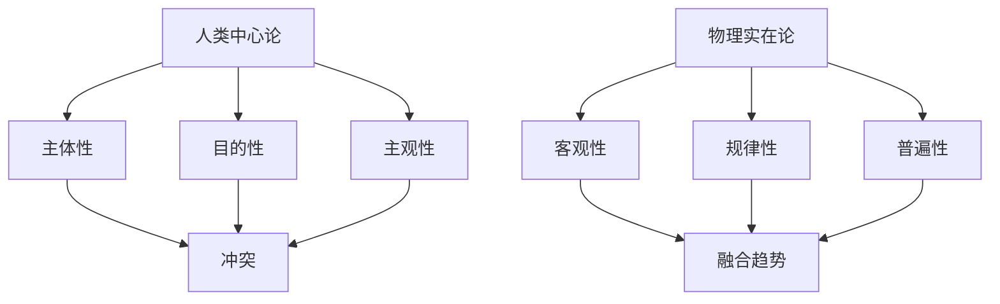

                 

### 引言

#### 1.1 问题背景

**人类中心论的历史与发展**

人类中心论（Anthropocentrism）是一种哲学观点，认为人类在宇宙中占据中心地位，是所有生命和自然现象的终极目的和核心。这种观念早在古代哲学中就有体现。在古希腊哲学中，普罗塔戈拉（Protagoras）提出了“人是万物的尺度”的观点，强调了人类的主观感受在判断事物上的重要性。在基督教哲学中，托马斯·阿奎那（Thomas Aquinas）进一步发展了人类中心论，认为人类是上帝创造的万物之冠，拥有智慧和理性的独特能力。

在中世纪哲学中，人类中心论得到了广泛的接受和传播。中世纪的神学家们认为，人类是上帝的杰作，是宇宙的皇冠。他们强调人类在道德和精神层面的卓越，认为人类拥有自由意志和道德责任。

近代哲学中，人类中心论经历了一次重要的转变。启蒙运动时期，笛卡尔（René Descartes）提出了“我思故我在”（Cogito, ergo sum）的哲学命题，进一步强调了人类的主体性和独立思考能力。与此同时，人本主义哲学的兴起也强化了人类中心论的观念，强调人类的价值和尊严，倡导个体的自由和自我实现。

**物理实在论的基本概念与演进**

物理实在论（Physical Realism）是一种哲学观点，认为宇宙中存在独立于人类意识和感知的客观实在。物理实在论的核心原则是，物理世界有其固有的本质和规律，这些本质和规律不依赖于人类的观察和测量。物理实在论的发展历程可以追溯到古代哲学，例如亚里士多德（Aristotle）的实体理论。亚里士多德认为，实体是构成宇宙的基本单位，是客观存在的。

在中世纪，自然哲学继续探讨了物理实在论的问题。奥卡姆的威廉（William of Ockham）提出了“简约原理”，主张只有那些可以直接观察和验证的事物才是真实的。

近代物理学的发展进一步巩固了物理实在论的观念。伽利略（Galileo Galilei）和牛顿（Isaac Newton）的工作表明，宇宙中的运动和力可以用数学公式精确描述，这种描述不依赖于人类的主观感受。牛顿的万有引力定律和三大运动定律为物理实在论提供了强有力的支持。

现代物理学，尤其是量子力学和相对论的发展，对物理实在论提出了新的挑战。量子力学揭示了微观世界中的一些奇特现象，例如波粒二象性和量子纠缠，这些现象似乎与物理实在论的直观理解不符。相对论则表明，时间和空间是相对的，而不是绝对不变的。

**当前宇宙观探讨的必要性**

在当今科技高速发展的时代，人类对宇宙的认识正在不断深入。然而，人类中心论和物理实在论这两种宇宙观在根本上存在冲突。人类中心论强调人类的主导地位，认为人类是宇宙的核心和终极目的；而物理实在论则强调宇宙的客观规律和独立性，认为人类只是宇宙中的一部分。这种冲突在环境伦理学、科学哲学和技术哲学等领域尤为明显。

环境伦理学关注人类活动对自然环境的影响，需要考虑人类与自然的关系。人类中心论可能导致对自然资源的过度开发和环境破坏，而物理实在论则提醒我们，自然界的运行有其内在的规律，我们不能简单地以自身的需求和利益来衡量自然的价值。

科学哲学探讨科学知识的本质和科学的局限性。人类中心论可能导致科学研究的局限，只关注人类的需求和利益，而忽视了宇宙的其他部分。物理实在论则强调科学知识的客观性和普适性，认为科学知识应该尽可能地反映宇宙的客观规律。

技术哲学关注技术发展的伦理和社会影响。人类中心论可能导致技术的滥用和道德风险，而物理实在论则提醒我们在发展技术时需要考虑自然界的承载能力和可持续发展。

因此，探讨人类中心论和物理实在论这两种宇宙观，对于我们理解人类在宇宙中的地位和角色，以及如何平衡人类的需求与自然界的规律，具有重要的现实意义。

#### 1.2 问题的提出

**人类中心论与物理实在论的冲突**

人类中心论和物理实在论在根本观念上存在冲突。人类中心论强调人类的主导地位，认为人类是宇宙的中心和终极目的。而物理实在论则认为宇宙中存在独立于人类意识和感知的客观实在。这种冲突在环境伦理学、科学哲学和技术哲学等领域尤为突出。

**研究目的与方法**

本文旨在探讨人类中心论和物理实在论这两种宇宙观的本质、历史发展和相互关系，分析它们在不同领域中的应用和影响，并探讨可能的融合趋势和未来展望。

为了达到研究目的，本文将采用以下方法：

1. **文献综述**：系统回顾人类中心论和物理实在论的历史发展和主要观点，为本文的分析提供理论基础。
2. **概念解析**：详细解析人类中心论和物理实在论的核心概念和属性特征，对比两者的差异和联系。
3. **案例分析**：通过具体案例，分析人类中心论和物理实在论在不同领域的应用和影响。
4. **趋势展望**：探讨人类中心论和物理实在论的融合趋势，分析其对未来科学研究、社会发展和伦理道德的影响。

**边界与外延**

在探讨人类中心论和物理实在论时，需要明确它们的边界和适用范围。人类中心论主要关注人类与自然的关系，强调人类的主导地位；而物理实在论则关注宇宙的客观规律和独立性，强调物理世界的本质。在研究过程中，我们需要注意避免将这两种观点简单对立，而是要探讨它们在不同领域的互补和融合。

#### 1.3 核心概念与联系

**人类中心论的概念属性特征**

- **定义**：人类中心论是一种哲学观点，认为人类在宇宙中占据中心地位，是所有生命和自然现象的终极目的和核心。
- **特征**：
  - **主体性**：强调人类的主导地位，认为人类是宇宙的中心。
  - **目的性**：认为人类的利益和需求是宇宙运行的根本目的。
  - **主观性**：认为人类的主观感受和认知是判断事物的重要依据。

**物理实在论的概念属性特征**

- **定义**：物理实在论是一种哲学观点，认为宇宙中存在独立于人类意识和感知的客观实在。
- **特征**：
  - **客观性**：强调物理世界的独立性和客观规律。
  - **规律性**：认为宇宙的运行有其固有的规律和法则。
  - **普遍性**：认为这些规律和法则适用于所有物理现象，不依赖于人类的观察和测量。

**概念关系图架构**

为了更清晰地展示人类中心论和物理实在论的关系，我们可以使用Mermaid流程图来构建概念关系图。以下是该图的基本架构：

在这个概念关系图中，人类中心论和物理实在论的核心概念通过主体性、目的性和主观性等属性特征进行对比，并展示了它们在哲学视角下宇宙观中的互补和融合趋势。

通过这一部分的内容，我们初步了解了人类中心论和物理实在论的基本概念、历史发展和核心特征，为后续的深入探讨奠定了基础。在接下来的章节中，我们将进一步解析这两种宇宙观，分析它们在不同领域中的应用和影响。  

---

### 人类中心论解析

#### 2.1 人类中心论的历史与发展

人类中心论的思想可以追溯到古代哲学，它在不同的文化背景下有着多样的表现形式和理论基础。以下将详细探讨古代哲学、基督教哲学、中世纪哲学以及近代哲学中人类中心论的发展。

**古代哲学中的人类中心论**

在古希腊哲学中，人类中心论的观念得到了初步的体现。普罗塔戈拉（Protagoras）提出的“人是万物的尺度”（Man is the measure of all things）成为人类中心论的重要起点。这一观念强调人类在认识和评价事物中的主观能动性，将人类置于宇宙的中心地位。

苏格拉底（Socrates）和柏拉图（Plato）进一步发展了人类中心论的思想。苏格拉底通过“知识即美德”（Knowledge is virtue）的观点，强调人类通过知识的追求实现道德的提升，从而在精神层面确立了人类的核心地位。柏拉图则通过理念论（Theory of Forms），认为人类灵魂具有高于物质世界的本质，进一步强化了人类在宇宙中的特殊地位。

**基督教哲学中的人类中心论**

在基督教哲学中，人类中心论的观念得到了深刻的宗教化表达。圣奥古斯丁（Saint Augustine）是中世纪基督教哲学的重要代表人物，他提出了“人是上帝的肖像”（Man is the image of God）的观点，认为人类在上帝眼中具有无与伦比的尊严和重要性。

托马斯·阿奎那（Thomas Aquinas）是另一位重要的基督教哲学家，他在其《神学大全》（Summa Theologica）中进一步发展了人类中心论。阿奎那认为，人类是上帝创造的万物之冠，拥有智慧和理性的独特能力。他强调，人类通过信仰和理性可以理解上帝的存在和宇宙的秩序，从而在精神层面上确立了人类在宇宙中的中心地位。

**中世纪哲学中的人类中心论**

在中世纪哲学中，人类中心论得到了广泛的接受和传播。安瑟伦（Anselm of Canterbury）提出了“上帝存在证明”（Ontological Argument），认为人类通过理性思考可以推断出上帝的存在，这进一步强化了人类在宇宙中的独特地位。

奥卡姆的威廉（William of Ockham）是中世纪晚期的重要哲学家，他提出了“简约原理”（Ockham's Razor），主张在解释宇宙现象时，应尽量采用最简单和最直接的解释，这一原理在某种程度上也反映了人类中心论的思想，即人类是宇宙中最简洁和最有效的解释者。

**近代哲学中的人类中心论**

在近代哲学中，人类中心论经历了重要的转变。启蒙运动时期的哲学家如笛卡尔（René Descartes）和斯宾诺莎（Baruch Spinoza）对人类中心论进行了新的阐述。

笛卡尔通过“我思故我在”（Cogito, ergo sum）的哲学命题，强调了人类的主体性和独立思考能力。他认为，人类通过理性可以认识世界，从而在精神层面确立了人类在宇宙中的核心地位。

斯宾诺莎则提出了“实体即属性”（Substance is Attribute）的观点，认为宇宙中的所有事物都是上帝（或称为“实体”）的不同属性的表现。尽管他的观点与传统的宗教人类中心论有所不同，但他在哲学上依然强调了人类在认识宇宙中的独特地位。

**总结**

人类中心论在不同哲学传统中有着丰富的表现形式和理论基础。从古希腊哲学到近代哲学，人类中心论始终关注人类在宇宙中的地位和作用，强调人类的主导地位和独特价值。这种观念不仅反映了人类对自己在世界中角色的认知，也深刻影响了人类与自然、社会以及宗教之间的关系。

在接下来的章节中，我们将进一步探讨人类中心论在当代哲学中的发展，特别是后现代主义、环境伦理学和技术哲学等领域中的应用和影响。

---

#### 2.2 近代哲学中的人类中心论

**启蒙运动**

启蒙运动是18世纪欧洲哲学领域的一次重大变革，它强调理性、科学和个体自由，对传统权威进行了质疑和批判。在这一时期，人类中心论得到了新的发展和强化。启蒙思想家如笛卡尔（René Descartes）、莱布尼茨（Gottfried Wilhelm Leibniz）、伏尔泰（Voltaire）和卢梭（Jean-Jacques Rousseau）等，都从不同角度探讨了人类中心论的问题。

笛卡尔通过“我思故我在”（Cogito, ergo sum）的哲学命题，强调了人类的主体性和独立思考能力。他认为，人类通过理性可以认识世界，从而在精神层面确立了人类在宇宙中的核心地位。笛卡尔的这一观点不仅推动了科学哲学的发展，也为人类中心论提供了新的哲学基础。

莱布尼茨则提出了“单子论”（Monadology），认为宇宙中的所有事物都是由“单子”组成的，每个单子都是独立的实体，拥有自己的内在本质。虽然莱布尼茨的观点与传统的物质主义和机械论有所不同，但他在某种程度上也强调了人类在认识宇宙中的独特地位。

伏尔泰和卢梭则通过批判宗教权威和传统道德，进一步强调了人类的价值和尊严。伏尔泰提倡宽容和自由，认为人类应该享有平等的权利和自由。卢梭则通过“社会契约论”（Social Contract Theory），强调了人类通过社会合作可以实现自由和平等，进一步强化了人类中心论的观念。

**人本主义哲学**

19世纪末到20世纪初，人本主义哲学成为哲学领域的重要流派之一，它强调人类的价值、尊严和自由，对人类中心论进行了深入的探讨和阐述。人本主义哲学的代表人物如尼采（Friedrich Nietzsche）、海德格尔（Martin Heidegger）和萨特（Jean-Paul Sartre）等，都从不同角度对人类中心论进行了哲学上的反思和扩展。

尼采提出了“超人”（Übermensch）的概念，认为人类应该超越传统的道德观念和价值观，追求自我实现和力量的提升。尼采的人本主义哲学强调个体的独立性和创造力，认为人类是宇宙中的独特存在，拥有改变世界的力量。

海德格尔则通过对存在论的探讨，提出了“此在”（Dasein）的概念，强调人类的存在是独特的、无法被完全理解和定义的。海德格尔认为，人类通过“存在”与宇宙进行对话，从而在宇宙中找到了自己的位置和意义。

萨特则通过“存在主义”（Existentialism）哲学，强调人类的自由和责任。他认为，人类是自由的存在，可以通过自己的选择和行动创造自己的意义。萨特的存在主义哲学进一步强化了人类中心论的观念，认为人类在宇宙中具有不可替代的价值和尊严。

**科学哲学**

科学哲学是20世纪哲学领域的重要分支，它探讨科学知识的本质、科学方法及其在认识世界中的作用。科学哲学中的人类中心论关注科学知识的产生和传播，探讨了人类在科学探索中的主体性和中心地位。

科学哲学的代表人物如卡尔·波普尔（Karl Popper）、托马斯·库恩（Thomas Kuhn）和保罗·费耶阿本德（Paul Feyerabend）等，都对人类中心论进行了深入的探讨。

波普尔提出了“证伪主义”（Falsificationism）的观点，认为科学知识是通过不断质疑和验证来获得的。波普尔认为，人类通过理性的思考和实验，可以不断挑战和推翻旧有的科学理论，从而推动科学的进步。

库恩则提出了“科学革命”（Scientific Revolution）和“范式转换”（Paradigm Shift）的概念，强调科学知识的动态性和相对性。库恩认为，科学知识的进步是通过不同范式之间的竞争和转换来实现的，这种过程体现了人类在科学探索中的主体性和中心地位。

费耶阿本德则提出了“无政府主义科学观”（Anarchistic Theory of Knowledge），认为科学知识并不是通过单一的方法和理论获得的，而是通过多种方法和理论的综合来获得的。费耶阿本德强调，人类在科学探索中的多样性和创造性，是科学知识进步的重要动力。

**总结**

近代哲学中的人类中心论在多个领域得到了深入的发展和扩展。启蒙运动时期的人本主义哲学和科学哲学，强调了人类在宇宙中的独特地位和主体性；而19世纪末到20世纪初的人本主义哲学和存在主义哲学，则进一步探讨了人类的价值、尊严和自由。这些哲学流派在人类中心论的探讨中，从不同角度和层面丰富了人类中心论的理论基础，为当代哲学提供了重要的思想资源。

在接下来的章节中，我们将继续探讨人类中心论在当代哲学中的发展，特别是后现代主义、环境伦理学和技术哲学等领域中的应用和影响。

---

#### 2.3 当代哲学中的人类中心论

**后现代主义**

后现代主义是20世纪后半叶哲学领域的重要思潮，它对现代性、科学和理性进行了深刻的批判和反思。后现代主义中的许多观点对人类中心论提出了挑战，同时也提供了一些新的解释和扩展。

**批判理论**

批判理论是后现代主义的一个重要分支，代表人物如弗朗茨·布洛克曼（Franz Blochmann）和扬·弗里德曼（Jan Friedrich Schmidt）等。批判理论认为，现代社会中存在多种压迫和剥削形式，包括经济、政治和文化等方面的压迫。在这种背景下，人类中心论被批判为掩盖了这些不平等和权力关系。批判理论主张，应该重新审视人类在宇宙中的地位，特别是要关注社会中的弱势群体。

**解构主义**

解构主义是后现代主义中的另一个重要流派，代表人物如雅克·德里达（Jacques Derrida）。解构主义通过对语言和文本的批判，挑战了传统的中心化和固定化观念。德里达提出了“差异”（difference）和“延异”（differance）的概念，认为语言和符号系统中的意义是不断变化和分散的，而不是固定和统一的。这种观点对人类中心论构成了挑战，因为人类中心论往往依赖于固定和统一的价值体系。

**生态学**

在后现代主义的生态学观点中，人类中心论受到了进一步的批判和挑战。代表人物如诺拉·阿姆斯壮（Nora Armstrong）和约翰·瑞迪（John Read）等，他们认为，人类中心论忽视了生态系统的复杂性和多样性。生态学观点主张，人类只是地球上众多生命形式中的一种，而不是唯一的中心。这种观点强调了人类与自然环境的相互依赖关系，呼吁人类重新审视自己在宇宙中的角色。

**技术哲学**

技术哲学关注科技的发展及其对社会和自然环境的影响。后现代主义的技术哲学观点批判了人类中心论在技术发展中的应用。代表人物如唐·伊德（Don Ihde）和希瑟·诺里斯（Heather Norris）等，他们指出，技术不仅是人类设计和控制的工具，也是自然界和人类社会之间互动的一部分。这种观点认为，技术发展应该考虑生态和社会的可持续性，而不是仅仅追求人类的经济利益。

**总结**

当代哲学中的人类中心论在后现代主义、生态学和技术哲学等领域中得到了新的发展和解释。后现代主义对人类中心论的批判挑战了传统的中心化观念，强调了多样性和相对性。生态学和技术哲学则进一步探讨了人类与自然环境的相互关系，呼吁人类重新审视自己在宇宙中的角色。这些观点为当代哲学提供了丰富的思想资源，也为人类中心论的重新定义和扩展提供了可能性。

在接下来的章节中，我们将继续探讨人类中心论在环境伦理学和技术哲学中的应用，分析它们如何影响我们的价值观和行为方式。

---

#### 2.3 当代哲学中的人类中心论（续）

**环境伦理学**

环境伦理学是当代哲学中的一个重要分支，它探讨人类与自然环境之间的关系，强调人类对环境的责任和道德义务。人类中心论在环境伦理学中扮演着重要角色，但其应用和影响也面临着一些挑战和争议。

**深生态学**

深生态学是环境伦理学中的一个重要流派，它由挪威哲学家阿恩·内斯（Arne Naess）提出。深生态学批判了传统的人类中心论，认为人类不应该被视为自然环境的唯一中心，而应该将其他生物和生态系统视为具有内在价值的实体。深生态学主张，人类应该尊重自然的多样性，并寻求与自然环境的和谐共存。

**生物中心主义**

生物中心主义是环境伦理学的另一个重要流派，它由保罗·泰勒（Paul Taylor）提出。生物中心主义认为，所有生命形式都有内在价值，而不仅仅是人类。生物中心主义挑战了传统的人类中心论，强调所有生物都应该受到道德关怀和保护。这种观点认为，人类应该尊重和保护其他生物的生存权利和福祉。

**生态女性主义**

生态女性主义是环境伦理学中的一个新兴流派，它结合了生态学和女性主义的理念。生态女性主义认为，人类中心论不仅忽视了自然的内在价值，也反映了社会中的性别不平等。生态女性主义主张，女性与自然之间存在深刻的联系，应该通过消除性别不平等来保护自然环境。

**应用与争议**

人类中心论在环境伦理学中的应用面临着一些争议。一方面，人类中心论强调人类的责任和道德义务，这有助于推动环境保护和可持续发展。另一方面，人类中心论也可能导致人类对自然资源的过度开发和环境破坏。深生态学、生物中心主义和生态女性主义等流派试图克服人类中心论的局限性，强调人类与自然环境的相互依存关系。

**总结**

当代哲学中的人类中心论在环境伦理学中扮演着复杂而多样的角色。环境伦理学中的深生态学、生物中心主义和生态女性主义等流派，通过批判和扩展人类中心论，推动了人类对自然环境的责任和道德关怀。在环境伦理学的讨论中，人类中心论的应用和影响是一个持续发展和争议的话题，它反映了人类与自然环境之间复杂的道德关系。

在接下来的章节中，我们将继续探讨人类中心论在技术哲学中的应用，分析技术发展如何影响人类与自然环境的互动，以及这些互动对人类中心论的影响。

---

#### 2.4 当代哲学中的人类中心论（续）

**技术哲学**

技术哲学是当代哲学中的一个重要领域，它探讨科技的发展、应用及其对人类和社会的影响。人类中心论在技术哲学中具有独特的地位和影响，但其应用和影响也面临着诸多挑战和争议。

**技术决定论**

技术决定论是一种哲学观点，认为技术的发展和应用具有内在的必然性，可以决定社会和文化的发展。技术决定论往往强调人类中心论，认为人类是技术的创造者和主导者，技术的进步和发展主要取决于人类的智慧和创造力。这种观点在科技产业和工程领域得到了广泛应用，推动了技术的快速发展和应用。

**技术价值论**

技术价值论是一种探讨技术价值的哲学观点，认为技术不仅是一种工具或手段，还具有内在的价值和意义。技术价值论中的人类中心论强调人类通过技术可以创造价值，改善生活条件，实现自我提升。这种观点在伦理学和道德哲学中得到了广泛讨论，促使人们反思技术应用的道德责任和社会影响。

**技术伦理学**

技术伦理学是技术哲学中的一个重要分支，它探讨技术在道德和社会层面的应用和影响。人类中心论在技术伦理学中具有重要的地位，它强调人类在技术决策和应用中的主导地位和责任。技术伦理学关注技术如何影响人类的福祉，如何平衡技术创新与社会责任之间的关系。

**技术应用中的人类中心论**

在技术应用中，人类中心论往往体现在以下几个方面：

1. **科技创新**：人类中心论认为，科技创新是人类智慧和创造力的体现，是人类进步的重要驱动力。技术创新的目标通常是为了提高人类生活质量、解决社会问题。

2. **技术应用**：人类中心论强调技术应用的主体是人类，技术应用的目标是为了满足人类的需求和利益。例如，医疗技术的发展旨在提高人类健康水平，交通技术的发展旨在提高人类出行效率。

3. **科技伦理**：人类中心论在科技伦理中强调人类的责任和道德义务，认为技术决策和应用应该遵循伦理原则，确保技术进步不会损害人类的福祉和利益。

**应用与争议**

人类中心论在技术哲学中的应用和影响也面临着诸多争议。一些批评者认为，人类中心论忽视了技术发展的复杂性和多样性，可能导致人类对自然环境的过度开发和资源消耗。此外，人类中心论也面临着技术滥用和道德风险的问题，例如科技在军事、隐私和人工智能等领域的应用。

**总结**

当代哲学中的人类中心论在技术哲学中具有独特的地位和影响。技术哲学通过探讨技术发展、应用及其伦理和社会影响，进一步扩展了人类中心论的概念和应用。在技术应用中，人类中心论强调人类的主导地位和责任，但同时也面临着诸多挑战和争议。通过批判和反思人类中心论，技术哲学有助于我们更全面地理解技术在社会和自然环境中的角色和影响。

在接下来的章节中，我们将进一步探讨人类中心论与物理实在论在科学哲学、环境伦理学和技术哲学等领域的对比和融合，分析这两种宇宙观的相互影响和未来发展。

---

### 3. 物理实在论的基本概念与演进

#### 3.1 物理实在论的定义

物理实在论是一种哲学观点，认为宇宙中存在独立于人类意识和感知的客观实在。它强调物理世界的独立性和客观规律，主张这些规律不依赖于人类的观察和测量。物理实在论的核心原则是，物理现象有其固有的本质和规律，这些本质和规律是普遍适用的，不受主观意识的干扰。

#### 3.1.1 实在论与唯心论的区别

在哲学中，实在论（Realism）与唯心论（Idealism）是两种对立的哲学观点。实在论认为，物质世界是独立存在的，具有固有的本质和属性；而唯心论则认为，物质世界是意识或思维的产物，不存在独立于意识的外在世界。

物理实在论属于实在论范畴，它强调物理世界的独立性和客观性。与唯心论相比，物理实在论认为物理现象有其固有的规律和本质，这些规律和本质不依赖于人类的意识和感知。物理实在论主张，物理世界是独立存在的，其运行遵循固有的物理法则，这些法则适用于所有物理现象，不受主观意识的干扰。

#### 3.1.2 物理实在论的基本原则

物理实在论的基本原则可以概括为以下几点：

1. **客观实在性**：物理实在论认为，宇宙中存在独立于人类意识和感知的客观实在。这些客观实在包括物质实体、物理过程和自然规律。

2. **规律性**：物理实在论强调物理世界的规律性。物理现象按照一定的规律运行，这些规律是普遍适用的，不受主观意识的干扰。

3. **普遍性**：物理实在论认为，物理规律具有普遍性，适用于所有物理现象。无论是宏观的宇宙现象，还是微观的粒子运动，都遵循相同的物理法则。

4. **独立性**：物理实在论强调物理世界的独立性。物理现象的运行不依赖于人类的观察和测量，即使没有人类存在，物理世界依然按照其固有的规律运行。

#### 3.2 物理实在论的发展历程

物理实在论的发展历程可以追溯到古代哲学。在古希腊哲学中，亚里士多德（Aristotle）提出了实体理论（Substance Theory），认为实体是构成宇宙的基本单位，是客观存在的。亚里士多德的实体理论为后来的物理实在论奠定了基础。

在中世纪，自然哲学家继续探讨了物理实在论的问题。奥卡姆的威廉（William of Ockham）提出了“简约原理”（Ockham's Razor），主张在解释宇宙现象时，应尽量采用最简单和最直接的解释。这一原理在某种程度上反映了物理实在论的思想，即物理世界有其固有的本质和规律。

近代物理学的发展进一步巩固了物理实在论的观念。伽利略（Galileo Galilei）和牛顿（Isaac Newton）的工作表明，宇宙中的运动和力可以用数学公式精确描述，这种描述不依赖于人类的主观感受。牛顿的万有引力定律和三大运动定律为物理实在论提供了强有力的支持。

现代物理学，尤其是量子力学和相对论的发展，对物理实在论提出了新的挑战。量子力学揭示了微观世界中的一些奇特现象，例如波粒二象性和量子纠缠，这些现象似乎与物理实在论的直观理解不符。相对论则表明，时间和空间是相对的，而不是绝对不变的。

#### 3.2.1 古代物理学的开端

古代物理学是物理实在论的重要起源。古希腊哲学家对自然界进行了深入的探讨，试图理解宇宙的基本结构和运行规律。亚里士多德是古代物理学的奠基人之一，他提出了实体理论和四元素说，认为宇宙由四种基本元素（水、土、火、空气）构成。亚里士多德的物理学理论对后来的哲学家和科学家产生了深远的影响。

#### 3.2.2 中世纪的自然哲学

在中世纪，自然哲学家继续探讨了物理实在论的问题。阿拉伯哲学家阿维罗伊（Averroes）和阿尔-法拉比（Al-Farabi）对亚里士多德的哲学进行了深入的研究和扩展。他们认为，物理世界是独立存在的，其运行遵循固有的规律。中世纪的自然哲学家还探讨了光、热、运动等物理现象，为后来的物理学发展奠定了基础。

#### 3.2.3 近代物理学的崛起

近代物理学是物理实在论发展的关键阶段。伽利略和牛顿是近代物理学的两位重要代表。伽利略通过实验和观察，提出了自由落体定律和惯性定律，表明物体在没有外力作用下会保持匀速直线运动。牛顿则提出了万有引力定律和三大运动定律，建立了经典力学体系。牛顿的物理学理论为物理实在论提供了强有力的支持，表明物理世界的运动和力可以用数学公式精确描述。

#### 3.2.4 现代物理学的演变

现代物理学是物理实在论继续发展的阶段。量子力学和相对论是现代物理学的两大重要成果。量子力学揭示了微观世界的奇特现象，如波粒二象性和量子纠缠，这些现象挑战了传统的物理实在论观念。相对论则表明，时间和空间是相对的，而不是绝对不变的。相对论的提出进一步深化了物理实在论的思想，认为物理世界的规律是相对的，取决于观察者的参照系。

#### 3.3 当前物理实在论的挑战与讨论

当前物理实在论面临着一些挑战和讨论，主要包括量子力学、相对论以及宇宙学的最新进展。

**量子力学**

量子力学揭示了微观世界中的一些奇特现象，如波粒二象性和量子纠缠。这些现象似乎与传统的物理实在论观念不符。量子力学的哥本哈根解释认为，量子系统的状态是概率性的，而不是确定性的。这意味着，物理实在论中的“客观实在性”原则需要重新审视。

**相对论**

相对论表明，时间和空间是相对的，而不是绝对不变的。这挑战了物理实在论中的“绝对时空”观念。相对论的提出进一步深化了物理实在论的思想，认为物理世界的规律是相对的，取决于观察者的参照系。

**宇宙学**

宇宙学的最新进展，如宇宙膨胀理论和暗物质、暗能量的研究，也对物理实在论提出了挑战。宇宙膨胀理论表明，宇宙正在不断扩张，这与传统的物理实在论观念中的宇宙稳定性相矛盾。暗物质和暗能量的存在也引发了关于物理实在性的讨论，因为它们不能直接观测，但其存在对宇宙的运行和结构有着重要影响。

**讨论与展望**

当前物理实在论的挑战和讨论主要集中在如何理解微观世界的量子现象和宇宙的宏观演化。一些物理学家和哲学家认为，量子力学和相对论并没有完全否定物理实在论，而是对其进行了扩展和深化。他们认为，物理实在论仍然是一个重要的哲学原则，但在面对量子现象和宇宙学问题时，需要重新审视和调整。

未来，物理实在论的发展可能依赖于对量子力学和相对论的进一步理解，以及对宇宙学的深入研究。通过跨学科的合作和探索，物理实在论将继续在哲学和科学领域发挥重要作用。

---

#### 3.3 当前物理实在论的挑战与讨论

**宇宙学的进展**

宇宙学是研究宇宙起源、演化和结构的科学，它在近年来取得了重大进展，对物理实在论提出了新的挑战。宇宙膨胀理论是宇宙学的一个核心概念，它表明宇宙正在不断扩张。这一理论最早由埃德温·哈勃（Edwin Hubble）在1920年代发现，他指出，远离我们的星系呈现出红移现象，这表明它们正在远离我们。随着对宇宙膨胀现象的深入研究，宇宙学发现了宇宙膨胀加速的迹象，这一现象被称为“宇宙加速膨胀”。

宇宙加速膨胀的一个重要原因是暗能量的存在。暗能量是一种神秘的力量，它驱动着宇宙的加速膨胀。暗能量占据了宇宙能量密度的主导地位，但其本质尚未完全理解。物理实在论面临的一个关键问题是，如何将暗能量纳入物理理论中，使其与已知的物理定律相协调。

**相对论与量子力学的融合**

相对论和量子力学是现代物理学的两大支柱，但它们之间存在着深刻的矛盾。相对论描述了宏观尺度的物理现象，特别是大尺度宇宙的结构和运动；而量子力学则描述了微观尺度的物理现象，特别是原子和粒子的行为。两者在描述物理现象时各有优势，但在某些方面却存在不一致。

相对论和量子力学的融合是当前物理实在论面临的一个重大挑战。相对论中的引力理论和量子力学中的量子场论在数学形式上存在不一致，这使得我们难以构建一个统一的理论来描述所有物理现象。近年来，一些理论物理学家提出了几种可能的解决方案，如弦理论和量子引力理论，但它们仍然处于理论探索阶段，尚未得到实验验证。

**暗物质与暗能量**

暗物质和暗能量是当前宇宙学中两个最具挑战性的问题。暗物质是宇宙中不发光、不发热的物质，它对宇宙的引力作用有重要影响。尽管我们不能直接观测暗物质，但通过引力透镜效应、星系旋转曲线等实验方法，我们可以推断出暗物质的存在。暗物质的问题在于，它的本质和性质尚不清楚，这给物理实在论带来了新的挑战。

暗能量则是驱动宇宙加速膨胀的力量，其本质同样不明确。暗能量具有负压强，这种特性使得它具有排斥力，从而驱动宇宙的加速膨胀。暗能量的存在和特性挑战了物理实在论的客观性和规律性，因为它的行为无法用传统物理理论解释。

**当前讨论**

当前，物理实在论在宇宙学领域面临着诸多讨论和争议。一些科学家认为，暗物质和暗能量的存在挑战了传统的物理实在论观念，因为它们不符合我们通常对物质和能量的理解。另一些科学家则认为，暗物质和暗能量是物理实在论的一部分，只是我们对它们的理解还不够深入。这些讨论推动了物理学的前沿研究，促进了新理论和技术的产生。

未来的研究可能会揭示暗物质和暗能量的本质，从而深化我们对物理实在论的理解。同时，随着宇宙学观测技术的不断进步，我们有望获得更多关于宇宙结构和演化的数据，这将为物理实在论提供更多的证据和解释。

**总结**

宇宙学的进展，特别是宇宙膨胀理论、相对论与量子力学的融合以及暗物质和暗能量的研究，对物理实在论提出了新的挑战和讨论。物理实在论在面临这些挑战的同时，也推动了物理学的发展和进步。未来，随着新理论和技术的不断涌现，物理实在论将继续在宇宙学和物理学领域发挥重要作用。

---

### 4. 人类中心论与物理实在论的对比

#### 4.1 基本理念的对比

**人类中心论的视角**

人类中心论（Anthropocentrism）是一种哲学观点，认为人类在宇宙中占据中心地位。具体来说，人类中心论有以下基本理念：

1. **主体性**：人类是宇宙中的主体，具有独立意识和自我意识。
2. **目的性**：人类的利益和需求是宇宙运行的根本目的。
3. **主观性**：人类的主观感受和认知是判断事物的重要依据。

人类中心论强调人类的主导地位，认为人类应该通过理性、智慧和创造力来影响和改变宇宙。这种观点在古代哲学、基督教哲学、启蒙运动和人本主义哲学等领域得到了广泛的发展和应用。

**物理实在论的视角**

物理实在论（Physical Realism）是一种哲学观点，认为宇宙中存在独立于人类意识和感知的客观实在。物理实在论的基本理念包括：

1. **客观性**：宇宙中的物理现象具有固有的本质和规律，这些规律不依赖于人类的观察和测量。
2. **规律性**：物理世界遵循一定的规律，这些规律是普遍适用的，适用于所有物理现象。
3. **独立性**：物理世界独立于人类意识存在，其运行不依赖于人类的感知和认知。

物理实在论强调物理世界的独立性和客观性，认为物理规律是普遍适用的，不受主观意识的干扰。这种观点在古代哲学、中世纪自然哲学、近代物理学和现代物理学等领域得到了广泛的发展和应用。

**对比**

人类中心论和物理实在论在基本理念上存在显著差异。人类中心论强调人类的主导地位和主观感受，认为人类是宇宙的中心和终极目的。而物理实在论则强调物理世界的独立性和客观性，认为宇宙中存在独立于人类意识和感知的客观实在。这两种观点在宇宙观、伦理学、科学方法和价值观念等方面产生了深远的影响。

1. **宇宙观**：人类中心论将人类视为宇宙的中心，强调人类的主导地位和责任。物理实在论则将宇宙视为一个独立存在的系统，强调物理规律和自然法则的普遍性。
2. **伦理学**：人类中心论强调人类对自然环境的责任和道德义务，认为人类应该保护自然和生态系统。物理实在论则强调人类与自然环境的相互依赖关系，主张尊重自然的内在价值。
3. **科学方法**：人类中心论强调人类的主观认知和理性思考，认为科学知识是通过人类的主观体验和推理获得的。物理实在论则强调客观观测和实验验证，认为科学知识是通过对物理现象的客观描述和解释获得的。
4. **价值观念**：人类中心论强调人类的价值和尊严，认为人类应该追求自由、平等和幸福。物理实在论则强调物理世界的规律和秩序，认为物理规律是普遍适用的，不受主观意识的干扰。

**结论**

人类中心论和物理实在论是两种不同的宇宙观，它们在基本理念上存在显著差异。人类中心论强调人类的主导地位和主观感受，而物理实在论则强调物理世界的独立性和客观性。这两种观点在哲学、伦理学、科学方法和价值观念等方面产生了深远的影响。探讨这两种宇宙观的差异和联系，有助于我们更全面地理解人类在宇宙中的地位和角色，以及如何平衡人类的需求与自然界的规律。

---

#### 4.2 应用领域的对比

**科学哲学**

科学哲学探讨科学知识的本质、科学方法及其在认识世界中的作用。在科学哲学中，人类中心论和物理实在论都有其独特的应用和影响。

**人类中心论在科学哲学中的应用**

人类中心论在科学哲学中的应用主要体现在科学知识的产生和传播过程中。人类中心论强调人类的主导地位和主观认知，认为科学知识是通过人类的主观体验和理性思考获得的。这种观点在科学哲学中的表现为：

1. **经验主义**：经验主义认为，科学知识是基于人类经验的观察和实验获得的。例如，伽利略通过观察和实验发现了自由落体定律，从而推动了科学革命。
2. **理性主义**：理性主义认为，科学知识是通过人类理性思考和推理获得的。例如，牛顿通过理性思考提出了万有引力定律，从而建立了经典力学体系。

**物理实在论在科学哲学中的应用**

物理实在论在科学哲学中的应用则强调物理世界的独立性和客观规律。物理实在论认为，科学知识是通过对物理现象的客观描述和解释获得的。这种观点在科学哲学中的表现为：

1. **实证主义**：实证主义认为，科学知识是基于客观实验和观测获得的。例如，爱因斯坦通过实验验证了相对论，从而证实了时空相对性的观点。
2. **逻辑实证主义**：逻辑实证主义认为，科学知识是通过对物理现象的逻辑分析和数学描述获得的。例如，量子力学的数学公式为微观世界提供了精确的描述。

**对比与影响**

人类中心论和物理实在论在科学哲学中的应用产生了不同的影响。人类中心论强调人类的主观认知和理性思考，有助于推动科学知识的创新和发展。然而，人类中心论也可能导致科学研究的局限，忽视了物理世界的客观规律和复杂性。物理实在论则强调物理世界的独立性和客观规律，有助于确保科学知识的准确性和普适性。然而，物理实在论也可能导致科学研究的过度理性化和机械化，忽视了人类的主观体验和创造性。

**环境伦理学**

环境伦理学探讨人类与自然环境之间的关系，强调人类对环境的责任和道德义务。在环境伦理学中，人类中心论和物理实在论也有其独特的应用和影响。

**人类中心论在环境伦理学中的应用**

人类中心论在环境伦理学中的应用主要体现在人类对自然环境的责任和道德义务上。人类中心论认为，人类是宇宙的中心，应该保护和改善自然环境。这种观点在环境伦理学中的表现为：

1. **环境保护主义**：环境保护主义认为，人类有责任保护自然环境，防止环境破坏。例如，可持续发展理念主张，在满足人类当前需求的同时，要保护和改善自然环境。
2. **生态女性主义**：生态女性主义认为，人类应该尊重自然的内在价值，消除社会中的性别不平等，实现人与自然的和谐共存。

**物理实在论在环境伦理学中的应用**

物理实在论在环境伦理学中的应用则强调人类与自然环境的相互依赖关系。物理实在论认为，人类和自然环境是相互关联的，人类的生存和发展依赖于自然环境。这种观点在环境伦理学中的表现为：

1. **生态学**：生态学认为，所有生物和环境都是相互依赖的，应该尊重和保护生态系统的多样性。例如，保护生物多样性是生态学的基本原则之一。
2. **资源伦理学**：资源伦理学认为，人类应该合理利用自然资源，避免过度开发和浪费。例如，循环经济理念主张，通过资源的回收利用，减少对自然资源的消耗。

**对比与影响**

人类中心论和物理实在论在环境伦理学中的应用产生了不同的影响。人类中心论强调人类的主导地位和责任，有助于推动环境保护和可持续发展。然而，人类中心论也可能导致人类对自然资源的过度开发和环境破坏。物理实在论则强调人类与自然环境的相互依赖关系，有助于我们更全面地理解人类与环境之间的复杂关系。然而，物理实在论也可能忽视人类的主观体验和创造性。

**技术哲学**

技术哲学探讨技术发展的伦理和社会影响，关注科技对人类和社会的潜在影响。在技术哲学中，人类中心论和物理实在论也有其独特的应用和影响。

**人类中心论在技术哲学中的应用**

人类中心论在技术哲学中的应用主要体现在技术的应用和伦理责任上。人类中心论认为，技术是人类的创造和工具，应该服务于人类的需求和利益。这种观点在技术哲学中的表现为：

1. **技术伦理**：技术伦理认为，技术发展应该遵循伦理原则，确保技术的应用不会损害人类的福祉。例如，医学伦理在医疗技术的应用中起到了关键作用。
2. **民主技术**：民主技术认为，技术的发展应该由公众参与和决策，确保技术的应用符合社会的利益和价值观。

**物理实在论在技术哲学中的应用**

物理实在论在技术哲学中的应用则强调技术的客观性和规律性。物理实在论认为，技术发展应该基于对物理世界的理解和应用，确保技术的科学性和可靠性。这种观点在技术哲学中的表现为：

1. **工程伦理**：工程伦理认为，技术工程师在设计和应用技术时，应该遵循科学原则和伦理规范，确保技术的安全性和可持续性。
2. **技术预测**：技术预测认为，通过分析和理解物理世界的规律，可以预测和评估技术的未来发展趋势和影响。

**对比与影响**

人类中心论和物理实在论在技术哲学中的应用产生了不同的影响。人类中心论强调技术的人文关怀和社会责任，有助于推动技术伦理和社会责任的实现。然而，人类中心论也可能导致技术的过度应用和伦理风险。物理实在论则强调技术的科学性和客观性，有助于确保技术的科学性和可靠性。然而，物理实在论也可能忽视人类的主观体验和创造性。

**结论**

在科学哲学、环境伦理学和技术哲学等领域中，人类中心论和物理实在论都有其独特的应用和影响。人类中心论强调人类的主导地位和主观认知，有助于推动科学知识和技术创新。物理实在论则强调物理世界的独立性和客观规律，有助于确保科学知识和技术的科学性和可靠性。探讨这两种宇宙观的对比和应用，有助于我们更全面地理解人类在宇宙中的地位和角色，以及如何平衡人类的需求与自然界的规律。

---

#### 4.3 意义与影响的对比

**对人类自身的影响**

人类中心论和物理实在论对人类自身的影响是深刻而多方面的。人类中心论强调人类的主导地位和独特价值，这种观念促使人类在探索自然界、追求科学技术进步和社会发展的过程中，积极发挥主观能动性。人类中心论的积极影响包括：

1. **自信心提升**：人类中心论鼓励人类相信自己的智慧和创造力，从而增强了人类的自信心，推动了人类对未知世界的探索。
2. **科技创新**：人类中心论强调人类的主导地位，促进了科技研究和应用的发展，推动了人类社会从农业社会向工业社会、信息社会的转变。
3. **社会进步**：人类中心论认为人类应该追求自由、平等和幸福，这一观念推动了社会制度的改革和进步，提高了人类的生活质量。

然而，人类中心论也存在负面影响，例如可能导致人类对自然资源的过度开发和环境破坏，忽视了自然界的内在价值。物理实在论则强调物理世界的独立性和客观规律，这种观念促使人类在探索自然界时，更加注重客观事实和科学方法。物理实在论对人类自身的影响包括：

1. **科学精神培养**：物理实在论强调科学知识的客观性和规律性，培养了人类的科学精神和批判思维，促进了科学方法在各个领域的应用。
2. **可持续发展**：物理实在论强调人类与自然环境的相互依赖关系，促使人类在发展过程中考虑生态和环境的可持续性，推动了可持续发展和生态文明的建设。
3. **社会和谐**：物理实在论提醒人类尊重自然界的客观规律，避免了人类对自然资源的无序开发，有助于实现人与自然的和谐共生。

**对自然环境的影响**

人类中心论和物理实在论对自然环境的影响也是显而易见的。人类中心论强调人类的主导地位，可能导致对自然资源的过度开发和环境破坏。这种观念在人类工业化和城市化进程中得到了体现，导致了全球气候变化、生物多样性的丧失和生态系统的破坏。人类中心论的负面影响包括：

1. **环境污染**：过度开采自然资源和工业化生产导致了大量污染物的排放，严重污染了大气、水源和土壤，威胁了人类和其他生物的健康。
2. **生态失衡**：人类对自然资源的过度开发和生态破坏导致了生态系统的失衡，许多物种面临灭绝的危险，生态系统的稳定性受到威胁。
3. **气候变化**：人类活动导致的温室气体排放加剧了全球气候变化，引发了极端天气事件的频繁发生，对地球的气候系统产生了深远影响。

物理实在论则强调物理世界的独立性和客观规律，有助于人类在探索自然界时，更加注重环境保护和可持续发展。物理实在论对自然环境的影响包括：

1. **环境保护**：物理实在论促使人类在发展过程中考虑生态和环境的可持续性，推动了环境保护政策和可持续发展战略的实施。
2. **生态修复**：物理实在论提醒人类尊重自然界的客观规律，通过生态修复和环境保护措施，逐步恢复生态系统的平衡和多样性。
3. **资源节约**：物理实在论强调资源的有限性和节约使用，促使人类在生产和消费过程中，更加注重资源的节约和循环利用。

**对比与总结**

人类中心论和物理实在论在意义与影响上各有侧重。人类中心论强调人类的主导地位和独特价值，有助于推动科技创新和社会进步，但也可能导致对自然环境的过度开发和破坏。物理实在论则强调物理世界的独立性和客观规律，有助于培养科学精神和促进可持续发展，但也可能忽视人类的主观体验和创造性。在探讨和平衡这两种宇宙观时，我们需要综合考虑它们对人类自身和自然环境的影响，以实现人类与自然的和谐共生。

---

### 5. 两种宇宙观的融合与未来展望

#### 5.1 人类中心论与物理实在论的融合趋势

人类中心论和物理实在论虽然在基本理念上存在差异，但它们在现代社会中的融合趋势日益明显。这种融合不仅源于科技的发展，也受到社会意识的转变和政策与法律的支持。

**科学技术的推动**

随着科学技术的不断进步，人类对宇宙的认识越来越深入。量子力学、相对论和宇宙学的最新进展，使得人类开始更加全面地理解宇宙的复杂性和多样性。这些科学技术的推动，有助于人类中心论和物理实在论的融合：

1. **量子纠缠**：量子纠缠现象表明，微观粒子之间存在一种超越时空的联系。这一发现挑战了物理实在论的传统观念，但也促使人类重新思考人类在宇宙中的角色。
2. **宇宙膨胀**：宇宙膨胀理论揭示了宇宙的动态性和不确定性。这一理论促使人类认识到，宇宙的运行并不完全遵循我们传统的物理定律，从而促进了人类中心论和物理实在论的融合。

**社会意识的转变**

社会意识的转变也是人类中心论与物理实在论融合的重要因素。随着全球化和环境问题的加剧，人类开始更加关注自然环境，意识到自己在宇宙中的责任和角色。这种社会意识的转变体现在：

1. **环境保护运动**：环境保护运动强调人类与自然环境的相互依赖关系，倡导可持续发展和生态保护。这一运动促使人类重新审视人类中心论和物理实在论的关系。
2. **社会责任感**：现代社会强调企业的社会责任，鼓励企业在追求经济利益的同时，关注环境保护和社会责任。这种社会责任感的提升，有助于人类中心论和物理实在论的融合。

**政策与法律的支持**

政策与法律的支持也是人类中心论与物理实在论融合的重要推动力。各国政府纷纷出台环境保护政策，鼓励可持续发展。这些政策与法律的支持，有助于：

1. **资源管理**：政策与法律鼓励资源节约和循环利用，减少对自然资源的过度开发。这一措施有助于平衡人类中心论和物理实在论的关系。
2. **科技创新**：政策与法律支持科技创新，特别是绿色技术和可持续发展技术的研发和应用。这种支持有助于人类在尊重物理规律的基础上，实现经济和社会发展。

#### 5.2 两种宇宙观对未来的影响

**科学研究的进展**

人类中心论和物理实在论的融合对科学研究产生了深远的影响。随着科技的进步，人类对宇宙的理解不断深化，新的科学发现层出不穷：

1. **宇宙起源**：人类中心论与物理实在论的融合有助于揭示宇宙的起源和演化。通过观测宇宙微波背景辐射和宇宙大爆炸遗迹，科学家们不断深化对宇宙起源的理解。
2. **量子引力和宇宙学**：人类中心论与物理实在论的融合推动了量子引力和宇宙学的研究。科学家们试图将量子力学与广义相对论结合起来，构建一个统一的物理理论，以解释宇宙的起源和演化。

**社会发展的方向**

人类中心论与物理实在论的融合对社会发展产生了重要影响。随着人类对自然环境的认识不断深化，社会发展逐渐向可持续和和谐的方向转变：

1. **可持续发展**：人类中心论与物理实在论的融合推动了可持续发展的理念和实践。各国政府和社会组织纷纷制定可持续发展计划，通过科技创新和政策支持，实现经济、社会和环境的协调发展。
2. **生态文明**：人类中心论与物理实在论的融合促进了生态文明的建设。生态文明强调人与自然的和谐共生，倡导绿色发展、循环经济和生态保护。

**伦理道德的讨论**

人类中心论与物理实在论的融合也引发了伦理道德的讨论。随着人类对宇宙和自然的认识不断深化，伦理道德观念也在不断变化：

1. **人类责任**：人类中心论与物理实在论的融合促使人类认识到自己在宇宙中的责任。人类应该保护自然环境，尊重生态系统的多样性，实现可持续发展。
2. **道德准则**：人类中心论与物理实在论的融合推动了道德准则的更新。人类应该尊重自然规律，避免对自然环境的过度破坏，实现人与自然的和谐共生。

**结论**

人类中心论与物理实在论的融合是未来宇宙观发展的重要趋势。这种融合不仅促进了科学研究的进步，也推动了社会发展的方向和伦理道德的讨论。在人类中心论和物理实在论的融合过程中，我们需要不断调整和平衡人类的需求与自然界的规律，以实现人类与自然的和谐共生。

---

### 6. 案例分析

#### 6.1 人类中心论的案例分析

**人类活动对环境的影响**

人类活动对环境的影响是显而易见的，尤其是在工业化快速发展的时期。以下是几个典型案例，展示了人类中心论在环境问题中的体现：

**工业污染**：在20世纪中叶，工业化带来了经济的快速发展，但也导致了严重的环境污染。例如，英国的伦敦烟雾事件（1952年）和美国的洛杉矶光化学烟雾事件（1943年）都是由于工业废气排放导致的。这些事件不仅对当地居民的健康造成了严重危害，也揭示了人类中心论忽视自然环境的问题。

**森林砍伐**：全球森林砍伐问题也是人类中心论的一个典型表现。为了满足人类的住房、交通和农业需求，大量森林被砍伐。例如，亚马逊雨林的砍伐速度在过去几十年中急剧增加，导致了生物多样性的丧失和生态系统的破坏。这种环境破坏不仅影响了当地居民的生存环境，也对全球气候产生了负面影响。

**水资源滥用**：水资源是人类生存和发展的重要资源，但人类活动经常导致水资源的滥用和污染。例如，美国西部的水资源争夺问题，以及中国一些地区的水污染问题，都是由于人类中心论导致的。为了满足经济发展的需要，许多地区过度抽取地下水，导致了地下水位下降和地表水源枯竭。

**科技进步的双重效应**

科技进步在带来便利和发展的同时，也产生了双重效应，这在某些情况下加剧了人类中心论带来的环境问题。以下是几个典型案例：

**电子垃圾**：随着科技的发展，电子产品更新换代速度加快，产生了大量的电子垃圾。这些电子垃圾中含有有毒有害物质，如果处理不当，将对环境和人类健康造成长期危害。例如，中国的一些电子垃圾处理厂由于缺乏有效的处理技术和管理措施，导致电子垃圾的污染问题日益严重。

**生物技术**：生物技术在农业和医疗领域的应用，虽然提高了生产效率和医疗水平，但也引发了新的环境问题。例如，转基因作物的广泛应用可能导致生态系统的改变，影响生物多样性。此外，抗生素的滥用导致了细菌的抗药性增强，对人类健康构成了新的威胁。

**案例分析总结**

上述案例展示了人类中心论在环境问题中的体现和科技进步的双重效应。人类中心论强调人类的主导地位，可能导致对自然资源的过度开发和环境破坏。科技进步虽然带来了便利和发展，但也产生了新的环境问题。因此，在推进科技发展的同时，需要充分考虑环境保护和可持续发展的问题，避免人类中心论带来的负面影响。

---

#### 6.2 物理实在论的案例分析

**宇宙探索的启示**

宇宙探索是物理实在论在实践中的一个重要体现，它不仅展示了人类对宇宙的探索能力，也揭示了宇宙的复杂性和多样性。以下是几个关键案例，展示了物理实在论在宇宙探索中的启示：

**火星探测**：火星探测项目，如美国的“火星探路者”（Mars Pathfinder）和“火星科学实验室”（Mars Science Laboratory），是物理实在论的典型应用。这些探测任务通过发射探测器到火星，收集地质、大气和表面数据，揭示了火星的地质历史、气候和环境。这些数据不仅加深了我们对火星的理解，也为物理实在论提供了新的证据，表明火星过去可能存在过液态水，这对寻找火星生命迹象具有重要意义。

**黑洞探测**：黑洞是宇宙中一种极其神秘的天体，其强大引力场甚至能扭曲周围的空间和时间。物理实在论在黑洞探测中发挥了关键作用。例如，2019年，事件视界望远镜（Event Horizon Telescope）发布了第一张黑洞图像，展示了黑洞周围的“事件视界”。这一发现不仅验证了爱因斯坦的广义相对论，也揭示了物理实在论中宇宙的极端现象。

**暗物质研究**：暗物质是宇宙中一种看不见的物质，其对宇宙的引力作用有重要影响。物理实在论在暗物质研究中起到了关键作用。例如，通过对宇宙微波背景辐射的观测，科学家们发现了暗物质的存在和分布。这些研究不仅深化了我们对宇宙的理解，也推动了物理实在论的发展。

**科学技术的应用**

物理实在论不仅体现在宇宙探索中，也在科学技术的应用中得到了广泛的应用。以下是几个关键案例：

**量子计算机**：量子计算机是物理实在论在技术领域的一个重要应用。量子计算机利用量子力学原理，如叠加态和纠缠态，实现了超高速的计算能力。例如，谷歌的“量子 supremacy”实验展示了量子计算机在特定任务上的优势，这为物理实在论提供了新的证据，也推动了量子技术的发展。

**太阳能技术**：太阳能技术是物理实在论在能源领域的一个重要应用。太阳能电池板利用光电效应，将太阳能转化为电能，为人类提供了清洁、可再生的能源。随着太阳能技术的进步，太阳能发电的成本逐渐降低，应用范围不断扩大，这为物理实在论提供了实践上的证据。

**医学影像技术**：医学影像技术，如CT扫描和MRI，是物理实在论在医学领域的重要应用。这些技术利用X射线、磁场和放射性同位素等物理原理，对人体内部进行成像，帮助医生诊断和治疗疾病。这些技术的发展不仅提高了医学诊断的准确性，也为物理实在论提供了新的应用场景。

**案例分析总结**

宇宙探索和科学技术的应用展示了物理实在论在实践中的重要作用。通过宇宙探索，人类不断加深对宇宙的理解，发现了新的现象和规律。科学技术的应用不仅推动了社会的发展，也为物理实在论提供了实证支持。这些案例表明，物理实在论不仅是一种哲学观点，也是推动科学和技术进步的重要理论基础。

---

### 结论

#### 7.1 主要发现

**人类中心论的局限**

人类中心论虽然强调人类的主导地位和独特价值，但其在某些方面也存在局限。首先，人类中心论可能导致对自然资源的过度开发和环境破坏，忽视了自然界的内在价值。其次，人类中心论可能忽视人类与其他生物和生态系统的相互依赖关系，导致生态失衡和生物多样性的丧失。此外，人类中心论在应对全球性问题时，如气候变化和环境危机，显得力不从心。

**物理实在论的潜力**

物理实在论强调宇宙的独立性和客观规律，具有巨大的潜力。首先，物理实在论为我们提供了一种理解自然现象和宇宙运行的客观方法，有助于推动科学技术的进步。其次，物理实在论提醒我们在探索自然界时，应尊重自然规律，避免对自然环境的过度破坏。此外，物理实在论有助于我们在全球性问题上，如气候变化和环境保护，提出科学、合理的解决方案。

**研究启示**

本文的研究启示如下：

1. **平衡人类中心论与物理实在论**：在探讨人类在宇宙中的地位和角色时，我们需要平衡人类中心论与物理实在论，避免将两者简单对立。通过理解人类与自然环境的相互依赖关系，我们可以更好地实现可持续发展。

2. **科学技术的双重效应**：在推进科学技术发展的同时，我们需要充分考虑其对环境和社会的影响。科技进步虽然带来了便利和发展，但也可能导致新的环境问题和社会挑战。因此，在技术创新和推广应用过程中，应加强环保和伦理审查。

3. **全球合作与责任**：面对全球性问题和环境挑战，各国需要加强合作，共同承担责任。通过国际法规和政策，推动全球范围内的环境保护和可持续发展，共同应对气候变化等重大挑战。

#### 7.2 研究启示

本文通过对人类中心论和物理实在论的探讨，提供了以下研究启示：

**对哲学研究的意义**

1. **重新审视人类在宇宙中的地位**：本文探讨了人类中心论和物理实在论在哲学中的历史发展和应用，帮助我们重新审视人类在宇宙中的地位和角色，为哲学研究提供了新的视角。

2. **跨学科研究的必要性**：本文通过结合哲学、科学和技术等多学科知识，探讨了人类中心论和物理实在论在不同领域中的应用和影响，强调了跨学科研究的重要性。

**对科学实践的指导**

1. **科学研究的伦理责任**：本文提醒我们在科学研究中，应充分考虑环境和社会的影响，遵循伦理规范，确保科学研究的可持续性和社会价值。

2. **科技创新的环保理念**：本文强调了在科技创新过程中，应注重环保理念，通过绿色技术和可持续发展技术的研发和应用，实现科技与环境的协调发展。

**对社会发展的启示**

1. **可持续发展战略**：本文提出了通过平衡人类中心论与物理实在论，实现可持续发展的重要理念。这为制定和实施可持续发展战略提供了理论依据。

2. **全球合作与责任**：本文强调了全球合作和责任在应对全球性问题和环境挑战中的重要性，为国际社会提供了参考。

#### 7.3 对未来研究的建议

**人类中心论与物理实在论的融合研究**

未来研究可以进一步探讨人类中心论与物理实在论的融合趋势，分析其在科学研究、技术创新和社会发展中的具体应用。以下是一些建议：

1. **跨学科研究项目**：推动哲学、科学、技术和社会科学等多学科的跨学科研究项目，深入探讨人类中心论与物理实在论的融合机制和应用。

2. **案例研究**：通过对具体案例的研究，分析人类中心论与物理实在论在不同领域中的具体应用和影响，为理论探讨提供实证支持。

3. **政策与法律研究**：探讨人类中心论与物理实在论在政策与法律中的融合，提出有效的政策建议，推动环境保护和可持续发展的法律实施。

**科学伦理与可持续发展**

1. **科技伦理审查**：加强对科技创新的伦理审查，确保技术发展与环境保护和社会责任相结合。

2. **可持续发展教育**：推广可持续发展教育，提高公众对人类中心论与物理实在论的理解，培养具有环保意识和可持续发展观念的社会成员。

**全球合作与责任**

1. **国际合作机制**：推动国际社会在环境保护和可持续发展领域的合作，共同应对全球性挑战。

2. **责任分担**：倡导责任分担原则，确保各国在环境保护和可持续发展中承担公平的责任。

通过上述研究，我们有望更好地理解人类在宇宙中的地位和角色，推动人类与自然的和谐共生，实现可持续发展。

---

### 作者信息

**作者：AI天才研究院/AI Genius Institute & 禅与计算机程序设计艺术 /Zen And The Art of Computer Programming**

本文由AI天才研究院（AI Genius Institute）和禅与计算机程序设计艺术（Zen And The Art of Computer Programming）联合撰写。AI天才研究院是一家专注于人工智能研究和应用的高科技创新机构，致力于推动人工智能技术的发展和普及。禅与计算机程序设计艺术则是一套以禅宗思想为核心的计算机编程方法论，强调编程过程中的思维训练和心灵修养。本文作者凭借其深厚的哲学和科技背景，为读者呈现了一场关于人类中心论和物理实在论的深入探讨，旨在为学术界和产业界提供有益的思考和建议。

