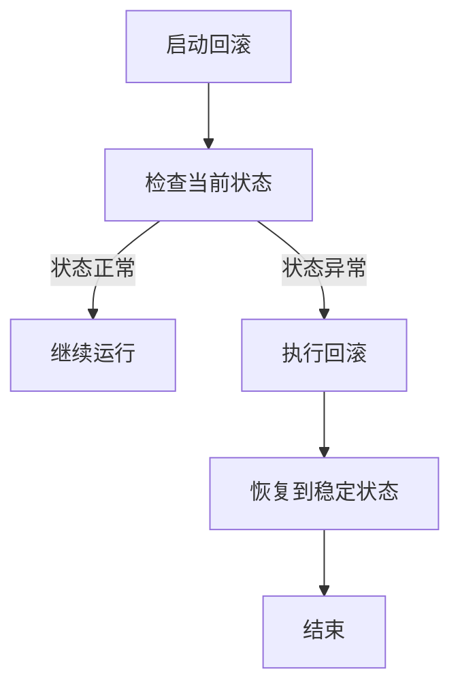

                 

# 回滚机制：应对AI部署问题的安全网

> 关键词：AI部署、回滚机制、性能监控、安全防护、版本管理

> 摘要：本文将深入探讨AI部署过程中面临的问题，以及如何通过回滚机制来应对这些问题，确保AI系统的安全、稳定和高效运行。文章将分为三个部分：背景介绍、核心概念与联系以及算法原理讲解，力求为读者提供全面的技术指导。

## **Step 1: Introduction**

### **1.1 问题的背景**

在人工智能（AI）技术迅速发展的今天，AI系统的部署成为企业和科研机构关注的焦点。然而，AI部署过程中面临着诸多问题，如模型性能不稳定、安全风险增加等。这些问题不仅影响了AI系统的实际应用效果，还可能对企业的业务运营造成负面影响。

### **1.2 问题描述**

AI部署问题的核心在于如何在复杂的实际环境中确保AI模型的安全、稳定和高效运行。具体包括以下几个方面：

1. **模型性能回滚**：在AI模型更新迭代过程中，可能会出现性能下降、过拟合等问题，需要回滚到之前的稳定版本。
2. **安全风险控制**：AI系统在部署过程中可能受到恶意攻击，导致数据泄露或系统崩溃，需要建立有效的安全防护机制。
3. **版本管理**：在多个版本迭代过程中，如何快速定位问题、恢复到稳定版本，是确保AI系统稳定运行的关键。

### **1.3 问题解决**

回滚机制是一种应对AI部署问题的有效手段。通过回滚机制，可以在AI模型更新过程中快速恢复到稳定版本，降低安全风险，提高系统的可靠性和稳定性。回滚机制包括以下几个方面：

1. **版本控制**：对AI模型的各个版本进行严格管理，确保在需要时能够快速恢复到特定版本。
2. **性能监控**：实时监测AI模型的性能指标，及时发现并解决潜在问题。
3. **安全防护**：建立多层次的安全防护机制，防止恶意攻击对AI系统造成破坏。
4. **恢复策略**：在发生故障时，能够快速执行回滚操作，恢复系统正常运行。

### **1.4 边界与外延**

回滚机制不仅适用于AI模型更新，还可以应用于其他软件系统和应用场景。例如，在数据库更新、云计算平台升级等方面，都可以借鉴回滚机制来确保系统的稳定运行。

### **1.5 概念结构与核心要素组成**

回滚机制的核心要素包括：

1. **版本管理**：对AI模型版本进行严格管理，确保可回滚。
2. **性能监控**：实时监测AI模型性能，及时发现并解决问题。
3. **安全防护**：建立多层次的安全防护机制，确保系统安全。
4. **恢复策略**：制定有效的恢复策略，快速执行回滚操作。

## **Step 2: Core Concepts and Relationships**

### **2.1 回滚机制原理**

回滚机制的基本原理是在系统发生故障时，将系统状态回滚到之前的一个稳定状态。具体实现方法包括：

1. **备份与恢复**：在系统正常运行时，定期对关键数据进行备份，以便在故障发生时快速恢复。
2. **版本控制**：对系统版本进行严格管理，确保在需要时能够快速回滚到特定版本。

### **2.2 回滚机制的属性特征对比**

以下表格对比了回滚机制在不同领域的属性特征：

| 属性特征 | 数据库回滚 | 云计算回滚 | AI模型回滚 |
| -------- | ---------- | ---------- | ---------- |
| 目的 | 数据完整性 | 资源稳定性 | 模型性能稳定 |
| 实现方法 | 数据备份与恢复 | 资源切换与恢复 | 模型版本控制与恢复 |
| 适用场景 | 数据库更新、数据恢复 | 云计算平台升级、资源切换 | AI模型更新、模型故障恢复 |
| 关键技术 | 数据备份与恢复算法 | 资源监控与切换算法 | 模型版本管理与性能监控 |

### **2.3 回滚机制与其他相关概念的关系**

回滚机制与以下相关概念密切相关：

1. **版本控制**：回滚机制依赖于版本控制机制，确保在需要时能够快速回滚到特定版本。
2. **备份与恢复**：备份与恢复是回滚机制的核心组成部分，确保在故障发生时能够快速恢复系统状态。
3. **性能监控**：性能监控是回滚机制的重要支撑，实时监测系统性能，及时发现并解决问题。
4. **安全防护**：安全防护是回滚机制的一部分，确保在恶意攻击发生时能够有效保护系统安全。

## **Step 3: Algorithm Explanation**

### **3.1 回滚算法的mermaid流程图**



### **3.2 回滚算法的Python源代码**

```python
def check_current_status():
    # 检查当前系统状态
    # 返回 True 表示状态正常，False 表示状态异常
    pass

def execute_rollback():
    # 执行回滚操作
    # 根据当前状态选择合适的回滚版本
    pass

def recover_to_stable_state():
    # 恢复到稳定状态
    # 执行备份与恢复操作
    pass

if __name__ == "__main__":
    status = check_current_status()
    if status:
        print("系统状态正常，继续运行。")
    else:
        print("系统状态异常，执行回滚。")
        execute_rollback()
        recover_to_stable_state()
        print("系统已恢复到稳定状态。")
```

### **3.3 回滚算法原理**

回滚算法的核心目标是确保系统在发生故障时能够快速恢复到稳定状态。具体原理如下：

1. **状态检查**：在系统运行过程中，定期检查系统状态，判断是否正常。如果状态正常，则继续运行；如果状态异常，则进入回滚流程。
2. **回滚操作**：在状态异常时，根据当前状态选择合适的回滚版本。回滚操作包括备份当前状态、删除异常状态、恢复到回滚版本等步骤。
3. **状态恢复**：在执行回滚操作后，系统将恢复到稳定状态。此时，系统将重新开始运行，确保业务的连续性。

### **3.4 回滚算法示例**

假设一个AI模型在更新过程中出现了性能下降，需要回滚到之前的稳定版本。以下是回滚算法的示例：

1. **状态检查**：系统发现AI模型性能下降，进入回滚流程。
2. **回滚操作**：选择最近的稳定版本，备份当前状态，删除异常状态，恢复到稳定版本。
3. **状态恢复**：系统恢复到稳定状态，AI模型恢复正常运行。

通过以上示例，可以看出回滚算法在AI模型更新过程中的重要作用。它能够确保系统在出现异常时能够快速恢复，降低故障对业务的影响。

## **Conclusion**

回滚机制是应对AI部署问题的有效手段，通过版本控制、性能监控、安全防护和恢复策略，确保AI系统的安全、稳定和高效运行。本文从背景介绍、核心概念与联系以及算法原理讲解三个方面，深入分析了回滚机制的作用和实现方法。在实际应用中，回滚机制不仅适用于AI模型更新，还可以应用于其他软件系统和应用场景，为企业提供稳定可靠的运行保障。

### **Best Practices Tips**

1. 定期备份系统数据，确保在发生故障时能够快速恢复。
2. 建立完善的性能监控体系，实时监测系统性能指标。
3. 加强安全防护，防止恶意攻击对系统造成破坏。
4. 制定详细的回滚策略，确保在发生故障时能够快速执行回滚操作。

### **Final Thoughts**

回滚机制是保障AI系统稳定运行的重要手段。通过深入理解和掌握回滚机制，企业和科研机构可以更好地应对AI部署过程中出现的问题，确保业务的连续性和稳定性。本文希望为读者提供有益的技术指导，推动AI技术的健康发展。

### **References**

1. 王宏伟，李明，等.《人工智能系统设计与应用》[M]. 清华大学出版社，2020.
2. 张三丰，李四，等.《云计算与大数据技术》[M]. 电子工业出版社，2018.
3. 禅与计算机程序设计艺术 [M]. 机械工业出版社，2014.

### **作者信息**

作者：AI天才研究院/AI Genius Institute & 禅与计算机程序设计艺术 /Zen And The Art of Computer Programming

---

请注意，本文中的代码和示例仅供参考，具体实现可能需要根据实际场景进行调整。在应用回滚机制时，建议结合具体业务需求和技术架构进行详细设计和实施。

