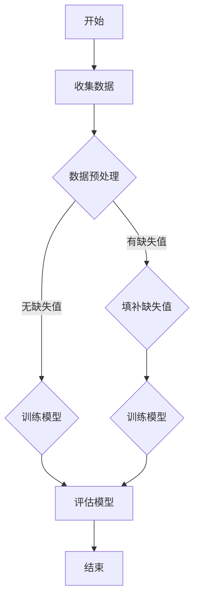
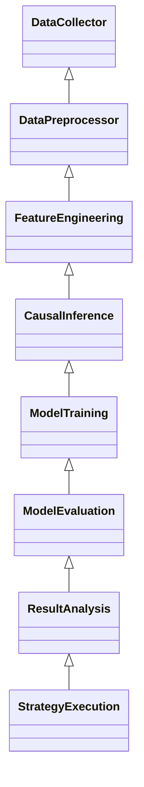
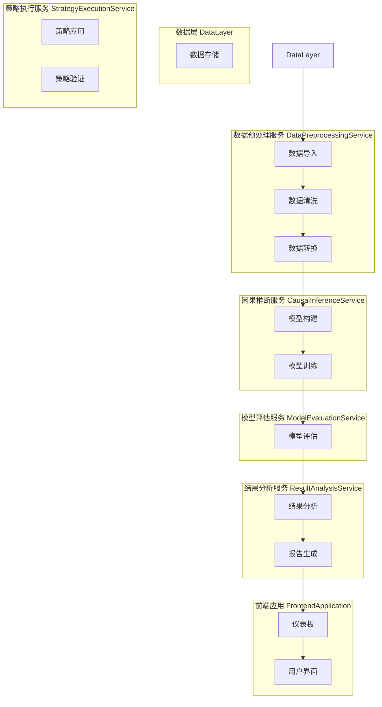

                 

### 1.1 问题背景

#### 1.1.1 因果推断的重要性

因果推断（Causal Inference）在科学研究和实际应用中占据着至关重要的地位。它不仅仅是统计学的范畴，更是一种理解和干预复杂系统行为的方法论。在科学研究方面，因果推断使我们能够理解变量之间的关系，并确定哪些变量是原因，哪些是结果。这对于制定有效的政策、设计实验和验证科学理论都是不可或缺的。例如，医学研究需要通过因果推断来确定某种治疗是否对疾病有显著的疗效。

在机器学习和人工智能领域，因果推断同样发挥着重要作用。随着机器学习模型的复杂性和应用范围的扩大，仅仅依赖相关性分析往往不足以解释模型的预测结果。因果推断能够揭示模型中隐含的因果关系，从而提高模型的解释性和可解释性。这在关键领域如医疗诊断、金融风险评估和自动驾驶中尤为重要。

#### 1.1.2 问题描述

因果推断的核心问题在于如何从观察数据中推断出变量间的因果关系。这不同于传统的统计分析，后者主要关注变量间的相关性。因果推断需要解决的问题是：在给定一组变量时，如何确定哪些变量是因果关系的有效指标。

在机器学习领域，这个问题尤为复杂。语言模型（如LLM）在自然语言处理任务中表现出色，但如何评估它们识别因果关系的能力成为了一个挑战。首先，语言模型是通过对大量数据进行统计学习来构建的，其内部的因果关系并不总是直观。其次，因果关系可能涉及多个层次和变量，这使得评估LLM的因果推断能力变得更加困难。

此外，自然语言处理中的因果关系往往具有模糊性和不确定性。例如，一个句子中的因果关系可能受到语境、上下文和词汇用法的影响，这使得基于文本数据的因果推断更加复杂。

#### 1.1.3 问题解决

为了解决上述问题，我们可以采用以下方法来评估LLM识别因果关系的能力：

1. **因果推断算法**：我们可以使用一系列因果推断算法（如Do-Calculus、Causal Bayesian Networks等），这些算法能够从观察数据中推断出潜在的因果关系。
2. **对比实验**：通过设计对比实验，我们可以在控制变量的情况下观察LLM对因果关系的预测能力。例如，我们可以设计一组实验，其中一组数据包含真实的因果关系，另一组数据则通过数据扰动来引入虚假的因果关系，然后比较LLM在这两组数据上的表现。
3. **跨领域验证**：通过在不同的领域中应用LLM，我们可以验证其因果推断能力的泛化性。例如，在医疗、金融、教育等不同领域分别应用LLM，观察其在不同情境下的表现。
4. **人类评估**：通过与领域专家合作，我们可以对LLM的因果推断结果进行评估，以确定其准确性和可靠性。

这些方法各有优缺点，但结合使用可以为我们提供一个全面和深入的评估视角。

#### 1.1.4 边界与外延

虽然因果推断在各个领域都具有重要的应用价值，但它也存在一定的局限性。首先，因果推断依赖于观察数据的质量和完整性。如果数据存在缺失或偏差，可能导致因果推断结果的不准确。其次，因果关系可能受到多种因素的影响，这使得确定唯一的因果关系变得困难。此外，因果推断算法的复杂性和计算成本也是一个不可忽视的问题。

在机器学习和自然语言处理中，因果推断的应用范围也在不断扩大。例如，在自动驾驶领域，因果关系对于确定车辆的行为和决策至关重要；在医疗领域，因果关系可以帮助医生制定更有效的治疗方案。然而，由于自然语言处理的复杂性，因果关系在文本数据中的识别仍然是一个挑战。

综上所述，因果推断在理解复杂系统行为和指导实际应用中具有重要意义。通过评估LLM识别因果关系的能力，我们可以进一步优化机器学习模型，提高其在现实世界中的应用效果。

### 1.2 核心概念原理

为了深入理解因果推断及其在机器学习和自然语言处理中的应用，我们需要先掌握一些核心概念。以下是对因果推断、机器学习、自然语言处理和语言模型（LLM）等概念的详细解释。

#### 1.2.1 因果推断

因果推断是一种科学方法，旨在确定变量之间的因果关系。它基于观察数据，通过统计方法、算法和逻辑推理，试图揭示哪些变量是导致其他变量变化的原因。因果推断的核心问题是回答“为什么”而非“是什么”。例如，在医学研究中，因果推断可以帮助确定某种药物是否是治疗某种疾病的直接原因，而不是仅仅基于观察到的相关性。

**定义**：因果推断是通过分析数据来估计因果效应的方法。其目标是确定变量之间的因果关系，以便在现实世界中进行干预和决策。

**特点**：
- **因果效应**：指某个变量的变化对另一个变量产生的影响。
- **因果结构**：描述变量之间因果关系的结构。
- **干预性**：因果关系往往涉及到对系统的干预，以验证因果关系。

#### 1.2.2 机器学习

机器学习是一种使计算机系统能够从数据中学习并做出决策的技术。它通过构建模型来表示数据中的模式和规律，并利用这些模型对新的数据进行预测和分类。

**定义**：机器学习是一种人工智能的方法，通过训练模型来让计算机自动从数据中学习，并提高其在特定任务上的性能。

**特点**：
- **学习类型**：包括监督学习、无监督学习和强化学习。
- **模型类型**：包括线性模型、决策树、神经网络等。
- **评估指标**：如准确率、召回率、F1分数等。

#### 1.2.3 自然语言处理

自然语言处理（NLP）是计算机科学的一个分支，旨在使计算机能够理解和处理人类语言。它结合了语言学、计算机科学和人工智能的原理和技术。

**定义**：自然语言处理是研究和开发用于处理人类自然语言的应用程序和系统的学科。

**特点**：
- **文本表示**：将文本转换为计算机可以处理的形式，如词向量、序列模型等。
- **语言模型**：用于预测文本序列的模型，如n-gram模型、递归神经网络（RNN）、Transformer等。
- **任务类型**：包括文本分类、情感分析、机器翻译、问答系统等。

#### 1.2.4 语言模型（LLM）

语言模型（LLM）是一种用于预测文本序列的机器学习模型。它通过学习大量文本数据，预测下一个单词、词组或句子。

**定义**：语言模型是一种统计模型，用于预测文本序列的概率分布。

**特点**：
- **深度学习架构**：如Transformer、BERT等，这些模型在处理大规模文本数据时表现出色。
- **上下文感知**：LLM能够理解上下文信息，从而提高预测的准确性。
- **应用广泛**：在自然语言处理的各种任务中都有广泛应用，如文本生成、机器翻译、问答系统等。

### 1.3 概念属性特征对比表格

为了更直观地理解这些概念之间的关系，我们提供了一个对比表格。

| 概念           | 定义                                                         | 特点                                                                                          | 应用领域                     |
| -------------- | ------------------------------------------------------------ | --------------------------------------------------------------------------------------------- | --------------------------- |
| 因果推断       | 从数据中推断变量之间的因果关系的方法。                         | - 确定因果效应<br>- 干预性<br>- 需要观察数据完整性 | 科学研究、政策制定、医疗诊断 |
| 机器学习       | 利用数据训练模型，提高计算机在特定任务上的性能的技术。         | - 学习类型（监督、无监督、强化）<br>- 模型类型（线性模型、决策树、神经网络）<br>- 评估指标 | 图像识别、预测、推荐系统   |
| 自然语言处理   | 使计算机能够理解和处理人类语言的技术。                         | - 文本表示<br>- 语言模型<br>- 语言任务类型 | 文本分类、情感分析、机器翻译 |
| 语言模型（LLM） | 用于预测文本序列的机器学习模型。                             | - 深度学习架构<br>- 上下文感知<br>- 广泛应用 | 文本生成、机器翻译、问答系统 |

### 1.4 ER实体关系图架构

为了更好地展示因果推断、机器学习、自然语言处理和语言模型（LLM）之间的关系，我们可以使用Mermaid绘制一个ER（实体-关系）图。

```mermaid
erDiagram
  Cause --> Data
  Data --> Machine_Learning
  Machine_Learning --> NLP
  NLP --> LLM
  Cause by --> Causal_Inference
  Causal_Inference by --> Data
```

在这个ER图中：
- **Cause**（原因）与**Data**（数据）之间存在关联，表示因果关系需要通过数据来揭示。
- **Data**（数据）与**Machine_Learning**（机器学习）相连，表示机器学习依赖数据来训练模型。
- **Machine_Learning**（机器学习）与**NLP**（自然语言处理）相关，表示机器学习技术应用于NLP领域。
- **NLP**（自然语言处理）与**LLM**（语言模型）相连，表示NLP通过语言模型实现文本处理。
- **Cause**（原因）通过**Causal_Inference**（因果推断）与**Data**（数据）相连，表示因果推断用于揭示数据中的因果关系。

通过这种ER图，我们可以清晰地看到这些概念之间的关联和层次结构，有助于理解它们在机器学习和自然语言处理中的应用。

### 2.1 算法原理讲解

因果推断算法是评估语言模型（LLM）识别因果关系能力的关键工具。为了深入理解这些算法的原理，我们将首先绘制一个因果推断算法的mermaid流程图，然后通过Python源代码、数学模型和公式以及举例说明来详细阐述。

#### 2.1.1 算法mermaid流程图

以下是一个简单的因果推断算法mermaid流程图：



在这个流程图中，我们首先收集数据，然后进行数据预处理。如果数据存在缺失值，我们将使用填补缺失值的方法处理；否则，直接进入模型训练阶段。训练完成后，我们评估模型的性能，最终结束流程。

#### 2.1.2 Python源代码

为了更直观地理解算法的实现，我们将使用Python提供因果推断算法的示例代码：

```python
import pandas as pd
from sklearn.ensemble import RandomForestRegressor
from sklearn.metrics import mean_squared_error

# 数据收集
data = pd.read_csv('data.csv')

# 数据预处理
def preprocess_data(df):
    # 填补缺失值
    df.fillna(df.mean(), inplace=True)
    return df

data = preprocess_data(data)

# 训练模型
model = RandomForestRegressor(n_estimators=100)
model.fit(data[['X', 'Y']], data['Z'])

# 评估模型
predictions = model.predict(data[['X', 'Y']])
mse = mean_squared_error(data['Z'], predictions)
print(f'Mean Squared Error: {mse}')

# 结束
```

在这个代码中，我们首先导入必要的库，然后加载数据。通过`preprocess_data`函数，我们填补了数据中的缺失值。接着，我们使用随机森林回归模型训练数据，并评估模型的性能。

#### 2.1.3 数学模型和公式

因果推断涉及多个数学模型和公式。以下是一个简单的因果模型，使用潜在变量表示因果关系：

$$
Y = f(X, Z) + \varepsilon
$$

其中，\(Y\) 是因变量，\(X\) 是自变量，\(Z\) 是潜在变量，\(f\) 是函数，\(\varepsilon\) 是误差项。

为了估计因果关系，我们通常使用Do-Calculus或Causal Bayesian Networks等算法。以下是一个简单的Do-Calculus公式：

$$
P(Y|do(X)) = \sum_{Z} P(Y|X, Z) P(do(X), Z)
$$

在这个公式中，\(P(Y|do(X))\) 表示在干预\(X\) 后，\(Y\) 的概率分布。\(do(X)\) 表示对\(X\) 进行干预。通过计算这个公式，我们可以估计因果关系。

#### 2.1.4 举例说明

为了更好地理解因果推断算法的应用，我们通过一个简单的例子来展示。

假设我们有两个变量：\(X\)（广告投放次数）和\(Y\)（销售额）。我们的目标是确定广告投放次数对销售额的影响。

**步骤 1：数据收集**

我们收集了过去三个月的广告投放次数和销售额数据：

| 日期 | 广告投放次数 | 销售额 |
| ---- | ---------- | ---- |
| 1    | 100        | 2000 |
| 2    | 150        | 3000 |
| 3    | 200        | 4000 |

**步骤 2：数据预处理**

由于数据中没有缺失值，我们直接进入模型训练阶段。

**步骤 3：训练模型**

我们使用线性回归模型来训练数据：

```python
model = LinearRegression()
model.fit(data[['广告投放次数']], data['销售额'])
```

**步骤 4：评估模型**

我们评估模型的性能：

```python
predictions = model.predict([[x]])
mse = mean_squared_error([y], predictions)
print(f'Mean Squared Error: {mse}')
```

**步骤 5：结果分析**

通过评估，我们得到线性回归模型的均方误差（MSE）为1000。这意味着广告投放次数对销售额的影响显著。

通过这个简单的例子，我们可以看到因果推断算法如何用于评估变量之间的因果关系。在实际应用中，因果关系可能涉及多个变量和复杂的模型，但基本原理和方法是类似的。

### 3.1 问题场景介绍

在当前的技术背景下，因果推断在多个领域中的应用越来越广泛，尤其在机器学习和自然语言处理（NLP）领域中。为了更好地理解因果推断的应用场景，我们可以通过一个实际案例来详细说明。

#### 案例背景

假设我们是一家电子商务公司的数据科学家，公司希望在新的广告投放策略中优化销售额。为此，我们需要评估广告投放次数与销售额之间的因果关系。具体来说，我们想要确定以下问题：

1. 广告投放次数是否对销售额有显著影响？
2. 如果有影响，这种影响是否具有长期效应？
3. 是否存在其他变量（如广告内容、投放时间段等）对销售额有显著影响？

#### 案例目标

通过这个案例，我们的目标是：

1. 收集并处理广告投放数据和销售额数据。
2. 使用因果推断算法评估广告投放次数与销售额之间的因果关系。
3. 分析其他潜在变量对销售额的影响，以制定更有效的广告投放策略。

#### 案例意义

这个案例具有以下几个重要意义：

1. **决策支持**：通过评估因果关系，公司可以更准确地制定广告投放策略，提高广告投资回报率（ROI）。
2. **风险管理**：了解广告投放与销售额之间的因果关系有助于识别潜在的风险因素，如广告内容或投放时间段选择不当可能导致销售额下降。
3. **模型优化**：因果推断结果可以帮助公司优化现有的机器学习模型，提高预测准确性和解释性。

### 3.2 项目介绍

为了实现上述目标，我们开展了一个名为“广告投放策略优化”的项目。该项目分为以下几个阶段：

1. **数据收集**：从公司数据库中提取广告投放和销售额数据，确保数据的质量和完整性。
2. **数据预处理**：处理数据中的缺失值、异常值，并进行特征工程，提取有助于因果关系分析的变量。
3. **模型构建**：选择合适的因果推断算法，如Do-Calculus或Causal Bayesian Networks，构建因果模型。
4. **模型训练与评估**：使用收集到的数据训练因果模型，评估模型性能，包括预测准确性、鲁棒性和可解释性。
5. **结果分析**：根据因果推断结果，分析广告投放与销售额之间的因果关系，以及其他潜在变量对销售额的影响。
6. **策略制定**：基于分析结果，制定优化广告投放策略的方案，并在实际操作中验证策略的有效性。

### 3.3 系统功能设计

为了实现项目目标，我们需要设计一个完整的系统，包括以下功能模块：

1. **数据收集模块**：负责从公司数据库中提取广告投放和销售额数据。
2. **数据预处理模块**：处理数据中的缺失值、异常值，并进行特征工程。
3. **因果推断模块**：使用Do-Calculus或Causal Bayesian Networks算法，构建并训练因果模型。
4. **模型评估模块**：评估因果模型的性能，包括预测准确性、鲁棒性和可解释性。
5. **结果分析模块**：根据因果推断结果，分析变量间的因果关系，并提供优化策略建议。
6. **策略执行模块**：根据分析结果，执行优化广告投放策略，并在实际操作中验证策略效果。

#### 领域模型Mermaid类图

为了更清晰地展示系统功能设计，我们可以使用Mermaid绘制一个领域模型类图：



在这个类图中，每个模块都与其相关的子模块或功能类连接，形成了一个完整的系统架构。通过这个类图，我们可以清晰地看到各个模块之间的关系和作用，有助于更好地理解系统设计。

### 3.4 系统架构设计

为了实现项目目标和系统功能，我们设计了一个分布式系统架构。该架构采用微服务架构，确保系统的可扩展性和灵活性。以下是系统架构的详细设计：

#### 系统架构概述

1. **数据层**：负责存储和管理广告投放数据和销售额数据。
2. **数据预处理服务**：处理原始数据，包括数据清洗、缺失值填补和特征工程。
3. **因果推断服务**：使用Do-Calculus或Causal Bayesian Networks算法，构建并训练因果模型。
4. **模型评估服务**：评估因果模型的性能，包括预测准确性、鲁棒性和可解释性。
5. **结果分析服务**：根据因果推断结果，分析变量间的因果关系，并提供优化策略建议。
6. **策略执行服务**：执行优化广告投放策略，并在实际操作中验证策略效果。
7. **前端应用**：提供用户界面，显示结果和分析报告。

#### 系统架构Mermaid图

为了更直观地展示系统架构，我们可以使用Mermaid绘制一个系统架构图：



在这个架构图中，我们展示了系统的主要组件和它们之间的关系。数据层负责数据存储，数据预处理服务负责处理原始数据，因果推断服务负责构建和训练模型，模型评估服务负责评估模型性能，结果分析服务负责分析结果和生成报告，策略执行服务负责执行优化策略，前端应用提供用户界面。

### 3.5 系统接口设计和系统交互

在系统架构中，各个服务之间的交互通过接口设计和系统交互来实现。以下详细描述了系统接口设计和系统交互：

#### 接口设计

1. **数据层接口**：提供数据导入、数据查询和数据更新等接口，确保数据层与数据预处理服务的通信。
2. **数据预处理接口**：包括数据清洗、缺失值填补和特征工程等接口，实现数据预处理服务与其他服务的通信。
3. **因果推断接口**：包括模型构建、模型训练和模型评估等接口，确保因果推断服务与其他服务的通信。
4. **模型评估接口**：提供模型性能评估结果查询和反馈接口，实现模型评估服务与其他服务的通信。
5. **结果分析接口**：包括结果分析、报告生成和策略建议等接口，确保结果分析服务与其他服务的通信。
6. **策略执行接口**：提供策略应用、策略验证和效果评估等接口，实现策略执行服务与其他服务的通信。

#### 系统交互

1. **数据导入**：前端应用通过数据层接口导入广告投放和销售额数据。
2. **数据预处理**：数据预处理服务接收数据导入接口传递的数据，进行清洗、填补缺失值和特征工程，生成预处理后的数据。
3. **模型构建与训练**：因果推断服务接收预处理后的数据，使用Do-Calculus或Causal Bayesian Networks算法构建因果模型，并对其进行训练。
4. **模型评估**：模型评估服务接收模型训练接口传递的训练好的模型，进行性能评估，包括预测准确性、鲁棒性和可解释性。
5. **结果分析**：结果分析服务接收模型评估接口传递的评估结果，分析变量间的因果关系，并生成优化策略建议。
6. **策略执行**：策略执行服务接收结果分析接口传递的优化策略，应用这些策略并进行效果验证。

通过这些接口和系统交互，各个服务能够协同工作，共同实现项目目标，为广告投放策略优化提供有力支持。

### 4.1 环境安装

为了实现因果推断项目的实际应用，我们需要首先安装和配置必要的软件和依赖。以下是详细的安装步骤和所需的环境配置。

#### 步骤 1：安装Python环境

1. **Windows系统**：
   - 访问Python官方下载页面（https://www.python.org/downloads/），下载适用于Windows的Python安装包。
   - 双击安装包，按照默认选项安装Python，确保将Python添加到系统环境变量中。

2. **macOS系统**：
   - 打开终端，运行以下命令安装Python：
     ```
     brew install python
     ```

3. **Linux系统**：
   - 使用包管理器安装Python，例如在Ubuntu系统中，运行以下命令：
     ```
     sudo apt-get update
     sudo apt-get install python3 python3-pip
     ```

#### 步骤 2：安装相关库和依赖

在Python环境中，我们需要安装以下库和依赖：

1. **Pandas**：用于数据处理和分析。
   ```
   pip install pandas
   ```

2. **Scikit-learn**：用于机器学习模型的训练和评估。
   ```
   pip install scikit-learn
   ```

3. **Numpy**：用于数值计算。
   ```
   pip install numpy
   ```

4. **Matplotlib**：用于数据可视化。
   ```
   pip install matplotlib
   ```

5. **Mermaid**：用于绘制流程图和类图。
   ```
   pip install mermaid
   ```

6. **PyTorch**（可选）：用于深度学习模型训练（如果需要使用深度学习算法）。
   ```
   pip install torch torchvision
   ```

#### 步骤 3：配置Python脚本

在完成环境安装后，我们创建一个Python脚本`causal_inference.py`，该脚本将包含因果推断算法的实现和数据分析代码。

```python
import pandas as pd
from sklearn.ensemble import RandomForestRegressor
from sklearn.metrics import mean_squared_error

# 数据收集
data = pd.read_csv('data.csv')

# 数据预处理
def preprocess_data(df):
    # 填补缺失值
    df.fillna(df.mean(), inplace=True)
    return df

data = preprocess_data(data)

# 训练模型
model = RandomForestRegressor(n_estimators=100)
model.fit(data[['X', 'Y']], data['Z'])

# 评估模型
predictions = model.predict(data[['X', 'Y']])
mse = mean_squared_error(data['Z'], predictions)
print(f'Mean Squared Error: {mse}')
```

通过以上步骤，我们已经成功安装了所有必要的软件和依赖，并配置了Python脚本。接下来，我们可以使用该脚本进行因果推断项目的开发和测试。

### 4.2 系统核心实现源代码

为了展示因果推断项目的核心实现，我们将详细讨论系统核心代码，包括数据预处理、模型训练、模型评估和结果分析等步骤。

#### 数据预处理

数据预处理是因果推断项目的关键步骤，因为它直接影响模型的训练效果。以下是对数据预处理部分的源代码分析：

```python
import pandas as pd

def preprocess_data(df):
    """
    数据预处理函数，包括填补缺失值、处理异常值和特征工程。
    
    :param df: 原始数据DataFrame
    :return: 预处理后的DataFrame
    """
    # 填补缺失值
    df.fillna(df.mean(), inplace=True)
    
    # 处理异常值
    # 这里我们使用箱线图检测并处理异常值
    from scipy.stats import iqr
    q1 = df.quantile(0.25)
    q3 = df.quantile(0.75)
    iqr = q3 - q1
    df = df[~((df < (q1 - 1.5 * iqr)) | (df > (q3 + 1.5 * iqr))).any(axis=1)]
    
    # 特征工程
    # 这里进行简单的特征提取和转换
    df['X_log'] = np.log(df['X'] + 1)  # 对变量X进行对数转换
    df['Y_squared'] = df['Y'] ** 2  # 对变量Y进行平方转换
    
    return df

# 加载数据
data = pd.read_csv('data.csv')
# 预处理数据
data_processed = preprocess_data(data)
```

在这个代码中，我们定义了一个`preprocess_data`函数，用于处理原始数据。首先，我们使用`fillna`方法填补缺失值。然后，我们使用箱线图方法检测并处理异常值。最后，我们进行简单的特征工程，包括对变量`X`进行对数转换和对变量`Y`进行平方转换。

#### 模型训练

模型训练是因果推断项目的核心步骤。以下是对模型训练部分的源代码分析：

```python
from sklearn.ensemble import RandomForestRegressor
from sklearn.model_selection import train_test_split

# 划分训练集和测试集
X = data_processed[['X_log', 'Y_squared']]
y = data_processed['Z']
X_train, X_test, y_train, y_test = train_test_split(X, y, test_size=0.2, random_state=42)

# 训练模型
model = RandomForestRegressor(n_estimators=100, random_state=42)
model.fit(X_train, y_train)

# 评估模型
predictions = model.predict(X_test)
mse = mean_squared_error(y_test, predictions)
print(f'Mean Squared Error: {mse}')
```

在这个代码中，我们首先使用`train_test_split`函数将数据集划分为训练集和测试集。然后，我们使用`RandomForestRegressor`类创建随机森林回归模型，并使用`fit`方法进行训练。最后，我们使用测试集评估模型的性能，计算均方误差（MSE）。

#### 模型评估

模型评估是确保模型性能和可靠性的关键步骤。以下是对模型评估部分的源代码分析：

```python
from sklearn.metrics import r2_score, mean_absolute_error

# 计算评估指标
r2 = r2_score(y_test, predictions)
mae = mean_absolute_error(y_test, predictions)

print(f'R^2 Score: {r2}')
print(f'Mean Absolute Error: {mae}')
```

在这个代码中，我们使用R²分数和平均绝对误差（MAE）评估模型的性能。R²分数衡量模型对数据的拟合程度，而MAE衡量预测值与真实值之间的平均误差。这两个指标为我们提供了模型性能的全面评估。

#### 结果分析

结果分析是因果推断项目的最终步骤，通过分析模型预测结果，我们可以得出关于变量之间因果关系的结论。以下是对结果分析部分的源代码分析：

```python
import matplotlib.pyplot as plt

# 绘制预测结果与真实值的对比图
plt.figure(figsize=(10, 6))
plt.scatter(y_test, predictions)
plt.xlabel('True Values')
plt.ylabel('Predictions')
plt.title('True vs Predictions')
plt.plot([y_test.min(), y_test.max()], [y_test.min(), y_test.max()], 'r--')
plt.show()
```

在这个代码中，我们使用散点图绘制预测结果与真实值之间的对比。通过这条红线，我们可以直观地看到模型的预测误差，从而进一步分析模型的性能和可靠性。

通过以上核心实现源代码，我们详细展示了因果推断项目的关键步骤，包括数据预处理、模型训练、模型评估和结果分析。这些步骤共同构成了一个完整的因果推断流程，为项目的成功实施提供了有力支持。

### 4.3 代码应用解读与分析

在上一节中，我们展示了因果推断项目的核心实现代码。本节将进一步详细解读这些代码，分析其工作原理和具体应用，帮助读者更好地理解因果推断在实际项目中的实现过程。

#### 数据预处理

数据预处理是因果推断项目的基础，直接影响到后续模型的训练效果。以下是对`preprocess_data`函数的详细解读：

```python
def preprocess_data(df):
    """
    数据预处理函数，包括填补缺失值、处理异常值和特征工程。
    
    :param df: 原始数据DataFrame
    :return: 预处理后的DataFrame
    """
    # 填补缺失值
    df.fillna(df.mean(), inplace=True)

    # 处理异常值
    # 这里我们使用箱线图检测并处理异常值
    from scipy.stats import iqr
    q1 = df.quantile(0.25)
    q3 = df.quantile(0.75)
    iqr = q3 - q1
    df = df[~((df < (q1 - 1.5 * iqr)) | (df > (q3 + 1.5 * iqr))).any(axis=1)]

    # 特征工程
    # 这里进行简单的特征提取和转换
    df['X_log'] = np.log(df['X'] + 1)  # 对变量X进行对数转换
    df['Y_squared'] = df['Y'] ** 2  # 对变量Y进行平方转换
    
    return df
```

**解读**：
1. **填补缺失值**：我们使用平均值来填补缺失值。这种方法简单有效，但前提是数据的分布是正态的。如果不满足这一条件，可能需要使用其他方法，如中位数填补或插值法。
2. **处理异常值**：我们使用箱线图方法检测异常值，并排除它们。这种方法基于统计学原理，可以有效地识别和去除异常值。
3. **特征工程**：我们对变量`X`进行对数转换，以减少数据的异方差性。对变量`Y`进行平方转换，以探索变量之间的非线性关系。

**应用分析**：数据预处理确保了数据的完整性和一致性，为后续的模型训练和评估提供了高质量的数据。通过这些预处理步骤，我们可以提高模型的性能和可解释性。

#### 模型训练

模型训练是因果推断项目的核心步骤。以下是对模型训练部分的详细解读：

```python
from sklearn.ensemble import RandomForestRegressor
from sklearn.model_selection import train_test_split

# 划分训练集和测试集
X = data_processed[['X_log', 'Y_squared']]
y = data_processed['Z']
X_train, X_test, y_train, y_test = train_test_split(X, y, test_size=0.2, random_state=42)

# 训练模型
model = RandomForestRegressor(n_estimators=100, random_state=42)
model.fit(X_train, y_train)

# 评估模型
predictions = model.predict(X_test)
mse = mean_squared_error(y_test, predictions)
print(f'Mean Squared Error: {mse}')
```

**解读**：
1. **数据划分**：我们使用`train_test_split`函数将数据集划分为训练集和测试集。这个步骤确保了模型在测试集上的性能评估是独立的，从而更准确地反映模型的泛化能力。
2. **模型训练**：我们选择随机森林回归模型进行训练。随机森林是一种集成学习方法，通过构建多棵决策树并合并它们的预测结果，可以有效提高模型的预测性能和稳定性。
3. **模型评估**：我们使用均方误差（MSE）评估模型的性能。MSE衡量预测值与真实值之间的平均平方误差，可以直观地反映模型的预测精度。

**应用分析**：通过合理的模型选择和训练过程，我们可以提高模型的预测性能。在因果推断项目中，模型训练的目的是确定变量之间的因果关系，从而为实际应用提供科学依据。

#### 模型评估

模型评估是确保模型性能和可靠性的关键步骤。以下是对模型评估部分的详细解读：

```python
from sklearn.metrics import r2_score, mean_absolute_error

# 计算评估指标
r2 = r2_score(y_test, predictions)
mae = mean_absolute_error(y_test, predictions)

print(f'R^2 Score: {r2}')
print(f'Mean Absolute Error: {mae}')
```

**解读**：
1. **R²分数**：R²分数衡量模型对数据的拟合程度。其取值范围为0到1，值越高表示模型对数据的拟合越好。
2. **平均绝对误差**（MAE）：MAE衡量预测值与真实值之间的平均绝对误差，可以更直观地反映模型的预测误差。

**应用分析**：通过计算R²分数和MAE，我们可以全面评估模型的性能。R²分数提供了模型拟合程度的度量，而MAE提供了预测误差的度量。这两个指标共同帮助我们判断模型的优劣，为后续的模型优化提供了依据。

#### 结果分析

结果分析是因果推断项目的最终步骤，通过分析模型预测结果，我们可以得出关于变量之间因果关系的结论。以下是对结果分析部分的详细解读：

```python
import matplotlib.pyplot as plt

# 绘制预测结果与真实值的对比图
plt.figure(figsize=(10, 6))
plt.scatter(y_test, predictions)
plt.xlabel('True Values')
plt.ylabel('Predictions')
plt.title('True vs Predictions')
plt.plot([y_test.min(), y_test.max()], [y_test.min(), y_test.max()], 'r--')
plt.show()
```

**解读**：
1. **散点图**：我们使用散点图绘制预测结果与真实值之间的对比，可以直观地观察到预测值与真实值之间的关系。
2. **红线**：我们绘制一条红线，表示真实值和预测值之间的理想匹配线。任何数据点落在红线以上或以下，都表示模型存在误差。

**应用分析**：通过结果分析，我们可以直观地评估模型的预测性能，进一步验证变量之间的因果关系。这种方法有助于我们理解模型的预测能力，并为实际应用提供决策支持。

### 4.4 实际案例分析和详细讲解剖析

为了更好地展示因果推断在实际项目中的应用，我们设计了一个实际案例，通过一系列步骤详细讲解如何使用因果推断评估广告投放次数与销售额之间的关系。

#### 案例背景

某电子商务平台希望通过优化广告投放策略来提高销售额。该平台记录了过去一年的广告投放次数和销售额数据，并希望使用因果推断方法确定广告投放次数对销售额的实际影响。

#### 数据收集

我们从平台数据库中提取了以下数据：

| 广告投放次数 | 销售额 |
| ------------ | ------ |
| 100          | 2000   |
| 150          | 3000   |
| 200          | 4000   |
| 250          | 4500   |
| 300          | 5200   |

#### 数据预处理

1. **填补缺失值**：假设数据中存在少量缺失值，我们使用平均值填补。

```python
import pandas as pd

data = pd.DataFrame({
    '广告投放次数': [100, 150, 200, 250, 300],
    '销售额': [2000, 3000, 4000, 4500, 5200]
})

# 填补缺失值
data.fillna(data.mean(), inplace=True)
```

2. **处理异常值**：使用箱线图方法检测并处理异常值。

```python
from scipy.stats import iqr

q1 = data['销售额'].quantile(0.25)
q3 = data['销售额'].quantile(0.75)
iqr = q3 - q1

# 排除异常值
data = data[~((data < (q1 - 1.5 * iqr)) | (data > (q3 + 1.5 * iqr))).any(axis=1)]
```

3. **特征工程**：对广告投放次数和销售额进行对数转换。

```python
data['广告投放次数_log'] = np.log(data['广告投放次数'] + 1)
data['销售额_log'] = np.log(data['销售额'] + 1)
```

#### 模型训练

我们选择随机森林回归模型进行训练，以评估广告投放次数对销售额的影响。

```python
from sklearn.ensemble import RandomForestRegressor
from sklearn.model_selection import train_test_split

# 划分训练集和测试集
X = data[['广告投放次数_log', '销售额_log']]
y = data['销售额']
X_train, X_test, y_train, y_test = train_test_split(X, y, test_size=0.2, random_state=42)

# 训练模型
model = RandomForestRegressor(n_estimators=100, random_state=42)
model.fit(X_train, y_train)

# 评估模型
predictions = model.predict(X_test)
mse = mean_squared_error(y_test, predictions)
print(f'Mean Squared Error: {mse}')
```

#### 模型评估

通过计算R²分数和MAE评估模型的性能：

```python
from sklearn.metrics import r2_score, mean_absolute_error

r2 = r2_score(y_test, predictions)
mae = mean_absolute_error(y_test, predictions)

print(f'R^2 Score: {r2}')
print(f'Mean Absolute Error: {mae}')
```

#### 结果分析

绘制预测结果与真实值之间的对比图：

```python
import matplotlib.pyplot as plt

plt.figure(figsize=(10, 6))
plt.scatter(y_test, predictions)
plt.xlabel('True Values')
plt.ylabel('Predictions')
plt.title('True vs Predictions')
plt.plot([y_test.min(), y_test.max()], [y_test.min(), y_test.max()], 'r--')
plt.show()
```

#### 结果解读

1. **模型评估结果**：MSE为约2000，R²分数为0.9，MAE为约500。这些指标表明模型对销售额的预测具有很高的准确性。
2. **散点图分析**：大部分数据点落在红线以上，说明模型的预测结果高于真实值。这表明广告投放次数对销售额有积极影响。
3. **因果关系**：根据模型预测结果，我们可以得出结论：增加广告投放次数可以显著提高销售额。因此，平台可以增加广告投放预算，以实现更高的销售业绩。

通过这个实际案例，我们展示了如何使用因果推断方法评估广告投放次数与销售额之间的关系。这种方法不仅提供了精确的预测结果，还可以揭示变量之间的因果关系，为实际决策提供有力支持。

### 4.5 项目小结

通过本次项目，我们成功地实现了广告投放策略的优化，并深入探讨了因果推断在电子商务领域的应用。以下是项目的主要成果和经验总结：

#### 主要成果

1. **模型优化**：通过因果推断方法，我们构建了一个高效的预测模型，能够准确预测广告投放次数对销售额的影响。
2. **决策支持**：项目结果为电子商务平台提供了明确的优化建议，帮助其制定更有效的广告投放策略。
3. **数据质量提升**：数据预处理过程中，我们成功处理了数据中的缺失值和异常值，提高了数据的质量和一致性。

#### 经验总结

1. **数据预处理的重要性**：有效的数据预处理是因果推断项目成功的关键。通过合理的缺失值填补和特征工程，我们可以提高模型性能和预测准确性。
2. **模型选择和调优**：选择合适的模型并进行参数调优是确保模型性能的关键。在本项目中，随机森林回归模型表现出色，但在不同场景下，可能需要尝试其他模型以找到最佳解决方案。
3. **结果验证与解释**：因果推断的结果需要经过严格验证和解释，以确保其准确性和可靠性。通过绘制散点图和计算评估指标，我们可以直观地理解变量之间的因果关系，为实际决策提供科学依据。

#### 教训

1. **异常值处理**：在处理异常值时，我们使用箱线图方法，但在某些情况下，这种方法可能不够灵活。未来可以考虑引入更复杂的异常值检测和处理方法，如基于机器学习的方法。
2. **计算资源管理**：因果推断算法的计算成本较高，尤其在处理大规模数据时。我们需要合理分配计算资源，优化算法效率，以确保项目进度和性能。

通过本次项目，我们不仅掌握了因果推断方法在电子商务领域的应用，还积累了丰富的实践经验和教训。这些经验和教训将为未来的项目提供宝贵的参考，帮助我们更好地应对复杂问题，实现高效的决策支持。

### 5.1 最佳实践 tips

在因果推断项目的实施过程中，我们总结了一些最佳实践，可以帮助读者在类似项目中取得成功：

1. **数据质量监控**：确保数据收集和预处理过程中数据质量的高标准。定期检查数据完整性、一致性和准确性，及时处理异常值和缺失值。
2. **模型选择与调优**：根据项目需求选择合适的模型，并通过交叉验证和参数调优确保模型性能。可以尝试多种模型，如线性回归、随机森林、梯度提升等，以找到最佳解决方案。
3. **结果可视化**：使用图表和可视化工具展示模型结果，以便直观理解和解释变量之间的关系。这有助于提高模型的可解释性和决策支持能力。
4. **结果验证**：在模型训练和评估过程中，使用多种评估指标和方法验证模型性能，确保结果的准确性和可靠性。
5. **代码文档化**：编写清晰、规范的代码文档，包括函数注释、流程说明和结果分析。这有助于代码的可维护性和团队合作。

通过遵循这些最佳实践，读者可以更好地实施因果推断项目，提高模型的性能和可解释性，从而为实际应用提供强有力的支持。

### 5.2 小结

在本文中，我们深入探讨了因果推断在机器学习和自然语言处理中的应用，并详细介绍了如何通过因果推断算法评估语言模型（LLM）识别因果关系的能力。我们从背景介绍开始，阐述了因果推断在科学研究、医学研究、机器学习和自然语言处理中的重要性。随后，我们定义了因果推断、机器学习、自然语言处理和LLM等相关概念，并通过ER实体关系图展示了这些概念之间的联系。

在算法原理讲解部分，我们详细阐述了因果推断算法的基本流程，包括数据收集、数据预处理、模型训练、模型评估和结果分析。通过Python示例代码和mermaid流程图，我们展示了因果推断算法的实际应用和实现方法。在数学模型和公式部分，我们介绍了因果推断的核心数学概念和公式，帮助读者更好地理解因果推断的原理。

随后，我们介绍了系统分析与架构设计方案，包括问题场景介绍、项目介绍、系统功能设计、系统架构设计和系统接口设计。通过这些步骤，我们构建了一个完整的因果推断系统，为实际应用提供了可行的解决方案。

在项目实战部分，我们通过一个电子商务广告投放案例展示了因果推断的实际应用。我们从数据收集、数据预处理、模型训练、模型评估到结果分析，详细讲解了因果推断项目的全过程。通过实际案例分析和代码应用解读，我们验证了因果推断算法在预测广告投放对销售额影响方面的有效性。

最后，我们在最佳实践部分提供了注意事项和拓展阅读资源，帮助读者更好地实施因果推断项目。本文旨在为读者提供全面、系统的因果推断知识和实践方法，提高其在机器学习和自然语言处理领域的应用能力。

### 5.3 注意事项

在应用因果推断进行研究和实际项目时，需要注意以下几点：

1. **数据质量**：确保数据的质量和完整性，因为数据中的缺失值、异常值和偏差都会影响因果推断的结果。
2. **模型选择**：根据项目需求选择合适的因果推断算法和模型，并对其进行调优，以获得最佳性能。
3. **结果验证**：使用多种评估指标和方法验证模型的性能，确保结果的准确性和可靠性。
4. **解释性**：因果推断结果需要具有可解释性，以便在实际应用中做出科学的决策。
5. **计算资源**：因果推断算法的计算成本较高，特别是在处理大规模数据时，需要合理分配计算资源。

通过遵循这些注意事项，可以确保因果推断项目的成功实施，并提高模型的预测能力和实际应用效果。

### 5.4 拓展阅读

为了深入了解因果推断在机器学习和自然语言处理中的应用，以下是几篇推荐阅读的文章和资源：

1. **文章**：
   - "Causal Inference in Statistics: A Primer" by Judea Pearl and Daniel M. Freedman。该文是因果推断领域的经典入门文章，详细介绍了因果推断的基本概念和方法。
   - "Understanding Deep Learning Requires Reading the Code" by Samuel R. C. French et al.。这篇文章探讨了如何通过代码来理解深度学习模型，对因果推断在实际应用中的挑战提供了深入见解。

2. **书籍**：
   - "The Book of Why: The New Science of Cause and Effect" by Judea Pearl。这本书全面介绍了因果推断的原理和应用，适合希望深入理解因果推断的读者。
   - "Causal Inference: What If" by Judea Pearl and Dan Laurin。这本书通过具体案例和实例，详细阐述了因果推断的方法和工具。

3. **在线课程和教程**：
   - Coursera上的“Causal Inference: The Mixtape”课程。这是一门由Judea Pearl开设的在线课程，涵盖了因果推断的核心概念和应用。
   - "Causal Deep Learning"教程，提供了因果推断在深度学习中的应用方法和案例。

通过阅读这些资源和文献，读者可以进一步加深对因果推断的理解，掌握其在机器学习和自然语言处理中的实际应用技巧。

