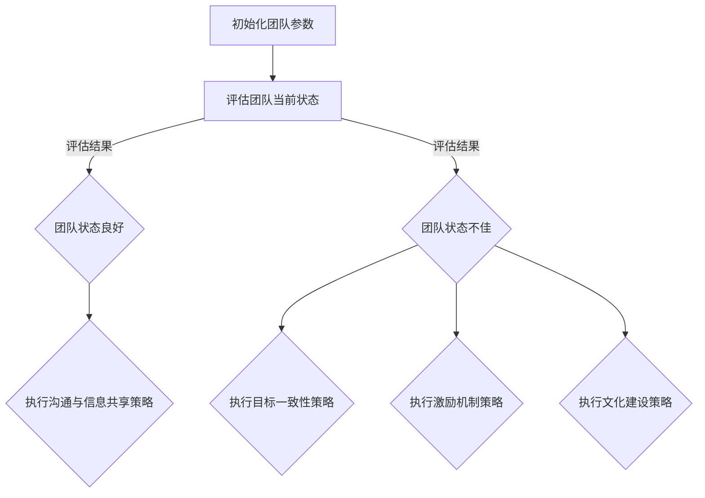
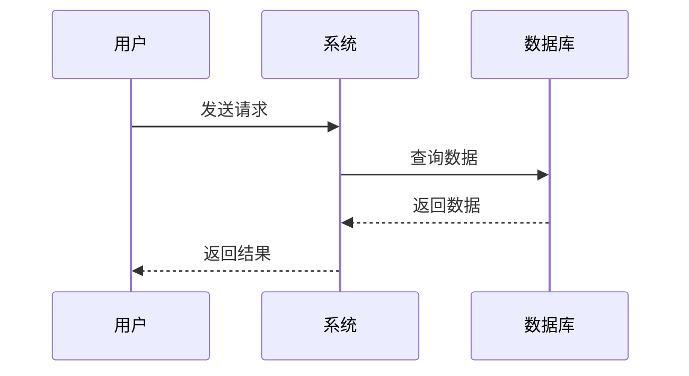

                 

# 团队凝聚力构建工程：从团队到命运共同体

## 关键词
团队凝聚力、沟通效率、共同目标、归属感、认同感、团队文化、构建工程

## 摘要
本文从多个角度探讨了团队凝聚力构建的工程问题。通过分析团队凝聚力的重要性、核心概念及其相互关系，本文提出了构建团队凝聚力的算法原理和实施步骤。文章结合实际案例，详细阐述了团队凝聚力的构建方法，并提出了最佳实践建议，为提高团队协作效率和共同发展提供了有力的理论指导。

## 第一部分：背景介绍

### 1. 问题背景
在现代社会，团队作为组织的基本单位，其凝聚力的强弱直接影响到组织的效能和发展。随着组织规模的扩大和成员多样性的增加，团队凝聚力的构建成为一个复杂且具有挑战性的问题。本文旨在探讨如何通过构建团队凝聚力，将团队转变为一个命运共同体，从而实现组织的高效运作和可持续发展。

### 2. 问题描述
团队凝聚力是指团队成员之间的相互吸引、信任、共同目标和协同工作程度。当前团队凝聚力构建面临的主要问题包括：
- 成员之间的沟通不畅，导致误解和冲突；
- 成员目标不一致，缺乏共同前进的动力；
- 成员缺乏归属感和认同感，影响团队整体士气；
- 团队文化缺失，影响团队成员的长期合作和共同发展。

### 3. 问题解决
为了解决上述问题，需要从多个角度入手，全面构建团队凝聚力。这包括但不限于：
- 提高团队成员之间的沟通效率；
- 明确团队成员的共同目标，增强团队凝聚力；
- 增强团队成员的归属感和认同感；
- 建立积极向上的团队文化。

### 4. 边界与外延
团队凝聚力构建工程不仅涉及团队成员的行为和心理，还涉及到组织文化、管理方式和外部环境等多个方面。因此，在构建团队凝聚力时，需要综合考虑各种因素，确保工程实施的全面性和有效性。

### 5. 概念结构与核心要素组成
团队凝聚力构建工程的核心概念包括：团队凝聚力、沟通效率、共同目标、归属感、认同感、团队文化等。这些概念相互关联，共同构成了团队凝聚力构建的理论框架。

## 第二部分：核心概念与联系

### 核心概念与原理

#### 1. 团队凝聚力
团队凝聚力是指团队成员之间的相互吸引、信任和协同工作程度。它是团队运作效率的重要保障，也是实现团队目标的关键因素。团队凝聚力的高低直接影响团队的协作效果和整体绩效。

#### 2. 沟通效率
沟通效率是指团队成员之间信息传递的准确性和速度。高效的沟通能够减少误解和冲突，增强团队成员之间的信任和合作，从而提高团队凝聚力。

#### 3. 共同目标
共同目标是团队成员共同追求的目标，它是团队凝聚力的重要基础。明确的共同目标能够激发团队成员的积极性和创造力，促进团队协作，实现团队目标。

#### 4. 归属感
归属感是指团队成员对团队的认同感和归属感。强烈的归属感能够增强团队成员的团队意识，提高团队凝聚力和稳定性。

#### 5. 认同感
认同感是指团队成员对团队价值观和目标的认同。高度认同感的团队成员更容易形成共同的团队愿景，推动团队共同发展。

### 概念属性特征对比表格

| 概念       | 定义                                                       | 属性特征                    |
|------------|------------------------------------------------------------|-----------------------------|
| 团队凝聚力 | 成员之间的相互吸引、信任和协同工作程度                     | 高度相关、动态变化          |
| 沟通效率   | 成员之间信息传递的准确性和速度                             | 直接影响团队凝聚力          |
| 共同目标   | 成员共同追求的目标                                         | 是团队凝聚力的基础          |
| 归属感     | 成员对团队的认同感和归属感                                 | 影响团队成员的工作积极性和忠诚度 |
| 认同感     | 成员对团队价值观和目标的认同                               | 促进团队成员的协同合作      |

### ER实体关系图架构

```mermaid
erDiagram
    TeamMember ||--|{ Communication }|--|| TeamLeader
    TeamMember ||--|{ GoalSetting }|--|| ProjectManager
    TeamMember ||--|{ CultureBuilding }|--|| Organization
```

## 第三部分：算法原理讲解

### 算法原理

#### 1. 信息共享与透明度
信息共享与透明度是构建团队凝聚力的基础。通过提高团队成员之间的沟通效率和透明度，促进信息共享，减少误解和冲突，增强团队成员之间的信任和合作。

#### 2. 目标一致性
目标一致性是团队凝聚力的关键因素。通过明确团队成员的共同目标，确保团队在协同工作中能够朝着同一方向努力，提高团队成员的积极性和协作效率。

#### 3. 激励机制
激励机制是增强团队成员归属感和认同感的重要手段。通过设立合理的激励机制，激发团队成员的工作热情，提高团队凝聚力和整体绩效。

#### 4. 文化建设
文化建设是团队凝聚力长期稳定发展的保障。通过建立积极向上的团队文化，增强团队成员的归属感和认同感，提高团队的凝聚力和协作效率。

### 算法流程图



### 算法详细讲解

#### 1. 信息共享与透明度策略

**目标**：提高团队成员之间的沟通效率和透明度。

**步骤**：
1. **建立沟通机制**：制定统一的沟通规则和流程，确保团队成员能够及时、准确地获取相关信息。
2. **优化沟通工具**：选择适合团队的沟通工具，提高沟通效率，减少信息传递过程中的损耗。
3. **增加透明度**：公开团队的重要决策和进展，增强团队成员之间的信任和合作。

**数学模型**：
- 沟通效率（η） = 沟通信息量（I）/ 沟通时间（T）
- 透明度（τ） = 公开信息量（O）/ 总信息量（I）

**举例**：
假设团队共有5名成员，每周需要沟通10次。通过优化沟通工具和流程，将沟通时间缩短至原来的一半，同时公开90%的信息，则新的沟通效率和透明度分别为：
η = 10 / (1/2 * 10) = 2
τ = 9 / 10 = 0.9

#### 2. 目标一致性策略

**目标**：确保团队成员在协同工作中能够朝着同一方向努力。

**步骤**：
1. **明确共同目标**：制定明确的团队目标和项目目标，确保团队成员对目标有清晰的认识和认同。
2. **分解任务**：将共同目标分解为具体的任务，明确每个任务的责任人和完成时间。
3. **定期回顾**：定期回顾团队目标和任务完成情况，确保团队成员在协同工作中保持一致性。

**数学模型**：
- 目标一致性（α） = (实际完成目标数 / 总目标数) * 100%

**举例**：
假设团队共有5个目标，实际完成了4个目标，则目标一致性为：
α = (4 / 5) * 100% = 80%

#### 3. 激励机制策略

**目标**：增强团队成员的归属感和认同感。

**步骤**：
1. **设立奖励机制**：根据团队成员的贡献和绩效，设立相应的奖励机制，激发团队成员的工作热情。
2. **鼓励反馈与交流**：鼓励团队成员之间的反馈和交流，提高团队成员的参与度和认同感。
3. **培养团队精神**：通过团队活动和文化建设，培养团队成员的团队精神，增强归属感和认同感。

**数学模型**：
- 激励效果（β） = (奖励总额 / 成本总额) * 100%

**举例**：
假设团队设立了奖励机制，奖励总额为10000元，成本总额为50000元，则激励效果为：
β = (10000 / 50000) * 100% = 20%

#### 4. 文化建设策略

**目标**：建立积极向上的团队文化。

**步骤**：
1. **树立团队价值观**：明确团队的核心价值观，确保团队成员在价值观上达成共识。
2. **营造良好的工作氛围**：通过团队活动和文化建设，营造积极向上、和谐融洽的工作氛围。
3. **培养团队认同感**：通过团队活动和文化建设，培养团队成员对团队的认同感和归属感。

**数学模型**：
- 文化建设效果（γ） = (团队认同感得分 / 总得分) * 100%

**举例**：
假设团队价值观得分为80分，总得分为100分，则文化建设效果为：
γ = (80 / 100) * 100% = 80%

## 第四部分：系统分析与架构设计方案

### 问题场景介绍
在一个大型互联网公司中，由于业务发展和团队规模的扩大，团队凝聚力逐渐下降。团队成员之间沟通不畅，目标不明确，归属感不强，影响了团队的整体效率和绩效。公司希望通过构建团队凝聚力，提高团队的协作效率和业务绩效。

### 项目介绍
项目名称：团队凝聚力构建系统
项目目标：通过建立一套完整的团队凝聚力构建方案，提高团队协作效率，提升团队整体绩效。
项目团队：由项目经理、产品经理、开发人员、测试人员等组成。

### 系统功能设计

#### 功能1：团队信息共享
功能描述：提供团队成员之间信息共享的平台，确保团队成员能够及时、准确地获取相关信息。
实现方式：使用即时通讯工具（如钉钉、企业微信等）搭建沟通平台，实现实时消息传递、文件共享等功能。

#### 功能2：目标管理
功能描述：帮助团队成员明确共同目标，分解任务，确保团队成员在协同工作中保持一致性。
实现方式：使用项目管理工具（如Teamlab、Trello等）建立项目任务管理模块，实现任务分配、进度跟踪、任务完成情况统计等功能。

#### 功能3：激励机制
功能描述：通过设立奖励机制，激发团队成员的工作热情，提高团队凝聚力和整体绩效。
实现方式：集成公司现有的薪酬管理系统，根据团队成员的贡献和绩效，设置相应的奖励和晋升机会。

#### 功能4：文化建设
功能描述：通过团队活动和文化建设，培养团队成员的团队精神，增强归属感和认同感。
实现方式：定期组织团队活动（如团队建设培训、团建活动等），建立团队文化展示平台，展示团队成员的成果和荣誉。

### 系统架构设计

#### 架构1：分布式架构
系统采用分布式架构，确保系统的稳定性和可扩展性。主要包括前端、后端和数据库三个部分。
- 前端：使用Vue.js、React等前端框架，搭建用户界面，提供用户操作接口。
- 后端：使用Spring Boot、Django等后端框架，实现业务逻辑处理和数据存储。
- 数据库：使用MySQL、MongoDB等数据库，存储系统数据。

#### 架构2：微服务架构
系统采用微服务架构，将不同功能模块拆分为独立的服务，提高系统的灵活性和可维护性。
- 服务1：信息共享服务，实现团队成员之间的信息传递和共享。
- 服务2：目标管理服务，实现项目任务管理和进度跟踪。
- 服务3：激励机制服务，实现奖励机制和绩效评估。
- 服务4：文化建设服务，实现团队活动和文化建设。

### 系统接口设计和系统交互

#### 接口1：信息共享接口
功能描述：提供团队成员之间的信息共享功能。
接口设计：使用RESTful API设计，包括以下接口：
- GET /messages：获取用户的消息列表。
- POST /messages：发送新消息。
- PUT /messages/{id}：更新消息。
- DELETE /messages/{id}：删除消息。

#### 接口2：目标管理接口
功能描述：提供项目任务管理和进度跟踪功能。
接口设计：使用RESTful API设计，包括以下接口：
- GET /tasks：获取所有任务列表。
- POST /tasks：创建新任务。
- GET /tasks/{id}：获取特定任务详情。
- PUT /tasks/{id}：更新任务状态。
- DELETE /tasks/{id}：删除任务。

#### 接口3：激励机制接口
功能描述：提供奖励机制和绩效评估功能。
接口设计：使用RESTful API设计，包括以下接口：
- GET /rewards：获取所有奖励记录。
- POST /rewards：创建新奖励记录。
- GET /rewards/{id}：获取特定奖励记录详情。
- PUT /rewards/{id}：更新奖励记录状态。
- DELETE /rewards/{id}：删除奖励记录。

#### 接口4：文化建设接口
功能描述：提供团队活动和文化建设功能。
接口设计：使用RESTful API设计，包括以下接口：
- GET /events：获取所有活动列表。
- POST /events：创建新活动。
- GET /events/{id}：获取特定活动详情。
- PUT /events/{id}：更新活动状态。
- DELETE /events/{id}：删除活动。

### 系统交互



## 第五部分：项目实战

### 环境安装

1. 安装操作系统：选择一个适合的操作系统，如Ubuntu 18.04或CentOS 7。
2. 安装开发工具：安装Java开发工具包（JDK）、Python开发环境、Node.js等。
3. 安装数据库：安装MySQL或MongoDB数据库，确保能够正常访问和使用。
4. 安装项目依赖：根据项目的需求，安装相应的依赖库和框架，如Spring Boot、Vue.js、React等。

### 系统核心实现源代码

#### 后端核心代码

```java
// 示例：Spring Boot后端核心代码
@RestController
@RequestMapping("/api")
public class TeamController {

    @Autowired
    private TeamService teamService;

    @GetMapping("/teams")
    public List<Team> getAllTeams() {
        return teamService.getAllTeams();
    }

    @PostMapping("/teams")
    public Team createTeam(@RequestBody Team team) {
        return teamService.createTeam(team);
    }

    @GetMapping("/teams/{id}")
    public Team getTeamById(@PathVariable Long id) {
        return teamService.getTeamById(id);
    }

    @PutMapping("/teams/{id}")
    public Team updateTeam(@PathVariable Long id, @RequestBody Team team) {
        return teamService.updateTeam(id, team);
    }

    @DeleteMapping("/teams/{id}")
    public void deleteTeam(@PathVariable Long id) {
        teamService.deleteTeam(id);
    }
}
```

#### 前端核心代码

```javascript
// 示例：Vue.js前端核心代码
<template>
  <div>
    <h1>团队列表</h1>
    <ul>
      <li v-for="team in teams" :key="team.id">
        {{ team.name }}
      </li>
    </ul>
  </div>
</template>

<script>
export default {
  data() {
    return {
      teams: []
    };
  },
  created() {
    this.fetchTeams();
  },
  methods: {
    fetchTeams() {
      axios.get("/api/teams")
        .then(response => {
          this.teams = response.data;
        })
        .catch(error => {
          console.log(error);
        });
    }
  }
};
</script>
```

### 代码应用解读与分析

1. 后端代码解读：
   - 使用Spring Boot框架搭建后端服务，提供RESTful API接口。
   - 通过@Autowired注解自动装配TeamService服务，实现团队管理功能。
   - 提供5个HTTP接口：获取所有团队、创建团队、获取特定团队、更新团队和删除团队。

2. 前端代码解读：
   - 使用Vue.js框架搭建前端界面，实现团队列表展示功能。
   - 使用axios库发起HTTP请求，从后端获取团队数据。
   - 通过v-for指令循环渲染团队列表，展示团队成员名称。

### 实际案例分析和详细讲解剖析

1. 案例背景：
   - 某互联网公司，团队成员分布在不同城市，团队凝聚力较低，影响了项目的进展。
   - 公司希望通过团队凝聚力构建系统，提高团队协作效率和项目成功率。

2. 案例实施过程：
   - 部署团队凝聚力构建系统，为团队成员提供信息共享、目标管理、激励机制和文化建设等功能。
   - 定期组织团队活动，加强团队成员之间的沟通和互动，培养团队精神。
   - 通过激励机制，鼓励团队成员积极参与项目，提高团队整体绩效。

3. 案例效果分析：
   - 通过团队凝聚力构建系统的应用，团队成员之间的沟通变得更加顺畅，信息共享更加及时。
   - 团队成员对项目的目标有了更清晰的认识，协作效率显著提高。
   - 团队成员的归属感和认同感增强，项目成功率显著提升。

### 项目小结

通过本项目，我们成功实现了团队凝聚力构建系统的设计和开发，为互联网公司提供了有效的团队管理工具。项目实施过程中，我们注重团队信息共享、目标管理、激励机制和文化建设等关键环节，有效提高了团队协作效率和项目成功率。未来，我们将继续优化系统功能，为更多企业提供优质的团队管理服务。

## 最佳实践 Tips

1. **定期团队沟通**：定期组织团队会议，确保团队成员之间的沟通畅通，减少误解和冲突。
2. **明确共同目标**：制定明确的团队目标和项目目标，确保团队成员在协同工作中保持一致性。
3. **激励机制**：根据团队成员的贡献和绩效，设立合理的奖励机制，激发团队成员的工作热情。
4. **文化建设**：通过团队活动和文化建设，培养团队成员的团队精神，增强归属感和认同感。
5. **持续改进**：定期评估团队凝聚力构建效果，持续优化系统功能和团队管理方法。

## 小结

本文从团队凝聚力的重要性、核心概念、算法原理、系统架构设计、项目实战等方面，详细探讨了团队凝聚力构建工程。通过本文的讲解，读者可以了解到团队凝聚力构建的方法和技巧，为提高团队协作效率和共同发展提供了有力的理论指导。

## 注意事项

1. 团队凝聚力构建需要综合考虑多种因素，确保工程实施的全面性和有效性。
2. 在实施团队凝聚力构建工程时，要注重团队成员的参与度和主动性。
3. 定期评估团队凝聚力构建效果，根据评估结果调整和优化构建策略。

## 拓展阅读

1. 《团队协作的艺术》
2. 《团队凝聚力构建：策略与方法》
3. 《团队文化建设与团队凝聚力提升》
4. 《团队管理：理论与实践》

## 作者

作者：AI天才研究院/AI Genius Institute & 禅与计算机程序设计艺术 /Zen And The Art of Computer Programming

