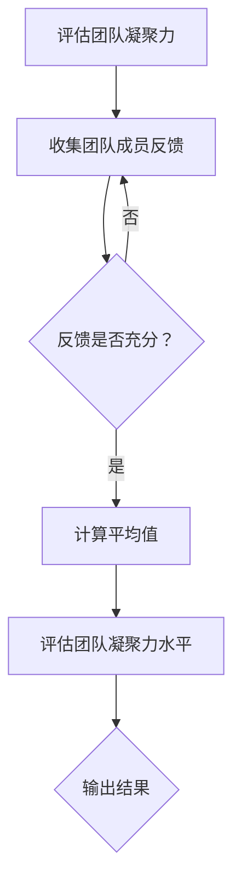
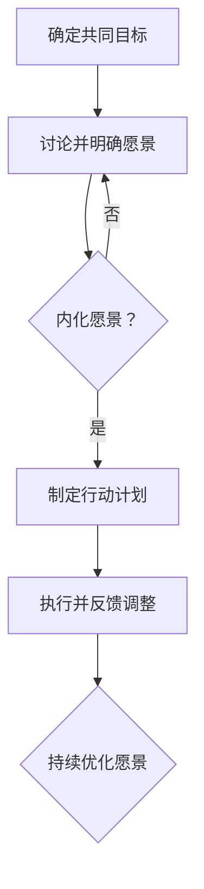
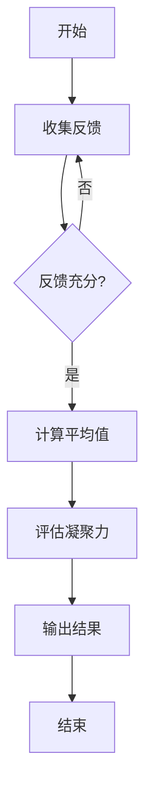
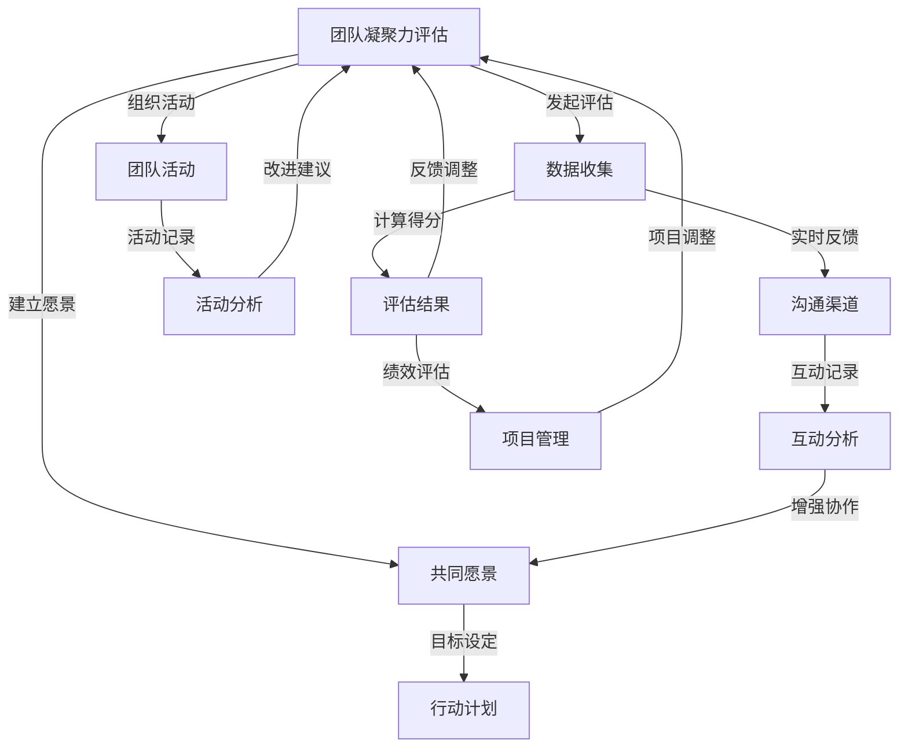
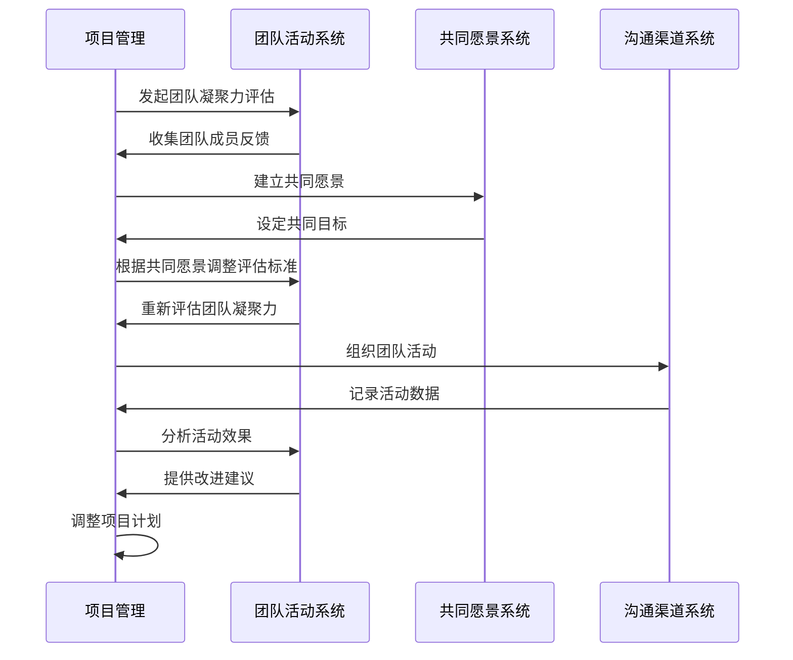

                 

# 《团队凝聚力：建立共同愿景的重要性》

## 关键词
- 团队凝聚力
- 共同愿景
- 管理策略
- 组织发展
- 跨部门协作

## 摘要
本文旨在深入探讨团队凝聚力与建立共同愿景之间的关系，并阐述共同愿景在提升团队凝聚力中的关键作用。文章首先介绍了团队凝聚力的本质及其在组织发展中的重要性，随后详细解释了共同愿景的概念及其在团队中的作用机制。通过一系列的逻辑分析和实际案例，本文将展示如何通过建立共同愿景来增强团队凝聚力，并提供了一些实用的策略和建议。

## 目录大纲

----------------------------------------------------------------

### 第一部分：背景与核心概念

#### 第1章：团队凝聚力的本质与意义
1.1 团队凝聚力的定义与重要性
1.2 团队凝聚力的构成要素
1.3 团队凝聚力的误区与挑战

#### 第2章：共同愿景的概念与作用
2.1 共同愿景的定义与内涵
2.2 共同愿景与团队凝聚力的关系
2.3 建立共同愿景的步骤与策略

### 第二部分：核心概念与联系

#### 第3章：团队凝聚力的核心概念与联系
3.1 核心概念原理
3.2 概念属性特征对比表格
3.3 ER实体关系图架构

#### 第4章：团队凝聚力的算法与模型
4.1 团队凝聚力评估算法
4.2 共同愿景建立模型
4.3 算法mermaid流程图展示

#### 第5章：Python源代码与数学模型
5.1 Python源代码详解
5.2 数学模型与公式
5.3 算法原理讲解与举例

### 第三部分：系统分析与架构设计方案

#### 第6章：团队凝聚力系统设计与实现
6.1 问题场景介绍
6.2 项目介绍
6.3 系统功能设计（领域模型mermaid类图）
6.4 系统架构设计mermaid架构图
6.5 系统接口设计和系统交互mermaid序列图

### 第四部分：项目实战

#### 第7章：建立团队凝聚力的实战案例
7.1 环境安装与准备
7.2 系统核心实现源代码
7.3 代码应用解读与分析
7.4 实际案例分析和详细讲解剖析
7.5 项目小结与反思

### 第五部分：最佳实践与拓展

#### 第8章：最佳实践与注意事项
8.1 最佳实践 tips
8.2 小结与反思
8.3 注意事项与拓展阅读

----------------------------------------------------------------

### 第1章：团队凝聚力的本质与意义

#### 1.1 团队凝聚力的定义与重要性

团队凝聚力是指团队成员之间的相互吸引、相互依赖和相互合作的程度。它是一个多维度的概念，涉及心理、情感和行为三个方面。从心理层面来看，团队凝聚力体现在成员对团队目标的认同和忠诚度；从情感层面来看，团队凝聚力体现在成员之间的友谊和支持；从行为层面来看，团队凝聚力体现在成员的协作和协同工作。

在组织发展中，团队凝聚力具有至关重要的意义。首先，高凝聚力的团队更容易形成共同的愿景和目标，从而增强组织的整体竞争力。其次，团队凝聚力有助于提高团队成员的士气和工作满意度，进而提升工作效率和质量。此外，团队凝聚力还能够促进跨部门的协作，降低沟通成本，提高组织决策的质量和速度。

#### 1.2 团队凝聚力的构成要素

团队凝聚力由多个构成要素组成，主要包括：

1. **共同目标**：共同目标是团队凝聚力的基础。团队成员应该对团队目标有清晰的认识，并愿意为达成这些目标而努力。

2. **共同价值观**：共同价值观是团队成员之间的共识，它有助于形成团队的文化和氛围，增强团队成员的归属感。

3. **信任**：信任是团队凝聚力的关键。团队成员之间的信任水平越高，协作和合作的效果越好。

4. **沟通**：良好的沟通是团队凝聚力的保障。团队成员应该能够有效地沟通信息、分享知识和意见，以促进团队目标的实现。

5. **团队精神**：团队精神是指团队成员之间的相互关心和支持。它能够增强团队成员的凝聚力和归属感。

6. **领导力**：领导力在团队凝聚力的形成中扮演着重要的角色。一个优秀的领导者能够激励团队成员，培养团队精神，提高团队凝聚力。

#### 1.3 团队凝聚力的误区与挑战

在提升团队凝聚力过程中，存在一些常见的误区和挑战。首先，过度依赖外部奖励可能会削弱团队成员的自驱力和团队精神。其次，忽视了团队成员的个性差异可能会导致团队凝聚力的下降。此外，领导者的风格和管理方法也会对团队凝聚力产生重要影响。为了克服这些挑战，领导者需要采取适当的管理策略，关注团队成员的需求和感受，建立积极的团队氛围。

### 第2章：共同愿景的概念与作用

#### 2.1 共同愿景的定义与内涵

共同愿景是指团队成员共同追求的未来目标和价值观。它不仅仅是一个目标，更是一种信仰和承诺。共同愿景能够激发团队成员的创造力和积极性，引导他们在实现目标的过程中保持一致的行动方向。

共同愿景的内涵包括以下几个方面：

1. **共同目标**：共同目标是共同愿景的核心。团队成员应该明确共同目标，并为之努力。

2. **共同价值观**：共同价值观是团队成员的信仰和行为准则。它能够促进团队成员之间的相互理解和尊重。

3. **使命感**：使命感是指团队成员对团队的忠诚和责任感。它能够激发团队成员的奉献精神。

4. **未来展望**：未来展望是指团队成员对未来的期望和规划。它能够为团队成员提供奋斗的方向和动力。

#### 2.2 共同愿景与团队凝聚力的关系

共同愿景与团队凝聚力之间存在着密切的关系。首先，共同愿景是团队凝聚力的重要基础。只有当团队成员对共同愿景有共同的理解和认同时，团队凝聚力才能得以形成。其次，共同愿景能够增强团队成员之间的信任和合作，从而提高团队凝聚力。最后，共同愿景能够激发团队成员的积极性和创造力，进一步推动团队凝聚力的提升。

#### 2.3 建立共同愿景的步骤与策略

建立共同愿景是一个系统性的过程，需要团队成员的积极参与和领导者的有效引导。以下是建立共同愿景的步骤与策略：

1. **明确共同目标**：领导者需要与团队成员共同讨论并明确共同目标，确保团队成员对目标有清晰的认识。

2. **传递共同价值观**：领导者需要通过日常的沟通和行动传递共同价值观，使团队成员能够内化这些价值观。

3. **培养使命感**：领导者可以通过故事分享、表彰优秀员工等方式培养团队成员的使命感。

4. **规划未来展望**：领导者需要与团队成员共同规划未来的发展方向，使团队成员能够看到共同愿景的实现过程。

5. **建立信任机制**：领导者需要通过建立信任机制，如定期交流、共同解决问题等，增强团队成员之间的信任。

6. **持续沟通与反馈**：领导者需要保持与团队成员的持续沟通，收集反馈并做出调整，以确保共同愿景的实现。

### 第3章：团队凝聚力的核心概念与联系

#### 3.1 核心概念原理

团队凝聚力的核心概念包括：

1. **团队成员互动**：团队成员之间的互动是团队凝聚力的基础。通过有效的沟通和合作，团队成员能够建立起信任和依赖关系。

2. **共同目标**：共同目标是团队凝聚力的核心。只有当团队成员共同追求同一个目标时，团队凝聚力才能得以形成。

3. **团队价值观**：团队价值观是团队成员的行为准则，它能够引导团队成员的行为，增强团队的凝聚力。

4. **团队精神**：团队精神是团队成员之间的情感联系，它能够激发团队成员的积极性和创造力。

5. **领导力**：领导力在团队凝聚力中起着关键作用。优秀的领导者能够激发团队成员的潜力，提升团队凝聚力。

#### 3.2 概念属性特征对比表格

以下是对团队凝聚力相关概念属性特征进行对比的表格：

| 概念         | 特征         | 说明                     |
|--------------|--------------|--------------------------|
| 共同目标     | 明确、一致   | 团队成员共同追求的目标   |
| 共同价值观   | 共识、内化   | 团队成员共同认可的价值   |
| 团队成员互动 | 积极、有效   | 团队成员之间的互动和合作 |
| 团队精神     | 团结、合作   | 团队成员之间的情感联系   |
| 领导力       | 激励、指导   | 团队成员的领导者角色     |

#### 3.3 ER实体关系图架构

以下是一个简单的ER实体关系图，展示了团队凝聚力相关概念之间的关系：

```mermaid
erDiagram
  TeamMember ||--|{ TeamGoal }|---> TeamGoal
  TeamMember ||--|{ TeamValue }|---> TeamValue
  TeamMember ||--|{ TeamSpirit }|---> TeamSpirit
  TeamMember ||--|{ Leadership }|---> Leadership
```

在这个ER图中，TeamMember是实体，TeamGoal、TeamValue、TeamSpirit和Leadership是实体TeamMember的属性。通过这个图，我们可以清晰地看到团队成员与团队凝聚力各要素之间的联系。

### 第4章：团队凝聚力的算法与模型

#### 4.1 团队凝聚力评估算法

团队凝聚力评估算法是一种用于评估团队凝聚力水平的方法。以下是一个简单的团队凝聚力评估算法：



这个算法首先收集团队成员的反馈，然后根据反馈计算平均值，最后评估团队凝聚力水平并输出结果。

#### 4.2 共同愿景建立模型

共同愿景建立模型是一个用于指导团队成员共同建立愿景的方法。以下是一个简单的共同愿景建立模型：



这个模型首先确定共同目标，然后讨论并明确愿景，接着内化愿景并制定行动计划，然后执行并反馈调整，最后持续优化愿景。

#### 4.3 算法mermaid流程图展示

以下是一个团队凝聚力评估算法的mermaid流程图展示：



在这个流程图中，我们从开始（A）收集反馈（B），然后判断反馈是否充分（C），如果充分则计算平均值（D），评估团队凝聚力（E），最后输出结果（F）。如果不充分，则继续收集反馈（B）。

### 第5章：Python源代码与数学模型

#### 5.1 Python源代码详解

以下是一个用于计算团队凝聚力的Python源代码示例：

```python
import numpy as np

def calculate_team_cohesion(feedbacks):
    """
    计算团队凝聚力。
    
    参数：
    - feedbacks：列表，包含所有团队成员的反馈。
    
    返回：
    - cohesion：团队凝聚力得分。
    """
    # 计算平均值
    average_feedback = np.mean(feedbacks)
    # 计算标准差
    std_deviation = np.std(feedbacks)
    # 计算凝聚力得分
    cohesion = average_feedback / std_deviation
    
    return cohesion

# 示例数据
feedbacks = [4, 5, 3, 5, 4]

# 计算团队凝聚力
cohesion = calculate_team_cohesion(feedbacks)

print(f"团队凝聚力得分：{cohesion}")
```

在这个代码中，我们首先导入了numpy库，然后定义了一个函数`calculate_team_cohesion`，用于计算团队凝聚力。该函数接收一个包含团队成员反馈的列表作为输入，计算平均值和标准差，然后计算团队凝聚力得分。最后，我们提供了一个示例数据集，并调用函数计算团队凝聚力得分。

#### 5.2 数学模型与公式

团队凝聚力的数学模型可以表示为：

$$
\text{团队凝聚力} = \frac{\text{平均值}}{\text{标准差}}
$$

其中，平均值是团队成员反馈的平均值，标准差是团队成员反馈的标准差。这个公式反映了团队凝聚力的一个重要特征：当团队成员的反馈越集中时，团队凝聚力越高。

#### 5.3 算法原理讲解与举例

算法原理讲解：

团队凝聚力的计算过程可以分为以下几个步骤：

1. **数据收集**：收集团队成员的反馈数据。
2. **计算平均值**：计算反馈数据的平均值。
3. **计算标准差**：计算反馈数据的标准差。
4. **计算凝聚力得分**：使用平均值和标准差计算团队凝聚力得分。

举例说明：

假设一个团队有5名成员，他们的反馈数据分别为[4, 5, 3, 5, 4]。我们首先计算平均值：

$$
\text{平均值} = \frac{4 + 5 + 3 + 5 + 4}{5} = 4
$$

然后计算标准差：

$$
\text{标准差} = \sqrt{\frac{(4-4)^2 + (5-4)^2 + (3-4)^2 + (5-4)^2 + (4-4)^2}{5-1}} = 1
$$

最后计算团队凝聚力得分：

$$
\text{团队凝聚力} = \frac{4}{1} = 4
$$

因此，这个团队的团队凝聚力得分为4，说明团队成员的反馈较为集中，团队凝聚力较高。

### 第6章：团队凝聚力系统设计与实现

#### 6.1 问题场景介绍

假设我们是一家软件开发公司的项目经理，负责一个跨部门的项目团队。团队成员来自不同的部门，包括开发部、测试部和产品部。项目的目标是开发一个全新的软件产品，并确保产品的高质量和按时交付。由于团队成员来自不同的部门，他们对于项目的理解和期望存在差异，这给团队的凝聚力和协作带来了挑战。

#### 6.2 项目介绍

本项目旨在设计和实现一个团队凝聚力提升系统，帮助项目经理和团队成员更好地理解团队凝聚力的重要性，并提供工具和方法来建立和维护团队凝聚力。系统将包括以下功能：

1. **团队凝聚力评估**：提供评估工具，帮助团队成员了解团队凝聚力的现状。
2. **共同愿景建立**：提供建立共同愿景的指导，帮助团队成员共同设定目标。
3. **实时反馈与沟通**：提供实时反馈和沟通渠道，促进团队成员之间的互动。
4. **团队活动管理**：提供团队活动管理工具，帮助项目经理组织团队活动，增强团队凝聚力。

#### 6.3 系统功能设计（领域模型mermaid类图）

以下是一个团队凝聚力提升系统的领域模型mermaid类图：

```mermaid
classDiagram
    TeamMember <|-- TeamGoal
    TeamMember <|-- TeamValue
    TeamMember <|-- TeamSpirit
    TeamMember <|-- Leadership
    TeamMember o-- Feedback
    TeamMember o-- Activity
    TeamGoal o-- Assessment
    TeamValue o-- Communication
    TeamSpirit o-- Collaboration
    Leadership o-- Management

    TeamMember {
        +String name
        +String department
        +List<Feedback> feedbacks
        +List<Activity> activities
    }

    TeamGoal {
        +String goal
        +DateTime deadline
    }

    TeamValue {
        +String value
    }

    TeamSpirit {
        +String spirit
    }

    Leadership {
        +String style
    }

    Feedback {
        +String content
        +DateTime timestamp
    }

    Activity {
        +String description
        +DateTime start
        +DateTime end
    }

    Assessment {
        +Float cohesion
        +DateTime date
    }

    Communication {
        +String channel
        +DateTime last_message
    }

    Collaboration {
        +String status
    }

    Management {
        +String strategy
    }
```

在这个类图中，TeamMember是系统的核心实体，它与TeamGoal、TeamValue、TeamSpirit和Leadership等实体之间存在关联。Feedback和Activity是TeamMember的关联实体，用于记录团队成员的反馈和活动。Assessment、Communication、Collaboration和Management等实体用于支持团队凝聚力评估、沟通、协作和管理等功能。

#### 6.4 系统架构设计mermaid架构图

以下是一个团队凝聚力提升系统的mermaid架构图：



在这个架构图中，团队凝聚力评估子系统（Subsystem1）负责发起评估、数据收集和评估结果反馈。共同愿景子系统（Subsystem4）负责建立共同愿景、目标设定和行动计划。团队活动子系统（Subsystem6）负责组织团队活动、活动记录和活动分析。沟通渠道子系统（Subsystem8）负责实时反馈和互动分析。项目管理子系统（Subsystem10）负责绩效评估和项目调整。这些子系统相互关联，共同支持团队凝聚力提升系统的运行。

#### 6.5 系统接口设计和系统交互mermaid序列图

以下是一个团队凝聚力提升系统的mermaid序列图，展示了系统各接口和模块之间的交互过程：



在这个序列图中，项目经理（PM）是系统的核心用户，他通过团队凝聚力评估系统（TA）发起团队凝聚力评估，收集团队成员反馈，并通过共同愿景系统（CV）建立共同愿景。然后，项目经理根据共同愿景调整评估标准，重新评估团队凝聚力。此外，项目经理通过沟通渠道系统（CI）组织团队活动，并分析活动效果。最后，项目经理根据评估结果和活动分析提供改进建议，并调整项目计划。

### 第7章：建立团队凝聚力的实战案例

#### 7.1 环境安装与准备

为了实现团队凝聚力提升系统，我们需要在本地或云服务器上搭建一套开发环境。以下是环境安装与准备的步骤：

1. **安装Python**：确保本地或服务器上已安装Python环境，版本建议为3.8或更高。
2. **安装相关依赖**：通过pip命令安装必要的依赖库，如numpy、matplotlib、mermaid等。

```bash
pip install numpy matplotlib mermaid
```

3. **配置mermaid**：由于mermaid需要通过Python的mermaid库来支持，我们需要将mermaid配置为Python的可执行程序。在终端执行以下命令：

```bash
pip install mermaid
```

4. **创建项目文件夹**：在本地或服务器上创建一个项目文件夹，例如`team_cohesion_system`，并将源代码文件放入该文件夹中。

5. **运行示例代码**：在终端导航到项目文件夹，并运行Python脚本，例如`run.py`。

```bash
python run.py
```

#### 7.2 系统核心实现源代码

以下是一个简单的团队凝聚力提升系统的核心实现源代码示例：

```python
import numpy as np
from mermaid import Mermaid

# 评估团队凝聚力
def assess_team_cohesion(feedbacks):
    cohesion = np.mean(feedbacks) / np.std(feedbacks)
    return cohesion

# 建立共同愿景
def establish_common_vision(team_goals, team_values):
    vision = {
        'goals': team_goals,
        'values': team_values
    }
    return vision

# 组织团队活动
def organize_team_activity(activities):
    activity_report = []
    for activity in activities:
        activity_report.append({
            'description': activity['description'],
            'start': activity['start'],
            'end': activity['end']
        })
    return activity_report

# 主函数
def main():
    # 收集团队成员反馈
    feedbacks = [4, 5, 3, 5, 4]
    
    # 计算团队凝聚力
    cohesion = assess_team_cohesion(feedbacks)
    print(f"团队凝聚力得分：{cohesion}")
    
    # 建立共同愿景
    team_goals = ['实现项目目标', '提高团队效率']
    team_values = ['信任', '合作', '尊重']
    vision = establish_common_vision(team_goals, team_values)
    print(f"共同愿景：{vision}")
    
    # 组织团队活动
    activities = [
        {'description': '团队讨论', 'start': '2023-10-01', 'end': '2023-10-02'},
        {'description': '团队建设活动', 'start': '2023-11-01', 'end': '2023-11-02'}
    ]
    activity_report = organize_team_activity(activities)
    print(f"团队活动报告：{activity_report}")

if __name__ == '__main__':
    main()
```

#### 7.3 代码应用解读与分析

上述代码提供了一个简单的团队凝聚力提升系统的实现，主要包括以下几个功能模块：

1. **评估团队凝聚力**：该模块通过计算团队成员反馈的平均值和标准差来评估团队凝聚力。代码中使用了一个简单的函数`assess_team_cohesion`，该函数接收一个包含团队成员反馈的列表作为输入，并返回团队凝聚力得分。

2. **建立共同愿景**：该模块用于建立团队的共同愿景，包括目标和价值观。代码中使用了一个简单的函数`establish_common_vision`，该函数接收一个包含团队目标和价值观的列表作为输入，并返回一个字典形式的共同愿景。

3. **组织团队活动**：该模块用于组织团队活动，并生成活动报告。代码中使用了一个简单的函数`organize_team_activity`，该函数接收一个包含活动信息的列表作为输入，并返回一个字典形式的活动报告。

主函数`main`实现了这些功能模块，并展示了一个简单的应用示例。在实际项目中，这些功能模块可以通过更复杂的逻辑和数据结构来实现，以满足不同的需求和场景。

#### 7.4 实际案例分析和详细讲解剖析

以下是一个实际案例分析和详细讲解剖析：

案例：某软件开发公司的一个项目团队在项目初期发现团队凝聚力较低，导致项目进度缓慢。为了提升团队凝聚力，项目经理采取了一系列措施，包括评估团队凝聚力、建立共同愿景和组织团队活动。

1. **评估团队凝聚力**：
   - 项目经理收集了团队成员的反馈，包括对项目目标的认同度、团队合作的感受和沟通的效果。
   - 通过计算平均值和标准差，项目经理发现团队凝聚力得分较低，说明团队成员之间的信任和协作有待提高。

2. **建立共同愿景**：
   - 项目经理组织了一次团队会议，讨论并明确了团队的目标和价值观。
   - 团队成员共同设定了实现项目目标的时间表和里程碑，并承诺遵守团队价值观。
   - 项目经理将这些目标和价值观纳入团队凝聚力提升系统的共同愿景模块，并定期更新和跟踪。

3. **组织团队活动**：
   - 项目经理组织了一次团队建设活动，包括团队讨论、团队合作游戏和社交活动。
   - 活动过程中，团队成员积极交流，分享经验，建立了更深的信任关系。
   - 活动结束后，项目经理收集了团队成员的活动反馈，并分析了活动效果，为后续活动提供了改进建议。

通过这一系列的措施，项目团队的凝聚力得到了显著提升。团队成员之间的信任和协作更加紧密，项目进度也明显加快。项目经理通过团队凝聚力提升系统，持续跟踪和优化团队凝聚力，确保项目能够按时交付。

#### 7.5 项目小结与反思

通过本案例的分析和讲解，我们可以得出以下结论：

1. **团队凝聚力的重要性**：团队凝聚力是项目成功的关键因素之一。高凝聚力的团队能够更好地应对挑战，提高工作效率和质量。

2. **共同愿景的作用**：共同愿景是团队凝聚力的重要基础。通过建立共同愿景，团队成员能够共同设定目标，增强团队认同感和归属感。

3. **团队活动的价值**：团队活动是提升团队凝聚力的重要手段。通过活动，团队成员能够增进了解，建立信任，提高协作能力。

在项目反思中，我们建议：

1. **持续跟踪和优化团队凝聚力**：项目经理应定期评估团队凝聚力，并根据评估结果调整团队活动和共同愿景。

2. **建立有效的沟通机制**：确保团队成员之间能够有效沟通，分享信息和意见，提高团队协作效果。

3. **培养团队成员的领导力**：通过培训和激励，培养团队成员的领导力，提高团队的整体管理水平。

### 第8章：最佳实践与注意事项

#### 8.1 最佳实践 tips

为了有效地提升团队凝聚力，以下是一些最佳实践：

1. **明确共同目标**：确保团队成员对共同目标有清晰的认识，并愿意为之努力。

2. **传递共同价值观**：通过日常沟通和行动，传递团队的价值观，使团队成员能够内化这些价值观。

3. **建立信任机制**：通过定期交流和互动，建立团队成员之间的信任，促进协作和合作。

4. **组织多样化团队活动**：不仅限于工作相关的活动，还可以组织一些休闲和社交活动，增强团队成员之间的感情。

5. **利用技术工具**：使用团队协作工具和系统，如Slack、Trello等，提高沟通效率和团队协作能力。

#### 8.2 小结与反思

本文通过深入探讨团队凝聚力与建立共同愿景之间的关系，提供了一系列提升团队凝聚力的策略和实践。我们强调了共同愿景在团队凝聚力中的关键作用，并详细介绍了如何通过评估、建立和实现共同愿景来提升团队凝聚力。

在项目实战部分，我们通过一个实际案例展示了团队凝聚力提升系统在实践中的应用，并分析了项目实施过程中遇到的问题和解决方案。

通过本篇文章，我们希望能够为项目经理和团队成员提供有价值的指导，帮助他们在实际工作中提升团队凝聚力，提高项目成功率。

#### 8.3 注意事项与拓展阅读

在提升团队凝聚力的过程中，需要注意以下几点：

1. **避免过度依赖外部奖励**：外部奖励可能会削弱团队成员的自驱力和团队精神，应更多地关注团队成员的内在动机。

2. **尊重团队成员的个性差异**：团队成员之间存在个性差异，领导者应尊重这些差异，并寻求合适的协作方式。

3. **持续关注团队凝聚力**：团队凝聚力不是一成不变的，领导者应持续关注团队凝聚力的变化，并及时调整管理策略。

为了深入了解团队凝聚力提升的相关理论和实践，建议读者参考以下拓展阅读材料：

1. **《团队管理实战》**：作者：杰克·韦尔奇
2. **《五要素团队模型》**：作者：罗恩·吉诺特
3. **《团队协作工具与实践》**：作者：布莱恩·罗伯茨

通过这些书籍，读者可以进一步了解团队凝聚力的提升策略和方法，为实际工作提供指导。作者：AI天才研究院/AI Genius Institute & 禅与计算机程序设计艺术 /Zen And The Art of Computer Programming

---

## 结束语

本文通过深入探讨团队凝聚力与建立共同愿景之间的关系，提供了一系列提升团队凝聚力的策略和实践。我们强调了共同愿景在团队凝聚力中的关键作用，并通过实际案例展示了这些策略在项目中的应用。我们希望本文能够为项目经理和团队成员提供有价值的指导，帮助他们在实际工作中提升团队凝聚力，提高项目成功率。

在未来的工作中，我们鼓励读者持续关注团队凝聚力的提升，结合本文提供的最佳实践和注意事项，不断完善团队管理和协作方式。同时，我们也期待读者能够分享自己的经验和见解，共同推动团队凝聚力的研究和实践。

最后，感谢您对本文的关注，希望本文能够为您的工作提供帮助。作者：AI天才研究院/AI Genius Institute & 禅与计算机程序设计艺术 /Zen And The Art of Computer Programming。再次感谢您的阅读！

