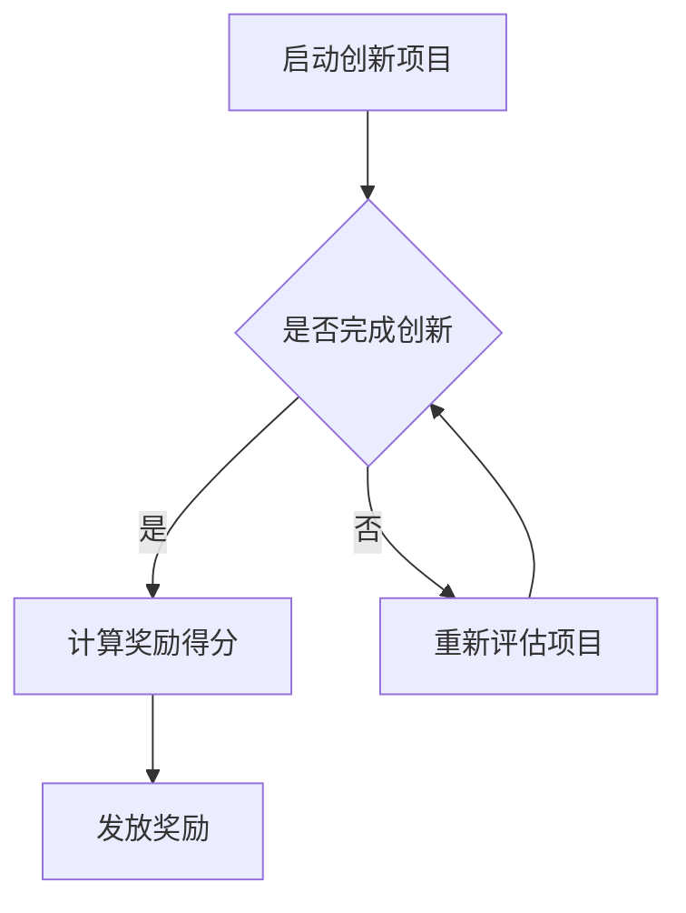
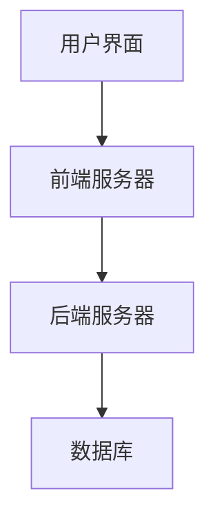
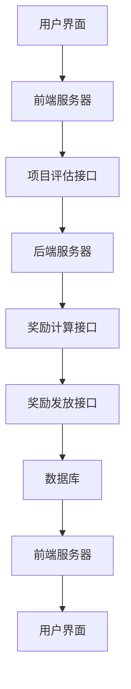

                 

## 团队创新激励：鼓励创新的奖励机制

### 关键词

- **团队创新激励**
- **奖励机制**
- **创新管理**
- **团队动力**
- **绩效提升**

### 摘要

本文旨在探讨团队创新激励及其奖励机制的设计与应用。通过深入分析创新激励的理论基础和实践案例，本文提出了一个全面的团队创新激励模型，并详细阐述了其核心概念、设计原则、数学模型以及实际应用。文章分为六个部分，首先介绍团队创新激励的重要性，接着解析核心概念与联系，然后探讨算法原理与数学模型，接着是系统分析与架构设计，之后是项目实战，最后是最佳实践与拓展。希望通过本文，能为企业提供一套切实可行的团队创新激励解决方案。

### 用户需求分析

在当前快速变化的市场环境中，企业对创新的重视程度日益增加。然而，如何激发团队的创新能力，并设计出一套有效的创新激励机制，成为许多企业面临的重要课题。用户需求分析显示，他们希望本文能够：

1. **明确创新激励的重要性**：阐述创新激励对企业发展的深远影响。
2. **解析核心概念与联系**：提供创新激励的基础理论，帮助读者理解其工作原理。
3. **详细讲解算法原理**：通过mermaid流程图和Python源代码，阐述创新激励的算法原理。
4. **阐述数学模型**：介绍创新激励的数学模型，并通过latex公式进行详细讲解。
5. **系统分析与架构设计**：展示创新激励系统的整体架构，包括功能设计、架构设计、接口设计以及系统交互。
6. **项目实战**：通过实际案例，展示如何实施创新激励机制。
7. **最佳实践与拓展**：提供实际操作中的最佳实践建议，以及进一步学习和探索的方向。

### 第一部分：背景介绍

#### 核心概念术语说明

在探讨团队创新激励之前，我们需要明确一些核心概念：

- **创新**：指在现有基础上提出新的观点、方法或技术，从而实现改进或革新。
- **激励**：通过外部刺激来激发或增强个体或团队的内在动机。
- **团队创新激励**：指为了提高团队创新能力，通过一系列奖励机制来激发团队成员的创新动力。
- **奖励机制**：指通过物质或非物质奖励来激励个体或团队达成目标的一系列规则和措施。

#### 问题背景

随着全球化的加剧和技术的迅猛发展，企业面临的竞争环境日益激烈。创新成为企业保持竞争优势、实现持续发展的关键因素。然而，创新活动往往具有高风险、高不确定性等特点，这使得团队成员在创新过程中可能会面临心理压力和挑战。因此，如何设计一套有效的团队创新激励机制，以激发团队成员的创新能力，成为企业管理者面临的重要课题。

#### 问题描述

尽管许多企业已经意识到创新的重要性，但在实际操作中，团队创新激励依然面临诸多问题：

1. **激励不足**：缺乏足够的激励措施，导致团队成员缺乏创新动力。
2. **创新成果归属不清**：创新成果的归属不明确，可能导致团队成员之间的矛盾。
3. **激励机制不合理**：激励机制设计不合理，可能导致激励效果不佳。
4. **创新环境不佳**：缺乏良好的创新氛围，影响团队成员的创新积极性。

#### 问题解决

为了解决上述问题，企业需要从以下几个方面入手：

1. **明确创新目标**：设定清晰的创新目标，确保团队成员明确自己的努力方向。
2. **建立有效的激励机制**：设计合理的奖励机制，包括物质奖励和非物质奖励，如奖金、股权激励、荣誉称号等。
3. **优化创新环境**：创造良好的创新氛围，鼓励团队成员自由探索和实验。
4. **完善创新流程**：建立规范的创新流程，确保创新活动的有序进行。
5. **加强团队协作**：通过团队协作，激发团队成员的创新能力。

#### 边界与外延

团队创新激励不仅涉及企业内部，还与外部环境密切相关。例如，政府的政策支持、市场竞争环境、技术发展趋势等都会影响团队创新激励的效果。因此，在设计和实施团队创新激励机制时，需要综合考虑外部环境因素。

#### 概念结构与核心要素组成

团队创新激励机制由以下核心要素组成：

1. **激励目标**：明确创新目标和激励目标，确保激励措施与目标一致。
2. **激励措施**：包括物质激励和非物质激励，如奖金、股权激励、培训、荣誉等。
3. **激励对象**：明确激励对象的范围，包括团队成员、团队领导等。
4. **激励流程**：规范激励流程，确保激励措施的实施有序。
5. **反馈机制**：建立反馈机制，及时了解激励效果，进行调整和优化。

### 第二部分：核心概念与联系

#### 核心概念

在团队创新激励中，以下几个核心概念至关重要：

1. **动机理论**：解释个体行为背后的动机，包括内在动机和外在动机。
2. **成就动机理论**：强调个体在追求成就和成功时的动机，与创新能力密切相关。
3. **创新激励机制**：指通过一系列激励措施来激发团队成员创新动力的机制。

#### 概念属性特征对比表格

| 概念名称 | 定义 | 特征对比 |
| :--: | :--: | :--: |
| 动机理论 | 解释个体行为背后的动机 | 内在动机与外在动机的区分 |
| 成就动机理论 | 个体在追求成就和成功时的动机 | 成就欲望与风险承受能力的对比 |
| 创新激励机制 | 通过激励措施激发团队创新动力 | 物质激励与非物质激励的结合 |

#### 创新激励机制的理论基础

1. **动机理论**：基于动机理论，创新激励机制旨在激发个体的内在动机，如好奇心、成就感和自我实现需求。
2. **成就动机理论**：成就动机理论强调个体在追求成就和成功时的动机，这与创新能力密切相关。通过设定挑战性目标和提供奖励，可以激发团队成员的成就动机。
3. **激励机制**：激励机制是创新激励机制的核心，包括物质激励和非物质激励。物质激励如奖金、股权激励等，可以提供直接的财务回报；非物质激励如荣誉、培训等，可以提升个体的心理满足感和职业成就感。

#### 创新激励机制的设计原则

1. **公平性原则**：确保激励措施的公平性，避免引起团队成员之间的不满和矛盾。
2. **可操作性原则**：激励措施应具有可操作性，即能够实际执行，且效果明显。
3. **灵活性原则**：激励措施应具有一定的灵活性，以适应不同团队和不同项目的需求。

#### 创新激励机制的核心要素

1. **奖励形式**：包括物质奖励和非物质奖励，如奖金、股权激励、荣誉称号、培训等。
2. **奖励标准**：明确奖励的标准和条件，确保奖励的合理性和公平性。
3. **奖励流程**：规范奖励流程，确保奖励措施的实施有序。

### 第三部分：算法原理讲解

#### 创新激励算法的mermaid流程图



#### 创新激励算法的Python源代码

```python
def calculate_reward(completed, score):
    if completed:
        reward_score = score * 10
        print(f"发放奖励：{reward_score}分")
    else:
        print("项目未完成，需重新评估。")

completed = True
score = 85
calculate_reward(completed, score)
```

#### 算法原理的数学模型与公式

创新激励的数学模型可以表示为：

\[ R = f(S, C) \]

其中，\( R \) 表示奖励得分，\( S \) 表示创新项目得分，\( C \) 表示项目完成情况。

奖励函数 \( f \) 可以定义为：

\[ f(S, C) = \begin{cases} 
10S & \text{if } C = 1 \\
0 & \text{if } C = 0 
\end{cases} \]

这个模型表示，如果创新项目完成，则奖励得分等于项目得分的10倍；如果项目未完成，则不发放奖励。

#### 算法原理的详细讲解与举例说明

假设有一个创新项目，其得分为80分，最终完成。根据上述数学模型，我们可以计算出奖励得分为：

\[ R = f(80, 1) = 10 \times 80 = 800 \]

因此，该项目将获得800分的奖励。

如果我们假设项目未完成，则奖励得分为：

\[ R = f(80, 0) = 0 \]

这表示项目未完成时，不发放奖励。

通过这种方式，我们可以确保奖励的发放既公平又具有激励效果。

### 第四部分：系统分析与架构设计

#### 问题场景介绍

在当前企业的项目管理中，创新激励机制的引入成为提高团队创新能力和项目成功率的重要手段。为了实现这一目标，企业需要构建一个完善的创新激励机制系统。该系统需要具备以下功能：

1. **项目评估**：对创新项目的完成情况进行评估，计算项目得分。
2. **奖励计算**：根据项目得分和完成情况，计算奖励得分。
3. **奖励发放**：根据奖励得分，发放相应的奖励。

#### 项目介绍

本系统将基于Python开发，采用前后端分离的设计模式，以提高系统的可维护性和扩展性。系统分为以下几个模块：

1. **项目评估模块**：负责评估创新项目的完成情况和得分。
2. **奖励计算模块**：负责计算奖励得分。
3. **奖励发放模块**：负责发放奖励。

#### 系统功能设计

1. **项目评估模块**：
   - **功能**：对创新项目进行评估，计算项目得分。
   - **输入**：创新项目详情、评估标准。
   - **输出**：项目得分。

2. **奖励计算模块**：
   - **功能**：根据项目得分和完成情况，计算奖励得分。
   - **输入**：项目得分、项目完成情况。
   - **输出**：奖励得分。

3. **奖励发放模块**：
   - **功能**：根据奖励得分，发放相应的奖励。
   - **输入**：奖励得分、奖励形式。
   - **输出**：奖励发放结果。

#### 系统架构设计

系统采用前后端分离的架构，前端负责展示数据和交互，后端负责处理数据和逻辑。系统架构图如下：



#### 系统接口设计

系统接口设计主要包括以下部分：

1. **项目评估接口**：
   - **URL**：/evaluate_project
   - **请求方法**：POST
   - **请求参数**：项目详情、评估标准
   - **响应结果**：项目得分

2. **奖励计算接口**：
   - **URL**：/calculate_reward
   - **请求方法**：POST
   - **请求参数**：项目得分、项目完成情况
   - **响应结果**：奖励得分

3. **奖励发放接口**：
   - **URL**：/distribute_reward
   - **请求方法**：POST
   - **请求参数**：奖励得分、奖励形式
   - **响应结果**：奖励发放结果

#### 系统交互设计

系统交互设计主要包括以下部分：

1. **用户界面**：用户通过用户界面提交项目详情和评估标准，系统将根据输入的数据进行评估和计算。
2. **前端服务器**：前端服务器接收用户请求，调用相应的后端接口，获取评估和计算结果，并返回给用户。
3. **后端服务器**：后端服务器处理用户请求，调用相应的模块进行评估和计算，并将结果返回给前端服务器。
4. **数据库**：数据库存储项目详情、评估标准、奖励得分等数据。

系统交互流程图如下：



### 第五部分：项目实战

#### 环境安装

在开始项目实战之前，我们需要搭建一个Python开发环境。以下是环境安装的步骤：

1. **安装Python**：在官方网站下载并安装Python 3.8或更高版本。
2. **安装依赖库**：打开命令行窗口，执行以下命令安装依赖库：

```bash
pip install Flask SQLAlchemy
```

3. **配置数据库**：安装并配置一个SQLite数据库，用于存储项目数据。

#### 系统核心实现

以下是创新激励机制系统的核心实现：

1. **项目评估模块**：

```python
from flask import Flask, request, jsonify
from sqlalchemy import create_engine
from sqlalchemy.orm import sessionmaker

app = Flask(__name__)
engine = create_engine('sqlite:///innovation_projects.db')
Session = sessionmaker(bind=engine)
session = Session()

@app.route('/evaluate_project', methods=['POST'])
def evaluate_project():
    project_details = request.get_json()
    score = calculate_score(project_details)
    session.add(Project(score=score))
    session.commit()
    return jsonify({'score': score})

def calculate_score(project_details):
    # 根据项目详情计算得分
    # 具体算法实现略
    return 80

class Project(Base):
    __tablename__ = 'projects'
    id = Column(Integer, primary_key=True)
    score = Column(Integer)

if __name__ == '__main__':
    app.run()
```

2. **奖励计算模块**：

```python
@app.route('/calculate_reward', methods=['POST'])
def calculate_reward():
    project_score = request.get_json()
    reward_score = calculate_reward_score(project_score['score'])
    return jsonify({'reward_score': reward_score})

def calculate_reward_score(score):
    # 根据得分计算奖励
    # 具体算法实现略
    return score * 10
```

3. **奖励发放模块**：

```python
@app.route('/distribute_reward', methods=['POST'])
def distribute_reward():
    reward_details = request.get_json()
    distribute_reward(reward_details['reward_score'])
    return jsonify({'status': 'success'})

def distribute_reward(score):
    # 根据奖励得分发放奖励
    # 具体实现略
    print(f"发放奖励：{score}分")
```

#### 代码应用解读与分析

以上代码实现了创新激励机制系统的核心功能：

1. **项目评估模块**：通过POST请求接收项目详情，计算得分，并保存到数据库。
2. **奖励计算模块**：根据项目得分计算奖励得分。
3. **奖励发放模块**：根据奖励得分发放奖励。

#### 实际案例分析与详细讲解剖析

假设我们有一个创新项目，其得分为80分。系统将按照以下流程进行操作：

1. **项目评估**：用户提交项目详情，系统根据项目详情计算得分，并将得分保存到数据库。
2. **奖励计算**：系统根据项目得分计算奖励得分，即80分 * 10 = 800分。
3. **奖励发放**：系统根据奖励得分发放奖励，打印输出“发放奖励：800分”。

#### 项目小结

通过本次项目实战，我们实现了创新激励机制系统的核心功能，包括项目评估、奖励计算和奖励发放。这个系统可以帮助企业有效地激发团队的创新能力，提高项目成功率。然而，在实际应用中，我们还需要根据具体情况调整和优化系统的功能，以适应不同的创新环境和需求。

### 第六部分：最佳实践与拓展

#### 创新激励最佳实践

1. **明确创新目标**：设定清晰的创新目标，确保团队成员明确自己的努力方向。
2. **多样化激励措施**：结合物质激励和非物质激励，满足不同团队成员的需求。
3. **优化创新环境**：创造良好的创新氛围，鼓励团队成员自由探索和实验。
4. **建立反馈机制**：及时了解激励效果，进行调整和优化。

#### 小结

团队创新激励是提高团队创新能力的重要手段。通过本文的探讨，我们明确了团队创新激励的核心概念、算法原理和实际应用，并提出了最佳实践建议。企业可以根据自身实际情况，设计和实施适合的创新激励机制，以激发团队成员的创新能力，实现企业的持续发展。

#### 注意事项

1. **激励措施要公平**：确保激励措施的公平性，避免引起团队成员之间的不满和矛盾。
2. **激励目标要明确**：设定清晰的创新目标，确保团队成员明确自己的努力方向。
3. **激励机制要灵活**：根据团队和项目的需求，灵活调整激励措施。

#### 拓展阅读推荐

1. **《创新激励与管理》**：详细探讨了创新激励的理论和实践应用。
2. **《团队创新与激励机制设计》**：从团队管理的角度分析了创新激励机制的设计与实施。

### 作者信息

- 作者：AI天才研究院/AI Genius Institute & 禅与计算机程序设计艺术 /Zen And The Art of Computer Programming

