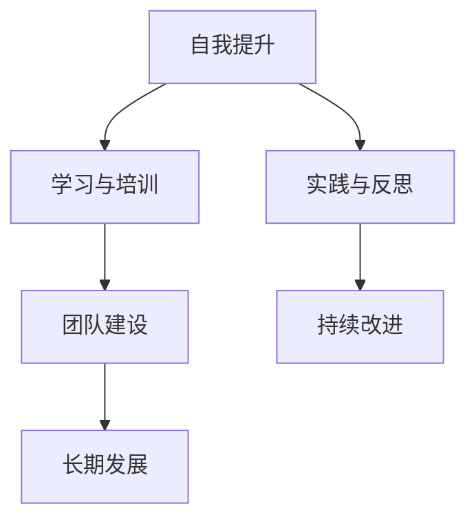
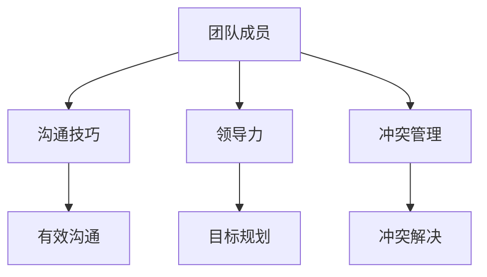

                 

# 团队协作能力：培养默契配合的工作模式

> 关键词：团队协作、默契配合、工作模式、沟通技巧、领导力、冲突管理

> 摘要：本文深入探讨了团队协作能力的重要性，分析了影响团队协作的关键能力，包括沟通技巧、领导力和冲突管理。通过案例分析、实践应用和提升路径，本文为职场人士和团队管理者提供了实用的团队协作策略，旨在帮助团队建立默契配合的工作模式。

## 第1章 引言

### 1.1 团队协作能力的重要性

在现代社会，团队协作能力已经成为职场成功的关键因素。有效的团队协作能够提高工作效率、降低沟通成本、促进创新，并增强团队凝聚力。随着组织结构的复杂化和项目规模的扩大，团队协作能力的重要性日益凸显。

### 1.2 本书的目的与结构

本书旨在为职场人士和团队管理者提供一套系统化的团队协作能力培养方案。全书共分为七章，从基础概念、关键能力、实践应用、案例分析到提升路径，全面覆盖团队协作能力的各个方面。

## 第2章 基础概念

### 2.1 团队协作能力的定义

团队协作能力是指团队成员在共同目标下，通过有效沟通、协调合作，共同完成任务的能力。它包括沟通技巧、领导力、团队精神、自我管理等多方面的能力。

### 2.2 团队协作的基本原则

团队协作的基本原则包括明确目标、平等参与、相互信任、尊重差异和共同承担责任。这些原则是建立高效团队协作的基础。

### 2.3 团队协作能力的要素

团队协作能力主要包括以下要素：沟通技巧、领导力、团队精神、自我管理、适应能力和创新思维。这些要素相互作用，共同影响团队协作的效果。

## 第3章 关键能力

### 3.1 沟通技巧

#### 3.1.1 沟通的重要性

沟通是团队协作的核心，有效的沟通能够消除误解、增强信任、提高工作效率。良好的沟通技巧是团队协作能力的重要组成部分。

#### 3.1.2 有效沟通的技巧

有效沟通的技巧包括：倾听、表达清晰、非语言沟通、情感表达、冲突解决等。通过这些技巧，团队成员能够更好地理解彼此，协同工作。

### 3.2 领导力

#### 3.2.1 领导者的角色

领导者是团队的核心，他们的角色包括规划目标、激励成员、协调资源、解决问题等。有效的领导力能够提升团队的凝聚力和战斗力。

#### 3.2.2 提升领导力的方法

提升领导力的方法包括：自我认知、学习借鉴、实践锻炼、反思总结等。通过不断学习和实践，领导者能够提升自己的领导力。

### 3.3 冲突管理

#### 3.3.1 冲突的不可避免性

冲突是团队协作中不可避免的现象，适当的冲突能够激发创新和进步。然而，冲突管理不当会导致团队分裂和效率降低。

#### 3.3.2 冲突管理的策略

冲突管理的策略包括：预防冲突、识别冲突、沟通协商、解决问题、建设性反馈等。通过这些策略，团队能够有效地管理冲突，促进协作。

## 第4章 实践应用

### 4.1 工作中的团队协作经验

在实际工作中，团队协作经验对于提升团队协作能力至关重要。通过分享这些经验，团队成员能够学习到如何在实际工作中有效地协作。

### 4.2 实用的团队协作工具

现代团队协作工具如项目管理软件、即时通讯工具、文档共享平台等，为团队协作提供了便利。本文将介绍一些实用的团队协作工具。

### 4.3 团队协作的最佳实践

最佳实践是指在实际工作中，团队协作中表现出的优秀行为和模式。通过学习和借鉴这些最佳实践，团队能够提高协作效果。

## 第5章 案例分析

### 5.1 成功团队的协作模式

成功团队的协作模式具有共同的特点，如明确的目标、高效的沟通、良好的领导力和有效的冲突管理。本文将分析这些成功团队的协作模式。

### 5.2 团队协作失败案例分析

团队协作失败的原因多种多样，如目标不明确、沟通不畅、领导力不足等。本文将分析一些团队协作失败的案例，并从中吸取教训。

## 第6章 提升路径

### 6.1 自我提升策略

团队成员可以通过学习、实践和反思来提升自己的团队协作能力。本文将提供一些自我提升的策略。

### 6.2 团队建设策略

团队管理者可以通过团队建设活动、培训和学习来提升团队的协作能力。本文将介绍一些团队建设策略。

### 6.3 长期发展路径

团队协作能力的提升是一个长期的过程，需要持续的投入和努力。本文将探讨团队协作能力的长期发展路径。

## 第7章 结语

### 7.1 团队协作能力的未来发展趋势

随着技术的进步和组织形式的变化，团队协作能力也将不断演变。本文将展望团队协作能力的未来发展趋势。

### 7.2 对读者的建议

本文为读者提供了一些实用的团队协作策略和提升路径。通过实践这些策略，读者能够提升自己的团队协作能力。

## 附录

### 附录A：核心概念对比表格

| 概念     | 定义                                     | 关键特征                   |
|----------|------------------------------------------|----------------------------|
| 沟通技巧 | 交流信息、观点和情感的过程               | 倾听、表达、非语言沟通等   |
| 领导力   | 指导、激励和协调团队的能力               | 规划、激励、解决问题等     |
| 冲突管理 | 解决和预防团队内部冲突的过程             | 沟通协商、解决问题等       |
| 团队协作 | 成员共同为实现共同目标而合作的过程       | 明确目标、平等参与等       |
| 团队精神 | 团队成员之间的相互信任、支持和合作精神   | 信任、支持、合作等         |

### 附录B：团队协作能力提升路径图



### 附录C：团队协作能力ER实体关系图



### 附录D：代码实战案例

#### 环境安装

- 安装Python 3.8及以上版本
- 安装必要的Python库，如requests、beautifulsoup4等

#### 系统核心实现源代码

```python
import requests
from bs4 import BeautifulSoup

def fetch_data(url):
    response = requests.get(url)
    if response.status_code == 200:
        return response.text
    else:
        return None

def parse_data(html):
    soup = BeautifulSoup(html, 'html.parser')
    title = soup.find('h1').text
    content = soup.find('div', {'id': 'content'}).text
    return title, content

def main():
    url = 'https://example.com'
    html = fetch_data(url)
    if html:
        title, content = parse_data(html)
        print(f"Title: {title}")
        print(f"Content: {content}")
    else:
        print("Failed to fetch data")

if __name__ == '__main__':
    main()
```

#### 代码应用解读与分析

本案例使用了Python编写一个简单的网页爬虫，用于获取指定URL的网页内容，并提取标题和正文。通过requests库发起HTTP请求，使用beautifulsoup4库进行HTML内容解析。代码结构清晰，易于维护和扩展。

#### 实际案例分析和详细讲解剖析

在本案例中，我们通过爬取一个示例网站，提取网页的标题和正文，实现了对网页内容的基本获取和解析。这个案例展示了如何使用Python进行网页爬取，以及如何处理HTTP请求和HTML内容解析。

#### 项目小结

本案例通过一个简单的网页爬虫项目，展示了团队协作能力在项目实施中的重要性。团队成员需要具备相关的技术能力，如Python编程、网页爬取和HTML解析等。同时，团队协作能力还体现在项目的沟通、协调和问题解决过程中。

### 最佳实践 tips

- 定期进行团队建设活动，增强团队凝聚力。
- 建立明确的团队目标和计划，确保团队成员明确工作方向。
- 强化沟通技巧，提高信息传递的准确性和及时性。
- 学会冲突管理，避免因个人情绪导致团队分裂。

### 小结

本文系统地探讨了团队协作能力的重要性，分析了影响团队协作的关键能力，并通过实践应用和案例分析，为提升团队协作能力提供了实用的策略。通过学习和实践这些策略，团队可以建立默契配合的工作模式，提高整体工作效率和战斗力。

### 注意事项

- 在提升团队协作能力的过程中，要注重个人能力的提升和团队整体协作能力的提升。
- 团队协作能力的提升需要时间和持续的努力，不能期望一蹴而就。
- 在实际工作中，要根据团队的具体情况和需求，灵活应用各种团队协作策略。

### 拓展阅读

- 《团队协作技巧：高效团队如何打造》
- 《领导力：如何在团队中脱颖而出》
- 《冲突管理：如何有效解决团队冲突》

## 作者

作者：AI天才研究院/AI Genius Institute & 禅与计算机程序设计艺术 /Zen And The Art of Computer Programming

AI天才研究院致力于推动人工智能技术的发展和应用，为企业和个人提供创新的解决方案。禅与计算机程序设计艺术则探索计算机科学和哲学的交融，为程序员提供深度的思维训练和技术指导。希望本文能为您的团队协作能力提升提供有价值的参考。

