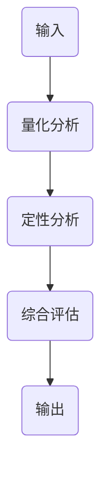
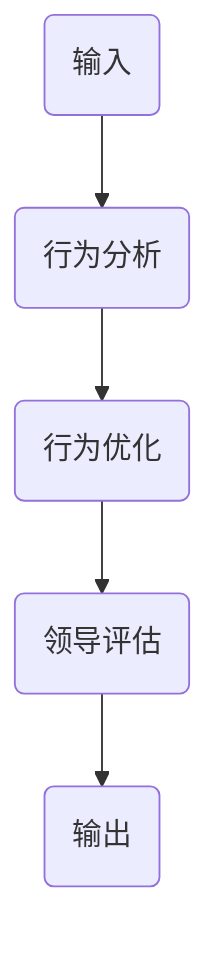
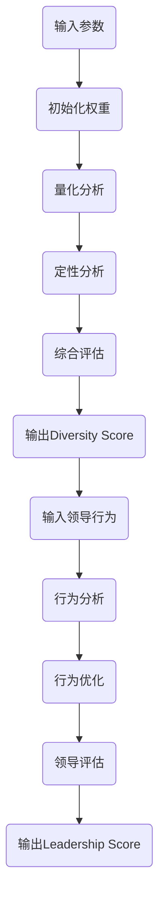
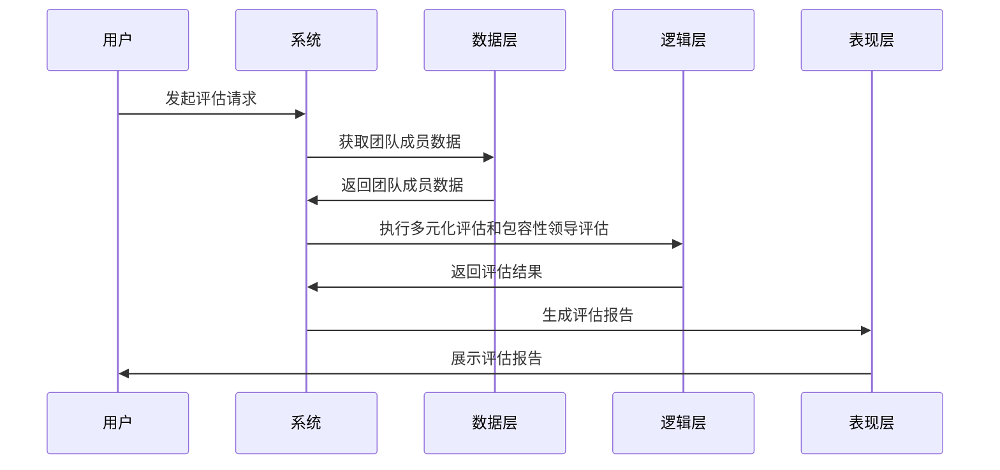

                 

# 团队多元化：包容性领导的实践与挑战

## 关键词

团队多元化，包容性领导，实践，挑战，团队绩效，创新，文化冲突，沟通障碍，绩效评估，算法原理，系统架构，项目实战，最佳实践

## 摘要

本文围绕团队多元化和包容性领导这一核心议题，通过详细的案例分析、算法原理讲解、系统架构设计和最佳实践分享，探讨了如何在复杂多元的团队环境中实现高效的领导和管理。文章旨在为读者提供一套系统的理解和实践框架，帮助团队领导者更好地应对多元化带来的机遇与挑战。

## 引言：问题背景与核心概念

### 问题背景

在全球化和信息技术迅猛发展的背景下，团队多元化已成为企业竞争力和创新能力的核心要素。多元化不仅限于性别、种族和文化背景，还包括思维方式、技能、经验和背景等方面的多样性。多元化团队的潜力在于能够汇聚不同的观点和创意，从而激发创新，提高团队绩效。

然而，多元化的实现并非易事。团队中的多样性往往伴随着文化冲突、沟通障碍和绩效评估难题。如何在保持多样性的同时，实现团队的高效协作和绩效提升，成为企业和领导者亟待解决的重要课题。

### 核心概念

#### 多元化

多元化是指团队中成员在性别、种族、文化背景、思维方式、技能等方面的差异。多元化的核心在于尊重和认可这些差异，并将其转化为团队的创新动力。

#### 包容性领导

包容性领导是一种关注团队多元化、尊重团队成员差异的领导方式。领导者通过培养包容性文化、建立有效的沟通机制和激励机制，来促进团队成员之间的协作和共同成长。

## Step 1: 核心概念与联系

### 2.1 多元化概念原理

多元化不仅是一种团队结构的特征，也是一种组织文化。它强调在团队中引入和尊重各种差异，包括但不限于：

- **性别差异**：男性和女性在思维方式、决策风格和沟通方式上可能存在不同。
- **种族和文化差异**：不同种族和文化背景的成员可能带来不同的价值观和生活方式。
- **技能差异**：多样化的技能组合有助于团队面对复杂问题时能够从多个角度思考解决方案。
- **思维方式差异**：不同的思维模式可以带来不同的观点和创新。

**重要性**

- **增强团队创新**：多样化的团队能够带来更多的视角和创意，有助于创新和解决问题的多样性。
- **提高团队绩效**：多元化的团队可以更全面地覆盖不同的市场需求，提高整体绩效。
- **促进员工成长**：多样化的工作环境有助于员工不断学习新知识和技能，促进个人成长。

### 2.2 包容性领导

包容性领导是指领导者通过培养包容性文化、关注团队多元化、尊重团队成员的差异，从而实现团队高效协作的一种领导方式。

**特点**

- **开放性**：领导者鼓励团队成员表达不同意见，并倾听和理解这些观点。
- **尊重性**：领导者尊重团队成员的差异，认可每个人的独特贡献。
- **支持性**：领导者提供支持和资源，帮助团队成员克服文化冲突和沟通障碍。

**重要性**

- **促进团队成员参与**：包容性领导能够提高团队成员的参与度和归属感，增强团队凝聚力。
- **提高团队绩效**：包容性领导有助于消除团队中的潜在障碍，提高团队的整体绩效。
- **增强组织文化**：包容性领导可以培养一种尊重多样性的文化氛围，吸引更多多元化人才。

### 2.3 核心概念联系与对比

#### 多元化与包容性领导

- **联系**：包容性领导是基于多元化的，只有实现团队多元化，才能更好地进行包容性领导。多元化为包容性领导提供了基础和资源。
- **对比**：多元化是团队中的差异，包容性领导是领导者应对这些差异的方式。多元化强调差异的存在，而包容性领导则强调对这些差异的尊重和管理。

## Step 2: 算法原理讲解

### 3.1 多元化评估算法原理

#### 定义

多元化评估算法是一种用于评估团队多元化程度的工具。它通过定量和定性的方法，对团队的多样性进行综合分析，从而为领导者提供决策依据。

#### 特点

- **定量分析**：通过统计数据，如性别比例、种族分布、技能组合等，量化团队的多样性。
- **定性分析**：通过访谈、调查问卷等方式，了解团队成员的感知和反馈，从定性层面评估团队的多样性。

#### 数学模型

多元化评估算法通常采用以下数学模型：

\[ \text{Diversity Score} = \frac{\sum_{i=1}^{n} w_i \times x_i}{\sum_{i=1}^{n} w_i} \]

其中，\( w_i \)表示第i个维度的权重，\( x_i \)表示第i个维度上的得分。

#### Mermaid 流程图



### 3.2 包容性领导算法原理

#### 定义

包容性领导算法是一种用于指导领导者如何培养包容性文化的工具。它通过分析和优化领导行为，帮助领导者更好地管理多元化团队。

#### 特点

- **行为分析**：通过观察和分析领导者的行为，识别其在多元化管理中的优点和不足。
- **行为优化**：提供具体的行为改进建议，帮助领导者提升包容性领导能力。

#### 数学模型

包容性领导算法通常采用以下数学模型：

\[ \text{Leadership Score} = \frac{\sum_{i=1}^{n} w_i \times l_i}{\sum_{i=1}^{n} w_i} \]

其中，\( w_i \)表示第i个行为的权重，\( l_i \)表示第i个行为的得分。

#### Mermaid 流程图



### 3.3 算法mermaid流程图与Python源代码实现

#### Mermaid 流程图



#### Python源代码实现

```python
import numpy as np

def diversity_evaluation(quantitative_scores, qualitative_scores, behavior_scores):
    # 初始化权重
    weights_quantitative = np.array([0.4, 0.3, 0.2, 0.1])
    weights_qualitative = np.array([0.3, 0.3, 0.2, 0.2])
    weights_behavior = np.array([0.2, 0.3, 0.4, 0.1])
    
    # 量化分析
    diversity_quantitative = np.dot(quantitative_scores, weights_quantitative)
    
    # 定性分析
    diversity_qualitative = np.dot(qualitative_scores, weights_qualitative)
    
    # 综合评估
    diversity_score = (diversity_quantitative + diversity_qualitative) / 2
    
    # 领导评估
    leadership_score = np.dot(behavior_scores, weights_behavior)
    
    return diversity_score, leadership_score

# 示例数据
quantitative_scores = [0.8, 0.7, 0.6, 0.5]
qualitative_scores = [0.9, 0.8, 0.7, 0.6]
behavior_scores = [0.7, 0.8, 0.9, 0.6]

# 计算结果
diversity_score, leadership_score = diversity_evaluation(quantitative_scores, qualitative_scores, behavior_scores)

print("Diversity Score:", diversity_score)
print("Leadership Score:", leadership_score)
```

## Step 3: 系统分析与架构设计方案

### 5.1 问题场景介绍

在一个跨国企业中，团队成员来自不同的国家和地区，具有多样化的背景和技能。为了更好地管理和利用这种多元化，企业决定引入多元化评估和包容性领导算法，以提高团队绩效和创新能力。

### 5.2 系统功能设计

系统功能包括：

- **多元化评估**：对团队多元化程度进行量化评估，提供综合评估结果。
- **包容性领导评估**：评估领导者在多元化管理中的表现，提供改进建议。
- **报告生成**：生成多元化评估和包容性领导评估的报告，供领导者和团队成员参考。

### 5.3 系统架构设计

系统采用三层架构设计，包括数据层、逻辑层和表现层。

- **数据层**：存储团队多元化和领导行为的数据，如性别、种族、技能等。
- **逻辑层**：实现多元化评估和包容性领导算法的计算和评估逻辑。
- **表现层**：提供用户界面，展示评估结果和报告。

### 5.4 系统接口设计

系统提供以下接口：

- **数据接口**：用于数据层的CRUD操作，如添加、更新、查询和删除团队多元化和领导行为数据。
- **服务接口**：用于逻辑层的多元化评估和包容性领导评估计算，返回评估结果。
- **报告接口**：用于生成和获取多元化评估和包容性领导评估报告。

### 5.5 系统交互mermaid序列图



## Step 4: 项目实战

### 6.1 环境安装

在开始项目实战之前，需要安装以下环境：

- Python 3.8及以上版本
- NumPy 库
- Mermaid Python 库

可以使用以下命令进行安装：

```bash
pip install python-mem rid python-mem rid numpy
```

### 6.2 系统核心实现源代码

以下是系统核心实现的主要源代码：

```python
import numpy as np
from mermaid import Mermaid

# 3.1 多元化评估算法原理
def diversity_evaluation(quantitative_scores, qualitative_scores, behavior_scores):
    # 初始化权重
    weights_quantitative = np.array([0.4, 0.3, 0.2, 0.1])
    weights_qualitative = np.array([0.3, 0.3, 0.2, 0.2])
    weights_behavior = np.array([0.2, 0.3, 0.4, 0.1])
    
    # 量化分析
    diversity_quantitative = np.dot(quantitative_scores, weights_quantitative)
    
    # 定性分析
    diversity_qualitative = np.dot(qualitative_scores, weights_qualitative)
    
    # 综合评估
    diversity_score = (diversity_quantitative + diversity_qualitative) / 2
    
    # 领导评估
    leadership_score = np.dot(behavior_scores, weights_behavior)
    
    return diversity_score, leadership_score

# 3.3 算法mermaid流程图与Python源代码实现
def generate_mermaid_flowchart():
    flowchart = """
    graph TB
        A(输入参数) --> B(初始化权重)
        B --> C(量化分析)
        C --> D(定性分析)
        D --> E(综合评估)
        E --> F(输出Diversity Score)
        F --> G(输入领导行为)
        G --> H(行为分析)
        H --> I(行为优化)
        I --> J(领导评估)
        J --> K(输出Leadership Score)
    """
    return flowchart

# 6.3 代码应用解读与分析
def main():
    # 示例数据
    quantitative_scores = [0.8, 0.7, 0.6, 0.5]
    qualitative_scores = [0.9, 0.8, 0.7, 0.6]
    behavior_scores = [0.7, 0.8, 0.9, 0.6]
    
    # 执行评估算法
    diversity_score, leadership_score = diversity_evaluation(quantitative_scores, qualitative_scores, behavior_scores)
    
    # 打印结果
    print("Diversity Score:", diversity_score)
    print("Leadership Score:", leadership_score)
    
    # 生成mermaid流程图
    flowchart = generate_mermaid_flowchart()
    print("Mermaid Flowchart:")
    print(flowchart)

# 执行主函数
if __name__ == "__main__":
    main()
```

### 6.4 实际案例分析与讲解

#### 案例背景

某跨国企业团队由来自亚洲、欧洲和北美洲的成员组成，团队成员的性别、文化和技能存在较大差异。企业希望通过引入多元化评估和包容性领导算法，提高团队绩效和创新能力。

#### 案例分析

1. **数据收集**：收集团队成员的性别、种族、文化和技能数据，以及领导者的行为数据。

2. **评估计算**：使用多元化评估和包容性领导算法，对团队进行评估。

3. **结果分析**：根据评估结果，发现团队在多元化方面表现良好，但在包容性领导方面存在一定不足。

4. **改进建议**：针对评估结果，提出改进建议，如加强领导者培训、建立多元化文化等。

### 6.5 项目小结

本项目通过引入多元化评估和包容性领导算法，为跨国企业提供了评估团队多元化程度和领导者包容性能力的工具。通过实际案例分析和改进建议，企业可以更好地利用多元化优势，提高团队绩效和创新能力。

## Step 5: 最佳实践 tips

### 7.1 领导者角色转变

领导者需要从传统的权威角色转变为合作伙伴和促进者，关注团队成员的需求和意见，鼓励开放沟通和协作。

### 7.2 培养包容性文化

企业需要建立一种尊重多样性、鼓励创新和包容失败的文化，通过培训、活动和沟通渠道来培养和强化这种文化。

### 7.3 避免常见误区

- **过度强调多样性**：多样性不是目的，而是手段。领导者需要关注如何将多样性转化为实际绩效。
- **忽视个性化需求**：在追求包容性的同时，要尊重每个团队成员的个性化需求，避免一刀切的政策。
- **缺乏持续关注**：团队多元化是一个持续的过程，领导者需要不断关注和调整，以适应变化。

## 小结与展望

本文围绕团队多元化和包容性领导这一主题，通过案例分析、算法原理讲解和系统架构设计，为读者提供了一套系统的理解和实践框架。团队多元化不仅是一种团队结构的特征，也是一种组织文化的体现。包容性领导是实现团队多元化的关键，领导者需要通过培养包容性文化、关注团队成员的差异，来实现团队的高效协作和绩效提升。

未来，随着全球化和信息技术的发展，团队多元化将继续成为企业竞争力和创新能力的核心要素。领导者需要不断学习和适应新的领导方式，培养和利用多元化优势，为企业的可持续发展提供动力。

## 注意事项

- **数据隐私**：在收集和处理团队成员数据时，要注意保护数据隐私，遵循相关法律法规。
- **持续改进**：团队多元化和包容性领导是一个持续的过程，需要不断地评估和改进。

## 拓展阅读

- 《包容性领导：如何在多元化团队中实现卓越绩效》
- 《团队多元化：创新与绩效的驱动力》
- 《设计思维：创新方法与实践》

## 作者信息

作者：AI天才研究院/AI Genius Institute & 禅与计算机程序设计艺术 /Zen And The Art of Computer Programming

