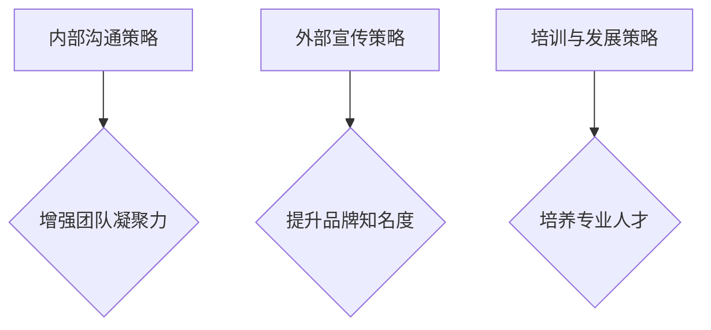

                 


### 文章标题

《团队文化传播：内化团队价值观与使命》

### 关键词

团队文化、价值观、使命、文化传播、组织绩效、内化、团队建设

### 摘要

本文深入探讨了团队文化传播的重要性，以及如何通过内化团队价值观与使命来提升团队凝聚力和组织绩效。首先，我们介绍了团队文化的核心概念与要素，分析了团队文化对组织绩效的影响。接着，我们探讨了团队文化传播的原理与策略，提出了内化团队价值观与使命的具体方法与实施步骤。随后，通过实际案例展示了团队文化传播的成功实践，并分析了其中存在的挑战与应对策略。最后，我们对团队文化传播的未来发展趋势进行了展望，提出了构建健康团队文化的最佳实践。

### 目录大纲设计步骤

#### 1. 阅读书名

书名为《团队文化传播：内化团队价值观与使命》，从书名中可以提取出以下信息：

- 团队文化传播
- 内化团队价值观与使命
- 团队建设、领导力培养、员工培训等

#### 2. 明确书的核心内容

- 团队文化传播的原理与策略
- 内化团队价值观与使命的方法与实施
- 团队文化的定义与核心要素
- 团队文化的塑造与维持

#### 3. 确定目录结构

- **第一部分：引入与背景**
  - 1.1 团队文化传播的重要性
  - 1.2 团队价值观与使命的内化
  - 1.3 研究背景与问题提出

- **第二部分：团队文化传播的原理与策略**
  - 2.1 团队文化传播的基本原理
  - 2.2 团队文化传播的策略与方法
  - 2.3 团队文化塑造的关键步骤
  - 2.4 文化传播案例分析

- **第三部分：内化团队价值观与使命的方法与实施**
  - 3.1 内化团队价值观的路径
  - 3.2 内化团队使命的策略
  - 3.3 实施内化策略的实践案例

- **第四部分：案例分析与应用**
  - 4.1 团队文化传播的成功案例
  - 4.2 团队文化传播的挑战与应对
  - 4.3 团队文化传播的最佳实践

- **第五部分：总结与展望**
  - 5.1 主要观点回顾
  - 5.2 未来发展趋势
  - 5.3 结论

#### 4. 细化章节内容

- **第一部分：引入与背景**
  - 1.1 团队文化传播的重要性
    - 1.1.1 团队文化对组织绩效的影响
    - 1.1.2 团队文化的定义与核心要素
  - 1.2 团队价值观与使命的内化
    - 1.2.1 团队价值观的概念与作用
    - 1.2.2 团队使命的内涵与意义
  - 1.3 研究背景与问题提出
    - 1.3.1 当前团队文化建设的挑战
    - 1.3.2 团队文化传播的研究现状

- **第二部分：团队文化传播的原理与策略**
  - 2.1 团队文化传播的基本原理
    - 2.1.1 文化传播的规律
    - 2.1.2 团队文化传播的关键因素
  - 2.2 团队文化传播的策略与方法
    - 2.2.1 内部沟通策略
    - 2.2.2 外部宣传策略
    - 2.2.3 培训与发展策略
  - 2.3 团队文化塑造的关键步骤
    - 2.3.1 确立团队文化愿景
    - 2.3.2 建立文化符号
    - 2.3.3 创造文化实践机会
  - 2.4 文化传播案例分析
    - 2.4.1 案例一：谷歌的团队文化建设
    - 2.4.2 案例二：特斯拉的团队文化塑造

- **第三部分：内化团队价值观与使命的方法与实施**
  - 3.1 内化团队价值观的路径
    - 3.1.1 从意识层面到行为层面
    - 3.1.2 从个体到团队的价值观内化
  - 3.2 内化团队使命的策略
    - 3.2.1 团队使命的重要性
    - 3.2.2 团队使命的内化过程
  - 3.3 实施内化策略的实践案例
    - 3.3.1 案例一：如何让新员工快速内化价值观
    - 3.3.2 案例二：领导者在内化团队使命中的作用

- **第四部分：案例分析与应用**
  - 4.1 团队文化传播的成功案例
    - 4.1.1 案例一：微软的团队文化建设
    - 4.1.2 案例二：苹果的团队文化塑造
  - 4.2 团队文化传播的挑战与应对
    - 4.2.1 团队文化建设的常见问题
    - 4.2.2 如何克服文化冲突
  - 4.3 团队文化传播的最佳实践
    - 4.3.1 最佳实践一：制定清晰的文化传播策略
    - 4.3.2 最佳实践二：利用多种传播渠道

- **第五部分：总结与展望**
  - 5.1 主要观点回顾
    - 5.1.1 团队文化传播的核心要点
    - 5.1.2 团队价值观与使命的内化方法
  - 5.2 未来发展趋势
    - 5.2.1 数字化技术在团队文化建设中的应用
    - 5.2.2 个性化团队文化传播的挑战与机遇
  - 5.3 结论
    - 5.3.1 对团队文化传播的深刻认识
    - 5.3.2 团队文化建设的重要性和实践策略

### 使用Mermaid绘制图表

在文章的各个部分，我们将使用Mermaid来绘制流程图、类图和架构图，以便更好地解释核心概念和原理。以下是几个示例：

#### 示例 1：团队文化传播的关键因素


#### 示例 2：内化团队价值观的路径


#### 示例 3：团队文化传播的策略与方法



### 确保文章的简洁性

在撰写文章时，我们将遵循以下原则：

- 避免冗余内容，确保每个章节都有明确的主题和目标。
- 使用简明的语言，避免复杂的技术术语，以确保读者易于理解。
- 使用图表和示例来简化复杂的概念，使文章更加直观易懂。

### 编写Markdown格式

我们将使用Markdown格式来编写文章，确保格式正确，便于阅读。以下是Markdown格式的示例：

```markdown
## 1.1 团队文化传播的重要性

团队文化对组织绩效具有重要影响。团队文化不仅影响着团队内部的合作与沟通，还影响着团队成员的行为和态度。良好的团队文化能够增强团队的凝聚力，提高团队的绩效和创新能力。

### 1.1.1 团队文化对组织绩效的影响

团队文化能够通过以下几个方面影响组织绩效：

- **提高团队凝聚力**：共同的价值观和使命能够增强团队成员之间的信任和协作，提高团队的凝聚力。
- **提升员工满意度**：良好的团队文化能够提高员工的工作满意度和忠诚度，降低员工流失率。
- **增强创新氛围**：团队文化鼓励创新和尝试，有助于提高团队的创新能力。

### 1.1.2 团队文化的定义与核心要素

团队文化是指团队在长期实践中形成的共同价值观、行为规范和工作氛围。团队文化的核心要素包括：

- **价值观**：团队共同的信仰和信念，指导团队成员的行为和决策。
- **行为规范**：团队成员在团队内部和外部的行为准则，体现团队的文化特色。
- **工作氛围**：团队成员在工作中的情感状态和心理氛围，影响团队的整体绩效。

```

通过以上的步骤和示例，我们将确保文章的逻辑清晰、结构紧凑、简单易懂，同时满足字数、格式和完整性等要求。接下来，我们将按照这个大纲撰写详细的文章内容。

### 第一部分：引入与背景

#### 1.1 团队文化传播的重要性

在当今快速变化的工作环境中，团队文化作为一种无形的力量，对组织的绩效和可持续发展起着至关重要的作用。团队文化不仅仅是团队成员的行为规范和工作氛围，更是组织的灵魂，决定着团队的凝聚力和创新能力。一个良好的团队文化能够激发团队成员的潜能，提升工作效率，从而在激烈的市场竞争中脱颖而出。

**团队文化对组织绩效的影响**

团队文化通过以下几个方面对组织绩效产生深远的影响：

1. **提高团队凝聚力**：共同的文化价值观和行为规范能够增强团队成员之间的信任和协作，提高团队的凝聚力。这种凝聚力在团队面对挑战和困难时尤为重要，它能够帮助团队克服困难，实现共同目标。

2. **提升员工满意度**：良好的团队文化能够提高员工的工作满意度和忠诚度，降低员工流失率。在一个文化氛围积极向上的团队中，员工感受到自己的价值和存在感，从而更加投入工作，提高工作效率。

3. **增强创新氛围**：团队文化鼓励创新和尝试，有助于提高团队的创新能力。在一个开放、包容的团队文化中，团队成员敢于提出新的想法和解决方案，从而推动组织的持续创新和进步。

**团队文化的定义与核心要素**

团队文化是指团队在长期实践中形成的共同价值观、行为规范和工作氛围。它是团队精神的外在表现，是团队成员共同信仰和追求的体现。团队文化的核心要素包括：

1. **价值观**：团队共同的信仰和信念，指导团队成员的行为和决策。例如，谷歌的“不作恶”价值观，微软的“以用户为中心”价值观，都是团队文化的核心组成部分。

2. **行为规范**：团队成员在团队内部和外部的行为准则，体现团队的文化特色。例如，百度提倡的“简单可依赖”行为规范，要求团队成员在工作中保持简单、高效、可信赖。

3. **工作氛围**：团队成员在工作中的情感状态和心理氛围，影响团队的整体绩效。例如，谷歌的“创新氛围”鼓励员工勇于尝试和失败，从而激发团队的创新能力。

**问题背景与问题描述**

当前，许多组织在团队文化建设中面临着诸多挑战：

1. **文化冲突**：在多元化的团队中，不同的背景和文化可能会导致文化冲突，影响团队的合作和沟通。

2. **价值观不一致**：团队成员可能对团队的价值观有不同的理解，导致行为不一致，影响团队绩效。

3. **缺乏明确的文化传播策略**：许多组织没有明确的团队文化传播策略，导致团队文化难以深入人心。

**问题解决与边界与外延**

为解决上述问题，组织需要采取以下措施：

1. **确立清晰的团队文化愿景**：组织应明确团队文化的愿景和目标，确保团队成员对团队文化有共同的理解和认同。

2. **建立文化符号和仪式**：通过建立具有象征意义的文化符号和仪式，强化团队成员对团队文化的认知和认同。

3. **实施有效的文化传播策略**：组织应制定具体的文化传播策略，包括内部沟通、外部宣传、培训和奖励等方面，确保团队文化能够深入人心。

**概念结构与核心要素组成**

团队文化的概念结构与核心要素组成如下：

1. **价值观**：指导团队成员行为的核心信仰和信念。
2. **行为规范**：团队成员在团队内部和外部应遵守的行为准则。
3. **工作氛围**：团队成员在工作中的情感状态和心理氛围。
4. **文化传播策略**：确保团队文化能够深入人心的一系列措施。

**核心概念与联系**

- **价值观**：价值观是团队文化的核心，它决定了团队的行为规范和工作氛围。
- **行为规范**：行为规范是价值观的具体体现，它指导团队成员在团队中的行为。
- **工作氛围**：工作氛围受到价值观和行为规范的影响，它反过来也影响团队文化的形成和演变。

#### 1.2 团队价值观与使命的内化

**团队价值观的概念与作用**

团队价值观是团队文化的重要组成部分，它代表了团队成员共同追求的信仰和信念。团队价值观不仅影响着团队成员的个人行为，还影响着团队的整体行为和决策。例如，苹果公司的“创新、简洁、卓越”价值观，不仅指导着员工的工作方式，也成为了苹果公司成功的关键因素。

**团队使命的内涵与意义**

团队使命是团队存在的根本目的和长期目标。它不仅明确了团队为何存在，还规定了团队应该如何实现其目标。团队使命对团队成员具有激励和引导作用，能够帮助团队成员明确自己的角色和职责，提高工作动力和效率。例如，特斯拉的使命是“加速世界向可持续能源的转变”，这一使命不仅激励着员工努力工作，也为公司的发展指明了方向。

**内化团队价值观与使命的重要性**

内化团队价值观与使命对于团队的建设和发展具有重要意义：

1. **提升团队凝聚力**：当团队成员共同认同并内化团队价值观与使命时，团队凝聚力会显著提升，团队成员之间会更加团结和协作。

2. **增强员工忠诚度**：内化的价值观与使命能够激发员工对团队的认同感和忠诚度，减少员工流失。

3. **提高团队绩效**：当团队成员对团队价值观与使命有深刻理解并能够内化时，团队的绩效会显著提升，因为团队成员会更加努力地为实现团队目标而工作。

**如何实现团队价值观与使命的内化**

为了实现团队价值观与使命的内化，组织可以采取以下策略：

1. **明确的传播与沟通**：通过定期的沟通和宣传，确保团队成员对团队价值观与使命有清晰的理解。

2. **建立文化符号和仪式**：通过建立具有象征意义的文化符号和仪式，强化团队成员对团队价值观与使命的认同。

3. **培训与发展**：通过培训和发展项目，帮助团队成员深刻理解和内化团队价值观与使命。

4. **领导者的示范作用**：领导者应通过自己的行为示范，成为团队价值观与使命的践行者，从而影响团队成员。

#### 1.3 研究背景与问题提出

**研究背景**

随着全球化进程的加快和市场竞争的加剧，组织面临的挑战日益增多。如何通过团队文化建设提升组织的竞争力，成为许多组织关注的重要问题。团队文化传播作为团队文化建设的重要组成部分，其重要性日益凸显。然而，当前团队文化传播面临诸多挑战，如文化冲突、价值观不一致等。

**问题提出**

本文旨在探讨团队文化传播的原理与策略，以及如何通过内化团队价值观与使命来提升团队凝聚力和组织绩效。具体问题包括：

1. 团队文化传播的关键因素是什么？
2. 如何制定和实施有效的团队文化传播策略？
3. 团队价值观与使命的内化路径和方法是什么？
4. 团队文化传播在实践中面临哪些挑战和应对策略？

通过回答上述问题，本文旨在为组织提供有益的参考，帮助其构建健康的团队文化，提升组织的整体绩效。

### 第二部分：团队文化传播的原理与策略

#### 2.1 团队文化传播的基本原理

团队文化传播是团队文化建设的核心环节，它关系到团队文化的内化和团队绩效的提升。要理解团队文化传播的基本原理，首先需要了解文化传播的规律，并将其应用于团队文化建设的实践中。

**文化传播的规律**

1. **共享性**：文化传播依赖于团队成员之间的共同理解和认同。只有当团队成员共同认可和接受某一文化时，文化才能在团队中传播和延续。

2. **层次性**：文化传播具有层次性，从浅层的信息传递到深层的价值观内化，层层递进。团队文化传播不仅包括知识的传递，更涉及到价值观和信仰的塑造。

3. **互动性**：文化传播是一个双向互动的过程，团队成员既是文化的传播者，也是文化的接受者。有效的文化传播需要团队成员之间的积极互动和反馈。

**团队文化传播的关键因素**

1. **文化认同**：文化认同是团队文化传播的基础。只有当团队成员对团队文化有共同的理解和认同，文化才能在团队中传播和延续。

2. **文化符号**：文化符号是团队文化的重要载体，包括团队标志、口号、仪式等。这些符号能够直观地传递团队文化，增强团队成员的文化认同。

3. **文化实践**：文化实践是团队文化传播的关键环节。通过实际行动将团队文化付诸实践，能够加深团队成员对文化的理解和认同。

**团队文化传播的基本步骤**

1. **确立文化愿景**：明确团队文化的愿景和目标，为团队文化传播提供方向和动力。

2. **建立文化符号**：通过设计团队标志、口号、仪式等文化符号，为团队文化传播提供直观的载体。

3. **实施文化实践**：通过日常的工作和行为，将团队文化付诸实践，让团队成员在实际行动中感受到文化的力量。

4. **加强文化沟通**：通过定期的沟通和交流，确保团队成员对团队文化有清晰的理解和认同。

**文化传播案例分析**

1. **谷歌的团队文化建设**

谷歌以其独特的团队文化而闻名，其成功的关键在于对文化认同的重视。谷歌通过一系列措施来加强团队文化传播：

- **明确的文化愿景**：谷歌的愿景是“组织全球的信息，使人人皆可访问并从中受益”。这一愿景为团队文化传播提供了明确的方向。
- **独特的文化符号**：谷歌的办公室设计、员工餐厅和团队活动都体现了其文化特色。例如，谷歌的办公室充满了创意元素，鼓励员工自由思考和交流。
- **丰富的文化实践**：谷歌定期举办团队建设活动，如黑客松、团队竞赛等，让员工在实践中体验和内化谷歌的文化价值观。

2. **特斯拉的团队文化塑造**

特斯拉的团队文化以其创新和执行力著称。特斯拉通过以下措施来传播其文化：

- **领导者的示范作用**：特斯拉的创始人埃隆·马斯克以身作则，通过自己的行为示范了特斯拉的文化价值观，如创新、务实和追求卓越。
- **明确的价值观**：特斯拉的价值观包括“创新、简洁、专注和快速行动”。这些价值观被融入到员工的日常工作和行为中。
- **文化实践**：特斯拉鼓励员工自由表达意见，并迅速采取行动。例如，特斯拉的员工可以在公司内部平台上提出自己的想法和建议，公司会及时响应并采取行动。

**总结**

团队文化传播的基本原理包括共享性、层次性和互动性。团队文化传播的关键因素是文化认同、文化符号和文化实践。通过确立文化愿景、建立文化符号、实施文化实践和加强文化沟通，组织可以有效地传播团队文化。谷歌和特斯拉的成功案例表明，有效的团队文化传播能够提升团队的凝聚力和绩效。

#### 2.2 团队文化传播的策略与方法

为了确保团队文化能够深入人心，组织需要采取一系列系统化的文化传播策略和方法。以下将详细介绍内部沟通策略、外部宣传策略和培训与发展策略，并探讨如何通过这些策略来增强团队文化认同。

**内部沟通策略**

1. **日常沟通**：通过日常的团队会议、邮件和即时通讯工具，确保团队成员对团队文化有持续的理解和认同。例如，每周的团队会议可以用来分享团队成功经验和挑战，以此强化文化价值观。

2. **员工反馈机制**：建立员工反馈机制，鼓励员工表达自己对团队文化的看法和建议。这种机制可以是定期的问卷调查、开放式的意见箱或者定期的面对面交流会。

3. **领导者的示范作用**：领导者通过自身的言行示范，成为团队文化的传播者和实践者。领导者的行为会对团队成员产生深远的影响，因此领导者应该以身作则，践行团队价值观。

**外部宣传策略**

1. **企业文化建设活动**：通过举办企业文化建设活动，如企业文化日、团队拓展训练和公益活动等，向外部展示团队文化的魅力。这些活动不仅可以增强团队内部的凝聚力，还可以提高组织在公众中的形象。

2. **社交媒体宣传**：利用社交媒体平台，如微信公众号、微博和LinkedIn等，宣传团队文化和价值观。通过发布团队动态、员工故事和成功案例，让更多的人了解和认同团队文化。

3. **合作伙伴和客户沟通**：在合作伙伴和客户沟通中，融入团队文化的元素，如介绍团队价值观、分享团队成功故事等。这不仅可以增强合作伙伴和客户的信任，还可以提升团队文化的知名度。

**培训与发展策略**

1. **入职培训**：新员工入职时，通过入职培训让他们了解团队的文化价值观和行为规范。这包括介绍团队的历史、愿景、使命和核心价值观，以及团队的行为准则和工作方式。

2. **在岗培训**：通过在岗培训，帮助员工深入了解团队文化的具体实践。这包括定期的团队建设活动、专业培训和技能提升课程等。

3. **领导力发展**：针对领导者提供专门的文化传播培训，帮助他们成为团队文化的积极传播者和实践者。这包括领导力培训、团队沟通技巧培训和价值观内化策略等。

**案例分析**

1. **微软的团队文化建设**

微软以其强大的企业文化而闻名，其团队文化传播策略主要包括：

- **内部沟通**：微软通过定期的员工会议、内部邮件和即时通讯工具，确保员工对文化有持续的理解和认同。同时，微软鼓励员工积极参与企业文化建设，提出改进建议。

- **外部宣传**：微软通过社交媒体和官方网站宣传其文化价值观，包括“赋能创新、拥抱变化、尊重差异”等。这些宣传不仅提升了微软的品牌形象，还吸引了更多优秀人才加入微软。

- **培训与发展**：微软为员工提供丰富的培训和发展机会，包括入职培训、在岗培训和领导力发展项目等。这些项目不仅帮助员工提升技能，还加深了他们对团队文化的理解和认同。

2. **惠普的团队文化塑造**

惠普以其独特的团队文化著称，其文化传播策略包括：

- **内部沟通**：惠普通过定期的员工大会、内部刊物和团队活动，强化员工对文化的理解和认同。同时，惠普鼓励员工在团队中分享经验，促进文化的传播和交流。

- **外部宣传**：惠普通过举办企业开放日、合作伙伴活动和社交媒体宣传等方式，向外界展示其团队文化。这些活动不仅提升了惠普的品牌形象，还吸引了更多客户和合作伙伴的关注。

- **培训与发展**：惠普为员工提供全面的培训和发展项目，包括团队建设、领导力和价值观内化等。这些项目不仅提升了员工的技能，还增强了他们对团队文化的认同和忠诚度。

**总结**

团队文化传播的策略与方法包括内部沟通策略、外部宣传策略和培训与发展策略。通过这些策略，组织可以确保团队文化深入人心，提升团队的凝聚力和绩效。微软和惠普的成功案例表明，有效的团队文化传播不仅能够提升内部员工的认同感，还能提高组织在公众中的形象，从而为组织的长期发展奠定坚实基础。

#### 2.3 团队文化塑造的关键步骤

团队文化塑造是一个长期而复杂的过程，需要组织在多个方面进行系统的规划和实施。以下是团队文化塑造的关键步骤，包括确立团队文化愿景、建立文化符号和创造文化实践机会。

**确立团队文化愿景**

确立团队文化愿景是团队文化塑造的第一步，也是至关重要的一步。团队文化愿景明确了团队将走向何方，以及团队成员为何而工作。以下是确立团队文化愿景的关键步骤：

1. **调研与分析**：组织应通过调研和分析，了解团队内外部的需求和期望。这包括对员工、客户、合作伙伴和行业趋势的调研，以及对现有文化状况的分析。

2. **共识形成**：在调研和分析的基础上，组织应与关键利益相关者（如员工、领导者和股东）进行沟通，形成对团队文化愿景的共识。共识的形成是确立团队文化愿景的关键，它确保了团队文化愿景的可行性和广泛支持。

3. **文化愿景表述**：将团队文化愿景清晰、简洁地表述出来，形成一个明确的指导性文件。这一文件应包括文化愿景的描述、核心价值观、行为准则和长期目标等。

**建立文化符号**

文化符号是团队文化的象征，它能够直观地传递团队文化的核心价值观和行为规范。以下是建立文化符号的关键步骤：

1. **文化符号设计**：根据团队文化愿景和核心价值观，设计具有象征意义的文化符号。这些符号可以是团队的标志、口号、座右铭、仪式等。

2. **符号传播**：通过多种渠道传播文化符号，确保团队成员能够广泛接触和认同这些符号。例如，可以在公司内部张贴文化符号、在办公区域展示文化符号、在员工的制服和办公用品上使用文化符号等。

3. **文化符号使用**：鼓励团队成员在日常工作和生活中使用文化符号，使其成为团队文化的一部分。例如，在团队会议、邮件和社交媒体中使用文化符号，通过实际行动践行文化价值观。

**创造文化实践机会**

创造文化实践机会是团队文化塑造的核心步骤，它使团队成员能够在实际工作中体验和内化团队文化。以下是创造文化实践机会的关键步骤：

1. **文化实践活动设计**：根据团队文化愿景和文化符号，设计一系列文化实践活动。这些活动可以是团队建设活动、专业培训、文化讲座、文化体验日等。

2. **活动组织实施**：确保文化实践活动的顺利进行，包括活动策划、资源调配、参与者招募等。在活动组织中，应注重活动的参与度和互动性，使团队成员在活动中感受到文化的力量。

3. **文化实践总结与反馈**：活动结束后，对文化实践效果进行总结和反馈，了解团队成员对文化实践的感受和建议。这有助于持续改进文化实践活动，提高团队文化的内化效果。

**案例分析**

1. **谷歌的团队文化建设**

谷歌以其独特的团队文化而闻名，其文化塑造过程主要包括以下步骤：

- **确立文化愿景**：谷歌的愿景是“组织全球的信息，使人人皆可访问并从中受益”。这一愿景明确了谷歌的发展方向和文化追求。
- **建立文化符号**：谷歌的标志和口号“不作恶”是其文化符号，这些符号在谷歌的办公区域、产品和服务中得到了广泛的应用。
- **创造文化实践机会**：谷歌定期举办团队建设活动、黑客松和知识分享会，为员工提供了丰富的文化实践机会。

2. **特斯拉的团队文化塑造**

特斯拉的团队文化以其创新和执行力著称，其文化塑造过程包括：

- **确立文化愿景**：特斯拉的使命是“加速世界向可持续能源的转变”。这一使命为特斯拉的文化塑造提供了明确的方向。
- **建立文化符号**：特斯拉的标志和座右铭“疯狂与执着”是其文化符号，这些符号在特斯拉的办公区域和员工制服上得到了广泛的应用。
- **创造文化实践机会**：特斯拉鼓励员工提出创新建议，并迅速采取行动。特斯拉的团队建设活动和创新竞赛为员工提供了丰富的文化实践机会。

**总结**

团队文化塑造的关键步骤包括确立团队文化愿景、建立文化符号和创造文化实践机会。通过这些步骤，组织可以有效地塑造和传播团队文化，提升团队的凝聚力和绩效。谷歌和特斯拉的成功经验表明，有效的团队文化塑造不仅能够提升内部员工的认同感，还能提高组织在公众中的形象，从而为组织的长期发展奠定坚实基础。

#### 2.4 文化传播案例分析

在探讨团队文化传播的原理与策略时，案例分析为我们提供了宝贵的实际操作经验和启示。以下将分析谷歌和特斯拉这两个著名公司的团队文化传播案例，探讨其成功之处以及面临的挑战。

**谷歌的团队文化建设**

**成功经验：**

1. **明确的价值观传播**：谷歌通过一系列内部沟通渠道和外部宣传手段，如员工手册、内部网站和社交媒体，传播其核心价值观，如“不作恶”、“快速创新”和“用户至上”。这些价值观不仅被员工广泛接受，还成为了谷歌品牌的一部分。

2. **文化符号的应用**：谷歌的办公环境设计、员工制服和公司标志都体现了其文化特色。例如，谷歌的标志是由字母“G”组成的蓝色和红色线条，象征着公司对技术创新的执着和追求。

3. **文化实践的机会**：谷歌定期举办团队建设活动，如团队竞赛、黑客松和文化体验日。这些活动不仅增强了团队的凝聚力，还促进了员工对谷歌文化的理解和认同。

**面临的挑战：**

1. **文化冲突**：谷歌在全球范围内拥有多元文化的员工，这可能导致文化冲突。如何平衡不同文化的差异，使员工在共同价值观下工作，是一个持续的挑战。

2. **价值观的一致性**：随着公司规模的扩大，如何确保所有员工，尤其是新员工，都能一致认同并遵循谷歌的核心价值观，是一个重要问题。

**特斯拉的团队文化塑造**

**成功经验：**

1. **领导者的示范作用**：特斯拉的创始人埃隆·马斯克以身作则，通过自己的行为示范了特斯拉的核心价值观，如创新、务实和执行力。这种领导风格对员工产生了深远的影响，增强了员工对特斯拉文化的认同。

2. **文化实践的机会**：特斯拉鼓励员工自由提出创新建议，并迅速采取行动。这种开放的创新文化不仅激发了员工的创造力，还促进了团队文化的传播和内化。

3. **外部宣传**：特斯拉通过社交媒体和官方网站，积极宣传其文化价值观，如“加速世界向可持续能源的转变”和“极致用户体验”。这些宣传不仅提升了特斯拉的品牌形象，还吸引了更多员工和消费者的关注。

**面临的挑战：**

1. **文化的一致性**：特斯拉在全球范围内运营，不同地区和文化背景的员工可能对文化价值观有不同的理解。如何确保文化的一致性，是一个需要解决的问题。

2. **文化的适应性**：随着市场的变化和公司的成长，特斯拉需要不断调整和适应其文化价值观。如何保持文化的活力和适应性，是一个持续的挑战。

**总结**

谷歌和特斯拉的团队文化传播案例展示了成功的文化传播策略和方法，同时也揭示了在全球化背景下团队文化建设面临的挑战。通过分析这些案例，我们可以得出以下启示：

1. **价值观的一致性和传播**：明确的核心价值观是团队文化传播的基础。通过多种渠道和方式，确保员工对价值观有共同的理解和认同。

2. **领导者的示范作用**：领导者的行为对员工有重要影响。领导者应成为文化的传播者和实践者，以身作则，引导员工。

3. **文化实践的机会**：通过日常工作和特别活动，为员工提供体验和内化文化的机会，增强团队凝聚力。

4. **文化的一致性和适应性**：在全球化背景下，组织需要平衡多元文化的差异，并保持文化的一致性和适应性。

通过借鉴谷歌和特斯拉的成功经验，组织可以更好地进行团队文化传播，提升团队的凝聚力和绩效，为组织的长期发展奠定坚实基础。

#### 第三部分：内化团队价值观与使命的方法与实施

**3.1 内化团队价值观的路径**

内化团队价值观是一个复杂的过程，涉及从意识层面到行为层面的多个阶段。以下是内化团队价值观的路径和方法。

**从意识层面到行为层面**

1. **意识层面**：在这个阶段，团队成员对团队价值观有初步的了解，但还没有深入理解。组织可以通过宣传和教育来提高团队成员对价值观的认知，例如，通过内部培训、海报、演讲和邮件等方式。

2. **理解层面**：在理解层面，团队成员开始深入理解价值观的内涵和重要性。组织可以通过案例分享、研讨会和小组讨论等方式，帮助团队成员更好地理解价值观。

3. **认同层面**：在这个阶段，团队成员对价值观产生认同感，认为这些价值观对自己和团队都是有益的。组织可以通过表彰和奖励认同价值观的员工，增强团队成员的认同感。

4. **行为层面**：在行为层面，团队成员将价值观转化为实际行动，并将其融入到日常工作和生活中。组织可以通过实践项目和任务，为团队成员提供机会来实践和验证价值观。

**从个体到团队的价值观内化**

1. **个体层面**：在个体层面，团队成员需要通过自我反思和持续学习来内化价值观。组织可以提供个人发展计划和反馈机制，帮助团队成员更好地理解和内化价值观。

2. **团队层面**：在团队层面，价值观的内化需要通过团队合作和实践来实现。组织可以通过团队建设活动、跨部门项目和协作任务，促进团队成员之间的价值观交流和融合。

**3.2 内化团队使命的策略**

内化团队使命是团队文化建设的重要组成部分，它关系到团队的目标导向和行为准则。以下是内化团队使命的策略和方法。

**团队使命的重要性**

团队使命是团队存在的根本目的和长期目标，它为团队成员提供了共同的方向和动力。内化团队使命有助于提高团队成员的认同感和归属感，增强团队的凝聚力和执行力。

**内化过程**

1. **确立团队使命**：组织应明确团队使命，并将其表述为简洁、有力的语句。例如，“为客户创造卓越体验”或“推动科技进步”。

2. **宣传与传播**：通过内部沟通渠道和外部宣传手段，确保团队成员对团队使命有清晰的理解和认同。组织可以举办使命宣言发布会、团队会议和培训等活动，传播团队使命。

3. **团队参与**：鼓励团队成员参与团队使命的制定和讨论，提高他们对使命的认同感和参与度。这可以通过团队建设活动、头脑风暴和意见征询等方式实现。

4. **文化符号化**：将团队使命转化为具体的文化符号，如标志、口号和标语等，使其在日常工作和生活中得到广泛的应用。

5. **实践与验证**：通过实际行动将团队使命付诸实践，并在实践中验证其效果。组织可以设立使命实现指标，定期评估和反馈团队使命的执行情况。

**3.3 实施内化策略的实践案例**

**案例一：如何让新员工快速内化价值观**

1. **入职培训**：在入职培训中，详细介绍团队价值观和使命，并通过互动环节让新员工参与其中。例如，可以通过小组讨论、角色扮演和价值观卡片游戏等方式，提高新员工对价值观的理解和认同。

2. **导师制度**：为新员工安排导师，导师应成为新员工价值观的传播者和实践者。导师可以通过日常工作中的言行示范，帮助新员工理解和内化价值观。

3. **实践机会**：为新员工提供参与实际项目和团队活动的机会，让他们在实践中体验和内化价值观。例如，可以安排新员工参与志愿服务、社区活动和跨部门项目等。

**案例二：领导者在内化团队使命中的作用**

1. **领导者的示范作用**：领导者应成为团队使命的积极传播者和实践者，通过自己的言行示范，影响团队成员对使命的认同感。例如，领导者可以在会议中强调团队使命的重要性，并在工作中以实际行动践行使命。

2. **沟通与反馈**：领导者应与团队成员保持有效沟通，了解他们对团队使命的理解和感受，及时给予反馈和指导。通过定期的团队会议、一对一谈话和意见征询等方式，确保团队成员对使命有共同的理解和认同。

3. **奖励与激励**：领导者可以通过表彰和奖励那些在使命实现方面表现突出的团队成员，提高他们对团队使命的认同感和积极性。例如，可以设立“使命先锋”奖项，表彰在实现团队使命方面做出突出贡献的员工。

**总结**

内化团队价值观与使命是团队文化建设的重要任务，它关系到团队的凝聚力和执行力。通过从意识层面到行为层面的内化路径和从个体到团队的价值观内化策略，组织可以有效地提升团队成员对价值观和使命的认同感，从而为团队的成功和组织的长期发展奠定坚实基础。

#### 第四部分：案例分析与应用

在团队文化传播的过程中，许多组织已经成功地实施了有效的文化传播策略，并取得了显著的成果。以下将分析微软和苹果这两个公司的团队文化传播案例，探讨其在实践中所面临的挑战以及应对策略，并总结一些最佳实践。

**微软的团队文化传播**

**成功经验：**

1. **清晰的价值观传播**：微软通过一系列内部沟通渠道和外部宣传手段，如员工手册、内部网站、社交媒体和企业文化日，传播其核心价值观，如“以人为本、追求卓越、创新和信任”。这些价值观不仅被员工广泛接受，还成为了微软品牌的一部分。

2. **文化符号的应用**：微软的标志、工作环境设计和文化活动都体现了其文化特色。例如，微软的办公室设计注重开放性和灵活性，鼓励员工自由沟通和协作。

3. **文化实践的机会**：微软定期举办团队建设活动、文化体验日和专业培训，为员工提供了丰富的文化实践机会。这些活动不仅增强了团队的凝聚力，还促进了员工对微软文化的理解和认同。

**面临的挑战：**

1. **文化多样性**：微软在全球范围内拥有多元文化的员工，这可能导致文化冲突。微软需要平衡不同文化的差异，确保团队文化的一致性。

2. **文化的一致性**：随着公司规模的扩大，如何确保所有员工，尤其是新员工，都能一致认同并遵循微软的核心价值观，是一个重要问题。

**应对策略：**

1. **多元化培训**：微软提供多元化的培训课程，帮助员工理解和尊重不同文化的差异。这包括跨文化交流、国际化管理和多样性培训等。

2. **文化大使计划**：微软设立文化大使，他们来自不同的文化背景，负责在团队中传播多元文化，促进不同文化之间的交流和融合。

3. **定期文化评估**：微软定期对团队文化进行评估，收集员工对文化现状的反馈，及时调整和改进文化传播策略。

**最佳实践：**

1. **制定清晰的文化传播策略**：组织应制定清晰的文化传播策略，明确传播目标、传播渠道和传播方法。

2. **文化符号的应用**：通过设计具有象征意义的文化符号，如标志、口号和仪式，直观地传递文化价值观。

3. **多样化的文化活动**：定期举办多样化的文化活动，如团队建设活动、文化体验日和专业培训，为员工提供丰富的文化实践机会。

**苹果的团队文化塑造**

**成功经验：**

1. **领导者的示范作用**：苹果的创始人史蒂夫·乔布斯以身作则，通过自己的行为示范了苹果的核心价值观，如创新、简洁和卓越。这种领导风格对员工产生了深远的影响，增强了员工对苹果文化的认同。

2. **文化符号的应用**：苹果的标志、产品设计和文化活动都体现了其文化特色。例如，苹果的标志简洁明了，体现了苹果对简约和美学的追求。

3. **文化实践的机会**：苹果鼓励员工自由提出创新建议，并迅速采取行动。这种开放的创新文化不仅激发了员工的创造力，还促进了团队文化的传播和内化。

**面临的挑战：**

1. **文化的适应性**：随着市场的变化和公司的成长，苹果需要不断调整和适应其文化价值观。

2. **文化的一致性**：苹果在全球范围内运营，不同地区和文化背景的员工可能对文化价值观有不同的理解。

**应对策略：**

1. **持续的领导力培训**：苹果为领导者提供持续的领导力培训，帮助他们理解和传播苹果的核心价值观。

2. **跨部门合作**：苹果鼓励跨部门合作，促进不同文化之间的交流和融合。

3. **文化评估和反馈**：苹果定期对团队文化进行评估，收集员工对文化现状的反馈，及时调整和改进文化传播策略。

**最佳实践：**

1. **领导者的示范作用**：领导者应成为文化的传播者和实践者，通过自己的言行示范，影响团队成员。

2. **开放的创新文化**：鼓励员工自由提出创新建议，并迅速采取行动，激发团队的创造力。

3. **多样化的文化活动**：定期举办多样化的文化活动，如团队建设活动、文化体验日和专业培训，为员工提供丰富的文化实践机会。

**总结**

通过分析微软和苹果的团队文化传播案例，我们可以得出以下结论：

1. **价值观的清晰传播**：组织应制定清晰的文化传播策略，通过多种渠道和方式，确保员工对文化价值观有共同的理解和认同。

2. **领导者的示范作用**：领导者应成为文化的传播者和实践者，通过自己的言行示范，影响团队成员。

3. **文化实践的机会**：组织应提供多样化的文化活动和实践机会，增强员工对文化的理解和认同。

4. **文化多样性和一致性**：组织需要平衡多元文化的差异，确保文化的一致性，并适应市场的变化。

通过借鉴这些最佳实践，组织可以有效地进行团队文化传播，提升团队的凝聚力和绩效，为组织的长期发展奠定坚实基础。

### 第五部分：总结与展望

#### 5.1 主要观点回顾

在本文中，我们系统地探讨了团队文化传播的重要性和内化团队价值观与使命的方法。首先，我们明确了团队文化对组织绩效的深远影响，并介绍了团队文化的定义与核心要素。接着，我们分析了团队文化传播的基本原理与策略，包括内部沟通策略、外部宣传策略和培训与发展策略。在此基础上，我们提出了内化团队价值观与使命的具体路径与实施方法，并通过实际案例展示了这些方法的有效性。

**关键要点：**

1. **团队文化的重要性**：团队文化不仅是组织的灵魂，也是提升组织绩效和竞争力的关键因素。
2. **文化传播的策略与方法**：有效的文化传播需要综合运用内部沟通、外部宣传和培训等多种策略。
3. **价值观与使命的内化**：内化团队价值观与使命是提升团队凝聚力与执行力的关键。

#### 5.2 未来发展趋势

随着数字化技术的发展和全球化进程的加快，团队文化传播面临着新的机遇和挑战。以下是未来团队文化传播可能的发展趋势：

1. **数字化技术在团队文化建设中的应用**：数字化技术将为团队文化传播提供新的手段和平台，如社交媒体、虚拟现实（VR）和增强现实（AR）等。这些技术将有助于更广泛、更深入地传播团队文化。

2. **个性化团队文化传播**：随着员工多样性的增加，团队文化传播将更加注重个性化，以满足不同员工的需求和期望。个性化文化传播将有助于提高员工对文化的认同感和参与度。

3. **跨文化团队文化传播**：全球化背景下，跨文化团队将成为常态。如何平衡多元文化差异，实现文化融合，是团队文化传播的重要课题。

#### 5.3 结论

本文通过深入分析和实际案例，揭示了团队文化传播的重要性以及如何通过内化团队价值观与使命来提升团队绩效。我们提出了系统的文化传播策略和方法，并强调了领导者在文化传播中的关键作用。展望未来，数字化技术和个性化文化传播将成为团队文化传播的重要趋势。

**对团队文化传播的深刻认识：**

1. **文化是组织的灵魂**：团队文化是组织的核心驱动力，它决定了组织的凝聚力和创新能力。
2. **文化传播是系统性的工程**：有效的文化传播需要策略、方法和执行的系统化。
3. **价值观与使命的内化是关键**：内化的价值观与使命能够提升团队的凝聚力与执行力。

**团队文化建设的重要性和实践策略：**

1. **确立明确的文化愿景和核心价值观**：这是团队文化建设的基石，它为团队提供了共同的方向和目标。
2. **加强领导者的示范作用**：领导者应成为文化的传播者和实践者，以身作则，影响团队成员。
3. **提供多样化的文化传播渠道和机会**：通过多种渠道和活动，确保文化深入人心。
4. **平衡多元文化差异**：在全球化背景下，重视多元文化的平衡和融合。

通过遵循上述策略，组织可以有效地构建健康的团队文化，提升团队的凝聚力和绩效，为组织的长期发展奠定坚实基础。

---

**作者信息：**

作者：AI天才研究院/AI Genius Institute & 禅与计算机程序设计艺术 /Zen And The Art of Computer Programming

---

本文通过逻辑清晰的分析和丰富的案例，系统地探讨了团队文化传播和内化团队价值观与使命的重要性。希望本文能为组织提供有价值的参考，帮助其在团队文化建设中取得成功。

