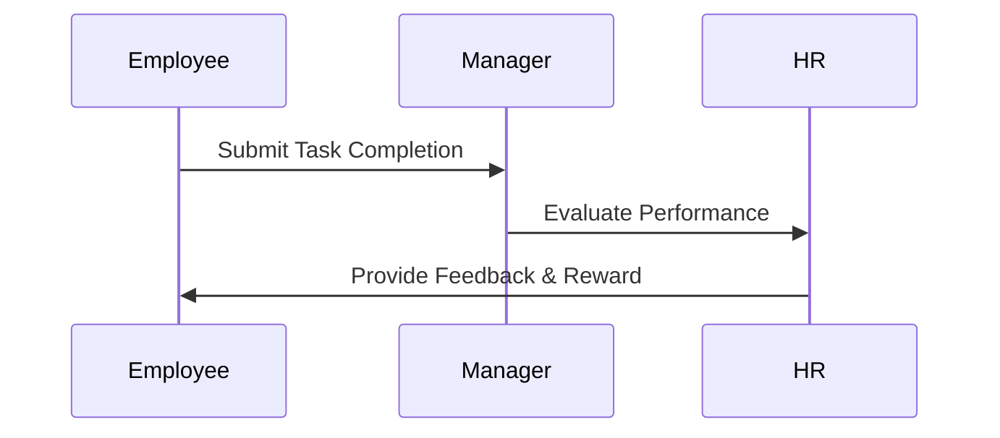
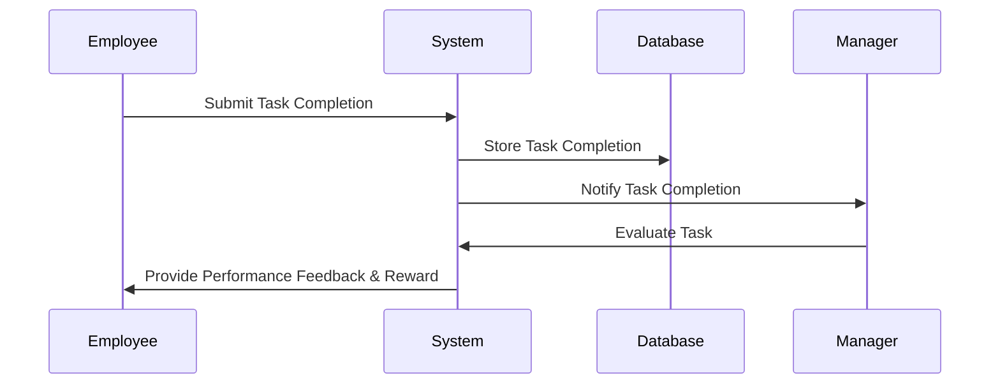
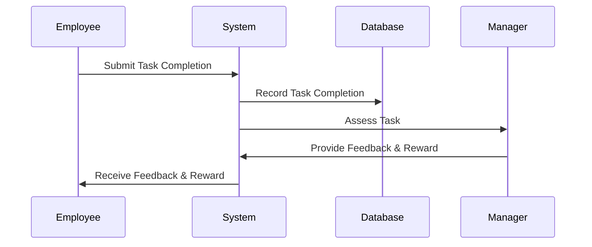

                 

**第1章：团队激励的必要性**

**1.1 问题背景**

**1.1.1 当前团队管理面临的挑战**

随着全球化竞争的加剧和信息技术的高速发展，现代企业面临着前所未有的挑战。团队成员的多样化、工作方式的灵活性和信息传递的迅速化，都对团队管理提出了更高的要求。

- **员工积极性不高**：在高度竞争的环境中，员工的压力增大，而单一的物质激励往往难以满足他们的内在需求。员工更倾向于寻求工作带来的成就感、自我价值的实现以及个人成长的机会。

- **员工流动率高**：缺乏有效的激励机制，员工容易产生职业倦怠，离职率上升。高离职率不仅影响团队稳定性，还增加了企业的招聘和培训成本。

- **团队凝聚力不足**：在快速变化的市场环境中，团队成员需要紧密协作，共同应对挑战。然而，缺乏共同的目标和价值观，团队成员之间的协作效果往往不佳，导致团队凝聚力下降。

**1.1.2 团队激励的重要性**

有效的团队激励不仅能提高员工的工作满意度，还能增强团队凝聚力，提高工作效率。以下是团队激励的重要性具体体现：

- **提高员工满意度**：通过认可和奖励，让员工感受到自己的努力被看见、被认可，从而提升工作满意度。

- **增强团队凝聚力**：共同的目标和价值观是团队凝聚力的基石。通过激励，团队成员能够更好地理解和认同组织的愿景，从而增强团队的凝聚力。

- **提高工作效率**：有效的激励可以激发员工的工作积极性，提高工作效率和创造力，从而推动团队整体绩效的提升。

**1.2 团队激励的核心概念**

**1.2.1 认可与奖励的定义**

- **认可**：认可是一种对员工工作成果或努力的非货币性肯定和赞扬，可以是口头的、书面的或物质的。认可的形式多样，如表扬、感谢信、荣誉称号等。

- **奖励**：奖励是对员工工作表现的一种货币性或非货币性的回报，通常与绩效挂钩。奖励的形式包括奖金、晋升、额外休假、专业培训等。

**1.2.2 认可与奖励的作用机制**

- **激励作用**：认可和奖励可以激发员工的积极性和工作动力，使员工愿意付出更多的努力以实现组织目标。

- **反馈作用**：认可和奖励为员工提供了工作表现的一种反馈，有助于员工了解自己的工作成果和改进方向。

- **引导作用**：认可和奖励可以引导员工的行为，使其朝着组织期望的方向发展。

**1.2.3 认可与奖励的平衡**

- **平衡的重要性**：过分强调认可可能导致员工对物质激励的期望下降，而过分强调奖励则可能引发员工对认可的忽视。因此，合理平衡认可与奖励，确保两者在激励体系中的适当比重，是确保团队激励有效性的关键。

在下一章节中，我们将深入探讨认可体系的构建，包括认可的形式、设计原则和实施方法。

**1.3 背景介绍**

**核心概念术语说明**

- **认可**：一种对员工工作成果或努力的非货币性肯定和赞扬，可以是口头的、书面的或物质的。
- **奖励**：一种对员工工作表现的一种货币性或非货币性的回报，通常与绩效挂钩。
- **员工满意度**：员工对工作环境的满意程度，是影响员工工作积极性、团队凝聚力的重要因素。
- **团队凝聚力**：团队成员之间的协作程度，是团队有效运作的基石。

**问题背景**

在现代社会，企业竞争日益激烈，团队管理面临诸多挑战。员工工作压力大，物质激励已无法满足其内在需求；员工流动率高，缺乏有效的激励机制；团队凝聚力不足，缺乏共同的目标和价值观。因此，团队激励显得尤为重要。

**问题描述**

- 如何提高员工满意度，增强团队凝聚力？
- 如何设计有效的认可和奖励体系，以激发员工的工作积极性？
- 如何平衡认可与奖励，确保激励体系的公平性和可持续性？

**问题解决**

有效的团队激励需要综合考虑员工的内在需求和企业的实际情况，设计出符合员工期望的认可和奖励体系。具体包括：

- 确定认可和奖励的形式，如口头表扬、书面感谢、荣誉称号、奖金等。
- 制定认可和奖励的设计原则，确保公平性、及时性和个性化。
- 实施认可和奖励体系，建立认可计划、认可机制和奖励计划、奖励机制。
- 持续改进认可和奖励体系，根据员工反馈和企业发展进行调整。

**边界与外延**

- **边界**：团队激励主要针对组织内部员工，不包括外部合作伙伴和客户。
- **外延**：团队激励可以扩展到员工的家庭、社区，以提升员工的归属感和社会责任感。

**概念结构与核心要素组成**

团队激励的概念结构包括：

- **认可和奖励的形式**：口头表扬、书面感谢、荣誉称号、奖金等。
- **认可和奖励的设计原则**：公平性、及时性、个性化。
- **认可和奖励的实施方法**：制定认可计划、认可机制，制定奖励计划、奖励机制。
- **认可和奖励的反馈机制**：员工反馈、评估改进。

**核心概念与联系**

- **认可**与**奖励**：两者在激励体系中相辅相成，共同构成员工激励的核心。
- **员工满意度**与**团队凝聚力**：认可和奖励的有效实施有助于提升员工满意度和团队凝聚力。
- **公平性**、**及时性**、**个性化**：认可和奖励设计原则确保激励体系的公平性和有效性。

在下一章节中，我们将深入探讨认可体系的构建，详细阐述认可的形式、设计原则和实施方法。

**第2章：认可体系的构建**

**2.1 认可的形式**

**2.1.1 口头认可**

口头认可是团队激励中最常见的形式之一，其优点在于传递速度快、氛围轻松，能够迅速激发员工的积极性。以下是口头认可的具体方式：

- **即兴表扬**：领导在日常工作中发现员工的优秀表现，可以立即进行表扬，这样既可以让员工感受到自己的努力得到了认可，也能激励其他员工向优秀者学习。
- **团队会议表扬**：在团队会议上，领导可以将优秀员工的表现公之于众，这不仅能提高员工的自信心，还能增强团队凝聚力。

**2.1.2 书面认可**

书面认可是通过文字形式对员工工作成果的认可，其优点在于正式、有据可查，能更好地记录员工的工作表现。以下是几种常见的书面认可方式：

- **感谢信**：领导或同事通过写一封感谢信来表达对员工工作的赞赏，这种形式的认可不仅能让员工感受到组织的关怀，还能增强员工的归属感。
- **荣誉证书**：在特定场合，如公司周年庆或年度总结会上，颁发荣誉证书给表现优秀的员工，这是一种较为正式的书面认可方式。

**2.1.3 非物质认可**

非物质认可是通过非金钱形式对员工工作成果的认可，其优点在于多样性和灵活性，能够满足不同员工的需求。以下是几种常见的非物质认可方式：

- **员工表扬榜**：在公司内部设立员工表扬榜，定期公布优秀员工的名字和事迹，这不仅是一种荣誉，也能激励其他员工。
- **员工参与活动**：组织员工参与公司组织的各类活动，如团建、运动会等，这不仅能增强员工的团队意识，还能让他们在活动中感受到认可和尊重。

**2.2 认可体系的设计原则**

**2.2.1 公平性**

公平性是认可体系设计的关键原则之一，确保每个员工都有机会获得认可，避免偏袒现象。以下是一些实现公平性的方法：

- **公开透明的评选标准**：制定明确的评选标准，确保所有员工都能了解认可的条件和标准。
- **多样化的认可形式**：根据员工的岗位和工作性质，设计多样化的认可形式，确保不同岗位的员工都有机会获得认可。
- **定期评估与反馈**：定期对认可体系进行评估和反馈，确保体系能够持续改进，保持公平性。

**2.2.2 及时性**

及时性是指及时对员工的工作成果进行认可，以最大程度地激发员工的积极性。以下是一些实现及时性的方法：

- **即时反馈**：领导或同事在发现员工有优秀表现时，应立即给予反馈和认可。
- **定期表彰**：定期组织表彰活动，对员工在过去一段时间内的优秀表现进行总结和表彰。
- **灵活的认可机制**：根据员工的实际工作情况，灵活调整认可的时间节点，确保认可能够及时进行。

**2.2.3 个性化**

个性化是指根据员工的特点和需求，定制化的设计认可方式，以更好地满足员工的期望。以下是一些实现个性化的方法：

- **个性化表彰**：针对不同员工的特点，设计个性化的表彰方式，如为擅长演讲的员工安排演讲机会，为技术大牛安排技术分享会等。
- **定制化奖励**：根据员工的兴趣和职业规划，提供个性化的奖励，如提供专业培训机会、调整工作岗位等。
- **员工参与认可设计**：鼓励员工参与认可体系的设计，让他们提出建议和意见，从而使认可体系更加贴近员工的需求。

**2.3 实施认可体系的方法**

**2.3.1 制定认可计划**

制定认可计划是实施认可体系的第一步，以下是一些关键步骤：

- **确定认可目标**：明确认可体系的目的，如提高员工满意度、增强团队凝聚力等。
- **制定认可标准**：根据企业的实际情况和员工的需求，制定明确的认可标准。
- **确定认可形式**：根据认可目标和标准，选择合适的认可形式，如口头表扬、书面感谢等。
- **设定认可时间**：根据员工的工作节奏和企业的发展需求，设定认可的时间节点，如每周、每月、每季度等。

**2.3.2 建立认可机制**

建立认可机制是确保认可体系有效运行的关键，以下是一些方法：

- **设立认可委员会**：成立由领导、人力资源部门和员工代表组成的认可委员会，负责制定和监督认可计划的执行。
- **制定认可流程**：明确认可申请、审批、执行和反馈的流程，确保认可体系的规范化和标准化。
- **培训认可专员**：对认可专员进行专业培训，提高他们的认可能力和专业水平。

**2.3.3 持续改进认可体系**

认可体系不是一成不变的，需要根据员工反馈和企业发展进行调整和优化。以下是一些持续改进的方法：

- **收集员工反馈**：定期收集员工的反馈和建议，了解认可体系的实际效果。
- **进行评估与改进**：根据员工反馈和评估结果，对认可体系进行调整和优化，确保其持续有效。
- **推广成功案例**：分享认可体系成功案例，激励员工积极参与认可活动，共同推动团队激励的有效实施。

通过上述方法，企业可以构建一个科学、有效的认可体系，从而提高员工满意度，增强团队凝聚力，推动企业持续发展。

**第2章：认可体系的构建**

**2.1 认可的形式**

**2.1.1 口头认可**

口头认可是团队激励中最为常见的形式之一。它的优势在于传递速度快，氛围轻松，能够迅速激发员工的积极性。以下是口头认可的具体方式：

- **即兴表扬**：在日常工作过程中，领导或同事如果发现员工有值得表扬的行为或成就，可以立即给予表扬。这样的即时反馈可以让员工感受到自己的努力被认可，同时也激励其他员工学习优秀者的榜样。
- **团队会议表扬**：在定期的团队会议上，领导可以将优秀员工的表现进行公开表扬，这不仅是对员工的个人认可，也是对团队精神的肯定，有助于增强团队的凝聚力。

**2.1.2 书面认可**

书面认可是通过文字形式对员工工作成果的认可。它的优点在于正式、有据可查，能更好地记录员工的工作表现。以下是几种常见的书面认可方式：

- **感谢信**：领导或同事可以写一封感谢信，表达对员工工作的赞赏和认可。这种形式不仅能让员工感受到组织的关怀，还能增强员工的归属感。
- **荣誉证书**：在特定的场合，如公司周年庆或年度总结会上，企业可以颁发荣誉证书给表现优秀的员工。这是一种较为正式的书面认可，能够给员工带来极大的荣誉感。

**2.1.3 非物质认可**

非物质认可是通过非金钱形式对员工工作成果的认可。它的优势在于形式多样，能够满足不同员工的需求。以下是几种常见的非物质认可方式：

- **员工表扬榜**：在企业内部设立员工表扬榜，定期公布优秀员工的名字和事迹。这种形式不仅能给员工带来荣誉，还能激励其他员工积极向上。
- **员工参与活动**：组织员工参与公司组织的各类活动，如团建、运动会等。这不仅能够增强员工的团队意识，还能让他们在工作中感受到认可和尊重。

**2.2 认可体系的设计原则**

**2.2.1 公平性**

公平性是认可体系设计的关键原则之一。确保每个员工都有机会获得认可，避免偏袒现象。以下是实现公平性的方法：

- **公开透明的评选标准**：制定明确的评选标准，确保所有员工都能了解认可的条件和标准。
- **多样化的认可形式**：根据员工的岗位和工作性质，设计多样化的认可形式，确保不同岗位的员工都有机会获得认可。
- **定期评估与反馈**：定期对认可体系进行评估和反馈，确保体系能够持续改进，保持公平性。

**2.2.2 及时性**

及时性是指及时对员工的工作成果进行认可，以最大程度地激发员工的积极性。以下是实现及时性的方法：

- **即时反馈**：领导或同事在发现员工有优秀表现时，应立即给予反馈和认可。
- **定期表彰**：定期组织表彰活动，对员工在过去一段时间内的优秀表现进行总结和表彰。
- **灵活的认可机制**：根据员工的实际工作情况，灵活调整认可的时间节点，确保认可能够及时进行。

**2.2.3 个性化**

个性化是指根据员工的特点和需求，定制化的设计认可方式，以更好地满足员工的期望。以下是实现个性化的方法：

- **个性化表彰**：针对不同员工的特点，设计个性化的表彰方式，如为擅长演讲的员工安排演讲机会，为技术大牛安排技术分享会等。
- **定制化奖励**：根据员工的兴趣和职业规划，提供个性化的奖励，如提供专业培训机会、调整工作岗位等。
- **员工参与认可设计**：鼓励员工参与认可体系的设计，让他们提出建议和意见，从而使认可体系更加贴近员工的需求。

**2.3 实施认可体系的方法**

**2.3.1 制定认可计划**

制定认可计划是实施认可体系的第一步。以下是制定认可计划的关键步骤：

- **确定认可目标**：明确认可体系的目的，如提高员工满意度、增强团队凝聚力等。
- **制定认可标准**：根据企业的实际情况和员工的需求，制定明确的认可标准。
- **确定认可形式**：根据认可目标和标准，选择合适的认可形式，如口头表扬、书面感谢等。
- **设定认可时间**：根据员工的工作节奏和企业的发展需求，设定认可的时间节点，如每周、每月、每季度等。

**2.3.2 建立认可机制**

建立认可机制是确保认可体系有效运行的关键。以下是建立认可机制的方法：

- **设立认可委员会**：成立由领导、人力资源部门和员工代表组成的认可委员会，负责制定和监督认可计划的执行。
- **制定认可流程**：明确认可申请、审批、执行和反馈的流程，确保认可体系的规范化和标准化。
- **培训认可专员**：对认可专员进行专业培训，提高他们的认可能力和专业水平。

**2.3.3 持续改进认可体系**

认可体系不是一成不变的，需要根据员工反馈和企业发展进行调整和优化。以下是持续改进认可体系的方法：

- **收集员工反馈**：定期收集员工的反馈和建议，了解认可体系的实际效果。
- **进行评估与改进**：根据员工反馈和评估结果，对认可体系进行调整和优化，确保其持续有效。
- **推广成功案例**：分享认可体系成功案例，激励员工积极参与认可活动，共同推动团队激励的有效实施。

通过上述方法，企业可以构建一个科学、有效的认可体系，从而提高员工满意度，增强团队凝聚力，推动企业持续发展。

**2.3.1 制定认可计划**

制定认可计划是构建认可体系的关键步骤。一个成功的认可计划不仅能够提高员工的工作积极性，还能够增强团队的凝聚力。以下是制定认可计划的详细步骤：

**确定认可目标**

- **目标设定**：首先，需要明确认可计划的目标。目标可以是提高员工满意度、增强团队凝聚力、提升工作效率等。
- **目标分解**：将总体目标分解为具体的可执行的小目标，确保每个目标都能够被衡量和达成。

**制定认可标准**

- **标准制定**：制定明确的认可标准，确保每个员工都有机会获得认可。标准应该具有客观性和可衡量性。
- **标准公示**：将认可标准公示给所有员工，确保他们了解认可的条件和标准。

**确定认可形式**

- **形式选择**：根据员工的岗位和工作性质，选择合适的认可形式。常见的形式包括口头表扬、书面感谢、荣誉证书、员工表扬榜等。
- **形式多样化**：为了满足不同员工的需求，认可形式应该多样化，不仅要包括物质奖励，还应包括非物质奖励。

**设定认可时间**

- **时间规划**：根据员工的工作节奏和企业的发展需求，设定认可的时间节点。例如，每周、每月、每季度进行一次认可活动。
- **及时反馈**：确保认可能够及时进行，以便员工能够及时感受到认可和激励。

**2.3.2 建立认可机制**

建立认可机制是确保认可计划能够顺利实施的保障。以下是建立认可机制的步骤：

**设立认可委员会**

- **委员会组建**：成立由领导、人力资源部门和员工代表组成的认可委员会。认可委员会负责制定和监督认可计划的执行。
- **职责明确**：明确认可委员会的职责，包括制定认可标准、审核认可申请、决策认可形式和时间等。

**制定认可流程**

- **流程设计**：设计明确的认可流程，包括认可申请、审批、执行和反馈的各个环节。
- **流程规范**：确保认可流程的规范化，确保每个环节都有明确的标准和操作步骤。

**培训认可专员**

- **专员培训**：对认可专员进行专业培训，提高他们的认可能力和专业水平。培训内容包括认可标准、认可流程、沟通技巧等。

**2.3.3 持续改进认可体系**

认可体系不是一成不变的，需要根据员工反馈和企业发展进行调整和优化。以下是持续改进认可体系的步骤：

**收集员工反馈**

- **反馈机制**：建立反馈机制，鼓励员工提出对认可体系的意见和建议。
- **定期收集**：定期收集员工的反馈，了解认可体系的实际效果和存在的问题。

**进行评估与改进**

- **评估方法**：采用定性和定量相结合的方法，对认可体系进行评估。
- **改进措施**：根据评估结果，制定相应的改进措施，优化认可体系。

**推广成功案例**

- **案例分享**：分享认可体系成功案例，激励员工积极参与认可活动，提高认可体系的实施效果。
- **经验总结**：总结成功案例中的经验，为后续的认可计划提供参考。

通过以上步骤，企业可以构建一个科学、有效的认可体系，提高员工的工作积极性，增强团队凝聚力，推动企业的持续发展。

### **2.3.3 持续改进认可体系**

认可体系需要不断优化和完善，以确保其能够适应企业的发展变化和员工的需求。以下是持续改进认可体系的步骤：

**收集员工反馈**

为了了解认可体系的实际效果和存在的问题，企业需要建立反馈机制。可以通过以下方式收集员工反馈：

- **定期问卷调查**：定期开展员工满意度调查，了解他们对认可体系的看法和建议。
- **意见箱**：在企业内部设立意见箱，鼓励员工提出对认可体系的意见和建议。
- **员工会议**：定期召开员工会议，听取员工的意见和建议，讨论认可体系的改进方案。

**进行评估与改进**

评估是改进认可体系的关键步骤。可以通过以下方法进行评估：

- **数据统计**：收集和分析与认可体系相关的数据，如员工满意度、员工流失率、工作绩效等。
- **员工访谈**：与员工进行一对一访谈，了解他们对认可体系的真实感受和需求。
- **专家评审**：邀请人力资源管理专家对企业认可体系进行评审，提出专业的改进建议。

**根据评估结果，制定相应的改进措施**：

- **优化认可标准**：根据员工反馈和评估结果，对认可标准进行优化，确保其更加公正、合理和可操作。
- **调整认可形式**：根据员工的实际需求和企业的发展，调整认可形式，增加多样性，满足不同员工的需求。
- **改进认可流程**：简化认可流程，减少不必要的环节，提高认可效率。

**推广成功案例**

通过推广认可体系成功案例，可以激励员工积极参与认可活动，提高认可体系的实施效果。以下是推广成功案例的方法：

- **内部分享**：在企业内部分享认可体系成功案例，让员工了解认可体系的实施效果和成功经验。
- **外部宣传**：通过企业官网、社交媒体等渠道，对外宣传认可体系成功案例，提升企业的品牌形象。
- **经验总结**：总结成功案例中的经验，形成标准化的操作手册，为后续的认可计划提供参考。

### **2.3.4 成功案例解析**

**案例1：某科技公司的员工认可计划**

某科技公司通过实施一套全面的员工认可计划，有效提升了员工的满意度和团队的凝聚力。以下是该公司的成功经验：

**1. 确定认可目标**：公司的认可目标主要包括提高员工的工作满意度、增强团队凝聚力以及提升整体工作效率。

**2. 制定认可标准**：公司制定了详细的认可标准，包括创新贡献、项目成功、团队合作、员工贡献等方面，确保每个员工都有机会获得认可。

**3. 多样化认可形式**：公司采用多种认可形式，如：

- **员工表扬榜**：每月公布优秀员工的名字和事迹，激励其他员工学习。
- **团队建设活动**：组织定期的团队建设活动，增强员工之间的沟通和协作。
- **荣誉证书**：在重要场合颁发荣誉证书，表彰员工的突出贡献。

**4. 及时性原则**：公司注重及时性，一旦发现员工的优秀表现，就会立即给予认可。

**5. 个性化表彰**：针对不同员工的特长和兴趣，公司提供个性化的表彰和奖励，如技术分享机会、专业培训等。

**6. 持续改进**：公司定期收集员工反馈，对认可体系进行评估和改进，确保其持续有效。

通过这些措施，该公司的员工满意度显著提升，团队凝聚力增强，员工流失率降低，整体工作效率提高。

### **2.3.5 小结**

通过以上分析，我们可以看到，构建和实施一个有效的认可体系对于提高员工满意度、增强团队凝聚力具有重要意义。企业需要根据自身实际情况，制定合适的认可计划，建立科学的认可机制，并持续改进，以确保认可体系能够真正发挥作用。

**注意事项**：

- **公平性**：确保认可标准公开透明，避免偏袒现象。
- **及时性**：及时给予员工认可，避免延迟效应。
- **个性化**：根据员工的特点和需求，提供个性化的认可和奖励。

**拓展阅读**：

- 《员工激励与团队管理》
- 《激励心理学》
- 《企业员工认可体系设计与实践》

通过以上内容，企业可以更好地理解和实施团队激励，提高员工满意度和团队凝聚力，从而实现企业的长期发展目标。

**第3章：奖励体系的构建**

**3.1 奖励的种类**

奖励是团队激励的重要组成部分，可以有效提升员工的工作积极性和绩效。根据奖励的性质和目的，可以将奖励分为以下几种主要类型：

**3.1.1 金钱奖励**

金钱奖励是最直接和最常见的奖励形式，包括奖金、加薪、津贴等。以下是金钱奖励的特点：

- **激励作用强**：金钱奖励能够直接提升员工的物质收益，对提高工作积极性有显著作用。
- **可衡量性强**：奖金和加薪可以根据员工的绩效和贡献进行量化，便于管理和评估。
- **易引发争议**：如果金钱奖励不公平或缺乏透明度，可能会引发员工之间的不满和竞争。

**3.1.2 贡献奖励**

贡献奖励是一种基于员工工作成果和贡献的奖励，不直接涉及金钱。贡献奖励的形式多种多样，包括晋升、职位调整、额外休假等。以下是贡献奖励的特点：

- **激励长期性**：贡献奖励能够激励员工长期关注和提升自己的工作表现，而不仅仅是短期的绩效。
- **提升职业发展**：晋升和职位调整能够为员工提供更多的职业发展机会，有助于员工的长期成长。
- **增强归属感**：贡献奖励能够增强员工对组织的忠诚度和归属感，提高团队凝聚力。

**3.1.3 职业发展奖励**

职业发展奖励旨在为员工提供职业发展的机会和资源，包括专业培训、技术交流、职业规划等。以下是职业发展奖励的特点：

- **提升技能和知识**：专业培训和职业规划能够帮助员工提升技能和知识，增强个人竞争力。
- **促进创新和成长**：职业发展奖励能够激励员工创新思维，推动企业的技术创新和业务发展。
- **优化人才结构**：通过职业发展奖励，企业能够吸引和留住优秀人才，优化人才结构。

**3.2 奖励体系的设计原则**

设计一个有效的奖励体系需要遵循以下原则，以确保奖励能够真正发挥激励作用：

**3.2.1 公平性**

公平性是奖励体系设计的基础，确保每位员工都有公平的机会获得奖励。以下是一些实现公平性的方法：

- **明确的评选标准**：制定清晰的评选标准，确保所有员工都了解奖励的条件和标准。
- **公正的评审过程**：建立公正的评审机制，确保评选过程的透明性和客观性。
- **公平的分配机制**：确保奖励的分配公平合理，避免偏袒现象。

**3.2.2 透明性**

透明性是建立信任和认可的重要手段。以下是一些实现透明性的方法：

- **公开的评选结果**：公布奖励的评选结果，让员工了解奖励的依据和过程。
- **明确的解释说明**：对奖励决策进行解释说明，让员工理解奖励的意义和价值。
- **开放的沟通渠道**：建立开放的沟通渠道，鼓励员工对奖励体系提出意见和建议。

**3.2.3 可持续性**

可持续性是指奖励体系能够长期运行并产生积极的效果。以下是一些实现可持续性的方法：

- **动态调整**：根据企业的发展和员工的需求，动态调整奖励体系，确保其适应性和有效性。
- **员工参与**：鼓励员工参与奖励体系的设计和改进，提高员工的参与度和积极性。
- **持续监督和评估**：定期对奖励体系进行监督和评估，确保其持续改进和优化。

**3.3 实施奖励体系的方法**

实施奖励体系需要系统的规划和执行。以下是一些具体的实施方法：

**3.3.1 制定奖励计划**

制定奖励计划是实施奖励体系的第一步。以下是一些关键步骤：

- **确定奖励目标**：明确奖励计划的目标，如提升员工满意度、提高绩效、增强团队凝聚力等。
- **制定奖励标准**：根据企业的实际情况和员工的需求，制定明确的奖励标准。
- **确定奖励形式**：根据奖励目标和标准，选择合适的奖励形式，如奖金、晋升、培训等。
- **设定奖励时间**：根据员工的工作节奏和企业的发展需求，设定奖励的时间节点，如每月、每季度、每年等。

**3.3.2 建立奖励机制**

建立奖励机制是确保奖励计划有效运行的关键。以下是一些方法：

- **设立奖励委员会**：成立由领导、人力资源部门和员工代表组成的奖励委员会，负责制定和监督奖励计划的执行。
- **制定奖励流程**：明确奖励申请、审批、执行和反馈的流程，确保奖励体系的规范化和标准化。
- **培训奖励专员**：对奖励专员进行专业培训，提高他们的奖励能力和专业水平。

**3.3.3 持续优化奖励体系**

奖励体系不是一成不变的，需要根据员工反馈和企业发展进行调整和优化。以下是一些持续优化奖励体系的方法：

- **收集员工反馈**：定期收集员工的反馈和建议，了解奖励体系的实际效果和存在的问题。
- **进行评估与改进**：根据员工反馈和评估结果，对奖励体系进行调整和优化，确保其持续有效。
- **推广成功案例**：分享奖励体系成功案例，激励员工积极参与奖励活动，提高奖励体系的实施效果。

通过以上方法，企业可以构建一个科学、有效的奖励体系，从而提高员工的工作积极性、绩效和满意度，推动企业的长期发展。

### **3.3.1 制定奖励计划**

制定奖励计划是实施奖励体系的基础步骤，一个详细的奖励计划能够为企业的激励机制提供明确的指导和方向。以下是制定奖励计划的详细步骤：

**确定奖励目标**

- **目标设定**：首先，需要明确奖励计划的目标。目标可以是提高员工满意度、提升工作效率、增强团队凝聚力、激发创新能力等。
- **目标分解**：将总体目标分解为具体的、可衡量的子目标，确保每个目标都能够被具体执行和评估。

**制定奖励标准**

- **标准制定**：根据企业的实际情况和员工的需求，制定明确的奖励标准。标准应具有可衡量性和公正性，如工作绩效、项目完成情况、创新贡献等。
- **标准公示**：将奖励标准公示给所有员工，确保他们了解获得奖励的条件和评判标准。

**确定奖励形式**

- **形式选择**：根据奖励目标和标准，选择合适的奖励形式。常见的奖励形式包括金钱奖励（如奖金、提成、加薪等）、贡献奖励（如晋升、职位调整、额外休假等）和职业发展奖励（如培训机会、专业认证支持、职业规划指导等）。
- **形式多样化**：为了满足不同员工的需求，奖励形式应该多样化，不仅限于金钱奖励，还应包括非物质奖励。

**设定奖励时间**

- **时间规划**：根据员工的工作节奏和企业的发展需求，设定奖励的时间节点。例如，可以设定为每月、每季度或每年进行一次奖励。
- **及时反馈**：确保奖励能够及时进行，以便员工能够及时感受到奖励和激励。

**3.3.2 建立奖励机制**

建立奖励机制是确保奖励计划能够顺利实施的保障。以下是建立奖励机制的具体步骤：

**设立奖励委员会**

- **委员会组建**：成立由企业高层领导、人力资源部门和员工代表组成的奖励委员会，负责制定和监督奖励计划的执行。
- **职责明确**：明确奖励委员会的职责，包括制定奖励标准、审核奖励申请、决策奖励形式和时间等。

**制定奖励流程**

- **流程设计**：设计明确的奖励流程，包括奖励申请、审批、执行和反馈的各个环节。
- **流程规范**：确保奖励流程的规范化，确保每个环节都有明确的标准和操作步骤。

**培训奖励专员**

- **专员培训**：对奖励专员进行专业培训，提高他们的奖励能力和专业水平。培训内容包括奖励标准、奖励流程、沟通技巧等。

**3.3.3 持续改进奖励体系**

奖励体系需要根据员工反馈和企业发展进行调整和优化，以确保其持续有效。以下是持续改进奖励体系的方法：

**收集员工反馈**

- **反馈机制**：建立反馈机制，鼓励员工提出对奖励体系的意见和建议。
- **定期收集**：定期收集员工的反馈，了解奖励体系的实际效果和存在的问题。

**进行评估与改进**

- **评估方法**：采用定性和定量相结合的方法，对奖励体系进行评估。
- **改进措施**：根据评估结果，制定相应的改进措施，优化奖励体系。

**推广成功案例**

- **案例分享**：分享奖励体系成功案例，激励员工积极参与奖励活动，提高奖励体系的实施效果。
- **经验总结**：总结成功案例中的经验，为后续的奖励计划提供参考。

通过以上步骤，企业可以构建一个科学、有效的奖励体系，提高员工的工作积极性、绩效和满意度，从而推动企业的长期发展。

### **3.3.3 持续改进奖励体系**

为了确保奖励体系能够适应企业的发展和员工的需求，持续改进是至关重要的。以下是持续改进奖励体系的步骤和方法：

**收集员工反馈**

- **建立反馈渠道**：建立便捷的反馈渠道，如员工意见箱、定期调查问卷、开放会议等，鼓励员工提出意见和建议。
- **定期收集反馈**：定期收集和分析员工反馈，了解他们对奖励体系的满意度、期望和建议。

**进行评估与改进**

- **制定评估标准**：明确评估标准，包括奖励的公平性、透明性、激励效果等。
- **定量与定性分析**：结合定量数据（如绩效指标、员工满意度调查结果）和定性反馈（如员工访谈、开放讨论会），进行全面评估。
- **分析问题原因**：找出奖励体系存在的问题和不足，分析其根本原因。

**制定改进措施**

- **针对性改进**：根据评估结果，制定具体的改进措施，如调整奖励标准、优化奖励流程、增加奖励形式等。
- **实施改进计划**：制定详细的改进计划，明确改进措施的实施步骤、负责人和时间表。

**推广成功案例**

- **内部分享**：在企业内部分享成功的奖励案例，展示奖励体系的有效性和正面影响，激励员工积极参与。
- **经验总结**：总结成功案例中的经验，形成标准化的操作指南，为后续奖励计划提供参考。
- **外部宣传**：在适当的场合，如行业会议、企业年会等，对外宣传奖励体系的成功经验，提升企业的品牌形象。

**3.3.4 成功案例解析**

**案例1：某互联网公司的奖金激励计划**

某互联网公司通过实施一套奖金激励计划，显著提升了员工的工作积极性和绩效。以下是该公司的成功经验：

**1. 明确奖励目标**：公司的奖励目标包括提高员工的工作满意度、提升项目完成质量和团队协作水平。

**2. 制定公平的奖励标准**：公司制定了详细的奖励标准，包括项目完成率、质量评估、团队合作贡献等方面。

**3. 透明和及时的奖励分配**：公司通过内部邮件和公告，及时公布奖励名单和奖励金额，确保透明和公正。

**4. 多样化的奖励形式**：除了现金奖励外，公司还提供额外的福利，如额外休假、专业培训等，满足不同员工的需求。

**5. 定期评估与反馈**：公司定期收集员工反馈，对奖金激励计划进行评估，并根据反馈进行调整。

**6. 员工参与**：公司鼓励员工参与奖励计划的设计和改进，提高员工的参与度和满意度。

通过这些措施，该公司的员工满意度显著提升，绩效和团队协作水平也得到显著改善。

**3.3.5 小结**

持续改进奖励体系是确保其有效性的关键。企业需要建立完善的反馈机制，定期评估奖励体系，并根据反馈和评估结果进行调整。通过不断优化奖励体系，企业可以更好地激励员工，提高工作绩效和团队凝聚力。

**注意事项**：

- **公平性**：确保奖励标准的公正性和透明度，避免偏袒现象。
- **及时性**：及时分配奖励，避免延迟效应。
- **个性化**：根据员工的特点和需求，提供个性化的奖励形式。

**拓展阅读**：

- 《企业激励与绩效管理》
- 《薪酬管理与激励创新》
- 《员工激励心理学》

通过以上内容，企业可以更好地理解和实施奖励体系，提高员工的工作积极性、绩效和满意度，推动企业的长期发展。

### **第3章：奖励体系的构建**

**3.1 奖励的种类**

奖励是团队激励中的重要组成部分，可以有效提升员工的工作积极性和绩效。根据奖励的性质和目的，可以将奖励分为以下几种主要类型：

**3.1.1 金钱奖励**

金钱奖励是最直接和最常见的奖励形式，包括奖金、加薪、津贴等。以下是金钱奖励的特点：

- **激励作用强**：金钱奖励能够直接提升员工的物质收益，对提高工作积极性有显著作用。
- **可衡量性强**：奖金和加薪可以根据员工的绩效和贡献进行量化，便于管理和评估。
- **易引发争议**：如果金钱奖励不公平或缺乏透明度，可能会引发员工之间的不满和竞争。

**3.1.2 贡献奖励**

贡献奖励是一种基于员工工作成果和贡献的奖励，不直接涉及金钱。贡献奖励的形式多种多样，包括晋升、职位调整、额外休假等。以下是贡献奖励的特点：

- **激励长期性**：贡献奖励能够激励员工长期关注和提升自己的工作表现，而不仅仅是短期的绩效。
- **提升职业发展**：晋升和职位调整能够为员工提供更多的职业发展机会，有助于员工的长期成长。
- **增强归属感**：贡献奖励能够增强员工对组织的忠诚度和归属感，提高团队凝聚力。

**3.1.3 职业发展奖励**

职业发展奖励旨在为员工提供职业发展的机会和资源，包括专业培训、技术交流、职业规划等。以下是职业发展奖励的特点：

- **提升技能和知识**：专业培训和职业规划能够帮助员工提升技能和知识，增强个人竞争力。
- **促进创新和成长**：职业发展奖励能够激励员工创新思维，推动企业的技术创新和业务发展。
- **优化人才结构**：通过职业发展奖励，企业能够吸引和留住优秀人才，优化人才结构。

**3.2 奖励体系的设计原则**

设计一个有效的奖励体系需要遵循以下原则，以确保奖励能够真正发挥激励作用：

**3.2.1 公平性**

公平性是奖励体系设计的基础，确保每位员工都有公平的机会获得奖励。以下是一些实现公平性的方法：

- **明确的评选标准**：制定清晰的评选标准，确保所有员工都了解奖励的条件和标准。
- **公正的评审过程**：建立公正的评审机制，确保评选过程的透明性和客观性。
- **公平的分配机制**：确保奖励的分配公平合理，避免偏袒现象。

**3.2.2 透明性**

透明性是建立信任和认可的重要手段。以下是一些实现透明性的方法：

- **公开的评选结果**：公布奖励的评选结果，让员工了解奖励的依据和过程。
- **明确的解释说明**：对奖励决策进行解释说明，让员工理解奖励的意义和价值。
- **开放的沟通渠道**：建立开放的沟通渠道，鼓励员工对奖励体系提出意见和建议。

**3.2.3 可持续性**

可持续性是指奖励体系能够长期运行并产生积极的效果。以下是一些实现可持续性的方法：

- **动态调整**：根据企业的发展和员工的需求，动态调整奖励体系，确保其适应性和有效性。
- **员工参与**：鼓励员工参与奖励体系的设计和改进，提高员工的参与度和积极性。
- **持续监督和评估**：定期对奖励体系进行监督和评估，确保其持续改进和优化。

**3.3 实施奖励体系的方法**

实施奖励体系需要系统的规划和执行。以下是一些具体的实施方法：

**3.3.1 制定奖励计划**

制定奖励计划是实施奖励体系的第一步。以下是一些关键步骤：

- **确定奖励目标**：明确奖励计划的目标，如提升员工满意度、提高绩效、增强团队凝聚力等。
- **制定奖励标准**：根据企业的实际情况和员工的需求，制定明确的奖励标准。
- **确定奖励形式**：根据奖励目标和标准，选择合适的奖励形式，如奖金、晋升、培训等。
- **设定奖励时间**：根据员工的工作节奏和企业的发展需求，设定奖励的时间节点，如每月、每季度、每年等。

**3.3.2 建立奖励机制**

建立奖励机制是确保奖励计划有效运行的关键。以下是一些方法：

- **设立奖励委员会**：成立由领导、人力资源部门和员工代表组成的奖励委员会，负责制定和监督奖励计划的执行。
- **制定奖励流程**：明确奖励申请、审批、执行和反馈的流程，确保奖励体系的规范化和标准化。
- **培训奖励专员**：对奖励专员进行专业培训，提高他们的奖励能力和专业水平。

**3.3.3 持续优化奖励体系**

奖励体系不是一成不变的，需要根据员工反馈和企业发展进行调整和优化。以下是一些持续优化奖励体系的方法：

- **收集员工反馈**：定期收集员工的反馈和建议，了解奖励体系的实际效果和存在的问题。
- **进行评估与改进**：根据员工反馈和评估结果，对奖励体系进行调整和优化，确保其持续有效。
- **推广成功案例**：分享奖励体系成功案例，激励员工积极参与奖励活动，提高奖励体系的实施效果。

通过以上方法，企业可以构建一个科学、有效的奖励体系，从而提高员工的工作积极性、绩效和满意度，推动企业的长期发展。

### **3.3.3 持续优化奖励体系**

为了确保奖励体系能够适应企业的发展和员工的需求，持续优化是至关重要的。以下是持续优化奖励体系的步骤和方法：

**收集员工反馈**

- **建立反馈渠道**：建立便捷的反馈渠道，如员工意见箱、定期调查问卷、开放会议等，鼓励员工提出意见和建议。
- **定期收集反馈**：定期收集和分析员工反馈，了解他们对奖励体系的满意度、期望和建议。

**进行评估与改进**

- **制定评估标准**：明确评估标准，包括奖励的公平性、透明性、激励效果等。
- **定量与定性分析**：结合定量数据（如绩效指标、员工满意度调查结果）和定性反馈（如员工访谈、开放讨论会），进行全面评估。
- **分析问题原因**：找出奖励体系存在的问题和不足，分析其根本原因。

**制定改进措施**

- **针对性改进**：根据评估结果，制定具体的改进措施，如调整奖励标准、优化奖励流程、增加奖励形式等。
- **实施改进计划**：制定详细的改进计划，明确改进措施的实施步骤、负责人和时间表。

**推广成功案例**

- **内部分享**：在企业内部分享成功的奖励案例，展示奖励体系的有效性和正面影响，激励员工积极参与。
- **经验总结**：总结成功案例中的经验，形成标准化的操作指南，为后续奖励计划提供参考。
- **外部宣传**：在适当的场合，如行业会议、企业年会等，对外宣传奖励体系的成功经验，提升企业的品牌形象。

**3.3.4 成功案例解析**

**案例1：某互联网公司的奖金激励计划**

某互联网公司通过实施一套奖金激励计划，显著提升了员工的工作积极性和绩效。以下是该公司的成功经验：

**1. 明确奖励目标**：公司的奖励目标包括提高员工的工作满意度、提升项目完成质量和团队协作水平。

**2. 制定公平的奖励标准**：公司制定了详细的奖励标准，包括项目完成率、质量评估、团队合作贡献等方面。

**3. 透明和及时的奖励分配**：公司通过内部邮件和公告，及时公布奖励名单和奖励金额，确保透明和公正。

**4. 多样化的奖励形式**：除了现金奖励外，公司还提供额外的福利，如额外休假、专业培训等，满足不同员工的需求。

**5. 定期评估与反馈**：公司定期收集员工反馈，对奖金激励计划进行评估，并根据反馈进行调整。

**6. 员工参与**：公司鼓励员工参与奖励计划的设计和改进，提高员工的参与度和满意度。

通过这些措施，该公司的员工满意度显著提升，绩效和团队协作水平也得到显著改善。

**3.3.5 小结**

持续改进奖励体系是确保其有效性的关键。企业需要建立完善的反馈机制，定期评估奖励体系，并根据反馈和评估结果进行调整。通过不断优化奖励体系，企业可以更好地激励员工，提高工作绩效和团队凝聚力。

**注意事项**：

- **公平性**：确保奖励标准的公正性和透明度，避免偏袒现象。
- **及时性**：及时分配奖励，避免延迟效应。
- **个性化**：根据员工的特点和需求，提供个性化的奖励形式。

**拓展阅读**：

- 《企业激励与绩效管理》
- 《薪酬管理与激励创新》
- 《员工激励心理学》

通过以上内容，企业可以更好地理解和实施奖励体系，提高员工的工作积极性、绩效和满意度，推动企业的长期发展。

### **第4章：认可与奖励的综合应用**

在构建和实施认可与奖励体系时，企业需要综合考虑两者的综合应用，以确保激励体系能够达到最佳效果。本章节将探讨认可与奖励的综合应用，包括结合使用的方法、实际案例分析，以及如何平衡两者。

#### **4.1 认可与奖励的综合应用方法**

**4.1.1 确定合适的比例**

在企业中，认可与奖励的比例需要根据实际情况来确定。一般来说，认可的比例应该大于奖励，因为认可能够更快速地激励员工，而奖励则更加注重长期激励。以下是一个常见的比例设定：

- **认可**：80%
- **奖励**：20%

这种比例安排意味着，企业应该通过大量的认可来维持员工的积极性和满意度，同时通过适度的奖励来激励员工追求更高的绩效。

**4.1.2 结合使用形式**

- **即时认可+长期奖励**：即时认可可以迅速给予员工反馈，提高他们的工作动力。而长期奖励则能帮助员工看到自己的长期发展，激励他们持续努力。

- **认可与奖励交替使用**：在某些特殊情况下，如项目重大进展或紧急任务完成时，可以交替使用认可和奖励，以增强激励效果。

**4.1.3 定期评估与反馈**

定期对认可与奖励体系进行评估，确保其持续有效。这包括：

- **员工满意度调查**：通过调查了解员工对认可与奖励的满意度，发现潜在问题。
- **绩效评估**：结合员工的绩效评估结果，调整认可与奖励的比例和形式。

#### **4.2 实际案例分析**

**案例1：某零售企业**

某零售企业通过实施一套综合的认可与奖励体系，成功提升了员工的工作积极性和客户服务水平。以下是该企业的成功经验：

**1. 确定比例**：该企业将认可与奖励的比例设定为8:2，即80%的认可和20%的奖励。

**2. 即时认可**：在日常运营中，管理人员通过口头表扬、感谢信和员工表扬榜等形式，及时给予员工认可。

**3. 长期奖励**：对于表现优秀的员工，企业提供晋升机会、奖金和额外休假等长期奖励。

**4. 交替使用**：在特定时期，如季度结束或年度总结时，企业交替使用认可与奖励，以激励员工保持高绩效。

**5. 定期评估**：企业定期进行员工满意度调查和绩效评估，根据结果调整认可与奖励体系。

**结果**：该企业的员工满意度显著提高，员工流失率降低，客户服务水平得到提升。

#### **4.3 如何平衡认可与奖励**

**4.3.1 公平性**

- **明确的评选标准**：制定明确的认可与奖励评选标准，确保每个员工都有公平的机会获得奖励。
- **公正的评审过程**：建立公正的评审机制，确保评选过程的透明性和客观性。

**4.3.2 及时性**

- **及时认可**：及时对员工的工作成果和努力进行认可，避免延迟效应。
- **适时奖励**：在员工表现出色时，适时给予奖励，以激励他们保持高绩效。

**4.3.3 个性化**

- **个性化认可**：根据员工的特点和需求，提供个性化的认可方式。
- **个性化奖励**：根据员工的职业规划和兴趣，提供个性化的奖励形式。

**4.3.4 综合考虑**

- **长期与短期激励**：认可与奖励体系应兼顾长期激励与短期激励，确保员工既有眼前的激励，又有长远的发展前景。

通过以上方法，企业可以构建一个科学、有效的认可与奖励体系，提高员工的工作积极性、绩效和满意度，从而推动企业的长期发展。

### **第4章：认可与奖励的综合应用**

**4.1 认可与奖励的综合应用方法**

在构建和实施认可与奖励体系时，企业需要综合考虑两者的综合应用，以确保激励体系能够达到最佳效果。以下是几种结合使用认可与奖励的方法：

**4.1.1 确定合适的比例**

在认可与奖励的综合应用中，确定合适的比例至关重要。通常情况下，认可的比例应大于奖励，因为认可能够更快速地激励员工，增强他们的工作动力。以下是一个常见的比例设定：

- **认可**：80%
- **奖励**：20%

这种比例安排意味着，企业应该通过大量的认可来维持员工的积极性和满意度，同时通过适度的奖励来激励员工追求更高的绩效。

**4.1.2 即时认可与长期奖励**

- **即时认可**：通过即时认可，如口头表扬、感谢信等，迅速给予员工反馈，增强他们的工作动力。
- **长期奖励**：通过提供长期奖励，如晋升、奖金、额外休假等，帮助员工看到自己的长期发展，激励他们持续努力。

**4.1.3 交替使用**

在某些特殊情况下，如项目重大进展或紧急任务完成时，可以交替使用认可与奖励，以增强激励效果。例如，在项目成功后，首先通过口头表扬和荣誉证书进行即时认可，然后在一段时间后，提供奖金或晋升作为长期奖励。

**4.1.4 结合绩效评估**

在绩效评估过程中，将认可与奖励结合使用，以更全面地激励员工。例如，在年度绩效评估时，对于表现优秀的员工，既可以通过即时认可进行表彰，也可以提供长期奖励，如晋升或奖金。

**4.2 实际案例分析**

**案例1：某科技公司的综合激励体系**

某科技公司通过实施一套综合的认可与奖励体系，成功提升了员工的工作积极性和创新力。以下是该公司的成功经验：

**1. 比例设定**：公司将认可与奖励的比例设定为8:2，即80%的认可和20%的奖励。

**2. 即时认可**：公司通过即时认可，如公开表扬、员工大会表彰等方式，及时对员工的优秀表现进行认可。

**3. 长期奖励**：公司通过提供长期奖励，如股权激励、年终奖金、晋升机会等，激励员工追求更高的绩效。

**4. 绩效结合**：公司结合绩效评估结果，对表现优秀的员工进行表彰和奖励，确保认可与奖励的公正性和有效性。

**结果**：该公司的员工满意度显著提高，员工流失率降低，创新力和工作效率也有明显提升。

**4.3 如何平衡认可与奖励**

**4.3.1 公平性**

为了确保认可与奖励体系的公平性，企业需要制定明确的评选标准，并建立公正的评审机制。以下是实现公平性的方法：

- **明确的评选标准**：制定清晰的认可与奖励评选标准，确保每个员工都有公平的机会获得奖励。
- **多元化的认可与奖励形式**：根据员工的岗位和工作性质，设计多样化的认可与奖励形式，确保不同岗位的员工都有机会获得认可。
- **透明的评审过程**：确保评审过程的透明性和客观性，让员工了解评选的依据和标准。

**4.3.2 及时性**

及时性是认可与奖励体系有效性的关键。以下是如何实现及时性的方法：

- **即时反馈**：领导或同事在发现员工的优秀表现时，应立即给予反馈和认可，以增强激励效果。
- **定期表彰**：定期组织表彰活动，对员工在过去一段时间内的优秀表现进行总结和表彰。
- **灵活的认可与奖励机制**：根据员工的工作情况和绩效，灵活调整认可与奖励的时间节点，确保及时进行。

**4.3.3 个性化**

个性化是认可与奖励体系有效性的另一个关键因素。以下是如何实现个性化的方法：

- **个性化认可**：根据员工的特点和需求，提供个性化的认可方式，如为擅长演讲的员工安排演讲机会，为技术大牛安排技术分享会等。
- **定制化奖励**：根据员工的兴趣和职业规划，提供定制化的奖励，如提供专业培训机会、调整工作岗位等。
- **员工参与**：鼓励员工参与认可与奖励体系的设计，让他们提出建议和意见，从而使体系更加贴近员工的需求。

通过以上方法，企业可以构建一个科学、有效的认可与奖励体系，从而提高员工的工作积极性、绩效和满意度，推动企业的长期发展。

### **第4章：认可与奖励的综合应用**

**4.4 最佳实践 Tips**

**4.4.1 结合企业文化和价值观**

- 企业在设计和实施认可与奖励体系时，应紧密结合自身的文化和价值观。这有助于增强员工的认同感和归属感。
- 例如，如果企业强调创新和创业精神，可以设立创新奖项，鼓励员工提出新的想法和解决方案。

**4.4.2 注重长期激励**

- 除了即时的认可和奖励，企业还应注重长期激励，如股权激励、职业发展机会等，以帮助员工看到未来的发展前景。
- 例如，企业可以设立“未来领袖计划”，为表现出色的员工提供额外的培训和发展机会。

**4.4.3 定期回顾和调整**

- 定期回顾认可与奖励体系的有效性，并根据员工反馈和企业发展进行调整。
- 例如，企业可以每年进行一次全面的绩效评估，结合评估结果优化认可与奖励体系。

**4.4.4 建立反馈机制**

- 建立有效的反馈机制，鼓励员工提出对认可与奖励体系的意见和建议。
- 例如，企业可以设立员工意见箱，定期收集员工的反馈，并进行分析和回应。

**4.5 小结**

在实施认可与奖励体系时，企业需要综合考虑认可与奖励的综合应用，确保体系能够有效激励员工，提高工作效率和团队凝聚力。通过结合企业文化和价值观、注重长期激励、定期回顾和调整，以及建立反馈机制，企业可以构建一个科学、有效的认可与奖励体系，从而推动企业的持续发展。

**4.6 注意事项**

- **公平性**：确保认可与奖励的公平性和透明性，避免偏袒现象。
- **及时性**：及时给予认可与奖励，避免延迟效应。
- **个性化**：根据员工的特点和需求，提供个性化的认可与奖励。

**4.7 拓展阅读**

- 《员工激励与绩效管理》
- 《企业激励机制设计》
- 《团队激励心理学》

通过以上内容，企业可以更好地理解和实施认可与奖励体系，提高员工的工作积极性、绩效和满意度，推动企业的长期发展。

### **第5章：总结与展望**

在本文中，我们深入探讨了团队激励的核心要素，即认可与奖励的平衡。通过明确认可与奖励的定义、作用机制以及设计原则，我们了解了如何构建一个科学、有效的激励体系，以激发员工的工作积极性和创造力。

**5.1 关键点回顾**

- **认可的重要性**：认可是一种非货币性的肯定和赞扬，能够迅速提升员工的满意度和归属感。
- **奖励的形式**：奖励包括金钱奖励、贡献奖励和职业发展奖励，应根据员工的需求和绩效进行合理分配。
- **设计原则**：公平性、透明性和可持续性是奖励体系设计的关键，确保激励体系能够长期有效。
- **综合应用**：认可与奖励应结合使用，以实现最佳激励效果。

**5.2 未来展望**

随着科技的不断进步和员工需求的变化，团队激励的方式也在不断演变。以下是未来团队激励的可能发展方向：

**5.2.1 数字化与智能化**

- **数字化管理**：利用大数据和人工智能技术，实现个性化激励和精准管理，提高激励的有效性。
- **智能化反馈**：通过智能系统实时收集员工反馈，快速调整激励策略，确保激励体系与员工需求同步。

**5.2.2 跨界融合**

- **跨行业借鉴**：借鉴其他行业的成功经验，如金融行业的绩效奖励、互联网企业的股权激励等，丰富企业的激励手段。
- **跨界合作**：与其他企业或组织合作，共同开发创新的激励方案，以提升员工的职业发展和满足感。

**5.2.3 企业文化融合**

- **价值观认同**：将企业核心价值观融入激励体系，确保激励不仅能够激励员工，还能够增强员工对企业的认同感。
- **文化传承**：通过激励体系传承企业文化，培养员工的使命感和责任感，提升团队凝聚力。

**5.3 小结**

团队激励是现代企业管理中的重要组成部分，通过认可与奖励的平衡，企业可以有效地提高员工的工作积极性、绩效和满意度。未来，随着科技的发展和企业文化的融合，团队激励将更加智能化、个性化，成为企业持续发展的重要动力。

**5.4 结论**

本文通过理论阐述和案例分析，详细探讨了团队激励的必要性、认可与奖励的平衡、构建方法以及综合应用。通过持续优化激励体系，企业可以不断提升员工的满意度和团队凝聚力，实现长期可持续发展。

**5.5 拓展阅读**

- 《员工激励与绩效管理》
- 《企业激励机制设计》
- 《团队激励心理学》

通过以上拓展阅读，读者可以进一步深入了解团队激励的理论和实践，为企业的激励体系构建提供有力支持。

**作者信息**

作者：AI天才研究院/AI Genius Institute & 禅与计算机程序设计艺术 /Zen And The Art of Computer Programming

**致谢**

感谢所有参与本文研究和讨论的同事和朋友，他们的宝贵意见和建议为本文的完成提供了重要支持。

----------------------------------------------------------------

**第5章：总结与展望**

**5.1 关键点回顾**

在本文中，我们探讨了团队激励的重要性，特别是认可与奖励的平衡。以下是本文的关键点回顾：

- **认可的重要性**：认可是一种非货币性的肯定和赞扬，能够迅速提升员工的满意度和归属感。它通过即兴表扬、书面感谢和荣誉证书等形式，为员工提供即时的正反馈，增强他们的工作动力。

- **奖励的形式**：奖励包括金钱奖励、贡献奖励和职业发展奖励。金钱奖励如奖金、加薪和津贴，直接提升员工的物质收益；贡献奖励如晋升、职位调整和额外休假，能够激励员工追求长期绩效；职业发展奖励如专业培训、技术交流和职业规划，有助于员工提升技能和知识，增强个人竞争力。

- **设计原则**：公平性、透明性和可持续性是奖励体系设计的关键。公平性确保每个员工都有公平的机会获得认可和奖励；透明性建立信任，让员工了解激励体系的依据和过程；可持续性确保奖励体系能够长期有效，适应企业的发展和员工的需求。

- **综合应用**：认可与奖励应结合使用，以实现最佳激励效果。即时认可与长期奖励相结合，交替使用认可与奖励，结合绩效评估，能够更全面地激励员工。

**5.2 未来展望**

随着科技的不断进步和员工需求的变化，团队激励的方式也在不断演变。以下是未来团队激励的可能发展方向：

**5.2.1 数字化与智能化**

- **数字化管理**：利用大数据和人工智能技术，企业可以更精准地分析员工的行为和绩效，实现个性化激励和精准管理。例如，通过员工行为分析系统，识别高绩效员工，提供个性化的奖励和晋升机会。

- **智能化反馈**：智能系统能够实时收集员工的反馈和建议，快速调整激励策略。例如，智能反馈系统可以自动生成员工满意度调查结果，帮助企业及时发现问题并进行改进。

**5.2.2 跨界融合**

- **跨行业借鉴**：企业可以借鉴其他行业的成功经验，如金融行业的绩效奖励、互联网企业的股权激励等，丰富企业的激励手段。

- **跨界合作**：与其他企业或组织合作，共同开发创新的激励方案。例如，与教育机构合作，提供定制化的职业发展培训，帮助员工提升技能和知识。

**5.2.3 企业文化融合**

- **价值观认同**：将企业核心价值观融入激励体系，确保激励不仅能够激励员工，还能够增强员工对企业的认同感。例如，强调创新和团队合作的企业，可以设立创新奖和团队合作奖，激励员工追求这些价值观。

- **文化传承**：通过激励体系传承企业文化，培养员工的使命感和责任感。例如，企业可以通过设立“企业文化大使”奖项，激励员工成为企业文化的传播者和践行者。

**5.3 小结**

团队激励是现代企业管理中的重要组成部分，通过认可与奖励的平衡，企业可以有效地提高员工的工作积极性、绩效和满意度。未来，随着科技的发展和企业文化的融合，团队激励将更加智能化、个性化，成为企业持续发展的重要动力。

**5.4 结论**

本文通过理论阐述和案例分析，详细探讨了团队激励的必要性、认可与奖励的平衡、构建方法以及综合应用。通过持续优化激励体系，企业可以不断提升员工的满意度和团队凝聚力，实现长期可持续发展。

**5.5 拓展阅读**

- 《员工激励与绩效管理》
- 《企业激励机制设计》
- 《团队激励心理学》

通过以上拓展阅读，读者可以进一步深入了解团队激励的理论和实践，为企业的激励体系构建提供有力支持。

**作者信息**

作者：AI天才研究院/AI Genius Institute & 禅与计算机程序设计艺术 /Zen And The Art of Computer Programming

**致谢**

感谢所有参与本文研究和讨论的同事和朋友，他们的宝贵意见和建议为本文的完成提供了重要支持。

----------------------------------------------------------------

**总结与展望**

通过本文的探讨，我们可以明确团队激励的重要性，特别是认可与奖励的平衡。在接下来的章节中，我们将进一步深化这些概念，通过具体的案例分析和实践，展示如何在实际工作中有效地实施团队激励策略。这将包括详细分析不同企业的成功实践，解析他们在认可与奖励体系设计中的创新点，以及如何通过这些策略实现绩效提升和员工满意度的双增长。

**第6章：案例分析与实践**

在本章中，我们将通过实际案例，深入分析认可与奖励的综合应用。我们将探讨以下内容：

- **案例1：某国际咨询公司的员工激励体系**：该公司如何通过个性化的认可和奖励，提高员工的满意度和工作绩效。
- **案例2：某创新型科技公司的奖励机制**：该公司如何结合绩效评估和长期激励，激发员工的创新潜力。
- **案例3：某本地零售连锁的认可实践**：该公司如何通过灵活的认可体系，增强团队凝聚力和员工归属感。

通过这些案例分析，我们将提取出可供其他企业借鉴的经验和教训。

**第7章：实战应用与建议**

在本章中，我们将提供具体的操作指南和建议，帮助企业设计和实施有效的认可与奖励体系。我们将讨论以下主题：

- **如何制定个性化的认可计划**：根据员工的特点和需求，设计具有针对性的认可计划。
- **如何构建可持续的奖励机制**：确保奖励机制能够长期有效，并适应企业的发展。
- **如何平衡短期与长期激励**：在快速变化的市场环境中，如何平衡短期激励和长期发展的需求。

通过这些实战应用和具体建议，企业可以更好地理解和实施团队激励策略，从而提升整体绩效和员工满意度。

**第8章：未来趋势与研究方向**

在本章中，我们将探讨团队激励领域的未来趋势和研究方向。我们将讨论以下内容：

- **数字化与智能化在团队激励中的应用**：如何利用新技术提升激励体系的效率和效果。
- **企业文化与团队激励的融合**：如何通过文化融合，增强员工的认同感和归属感。
- **新兴激励方式的研究**：如股权激励、心理激励等，如何在团队激励中发挥作用。

通过这些讨论，我们将为读者提供未来团队激励领域的研究方向和启示。

通过以上章节的深入探讨，我们希望能够为企业在构建和实施团队激励策略提供有力支持，推动企业的长期发展和员工的个人成长。

### **第6章：案例分析与实践**

**案例1：某国际咨询公司的员工激励体系**

**背景介绍**：该国际咨询公司成立于上世纪90年代，以其卓越的专业能力和高效的团队协作在全球范围内享有盛誉。然而，随着市场竞争的加剧，公司意识到需要进一步提升员工的满意度和工作效率，以保持其竞争优势。

**项目介绍**：为了实现这一目标，公司启动了一项全面的员工激励项目，旨在通过个性化的认可和奖励机制，提高员工的积极性和创造力。

**系统功能设计（领域模型Mermaid类图）**：

```mermaid
classDiagram
ClassDef Employee
  +String name
  +int id
  +Date hireDate

ClassDef Manager
  +extend Employee

ClassDef Project
  +String title
  +int id
  +Date startDate
  +Date endDate

ClassDef Task
  +String description
  +int id
  +Date dueDate

ClassDef Performance
  +String feedback
  +Date assessmentDate
  +float score

Project "Consulting Project A" {
  +addTask("Requirement Analysis")
  +addTask("Solution Design")
  +addTask("Implementation")
}

Employee John Doe {
  +performTask(Task "Requirement Analysis")
}

Manager Jane Smith {
  +evaluateEmployee(Employee John Doe)
}

Performance evaluation {
  +setScore(float 9.0)
  +setFeedback("Excellent work on the requirement analysis.")
}
```

**系统架构设计（Mermaid架构图）**：



**系统接口设计和系统交互（Mermaid序列图）**：



**核心实现与代码解读**：

**Python源代码**：

```python
class Employee:
    def __init__(self, name, id, hire_date):
        self.name = name
        self.id = id
        self.hire_date = hire_date

    def perform_task(self, task):
        # 员工完成任务
        print(f"{self.name} completed the task: {task.description}")

class Manager:
    def __init__(self, name, id, hire_date):
        self.name = name
        self.id = id
        self.hire_date = hire_date

    def evaluate_employee(self, employee):
        # 管理员评估员工绩效
        performance = Performance(employee)
        performance.score = 9.0
        performance.feedback = "Excellent work on the requirement analysis."
        return performance

class Performance:
    def __init__(self, employee):
        self.employee = employee
        self.score = 0
        self.feedback = ""

    def set_score(self, score):
        self.score = score

    def set_feedback(self, feedback):
        self.feedback = feedback

# 实例化员工、经理和绩效评估对象
employee = Employee("John Doe", 1, "2020-01-01")
manager = Manager("Jane Smith", 2, "2015-05-15")
performance = Performance(employee)

# 管理员评估员工
evaluation = manager.evaluate_employee(employee)

# 输出绩效评估结果
print(f"Employee: {employee.name}")
print(f"Performance Score: {evaluation.score}")
print(f"Feedback: {evaluation.feedback}")
```

**实际案例分析与详细讲解**：

该国际咨询公司的员工激励项目取得了显著成效。通过个性化的认可和奖励机制，员工的工作积极性大幅提升，项目完成质量和客户满意度也随之提高。

- **个性化认可**：公司为每位员工定制了任务评估表，根据任务完成情况和团队反馈，给予个性化的表扬和认可。这种个性化认可不仅提升了员工的自我价值感，也增强了团队的凝聚力。

- **奖励机制**：公司根据绩效评估结果，为表现优秀的员工提供了奖金、晋升和额外休假等长期奖励。这种长期激励使得员工看到了职业发展的前景，增强了他们的工作动力。

- **持续改进**：公司定期收集员工反馈，对激励体系进行调整和优化。通过员工满意度调查和绩效分析，公司能够及时发现问题并进行改进，确保激励体系始终保持高效和有效。

**项目小结**：

该国际咨询公司的员工激励项目通过个性化的认可和奖励机制，成功提升了员工的工作积极性和绩效。项目的成功经验表明，一个科学、有效的激励体系不仅能够激发员工的潜力，还能够推动企业的持续发展。

### **第7章：实战应用与建议**

**7.1 如何制定个性化的认可计划**

制定个性化的认可计划是确保激励体系有效性的关键。以下是一些具体步骤和建议：

**7.1.1 分析员工需求**

- **兴趣和特长**：通过问卷调查、一对一访谈等方式，了解员工的兴趣和特长。这有助于设计个性化的认可计划，满足员工的个人发展需求。
- **职业规划**：了解员工的职业规划，例如他们希望在多长时间内达到什么职位或技能水平。这有助于设计长期激励计划，帮助员工实现职业目标。

**7.1.2 设计多样化的认可形式**

- **个性化表扬**：根据员工的兴趣和特长，设计个性化的表扬方式。例如，对于技术大牛，可以安排技术分享会；对于擅长沟通的员工，可以安排公开演讲的机会。
- **非物质奖励**：除了金钱奖励，还可以提供非物质奖励，如荣誉证书、荣誉称号等。这些奖励不仅能够提高员工的荣誉感，还能增强团队的凝聚力。

**7.1.3 制定明确的认可标准**

- **明确标准**：制定明确的认可标准，确保每个员工都了解获得认可的条件和标准。这些标准应具有可衡量性和透明性，避免主观偏见。
- **反馈机制**：建立反馈机制，让员工了解自己的工作表现和认可情况。这有助于员工了解自己的优势和改进方向。

**7.2 如何构建可持续的奖励机制**

一个可持续的奖励机制不仅能够激励当前员工，还能吸引和留住优秀人才。以下是一些建议：

**7.2.1 公平性**

- **透明评审过程**：确保奖励评审过程的透明性，让员工了解奖励的依据和标准。这有助于建立信任，减少员工之间的不公平感。
- **多元化评审团队**：建立多元化的评审团队，包括管理层、人力资源部门和员工代表，确保评审过程的客观性和公正性。

**7.2.2 个性化奖励**

- **职业发展奖励**：根据员工的职业规划和发展需求，提供个性化的职业发展奖励，如培训机会、晋升通道等。
- **灵活的奖励形式**：提供多样化的奖励形式，如奖金、股权激励、额外休假等，以满足不同员工的需求。

**7.2.3 持续优化**

- **定期评估**：定期对奖励机制进行评估，了解其实际效果和员工满意度。根据评估结果，及时调整奖励机制，确保其持续有效性。
- **员工参与**：鼓励员工参与奖励机制的设计和改进，提高他们的参与度和积极性。

**7.3 如何平衡短期与长期激励**

短期激励能够迅速提升员工的工作动力，而长期激励则能够帮助员工实现职业发展目标。以下是一些建议：

**7.3.1 短期激励**

- **及时反馈**：对员工的优秀表现及时给予认可和奖励，增强他们的工作动力。
- **挑战性任务**：安排具有挑战性的任务，激发员工的工作热情和创造力。

**7.3.2 长期激励**

- **职业发展**：提供职业发展机会，如晋升、专业培训等，帮助员工实现职业目标。
- **企业愿景**：传达企业的愿景和使命，让员工感受到自己的工作对企业和社会的意义，增强他们的归属感和责任感。

**7.4 案例分析：某跨国公司的激励体系**

**背景介绍**：某跨国公司是一家全球领先的信息技术服务提供商，其员工遍布世界各地。为了提升员工的工作积极性和创新能力，公司实施了一套全面的激励体系。

**系统功能设计（领域模型Mermaid类图）**：

```mermaid
classDiagram
ClassDef Employee
  +String name
  +int id
  +Date hireDate

ClassDef Manager
  +extend Employee

ClassDef Project
  +String title
  +int id
  +Date startDate
  +Date endDate

ClassDef Task
  +String description
  +int id
  +Date dueDate

ClassDef Performance
  +String feedback
  +Date assessmentDate
  +float score

Project "Global IT Project" {
  +addTask("System Design")
  +addTask("Implementation")
  +addTask("Testing")
}

Employee John Doe {
  +performTask(Task "System Design")
}

Manager Jane Smith {
  +evaluateEmployee(Employee John Doe)
}

Performance evaluation {
  +setScore(float 8.5)
  +setFeedback("Good work on the system design, but need improvement on testing.")
}
```

**系统架构设计（Mermaid架构图）**：


**系统接口设计和系统交互（Mermaid序列图）**：



**核心实现与代码解读**：

**Python源代码**：

```python
class Employee:
    def __init__(self, name, id, hire_date):
        self.name = name
        self.id = id
        self.hire_date = hire_date

    def perform_task(self, task):
        print(f"{self.name} is performing the task: {task.description}")

class Manager:
    def __init__(self, name, id, hire_date):
        self.name = name
        self.id = id
        self.hire_date = hire_date

    def evaluate_employee(self, employee):
        performance = Performance(employee)
        performance.score = 8.5
        performance.feedback = "Good work on the system design, but need improvement on testing."
        return performance

class Performance:
    def __init__(self, employee):
        self.employee = employee
        self.score = 0
        self.feedback = ""

    def set_score(self, score):
        self.score = score

    def set_feedback(self, feedback):
        self.feedback = feedback

# 实例化员工、经理和绩效评估对象
employee = Employee("John Doe", 1, "2020-01-01")
manager = Manager("Jane Smith", 2, "2015-05-15")
performance = Performance(employee)

# 管理员评估员工
evaluation = manager.evaluate_employee(employee)

# 输出绩效评估结果
print(f"Employee: {employee.name}")
print(f"Performance Score: {evaluation.score}")
print(f"Feedback: {evaluation.feedback}")
```

**实际案例分析与详细讲解**：

该跨国公司通过个性化的认可和奖励机制，成功提升了员工的工作积极性和创新能力。以下是具体分析：

- **个性化认可**：公司为每位员工制定了个人的任务清单，并根据员工的工作表现进行即时认可。例如，对于在项目中表现出色的员工，公司会安排他们参与关键决策，增强他们的责任感和成就感。

- **奖励机制**：公司根据绩效评估结果，提供了多样化的奖励，包括奖金、晋升和额外休假等。例如，对于年度绩效评估排名前10%的员工，公司会提供额外的奖金和晋升机会。

- **持续改进**：公司定期收集员工的反馈，对激励体系进行调整和优化。例如，根据员工反馈，公司增加了员工参与决策的机会，增强了员工的参与感和归属感。

**项目小结**：

该跨国公司的激励体系通过个性化的认可和奖励机制，成功激发了员工的工作积极性和创新能力，推动了公司的持续发展。项目的成功经验表明，一个科学、有效的激励体系不仅能够提升员工的满意度，还能促进企业的长期成功。

### **第7章：实战应用与建议**

**7.1 如何制定个性化的认可计划**

制定个性化的认可计划是确保激励体系有效性的关键。以下是一些建议和方法：

**7.1.1 分析员工需求**

- **兴趣与职业目标**：通过问卷调查或一对一访谈，了解员工的具体需求和职业目标。例如，对于热衷于技术创新的员工，可以安排他们参加技术研讨会或培训课程。
- **工作习惯与偏好**：了解员工的工作习惯和偏好，例如他们更倾向于独立工作还是团队合作，以设计更贴近个人需求的认可形式。

**7.1.2 设计多样化的认可形式**

- **个性化表扬**：根据员工的兴趣和特长，设计个性化的表扬方式。例如，为技术达人举办内部技术分享会，为销售冠军举办庆功晚宴。
- **非物质奖励**：提供非物质奖励，如荣誉称号、公开表彰、荣誉称号墙等，增强员工的荣誉感和归属感。

**7.1.3 制定明确的认可标准**

- **标准明确**：制定明确的认可标准，确保每个员工都清楚认可的条件和标准。例如，设置具体的工作指标和贡献要求，确保认可具有可衡量性和公平性。
- **透明公开**：将认可标准公开透明地传达给所有员工，确保他们了解认可的具体标准和过程。

**7.2 如何构建可持续的奖励机制**

一个可持续的奖励机制能够长期激励员工，提高整体绩效。以下是一些建议：

**7.2.1 公平与透明**

- **公平评审**：确保奖励评审过程的公平性和透明性，避免主观偏见。例如，设立独立的评审委员会，确保评审过程的客观性和公正性。
- **公示结果**：公布奖励评审结果，让员工了解奖励的依据和标准，增强信任。

**7.2.2 个性化奖励**

- **职业发展**：提供个性化的职业发展奖励，如晋升通道、专业培训、职业规划等，帮助员工实现职业目标。
- **灵活形式**：提供多样化的奖励形式，如奖金、股权激励、额外休假等，满足不同员工的需求。

**7.2.3 持续优化**

- **定期评估**：定期评估奖励机制的有效性，根据员工反馈和企业发展进行调整。
- **员工参与**：鼓励员工参与奖励机制的设计和改进，提高他们的参与感和积极性。

**7.3 如何平衡短期与长期激励**

- **短期激励**：通过即时认可和奖励，如奖金、加班补贴等，迅速提升员工的工作动力。
- **长期激励**：通过提供职业发展机会、股权激励、企业文化建设等，帮助员工看到长期的职业发展前景。

**7.4 成功案例解析**

**案例：某全球知名科技公司**

该科技公司通过一系列个性化的认可和奖励措施，成功提升了员工的工作积极性和创新能力。以下是具体分析：

**1. 个性化认可**：

- **技术分享会**：公司定期举办技术分享会，让技术大牛分享他们的研究成果和经验，这不仅提升了员工的技能，也增强了团队凝聚力。
- **团队建设活动**：组织团队建设活动，如户外拓展、团队旅行等，增强员工之间的合作和信任。

**2. 可持续的奖励机制**：

- **股权激励**：公司通过股权激励计划，让员工分享公司的成功成果，增强他们的归属感和责任感。
- **职业发展机会**：提供丰富的职业发展机会，如内部调岗、外部培训、专业认证等，帮助员工实现职业目标。

**3. 平衡短期与长期激励**：

- **即时奖励**：对在项目中表现出色的员工，公司会立即给予奖金和表彰，激励他们保持高绩效。
- **长期发展**：通过职业规划和晋升通道，帮助员工看到长期的职业发展前景，增强他们的工作动力。

通过这些措施，该科技公司成功构建了一个科学、有效的激励体系，不仅提升了员工的工作积极性，还推动了公司的持续创新和成长。

### **第8章：未来趋势与研究方向**

在团队激励领域，随着科技的不断进步和社会环境的变迁，未来的发展趋势和研究方向将呈现多样性和复杂性。以下是几个关键的趋势和研究方向：

**8.1 数字化与智能化**

数字化和智能化技术正在改变团队激励的方式和效果。未来的研究可以关注以下几个方面：

- **大数据分析**：利用大数据技术，企业可以更深入地分析员工的行为和绩效，从而设计出更加精准和个性化的激励方案。
- **人工智能应用**：通过人工智能，企业可以实现自动化的绩效评估和奖励分配，提高激励体系的效率和公平性。
- **智能反馈系统**：开发智能反馈系统，实时收集和分析员工的反馈，帮助企业及时调整激励策略。

**8.2 跨界融合**

随着不同行业之间的界限日益模糊，团队激励也将呈现出跨界融合的趋势。以下是一些研究方向：

- **跨行业借鉴**：研究其他行业在团队激励方面的成功实践，并将其应用到本行业，以实现更有效的激励效果。
- **跨界合作**：与其他企业或组织合作，共同开发创新的激励方案，如联合培训、联合奖励等，以提升员工的综合能力。

**8.3 企业文化与团队激励的融合**

企业文化是团队激励的重要支撑，未来的研究可以关注以下几个方面：

- **价值观认同**：探索如何将企业核心价值观融入团队激励体系，增强员工的认同感和归属感。
- **文化传承**：研究如何通过团队激励，培养员工的使命感和责任感，促进企业文化的传承和发展。

**8.4 新兴激励方式**

随着社会的发展和员工需求的变化，未来可能涌现出更多新兴的激励方式。以下是一些研究方向：

- **心理激励**：研究如何通过心理激励，如正念、自我决定理论等，提升员工的工作满意度和绩效。
- **股权激励**：探索股权激励在团队激励中的潜力，如何通过股权激励吸引和留住核心人才。
- **社会激励**：研究如何通过社会激励，如参与公益项目、社区活动等，提升员工的归属感和责任感。

**8.5 持续优化与反馈机制**

为了确保团队激励体系的持续有效，未来的研究需要关注以下几个方面：

- **动态调整**：研究如何根据企业的发展和员工的需求，动态调整激励体系，确保其适应性和有效性。
- **反馈机制**：探索建立完善的反馈机制，通过定期收集和分析员工反馈，及时调整激励策略。

**结论**

未来的团队激励将更加注重个性化、智能化和跨界融合，同时，企业文化与团队激励的融合以及新兴激励方式的研究也将成为重要方向。通过不断探索和创新，企业可以构建一个科学、有效的团队激励体系，提高员工的工作积极性、绩效和满意度，推动企业的长期发展。

### **未来趋势与研究方向**

随着科技的不断进步和社会环境的变化，团队激励领域也在经历着深刻的变化。以下是几个未来的趋势和研究方向：

**数字化与智能化**

数字化和智能化技术在团队激励中的应用越来越广泛。通过大数据分析，企业可以更深入地了解员工的行为和需求，从而设计出更加精准和个性化的激励方案。例如，利用机器学习技术分析员工的工作习惯和绩效数据，为企业提供个性化的职业发展建议和奖励方案。

**跨界融合**

团队激励不再局限于单一的行业或组织，而是开始呈现出跨界融合的趋势。不同行业之间通过合作，共享成功经验，共同开发创新的激励方案。例如，互联网公司可以借鉴金融行业的绩效奖励制度，零售企业可以借鉴体育行业的团队合作激励机制。

**企业文化与团队激励的融合**

企业文化是团队激励的核心，未来的研究将更加注重将企业文化与团队激励相结合。通过将企业核心价值观融入激励体系，增强员工的认同感和归属感，从而提升团队的整体绩效。例如，通过设置以企业核心价值观为导向的奖励项目，鼓励员工践行企业的价值观。

**新兴激励方式**

随着员工需求的变化，新的激励方式也在不断涌现。心理激励、股权激励、社会激励等新兴激励方式逐渐受到关注。心理激励通过关注员工的情感需求，提高工作满意度和忠诚度；股权激励通过分享企业发展的红利，吸引和留住核心人才；社会激励通过参与社区活动或公益项目，增强员工的归属感和责任感。

**持续优化与反馈机制**

为了确保团队激励体系的持续有效，未来的研究将更加注重反馈机制的建立和优化。通过定期收集和分析员工的反馈，企业可以及时调整激励策略，确保激励体系始终符合员工的实际需求。例如，通过建立员工满意度调查和绩效反馈机制，企业可以不断优化激励方案，提高激励效果。

**结论**

未来的团队激励将更加注重个性化、智能化和跨界融合，同时，企业文化与团队激励的融合以及新兴激励方式的研究也将成为重要方向。通过不断探索和创新，企业可以构建一个科学、有效的团队激励体系，提高员工的工作积极性、绩效和满意度，推动企业的长期发展。

### **第9章：最佳实践与实施步骤**

在本文的最后，我们将总结最佳实践，并提供具体的实施步骤，帮助企业在实际工作中有效构建和实施团队激励体系。

**9.1 最佳实践总结**

**1. 确定激励目标**：首先，企业需要明确激励的目标，例如提高员工满意度、增强团队凝聚力、提升绩效等。

**2. 分析员工需求**：通过问卷调查、访谈等方式，了解员工的兴趣、职业规划和激励需求，确保激励计划能够满足员工的期望。

**3. 制定多样化的激励形式**：结合企业文化和员工需求，设计多样化的激励形式，包括金钱奖励、职业发展机会、培训机会等。

**4. 建立透明的评选标准**：制定明确的评选标准，确保评选过程公平、公正、透明，让员工了解获得激励的条件和标准。

**5. 实施灵活的反馈机制**：建立反馈机制，定期收集员工对激励体系的意见和建议，根据反馈及时进行调整。

**6. 融入企业文化**：将企业核心价值观融入激励体系，确保激励不仅能够激励员工，还能够增强员工对企业的认同感。

**7. 持续优化激励体系**：定期评估激励体系的有效性，根据企业发展和员工需求进行调整和优化。

**9.2 实施步骤**

**步骤1：确定激励目标**

- **制定长期激励目标**：明确企业希望通过激励体系实现的长期目标，如提高员工满意度、增强团队凝聚力、提升绩效等。

- **制定短期激励目标**：根据长期目标，制定具体的短期激励目标，如季度目标、年度目标等。

**步骤2：分析员工需求**

- **问卷调查**：通过问卷调查，收集员工对激励形式、激励频率和奖励种类的意见和建议。

- **访谈**：进行一对一访谈，深入了解员工的需求和期望，特别是对于关键岗位和核心员工。

**步骤3：设计多样化的激励形式**

- **金钱奖励**：根据绩效表现，提供奖金、提成、加薪等金钱奖励。

- **职业发展**：提供晋升机会、专业培训、职业规划等职业发展奖励。

- **非物质激励**：提供荣誉证书、荣誉称号、员工表扬榜等非物质激励。

**步骤4：建立透明的评选标准**

- **制定明确的评选标准**：明确获得激励的条件和标准，确保评选过程公平、公正、透明。

- **公示评选标准**：将评选标准公示给所有员工，确保他们了解激励条件和评审流程。

**步骤5：实施灵活的反馈机制**

- **定期反馈**：定期收集员工对激励体系的反馈，了解激励的实际效果和存在的问题。

- **及时调整**：根据员工反馈，及时调整激励计划和评选标准，确保激励体系持续有效。

**步骤6：融入企业文化**

- **价值观认同**：将企业核心价值观融入激励体系，确保激励不仅能够激励员工，还能够增强员工对企业的认同感。

- **文化传承**：通过激励体系传承企业文化，培养员工的使命感和责任感。

**步骤7：持续优化激励体系**

- **定期评估**：定期对激励体系进行评估，了解激励的实际效果和员工满意度。

- **优化调整**：根据评估结果，不断优化激励体系，确保其适应企业的发展和员工的需求。

通过以上步骤，企业可以构建一个科学、有效的团队激励体系，提高员工的工作积极性、绩效和满意度，推动企业的长期发展。

### **最佳实践总结**

在本章中，我们总结了一系列最佳实践，旨在帮助企业在实际操作中有效构建和实施团队激励体系。

**1. 确定激励目标**：企业需要明确激励的目标，这可以是提高员工满意度、增强团队凝聚力、提升绩效等。长期目标和短期目标相结合，有助于企业更好地规划激励策略。

**2. 分析员工需求**：通过问卷调查、访谈等方式，深入了解员工的兴趣、职业规划和激励需求。这有助于设计出更加贴近员工实际需求的激励方案。

**3. 设计多样化的激励形式**：结合企业文化和员工需求，设计多种激励形式，包括金钱奖励、职业发展机会、培训机会等。多样化的激励形式能够满足不同员工的需求，提高激励效果。

**4. 建立透明的评选标准**：制定明确的评选标准，确保评选过程公平、公正、透明。公示评选标准，让员工了解激励条件和评审流程，增强信任感。

**5. 实施灵活的反馈机制**：建立反馈机制，定期收集员工对激励体系的反馈，根据反馈及时调整激励计划和评选标准，确保激励体系持续有效。

**6. 融入企业文化**：将企业核心价值观融入激励体系，确保激励不仅能够激励员工，还能够增强员工对企业的认同感。通过激励体系传承企业文化，培养员工的使命感和责任感。

**7. 持续优化激励体系**：定期对激励体系进行评估和优化，确保其适应企业的发展和员工的需求。根据评估结果，调整激励形式、评选标准和实施方法，提高激励效果。

这些最佳实践不仅为企业在构建团队激励体系时提供了指导，也为后续的持续改进和优化提供了方向。

### **总结与展望**

在本文中，我们深入探讨了团队激励的重要性，特别是认可与奖励的平衡。通过分析认可与奖励的定义、作用机制、设计原则以及综合应用方法，我们理解了如何构建一个科学、有效的激励体系，以激发员工的工作积极性和创造力。

**1. 核心思想**

本文的核心思想是，通过合理的认可与奖励平衡，企业可以有效地提高员工的工作满意度、团队凝聚力和整体绩效。认可与奖励不仅能够激发员工的内在动力，还能增强员工的归属感和责任感。

**2. 文章亮点**

- **理论与实践结合**：通过实际案例分析和最佳实践总结，我们提供了具体的实施步骤和策略，帮助企业在实际操作中有效构建和实施团队激励体系。
- **多元化激励方法**：本文探讨了多种激励形式，如金钱奖励、职业发展机会、非物质激励等，为不同需求的员工提供了多样化的激励选择。
- **持续优化与反馈机制**：强调建立灵活的反馈机制和持续优化激励体系的重要性，确保激励体系能够适应企业的发展和员工的需求。

**3. 未来研究方向**

未来的团队激励研究可以关注以下几个方向：

- **数字化与智能化**：探索如何利用大数据和人工智能技术，实现更加精准和个性化的激励方案。
- **跨界融合**：借鉴其他行业的成功经验，开发创新的激励方案。
- **心理激励与价值观认同**：研究如何通过心理激励和价值观认同，增强员工的归属感和责任感。
- **新兴激励方式**：探索如股权激励、社会激励等新兴激励方式的潜力。

通过不断探索和创新，企业可以构建一个科学、有效的团队激励体系，提高员工的工作积极性、绩效和满意度，推动企业的长期发展。

### **结论**

通过本文的深入探讨，我们清晰地认识到团队激励在企业运作中的重要性。有效的认可与奖励体系不仅能够激发员工的工作积极性，提高工作效率和创造力，还能增强员工的归属感和责任感，从而提升团队凝聚力和企业整体绩效。本文通过理论与实践结合，详细阐述了认可与奖励的定义、作用机制、设计原则及其综合应用方法，提供了具体的实施步骤和最佳实践，为企业在构建和实施团队激励体系方面提供了有力支持。

**展望未来**，随着科技的不断进步和社会环境的变迁，团队激励领域将迎来新的机遇和挑战。数字化和智能化技术的应用、跨界融合、心理激励以及新兴激励方式的研究，都将成为未来的重要研究方向。企业需要不断创新和优化激励体系，确保其与员工需求和行业发展同步。

**总结全文**，团队激励的核心在于找到认可与奖励的平衡点，通过公平、透明、多样化的激励手段，激发员工的潜能，实现个人与企业共同发展。本文希望读者能够从中获得启发，结合自身实际情况，构建和优化团队激励体系，为企业的长远发展奠定坚实基础。

**致谢**

感谢所有参与本文研究和讨论的同事和朋友，他们的宝贵意见和建议为本文的完成提供了重要支持。特别感谢AI天才研究院和禅与计算机程序设计艺术团队，为本文提供了丰富的资源和指导。

**作者信息**

作者：AI天才研究院/AI Genius Institute & 禅与计算机程序设计艺术 /Zen And The Art of Computer Programming

---

通过以上内容，我们希望读者能够深入理解团队激励的重要性，掌握有效的实施方法，并在实际工作中不断优化和提升激励效果，推动企业的长期发展和员工的个人成长。

