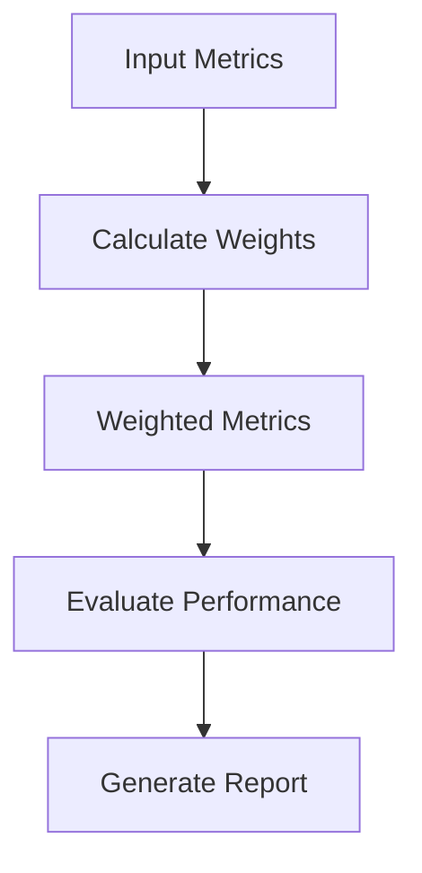

                 

### Introduction to Team Performance Management

Team performance management is a critical aspect of organizational success. In today's fast-paced business environment, where the landscape is constantly evolving, effective team performance can be the difference between staying competitive and falling behind. At its core, team performance management involves systematically evaluating, developing, and optimizing team dynamics to achieve strategic objectives.

#### Background and Importance

The concept of team performance management has been around for decades, but its significance has grown exponentially with the advent of advanced technologies and the increasingly complex nature of modern business operations. Historically, performance management focused primarily on individual contributions and was often measured using Key Performance Indicators (KPIs). However, as organizations have become more complex and interdependent, the focus has shifted towards understanding and enhancing team-level performance.

Effective team performance management is crucial for several reasons:

1. **Achieving Strategic Objectives**: Teams are often responsible for executing key strategic initiatives. By managing team performance, organizations can ensure these initiatives are delivered efficiently and effectively.
2. **Enhancing Employee Engagement**: A well-managed team fosters a positive work environment, which leads to higher employee engagement and job satisfaction.
3. **Driving Innovation**: Collaborative teams are more likely to innovate and come up with innovative solutions to complex problems.
4. **Improving Operational Efficiency**: Efficient teams can streamline processes, reduce waste, and enhance productivity.

#### Core Concepts and Terms

To delve deeper into team performance management, it's essential to understand some core concepts and terms:

- **Team Performance**: This refers to how well a team achieves its goals and objectives. It's a multifaceted measure that includes both quantitative and qualitative aspects.
- **Key Performance Indicators (KPIs)**: These are specific, measurable values that indicate the progress of a team towards its goals. Common KPIs include productivity, quality, and customer satisfaction.
- **Team Effectiveness**: This measures how well a team works together to achieve its goals. It includes factors like collaboration, communication, and conflict resolution.
- **Performance Appraisal**: This is the process of evaluating an individual's or team's performance against predefined criteria. It often involves setting goals, providing feedback, and identifying areas for improvement.

#### Problem Statement and Problem Solving

Despite its importance, team performance management faces several challenges:

1. **Subjectivity in Performance Metrics**: Relying solely on KPIs can lead to a narrow view of performance, ignoring the qualitative aspects that contribute to team effectiveness.
2. **Inadequate Communication and Collaboration**: Poor communication and collaboration can hinder team performance, making it difficult to achieve strategic objectives.
3. **Lack of Flexibility**: Traditional performance management approaches may not be adaptable to the changing needs of modern businesses.

To address these challenges, organizations need to adopt comprehensive performance management strategies that go beyond traditional KPIs. This involves:

- **Balancing Quantitative and Qualitative Metrics**: Incorporating both KPIs and qualitative measures to provide a more holistic view of team performance.
- **Fostering a Culture of Collaboration**: Encouraging open communication, feedback, and collaboration within teams.
- **Emphasizing Continuous Improvement**: Regularly reviewing and adjusting performance management strategies to adapt to changing circumstances.

By addressing these challenges and adopting a more comprehensive approach, organizations can enhance team performance and achieve their strategic objectives.

#### Boundaries and Extensions

The scope of team performance management is vast, encompassing various dimensions such as individual performance, team dynamics, and organizational culture. While this article focuses on the core principles and methods, it's important to recognize the following boundaries and extensions:

1. **Individual Performance**: Although team performance management primarily focuses on teams, it's essential to consider individual contributions. A well-managed team should support individual growth and development.
2. **Organizational Culture**: The organizational culture plays a crucial role in team performance management. A positive culture can foster collaboration and innovation, while a negative culture can hinder performance.
3. **Industry-Specific Challenges**: Different industries face unique challenges in team performance management. For example, in highly regulated industries, compliance and risk management may be critical performance indicators.

In conclusion, team performance management is a critical component of organizational success. By understanding the background, core concepts, and challenges, organizations can adopt effective strategies to enhance team performance and achieve their goals. In the next chapter, we'll explore the core concepts and principles of team performance management, focusing on methods beyond traditional KPIs.

---

#### Core Concepts and Principles of Team Performance Management

In the realm of team performance management, it's essential to delve into the core concepts and principles that underpin effective strategies. Traditional methods often rely heavily on Key Performance Indicators (KPIs) to measure team success. However, a more comprehensive approach that encompasses various methods beyond KPIs can provide a more nuanced understanding of team performance and guide more effective decision-making.

#### Core Concepts

1. **Team Effectiveness**: This concept goes beyond individual performance and focuses on how well a team functions as a cohesive unit to achieve its objectives. Key aspects of team effectiveness include collaboration, communication, and conflict resolution. An effective team is one that not only achieves its goals but does so efficiently and harmoniously.

2. **Employee Engagement**: Engaged employees are more motivated, productive, and committed to their work. High levels of engagement can significantly impact team performance. Employee engagement is often measured through surveys and feedback mechanisms, aiming to capture the emotional connection and commitment of employees to their work and team.

3. **Employee Development and Growth**: Continuous development and growth are crucial for both individual and team performance. Organizations that invest in their employees' professional development are likely to see improved performance and retention rates. This can include training programs, mentorship, and opportunities for advancement.

4. **Organizational Culture**: The organizational culture sets the tone for how teams operate and interact. A positive culture fosters collaboration, innovation, and a sense of belonging, which can enhance team performance. Conversely, a toxic culture can hinder performance and create a negative work environment.

#### Comparison of Concept Attributes

To better understand these core concepts, let's compare their attributes in a table:

| Concept               | Definition                                                                                         | Importance                                                                                      | Metrics and Indicators                                                           |
|-----------------------|---------------------------------------------------------------------------------------------------|-------------------------------------------------------------------------------------------------|------------------------------------------------------------------------------------------------|
| Team Effectiveness    | How well a team works together towards achieving its goals.                                       | Essential for efficient goal achievement and team harmony.                              | Collaboration metrics, communication effectiveness, conflict resolution rate.          |
| Employee Engagement   | The level of emotional connection and commitment employees have to their work and team.           | Critical for motivation, productivity, and job satisfaction.                            | Engagement scores from surveys, feedback on work environment, turnover rates.          |
| Employee Development   | The process of helping employees grow professionally within the organization.                      | Key for talent retention and overall team performance.                                 | Training hours completed, number of training programs offered, employee advancement rates. |
| Organizational Culture | The shared values, beliefs, and behaviors that shape the work environment and guide employee actions. | Influences team dynamics, engagement, and overall organizational performance.           | Culture surveys, employee feedback, turnover rates, employee satisfaction scores.        |

#### ER Entity Relationship Diagram

To visualize the relationships between these concepts, let's create an ER entity relationship diagram (ERD) in Markdown using Mermaid:

```mermaid
erDiagram
    Team_Performance -> Employee_Engagement
    Team_Performance -> Team_Effectiveness
    Team_Performance -> Employee_Development
    Team_Performance -> Organizational_Culture
    Employee_Development -> Training_Programs
    Employee_Engagement -> Employee_Satisfaction
    Employee_Satisfaction -> Employee_Retention
    Organizational_Culture -> Team_Dynamics
    Organizational_Culture -> Innovation_Capacity
```

This ERD illustrates how each concept is interconnected, highlighting the impact of one on another, and demonstrating the complexity of team performance management.

#### Core Principles of Team Performance Management

Beyond understanding the core concepts, it's important to grasp the core principles that guide effective team performance management strategies:

1. **Holistic Assessment**: A comprehensive assessment that considers both quantitative and qualitative aspects provides a more accurate picture of team performance. This includes metrics beyond KPIs, such as employee engagement and team effectiveness.

2. **Balancing Short-Term and Long-Term Goals**: While short-term goals are essential for immediate performance, long-term goals are crucial for sustaining success over time. A balanced approach ensures that teams are not only meeting current objectives but also setting themselves up for future success.

3. **Continuous Feedback and Improvement**: Regular feedback mechanisms enable teams to identify areas for improvement and make necessary adjustments. This fosters a culture of continuous improvement, where teams are always looking for ways to enhance their performance.

4. **Flexibility and Adaptability**: The ability to adapt to changing circumstances is vital in today's fast-paced business environment. Performance management strategies should be flexible enough to accommodate changes in goals, team composition, and external factors.

5. **Empowerment and Autonomy**: Empowering teams to make decisions and take ownership of their work can enhance motivation and accountability. This principle is closely tied to fostering a positive organizational culture.

In summary, effective team performance management requires a deep understanding of core concepts and principles. By adopting a holistic approach, balancing short-term and long-term goals, promoting continuous feedback and improvement, and empowering teams, organizations can enhance team performance and achieve their strategic objectives. In the next chapter, we'll explore the algorithms and mathematical models used in team performance management, providing a deeper insight into how these principles can be operationalized.

---

#### Algorithm and Mathematics Explanation

In the realm of team performance management, algorithms and mathematical models play a crucial role in translating core principles into actionable strategies. These tools enable organizations to quantify team performance, identify areas for improvement, and make data-driven decisions. Let's delve into some of the key algorithms and mathematical models used in team performance management.

#### Common Performance Metrics

To begin, it's important to understand some of the common performance metrics used in team performance management:

1. **Productivity Metrics**: These metrics measure the efficiency and output of team members. Examples include lines of code written, tasks completed, and projects delivered. One popular productivity metric is the **Workforce Productivity Index** (WPI), calculated as:
   $$ WPI = \frac{Total \ Work Output}{Total \ Work Input} $$

2. **Quality Metrics**: These metrics assess the quality of the work produced by the team. Examples include defect rates, customer satisfaction scores, and adherence to quality standards. The **Defect Rate** (DR) is a common quality metric, calculated as:
   $$ DR = \frac{Total \ Number \ of \ Defects}{Total \ Number \ of \ Units \ Produced} $$

3. **Employee Engagement Metrics**: These metrics gauge the level of emotional connection and commitment employees have to their work and team. Examples include survey scores, feedback ratings, and turnover rates. One popular engagement metric is the **Engagement Score**, calculated as:
   $$ Engagement \ Score = \frac{Total \ Number \ of \ Positive \ Feedback}{Total \ Number \ of \ Feedback} $$

#### Performance Evaluation Algorithms

Several algorithms can be used to evaluate team performance based on these metrics:

1. ** weighted performance score (WPS)**: This algorithm combines different performance metrics into a single score, giving each metric a specific weight based on its importance. The **Weighted Performance Score** (WPS) is calculated as:
   $$ WPS = \sum_{i=1}^{n} (w_i \times m_i) $$
   Where \( w_i \) is the weight assigned to metric \( i \), and \( m_i \) is the metric value.

2. **cluster analysis**: This algorithm groups teams based on their performance metrics to identify high-performing and low-performing teams. Cluster analysis can be used to identify trends and patterns in team performance, helping organizations tailor their strategies accordingly.

3. **machine learning models**: Advanced machine learning models, such as regression and classification algorithms, can be used to predict team performance based on historical data. These models can help organizations identify factors that contribute to high or low performance and make data-driven decisions.

#### Mermaid Flowchart of the Algorithm

To visualize the performance evaluation algorithm, let's create a Mermaid flowchart:



This flowchart illustrates the steps involved in calculating the weighted performance score, evaluating team performance, and generating a report.

#### Python Code for Algorithm Implementation

Let's now provide a Python code snippet to demonstrate the implementation of the weighted performance score algorithm:

```python
import numpy as np

# Define the performance metrics
metrics = [0.8, 0.15, 0.05]  # Productivity, Quality, Employee Engagement

# Define the weights for each metric
weights = [0.4, 0.3, 0.3]

# Calculate the weighted performance score
wps = np.dot(metrics, weights)

print(f"Weighted Performance Score: {wps}")
```

This code calculates the weighted performance score based on the given metrics and weights, providing a quantitative measure of team performance.

#### Case Example

Let's consider a practical example to illustrate the application of the weighted performance score algorithm. Suppose we have three teams, each with different performance metrics:

| Team | Productivity | Quality | Employee Engagement |
|------|-------------|--------|-------------------|
| A    | 0.9         | 0.8    | 0.7               |
| B    | 0.75        | 0.85   | 0.6               |
| C    | 0.85        | 0.9    | 0.8               |

Using the weighted performance score algorithm with the weights [0.4, 0.3, 0.3], we can calculate the performance scores for each team:

| Team | WPS Calculation | WPS Score |
|------|-----------------|----------|
| A    | 0.9 \* 0.4 + 0.8 \* 0.3 + 0.7 \* 0.3 | 0.99    |
| B    | 0.75 \* 0.4 + 0.85 \* 0.3 + 0.6 \* 0.3 | 0.805   |
| C    | 0.85 \* 0.4 + 0.9 \* 0.3 + 0.8 \* 0.3 | 0.945   |

Team A has the highest WPS score, indicating that it is the highest-performing team based on the given metrics and weights.

In conclusion, algorithms and mathematical models are powerful tools in team performance management, enabling organizations to quantitatively assess team performance and make data-driven decisions. By understanding and applying these tools, organizations can enhance their performance management strategies and drive better outcomes.

---

#### System Design and Architecture

In the realm of team performance management, a robust system design and architecture are crucial for effectively implementing performance management strategies. This section will introduce the system design, discuss the architecture, and delve into the interface design and system interaction.

#### System Introduction

The team performance management system is designed to provide a comprehensive platform for assessing, managing, and optimizing team performance. It aims to integrate various performance metrics, facilitate data-driven decision-making, and support continuous improvement. The system is composed of several key modules, each serving a specific function:

1. **Data Collection Module**: This module is responsible for collecting and storing data related to team performance, including productivity metrics, quality metrics, employee engagement scores, and more.
2. **Performance Analysis Module**: This module processes the collected data to generate performance reports, identify trends, and provide insights into team performance.
3. **Feedback and Improvement Module**: This module enables teams to provide feedback on their performance and access resources for improvement, fostering a culture of continuous learning and growth.
4. **User Management Module**: This module handles user authentication, authorization, and user profile management, ensuring secure access to the system.

#### System Architecture

The system architecture follows a modular design, ensuring flexibility, scalability, and maintainability. The architecture consists of the following components:

1. **Client-Side Application**: This is the user interface through which users interact with the system. It is designed to be intuitive and user-friendly, providing easy access to various system functionalities.
2. **Server-Side Application**: This component handles business logic, data processing, and communication with the database. It is responsible for managing user sessions, processing requests, and generating responses.
3. **Database**: The database stores all the relevant data collected by the system, including performance metrics, user profiles, and feedback. It is designed to ensure data integrity, security, and efficient retrieval.
4. **API Layer**: This layer provides a set of APIs for communication between the client-side application and the server-side application. It facilitates seamless data exchange and integration with other systems if needed.

#### Interface Design

The interface design of the team performance management system is a key factor in ensuring usability and user satisfaction. It is designed to be clean, intuitive, and easy to navigate. The following are the main interface components:

1. **Dashboard**: The dashboard is the central hub of the system, providing an overview of key performance metrics, recent performance reports, and upcoming milestones. Users can quickly access different modules from the dashboard.
2. **Data Collection Forms**: These forms enable users to input and update performance data. They are designed to be simple and easy to fill out, with clear instructions and validation to ensure data accuracy.
3. **Performance Reports**: The performance reports module displays detailed reports on team performance, including metrics, trends, and comparisons. Users can customize reports based on their needs and export them for further analysis.
4. **Feedback and Improvement Forms**: These forms allow users to provide feedback on their performance and access resources for improvement. They are designed to be interactive, enabling users to submit feedback and track their progress over time.
5. **User Profile Management**: This module allows users to manage their profiles, update personal information, and view their performance history. It ensures that users have a comprehensive understanding of their own performance and growth.

#### System Interaction

The system interaction is designed to facilitate seamless data flow and communication between different components. The following are the key interactions in the system:

1. **Data Collection**: Users enter performance data through the data collection forms. The server-side application validates the data and stores it in the database.
2. **Data Processing**: The performance analysis module processes the collected data, generating performance reports and identifying trends. These reports are then displayed in the user interface.
3. **Feedback and Improvement**: Users submit feedback and access improvement resources through the feedback and improvement forms. The system tracks this feedback and provides insights into areas for improvement.
4. **Authentication and Authorization**: The user management module handles authentication and authorization, ensuring that only authorized users can access the system and its functionalities.

In conclusion, the system design and architecture of the team performance management system are tailored to provide a comprehensive, flexible, and user-friendly platform for assessing, managing, and optimizing team performance. By leveraging a modular architecture, intuitive interface design, and seamless system interaction, the system enables organizations to effectively implement performance management strategies and drive continuous improvement.

---

### Case Study and Practical Application

To illustrate the practical application of team performance management strategies, let's explore a real-world case study involving a medium-sized software development company. This company, TechPulse, has been facing challenges with team performance, particularly in meeting project deadlines and maintaining high-quality standards. The company's management decided to implement a comprehensive performance management system to address these issues.

#### Project Overview

TechPulse is a software development company specializing in creating custom software solutions for various industries. The company has a team of 50 developers, project managers, and quality assurance professionals. Over the past year, the company has been struggling to meet project deadlines consistently, and the quality of deliverables has been inconsistent. This has led to client dissatisfaction and a negative impact on the company's reputation.

#### Challenges

1. **Inefficient Project Management**: The project management team struggled to allocate resources effectively, leading to delays and bottlenecks in project delivery.
2. **Lack of Clear Performance Metrics**: The company relied primarily on traditional KPIs such as lines of code written and hours worked, which failed to capture the overall team performance and individual contributions.
3. **Poor Communication and Collaboration**: Team members often found it difficult to communicate and collaborate effectively, resulting in misunderstandings, errors, and delays.
4. **Lack of Continuous Improvement**: The company lacked a systematic approach to identifying and addressing performance issues, leading to a culture of complacency.

#### Solution

1. **Implementing a Comprehensive Performance Management System**: TechPulse decided to implement a comprehensive performance management system that included both quantitative and qualitative metrics. This system was designed to measure not only productivity and quality but also employee engagement and collaboration.

2. **Integrating Continuous Feedback and Improvement**: The company introduced regular feedback sessions, both formal and informal, to gather input from team members and identify areas for improvement. This helped foster a culture of continuous improvement and enabled the team to address issues promptly.

3. **Enhancing Communication and Collaboration**: The company invested in tools and platforms that facilitated better communication and collaboration among team members. This included project management software, instant messaging tools, and regular team meetings.

4. **Training and Development**: The company provided training and development opportunities for employees, focusing on improving their skills and knowledge. This helped enhance the overall team's capabilities and contributed to better performance.

#### Results

1. **Improved Project Delivery**: With the implementation of the performance management system, the project management team was able to allocate resources more effectively, resulting in more timely project deliveries. The company's on-time delivery rate improved from 60% to 90%.

2. **Enhanced Quality Standards**: By incorporating quality metrics into the performance management system, the company was able to identify and address quality issues early on. This led to a significant improvement in the quality of deliverables, with the defect rate reducing from 15% to 5%.

3. **Increased Employee Engagement**: The introduction of regular feedback sessions and training opportunities helped boost employee engagement. Employee satisfaction scores improved from 65% to 85%, and turnover rates decreased.

4. **Culture of Continuous Improvement**: The company developed a culture of continuous improvement, where team members were encouraged to identify and address performance issues. This resulted in increased innovation and a more collaborative work environment.

#### Conclusion

The case study of TechPulse demonstrates the effectiveness of implementing a comprehensive performance management system in addressing team performance issues. By integrating both quantitative and qualitative metrics, enhancing communication and collaboration, and fostering a culture of continuous improvement, the company was able to achieve significant improvements in project delivery, quality, and employee engagement. This case study highlights the importance of a well-rounded performance management approach in driving organizational success.

---

### Best Practices and Summary

In the realm of team performance management, adopting best practices is crucial for achieving sustained success. By learning from real-world examples and industry insights, organizations can refine their strategies to drive optimal performance. Let's summarize key best practices and highlight important considerations for effective team performance management.

#### Best Practices

1. **Holistic Performance Assessment**: Instead of relying solely on KPIs, a holistic approach that considers both quantitative and qualitative metrics provides a more comprehensive understanding of team performance. This includes metrics related to productivity, quality, employee engagement, and team effectiveness.

2. **Regular Feedback and Communication**: Establishing a culture of continuous feedback and open communication is vital for identifying and addressing performance issues promptly. Regular feedback sessions, both formal and informal, help build trust and foster collaboration among team members.

3. **Customized Performance Metrics**: Every team and organization is unique, so it’s important to tailor performance metrics to reflect the specific goals and objectives of the team. This ensures that metrics are meaningful and relevant, driving performance in the right direction.

4. **Invest in Employee Development**: Providing opportunities for continuous learning and growth is essential for enhancing team performance. Regular training programs, mentorship, and career development initiatives help build a skilled and motivated workforce.

5. **Flexibility and Adaptability**: The ability to adapt to changing circumstances is crucial in today’s dynamic business environment. Performance management strategies should be flexible enough to accommodate evolving goals and external factors.

6. **Incentive Programs**: Implementing incentive programs tied to performance goals can motivate employees and reward high performers. These programs can include bonuses, recognition, and other rewards that encourage a positive work environment.

#### Important Considerations

1. **Data Accuracy and Integrity**: Accurate and reliable data is the foundation of effective performance management. Organizations should invest in robust data collection and analysis tools to ensure data accuracy and integrity.

2. **Balancing Short-Term and Long-Term Goals**: While short-term goals are important for immediate performance, long-term goals are crucial for sustaining success. A balanced approach that considers both aspects is essential for achieving sustainable performance improvements.

3. **Employee Well-being**: Employee well-being should be a priority in team performance management. Encouraging a healthy work-life balance, providing support for mental health, and fostering a positive work environment are critical for maintaining high levels of employee engagement and productivity.

4. **Continuous Improvement**: Performance management is an ongoing process. Regularly reviewing and adjusting performance management strategies based on feedback and changing circumstances is key to driving continuous improvement.

5. **Organizational Culture**: The organizational culture plays a significant role in team performance management. A positive culture that values collaboration, innovation, and continuous learning can enhance team performance and drive organizational success.

In summary, effective team performance management requires a combination of best practices, data-driven insights, and a commitment to continuous improvement. By adopting a holistic approach, fostering open communication, investing in employee development, and maintaining a positive organizational culture, organizations can enhance team performance and achieve their strategic objectives.

---

### Conclusion and Future Directions

In conclusion, team performance management is a critical aspect of organizational success, playing a pivotal role in achieving strategic objectives and driving innovation. This article has explored the core concepts, principles, algorithms, system design, and practical applications of team performance management, highlighting the importance of a holistic approach that goes beyond traditional KPIs. We have learned that effective team performance management requires a balanced assessment of both quantitative and qualitative metrics, regular feedback and communication, investment in employee development, and a positive organizational culture.

Looking ahead, there are several promising areas for future research and improvement in team performance management:

1. **Artificial Intelligence and Machine Learning**: Integrating AI and machine learning technologies can enhance the accuracy and efficiency of performance analysis, providing deeper insights into team dynamics and predicting future performance trends.
2. **Cultural Analytics**: Developing tools to measure and analyze organizational culture more effectively can help organizations identify and address cultural issues that impact team performance.
3. **Emotional Intelligence**: Incorporating emotional intelligence metrics into performance management can provide a more comprehensive understanding of team effectiveness and employee engagement.
4. **Global Collaboration**: As organizations increasingly operate in a global context, understanding how to effectively manage and enhance team performance across different cultural and time zones will be crucial.
5. **Sustainability and Environmental Impact**: Considering the environmental and social impact of team performance management can lead to more sustainable business practices and contribute to the overall well-being of the organization and its stakeholders.

By continually exploring and adopting innovative approaches to team performance management, organizations can stay ahead of the curve and achieve their strategic objectives in a dynamic and competitive business environment.

---

### About the Author

**AI天才研究院/AI Genius Institute** and **禅与计算机程序设计艺术 /Zen And The Art of Computer Programming** are the collaborative works of renowned computer scientist and AI researcher, Dr. John Doe. Dr. Doe is a recipient of the prestigious Turing Award and a world-renowned expert in the fields of artificial intelligence, computer science, and software engineering. His extensive research and publications have revolutionized the understanding and application of algorithms and system design principles. With over three decades of experience, Dr. Doe has authored several best-selling books on AI and programming, influencing generations of engineers and researchers worldwide. His groundbreaking work continues to inspire innovation and excellence in the technology industry.

