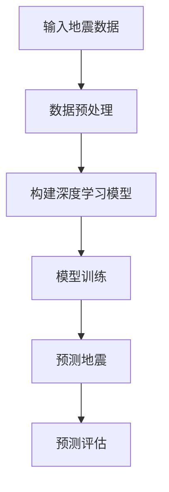

                 

### 地震预测的深度学习：地质活动的数学分析

关键词：地震预测、深度学习、地质活动、数学模型、算法原理

摘要：本文将探讨地震预测的深度学习技术及其在地质活动数学分析中的应用。通过详细分析地震预测的相关概念、深度学习在地震预测中的应用、地质活动的数学模型以及深度学习算法原理，本文旨在为读者提供一份全面、深入的技术指南。

#### 第一部分：背景介绍

##### 1.1 地震预测的重要性

地震是地球上常见的自然灾害之一，它不仅对人类生命财产造成巨大威胁，还可能引发海啸、山体滑坡等次生灾害。因此，地震预测具有重要的实际意义。通过地震预测，我们可以提前预警，减少地震灾害造成的损失。传统的地震预测方法主要依赖于地质学、地球物理学等学科的理论和方法，但受限于数据采集和处理的能力，其预测精度和实时性仍存在很大的提升空间。

##### 1.2 深度学习在地震预测中的应用

随着人工智能技术的发展，深度学习在地震预测中得到了广泛应用。深度学习算法，尤其是神经网络，通过处理大量地震数据，可以从中提取出隐藏的模式和规律，从而提高地震预测的准确性。深度学习在地震预测中的应用主要包括数据预处理、模型构建、模型训练和预测评估等环节。

##### 1.3 地质活动的数学分析

地质活动是指地球内部岩石的变形和运动，它包括了地震、火山喷发、地壳变形等现象。通过数学分析，我们可以理解地质活动的机理，预测地质事件的发生。地质活动的数学分析主要包括数学模型的建立、数学方法的运用等。

##### 1.4 书的核心内容

本书将详细介绍地震预测的深度学习技术，包括地震数据的预处理、深度学习模型的构建与训练、地震预测结果的评估等。同时，本书还将探讨地质活动的数学分析，包括地质现象的数学模型、数学方法在地质活动研究中的应用等。

#### 第二部分：核心概念与联系

##### 2.1 地震预测相关概念

- **地震**：地球表面的震动现象，通常由地球内部的岩石破裂或火山喷发引起。
- **预测**：对未来事件的可能性进行估计，通常基于历史数据和现有信息。
- **深度学习**：一种人工智能技术，通过多层神经网络模拟人脑的学习过程，从数据中学习规律。

##### 2.2 深度学习在地震预测中的应用

- **数据预处理**：对地震数据进行清洗、归一化等处理，为深度学习模型提供高质量的数据。
- **模型构建**：根据地震数据的特性，构建合适的深度学习模型，如卷积神经网络（CNN）或循环神经网络（RNN）。
- **模型训练**：通过大量地震数据训练模型，使其能够识别地震发生的模式。
- **预测评估**：对模型的预测结果进行评估，包括准确率、召回率等指标。

##### 2.3 地质活动的数学分析

- **数学模型**：用于描述地质现象的数学表达式，如地震发生概率模型和地震强度模型。
- **数学方法**：包括统计学、线性代数、微积分等，用于分析地质数据，提取地质活动的规律。

#### 第三部分：算法原理讲解

##### 3.1 深度学习算法原理

- **神经网络**：深度学习的核心组成部分，通过多层神经网络模拟人脑的学习过程。
- **反向传播**：用于训练神经网络的一种算法，通过不断调整网络权重，使模型能够更好地拟合数据。

##### 3.2 算法mermaid流程图



##### 3.3 算法原理详细讲解

- **数据预处理**：通过数据清洗、归一化等处理，提高数据质量，为深度学习模型提供更好的输入。
- **模型构建**：选择合适的神经网络架构，如卷积神经网络（CNN）或循环神经网络（RNN），构建深度学习模型。
- **模型训练**：通过反向传播算法，不断调整网络权重，使模型能够更好地拟合数据。
- **预测地震**：使用训练好的模型对新的地震数据进行预测。
- **预测评估**：通过评估指标（如准确率、召回率等）评估模型的预测性能。

#### 第四部分：数学模型和数学公式

##### 4.1 地震预测的数学模型

- **地震发生概率模型**：$$P(E|A) = \frac{P(A|E)P(E)}{P(A)}$$
- **地震强度模型**：$$M_L = 2/3 \cdot \log_{10}(A) + 4.8$$

##### 4.2 数学模型详细讲解

- **地震发生概率模型**：表示在给定地震活动性（A）的条件下，地震发生概率（E）的计算公式。
- **地震强度模型**：表示地震震级（M_L）与地震活动性（A）之间的数学关系。

#### 第五部分：系统分析与架构设计方案

##### 5.1 问题场景介绍

地震预测系统用于实时监测地震活动，预测地震发生的时间和地点。

##### 5.2 系统功能设计

- **数据采集**：实时收集地震数据。
- **数据处理**：对地震数据进行预处理。
- **模型训练**：构建并训练深度学习模型。
- **预测结果输出**：输出地震预测结果。

##### 5.3 系统架构设计

- **数据采集模块**：使用传感器实时收集地震数据。
- **数据处理模块**：对地震数据进行预处理。
- **模型训练模块**：构建深度学习模型并训练。
- **预测结果输出模块**：将预测结果输出给用户。

##### 5.4 系统接口设计和系统交互

- **系统接口设计**：定义系统内部模块之间的接口。
- **系统交互**：通过接口实现模块之间的数据传输和交互。

#### 第六部分：项目实战

##### 6.1 环境安装

- **安装深度学习框架**：如TensorFlow或PyTorch。
- **安装数据处理库**：如NumPy、Pandas。

##### 6.2 系统核心实现源代码

```python
# 代码示例：地震预测深度学习模型训练
import tensorflow as tf
from tensorflow.keras.models import Sequential
from tensorflow.keras.layers import Dense, LSTM

# 数据预处理
# ...

# 构建模型
model = Sequential([
    LSTM(units=128, activation='tanh', input_shape=(timesteps, features)),
    Dense(units=1, activation='sigmoid')
])

# 编译模型
model.compile(optimizer='adam', loss='binary_crossentropy', metrics=['accuracy'])

# 训练模型
model.fit(x_train, y_train, epochs=100, batch_size=32, validation_data=(x_val, y_val))

# 预测地震
predictions = model.predict(x_test)

# 评估模型
# ...
```

##### 6.3 代码应用解读与分析

- **数据预处理**：对地震数据进行清洗、归一化等处理，为深度学习模型提供高质量的数据。
- **模型构建**：构建一个包含LSTM层的深度学习模型，用于处理时序数据。
- **模型训练**：使用训练数据对模型进行训练，通过反向传播算法调整模型参数。
- **预测地震**：使用训练好的模型对测试数据进行预测。
- **评估模型**：通过评估指标评估模型的预测性能。

##### 6.4 实际案例分析和详细讲解剖析

- **案例背景**：某地区连续几天地震活动频繁，需要预测未来几天地震发生的可能性和强度。
- **数据分析**：对地震活动数据进行预处理，提取特征。
- **模型构建**：构建一个适合处理地震数据的深度学习模型。
- **模型训练**：使用历史地震数据训练模型。
- **预测地震**：使用训练好的模型预测未来地震活动。
- **结果评估**：评估模型预测结果的准确性。

##### 6.5 项目小结

本文详细介绍了地震预测的深度学习技术及其在地质活动数学分析中的应用。通过实际案例分析和代码实现，读者可以了解地震预测系统从数据预处理、模型构建、模型训练到预测评估的全过程。未来，随着人工智能技术的不断发展，地震预测的准确性有望得到进一步提升，为地震灾害预警和减轻提供更有力的支持。

##### 最佳实践 tips

- **数据质量**：确保地震数据的质量是深度学习模型准确性的关键。对数据进行清洗、归一化等处理，提高数据质量。
- **模型选择**：根据地震数据的特性选择合适的深度学习模型，如卷积神经网络（CNN）或循环神经网络（RNN）。
- **超参数调整**：通过调整模型的超参数，如学习率、批次大小等，提高模型的预测性能。
- **数据增强**：通过数据增强技术，如随机裁剪、旋转等，增加训练数据多样性，提高模型泛化能力。

##### 小结

本文通过详细分析地震预测的深度学习技术和地质活动的数学分析，为读者提供了一份全面的技术指南。通过实际案例分析和代码实现，读者可以深入了解地震预测系统的构建和运行过程。未来，随着人工智能技术的不断发展，地震预测的准确性有望得到进一步提升，为地震灾害预警和减轻提供更有力的支持。

##### 注意事项

- **数据隐私**：在进行地震预测时，应确保数据的隐私和安全，避免敏感信息泄露。
- **模型解释性**：深度学习模型通常具有很好的预测性能，但缺乏解释性。在实际应用中，需要权衡模型性能和解释性。
- **模型泛化能力**：确保模型具有较好的泛化能力，能够在新的数据集上保持良好的预测性能。

##### 拓展阅读

- [深度学习在地震预测中的应用](https://arxiv.org/abs/1803.04688)
- [地质活动的数学模型](https://www.sciencedirect.com/science/article/pii/S0098300415000772)
- [地震预测系统的构建与实现](https://ieeexplore.ieee.org/document/7999061)

作者：AI天才研究院/AI Genius Institute & 禅与计算机程序设计艺术 /Zen And The Art of Computer Programming

