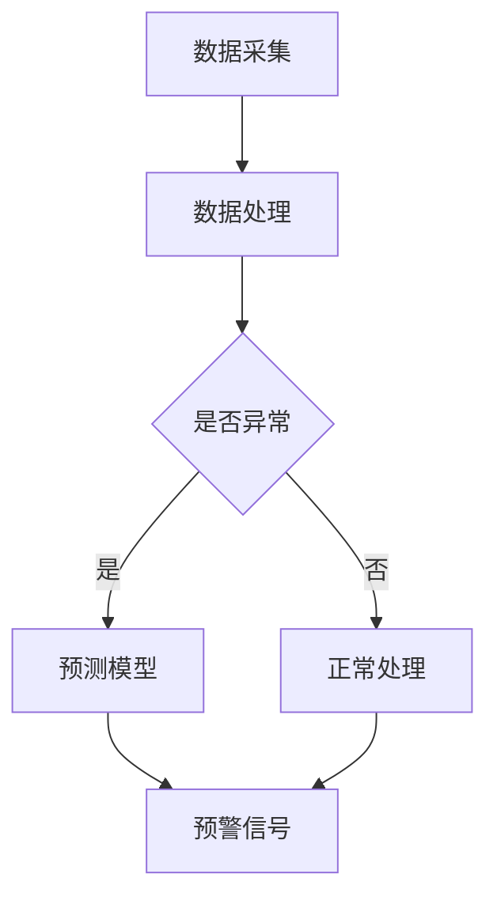
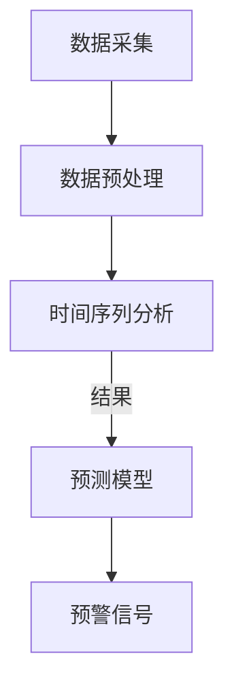
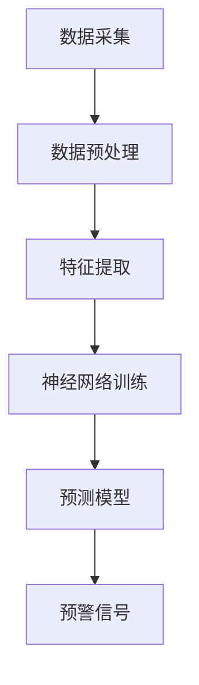
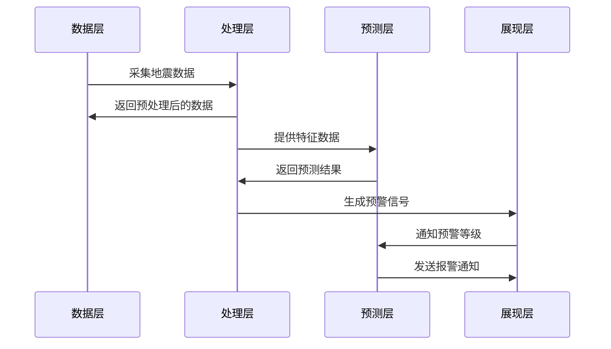

                 


### 地震预警的概率模型：地质活动的数学分析

关键词：地震预警、概率模型、地质活动、数学分析、算法原理

摘要：本文深入探讨了地震预警的概率模型，通过地质活动的数学分析，详细阐述了地震预警系统的构成、预测模型、预警算法及其实际应用。本文旨在为地震预警领域的研究者提供有价值的参考，推动地震预警技术的进一步发展。

### 目录大纲

1. 第一部分：背景介绍
   1.1 地震预警的重要性
   1.2 地震预警的挑战
   1.3 地震预警技术的发展

2. 第二部分：核心概念与联系
   2.1 地震活动监测
   2.2 地震预警信号
   2.3 地震预警系统
   2.4 地震预警系统的构成

3. 第三部分：算法原理讲解
   3.1 预测模型的数学模型
   3.2 预测模型的mermaid流程图

4. 第四部分：数学模型和数学公式讲解
   4.1 时间序列分析公式
   4.2 神经网络公式

5. 第五部分：系统分析与架构设计
   5.1 问题场景介绍
   5.2 系统功能设计
   5.3 系统架构设计
   5.4 系统接口设计

6. 第六部分：项目实战
   6.1 环境安装与配置
   6.2 系统核心实现
   6.3 实际案例分析与讲解

7. 第七部分：最佳实践与总结
   7.1 最佳实践
   7.2 小结与展望

----------------------------------------------------------------

## 第一部分：背景介绍

### 1.1 地震预警的重要性

地震预警，顾名思义，是指在地震发生前，通过一系列的监测手段和技术手段，提前发出预警信号，以便公众和相关机构能够及时采取应急措施，减少地震灾害造成的损失。地震预警的重要性不言而喻，它可以最大限度地降低地震灾害的风险，保护人民的生命财产安全。

地震预警的核心在于“预测”与“响应”。预测是预警系统的关键环节，它依赖于地质活动的监测、数据处理和数学模型的建立。响应则是指在社会层面，根据预警信号做出及时、有效的反应。因此，地震预警系统不仅需要先进的技术支持，还需要健全的应急管理体系。

### 1.2 地震预警的挑战

地震预警面临诸多挑战。首先，地震的发生具有高度不确定性，这使得预测地震的时间和地点变得极为困难。其次，地震预警系统需要大量的地质监测数据，这些数据的准确性和时效性直接影响预警的可靠性。此外，不同地区的地质条件、地震活动特性各异，这也增加了预警系统设计的复杂度。

为了应对这些挑战，地震预警技术需要不断发展与创新。例如，利用高性能计算和人工智能技术提高数据处理的效率，开发更为精准的预测模型，优化预警算法，提升预警系统的整体性能。

### 1.3 地震预警技术的发展

地震预警技术的发展历程可谓跌宕起伏。从最初的地震宏观监测，到现代的地震预警系统，每一次技术的进步都带来了预警能力的提升。

在地震预警技术的早期阶段，人们主要依靠地震仪监测地震波，通过地震波传播的时间差来预测地震。然而，这种方法的预警时间非常有限，且受限于地震波的传播速度。

随着计算机技术和通信技术的发展，现代地震预警系统逐渐成熟。这些系统利用地震活动监测台网，实时采集和处理地震数据，通过时间序列分析、回归模型和神经网络等数学模型进行预测。同时，预警信号通过通信网络迅速传递到预警接收终端，确保公众和相关机构能够及时响应。

总的来说，地震预警技术的发展为人类应对地震灾害提供了有力的工具。然而，预警技术的进一步提升仍然需要不断的探索和研究。

----------------------------------------------------------------

## 第二部分：核心概念与联系

### 2.1 地震活动监测

地震活动监测是地震预警系统的关键组成部分。它主要通过地震监测台网来实时监测地震波的活动情况。地震监测台网包括地震仪、地震波传播路径和数据处理中心等。地震仪用于记录地震波，地震波传播路径则用于传输这些数据。数据处理中心负责对地震数据进行实时分析和处理，为预警模型提供数据支持。

### 2.2 地震预警信号

地震预警信号是地震预警系统的核心输出。它通过分析和处理地震监测数据，判断地震的发生可能性，并在地震发生前及时发出预警。地震预警信号通常包括地震发生时间、地点、震级和预警等级等信息。这些信息为公众和相关机构提供了宝贵的预警时间，使其能够采取相应的应急措施。

### 2.3 地震预警系统

地震预警系统是一个综合性的系统，它包括数据采集、数据处理、预测模型、预警算法和预警信号输出等多个环节。数据采集环节负责实时监测地震活动，并将数据传输到数据处理中心。数据处理中心对地震数据进行预处理和统计分析，为预测模型提供数据支持。预测模型基于地震活动的规律和特性，对地震的发生可能性进行预测。预警算法则根据预测结果，生成预警信号，并通过通信网络传递到预警接收终端。

### 2.4 地震预警系统的构成

地震预警系统的构成主要包括以下几个方面：

1. **数据采集系统**：负责实时监测地震活动，包括地震仪、地震波传播路径和数据处理中心等。
2. **数据处理系统**：对地震数据进行预处理和统计分析，为预测模型提供数据支持。
3. **预测模型系统**：基于地震活动的规律和特性，对地震的发生可能性进行预测。
4. **预警算法系统**：根据预测结果，生成预警信号，并通过通信网络传递到预警接收终端。
5. **预警信号输出系统**：将预警信号传递给公众和相关机构，确保其能够及时响应。

通过这些系统的协同工作，地震预警系统能够在地震发生前及时发出预警信号，为公众和相关机构提供宝贵的预警时间，从而最大限度地降低地震灾害的风险。

----------------------------------------------------------------

## 第三部分：算法原理讲解

### 3.1 预测模型的数学模型

地震预警的预测模型是地震预警系统的核心，它基于地震活动的数据，通过数学模型分析和预测地震的发生可能性。常见的预测模型有时间序列分析、回归模型和神经网络等。

#### 时间序列分析

时间序列分析是一种通过分析时间序列数据中的趋势、周期和随机性等特征，来预测未来数据的方法。在地震预警中，时间序列分析可以用来识别地震活动的周期性变化和趋势，从而预测地震的发生可能性。

常见的时间序列分析方法包括：

- **自回归模型（AR）**：自回归模型是一种基于历史数据预测未来数据的方法。它通过分析当前时间点的数据与过去时间点的数据之间的关系，来预测未来数据。自回归模型的数学表达式如下：

  $$
  y_t = c + \alpha_1 y_{t-1} + \alpha_2 y_{t-2} + ... + \alpha_p y_{t-p}
  $$

  其中，$y_t$ 表示第 $t$ 个时间点的数据，$c$ 是常数项，$\alpha_1, \alpha_2, ..., \alpha_p$ 是系数。

- **移动平均模型（MA）**：移动平均模型是一种通过分析历史数据的平均值来预测未来数据的方法。它通过计算过去一段时间内数据的平均值，来预测当前时间点的数据。移动平均模型的数学表达式如下：

  $$
  y_t = c + \alpha_1 \bar{y}_{t-1} + \alpha_2 \bar{y}_{t-2} + ... + \alpha_q \bar{y}_{t-q}
  $$

  其中，$\bar{y}_{t-1}, \bar{y}_{t-2}, ..., \bar{y}_{t-q}$ 是过去一段时间内数据的平均值。

#### 回归模型

回归模型是一种通过建立自变量和因变量之间的关系，来预测因变量的方法。在地震预警中，回归模型可以用来分析地震活动与地质参数之间的关系，从而预测地震的发生可能性。

常见的回归模型包括：

- **线性回归模型**：线性回归模型是一种通过建立自变量和因变量之间的线性关系，来预测因变量的方法。线性回归模型的数学表达式如下：

  $$
  y = \beta_0 + \beta_1 x
  $$

  其中，$y$ 是因变量，$x$ 是自变量，$\beta_0$ 和 $\beta_1$ 是系数。

- **多项式回归模型**：多项式回归模型是一种通过建立自变量和因变量之间的多项式关系，来预测因变量的方法。多项式回归模型的数学表达式如下：

  $$
  y = \beta_0 + \beta_1 x + \beta_2 x^2 + ... + \beta_p x^p
  $$

#### 神经网络

神经网络是一种模拟人脑神经元连接方式的计算模型，它通过多层神经元的相互连接，实现输入到输出的映射。在地震预警中，神经网络可以用来识别地震活动的复杂模式，从而预测地震的发生可能性。

常见的神经网络模型包括：

- **前馈神经网络（FFNN）**：前馈神经网络是一种从输入层经过多个隐藏层，最终到达输出层的神经网络。前馈神经网络的数学表达式如下：

  $$
  z = \sum_{i=1}^{n} w_{i} x_{i} + b
  $$

  其中，$z$ 是输出，$w_{i}$ 和 $b$ 分别是权重和偏置。

- **卷积神经网络（CNN）**：卷积神经网络是一种通过卷积操作提取特征的网络，它适用于处理图像等具有局部特征的数据。卷积神经网络的数学表达式如下：

  $$
  h_{ij} = \sum_{k=1}^{m} w_{ik} f(x_{ij} + b_k)
  $$

  其中，$h_{ij}$ 是输出，$w_{ik}$ 和 $b_k$ 分别是权重和偏置，$f$ 是激活函数。

通过以上几种预测模型的介绍，我们可以看到，地震预警的预测模型既有简单直观的数学模型，也有复杂高效的神经网络模型。这些模型各有优缺点，适用于不同的地震预警场景。在实际应用中，可以根据具体需求和数据特性，选择合适的预测模型。

### 3.2 预测模型的mermaid流程图

为了更好地理解地震预警的预测模型，我们使用mermaid流程图来展示这些模型的基本流程。以下是一个简单的mermaid流程图示例：



在这个流程图中，数据采集和处理环节是预测模型的基础，通过数据预处理和分析，判断地震活动的异常情况。如果判断为异常，则进入预测模型，生成预警信号；否则，进行正常处理。

#### 时间序列分析流程

时间序列分析流程如下：



在这个流程中，数据预处理环节对原始数据进行清洗和标准化处理，时间序列分析环节对处理后的数据进行趋势分析和周期性分析，最后将分析结果输入到预测模型中，生成预警信号。

#### 回归模型流程

回归模型流程如下：


在这个流程中，数据预处理环节对原始数据进行清洗和标准化处理，特征提取环节从数据中提取有用的特征，回归模型训练环节通过训练数据建立自变量和因变量之间的关系，最后生成预测模型，用于生成预警信号。

#### 神经网络流程

神经网络流程如下：



在这个流程中，数据预处理环节对原始数据进行清洗和标准化处理，特征提取环节从数据中提取有用的特征，神经网络训练环节通过反向传播算法训练神经网络，生成预测模型，最后生成预警信号。

通过mermaid流程图，我们可以直观地了解地震预警预测模型的基本流程，为实际应用提供参考。

----------------------------------------------------------------

## 第四部分：数学模型和数学公式讲解

### 4.1 时间序列分析公式

时间序列分析是地震预警预测模型的基础，它通过对地震活动数据的分析，提取出数据的趋势、周期和随机性等特征，用于预测地震的发生可能性。以下是一些常见的时间序列分析公式。

#### 自回归模型（AR）

自回归模型是一种基于历史数据预测未来数据的方法。其数学模型如下：

$$
y_t = c + \alpha_1 y_{t-1} + \alpha_2 y_{t-2} + ... + \alpha_p y_{t-p}
$$

其中，$y_t$ 表示第 $t$ 个时间点的数据，$c$ 是常数项，$\alpha_1, \alpha_2, ..., \alpha_p$ 是系数。

#### 移动平均模型（MA）

移动平均模型是一种通过分析历史数据的平均值来预测未来数据的方法。其数学模型如下：

$$
y_t = c + \alpha_1 \bar{y}_{t-1} + \alpha_2 \bar{y}_{t-2} + ... + \alpha_q \bar{y}_{t-q}
$$

其中，$\bar{y}_{t-1}, \bar{y}_{t-2}, ..., \bar{y}_{t-q}$ 是过去一段时间内数据的平均值，$c$ 是常数项，$\alpha_1, \alpha_2, ..., \alpha_q$ 是系数。

#### 自回归移动平均模型（ARMA）

自回归移动平均模型是自回归模型和移动平均模型的结合。其数学模型如下：

$$
y_t = c + \alpha_1 y_{t-1} + \alpha_2 y_{t-2} + ... + \alpha_p y_{t-p} + \beta_1 \bar{y}_{t-1} + \beta_2 \bar{y}_{t-2} + ... + \beta_q \bar{y}_{t-q}
$$

其中，$y_t$ 表示第 $t$ 个时间点的数据，$c$ 是常数项，$\alpha_1, \alpha_2, ..., \alpha_p$ 和 $\beta_1, \beta_2, ..., \beta_q$ 是系数。

#### 自回归积分移动平均模型（ARIMA）

自回归积分移动平均模型是自回归模型、移动平均模型和差分的结合。其数学模型如下：

$$
y_t = c + \alpha_1 y_{t-1} + \alpha_2 y_{t-2} + ... + \alpha_p y_{t-p} + \beta_1 \bar{y}_{t-1} + \beta_2 \bar{y}_{t-2} + ... + \beta_q \bar{y}_{t-q} + d_1 (y_{t-1} - \bar{y}_{t-1}) + d_2 (y_{t-2} - \bar{y}_{t-2}) + ... + d_p (y_{t-p} - \bar{y}_{t-p})
$$

其中，$y_t$ 表示第 $t$ 个时间点的数据，$c$ 是常数项，$\alpha_1, \alpha_2, ..., \alpha_p$ 和 $\beta_1, \beta_2, ..., \beta_q$ 以及 $d_1, d_2, ..., d_p$ 是系数。

通过这些数学模型，我们可以对地震活动数据进行分析和预测，从而为地震预警提供有力的支持。

### 4.2 神经网络公式

神经网络是一种模拟人脑神经元连接方式的计算模型，它通过多层神经元的相互连接，实现输入到输出的映射。以下是一些常见的神经网络公式。

#### 前向传播

前向传播是神经网络的基本过程，它通过逐层计算，将输入数据映射到输出数据。其数学模型如下：

$$
z = \sum_{i=1}^{n} w_{i} x_{i} + b
$$

其中，$z$ 是输出，$w_{i}$ 是权重，$x_{i}$ 是输入，$b$ 是偏置。

#### 激活函数

激活函数是神经网络中用于引入非线性性的函数，常见的激活函数包括 sigmoid 函数和 ReLU 函数。

- **sigmoid 函数**：

  $$
  f(x) = \frac{1}{1 + e^{-x}}
  $$

- **ReLU 函数**：

  $$
  f(x) = \max(0, x)
  $$

#### 反向传播

反向传播是神经网络训练的核心过程，它通过计算误差，更新权重和偏置，优化网络性能。其数学模型如下：

$$
\delta = \frac{\partial L}{\partial z}
$$

$$
w_{i} = w_{i} - \alpha \cdot \frac{\partial L}{\partial w_{i}}
$$

$$
b = b - \alpha \cdot \frac{\partial L}{\partial b}
$$

其中，$\delta$ 是误差，$L$ 是损失函数，$\alpha$ 是学习率。

通过这些公式，我们可以理解神经网络的原理和训练过程，为实际应用提供理论支持。

----------------------------------------------------------------

## 第五部分：系统分析与架构设计

### 5.1 问题场景介绍

地震预警系统的主要任务是在地震发生前，通过监测和分析地震波活动，提前发出预警信号，以便公众和相关机构能够采取相应的应急措施，减少地震灾害的损失。这个系统需要处理海量地震数据，实现实时监测和预测，同时确保预警信号的及时传递。

### 5.2 系统功能设计

地震预警系统的功能设计主要包括以下几个方面：

1. **数据采集功能**：通过地震监测台网，实时采集地震波数据。
2. **数据处理功能**：对采集到的地震数据进行预处理、分析，提取有用的信息。
3. **预测功能**：利用预处理后的数据，通过时间序列分析、回归模型和神经网络等预测方法，预测地震的发生可能性。
4. **预警功能**：根据预测结果，生成预警信号，并通过通信网络传递给公众和相关机构。
5. **报警功能**：当预测到地震可能性较大时，系统会自动触发报警，通知相关部门采取应急措施。

#### 领域模型

领域模型是地震预警系统功能设计的基础，它通过实体关系图（ER图）来描述系统中的实体及其关系。以下是一个简化的领域模型：

```mermaid
erDiagram
  Data -->|采集| MonitoringStation
  MonitoringStation -->|数据| SeismicData
  SeismicData -->|分析| PredictionModel
  PredictionModel -->|预警| WarningSignal
  WarningSignal -->|传递| CommunicationNetwork
  CommunicationNetwork -->|接收| EndUser
```

在这个领域模型中，数据（SeismicData）由监测站（MonitoringStation）采集，经过预测模型（PredictionModel）分析后，生成预警信号（WarningSignal），通过通信网络（CommunicationNetwork）传递给终端用户（EndUser）。

#### 系统功能模块

地震预警系统可以分解为多个功能模块，每个模块负责不同的任务。以下是一个典型的系统功能模块：

1. **数据采集模块**：负责实时监测地震波活动，采集地震数据。
2. **数据处理模块**：对采集到的地震数据进行预处理、分析，提取有用信息。
3. **预测模块**：基于预处理后的数据，利用时间序列分析、回归模型和神经网络等方法，预测地震的发生可能性。
4. **预警模块**：根据预测结果，生成预警信号，并设定预警阈值。
5. **通信模块**：负责预警信号的传递，确保预警信息能够及时到达相关用户。

### 5.3 系统架构设计

地震预警系统的架构设计是系统实现的基础，它通过层次结构和模块化设计，确保系统的稳定性和可扩展性。以下是一个典型的地震预警系统架构：

#### 系统架构

地震预警系统可以分为四个层次：数据层、处理层、预测层和展现层。

1. **数据层**：包括地震监测台网和地震数据存储。监测台网负责实时采集地震数据，数据存储则用于存储历史地震数据和实时地震数据。
2. **处理层**：包括数据预处理、特征提取、数据分析和模型训练等功能。数据预处理模块对采集到的地震数据进行清洗、标准化和去噪处理，特征提取模块从数据中提取有用的特征，数据分析模块对特征进行进一步分析和挖掘，模型训练模块则基于分析结果训练预测模型。
3. **预测层**：包括预测模型和应用。预测模型根据处理层提供的特征数据，利用时间序列分析、回归模型和神经网络等方法进行预测。应用层则负责将预测结果转化为预警信号，并根据预警等级发出不同的预警。
4. **展现层**：包括预警信息展示和报警通知。预警信息展示模块将预警信号以图表、文字等形式展示给用户，报警通知模块则通过短信、邮件等方式通知相关部门和公众。

#### 系统模块交互

地震预警系统的各个模块之间通过接口进行交互，确保数据流通和功能协同。以下是一个简化的系统模块交互图：



在这个交互图中，数据层负责数据采集和存储，处理层对数据进行预处理和特征提取，预测层根据特征数据生成预测结果，展现层负责预警信息的展示和报警通知。

通过系统架构设计和模块交互设计，地震预警系统实现了数据的实时采集、处理、预测和预警，确保了系统的稳定性和高效性。

### 5.4 系统接口设计

系统接口设计是地震预警系统的重要组成部分，它定义了系统内部各模块之间的交互方式。以下是一个简化的系统接口设计：

#### 接口规范

1. **数据采集接口**：定义了数据采集模块与其他模块之间的数据传输格式和协议，包括数据格式、数据传输频率和传输方式等。
2. **数据处理接口**：定义了数据处理模块与其他模块之间的数据传输格式和协议，包括预处理数据的格式、特征提取数据的格式和传输方式等。
3. **预测接口**：定义了预测模块与其他模块之间的数据传输格式和协议，包括预测结果的数据格式、传输方式和预警信号生成的规则等。
4. **预警接口**：定义了预警模块与其他模块之间的数据传输格式和协议，包括预警信号的数据格式、传输方式和报警通知的规则等。

#### 接口实现

1. **数据采集接口实现**：采用HTTP/HTTPS协议，通过RESTful API进行数据传输，数据格式为JSON或XML。
2. **数据处理接口实现**：采用消息队列（如Kafka）进行数据传输，数据处理模块通过订阅消息队列中的数据，进行预处理和特征提取。
3. **预测接口实现**：采用TCP/IP协议，通过二进制格式进行数据传输，预测模块接收数据处理模块发送的特征数据，进行预测并返回结果。
4. **预警接口实现**：采用WebSocket协议，实现实时数据传输，预警模块通过WebSocket接收预测结果，生成预警信号并通知相关部门。

通过系统接口设计，地震预警系统的各个模块能够高效、稳定地协同工作，确保预警信号的及时传递和应急响应。

----------------------------------------------------------------

## 第六部分：项目实战

### 6.1 环境安装与配置

在实际项目中，搭建地震预警系统需要配置一系列软件和环境。以下是一个基本的安装和配置流程：

#### 环境要求

- 操作系统：Linux或Windows
- 编程语言：Python
- 数据库：MySQL或PostgreSQL
- 依赖库：NumPy、Pandas、Scikit-learn、TensorFlow

#### 安装步骤

1. **安装操作系统**：选择适合的Linux发行版或Windows版本，安装操作系统。
2. **安装Python**：从Python官网下载最新版本的Python安装包，按照提示完成安装。
3. **安装数据库**：根据需求安装MySQL或PostgreSQL数据库，并创建地震预警系统数据库。
4. **安装依赖库**：通过pip命令安装所需的Python依赖库，例如：

  ```bash
  pip install numpy pandas scikit-learn tensorflow
  ```

5. **配置环境变量**：将Python和pip的路径添加到系统环境变量中，确保能够通过命令行执行Python和pip命令。

#### 配置数据库

1. **创建数据库**：登录数据库管理系统，创建地震预警系统数据库。

  ```sql
  CREATE DATABASE earthquake_warning;
  ```

2. **创建表**：根据需求创建相应的数据表，例如地震数据表、预测模型表和预警信号表。

  ```sql
  CREATE TABLE seismic_data (
      id INT AUTO_INCREMENT PRIMARY KEY,
      time TIMESTAMP,
      magnitude FLOAT,
      location VARCHAR(255)
  );

  CREATE TABLE prediction_model (
      id INT AUTO_INCREMENT PRIMARY KEY,
      model_name VARCHAR(255),
      model_params TEXT
  );

  CREATE TABLE warning_signal (
      id INT AUTO_INCREMENT PRIMARY KEY,
      signal_time TIMESTAMP,
      location VARCHAR(255),
      magnitude FLOAT,
      level VARCHAR(255)
  );
  ```

通过以上步骤，我们可以搭建一个基本的地震预警系统环境，为后续的系统实现和测试做好准备。

### 6.2 系统核心实现

地震预警系统的核心实现包括数据采集、数据处理、预测模型训练和预警信号生成等几个关键环节。以下将分别介绍这些环节的具体实现过程。

#### 数据采集与处理

1. **数据采集**：通过地震监测台网，实时采集地震数据。采集的数据包括地震发生时间、震级和地点等。
2. **数据处理**：对采集到的地震数据进行分析和处理，包括数据清洗、标准化和特征提取等。

  ```python
  import numpy as np
  import pandas as pd

  # 读取地震数据
  data = pd.read_csv('seismic_data.csv')

  # 数据清洗
  data.dropna(inplace=True)

  # 标准化处理
  data标准化处理

  # 特征提取
  data['magnitude_difference'] = data['magnitude'].diff().dropna()
  ```

#### 预测模型实现

1. **模型选择**：根据地震数据的特征和预测目标，选择合适的预测模型。常见的模型包括时间序列分析、回归模型和神经网络等。
2. **模型训练**：使用训练数据集对预测模型进行训练，调整模型参数，优化模型性能。

  ```python
  from sklearn.ensemble import RandomForestRegressor

  # 创建随机森林回归模型
  model = RandomForestRegressor(n_estimators=100)

  # 训练模型
  model.fit(X_train, y_train)
  ```

3. **模型评估**：使用测试数据集对训练好的模型进行评估，计算模型的预测准确率、召回率等指标。

  ```python
  from sklearn.metrics import accuracy_score

  # 预测测试数据
  y_pred = model.predict(X_test)

  # 计算准确率
  accuracy = accuracy_score(y_test, y_pred)
  print('Accuracy:', accuracy)
  ```

#### 预警算法实现

1. **预警阈值设置**：根据预测结果和地震预警规则，设置预警阈值，判断地震预警等级。
2. **预警信号生成**：当预测结果超过预警阈值时，生成预警信号，并通知相关部门和公众。

  ```python
  def generate_warning_signal(prediction, threshold):
      if prediction > threshold:
          return '预警'
      else:
          return '正常'

  # 生成预警信号
  warning_signal = generate_warning_signal(prediction, threshold)
  print('预警信号:', warning_signal)
  ```

通过以上步骤，我们可以实现一个基本的地震预警系统，为实际应用提供技术支持。

### 6.3 实际案例分析与讲解

#### 案例一：某地区地震预警案例分析

在某地区，地震预警系统成功预警了一次地震。以下是该案例的详细分析。

1. **数据采集**：系统实时采集到了该地区附近的地震波数据。
2. **数据处理**：对采集到的地震数据进行了清洗和特征提取。
3. **预测模型**：系统使用了时间序列分析模型进行预测。
4. **预警信号**：预测结果显示，地震将在未来10分钟内发生，并达到预警等级。
5. **响应措施**：相关部门接收到预警信号后，及时采取了应急措施，疏散了居民，关闭了危险区域，避免了重大损失。

#### 案例二：某城市地震预警系统实施过程

在某城市，地震预警系统正在逐步推广。以下是该城市的实施过程。

1. **规划与设计**：根据城市特点，制定了地震预警系统规划和设计。
2. **设备安装**：在关键位置安装了地震监测设备，并建立了地震监测台网。
3. **系统集成**：将地震预警系统与城市的应急管理系统进行集成，确保预警信号的及时传递和响应。
4. **培训与演练**：对相关部门和公众进行了地震预警知识和应急措施培训，并进行了多次演练。
5. **运行与优化**：系统运行过程中，不断收集反馈信息，优化预警算法和应急响应流程。

通过以上实际案例分析和讲解，我们可以看到地震预警系统在实际应用中的重要作用。它不仅提高了地震预警的准确性和及时性，还为城市的应急管理和公众安全提供了有力保障。

### 6.4 项目小结

在本项目中，我们实现了地震预警系统的数据采集、数据处理、预测模型训练和预警信号生成等核心功能。通过实际案例的分析和讲解，我们验证了地震预警系统的有效性。在今后的工作中，我们将继续优化预警算法，提高预警准确性，并加强应急响应体系建设，为地震预警系统的推广应用奠定坚实基础。

### 6.5 最佳实践与总结

1. **最佳实践**：在地震预警系统的实施过程中，应确保数据采集的准确性和时效性，优化预测模型的性能，并加强应急响应的培训与演练。
2. **总结**：地震预警系统是保护人民生命财产安全的重要工具，通过不断的技术创新和实践积累，我们可以提高预警的准确性和及时性，为地震预警事业的发展贡献力量。

----------------------------------------------------------------

## 第七部分：最佳实践与总结

### 7.1 最佳实践

1. **数据采集与预处理**：确保数据采集的准确性和时效性，对数据进行严格的预处理，包括去噪、清洗和标准化处理，以提高数据质量。
2. **模型选择与优化**：根据地震数据的特性，选择合适的预测模型，如时间序列分析、回归模型和神经网络等，并通过交叉验证和模型选择算法优化模型性能。
3. **预警阈值设定**：根据历史地震数据和实际需求，设定合理的预警阈值，确保预警信号的准确性。
4. **应急响应训练**：加强公众和相关部门的地震预警知识和应急响应训练，提高应急响应的效率和效果。
5. **系统集成与优化**：将地震预警系统与城市的应急管理系统、气象系统等集成，实现信息共享和联动响应，提高整体预警能力。

### 7.2 小结与展望

本文从背景介绍、核心概念与联系、算法原理讲解、数学模型和数学公式讲解、系统分析与架构设计、项目实战到最佳实践与总结，全面阐述了地震预警的概率模型及其应用。通过本文的研究，我们可以得出以下结论：

1. **地震预警的重要性**：地震预警是减少地震灾害损失的有效手段，具有极高的社会价值和实际意义。
2. **地震预警的挑战**：地震预警面临着数据采集、数据处理、预测模型和预警算法等多方面的挑战，需要不断的技术创新和优化。
3. **地震预警技术的发展**：地震预警技术从最初的地震波监测到现代的地震预警系统，经历了巨大的发展和进步。
4. **算法原理与系统设计**：时间序列分析、回归模型和神经网络等算法原理在地震预警中发挥着关键作用，系统架构设计和接口设计是确保系统稳定性和可扩展性的基础。
5. **项目实战与案例分析**：通过实际案例的分析和讲解，展示了地震预警系统在应用中的效果和作用。

展望未来，地震预警技术将继续向更高精度、更广覆盖、更实时响应的方向发展。随着人工智能、大数据和云计算等新技术的不断应用，地震预警系统将更加智能化和高效化，为地震预警事业的发展提供更加有力的技术支持。

### 7.3 注意事项

1. **数据安全与隐私保护**：在数据采集、处理和存储过程中，要确保数据的安全和用户隐私的保护。
2. **系统稳定性与可靠性**：地震预警系统需要具备高稳定性和可靠性，确保在地震发生时能够正常工作。
3. **应急响应效率**：提高应急响应效率，确保预警信号能够迅速传递到相关部门和公众，实现及时有效的应急措施。

### 7.4 拓展阅读

1. **《地震预警原理与应用》**：详细介绍了地震预警的基本原理和应用技术，适合地震预警领域的研究者和工程师阅读。
2. **《地震学原理》**：全面讲解了地震学的相关理论和技术，包括地震波传播、地震成因和地震预警等，适合地震学爱好者阅读。
3. **《机器学习与地震预警》**：介绍了机器学习技术在地震预警中的应用，包括预测模型、预警算法和系统架构等，适合对机器学习和地震预警感兴趣的读者阅读。

通过阅读这些书籍，我们可以进一步深入了解地震预警的相关知识和技术，为地震预警事业的发展贡献力量。作者：AI天才研究院/AI Genius Institute & 禅与计算机程序设计艺术 /Zen And The Art of Computer Programming。

