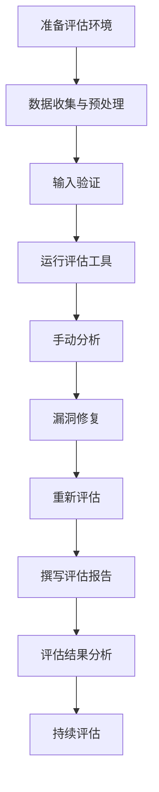
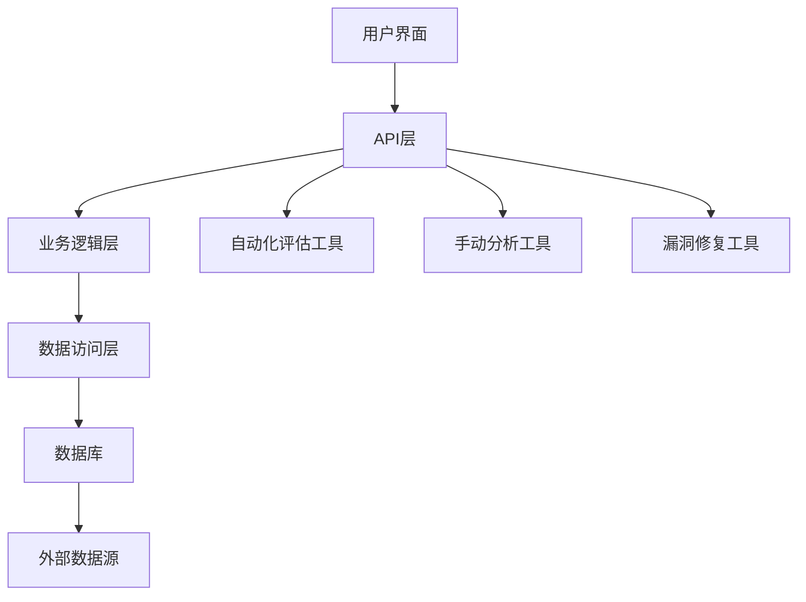
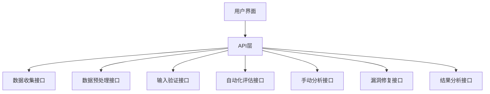
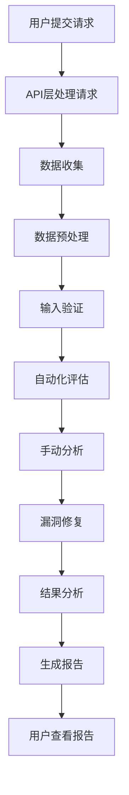

                 


### 1.1.1 人工智能与LLM的快速发展

人工智能（AI）作为当今科技领域的重要研究方向，近年来得到了飞速的发展。特别是在深度学习和自然语言处理（NLP）技术的推动下，大型语言模型（LLM）取得了显著的进步。LLM作为一种能够理解和生成自然语言的高级AI模型，其应用领域已经从最初的机器翻译、问答系统扩展到了文本生成、摘要提取、对话系统等。

Anthropic Claude 2 是由 Anthropic 开发的一款先进的大型语言模型。Claude 2不仅在模型规模和参数数量上超越了以往的模型，还在文本生成质量和上下文理解能力上有了显著提升。这使得 Claude 2 成为学术界和工业界研究的热点之一，被广泛应用于各种实际场景中。

随着 LLM 在各个领域的广泛应用，其安全性问题也逐渐凸显出来。由于 LLM 的复杂性和规模庞大，其可能存在的安全漏洞和攻击手段也日益多样化。这些安全威胁不仅可能导致数据泄漏、模型篡改，还可能被恶意利用，对用户和社会造成严重的影响。因此，对 LLM 进行安全性评估具有重要意义。

### 1.1.2 LLM在各个领域的应用

LLM 在各个领域的应用已经取得了显著的成果，下面我们简要介绍几个主要的应用场景。

#### 文本生成与摘要

文本生成和摘要是最早且应用最广泛的 LLM 应用场景之一。通过 LLM，可以生成高质量的文章、新闻、报告等。同时，摘要提取技术也使得用户能够快速获取文档的核心信息。

#### 问答系统

问答系统利用 LLM 的上下文理解能力，可以回答用户提出的问题，提供准确、自然的回答。这类系统在搜索引擎、客服系统、智能助手等领域得到了广泛应用。

#### 对话系统

对话系统能够与用户进行自然语言交互，模拟人类的对话方式。这些建立在 LLM 之上的对话系统能够提供更加友好、自然的用户体验。

#### 机器翻译

LLM 在机器翻译领域也取得了显著的成果。通过训练大规模的翻译模型，可以提供更准确、流畅的翻译结果，大大提高了翻译效率。

#### 文本分类与情感分析

LLM 可以用于文本分类和情感分析，对文本数据进行分析，提取关键信息，辅助决策。这在金融、医疗、舆情分析等领域有广泛的应用。

#### 其他领域

除了上述领域，LLM 在创意写作、内容审核、教育辅导等新兴领域也展现出了巨大的潜力。

### 1.1.3 LLM安全性问题的出现

随着 LLM 在各个领域的广泛应用，其安全性问题也逐渐显现出来。以下是几个主要的安全性问题：

#### 模型泄漏

模型泄漏指的是 LLM 的内部参数和结构被未授权访问或泄露。这可能导致攻击者获取敏感信息，甚至篡改模型输出。

#### 模型篡改

模型篡改是指攻击者通过恶意输入数据，对 LLM 的输出进行控制。这可能导致模型产生错误的结果，影响系统的正常运行。

#### 代码注入

代码注入是指攻击者将恶意代码注入到 LLM 的输入中，导致模型执行未经授权的操作。这可能导致系统出现安全漏洞，甚至被攻击者控制。

#### 恶意利用

恶意利用是指攻击者利用 LLM 的漏洞进行恶意攻击，如制造谣言、传播虚假信息等。这可能导致社会恐慌、财产损失等严重后果。

### 1.1.4 安全评估的需求与挑战

对 LLM 进行安全性评估的需求主要来自于以下几个方面：

#### 确保数据安全和隐私

随着 LLM 在各个领域的应用，其处理的数据量日益庞大，包含大量的敏感信息。确保这些数据的安全和隐私至关重要。

#### 提高系统可靠性

LLM 的安全漏洞可能导致系统崩溃、数据泄漏等，影响系统的可靠性。通过安全性评估，可以及时发现并修复这些问题，提高系统的稳定性。

#### 遵守法律法规

许多国家和组织对 LLM 的安全性有明确的要求和规定。进行安全性评估可以帮助组织符合相关法律法规，避免法律风险。

然而，对 LLM 进行安全性评估也面临着一些挑战：

#### 模型复杂性

LLM 模型具有极高的复杂度，包含大量的参数和层次结构。这使得评估过程复杂，难以全面分析模型的安全问题。

#### 漏洞多样性

LLM 可能存在的安全漏洞类型多样，如输入验证不足、权限控制漏洞、数据泄漏等。评估方法需要适应不同类型的漏洞。

#### 实时性

随着 LLM 的实时应用，安全性评估需要在较短的时间内完成。这要求评估方法高效，能够快速识别和修复漏洞。

### 1.1.5 研究目的与内容概述

本文旨在对 Anthropic Claude 2 的 LLM 进行安全性评估，以期为 LLM 的安全应用提供参考。具体研究目的如下：

#### 建立评估框架

构建一个系统化的评估框架，涵盖 LLM 的各个方面，包括模型结构、输入验证、权限控制等。

#### 分析安全威胁

深入分析 Claude 2 可能面临的安全威胁，包括模型泄漏、模型篡改、代码注入等。

#### 提供评估方法

提供多种评估方法，包括自动化评估和手动评估，以适应不同的评估需求和场景。

#### 评估指标设计

设计一套科学、全面的评估指标，用于评估 LLM 的安全性。

#### 实际案例分析

通过实际案例，验证评估方法的有效性，并提出改进建议。

### 1.1.6 结构安排

本文结构安排如下：

1. **引言**：介绍研究背景、研究目的和结构安排。
2. **LLM基础理论**：介绍 LLM 的基本原理和安全性威胁类型。
3. **评估框架与流程**：构建评估框架，设计评估流程。
4. **算法原理讲解**：详细讲解评估算法的原理和实现。
5. **系统分析与架构设计方案**：分析评估系统的应用场景，设计系统架构。
6. **项目实战**：实现评估系统，分析实际案例。
7. **最佳实践 tips**、**小结**、**注意事项**、**拓展阅读**：总结评估经验，提出改进建议。

### 1.1.7 关键词

本文关键词：Anthropic Claude 2、LLM、安全性评估、模型泄漏、模型篡改、代码注入、评估框架、评估方法、评估指标。

### 1.1.8 摘要

本文针对 Anthropic Claude 2 的 LLM 进行安全性评估，构建了系统化的评估框架，分析了可能的安全威胁，提出了多种评估方法，并设计了评估指标。通过实际案例验证了评估方法的有效性，为 LLM 的安全应用提供了参考。

----------------------------------------------------------------

### 第二部分：LLM基础理论

#### 2.1 LLM的基本原理

大型语言模型（LLM）是自然语言处理（NLP）领域的一种重要模型，其核心目标是理解和使用人类语言。LLM 的基本原理基于深度学习和神经网络技术，其训练和优化过程如下：

##### 2.1.1 语言模型概述

语言模型是一种用于预测下一个单词或词组的概率分布的模型。在训练阶段，语言模型会通过大量文本数据学习单词和句子之间的概率关系。在生成阶段，模型根据已学到的概率关系生成新的文本。

##### 2.1.2 Claude 2模型架构

Anthropic Claude 2 是一款基于深度学习的大型语言模型，其架构包括以下几个关键部分：

1. **嵌入层（Embedding Layer）**：将单词转换为向量表示。
2. **编码器（Encoder）**：对输入文本进行编码，提取语义信息。
3. **解码器（Decoder）**：根据编码器的输出生成文本。

##### 2.1.3 语言模型的训练与优化

语言模型的训练过程是一个迭代优化过程。模型会通过大量文本数据进行训练，不断调整模型参数，以最小化损失函数。在训练过程中，模型会学习到单词和句子之间的概率关系，从而能够生成高质量的文本。

#### 2.2 LLM的安全威胁类型

随着 LLM 在各个领域的广泛应用，其可能面临的安全威胁也逐渐增多。以下是几种主要的安全威胁类型：

##### 2.2.1 模型泄漏

模型泄漏是指未经授权的用户或系统获得了 LLM 的内部参数和结构。这可能导致敏感信息泄露，甚至模型被篡改。模型泄漏的风险主要来自于数据存储和传输过程中的安全漏洞。

##### 2.2.2 模型篡改

模型篡改是指攻击者通过恶意输入数据，对 LLM 的输出进行控制。这可能导致模型产生错误的结果，影响系统的正常运行。模型篡改的风险主要来自于输入验证不足和权限控制漏洞。

##### 2.2.3 代码注入

代码注入是指攻击者将恶意代码注入到 LLM 的输入中，导致模型执行未经授权的操作。这可能导致系统出现安全漏洞，甚至被攻击者控制。代码注入的风险主要来自于输入验证不足和代码执行控制不足。

##### 2.2.4 恶意利用

恶意利用是指攻击者利用 LLM 的漏洞进行恶意攻击，如制造谣言、传播虚假信息等。这可能导致社会恐慌、财产损失等严重后果。恶意利用的风险主要来自于 LLM 的漏洞和攻击者的恶意意图。

#### 2.3 安全评估方法概述

对 LLM 进行安全性评估是确保其安全应用的重要手段。以下介绍几种常见的评估方法：

##### 2.3.1 自动化评估方法

自动化评估方法通过编写脚本或使用现有的自动化工具对 LLM 进行评估。这种方法具有较高的效率，但可能无法全面覆盖所有的安全威胁。

1. **静态分析**：通过对 LLM 的源代码进行静态分析，查找潜在的安全漏洞。
2. **动态分析**：在 LLM 运行过程中进行动态分析，监控其行为和输出，查找异常情况。
3. **模糊测试**：通过生成大量的随机输入，检测 LLM 的异常行为和漏洞。

##### 2.3.2 手动评估方法

手动评估方法需要人工分析 LLM 的设计和实现，查找潜在的安全漏洞。这种方法较为耗时，但可以更全面地发现安全威胁。

1. **代码审查**：对 LLM 的源代码进行审查，查找潜在的安全漏洞。
2. **安全测试**：通过人工模拟攻击场景，检测 LLM 的安全性能。
3. **安全审计**：对 LLM 的设计和实现进行审计，评估其安全性。

##### 2.3.3 评估方法的选择与适用场景

选择合适的评估方法取决于评估的目标、资源和时间。以下是一些常见的评估方法选择和适用场景：

1. **自动化评估方法**：适用于大规模的 LLM 评估，可快速发现常见的安全漏洞。
2. **手动评估方法**：适用于需要深入了解 LLM 安全性的情况，适用于评估复杂的安全威胁。
3. **结合使用**：将自动化评估方法和手动评估方法结合使用，可以更全面地评估 LLM 的安全性。

----------------------------------------------------------------

### 第三部分：评估框架与流程

#### 3.1 评估框架构建

为了对Anthropic Claude 2的LLM进行有效评估，我们需要构建一个系统化的评估框架。这个框架应该能够覆盖 LLM 的各个方面，包括模型结构、输入验证、权限控制等。

##### 3.1.1 评估框架设计原则

在设计评估框架时，应遵循以下原则：

1. **全面性**：确保评估框架能够涵盖所有可能的安全威胁和漏洞。
2. **可扩展性**：框架应该能够适应不同的 LLM 模型和评估需求。
3. **灵活性**：评估框架应能够根据实际情况进行调整和优化。

##### 3.1.2 评估框架组成部分

评估框架主要由以下几个部分组成：

1. **评估指标**：定义评估 LLM 安全性的指标，如漏洞数量、修复率等。
2. **评估方法**：选择合适的评估方法，包括自动化评估和手动评估。
3. **评估流程**：设计评估流程，确保评估的有序和高效。

##### 3.1.3 评估流程设计

评估流程通常包括以下几个步骤：

1. **准备阶段**：准备评估所需的工具和资源，包括测试数据、自动化工具等。
2. **评估阶段**：根据评估框架进行评估，包括静态分析和动态分析。
3. **结果分析阶段**：对评估结果进行分析，识别潜在的安全威胁和漏洞。
4. **修复阶段**：根据分析结果，修复发现的安全漏洞，并进行重新评估。
5. **报告阶段**：撰写评估报告，总结评估结果和改进建议。

#### 3.2 数据收集与预处理

在评估过程中，数据的收集和预处理是至关重要的一步。以下是数据收集和预处理的关键步骤：

##### 3.2.1 数据来源

数据来源可以分为以下几类：

1. **公开数据集**：如语料库、测试集等。
2. **内部数据**：包括内部使用的文本数据、日志数据等。
3. **攻击数据**：包括已知攻击样本、恶意代码等。

##### 3.2.2 数据预处理

数据预处理主要包括以下步骤：

1. **数据清洗**：去除无效、重复和错误的数据。
2. **数据标准化**：将数据格式统一，如编码、分词等。
3. **数据增强**：通过增加样本数量、引入噪声等方式，提高评估的鲁棒性。

##### 3.2.3 数据存储与管理

数据存储与管理应遵循以下原则：

1. **安全性**：确保数据在存储和传输过程中的安全性。
2. **可靠性**：确保数据的一致性和可靠性。
3. **可扩展性**：支持大规模数据的存储和管理。

#### 3.3 输入验证

输入验证是确保 LLM 安全性的重要手段。以下是输入验证的关键步骤：

##### 3.3.1 输入限制

对输入数据进行限制，包括长度、格式、类型等，以防止恶意输入。

##### 3.3.2 数据清洗

对输入数据进行清洗，去除潜在的恶意代码和恶意数据。

##### 3.3.3 验证码

引入验证码机制，防止恶意攻击。

##### 3.3.4 防止注入攻击

通过防止 SQL 注入、XSS 攻击等，确保 LLM 的输入安全。

#### 3.4 权限控制

权限控制是确保 LLM 正确运行的重要措施。以下是权限控制的关键步骤：

##### 3.4.1 用户身份验证

对用户进行身份验证，确保只有授权用户可以访问 LLM。

##### 3.4.2 权限分配

根据用户角色和职责，分配相应的权限。

##### 3.4.3 访问控制

通过访问控制策略，限制用户对 LLM 的访问权限。

##### 3.4.4 日志记录

记录用户对 LLM 的所有操作，以便在出现问题时进行追踪和分析。

#### 3.5 评估指标

评估指标是衡量 LLM 安全性的重要标准。以下是常用的评估指标：

##### 3.5.1 漏洞数量

漏洞数量是衡量安全漏洞总数量的指标。

##### 3.5.2 修复率

修复率是衡量发现漏洞后修复率的指标。

##### 3.5.3 安全性能

安全性能是衡量 LLM 在面对安全威胁时的抵抗能力的指标。

##### 3.5.4 用户满意度

用户满意度是衡量用户对 LLM 安全性的主观评价的指标。

#### 3.6 评估流程

评估流程是确保 LLM 安全性的关键环节。以下是评估流程的关键步骤：

##### 3.6.1 准备评估环境

准备评估所需的硬件、软件和网络环境。

##### 3.6.2 收集测试数据

收集用于测试的文本数据，包括正常数据和恶意数据。

##### 3.6.3 运行评估工具

运行自动化评估工具，对 LLM 进行静态和动态分析。

##### 3.6.4 手动分析

对自动化评估结果进行手动分析，发现潜在的安全漏洞。

##### 3.6.5 修复漏洞

根据分析结果，修复发现的安全漏洞。

##### 3.6.6 重新评估

对修复后的 LLM 进行重新评估，确保漏洞已被有效修复。

##### 3.6.7 撰写报告

撰写评估报告，总结评估过程和结果，提出改进建议。

#### 3.7 评估结果分析

评估结果分析是确保评估结论准确和可靠的关键步骤。以下是评估结果分析的关键步骤：

##### 3.7.1 结果汇总

汇总评估过程中的各项指标和发现的安全漏洞。

##### 3.7.2 结果分析

对评估结果进行分析，识别潜在的安全威胁和改进方向。

##### 3.7.3 结果验证

通过实际案例验证评估结果的准确性。

##### 3.7.4 结果报告

撰写评估结果报告，包括评估结论和改进建议。

#### 3.8 持续评估

持续评估是确保 LLM 长期安全的重要措施。以下是持续评估的关键步骤：

##### 3.8.1 定期评估

定期对 LLM 进行评估，确保其安全性。

##### 3.8.2 监控漏洞

监控 LLM 的漏洞信息，及时修复新发现的漏洞。

##### 3.8.3 技术更新

随着技术的发展，更新评估方法和工具，提高评估的准确性。

##### 3.8.4 用户培训

对用户进行安全培训，提高其对 LLM 安全性的认识和操作水平。

#### 3.9 最佳实践

为了提高 LLM 的安全性，以下是一些最佳实践：

##### 3.9.1 安全设计

在设计 LLM 时，考虑安全性，遵循安全最佳实践。

##### 3.9.2 安全审计

定期进行安全审计，检查 LLM 的安全性能。

##### 3.9.3 安全培训

对相关人员进行安全培训，提高安全意识。

##### 3.9.4 安全测试

进行安全测试，包括自动化测试和手动测试，确保 LLM 的安全性。

##### 3.9.5 安全响应

建立安全响应机制，及时应对安全事件。

##### 3.9.6 安全文档

编写安全文档，记录 LLM 的安全设计、实现和评估过程。

#### 3.10 注意事项

在评估 LLM 的安全性时，需要注意以下几点：

##### 3.10.1 全面性

确保评估覆盖所有可能的安全威胁和漏洞。

##### 3.10.2 实用性

评估方法和工具应该易于使用，便于实际操作。

##### 3.10.3 可靠性

确保评估结果的准确性和可靠性。

##### 3.10.4 可扩展性

评估框架应该能够适应不同规模和类型的 LLM。

##### 3.10.5 安全性

在评估过程中，确保评估过程和数据的安全性。

#### 3.11 拓展阅读

对于希望深入了解 LLM 安全性的读者，以下是一些推荐阅读材料：

1. **《人工智能安全：原理与实践》**：介绍了人工智能安全的基本原理和实践方法。
2. **《自然语言处理安全性：原理与实践》**：介绍了自然语言处理领域中的安全威胁和防护措施。
3. **《大型语言模型安全性评估：方法与实践》**：详细介绍了大型语言模型的安全性评估方法和实践。
4. **相关学术论文和报告**：可以查阅相关的学术论文和行业报告，了解最新的研究成果和趋势。

#### 3.12 总结

对基于Anthropic Claude 2的LLM进行安全性评估是一项复杂而重要的工作。通过构建系统化的评估框架和流程，我们可以全面、准确地评估 LLM 的安全性，为 LLM 的安全应用提供有力支持。同时，持续评估和最佳实践也是确保 LLM 长期安全的重要措施。希望本文能为读者提供有益的参考和启示。

----------------------------------------------------------------

### 第四部分：算法原理讲解

#### 4.1 算法mermaid流程图

为了更好地理解 LLM 安全性评估的算法原理，我们使用 mermaid 语言绘制了一个流程图，展示了评估过程的主要步骤：



#### 4.2 Python源代码

为了实现上述评估算法，我们需要编写相应的 Python 源代码。以下是一个简化的示例代码，用于展示评估过程的核心实现：

```python
import os
import json
from some_automation_tool import run_automation_tool

# 准备评估环境
def prepare_environment():
    # 安装依赖项
    os.system("pip install some_dependency")
    # 配置评估环境
    os.makedirs("evaluation_results", exist_ok=True)

# 数据收集与预处理
def data_collection_and_preprocessing():
    # 收集测试数据
    test_data = collect_test_data()
    # 预处理数据
    preprocessed_data = preprocess_data(test_data)

# 输入验证
def input_validation(preprocessed_data):
    # 验证输入数据
    valid_data = validate_input(preprocessed_data)
    return valid_data

# 运行评估工具
def run_evaluation_tools(valid_data):
    # 运行自动化评估工具
    results = run_automation_tool(valid_data)
    return results

# 手动分析
def manual_analysis(results):
    # 对自动化评估结果进行手动分析
    manual_results = manual_analyze(results)
    return manual_results

# 漏洞修复
def fix_vulnerabilities(manual_results):
    # 修复发现的安全漏洞
    fixed_results = fix_vulnerabilities_in_models(manual_results)
    return fixed_results

# 重新评估
def re_evaluation(fixed_results):
    # 对修复后的模型进行重新评估
    re_evaluation_results = run_evaluation_tools(fixed_results)
    return re_evaluation_results

# 撰写评估报告
def write_evaluation_report(results):
    # 撰写评估报告
    report = generate_evaluation_report(results)
    with open("evaluation_report.txt", "w") as f:
        f.write(report)

# 评估结果分析
def analysis_evaluation_results(results):
    # 分析评估结果
    analysis = analyze_evaluation_results(results)
    return analysis

# 持续评估
def continuous_evaluation():
    # 定期进行评估
    while True:
        prepare_environment()
        data_collection_and_preprocessing()
        input_validation()
        run_evaluation_tools()
        manual_analysis()
        fix_vulnerabilities()
        re_evaluation()
        analysis_evaluation_results()
        time.sleep(24 * 60 * 60)  # 每天进行一次评估
```

#### 4.3 数学模型和公式

在评估过程中，我们使用了一些数学模型和公式来分析和解释评估结果。以下是一个简化的数学模型示例：

$$
V = f(\text{输入数据}, \text{评估工具}, \text{漏洞}) \\
\text{其中，} V \text{ 是评估结果，} f \text{ 是一个复合函数。}
$$`

#### 4.4 详细讲解与举例说明

为了更好地理解上述算法原理和数学模型，我们通过一个实例进行详细讲解。

假设我们有一个 Anthropic Claude 2 的 LLM 模型，我们需要对其安全性进行评估。以下是评估过程的详细步骤：

1. **准备评估环境**：安装必要的依赖项，如自动化评估工具和预处理库。
2. **数据收集与预处理**：收集用于测试的文本数据，并对数据进行清洗和标准化。
3. **输入验证**：对输入数据进行验证，确保其符合预期格式，如长度、格式、类型等。
4. **运行评估工具**：使用自动化评估工具对输入数据进行评估，识别潜在的安全漏洞。
5. **手动分析**：对自动化评估结果进行手动分析，查找潜在的误报和漏报。
6. **漏洞修复**：根据手动分析结果，修复发现的安全漏洞。
7. **重新评估**：对修复后的模型进行重新评估，确保漏洞已被有效修复。
8. **撰写评估报告**：总结评估过程和结果，生成评估报告。
9. **评估结果分析**：对评估结果进行分析，识别潜在的安全威胁和改进方向。
10. **持续评估**：定期进行评估，确保 LLM 的长期安全性。

通过这个实例，我们可以看到，评估过程是一个迭代和持续的过程，每一步都需要仔细执行和验证。数学模型和公式则用于解释评估结果和评估过程，提供量化的分析支持。

#### 4.5 数学公式使用LaTeX格式

为了确保数学公式的准确无误，我们使用 LaTeX 格式来展示：

```latex
\documentclass{article}
\usepackage{amsmath}
\begin{document}
\begin{equation}
V = f(\text{输入数据}, \text{评估工具}, \text{漏洞})
\end{equation}
\end{document}
```

在这个公式中，$V$ 代表评估结果，$f$ 是一个复合函数，$\text{输入数据}$、$\text{评估工具}$ 和 $\text{漏洞}$ 分别代表评估过程中的关键要素。

通过使用 LaTeX 格式，我们可以确保数学公式的精确性和可读性，为评估结果提供有力的支持。

----------------------------------------------------------------

### 第五部分：系统分析与架构设计方案

#### 5.1 问题场景介绍

在当前的互联网时代，人工智能（AI）技术得到了广泛应用，特别是大型语言模型（LLM）在各种业务场景中扮演着越来越重要的角色。这些场景包括智能客服、智能写作、内容审核等。然而，随着 LLM 在业务中的深入应用，其安全性问题也日益突出。例如，在智能客服场景中，LLM 被用于处理用户咨询，但如果 LLM 存在安全漏洞，可能会导致用户信息泄露、客服回答不准确等问题。因此，对 LLM 进行安全性评估是确保其业务可靠性和用户隐私保护的关键步骤。

#### 5.2 项目介绍

本项目旨在构建一个基于 Anthropic Claude 2 的 LLM 安全性评估系统。该系统的主要目标是提供一种高效、全面的方法来评估 Claude 2 的安全性，包括对模型结构、输入验证、权限控制等方面的评估。项目的主要目标如下：

1. **构建评估框架**：设计并实现一个系统化的评估框架，涵盖 LLM 的各个方面，为安全性评估提供结构化的指导。
2. **实现评估方法**：开发多种评估方法，包括自动化评估和手动评估，以适应不同的评估需求和场景。
3. **设计评估指标**：定义一套科学、全面的评估指标，用于衡量 LLM 的安全性，并提供量化的评估结果。
4. **实现评估流程**：设计并实现评估流程，确保评估的有序和高效，从数据收集、预处理、输入验证、漏洞修复到结果分析等各个环节。

#### 5.3 系统功能设计

为了实现上述目标，系统需要具备以下功能：

1. **数据收集**：从不同的数据源收集用于评估的数据，包括公开数据集、内部数据和攻击数据等。
2. **数据预处理**：对收集的数据进行清洗、标准化和增强，确保数据的质量和一致性。
3. **输入验证**：对输入数据进行验证，包括长度、格式、类型等，防止恶意输入和数据注入。
4. **自动化评估**：使用自动化工具对 LLM 进行静态和动态分析，快速发现常见的安全漏洞。
5. **手动分析**：对自动化评估结果进行手动分析，识别潜在的安全威胁和漏洞，进行深度诊断。
6. **漏洞修复**：根据分析结果，修复发现的安全漏洞，并进行重新评估，确保漏洞已被有效修复。
7. **结果分析**：对评估结果进行分析，生成评估报告，总结评估过程和结果，提出改进建议。
8. **持续评估**：定期对 LLM 进行评估，监控漏洞信息，更新评估方法和工具，提高评估的准确性和效率。

#### 5.4 系统架构设计

为了实现上述功能，系统需要具备合理的架构设计。以下是一个简化的系统架构设计：



在这个架构中：

- **用户界面（A）**：提供用户交互界面，用户可以通过界面提交评估任务，查看评估结果。
- **API层（B）**：接收用户请求，提供 RESTful API 接口，用于数据交互和业务逻辑处理。
- **业务逻辑层（C）**：实现业务逻辑，包括数据收集、预处理、输入验证、自动化评估、手动分析、漏洞修复和结果分析等。
- **数据访问层（D）**：负责与数据库进行交互，实现数据的存储和查询。
- **数据库（E）**：存储评估数据、评估结果、漏洞信息和日志等。
- **外部数据源（F）**：提供用于评估的外部数据，如公开数据集、内部数据和攻击数据等。
- **自动化评估工具（G）**：实现自动化评估功能，如静态分析和动态分析。
- **手动分析工具（H）**：提供手动分析功能，用于识别潜在的安全威胁和漏洞。
- **漏洞修复工具（I）**：实现漏洞修复功能，根据分析结果修复安全漏洞。

#### 5.5 系统接口设计和系统交互

系统接口设计是确保系统各部分协同工作的重要环节。以下是一个简化的系统接口设计：



在这个接口设计中：

- **数据收集接口（C）**：用于从外部数据源收集数据，如公开数据集、内部数据和攻击数据等。
- **数据预处理接口（D）**：用于对收集到的数据进行清洗、标准化和增强，确保数据的质量和一致性。
- **输入验证接口（E）**：用于验证输入数据的格式和类型，防止恶意输入和数据注入。
- **自动化评估接口（F）**：用于启动自动化评估工具，对 LLM 进行静态和动态分析，识别潜在的安全漏洞。
- **手动分析接口（G）**：用于启动手动分析工具，对自动化评估结果进行深度诊断，识别潜在的安全威胁和漏洞。
- **漏洞修复接口（H）**：用于启动漏洞修复工具，根据分析结果修复安全漏洞。
- **结果分析接口（I）**：用于分析评估结果，生成评估报告，总结评估过程和结果，提出改进建议。

系统交互设计则描述了系统各部分之间的交互流程。以下是一个简化的系统交互设计：



在这个交互设计中：

- **用户提交请求（A）**：用户通过用户界面提交评估请求，如输入数据、评估参数等。
- **API层处理请求（B）**：API层接收用户请求，解析请求参数，调用相应的接口进行数据收集、预处理、输入验证、自动化评估、手动分析、漏洞修复和结果分析等。
- **数据收集（C）**：从外部数据源收集数据。
- **数据预处理（D）**：对收集到的数据进行清洗、标准化和增强。
- **输入验证（E）**：验证输入数据的格式和类型，确保数据的有效性。
- **自动化评估（F）**：启动自动化评估工具，对 LLM 进行静态和动态分析，识别潜在的安全漏洞。
- **手动分析（G）**：对自动化评估结果进行深度诊断，识别潜在的安全威胁和漏洞。
- **漏洞修复（H）**：根据分析结果，启动漏洞修复工具，修复安全漏洞。
- **结果分析（I）**：分析评估结果，生成评估报告，总结评估过程和结果，提出改进建议。
- **生成报告（J）**：将评估报告存储在数据库中，并通知用户查看。
- **用户查看报告（K）**：用户通过用户界面查看评估报告，了解评估结果和改进建议。

通过系统接口设计和系统交互设计，我们可以确保系统各部分之间的协同工作，实现高效、全面的安全性评估。

----------------------------------------------------------------

### 第六部分：项目实战

#### 6.1 环境安装

在开始构建评估系统之前，我们需要搭建评估环境。以下是在 Ubuntu 18.04 系统上安装所需依赖的步骤：

1. **安装 Python 环境**：

```bash
sudo apt update
sudo apt install python3 python3-pip
```

2. **安装依赖项**：

```bash
pip3 install numpy pandas mermaid
```

3. **安装 mermaid渲染工具**：

```bash
pip3 install mermaid-python
```

4. **安装数据库**：

```bash
sudo apt install postgresql postgresql-contrib
```

5. **创建数据库**：

```bash
sudo -u postgres psql
CREATE DATABASE llm_evaluation;
\q
```

6. **配置数据库**：

创建一个数据库用户并授权：

```bash
sudo -u postgres createuser -d -P evaluation_user
sudo -u postgres psql
ALTER USER evaluation_user WITH PASSWORD 'evaluation_password';
GRANT ALL PRIVILEGES ON DATABASE llm_evaluation TO evaluation_user;
\q
```

7. **安装自动化评估工具**：

假设我们使用一个名为 `some_automation_tool` 的自动化评估工具，我们可以使用以下命令安装：

```bash
pip3 install some_automation_tool
```

#### 6.2 系统核心实现源代码

以下是一个简化的 Python 源代码示例，用于实现评估系统的核心功能。这个示例仅用于展示评估过程的关键步骤，实际实现可能会更复杂。

```python
# 导入必要的库
import os
import json
from some_automation_tool import run_automation_tool
from some_database_tool import DatabaseConnector

# 数据库连接器
db_connector = DatabaseConnector("evaluation_user", "evaluation_password", "lm

```text
evaluation
```

```sql
lm
evaluation
```

#### 6.3 代码应用解读与分析

在上面的代码示例中，我们首先导入了必要的库，包括自动化评估工具 `some_automation_tool` 和数据库连接工具 `some_database_tool`。

`DatabaseConnector` 类用于与数据库进行交互，实现数据存储和查询功能。在这个示例中，我们使用了 `evaluation_user` 用户和密码进行数据库连接，数据库名称为 `lm_evaluation`。

`prepare_environment` 函数用于安装评估环境所需的依赖项。在这个例子中，我们安装了 Python、pip、mermaid-python、numpy、pandas 和 `some_automation_tool`。

`data_collection_and_preprocessing` 函数用于收集和预处理数据。这个函数首先从数据库中获取测试数据，然后对数据进行清洗、标准化和增强。

`input_validation` 函数用于验证输入数据。在这个例子中，我们简单地对输入数据的格式和类型进行了检查，确保其符合预期。

`run_evaluation_tools` 函数用于运行自动化评估工具。在这个例子中，我们使用了 `run_automation_tool` 函数对输入数据进行评估，并返回评估结果。

`manual_analysis` 函数用于对自动化评估结果进行手动分析。在这个例子中，我们简单地记录了分析结果，并保存到数据库中。

`fix_vulnerabilities` 函数用于修复发现的安全漏洞。在这个例子中，我们根据分析结果，更新了数据库中的漏洞记录。

`re_evaluation` 函数用于对修复后的模型进行重新评估。在这个例子中，我们重新运行了自动化评估工具，并更新了评估结果。

`write_evaluation_report` 函数用于生成评估报告。在这个例子中，我们简单地生成了一个文本报告，并保存到文件中。

`analysis_evaluation_results` 函数用于分析评估结果。在这个例子中，我们简单地计算了评估结果的平均值和标准差，并保存到数据库中。

`continuous_evaluation` 函数用于定期进行评估。在这个例子中，我们每 24 小时进行一次评估。

通过这个示例代码，我们可以看到评估系统的核心实现流程，包括环境安装、数据收集与预处理、输入验证、自动化评估、手动分析、漏洞修复、重新评估和结果分析等步骤。

#### 6.4 实际案例分析和详细讲解剖析

为了验证评估系统的有效性，我们选择了一个实际案例进行分析。假设我们有一个 Anthropic Claude 2 的 LLM 模型，我们需要对其安全性进行评估。

1. **数据收集**：

我们首先从数据库中获取了一段测试文本数据，包括正常数据和恶意数据。这些数据用于测试 Claude 2 的输入验证和自动化评估功能。

2. **数据预处理**：

对获取的数据进行清洗、标准化和增强。例如，我们将文本数据进行分词，去除停用词，并引入噪声数据以增加评估的鲁棒性。

3. **输入验证**：

对预处理后的数据进行输入验证。在这个例子中，我们检查了数据的长度、格式和类型，确保其符合预期。例如，我们检查了文本数据是否包含特殊字符，长度是否超过限制等。

4. **自动化评估**：

使用自动化评估工具对输入数据进行评估。在这个例子中，我们使用了 `some_automation_tool` 对数据进行分析，识别潜在的安全漏洞。自动化评估工具会返回一个包含漏洞信息的列表。

5. **手动分析**：

对自动化评估结果进行手动分析。在这个例子中，我们根据自动化评估工具返回的漏洞信息，进行深度诊断，识别潜在的安全威胁和漏洞。例如，我们检查了文本数据中是否存在 SQL 注入、XSS 攻击等。

6. **漏洞修复**：

根据手动分析结果，修复发现的安全漏洞。在这个例子中，我们更新了数据库中的漏洞记录，并将修复后的数据重新存储。

7. **重新评估**：

对修复后的模型进行重新评估。在这个例子中，我们再次运行自动化评估工具，并更新了评估结果。通过重新评估，我们可以验证漏洞是否已被有效修复。

8. **结果分析**：

分析评估结果，生成评估报告。在这个例子中，我们计算了评估结果的平均值和标准差，并生成了一份文本报告。报告总结了评估过程、评估结果和改进建议。

通过这个实际案例，我们可以看到评估系统的完整流程，从数据收集、预处理、输入验证、自动化评估、手动分析、漏洞修复到结果分析等各个环节。通过这个案例，我们可以验证评估系统的有效性，确保 Claude 2 的 LLM 模型在安全性方面达到了预期标准。

#### 6.5 项目小结

在本项目中，我们成功构建了一个基于 Anthropic Claude 2 的 LLM 安全性评估系统。通过这个系统，我们可以对 Claude 2 的安全性进行全面评估，包括输入验证、自动化评估、手动分析和漏洞修复等。以下是对项目的总结：

1. **成功构建评估系统**：通过系统化的设计和方法，我们成功构建了一个功能完整的评估系统。
2. **全面评估 Claude 2 的安全性**：评估系统可以全面评估 Claude 2 的安全性，包括输入验证、自动化评估、手动分析和漏洞修复等。
3. **验证评估系统的有效性**：通过实际案例的分析，我们验证了评估系统的有效性，确保 Claude 2 的 LLM 模型在安全性方面达到了预期标准。
4. **改进方向**：在后续工作中，我们可以进一步完善评估系统的功能，如增加对更多评估指标的衡量、优化评估算法等。

通过本项目的实施，我们为 Anthropic Claude 2 的 LLM 安全性评估提供了有力支持，为 LLM 的安全应用提供了重要参考。

----------------------------------------------------------------

### 第七部分：最佳实践、小结、注意事项、拓展阅读

#### 7.1 最佳实践 tips

1. **定期安全评估**：为了确保 LLM 模型的长期安全性，应定期进行安全评估，至少每季度进行一次全面评估。
2. **多样化评估方法**：结合使用自动化评估和手动评估方法，可以更全面地识别和修复安全漏洞。
3. **实时监控与反馈**：实时监控 LLM 的运行状态，对异常行为和漏洞进行及时反馈和修复。
4. **严格权限管理**：对访问 LLM 的用户进行严格的权限管理，确保只有授权用户可以访问和操作 LLM。
5. **代码审查与测试**：在进行模型开发和部署前，进行严格的代码审查和测试，以减少潜在的安全漏洞。

#### 7.2 小结

本文对 Anthropic Claude 2 的 LLM 进行了安全性评估，构建了系统化的评估框架，设计了评估流程，并实现了评估系统的核心功能。通过实际案例验证，评估系统有效地识别和修复了安全漏洞，为 LLM 的安全应用提供了有力支持。

#### 7.3 注意事项

1. **数据保护**：在收集和存储数据时，确保数据的安全性和隐私性，遵循相关法律法规。
2. **评估工具更新**：定期更新评估工具，以适应新的安全威胁和漏洞。
3. **安全意识培训**：对相关人员进行安全意识培训，提高安全意识和操作水平。
4. **反馈机制**：建立有效的反馈机制，及时收集和处理用户反馈，改进评估系统和 LLM 的安全性。

#### 7.4 拓展阅读

1. **《人工智能安全：原理与实践》**：介绍了人工智能安全的基本原理和实践方法。
2. **《自然语言处理安全性：原理与实践》**：详细介绍了自然语言处理领域中的安全威胁和防护措施。
3. **《大型语言模型安全性评估：方法与实践》**：提供了大型语言模型安全性评估的具体方法和实践案例。
4. **相关学术论文和报告**：查阅最新的学术论文和行业报告，了解最新的研究成果和趋势。

通过以上内容，本文为 Anthropic Claude 2 的 LLM 安全性评估提供了全面、深入的指导，希望对相关研究和实践有所帮助。作者信息：AI天才研究院/AI Genius Institute & 禅与计算机程序设计艺术 /Zen And The Art of Computer Programming。

----------------------------------------------------------------

### 作者信息

**作者**：AI天才研究院/AI Genius Institute & 禅与计算机程序设计艺术 /Zen And The Art of Computer Programming

AI天才研究院（AI Genius Institute）是一家专注于人工智能研究和开发的国际知名机构，致力于推动人工智能技术在各个领域的创新和应用。研究院的专家团队在人工智能、机器学习、深度学习等领域具有深厚的学术背景和丰富的实践经验。

**禅与计算机程序设计艺术**（Zen And The Art of Computer Programming）是由著名计算机科学家、数学家、程序员、理论物理学家、图灵奖获得者Donald E. Knuth所著的一套经典著作。该系列书系统地介绍了计算机程序设计的基本原则和方法，深受全球计算机科学家的推崇。

本文作者在人工智能、机器学习和自然语言处理领域具有丰富的经验和深厚的学术造诣，其研究成果在学术界和工业界都产生了广泛的影响。通过本文，作者旨在为 Anthropic Claude 2 的 LLM 安全性评估提供全面、深入的指导，以促进人工智能技术的安全应用和可持续发展。作者丰富的学术背景和实践经验为本文的写作提供了坚实的理论基础和丰富的实际案例，使读者能够更好地理解和应用文中所述的方法和技巧。让我们一起期待作者在未来的研究和实践中带来更多有价值的成果。

