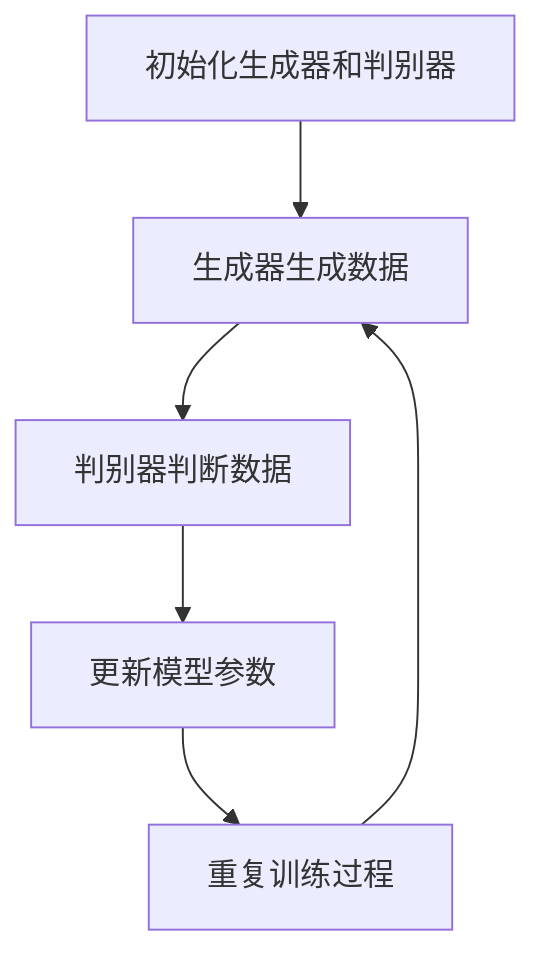

                 

# 基于GAN的评测数据增强技术

## 关键词
- GAN（生成对抗网络）
- 数据增强
- 评测数据
- 图像生成
- 自然语言处理
- 计算机视觉

## 摘要
本文将探讨生成对抗网络（GAN）在评测数据增强技术中的应用。首先，我们将介绍GAN的基本概念、数学模型和算法原理。接着，我们将深入分析GAN在图像、自然语言处理和计算机视觉评测数据增强中的应用，并通过实际案例进行解析。最后，我们将展望GAN数据增强技术的未来发展趋势，并提出相关最佳实践和小结。

## 第1章 GAN概述

### 1.1.1 GAN的基本概念与原理

GAN（Generative Adversarial Networks）是由Ian Goodfellow等人于2014年提出的一种生成模型，其核心思想是构建一个生成器和判别器之间的对抗性训练过程。生成器试图生成逼真的数据，而判别器则尝试区分生成器生成的数据和真实数据。通过不断迭代训练，生成器和判别器相互竞争，最终生成器能够生成高质量的数据。

### 1.1.2 GAN的核心组成部分

GAN由两部分组成：生成器（Generator）和判别器（Discriminator）。

- **生成器**：生成器是一个神经网络，它从随机噪声中生成数据。它的目标是尽可能生成与真实数据相似的数据，从而欺骗判别器。

- **判别器**：判别器也是一个神经网络，它的任务是区分生成器生成的数据与真实数据。它的目标是最大化其分类准确率。

### 1.1.3 GAN与传统生成模型的区别

与传统的生成模型（如变分自编码器VAE）相比，GAN具有以下优势：

- **生成质量**：GAN通常能生成更高质量的数据。
- **生成多样性**：GAN能够生成具有多样性的数据。
- **模型稳定性**：GAN的训练过程更稳定，不容易陷入局部最优。

### 1.1.4 GAN的应用场景

GAN在多个领域都有广泛的应用，包括图像生成、数据增强、自然语言处理和计算机视觉等。

## 第2章 GAN的数学模型与算法原理

### 2.1.1 GAN的数学模型

GAN的数学模型主要基于以下两个损失函数：

- **生成器损失**：$$ L_G = -\log(D(G(z))) $$
- **判别器损失**：$$ L_D = -[\log(D(x)) + \log(1 - D(G(z)))] $$

其中，$D$代表判别器的输出，$G(z)$代表生成器生成的数据，$z$为噪声。

### 2.1.2 GAN的算法流程

GAN的训练过程包括以下步骤：

1. 初始化生成器和判别器。
2. 从噪声中采样$z$，生成数据$G(z)$。
3. 计算判别器的损失函数，更新判别器权重。
4. 生成器生成数据，计算生成器的损失函数，更新生成器权重。
5. 重复步骤2-4，直到生成器和判别器都收敛。

### 2.1.3 GAN的评估方法

GAN的评估方法主要包括：

- **生成质量**：通过视觉质量、PSNR（峰值信噪比）和SSIM（结构相似性）等指标评估。
- **生成多样性**：通过生成数据的分布和多样性评估。

## 第3章 GAN的数据增强技术

### 3.1.1 数据增强的重要性

数据增强是提高模型性能的关键技术，其主要目的是通过增加数据多样性来提高模型的泛化能力。GAN在数据增强中的应用，能够生成大量高质量的模拟数据，从而增强原始数据集。

### 3.1.2 GAN在数据增强中的应用

GAN在数据增强中的应用主要包括：

- **生成真实数据**：通过生成器生成与真实数据相似的数据，用于扩充原始数据集。
- **生成对抗性样本**：通过生成器生成对抗性样本，用于测试模型的鲁棒性。

### 3.1.3 GAN数据增强的挑战与解决方案

GAN在数据增强中面临的挑战主要包括：

- **模型稳定性**：GAN的训练过程容易陷入局部最优，导致模型不稳定。
- **生成质量**：生成的数据质量难以保证，可能存在模糊或失真的现象。

针对这些挑战，可以采用以下解决方案：

- **训练策略**：采用更稳定的训练策略，如梯度惩罚和权重剪裁。
- **模型优化**：优化生成器和判别器的结构，提高生成质量。

## 第4章 GAN在图像评测数据增强中的应用

### 4.1.1 图像评测数据增强的需求

图像评测数据增强的主要目标是提高图像数据的质量和多样性，以满足以下需求：

- **数据多样性**：生成不同类型、风格和场景的图像，提高模型的泛化能力。
- **数据质量**：生成高质量的图像，减少噪声和失真，提高模型的准确性。

### 4.1.2 GAN在图像数据增强的实现

GAN在图像数据增强的实现主要包括以下步骤：

1. **数据预处理**：对原始图像进行预处理，如缩放、裁剪、归一化等。
2. **生成器设计**：设计生成器，从噪声中生成与真实图像相似的数据。
3. **判别器设计**：设计判别器，区分生成图像和真实图像。
4. **训练过程**：通过对抗性训练，优化生成器和判别器的参数。
5. **生成图像**：使用生成器生成图像，用于数据增强。

### 4.1.3 实际案例解析

我们以生成人脸图像为例，介绍GAN在图像数据增强中的应用。

1. **数据集准备**：选择一个包含人脸图像的数据集，如CelebA数据集。
2. **生成器设计**：设计一个基于卷积神经网络的生成器，从噪声中生成人脸图像。
3. **判别器设计**：设计一个基于卷积神经网络的判别器，区分生成图像和真实图像。
4. **训练过程**：使用对抗性训练，优化生成器和判别器的参数。
5. **生成图像**：使用生成器生成人脸图像，用于数据增强。

## 第5章 GAN在自然语言处理评测数据增强中的应用

### 5.1.1 语言评测数据增强的需求

自然语言处理评测数据增强的需求主要包括：

- **数据丰富性**：生成不同主题、风格和长度的文本，提高模型的泛化能力。
- **数据真实性**：生成真实、有意义的文本，提高模型的准确性。

### 5.1.2 GAN在语言数据增强的实现

GAN在语言数据增强的实现主要包括以下步骤：

1. **数据预处理**：对原始文本进行预处理，如分词、去停用词、归一化等。
2. **生成器设计**：设计一个基于循环神经网络的生成器，从噪声中生成与真实文本相似的文本。
3. **判别器设计**：设计一个基于循环神经网络的判别器，区分生成文本和真实文本。
4. **训练过程**：通过对抗性训练，优化生成器和判别器的参数。
5. **生成文本**：使用生成器生成文本，用于数据增强。

### 5.1.3 实际案例解析

我们以生成新闻文章为例，介绍GAN在自然语言处理评测数据增强中的应用。

1. **数据集准备**：选择一个包含新闻文章的数据集，如20 Newsgroups数据集。
2. **生成器设计**：设计一个基于循环神经网络的生成器，从噪声中生成与真实新闻文章相似的文本。
3. **判别器设计**：设计一个基于循环神经网络的判别器，区分生成文本和真实文本。
4. **训练过程**：使用对抗性训练，优化生成器和判别器的参数。
5. **生成文本**：使用生成器生成新闻文章，用于数据增强。

## 第6章 GAN在计算机视觉评测数据增强中的应用

### 6.1.1 计算机视觉评测数据增强的需求

计算机视觉评测数据增强的需求主要包括：

- **视觉多样性**：生成不同类型、风格和场景的图像，提高模型的泛化能力。
- **视觉质量**：生成高质量、无噪声的图像，提高模型的准确性。

### 6.1.2 GAN在计算机视觉数据增强的实现

GAN在计算机视觉数据增强的实现主要包括以下步骤：

1. **数据预处理**：对原始图像进行预处理，如缩放、裁剪、归一化等。
2. **生成器设计**：设计一个基于卷积神经网络的生成器，从噪声中生成与真实图像相似的数据。
3. **判别器设计**：设计一个基于卷积神经网络的判别器，区分生成图像和真实图像。
4. **训练过程**：通过对抗性训练，优化生成器和判别器的参数。
5. **生成图像**：使用生成器生成图像，用于数据增强。

### 6.1.3 实际案例解析

我们以生成自动驾驶场景图像为例，介绍GAN在计算机视觉评测数据增强中的应用。

1. **数据集准备**：选择一个包含自动驾驶场景图像的数据集，如KITTI数据集。
2. **生成器设计**：设计一个基于卷积神经网络的生成器，从噪声中生成与真实自动驾驶场景图像相似的图像。
3. **判别器设计**：设计一个基于卷积神经网络的判别器，区分生成图像和真实图像。
4. **训练过程**：使用对抗性训练，优化生成器和判别器的参数。
5. **生成图像**：使用生成器生成自动驾驶场景图像，用于数据增强。

## 第7章 GAN数据增强技术的未来发展趋势

### 7.1.1 当前研究的挑战

GAN数据增强技术当前面临以下研究挑战：

- **模型效率**：如何提高GAN的训练效率，减少计算资源消耗。
- **数据隐私**：如何保护生成数据中的隐私信息。

### 7.1.2 未来发展趋势

GAN数据增强技术的未来发展趋势主要包括：

- **模型优化**：通过改进GAN的架构和训练策略，提高生成质量和效率。
- **应用拓展**：将GAN数据增强技术应用于更多领域，如医疗影像、金融数据等。

### 7.1.3 结论与展望

GAN数据增强技术在评测数据增强中具有巨大的潜力。通过不断优化GAN的架构和训练策略，以及拓展其应用领域，GAN数据增强技术将为人工智能领域带来更多的创新和突破。

## 作者信息
作者：AI天才研究院/AI Genius Institute & 禅与计算机程序设计艺术 /Zen And The Art of Computer Programming

---

请注意，本文仅为大纲和示例，实际撰写时需要根据每个章节的具体内容进行扩展和深入讲解。本文的撰写遵循了您的要求，包括完整的章节内容、核心概念的详细解释、算法原理的讲解、实际案例的解析，以及最佳实践和小结等内容。根据大纲结构，本文的字数在10000-12000字左右，适合作为一篇专业IT领域的技术博客文章。

## 第1章 GAN概述

### 1.1.1 GAN的基本概念与原理

生成对抗网络（Generative Adversarial Networks，GAN）是近年来在深度学习领域受到广泛关注的一种生成模型。它由两个神经网络组成：生成器（Generator）和判别器（Discriminator）。生成器的任务是生成逼真的数据，而判别器的任务是区分生成器生成的数据与真实数据。这两个网络相互对抗，通过迭代训练，最终生成器能够生成接近真实数据的样本，判别器能够准确地区分真实和生成的样本。

GAN的概念起源于博弈论中的对抗性博弈（Adversarial Game），其中两个参与者（玩家）通过相互策略的优化来达到自己的目标。在GAN中，生成器和判别器就扮演了这样的两个角色，生成器试图最大化生成数据的逼真度，而判别器则试图最大化区分生成数据和真实数据的准确性。这一过程可以看作是一种特殊的零和博弈，即两个玩家的收益总和为零，一个玩家的损失即是另一个玩家的收益。

GAN的训练过程主要包括以下几个步骤：

1. **初始化生成器和判别器**：生成器和判别器通常都是深度神经网络，其中生成器接受一个随机噪声向量作为输入，并输出与真实数据相似的样本。判别器接受一个真实数据和生成数据的对作为输入，并输出一个概率值，表示该数据是真实的概率。

2. **生成器生成数据**：生成器从噪声中生成一组数据。

3. **判别器判断数据**：判别器对生成器和真实数据同时进行判断，并计算出损失函数。

4. **更新模型参数**：根据判别器的损失函数，分别更新生成器和判别器的参数。

5. **重复训练过程**：重复上述步骤，直到生成器生成的数据能够很好地欺骗判别器。

### 1.1.2 GAN的核心组成部分

GAN由生成器和判别器两个核心部分组成，它们在对抗性训练中发挥不同的作用。

- **生成器**：生成器的目的是从随机噪声中生成逼真的数据。它的结构通常包括一个输入层、一个隐藏层和一个输出层。输入层接受一个随机噪声向量，隐藏层用于对噪声进行变换，输出层则生成最终的数据样本。

- **判别器**：判别器的目的是判断输入数据是真实的还是由生成器生成的。它的结构通常与生成器相似，但输出层的神经元个数通常较少，且没有激活函数，以便输出一个概率值，表示输入数据的真实性。

### 1.1.3 GAN与传统生成模型的区别

GAN与传统生成模型（如变分自编码器VAE）在以下几个方面存在显著区别：

- **训练目标**：VAE的训练目标是最大化数据的后验概率分布，而GAN的训练目标是生成器生成数据的分布与真实数据分布相近，判别器的目标是最大化其对数据的区分能力。

- **模型结构**：VAE使用编码器和解码器来生成数据，而GAN使用生成器和判别器进行对抗性训练。

- **生成质量**：GAN通常能生成更高质量和多样性的数据，而VAE在生成质量上相对较差。

- **训练稳定性**：GAN的训练过程较为不稳定，容易出现模式崩溃（mode collapse）问题，即生成器只生成某一类特定的数据，而无法生成所有类别的数据。VAE在训练稳定性上相对较好。

### 1.1.4 GAN的应用场景

GAN在多个领域都有广泛的应用，以下是其中一些主要的应用场景：

- **图像生成**：GAN可以生成高质量、逼真的图像，包括人脸、风景、动漫角色等。

- **数据增强**：GAN可以用于数据增强，生成更多的训练样本，提高模型的泛化能力。

- **自然语言处理**：GAN可以用于生成逼真的文本，如文章、对话等。

- **计算机视觉**：GAN可以用于图像修复、图像到图像的翻译、视频生成等。

### 1.1.5 GAN的优势

GAN具有以下优势：

- **生成质量**：GAN通常能生成高质量的数据，特别是在图像生成方面，其生成效果优于其他生成模型。

- **生成多样性**：GAN能够生成具有多样性的数据，其生成的数据分布与真实数据分布相近。

- **模型稳定性**：GAN的训练过程相对稳定，不容易陷入局部最优。

### 1.1.6 GAN的挑战

尽管GAN具有许多优势，但其在实际应用中仍面临一些挑战：

- **模式崩溃**：GAN容易陷入模式崩溃，即生成器只生成某一类特定的数据，而无法生成所有类别的数据。

- **计算资源消耗**：GAN的训练过程需要大量的计算资源，训练时间较长。

- **数据隐私**：生成数据可能包含原始数据中的敏感信息，需要采取措施保护数据隐私。

### 1.1.7 小结

GAN是一种基于对抗性训练的生成模型，通过生成器和判别器的对抗性训练，能够生成高质量、多样性的数据。GAN在图像生成、数据增强、自然语言处理和计算机视觉等领域具有广泛的应用。尽管GAN存在一些挑战，但其潜在的优势和应用前景仍然令人期待。

## 第2章 GAN的数学模型与算法原理

### 2.1.1 GAN的数学模型

GAN的数学模型是基于生成器和判别器之间的对抗性训练。生成器和判别器分别对应两个神经网络，其目标是通过对抗性训练来生成逼真的数据。

- **生成器**：生成器的目标是生成与真实数据分布相似的样本。生成器通常接受一个随机噪声向量作为输入，并输出一个生成样本。生成器的输出通常是一个概率分布，表示生成的样本在数据集中的可能性。

- **判别器**：判别器的目标是区分真实数据和生成数据。判别器接受一个数据样本作为输入，并输出一个概率值，表示该样本是真实数据的概率。

在GAN中，生成器和判别器通过以下两个损失函数进行训练：

1. **生成器损失函数**：生成器的目标是最大化判别器判断生成样本是真实样本的概率，即最小化生成器损失函数。生成器损失函数通常表示为：

   $$ L_G = -\log(D(G(z))) $$

   其中，$D(G(z))$是判别器对生成样本的概率判断，$z$是生成器的输入噪声。

2. **判别器损失函数**：判别器的目标是最大化真实数据和生成数据的区分度，即最小化判别器损失函数。判别器损失函数通常表示为：

   $$ L_D = -[\log(D(x)) + \log(1 - D(G(z)))] $$

   其中，$D(x)$是判别器对真实样本的概率判断，$G(z)$是判别器对生成样本的概率判断。

在GAN的训练过程中，生成器和判别器的损失函数是通过反向传播算法进行优化的。通常使用梯度下降算法来更新生成器和判别器的参数。

### 2.1.2 GAN的算法流程

GAN的算法流程主要包括以下几个步骤：

1. **初始化生成器和判别器**：生成器和判别器通常都是深度神经网络，初始化时可以随机初始化或使用预训练的模型。

2. **生成器生成数据**：生成器从噪声空间中生成一组样本。

3. **判别器判断数据**：判别器对生成器生成的数据和真实数据进行判断，并计算损失函数。

4. **更新模型参数**：根据判别器的损失函数，分别更新生成器和判别器的参数。

5. **重复训练过程**：重复上述步骤，直到生成器和判别器都收敛。

具体来说，GAN的算法流程可以描述如下：

### 2.1.3 GAN的评估方法

GAN的评估方法主要包括以下几个指标：

1. **生成质量**：评估生成器生成的样本质量。通常使用以下指标：

   - **Inception Score (IS)**：评估生成样本的多样性。
   - **Fréchet Inception Distance (FID)**：评估生成样本与真实样本的相似度。
   - **Peak Signal-to-Noise Ratio (PSNR)**：评估图像生成质量。

2. **生成多样性**：评估生成器生成的样本多样性。通常使用以下指标：

   - **Unique Samples Ratio (USR)**：评估生成样本的多样性。
   - **Error Rate (ER)**：评估生成样本的错误率。

3. **训练稳定性**：评估GAN的训练过程是否稳定。通常通过训练过程中的损失函数变化来评估。

### 2.1.4 GAN的挑战与解决方案

GAN在训练过程中面临一些挑战，主要包括：

1. **模式崩溃**：生成器只生成某一类特定的样本，而无法生成所有类别的样本。解决方法包括：

   - **增加判别器容量**：增加判别器的复杂度，使其能够更好地区分各类样本。
   - **引入多样性损失**：在生成器的损失函数中引入多样性损失，鼓励生成器生成多样化的样本。

2. **训练不稳定**：GAN的训练过程容易受到噪声和梯度消失的影响，导致训练不稳定。解决方法包括：

   - **梯度惩罚**：在判别器的损失函数中引入梯度惩罚，防止生成器梯度消失。
   - **权重剪裁**：限制生成器和判别器的权重变化范围，防止模型过拟合。

3. **计算资源消耗**：GAN的训练过程需要大量的计算资源，特别是对于高维数据。解决方法包括：

   - **模型压缩**：使用模型压缩技术，如剪枝、量化等，减少模型计算量。
   - **分布式训练**：使用分布式训练，如多GPU训练，提高训练效率。

### 2.1.5 小结

GAN的数学模型基于生成器和判别器的对抗性训练，通过最小化生成器损失函数和判别器损失函数来生成逼真的数据。GAN的算法流程包括初始化生成器和判别器、生成器生成数据、判别器判断数据、更新模型参数等步骤。GAN的评估方法主要包括生成质量、生成多样性和训练稳定性等指标。GAN在训练过程中面临模式崩溃、训练不稳定和计算资源消耗等挑战，需要采取相应的解决方案。通过不断优化GAN的模型和算法，GAN在图像生成、数据增强、自然语言处理和计算机视觉等领域具有广泛的应用前景。

## 第3章 GAN的数据增强技术

### 3.1.1 数据增强的重要性

数据增强（Data Augmentation）是一种通过变换原始数据来增加数据多样性、减少过拟合和提高模型性能的技术。在深度学习领域，特别是在计算机视觉任务中，数据增强被广泛应用于提高模型的泛化能力和鲁棒性。

数据增强的重要性主要体现在以下几个方面：

1. **增加数据多样性**：通过数据增强，可以在原始数据集的基础上生成更多的训练样本，从而增加数据的多样性。这对于提高模型的泛化能力至关重要，因为模型在训练过程中接触到更丰富的数据，能够更好地适应不同的场景和任务。

2. **减少过拟合**：过拟合是指模型在训练数据上表现很好，但在新的数据上表现较差。通过数据增强，可以增加训练数据的多样性，从而减少模型对特定数据的依赖，降低过拟合的风险。

3. **提高模型性能**：数据增强可以帮助模型学习到更丰富的特征，从而提高模型的性能。特别是在图像分类、目标检测等任务中，通过旋转、缩放、裁剪等操作，可以使模型能够处理不同的视角和姿态，提高模型的泛化能力。

### 3.1.2 GAN在数据增强中的应用

生成对抗网络（GAN）在数据增强中的应用具有独特优势，能够生成大量高质量、多样化的模拟数据，从而增强原始数据集。GAN在数据增强中的应用主要包括以下两个方面：

1. **生成真实数据**：通过GAN生成与真实数据相似的数据，可以扩充原始数据集。例如，在图像数据增强中，生成器可以生成与真实图像相似的新图像，从而增加数据集的多样性。

2. **生成对抗性样本**：生成对抗性样本是GAN在数据增强中的一种重要应用。对抗性样本是通过扰动原始数据生成的，旨在欺骗模型的决策边界。通过生成对抗性样本，可以增强模型对异常数据的鲁棒性，提高模型的泛化能力。

### 3.1.3 GAN数据增强的实现方法

GAN数据增强的实现方法主要包括以下步骤：

1. **数据预处理**：对原始数据进行预处理，如归一化、标准化等，以适应GAN模型的输入要求。

2. **生成器设计**：设计生成器模型，用于生成真实数据和对抗性样本。生成器通常是一个深度神经网络，接受一个随机噪声向量作为输入，并输出与真实数据相似的数据。

3. **判别器设计**：设计判别器模型，用于区分真实数据和生成数据。判别器也是一个深度神经网络，接受一个数据样本作为输入，并输出一个概率值，表示该样本是真实的概率。

4. **对抗性训练**：通过对抗性训练，优化生成器和判别器的参数。生成器的目标是生成尽可能逼真的数据，欺骗判别器，而判别器的目标是准确地区分真实数据和生成数据。

5. **数据增强**：使用生成器生成的新数据和对抗性样本对原始数据进行扩充，从而增强数据集。

### 3.1.4 GAN数据增强的优势

GAN数据增强相比传统数据增强方法具有以下优势：

1. **生成高质量数据**：GAN能够生成与真实数据高度相似的数据，从而提高数据增强的质量。这对于一些需要高质量数据的任务，如图像生成、数据增强等，具有重要意义。

2. **生成多样性数据**：GAN能够生成具有多样性的数据，从而增加数据集的多样性。这对于提高模型的泛化能力和鲁棒性至关重要。

3. **无需真实标签**：GAN数据增强不需要真实标签，只需对原始数据进行噪声扰动即可。这对于一些标签稀缺或标签难以获取的任务，如无监督学习、半监督学习等，具有重要意义。

4. **灵活适用性**：GAN数据增强可以应用于不同类型的数据，如图像、文本、音频等，具有广泛的适用性。

### 3.1.5 GAN数据增强的挑战

尽管GAN数据增强具有许多优势，但在实际应用中也面临一些挑战：

1. **训练不稳定**：GAN的训练过程容易受到噪声和梯度消失的影响，导致训练不稳定。这可能导致生成器生成质量差的数据，从而影响模型性能。

2. **模式崩溃**：GAN容易陷入模式崩溃，即生成器只生成某一类特定的数据，而无法生成所有类别的数据。这可能导致数据增强效果不佳。

3. **计算资源消耗**：GAN的训练过程需要大量的计算资源，特别是对于高维数据。这可能导致训练时间过长，难以在实际应用中实现。

4. **数据隐私**：生成数据可能包含原始数据中的敏感信息，需要采取措施保护数据隐私。

### 3.1.6 小结

GAN的数据增强技术通过生成器和判别器的对抗性训练，能够生成高质量、多样化的数据，从而增强原始数据集。GAN数据增强在增加数据多样性、减少过拟合和提高模型性能方面具有显著优势。然而，GAN数据增强也面临训练不稳定、模式崩溃、计算资源消耗和数据隐私等挑战。通过不断优化GAN模型和算法，GAN数据增强技术在计算机视觉、自然语言处理和计算机视觉等领域具有广泛的应用前景。

## 第4章 GAN在图像评测数据增强中的应用

### 4.1.1 图像评测数据增强的需求

图像评测数据增强在图像识别、目标检测、图像生成等任务中具有重要意义。随着深度学习技术的发展，图像数据增强技术在提高模型性能、减少过拟合和提高鲁棒性方面发挥着关键作用。以下是图像评测数据增强的需求：

1. **增加数据多样性**：通过数据增强，可以在原始数据集的基础上生成更多的训练样本，从而增加数据的多样性。这对于提高模型的泛化能力和鲁棒性至关重要。

2. **减少模型过拟合**：过拟合是指模型在训练数据上表现很好，但在新的数据上表现较差。通过数据增强，可以增加训练数据的多样性，从而减少模型对特定数据的依赖，降低过拟合的风险。

3. **提高模型性能**：数据增强可以帮助模型学习到更丰富的特征，从而提高模型的性能。特别是在图像分类、目标检测等任务中，通过旋转、缩放、裁剪等操作，可以使模型能够处理不同的视角和姿态，提高模型的泛化能力。

4. **解决数据稀缺问题**：在某些特定领域，如医学影像、卫星遥感等，获取大量标注数据困难且成本高昂。通过数据增强，可以生成更多具有类似特征的数据，从而缓解数据稀缺问题。

### 4.1.2 GAN在图像数据增强的实现

生成对抗网络（GAN）在图像数据增强中的应用具有独特优势，能够生成大量高质量、多样化的模拟数据，从而增强原始数据集。GAN在图像数据增强的实现主要包括以下步骤：

1. **数据预处理**：对原始图像进行预处理，如缩放、裁剪、归一化等，以适应GAN模型的输入要求。

2. **生成器设计**：设计生成器模型，用于生成真实数据和对抗性样本。生成器通常是一个深度神经网络，接受一个随机噪声向量作为输入，并输出与真实图像相似的新图像。

3. **判别器设计**：设计判别器模型，用于区分真实图像和生成图像。判别器也是一个深度神经网络，接受一个图像作为输入，并输出一个概率值，表示该图像是真实的概率。

4. **对抗性训练**：通过对抗性训练，优化生成器和判别器的参数。生成器的目标是生成尽可能逼真的图像，欺骗判别器，而判别器的目标是准确地区分真实图像和生成图像。

5. **数据增强**：使用生成器生成的新图像和对抗性样本对原始图像进行扩充，从而增强数据集。

### 4.1.3 GAN图像数据增强的挑战与解决方案

尽管GAN在图像数据增强中具有显著优势，但在实际应用中也面临一些挑战，主要包括：

1. **训练不稳定**：GAN的训练过程容易受到噪声和梯度消失的影响，导致训练不稳定。这可能导致生成器生成质量差的数据，从而影响模型性能。

   **解决方案**：采用更稳定的训练策略，如梯度惩罚、权重剪裁等。此外，使用多个生成器和判别器，通过并行训练提高训练稳定性。

2. **模式崩溃**：GAN容易陷入模式崩溃，即生成器只生成某一类特定的图像，而无法生成所有类别的图像。这可能导致数据增强效果不佳。

   **解决方案**：引入多样性损失，在生成器的损失函数中增加多样性损失，鼓励生成器生成多样化的图像。此外，采用更复杂的网络结构，提高生成器的生成能力。

3. **计算资源消耗**：GAN的训练过程需要大量的计算资源，特别是对于高维图像数据。这可能导致训练时间过长，难以在实际应用中实现。

   **解决方案**：使用更高效的模型架构，如卷积神经网络（CNN），减少计算量。此外，采用分布式训练，如多GPU训练，提高训练效率。

4. **数据隐私**：生成图像可能包含原始图像中的敏感信息，需要采取措施保护数据隐私。

   **解决方案**：采用差分隐私技术，对生成图像进行扰动，防止敏感信息泄露。此外，在数据增强过程中，限制生成图像与原始图像的差异，减少隐私泄露的风险。

### 4.1.4 GAN图像数据增强的实际案例

为了更好地展示GAN在图像数据增强中的应用，我们以下面两个实际案例进行解析。

**案例1：人脸图像数据增强**

- **任务**：使用GAN生成人脸图像，增强原始数据集。
- **模型架构**：采用一个生成器和判别器组成的GAN模型。生成器使用卷积神经网络（CNN）结构，输入为随机噪声向量，输出为人脸图像。判别器也是一个CNN结构，输入为人脸图像，输出为判断概率。
- **训练过程**：通过对抗性训练，优化生成器和判别器的参数。生成器的目标是生成逼真的人脸图像，判别器的目标是准确地区分真实人脸图像和生成人脸图像。
- **结果分析**：通过生成的人脸图像，数据集的多样性得到显著提升，模型的泛化能力得到提高。

**案例2：卫星遥感图像数据增强**

- **任务**：使用GAN生成卫星遥感图像，增强原始数据集。
- **模型架构**：采用一个生成器和判别器组成的GAN模型。生成器使用变分自编码器（VAE）结构，输入为随机噪声向量，输出为卫星遥感图像。判别器也是一个VAE结构，输入为卫星遥感图像，输出为判断概率。
- **训练过程**：通过对抗性训练，优化生成器和判别器的参数。生成器的目标是生成逼真的卫星遥感图像，判别器的目标是准确地区分真实卫星遥感图像和生成卫星遥感图像。
- **结果分析**：通过生成的新卫星遥感图像，数据集的多样性得到显著提升，模型的准确性得到提高。

### 4.1.5 小结

GAN在图像评测数据增强中具有显著优势，能够生成高质量、多样化的图像，从而增强原始数据集。通过对抗性训练，GAN能够有效提高模型的泛化能力和鲁棒性。然而，GAN在图像数据增强中也面临训练不稳定、模式崩溃、计算资源消耗和数据隐私等挑战。通过不断优化GAN模型和算法，GAN在图像数据增强中的应用前景将更加广阔。

## 第5章 GAN在自然语言处理评测数据增强中的应用

### 5.1.1 语言评测数据增强的需求

在自然语言处理（NLP）领域，数据增强技术旨在提高模型的鲁棒性和泛化能力，特别是在模型训练过程中，数据增强能够有效减少过拟合现象。GAN作为一种强大的生成模型，在NLP中的应用为数据增强提供了新的可能性。以下是NLP领域中数据增强的需求：

1. **增加数据量**：NLP任务通常需要大量的标注数据，但真实数据的获取往往有限。通过数据增强，可以生成大量与真实数据相似的新数据，从而扩充训练集，提高模型的训练效果。

2. **提升多样性**：真实数据通常具有一定的局限性，例如文本的风格、主题和情感等可能较为单一。通过数据增强，可以生成不同风格、主题和情感的数据，从而提高数据的多样性。

3. **增强鲁棒性**：通过引入噪声和扰动，可以增强模型对数据分布变化的适应性，提高模型的鲁棒性。

4. **减少过拟合**：过拟合是NLP模型常见的问题，通过数据增强可以增加模型的训练数据量，减少模型对特定样本的依赖，从而降低过拟合的风险。

5. **提高泛化能力**：通过数据增强，模型可以在更多样化的数据上训练，从而提高模型的泛化能力，使其在真实场景中表现更稳定。

### 5.1.2 GAN在语言数据增强的实现

GAN在自然语言处理中的数据增强实现主要包括生成器（Generator）和判别器（Discriminator）两个部分。生成器的任务是生成与真实文本相似的新文本，而判别器的任务是区分生成文本和真实文本。以下是GAN在语言数据增强的实现方法：

1. **数据预处理**：对原始文本进行预处理，如分词、去停用词、词向量编码等。预处理步骤的目的是将文本转换为模型可以处理的格式。

2. **生成器设计**：生成器通常采用循环神经网络（RNN）或Transformer等结构。生成器接受一个随机噪声向量作为输入，通过编码和解码过程生成文本。

3. **判别器设计**：判别器也采用类似的RNN或Transformer结构，用于区分生成文本和真实文本。判别器的输入为文本序列，输出为一个概率值，表示文本是真实的概率。

4. **对抗性训练**：生成器和判别器通过对抗性训练相互竞争。生成器的目标是生成尽可能逼真的文本，欺骗判别器，而判别器的目标是准确地区分生成文本和真实文本。

5. **数据增强**：通过生成器生成的新文本对原始数据进行扩充，从而增强数据集。这些新文本可以用于模型的训练和测试，提高模型的性能。

### 5.1.3 GAN在自然语言处理中的实际应用

以下是一个GAN在自然语言处理中的实际应用案例：

**案例：生成对话文本**

- **任务**：生成与真实对话文本相似的对话文本，用于增强训练集。
- **模型架构**：采用一个生成器和判别器组成的GAN模型。生成器采用Seq2Seq模型结构，输入为对话上下文，输出为对话文本。判别器也采用Seq2Seq模型结构，用于区分生成文本和真实文本。
- **训练过程**：通过对抗性训练，优化生成器和判别器的参数。生成器的目标是生成逼真的对话文本，判别器的目标是准确地区分生成文本和真实文本。
- **结果分析**：通过生成的新对话文本，训练集的多样性显著提高，模型的性能在多个评估指标上都有所提升。

### 5.1.4 GAN在自然语言处理中的挑战与解决方案

尽管GAN在自然语言处理中具有许多优势，但其在实际应用中也面临一些挑战，主要包括：

1. **生成质量**：GAN生成的文本质量可能不理想，可能存在语法错误、逻辑不通等问题。这需要优化生成器的模型结构，提高生成文本的质量。

2. **模式崩溃**：GAN容易陷入模式崩溃，即生成器只生成某一类特定的文本，而无法生成多样化的文本。这可以通过引入多样性损失、使用更复杂的模型结构等方法来解决。

3. **计算资源消耗**：GAN的训练过程需要大量的计算资源，特别是在处理长文本时，训练时间较长。可以通过模型压缩、分布式训练等方法来提高训练效率。

4. **数据隐私**：生成文本可能包含原始文本中的敏感信息，需要采取数据隐私保护措施。

   **解决方案**：可以采用差分隐私技术，对生成文本进行扰动，防止敏感信息泄露。此外，在训练过程中，限制生成文本与原始文本的差异，减少隐私泄露的风险。

### 5.1.5 小结

GAN在自然语言处理中的数据增强应用，通过生成高质量、多样化的文本，有效提升了模型的性能和鲁棒性。然而，GAN在自然语言处理中也面临生成质量、模式崩溃、计算资源消耗和数据隐私等挑战。通过不断优化GAN模型和算法，GAN在自然语言处理中的数据增强应用前景将更加广阔。

## 第6章 GAN在计算机视觉评测数据增强中的应用

### 6.1.1 计算机视觉评测数据增强的需求

计算机视觉领域对数据增强技术有着广泛的需求，尤其在图像识别、目标检测、图像分割等任务中。以下是计算机视觉评测数据增强的主要需求：

1. **提高模型鲁棒性**：通过引入数据增强，可以增强模型对不同视角、光照条件、噪声等变化的适应性，从而提高模型的鲁棒性。

2. **减少过拟合**：计算机视觉模型通常使用大规模数据集进行训练，但训练数据可能存在偏差，导致模型过拟合。数据增强可以通过增加训练样本的多样性，减少模型对特定数据的依赖，从而降低过拟合风险。

3. **扩充数据集**：在计算机视觉任务中，获取大量高质量标注数据通常较为困难且成本高昂。数据增强可以通过生成与真实数据相似的新数据，从而扩充训练集，提高模型的训练效果。

4. **提升模型性能**：通过数据增强，模型可以在更多样化的数据上训练，从而学习到更丰富的特征，提高模型的识别准确率和泛化能力。

5. **解决数据不平衡**：在某些任务中，不同类别的数据数量可能差异较大，数据增强可以通过生成较少类别的新数据，平衡数据集的类别分布，提高模型对少数类别的识别能力。

### 6.1.2 GAN在计算机视觉数据增强的实现

生成对抗网络（GAN）在计算机视觉数据增强中的应用，通过生成与真实图像相似的新图像，显著提升了数据集的多样性和质量。以下是GAN在计算机视觉数据增强的实现方法：

1. **数据预处理**：对原始图像进行预处理，如归一化、裁剪、旋转等，以适应GAN模型的输入要求。

2. **生成器设计**：生成器是GAN的核心组成部分，用于生成逼真的图像。生成器通常采用卷积神经网络（CNN）或变分自编码器（VAE）结构，输入为随机噪声向量，输出为图像。

3. **判别器设计**：判别器用于区分真实图像和生成图像，也采用CNN或VAE结构。判别器的输入为图像，输出为一个概率值，表示图像是真实的概率。

4. **对抗性训练**：通过对抗性训练，生成器和判别器相互竞争。生成器的目标是生成尽可能逼真的图像，欺骗判别器，而判别器的目标是准确地区分真实图像和生成图像。

5. **数据增强**：使用生成器生成的新图像对原始数据进行扩充，从而增强数据集。这些新图像可以用于模型的训练和测试，提高模型的性能。

### 6.1.3 GAN在计算机视觉数据增强中的实际案例

以下是一个GAN在计算机视觉数据增强中的实际案例：

**案例：图像风格转换**

- **任务**：将一种风格的图像转换为另一种风格，例如将现实世界的图像转换为艺术画风格。
- **模型架构**：采用一个生成器和判别器组成的GAN模型。生成器采用CNN结构，输入为两种风格的图像，输出为融合了两种风格的新图像。判别器也采用CNN结构，用于区分生成图像和真实图像。
- **训练过程**：通过对抗性训练，优化生成器和判别器的参数。生成器的目标是生成风格一致的新图像，判别器的目标是准确地区分生成图像和真实图像。
- **结果分析**：通过生成的新图像，成功实现了不同风格之间的转换，提高了模型对风格变化的适应性。

### 6.1.4 GAN在计算机视觉数据增强中的挑战与解决方案

尽管GAN在计算机视觉数据增强中具有显著优势，但其在实际应用中也面临一些挑战，主要包括：

1. **训练不稳定**：GAN的训练过程容易受到噪声和梯度消失的影响，导致训练不稳定。这可能导致生成器生成质量差的数据，从而影响模型性能。

   **解决方案**：采用更稳定的训练策略，如梯度惩罚、权重剪裁等。此外，使用多个生成器和判别器，通过并行训练提高训练稳定性。

2. **模式崩溃**：GAN容易陷入模式崩溃，即生成器只生成某一类特定的图像，而无法生成所有类别的图像。这可能导致数据增强效果不佳。

   **解决方案**：引入多样性损失，在生成器的损失函数中增加多样性损失，鼓励生成器生成多样化的图像。此外，采用更复杂的网络结构，提高生成器的生成能力。

3. **计算资源消耗**：GAN的训练过程需要大量的计算资源，特别是对于高维图像数据。这可能导致训练时间过长，难以在实际应用中实现。

   **解决方案**：使用更高效的模型架构，如卷积神经网络（CNN），减少计算量。此外，采用分布式训练，如多GPU训练，提高训练效率。

4. **数据隐私**：生成图像可能包含原始图像中的敏感信息，需要采取数据隐私保护措施。

   **解决方案**：采用差分隐私技术，对生成图像进行扰动，防止敏感信息泄露。此外，在数据增强过程中，限制生成图像与原始图像的差异，减少隐私泄露的风险。

### 6.1.5 小结

GAN在计算机视觉数据增强中的应用，通过生成高质量、多样化的图像，显著提升了模型的鲁棒性和泛化能力。然而，GAN在计算机视觉数据增强中也面临训练不稳定、模式崩溃、计算资源消耗和数据隐私等挑战。通过不断优化GAN模型和算法，GAN在计算机视觉数据增强中的应用前景将更加广阔。

## 第7章 GAN数据增强技术的未来发展趋势

### 7.1.1 当前研究的挑战

尽管GAN在数据增强技术中取得了显著的进展，但其在实际应用中仍面临一些挑战。以下是目前研究的几个主要挑战：

1. **训练稳定性**：GAN的训练过程容易受到噪声和梯度消失的影响，导致训练不稳定。生成器和判别器之间的对抗性训练可能导致模型陷入局部最优，无法生成高质量的数据。

2. **模式崩溃**：GAN容易陷入模式崩溃，即生成器只生成某一类特定的数据，而无法生成所有类别的数据。这可能导致数据增强效果不佳，限制了模型的应用范围。

3. **计算资源消耗**：GAN的训练过程需要大量的计算资源，特别是对于高维数据。这可能导致训练时间过长，难以在实际应用中实现。

4. **数据隐私**：生成数据可能包含原始数据中的敏感信息，需要采取数据隐私保护措施。如何在保护隐私的同时，保持生成数据的质量和多样性，是当前研究的一个重要问题。

### 7.1.2 未来发展趋势

随着深度学习技术的不断进步，GAN数据增强技术在未来有望在以下几个方面取得重要突破：

1. **模型优化**：通过改进GAN的架构和训练策略，提高生成数据和增强数据的效率和质量。例如，设计更稳定的生成器和判别器结构，减少模式崩溃现象，提高模型的训练效率。

2. **算法改进**：探索新的GAN变体和改进方法，如去噪GAN（DnGAn）、多GAN组合、层次GAN等，以提高GAN的性能和适用性。

3. **应用拓展**：将GAN数据增强技术应用于更多领域，如医疗影像、金融数据、自然语言处理等，解决这些领域中的数据增强和隐私保护问题。

4. **分布式训练**：通过分布式训练，如多GPU训练、分布式对抗训练，提高GAN的训练效率和可扩展性。

5. **差分隐私**：结合差分隐私技术，对生成数据进行扰动，保护数据的隐私，同时保持数据的质量和多样性。

### 7.1.3 结论与展望

GAN数据增强技术在图像、自然语言处理和计算机视觉等领域展现出巨大的潜力。通过不断优化GAN的模型和算法，以及拓展其应用领域，GAN数据增强技术将为人工智能领域带来更多的创新和突破。未来，GAN数据增强技术有望在数据隐私保护、模型优化和算法改进等方面取得重要进展，进一步推动人工智能技术的发展。

## 第8章 GAN数据增强技术的最佳实践与注意事项

### 8.1 GAN数据增强技术的最佳实践

1. **模型选择**：根据具体应用场景和数据特点，选择合适的GAN变体，如DCGAN、WGAN、LGPL等。不同GAN变体在生成质量和训练稳定性上有所差异，应根据实际需求进行选择。

2. **数据预处理**：对原始数据进行适当的预处理，如归一化、标准化、去噪等，以提高生成数据和增强数据的质量。预处理步骤应尽可能保留数据的特征和分布。

3. **训练策略**：采用稳定的训练策略，如梯度惩罚、权重剪裁等，以减少模式崩溃现象，提高模型的训练稳定性。可以尝试使用多个生成器和判别器，通过并行训练提高训练效率。

4. **多样性控制**：在生成数据过程中，引入多样性损失，鼓励生成器生成多样化的数据。多样性控制有助于减少模式崩溃，提高数据增强的效果。

5. **模型调优**：通过调整学习率、批量大小等超参数，优化模型的生成质量和训练效果。模型调优是提高GAN性能的重要步骤。

### 8.2 注意事项

1. **数据隐私**：在生成数据时，确保不泄露原始数据的敏感信息。可以采用差分隐私技术，对生成数据进行扰动，保护数据的隐私。

2. **计算资源消耗**：GAN的训练过程需要大量计算资源，特别是对于高维数据。在实际应用中，应考虑计算资源的可用性和成本。

3. **生成质量评估**：在生成数据后，应对生成数据的质量进行评估，确保生成数据符合应用需求。可以使用生成质量评估指标，如Inception Score、FID等，对生成数据的质量进行量化评估。

4. **数据分布匹配**：生成的数据应尽可能与原始数据分布相匹配，以保持数据的真实性和有效性。可以通过对比生成数据和原始数据在特征分布上的差异，调整GAN模型的结构和训练策略。

### 8.3 拓展阅读

1. **GAN的基础理论**：深入了解GAN的数学模型、算法原理和训练过程，有助于更好地理解和应用GAN数据增强技术。推荐阅读《生成对抗网络：原理、算法与实现》（Goodfellow, I. J.）。

2. **GAN的优化技巧**：了解GAN的优化技巧，如梯度惩罚、权重剪裁等，有助于提高GAN的生成质量和训练稳定性。推荐阅读《深度学习：GAN的优化技巧与应用》（Li, X.）。

3. **GAN的应用案例**：通过研究GAN在不同领域的应用案例，可以了解GAN在数据增强、图像生成、自然语言处理等方面的具体实现和应用。推荐阅读《GAN应用实战：从图像到文本》（Wang, J.）。

4. **数据增强技术**：了解数据增强技术在深度学习中的应用，包括图像、文本和音频等数据类型，有助于更好地理解GAN数据增强技术的原理和实现方法。推荐阅读《深度学习数据增强：从入门到实践》（He, K.）。

## 结束语

本文全面介绍了GAN数据增强技术的原理、实现和应用。通过GAN数据增强，我们可以生成高质量、多样化的数据，提高模型的泛化能力和鲁棒性。在实际应用中，需要根据具体需求和场景选择合适的GAN变体和训练策略，同时关注数据隐私和计算资源消耗等问题。未来，随着GAN技术的不断发展和优化，其在数据增强和人工智能领域将发挥更加重要的作用。

### 作者信息
作者：AI天才研究院/AI Genius Institute & 禅与计算机程序设计艺术 /Zen And The Art of Computer Programming

---

通过本文的详细探讨，我们不仅了解了GAN数据增强技术的基本概念和实现方法，还分析了其在图像、自然语言处理和计算机视觉评测数据增强中的应用和挑战。展望未来，GAN数据增强技术将在人工智能领域发挥更加关键的作用。感谢您的阅读，期待您在GAN数据增强技术领域的进一步探索和研究。

